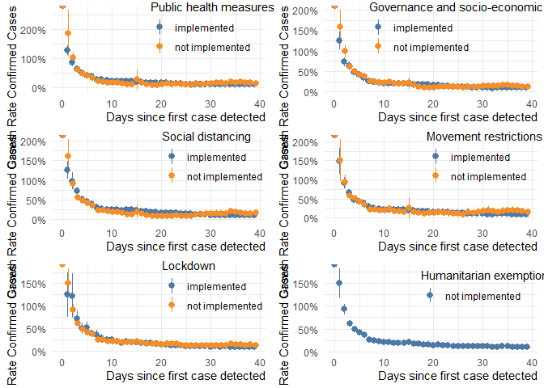
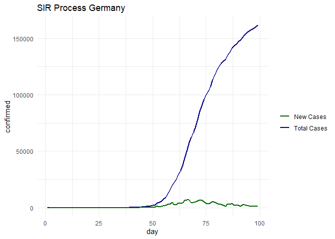
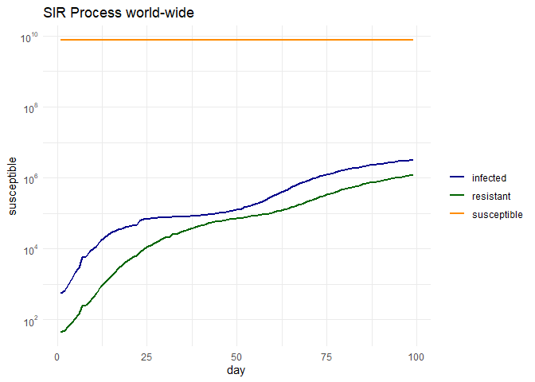
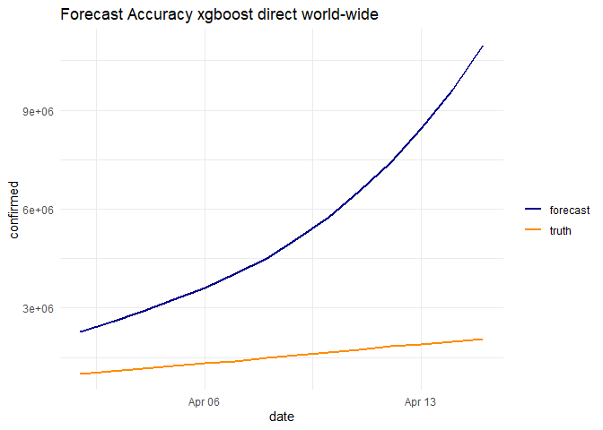
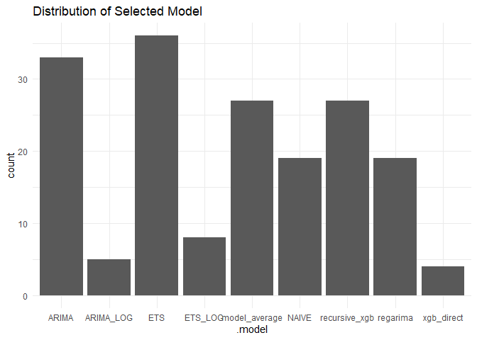
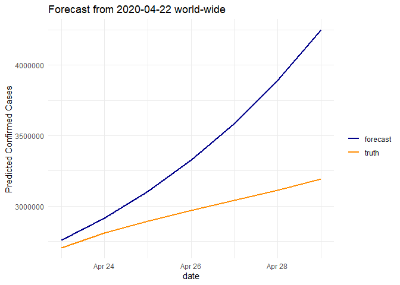

# Libraries and  Raw Data

```r
library(googleVis)
op <- options(gvis.plot.tag='chart')
library(lubridate)
library(fpp3)
library(tidyverse)
library(tsibble)
library(feasts)
library(ggplot2)
library(WDI)
library(DataExplorer)
library(recipes)
library(tidymodels)
library(scales)
library(gridExtra)
library(highcharter)
library(GGally)
library(corrplot)
library(ggthemes)
library(zoo)
library(anomalize)
library(vip)
library(tidycovid19)
library(usethis)
library(htmltools)
use_git_config(user.name = "Bastien90", user.email = "bastienhaller@web.de")

theme_set(theme_minimal())

#setting parameters
sub_set <- FALSE # only train on subset of the data
retrain_ts <- TRUE # retrain time series models#
train_challenger <- FALSE #train a challenger model once a week

covid <- read_csv("data/covid19.csv")

#download new data if available
if(max(covid$date) < today() -days(1) ){

  covid_new <- tidycovid19::download_jhu_csse_covid19_data()
  
  #additional check
  if(nrow(covid_new) > nrow(covid)){
  covid <- covid_new
  rm(covid_new)
  write_csv(covid, "data/covid19.csv")
  }
}

paste0("period covered: ", min(covid$date), " - ", max(covid$date)) %>% print()
```

```
## [1] "period covered: 2020-01-22 - 2020-04-29"
```

```r
#Goal to predict last two weeks
period <- 14

train <- covid %>% filter(date <= max(date) - days(14))

test <- covid %>% filter(date > max(date) - days(14))

paste0("train: ", min(train$date), " - ", max(train$date)) %>% print()
```

```
## [1] "train: 2020-01-22 - 2020-04-15"
```

```r
paste0("test: ", min(test$date), " - ", max(test$date)) %>% print()
```

```
## [1] "test: 2020-04-16 - 2020-04-29"
```

```r
set.seed(123)
sampled_id <- unique(train$country )[sample(1 : length(unique(train$country)), 10)]
sampled_id <- c(sampled_id, "Italy", "France", "Germany", "Sweden", "US", "Thailand", "China", "Afghanistan")

if(sub_set){
train <- train %>% filter(country %in% sampled_id)

test <- test %>% filter(country %in% sampled_id)
}
```

# EDA and Additional World Bank Data


```r
#First detected case
day_of_first_case <-  train %>%
  filter(confirmed > 0) %>%
  group_by(iso3c) %>%
  summarise(day_of_first_case = min(date)) %>%
  ungroup()

train <- train %>%
         inner_join(day_of_first_case, by = "iso3c") %>%
          mutate(
          days_since_first_case = as.numeric(difftime(date, day_of_first_case, units ="days")),
          days_since_first_case =ifelse(days_since_first_case < 0, -1, days_since_first_case),
          days_since_global_outbreak  = as.numeric(difftime(date, min(date), units ="days")))


test <- test %>%
         inner_join(day_of_first_case, by = "iso3c") %>%
          mutate(
          days_since_first_case = as.numeric(difftime(date, day_of_first_case, units ="days")),
          days_since_first_case =ifelse(days_since_first_case < 0, -1, days_since_first_case),
          days_since_global_outbreak  = as.numeric(difftime(date, min(date), units ="days")))


train %>% filter(confirmed > 0) %>%
hchart(., "line", hcaes(x = days_since_first_case, y = confirmed, group = country)) %>%
list() %>%
htmltools::tagList(.)  
```

<!--html_preserve--><div id="htmlwidget-595affc4f25ab85bf888" style="width:100%;height:500px;" class="highchart html-widget"></div>
<script type="application/json" data-for="htmlwidget-595affc4f25ab85bf888">{"x":{"hc_opts":{"title":{"text":null},"yAxis":{"title":{"text":"confirmed"},"type":"linear"},"credits":{"enabled":false},"exporting":{"enabled":false},"plotOptions":{"series":{"label":{"enabled":false},"turboThreshold":0,"showInLegend":true},"treemap":{"layoutAlgorithm":"squarified"},"scatter":{"marker":{"symbol":"circle"}}},"series":[{"name":"Afghanistan","data":[{"country":"Afghanistan","iso3c":"AFG","date":"2020-02-24","confirmed":1,"deaths":0,"recovered":0,"timestamp":"2020-04-30T06:49:01Z","day_of_first_case":"2020-02-24","days_since_first_case":0,"days_since_global_outbreak":33,"x":0,"y":1},{"country":"Afghanistan","iso3c":"AFG","date":"2020-02-25","confirmed":1,"deaths":0,"recovered":0,"timestamp":"2020-04-30T06:49:01Z","day_of_first_case":"2020-02-24","days_since_first_case":1,"days_since_global_outbreak":34,"x":1,"y":1},{"country":"Afghanistan","iso3c":"AFG","date":"2020-02-26","confirmed":1,"deaths":0,"recovered":0,"timestamp":"2020-04-30T06:49:01Z","day_of_first_case":"2020-02-24","days_since_first_case":2,"days_since_global_outbreak":35,"x":2,"y":1},{"country":"Afghanistan","iso3c":"AFG","date":"2020-02-27","confirmed":1,"deaths":0,"recovered":0,"timestamp":"2020-04-30T06:49:01Z","day_of_first_case":"2020-02-24","days_since_first_case":3,"days_since_global_outbreak":36,"x":3,"y":1},{"country":"Afghanistan","iso3c":"AFG","date":"2020-02-28","confirmed":1,"deaths":0,"recovered":0,"timestamp":"2020-04-30T06:49:01Z","day_of_first_case":"2020-02-24","days_since_first_case":4,"days_since_global_outbreak":37,"x":4,"y":1},{"country":"Afghanistan","iso3c":"AFG","date":"2020-02-29","confirmed":1,"deaths":0,"recovered":0,"timestamp":"2020-04-30T06:49:01Z","day_of_first_case":"2020-02-24","days_since_first_case":5,"days_since_global_outbreak":38,"x":5,"y":1},{"country":"Afghanistan","iso3c":"AFG","date":"2020-03-01","confirmed":1,"deaths":0,"recovered":0,"timestamp":"2020-04-30T06:49:01Z","day_of_first_case":"2020-02-24","days_since_first_case":6,"days_since_global_outbreak":39,"x":6,"y":1},{"country":"Afghanistan","iso3c":"AFG","date":"2020-03-02","confirmed":1,"deaths":0,"recovered":0,"timestamp":"2020-04-30T06:49:01Z","day_of_first_case":"2020-02-24","days_since_first_case":7,"days_since_global_outbreak":40,"x":7,"y":1},{"country":"Afghanistan","iso3c":"AFG","date":"2020-03-03","confirmed":1,"deaths":0,"recovered":0,"timestamp":"2020-04-30T06:49:01Z","day_of_first_case":"2020-02-24","days_since_first_case":8,"days_since_global_outbreak":41,"x":8,"y":1},{"country":"Afghanistan","iso3c":"AFG","date":"2020-03-04","confirmed":1,"deaths":0,"recovered":0,"timestamp":"2020-04-30T06:49:01Z","day_of_first_case":"2020-02-24","days_since_first_case":9,"days_since_global_outbreak":42,"x":9,"y":1},{"country":"Afghanistan","iso3c":"AFG","date":"2020-03-05","confirmed":1,"deaths":0,"recovered":0,"timestamp":"2020-04-30T06:49:01Z","day_of_first_case":"2020-02-24","days_since_first_case":10,"days_since_global_outbreak":43,"x":10,"y":1},{"country":"Afghanistan","iso3c":"AFG","date":"2020-03-06","confirmed":1,"deaths":0,"recovered":0,"timestamp":"2020-04-30T06:49:01Z","day_of_first_case":"2020-02-24","days_since_first_case":11,"days_since_global_outbreak":44,"x":11,"y":1},{"country":"Afghanistan","iso3c":"AFG","date":"2020-03-07","confirmed":1,"deaths":0,"recovered":0,"timestamp":"2020-04-30T06:49:01Z","day_of_first_case":"2020-02-24","days_since_first_case":12,"days_since_global_outbreak":45,"x":12,"y":1},{"country":"Afghanistan","iso3c":"AFG","date":"2020-03-08","confirmed":4,"deaths":0,"recovered":0,"timestamp":"2020-04-30T06:49:01Z","day_of_first_case":"2020-02-24","days_since_first_case":13,"days_since_global_outbreak":46,"x":13,"y":4},{"country":"Afghanistan","iso3c":"AFG","date":"2020-03-09","confirmed":4,"deaths":0,"recovered":0,"timestamp":"2020-04-30T06:49:01Z","day_of_first_case":"2020-02-24","days_since_first_case":14,"days_since_global_outbreak":47,"x":14,"y":4},{"country":"Afghanistan","iso3c":"AFG","date":"2020-03-10","confirmed":5,"deaths":0,"recovered":0,"timestamp":"2020-04-30T06:49:01Z","day_of_first_case":"2020-02-24","days_since_first_case":15,"days_since_global_outbreak":48,"x":15,"y":5},{"country":"Afghanistan","iso3c":"AFG","date":"2020-03-11","confirmed":7,"deaths":0,"recovered":0,"timestamp":"2020-04-30T06:49:01Z","day_of_first_case":"2020-02-24","days_since_first_case":16,"days_since_global_outbreak":49,"x":16,"y":7},{"country":"Afghanistan","iso3c":"AFG","date":"2020-03-12","confirmed":7,"deaths":0,"recovered":0,"timestamp":"2020-04-30T06:49:01Z","day_of_first_case":"2020-02-24","days_since_first_case":17,"days_since_global_outbreak":50,"x":17,"y":7},{"country":"Afghanistan","iso3c":"AFG","date":"2020-03-13","confirmed":7,"deaths":0,"recovered":0,"timestamp":"2020-04-30T06:49:01Z","day_of_first_case":"2020-02-24","days_since_first_case":18,"days_since_global_outbreak":51,"x":18,"y":7},{"country":"Afghanistan","iso3c":"AFG","date":"2020-03-14","confirmed":11,"deaths":0,"recovered":0,"timestamp":"2020-04-30T06:49:01Z","day_of_first_case":"2020-02-24","days_since_first_case":19,"days_since_global_outbreak":52,"x":19,"y":11},{"country":"Afghanistan","iso3c":"AFG","date":"2020-03-15","confirmed":16,"deaths":0,"recovered":0,"timestamp":"2020-04-30T06:49:01Z","day_of_first_case":"2020-02-24","days_since_first_case":20,"days_since_global_outbreak":53,"x":20,"y":16},{"country":"Afghanistan","iso3c":"AFG","date":"2020-03-16","confirmed":21,"deaths":0,"recovered":1,"timestamp":"2020-04-30T06:49:01Z","day_of_first_case":"2020-02-24","days_since_first_case":21,"days_since_global_outbreak":54,"x":21,"y":21},{"country":"Afghanistan","iso3c":"AFG","date":"2020-03-17","confirmed":22,"deaths":0,"recovered":1,"timestamp":"2020-04-30T06:49:01Z","day_of_first_case":"2020-02-24","days_since_first_case":22,"days_since_global_outbreak":55,"x":22,"y":22},{"country":"Afghanistan","iso3c":"AFG","date":"2020-03-18","confirmed":22,"deaths":0,"recovered":1,"timestamp":"2020-04-30T06:49:01Z","day_of_first_case":"2020-02-24","days_since_first_case":23,"days_since_global_outbreak":56,"x":23,"y":22},{"country":"Afghanistan","iso3c":"AFG","date":"2020-03-19","confirmed":22,"deaths":0,"recovered":1,"timestamp":"2020-04-30T06:49:01Z","day_of_first_case":"2020-02-24","days_since_first_case":24,"days_since_global_outbreak":57,"x":24,"y":22},{"country":"Afghanistan","iso3c":"AFG","date":"2020-03-20","confirmed":24,"deaths":0,"recovered":1,"timestamp":"2020-04-30T06:49:01Z","day_of_first_case":"2020-02-24","days_since_first_case":25,"days_since_global_outbreak":58,"x":25,"y":24},{"country":"Afghanistan","iso3c":"AFG","date":"2020-03-21","confirmed":24,"deaths":0,"recovered":1,"timestamp":"2020-04-30T06:49:01Z","day_of_first_case":"2020-02-24","days_since_first_case":26,"days_since_global_outbreak":59,"x":26,"y":24},{"country":"Afghanistan","iso3c":"AFG","date":"2020-03-22","confirmed":40,"deaths":1,"recovered":1,"timestamp":"2020-04-30T06:49:01Z","day_of_first_case":"2020-02-24","days_since_first_case":27,"days_since_global_outbreak":60,"x":27,"y":40},{"country":"Afghanistan","iso3c":"AFG","date":"2020-03-23","confirmed":40,"deaths":1,"recovered":1,"timestamp":"2020-04-30T06:49:01Z","day_of_first_case":"2020-02-24","days_since_first_case":28,"days_since_global_outbreak":61,"x":28,"y":40},{"country":"Afghanistan","iso3c":"AFG","date":"2020-03-24","confirmed":74,"deaths":1,"recovered":1,"timestamp":"2020-04-30T06:49:01Z","day_of_first_case":"2020-02-24","days_since_first_case":29,"days_since_global_outbreak":62,"x":29,"y":74},{"country":"Afghanistan","iso3c":"AFG","date":"2020-03-25","confirmed":84,"deaths":2,"recovered":2,"timestamp":"2020-04-30T06:49:01Z","day_of_first_case":"2020-02-24","days_since_first_case":30,"days_since_global_outbreak":63,"x":30,"y":84},{"country":"Afghanistan","iso3c":"AFG","date":"2020-03-26","confirmed":94,"deaths":4,"recovered":2,"timestamp":"2020-04-30T06:49:01Z","day_of_first_case":"2020-02-24","days_since_first_case":31,"days_since_global_outbreak":64,"x":31,"y":94},{"country":"Afghanistan","iso3c":"AFG","date":"2020-03-27","confirmed":110,"deaths":4,"recovered":2,"timestamp":"2020-04-30T06:49:01Z","day_of_first_case":"2020-02-24","days_since_first_case":32,"days_since_global_outbreak":65,"x":32,"y":110},{"country":"Afghanistan","iso3c":"AFG","date":"2020-03-28","confirmed":110,"deaths":4,"recovered":2,"timestamp":"2020-04-30T06:49:01Z","day_of_first_case":"2020-02-24","days_since_first_case":33,"days_since_global_outbreak":66,"x":33,"y":110},{"country":"Afghanistan","iso3c":"AFG","date":"2020-03-29","confirmed":120,"deaths":4,"recovered":2,"timestamp":"2020-04-30T06:49:01Z","day_of_first_case":"2020-02-24","days_since_first_case":34,"days_since_global_outbreak":67,"x":34,"y":120},{"country":"Afghanistan","iso3c":"AFG","date":"2020-03-30","confirmed":170,"deaths":4,"recovered":2,"timestamp":"2020-04-30T06:49:01Z","day_of_first_case":"2020-02-24","days_since_first_case":35,"days_since_global_outbreak":68,"x":35,"y":170},{"country":"Afghanistan","iso3c":"AFG","date":"2020-03-31","confirmed":174,"deaths":4,"recovered":5,"timestamp":"2020-04-30T06:49:01Z","day_of_first_case":"2020-02-24","days_since_first_case":36,"days_since_global_outbreak":69,"x":36,"y":174},{"country":"Afghanistan","iso3c":"AFG","date":"2020-04-01","confirmed":237,"deaths":4,"recovered":5,"timestamp":"2020-04-30T06:49:01Z","day_of_first_case":"2020-02-24","days_since_first_case":37,"days_since_global_outbreak":70,"x":37,"y":237},{"country":"Afghanistan","iso3c":"AFG","date":"2020-04-02","confirmed":273,"deaths":6,"recovered":10,"timestamp":"2020-04-30T06:49:01Z","day_of_first_case":"2020-02-24","days_since_first_case":38,"days_since_global_outbreak":71,"x":38,"y":273},{"country":"Afghanistan","iso3c":"AFG","date":"2020-04-03","confirmed":281,"deaths":6,"recovered":10,"timestamp":"2020-04-30T06:49:01Z","day_of_first_case":"2020-02-24","days_since_first_case":39,"days_since_global_outbreak":72,"x":39,"y":281},{"country":"Afghanistan","iso3c":"AFG","date":"2020-04-04","confirmed":299,"deaths":7,"recovered":10,"timestamp":"2020-04-30T06:49:01Z","day_of_first_case":"2020-02-24","days_since_first_case":40,"days_since_global_outbreak":73,"x":40,"y":299},{"country":"Afghanistan","iso3c":"AFG","date":"2020-04-05","confirmed":349,"deaths":7,"recovered":15,"timestamp":"2020-04-30T06:49:01Z","day_of_first_case":"2020-02-24","days_since_first_case":41,"days_since_global_outbreak":74,"x":41,"y":349},{"country":"Afghanistan","iso3c":"AFG","date":"2020-04-06","confirmed":367,"deaths":11,"recovered":18,"timestamp":"2020-04-30T06:49:01Z","day_of_first_case":"2020-02-24","days_since_first_case":42,"days_since_global_outbreak":75,"x":42,"y":367},{"country":"Afghanistan","iso3c":"AFG","date":"2020-04-07","confirmed":423,"deaths":14,"recovered":18,"timestamp":"2020-04-30T06:49:01Z","day_of_first_case":"2020-02-24","days_since_first_case":43,"days_since_global_outbreak":76,"x":43,"y":423},{"country":"Afghanistan","iso3c":"AFG","date":"2020-04-08","confirmed":444,"deaths":14,"recovered":29,"timestamp":"2020-04-30T06:49:01Z","day_of_first_case":"2020-02-24","days_since_first_case":44,"days_since_global_outbreak":77,"x":44,"y":444},{"country":"Afghanistan","iso3c":"AFG","date":"2020-04-09","confirmed":484,"deaths":15,"recovered":32,"timestamp":"2020-04-30T06:49:01Z","day_of_first_case":"2020-02-24","days_since_first_case":45,"days_since_global_outbreak":78,"x":45,"y":484},{"country":"Afghanistan","iso3c":"AFG","date":"2020-04-10","confirmed":521,"deaths":15,"recovered":32,"timestamp":"2020-04-30T06:49:01Z","day_of_first_case":"2020-02-24","days_since_first_case":46,"days_since_global_outbreak":79,"x":46,"y":521},{"country":"Afghanistan","iso3c":"AFG","date":"2020-04-11","confirmed":555,"deaths":18,"recovered":32,"timestamp":"2020-04-30T06:49:01Z","day_of_first_case":"2020-02-24","days_since_first_case":47,"days_since_global_outbreak":80,"x":47,"y":555},{"country":"Afghanistan","iso3c":"AFG","date":"2020-04-12","confirmed":607,"deaths":18,"recovered":32,"timestamp":"2020-04-30T06:49:01Z","day_of_first_case":"2020-02-24","days_since_first_case":48,"days_since_global_outbreak":81,"x":48,"y":607},{"country":"Afghanistan","iso3c":"AFG","date":"2020-04-13","confirmed":665,"deaths":21,"recovered":32,"timestamp":"2020-04-30T06:49:01Z","day_of_first_case":"2020-02-24","days_since_first_case":49,"days_since_global_outbreak":82,"x":49,"y":665},{"country":"Afghanistan","iso3c":"AFG","date":"2020-04-14","confirmed":714,"deaths":23,"recovered":40,"timestamp":"2020-04-30T06:49:01Z","day_of_first_case":"2020-02-24","days_since_first_case":50,"days_since_global_outbreak":83,"x":50,"y":714},{"country":"Afghanistan","iso3c":"AFG","date":"2020-04-15","confirmed":784,"deaths":25,"recovered":43,"timestamp":"2020-04-30T06:49:01Z","day_of_first_case":"2020-02-24","days_since_first_case":51,"days_since_global_outbreak":84,"x":51,"y":784}],"type":"line"},{"name":"Albania","data":[{"country":"Albania","iso3c":"ALB","date":"2020-03-09","confirmed":2,"deaths":0,"recovered":0,"timestamp":"2020-04-30T06:49:01Z","day_of_first_case":"2020-03-09","days_since_first_case":0,"days_since_global_outbreak":47,"x":0,"y":2},{"country":"Albania","iso3c":"ALB","date":"2020-03-10","confirmed":10,"deaths":0,"recovered":0,"timestamp":"2020-04-30T06:49:01Z","day_of_first_case":"2020-03-09","days_since_first_case":1,"days_since_global_outbreak":48,"x":1,"y":10},{"country":"Albania","iso3c":"ALB","date":"2020-03-11","confirmed":12,"deaths":1,"recovered":0,"timestamp":"2020-04-30T06:49:01Z","day_of_first_case":"2020-03-09","days_since_first_case":2,"days_since_global_outbreak":49,"x":2,"y":12},{"country":"Albania","iso3c":"ALB","date":"2020-03-12","confirmed":23,"deaths":1,"recovered":0,"timestamp":"2020-04-30T06:49:01Z","day_of_first_case":"2020-03-09","days_since_first_case":3,"days_since_global_outbreak":50,"x":3,"y":23},{"country":"Albania","iso3c":"ALB","date":"2020-03-13","confirmed":33,"deaths":1,"recovered":0,"timestamp":"2020-04-30T06:49:01Z","day_of_first_case":"2020-03-09","days_since_first_case":4,"days_since_global_outbreak":51,"x":4,"y":33},{"country":"Albania","iso3c":"ALB","date":"2020-03-14","confirmed":38,"deaths":1,"recovered":0,"timestamp":"2020-04-30T06:49:01Z","day_of_first_case":"2020-03-09","days_since_first_case":5,"days_since_global_outbreak":52,"x":5,"y":38},{"country":"Albania","iso3c":"ALB","date":"2020-03-15","confirmed":42,"deaths":1,"recovered":0,"timestamp":"2020-04-30T06:49:01Z","day_of_first_case":"2020-03-09","days_since_first_case":6,"days_since_global_outbreak":53,"x":6,"y":42},{"country":"Albania","iso3c":"ALB","date":"2020-03-16","confirmed":51,"deaths":1,"recovered":0,"timestamp":"2020-04-30T06:49:01Z","day_of_first_case":"2020-03-09","days_since_first_case":7,"days_since_global_outbreak":54,"x":7,"y":51},{"country":"Albania","iso3c":"ALB","date":"2020-03-17","confirmed":55,"deaths":1,"recovered":0,"timestamp":"2020-04-30T06:49:01Z","day_of_first_case":"2020-03-09","days_since_first_case":8,"days_since_global_outbreak":55,"x":8,"y":55},{"country":"Albania","iso3c":"ALB","date":"2020-03-18","confirmed":59,"deaths":2,"recovered":0,"timestamp":"2020-04-30T06:49:01Z","day_of_first_case":"2020-03-09","days_since_first_case":9,"days_since_global_outbreak":56,"x":9,"y":59},{"country":"Albania","iso3c":"ALB","date":"2020-03-19","confirmed":64,"deaths":2,"recovered":0,"timestamp":"2020-04-30T06:49:01Z","day_of_first_case":"2020-03-09","days_since_first_case":10,"days_since_global_outbreak":57,"x":10,"y":64},{"country":"Albania","iso3c":"ALB","date":"2020-03-20","confirmed":70,"deaths":2,"recovered":0,"timestamp":"2020-04-30T06:49:01Z","day_of_first_case":"2020-03-09","days_since_first_case":11,"days_since_global_outbreak":58,"x":11,"y":70},{"country":"Albania","iso3c":"ALB","date":"2020-03-21","confirmed":76,"deaths":2,"recovered":2,"timestamp":"2020-04-30T06:49:01Z","day_of_first_case":"2020-03-09","days_since_first_case":12,"days_since_global_outbreak":59,"x":12,"y":76},{"country":"Albania","iso3c":"ALB","date":"2020-03-22","confirmed":89,"deaths":2,"recovered":2,"timestamp":"2020-04-30T06:49:01Z","day_of_first_case":"2020-03-09","days_since_first_case":13,"days_since_global_outbreak":60,"x":13,"y":89},{"country":"Albania","iso3c":"ALB","date":"2020-03-23","confirmed":104,"deaths":4,"recovered":2,"timestamp":"2020-04-30T06:49:01Z","day_of_first_case":"2020-03-09","days_since_first_case":14,"days_since_global_outbreak":61,"x":14,"y":104},{"country":"Albania","iso3c":"ALB","date":"2020-03-24","confirmed":123,"deaths":5,"recovered":10,"timestamp":"2020-04-30T06:49:01Z","day_of_first_case":"2020-03-09","days_since_first_case":15,"days_since_global_outbreak":62,"x":15,"y":123},{"country":"Albania","iso3c":"ALB","date":"2020-03-25","confirmed":146,"deaths":5,"recovered":17,"timestamp":"2020-04-30T06:49:01Z","day_of_first_case":"2020-03-09","days_since_first_case":16,"days_since_global_outbreak":63,"x":16,"y":146},{"country":"Albania","iso3c":"ALB","date":"2020-03-26","confirmed":174,"deaths":6,"recovered":17,"timestamp":"2020-04-30T06:49:01Z","day_of_first_case":"2020-03-09","days_since_first_case":17,"days_since_global_outbreak":64,"x":17,"y":174},{"country":"Albania","iso3c":"ALB","date":"2020-03-27","confirmed":186,"deaths":8,"recovered":31,"timestamp":"2020-04-30T06:49:01Z","day_of_first_case":"2020-03-09","days_since_first_case":18,"days_since_global_outbreak":65,"x":18,"y":186},{"country":"Albania","iso3c":"ALB","date":"2020-03-28","confirmed":197,"deaths":10,"recovered":31,"timestamp":"2020-04-30T06:49:01Z","day_of_first_case":"2020-03-09","days_since_first_case":19,"days_since_global_outbreak":66,"x":19,"y":197},{"country":"Albania","iso3c":"ALB","date":"2020-03-29","confirmed":212,"deaths":10,"recovered":33,"timestamp":"2020-04-30T06:49:01Z","day_of_first_case":"2020-03-09","days_since_first_case":20,"days_since_global_outbreak":67,"x":20,"y":212},{"country":"Albania","iso3c":"ALB","date":"2020-03-30","confirmed":223,"deaths":11,"recovered":44,"timestamp":"2020-04-30T06:49:01Z","day_of_first_case":"2020-03-09","days_since_first_case":21,"days_since_global_outbreak":68,"x":21,"y":223},{"country":"Albania","iso3c":"ALB","date":"2020-03-31","confirmed":243,"deaths":15,"recovered":52,"timestamp":"2020-04-30T06:49:01Z","day_of_first_case":"2020-03-09","days_since_first_case":22,"days_since_global_outbreak":69,"x":22,"y":243},{"country":"Albania","iso3c":"ALB","date":"2020-04-01","confirmed":259,"deaths":15,"recovered":67,"timestamp":"2020-04-30T06:49:01Z","day_of_first_case":"2020-03-09","days_since_first_case":23,"days_since_global_outbreak":70,"x":23,"y":259},{"country":"Albania","iso3c":"ALB","date":"2020-04-02","confirmed":277,"deaths":16,"recovered":76,"timestamp":"2020-04-30T06:49:01Z","day_of_first_case":"2020-03-09","days_since_first_case":24,"days_since_global_outbreak":71,"x":24,"y":277},{"country":"Albania","iso3c":"ALB","date":"2020-04-03","confirmed":304,"deaths":17,"recovered":89,"timestamp":"2020-04-30T06:49:01Z","day_of_first_case":"2020-03-09","days_since_first_case":25,"days_since_global_outbreak":72,"x":25,"y":304},{"country":"Albania","iso3c":"ALB","date":"2020-04-04","confirmed":333,"deaths":20,"recovered":99,"timestamp":"2020-04-30T06:49:01Z","day_of_first_case":"2020-03-09","days_since_first_case":26,"days_since_global_outbreak":73,"x":26,"y":333},{"country":"Albania","iso3c":"ALB","date":"2020-04-05","confirmed":361,"deaths":20,"recovered":104,"timestamp":"2020-04-30T06:49:01Z","day_of_first_case":"2020-03-09","days_since_first_case":27,"days_since_global_outbreak":74,"x":27,"y":361},{"country":"Albania","iso3c":"ALB","date":"2020-04-06","confirmed":377,"deaths":21,"recovered":116,"timestamp":"2020-04-30T06:49:01Z","day_of_first_case":"2020-03-09","days_since_first_case":28,"days_since_global_outbreak":75,"x":28,"y":377},{"country":"Albania","iso3c":"ALB","date":"2020-04-07","confirmed":383,"deaths":22,"recovered":131,"timestamp":"2020-04-30T06:49:01Z","day_of_first_case":"2020-03-09","days_since_first_case":29,"days_since_global_outbreak":76,"x":29,"y":383},{"country":"Albania","iso3c":"ALB","date":"2020-04-08","confirmed":400,"deaths":22,"recovered":154,"timestamp":"2020-04-30T06:49:01Z","day_of_first_case":"2020-03-09","days_since_first_case":30,"days_since_global_outbreak":77,"x":30,"y":400},{"country":"Albania","iso3c":"ALB","date":"2020-04-09","confirmed":409,"deaths":23,"recovered":165,"timestamp":"2020-04-30T06:49:01Z","day_of_first_case":"2020-03-09","days_since_first_case":31,"days_since_global_outbreak":78,"x":31,"y":409},{"country":"Albania","iso3c":"ALB","date":"2020-04-10","confirmed":416,"deaths":23,"recovered":182,"timestamp":"2020-04-30T06:49:01Z","day_of_first_case":"2020-03-09","days_since_first_case":32,"days_since_global_outbreak":79,"x":32,"y":416},{"country":"Albania","iso3c":"ALB","date":"2020-04-11","confirmed":433,"deaths":23,"recovered":197,"timestamp":"2020-04-30T06:49:01Z","day_of_first_case":"2020-03-09","days_since_first_case":33,"days_since_global_outbreak":80,"x":33,"y":433},{"country":"Albania","iso3c":"ALB","date":"2020-04-12","confirmed":446,"deaths":23,"recovered":217,"timestamp":"2020-04-30T06:49:01Z","day_of_first_case":"2020-03-09","days_since_first_case":34,"days_since_global_outbreak":81,"x":34,"y":446},{"country":"Albania","iso3c":"ALB","date":"2020-04-13","confirmed":467,"deaths":23,"recovered":232,"timestamp":"2020-04-30T06:49:01Z","day_of_first_case":"2020-03-09","days_since_first_case":35,"days_since_global_outbreak":82,"x":35,"y":467},{"country":"Albania","iso3c":"ALB","date":"2020-04-14","confirmed":475,"deaths":24,"recovered":248,"timestamp":"2020-04-30T06:49:01Z","day_of_first_case":"2020-03-09","days_since_first_case":36,"days_since_global_outbreak":83,"x":36,"y":475},{"country":"Albania","iso3c":"ALB","date":"2020-04-15","confirmed":494,"deaths":25,"recovered":251,"timestamp":"2020-04-30T06:49:01Z","day_of_first_case":"2020-03-09","days_since_first_case":37,"days_since_global_outbreak":84,"x":37,"y":494}],"type":"line"},{"name":"Algeria","data":[{"country":"Algeria","iso3c":"DZA","date":"2020-02-25","confirmed":1,"deaths":0,"recovered":0,"timestamp":"2020-04-30T06:49:01Z","day_of_first_case":"2020-02-25","days_since_first_case":0,"days_since_global_outbreak":34,"x":0,"y":1},{"country":"Algeria","iso3c":"DZA","date":"2020-02-26","confirmed":1,"deaths":0,"recovered":0,"timestamp":"2020-04-30T06:49:01Z","day_of_first_case":"2020-02-25","days_since_first_case":1,"days_since_global_outbreak":35,"x":1,"y":1},{"country":"Algeria","iso3c":"DZA","date":"2020-02-27","confirmed":1,"deaths":0,"recovered":0,"timestamp":"2020-04-30T06:49:01Z","day_of_first_case":"2020-02-25","days_since_first_case":2,"days_since_global_outbreak":36,"x":2,"y":1},{"country":"Algeria","iso3c":"DZA","date":"2020-02-28","confirmed":1,"deaths":0,"recovered":0,"timestamp":"2020-04-30T06:49:01Z","day_of_first_case":"2020-02-25","days_since_first_case":3,"days_since_global_outbreak":37,"x":3,"y":1},{"country":"Algeria","iso3c":"DZA","date":"2020-02-29","confirmed":1,"deaths":0,"recovered":0,"timestamp":"2020-04-30T06:49:01Z","day_of_first_case":"2020-02-25","days_since_first_case":4,"days_since_global_outbreak":38,"x":4,"y":1},{"country":"Algeria","iso3c":"DZA","date":"2020-03-01","confirmed":1,"deaths":0,"recovered":0,"timestamp":"2020-04-30T06:49:01Z","day_of_first_case":"2020-02-25","days_since_first_case":5,"days_since_global_outbreak":39,"x":5,"y":1},{"country":"Algeria","iso3c":"DZA","date":"2020-03-02","confirmed":3,"deaths":0,"recovered":0,"timestamp":"2020-04-30T06:49:01Z","day_of_first_case":"2020-02-25","days_since_first_case":6,"days_since_global_outbreak":40,"x":6,"y":3},{"country":"Algeria","iso3c":"DZA","date":"2020-03-03","confirmed":5,"deaths":0,"recovered":0,"timestamp":"2020-04-30T06:49:01Z","day_of_first_case":"2020-02-25","days_since_first_case":7,"days_since_global_outbreak":41,"x":7,"y":5},{"country":"Algeria","iso3c":"DZA","date":"2020-03-04","confirmed":12,"deaths":0,"recovered":0,"timestamp":"2020-04-30T06:49:01Z","day_of_first_case":"2020-02-25","days_since_first_case":8,"days_since_global_outbreak":42,"x":8,"y":12},{"country":"Algeria","iso3c":"DZA","date":"2020-03-05","confirmed":12,"deaths":0,"recovered":0,"timestamp":"2020-04-30T06:49:01Z","day_of_first_case":"2020-02-25","days_since_first_case":9,"days_since_global_outbreak":43,"x":9,"y":12},{"country":"Algeria","iso3c":"DZA","date":"2020-03-06","confirmed":17,"deaths":0,"recovered":0,"timestamp":"2020-04-30T06:49:01Z","day_of_first_case":"2020-02-25","days_since_first_case":10,"days_since_global_outbreak":44,"x":10,"y":17},{"country":"Algeria","iso3c":"DZA","date":"2020-03-07","confirmed":17,"deaths":0,"recovered":0,"timestamp":"2020-04-30T06:49:01Z","day_of_first_case":"2020-02-25","days_since_first_case":11,"days_since_global_outbreak":45,"x":11,"y":17},{"country":"Algeria","iso3c":"DZA","date":"2020-03-08","confirmed":19,"deaths":0,"recovered":0,"timestamp":"2020-04-30T06:49:01Z","day_of_first_case":"2020-02-25","days_since_first_case":12,"days_since_global_outbreak":46,"x":12,"y":19},{"country":"Algeria","iso3c":"DZA","date":"2020-03-09","confirmed":20,"deaths":0,"recovered":0,"timestamp":"2020-04-30T06:49:01Z","day_of_first_case":"2020-02-25","days_since_first_case":13,"days_since_global_outbreak":47,"x":13,"y":20},{"country":"Algeria","iso3c":"DZA","date":"2020-03-10","confirmed":20,"deaths":0,"recovered":0,"timestamp":"2020-04-30T06:49:01Z","day_of_first_case":"2020-02-25","days_since_first_case":14,"days_since_global_outbreak":48,"x":14,"y":20},{"country":"Algeria","iso3c":"DZA","date":"2020-03-11","confirmed":20,"deaths":0,"recovered":0,"timestamp":"2020-04-30T06:49:01Z","day_of_first_case":"2020-02-25","days_since_first_case":15,"days_since_global_outbreak":49,"x":15,"y":20},{"country":"Algeria","iso3c":"DZA","date":"2020-03-12","confirmed":24,"deaths":1,"recovered":8,"timestamp":"2020-04-30T06:49:01Z","day_of_first_case":"2020-02-25","days_since_first_case":16,"days_since_global_outbreak":50,"x":16,"y":24},{"country":"Algeria","iso3c":"DZA","date":"2020-03-13","confirmed":26,"deaths":2,"recovered":8,"timestamp":"2020-04-30T06:49:01Z","day_of_first_case":"2020-02-25","days_since_first_case":17,"days_since_global_outbreak":51,"x":17,"y":26},{"country":"Algeria","iso3c":"DZA","date":"2020-03-14","confirmed":37,"deaths":3,"recovered":12,"timestamp":"2020-04-30T06:49:01Z","day_of_first_case":"2020-02-25","days_since_first_case":18,"days_since_global_outbreak":52,"x":18,"y":37},{"country":"Algeria","iso3c":"DZA","date":"2020-03-15","confirmed":48,"deaths":4,"recovered":12,"timestamp":"2020-04-30T06:49:01Z","day_of_first_case":"2020-02-25","days_since_first_case":19,"days_since_global_outbreak":53,"x":19,"y":48},{"country":"Algeria","iso3c":"DZA","date":"2020-03-16","confirmed":54,"deaths":4,"recovered":12,"timestamp":"2020-04-30T06:49:01Z","day_of_first_case":"2020-02-25","days_since_first_case":20,"days_since_global_outbreak":54,"x":20,"y":54},{"country":"Algeria","iso3c":"DZA","date":"2020-03-17","confirmed":60,"deaths":4,"recovered":12,"timestamp":"2020-04-30T06:49:01Z","day_of_first_case":"2020-02-25","days_since_first_case":21,"days_since_global_outbreak":55,"x":21,"y":60},{"country":"Algeria","iso3c":"DZA","date":"2020-03-18","confirmed":74,"deaths":7,"recovered":12,"timestamp":"2020-04-30T06:49:01Z","day_of_first_case":"2020-02-25","days_since_first_case":22,"days_since_global_outbreak":56,"x":22,"y":74},{"country":"Algeria","iso3c":"DZA","date":"2020-03-19","confirmed":87,"deaths":9,"recovered":32,"timestamp":"2020-04-30T06:49:01Z","day_of_first_case":"2020-02-25","days_since_first_case":23,"days_since_global_outbreak":57,"x":23,"y":87},{"country":"Algeria","iso3c":"DZA","date":"2020-03-20","confirmed":90,"deaths":11,"recovered":32,"timestamp":"2020-04-30T06:49:01Z","day_of_first_case":"2020-02-25","days_since_first_case":24,"days_since_global_outbreak":58,"x":24,"y":90},{"country":"Algeria","iso3c":"DZA","date":"2020-03-21","confirmed":139,"deaths":15,"recovered":32,"timestamp":"2020-04-30T06:49:01Z","day_of_first_case":"2020-02-25","days_since_first_case":25,"days_since_global_outbreak":59,"x":25,"y":139},{"country":"Algeria","iso3c":"DZA","date":"2020-03-22","confirmed":201,"deaths":17,"recovered":65,"timestamp":"2020-04-30T06:49:01Z","day_of_first_case":"2020-02-25","days_since_first_case":26,"days_since_global_outbreak":60,"x":26,"y":201},{"country":"Algeria","iso3c":"DZA","date":"2020-03-23","confirmed":230,"deaths":17,"recovered":65,"timestamp":"2020-04-30T06:49:01Z","day_of_first_case":"2020-02-25","days_since_first_case":27,"days_since_global_outbreak":61,"x":27,"y":230},{"country":"Algeria","iso3c":"DZA","date":"2020-03-24","confirmed":264,"deaths":19,"recovered":24,"timestamp":"2020-04-30T06:49:01Z","day_of_first_case":"2020-02-25","days_since_first_case":28,"days_since_global_outbreak":62,"x":28,"y":264},{"country":"Algeria","iso3c":"DZA","date":"2020-03-25","confirmed":302,"deaths":21,"recovered":65,"timestamp":"2020-04-30T06:49:01Z","day_of_first_case":"2020-02-25","days_since_first_case":29,"days_since_global_outbreak":63,"x":29,"y":302},{"country":"Algeria","iso3c":"DZA","date":"2020-03-26","confirmed":367,"deaths":25,"recovered":29,"timestamp":"2020-04-30T06:49:01Z","day_of_first_case":"2020-02-25","days_since_first_case":30,"days_since_global_outbreak":64,"x":30,"y":367},{"country":"Algeria","iso3c":"DZA","date":"2020-03-27","confirmed":409,"deaths":26,"recovered":29,"timestamp":"2020-04-30T06:49:01Z","day_of_first_case":"2020-02-25","days_since_first_case":31,"days_since_global_outbreak":65,"x":31,"y":409},{"country":"Algeria","iso3c":"DZA","date":"2020-03-28","confirmed":454,"deaths":29,"recovered":31,"timestamp":"2020-04-30T06:49:01Z","day_of_first_case":"2020-02-25","days_since_first_case":32,"days_since_global_outbreak":66,"x":32,"y":454},{"country":"Algeria","iso3c":"DZA","date":"2020-03-29","confirmed":511,"deaths":31,"recovered":31,"timestamp":"2020-04-30T06:49:01Z","day_of_first_case":"2020-02-25","days_since_first_case":33,"days_since_global_outbreak":67,"x":33,"y":511},{"country":"Algeria","iso3c":"DZA","date":"2020-03-30","confirmed":584,"deaths":35,"recovered":37,"timestamp":"2020-04-30T06:49:01Z","day_of_first_case":"2020-02-25","days_since_first_case":34,"days_since_global_outbreak":68,"x":34,"y":584},{"country":"Algeria","iso3c":"DZA","date":"2020-03-31","confirmed":716,"deaths":44,"recovered":46,"timestamp":"2020-04-30T06:49:01Z","day_of_first_case":"2020-02-25","days_since_first_case":35,"days_since_global_outbreak":69,"x":35,"y":716},{"country":"Algeria","iso3c":"DZA","date":"2020-04-01","confirmed":847,"deaths":58,"recovered":61,"timestamp":"2020-04-30T06:49:01Z","day_of_first_case":"2020-02-25","days_since_first_case":36,"days_since_global_outbreak":70,"x":36,"y":847},{"country":"Algeria","iso3c":"DZA","date":"2020-04-02","confirmed":986,"deaths":86,"recovered":61,"timestamp":"2020-04-30T06:49:01Z","day_of_first_case":"2020-02-25","days_since_first_case":37,"days_since_global_outbreak":71,"x":37,"y":986},{"country":"Algeria","iso3c":"DZA","date":"2020-04-03","confirmed":1171,"deaths":105,"recovered":62,"timestamp":"2020-04-30T06:49:01Z","day_of_first_case":"2020-02-25","days_since_first_case":38,"days_since_global_outbreak":72,"x":38,"y":1171},{"country":"Algeria","iso3c":"DZA","date":"2020-04-04","confirmed":1251,"deaths":130,"recovered":90,"timestamp":"2020-04-30T06:49:01Z","day_of_first_case":"2020-02-25","days_since_first_case":39,"days_since_global_outbreak":73,"x":39,"y":1251},{"country":"Algeria","iso3c":"DZA","date":"2020-04-05","confirmed":1320,"deaths":152,"recovered":90,"timestamp":"2020-04-30T06:49:01Z","day_of_first_case":"2020-02-25","days_since_first_case":40,"days_since_global_outbreak":74,"x":40,"y":1320},{"country":"Algeria","iso3c":"DZA","date":"2020-04-06","confirmed":1423,"deaths":173,"recovered":90,"timestamp":"2020-04-30T06:49:01Z","day_of_first_case":"2020-02-25","days_since_first_case":41,"days_since_global_outbreak":75,"x":41,"y":1423},{"country":"Algeria","iso3c":"DZA","date":"2020-04-07","confirmed":1468,"deaths":193,"recovered":113,"timestamp":"2020-04-30T06:49:01Z","day_of_first_case":"2020-02-25","days_since_first_case":42,"days_since_global_outbreak":76,"x":42,"y":1468},{"country":"Algeria","iso3c":"DZA","date":"2020-04-08","confirmed":1572,"deaths":205,"recovered":237,"timestamp":"2020-04-30T06:49:01Z","day_of_first_case":"2020-02-25","days_since_first_case":43,"days_since_global_outbreak":77,"x":43,"y":1572},{"country":"Algeria","iso3c":"DZA","date":"2020-04-09","confirmed":1666,"deaths":235,"recovered":347,"timestamp":"2020-04-30T06:49:01Z","day_of_first_case":"2020-02-25","days_since_first_case":44,"days_since_global_outbreak":78,"x":44,"y":1666},{"country":"Algeria","iso3c":"DZA","date":"2020-04-10","confirmed":1761,"deaths":256,"recovered":405,"timestamp":"2020-04-30T06:49:01Z","day_of_first_case":"2020-02-25","days_since_first_case":45,"days_since_global_outbreak":79,"x":45,"y":1761},{"country":"Algeria","iso3c":"DZA","date":"2020-04-11","confirmed":1825,"deaths":275,"recovered":460,"timestamp":"2020-04-30T06:49:01Z","day_of_first_case":"2020-02-25","days_since_first_case":46,"days_since_global_outbreak":80,"x":46,"y":1825},{"country":"Algeria","iso3c":"DZA","date":"2020-04-12","confirmed":1914,"deaths":293,"recovered":591,"timestamp":"2020-04-30T06:49:01Z","day_of_first_case":"2020-02-25","days_since_first_case":47,"days_since_global_outbreak":81,"x":47,"y":1914},{"country":"Algeria","iso3c":"DZA","date":"2020-04-13","confirmed":1983,"deaths":313,"recovered":601,"timestamp":"2020-04-30T06:49:01Z","day_of_first_case":"2020-02-25","days_since_first_case":48,"days_since_global_outbreak":82,"x":48,"y":1983},{"country":"Algeria","iso3c":"DZA","date":"2020-04-14","confirmed":2070,"deaths":326,"recovered":691,"timestamp":"2020-04-30T06:49:01Z","day_of_first_case":"2020-02-25","days_since_first_case":49,"days_since_global_outbreak":83,"x":49,"y":2070},{"country":"Algeria","iso3c":"DZA","date":"2020-04-15","confirmed":2160,"deaths":336,"recovered":708,"timestamp":"2020-04-30T06:49:01Z","day_of_first_case":"2020-02-25","days_since_first_case":50,"days_since_global_outbreak":84,"x":50,"y":2160}],"type":"line"},{"name":"Andorra","data":[{"country":"Andorra","iso3c":"AND","date":"2020-03-02","confirmed":1,"deaths":0,"recovered":0,"timestamp":"2020-04-30T06:49:01Z","day_of_first_case":"2020-03-02","days_since_first_case":0,"days_since_global_outbreak":40,"x":0,"y":1},{"country":"Andorra","iso3c":"AND","date":"2020-03-03","confirmed":1,"deaths":0,"recovered":0,"timestamp":"2020-04-30T06:49:01Z","day_of_first_case":"2020-03-02","days_since_first_case":1,"days_since_global_outbreak":41,"x":1,"y":1},{"country":"Andorra","iso3c":"AND","date":"2020-03-04","confirmed":1,"deaths":0,"recovered":0,"timestamp":"2020-04-30T06:49:01Z","day_of_first_case":"2020-03-02","days_since_first_case":2,"days_since_global_outbreak":42,"x":2,"y":1},{"country":"Andorra","iso3c":"AND","date":"2020-03-05","confirmed":1,"deaths":0,"recovered":0,"timestamp":"2020-04-30T06:49:01Z","day_of_first_case":"2020-03-02","days_since_first_case":3,"days_since_global_outbreak":43,"x":3,"y":1},{"country":"Andorra","iso3c":"AND","date":"2020-03-06","confirmed":1,"deaths":0,"recovered":0,"timestamp":"2020-04-30T06:49:01Z","day_of_first_case":"2020-03-02","days_since_first_case":4,"days_since_global_outbreak":44,"x":4,"y":1},{"country":"Andorra","iso3c":"AND","date":"2020-03-07","confirmed":1,"deaths":0,"recovered":0,"timestamp":"2020-04-30T06:49:01Z","day_of_first_case":"2020-03-02","days_since_first_case":5,"days_since_global_outbreak":45,"x":5,"y":1},{"country":"Andorra","iso3c":"AND","date":"2020-03-08","confirmed":1,"deaths":0,"recovered":0,"timestamp":"2020-04-30T06:49:01Z","day_of_first_case":"2020-03-02","days_since_first_case":6,"days_since_global_outbreak":46,"x":6,"y":1},{"country":"Andorra","iso3c":"AND","date":"2020-03-09","confirmed":1,"deaths":0,"recovered":0,"timestamp":"2020-04-30T06:49:01Z","day_of_first_case":"2020-03-02","days_since_first_case":7,"days_since_global_outbreak":47,"x":7,"y":1},{"country":"Andorra","iso3c":"AND","date":"2020-03-10","confirmed":1,"deaths":0,"recovered":0,"timestamp":"2020-04-30T06:49:01Z","day_of_first_case":"2020-03-02","days_since_first_case":8,"days_since_global_outbreak":48,"x":8,"y":1},{"country":"Andorra","iso3c":"AND","date":"2020-03-11","confirmed":1,"deaths":0,"recovered":0,"timestamp":"2020-04-30T06:49:01Z","day_of_first_case":"2020-03-02","days_since_first_case":9,"days_since_global_outbreak":49,"x":9,"y":1},{"country":"Andorra","iso3c":"AND","date":"2020-03-12","confirmed":1,"deaths":0,"recovered":1,"timestamp":"2020-04-30T06:49:01Z","day_of_first_case":"2020-03-02","days_since_first_case":10,"days_since_global_outbreak":50,"x":10,"y":1},{"country":"Andorra","iso3c":"AND","date":"2020-03-13","confirmed":1,"deaths":0,"recovered":0,"timestamp":"2020-04-30T06:49:01Z","day_of_first_case":"2020-03-02","days_since_first_case":11,"days_since_global_outbreak":51,"x":11,"y":1},{"country":"Andorra","iso3c":"AND","date":"2020-03-14","confirmed":1,"deaths":0,"recovered":1,"timestamp":"2020-04-30T06:49:01Z","day_of_first_case":"2020-03-02","days_since_first_case":12,"days_since_global_outbreak":52,"x":12,"y":1},{"country":"Andorra","iso3c":"AND","date":"2020-03-15","confirmed":1,"deaths":0,"recovered":1,"timestamp":"2020-04-30T06:49:01Z","day_of_first_case":"2020-03-02","days_since_first_case":13,"days_since_global_outbreak":53,"x":13,"y":1},{"country":"Andorra","iso3c":"AND","date":"2020-03-16","confirmed":2,"deaths":0,"recovered":1,"timestamp":"2020-04-30T06:49:01Z","day_of_first_case":"2020-03-02","days_since_first_case":14,"days_since_global_outbreak":54,"x":14,"y":2},{"country":"Andorra","iso3c":"AND","date":"2020-03-17","confirmed":39,"deaths":0,"recovered":1,"timestamp":"2020-04-30T06:49:01Z","day_of_first_case":"2020-03-02","days_since_first_case":15,"days_since_global_outbreak":55,"x":15,"y":39},{"country":"Andorra","iso3c":"AND","date":"2020-03-18","confirmed":39,"deaths":0,"recovered":1,"timestamp":"2020-04-30T06:49:01Z","day_of_first_case":"2020-03-02","days_since_first_case":16,"days_since_global_outbreak":56,"x":16,"y":39},{"country":"Andorra","iso3c":"AND","date":"2020-03-19","confirmed":53,"deaths":0,"recovered":1,"timestamp":"2020-04-30T06:49:01Z","day_of_first_case":"2020-03-02","days_since_first_case":17,"days_since_global_outbreak":57,"x":17,"y":53},{"country":"Andorra","iso3c":"AND","date":"2020-03-20","confirmed":75,"deaths":0,"recovered":1,"timestamp":"2020-04-30T06:49:01Z","day_of_first_case":"2020-03-02","days_since_first_case":18,"days_since_global_outbreak":58,"x":18,"y":75},{"country":"Andorra","iso3c":"AND","date":"2020-03-21","confirmed":88,"deaths":0,"recovered":1,"timestamp":"2020-04-30T06:49:01Z","day_of_first_case":"2020-03-02","days_since_first_case":19,"days_since_global_outbreak":59,"x":19,"y":88},{"country":"Andorra","iso3c":"AND","date":"2020-03-22","confirmed":113,"deaths":1,"recovered":1,"timestamp":"2020-04-30T06:49:01Z","day_of_first_case":"2020-03-02","days_since_first_case":20,"days_since_global_outbreak":60,"x":20,"y":113},{"country":"Andorra","iso3c":"AND","date":"2020-03-23","confirmed":133,"deaths":1,"recovered":1,"timestamp":"2020-04-30T06:49:01Z","day_of_first_case":"2020-03-02","days_since_first_case":21,"days_since_global_outbreak":61,"x":21,"y":133},{"country":"Andorra","iso3c":"AND","date":"2020-03-24","confirmed":164,"deaths":1,"recovered":1,"timestamp":"2020-04-30T06:49:01Z","day_of_first_case":"2020-03-02","days_since_first_case":22,"days_since_global_outbreak":62,"x":22,"y":164},{"country":"Andorra","iso3c":"AND","date":"2020-03-25","confirmed":188,"deaths":1,"recovered":1,"timestamp":"2020-04-30T06:49:01Z","day_of_first_case":"2020-03-02","days_since_first_case":23,"days_since_global_outbreak":63,"x":23,"y":188},{"country":"Andorra","iso3c":"AND","date":"2020-03-26","confirmed":224,"deaths":3,"recovered":1,"timestamp":"2020-04-30T06:49:01Z","day_of_first_case":"2020-03-02","days_since_first_case":24,"days_since_global_outbreak":64,"x":24,"y":224},{"country":"Andorra","iso3c":"AND","date":"2020-03-27","confirmed":267,"deaths":3,"recovered":1,"timestamp":"2020-04-30T06:49:01Z","day_of_first_case":"2020-03-02","days_since_first_case":25,"days_since_global_outbreak":65,"x":25,"y":267},{"country":"Andorra","iso3c":"AND","date":"2020-03-28","confirmed":308,"deaths":3,"recovered":1,"timestamp":"2020-04-30T06:49:01Z","day_of_first_case":"2020-03-02","days_since_first_case":26,"days_since_global_outbreak":66,"x":26,"y":308},{"country":"Andorra","iso3c":"AND","date":"2020-03-29","confirmed":334,"deaths":6,"recovered":1,"timestamp":"2020-04-30T06:49:01Z","day_of_first_case":"2020-03-02","days_since_first_case":27,"days_since_global_outbreak":67,"x":27,"y":334},{"country":"Andorra","iso3c":"AND","date":"2020-03-30","confirmed":370,"deaths":8,"recovered":10,"timestamp":"2020-04-30T06:49:01Z","day_of_first_case":"2020-03-02","days_since_first_case":28,"days_since_global_outbreak":68,"x":28,"y":370},{"country":"Andorra","iso3c":"AND","date":"2020-03-31","confirmed":376,"deaths":12,"recovered":10,"timestamp":"2020-04-30T06:49:01Z","day_of_first_case":"2020-03-02","days_since_first_case":29,"days_since_global_outbreak":69,"x":29,"y":376},{"country":"Andorra","iso3c":"AND","date":"2020-04-01","confirmed":390,"deaths":14,"recovered":10,"timestamp":"2020-04-30T06:49:01Z","day_of_first_case":"2020-03-02","days_since_first_case":30,"days_since_global_outbreak":70,"x":30,"y":390},{"country":"Andorra","iso3c":"AND","date":"2020-04-02","confirmed":428,"deaths":15,"recovered":10,"timestamp":"2020-04-30T06:49:01Z","day_of_first_case":"2020-03-02","days_since_first_case":31,"days_since_global_outbreak":71,"x":31,"y":428},{"country":"Andorra","iso3c":"AND","date":"2020-04-03","confirmed":439,"deaths":16,"recovered":16,"timestamp":"2020-04-30T06:49:01Z","day_of_first_case":"2020-03-02","days_since_first_case":32,"days_since_global_outbreak":72,"x":32,"y":439},{"country":"Andorra","iso3c":"AND","date":"2020-04-04","confirmed":466,"deaths":17,"recovered":21,"timestamp":"2020-04-30T06:49:01Z","day_of_first_case":"2020-03-02","days_since_first_case":33,"days_since_global_outbreak":73,"x":33,"y":466},{"country":"Andorra","iso3c":"AND","date":"2020-04-05","confirmed":501,"deaths":18,"recovered":26,"timestamp":"2020-04-30T06:49:01Z","day_of_first_case":"2020-03-02","days_since_first_case":34,"days_since_global_outbreak":74,"x":34,"y":501},{"country":"Andorra","iso3c":"AND","date":"2020-04-06","confirmed":525,"deaths":21,"recovered":31,"timestamp":"2020-04-30T06:49:01Z","day_of_first_case":"2020-03-02","days_since_first_case":35,"days_since_global_outbreak":75,"x":35,"y":525},{"country":"Andorra","iso3c":"AND","date":"2020-04-07","confirmed":545,"deaths":22,"recovered":39,"timestamp":"2020-04-30T06:49:01Z","day_of_first_case":"2020-03-02","days_since_first_case":36,"days_since_global_outbreak":76,"x":36,"y":545},{"country":"Andorra","iso3c":"AND","date":"2020-04-08","confirmed":564,"deaths":23,"recovered":52,"timestamp":"2020-04-30T06:49:01Z","day_of_first_case":"2020-03-02","days_since_first_case":37,"days_since_global_outbreak":77,"x":37,"y":564},{"country":"Andorra","iso3c":"AND","date":"2020-04-09","confirmed":583,"deaths":25,"recovered":58,"timestamp":"2020-04-30T06:49:01Z","day_of_first_case":"2020-03-02","days_since_first_case":38,"days_since_global_outbreak":78,"x":38,"y":583},{"country":"Andorra","iso3c":"AND","date":"2020-04-10","confirmed":601,"deaths":26,"recovered":71,"timestamp":"2020-04-30T06:49:01Z","day_of_first_case":"2020-03-02","days_since_first_case":39,"days_since_global_outbreak":79,"x":39,"y":601},{"country":"Andorra","iso3c":"AND","date":"2020-04-11","confirmed":601,"deaths":26,"recovered":71,"timestamp":"2020-04-30T06:49:01Z","day_of_first_case":"2020-03-02","days_since_first_case":40,"days_since_global_outbreak":80,"x":40,"y":601},{"country":"Andorra","iso3c":"AND","date":"2020-04-12","confirmed":638,"deaths":29,"recovered":128,"timestamp":"2020-04-30T06:49:01Z","day_of_first_case":"2020-03-02","days_since_first_case":41,"days_since_global_outbreak":81,"x":41,"y":638},{"country":"Andorra","iso3c":"AND","date":"2020-04-13","confirmed":646,"deaths":29,"recovered":128,"timestamp":"2020-04-30T06:49:01Z","day_of_first_case":"2020-03-02","days_since_first_case":42,"days_since_global_outbreak":82,"x":42,"y":646},{"country":"Andorra","iso3c":"AND","date":"2020-04-14","confirmed":659,"deaths":31,"recovered":128,"timestamp":"2020-04-30T06:49:01Z","day_of_first_case":"2020-03-02","days_since_first_case":43,"days_since_global_outbreak":83,"x":43,"y":659},{"country":"Andorra","iso3c":"AND","date":"2020-04-15","confirmed":673,"deaths":33,"recovered":169,"timestamp":"2020-04-30T06:49:01Z","day_of_first_case":"2020-03-02","days_since_first_case":44,"days_since_global_outbreak":84,"x":44,"y":673}],"type":"line"},{"name":"Angola","data":[{"country":"Angola","iso3c":"AGO","date":"2020-03-20","confirmed":1,"deaths":0,"recovered":0,"timestamp":"2020-04-30T06:49:01Z","day_of_first_case":"2020-03-20","days_since_first_case":0,"days_since_global_outbreak":58,"x":0,"y":1},{"country":"Angola","iso3c":"AGO","date":"2020-03-21","confirmed":2,"deaths":0,"recovered":0,"timestamp":"2020-04-30T06:49:01Z","day_of_first_case":"2020-03-20","days_since_first_case":1,"days_since_global_outbreak":59,"x":1,"y":2},{"country":"Angola","iso3c":"AGO","date":"2020-03-22","confirmed":2,"deaths":0,"recovered":0,"timestamp":"2020-04-30T06:49:01Z","day_of_first_case":"2020-03-20","days_since_first_case":2,"days_since_global_outbreak":60,"x":2,"y":2},{"country":"Angola","iso3c":"AGO","date":"2020-03-23","confirmed":3,"deaths":0,"recovered":0,"timestamp":"2020-04-30T06:49:01Z","day_of_first_case":"2020-03-20","days_since_first_case":3,"days_since_global_outbreak":61,"x":3,"y":3},{"country":"Angola","iso3c":"AGO","date":"2020-03-24","confirmed":3,"deaths":0,"recovered":0,"timestamp":"2020-04-30T06:49:01Z","day_of_first_case":"2020-03-20","days_since_first_case":4,"days_since_global_outbreak":62,"x":4,"y":3},{"country":"Angola","iso3c":"AGO","date":"2020-03-25","confirmed":3,"deaths":0,"recovered":0,"timestamp":"2020-04-30T06:49:01Z","day_of_first_case":"2020-03-20","days_since_first_case":5,"days_since_global_outbreak":63,"x":5,"y":3},{"country":"Angola","iso3c":"AGO","date":"2020-03-26","confirmed":4,"deaths":0,"recovered":0,"timestamp":"2020-04-30T06:49:01Z","day_of_first_case":"2020-03-20","days_since_first_case":6,"days_since_global_outbreak":64,"x":6,"y":4},{"country":"Angola","iso3c":"AGO","date":"2020-03-27","confirmed":4,"deaths":0,"recovered":0,"timestamp":"2020-04-30T06:49:01Z","day_of_first_case":"2020-03-20","days_since_first_case":7,"days_since_global_outbreak":65,"x":7,"y":4},{"country":"Angola","iso3c":"AGO","date":"2020-03-28","confirmed":5,"deaths":0,"recovered":0,"timestamp":"2020-04-30T06:49:01Z","day_of_first_case":"2020-03-20","days_since_first_case":8,"days_since_global_outbreak":66,"x":8,"y":5},{"country":"Angola","iso3c":"AGO","date":"2020-03-29","confirmed":7,"deaths":2,"recovered":0,"timestamp":"2020-04-30T06:49:01Z","day_of_first_case":"2020-03-20","days_since_first_case":9,"days_since_global_outbreak":67,"x":9,"y":7},{"country":"Angola","iso3c":"AGO","date":"2020-03-30","confirmed":7,"deaths":2,"recovered":0,"timestamp":"2020-04-30T06:49:01Z","day_of_first_case":"2020-03-20","days_since_first_case":10,"days_since_global_outbreak":68,"x":10,"y":7},{"country":"Angola","iso3c":"AGO","date":"2020-03-31","confirmed":7,"deaths":2,"recovered":1,"timestamp":"2020-04-30T06:49:01Z","day_of_first_case":"2020-03-20","days_since_first_case":11,"days_since_global_outbreak":69,"x":11,"y":7},{"country":"Angola","iso3c":"AGO","date":"2020-04-01","confirmed":8,"deaths":2,"recovered":1,"timestamp":"2020-04-30T06:49:01Z","day_of_first_case":"2020-03-20","days_since_first_case":12,"days_since_global_outbreak":70,"x":12,"y":8},{"country":"Angola","iso3c":"AGO","date":"2020-04-02","confirmed":8,"deaths":2,"recovered":1,"timestamp":"2020-04-30T06:49:01Z","day_of_first_case":"2020-03-20","days_since_first_case":13,"days_since_global_outbreak":71,"x":13,"y":8},{"country":"Angola","iso3c":"AGO","date":"2020-04-03","confirmed":8,"deaths":2,"recovered":1,"timestamp":"2020-04-30T06:49:01Z","day_of_first_case":"2020-03-20","days_since_first_case":14,"days_since_global_outbreak":72,"x":14,"y":8},{"country":"Angola","iso3c":"AGO","date":"2020-04-04","confirmed":10,"deaths":2,"recovered":2,"timestamp":"2020-04-30T06:49:01Z","day_of_first_case":"2020-03-20","days_since_first_case":15,"days_since_global_outbreak":73,"x":15,"y":10},{"country":"Angola","iso3c":"AGO","date":"2020-04-05","confirmed":14,"deaths":2,"recovered":2,"timestamp":"2020-04-30T06:49:01Z","day_of_first_case":"2020-03-20","days_since_first_case":16,"days_since_global_outbreak":74,"x":16,"y":14},{"country":"Angola","iso3c":"AGO","date":"2020-04-06","confirmed":16,"deaths":2,"recovered":2,"timestamp":"2020-04-30T06:49:01Z","day_of_first_case":"2020-03-20","days_since_first_case":17,"days_since_global_outbreak":75,"x":17,"y":16},{"country":"Angola","iso3c":"AGO","date":"2020-04-07","confirmed":17,"deaths":2,"recovered":2,"timestamp":"2020-04-30T06:49:01Z","day_of_first_case":"2020-03-20","days_since_first_case":18,"days_since_global_outbreak":76,"x":18,"y":17},{"country":"Angola","iso3c":"AGO","date":"2020-04-08","confirmed":19,"deaths":2,"recovered":2,"timestamp":"2020-04-30T06:49:01Z","day_of_first_case":"2020-03-20","days_since_first_case":19,"days_since_global_outbreak":77,"x":19,"y":19},{"country":"Angola","iso3c":"AGO","date":"2020-04-09","confirmed":19,"deaths":2,"recovered":2,"timestamp":"2020-04-30T06:49:01Z","day_of_first_case":"2020-03-20","days_since_first_case":20,"days_since_global_outbreak":78,"x":20,"y":19},{"country":"Angola","iso3c":"AGO","date":"2020-04-10","confirmed":19,"deaths":2,"recovered":2,"timestamp":"2020-04-30T06:49:01Z","day_of_first_case":"2020-03-20","days_since_first_case":21,"days_since_global_outbreak":79,"x":21,"y":19},{"country":"Angola","iso3c":"AGO","date":"2020-04-11","confirmed":19,"deaths":2,"recovered":4,"timestamp":"2020-04-30T06:49:01Z","day_of_first_case":"2020-03-20","days_since_first_case":22,"days_since_global_outbreak":80,"x":22,"y":19},{"country":"Angola","iso3c":"AGO","date":"2020-04-12","confirmed":19,"deaths":2,"recovered":4,"timestamp":"2020-04-30T06:49:01Z","day_of_first_case":"2020-03-20","days_since_first_case":23,"days_since_global_outbreak":81,"x":23,"y":19},{"country":"Angola","iso3c":"AGO","date":"2020-04-13","confirmed":19,"deaths":2,"recovered":4,"timestamp":"2020-04-30T06:49:01Z","day_of_first_case":"2020-03-20","days_since_first_case":24,"days_since_global_outbreak":82,"x":24,"y":19},{"country":"Angola","iso3c":"AGO","date":"2020-04-14","confirmed":19,"deaths":2,"recovered":5,"timestamp":"2020-04-30T06:49:01Z","day_of_first_case":"2020-03-20","days_since_first_case":25,"days_since_global_outbreak":83,"x":25,"y":19},{"country":"Angola","iso3c":"AGO","date":"2020-04-15","confirmed":19,"deaths":2,"recovered":5,"timestamp":"2020-04-30T06:49:01Z","day_of_first_case":"2020-03-20","days_since_first_case":26,"days_since_global_outbreak":84,"x":26,"y":19}],"type":"line"},{"name":"Antigua and Barbuda","data":[{"country":"Antigua and Barbuda","iso3c":"ATG","date":"2020-03-13","confirmed":1,"deaths":0,"recovered":0,"timestamp":"2020-04-30T06:49:01Z","day_of_first_case":"2020-03-13","days_since_first_case":0,"days_since_global_outbreak":51,"x":0,"y":1},{"country":"Antigua and Barbuda","iso3c":"ATG","date":"2020-03-14","confirmed":1,"deaths":0,"recovered":0,"timestamp":"2020-04-30T06:49:01Z","day_of_first_case":"2020-03-13","days_since_first_case":1,"days_since_global_outbreak":52,"x":1,"y":1},{"country":"Antigua and Barbuda","iso3c":"ATG","date":"2020-03-15","confirmed":1,"deaths":0,"recovered":0,"timestamp":"2020-04-30T06:49:01Z","day_of_first_case":"2020-03-13","days_since_first_case":2,"days_since_global_outbreak":53,"x":2,"y":1},{"country":"Antigua and Barbuda","iso3c":"ATG","date":"2020-03-16","confirmed":1,"deaths":0,"recovered":0,"timestamp":"2020-04-30T06:49:01Z","day_of_first_case":"2020-03-13","days_since_first_case":3,"days_since_global_outbreak":54,"x":3,"y":1},{"country":"Antigua and Barbuda","iso3c":"ATG","date":"2020-03-17","confirmed":1,"deaths":0,"recovered":0,"timestamp":"2020-04-30T06:49:01Z","day_of_first_case":"2020-03-13","days_since_first_case":4,"days_since_global_outbreak":55,"x":4,"y":1},{"country":"Antigua and Barbuda","iso3c":"ATG","date":"2020-03-18","confirmed":1,"deaths":0,"recovered":0,"timestamp":"2020-04-30T06:49:01Z","day_of_first_case":"2020-03-13","days_since_first_case":5,"days_since_global_outbreak":56,"x":5,"y":1},{"country":"Antigua and Barbuda","iso3c":"ATG","date":"2020-03-19","confirmed":1,"deaths":0,"recovered":0,"timestamp":"2020-04-30T06:49:01Z","day_of_first_case":"2020-03-13","days_since_first_case":6,"days_since_global_outbreak":57,"x":6,"y":1},{"country":"Antigua and Barbuda","iso3c":"ATG","date":"2020-03-20","confirmed":1,"deaths":0,"recovered":0,"timestamp":"2020-04-30T06:49:01Z","day_of_first_case":"2020-03-13","days_since_first_case":7,"days_since_global_outbreak":58,"x":7,"y":1},{"country":"Antigua and Barbuda","iso3c":"ATG","date":"2020-03-21","confirmed":1,"deaths":0,"recovered":0,"timestamp":"2020-04-30T06:49:01Z","day_of_first_case":"2020-03-13","days_since_first_case":8,"days_since_global_outbreak":59,"x":8,"y":1},{"country":"Antigua and Barbuda","iso3c":"ATG","date":"2020-03-22","confirmed":1,"deaths":0,"recovered":0,"timestamp":"2020-04-30T06:49:01Z","day_of_first_case":"2020-03-13","days_since_first_case":9,"days_since_global_outbreak":60,"x":9,"y":1},{"country":"Antigua and Barbuda","iso3c":"ATG","date":"2020-03-23","confirmed":3,"deaths":0,"recovered":0,"timestamp":"2020-04-30T06:49:01Z","day_of_first_case":"2020-03-13","days_since_first_case":10,"days_since_global_outbreak":61,"x":10,"y":3},{"country":"Antigua and Barbuda","iso3c":"ATG","date":"2020-03-24","confirmed":3,"deaths":0,"recovered":0,"timestamp":"2020-04-30T06:49:01Z","day_of_first_case":"2020-03-13","days_since_first_case":11,"days_since_global_outbreak":62,"x":11,"y":3},{"country":"Antigua and Barbuda","iso3c":"ATG","date":"2020-03-25","confirmed":3,"deaths":0,"recovered":0,"timestamp":"2020-04-30T06:49:01Z","day_of_first_case":"2020-03-13","days_since_first_case":12,"days_since_global_outbreak":63,"x":12,"y":3},{"country":"Antigua and Barbuda","iso3c":"ATG","date":"2020-03-26","confirmed":7,"deaths":0,"recovered":0,"timestamp":"2020-04-30T06:49:01Z","day_of_first_case":"2020-03-13","days_since_first_case":13,"days_since_global_outbreak":64,"x":13,"y":7},{"country":"Antigua and Barbuda","iso3c":"ATG","date":"2020-03-27","confirmed":7,"deaths":0,"recovered":0,"timestamp":"2020-04-30T06:49:01Z","day_of_first_case":"2020-03-13","days_since_first_case":14,"days_since_global_outbreak":65,"x":14,"y":7},{"country":"Antigua and Barbuda","iso3c":"ATG","date":"2020-03-28","confirmed":7,"deaths":0,"recovered":0,"timestamp":"2020-04-30T06:49:01Z","day_of_first_case":"2020-03-13","days_since_first_case":15,"days_since_global_outbreak":66,"x":15,"y":7},{"country":"Antigua and Barbuda","iso3c":"ATG","date":"2020-03-29","confirmed":7,"deaths":0,"recovered":0,"timestamp":"2020-04-30T06:49:01Z","day_of_first_case":"2020-03-13","days_since_first_case":16,"days_since_global_outbreak":67,"x":16,"y":7},{"country":"Antigua and Barbuda","iso3c":"ATG","date":"2020-03-30","confirmed":7,"deaths":0,"recovered":0,"timestamp":"2020-04-30T06:49:01Z","day_of_first_case":"2020-03-13","days_since_first_case":17,"days_since_global_outbreak":68,"x":17,"y":7},{"country":"Antigua and Barbuda","iso3c":"ATG","date":"2020-03-31","confirmed":7,"deaths":0,"recovered":0,"timestamp":"2020-04-30T06:49:01Z","day_of_first_case":"2020-03-13","days_since_first_case":18,"days_since_global_outbreak":69,"x":18,"y":7},{"country":"Antigua and Barbuda","iso3c":"ATG","date":"2020-04-01","confirmed":7,"deaths":0,"recovered":0,"timestamp":"2020-04-30T06:49:01Z","day_of_first_case":"2020-03-13","days_since_first_case":19,"days_since_global_outbreak":70,"x":19,"y":7},{"country":"Antigua and Barbuda","iso3c":"ATG","date":"2020-04-02","confirmed":9,"deaths":0,"recovered":0,"timestamp":"2020-04-30T06:49:01Z","day_of_first_case":"2020-03-13","days_since_first_case":20,"days_since_global_outbreak":71,"x":20,"y":9},{"country":"Antigua and Barbuda","iso3c":"ATG","date":"2020-04-03","confirmed":15,"deaths":0,"recovered":0,"timestamp":"2020-04-30T06:49:01Z","day_of_first_case":"2020-03-13","days_since_first_case":21,"days_since_global_outbreak":72,"x":21,"y":15},{"country":"Antigua and Barbuda","iso3c":"ATG","date":"2020-04-04","confirmed":15,"deaths":0,"recovered":0,"timestamp":"2020-04-30T06:49:01Z","day_of_first_case":"2020-03-13","days_since_first_case":22,"days_since_global_outbreak":73,"x":22,"y":15},{"country":"Antigua and Barbuda","iso3c":"ATG","date":"2020-04-05","confirmed":15,"deaths":0,"recovered":0,"timestamp":"2020-04-30T06:49:01Z","day_of_first_case":"2020-03-13","days_since_first_case":23,"days_since_global_outbreak":74,"x":23,"y":15},{"country":"Antigua and Barbuda","iso3c":"ATG","date":"2020-04-06","confirmed":15,"deaths":0,"recovered":0,"timestamp":"2020-04-30T06:49:01Z","day_of_first_case":"2020-03-13","days_since_first_case":24,"days_since_global_outbreak":75,"x":24,"y":15},{"country":"Antigua and Barbuda","iso3c":"ATG","date":"2020-04-07","confirmed":19,"deaths":1,"recovered":0,"timestamp":"2020-04-30T06:49:01Z","day_of_first_case":"2020-03-13","days_since_first_case":25,"days_since_global_outbreak":76,"x":25,"y":19},{"country":"Antigua and Barbuda","iso3c":"ATG","date":"2020-04-08","confirmed":19,"deaths":2,"recovered":0,"timestamp":"2020-04-30T06:49:01Z","day_of_first_case":"2020-03-13","days_since_first_case":26,"days_since_global_outbreak":77,"x":26,"y":19},{"country":"Antigua and Barbuda","iso3c":"ATG","date":"2020-04-09","confirmed":19,"deaths":2,"recovered":0,"timestamp":"2020-04-30T06:49:01Z","day_of_first_case":"2020-03-13","days_since_first_case":27,"days_since_global_outbreak":78,"x":27,"y":19},{"country":"Antigua and Barbuda","iso3c":"ATG","date":"2020-04-10","confirmed":19,"deaths":2,"recovered":0,"timestamp":"2020-04-30T06:49:01Z","day_of_first_case":"2020-03-13","days_since_first_case":28,"days_since_global_outbreak":79,"x":28,"y":19},{"country":"Antigua and Barbuda","iso3c":"ATG","date":"2020-04-11","confirmed":21,"deaths":2,"recovered":0,"timestamp":"2020-04-30T06:49:01Z","day_of_first_case":"2020-03-13","days_since_first_case":29,"days_since_global_outbreak":80,"x":29,"y":21},{"country":"Antigua and Barbuda","iso3c":"ATG","date":"2020-04-12","confirmed":21,"deaths":2,"recovered":0,"timestamp":"2020-04-30T06:49:01Z","day_of_first_case":"2020-03-13","days_since_first_case":30,"days_since_global_outbreak":81,"x":30,"y":21},{"country":"Antigua and Barbuda","iso3c":"ATG","date":"2020-04-13","confirmed":23,"deaths":2,"recovered":0,"timestamp":"2020-04-30T06:49:01Z","day_of_first_case":"2020-03-13","days_since_first_case":31,"days_since_global_outbreak":82,"x":31,"y":23},{"country":"Antigua and Barbuda","iso3c":"ATG","date":"2020-04-14","confirmed":23,"deaths":2,"recovered":3,"timestamp":"2020-04-30T06:49:01Z","day_of_first_case":"2020-03-13","days_since_first_case":32,"days_since_global_outbreak":83,"x":32,"y":23},{"country":"Antigua and Barbuda","iso3c":"ATG","date":"2020-04-15","confirmed":23,"deaths":2,"recovered":3,"timestamp":"2020-04-30T06:49:01Z","day_of_first_case":"2020-03-13","days_since_first_case":33,"days_since_global_outbreak":84,"x":33,"y":23}],"type":"line"},{"name":"Argentina","data":[{"country":"Argentina","iso3c":"ARG","date":"2020-03-03","confirmed":1,"deaths":0,"recovered":0,"timestamp":"2020-04-30T06:49:01Z","day_of_first_case":"2020-03-03","days_since_first_case":0,"days_since_global_outbreak":41,"x":0,"y":1},{"country":"Argentina","iso3c":"ARG","date":"2020-03-04","confirmed":1,"deaths":0,"recovered":0,"timestamp":"2020-04-30T06:49:01Z","day_of_first_case":"2020-03-03","days_since_first_case":1,"days_since_global_outbreak":42,"x":1,"y":1},{"country":"Argentina","iso3c":"ARG","date":"2020-03-05","confirmed":1,"deaths":0,"recovered":0,"timestamp":"2020-04-30T06:49:01Z","day_of_first_case":"2020-03-03","days_since_first_case":2,"days_since_global_outbreak":43,"x":2,"y":1},{"country":"Argentina","iso3c":"ARG","date":"2020-03-06","confirmed":2,"deaths":0,"recovered":0,"timestamp":"2020-04-30T06:49:01Z","day_of_first_case":"2020-03-03","days_since_first_case":3,"days_since_global_outbreak":44,"x":3,"y":2},{"country":"Argentina","iso3c":"ARG","date":"2020-03-07","confirmed":8,"deaths":0,"recovered":0,"timestamp":"2020-04-30T06:49:01Z","day_of_first_case":"2020-03-03","days_since_first_case":4,"days_since_global_outbreak":45,"x":4,"y":8},{"country":"Argentina","iso3c":"ARG","date":"2020-03-08","confirmed":12,"deaths":1,"recovered":0,"timestamp":"2020-04-30T06:49:01Z","day_of_first_case":"2020-03-03","days_since_first_case":5,"days_since_global_outbreak":46,"x":5,"y":12},{"country":"Argentina","iso3c":"ARG","date":"2020-03-09","confirmed":12,"deaths":1,"recovered":0,"timestamp":"2020-04-30T06:49:01Z","day_of_first_case":"2020-03-03","days_since_first_case":6,"days_since_global_outbreak":47,"x":6,"y":12},{"country":"Argentina","iso3c":"ARG","date":"2020-03-10","confirmed":17,"deaths":1,"recovered":0,"timestamp":"2020-04-30T06:49:01Z","day_of_first_case":"2020-03-03","days_since_first_case":7,"days_since_global_outbreak":48,"x":7,"y":17},{"country":"Argentina","iso3c":"ARG","date":"2020-03-11","confirmed":19,"deaths":1,"recovered":0,"timestamp":"2020-04-30T06:49:01Z","day_of_first_case":"2020-03-03","days_since_first_case":8,"days_since_global_outbreak":49,"x":8,"y":19},{"country":"Argentina","iso3c":"ARG","date":"2020-03-12","confirmed":19,"deaths":1,"recovered":0,"timestamp":"2020-04-30T06:49:01Z","day_of_first_case":"2020-03-03","days_since_first_case":9,"days_since_global_outbreak":50,"x":9,"y":19},{"country":"Argentina","iso3c":"ARG","date":"2020-03-13","confirmed":31,"deaths":2,"recovered":0,"timestamp":"2020-04-30T06:49:01Z","day_of_first_case":"2020-03-03","days_since_first_case":10,"days_since_global_outbreak":51,"x":10,"y":31},{"country":"Argentina","iso3c":"ARG","date":"2020-03-14","confirmed":34,"deaths":2,"recovered":1,"timestamp":"2020-04-30T06:49:01Z","day_of_first_case":"2020-03-03","days_since_first_case":11,"days_since_global_outbreak":52,"x":11,"y":34},{"country":"Argentina","iso3c":"ARG","date":"2020-03-15","confirmed":45,"deaths":2,"recovered":1,"timestamp":"2020-04-30T06:49:01Z","day_of_first_case":"2020-03-03","days_since_first_case":12,"days_since_global_outbreak":53,"x":12,"y":45},{"country":"Argentina","iso3c":"ARG","date":"2020-03-16","confirmed":56,"deaths":2,"recovered":1,"timestamp":"2020-04-30T06:49:01Z","day_of_first_case":"2020-03-03","days_since_first_case":13,"days_since_global_outbreak":54,"x":13,"y":56},{"country":"Argentina","iso3c":"ARG","date":"2020-03-17","confirmed":68,"deaths":2,"recovered":3,"timestamp":"2020-04-30T06:49:01Z","day_of_first_case":"2020-03-03","days_since_first_case":14,"days_since_global_outbreak":55,"x":14,"y":68},{"country":"Argentina","iso3c":"ARG","date":"2020-03-18","confirmed":79,"deaths":2,"recovered":3,"timestamp":"2020-04-30T06:49:01Z","day_of_first_case":"2020-03-03","days_since_first_case":15,"days_since_global_outbreak":56,"x":15,"y":79},{"country":"Argentina","iso3c":"ARG","date":"2020-03-19","confirmed":97,"deaths":3,"recovered":3,"timestamp":"2020-04-30T06:49:01Z","day_of_first_case":"2020-03-03","days_since_first_case":16,"days_since_global_outbreak":57,"x":16,"y":97},{"country":"Argentina","iso3c":"ARG","date":"2020-03-20","confirmed":128,"deaths":3,"recovered":3,"timestamp":"2020-04-30T06:49:01Z","day_of_first_case":"2020-03-03","days_since_first_case":17,"days_since_global_outbreak":58,"x":17,"y":128},{"country":"Argentina","iso3c":"ARG","date":"2020-03-21","confirmed":158,"deaths":4,"recovered":3,"timestamp":"2020-04-30T06:49:01Z","day_of_first_case":"2020-03-03","days_since_first_case":18,"days_since_global_outbreak":59,"x":18,"y":158},{"country":"Argentina","iso3c":"ARG","date":"2020-03-22","confirmed":266,"deaths":4,"recovered":3,"timestamp":"2020-04-30T06:49:01Z","day_of_first_case":"2020-03-03","days_since_first_case":19,"days_since_global_outbreak":60,"x":19,"y":266},{"country":"Argentina","iso3c":"ARG","date":"2020-03-23","confirmed":301,"deaths":4,"recovered":3,"timestamp":"2020-04-30T06:49:01Z","day_of_first_case":"2020-03-03","days_since_first_case":20,"days_since_global_outbreak":61,"x":20,"y":301},{"country":"Argentina","iso3c":"ARG","date":"2020-03-24","confirmed":387,"deaths":6,"recovered":52,"timestamp":"2020-04-30T06:49:01Z","day_of_first_case":"2020-03-03","days_since_first_case":21,"days_since_global_outbreak":62,"x":21,"y":387},{"country":"Argentina","iso3c":"ARG","date":"2020-03-25","confirmed":387,"deaths":8,"recovered":52,"timestamp":"2020-04-30T06:49:01Z","day_of_first_case":"2020-03-03","days_since_first_case":22,"days_since_global_outbreak":63,"x":22,"y":387},{"country":"Argentina","iso3c":"ARG","date":"2020-03-26","confirmed":502,"deaths":9,"recovered":63,"timestamp":"2020-04-30T06:49:01Z","day_of_first_case":"2020-03-03","days_since_first_case":23,"days_since_global_outbreak":64,"x":23,"y":502},{"country":"Argentina","iso3c":"ARG","date":"2020-03-27","confirmed":589,"deaths":13,"recovered":72,"timestamp":"2020-04-30T06:49:01Z","day_of_first_case":"2020-03-03","days_since_first_case":24,"days_since_global_outbreak":65,"x":24,"y":589},{"country":"Argentina","iso3c":"ARG","date":"2020-03-28","confirmed":690,"deaths":18,"recovered":72,"timestamp":"2020-04-30T06:49:01Z","day_of_first_case":"2020-03-03","days_since_first_case":25,"days_since_global_outbreak":66,"x":25,"y":690},{"country":"Argentina","iso3c":"ARG","date":"2020-03-29","confirmed":745,"deaths":19,"recovered":72,"timestamp":"2020-04-30T06:49:01Z","day_of_first_case":"2020-03-03","days_since_first_case":26,"days_since_global_outbreak":67,"x":26,"y":745},{"country":"Argentina","iso3c":"ARG","date":"2020-03-30","confirmed":820,"deaths":23,"recovered":228,"timestamp":"2020-04-30T06:49:01Z","day_of_first_case":"2020-03-03","days_since_first_case":27,"days_since_global_outbreak":68,"x":27,"y":820},{"country":"Argentina","iso3c":"ARG","date":"2020-03-31","confirmed":1054,"deaths":27,"recovered":240,"timestamp":"2020-04-30T06:49:01Z","day_of_first_case":"2020-03-03","days_since_first_case":28,"days_since_global_outbreak":69,"x":28,"y":1054},{"country":"Argentina","iso3c":"ARG","date":"2020-04-01","confirmed":1054,"deaths":28,"recovered":248,"timestamp":"2020-04-30T06:49:01Z","day_of_first_case":"2020-03-03","days_since_first_case":29,"days_since_global_outbreak":70,"x":29,"y":1054},{"country":"Argentina","iso3c":"ARG","date":"2020-04-02","confirmed":1133,"deaths":36,"recovered":256,"timestamp":"2020-04-30T06:49:01Z","day_of_first_case":"2020-03-03","days_since_first_case":30,"days_since_global_outbreak":71,"x":30,"y":1133},{"country":"Argentina","iso3c":"ARG","date":"2020-04-03","confirmed":1265,"deaths":39,"recovered":266,"timestamp":"2020-04-30T06:49:01Z","day_of_first_case":"2020-03-03","days_since_first_case":31,"days_since_global_outbreak":72,"x":31,"y":1265},{"country":"Argentina","iso3c":"ARG","date":"2020-04-04","confirmed":1451,"deaths":43,"recovered":279,"timestamp":"2020-04-30T06:49:01Z","day_of_first_case":"2020-03-03","days_since_first_case":32,"days_since_global_outbreak":73,"x":32,"y":1451},{"country":"Argentina","iso3c":"ARG","date":"2020-04-05","confirmed":1451,"deaths":44,"recovered":280,"timestamp":"2020-04-30T06:49:01Z","day_of_first_case":"2020-03-03","days_since_first_case":33,"days_since_global_outbreak":74,"x":33,"y":1451},{"country":"Argentina","iso3c":"ARG","date":"2020-04-06","confirmed":1554,"deaths":48,"recovered":325,"timestamp":"2020-04-30T06:49:01Z","day_of_first_case":"2020-03-03","days_since_first_case":34,"days_since_global_outbreak":75,"x":34,"y":1554},{"country":"Argentina","iso3c":"ARG","date":"2020-04-07","confirmed":1628,"deaths":56,"recovered":338,"timestamp":"2020-04-30T06:49:01Z","day_of_first_case":"2020-03-03","days_since_first_case":35,"days_since_global_outbreak":76,"x":35,"y":1628},{"country":"Argentina","iso3c":"ARG","date":"2020-04-08","confirmed":1715,"deaths":63,"recovered":358,"timestamp":"2020-04-30T06:49:01Z","day_of_first_case":"2020-03-03","days_since_first_case":36,"days_since_global_outbreak":77,"x":36,"y":1715},{"country":"Argentina","iso3c":"ARG","date":"2020-04-09","confirmed":1795,"deaths":72,"recovered":365,"timestamp":"2020-04-30T06:49:01Z","day_of_first_case":"2020-03-03","days_since_first_case":37,"days_since_global_outbreak":78,"x":37,"y":1795},{"country":"Argentina","iso3c":"ARG","date":"2020-04-10","confirmed":1975,"deaths":82,"recovered":375,"timestamp":"2020-04-30T06:49:01Z","day_of_first_case":"2020-03-03","days_since_first_case":38,"days_since_global_outbreak":79,"x":38,"y":1975},{"country":"Argentina","iso3c":"ARG","date":"2020-04-11","confirmed":1975,"deaths":83,"recovered":440,"timestamp":"2020-04-30T06:49:01Z","day_of_first_case":"2020-03-03","days_since_first_case":39,"days_since_global_outbreak":80,"x":39,"y":1975},{"country":"Argentina","iso3c":"ARG","date":"2020-04-12","confirmed":2142,"deaths":90,"recovered":468,"timestamp":"2020-04-30T06:49:01Z","day_of_first_case":"2020-03-03","days_since_first_case":40,"days_since_global_outbreak":81,"x":40,"y":2142},{"country":"Argentina","iso3c":"ARG","date":"2020-04-13","confirmed":2208,"deaths":97,"recovered":515,"timestamp":"2020-04-30T06:49:01Z","day_of_first_case":"2020-03-03","days_since_first_case":41,"days_since_global_outbreak":82,"x":41,"y":2208},{"country":"Argentina","iso3c":"ARG","date":"2020-04-14","confirmed":2277,"deaths":102,"recovered":559,"timestamp":"2020-04-30T06:49:01Z","day_of_first_case":"2020-03-03","days_since_first_case":42,"days_since_global_outbreak":83,"x":42,"y":2277},{"country":"Argentina","iso3c":"ARG","date":"2020-04-15","confirmed":2443,"deaths":111,"recovered":596,"timestamp":"2020-04-30T06:49:01Z","day_of_first_case":"2020-03-03","days_since_first_case":43,"days_since_global_outbreak":84,"x":43,"y":2443}],"type":"line"},{"name":"Armenia","data":[{"country":"Armenia","iso3c":"ARM","date":"2020-03-01","confirmed":1,"deaths":0,"recovered":0,"timestamp":"2020-04-30T06:49:01Z","day_of_first_case":"2020-03-01","days_since_first_case":0,"days_since_global_outbreak":39,"x":0,"y":1},{"country":"Armenia","iso3c":"ARM","date":"2020-03-02","confirmed":1,"deaths":0,"recovered":0,"timestamp":"2020-04-30T06:49:01Z","day_of_first_case":"2020-03-01","days_since_first_case":1,"days_since_global_outbreak":40,"x":1,"y":1},{"country":"Armenia","iso3c":"ARM","date":"2020-03-03","confirmed":1,"deaths":0,"recovered":0,"timestamp":"2020-04-30T06:49:01Z","day_of_first_case":"2020-03-01","days_since_first_case":2,"days_since_global_outbreak":41,"x":2,"y":1},{"country":"Armenia","iso3c":"ARM","date":"2020-03-04","confirmed":1,"deaths":0,"recovered":0,"timestamp":"2020-04-30T06:49:01Z","day_of_first_case":"2020-03-01","days_since_first_case":3,"days_since_global_outbreak":42,"x":3,"y":1},{"country":"Armenia","iso3c":"ARM","date":"2020-03-05","confirmed":1,"deaths":0,"recovered":0,"timestamp":"2020-04-30T06:49:01Z","day_of_first_case":"2020-03-01","days_since_first_case":4,"days_since_global_outbreak":43,"x":4,"y":1},{"country":"Armenia","iso3c":"ARM","date":"2020-03-06","confirmed":1,"deaths":0,"recovered":0,"timestamp":"2020-04-30T06:49:01Z","day_of_first_case":"2020-03-01","days_since_first_case":5,"days_since_global_outbreak":44,"x":5,"y":1},{"country":"Armenia","iso3c":"ARM","date":"2020-03-07","confirmed":1,"deaths":0,"recovered":0,"timestamp":"2020-04-30T06:49:01Z","day_of_first_case":"2020-03-01","days_since_first_case":6,"days_since_global_outbreak":45,"x":6,"y":1},{"country":"Armenia","iso3c":"ARM","date":"2020-03-08","confirmed":1,"deaths":0,"recovered":0,"timestamp":"2020-04-30T06:49:01Z","day_of_first_case":"2020-03-01","days_since_first_case":7,"days_since_global_outbreak":46,"x":7,"y":1},{"country":"Armenia","iso3c":"ARM","date":"2020-03-09","confirmed":1,"deaths":0,"recovered":0,"timestamp":"2020-04-30T06:49:01Z","day_of_first_case":"2020-03-01","days_since_first_case":8,"days_since_global_outbreak":47,"x":8,"y":1},{"country":"Armenia","iso3c":"ARM","date":"2020-03-10","confirmed":1,"deaths":0,"recovered":0,"timestamp":"2020-04-30T06:49:01Z","day_of_first_case":"2020-03-01","days_since_first_case":9,"days_since_global_outbreak":48,"x":9,"y":1},{"country":"Armenia","iso3c":"ARM","date":"2020-03-11","confirmed":1,"deaths":0,"recovered":0,"timestamp":"2020-04-30T06:49:01Z","day_of_first_case":"2020-03-01","days_since_first_case":10,"days_since_global_outbreak":49,"x":10,"y":1},{"country":"Armenia","iso3c":"ARM","date":"2020-03-12","confirmed":4,"deaths":0,"recovered":0,"timestamp":"2020-04-30T06:49:01Z","day_of_first_case":"2020-03-01","days_since_first_case":11,"days_since_global_outbreak":50,"x":11,"y":4},{"country":"Armenia","iso3c":"ARM","date":"2020-03-13","confirmed":8,"deaths":0,"recovered":0,"timestamp":"2020-04-30T06:49:01Z","day_of_first_case":"2020-03-01","days_since_first_case":12,"days_since_global_outbreak":51,"x":12,"y":8},{"country":"Armenia","iso3c":"ARM","date":"2020-03-14","confirmed":18,"deaths":0,"recovered":0,"timestamp":"2020-04-30T06:49:01Z","day_of_first_case":"2020-03-01","days_since_first_case":13,"days_since_global_outbreak":52,"x":13,"y":18},{"country":"Armenia","iso3c":"ARM","date":"2020-03-15","confirmed":26,"deaths":0,"recovered":0,"timestamp":"2020-04-30T06:49:01Z","day_of_first_case":"2020-03-01","days_since_first_case":14,"days_since_global_outbreak":53,"x":14,"y":26},{"country":"Armenia","iso3c":"ARM","date":"2020-03-16","confirmed":52,"deaths":0,"recovered":0,"timestamp":"2020-04-30T06:49:01Z","day_of_first_case":"2020-03-01","days_since_first_case":15,"days_since_global_outbreak":54,"x":15,"y":52},{"country":"Armenia","iso3c":"ARM","date":"2020-03-17","confirmed":78,"deaths":0,"recovered":1,"timestamp":"2020-04-30T06:49:01Z","day_of_first_case":"2020-03-01","days_since_first_case":16,"days_since_global_outbreak":55,"x":16,"y":78},{"country":"Armenia","iso3c":"ARM","date":"2020-03-18","confirmed":84,"deaths":0,"recovered":1,"timestamp":"2020-04-30T06:49:01Z","day_of_first_case":"2020-03-01","days_since_first_case":17,"days_since_global_outbreak":56,"x":17,"y":84},{"country":"Armenia","iso3c":"ARM","date":"2020-03-19","confirmed":115,"deaths":0,"recovered":1,"timestamp":"2020-04-30T06:49:01Z","day_of_first_case":"2020-03-01","days_since_first_case":18,"days_since_global_outbreak":57,"x":18,"y":115},{"country":"Armenia","iso3c":"ARM","date":"2020-03-20","confirmed":136,"deaths":0,"recovered":1,"timestamp":"2020-04-30T06:49:01Z","day_of_first_case":"2020-03-01","days_since_first_case":19,"days_since_global_outbreak":58,"x":19,"y":136},{"country":"Armenia","iso3c":"ARM","date":"2020-03-21","confirmed":160,"deaths":0,"recovered":1,"timestamp":"2020-04-30T06:49:01Z","day_of_first_case":"2020-03-01","days_since_first_case":20,"days_since_global_outbreak":59,"x":20,"y":160},{"country":"Armenia","iso3c":"ARM","date":"2020-03-22","confirmed":194,"deaths":0,"recovered":2,"timestamp":"2020-04-30T06:49:01Z","day_of_first_case":"2020-03-01","days_since_first_case":21,"days_since_global_outbreak":60,"x":21,"y":194},{"country":"Armenia","iso3c":"ARM","date":"2020-03-23","confirmed":235,"deaths":0,"recovered":2,"timestamp":"2020-04-30T06:49:01Z","day_of_first_case":"2020-03-01","days_since_first_case":22,"days_since_global_outbreak":61,"x":22,"y":235},{"country":"Armenia","iso3c":"ARM","date":"2020-03-24","confirmed":249,"deaths":0,"recovered":14,"timestamp":"2020-04-30T06:49:01Z","day_of_first_case":"2020-03-01","days_since_first_case":23,"days_since_global_outbreak":62,"x":23,"y":249},{"country":"Armenia","iso3c":"ARM","date":"2020-03-25","confirmed":265,"deaths":0,"recovered":16,"timestamp":"2020-04-30T06:49:01Z","day_of_first_case":"2020-03-01","days_since_first_case":24,"days_since_global_outbreak":63,"x":24,"y":265},{"country":"Armenia","iso3c":"ARM","date":"2020-03-26","confirmed":290,"deaths":1,"recovered":18,"timestamp":"2020-04-30T06:49:01Z","day_of_first_case":"2020-03-01","days_since_first_case":25,"days_since_global_outbreak":64,"x":25,"y":290},{"country":"Armenia","iso3c":"ARM","date":"2020-03-27","confirmed":329,"deaths":1,"recovered":28,"timestamp":"2020-04-30T06:49:01Z","day_of_first_case":"2020-03-01","days_since_first_case":26,"days_since_global_outbreak":65,"x":26,"y":329},{"country":"Armenia","iso3c":"ARM","date":"2020-03-28","confirmed":407,"deaths":1,"recovered":30,"timestamp":"2020-04-30T06:49:01Z","day_of_first_case":"2020-03-01","days_since_first_case":27,"days_since_global_outbreak":66,"x":27,"y":407},{"country":"Armenia","iso3c":"ARM","date":"2020-03-29","confirmed":424,"deaths":3,"recovered":30,"timestamp":"2020-04-30T06:49:01Z","day_of_first_case":"2020-03-01","days_since_first_case":28,"days_since_global_outbreak":67,"x":28,"y":424},{"country":"Armenia","iso3c":"ARM","date":"2020-03-30","confirmed":482,"deaths":3,"recovered":30,"timestamp":"2020-04-30T06:49:01Z","day_of_first_case":"2020-03-01","days_since_first_case":29,"days_since_global_outbreak":68,"x":29,"y":482},{"country":"Armenia","iso3c":"ARM","date":"2020-03-31","confirmed":532,"deaths":3,"recovered":30,"timestamp":"2020-04-30T06:49:01Z","day_of_first_case":"2020-03-01","days_since_first_case":30,"days_since_global_outbreak":69,"x":30,"y":532},{"country":"Armenia","iso3c":"ARM","date":"2020-04-01","confirmed":571,"deaths":4,"recovered":31,"timestamp":"2020-04-30T06:49:01Z","day_of_first_case":"2020-03-01","days_since_first_case":31,"days_since_global_outbreak":70,"x":31,"y":571},{"country":"Armenia","iso3c":"ARM","date":"2020-04-02","confirmed":663,"deaths":7,"recovered":33,"timestamp":"2020-04-30T06:49:01Z","day_of_first_case":"2020-03-01","days_since_first_case":32,"days_since_global_outbreak":71,"x":32,"y":663},{"country":"Armenia","iso3c":"ARM","date":"2020-04-03","confirmed":736,"deaths":7,"recovered":43,"timestamp":"2020-04-30T06:49:01Z","day_of_first_case":"2020-03-01","days_since_first_case":33,"days_since_global_outbreak":72,"x":33,"y":736},{"country":"Armenia","iso3c":"ARM","date":"2020-04-04","confirmed":770,"deaths":7,"recovered":43,"timestamp":"2020-04-30T06:49:01Z","day_of_first_case":"2020-03-01","days_since_first_case":34,"days_since_global_outbreak":73,"x":34,"y":770},{"country":"Armenia","iso3c":"ARM","date":"2020-04-05","confirmed":822,"deaths":7,"recovered":57,"timestamp":"2020-04-30T06:49:01Z","day_of_first_case":"2020-03-01","days_since_first_case":35,"days_since_global_outbreak":74,"x":35,"y":822},{"country":"Armenia","iso3c":"ARM","date":"2020-04-06","confirmed":833,"deaths":8,"recovered":62,"timestamp":"2020-04-30T06:49:01Z","day_of_first_case":"2020-03-01","days_since_first_case":36,"days_since_global_outbreak":75,"x":36,"y":833},{"country":"Armenia","iso3c":"ARM","date":"2020-04-07","confirmed":853,"deaths":8,"recovered":87,"timestamp":"2020-04-30T06:49:01Z","day_of_first_case":"2020-03-01","days_since_first_case":37,"days_since_global_outbreak":76,"x":37,"y":853},{"country":"Armenia","iso3c":"ARM","date":"2020-04-08","confirmed":881,"deaths":9,"recovered":114,"timestamp":"2020-04-30T06:49:01Z","day_of_first_case":"2020-03-01","days_since_first_case":38,"days_since_global_outbreak":77,"x":38,"y":881},{"country":"Armenia","iso3c":"ARM","date":"2020-04-09","confirmed":921,"deaths":10,"recovered":138,"timestamp":"2020-04-30T06:49:01Z","day_of_first_case":"2020-03-01","days_since_first_case":39,"days_since_global_outbreak":78,"x":39,"y":921},{"country":"Armenia","iso3c":"ARM","date":"2020-04-10","confirmed":937,"deaths":12,"recovered":149,"timestamp":"2020-04-30T06:49:01Z","day_of_first_case":"2020-03-01","days_since_first_case":40,"days_since_global_outbreak":79,"x":40,"y":937},{"country":"Armenia","iso3c":"ARM","date":"2020-04-11","confirmed":967,"deaths":13,"recovered":173,"timestamp":"2020-04-30T06:49:01Z","day_of_first_case":"2020-03-01","days_since_first_case":41,"days_since_global_outbreak":80,"x":41,"y":967},{"country":"Armenia","iso3c":"ARM","date":"2020-04-12","confirmed":1013,"deaths":13,"recovered":197,"timestamp":"2020-04-30T06:49:01Z","day_of_first_case":"2020-03-01","days_since_first_case":42,"days_since_global_outbreak":81,"x":42,"y":1013},{"country":"Armenia","iso3c":"ARM","date":"2020-04-13","confirmed":1039,"deaths":14,"recovered":211,"timestamp":"2020-04-30T06:49:01Z","day_of_first_case":"2020-03-01","days_since_first_case":43,"days_since_global_outbreak":82,"x":43,"y":1039},{"country":"Armenia","iso3c":"ARM","date":"2020-04-14","confirmed":1067,"deaths":16,"recovered":265,"timestamp":"2020-04-30T06:49:01Z","day_of_first_case":"2020-03-01","days_since_first_case":44,"days_since_global_outbreak":83,"x":44,"y":1067},{"country":"Armenia","iso3c":"ARM","date":"2020-04-15","confirmed":1111,"deaths":17,"recovered":297,"timestamp":"2020-04-30T06:49:01Z","day_of_first_case":"2020-03-01","days_since_first_case":45,"days_since_global_outbreak":84,"x":45,"y":1111}],"type":"line"},{"name":"Australia","data":[{"country":"Australia","iso3c":"AUS","date":"2020-01-26","confirmed":4,"deaths":0,"recovered":0,"timestamp":"2020-04-30T06:49:01Z","day_of_first_case":"2020-01-26","days_since_first_case":0,"days_since_global_outbreak":4,"x":0,"y":4},{"country":"Australia","iso3c":"AUS","date":"2020-01-27","confirmed":5,"deaths":0,"recovered":0,"timestamp":"2020-04-30T06:49:01Z","day_of_first_case":"2020-01-26","days_since_first_case":1,"days_since_global_outbreak":5,"x":1,"y":5},{"country":"Australia","iso3c":"AUS","date":"2020-01-28","confirmed":5,"deaths":0,"recovered":0,"timestamp":"2020-04-30T06:49:01Z","day_of_first_case":"2020-01-26","days_since_first_case":2,"days_since_global_outbreak":6,"x":2,"y":5},{"country":"Australia","iso3c":"AUS","date":"2020-01-29","confirmed":6,"deaths":0,"recovered":0,"timestamp":"2020-04-30T06:49:01Z","day_of_first_case":"2020-01-26","days_since_first_case":3,"days_since_global_outbreak":7,"x":3,"y":6},{"country":"Australia","iso3c":"AUS","date":"2020-01-30","confirmed":9,"deaths":0,"recovered":2,"timestamp":"2020-04-30T06:49:01Z","day_of_first_case":"2020-01-26","days_since_first_case":4,"days_since_global_outbreak":8,"x":4,"y":9},{"country":"Australia","iso3c":"AUS","date":"2020-01-31","confirmed":9,"deaths":0,"recovered":2,"timestamp":"2020-04-30T06:49:01Z","day_of_first_case":"2020-01-26","days_since_first_case":5,"days_since_global_outbreak":9,"x":5,"y":9},{"country":"Australia","iso3c":"AUS","date":"2020-02-01","confirmed":12,"deaths":0,"recovered":2,"timestamp":"2020-04-30T06:49:01Z","day_of_first_case":"2020-01-26","days_since_first_case":6,"days_since_global_outbreak":10,"x":6,"y":12},{"country":"Australia","iso3c":"AUS","date":"2020-02-02","confirmed":12,"deaths":0,"recovered":2,"timestamp":"2020-04-30T06:49:01Z","day_of_first_case":"2020-01-26","days_since_first_case":7,"days_since_global_outbreak":11,"x":7,"y":12},{"country":"Australia","iso3c":"AUS","date":"2020-02-03","confirmed":12,"deaths":0,"recovered":2,"timestamp":"2020-04-30T06:49:01Z","day_of_first_case":"2020-01-26","days_since_first_case":8,"days_since_global_outbreak":12,"x":8,"y":12},{"country":"Australia","iso3c":"AUS","date":"2020-02-04","confirmed":13,"deaths":0,"recovered":2,"timestamp":"2020-04-30T06:49:01Z","day_of_first_case":"2020-01-26","days_since_first_case":9,"days_since_global_outbreak":13,"x":9,"y":13},{"country":"Australia","iso3c":"AUS","date":"2020-02-05","confirmed":13,"deaths":0,"recovered":2,"timestamp":"2020-04-30T06:49:01Z","day_of_first_case":"2020-01-26","days_since_first_case":10,"days_since_global_outbreak":14,"x":10,"y":13},{"country":"Australia","iso3c":"AUS","date":"2020-02-06","confirmed":14,"deaths":0,"recovered":2,"timestamp":"2020-04-30T06:49:01Z","day_of_first_case":"2020-01-26","days_since_first_case":11,"days_since_global_outbreak":15,"x":11,"y":14},{"country":"Australia","iso3c":"AUS","date":"2020-02-07","confirmed":15,"deaths":0,"recovered":2,"timestamp":"2020-04-30T06:49:01Z","day_of_first_case":"2020-01-26","days_since_first_case":12,"days_since_global_outbreak":16,"x":12,"y":15},{"country":"Australia","iso3c":"AUS","date":"2020-02-08","confirmed":15,"deaths":0,"recovered":2,"timestamp":"2020-04-30T06:49:01Z","day_of_first_case":"2020-01-26","days_since_first_case":13,"days_since_global_outbreak":17,"x":13,"y":15},{"country":"Australia","iso3c":"AUS","date":"2020-02-09","confirmed":15,"deaths":0,"recovered":2,"timestamp":"2020-04-30T06:49:01Z","day_of_first_case":"2020-01-26","days_since_first_case":14,"days_since_global_outbreak":18,"x":14,"y":15},{"country":"Australia","iso3c":"AUS","date":"2020-02-10","confirmed":15,"deaths":0,"recovered":2,"timestamp":"2020-04-30T06:49:01Z","day_of_first_case":"2020-01-26","days_since_first_case":15,"days_since_global_outbreak":19,"x":15,"y":15},{"country":"Australia","iso3c":"AUS","date":"2020-02-11","confirmed":15,"deaths":0,"recovered":2,"timestamp":"2020-04-30T06:49:01Z","day_of_first_case":"2020-01-26","days_since_first_case":16,"days_since_global_outbreak":20,"x":16,"y":15},{"country":"Australia","iso3c":"AUS","date":"2020-02-12","confirmed":15,"deaths":0,"recovered":2,"timestamp":"2020-04-30T06:49:01Z","day_of_first_case":"2020-01-26","days_since_first_case":17,"days_since_global_outbreak":21,"x":17,"y":15},{"country":"Australia","iso3c":"AUS","date":"2020-02-13","confirmed":15,"deaths":0,"recovered":8,"timestamp":"2020-04-30T06:49:01Z","day_of_first_case":"2020-01-26","days_since_first_case":18,"days_since_global_outbreak":22,"x":18,"y":15},{"country":"Australia","iso3c":"AUS","date":"2020-02-14","confirmed":15,"deaths":0,"recovered":8,"timestamp":"2020-04-30T06:49:01Z","day_of_first_case":"2020-01-26","days_since_first_case":19,"days_since_global_outbreak":23,"x":19,"y":15},{"country":"Australia","iso3c":"AUS","date":"2020-02-15","confirmed":15,"deaths":0,"recovered":8,"timestamp":"2020-04-30T06:49:01Z","day_of_first_case":"2020-01-26","days_since_first_case":20,"days_since_global_outbreak":24,"x":20,"y":15},{"country":"Australia","iso3c":"AUS","date":"2020-02-16","confirmed":15,"deaths":0,"recovered":8,"timestamp":"2020-04-30T06:49:01Z","day_of_first_case":"2020-01-26","days_since_first_case":21,"days_since_global_outbreak":25,"x":21,"y":15},{"country":"Australia","iso3c":"AUS","date":"2020-02-17","confirmed":15,"deaths":0,"recovered":10,"timestamp":"2020-04-30T06:49:01Z","day_of_first_case":"2020-01-26","days_since_first_case":22,"days_since_global_outbreak":26,"x":22,"y":15},{"country":"Australia","iso3c":"AUS","date":"2020-02-18","confirmed":15,"deaths":0,"recovered":10,"timestamp":"2020-04-30T06:49:01Z","day_of_first_case":"2020-01-26","days_since_first_case":23,"days_since_global_outbreak":27,"x":23,"y":15},{"country":"Australia","iso3c":"AUS","date":"2020-02-19","confirmed":15,"deaths":0,"recovered":10,"timestamp":"2020-04-30T06:49:01Z","day_of_first_case":"2020-01-26","days_since_first_case":24,"days_since_global_outbreak":28,"x":24,"y":15},{"country":"Australia","iso3c":"AUS","date":"2020-02-20","confirmed":15,"deaths":0,"recovered":10,"timestamp":"2020-04-30T06:49:01Z","day_of_first_case":"2020-01-26","days_since_first_case":25,"days_since_global_outbreak":29,"x":25,"y":15},{"country":"Australia","iso3c":"AUS","date":"2020-02-21","confirmed":15,"deaths":0,"recovered":11,"timestamp":"2020-04-30T06:49:01Z","day_of_first_case":"2020-01-26","days_since_first_case":26,"days_since_global_outbreak":30,"x":26,"y":15},{"country":"Australia","iso3c":"AUS","date":"2020-02-22","confirmed":15,"deaths":0,"recovered":11,"timestamp":"2020-04-30T06:49:01Z","day_of_first_case":"2020-01-26","days_since_first_case":27,"days_since_global_outbreak":31,"x":27,"y":15},{"country":"Australia","iso3c":"AUS","date":"2020-02-23","confirmed":15,"deaths":0,"recovered":11,"timestamp":"2020-04-30T06:49:01Z","day_of_first_case":"2020-01-26","days_since_first_case":28,"days_since_global_outbreak":32,"x":28,"y":15},{"country":"Australia","iso3c":"AUS","date":"2020-02-24","confirmed":15,"deaths":0,"recovered":11,"timestamp":"2020-04-30T06:49:01Z","day_of_first_case":"2020-01-26","days_since_first_case":29,"days_since_global_outbreak":33,"x":29,"y":15},{"country":"Australia","iso3c":"AUS","date":"2020-02-25","confirmed":15,"deaths":0,"recovered":11,"timestamp":"2020-04-30T06:49:01Z","day_of_first_case":"2020-01-26","days_since_first_case":30,"days_since_global_outbreak":34,"x":30,"y":15},{"country":"Australia","iso3c":"AUS","date":"2020-02-26","confirmed":15,"deaths":0,"recovered":11,"timestamp":"2020-04-30T06:49:01Z","day_of_first_case":"2020-01-26","days_since_first_case":31,"days_since_global_outbreak":35,"x":31,"y":15},{"country":"Australia","iso3c":"AUS","date":"2020-02-27","confirmed":15,"deaths":0,"recovered":11,"timestamp":"2020-04-30T06:49:01Z","day_of_first_case":"2020-01-26","days_since_first_case":32,"days_since_global_outbreak":36,"x":32,"y":15},{"country":"Australia","iso3c":"AUS","date":"2020-02-28","confirmed":15,"deaths":0,"recovered":11,"timestamp":"2020-04-30T06:49:01Z","day_of_first_case":"2020-01-26","days_since_first_case":33,"days_since_global_outbreak":37,"x":33,"y":15},{"country":"Australia","iso3c":"AUS","date":"2020-02-29","confirmed":25,"deaths":0,"recovered":11,"timestamp":"2020-04-30T06:49:01Z","day_of_first_case":"2020-01-26","days_since_first_case":34,"days_since_global_outbreak":38,"x":34,"y":25},{"country":"Australia","iso3c":"AUS","date":"2020-03-01","confirmed":27,"deaths":1,"recovered":11,"timestamp":"2020-04-30T06:49:01Z","day_of_first_case":"2020-01-26","days_since_first_case":35,"days_since_global_outbreak":39,"x":35,"y":27},{"country":"Australia","iso3c":"AUS","date":"2020-03-02","confirmed":30,"deaths":1,"recovered":11,"timestamp":"2020-04-30T06:49:01Z","day_of_first_case":"2020-01-26","days_since_first_case":36,"days_since_global_outbreak":40,"x":36,"y":30},{"country":"Australia","iso3c":"AUS","date":"2020-03-03","confirmed":39,"deaths":1,"recovered":11,"timestamp":"2020-04-30T06:49:01Z","day_of_first_case":"2020-01-26","days_since_first_case":37,"days_since_global_outbreak":41,"x":37,"y":39},{"country":"Australia","iso3c":"AUS","date":"2020-03-04","confirmed":52,"deaths":2,"recovered":11,"timestamp":"2020-04-30T06:49:01Z","day_of_first_case":"2020-01-26","days_since_first_case":38,"days_since_global_outbreak":42,"x":38,"y":52},{"country":"Australia","iso3c":"AUS","date":"2020-03-05","confirmed":55,"deaths":2,"recovered":21,"timestamp":"2020-04-30T06:49:01Z","day_of_first_case":"2020-01-26","days_since_first_case":39,"days_since_global_outbreak":43,"x":39,"y":55},{"country":"Australia","iso3c":"AUS","date":"2020-03-06","confirmed":60,"deaths":2,"recovered":21,"timestamp":"2020-04-30T06:49:01Z","day_of_first_case":"2020-01-26","days_since_first_case":40,"days_since_global_outbreak":44,"x":40,"y":60},{"country":"Australia","iso3c":"AUS","date":"2020-03-07","confirmed":63,"deaths":2,"recovered":21,"timestamp":"2020-04-30T06:49:01Z","day_of_first_case":"2020-01-26","days_since_first_case":41,"days_since_global_outbreak":45,"x":41,"y":63},{"country":"Australia","iso3c":"AUS","date":"2020-03-08","confirmed":76,"deaths":3,"recovered":21,"timestamp":"2020-04-30T06:49:01Z","day_of_first_case":"2020-01-26","days_since_first_case":42,"days_since_global_outbreak":46,"x":42,"y":76},{"country":"Australia","iso3c":"AUS","date":"2020-03-09","confirmed":91,"deaths":3,"recovered":21,"timestamp":"2020-04-30T06:49:01Z","day_of_first_case":"2020-01-26","days_since_first_case":43,"days_since_global_outbreak":47,"x":43,"y":91},{"country":"Australia","iso3c":"AUS","date":"2020-03-10","confirmed":107,"deaths":3,"recovered":21,"timestamp":"2020-04-30T06:49:01Z","day_of_first_case":"2020-01-26","days_since_first_case":44,"days_since_global_outbreak":48,"x":44,"y":107},{"country":"Australia","iso3c":"AUS","date":"2020-03-11","confirmed":128,"deaths":3,"recovered":21,"timestamp":"2020-04-30T06:49:01Z","day_of_first_case":"2020-01-26","days_since_first_case":45,"days_since_global_outbreak":49,"x":45,"y":128},{"country":"Australia","iso3c":"AUS","date":"2020-03-12","confirmed":128,"deaths":3,"recovered":21,"timestamp":"2020-04-30T06:49:01Z","day_of_first_case":"2020-01-26","days_since_first_case":46,"days_since_global_outbreak":50,"x":46,"y":128},{"country":"Australia","iso3c":"AUS","date":"2020-03-13","confirmed":200,"deaths":3,"recovered":23,"timestamp":"2020-04-30T06:49:01Z","day_of_first_case":"2020-01-26","days_since_first_case":47,"days_since_global_outbreak":51,"x":47,"y":200},{"country":"Australia","iso3c":"AUS","date":"2020-03-14","confirmed":250,"deaths":3,"recovered":23,"timestamp":"2020-04-30T06:49:01Z","day_of_first_case":"2020-01-26","days_since_first_case":48,"days_since_global_outbreak":52,"x":48,"y":250},{"country":"Australia","iso3c":"AUS","date":"2020-03-15","confirmed":297,"deaths":3,"recovered":23,"timestamp":"2020-04-30T06:49:01Z","day_of_first_case":"2020-01-26","days_since_first_case":49,"days_since_global_outbreak":53,"x":49,"y":297},{"country":"Australia","iso3c":"AUS","date":"2020-03-16","confirmed":377,"deaths":3,"recovered":23,"timestamp":"2020-04-30T06:49:01Z","day_of_first_case":"2020-01-26","days_since_first_case":50,"days_since_global_outbreak":54,"x":50,"y":377},{"country":"Australia","iso3c":"AUS","date":"2020-03-17","confirmed":452,"deaths":5,"recovered":23,"timestamp":"2020-04-30T06:49:01Z","day_of_first_case":"2020-01-26","days_since_first_case":51,"days_since_global_outbreak":55,"x":51,"y":452},{"country":"Australia","iso3c":"AUS","date":"2020-03-18","confirmed":568,"deaths":6,"recovered":23,"timestamp":"2020-04-30T06:49:01Z","day_of_first_case":"2020-01-26","days_since_first_case":52,"days_since_global_outbreak":56,"x":52,"y":568},{"country":"Australia","iso3c":"AUS","date":"2020-03-19","confirmed":681,"deaths":6,"recovered":26,"timestamp":"2020-04-30T06:49:01Z","day_of_first_case":"2020-01-26","days_since_first_case":53,"days_since_global_outbreak":57,"x":53,"y":681},{"country":"Australia","iso3c":"AUS","date":"2020-03-20","confirmed":791,"deaths":7,"recovered":26,"timestamp":"2020-04-30T06:49:01Z","day_of_first_case":"2020-01-26","days_since_first_case":54,"days_since_global_outbreak":58,"x":54,"y":791},{"country":"Australia","iso3c":"AUS","date":"2020-03-21","confirmed":1071,"deaths":7,"recovered":26,"timestamp":"2020-04-30T06:49:01Z","day_of_first_case":"2020-01-26","days_since_first_case":55,"days_since_global_outbreak":59,"x":55,"y":1071},{"country":"Australia","iso3c":"AUS","date":"2020-03-22","confirmed":1549,"deaths":7,"recovered":88,"timestamp":"2020-04-30T06:49:01Z","day_of_first_case":"2020-01-26","days_since_first_case":56,"days_since_global_outbreak":60,"x":56,"y":1549},{"country":"Australia","iso3c":"AUS","date":"2020-03-23","confirmed":1682,"deaths":7,"recovered":88,"timestamp":"2020-04-30T06:49:01Z","day_of_first_case":"2020-01-26","days_since_first_case":57,"days_since_global_outbreak":61,"x":57,"y":1682},{"country":"Australia","iso3c":"AUS","date":"2020-03-24","confirmed":2044,"deaths":8,"recovered":115,"timestamp":"2020-04-30T06:49:01Z","day_of_first_case":"2020-01-26","days_since_first_case":58,"days_since_global_outbreak":62,"x":58,"y":2044},{"country":"Australia","iso3c":"AUS","date":"2020-03-25","confirmed":2364,"deaths":8,"recovered":119,"timestamp":"2020-04-30T06:49:01Z","day_of_first_case":"2020-01-26","days_since_first_case":59,"days_since_global_outbreak":63,"x":59,"y":2364},{"country":"Australia","iso3c":"AUS","date":"2020-03-26","confirmed":2810,"deaths":13,"recovered":172,"timestamp":"2020-04-30T06:49:01Z","day_of_first_case":"2020-01-26","days_since_first_case":60,"days_since_global_outbreak":64,"x":60,"y":2810},{"country":"Australia","iso3c":"AUS","date":"2020-03-27","confirmed":3143,"deaths":13,"recovered":194,"timestamp":"2020-04-30T06:49:01Z","day_of_first_case":"2020-01-26","days_since_first_case":61,"days_since_global_outbreak":65,"x":61,"y":3143},{"country":"Australia","iso3c":"AUS","date":"2020-03-28","confirmed":3640,"deaths":14,"recovered":244,"timestamp":"2020-04-30T06:49:01Z","day_of_first_case":"2020-01-26","days_since_first_case":62,"days_since_global_outbreak":66,"x":62,"y":3640},{"country":"Australia","iso3c":"AUS","date":"2020-03-29","confirmed":3984,"deaths":16,"recovered":244,"timestamp":"2020-04-30T06:49:01Z","day_of_first_case":"2020-01-26","days_since_first_case":63,"days_since_global_outbreak":67,"x":63,"y":3984},{"country":"Australia","iso3c":"AUS","date":"2020-03-30","confirmed":4361,"deaths":17,"recovered":257,"timestamp":"2020-04-30T06:49:01Z","day_of_first_case":"2020-01-26","days_since_first_case":64,"days_since_global_outbreak":68,"x":64,"y":4361},{"country":"Australia","iso3c":"AUS","date":"2020-03-31","confirmed":4559,"deaths":18,"recovered":358,"timestamp":"2020-04-30T06:49:01Z","day_of_first_case":"2020-01-26","days_since_first_case":65,"days_since_global_outbreak":69,"x":65,"y":4559},{"country":"Australia","iso3c":"AUS","date":"2020-04-01","confirmed":4862,"deaths":20,"recovered":422,"timestamp":"2020-04-30T06:49:01Z","day_of_first_case":"2020-01-26","days_since_first_case":66,"days_since_global_outbreak":70,"x":66,"y":4862},{"country":"Australia","iso3c":"AUS","date":"2020-04-02","confirmed":5116,"deaths":24,"recovered":520,"timestamp":"2020-04-30T06:49:01Z","day_of_first_case":"2020-01-26","days_since_first_case":67,"days_since_global_outbreak":71,"x":67,"y":5116},{"country":"Australia","iso3c":"AUS","date":"2020-04-03","confirmed":5330,"deaths":28,"recovered":649,"timestamp":"2020-04-30T06:49:01Z","day_of_first_case":"2020-01-26","days_since_first_case":68,"days_since_global_outbreak":72,"x":68,"y":5330},{"country":"Australia","iso3c":"AUS","date":"2020-04-04","confirmed":5550,"deaths":30,"recovered":701,"timestamp":"2020-04-30T06:49:01Z","day_of_first_case":"2020-01-26","days_since_first_case":69,"days_since_global_outbreak":73,"x":69,"y":5550},{"country":"Australia","iso3c":"AUS","date":"2020-04-05","confirmed":5687,"deaths":35,"recovered":757,"timestamp":"2020-04-30T06:49:01Z","day_of_first_case":"2020-01-26","days_since_first_case":70,"days_since_global_outbreak":74,"x":70,"y":5687},{"country":"Australia","iso3c":"AUS","date":"2020-04-06","confirmed":5797,"deaths":40,"recovered":1080,"timestamp":"2020-04-30T06:49:01Z","day_of_first_case":"2020-01-26","days_since_first_case":71,"days_since_global_outbreak":75,"x":71,"y":5797},{"country":"Australia","iso3c":"AUS","date":"2020-04-07","confirmed":5895,"deaths":45,"recovered":1080,"timestamp":"2020-04-30T06:49:01Z","day_of_first_case":"2020-01-26","days_since_first_case":72,"days_since_global_outbreak":76,"x":72,"y":5895},{"country":"Australia","iso3c":"AUS","date":"2020-04-08","confirmed":6010,"deaths":50,"recovered":1080,"timestamp":"2020-04-30T06:49:01Z","day_of_first_case":"2020-01-26","days_since_first_case":73,"days_since_global_outbreak":77,"x":73,"y":6010},{"country":"Australia","iso3c":"AUS","date":"2020-04-09","confirmed":6108,"deaths":51,"recovered":1472,"timestamp":"2020-04-30T06:49:01Z","day_of_first_case":"2020-01-26","days_since_first_case":74,"days_since_global_outbreak":78,"x":74,"y":6108},{"country":"Australia","iso3c":"AUS","date":"2020-04-10","confirmed":6215,"deaths":54,"recovered":1793,"timestamp":"2020-04-30T06:49:01Z","day_of_first_case":"2020-01-26","days_since_first_case":75,"days_since_global_outbreak":79,"x":75,"y":6215},{"country":"Australia","iso3c":"AUS","date":"2020-04-11","confirmed":6303,"deaths":57,"recovered":1806,"timestamp":"2020-04-30T06:49:01Z","day_of_first_case":"2020-01-26","days_since_first_case":76,"days_since_global_outbreak":80,"x":76,"y":6303},{"country":"Australia","iso3c":"AUS","date":"2020-04-12","confirmed":6315,"deaths":60,"recovered":1806,"timestamp":"2020-04-30T06:49:01Z","day_of_first_case":"2020-01-26","days_since_first_case":77,"days_since_global_outbreak":81,"x":77,"y":6315},{"country":"Australia","iso3c":"AUS","date":"2020-04-13","confirmed":6351,"deaths":61,"recovered":1806,"timestamp":"2020-04-30T06:49:01Z","day_of_first_case":"2020-01-26","days_since_first_case":78,"days_since_global_outbreak":82,"x":78,"y":6351},{"country":"Australia","iso3c":"AUS","date":"2020-04-14","confirmed":6415,"deaths":62,"recovered":2186,"timestamp":"2020-04-30T06:49:01Z","day_of_first_case":"2020-01-26","days_since_first_case":79,"days_since_global_outbreak":83,"x":79,"y":6415},{"country":"Australia","iso3c":"AUS","date":"2020-04-15","confirmed":6440,"deaths":63,"recovered":2186,"timestamp":"2020-04-30T06:49:01Z","day_of_first_case":"2020-01-26","days_since_first_case":80,"days_since_global_outbreak":84,"x":80,"y":6440}],"type":"line"},{"name":"Austria","data":[{"country":"Austria","iso3c":"AUT","date":"2020-02-25","confirmed":2,"deaths":0,"recovered":0,"timestamp":"2020-04-30T06:49:01Z","day_of_first_case":"2020-02-25","days_since_first_case":0,"days_since_global_outbreak":34,"x":0,"y":2},{"country":"Austria","iso3c":"AUT","date":"2020-02-26","confirmed":2,"deaths":0,"recovered":0,"timestamp":"2020-04-30T06:49:01Z","day_of_first_case":"2020-02-25","days_since_first_case":1,"days_since_global_outbreak":35,"x":1,"y":2},{"country":"Austria","iso3c":"AUT","date":"2020-02-27","confirmed":3,"deaths":0,"recovered":0,"timestamp":"2020-04-30T06:49:01Z","day_of_first_case":"2020-02-25","days_since_first_case":2,"days_since_global_outbreak":36,"x":2,"y":3},{"country":"Austria","iso3c":"AUT","date":"2020-02-28","confirmed":3,"deaths":0,"recovered":0,"timestamp":"2020-04-30T06:49:01Z","day_of_first_case":"2020-02-25","days_since_first_case":3,"days_since_global_outbreak":37,"x":3,"y":3},{"country":"Austria","iso3c":"AUT","date":"2020-02-29","confirmed":9,"deaths":0,"recovered":0,"timestamp":"2020-04-30T06:49:01Z","day_of_first_case":"2020-02-25","days_since_first_case":4,"days_since_global_outbreak":38,"x":4,"y":9},{"country":"Austria","iso3c":"AUT","date":"2020-03-01","confirmed":14,"deaths":0,"recovered":0,"timestamp":"2020-04-30T06:49:01Z","day_of_first_case":"2020-02-25","days_since_first_case":5,"days_since_global_outbreak":39,"x":5,"y":14},{"country":"Austria","iso3c":"AUT","date":"2020-03-02","confirmed":18,"deaths":0,"recovered":0,"timestamp":"2020-04-30T06:49:01Z","day_of_first_case":"2020-02-25","days_since_first_case":6,"days_since_global_outbreak":40,"x":6,"y":18},{"country":"Austria","iso3c":"AUT","date":"2020-03-03","confirmed":21,"deaths":0,"recovered":0,"timestamp":"2020-04-30T06:49:01Z","day_of_first_case":"2020-02-25","days_since_first_case":7,"days_since_global_outbreak":41,"x":7,"y":21},{"country":"Austria","iso3c":"AUT","date":"2020-03-04","confirmed":29,"deaths":0,"recovered":0,"timestamp":"2020-04-30T06:49:01Z","day_of_first_case":"2020-02-25","days_since_first_case":8,"days_since_global_outbreak":42,"x":8,"y":29},{"country":"Austria","iso3c":"AUT","date":"2020-03-05","confirmed":41,"deaths":0,"recovered":0,"timestamp":"2020-04-30T06:49:01Z","day_of_first_case":"2020-02-25","days_since_first_case":9,"days_since_global_outbreak":43,"x":9,"y":41},{"country":"Austria","iso3c":"AUT","date":"2020-03-06","confirmed":55,"deaths":0,"recovered":0,"timestamp":"2020-04-30T06:49:01Z","day_of_first_case":"2020-02-25","days_since_first_case":10,"days_since_global_outbreak":44,"x":10,"y":55},{"country":"Austria","iso3c":"AUT","date":"2020-03-07","confirmed":79,"deaths":0,"recovered":0,"timestamp":"2020-04-30T06:49:01Z","day_of_first_case":"2020-02-25","days_since_first_case":11,"days_since_global_outbreak":45,"x":11,"y":79},{"country":"Austria","iso3c":"AUT","date":"2020-03-08","confirmed":104,"deaths":0,"recovered":0,"timestamp":"2020-04-30T06:49:01Z","day_of_first_case":"2020-02-25","days_since_first_case":12,"days_since_global_outbreak":46,"x":12,"y":104},{"country":"Austria","iso3c":"AUT","date":"2020-03-09","confirmed":131,"deaths":0,"recovered":2,"timestamp":"2020-04-30T06:49:01Z","day_of_first_case":"2020-02-25","days_since_first_case":13,"days_since_global_outbreak":47,"x":13,"y":131},{"country":"Austria","iso3c":"AUT","date":"2020-03-10","confirmed":182,"deaths":0,"recovered":4,"timestamp":"2020-04-30T06:49:01Z","day_of_first_case":"2020-02-25","days_since_first_case":14,"days_since_global_outbreak":48,"x":14,"y":182},{"country":"Austria","iso3c":"AUT","date":"2020-03-11","confirmed":246,"deaths":0,"recovered":4,"timestamp":"2020-04-30T06:49:01Z","day_of_first_case":"2020-02-25","days_since_first_case":15,"days_since_global_outbreak":49,"x":15,"y":246},{"country":"Austria","iso3c":"AUT","date":"2020-03-12","confirmed":302,"deaths":1,"recovered":4,"timestamp":"2020-04-30T06:49:01Z","day_of_first_case":"2020-02-25","days_since_first_case":16,"days_since_global_outbreak":50,"x":16,"y":302},{"country":"Austria","iso3c":"AUT","date":"2020-03-13","confirmed":504,"deaths":1,"recovered":6,"timestamp":"2020-04-30T06:49:01Z","day_of_first_case":"2020-02-25","days_since_first_case":17,"days_since_global_outbreak":51,"x":17,"y":504},{"country":"Austria","iso3c":"AUT","date":"2020-03-14","confirmed":655,"deaths":1,"recovered":6,"timestamp":"2020-04-30T06:49:01Z","day_of_first_case":"2020-02-25","days_since_first_case":18,"days_since_global_outbreak":52,"x":18,"y":655},{"country":"Austria","iso3c":"AUT","date":"2020-03-15","confirmed":860,"deaths":1,"recovered":6,"timestamp":"2020-04-30T06:49:01Z","day_of_first_case":"2020-02-25","days_since_first_case":19,"days_since_global_outbreak":53,"x":19,"y":860},{"country":"Austria","iso3c":"AUT","date":"2020-03-16","confirmed":1018,"deaths":3,"recovered":6,"timestamp":"2020-04-30T06:49:01Z","day_of_first_case":"2020-02-25","days_since_first_case":20,"days_since_global_outbreak":54,"x":20,"y":1018},{"country":"Austria","iso3c":"AUT","date":"2020-03-17","confirmed":1332,"deaths":3,"recovered":1,"timestamp":"2020-04-30T06:49:01Z","day_of_first_case":"2020-02-25","days_since_first_case":21,"days_since_global_outbreak":55,"x":21,"y":1332},{"country":"Austria","iso3c":"AUT","date":"2020-03-18","confirmed":1646,"deaths":4,"recovered":9,"timestamp":"2020-04-30T06:49:01Z","day_of_first_case":"2020-02-25","days_since_first_case":22,"days_since_global_outbreak":56,"x":22,"y":1646},{"country":"Austria","iso3c":"AUT","date":"2020-03-19","confirmed":2013,"deaths":6,"recovered":9,"timestamp":"2020-04-30T06:49:01Z","day_of_first_case":"2020-02-25","days_since_first_case":23,"days_since_global_outbreak":57,"x":23,"y":2013},{"country":"Austria","iso3c":"AUT","date":"2020-03-20","confirmed":2388,"deaths":6,"recovered":9,"timestamp":"2020-04-30T06:49:01Z","day_of_first_case":"2020-02-25","days_since_first_case":24,"days_since_global_outbreak":58,"x":24,"y":2388},{"country":"Austria","iso3c":"AUT","date":"2020-03-21","confirmed":2814,"deaths":8,"recovered":9,"timestamp":"2020-04-30T06:49:01Z","day_of_first_case":"2020-02-25","days_since_first_case":25,"days_since_global_outbreak":59,"x":25,"y":2814},{"country":"Austria","iso3c":"AUT","date":"2020-03-22","confirmed":3582,"deaths":16,"recovered":9,"timestamp":"2020-04-30T06:49:01Z","day_of_first_case":"2020-02-25","days_since_first_case":26,"days_since_global_outbreak":60,"x":26,"y":3582},{"country":"Austria","iso3c":"AUT","date":"2020-03-23","confirmed":4474,"deaths":21,"recovered":9,"timestamp":"2020-04-30T06:49:01Z","day_of_first_case":"2020-02-25","days_since_first_case":27,"days_since_global_outbreak":61,"x":27,"y":4474},{"country":"Austria","iso3c":"AUT","date":"2020-03-24","confirmed":5283,"deaths":28,"recovered":9,"timestamp":"2020-04-30T06:49:01Z","day_of_first_case":"2020-02-25","days_since_first_case":28,"days_since_global_outbreak":62,"x":28,"y":5283},{"country":"Austria","iso3c":"AUT","date":"2020-03-25","confirmed":5588,"deaths":30,"recovered":9,"timestamp":"2020-04-30T06:49:01Z","day_of_first_case":"2020-02-25","days_since_first_case":29,"days_since_global_outbreak":63,"x":29,"y":5588},{"country":"Austria","iso3c":"AUT","date":"2020-03-26","confirmed":6909,"deaths":49,"recovered":112,"timestamp":"2020-04-30T06:49:01Z","day_of_first_case":"2020-02-25","days_since_first_case":30,"days_since_global_outbreak":64,"x":30,"y":6909},{"country":"Austria","iso3c":"AUT","date":"2020-03-27","confirmed":7657,"deaths":58,"recovered":225,"timestamp":"2020-04-30T06:49:01Z","day_of_first_case":"2020-02-25","days_since_first_case":31,"days_since_global_outbreak":65,"x":31,"y":7657},{"country":"Austria","iso3c":"AUT","date":"2020-03-28","confirmed":8271,"deaths":68,"recovered":225,"timestamp":"2020-04-30T06:49:01Z","day_of_first_case":"2020-02-25","days_since_first_case":32,"days_since_global_outbreak":66,"x":32,"y":8271},{"country":"Austria","iso3c":"AUT","date":"2020-03-29","confirmed":8788,"deaths":86,"recovered":479,"timestamp":"2020-04-30T06:49:01Z","day_of_first_case":"2020-02-25","days_since_first_case":33,"days_since_global_outbreak":67,"x":33,"y":8788},{"country":"Austria","iso3c":"AUT","date":"2020-03-30","confirmed":9618,"deaths":108,"recovered":636,"timestamp":"2020-04-30T06:49:01Z","day_of_first_case":"2020-02-25","days_since_first_case":34,"days_since_global_outbreak":68,"x":34,"y":9618},{"country":"Austria","iso3c":"AUT","date":"2020-03-31","confirmed":10180,"deaths":128,"recovered":1095,"timestamp":"2020-04-30T06:49:01Z","day_of_first_case":"2020-02-25","days_since_first_case":35,"days_since_global_outbreak":69,"x":35,"y":10180},{"country":"Austria","iso3c":"AUT","date":"2020-04-01","confirmed":10711,"deaths":146,"recovered":1436,"timestamp":"2020-04-30T06:49:01Z","day_of_first_case":"2020-02-25","days_since_first_case":36,"days_since_global_outbreak":70,"x":36,"y":10711},{"country":"Austria","iso3c":"AUT","date":"2020-04-02","confirmed":11129,"deaths":158,"recovered":1749,"timestamp":"2020-04-30T06:49:01Z","day_of_first_case":"2020-02-25","days_since_first_case":37,"days_since_global_outbreak":71,"x":37,"y":11129},{"country":"Austria","iso3c":"AUT","date":"2020-04-03","confirmed":11524,"deaths":168,"recovered":2022,"timestamp":"2020-04-30T06:49:01Z","day_of_first_case":"2020-02-25","days_since_first_case":38,"days_since_global_outbreak":72,"x":38,"y":11524},{"country":"Austria","iso3c":"AUT","date":"2020-04-04","confirmed":11781,"deaths":186,"recovered":2507,"timestamp":"2020-04-30T06:49:01Z","day_of_first_case":"2020-02-25","days_since_first_case":39,"days_since_global_outbreak":73,"x":39,"y":11781},{"country":"Austria","iso3c":"AUT","date":"2020-04-05","confirmed":12051,"deaths":204,"recovered":2998,"timestamp":"2020-04-30T06:49:01Z","day_of_first_case":"2020-02-25","days_since_first_case":40,"days_since_global_outbreak":74,"x":40,"y":12051},{"country":"Austria","iso3c":"AUT","date":"2020-04-06","confirmed":12297,"deaths":220,"recovered":3463,"timestamp":"2020-04-30T06:49:01Z","day_of_first_case":"2020-02-25","days_since_first_case":41,"days_since_global_outbreak":75,"x":41,"y":12297},{"country":"Austria","iso3c":"AUT","date":"2020-04-07","confirmed":12639,"deaths":243,"recovered":4046,"timestamp":"2020-04-30T06:49:01Z","day_of_first_case":"2020-02-25","days_since_first_case":42,"days_since_global_outbreak":76,"x":42,"y":12639},{"country":"Austria","iso3c":"AUT","date":"2020-04-08","confirmed":12942,"deaths":273,"recovered":4512,"timestamp":"2020-04-30T06:49:01Z","day_of_first_case":"2020-02-25","days_since_first_case":43,"days_since_global_outbreak":77,"x":43,"y":12942},{"country":"Austria","iso3c":"AUT","date":"2020-04-09","confirmed":13244,"deaths":295,"recovered":5240,"timestamp":"2020-04-30T06:49:01Z","day_of_first_case":"2020-02-25","days_since_first_case":44,"days_since_global_outbreak":78,"x":44,"y":13244},{"country":"Austria","iso3c":"AUT","date":"2020-04-10","confirmed":13555,"deaths":319,"recovered":6064,"timestamp":"2020-04-30T06:49:01Z","day_of_first_case":"2020-02-25","days_since_first_case":45,"days_since_global_outbreak":79,"x":45,"y":13555},{"country":"Austria","iso3c":"AUT","date":"2020-04-11","confirmed":13806,"deaths":337,"recovered":6604,"timestamp":"2020-04-30T06:49:01Z","day_of_first_case":"2020-02-25","days_since_first_case":46,"days_since_global_outbreak":80,"x":46,"y":13806},{"country":"Austria","iso3c":"AUT","date":"2020-04-12","confirmed":13945,"deaths":350,"recovered":6987,"timestamp":"2020-04-30T06:49:01Z","day_of_first_case":"2020-02-25","days_since_first_case":47,"days_since_global_outbreak":81,"x":47,"y":13945},{"country":"Austria","iso3c":"AUT","date":"2020-04-13","confirmed":14041,"deaths":368,"recovered":7343,"timestamp":"2020-04-30T06:49:01Z","day_of_first_case":"2020-02-25","days_since_first_case":48,"days_since_global_outbreak":82,"x":48,"y":14041},{"country":"Austria","iso3c":"AUT","date":"2020-04-14","confirmed":14226,"deaths":384,"recovered":7633,"timestamp":"2020-04-30T06:49:01Z","day_of_first_case":"2020-02-25","days_since_first_case":49,"days_since_global_outbreak":83,"x":49,"y":14226},{"country":"Austria","iso3c":"AUT","date":"2020-04-15","confirmed":14336,"deaths":393,"recovered":8098,"timestamp":"2020-04-30T06:49:01Z","day_of_first_case":"2020-02-25","days_since_first_case":50,"days_since_global_outbreak":84,"x":50,"y":14336}],"type":"line"},{"name":"Azerbaijan","data":[{"country":"Azerbaijan","iso3c":"AZE","date":"2020-03-01","confirmed":3,"deaths":0,"recovered":0,"timestamp":"2020-04-30T06:49:01Z","day_of_first_case":"2020-03-01","days_since_first_case":0,"days_since_global_outbreak":39,"x":0,"y":3},{"country":"Azerbaijan","iso3c":"AZE","date":"2020-03-02","confirmed":3,"deaths":0,"recovered":0,"timestamp":"2020-04-30T06:49:01Z","day_of_first_case":"2020-03-01","days_since_first_case":1,"days_since_global_outbreak":40,"x":1,"y":3},{"country":"Azerbaijan","iso3c":"AZE","date":"2020-03-03","confirmed":3,"deaths":0,"recovered":0,"timestamp":"2020-04-30T06:49:01Z","day_of_first_case":"2020-03-01","days_since_first_case":2,"days_since_global_outbreak":41,"x":2,"y":3},{"country":"Azerbaijan","iso3c":"AZE","date":"2020-03-04","confirmed":3,"deaths":0,"recovered":0,"timestamp":"2020-04-30T06:49:01Z","day_of_first_case":"2020-03-01","days_since_first_case":3,"days_since_global_outbreak":42,"x":3,"y":3},{"country":"Azerbaijan","iso3c":"AZE","date":"2020-03-05","confirmed":6,"deaths":0,"recovered":0,"timestamp":"2020-04-30T06:49:01Z","day_of_first_case":"2020-03-01","days_since_first_case":4,"days_since_global_outbreak":43,"x":4,"y":6},{"country":"Azerbaijan","iso3c":"AZE","date":"2020-03-06","confirmed":6,"deaths":0,"recovered":0,"timestamp":"2020-04-30T06:49:01Z","day_of_first_case":"2020-03-01","days_since_first_case":5,"days_since_global_outbreak":44,"x":5,"y":6},{"country":"Azerbaijan","iso3c":"AZE","date":"2020-03-07","confirmed":9,"deaths":0,"recovered":0,"timestamp":"2020-04-30T06:49:01Z","day_of_first_case":"2020-03-01","days_since_first_case":6,"days_since_global_outbreak":45,"x":6,"y":9},{"country":"Azerbaijan","iso3c":"AZE","date":"2020-03-08","confirmed":9,"deaths":0,"recovered":0,"timestamp":"2020-04-30T06:49:01Z","day_of_first_case":"2020-03-01","days_since_first_case":7,"days_since_global_outbreak":46,"x":7,"y":9},{"country":"Azerbaijan","iso3c":"AZE","date":"2020-03-09","confirmed":9,"deaths":0,"recovered":0,"timestamp":"2020-04-30T06:49:01Z","day_of_first_case":"2020-03-01","days_since_first_case":8,"days_since_global_outbreak":47,"x":8,"y":9},{"country":"Azerbaijan","iso3c":"AZE","date":"2020-03-10","confirmed":11,"deaths":0,"recovered":0,"timestamp":"2020-04-30T06:49:01Z","day_of_first_case":"2020-03-01","days_since_first_case":9,"days_since_global_outbreak":48,"x":9,"y":11},{"country":"Azerbaijan","iso3c":"AZE","date":"2020-03-11","confirmed":11,"deaths":0,"recovered":3,"timestamp":"2020-04-30T06:49:01Z","day_of_first_case":"2020-03-01","days_since_first_case":10,"days_since_global_outbreak":49,"x":10,"y":11},{"country":"Azerbaijan","iso3c":"AZE","date":"2020-03-12","confirmed":11,"deaths":0,"recovered":3,"timestamp":"2020-04-30T06:49:01Z","day_of_first_case":"2020-03-01","days_since_first_case":11,"days_since_global_outbreak":50,"x":11,"y":11},{"country":"Azerbaijan","iso3c":"AZE","date":"2020-03-13","confirmed":15,"deaths":1,"recovered":3,"timestamp":"2020-04-30T06:49:01Z","day_of_first_case":"2020-03-01","days_since_first_case":12,"days_since_global_outbreak":51,"x":12,"y":15},{"country":"Azerbaijan","iso3c":"AZE","date":"2020-03-14","confirmed":15,"deaths":1,"recovered":3,"timestamp":"2020-04-30T06:49:01Z","day_of_first_case":"2020-03-01","days_since_first_case":13,"days_since_global_outbreak":52,"x":13,"y":15},{"country":"Azerbaijan","iso3c":"AZE","date":"2020-03-15","confirmed":23,"deaths":1,"recovered":6,"timestamp":"2020-04-30T06:49:01Z","day_of_first_case":"2020-03-01","days_since_first_case":14,"days_since_global_outbreak":53,"x":14,"y":23},{"country":"Azerbaijan","iso3c":"AZE","date":"2020-03-16","confirmed":28,"deaths":1,"recovered":6,"timestamp":"2020-04-30T06:49:01Z","day_of_first_case":"2020-03-01","days_since_first_case":15,"days_since_global_outbreak":54,"x":15,"y":28},{"country":"Azerbaijan","iso3c":"AZE","date":"2020-03-17","confirmed":28,"deaths":1,"recovered":6,"timestamp":"2020-04-30T06:49:01Z","day_of_first_case":"2020-03-01","days_since_first_case":16,"days_since_global_outbreak":55,"x":16,"y":28},{"country":"Azerbaijan","iso3c":"AZE","date":"2020-03-18","confirmed":28,"deaths":1,"recovered":6,"timestamp":"2020-04-30T06:49:01Z","day_of_first_case":"2020-03-01","days_since_first_case":17,"days_since_global_outbreak":56,"x":17,"y":28},{"country":"Azerbaijan","iso3c":"AZE","date":"2020-03-19","confirmed":44,"deaths":1,"recovered":6,"timestamp":"2020-04-30T06:49:01Z","day_of_first_case":"2020-03-01","days_since_first_case":18,"days_since_global_outbreak":57,"x":18,"y":44},{"country":"Azerbaijan","iso3c":"AZE","date":"2020-03-20","confirmed":44,"deaths":1,"recovered":6,"timestamp":"2020-04-30T06:49:01Z","day_of_first_case":"2020-03-01","days_since_first_case":19,"days_since_global_outbreak":58,"x":19,"y":44},{"country":"Azerbaijan","iso3c":"AZE","date":"2020-03-21","confirmed":53,"deaths":1,"recovered":11,"timestamp":"2020-04-30T06:49:01Z","day_of_first_case":"2020-03-01","days_since_first_case":20,"days_since_global_outbreak":59,"x":20,"y":53},{"country":"Azerbaijan","iso3c":"AZE","date":"2020-03-22","confirmed":65,"deaths":1,"recovered":10,"timestamp":"2020-04-30T06:49:01Z","day_of_first_case":"2020-03-01","days_since_first_case":21,"days_since_global_outbreak":60,"x":21,"y":65},{"country":"Azerbaijan","iso3c":"AZE","date":"2020-03-23","confirmed":72,"deaths":1,"recovered":10,"timestamp":"2020-04-30T06:49:01Z","day_of_first_case":"2020-03-01","days_since_first_case":22,"days_since_global_outbreak":61,"x":22,"y":72},{"country":"Azerbaijan","iso3c":"AZE","date":"2020-03-24","confirmed":87,"deaths":1,"recovered":10,"timestamp":"2020-04-30T06:49:01Z","day_of_first_case":"2020-03-01","days_since_first_case":23,"days_since_global_outbreak":62,"x":23,"y":87},{"country":"Azerbaijan","iso3c":"AZE","date":"2020-03-25","confirmed":93,"deaths":2,"recovered":10,"timestamp":"2020-04-30T06:49:01Z","day_of_first_case":"2020-03-01","days_since_first_case":24,"days_since_global_outbreak":63,"x":24,"y":93},{"country":"Azerbaijan","iso3c":"AZE","date":"2020-03-26","confirmed":122,"deaths":3,"recovered":15,"timestamp":"2020-04-30T06:49:01Z","day_of_first_case":"2020-03-01","days_since_first_case":25,"days_since_global_outbreak":64,"x":25,"y":122},{"country":"Azerbaijan","iso3c":"AZE","date":"2020-03-27","confirmed":165,"deaths":3,"recovered":15,"timestamp":"2020-04-30T06:49:01Z","day_of_first_case":"2020-03-01","days_since_first_case":26,"days_since_global_outbreak":65,"x":26,"y":165},{"country":"Azerbaijan","iso3c":"AZE","date":"2020-03-28","confirmed":182,"deaths":4,"recovered":15,"timestamp":"2020-04-30T06:49:01Z","day_of_first_case":"2020-03-01","days_since_first_case":27,"days_since_global_outbreak":66,"x":27,"y":182},{"country":"Azerbaijan","iso3c":"AZE","date":"2020-03-29","confirmed":209,"deaths":4,"recovered":15,"timestamp":"2020-04-30T06:49:01Z","day_of_first_case":"2020-03-01","days_since_first_case":28,"days_since_global_outbreak":67,"x":28,"y":209},{"country":"Azerbaijan","iso3c":"AZE","date":"2020-03-30","confirmed":273,"deaths":4,"recovered":26,"timestamp":"2020-04-30T06:49:01Z","day_of_first_case":"2020-03-01","days_since_first_case":29,"days_since_global_outbreak":68,"x":29,"y":273},{"country":"Azerbaijan","iso3c":"AZE","date":"2020-03-31","confirmed":298,"deaths":5,"recovered":26,"timestamp":"2020-04-30T06:49:01Z","day_of_first_case":"2020-03-01","days_since_first_case":30,"days_since_global_outbreak":69,"x":30,"y":298},{"country":"Azerbaijan","iso3c":"AZE","date":"2020-04-01","confirmed":359,"deaths":5,"recovered":26,"timestamp":"2020-04-30T06:49:01Z","day_of_first_case":"2020-03-01","days_since_first_case":31,"days_since_global_outbreak":70,"x":31,"y":359},{"country":"Azerbaijan","iso3c":"AZE","date":"2020-04-02","confirmed":400,"deaths":5,"recovered":26,"timestamp":"2020-04-30T06:49:01Z","day_of_first_case":"2020-03-01","days_since_first_case":32,"days_since_global_outbreak":71,"x":32,"y":400},{"country":"Azerbaijan","iso3c":"AZE","date":"2020-04-03","confirmed":443,"deaths":5,"recovered":32,"timestamp":"2020-04-30T06:49:01Z","day_of_first_case":"2020-03-01","days_since_first_case":33,"days_since_global_outbreak":72,"x":33,"y":443},{"country":"Azerbaijan","iso3c":"AZE","date":"2020-04-04","confirmed":521,"deaths":5,"recovered":32,"timestamp":"2020-04-30T06:49:01Z","day_of_first_case":"2020-03-01","days_since_first_case":34,"days_since_global_outbreak":73,"x":34,"y":521},{"country":"Azerbaijan","iso3c":"AZE","date":"2020-04-05","confirmed":584,"deaths":7,"recovered":32,"timestamp":"2020-04-30T06:49:01Z","day_of_first_case":"2020-03-01","days_since_first_case":35,"days_since_global_outbreak":74,"x":35,"y":584},{"country":"Azerbaijan","iso3c":"AZE","date":"2020-04-06","confirmed":641,"deaths":7,"recovered":44,"timestamp":"2020-04-30T06:49:01Z","day_of_first_case":"2020-03-01","days_since_first_case":36,"days_since_global_outbreak":75,"x":36,"y":641},{"country":"Azerbaijan","iso3c":"AZE","date":"2020-04-07","confirmed":717,"deaths":8,"recovered":44,"timestamp":"2020-04-30T06:49:01Z","day_of_first_case":"2020-03-01","days_since_first_case":37,"days_since_global_outbreak":76,"x":37,"y":717},{"country":"Azerbaijan","iso3c":"AZE","date":"2020-04-08","confirmed":822,"deaths":8,"recovered":63,"timestamp":"2020-04-30T06:49:01Z","day_of_first_case":"2020-03-01","days_since_first_case":38,"days_since_global_outbreak":77,"x":38,"y":822},{"country":"Azerbaijan","iso3c":"AZE","date":"2020-04-09","confirmed":926,"deaths":9,"recovered":101,"timestamp":"2020-04-30T06:49:01Z","day_of_first_case":"2020-03-01","days_since_first_case":39,"days_since_global_outbreak":78,"x":39,"y":926},{"country":"Azerbaijan","iso3c":"AZE","date":"2020-04-10","confirmed":991,"deaths":10,"recovered":159,"timestamp":"2020-04-30T06:49:01Z","day_of_first_case":"2020-03-01","days_since_first_case":40,"days_since_global_outbreak":79,"x":40,"y":991},{"country":"Azerbaijan","iso3c":"AZE","date":"2020-04-11","confirmed":1058,"deaths":11,"recovered":200,"timestamp":"2020-04-30T06:49:01Z","day_of_first_case":"2020-03-01","days_since_first_case":41,"days_since_global_outbreak":80,"x":41,"y":1058},{"country":"Azerbaijan","iso3c":"AZE","date":"2020-04-12","confirmed":1098,"deaths":11,"recovered":250,"timestamp":"2020-04-30T06:49:01Z","day_of_first_case":"2020-03-01","days_since_first_case":42,"days_since_global_outbreak":81,"x":42,"y":1098},{"country":"Azerbaijan","iso3c":"AZE","date":"2020-04-13","confirmed":1148,"deaths":12,"recovered":289,"timestamp":"2020-04-30T06:49:01Z","day_of_first_case":"2020-03-01","days_since_first_case":43,"days_since_global_outbreak":82,"x":43,"y":1148},{"country":"Azerbaijan","iso3c":"AZE","date":"2020-04-14","confirmed":1197,"deaths":13,"recovered":351,"timestamp":"2020-04-30T06:49:01Z","day_of_first_case":"2020-03-01","days_since_first_case":44,"days_since_global_outbreak":83,"x":44,"y":1197},{"country":"Azerbaijan","iso3c":"AZE","date":"2020-04-15","confirmed":1253,"deaths":13,"recovered":404,"timestamp":"2020-04-30T06:49:01Z","day_of_first_case":"2020-03-01","days_since_first_case":45,"days_since_global_outbreak":84,"x":45,"y":1253}],"type":"line"},{"name":"Bahamas","data":[{"country":"Bahamas","iso3c":"BHS","date":"2020-03-16","confirmed":1,"deaths":0,"recovered":0,"timestamp":"2020-04-30T06:49:01Z","day_of_first_case":"2020-03-16","days_since_first_case":0,"days_since_global_outbreak":54,"x":0,"y":1},{"country":"Bahamas","iso3c":"BHS","date":"2020-03-17","confirmed":1,"deaths":0,"recovered":0,"timestamp":"2020-04-30T06:49:01Z","day_of_first_case":"2020-03-16","days_since_first_case":1,"days_since_global_outbreak":55,"x":1,"y":1},{"country":"Bahamas","iso3c":"BHS","date":"2020-03-18","confirmed":1,"deaths":0,"recovered":0,"timestamp":"2020-04-30T06:49:01Z","day_of_first_case":"2020-03-16","days_since_first_case":2,"days_since_global_outbreak":56,"x":2,"y":1},{"country":"Bahamas","iso3c":"BHS","date":"2020-03-19","confirmed":3,"deaths":0,"recovered":0,"timestamp":"2020-04-30T06:49:01Z","day_of_first_case":"2020-03-16","days_since_first_case":3,"days_since_global_outbreak":57,"x":3,"y":3},{"country":"Bahamas","iso3c":"BHS","date":"2020-03-20","confirmed":3,"deaths":0,"recovered":0,"timestamp":"2020-04-30T06:49:01Z","day_of_first_case":"2020-03-16","days_since_first_case":4,"days_since_global_outbreak":58,"x":4,"y":3},{"country":"Bahamas","iso3c":"BHS","date":"2020-03-21","confirmed":4,"deaths":0,"recovered":0,"timestamp":"2020-04-30T06:49:01Z","day_of_first_case":"2020-03-16","days_since_first_case":5,"days_since_global_outbreak":59,"x":5,"y":4},{"country":"Bahamas","iso3c":"BHS","date":"2020-03-22","confirmed":4,"deaths":0,"recovered":0,"timestamp":"2020-04-30T06:49:01Z","day_of_first_case":"2020-03-16","days_since_first_case":6,"days_since_global_outbreak":60,"x":6,"y":4},{"country":"Bahamas","iso3c":"BHS","date":"2020-03-23","confirmed":4,"deaths":0,"recovered":0,"timestamp":"2020-04-30T06:49:01Z","day_of_first_case":"2020-03-16","days_since_first_case":7,"days_since_global_outbreak":61,"x":7,"y":4},{"country":"Bahamas","iso3c":"BHS","date":"2020-03-24","confirmed":5,"deaths":0,"recovered":1,"timestamp":"2020-04-30T06:49:01Z","day_of_first_case":"2020-03-16","days_since_first_case":8,"days_since_global_outbreak":62,"x":8,"y":5},{"country":"Bahamas","iso3c":"BHS","date":"2020-03-25","confirmed":5,"deaths":0,"recovered":1,"timestamp":"2020-04-30T06:49:01Z","day_of_first_case":"2020-03-16","days_since_first_case":9,"days_since_global_outbreak":63,"x":9,"y":5},{"country":"Bahamas","iso3c":"BHS","date":"2020-03-26","confirmed":9,"deaths":0,"recovered":1,"timestamp":"2020-04-30T06:49:01Z","day_of_first_case":"2020-03-16","days_since_first_case":10,"days_since_global_outbreak":64,"x":10,"y":9},{"country":"Bahamas","iso3c":"BHS","date":"2020-03-27","confirmed":10,"deaths":0,"recovered":1,"timestamp":"2020-04-30T06:49:01Z","day_of_first_case":"2020-03-16","days_since_first_case":11,"days_since_global_outbreak":65,"x":11,"y":10},{"country":"Bahamas","iso3c":"BHS","date":"2020-03-28","confirmed":10,"deaths":0,"recovered":1,"timestamp":"2020-04-30T06:49:01Z","day_of_first_case":"2020-03-16","days_since_first_case":12,"days_since_global_outbreak":66,"x":12,"y":10},{"country":"Bahamas","iso3c":"BHS","date":"2020-03-29","confirmed":11,"deaths":0,"recovered":1,"timestamp":"2020-04-30T06:49:01Z","day_of_first_case":"2020-03-16","days_since_first_case":13,"days_since_global_outbreak":67,"x":13,"y":11},{"country":"Bahamas","iso3c":"BHS","date":"2020-03-30","confirmed":14,"deaths":0,"recovered":1,"timestamp":"2020-04-30T06:49:01Z","day_of_first_case":"2020-03-16","days_since_first_case":14,"days_since_global_outbreak":68,"x":14,"y":14},{"country":"Bahamas","iso3c":"BHS","date":"2020-03-31","confirmed":14,"deaths":0,"recovered":1,"timestamp":"2020-04-30T06:49:01Z","day_of_first_case":"2020-03-16","days_since_first_case":15,"days_since_global_outbreak":69,"x":15,"y":14},{"country":"Bahamas","iso3c":"BHS","date":"2020-04-01","confirmed":21,"deaths":1,"recovered":1,"timestamp":"2020-04-30T06:49:01Z","day_of_first_case":"2020-03-16","days_since_first_case":16,"days_since_global_outbreak":70,"x":16,"y":21},{"country":"Bahamas","iso3c":"BHS","date":"2020-04-02","confirmed":24,"deaths":1,"recovered":1,"timestamp":"2020-04-30T06:49:01Z","day_of_first_case":"2020-03-16","days_since_first_case":17,"days_since_global_outbreak":71,"x":17,"y":24},{"country":"Bahamas","iso3c":"BHS","date":"2020-04-03","confirmed":24,"deaths":1,"recovered":1,"timestamp":"2020-04-30T06:49:01Z","day_of_first_case":"2020-03-16","days_since_first_case":18,"days_since_global_outbreak":72,"x":18,"y":24},{"country":"Bahamas","iso3c":"BHS","date":"2020-04-04","confirmed":28,"deaths":4,"recovered":0,"timestamp":"2020-04-30T06:49:01Z","day_of_first_case":"2020-03-16","days_since_first_case":19,"days_since_global_outbreak":73,"x":19,"y":28},{"country":"Bahamas","iso3c":"BHS","date":"2020-04-05","confirmed":28,"deaths":4,"recovered":0,"timestamp":"2020-04-30T06:49:01Z","day_of_first_case":"2020-03-16","days_since_first_case":20,"days_since_global_outbreak":74,"x":20,"y":28},{"country":"Bahamas","iso3c":"BHS","date":"2020-04-06","confirmed":29,"deaths":5,"recovered":4,"timestamp":"2020-04-30T06:49:01Z","day_of_first_case":"2020-03-16","days_since_first_case":21,"days_since_global_outbreak":75,"x":21,"y":29},{"country":"Bahamas","iso3c":"BHS","date":"2020-04-07","confirmed":33,"deaths":6,"recovered":5,"timestamp":"2020-04-30T06:49:01Z","day_of_first_case":"2020-03-16","days_since_first_case":22,"days_since_global_outbreak":76,"x":22,"y":33},{"country":"Bahamas","iso3c":"BHS","date":"2020-04-08","confirmed":40,"deaths":7,"recovered":5,"timestamp":"2020-04-30T06:49:01Z","day_of_first_case":"2020-03-16","days_since_first_case":23,"days_since_global_outbreak":77,"x":23,"y":40},{"country":"Bahamas","iso3c":"BHS","date":"2020-04-09","confirmed":41,"deaths":8,"recovered":5,"timestamp":"2020-04-30T06:49:01Z","day_of_first_case":"2020-03-16","days_since_first_case":24,"days_since_global_outbreak":78,"x":24,"y":41},{"country":"Bahamas","iso3c":"BHS","date":"2020-04-10","confirmed":42,"deaths":8,"recovered":5,"timestamp":"2020-04-30T06:49:01Z","day_of_first_case":"2020-03-16","days_since_first_case":25,"days_since_global_outbreak":79,"x":25,"y":42},{"country":"Bahamas","iso3c":"BHS","date":"2020-04-11","confirmed":46,"deaths":8,"recovered":5,"timestamp":"2020-04-30T06:49:01Z","day_of_first_case":"2020-03-16","days_since_first_case":26,"days_since_global_outbreak":80,"x":26,"y":46},{"country":"Bahamas","iso3c":"BHS","date":"2020-04-12","confirmed":46,"deaths":8,"recovered":5,"timestamp":"2020-04-30T06:49:01Z","day_of_first_case":"2020-03-16","days_since_first_case":27,"days_since_global_outbreak":81,"x":27,"y":46},{"country":"Bahamas","iso3c":"BHS","date":"2020-04-13","confirmed":47,"deaths":8,"recovered":6,"timestamp":"2020-04-30T06:49:01Z","day_of_first_case":"2020-03-16","days_since_first_case":28,"days_since_global_outbreak":82,"x":28,"y":47},{"country":"Bahamas","iso3c":"BHS","date":"2020-04-14","confirmed":49,"deaths":8,"recovered":6,"timestamp":"2020-04-30T06:49:01Z","day_of_first_case":"2020-03-16","days_since_first_case":29,"days_since_global_outbreak":83,"x":29,"y":49},{"country":"Bahamas","iso3c":"BHS","date":"2020-04-15","confirmed":49,"deaths":8,"recovered":6,"timestamp":"2020-04-30T06:49:01Z","day_of_first_case":"2020-03-16","days_since_first_case":30,"days_since_global_outbreak":84,"x":30,"y":49}],"type":"line"},{"name":"Bahrain","data":[{"country":"Bahrain","iso3c":"BHR","date":"2020-02-24","confirmed":1,"deaths":0,"recovered":0,"timestamp":"2020-04-30T06:49:01Z","day_of_first_case":"2020-02-24","days_since_first_case":0,"days_since_global_outbreak":33,"x":0,"y":1},{"country":"Bahrain","iso3c":"BHR","date":"2020-02-25","confirmed":23,"deaths":0,"recovered":0,"timestamp":"2020-04-30T06:49:01Z","day_of_first_case":"2020-02-24","days_since_first_case":1,"days_since_global_outbreak":34,"x":1,"y":23},{"country":"Bahrain","iso3c":"BHR","date":"2020-02-26","confirmed":33,"deaths":0,"recovered":0,"timestamp":"2020-04-30T06:49:01Z","day_of_first_case":"2020-02-24","days_since_first_case":2,"days_since_global_outbreak":35,"x":2,"y":33},{"country":"Bahrain","iso3c":"BHR","date":"2020-02-27","confirmed":33,"deaths":0,"recovered":0,"timestamp":"2020-04-30T06:49:01Z","day_of_first_case":"2020-02-24","days_since_first_case":3,"days_since_global_outbreak":36,"x":3,"y":33},{"country":"Bahrain","iso3c":"BHR","date":"2020-02-28","confirmed":36,"deaths":0,"recovered":0,"timestamp":"2020-04-30T06:49:01Z","day_of_first_case":"2020-02-24","days_since_first_case":4,"days_since_global_outbreak":37,"x":4,"y":36},{"country":"Bahrain","iso3c":"BHR","date":"2020-02-29","confirmed":41,"deaths":0,"recovered":0,"timestamp":"2020-04-30T06:49:01Z","day_of_first_case":"2020-02-24","days_since_first_case":5,"days_since_global_outbreak":38,"x":5,"y":41},{"country":"Bahrain","iso3c":"BHR","date":"2020-03-01","confirmed":47,"deaths":0,"recovered":0,"timestamp":"2020-04-30T06:49:01Z","day_of_first_case":"2020-02-24","days_since_first_case":6,"days_since_global_outbreak":39,"x":6,"y":47},{"country":"Bahrain","iso3c":"BHR","date":"2020-03-02","confirmed":49,"deaths":0,"recovered":0,"timestamp":"2020-04-30T06:49:01Z","day_of_first_case":"2020-02-24","days_since_first_case":7,"days_since_global_outbreak":40,"x":7,"y":49},{"country":"Bahrain","iso3c":"BHR","date":"2020-03-03","confirmed":49,"deaths":0,"recovered":0,"timestamp":"2020-04-30T06:49:01Z","day_of_first_case":"2020-02-24","days_since_first_case":8,"days_since_global_outbreak":41,"x":8,"y":49},{"country":"Bahrain","iso3c":"BHR","date":"2020-03-04","confirmed":52,"deaths":0,"recovered":0,"timestamp":"2020-04-30T06:49:01Z","day_of_first_case":"2020-02-24","days_since_first_case":9,"days_since_global_outbreak":42,"x":9,"y":52},{"country":"Bahrain","iso3c":"BHR","date":"2020-03-05","confirmed":55,"deaths":0,"recovered":0,"timestamp":"2020-04-30T06:49:01Z","day_of_first_case":"2020-02-24","days_since_first_case":10,"days_since_global_outbreak":43,"x":10,"y":55},{"country":"Bahrain","iso3c":"BHR","date":"2020-03-06","confirmed":60,"deaths":0,"recovered":4,"timestamp":"2020-04-30T06:49:01Z","day_of_first_case":"2020-02-24","days_since_first_case":11,"days_since_global_outbreak":44,"x":11,"y":60},{"country":"Bahrain","iso3c":"BHR","date":"2020-03-07","confirmed":85,"deaths":0,"recovered":4,"timestamp":"2020-04-30T06:49:01Z","day_of_first_case":"2020-02-24","days_since_first_case":12,"days_since_global_outbreak":45,"x":12,"y":85},{"country":"Bahrain","iso3c":"BHR","date":"2020-03-08","confirmed":85,"deaths":0,"recovered":4,"timestamp":"2020-04-30T06:49:01Z","day_of_first_case":"2020-02-24","days_since_first_case":13,"days_since_global_outbreak":46,"x":13,"y":85},{"country":"Bahrain","iso3c":"BHR","date":"2020-03-09","confirmed":95,"deaths":0,"recovered":14,"timestamp":"2020-04-30T06:49:01Z","day_of_first_case":"2020-02-24","days_since_first_case":14,"days_since_global_outbreak":47,"x":14,"y":95},{"country":"Bahrain","iso3c":"BHR","date":"2020-03-10","confirmed":110,"deaths":0,"recovered":22,"timestamp":"2020-04-30T06:49:01Z","day_of_first_case":"2020-02-24","days_since_first_case":15,"days_since_global_outbreak":48,"x":15,"y":110},{"country":"Bahrain","iso3c":"BHR","date":"2020-03-11","confirmed":195,"deaths":0,"recovered":35,"timestamp":"2020-04-30T06:49:01Z","day_of_first_case":"2020-02-24","days_since_first_case":16,"days_since_global_outbreak":49,"x":16,"y":195},{"country":"Bahrain","iso3c":"BHR","date":"2020-03-12","confirmed":195,"deaths":0,"recovered":35,"timestamp":"2020-04-30T06:49:01Z","day_of_first_case":"2020-02-24","days_since_first_case":17,"days_since_global_outbreak":50,"x":17,"y":195},{"country":"Bahrain","iso3c":"BHR","date":"2020-03-13","confirmed":195,"deaths":0,"recovered":44,"timestamp":"2020-04-30T06:49:01Z","day_of_first_case":"2020-02-24","days_since_first_case":18,"days_since_global_outbreak":51,"x":18,"y":195},{"country":"Bahrain","iso3c":"BHR","date":"2020-03-14","confirmed":210,"deaths":0,"recovered":44,"timestamp":"2020-04-30T06:49:01Z","day_of_first_case":"2020-02-24","days_since_first_case":19,"days_since_global_outbreak":52,"x":19,"y":210},{"country":"Bahrain","iso3c":"BHR","date":"2020-03-15","confirmed":214,"deaths":0,"recovered":60,"timestamp":"2020-04-30T06:49:01Z","day_of_first_case":"2020-02-24","days_since_first_case":20,"days_since_global_outbreak":53,"x":20,"y":214},{"country":"Bahrain","iso3c":"BHR","date":"2020-03-16","confirmed":214,"deaths":1,"recovered":77,"timestamp":"2020-04-30T06:49:01Z","day_of_first_case":"2020-02-24","days_since_first_case":21,"days_since_global_outbreak":54,"x":21,"y":214},{"country":"Bahrain","iso3c":"BHR","date":"2020-03-17","confirmed":228,"deaths":1,"recovered":81,"timestamp":"2020-04-30T06:49:01Z","day_of_first_case":"2020-02-24","days_since_first_case":22,"days_since_global_outbreak":55,"x":22,"y":228},{"country":"Bahrain","iso3c":"BHR","date":"2020-03-18","confirmed":256,"deaths":1,"recovered":88,"timestamp":"2020-04-30T06:49:01Z","day_of_first_case":"2020-02-24","days_since_first_case":23,"days_since_global_outbreak":56,"x":23,"y":256},{"country":"Bahrain","iso3c":"BHR","date":"2020-03-19","confirmed":278,"deaths":1,"recovered":100,"timestamp":"2020-04-30T06:49:01Z","day_of_first_case":"2020-02-24","days_since_first_case":24,"days_since_global_outbreak":57,"x":24,"y":278},{"country":"Bahrain","iso3c":"BHR","date":"2020-03-20","confirmed":285,"deaths":1,"recovered":100,"timestamp":"2020-04-30T06:49:01Z","day_of_first_case":"2020-02-24","days_since_first_case":25,"days_since_global_outbreak":58,"x":25,"y":285},{"country":"Bahrain","iso3c":"BHR","date":"2020-03-21","confirmed":305,"deaths":1,"recovered":125,"timestamp":"2020-04-30T06:49:01Z","day_of_first_case":"2020-02-24","days_since_first_case":26,"days_since_global_outbreak":59,"x":26,"y":305},{"country":"Bahrain","iso3c":"BHR","date":"2020-03-22","confirmed":334,"deaths":2,"recovered":149,"timestamp":"2020-04-30T06:49:01Z","day_of_first_case":"2020-02-24","days_since_first_case":27,"days_since_global_outbreak":60,"x":27,"y":334},{"country":"Bahrain","iso3c":"BHR","date":"2020-03-23","confirmed":377,"deaths":2,"recovered":149,"timestamp":"2020-04-30T06:49:01Z","day_of_first_case":"2020-02-24","days_since_first_case":28,"days_since_global_outbreak":61,"x":28,"y":377},{"country":"Bahrain","iso3c":"BHR","date":"2020-03-24","confirmed":392,"deaths":3,"recovered":177,"timestamp":"2020-04-30T06:49:01Z","day_of_first_case":"2020-02-24","days_since_first_case":29,"days_since_global_outbreak":62,"x":29,"y":392},{"country":"Bahrain","iso3c":"BHR","date":"2020-03-25","confirmed":419,"deaths":4,"recovered":177,"timestamp":"2020-04-30T06:49:01Z","day_of_first_case":"2020-02-24","days_since_first_case":30,"days_since_global_outbreak":63,"x":30,"y":419},{"country":"Bahrain","iso3c":"BHR","date":"2020-03-26","confirmed":458,"deaths":4,"recovered":204,"timestamp":"2020-04-30T06:49:01Z","day_of_first_case":"2020-02-24","days_since_first_case":31,"days_since_global_outbreak":64,"x":31,"y":458},{"country":"Bahrain","iso3c":"BHR","date":"2020-03-27","confirmed":466,"deaths":4,"recovered":227,"timestamp":"2020-04-30T06:49:01Z","day_of_first_case":"2020-02-24","days_since_first_case":32,"days_since_global_outbreak":65,"x":32,"y":466},{"country":"Bahrain","iso3c":"BHR","date":"2020-03-28","confirmed":476,"deaths":4,"recovered":265,"timestamp":"2020-04-30T06:49:01Z","day_of_first_case":"2020-02-24","days_since_first_case":33,"days_since_global_outbreak":66,"x":33,"y":476},{"country":"Bahrain","iso3c":"BHR","date":"2020-03-29","confirmed":499,"deaths":4,"recovered":272,"timestamp":"2020-04-30T06:49:01Z","day_of_first_case":"2020-02-24","days_since_first_case":34,"days_since_global_outbreak":67,"x":34,"y":499},{"country":"Bahrain","iso3c":"BHR","date":"2020-03-30","confirmed":515,"deaths":4,"recovered":279,"timestamp":"2020-04-30T06:49:01Z","day_of_first_case":"2020-02-24","days_since_first_case":35,"days_since_global_outbreak":68,"x":35,"y":515},{"country":"Bahrain","iso3c":"BHR","date":"2020-03-31","confirmed":567,"deaths":4,"recovered":295,"timestamp":"2020-04-30T06:49:01Z","day_of_first_case":"2020-02-24","days_since_first_case":36,"days_since_global_outbreak":69,"x":36,"y":567},{"country":"Bahrain","iso3c":"BHR","date":"2020-04-01","confirmed":569,"deaths":4,"recovered":337,"timestamp":"2020-04-30T06:49:01Z","day_of_first_case":"2020-02-24","days_since_first_case":37,"days_since_global_outbreak":70,"x":37,"y":569},{"country":"Bahrain","iso3c":"BHR","date":"2020-04-02","confirmed":643,"deaths":4,"recovered":381,"timestamp":"2020-04-30T06:49:01Z","day_of_first_case":"2020-02-24","days_since_first_case":38,"days_since_global_outbreak":71,"x":38,"y":643},{"country":"Bahrain","iso3c":"BHR","date":"2020-04-03","confirmed":672,"deaths":4,"recovered":382,"timestamp":"2020-04-30T06:49:01Z","day_of_first_case":"2020-02-24","days_since_first_case":39,"days_since_global_outbreak":72,"x":39,"y":672},{"country":"Bahrain","iso3c":"BHR","date":"2020-04-04","confirmed":688,"deaths":4,"recovered":423,"timestamp":"2020-04-30T06:49:01Z","day_of_first_case":"2020-02-24","days_since_first_case":40,"days_since_global_outbreak":73,"x":40,"y":688},{"country":"Bahrain","iso3c":"BHR","date":"2020-04-05","confirmed":700,"deaths":4,"recovered":431,"timestamp":"2020-04-30T06:49:01Z","day_of_first_case":"2020-02-24","days_since_first_case":41,"days_since_global_outbreak":74,"x":41,"y":700},{"country":"Bahrain","iso3c":"BHR","date":"2020-04-06","confirmed":756,"deaths":4,"recovered":458,"timestamp":"2020-04-30T06:49:01Z","day_of_first_case":"2020-02-24","days_since_first_case":42,"days_since_global_outbreak":75,"x":42,"y":756},{"country":"Bahrain","iso3c":"BHR","date":"2020-04-07","confirmed":811,"deaths":5,"recovered":458,"timestamp":"2020-04-30T06:49:01Z","day_of_first_case":"2020-02-24","days_since_first_case":43,"days_since_global_outbreak":76,"x":43,"y":811},{"country":"Bahrain","iso3c":"BHR","date":"2020-04-08","confirmed":823,"deaths":5,"recovered":477,"timestamp":"2020-04-30T06:49:01Z","day_of_first_case":"2020-02-24","days_since_first_case":44,"days_since_global_outbreak":77,"x":44,"y":823},{"country":"Bahrain","iso3c":"BHR","date":"2020-04-09","confirmed":887,"deaths":5,"recovered":519,"timestamp":"2020-04-30T06:49:01Z","day_of_first_case":"2020-02-24","days_since_first_case":45,"days_since_global_outbreak":78,"x":45,"y":887},{"country":"Bahrain","iso3c":"BHR","date":"2020-04-10","confirmed":925,"deaths":6,"recovered":539,"timestamp":"2020-04-30T06:49:01Z","day_of_first_case":"2020-02-24","days_since_first_case":46,"days_since_global_outbreak":79,"x":46,"y":925},{"country":"Bahrain","iso3c":"BHR","date":"2020-04-11","confirmed":1040,"deaths":6,"recovered":555,"timestamp":"2020-04-30T06:49:01Z","day_of_first_case":"2020-02-24","days_since_first_case":47,"days_since_global_outbreak":80,"x":47,"y":1040},{"country":"Bahrain","iso3c":"BHR","date":"2020-04-12","confirmed":1136,"deaths":6,"recovered":558,"timestamp":"2020-04-30T06:49:01Z","day_of_first_case":"2020-02-24","days_since_first_case":48,"days_since_global_outbreak":81,"x":48,"y":1136},{"country":"Bahrain","iso3c":"BHR","date":"2020-04-13","confirmed":1361,"deaths":6,"recovered":591,"timestamp":"2020-04-30T06:49:01Z","day_of_first_case":"2020-02-24","days_since_first_case":49,"days_since_global_outbreak":82,"x":49,"y":1361},{"country":"Bahrain","iso3c":"BHR","date":"2020-04-14","confirmed":1528,"deaths":7,"recovered":645,"timestamp":"2020-04-30T06:49:01Z","day_of_first_case":"2020-02-24","days_since_first_case":50,"days_since_global_outbreak":83,"x":50,"y":1528},{"country":"Bahrain","iso3c":"BHR","date":"2020-04-15","confirmed":1671,"deaths":7,"recovered":663,"timestamp":"2020-04-30T06:49:01Z","day_of_first_case":"2020-02-24","days_since_first_case":51,"days_since_global_outbreak":84,"x":51,"y":1671}],"type":"line"},{"name":"Bangladesh","data":[{"country":"Bangladesh","iso3c":"BGD","date":"2020-03-08","confirmed":3,"deaths":0,"recovered":0,"timestamp":"2020-04-30T06:49:01Z","day_of_first_case":"2020-03-08","days_since_first_case":0,"days_since_global_outbreak":46,"x":0,"y":3},{"country":"Bangladesh","iso3c":"BGD","date":"2020-03-09","confirmed":3,"deaths":0,"recovered":0,"timestamp":"2020-04-30T06:49:01Z","day_of_first_case":"2020-03-08","days_since_first_case":1,"days_since_global_outbreak":47,"x":1,"y":3},{"country":"Bangladesh","iso3c":"BGD","date":"2020-03-10","confirmed":3,"deaths":0,"recovered":0,"timestamp":"2020-04-30T06:49:01Z","day_of_first_case":"2020-03-08","days_since_first_case":2,"days_since_global_outbreak":48,"x":2,"y":3},{"country":"Bangladesh","iso3c":"BGD","date":"2020-03-11","confirmed":3,"deaths":0,"recovered":0,"timestamp":"2020-04-30T06:49:01Z","day_of_first_case":"2020-03-08","days_since_first_case":3,"days_since_global_outbreak":49,"x":3,"y":3},{"country":"Bangladesh","iso3c":"BGD","date":"2020-03-12","confirmed":3,"deaths":0,"recovered":0,"timestamp":"2020-04-30T06:49:01Z","day_of_first_case":"2020-03-08","days_since_first_case":4,"days_since_global_outbreak":50,"x":4,"y":3},{"country":"Bangladesh","iso3c":"BGD","date":"2020-03-13","confirmed":3,"deaths":0,"recovered":0,"timestamp":"2020-04-30T06:49:01Z","day_of_first_case":"2020-03-08","days_since_first_case":5,"days_since_global_outbreak":51,"x":5,"y":3},{"country":"Bangladesh","iso3c":"BGD","date":"2020-03-14","confirmed":3,"deaths":0,"recovered":0,"timestamp":"2020-04-30T06:49:01Z","day_of_first_case":"2020-03-08","days_since_first_case":6,"days_since_global_outbreak":52,"x":6,"y":3},{"country":"Bangladesh","iso3c":"BGD","date":"2020-03-15","confirmed":5,"deaths":0,"recovered":0,"timestamp":"2020-04-30T06:49:01Z","day_of_first_case":"2020-03-08","days_since_first_case":7,"days_since_global_outbreak":53,"x":7,"y":5},{"country":"Bangladesh","iso3c":"BGD","date":"2020-03-16","confirmed":8,"deaths":0,"recovered":2,"timestamp":"2020-04-30T06:49:01Z","day_of_first_case":"2020-03-08","days_since_first_case":8,"days_since_global_outbreak":54,"x":8,"y":8},{"country":"Bangladesh","iso3c":"BGD","date":"2020-03-17","confirmed":10,"deaths":0,"recovered":3,"timestamp":"2020-04-30T06:49:01Z","day_of_first_case":"2020-03-08","days_since_first_case":9,"days_since_global_outbreak":55,"x":9,"y":10},{"country":"Bangladesh","iso3c":"BGD","date":"2020-03-18","confirmed":14,"deaths":1,"recovered":3,"timestamp":"2020-04-30T06:49:01Z","day_of_first_case":"2020-03-08","days_since_first_case":10,"days_since_global_outbreak":56,"x":10,"y":14},{"country":"Bangladesh","iso3c":"BGD","date":"2020-03-19","confirmed":17,"deaths":1,"recovered":3,"timestamp":"2020-04-30T06:49:01Z","day_of_first_case":"2020-03-08","days_since_first_case":11,"days_since_global_outbreak":57,"x":11,"y":17},{"country":"Bangladesh","iso3c":"BGD","date":"2020-03-20","confirmed":20,"deaths":1,"recovered":3,"timestamp":"2020-04-30T06:49:01Z","day_of_first_case":"2020-03-08","days_since_first_case":12,"days_since_global_outbreak":58,"x":12,"y":20},{"country":"Bangladesh","iso3c":"BGD","date":"2020-03-21","confirmed":25,"deaths":2,"recovered":3,"timestamp":"2020-04-30T06:49:01Z","day_of_first_case":"2020-03-08","days_since_first_case":13,"days_since_global_outbreak":59,"x":13,"y":25},{"country":"Bangladesh","iso3c":"BGD","date":"2020-03-22","confirmed":27,"deaths":2,"recovered":3,"timestamp":"2020-04-30T06:49:01Z","day_of_first_case":"2020-03-08","days_since_first_case":14,"days_since_global_outbreak":60,"x":14,"y":27},{"country":"Bangladesh","iso3c":"BGD","date":"2020-03-23","confirmed":33,"deaths":3,"recovered":3,"timestamp":"2020-04-30T06:49:01Z","day_of_first_case":"2020-03-08","days_since_first_case":15,"days_since_global_outbreak":61,"x":15,"y":33},{"country":"Bangladesh","iso3c":"BGD","date":"2020-03-24","confirmed":39,"deaths":4,"recovered":5,"timestamp":"2020-04-30T06:49:01Z","day_of_first_case":"2020-03-08","days_since_first_case":16,"days_since_global_outbreak":62,"x":16,"y":39},{"country":"Bangladesh","iso3c":"BGD","date":"2020-03-25","confirmed":39,"deaths":5,"recovered":7,"timestamp":"2020-04-30T06:49:01Z","day_of_first_case":"2020-03-08","days_since_first_case":17,"days_since_global_outbreak":63,"x":17,"y":39},{"country":"Bangladesh","iso3c":"BGD","date":"2020-03-26","confirmed":44,"deaths":5,"recovered":11,"timestamp":"2020-04-30T06:49:01Z","day_of_first_case":"2020-03-08","days_since_first_case":18,"days_since_global_outbreak":64,"x":18,"y":44},{"country":"Bangladesh","iso3c":"BGD","date":"2020-03-27","confirmed":48,"deaths":5,"recovered":11,"timestamp":"2020-04-30T06:49:01Z","day_of_first_case":"2020-03-08","days_since_first_case":19,"days_since_global_outbreak":65,"x":19,"y":48},{"country":"Bangladesh","iso3c":"BGD","date":"2020-03-28","confirmed":48,"deaths":5,"recovered":15,"timestamp":"2020-04-30T06:49:01Z","day_of_first_case":"2020-03-08","days_since_first_case":20,"days_since_global_outbreak":66,"x":20,"y":48},{"country":"Bangladesh","iso3c":"BGD","date":"2020-03-29","confirmed":48,"deaths":5,"recovered":15,"timestamp":"2020-04-30T06:49:01Z","day_of_first_case":"2020-03-08","days_since_first_case":21,"days_since_global_outbreak":67,"x":21,"y":48},{"country":"Bangladesh","iso3c":"BGD","date":"2020-03-30","confirmed":49,"deaths":5,"recovered":19,"timestamp":"2020-04-30T06:49:01Z","day_of_first_case":"2020-03-08","days_since_first_case":22,"days_since_global_outbreak":68,"x":22,"y":49},{"country":"Bangladesh","iso3c":"BGD","date":"2020-03-31","confirmed":51,"deaths":5,"recovered":25,"timestamp":"2020-04-30T06:49:01Z","day_of_first_case":"2020-03-08","days_since_first_case":23,"days_since_global_outbreak":69,"x":23,"y":51},{"country":"Bangladesh","iso3c":"BGD","date":"2020-04-01","confirmed":54,"deaths":6,"recovered":25,"timestamp":"2020-04-30T06:49:01Z","day_of_first_case":"2020-03-08","days_since_first_case":24,"days_since_global_outbreak":70,"x":24,"y":54},{"country":"Bangladesh","iso3c":"BGD","date":"2020-04-02","confirmed":56,"deaths":6,"recovered":25,"timestamp":"2020-04-30T06:49:01Z","day_of_first_case":"2020-03-08","days_since_first_case":25,"days_since_global_outbreak":71,"x":25,"y":56},{"country":"Bangladesh","iso3c":"BGD","date":"2020-04-03","confirmed":61,"deaths":6,"recovered":26,"timestamp":"2020-04-30T06:49:01Z","day_of_first_case":"2020-03-08","days_since_first_case":26,"days_since_global_outbreak":72,"x":26,"y":61},{"country":"Bangladesh","iso3c":"BGD","date":"2020-04-04","confirmed":70,"deaths":8,"recovered":30,"timestamp":"2020-04-30T06:49:01Z","day_of_first_case":"2020-03-08","days_since_first_case":27,"days_since_global_outbreak":73,"x":27,"y":70},{"country":"Bangladesh","iso3c":"BGD","date":"2020-04-05","confirmed":88,"deaths":9,"recovered":33,"timestamp":"2020-04-30T06:49:01Z","day_of_first_case":"2020-03-08","days_since_first_case":28,"days_since_global_outbreak":74,"x":28,"y":88},{"country":"Bangladesh","iso3c":"BGD","date":"2020-04-06","confirmed":123,"deaths":12,"recovered":33,"timestamp":"2020-04-30T06:49:01Z","day_of_first_case":"2020-03-08","days_since_first_case":29,"days_since_global_outbreak":75,"x":29,"y":123},{"country":"Bangladesh","iso3c":"BGD","date":"2020-04-07","confirmed":164,"deaths":17,"recovered":33,"timestamp":"2020-04-30T06:49:01Z","day_of_first_case":"2020-03-08","days_since_first_case":30,"days_since_global_outbreak":76,"x":30,"y":164},{"country":"Bangladesh","iso3c":"BGD","date":"2020-04-08","confirmed":218,"deaths":20,"recovered":33,"timestamp":"2020-04-30T06:49:01Z","day_of_first_case":"2020-03-08","days_since_first_case":31,"days_since_global_outbreak":77,"x":31,"y":218},{"country":"Bangladesh","iso3c":"BGD","date":"2020-04-09","confirmed":330,"deaths":21,"recovered":33,"timestamp":"2020-04-30T06:49:01Z","day_of_first_case":"2020-03-08","days_since_first_case":32,"days_since_global_outbreak":78,"x":32,"y":330},{"country":"Bangladesh","iso3c":"BGD","date":"2020-04-10","confirmed":424,"deaths":27,"recovered":33,"timestamp":"2020-04-30T06:49:01Z","day_of_first_case":"2020-03-08","days_since_first_case":33,"days_since_global_outbreak":79,"x":33,"y":424},{"country":"Bangladesh","iso3c":"BGD","date":"2020-04-11","confirmed":482,"deaths":30,"recovered":36,"timestamp":"2020-04-30T06:49:01Z","day_of_first_case":"2020-03-08","days_since_first_case":34,"days_since_global_outbreak":80,"x":34,"y":482},{"country":"Bangladesh","iso3c":"BGD","date":"2020-04-12","confirmed":621,"deaths":34,"recovered":39,"timestamp":"2020-04-30T06:49:01Z","day_of_first_case":"2020-03-08","days_since_first_case":35,"days_since_global_outbreak":81,"x":35,"y":621},{"country":"Bangladesh","iso3c":"BGD","date":"2020-04-13","confirmed":803,"deaths":39,"recovered":42,"timestamp":"2020-04-30T06:49:01Z","day_of_first_case":"2020-03-08","days_since_first_case":36,"days_since_global_outbreak":82,"x":36,"y":803},{"country":"Bangladesh","iso3c":"BGD","date":"2020-04-14","confirmed":1012,"deaths":46,"recovered":42,"timestamp":"2020-04-30T06:49:01Z","day_of_first_case":"2020-03-08","days_since_first_case":37,"days_since_global_outbreak":83,"x":37,"y":1012},{"country":"Bangladesh","iso3c":"BGD","date":"2020-04-15","confirmed":1231,"deaths":50,"recovered":49,"timestamp":"2020-04-30T06:49:01Z","day_of_first_case":"2020-03-08","days_since_first_case":38,"days_since_global_outbreak":84,"x":38,"y":1231}],"type":"line"},{"name":"Barbados","data":[{"country":"Barbados","iso3c":"BRB","date":"2020-03-17","confirmed":2,"deaths":0,"recovered":0,"timestamp":"2020-04-30T06:49:01Z","day_of_first_case":"2020-03-17","days_since_first_case":0,"days_since_global_outbreak":55,"x":0,"y":2},{"country":"Barbados","iso3c":"BRB","date":"2020-03-18","confirmed":2,"deaths":0,"recovered":0,"timestamp":"2020-04-30T06:49:01Z","day_of_first_case":"2020-03-17","days_since_first_case":1,"days_since_global_outbreak":56,"x":1,"y":2},{"country":"Barbados","iso3c":"BRB","date":"2020-03-19","confirmed":5,"deaths":0,"recovered":0,"timestamp":"2020-04-30T06:49:01Z","day_of_first_case":"2020-03-17","days_since_first_case":2,"days_since_global_outbreak":57,"x":2,"y":5},{"country":"Barbados","iso3c":"BRB","date":"2020-03-20","confirmed":5,"deaths":0,"recovered":0,"timestamp":"2020-04-30T06:49:01Z","day_of_first_case":"2020-03-17","days_since_first_case":3,"days_since_global_outbreak":58,"x":3,"y":5},{"country":"Barbados","iso3c":"BRB","date":"2020-03-21","confirmed":6,"deaths":0,"recovered":0,"timestamp":"2020-04-30T06:49:01Z","day_of_first_case":"2020-03-17","days_since_first_case":4,"days_since_global_outbreak":59,"x":4,"y":6},{"country":"Barbados","iso3c":"BRB","date":"2020-03-22","confirmed":14,"deaths":0,"recovered":0,"timestamp":"2020-04-30T06:49:01Z","day_of_first_case":"2020-03-17","days_since_first_case":5,"days_since_global_outbreak":60,"x":5,"y":14},{"country":"Barbados","iso3c":"BRB","date":"2020-03-23","confirmed":17,"deaths":0,"recovered":0,"timestamp":"2020-04-30T06:49:01Z","day_of_first_case":"2020-03-17","days_since_first_case":6,"days_since_global_outbreak":61,"x":6,"y":17},{"country":"Barbados","iso3c":"BRB","date":"2020-03-24","confirmed":18,"deaths":0,"recovered":0,"timestamp":"2020-04-30T06:49:01Z","day_of_first_case":"2020-03-17","days_since_first_case":7,"days_since_global_outbreak":62,"x":7,"y":18},{"country":"Barbados","iso3c":"BRB","date":"2020-03-25","confirmed":18,"deaths":0,"recovered":0,"timestamp":"2020-04-30T06:49:01Z","day_of_first_case":"2020-03-17","days_since_first_case":8,"days_since_global_outbreak":63,"x":8,"y":18},{"country":"Barbados","iso3c":"BRB","date":"2020-03-26","confirmed":18,"deaths":0,"recovered":0,"timestamp":"2020-04-30T06:49:01Z","day_of_first_case":"2020-03-17","days_since_first_case":9,"days_since_global_outbreak":64,"x":9,"y":18},{"country":"Barbados","iso3c":"BRB","date":"2020-03-27","confirmed":24,"deaths":0,"recovered":0,"timestamp":"2020-04-30T06:49:01Z","day_of_first_case":"2020-03-17","days_since_first_case":10,"days_since_global_outbreak":65,"x":10,"y":24},{"country":"Barbados","iso3c":"BRB","date":"2020-03-28","confirmed":26,"deaths":0,"recovered":0,"timestamp":"2020-04-30T06:49:01Z","day_of_first_case":"2020-03-17","days_since_first_case":11,"days_since_global_outbreak":66,"x":11,"y":26},{"country":"Barbados","iso3c":"BRB","date":"2020-03-29","confirmed":33,"deaths":0,"recovered":0,"timestamp":"2020-04-30T06:49:01Z","day_of_first_case":"2020-03-17","days_since_first_case":12,"days_since_global_outbreak":67,"x":12,"y":33},{"country":"Barbados","iso3c":"BRB","date":"2020-03-30","confirmed":33,"deaths":0,"recovered":0,"timestamp":"2020-04-30T06:49:01Z","day_of_first_case":"2020-03-17","days_since_first_case":13,"days_since_global_outbreak":68,"x":13,"y":33},{"country":"Barbados","iso3c":"BRB","date":"2020-03-31","confirmed":34,"deaths":0,"recovered":0,"timestamp":"2020-04-30T06:49:01Z","day_of_first_case":"2020-03-17","days_since_first_case":14,"days_since_global_outbreak":69,"x":14,"y":34},{"country":"Barbados","iso3c":"BRB","date":"2020-04-01","confirmed":34,"deaths":0,"recovered":0,"timestamp":"2020-04-30T06:49:01Z","day_of_first_case":"2020-03-17","days_since_first_case":15,"days_since_global_outbreak":70,"x":15,"y":34},{"country":"Barbados","iso3c":"BRB","date":"2020-04-02","confirmed":46,"deaths":0,"recovered":0,"timestamp":"2020-04-30T06:49:01Z","day_of_first_case":"2020-03-17","days_since_first_case":16,"days_since_global_outbreak":71,"x":16,"y":46},{"country":"Barbados","iso3c":"BRB","date":"2020-04-03","confirmed":51,"deaths":0,"recovered":0,"timestamp":"2020-04-30T06:49:01Z","day_of_first_case":"2020-03-17","days_since_first_case":17,"days_since_global_outbreak":72,"x":17,"y":51},{"country":"Barbados","iso3c":"BRB","date":"2020-04-04","confirmed":52,"deaths":0,"recovered":0,"timestamp":"2020-04-30T06:49:01Z","day_of_first_case":"2020-03-17","days_since_first_case":18,"days_since_global_outbreak":73,"x":18,"y":52},{"country":"Barbados","iso3c":"BRB","date":"2020-04-05","confirmed":56,"deaths":1,"recovered":6,"timestamp":"2020-04-30T06:49:01Z","day_of_first_case":"2020-03-17","days_since_first_case":19,"days_since_global_outbreak":74,"x":19,"y":56},{"country":"Barbados","iso3c":"BRB","date":"2020-04-06","confirmed":60,"deaths":2,"recovered":6,"timestamp":"2020-04-30T06:49:01Z","day_of_first_case":"2020-03-17","days_since_first_case":20,"days_since_global_outbreak":75,"x":20,"y":60},{"country":"Barbados","iso3c":"BRB","date":"2020-04-07","confirmed":63,"deaths":3,"recovered":6,"timestamp":"2020-04-30T06:49:01Z","day_of_first_case":"2020-03-17","days_since_first_case":21,"days_since_global_outbreak":76,"x":21,"y":63},{"country":"Barbados","iso3c":"BRB","date":"2020-04-08","confirmed":63,"deaths":3,"recovered":8,"timestamp":"2020-04-30T06:49:01Z","day_of_first_case":"2020-03-17","days_since_first_case":22,"days_since_global_outbreak":77,"x":22,"y":63},{"country":"Barbados","iso3c":"BRB","date":"2020-04-09","confirmed":66,"deaths":3,"recovered":11,"timestamp":"2020-04-30T06:49:01Z","day_of_first_case":"2020-03-17","days_since_first_case":23,"days_since_global_outbreak":78,"x":23,"y":66},{"country":"Barbados","iso3c":"BRB","date":"2020-04-10","confirmed":67,"deaths":4,"recovered":11,"timestamp":"2020-04-30T06:49:01Z","day_of_first_case":"2020-03-17","days_since_first_case":24,"days_since_global_outbreak":79,"x":24,"y":67},{"country":"Barbados","iso3c":"BRB","date":"2020-04-11","confirmed":68,"deaths":4,"recovered":11,"timestamp":"2020-04-30T06:49:01Z","day_of_first_case":"2020-03-17","days_since_first_case":25,"days_since_global_outbreak":80,"x":25,"y":68},{"country":"Barbados","iso3c":"BRB","date":"2020-04-12","confirmed":71,"deaths":4,"recovered":11,"timestamp":"2020-04-30T06:49:01Z","day_of_first_case":"2020-03-17","days_since_first_case":26,"days_since_global_outbreak":81,"x":26,"y":71},{"country":"Barbados","iso3c":"BRB","date":"2020-04-13","confirmed":72,"deaths":4,"recovered":13,"timestamp":"2020-04-30T06:49:01Z","day_of_first_case":"2020-03-17","days_since_first_case":27,"days_since_global_outbreak":82,"x":27,"y":72},{"country":"Barbados","iso3c":"BRB","date":"2020-04-14","confirmed":72,"deaths":4,"recovered":13,"timestamp":"2020-04-30T06:49:01Z","day_of_first_case":"2020-03-17","days_since_first_case":28,"days_since_global_outbreak":83,"x":28,"y":72},{"country":"Barbados","iso3c":"BRB","date":"2020-04-15","confirmed":73,"deaths":5,"recovered":15,"timestamp":"2020-04-30T06:49:01Z","day_of_first_case":"2020-03-17","days_since_first_case":29,"days_since_global_outbreak":84,"x":29,"y":73}],"type":"line"},{"name":"Belarus","data":[{"country":"Belarus","iso3c":"BLR","date":"2020-02-28","confirmed":1,"deaths":0,"recovered":0,"timestamp":"2020-04-30T06:49:01Z","day_of_first_case":"2020-02-28","days_since_first_case":0,"days_since_global_outbreak":37,"x":0,"y":1},{"country":"Belarus","iso3c":"BLR","date":"2020-02-29","confirmed":1,"deaths":0,"recovered":0,"timestamp":"2020-04-30T06:49:01Z","day_of_first_case":"2020-02-28","days_since_first_case":1,"days_since_global_outbreak":38,"x":1,"y":1},{"country":"Belarus","iso3c":"BLR","date":"2020-03-01","confirmed":1,"deaths":0,"recovered":0,"timestamp":"2020-04-30T06:49:01Z","day_of_first_case":"2020-02-28","days_since_first_case":2,"days_since_global_outbreak":39,"x":2,"y":1},{"country":"Belarus","iso3c":"BLR","date":"2020-03-02","confirmed":1,"deaths":0,"recovered":0,"timestamp":"2020-04-30T06:49:01Z","day_of_first_case":"2020-02-28","days_since_first_case":3,"days_since_global_outbreak":40,"x":3,"y":1},{"country":"Belarus","iso3c":"BLR","date":"2020-03-03","confirmed":1,"deaths":0,"recovered":0,"timestamp":"2020-04-30T06:49:01Z","day_of_first_case":"2020-02-28","days_since_first_case":4,"days_since_global_outbreak":41,"x":4,"y":1},{"country":"Belarus","iso3c":"BLR","date":"2020-03-04","confirmed":6,"deaths":0,"recovered":0,"timestamp":"2020-04-30T06:49:01Z","day_of_first_case":"2020-02-28","days_since_first_case":5,"days_since_global_outbreak":42,"x":5,"y":6},{"country":"Belarus","iso3c":"BLR","date":"2020-03-05","confirmed":6,"deaths":0,"recovered":0,"timestamp":"2020-04-30T06:49:01Z","day_of_first_case":"2020-02-28","days_since_first_case":6,"days_since_global_outbreak":43,"x":6,"y":6},{"country":"Belarus","iso3c":"BLR","date":"2020-03-06","confirmed":6,"deaths":0,"recovered":0,"timestamp":"2020-04-30T06:49:01Z","day_of_first_case":"2020-02-28","days_since_first_case":7,"days_since_global_outbreak":44,"x":7,"y":6},{"country":"Belarus","iso3c":"BLR","date":"2020-03-07","confirmed":6,"deaths":0,"recovered":0,"timestamp":"2020-04-30T06:49:01Z","day_of_first_case":"2020-02-28","days_since_first_case":8,"days_since_global_outbreak":45,"x":8,"y":6},{"country":"Belarus","iso3c":"BLR","date":"2020-03-08","confirmed":6,"deaths":0,"recovered":0,"timestamp":"2020-04-30T06:49:01Z","day_of_first_case":"2020-02-28","days_since_first_case":9,"days_since_global_outbreak":46,"x":9,"y":6},{"country":"Belarus","iso3c":"BLR","date":"2020-03-09","confirmed":6,"deaths":0,"recovered":1,"timestamp":"2020-04-30T06:49:01Z","day_of_first_case":"2020-02-28","days_since_first_case":10,"days_since_global_outbreak":47,"x":10,"y":6},{"country":"Belarus","iso3c":"BLR","date":"2020-03-10","confirmed":9,"deaths":0,"recovered":3,"timestamp":"2020-04-30T06:49:01Z","day_of_first_case":"2020-02-28","days_since_first_case":11,"days_since_global_outbreak":48,"x":11,"y":9},{"country":"Belarus","iso3c":"BLR","date":"2020-03-11","confirmed":9,"deaths":0,"recovered":3,"timestamp":"2020-04-30T06:49:01Z","day_of_first_case":"2020-02-28","days_since_first_case":12,"days_since_global_outbreak":49,"x":12,"y":9},{"country":"Belarus","iso3c":"BLR","date":"2020-03-12","confirmed":12,"deaths":0,"recovered":3,"timestamp":"2020-04-30T06:49:01Z","day_of_first_case":"2020-02-28","days_since_first_case":13,"days_since_global_outbreak":50,"x":13,"y":12},{"country":"Belarus","iso3c":"BLR","date":"2020-03-13","confirmed":27,"deaths":0,"recovered":3,"timestamp":"2020-04-30T06:49:01Z","day_of_first_case":"2020-02-28","days_since_first_case":14,"days_since_global_outbreak":51,"x":14,"y":27},{"country":"Belarus","iso3c":"BLR","date":"2020-03-14","confirmed":27,"deaths":0,"recovered":3,"timestamp":"2020-04-30T06:49:01Z","day_of_first_case":"2020-02-28","days_since_first_case":15,"days_since_global_outbreak":52,"x":15,"y":27},{"country":"Belarus","iso3c":"BLR","date":"2020-03-15","confirmed":27,"deaths":0,"recovered":3,"timestamp":"2020-04-30T06:49:01Z","day_of_first_case":"2020-02-28","days_since_first_case":16,"days_since_global_outbreak":53,"x":16,"y":27},{"country":"Belarus","iso3c":"BLR","date":"2020-03-16","confirmed":36,"deaths":0,"recovered":3,"timestamp":"2020-04-30T06:49:01Z","day_of_first_case":"2020-02-28","days_since_first_case":17,"days_since_global_outbreak":54,"x":17,"y":36},{"country":"Belarus","iso3c":"BLR","date":"2020-03-17","confirmed":36,"deaths":0,"recovered":3,"timestamp":"2020-04-30T06:49:01Z","day_of_first_case":"2020-02-28","days_since_first_case":18,"days_since_global_outbreak":55,"x":18,"y":36},{"country":"Belarus","iso3c":"BLR","date":"2020-03-18","confirmed":51,"deaths":0,"recovered":5,"timestamp":"2020-04-30T06:49:01Z","day_of_first_case":"2020-02-28","days_since_first_case":19,"days_since_global_outbreak":56,"x":19,"y":51},{"country":"Belarus","iso3c":"BLR","date":"2020-03-19","confirmed":51,"deaths":0,"recovered":5,"timestamp":"2020-04-30T06:49:01Z","day_of_first_case":"2020-02-28","days_since_first_case":20,"days_since_global_outbreak":57,"x":20,"y":51},{"country":"Belarus","iso3c":"BLR","date":"2020-03-20","confirmed":69,"deaths":0,"recovered":5,"timestamp":"2020-04-30T06:49:01Z","day_of_first_case":"2020-02-28","days_since_first_case":21,"days_since_global_outbreak":58,"x":21,"y":69},{"country":"Belarus","iso3c":"BLR","date":"2020-03-21","confirmed":76,"deaths":0,"recovered":15,"timestamp":"2020-04-30T06:49:01Z","day_of_first_case":"2020-02-28","days_since_first_case":22,"days_since_global_outbreak":59,"x":22,"y":76},{"country":"Belarus","iso3c":"BLR","date":"2020-03-22","confirmed":76,"deaths":0,"recovered":15,"timestamp":"2020-04-30T06:49:01Z","day_of_first_case":"2020-02-28","days_since_first_case":23,"days_since_global_outbreak":60,"x":23,"y":76},{"country":"Belarus","iso3c":"BLR","date":"2020-03-23","confirmed":81,"deaths":0,"recovered":15,"timestamp":"2020-04-30T06:49:01Z","day_of_first_case":"2020-02-28","days_since_first_case":24,"days_since_global_outbreak":61,"x":24,"y":81},{"country":"Belarus","iso3c":"BLR","date":"2020-03-24","confirmed":81,"deaths":0,"recovered":22,"timestamp":"2020-04-30T06:49:01Z","day_of_first_case":"2020-02-28","days_since_first_case":25,"days_since_global_outbreak":62,"x":25,"y":81},{"country":"Belarus","iso3c":"BLR","date":"2020-03-25","confirmed":86,"deaths":0,"recovered":29,"timestamp":"2020-04-30T06:49:01Z","day_of_first_case":"2020-02-28","days_since_first_case":26,"days_since_global_outbreak":63,"x":26,"y":86},{"country":"Belarus","iso3c":"BLR","date":"2020-03-26","confirmed":86,"deaths":0,"recovered":29,"timestamp":"2020-04-30T06:49:01Z","day_of_first_case":"2020-02-28","days_since_first_case":27,"days_since_global_outbreak":64,"x":27,"y":86},{"country":"Belarus","iso3c":"BLR","date":"2020-03-27","confirmed":94,"deaths":0,"recovered":32,"timestamp":"2020-04-30T06:49:01Z","day_of_first_case":"2020-02-28","days_since_first_case":28,"days_since_global_outbreak":65,"x":28,"y":94},{"country":"Belarus","iso3c":"BLR","date":"2020-03-28","confirmed":94,"deaths":0,"recovered":32,"timestamp":"2020-04-30T06:49:01Z","day_of_first_case":"2020-02-28","days_since_first_case":29,"days_since_global_outbreak":66,"x":29,"y":94},{"country":"Belarus","iso3c":"BLR","date":"2020-03-29","confirmed":94,"deaths":0,"recovered":32,"timestamp":"2020-04-30T06:49:01Z","day_of_first_case":"2020-02-28","days_since_first_case":30,"days_since_global_outbreak":67,"x":30,"y":94},{"country":"Belarus","iso3c":"BLR","date":"2020-03-30","confirmed":152,"deaths":0,"recovered":32,"timestamp":"2020-04-30T06:49:01Z","day_of_first_case":"2020-02-28","days_since_first_case":31,"days_since_global_outbreak":68,"x":31,"y":152},{"country":"Belarus","iso3c":"BLR","date":"2020-03-31","confirmed":152,"deaths":1,"recovered":47,"timestamp":"2020-04-30T06:49:01Z","day_of_first_case":"2020-02-28","days_since_first_case":32,"days_since_global_outbreak":69,"x":32,"y":152},{"country":"Belarus","iso3c":"BLR","date":"2020-04-01","confirmed":163,"deaths":2,"recovered":53,"timestamp":"2020-04-30T06:49:01Z","day_of_first_case":"2020-02-28","days_since_first_case":33,"days_since_global_outbreak":70,"x":33,"y":163},{"country":"Belarus","iso3c":"BLR","date":"2020-04-02","confirmed":304,"deaths":4,"recovered":53,"timestamp":"2020-04-30T06:49:01Z","day_of_first_case":"2020-02-28","days_since_first_case":34,"days_since_global_outbreak":71,"x":34,"y":304},{"country":"Belarus","iso3c":"BLR","date":"2020-04-03","confirmed":351,"deaths":4,"recovered":53,"timestamp":"2020-04-30T06:49:01Z","day_of_first_case":"2020-02-28","days_since_first_case":35,"days_since_global_outbreak":72,"x":35,"y":351},{"country":"Belarus","iso3c":"BLR","date":"2020-04-04","confirmed":440,"deaths":5,"recovered":53,"timestamp":"2020-04-30T06:49:01Z","day_of_first_case":"2020-02-28","days_since_first_case":36,"days_since_global_outbreak":73,"x":36,"y":440},{"country":"Belarus","iso3c":"BLR","date":"2020-04-05","confirmed":562,"deaths":8,"recovered":52,"timestamp":"2020-04-30T06:49:01Z","day_of_first_case":"2020-02-28","days_since_first_case":37,"days_since_global_outbreak":74,"x":37,"y":562},{"country":"Belarus","iso3c":"BLR","date":"2020-04-06","confirmed":700,"deaths":13,"recovered":53,"timestamp":"2020-04-30T06:49:01Z","day_of_first_case":"2020-02-28","days_since_first_case":38,"days_since_global_outbreak":75,"x":38,"y":700},{"country":"Belarus","iso3c":"BLR","date":"2020-04-07","confirmed":861,"deaths":13,"recovered":54,"timestamp":"2020-04-30T06:49:01Z","day_of_first_case":"2020-02-28","days_since_first_case":39,"days_since_global_outbreak":76,"x":39,"y":861},{"country":"Belarus","iso3c":"BLR","date":"2020-04-08","confirmed":1066,"deaths":13,"recovered":77,"timestamp":"2020-04-30T06:49:01Z","day_of_first_case":"2020-02-28","days_since_first_case":40,"days_since_global_outbreak":77,"x":40,"y":1066},{"country":"Belarus","iso3c":"BLR","date":"2020-04-09","confirmed":1486,"deaths":16,"recovered":139,"timestamp":"2020-04-30T06:49:01Z","day_of_first_case":"2020-02-28","days_since_first_case":41,"days_since_global_outbreak":78,"x":41,"y":1486},{"country":"Belarus","iso3c":"BLR","date":"2020-04-10","confirmed":1981,"deaths":19,"recovered":169,"timestamp":"2020-04-30T06:49:01Z","day_of_first_case":"2020-02-28","days_since_first_case":42,"days_since_global_outbreak":79,"x":42,"y":1981},{"country":"Belarus","iso3c":"BLR","date":"2020-04-11","confirmed":2226,"deaths":23,"recovered":172,"timestamp":"2020-04-30T06:49:01Z","day_of_first_case":"2020-02-28","days_since_first_case":43,"days_since_global_outbreak":80,"x":43,"y":2226},{"country":"Belarus","iso3c":"BLR","date":"2020-04-12","confirmed":2578,"deaths":26,"recovered":203,"timestamp":"2020-04-30T06:49:01Z","day_of_first_case":"2020-02-28","days_since_first_case":44,"days_since_global_outbreak":81,"x":44,"y":2578},{"country":"Belarus","iso3c":"BLR","date":"2020-04-13","confirmed":2919,"deaths":29,"recovered":203,"timestamp":"2020-04-30T06:49:01Z","day_of_first_case":"2020-02-28","days_since_first_case":45,"days_since_global_outbreak":82,"x":45,"y":2919},{"country":"Belarus","iso3c":"BLR","date":"2020-04-14","confirmed":3281,"deaths":33,"recovered":203,"timestamp":"2020-04-30T06:49:01Z","day_of_first_case":"2020-02-28","days_since_first_case":46,"days_since_global_outbreak":83,"x":46,"y":3281},{"country":"Belarus","iso3c":"BLR","date":"2020-04-15","confirmed":3728,"deaths":36,"recovered":203,"timestamp":"2020-04-30T06:49:01Z","day_of_first_case":"2020-02-28","days_since_first_case":47,"days_since_global_outbreak":84,"x":47,"y":3728}],"type":"line"},{"name":"Belgium","data":[{"country":"Belgium","iso3c":"BEL","date":"2020-02-04","confirmed":1,"deaths":0,"recovered":0,"timestamp":"2020-04-30T06:49:01Z","day_of_first_case":"2020-02-04","days_since_first_case":0,"days_since_global_outbreak":13,"x":0,"y":1},{"country":"Belgium","iso3c":"BEL","date":"2020-02-05","confirmed":1,"deaths":0,"recovered":0,"timestamp":"2020-04-30T06:49:01Z","day_of_first_case":"2020-02-04","days_since_first_case":1,"days_since_global_outbreak":14,"x":1,"y":1},{"country":"Belgium","iso3c":"BEL","date":"2020-02-06","confirmed":1,"deaths":0,"recovered":0,"timestamp":"2020-04-30T06:49:01Z","day_of_first_case":"2020-02-04","days_since_first_case":2,"days_since_global_outbreak":15,"x":2,"y":1},{"country":"Belgium","iso3c":"BEL","date":"2020-02-07","confirmed":1,"deaths":0,"recovered":0,"timestamp":"2020-04-30T06:49:01Z","day_of_first_case":"2020-02-04","days_since_first_case":3,"days_since_global_outbreak":16,"x":3,"y":1},{"country":"Belgium","iso3c":"BEL","date":"2020-02-08","confirmed":1,"deaths":0,"recovered":0,"timestamp":"2020-04-30T06:49:01Z","day_of_first_case":"2020-02-04","days_since_first_case":4,"days_since_global_outbreak":17,"x":4,"y":1},{"country":"Belgium","iso3c":"BEL","date":"2020-02-09","confirmed":1,"deaths":0,"recovered":0,"timestamp":"2020-04-30T06:49:01Z","day_of_first_case":"2020-02-04","days_since_first_case":5,"days_since_global_outbreak":18,"x":5,"y":1},{"country":"Belgium","iso3c":"BEL","date":"2020-02-10","confirmed":1,"deaths":0,"recovered":0,"timestamp":"2020-04-30T06:49:01Z","day_of_first_case":"2020-02-04","days_since_first_case":6,"days_since_global_outbreak":19,"x":6,"y":1},{"country":"Belgium","iso3c":"BEL","date":"2020-02-11","confirmed":1,"deaths":0,"recovered":0,"timestamp":"2020-04-30T06:49:01Z","day_of_first_case":"2020-02-04","days_since_first_case":7,"days_since_global_outbreak":20,"x":7,"y":1},{"country":"Belgium","iso3c":"BEL","date":"2020-02-12","confirmed":1,"deaths":0,"recovered":0,"timestamp":"2020-04-30T06:49:01Z","day_of_first_case":"2020-02-04","days_since_first_case":8,"days_since_global_outbreak":21,"x":8,"y":1},{"country":"Belgium","iso3c":"BEL","date":"2020-02-13","confirmed":1,"deaths":0,"recovered":0,"timestamp":"2020-04-30T06:49:01Z","day_of_first_case":"2020-02-04","days_since_first_case":9,"days_since_global_outbreak":22,"x":9,"y":1},{"country":"Belgium","iso3c":"BEL","date":"2020-02-14","confirmed":1,"deaths":0,"recovered":0,"timestamp":"2020-04-30T06:49:01Z","day_of_first_case":"2020-02-04","days_since_first_case":10,"days_since_global_outbreak":23,"x":10,"y":1},{"country":"Belgium","iso3c":"BEL","date":"2020-02-15","confirmed":1,"deaths":0,"recovered":0,"timestamp":"2020-04-30T06:49:01Z","day_of_first_case":"2020-02-04","days_since_first_case":11,"days_since_global_outbreak":24,"x":11,"y":1},{"country":"Belgium","iso3c":"BEL","date":"2020-02-16","confirmed":1,"deaths":0,"recovered":0,"timestamp":"2020-04-30T06:49:01Z","day_of_first_case":"2020-02-04","days_since_first_case":12,"days_since_global_outbreak":25,"x":12,"y":1},{"country":"Belgium","iso3c":"BEL","date":"2020-02-17","confirmed":1,"deaths":0,"recovered":1,"timestamp":"2020-04-30T06:49:01Z","day_of_first_case":"2020-02-04","days_since_first_case":13,"days_since_global_outbreak":26,"x":13,"y":1},{"country":"Belgium","iso3c":"BEL","date":"2020-02-18","confirmed":1,"deaths":0,"recovered":1,"timestamp":"2020-04-30T06:49:01Z","day_of_first_case":"2020-02-04","days_since_first_case":14,"days_since_global_outbreak":27,"x":14,"y":1},{"country":"Belgium","iso3c":"BEL","date":"2020-02-19","confirmed":1,"deaths":0,"recovered":1,"timestamp":"2020-04-30T06:49:01Z","day_of_first_case":"2020-02-04","days_since_first_case":15,"days_since_global_outbreak":28,"x":15,"y":1},{"country":"Belgium","iso3c":"BEL","date":"2020-02-20","confirmed":1,"deaths":0,"recovered":1,"timestamp":"2020-04-30T06:49:01Z","day_of_first_case":"2020-02-04","days_since_first_case":16,"days_since_global_outbreak":29,"x":16,"y":1},{"country":"Belgium","iso3c":"BEL","date":"2020-02-21","confirmed":1,"deaths":0,"recovered":1,"timestamp":"2020-04-30T06:49:01Z","day_of_first_case":"2020-02-04","days_since_first_case":17,"days_since_global_outbreak":30,"x":17,"y":1},{"country":"Belgium","iso3c":"BEL","date":"2020-02-22","confirmed":1,"deaths":0,"recovered":1,"timestamp":"2020-04-30T06:49:01Z","day_of_first_case":"2020-02-04","days_since_first_case":18,"days_since_global_outbreak":31,"x":18,"y":1},{"country":"Belgium","iso3c":"BEL","date":"2020-02-23","confirmed":1,"deaths":0,"recovered":1,"timestamp":"2020-04-30T06:49:01Z","day_of_first_case":"2020-02-04","days_since_first_case":19,"days_since_global_outbreak":32,"x":19,"y":1},{"country":"Belgium","iso3c":"BEL","date":"2020-02-24","confirmed":1,"deaths":0,"recovered":1,"timestamp":"2020-04-30T06:49:01Z","day_of_first_case":"2020-02-04","days_since_first_case":20,"days_since_global_outbreak":33,"x":20,"y":1},{"country":"Belgium","iso3c":"BEL","date":"2020-02-25","confirmed":1,"deaths":0,"recovered":1,"timestamp":"2020-04-30T06:49:01Z","day_of_first_case":"2020-02-04","days_since_first_case":21,"days_since_global_outbreak":34,"x":21,"y":1},{"country":"Belgium","iso3c":"BEL","date":"2020-02-26","confirmed":1,"deaths":0,"recovered":1,"timestamp":"2020-04-30T06:49:01Z","day_of_first_case":"2020-02-04","days_since_first_case":22,"days_since_global_outbreak":35,"x":22,"y":1},{"country":"Belgium","iso3c":"BEL","date":"2020-02-27","confirmed":1,"deaths":0,"recovered":1,"timestamp":"2020-04-30T06:49:01Z","day_of_first_case":"2020-02-04","days_since_first_case":23,"days_since_global_outbreak":36,"x":23,"y":1},{"country":"Belgium","iso3c":"BEL","date":"2020-02-28","confirmed":1,"deaths":0,"recovered":1,"timestamp":"2020-04-30T06:49:01Z","day_of_first_case":"2020-02-04","days_since_first_case":24,"days_since_global_outbreak":37,"x":24,"y":1},{"country":"Belgium","iso3c":"BEL","date":"2020-02-29","confirmed":1,"deaths":0,"recovered":1,"timestamp":"2020-04-30T06:49:01Z","day_of_first_case":"2020-02-04","days_since_first_case":25,"days_since_global_outbreak":38,"x":25,"y":1},{"country":"Belgium","iso3c":"BEL","date":"2020-03-01","confirmed":2,"deaths":0,"recovered":1,"timestamp":"2020-04-30T06:49:01Z","day_of_first_case":"2020-02-04","days_since_first_case":26,"days_since_global_outbreak":39,"x":26,"y":2},{"country":"Belgium","iso3c":"BEL","date":"2020-03-02","confirmed":8,"deaths":0,"recovered":1,"timestamp":"2020-04-30T06:49:01Z","day_of_first_case":"2020-02-04","days_since_first_case":27,"days_since_global_outbreak":40,"x":27,"y":8},{"country":"Belgium","iso3c":"BEL","date":"2020-03-03","confirmed":13,"deaths":0,"recovered":1,"timestamp":"2020-04-30T06:49:01Z","day_of_first_case":"2020-02-04","days_since_first_case":28,"days_since_global_outbreak":41,"x":28,"y":13},{"country":"Belgium","iso3c":"BEL","date":"2020-03-04","confirmed":23,"deaths":0,"recovered":1,"timestamp":"2020-04-30T06:49:01Z","day_of_first_case":"2020-02-04","days_since_first_case":29,"days_since_global_outbreak":42,"x":29,"y":23},{"country":"Belgium","iso3c":"BEL","date":"2020-03-05","confirmed":50,"deaths":0,"recovered":1,"timestamp":"2020-04-30T06:49:01Z","day_of_first_case":"2020-02-04","days_since_first_case":30,"days_since_global_outbreak":43,"x":30,"y":50},{"country":"Belgium","iso3c":"BEL","date":"2020-03-06","confirmed":109,"deaths":0,"recovered":1,"timestamp":"2020-04-30T06:49:01Z","day_of_first_case":"2020-02-04","days_since_first_case":31,"days_since_global_outbreak":44,"x":31,"y":109},{"country":"Belgium","iso3c":"BEL","date":"2020-03-07","confirmed":169,"deaths":0,"recovered":1,"timestamp":"2020-04-30T06:49:01Z","day_of_first_case":"2020-02-04","days_since_first_case":32,"days_since_global_outbreak":45,"x":32,"y":169},{"country":"Belgium","iso3c":"BEL","date":"2020-03-08","confirmed":200,"deaths":0,"recovered":1,"timestamp":"2020-04-30T06:49:01Z","day_of_first_case":"2020-02-04","days_since_first_case":33,"days_since_global_outbreak":46,"x":33,"y":200},{"country":"Belgium","iso3c":"BEL","date":"2020-03-09","confirmed":239,"deaths":0,"recovered":1,"timestamp":"2020-04-30T06:49:01Z","day_of_first_case":"2020-02-04","days_since_first_case":34,"days_since_global_outbreak":47,"x":34,"y":239},{"country":"Belgium","iso3c":"BEL","date":"2020-03-10","confirmed":267,"deaths":0,"recovered":1,"timestamp":"2020-04-30T06:49:01Z","day_of_first_case":"2020-02-04","days_since_first_case":35,"days_since_global_outbreak":48,"x":35,"y":267},{"country":"Belgium","iso3c":"BEL","date":"2020-03-11","confirmed":314,"deaths":3,"recovered":1,"timestamp":"2020-04-30T06:49:01Z","day_of_first_case":"2020-02-04","days_since_first_case":36,"days_since_global_outbreak":49,"x":36,"y":314},{"country":"Belgium","iso3c":"BEL","date":"2020-03-12","confirmed":314,"deaths":3,"recovered":1,"timestamp":"2020-04-30T06:49:01Z","day_of_first_case":"2020-02-04","days_since_first_case":37,"days_since_global_outbreak":50,"x":37,"y":314},{"country":"Belgium","iso3c":"BEL","date":"2020-03-13","confirmed":559,"deaths":3,"recovered":1,"timestamp":"2020-04-30T06:49:01Z","day_of_first_case":"2020-02-04","days_since_first_case":38,"days_since_global_outbreak":51,"x":38,"y":559},{"country":"Belgium","iso3c":"BEL","date":"2020-03-14","confirmed":689,"deaths":4,"recovered":1,"timestamp":"2020-04-30T06:49:01Z","day_of_first_case":"2020-02-04","days_since_first_case":39,"days_since_global_outbreak":52,"x":39,"y":689},{"country":"Belgium","iso3c":"BEL","date":"2020-03-15","confirmed":886,"deaths":4,"recovered":1,"timestamp":"2020-04-30T06:49:01Z","day_of_first_case":"2020-02-04","days_since_first_case":40,"days_since_global_outbreak":53,"x":40,"y":886},{"country":"Belgium","iso3c":"BEL","date":"2020-03-16","confirmed":1058,"deaths":5,"recovered":1,"timestamp":"2020-04-30T06:49:01Z","day_of_first_case":"2020-02-04","days_since_first_case":41,"days_since_global_outbreak":54,"x":41,"y":1058},{"country":"Belgium","iso3c":"BEL","date":"2020-03-17","confirmed":1243,"deaths":10,"recovered":1,"timestamp":"2020-04-30T06:49:01Z","day_of_first_case":"2020-02-04","days_since_first_case":42,"days_since_global_outbreak":55,"x":42,"y":1243},{"country":"Belgium","iso3c":"BEL","date":"2020-03-18","confirmed":1486,"deaths":14,"recovered":31,"timestamp":"2020-04-30T06:49:01Z","day_of_first_case":"2020-02-04","days_since_first_case":43,"days_since_global_outbreak":56,"x":43,"y":1486},{"country":"Belgium","iso3c":"BEL","date":"2020-03-19","confirmed":1795,"deaths":21,"recovered":31,"timestamp":"2020-04-30T06:49:01Z","day_of_first_case":"2020-02-04","days_since_first_case":44,"days_since_global_outbreak":57,"x":44,"y":1795},{"country":"Belgium","iso3c":"BEL","date":"2020-03-20","confirmed":2257,"deaths":37,"recovered":1,"timestamp":"2020-04-30T06:49:01Z","day_of_first_case":"2020-02-04","days_since_first_case":45,"days_since_global_outbreak":58,"x":45,"y":2257},{"country":"Belgium","iso3c":"BEL","date":"2020-03-21","confirmed":2815,"deaths":67,"recovered":263,"timestamp":"2020-04-30T06:49:01Z","day_of_first_case":"2020-02-04","days_since_first_case":46,"days_since_global_outbreak":59,"x":46,"y":2815},{"country":"Belgium","iso3c":"BEL","date":"2020-03-22","confirmed":3401,"deaths":75,"recovered":263,"timestamp":"2020-04-30T06:49:01Z","day_of_first_case":"2020-02-04","days_since_first_case":47,"days_since_global_outbreak":60,"x":47,"y":3401},{"country":"Belgium","iso3c":"BEL","date":"2020-03-23","confirmed":3743,"deaths":88,"recovered":263,"timestamp":"2020-04-30T06:49:01Z","day_of_first_case":"2020-02-04","days_since_first_case":48,"days_since_global_outbreak":61,"x":48,"y":3743},{"country":"Belgium","iso3c":"BEL","date":"2020-03-24","confirmed":4269,"deaths":122,"recovered":461,"timestamp":"2020-04-30T06:49:01Z","day_of_first_case":"2020-02-04","days_since_first_case":49,"days_since_global_outbreak":62,"x":49,"y":4269},{"country":"Belgium","iso3c":"BEL","date":"2020-03-25","confirmed":4937,"deaths":178,"recovered":547,"timestamp":"2020-04-30T06:49:01Z","day_of_first_case":"2020-02-04","days_since_first_case":50,"days_since_global_outbreak":63,"x":50,"y":4937},{"country":"Belgium","iso3c":"BEL","date":"2020-03-26","confirmed":6235,"deaths":220,"recovered":675,"timestamp":"2020-04-30T06:49:01Z","day_of_first_case":"2020-02-04","days_since_first_case":51,"days_since_global_outbreak":64,"x":51,"y":6235},{"country":"Belgium","iso3c":"BEL","date":"2020-03-27","confirmed":7284,"deaths":289,"recovered":858,"timestamp":"2020-04-30T06:49:01Z","day_of_first_case":"2020-02-04","days_since_first_case":52,"days_since_global_outbreak":65,"x":52,"y":7284},{"country":"Belgium","iso3c":"BEL","date":"2020-03-28","confirmed":9134,"deaths":353,"recovered":1063,"timestamp":"2020-04-30T06:49:01Z","day_of_first_case":"2020-02-04","days_since_first_case":53,"days_since_global_outbreak":66,"x":53,"y":9134},{"country":"Belgium","iso3c":"BEL","date":"2020-03-29","confirmed":10836,"deaths":431,"recovered":1359,"timestamp":"2020-04-30T06:49:01Z","day_of_first_case":"2020-02-04","days_since_first_case":54,"days_since_global_outbreak":67,"x":54,"y":10836},{"country":"Belgium","iso3c":"BEL","date":"2020-03-30","confirmed":11899,"deaths":513,"recovered":1527,"timestamp":"2020-04-30T06:49:01Z","day_of_first_case":"2020-02-04","days_since_first_case":55,"days_since_global_outbreak":68,"x":55,"y":11899},{"country":"Belgium","iso3c":"BEL","date":"2020-03-31","confirmed":12775,"deaths":705,"recovered":1696,"timestamp":"2020-04-30T06:49:01Z","day_of_first_case":"2020-02-04","days_since_first_case":56,"days_since_global_outbreak":69,"x":56,"y":12775},{"country":"Belgium","iso3c":"BEL","date":"2020-04-01","confirmed":13964,"deaths":828,"recovered":2132,"timestamp":"2020-04-30T06:49:01Z","day_of_first_case":"2020-02-04","days_since_first_case":57,"days_since_global_outbreak":70,"x":57,"y":13964},{"country":"Belgium","iso3c":"BEL","date":"2020-04-02","confirmed":15348,"deaths":1011,"recovered":2495,"timestamp":"2020-04-30T06:49:01Z","day_of_first_case":"2020-02-04","days_since_first_case":58,"days_since_global_outbreak":71,"x":58,"y":15348},{"country":"Belgium","iso3c":"BEL","date":"2020-04-03","confirmed":16770,"deaths":1143,"recovered":2872,"timestamp":"2020-04-30T06:49:01Z","day_of_first_case":"2020-02-04","days_since_first_case":59,"days_since_global_outbreak":72,"x":59,"y":16770},{"country":"Belgium","iso3c":"BEL","date":"2020-04-04","confirmed":18431,"deaths":1283,"recovered":3247,"timestamp":"2020-04-30T06:49:01Z","day_of_first_case":"2020-02-04","days_since_first_case":60,"days_since_global_outbreak":73,"x":60,"y":18431},{"country":"Belgium","iso3c":"BEL","date":"2020-04-05","confirmed":19691,"deaths":1447,"recovered":3751,"timestamp":"2020-04-30T06:49:01Z","day_of_first_case":"2020-02-04","days_since_first_case":61,"days_since_global_outbreak":74,"x":61,"y":19691},{"country":"Belgium","iso3c":"BEL","date":"2020-04-06","confirmed":20814,"deaths":1632,"recovered":3986,"timestamp":"2020-04-30T06:49:01Z","day_of_first_case":"2020-02-04","days_since_first_case":62,"days_since_global_outbreak":75,"x":62,"y":20814},{"country":"Belgium","iso3c":"BEL","date":"2020-04-07","confirmed":22194,"deaths":2035,"recovered":4157,"timestamp":"2020-04-30T06:49:01Z","day_of_first_case":"2020-02-04","days_since_first_case":63,"days_since_global_outbreak":76,"x":63,"y":22194},{"country":"Belgium","iso3c":"BEL","date":"2020-04-08","confirmed":23403,"deaths":2240,"recovered":4681,"timestamp":"2020-04-30T06:49:01Z","day_of_first_case":"2020-02-04","days_since_first_case":64,"days_since_global_outbreak":77,"x":64,"y":23403},{"country":"Belgium","iso3c":"BEL","date":"2020-04-09","confirmed":24983,"deaths":2523,"recovered":5164,"timestamp":"2020-04-30T06:49:01Z","day_of_first_case":"2020-02-04","days_since_first_case":65,"days_since_global_outbreak":78,"x":65,"y":24983},{"country":"Belgium","iso3c":"BEL","date":"2020-04-10","confirmed":26667,"deaths":3019,"recovered":5568,"timestamp":"2020-04-30T06:49:01Z","day_of_first_case":"2020-02-04","days_since_first_case":66,"days_since_global_outbreak":79,"x":66,"y":26667},{"country":"Belgium","iso3c":"BEL","date":"2020-04-11","confirmed":28018,"deaths":3346,"recovered":5986,"timestamp":"2020-04-30T06:49:01Z","day_of_first_case":"2020-02-04","days_since_first_case":67,"days_since_global_outbreak":80,"x":67,"y":28018},{"country":"Belgium","iso3c":"BEL","date":"2020-04-12","confirmed":29647,"deaths":3600,"recovered":6463,"timestamp":"2020-04-30T06:49:01Z","day_of_first_case":"2020-02-04","days_since_first_case":68,"days_since_global_outbreak":81,"x":68,"y":29647},{"country":"Belgium","iso3c":"BEL","date":"2020-04-13","confirmed":30589,"deaths":3903,"recovered":6707,"timestamp":"2020-04-30T06:49:01Z","day_of_first_case":"2020-02-04","days_since_first_case":69,"days_since_global_outbreak":82,"x":69,"y":30589},{"country":"Belgium","iso3c":"BEL","date":"2020-04-14","confirmed":31119,"deaths":4157,"recovered":6868,"timestamp":"2020-04-30T06:49:01Z","day_of_first_case":"2020-02-04","days_since_first_case":70,"days_since_global_outbreak":83,"x":70,"y":31119},{"country":"Belgium","iso3c":"BEL","date":"2020-04-15","confirmed":33573,"deaths":4440,"recovered":7107,"timestamp":"2020-04-30T06:49:01Z","day_of_first_case":"2020-02-04","days_since_first_case":71,"days_since_global_outbreak":84,"x":71,"y":33573}],"type":"line"},{"name":"Belize","data":[{"country":"Belize","iso3c":"BLZ","date":"2020-03-23","confirmed":1,"deaths":0,"recovered":0,"timestamp":"2020-04-30T06:49:01Z","day_of_first_case":"2020-03-23","days_since_first_case":0,"days_since_global_outbreak":61,"x":0,"y":1},{"country":"Belize","iso3c":"BLZ","date":"2020-03-24","confirmed":1,"deaths":0,"recovered":0,"timestamp":"2020-04-30T06:49:01Z","day_of_first_case":"2020-03-23","days_since_first_case":1,"days_since_global_outbreak":62,"x":1,"y":1},{"country":"Belize","iso3c":"BLZ","date":"2020-03-25","confirmed":2,"deaths":0,"recovered":0,"timestamp":"2020-04-30T06:49:01Z","day_of_first_case":"2020-03-23","days_since_first_case":2,"days_since_global_outbreak":63,"x":2,"y":2},{"country":"Belize","iso3c":"BLZ","date":"2020-03-26","confirmed":2,"deaths":0,"recovered":0,"timestamp":"2020-04-30T06:49:01Z","day_of_first_case":"2020-03-23","days_since_first_case":3,"days_since_global_outbreak":64,"x":3,"y":2},{"country":"Belize","iso3c":"BLZ","date":"2020-03-27","confirmed":2,"deaths":0,"recovered":0,"timestamp":"2020-04-30T06:49:01Z","day_of_first_case":"2020-03-23","days_since_first_case":4,"days_since_global_outbreak":65,"x":4,"y":2},{"country":"Belize","iso3c":"BLZ","date":"2020-03-28","confirmed":2,"deaths":0,"recovered":0,"timestamp":"2020-04-30T06:49:01Z","day_of_first_case":"2020-03-23","days_since_first_case":5,"days_since_global_outbreak":66,"x":5,"y":2},{"country":"Belize","iso3c":"BLZ","date":"2020-03-29","confirmed":2,"deaths":0,"recovered":0,"timestamp":"2020-04-30T06:49:01Z","day_of_first_case":"2020-03-23","days_since_first_case":6,"days_since_global_outbreak":67,"x":6,"y":2},{"country":"Belize","iso3c":"BLZ","date":"2020-03-30","confirmed":3,"deaths":0,"recovered":0,"timestamp":"2020-04-30T06:49:01Z","day_of_first_case":"2020-03-23","days_since_first_case":7,"days_since_global_outbreak":68,"x":7,"y":3},{"country":"Belize","iso3c":"BLZ","date":"2020-03-31","confirmed":3,"deaths":0,"recovered":0,"timestamp":"2020-04-30T06:49:01Z","day_of_first_case":"2020-03-23","days_since_first_case":8,"days_since_global_outbreak":69,"x":8,"y":3},{"country":"Belize","iso3c":"BLZ","date":"2020-04-01","confirmed":3,"deaths":0,"recovered":0,"timestamp":"2020-04-30T06:49:01Z","day_of_first_case":"2020-03-23","days_since_first_case":9,"days_since_global_outbreak":70,"x":9,"y":3},{"country":"Belize","iso3c":"BLZ","date":"2020-04-02","confirmed":3,"deaths":0,"recovered":0,"timestamp":"2020-04-30T06:49:01Z","day_of_first_case":"2020-03-23","days_since_first_case":10,"days_since_global_outbreak":71,"x":10,"y":3},{"country":"Belize","iso3c":"BLZ","date":"2020-04-03","confirmed":4,"deaths":0,"recovered":0,"timestamp":"2020-04-30T06:49:01Z","day_of_first_case":"2020-03-23","days_since_first_case":11,"days_since_global_outbreak":72,"x":11,"y":4},{"country":"Belize","iso3c":"BLZ","date":"2020-04-04","confirmed":4,"deaths":0,"recovered":0,"timestamp":"2020-04-30T06:49:01Z","day_of_first_case":"2020-03-23","days_since_first_case":12,"days_since_global_outbreak":73,"x":12,"y":4},{"country":"Belize","iso3c":"BLZ","date":"2020-04-05","confirmed":5,"deaths":0,"recovered":0,"timestamp":"2020-04-30T06:49:01Z","day_of_first_case":"2020-03-23","days_since_first_case":13,"days_since_global_outbreak":74,"x":13,"y":5},{"country":"Belize","iso3c":"BLZ","date":"2020-04-06","confirmed":7,"deaths":1,"recovered":0,"timestamp":"2020-04-30T06:49:01Z","day_of_first_case":"2020-03-23","days_since_first_case":14,"days_since_global_outbreak":75,"x":14,"y":7},{"country":"Belize","iso3c":"BLZ","date":"2020-04-07","confirmed":7,"deaths":1,"recovered":0,"timestamp":"2020-04-30T06:49:01Z","day_of_first_case":"2020-03-23","days_since_first_case":15,"days_since_global_outbreak":76,"x":15,"y":7},{"country":"Belize","iso3c":"BLZ","date":"2020-04-08","confirmed":8,"deaths":1,"recovered":0,"timestamp":"2020-04-30T06:49:01Z","day_of_first_case":"2020-03-23","days_since_first_case":16,"days_since_global_outbreak":77,"x":16,"y":8},{"country":"Belize","iso3c":"BLZ","date":"2020-04-09","confirmed":9,"deaths":1,"recovered":0,"timestamp":"2020-04-30T06:49:01Z","day_of_first_case":"2020-03-23","days_since_first_case":17,"days_since_global_outbreak":78,"x":17,"y":9},{"country":"Belize","iso3c":"BLZ","date":"2020-04-10","confirmed":10,"deaths":2,"recovered":0,"timestamp":"2020-04-30T06:49:01Z","day_of_first_case":"2020-03-23","days_since_first_case":18,"days_since_global_outbreak":79,"x":18,"y":10},{"country":"Belize","iso3c":"BLZ","date":"2020-04-11","confirmed":13,"deaths":2,"recovered":0,"timestamp":"2020-04-30T06:49:01Z","day_of_first_case":"2020-03-23","days_since_first_case":19,"days_since_global_outbreak":80,"x":19,"y":13},{"country":"Belize","iso3c":"BLZ","date":"2020-04-12","confirmed":14,"deaths":2,"recovered":0,"timestamp":"2020-04-30T06:49:01Z","day_of_first_case":"2020-03-23","days_since_first_case":20,"days_since_global_outbreak":81,"x":20,"y":14},{"country":"Belize","iso3c":"BLZ","date":"2020-04-13","confirmed":18,"deaths":2,"recovered":0,"timestamp":"2020-04-30T06:49:01Z","day_of_first_case":"2020-03-23","days_since_first_case":21,"days_since_global_outbreak":82,"x":21,"y":18},{"country":"Belize","iso3c":"BLZ","date":"2020-04-14","confirmed":18,"deaths":2,"recovered":0,"timestamp":"2020-04-30T06:49:01Z","day_of_first_case":"2020-03-23","days_since_first_case":22,"days_since_global_outbreak":83,"x":22,"y":18},{"country":"Belize","iso3c":"BLZ","date":"2020-04-15","confirmed":18,"deaths":2,"recovered":0,"timestamp":"2020-04-30T06:49:01Z","day_of_first_case":"2020-03-23","days_since_first_case":23,"days_since_global_outbreak":84,"x":23,"y":18}],"type":"line"},{"name":"Benin","data":[{"country":"Benin","iso3c":"BEN","date":"2020-03-16","confirmed":1,"deaths":0,"recovered":0,"timestamp":"2020-04-30T06:49:01Z","day_of_first_case":"2020-03-16","days_since_first_case":0,"days_since_global_outbreak":54,"x":0,"y":1},{"country":"Benin","iso3c":"BEN","date":"2020-03-17","confirmed":1,"deaths":0,"recovered":0,"timestamp":"2020-04-30T06:49:01Z","day_of_first_case":"2020-03-16","days_since_first_case":1,"days_since_global_outbreak":55,"x":1,"y":1},{"country":"Benin","iso3c":"BEN","date":"2020-03-18","confirmed":2,"deaths":0,"recovered":0,"timestamp":"2020-04-30T06:49:01Z","day_of_first_case":"2020-03-16","days_since_first_case":2,"days_since_global_outbreak":56,"x":2,"y":2},{"country":"Benin","iso3c":"BEN","date":"2020-03-19","confirmed":2,"deaths":0,"recovered":0,"timestamp":"2020-04-30T06:49:01Z","day_of_first_case":"2020-03-16","days_since_first_case":3,"days_since_global_outbreak":57,"x":3,"y":2},{"country":"Benin","iso3c":"BEN","date":"2020-03-20","confirmed":2,"deaths":0,"recovered":0,"timestamp":"2020-04-30T06:49:01Z","day_of_first_case":"2020-03-16","days_since_first_case":4,"days_since_global_outbreak":58,"x":4,"y":2},{"country":"Benin","iso3c":"BEN","date":"2020-03-21","confirmed":2,"deaths":0,"recovered":0,"timestamp":"2020-04-30T06:49:01Z","day_of_first_case":"2020-03-16","days_since_first_case":5,"days_since_global_outbreak":59,"x":5,"y":2},{"country":"Benin","iso3c":"BEN","date":"2020-03-22","confirmed":2,"deaths":0,"recovered":0,"timestamp":"2020-04-30T06:49:01Z","day_of_first_case":"2020-03-16","days_since_first_case":6,"days_since_global_outbreak":60,"x":6,"y":2},{"country":"Benin","iso3c":"BEN","date":"2020-03-23","confirmed":5,"deaths":0,"recovered":0,"timestamp":"2020-04-30T06:49:01Z","day_of_first_case":"2020-03-16","days_since_first_case":7,"days_since_global_outbreak":61,"x":7,"y":5},{"country":"Benin","iso3c":"BEN","date":"2020-03-24","confirmed":6,"deaths":0,"recovered":0,"timestamp":"2020-04-30T06:49:01Z","day_of_first_case":"2020-03-16","days_since_first_case":8,"days_since_global_outbreak":62,"x":8,"y":6},{"country":"Benin","iso3c":"BEN","date":"2020-03-25","confirmed":6,"deaths":0,"recovered":0,"timestamp":"2020-04-30T06:49:01Z","day_of_first_case":"2020-03-16","days_since_first_case":9,"days_since_global_outbreak":63,"x":9,"y":6},{"country":"Benin","iso3c":"BEN","date":"2020-03-26","confirmed":6,"deaths":0,"recovered":0,"timestamp":"2020-04-30T06:49:01Z","day_of_first_case":"2020-03-16","days_since_first_case":10,"days_since_global_outbreak":64,"x":10,"y":6},{"country":"Benin","iso3c":"BEN","date":"2020-03-27","confirmed":6,"deaths":0,"recovered":0,"timestamp":"2020-04-30T06:49:01Z","day_of_first_case":"2020-03-16","days_since_first_case":11,"days_since_global_outbreak":65,"x":11,"y":6},{"country":"Benin","iso3c":"BEN","date":"2020-03-28","confirmed":6,"deaths":0,"recovered":0,"timestamp":"2020-04-30T06:49:01Z","day_of_first_case":"2020-03-16","days_since_first_case":12,"days_since_global_outbreak":66,"x":12,"y":6},{"country":"Benin","iso3c":"BEN","date":"2020-03-29","confirmed":6,"deaths":0,"recovered":0,"timestamp":"2020-04-30T06:49:01Z","day_of_first_case":"2020-03-16","days_since_first_case":13,"days_since_global_outbreak":67,"x":13,"y":6},{"country":"Benin","iso3c":"BEN","date":"2020-03-30","confirmed":6,"deaths":0,"recovered":0,"timestamp":"2020-04-30T06:49:01Z","day_of_first_case":"2020-03-16","days_since_first_case":14,"days_since_global_outbreak":68,"x":14,"y":6},{"country":"Benin","iso3c":"BEN","date":"2020-03-31","confirmed":9,"deaths":0,"recovered":1,"timestamp":"2020-04-30T06:49:01Z","day_of_first_case":"2020-03-16","days_since_first_case":15,"days_since_global_outbreak":69,"x":15,"y":9},{"country":"Benin","iso3c":"BEN","date":"2020-04-01","confirmed":13,"deaths":0,"recovered":1,"timestamp":"2020-04-30T06:49:01Z","day_of_first_case":"2020-03-16","days_since_first_case":16,"days_since_global_outbreak":70,"x":16,"y":13},{"country":"Benin","iso3c":"BEN","date":"2020-04-02","confirmed":13,"deaths":0,"recovered":1,"timestamp":"2020-04-30T06:49:01Z","day_of_first_case":"2020-03-16","days_since_first_case":17,"days_since_global_outbreak":71,"x":17,"y":13},{"country":"Benin","iso3c":"BEN","date":"2020-04-03","confirmed":16,"deaths":0,"recovered":2,"timestamp":"2020-04-30T06:49:01Z","day_of_first_case":"2020-03-16","days_since_first_case":18,"days_since_global_outbreak":72,"x":18,"y":16},{"country":"Benin","iso3c":"BEN","date":"2020-04-04","confirmed":16,"deaths":0,"recovered":2,"timestamp":"2020-04-30T06:49:01Z","day_of_first_case":"2020-03-16","days_since_first_case":19,"days_since_global_outbreak":73,"x":19,"y":16},{"country":"Benin","iso3c":"BEN","date":"2020-04-05","confirmed":22,"deaths":0,"recovered":5,"timestamp":"2020-04-30T06:49:01Z","day_of_first_case":"2020-03-16","days_since_first_case":20,"days_since_global_outbreak":74,"x":20,"y":22},{"country":"Benin","iso3c":"BEN","date":"2020-04-06","confirmed":26,"deaths":1,"recovered":5,"timestamp":"2020-04-30T06:49:01Z","day_of_first_case":"2020-03-16","days_since_first_case":21,"days_since_global_outbreak":75,"x":21,"y":26},{"country":"Benin","iso3c":"BEN","date":"2020-04-07","confirmed":26,"deaths":1,"recovered":5,"timestamp":"2020-04-30T06:49:01Z","day_of_first_case":"2020-03-16","days_since_first_case":22,"days_since_global_outbreak":76,"x":22,"y":26},{"country":"Benin","iso3c":"BEN","date":"2020-04-08","confirmed":26,"deaths":1,"recovered":5,"timestamp":"2020-04-30T06:49:01Z","day_of_first_case":"2020-03-16","days_since_first_case":23,"days_since_global_outbreak":77,"x":23,"y":26},{"country":"Benin","iso3c":"BEN","date":"2020-04-09","confirmed":26,"deaths":1,"recovered":5,"timestamp":"2020-04-30T06:49:01Z","day_of_first_case":"2020-03-16","days_since_first_case":24,"days_since_global_outbreak":78,"x":24,"y":26},{"country":"Benin","iso3c":"BEN","date":"2020-04-10","confirmed":35,"deaths":1,"recovered":5,"timestamp":"2020-04-30T06:49:01Z","day_of_first_case":"2020-03-16","days_since_first_case":25,"days_since_global_outbreak":79,"x":25,"y":35},{"country":"Benin","iso3c":"BEN","date":"2020-04-11","confirmed":35,"deaths":1,"recovered":5,"timestamp":"2020-04-30T06:49:01Z","day_of_first_case":"2020-03-16","days_since_first_case":26,"days_since_global_outbreak":80,"x":26,"y":35},{"country":"Benin","iso3c":"BEN","date":"2020-04-12","confirmed":35,"deaths":1,"recovered":5,"timestamp":"2020-04-30T06:49:01Z","day_of_first_case":"2020-03-16","days_since_first_case":27,"days_since_global_outbreak":81,"x":27,"y":35},{"country":"Benin","iso3c":"BEN","date":"2020-04-13","confirmed":35,"deaths":1,"recovered":5,"timestamp":"2020-04-30T06:49:01Z","day_of_first_case":"2020-03-16","days_since_first_case":28,"days_since_global_outbreak":82,"x":28,"y":35},{"country":"Benin","iso3c":"BEN","date":"2020-04-14","confirmed":35,"deaths":1,"recovered":18,"timestamp":"2020-04-30T06:49:01Z","day_of_first_case":"2020-03-16","days_since_first_case":29,"days_since_global_outbreak":83,"x":29,"y":35},{"country":"Benin","iso3c":"BEN","date":"2020-04-15","confirmed":35,"deaths":1,"recovered":18,"timestamp":"2020-04-30T06:49:01Z","day_of_first_case":"2020-03-16","days_since_first_case":30,"days_since_global_outbreak":84,"x":30,"y":35}],"type":"line"},{"name":"Bhutan","data":[{"country":"Bhutan","iso3c":"BTN","date":"2020-03-06","confirmed":1,"deaths":0,"recovered":0,"timestamp":"2020-04-30T06:49:01Z","day_of_first_case":"2020-03-06","days_since_first_case":0,"days_since_global_outbreak":44,"x":0,"y":1},{"country":"Bhutan","iso3c":"BTN","date":"2020-03-07","confirmed":1,"deaths":0,"recovered":0,"timestamp":"2020-04-30T06:49:01Z","day_of_first_case":"2020-03-06","days_since_first_case":1,"days_since_global_outbreak":45,"x":1,"y":1},{"country":"Bhutan","iso3c":"BTN","date":"2020-03-08","confirmed":1,"deaths":0,"recovered":0,"timestamp":"2020-04-30T06:49:01Z","day_of_first_case":"2020-03-06","days_since_first_case":2,"days_since_global_outbreak":46,"x":2,"y":1},{"country":"Bhutan","iso3c":"BTN","date":"2020-03-09","confirmed":1,"deaths":0,"recovered":0,"timestamp":"2020-04-30T06:49:01Z","day_of_first_case":"2020-03-06","days_since_first_case":3,"days_since_global_outbreak":47,"x":3,"y":1},{"country":"Bhutan","iso3c":"BTN","date":"2020-03-10","confirmed":1,"deaths":0,"recovered":0,"timestamp":"2020-04-30T06:49:01Z","day_of_first_case":"2020-03-06","days_since_first_case":4,"days_since_global_outbreak":48,"x":4,"y":1},{"country":"Bhutan","iso3c":"BTN","date":"2020-03-11","confirmed":1,"deaths":0,"recovered":0,"timestamp":"2020-04-30T06:49:01Z","day_of_first_case":"2020-03-06","days_since_first_case":5,"days_since_global_outbreak":49,"x":5,"y":1},{"country":"Bhutan","iso3c":"BTN","date":"2020-03-12","confirmed":1,"deaths":0,"recovered":0,"timestamp":"2020-04-30T06:49:01Z","day_of_first_case":"2020-03-06","days_since_first_case":6,"days_since_global_outbreak":50,"x":6,"y":1},{"country":"Bhutan","iso3c":"BTN","date":"2020-03-13","confirmed":1,"deaths":0,"recovered":0,"timestamp":"2020-04-30T06:49:01Z","day_of_first_case":"2020-03-06","days_since_first_case":7,"days_since_global_outbreak":51,"x":7,"y":1},{"country":"Bhutan","iso3c":"BTN","date":"2020-03-14","confirmed":1,"deaths":0,"recovered":0,"timestamp":"2020-04-30T06:49:01Z","day_of_first_case":"2020-03-06","days_since_first_case":8,"days_since_global_outbreak":52,"x":8,"y":1},{"country":"Bhutan","iso3c":"BTN","date":"2020-03-15","confirmed":1,"deaths":0,"recovered":0,"timestamp":"2020-04-30T06:49:01Z","day_of_first_case":"2020-03-06","days_since_first_case":9,"days_since_global_outbreak":53,"x":9,"y":1},{"country":"Bhutan","iso3c":"BTN","date":"2020-03-16","confirmed":1,"deaths":0,"recovered":0,"timestamp":"2020-04-30T06:49:01Z","day_of_first_case":"2020-03-06","days_since_first_case":10,"days_since_global_outbreak":54,"x":10,"y":1},{"country":"Bhutan","iso3c":"BTN","date":"2020-03-17","confirmed":1,"deaths":0,"recovered":0,"timestamp":"2020-04-30T06:49:01Z","day_of_first_case":"2020-03-06","days_since_first_case":11,"days_since_global_outbreak":55,"x":11,"y":1},{"country":"Bhutan","iso3c":"BTN","date":"2020-03-18","confirmed":1,"deaths":0,"recovered":0,"timestamp":"2020-04-30T06:49:01Z","day_of_first_case":"2020-03-06","days_since_first_case":12,"days_since_global_outbreak":56,"x":12,"y":1},{"country":"Bhutan","iso3c":"BTN","date":"2020-03-19","confirmed":1,"deaths":0,"recovered":0,"timestamp":"2020-04-30T06:49:01Z","day_of_first_case":"2020-03-06","days_since_first_case":13,"days_since_global_outbreak":57,"x":13,"y":1},{"country":"Bhutan","iso3c":"BTN","date":"2020-03-20","confirmed":2,"deaths":0,"recovered":0,"timestamp":"2020-04-30T06:49:01Z","day_of_first_case":"2020-03-06","days_since_first_case":14,"days_since_global_outbreak":58,"x":14,"y":2},{"country":"Bhutan","iso3c":"BTN","date":"2020-03-21","confirmed":2,"deaths":0,"recovered":0,"timestamp":"2020-04-30T06:49:01Z","day_of_first_case":"2020-03-06","days_since_first_case":15,"days_since_global_outbreak":59,"x":15,"y":2},{"country":"Bhutan","iso3c":"BTN","date":"2020-03-22","confirmed":2,"deaths":0,"recovered":0,"timestamp":"2020-04-30T06:49:01Z","day_of_first_case":"2020-03-06","days_since_first_case":16,"days_since_global_outbreak":60,"x":16,"y":2},{"country":"Bhutan","iso3c":"BTN","date":"2020-03-23","confirmed":2,"deaths":0,"recovered":0,"timestamp":"2020-04-30T06:49:01Z","day_of_first_case":"2020-03-06","days_since_first_case":17,"days_since_global_outbreak":61,"x":17,"y":2},{"country":"Bhutan","iso3c":"BTN","date":"2020-03-24","confirmed":2,"deaths":0,"recovered":0,"timestamp":"2020-04-30T06:49:01Z","day_of_first_case":"2020-03-06","days_since_first_case":18,"days_since_global_outbreak":62,"x":18,"y":2},{"country":"Bhutan","iso3c":"BTN","date":"2020-03-25","confirmed":2,"deaths":0,"recovered":0,"timestamp":"2020-04-30T06:49:01Z","day_of_first_case":"2020-03-06","days_since_first_case":19,"days_since_global_outbreak":63,"x":19,"y":2},{"country":"Bhutan","iso3c":"BTN","date":"2020-03-26","confirmed":2,"deaths":0,"recovered":0,"timestamp":"2020-04-30T06:49:01Z","day_of_first_case":"2020-03-06","days_since_first_case":20,"days_since_global_outbreak":64,"x":20,"y":2},{"country":"Bhutan","iso3c":"BTN","date":"2020-03-27","confirmed":3,"deaths":0,"recovered":0,"timestamp":"2020-04-30T06:49:01Z","day_of_first_case":"2020-03-06","days_since_first_case":21,"days_since_global_outbreak":65,"x":21,"y":3},{"country":"Bhutan","iso3c":"BTN","date":"2020-03-28","confirmed":3,"deaths":0,"recovered":0,"timestamp":"2020-04-30T06:49:01Z","day_of_first_case":"2020-03-06","days_since_first_case":22,"days_since_global_outbreak":66,"x":22,"y":3},{"country":"Bhutan","iso3c":"BTN","date":"2020-03-29","confirmed":4,"deaths":0,"recovered":0,"timestamp":"2020-04-30T06:49:01Z","day_of_first_case":"2020-03-06","days_since_first_case":23,"days_since_global_outbreak":67,"x":23,"y":4},{"country":"Bhutan","iso3c":"BTN","date":"2020-03-30","confirmed":4,"deaths":0,"recovered":0,"timestamp":"2020-04-30T06:49:01Z","day_of_first_case":"2020-03-06","days_since_first_case":24,"days_since_global_outbreak":68,"x":24,"y":4},{"country":"Bhutan","iso3c":"BTN","date":"2020-03-31","confirmed":4,"deaths":0,"recovered":0,"timestamp":"2020-04-30T06:49:01Z","day_of_first_case":"2020-03-06","days_since_first_case":25,"days_since_global_outbreak":69,"x":25,"y":4},{"country":"Bhutan","iso3c":"BTN","date":"2020-04-01","confirmed":4,"deaths":0,"recovered":0,"timestamp":"2020-04-30T06:49:01Z","day_of_first_case":"2020-03-06","days_since_first_case":26,"days_since_global_outbreak":70,"x":26,"y":4},{"country":"Bhutan","iso3c":"BTN","date":"2020-04-02","confirmed":5,"deaths":0,"recovered":1,"timestamp":"2020-04-30T06:49:01Z","day_of_first_case":"2020-03-06","days_since_first_case":27,"days_since_global_outbreak":71,"x":27,"y":5},{"country":"Bhutan","iso3c":"BTN","date":"2020-04-03","confirmed":5,"deaths":0,"recovered":2,"timestamp":"2020-04-30T06:49:01Z","day_of_first_case":"2020-03-06","days_since_first_case":28,"days_since_global_outbreak":72,"x":28,"y":5},{"country":"Bhutan","iso3c":"BTN","date":"2020-04-04","confirmed":5,"deaths":0,"recovered":2,"timestamp":"2020-04-30T06:49:01Z","day_of_first_case":"2020-03-06","days_since_first_case":29,"days_since_global_outbreak":73,"x":29,"y":5},{"country":"Bhutan","iso3c":"BTN","date":"2020-04-05","confirmed":5,"deaths":0,"recovered":2,"timestamp":"2020-04-30T06:49:01Z","day_of_first_case":"2020-03-06","days_since_first_case":30,"days_since_global_outbreak":74,"x":30,"y":5},{"country":"Bhutan","iso3c":"BTN","date":"2020-04-06","confirmed":5,"deaths":0,"recovered":2,"timestamp":"2020-04-30T06:49:01Z","day_of_first_case":"2020-03-06","days_since_first_case":31,"days_since_global_outbreak":75,"x":31,"y":5},{"country":"Bhutan","iso3c":"BTN","date":"2020-04-07","confirmed":5,"deaths":0,"recovered":2,"timestamp":"2020-04-30T06:49:01Z","day_of_first_case":"2020-03-06","days_since_first_case":32,"days_since_global_outbreak":76,"x":32,"y":5},{"country":"Bhutan","iso3c":"BTN","date":"2020-04-08","confirmed":5,"deaths":0,"recovered":2,"timestamp":"2020-04-30T06:49:01Z","day_of_first_case":"2020-03-06","days_since_first_case":33,"days_since_global_outbreak":77,"x":33,"y":5},{"country":"Bhutan","iso3c":"BTN","date":"2020-04-09","confirmed":5,"deaths":0,"recovered":2,"timestamp":"2020-04-30T06:49:01Z","day_of_first_case":"2020-03-06","days_since_first_case":34,"days_since_global_outbreak":78,"x":34,"y":5},{"country":"Bhutan","iso3c":"BTN","date":"2020-04-10","confirmed":5,"deaths":0,"recovered":2,"timestamp":"2020-04-30T06:49:01Z","day_of_first_case":"2020-03-06","days_since_first_case":35,"days_since_global_outbreak":79,"x":35,"y":5},{"country":"Bhutan","iso3c":"BTN","date":"2020-04-11","confirmed":5,"deaths":0,"recovered":2,"timestamp":"2020-04-30T06:49:01Z","day_of_first_case":"2020-03-06","days_since_first_case":36,"days_since_global_outbreak":80,"x":36,"y":5},{"country":"Bhutan","iso3c":"BTN","date":"2020-04-12","confirmed":5,"deaths":0,"recovered":2,"timestamp":"2020-04-30T06:49:01Z","day_of_first_case":"2020-03-06","days_since_first_case":37,"days_since_global_outbreak":81,"x":37,"y":5},{"country":"Bhutan","iso3c":"BTN","date":"2020-04-13","confirmed":5,"deaths":0,"recovered":2,"timestamp":"2020-04-30T06:49:01Z","day_of_first_case":"2020-03-06","days_since_first_case":38,"days_since_global_outbreak":82,"x":38,"y":5},{"country":"Bhutan","iso3c":"BTN","date":"2020-04-14","confirmed":5,"deaths":0,"recovered":2,"timestamp":"2020-04-30T06:49:01Z","day_of_first_case":"2020-03-06","days_since_first_case":39,"days_since_global_outbreak":83,"x":39,"y":5},{"country":"Bhutan","iso3c":"BTN","date":"2020-04-15","confirmed":5,"deaths":0,"recovered":2,"timestamp":"2020-04-30T06:49:01Z","day_of_first_case":"2020-03-06","days_since_first_case":40,"days_since_global_outbreak":84,"x":40,"y":5}],"type":"line"},{"name":"Bolivia","data":[{"country":"Bolivia","iso3c":"BOL","date":"2020-03-11","confirmed":2,"deaths":0,"recovered":0,"timestamp":"2020-04-30T06:49:01Z","day_of_first_case":"2020-03-11","days_since_first_case":0,"days_since_global_outbreak":49,"x":0,"y":2},{"country":"Bolivia","iso3c":"BOL","date":"2020-03-12","confirmed":2,"deaths":0,"recovered":0,"timestamp":"2020-04-30T06:49:01Z","day_of_first_case":"2020-03-11","days_since_first_case":1,"days_since_global_outbreak":50,"x":1,"y":2},{"country":"Bolivia","iso3c":"BOL","date":"2020-03-13","confirmed":3,"deaths":0,"recovered":0,"timestamp":"2020-04-30T06:49:01Z","day_of_first_case":"2020-03-11","days_since_first_case":2,"days_since_global_outbreak":51,"x":2,"y":3},{"country":"Bolivia","iso3c":"BOL","date":"2020-03-14","confirmed":10,"deaths":0,"recovered":0,"timestamp":"2020-04-30T06:49:01Z","day_of_first_case":"2020-03-11","days_since_first_case":3,"days_since_global_outbreak":52,"x":3,"y":10},{"country":"Bolivia","iso3c":"BOL","date":"2020-03-15","confirmed":10,"deaths":0,"recovered":0,"timestamp":"2020-04-30T06:49:01Z","day_of_first_case":"2020-03-11","days_since_first_case":4,"days_since_global_outbreak":53,"x":4,"y":10},{"country":"Bolivia","iso3c":"BOL","date":"2020-03-16","confirmed":11,"deaths":0,"recovered":0,"timestamp":"2020-04-30T06:49:01Z","day_of_first_case":"2020-03-11","days_since_first_case":5,"days_since_global_outbreak":54,"x":5,"y":11},{"country":"Bolivia","iso3c":"BOL","date":"2020-03-17","confirmed":11,"deaths":0,"recovered":0,"timestamp":"2020-04-30T06:49:01Z","day_of_first_case":"2020-03-11","days_since_first_case":6,"days_since_global_outbreak":55,"x":6,"y":11},{"country":"Bolivia","iso3c":"BOL","date":"2020-03-18","confirmed":12,"deaths":0,"recovered":0,"timestamp":"2020-04-30T06:49:01Z","day_of_first_case":"2020-03-11","days_since_first_case":7,"days_since_global_outbreak":56,"x":7,"y":12},{"country":"Bolivia","iso3c":"BOL","date":"2020-03-19","confirmed":12,"deaths":0,"recovered":0,"timestamp":"2020-04-30T06:49:01Z","day_of_first_case":"2020-03-11","days_since_first_case":8,"days_since_global_outbreak":57,"x":8,"y":12},{"country":"Bolivia","iso3c":"BOL","date":"2020-03-20","confirmed":15,"deaths":0,"recovered":0,"timestamp":"2020-04-30T06:49:01Z","day_of_first_case":"2020-03-11","days_since_first_case":9,"days_since_global_outbreak":58,"x":9,"y":15},{"country":"Bolivia","iso3c":"BOL","date":"2020-03-21","confirmed":19,"deaths":0,"recovered":0,"timestamp":"2020-04-30T06:49:01Z","day_of_first_case":"2020-03-11","days_since_first_case":10,"days_since_global_outbreak":59,"x":10,"y":19},{"country":"Bolivia","iso3c":"BOL","date":"2020-03-22","confirmed":24,"deaths":0,"recovered":0,"timestamp":"2020-04-30T06:49:01Z","day_of_first_case":"2020-03-11","days_since_first_case":11,"days_since_global_outbreak":60,"x":11,"y":24},{"country":"Bolivia","iso3c":"BOL","date":"2020-03-23","confirmed":27,"deaths":0,"recovered":0,"timestamp":"2020-04-30T06:49:01Z","day_of_first_case":"2020-03-11","days_since_first_case":12,"days_since_global_outbreak":61,"x":12,"y":27},{"country":"Bolivia","iso3c":"BOL","date":"2020-03-24","confirmed":29,"deaths":0,"recovered":0,"timestamp":"2020-04-30T06:49:01Z","day_of_first_case":"2020-03-11","days_since_first_case":13,"days_since_global_outbreak":62,"x":13,"y":29},{"country":"Bolivia","iso3c":"BOL","date":"2020-03-25","confirmed":32,"deaths":0,"recovered":0,"timestamp":"2020-04-30T06:49:01Z","day_of_first_case":"2020-03-11","days_since_first_case":14,"days_since_global_outbreak":63,"x":14,"y":32},{"country":"Bolivia","iso3c":"BOL","date":"2020-03-26","confirmed":43,"deaths":0,"recovered":0,"timestamp":"2020-04-30T06:49:01Z","day_of_first_case":"2020-03-11","days_since_first_case":15,"days_since_global_outbreak":64,"x":15,"y":43},{"country":"Bolivia","iso3c":"BOL","date":"2020-03-27","confirmed":61,"deaths":0,"recovered":0,"timestamp":"2020-04-30T06:49:01Z","day_of_first_case":"2020-03-11","days_since_first_case":16,"days_since_global_outbreak":65,"x":16,"y":61},{"country":"Bolivia","iso3c":"BOL","date":"2020-03-28","confirmed":74,"deaths":0,"recovered":0,"timestamp":"2020-04-30T06:49:01Z","day_of_first_case":"2020-03-11","days_since_first_case":17,"days_since_global_outbreak":66,"x":17,"y":74},{"country":"Bolivia","iso3c":"BOL","date":"2020-03-29","confirmed":81,"deaths":1,"recovered":0,"timestamp":"2020-04-30T06:49:01Z","day_of_first_case":"2020-03-11","days_since_first_case":18,"days_since_global_outbreak":67,"x":18,"y":81},{"country":"Bolivia","iso3c":"BOL","date":"2020-03-30","confirmed":97,"deaths":4,"recovered":0,"timestamp":"2020-04-30T06:49:01Z","day_of_first_case":"2020-03-11","days_since_first_case":19,"days_since_global_outbreak":68,"x":19,"y":97},{"country":"Bolivia","iso3c":"BOL","date":"2020-03-31","confirmed":107,"deaths":6,"recovered":0,"timestamp":"2020-04-30T06:49:01Z","day_of_first_case":"2020-03-11","days_since_first_case":20,"days_since_global_outbreak":69,"x":20,"y":107},{"country":"Bolivia","iso3c":"BOL","date":"2020-04-01","confirmed":115,"deaths":7,"recovered":1,"timestamp":"2020-04-30T06:49:01Z","day_of_first_case":"2020-03-11","days_since_first_case":21,"days_since_global_outbreak":70,"x":21,"y":115},{"country":"Bolivia","iso3c":"BOL","date":"2020-04-02","confirmed":123,"deaths":8,"recovered":1,"timestamp":"2020-04-30T06:49:01Z","day_of_first_case":"2020-03-11","days_since_first_case":22,"days_since_global_outbreak":71,"x":22,"y":123},{"country":"Bolivia","iso3c":"BOL","date":"2020-04-03","confirmed":132,"deaths":9,"recovered":1,"timestamp":"2020-04-30T06:49:01Z","day_of_first_case":"2020-03-11","days_since_first_case":23,"days_since_global_outbreak":72,"x":23,"y":132},{"country":"Bolivia","iso3c":"BOL","date":"2020-04-04","confirmed":139,"deaths":10,"recovered":1,"timestamp":"2020-04-30T06:49:01Z","day_of_first_case":"2020-03-11","days_since_first_case":24,"days_since_global_outbreak":73,"x":24,"y":139},{"country":"Bolivia","iso3c":"BOL","date":"2020-04-05","confirmed":157,"deaths":10,"recovered":2,"timestamp":"2020-04-30T06:49:01Z","day_of_first_case":"2020-03-11","days_since_first_case":25,"days_since_global_outbreak":74,"x":25,"y":157},{"country":"Bolivia","iso3c":"BOL","date":"2020-04-06","confirmed":183,"deaths":11,"recovered":2,"timestamp":"2020-04-30T06:49:01Z","day_of_first_case":"2020-03-11","days_since_first_case":26,"days_since_global_outbreak":75,"x":26,"y":183},{"country":"Bolivia","iso3c":"BOL","date":"2020-04-07","confirmed":194,"deaths":14,"recovered":2,"timestamp":"2020-04-30T06:49:01Z","day_of_first_case":"2020-03-11","days_since_first_case":27,"days_since_global_outbreak":76,"x":27,"y":194},{"country":"Bolivia","iso3c":"BOL","date":"2020-04-08","confirmed":210,"deaths":15,"recovered":2,"timestamp":"2020-04-30T06:49:01Z","day_of_first_case":"2020-03-11","days_since_first_case":28,"days_since_global_outbreak":77,"x":28,"y":210},{"country":"Bolivia","iso3c":"BOL","date":"2020-04-09","confirmed":264,"deaths":18,"recovered":2,"timestamp":"2020-04-30T06:49:01Z","day_of_first_case":"2020-03-11","days_since_first_case":29,"days_since_global_outbreak":78,"x":29,"y":264},{"country":"Bolivia","iso3c":"BOL","date":"2020-04-10","confirmed":268,"deaths":19,"recovered":2,"timestamp":"2020-04-30T06:49:01Z","day_of_first_case":"2020-03-11","days_since_first_case":30,"days_since_global_outbreak":79,"x":30,"y":268},{"country":"Bolivia","iso3c":"BOL","date":"2020-04-11","confirmed":275,"deaths":20,"recovered":2,"timestamp":"2020-04-30T06:49:01Z","day_of_first_case":"2020-03-11","days_since_first_case":31,"days_since_global_outbreak":80,"x":31,"y":275},{"country":"Bolivia","iso3c":"BOL","date":"2020-04-12","confirmed":300,"deaths":24,"recovered":2,"timestamp":"2020-04-30T06:49:01Z","day_of_first_case":"2020-03-11","days_since_first_case":32,"days_since_global_outbreak":81,"x":32,"y":300},{"country":"Bolivia","iso3c":"BOL","date":"2020-04-13","confirmed":330,"deaths":27,"recovered":2,"timestamp":"2020-04-30T06:49:01Z","day_of_first_case":"2020-03-11","days_since_first_case":33,"days_since_global_outbreak":82,"x":33,"y":330},{"country":"Bolivia","iso3c":"BOL","date":"2020-04-14","confirmed":354,"deaths":28,"recovered":6,"timestamp":"2020-04-30T06:49:01Z","day_of_first_case":"2020-03-11","days_since_first_case":34,"days_since_global_outbreak":83,"x":34,"y":354},{"country":"Bolivia","iso3c":"BOL","date":"2020-04-15","confirmed":397,"deaths":28,"recovered":7,"timestamp":"2020-04-30T06:49:01Z","day_of_first_case":"2020-03-11","days_since_first_case":35,"days_since_global_outbreak":84,"x":35,"y":397}],"type":"line"},{"name":"Bosnia and Herzegovina","data":[{"country":"Bosnia and Herzegovina","iso3c":"BIH","date":"2020-03-05","confirmed":2,"deaths":0,"recovered":0,"timestamp":"2020-04-30T06:49:01Z","day_of_first_case":"2020-03-05","days_since_first_case":0,"days_since_global_outbreak":43,"x":0,"y":2},{"country":"Bosnia and Herzegovina","iso3c":"BIH","date":"2020-03-06","confirmed":2,"deaths":0,"recovered":0,"timestamp":"2020-04-30T06:49:01Z","day_of_first_case":"2020-03-05","days_since_first_case":1,"days_since_global_outbreak":44,"x":1,"y":2},{"country":"Bosnia and Herzegovina","iso3c":"BIH","date":"2020-03-07","confirmed":3,"deaths":0,"recovered":0,"timestamp":"2020-04-30T06:49:01Z","day_of_first_case":"2020-03-05","days_since_first_case":2,"days_since_global_outbreak":45,"x":2,"y":3},{"country":"Bosnia and Herzegovina","iso3c":"BIH","date":"2020-03-08","confirmed":3,"deaths":0,"recovered":0,"timestamp":"2020-04-30T06:49:01Z","day_of_first_case":"2020-03-05","days_since_first_case":3,"days_since_global_outbreak":46,"x":3,"y":3},{"country":"Bosnia and Herzegovina","iso3c":"BIH","date":"2020-03-09","confirmed":3,"deaths":0,"recovered":0,"timestamp":"2020-04-30T06:49:01Z","day_of_first_case":"2020-03-05","days_since_first_case":4,"days_since_global_outbreak":47,"x":4,"y":3},{"country":"Bosnia and Herzegovina","iso3c":"BIH","date":"2020-03-10","confirmed":5,"deaths":0,"recovered":0,"timestamp":"2020-04-30T06:49:01Z","day_of_first_case":"2020-03-05","days_since_first_case":5,"days_since_global_outbreak":48,"x":5,"y":5},{"country":"Bosnia and Herzegovina","iso3c":"BIH","date":"2020-03-11","confirmed":7,"deaths":0,"recovered":0,"timestamp":"2020-04-30T06:49:01Z","day_of_first_case":"2020-03-05","days_since_first_case":6,"days_since_global_outbreak":49,"x":6,"y":7},{"country":"Bosnia and Herzegovina","iso3c":"BIH","date":"2020-03-12","confirmed":11,"deaths":0,"recovered":0,"timestamp":"2020-04-30T06:49:01Z","day_of_first_case":"2020-03-05","days_since_first_case":7,"days_since_global_outbreak":50,"x":7,"y":11},{"country":"Bosnia and Herzegovina","iso3c":"BIH","date":"2020-03-13","confirmed":13,"deaths":0,"recovered":0,"timestamp":"2020-04-30T06:49:01Z","day_of_first_case":"2020-03-05","days_since_first_case":8,"days_since_global_outbreak":51,"x":8,"y":13},{"country":"Bosnia and Herzegovina","iso3c":"BIH","date":"2020-03-14","confirmed":18,"deaths":0,"recovered":0,"timestamp":"2020-04-30T06:49:01Z","day_of_first_case":"2020-03-05","days_since_first_case":9,"days_since_global_outbreak":52,"x":9,"y":18},{"country":"Bosnia and Herzegovina","iso3c":"BIH","date":"2020-03-15","confirmed":24,"deaths":0,"recovered":0,"timestamp":"2020-04-30T06:49:01Z","day_of_first_case":"2020-03-05","days_since_first_case":10,"days_since_global_outbreak":53,"x":10,"y":24},{"country":"Bosnia and Herzegovina","iso3c":"BIH","date":"2020-03-16","confirmed":25,"deaths":0,"recovered":0,"timestamp":"2020-04-30T06:49:01Z","day_of_first_case":"2020-03-05","days_since_first_case":11,"days_since_global_outbreak":54,"x":11,"y":25},{"country":"Bosnia and Herzegovina","iso3c":"BIH","date":"2020-03-17","confirmed":26,"deaths":0,"recovered":2,"timestamp":"2020-04-30T06:49:01Z","day_of_first_case":"2020-03-05","days_since_first_case":12,"days_since_global_outbreak":55,"x":12,"y":26},{"country":"Bosnia and Herzegovina","iso3c":"BIH","date":"2020-03-18","confirmed":38,"deaths":0,"recovered":2,"timestamp":"2020-04-30T06:49:01Z","day_of_first_case":"2020-03-05","days_since_first_case":13,"days_since_global_outbreak":56,"x":13,"y":38},{"country":"Bosnia and Herzegovina","iso3c":"BIH","date":"2020-03-19","confirmed":63,"deaths":0,"recovered":2,"timestamp":"2020-04-30T06:49:01Z","day_of_first_case":"2020-03-05","days_since_first_case":14,"days_since_global_outbreak":57,"x":14,"y":63},{"country":"Bosnia and Herzegovina","iso3c":"BIH","date":"2020-03-20","confirmed":89,"deaths":0,"recovered":2,"timestamp":"2020-04-30T06:49:01Z","day_of_first_case":"2020-03-05","days_since_first_case":15,"days_since_global_outbreak":58,"x":15,"y":89},{"country":"Bosnia and Herzegovina","iso3c":"BIH","date":"2020-03-21","confirmed":93,"deaths":1,"recovered":2,"timestamp":"2020-04-30T06:49:01Z","day_of_first_case":"2020-03-05","days_since_first_case":16,"days_since_global_outbreak":59,"x":16,"y":93},{"country":"Bosnia and Herzegovina","iso3c":"BIH","date":"2020-03-22","confirmed":126,"deaths":1,"recovered":2,"timestamp":"2020-04-30T06:49:01Z","day_of_first_case":"2020-03-05","days_since_first_case":17,"days_since_global_outbreak":60,"x":17,"y":126},{"country":"Bosnia and Herzegovina","iso3c":"BIH","date":"2020-03-23","confirmed":136,"deaths":1,"recovered":2,"timestamp":"2020-04-30T06:49:01Z","day_of_first_case":"2020-03-05","days_since_first_case":18,"days_since_global_outbreak":61,"x":18,"y":136},{"country":"Bosnia and Herzegovina","iso3c":"BIH","date":"2020-03-24","confirmed":166,"deaths":3,"recovered":2,"timestamp":"2020-04-30T06:49:01Z","day_of_first_case":"2020-03-05","days_since_first_case":19,"days_since_global_outbreak":62,"x":19,"y":166},{"country":"Bosnia and Herzegovina","iso3c":"BIH","date":"2020-03-25","confirmed":176,"deaths":3,"recovered":2,"timestamp":"2020-04-30T06:49:01Z","day_of_first_case":"2020-03-05","days_since_first_case":20,"days_since_global_outbreak":63,"x":20,"y":176},{"country":"Bosnia and Herzegovina","iso3c":"BIH","date":"2020-03-26","confirmed":191,"deaths":3,"recovered":2,"timestamp":"2020-04-30T06:49:01Z","day_of_first_case":"2020-03-05","days_since_first_case":21,"days_since_global_outbreak":64,"x":21,"y":191},{"country":"Bosnia and Herzegovina","iso3c":"BIH","date":"2020-03-27","confirmed":237,"deaths":4,"recovered":5,"timestamp":"2020-04-30T06:49:01Z","day_of_first_case":"2020-03-05","days_since_first_case":22,"days_since_global_outbreak":65,"x":22,"y":237},{"country":"Bosnia and Herzegovina","iso3c":"BIH","date":"2020-03-28","confirmed":258,"deaths":5,"recovered":5,"timestamp":"2020-04-30T06:49:01Z","day_of_first_case":"2020-03-05","days_since_first_case":23,"days_since_global_outbreak":66,"x":23,"y":258},{"country":"Bosnia and Herzegovina","iso3c":"BIH","date":"2020-03-29","confirmed":323,"deaths":6,"recovered":8,"timestamp":"2020-04-30T06:49:01Z","day_of_first_case":"2020-03-05","days_since_first_case":24,"days_since_global_outbreak":67,"x":24,"y":323},{"country":"Bosnia and Herzegovina","iso3c":"BIH","date":"2020-03-30","confirmed":368,"deaths":10,"recovered":17,"timestamp":"2020-04-30T06:49:01Z","day_of_first_case":"2020-03-05","days_since_first_case":25,"days_since_global_outbreak":68,"x":25,"y":368},{"country":"Bosnia and Herzegovina","iso3c":"BIH","date":"2020-03-31","confirmed":420,"deaths":13,"recovered":17,"timestamp":"2020-04-30T06:49:01Z","day_of_first_case":"2020-03-05","days_since_first_case":26,"days_since_global_outbreak":69,"x":26,"y":420},{"country":"Bosnia and Herzegovina","iso3c":"BIH","date":"2020-04-01","confirmed":459,"deaths":13,"recovered":19,"timestamp":"2020-04-30T06:49:01Z","day_of_first_case":"2020-03-05","days_since_first_case":27,"days_since_global_outbreak":70,"x":27,"y":459},{"country":"Bosnia and Herzegovina","iso3c":"BIH","date":"2020-04-02","confirmed":533,"deaths":16,"recovered":20,"timestamp":"2020-04-30T06:49:01Z","day_of_first_case":"2020-03-05","days_since_first_case":28,"days_since_global_outbreak":71,"x":28,"y":533},{"country":"Bosnia and Herzegovina","iso3c":"BIH","date":"2020-04-03","confirmed":579,"deaths":17,"recovered":27,"timestamp":"2020-04-30T06:49:01Z","day_of_first_case":"2020-03-05","days_since_first_case":29,"days_since_global_outbreak":72,"x":29,"y":579},{"country":"Bosnia and Herzegovina","iso3c":"BIH","date":"2020-04-04","confirmed":624,"deaths":21,"recovered":30,"timestamp":"2020-04-30T06:49:01Z","day_of_first_case":"2020-03-05","days_since_first_case":30,"days_since_global_outbreak":73,"x":30,"y":624},{"country":"Bosnia and Herzegovina","iso3c":"BIH","date":"2020-04-05","confirmed":654,"deaths":23,"recovered":30,"timestamp":"2020-04-30T06:49:01Z","day_of_first_case":"2020-03-05","days_since_first_case":31,"days_since_global_outbreak":74,"x":31,"y":654},{"country":"Bosnia and Herzegovina","iso3c":"BIH","date":"2020-04-06","confirmed":674,"deaths":29,"recovered":47,"timestamp":"2020-04-30T06:49:01Z","day_of_first_case":"2020-03-05","days_since_first_case":32,"days_since_global_outbreak":75,"x":32,"y":674},{"country":"Bosnia and Herzegovina","iso3c":"BIH","date":"2020-04-07","confirmed":764,"deaths":33,"recovered":68,"timestamp":"2020-04-30T06:49:01Z","day_of_first_case":"2020-03-05","days_since_first_case":33,"days_since_global_outbreak":76,"x":33,"y":764},{"country":"Bosnia and Herzegovina","iso3c":"BIH","date":"2020-04-08","confirmed":804,"deaths":34,"recovered":79,"timestamp":"2020-04-30T06:49:01Z","day_of_first_case":"2020-03-05","days_since_first_case":34,"days_since_global_outbreak":77,"x":34,"y":804},{"country":"Bosnia and Herzegovina","iso3c":"BIH","date":"2020-04-09","confirmed":858,"deaths":35,"recovered":101,"timestamp":"2020-04-30T06:49:01Z","day_of_first_case":"2020-03-05","days_since_first_case":35,"days_since_global_outbreak":78,"x":35,"y":858},{"country":"Bosnia and Herzegovina","iso3c":"BIH","date":"2020-04-10","confirmed":901,"deaths":36,"recovered":129,"timestamp":"2020-04-30T06:49:01Z","day_of_first_case":"2020-03-05","days_since_first_case":36,"days_since_global_outbreak":79,"x":36,"y":901},{"country":"Bosnia and Herzegovina","iso3c":"BIH","date":"2020-04-11","confirmed":946,"deaths":37,"recovered":139,"timestamp":"2020-04-30T06:49:01Z","day_of_first_case":"2020-03-05","days_since_first_case":37,"days_since_global_outbreak":80,"x":37,"y":946},{"country":"Bosnia and Herzegovina","iso3c":"BIH","date":"2020-04-12","confirmed":1009,"deaths":39,"recovered":193,"timestamp":"2020-04-30T06:49:01Z","day_of_first_case":"2020-03-05","days_since_first_case":38,"days_since_global_outbreak":81,"x":38,"y":1009},{"country":"Bosnia and Herzegovina","iso3c":"BIH","date":"2020-04-13","confirmed":1037,"deaths":39,"recovered":206,"timestamp":"2020-04-30T06:49:01Z","day_of_first_case":"2020-03-05","days_since_first_case":39,"days_since_global_outbreak":82,"x":39,"y":1037},{"country":"Bosnia and Herzegovina","iso3c":"BIH","date":"2020-04-14","confirmed":1083,"deaths":40,"recovered":236,"timestamp":"2020-04-30T06:49:01Z","day_of_first_case":"2020-03-05","days_since_first_case":40,"days_since_global_outbreak":83,"x":40,"y":1083},{"country":"Bosnia and Herzegovina","iso3c":"BIH","date":"2020-04-15","confirmed":1110,"deaths":41,"recovered":253,"timestamp":"2020-04-30T06:49:01Z","day_of_first_case":"2020-03-05","days_since_first_case":41,"days_since_global_outbreak":84,"x":41,"y":1110}],"type":"line"},{"name":"Botswana","data":[{"country":"Botswana","iso3c":"BWA","date":"2020-03-30","confirmed":3,"deaths":0,"recovered":0,"timestamp":"2020-04-30T06:49:01Z","day_of_first_case":"2020-03-30","days_since_first_case":0,"days_since_global_outbreak":68,"x":0,"y":3},{"country":"Botswana","iso3c":"BWA","date":"2020-03-31","confirmed":4,"deaths":1,"recovered":0,"timestamp":"2020-04-30T06:49:01Z","day_of_first_case":"2020-03-30","days_since_first_case":1,"days_since_global_outbreak":69,"x":1,"y":4},{"country":"Botswana","iso3c":"BWA","date":"2020-04-01","confirmed":4,"deaths":1,"recovered":0,"timestamp":"2020-04-30T06:49:01Z","day_of_first_case":"2020-03-30","days_since_first_case":2,"days_since_global_outbreak":70,"x":2,"y":4},{"country":"Botswana","iso3c":"BWA","date":"2020-04-02","confirmed":4,"deaths":1,"recovered":0,"timestamp":"2020-04-30T06:49:01Z","day_of_first_case":"2020-03-30","days_since_first_case":3,"days_since_global_outbreak":71,"x":3,"y":4},{"country":"Botswana","iso3c":"BWA","date":"2020-04-03","confirmed":4,"deaths":1,"recovered":0,"timestamp":"2020-04-30T06:49:01Z","day_of_first_case":"2020-03-30","days_since_first_case":4,"days_since_global_outbreak":72,"x":4,"y":4},{"country":"Botswana","iso3c":"BWA","date":"2020-04-04","confirmed":4,"deaths":1,"recovered":0,"timestamp":"2020-04-30T06:49:01Z","day_of_first_case":"2020-03-30","days_since_first_case":5,"days_since_global_outbreak":73,"x":5,"y":4},{"country":"Botswana","iso3c":"BWA","date":"2020-04-05","confirmed":6,"deaths":1,"recovered":0,"timestamp":"2020-04-30T06:49:01Z","day_of_first_case":"2020-03-30","days_since_first_case":6,"days_since_global_outbreak":74,"x":6,"y":6},{"country":"Botswana","iso3c":"BWA","date":"2020-04-06","confirmed":6,"deaths":1,"recovered":0,"timestamp":"2020-04-30T06:49:01Z","day_of_first_case":"2020-03-30","days_since_first_case":7,"days_since_global_outbreak":75,"x":7,"y":6},{"country":"Botswana","iso3c":"BWA","date":"2020-04-07","confirmed":6,"deaths":1,"recovered":0,"timestamp":"2020-04-30T06:49:01Z","day_of_first_case":"2020-03-30","days_since_first_case":8,"days_since_global_outbreak":76,"x":8,"y":6},{"country":"Botswana","iso3c":"BWA","date":"2020-04-08","confirmed":6,"deaths":1,"recovered":0,"timestamp":"2020-04-30T06:49:01Z","day_of_first_case":"2020-03-30","days_since_first_case":9,"days_since_global_outbreak":77,"x":9,"y":6},{"country":"Botswana","iso3c":"BWA","date":"2020-04-09","confirmed":13,"deaths":1,"recovered":0,"timestamp":"2020-04-30T06:49:01Z","day_of_first_case":"2020-03-30","days_since_first_case":10,"days_since_global_outbreak":78,"x":10,"y":13},{"country":"Botswana","iso3c":"BWA","date":"2020-04-10","confirmed":13,"deaths":1,"recovered":0,"timestamp":"2020-04-30T06:49:01Z","day_of_first_case":"2020-03-30","days_since_first_case":11,"days_since_global_outbreak":79,"x":11,"y":13},{"country":"Botswana","iso3c":"BWA","date":"2020-04-11","confirmed":13,"deaths":1,"recovered":0,"timestamp":"2020-04-30T06:49:01Z","day_of_first_case":"2020-03-30","days_since_first_case":12,"days_since_global_outbreak":80,"x":12,"y":13},{"country":"Botswana","iso3c":"BWA","date":"2020-04-12","confirmed":13,"deaths":1,"recovered":0,"timestamp":"2020-04-30T06:49:01Z","day_of_first_case":"2020-03-30","days_since_first_case":13,"days_since_global_outbreak":81,"x":13,"y":13},{"country":"Botswana","iso3c":"BWA","date":"2020-04-13","confirmed":13,"deaths":1,"recovered":0,"timestamp":"2020-04-30T06:49:01Z","day_of_first_case":"2020-03-30","days_since_first_case":14,"days_since_global_outbreak":82,"x":14,"y":13},{"country":"Botswana","iso3c":"BWA","date":"2020-04-14","confirmed":13,"deaths":1,"recovered":0,"timestamp":"2020-04-30T06:49:01Z","day_of_first_case":"2020-03-30","days_since_first_case":15,"days_since_global_outbreak":83,"x":15,"y":13},{"country":"Botswana","iso3c":"BWA","date":"2020-04-15","confirmed":13,"deaths":1,"recovered":0,"timestamp":"2020-04-30T06:49:01Z","day_of_first_case":"2020-03-30","days_since_first_case":16,"days_since_global_outbreak":84,"x":16,"y":13}],"type":"line"},{"name":"Brazil","data":[{"country":"Brazil","iso3c":"BRA","date":"2020-02-26","confirmed":1,"deaths":0,"recovered":0,"timestamp":"2020-04-30T06:49:01Z","day_of_first_case":"2020-02-26","days_since_first_case":0,"days_since_global_outbreak":35,"x":0,"y":1},{"country":"Brazil","iso3c":"BRA","date":"2020-02-27","confirmed":1,"deaths":0,"recovered":0,"timestamp":"2020-04-30T06:49:01Z","day_of_first_case":"2020-02-26","days_since_first_case":1,"days_since_global_outbreak":36,"x":1,"y":1},{"country":"Brazil","iso3c":"BRA","date":"2020-02-28","confirmed":1,"deaths":0,"recovered":0,"timestamp":"2020-04-30T06:49:01Z","day_of_first_case":"2020-02-26","days_since_first_case":2,"days_since_global_outbreak":37,"x":2,"y":1},{"country":"Brazil","iso3c":"BRA","date":"2020-02-29","confirmed":2,"deaths":0,"recovered":0,"timestamp":"2020-04-30T06:49:01Z","day_of_first_case":"2020-02-26","days_since_first_case":3,"days_since_global_outbreak":38,"x":3,"y":2},{"country":"Brazil","iso3c":"BRA","date":"2020-03-01","confirmed":2,"deaths":0,"recovered":0,"timestamp":"2020-04-30T06:49:01Z","day_of_first_case":"2020-02-26","days_since_first_case":4,"days_since_global_outbreak":39,"x":4,"y":2},{"country":"Brazil","iso3c":"BRA","date":"2020-03-02","confirmed":2,"deaths":0,"recovered":0,"timestamp":"2020-04-30T06:49:01Z","day_of_first_case":"2020-02-26","days_since_first_case":5,"days_since_global_outbreak":40,"x":5,"y":2},{"country":"Brazil","iso3c":"BRA","date":"2020-03-03","confirmed":2,"deaths":0,"recovered":0,"timestamp":"2020-04-30T06:49:01Z","day_of_first_case":"2020-02-26","days_since_first_case":6,"days_since_global_outbreak":41,"x":6,"y":2},{"country":"Brazil","iso3c":"BRA","date":"2020-03-04","confirmed":4,"deaths":0,"recovered":0,"timestamp":"2020-04-30T06:49:01Z","day_of_first_case":"2020-02-26","days_since_first_case":7,"days_since_global_outbreak":42,"x":7,"y":4},{"country":"Brazil","iso3c":"BRA","date":"2020-03-05","confirmed":4,"deaths":0,"recovered":0,"timestamp":"2020-04-30T06:49:01Z","day_of_first_case":"2020-02-26","days_since_first_case":8,"days_since_global_outbreak":43,"x":8,"y":4},{"country":"Brazil","iso3c":"BRA","date":"2020-03-06","confirmed":13,"deaths":0,"recovered":0,"timestamp":"2020-04-30T06:49:01Z","day_of_first_case":"2020-02-26","days_since_first_case":9,"days_since_global_outbreak":44,"x":9,"y":13},{"country":"Brazil","iso3c":"BRA","date":"2020-03-07","confirmed":13,"deaths":0,"recovered":0,"timestamp":"2020-04-30T06:49:01Z","day_of_first_case":"2020-02-26","days_since_first_case":10,"days_since_global_outbreak":45,"x":10,"y":13},{"country":"Brazil","iso3c":"BRA","date":"2020-03-08","confirmed":20,"deaths":0,"recovered":0,"timestamp":"2020-04-30T06:49:01Z","day_of_first_case":"2020-02-26","days_since_first_case":11,"days_since_global_outbreak":46,"x":11,"y":20},{"country":"Brazil","iso3c":"BRA","date":"2020-03-09","confirmed":25,"deaths":0,"recovered":0,"timestamp":"2020-04-30T06:49:01Z","day_of_first_case":"2020-02-26","days_since_first_case":12,"days_since_global_outbreak":47,"x":12,"y":25},{"country":"Brazil","iso3c":"BRA","date":"2020-03-10","confirmed":31,"deaths":0,"recovered":0,"timestamp":"2020-04-30T06:49:01Z","day_of_first_case":"2020-02-26","days_since_first_case":13,"days_since_global_outbreak":48,"x":13,"y":31},{"country":"Brazil","iso3c":"BRA","date":"2020-03-11","confirmed":38,"deaths":0,"recovered":0,"timestamp":"2020-04-30T06:49:01Z","day_of_first_case":"2020-02-26","days_since_first_case":14,"days_since_global_outbreak":49,"x":14,"y":38},{"country":"Brazil","iso3c":"BRA","date":"2020-03-12","confirmed":52,"deaths":0,"recovered":0,"timestamp":"2020-04-30T06:49:01Z","day_of_first_case":"2020-02-26","days_since_first_case":15,"days_since_global_outbreak":50,"x":15,"y":52},{"country":"Brazil","iso3c":"BRA","date":"2020-03-13","confirmed":151,"deaths":0,"recovered":0,"timestamp":"2020-04-30T06:49:01Z","day_of_first_case":"2020-02-26","days_since_first_case":16,"days_since_global_outbreak":51,"x":16,"y":151},{"country":"Brazil","iso3c":"BRA","date":"2020-03-14","confirmed":151,"deaths":0,"recovered":0,"timestamp":"2020-04-30T06:49:01Z","day_of_first_case":"2020-02-26","days_since_first_case":17,"days_since_global_outbreak":52,"x":17,"y":151},{"country":"Brazil","iso3c":"BRA","date":"2020-03-15","confirmed":162,"deaths":0,"recovered":0,"timestamp":"2020-04-30T06:49:01Z","day_of_first_case":"2020-02-26","days_since_first_case":18,"days_since_global_outbreak":53,"x":18,"y":162},{"country":"Brazil","iso3c":"BRA","date":"2020-03-16","confirmed":200,"deaths":0,"recovered":1,"timestamp":"2020-04-30T06:49:01Z","day_of_first_case":"2020-02-26","days_since_first_case":19,"days_since_global_outbreak":54,"x":19,"y":200},{"country":"Brazil","iso3c":"BRA","date":"2020-03-17","confirmed":321,"deaths":1,"recovered":2,"timestamp":"2020-04-30T06:49:01Z","day_of_first_case":"2020-02-26","days_since_first_case":20,"days_since_global_outbreak":55,"x":20,"y":321},{"country":"Brazil","iso3c":"BRA","date":"2020-03-18","confirmed":372,"deaths":3,"recovered":2,"timestamp":"2020-04-30T06:49:01Z","day_of_first_case":"2020-02-26","days_since_first_case":21,"days_since_global_outbreak":56,"x":21,"y":372},{"country":"Brazil","iso3c":"BRA","date":"2020-03-19","confirmed":621,"deaths":6,"recovered":2,"timestamp":"2020-04-30T06:49:01Z","day_of_first_case":"2020-02-26","days_since_first_case":22,"days_since_global_outbreak":57,"x":22,"y":621},{"country":"Brazil","iso3c":"BRA","date":"2020-03-20","confirmed":793,"deaths":11,"recovered":2,"timestamp":"2020-04-30T06:49:01Z","day_of_first_case":"2020-02-26","days_since_first_case":23,"days_since_global_outbreak":58,"x":23,"y":793},{"country":"Brazil","iso3c":"BRA","date":"2020-03-21","confirmed":1021,"deaths":15,"recovered":2,"timestamp":"2020-04-30T06:49:01Z","day_of_first_case":"2020-02-26","days_since_first_case":24,"days_since_global_outbreak":59,"x":24,"y":1021},{"country":"Brazil","iso3c":"BRA","date":"2020-03-22","confirmed":1546,"deaths":25,"recovered":2,"timestamp":"2020-04-30T06:49:01Z","day_of_first_case":"2020-02-26","days_since_first_case":25,"days_since_global_outbreak":60,"x":25,"y":1546},{"country":"Brazil","iso3c":"BRA","date":"2020-03-23","confirmed":1924,"deaths":34,"recovered":2,"timestamp":"2020-04-30T06:49:01Z","day_of_first_case":"2020-02-26","days_since_first_case":26,"days_since_global_outbreak":61,"x":26,"y":1924},{"country":"Brazil","iso3c":"BRA","date":"2020-03-24","confirmed":2247,"deaths":46,"recovered":2,"timestamp":"2020-04-30T06:49:01Z","day_of_first_case":"2020-02-26","days_since_first_case":27,"days_since_global_outbreak":62,"x":27,"y":2247},{"country":"Brazil","iso3c":"BRA","date":"2020-03-25","confirmed":2554,"deaths":59,"recovered":2,"timestamp":"2020-04-30T06:49:01Z","day_of_first_case":"2020-02-26","days_since_first_case":28,"days_since_global_outbreak":63,"x":28,"y":2554},{"country":"Brazil","iso3c":"BRA","date":"2020-03-26","confirmed":2985,"deaths":77,"recovered":6,"timestamp":"2020-04-30T06:49:01Z","day_of_first_case":"2020-02-26","days_since_first_case":29,"days_since_global_outbreak":64,"x":29,"y":2985},{"country":"Brazil","iso3c":"BRA","date":"2020-03-27","confirmed":3417,"deaths":92,"recovered":6,"timestamp":"2020-04-30T06:49:01Z","day_of_first_case":"2020-02-26","days_since_first_case":30,"days_since_global_outbreak":65,"x":30,"y":3417},{"country":"Brazil","iso3c":"BRA","date":"2020-03-28","confirmed":3904,"deaths":111,"recovered":6,"timestamp":"2020-04-30T06:49:01Z","day_of_first_case":"2020-02-26","days_since_first_case":31,"days_since_global_outbreak":66,"x":31,"y":3904},{"country":"Brazil","iso3c":"BRA","date":"2020-03-29","confirmed":4256,"deaths":136,"recovered":6,"timestamp":"2020-04-30T06:49:01Z","day_of_first_case":"2020-02-26","days_since_first_case":32,"days_since_global_outbreak":67,"x":32,"y":4256},{"country":"Brazil","iso3c":"BRA","date":"2020-03-30","confirmed":4579,"deaths":159,"recovered":120,"timestamp":"2020-04-30T06:49:01Z","day_of_first_case":"2020-02-26","days_since_first_case":33,"days_since_global_outbreak":68,"x":33,"y":4579},{"country":"Brazil","iso3c":"BRA","date":"2020-03-31","confirmed":5717,"deaths":201,"recovered":127,"timestamp":"2020-04-30T06:49:01Z","day_of_first_case":"2020-02-26","days_since_first_case":34,"days_since_global_outbreak":69,"x":34,"y":5717},{"country":"Brazil","iso3c":"BRA","date":"2020-04-01","confirmed":6836,"deaths":240,"recovered":127,"timestamp":"2020-04-30T06:49:01Z","day_of_first_case":"2020-02-26","days_since_first_case":35,"days_since_global_outbreak":70,"x":35,"y":6836},{"country":"Brazil","iso3c":"BRA","date":"2020-04-02","confirmed":8044,"deaths":324,"recovered":127,"timestamp":"2020-04-30T06:49:01Z","day_of_first_case":"2020-02-26","days_since_first_case":36,"days_since_global_outbreak":71,"x":36,"y":8044},{"country":"Brazil","iso3c":"BRA","date":"2020-04-03","confirmed":9056,"deaths":359,"recovered":127,"timestamp":"2020-04-30T06:49:01Z","day_of_first_case":"2020-02-26","days_since_first_case":37,"days_since_global_outbreak":72,"x":37,"y":9056},{"country":"Brazil","iso3c":"BRA","date":"2020-04-04","confirmed":10360,"deaths":445,"recovered":127,"timestamp":"2020-04-30T06:49:01Z","day_of_first_case":"2020-02-26","days_since_first_case":38,"days_since_global_outbreak":73,"x":38,"y":10360},{"country":"Brazil","iso3c":"BRA","date":"2020-04-05","confirmed":11130,"deaths":486,"recovered":127,"timestamp":"2020-04-30T06:49:01Z","day_of_first_case":"2020-02-26","days_since_first_case":39,"days_since_global_outbreak":74,"x":39,"y":11130},{"country":"Brazil","iso3c":"BRA","date":"2020-04-06","confirmed":12161,"deaths":564,"recovered":127,"timestamp":"2020-04-30T06:49:01Z","day_of_first_case":"2020-02-26","days_since_first_case":40,"days_since_global_outbreak":75,"x":40,"y":12161},{"country":"Brazil","iso3c":"BRA","date":"2020-04-07","confirmed":14034,"deaths":686,"recovered":127,"timestamp":"2020-04-30T06:49:01Z","day_of_first_case":"2020-02-26","days_since_first_case":41,"days_since_global_outbreak":76,"x":41,"y":14034},{"country":"Brazil","iso3c":"BRA","date":"2020-04-08","confirmed":16170,"deaths":819,"recovered":127,"timestamp":"2020-04-30T06:49:01Z","day_of_first_case":"2020-02-26","days_since_first_case":42,"days_since_global_outbreak":77,"x":42,"y":16170},{"country":"Brazil","iso3c":"BRA","date":"2020-04-09","confirmed":18092,"deaths":950,"recovered":173,"timestamp":"2020-04-30T06:49:01Z","day_of_first_case":"2020-02-26","days_since_first_case":43,"days_since_global_outbreak":78,"x":43,"y":18092},{"country":"Brazil","iso3c":"BRA","date":"2020-04-10","confirmed":19638,"deaths":1057,"recovered":173,"timestamp":"2020-04-30T06:49:01Z","day_of_first_case":"2020-02-26","days_since_first_case":44,"days_since_global_outbreak":79,"x":44,"y":19638},{"country":"Brazil","iso3c":"BRA","date":"2020-04-11","confirmed":20727,"deaths":1124,"recovered":173,"timestamp":"2020-04-30T06:49:01Z","day_of_first_case":"2020-02-26","days_since_first_case":45,"days_since_global_outbreak":80,"x":45,"y":20727},{"country":"Brazil","iso3c":"BRA","date":"2020-04-12","confirmed":22192,"deaths":1223,"recovered":173,"timestamp":"2020-04-30T06:49:01Z","day_of_first_case":"2020-02-26","days_since_first_case":46,"days_since_global_outbreak":81,"x":46,"y":22192},{"country":"Brazil","iso3c":"BRA","date":"2020-04-13","confirmed":23430,"deaths":1328,"recovered":173,"timestamp":"2020-04-30T06:49:01Z","day_of_first_case":"2020-02-26","days_since_first_case":47,"days_since_global_outbreak":82,"x":47,"y":23430},{"country":"Brazil","iso3c":"BRA","date":"2020-04-14","confirmed":25262,"deaths":1532,"recovered":3046,"timestamp":"2020-04-30T06:49:01Z","day_of_first_case":"2020-02-26","days_since_first_case":48,"days_since_global_outbreak":83,"x":48,"y":25262},{"country":"Brazil","iso3c":"BRA","date":"2020-04-15","confirmed":28320,"deaths":1736,"recovered":14026,"timestamp":"2020-04-30T06:49:01Z","day_of_first_case":"2020-02-26","days_since_first_case":49,"days_since_global_outbreak":84,"x":49,"y":28320}],"type":"line"},{"name":"Brunei","data":[{"country":"Brunei","iso3c":"BRN","date":"2020-03-09","confirmed":1,"deaths":0,"recovered":0,"timestamp":"2020-04-30T06:49:01Z","day_of_first_case":"2020-03-09","days_since_first_case":0,"days_since_global_outbreak":47,"x":0,"y":1},{"country":"Brunei","iso3c":"BRN","date":"2020-03-10","confirmed":1,"deaths":0,"recovered":0,"timestamp":"2020-04-30T06:49:01Z","day_of_first_case":"2020-03-09","days_since_first_case":1,"days_since_global_outbreak":48,"x":1,"y":1},{"country":"Brunei","iso3c":"BRN","date":"2020-03-11","confirmed":11,"deaths":0,"recovered":0,"timestamp":"2020-04-30T06:49:01Z","day_of_first_case":"2020-03-09","days_since_first_case":2,"days_since_global_outbreak":49,"x":2,"y":11},{"country":"Brunei","iso3c":"BRN","date":"2020-03-12","confirmed":11,"deaths":0,"recovered":0,"timestamp":"2020-04-30T06:49:01Z","day_of_first_case":"2020-03-09","days_since_first_case":3,"days_since_global_outbreak":50,"x":3,"y":11},{"country":"Brunei","iso3c":"BRN","date":"2020-03-13","confirmed":37,"deaths":0,"recovered":0,"timestamp":"2020-04-30T06:49:01Z","day_of_first_case":"2020-03-09","days_since_first_case":4,"days_since_global_outbreak":51,"x":4,"y":37},{"country":"Brunei","iso3c":"BRN","date":"2020-03-14","confirmed":40,"deaths":0,"recovered":0,"timestamp":"2020-04-30T06:49:01Z","day_of_first_case":"2020-03-09","days_since_first_case":5,"days_since_global_outbreak":52,"x":5,"y":40},{"country":"Brunei","iso3c":"BRN","date":"2020-03-15","confirmed":50,"deaths":0,"recovered":0,"timestamp":"2020-04-30T06:49:01Z","day_of_first_case":"2020-03-09","days_since_first_case":6,"days_since_global_outbreak":53,"x":6,"y":50},{"country":"Brunei","iso3c":"BRN","date":"2020-03-16","confirmed":54,"deaths":0,"recovered":0,"timestamp":"2020-04-30T06:49:01Z","day_of_first_case":"2020-03-09","days_since_first_case":7,"days_since_global_outbreak":54,"x":7,"y":54},{"country":"Brunei","iso3c":"BRN","date":"2020-03-17","confirmed":56,"deaths":0,"recovered":0,"timestamp":"2020-04-30T06:49:01Z","day_of_first_case":"2020-03-09","days_since_first_case":8,"days_since_global_outbreak":55,"x":8,"y":56},{"country":"Brunei","iso3c":"BRN","date":"2020-03-18","confirmed":68,"deaths":0,"recovered":0,"timestamp":"2020-04-30T06:49:01Z","day_of_first_case":"2020-03-09","days_since_first_case":9,"days_since_global_outbreak":56,"x":9,"y":68},{"country":"Brunei","iso3c":"BRN","date":"2020-03-19","confirmed":75,"deaths":0,"recovered":0,"timestamp":"2020-04-30T06:49:01Z","day_of_first_case":"2020-03-09","days_since_first_case":10,"days_since_global_outbreak":57,"x":10,"y":75},{"country":"Brunei","iso3c":"BRN","date":"2020-03-20","confirmed":78,"deaths":0,"recovered":1,"timestamp":"2020-04-30T06:49:01Z","day_of_first_case":"2020-03-09","days_since_first_case":11,"days_since_global_outbreak":58,"x":11,"y":78},{"country":"Brunei","iso3c":"BRN","date":"2020-03-21","confirmed":83,"deaths":0,"recovered":2,"timestamp":"2020-04-30T06:49:01Z","day_of_first_case":"2020-03-09","days_since_first_case":12,"days_since_global_outbreak":59,"x":12,"y":83},{"country":"Brunei","iso3c":"BRN","date":"2020-03-22","confirmed":88,"deaths":0,"recovered":2,"timestamp":"2020-04-30T06:49:01Z","day_of_first_case":"2020-03-09","days_since_first_case":13,"days_since_global_outbreak":60,"x":13,"y":88},{"country":"Brunei","iso3c":"BRN","date":"2020-03-23","confirmed":91,"deaths":0,"recovered":2,"timestamp":"2020-04-30T06:49:01Z","day_of_first_case":"2020-03-09","days_since_first_case":14,"days_since_global_outbreak":61,"x":14,"y":91},{"country":"Brunei","iso3c":"BRN","date":"2020-03-24","confirmed":104,"deaths":0,"recovered":2,"timestamp":"2020-04-30T06:49:01Z","day_of_first_case":"2020-03-09","days_since_first_case":15,"days_since_global_outbreak":62,"x":15,"y":104},{"country":"Brunei","iso3c":"BRN","date":"2020-03-25","confirmed":109,"deaths":0,"recovered":2,"timestamp":"2020-04-30T06:49:01Z","day_of_first_case":"2020-03-09","days_since_first_case":16,"days_since_global_outbreak":63,"x":16,"y":109},{"country":"Brunei","iso3c":"BRN","date":"2020-03-26","confirmed":114,"deaths":0,"recovered":5,"timestamp":"2020-04-30T06:49:01Z","day_of_first_case":"2020-03-09","days_since_first_case":17,"days_since_global_outbreak":64,"x":17,"y":114},{"country":"Brunei","iso3c":"BRN","date":"2020-03-27","confirmed":115,"deaths":0,"recovered":11,"timestamp":"2020-04-30T06:49:01Z","day_of_first_case":"2020-03-09","days_since_first_case":18,"days_since_global_outbreak":65,"x":18,"y":115},{"country":"Brunei","iso3c":"BRN","date":"2020-03-28","confirmed":120,"deaths":1,"recovered":25,"timestamp":"2020-04-30T06:49:01Z","day_of_first_case":"2020-03-09","days_since_first_case":19,"days_since_global_outbreak":66,"x":19,"y":120},{"country":"Brunei","iso3c":"BRN","date":"2020-03-29","confirmed":126,"deaths":1,"recovered":34,"timestamp":"2020-04-30T06:49:01Z","day_of_first_case":"2020-03-09","days_since_first_case":20,"days_since_global_outbreak":67,"x":20,"y":126},{"country":"Brunei","iso3c":"BRN","date":"2020-03-30","confirmed":127,"deaths":1,"recovered":38,"timestamp":"2020-04-30T06:49:01Z","day_of_first_case":"2020-03-09","days_since_first_case":21,"days_since_global_outbreak":68,"x":21,"y":127},{"country":"Brunei","iso3c":"BRN","date":"2020-03-31","confirmed":129,"deaths":1,"recovered":45,"timestamp":"2020-04-30T06:49:01Z","day_of_first_case":"2020-03-09","days_since_first_case":22,"days_since_global_outbreak":69,"x":22,"y":129},{"country":"Brunei","iso3c":"BRN","date":"2020-04-01","confirmed":131,"deaths":1,"recovered":52,"timestamp":"2020-04-30T06:49:01Z","day_of_first_case":"2020-03-09","days_since_first_case":23,"days_since_global_outbreak":70,"x":23,"y":131},{"country":"Brunei","iso3c":"BRN","date":"2020-04-02","confirmed":133,"deaths":1,"recovered":56,"timestamp":"2020-04-30T06:49:01Z","day_of_first_case":"2020-03-09","days_since_first_case":24,"days_since_global_outbreak":71,"x":24,"y":133},{"country":"Brunei","iso3c":"BRN","date":"2020-04-03","confirmed":134,"deaths":1,"recovered":65,"timestamp":"2020-04-30T06:49:01Z","day_of_first_case":"2020-03-09","days_since_first_case":25,"days_since_global_outbreak":72,"x":25,"y":134},{"country":"Brunei","iso3c":"BRN","date":"2020-04-04","confirmed":135,"deaths":1,"recovered":66,"timestamp":"2020-04-30T06:49:01Z","day_of_first_case":"2020-03-09","days_since_first_case":26,"days_since_global_outbreak":73,"x":26,"y":135},{"country":"Brunei","iso3c":"BRN","date":"2020-04-05","confirmed":135,"deaths":1,"recovered":73,"timestamp":"2020-04-30T06:49:01Z","day_of_first_case":"2020-03-09","days_since_first_case":27,"days_since_global_outbreak":74,"x":27,"y":135},{"country":"Brunei","iso3c":"BRN","date":"2020-04-06","confirmed":135,"deaths":1,"recovered":82,"timestamp":"2020-04-30T06:49:01Z","day_of_first_case":"2020-03-09","days_since_first_case":28,"days_since_global_outbreak":75,"x":28,"y":135},{"country":"Brunei","iso3c":"BRN","date":"2020-04-07","confirmed":135,"deaths":1,"recovered":85,"timestamp":"2020-04-30T06:49:01Z","day_of_first_case":"2020-03-09","days_since_first_case":29,"days_since_global_outbreak":76,"x":29,"y":135},{"country":"Brunei","iso3c":"BRN","date":"2020-04-08","confirmed":135,"deaths":1,"recovered":91,"timestamp":"2020-04-30T06:49:01Z","day_of_first_case":"2020-03-09","days_since_first_case":30,"days_since_global_outbreak":77,"x":30,"y":135},{"country":"Brunei","iso3c":"BRN","date":"2020-04-09","confirmed":135,"deaths":1,"recovered":92,"timestamp":"2020-04-30T06:49:01Z","day_of_first_case":"2020-03-09","days_since_first_case":31,"days_since_global_outbreak":78,"x":31,"y":135},{"country":"Brunei","iso3c":"BRN","date":"2020-04-10","confirmed":136,"deaths":1,"recovered":99,"timestamp":"2020-04-30T06:49:01Z","day_of_first_case":"2020-03-09","days_since_first_case":32,"days_since_global_outbreak":79,"x":32,"y":136},{"country":"Brunei","iso3c":"BRN","date":"2020-04-11","confirmed":136,"deaths":1,"recovered":104,"timestamp":"2020-04-30T06:49:01Z","day_of_first_case":"2020-03-09","days_since_first_case":33,"days_since_global_outbreak":80,"x":33,"y":136},{"country":"Brunei","iso3c":"BRN","date":"2020-04-12","confirmed":136,"deaths":1,"recovered":106,"timestamp":"2020-04-30T06:49:01Z","day_of_first_case":"2020-03-09","days_since_first_case":34,"days_since_global_outbreak":81,"x":34,"y":136},{"country":"Brunei","iso3c":"BRN","date":"2020-04-13","confirmed":136,"deaths":1,"recovered":107,"timestamp":"2020-04-30T06:49:01Z","day_of_first_case":"2020-03-09","days_since_first_case":35,"days_since_global_outbreak":82,"x":35,"y":136},{"country":"Brunei","iso3c":"BRN","date":"2020-04-14","confirmed":136,"deaths":1,"recovered":107,"timestamp":"2020-04-30T06:49:01Z","day_of_first_case":"2020-03-09","days_since_first_case":36,"days_since_global_outbreak":83,"x":36,"y":136},{"country":"Brunei","iso3c":"BRN","date":"2020-04-15","confirmed":136,"deaths":1,"recovered":108,"timestamp":"2020-04-30T06:49:01Z","day_of_first_case":"2020-03-09","days_since_first_case":37,"days_since_global_outbreak":84,"x":37,"y":136}],"type":"line"},{"name":"Bulgaria","data":[{"country":"Bulgaria","iso3c":"BGR","date":"2020-03-08","confirmed":4,"deaths":0,"recovered":0,"timestamp":"2020-04-30T06:49:01Z","day_of_first_case":"2020-03-08","days_since_first_case":0,"days_since_global_outbreak":46,"x":0,"y":4},{"country":"Bulgaria","iso3c":"BGR","date":"2020-03-09","confirmed":4,"deaths":0,"recovered":0,"timestamp":"2020-04-30T06:49:01Z","day_of_first_case":"2020-03-08","days_since_first_case":1,"days_since_global_outbreak":47,"x":1,"y":4},{"country":"Bulgaria","iso3c":"BGR","date":"2020-03-10","confirmed":4,"deaths":0,"recovered":0,"timestamp":"2020-04-30T06:49:01Z","day_of_first_case":"2020-03-08","days_since_first_case":2,"days_since_global_outbreak":48,"x":2,"y":4},{"country":"Bulgaria","iso3c":"BGR","date":"2020-03-11","confirmed":7,"deaths":1,"recovered":0,"timestamp":"2020-04-30T06:49:01Z","day_of_first_case":"2020-03-08","days_since_first_case":3,"days_since_global_outbreak":49,"x":3,"y":7},{"country":"Bulgaria","iso3c":"BGR","date":"2020-03-12","confirmed":7,"deaths":1,"recovered":0,"timestamp":"2020-04-30T06:49:01Z","day_of_first_case":"2020-03-08","days_since_first_case":4,"days_since_global_outbreak":50,"x":4,"y":7},{"country":"Bulgaria","iso3c":"BGR","date":"2020-03-13","confirmed":23,"deaths":1,"recovered":0,"timestamp":"2020-04-30T06:49:01Z","day_of_first_case":"2020-03-08","days_since_first_case":5,"days_since_global_outbreak":51,"x":5,"y":23},{"country":"Bulgaria","iso3c":"BGR","date":"2020-03-14","confirmed":41,"deaths":2,"recovered":0,"timestamp":"2020-04-30T06:49:01Z","day_of_first_case":"2020-03-08","days_since_first_case":6,"days_since_global_outbreak":52,"x":6,"y":41},{"country":"Bulgaria","iso3c":"BGR","date":"2020-03-15","confirmed":51,"deaths":2,"recovered":0,"timestamp":"2020-04-30T06:49:01Z","day_of_first_case":"2020-03-08","days_since_first_case":7,"days_since_global_outbreak":53,"x":7,"y":51},{"country":"Bulgaria","iso3c":"BGR","date":"2020-03-16","confirmed":52,"deaths":2,"recovered":0,"timestamp":"2020-04-30T06:49:01Z","day_of_first_case":"2020-03-08","days_since_first_case":8,"days_since_global_outbreak":54,"x":8,"y":52},{"country":"Bulgaria","iso3c":"BGR","date":"2020-03-17","confirmed":67,"deaths":2,"recovered":0,"timestamp":"2020-04-30T06:49:01Z","day_of_first_case":"2020-03-08","days_since_first_case":9,"days_since_global_outbreak":55,"x":9,"y":67},{"country":"Bulgaria","iso3c":"BGR","date":"2020-03-18","confirmed":92,"deaths":2,"recovered":0,"timestamp":"2020-04-30T06:49:01Z","day_of_first_case":"2020-03-08","days_since_first_case":10,"days_since_global_outbreak":56,"x":10,"y":92},{"country":"Bulgaria","iso3c":"BGR","date":"2020-03-19","confirmed":94,"deaths":3,"recovered":0,"timestamp":"2020-04-30T06:49:01Z","day_of_first_case":"2020-03-08","days_since_first_case":11,"days_since_global_outbreak":57,"x":11,"y":94},{"country":"Bulgaria","iso3c":"BGR","date":"2020-03-20","confirmed":127,"deaths":3,"recovered":0,"timestamp":"2020-04-30T06:49:01Z","day_of_first_case":"2020-03-08","days_since_first_case":12,"days_since_global_outbreak":58,"x":12,"y":127},{"country":"Bulgaria","iso3c":"BGR","date":"2020-03-21","confirmed":163,"deaths":3,"recovered":3,"timestamp":"2020-04-30T06:49:01Z","day_of_first_case":"2020-03-08","days_since_first_case":13,"days_since_global_outbreak":59,"x":13,"y":163},{"country":"Bulgaria","iso3c":"BGR","date":"2020-03-22","confirmed":187,"deaths":3,"recovered":3,"timestamp":"2020-04-30T06:49:01Z","day_of_first_case":"2020-03-08","days_since_first_case":14,"days_since_global_outbreak":60,"x":14,"y":187},{"country":"Bulgaria","iso3c":"BGR","date":"2020-03-23","confirmed":201,"deaths":3,"recovered":3,"timestamp":"2020-04-30T06:49:01Z","day_of_first_case":"2020-03-08","days_since_first_case":15,"days_since_global_outbreak":61,"x":15,"y":201},{"country":"Bulgaria","iso3c":"BGR","date":"2020-03-24","confirmed":218,"deaths":3,"recovered":3,"timestamp":"2020-04-30T06:49:01Z","day_of_first_case":"2020-03-08","days_since_first_case":16,"days_since_global_outbreak":62,"x":16,"y":218},{"country":"Bulgaria","iso3c":"BGR","date":"2020-03-25","confirmed":242,"deaths":3,"recovered":4,"timestamp":"2020-04-30T06:49:01Z","day_of_first_case":"2020-03-08","days_since_first_case":17,"days_since_global_outbreak":63,"x":17,"y":242},{"country":"Bulgaria","iso3c":"BGR","date":"2020-03-26","confirmed":264,"deaths":3,"recovered":8,"timestamp":"2020-04-30T06:49:01Z","day_of_first_case":"2020-03-08","days_since_first_case":18,"days_since_global_outbreak":64,"x":18,"y":264},{"country":"Bulgaria","iso3c":"BGR","date":"2020-03-27","confirmed":293,"deaths":3,"recovered":9,"timestamp":"2020-04-30T06:49:01Z","day_of_first_case":"2020-03-08","days_since_first_case":19,"days_since_global_outbreak":65,"x":19,"y":293},{"country":"Bulgaria","iso3c":"BGR","date":"2020-03-28","confirmed":331,"deaths":7,"recovered":11,"timestamp":"2020-04-30T06:49:01Z","day_of_first_case":"2020-03-08","days_since_first_case":20,"days_since_global_outbreak":66,"x":20,"y":331},{"country":"Bulgaria","iso3c":"BGR","date":"2020-03-29","confirmed":346,"deaths":8,"recovered":14,"timestamp":"2020-04-30T06:49:01Z","day_of_first_case":"2020-03-08","days_since_first_case":21,"days_since_global_outbreak":67,"x":21,"y":346},{"country":"Bulgaria","iso3c":"BGR","date":"2020-03-30","confirmed":359,"deaths":8,"recovered":17,"timestamp":"2020-04-30T06:49:01Z","day_of_first_case":"2020-03-08","days_since_first_case":22,"days_since_global_outbreak":68,"x":22,"y":359},{"country":"Bulgaria","iso3c":"BGR","date":"2020-03-31","confirmed":399,"deaths":8,"recovered":17,"timestamp":"2020-04-30T06:49:01Z","day_of_first_case":"2020-03-08","days_since_first_case":23,"days_since_global_outbreak":69,"x":23,"y":399},{"country":"Bulgaria","iso3c":"BGR","date":"2020-04-01","confirmed":422,"deaths":10,"recovered":20,"timestamp":"2020-04-30T06:49:01Z","day_of_first_case":"2020-03-08","days_since_first_case":24,"days_since_global_outbreak":70,"x":24,"y":422},{"country":"Bulgaria","iso3c":"BGR","date":"2020-04-02","confirmed":457,"deaths":10,"recovered":25,"timestamp":"2020-04-30T06:49:01Z","day_of_first_case":"2020-03-08","days_since_first_case":25,"days_since_global_outbreak":71,"x":25,"y":457},{"country":"Bulgaria","iso3c":"BGR","date":"2020-04-03","confirmed":485,"deaths":14,"recovered":30,"timestamp":"2020-04-30T06:49:01Z","day_of_first_case":"2020-03-08","days_since_first_case":26,"days_since_global_outbreak":72,"x":26,"y":485},{"country":"Bulgaria","iso3c":"BGR","date":"2020-04-04","confirmed":503,"deaths":17,"recovered":34,"timestamp":"2020-04-30T06:49:01Z","day_of_first_case":"2020-03-08","days_since_first_case":27,"days_since_global_outbreak":73,"x":27,"y":503},{"country":"Bulgaria","iso3c":"BGR","date":"2020-04-05","confirmed":531,"deaths":20,"recovered":37,"timestamp":"2020-04-30T06:49:01Z","day_of_first_case":"2020-03-08","days_since_first_case":28,"days_since_global_outbreak":74,"x":28,"y":531},{"country":"Bulgaria","iso3c":"BGR","date":"2020-04-06","confirmed":549,"deaths":22,"recovered":39,"timestamp":"2020-04-30T06:49:01Z","day_of_first_case":"2020-03-08","days_since_first_case":29,"days_since_global_outbreak":75,"x":29,"y":549},{"country":"Bulgaria","iso3c":"BGR","date":"2020-04-07","confirmed":577,"deaths":23,"recovered":42,"timestamp":"2020-04-30T06:49:01Z","day_of_first_case":"2020-03-08","days_since_first_case":30,"days_since_global_outbreak":76,"x":30,"y":577},{"country":"Bulgaria","iso3c":"BGR","date":"2020-04-08","confirmed":593,"deaths":24,"recovered":42,"timestamp":"2020-04-30T06:49:01Z","day_of_first_case":"2020-03-08","days_since_first_case":31,"days_since_global_outbreak":77,"x":31,"y":593},{"country":"Bulgaria","iso3c":"BGR","date":"2020-04-09","confirmed":618,"deaths":24,"recovered":48,"timestamp":"2020-04-30T06:49:01Z","day_of_first_case":"2020-03-08","days_since_first_case":32,"days_since_global_outbreak":78,"x":32,"y":618},{"country":"Bulgaria","iso3c":"BGR","date":"2020-04-10","confirmed":635,"deaths":25,"recovered":54,"timestamp":"2020-04-30T06:49:01Z","day_of_first_case":"2020-03-08","days_since_first_case":33,"days_since_global_outbreak":79,"x":33,"y":635},{"country":"Bulgaria","iso3c":"BGR","date":"2020-04-11","confirmed":661,"deaths":28,"recovered":62,"timestamp":"2020-04-30T06:49:01Z","day_of_first_case":"2020-03-08","days_since_first_case":34,"days_since_global_outbreak":80,"x":34,"y":661},{"country":"Bulgaria","iso3c":"BGR","date":"2020-04-12","confirmed":675,"deaths":29,"recovered":68,"timestamp":"2020-04-30T06:49:01Z","day_of_first_case":"2020-03-08","days_since_first_case":35,"days_since_global_outbreak":81,"x":35,"y":675},{"country":"Bulgaria","iso3c":"BGR","date":"2020-04-13","confirmed":685,"deaths":32,"recovered":71,"timestamp":"2020-04-30T06:49:01Z","day_of_first_case":"2020-03-08","days_since_first_case":36,"days_since_global_outbreak":82,"x":36,"y":685},{"country":"Bulgaria","iso3c":"BGR","date":"2020-04-14","confirmed":713,"deaths":35,"recovered":81,"timestamp":"2020-04-30T06:49:01Z","day_of_first_case":"2020-03-08","days_since_first_case":37,"days_since_global_outbreak":83,"x":37,"y":713},{"country":"Bulgaria","iso3c":"BGR","date":"2020-04-15","confirmed":747,"deaths":36,"recovered":105,"timestamp":"2020-04-30T06:49:01Z","day_of_first_case":"2020-03-08","days_since_first_case":38,"days_since_global_outbreak":84,"x":38,"y":747}],"type":"line"},{"name":"Burkina Faso","data":[{"country":"Burkina Faso","iso3c":"BFA","date":"2020-03-10","confirmed":1,"deaths":0,"recovered":0,"timestamp":"2020-04-30T06:49:01Z","day_of_first_case":"2020-03-10","days_since_first_case":0,"days_since_global_outbreak":48,"x":0,"y":1},{"country":"Burkina Faso","iso3c":"BFA","date":"2020-03-11","confirmed":2,"deaths":0,"recovered":0,"timestamp":"2020-04-30T06:49:01Z","day_of_first_case":"2020-03-10","days_since_first_case":1,"days_since_global_outbreak":49,"x":1,"y":2},{"country":"Burkina Faso","iso3c":"BFA","date":"2020-03-12","confirmed":2,"deaths":0,"recovered":0,"timestamp":"2020-04-30T06:49:01Z","day_of_first_case":"2020-03-10","days_since_first_case":2,"days_since_global_outbreak":50,"x":2,"y":2},{"country":"Burkina Faso","iso3c":"BFA","date":"2020-03-13","confirmed":2,"deaths":0,"recovered":0,"timestamp":"2020-04-30T06:49:01Z","day_of_first_case":"2020-03-10","days_since_first_case":3,"days_since_global_outbreak":51,"x":3,"y":2},{"country":"Burkina Faso","iso3c":"BFA","date":"2020-03-14","confirmed":2,"deaths":0,"recovered":0,"timestamp":"2020-04-30T06:49:01Z","day_of_first_case":"2020-03-10","days_since_first_case":4,"days_since_global_outbreak":52,"x":4,"y":2},{"country":"Burkina Faso","iso3c":"BFA","date":"2020-03-15","confirmed":3,"deaths":0,"recovered":0,"timestamp":"2020-04-30T06:49:01Z","day_of_first_case":"2020-03-10","days_since_first_case":5,"days_since_global_outbreak":53,"x":5,"y":3},{"country":"Burkina Faso","iso3c":"BFA","date":"2020-03-16","confirmed":15,"deaths":0,"recovered":0,"timestamp":"2020-04-30T06:49:01Z","day_of_first_case":"2020-03-10","days_since_first_case":6,"days_since_global_outbreak":54,"x":6,"y":15},{"country":"Burkina Faso","iso3c":"BFA","date":"2020-03-17","confirmed":15,"deaths":0,"recovered":0,"timestamp":"2020-04-30T06:49:01Z","day_of_first_case":"2020-03-10","days_since_first_case":7,"days_since_global_outbreak":55,"x":7,"y":15},{"country":"Burkina Faso","iso3c":"BFA","date":"2020-03-18","confirmed":20,"deaths":1,"recovered":0,"timestamp":"2020-04-30T06:49:01Z","day_of_first_case":"2020-03-10","days_since_first_case":8,"days_since_global_outbreak":56,"x":8,"y":20},{"country":"Burkina Faso","iso3c":"BFA","date":"2020-03-19","confirmed":33,"deaths":1,"recovered":0,"timestamp":"2020-04-30T06:49:01Z","day_of_first_case":"2020-03-10","days_since_first_case":9,"days_since_global_outbreak":57,"x":9,"y":33},{"country":"Burkina Faso","iso3c":"BFA","date":"2020-03-20","confirmed":40,"deaths":1,"recovered":0,"timestamp":"2020-04-30T06:49:01Z","day_of_first_case":"2020-03-10","days_since_first_case":10,"days_since_global_outbreak":58,"x":10,"y":40},{"country":"Burkina Faso","iso3c":"BFA","date":"2020-03-21","confirmed":64,"deaths":2,"recovered":5,"timestamp":"2020-04-30T06:49:01Z","day_of_first_case":"2020-03-10","days_since_first_case":11,"days_since_global_outbreak":59,"x":11,"y":64},{"country":"Burkina Faso","iso3c":"BFA","date":"2020-03-22","confirmed":75,"deaths":4,"recovered":5,"timestamp":"2020-04-30T06:49:01Z","day_of_first_case":"2020-03-10","days_since_first_case":12,"days_since_global_outbreak":60,"x":12,"y":75},{"country":"Burkina Faso","iso3c":"BFA","date":"2020-03-23","confirmed":99,"deaths":4,"recovered":5,"timestamp":"2020-04-30T06:49:01Z","day_of_first_case":"2020-03-10","days_since_first_case":13,"days_since_global_outbreak":61,"x":13,"y":99},{"country":"Burkina Faso","iso3c":"BFA","date":"2020-03-24","confirmed":114,"deaths":4,"recovered":7,"timestamp":"2020-04-30T06:49:01Z","day_of_first_case":"2020-03-10","days_since_first_case":14,"days_since_global_outbreak":62,"x":14,"y":114},{"country":"Burkina Faso","iso3c":"BFA","date":"2020-03-25","confirmed":146,"deaths":4,"recovered":10,"timestamp":"2020-04-30T06:49:01Z","day_of_first_case":"2020-03-10","days_since_first_case":15,"days_since_global_outbreak":63,"x":15,"y":146},{"country":"Burkina Faso","iso3c":"BFA","date":"2020-03-26","confirmed":152,"deaths":7,"recovered":10,"timestamp":"2020-04-30T06:49:01Z","day_of_first_case":"2020-03-10","days_since_first_case":16,"days_since_global_outbreak":64,"x":16,"y":152},{"country":"Burkina Faso","iso3c":"BFA","date":"2020-03-27","confirmed":180,"deaths":9,"recovered":12,"timestamp":"2020-04-30T06:49:01Z","day_of_first_case":"2020-03-10","days_since_first_case":17,"days_since_global_outbreak":65,"x":17,"y":180},{"country":"Burkina Faso","iso3c":"BFA","date":"2020-03-28","confirmed":207,"deaths":11,"recovered":21,"timestamp":"2020-04-30T06:49:01Z","day_of_first_case":"2020-03-10","days_since_first_case":18,"days_since_global_outbreak":66,"x":18,"y":207},{"country":"Burkina Faso","iso3c":"BFA","date":"2020-03-29","confirmed":222,"deaths":12,"recovered":23,"timestamp":"2020-04-30T06:49:01Z","day_of_first_case":"2020-03-10","days_since_first_case":19,"days_since_global_outbreak":67,"x":19,"y":222},{"country":"Burkina Faso","iso3c":"BFA","date":"2020-03-30","confirmed":246,"deaths":12,"recovered":31,"timestamp":"2020-04-30T06:49:01Z","day_of_first_case":"2020-03-10","days_since_first_case":20,"days_since_global_outbreak":68,"x":20,"y":246},{"country":"Burkina Faso","iso3c":"BFA","date":"2020-03-31","confirmed":261,"deaths":14,"recovered":32,"timestamp":"2020-04-30T06:49:01Z","day_of_first_case":"2020-03-10","days_since_first_case":21,"days_since_global_outbreak":69,"x":21,"y":261},{"country":"Burkina Faso","iso3c":"BFA","date":"2020-04-01","confirmed":282,"deaths":16,"recovered":46,"timestamp":"2020-04-30T06:49:01Z","day_of_first_case":"2020-03-10","days_since_first_case":22,"days_since_global_outbreak":70,"x":22,"y":282},{"country":"Burkina Faso","iso3c":"BFA","date":"2020-04-02","confirmed":288,"deaths":16,"recovered":50,"timestamp":"2020-04-30T06:49:01Z","day_of_first_case":"2020-03-10","days_since_first_case":23,"days_since_global_outbreak":71,"x":23,"y":288},{"country":"Burkina Faso","iso3c":"BFA","date":"2020-04-03","confirmed":302,"deaths":16,"recovered":50,"timestamp":"2020-04-30T06:49:01Z","day_of_first_case":"2020-03-10","days_since_first_case":24,"days_since_global_outbreak":72,"x":24,"y":302},{"country":"Burkina Faso","iso3c":"BFA","date":"2020-04-04","confirmed":318,"deaths":16,"recovered":66,"timestamp":"2020-04-30T06:49:01Z","day_of_first_case":"2020-03-10","days_since_first_case":25,"days_since_global_outbreak":73,"x":25,"y":318},{"country":"Burkina Faso","iso3c":"BFA","date":"2020-04-05","confirmed":345,"deaths":17,"recovered":90,"timestamp":"2020-04-30T06:49:01Z","day_of_first_case":"2020-03-10","days_since_first_case":26,"days_since_global_outbreak":74,"x":26,"y":345},{"country":"Burkina Faso","iso3c":"BFA","date":"2020-04-06","confirmed":364,"deaths":18,"recovered":108,"timestamp":"2020-04-30T06:49:01Z","day_of_first_case":"2020-03-10","days_since_first_case":27,"days_since_global_outbreak":75,"x":27,"y":364},{"country":"Burkina Faso","iso3c":"BFA","date":"2020-04-07","confirmed":384,"deaths":19,"recovered":127,"timestamp":"2020-04-30T06:49:01Z","day_of_first_case":"2020-03-10","days_since_first_case":28,"days_since_global_outbreak":76,"x":28,"y":384},{"country":"Burkina Faso","iso3c":"BFA","date":"2020-04-08","confirmed":414,"deaths":23,"recovered":134,"timestamp":"2020-04-30T06:49:01Z","day_of_first_case":"2020-03-10","days_since_first_case":29,"days_since_global_outbreak":77,"x":29,"y":414},{"country":"Burkina Faso","iso3c":"BFA","date":"2020-04-09","confirmed":443,"deaths":24,"recovered":146,"timestamp":"2020-04-30T06:49:01Z","day_of_first_case":"2020-03-10","days_since_first_case":30,"days_since_global_outbreak":78,"x":30,"y":443},{"country":"Burkina Faso","iso3c":"BFA","date":"2020-04-10","confirmed":443,"deaths":24,"recovered":146,"timestamp":"2020-04-30T06:49:01Z","day_of_first_case":"2020-03-10","days_since_first_case":31,"days_since_global_outbreak":79,"x":31,"y":443},{"country":"Burkina Faso","iso3c":"BFA","date":"2020-04-11","confirmed":484,"deaths":27,"recovered":155,"timestamp":"2020-04-30T06:49:01Z","day_of_first_case":"2020-03-10","days_since_first_case":32,"days_since_global_outbreak":80,"x":32,"y":484},{"country":"Burkina Faso","iso3c":"BFA","date":"2020-04-12","confirmed":497,"deaths":27,"recovered":161,"timestamp":"2020-04-30T06:49:01Z","day_of_first_case":"2020-03-10","days_since_first_case":33,"days_since_global_outbreak":81,"x":33,"y":497},{"country":"Burkina Faso","iso3c":"BFA","date":"2020-04-13","confirmed":497,"deaths":27,"recovered":161,"timestamp":"2020-04-30T06:49:01Z","day_of_first_case":"2020-03-10","days_since_first_case":34,"days_since_global_outbreak":82,"x":34,"y":497},{"country":"Burkina Faso","iso3c":"BFA","date":"2020-04-14","confirmed":528,"deaths":30,"recovered":177,"timestamp":"2020-04-30T06:49:01Z","day_of_first_case":"2020-03-10","days_since_first_case":35,"days_since_global_outbreak":83,"x":35,"y":528},{"country":"Burkina Faso","iso3c":"BFA","date":"2020-04-15","confirmed":542,"deaths":32,"recovered":226,"timestamp":"2020-04-30T06:49:01Z","day_of_first_case":"2020-03-10","days_since_first_case":36,"days_since_global_outbreak":84,"x":36,"y":542}],"type":"line"},{"name":"Burma","data":[{"country":"Burma","iso3c":"MMR","date":"2020-03-27","confirmed":8,"deaths":0,"recovered":0,"timestamp":"2020-04-30T06:49:01Z","day_of_first_case":"2020-03-27","days_since_first_case":0,"days_since_global_outbreak":65,"x":0,"y":8},{"country":"Burma","iso3c":"MMR","date":"2020-03-28","confirmed":8,"deaths":0,"recovered":0,"timestamp":"2020-04-30T06:49:01Z","day_of_first_case":"2020-03-27","days_since_first_case":1,"days_since_global_outbreak":66,"x":1,"y":8},{"country":"Burma","iso3c":"MMR","date":"2020-03-29","confirmed":10,"deaths":0,"recovered":0,"timestamp":"2020-04-30T06:49:01Z","day_of_first_case":"2020-03-27","days_since_first_case":2,"days_since_global_outbreak":67,"x":2,"y":10},{"country":"Burma","iso3c":"MMR","date":"2020-03-30","confirmed":14,"deaths":0,"recovered":0,"timestamp":"2020-04-30T06:49:01Z","day_of_first_case":"2020-03-27","days_since_first_case":3,"days_since_global_outbreak":68,"x":3,"y":14},{"country":"Burma","iso3c":"MMR","date":"2020-03-31","confirmed":15,"deaths":1,"recovered":0,"timestamp":"2020-04-30T06:49:01Z","day_of_first_case":"2020-03-27","days_since_first_case":4,"days_since_global_outbreak":69,"x":4,"y":15},{"country":"Burma","iso3c":"MMR","date":"2020-04-01","confirmed":15,"deaths":1,"recovered":0,"timestamp":"2020-04-30T06:49:01Z","day_of_first_case":"2020-03-27","days_since_first_case":5,"days_since_global_outbreak":70,"x":5,"y":15},{"country":"Burma","iso3c":"MMR","date":"2020-04-02","confirmed":20,"deaths":1,"recovered":0,"timestamp":"2020-04-30T06:49:01Z","day_of_first_case":"2020-03-27","days_since_first_case":6,"days_since_global_outbreak":71,"x":6,"y":20},{"country":"Burma","iso3c":"MMR","date":"2020-04-03","confirmed":20,"deaths":1,"recovered":0,"timestamp":"2020-04-30T06:49:01Z","day_of_first_case":"2020-03-27","days_since_first_case":7,"days_since_global_outbreak":72,"x":7,"y":20},{"country":"Burma","iso3c":"MMR","date":"2020-04-04","confirmed":21,"deaths":1,"recovered":0,"timestamp":"2020-04-30T06:49:01Z","day_of_first_case":"2020-03-27","days_since_first_case":8,"days_since_global_outbreak":73,"x":8,"y":21},{"country":"Burma","iso3c":"MMR","date":"2020-04-05","confirmed":21,"deaths":1,"recovered":0,"timestamp":"2020-04-30T06:49:01Z","day_of_first_case":"2020-03-27","days_since_first_case":9,"days_since_global_outbreak":74,"x":9,"y":21},{"country":"Burma","iso3c":"MMR","date":"2020-04-06","confirmed":22,"deaths":1,"recovered":0,"timestamp":"2020-04-30T06:49:01Z","day_of_first_case":"2020-03-27","days_since_first_case":10,"days_since_global_outbreak":75,"x":10,"y":22},{"country":"Burma","iso3c":"MMR","date":"2020-04-07","confirmed":22,"deaths":1,"recovered":0,"timestamp":"2020-04-30T06:49:01Z","day_of_first_case":"2020-03-27","days_since_first_case":11,"days_since_global_outbreak":76,"x":11,"y":22},{"country":"Burma","iso3c":"MMR","date":"2020-04-08","confirmed":22,"deaths":3,"recovered":0,"timestamp":"2020-04-30T06:49:01Z","day_of_first_case":"2020-03-27","days_since_first_case":12,"days_since_global_outbreak":77,"x":12,"y":22},{"country":"Burma","iso3c":"MMR","date":"2020-04-09","confirmed":23,"deaths":3,"recovered":2,"timestamp":"2020-04-30T06:49:01Z","day_of_first_case":"2020-03-27","days_since_first_case":13,"days_since_global_outbreak":78,"x":13,"y":23},{"country":"Burma","iso3c":"MMR","date":"2020-04-10","confirmed":27,"deaths":3,"recovered":2,"timestamp":"2020-04-30T06:49:01Z","day_of_first_case":"2020-03-27","days_since_first_case":14,"days_since_global_outbreak":79,"x":14,"y":27},{"country":"Burma","iso3c":"MMR","date":"2020-04-11","confirmed":38,"deaths":3,"recovered":2,"timestamp":"2020-04-30T06:49:01Z","day_of_first_case":"2020-03-27","days_since_first_case":15,"days_since_global_outbreak":80,"x":15,"y":38},{"country":"Burma","iso3c":"MMR","date":"2020-04-12","confirmed":41,"deaths":4,"recovered":2,"timestamp":"2020-04-30T06:49:01Z","day_of_first_case":"2020-03-27","days_since_first_case":16,"days_since_global_outbreak":81,"x":16,"y":41},{"country":"Burma","iso3c":"MMR","date":"2020-04-13","confirmed":62,"deaths":4,"recovered":2,"timestamp":"2020-04-30T06:49:01Z","day_of_first_case":"2020-03-27","days_since_first_case":17,"days_since_global_outbreak":82,"x":17,"y":62},{"country":"Burma","iso3c":"MMR","date":"2020-04-14","confirmed":63,"deaths":4,"recovered":2,"timestamp":"2020-04-30T06:49:01Z","day_of_first_case":"2020-03-27","days_since_first_case":18,"days_since_global_outbreak":83,"x":18,"y":63},{"country":"Burma","iso3c":"MMR","date":"2020-04-15","confirmed":74,"deaths":4,"recovered":2,"timestamp":"2020-04-30T06:49:01Z","day_of_first_case":"2020-03-27","days_since_first_case":19,"days_since_global_outbreak":84,"x":19,"y":74}],"type":"line"},{"name":"Burundi","data":[{"country":"Burundi","iso3c":"BDI","date":"2020-03-31","confirmed":2,"deaths":0,"recovered":0,"timestamp":"2020-04-30T06:49:01Z","day_of_first_case":"2020-03-31","days_since_first_case":0,"days_since_global_outbreak":69,"x":0,"y":2},{"country":"Burundi","iso3c":"BDI","date":"2020-04-01","confirmed":2,"deaths":0,"recovered":0,"timestamp":"2020-04-30T06:49:01Z","day_of_first_case":"2020-03-31","days_since_first_case":1,"days_since_global_outbreak":70,"x":1,"y":2},{"country":"Burundi","iso3c":"BDI","date":"2020-04-02","confirmed":3,"deaths":0,"recovered":0,"timestamp":"2020-04-30T06:49:01Z","day_of_first_case":"2020-03-31","days_since_first_case":2,"days_since_global_outbreak":71,"x":2,"y":3},{"country":"Burundi","iso3c":"BDI","date":"2020-04-03","confirmed":3,"deaths":0,"recovered":0,"timestamp":"2020-04-30T06:49:01Z","day_of_first_case":"2020-03-31","days_since_first_case":3,"days_since_global_outbreak":72,"x":3,"y":3},{"country":"Burundi","iso3c":"BDI","date":"2020-04-04","confirmed":3,"deaths":0,"recovered":0,"timestamp":"2020-04-30T06:49:01Z","day_of_first_case":"2020-03-31","days_since_first_case":4,"days_since_global_outbreak":73,"x":4,"y":3},{"country":"Burundi","iso3c":"BDI","date":"2020-04-05","confirmed":3,"deaths":0,"recovered":0,"timestamp":"2020-04-30T06:49:01Z","day_of_first_case":"2020-03-31","days_since_first_case":5,"days_since_global_outbreak":74,"x":5,"y":3},{"country":"Burundi","iso3c":"BDI","date":"2020-04-06","confirmed":3,"deaths":0,"recovered":0,"timestamp":"2020-04-30T06:49:01Z","day_of_first_case":"2020-03-31","days_since_first_case":6,"days_since_global_outbreak":75,"x":6,"y":3},{"country":"Burundi","iso3c":"BDI","date":"2020-04-07","confirmed":3,"deaths":0,"recovered":0,"timestamp":"2020-04-30T06:49:01Z","day_of_first_case":"2020-03-31","days_since_first_case":7,"days_since_global_outbreak":76,"x":7,"y":3},{"country":"Burundi","iso3c":"BDI","date":"2020-04-08","confirmed":3,"deaths":0,"recovered":0,"timestamp":"2020-04-30T06:49:01Z","day_of_first_case":"2020-03-31","days_since_first_case":8,"days_since_global_outbreak":77,"x":8,"y":3},{"country":"Burundi","iso3c":"BDI","date":"2020-04-09","confirmed":3,"deaths":0,"recovered":0,"timestamp":"2020-04-30T06:49:01Z","day_of_first_case":"2020-03-31","days_since_first_case":9,"days_since_global_outbreak":78,"x":9,"y":3},{"country":"Burundi","iso3c":"BDI","date":"2020-04-10","confirmed":3,"deaths":0,"recovered":0,"timestamp":"2020-04-30T06:49:01Z","day_of_first_case":"2020-03-31","days_since_first_case":10,"days_since_global_outbreak":79,"x":10,"y":3},{"country":"Burundi","iso3c":"BDI","date":"2020-04-11","confirmed":5,"deaths":0,"recovered":0,"timestamp":"2020-04-30T06:49:01Z","day_of_first_case":"2020-03-31","days_since_first_case":11,"days_since_global_outbreak":80,"x":11,"y":5},{"country":"Burundi","iso3c":"BDI","date":"2020-04-12","confirmed":5,"deaths":0,"recovered":0,"timestamp":"2020-04-30T06:49:01Z","day_of_first_case":"2020-03-31","days_since_first_case":12,"days_since_global_outbreak":81,"x":12,"y":5},{"country":"Burundi","iso3c":"BDI","date":"2020-04-13","confirmed":5,"deaths":1,"recovered":0,"timestamp":"2020-04-30T06:49:01Z","day_of_first_case":"2020-03-31","days_since_first_case":13,"days_since_global_outbreak":82,"x":13,"y":5},{"country":"Burundi","iso3c":"BDI","date":"2020-04-14","confirmed":5,"deaths":1,"recovered":0,"timestamp":"2020-04-30T06:49:01Z","day_of_first_case":"2020-03-31","days_since_first_case":14,"days_since_global_outbreak":83,"x":14,"y":5},{"country":"Burundi","iso3c":"BDI","date":"2020-04-15","confirmed":5,"deaths":1,"recovered":0,"timestamp":"2020-04-30T06:49:01Z","day_of_first_case":"2020-03-31","days_since_first_case":15,"days_since_global_outbreak":84,"x":15,"y":5}],"type":"line"},{"name":"Cabo Verde","data":[{"country":"Cabo Verde","iso3c":"CPV","date":"2020-03-20","confirmed":1,"deaths":0,"recovered":0,"timestamp":"2020-04-30T06:49:01Z","day_of_first_case":"2020-03-20","days_since_first_case":0,"days_since_global_outbreak":58,"x":0,"y":1},{"country":"Cabo Verde","iso3c":"CPV","date":"2020-03-21","confirmed":3,"deaths":0,"recovered":0,"timestamp":"2020-04-30T06:49:01Z","day_of_first_case":"2020-03-20","days_since_first_case":1,"days_since_global_outbreak":59,"x":1,"y":3},{"country":"Cabo Verde","iso3c":"CPV","date":"2020-03-22","confirmed":3,"deaths":0,"recovered":0,"timestamp":"2020-04-30T06:49:01Z","day_of_first_case":"2020-03-20","days_since_first_case":2,"days_since_global_outbreak":60,"x":2,"y":3},{"country":"Cabo Verde","iso3c":"CPV","date":"2020-03-23","confirmed":3,"deaths":0,"recovered":0,"timestamp":"2020-04-30T06:49:01Z","day_of_first_case":"2020-03-20","days_since_first_case":3,"days_since_global_outbreak":61,"x":3,"y":3},{"country":"Cabo Verde","iso3c":"CPV","date":"2020-03-24","confirmed":3,"deaths":1,"recovered":0,"timestamp":"2020-04-30T06:49:01Z","day_of_first_case":"2020-03-20","days_since_first_case":4,"days_since_global_outbreak":62,"x":4,"y":3},{"country":"Cabo Verde","iso3c":"CPV","date":"2020-03-25","confirmed":4,"deaths":1,"recovered":0,"timestamp":"2020-04-30T06:49:01Z","day_of_first_case":"2020-03-20","days_since_first_case":5,"days_since_global_outbreak":63,"x":5,"y":4},{"country":"Cabo Verde","iso3c":"CPV","date":"2020-03-26","confirmed":4,"deaths":1,"recovered":0,"timestamp":"2020-04-30T06:49:01Z","day_of_first_case":"2020-03-20","days_since_first_case":6,"days_since_global_outbreak":64,"x":6,"y":4},{"country":"Cabo Verde","iso3c":"CPV","date":"2020-03-27","confirmed":5,"deaths":1,"recovered":0,"timestamp":"2020-04-30T06:49:01Z","day_of_first_case":"2020-03-20","days_since_first_case":7,"days_since_global_outbreak":65,"x":7,"y":5},{"country":"Cabo Verde","iso3c":"CPV","date":"2020-03-28","confirmed":5,"deaths":1,"recovered":0,"timestamp":"2020-04-30T06:49:01Z","day_of_first_case":"2020-03-20","days_since_first_case":8,"days_since_global_outbreak":66,"x":8,"y":5},{"country":"Cabo Verde","iso3c":"CPV","date":"2020-03-29","confirmed":6,"deaths":1,"recovered":0,"timestamp":"2020-04-30T06:49:01Z","day_of_first_case":"2020-03-20","days_since_first_case":9,"days_since_global_outbreak":67,"x":9,"y":6},{"country":"Cabo Verde","iso3c":"CPV","date":"2020-03-30","confirmed":6,"deaths":1,"recovered":0,"timestamp":"2020-04-30T06:49:01Z","day_of_first_case":"2020-03-20","days_since_first_case":10,"days_since_global_outbreak":68,"x":10,"y":6},{"country":"Cabo Verde","iso3c":"CPV","date":"2020-03-31","confirmed":6,"deaths":1,"recovered":0,"timestamp":"2020-04-30T06:49:01Z","day_of_first_case":"2020-03-20","days_since_first_case":11,"days_since_global_outbreak":69,"x":11,"y":6},{"country":"Cabo Verde","iso3c":"CPV","date":"2020-04-01","confirmed":6,"deaths":1,"recovered":0,"timestamp":"2020-04-30T06:49:01Z","day_of_first_case":"2020-03-20","days_since_first_case":12,"days_since_global_outbreak":70,"x":12,"y":6},{"country":"Cabo Verde","iso3c":"CPV","date":"2020-04-02","confirmed":6,"deaths":1,"recovered":0,"timestamp":"2020-04-30T06:49:01Z","day_of_first_case":"2020-03-20","days_since_first_case":13,"days_since_global_outbreak":71,"x":13,"y":6},{"country":"Cabo Verde","iso3c":"CPV","date":"2020-04-03","confirmed":6,"deaths":1,"recovered":0,"timestamp":"2020-04-30T06:49:01Z","day_of_first_case":"2020-03-20","days_since_first_case":14,"days_since_global_outbreak":72,"x":14,"y":6},{"country":"Cabo Verde","iso3c":"CPV","date":"2020-04-04","confirmed":7,"deaths":1,"recovered":0,"timestamp":"2020-04-30T06:49:01Z","day_of_first_case":"2020-03-20","days_since_first_case":15,"days_since_global_outbreak":73,"x":15,"y":7},{"country":"Cabo Verde","iso3c":"CPV","date":"2020-04-05","confirmed":7,"deaths":1,"recovered":0,"timestamp":"2020-04-30T06:49:01Z","day_of_first_case":"2020-03-20","days_since_first_case":16,"days_since_global_outbreak":74,"x":16,"y":7},{"country":"Cabo Verde","iso3c":"CPV","date":"2020-04-06","confirmed":7,"deaths":1,"recovered":1,"timestamp":"2020-04-30T06:49:01Z","day_of_first_case":"2020-03-20","days_since_first_case":17,"days_since_global_outbreak":75,"x":17,"y":7},{"country":"Cabo Verde","iso3c":"CPV","date":"2020-04-07","confirmed":7,"deaths":1,"recovered":1,"timestamp":"2020-04-30T06:49:01Z","day_of_first_case":"2020-03-20","days_since_first_case":18,"days_since_global_outbreak":76,"x":18,"y":7},{"country":"Cabo Verde","iso3c":"CPV","date":"2020-04-08","confirmed":7,"deaths":1,"recovered":1,"timestamp":"2020-04-30T06:49:01Z","day_of_first_case":"2020-03-20","days_since_first_case":19,"days_since_global_outbreak":77,"x":19,"y":7},{"country":"Cabo Verde","iso3c":"CPV","date":"2020-04-09","confirmed":7,"deaths":1,"recovered":1,"timestamp":"2020-04-30T06:49:01Z","day_of_first_case":"2020-03-20","days_since_first_case":20,"days_since_global_outbreak":78,"x":20,"y":7},{"country":"Cabo Verde","iso3c":"CPV","date":"2020-04-10","confirmed":7,"deaths":1,"recovered":1,"timestamp":"2020-04-30T06:49:01Z","day_of_first_case":"2020-03-20","days_since_first_case":21,"days_since_global_outbreak":79,"x":21,"y":7},{"country":"Cabo Verde","iso3c":"CPV","date":"2020-04-11","confirmed":8,"deaths":1,"recovered":1,"timestamp":"2020-04-30T06:49:01Z","day_of_first_case":"2020-03-20","days_since_first_case":22,"days_since_global_outbreak":80,"x":22,"y":8},{"country":"Cabo Verde","iso3c":"CPV","date":"2020-04-12","confirmed":8,"deaths":1,"recovered":1,"timestamp":"2020-04-30T06:49:01Z","day_of_first_case":"2020-03-20","days_since_first_case":23,"days_since_global_outbreak":81,"x":23,"y":8},{"country":"Cabo Verde","iso3c":"CPV","date":"2020-04-13","confirmed":10,"deaths":1,"recovered":1,"timestamp":"2020-04-30T06:49:01Z","day_of_first_case":"2020-03-20","days_since_first_case":24,"days_since_global_outbreak":82,"x":24,"y":10},{"country":"Cabo Verde","iso3c":"CPV","date":"2020-04-14","confirmed":11,"deaths":1,"recovered":1,"timestamp":"2020-04-30T06:49:01Z","day_of_first_case":"2020-03-20","days_since_first_case":25,"days_since_global_outbreak":83,"x":25,"y":11},{"country":"Cabo Verde","iso3c":"CPV","date":"2020-04-15","confirmed":56,"deaths":1,"recovered":1,"timestamp":"2020-04-30T06:49:01Z","day_of_first_case":"2020-03-20","days_since_first_case":26,"days_since_global_outbreak":84,"x":26,"y":56}],"type":"line"},{"name":"Cambodia","data":[{"country":"Cambodia","iso3c":"KHM","date":"2020-01-27","confirmed":1,"deaths":0,"recovered":0,"timestamp":"2020-04-30T06:49:01Z","day_of_first_case":"2020-01-27","days_since_first_case":0,"days_since_global_outbreak":5,"x":0,"y":1},{"country":"Cambodia","iso3c":"KHM","date":"2020-01-28","confirmed":1,"deaths":0,"recovered":0,"timestamp":"2020-04-30T06:49:01Z","day_of_first_case":"2020-01-27","days_since_first_case":1,"days_since_global_outbreak":6,"x":1,"y":1},{"country":"Cambodia","iso3c":"KHM","date":"2020-01-29","confirmed":1,"deaths":0,"recovered":0,"timestamp":"2020-04-30T06:49:01Z","day_of_first_case":"2020-01-27","days_since_first_case":2,"days_since_global_outbreak":7,"x":2,"y":1},{"country":"Cambodia","iso3c":"KHM","date":"2020-01-30","confirmed":1,"deaths":0,"recovered":0,"timestamp":"2020-04-30T06:49:01Z","day_of_first_case":"2020-01-27","days_since_first_case":3,"days_since_global_outbreak":8,"x":3,"y":1},{"country":"Cambodia","iso3c":"KHM","date":"2020-01-31","confirmed":1,"deaths":0,"recovered":0,"timestamp":"2020-04-30T06:49:01Z","day_of_first_case":"2020-01-27","days_since_first_case":4,"days_since_global_outbreak":9,"x":4,"y":1},{"country":"Cambodia","iso3c":"KHM","date":"2020-02-01","confirmed":1,"deaths":0,"recovered":0,"timestamp":"2020-04-30T06:49:01Z","day_of_first_case":"2020-01-27","days_since_first_case":5,"days_since_global_outbreak":10,"x":5,"y":1},{"country":"Cambodia","iso3c":"KHM","date":"2020-02-02","confirmed":1,"deaths":0,"recovered":0,"timestamp":"2020-04-30T06:49:01Z","day_of_first_case":"2020-01-27","days_since_first_case":6,"days_since_global_outbreak":11,"x":6,"y":1},{"country":"Cambodia","iso3c":"KHM","date":"2020-02-03","confirmed":1,"deaths":0,"recovered":0,"timestamp":"2020-04-30T06:49:01Z","day_of_first_case":"2020-01-27","days_since_first_case":7,"days_since_global_outbreak":12,"x":7,"y":1},{"country":"Cambodia","iso3c":"KHM","date":"2020-02-04","confirmed":1,"deaths":0,"recovered":0,"timestamp":"2020-04-30T06:49:01Z","day_of_first_case":"2020-01-27","days_since_first_case":8,"days_since_global_outbreak":13,"x":8,"y":1},{"country":"Cambodia","iso3c":"KHM","date":"2020-02-05","confirmed":1,"deaths":0,"recovered":0,"timestamp":"2020-04-30T06:49:01Z","day_of_first_case":"2020-01-27","days_since_first_case":9,"days_since_global_outbreak":14,"x":9,"y":1},{"country":"Cambodia","iso3c":"KHM","date":"2020-02-06","confirmed":1,"deaths":0,"recovered":0,"timestamp":"2020-04-30T06:49:01Z","day_of_first_case":"2020-01-27","days_since_first_case":10,"days_since_global_outbreak":15,"x":10,"y":1},{"country":"Cambodia","iso3c":"KHM","date":"2020-02-07","confirmed":1,"deaths":0,"recovered":0,"timestamp":"2020-04-30T06:49:01Z","day_of_first_case":"2020-01-27","days_since_first_case":11,"days_since_global_outbreak":16,"x":11,"y":1},{"country":"Cambodia","iso3c":"KHM","date":"2020-02-08","confirmed":1,"deaths":0,"recovered":0,"timestamp":"2020-04-30T06:49:01Z","day_of_first_case":"2020-01-27","days_since_first_case":12,"days_since_global_outbreak":17,"x":12,"y":1},{"country":"Cambodia","iso3c":"KHM","date":"2020-02-09","confirmed":1,"deaths":0,"recovered":0,"timestamp":"2020-04-30T06:49:01Z","day_of_first_case":"2020-01-27","days_since_first_case":13,"days_since_global_outbreak":18,"x":13,"y":1},{"country":"Cambodia","iso3c":"KHM","date":"2020-02-10","confirmed":1,"deaths":0,"recovered":0,"timestamp":"2020-04-30T06:49:01Z","day_of_first_case":"2020-01-27","days_since_first_case":14,"days_since_global_outbreak":19,"x":14,"y":1},{"country":"Cambodia","iso3c":"KHM","date":"2020-02-11","confirmed":1,"deaths":0,"recovered":0,"timestamp":"2020-04-30T06:49:01Z","day_of_first_case":"2020-01-27","days_since_first_case":15,"days_since_global_outbreak":20,"x":15,"y":1},{"country":"Cambodia","iso3c":"KHM","date":"2020-02-12","confirmed":1,"deaths":0,"recovered":1,"timestamp":"2020-04-30T06:49:01Z","day_of_first_case":"2020-01-27","days_since_first_case":16,"days_since_global_outbreak":21,"x":16,"y":1},{"country":"Cambodia","iso3c":"KHM","date":"2020-02-13","confirmed":1,"deaths":0,"recovered":1,"timestamp":"2020-04-30T06:49:01Z","day_of_first_case":"2020-01-27","days_since_first_case":17,"days_since_global_outbreak":22,"x":17,"y":1},{"country":"Cambodia","iso3c":"KHM","date":"2020-02-14","confirmed":1,"deaths":0,"recovered":1,"timestamp":"2020-04-30T06:49:01Z","day_of_first_case":"2020-01-27","days_since_first_case":18,"days_since_global_outbreak":23,"x":18,"y":1},{"country":"Cambodia","iso3c":"KHM","date":"2020-02-15","confirmed":1,"deaths":0,"recovered":1,"timestamp":"2020-04-30T06:49:01Z","day_of_first_case":"2020-01-27","days_since_first_case":19,"days_since_global_outbreak":24,"x":19,"y":1},{"country":"Cambodia","iso3c":"KHM","date":"2020-02-16","confirmed":1,"deaths":0,"recovered":1,"timestamp":"2020-04-30T06:49:01Z","day_of_first_case":"2020-01-27","days_since_first_case":20,"days_since_global_outbreak":25,"x":20,"y":1},{"country":"Cambodia","iso3c":"KHM","date":"2020-02-17","confirmed":1,"deaths":0,"recovered":1,"timestamp":"2020-04-30T06:49:01Z","day_of_first_case":"2020-01-27","days_since_first_case":21,"days_since_global_outbreak":26,"x":21,"y":1},{"country":"Cambodia","iso3c":"KHM","date":"2020-02-18","confirmed":1,"deaths":0,"recovered":1,"timestamp":"2020-04-30T06:49:01Z","day_of_first_case":"2020-01-27","days_since_first_case":22,"days_since_global_outbreak":27,"x":22,"y":1},{"country":"Cambodia","iso3c":"KHM","date":"2020-02-19","confirmed":1,"deaths":0,"recovered":1,"timestamp":"2020-04-30T06:49:01Z","day_of_first_case":"2020-01-27","days_since_first_case":23,"days_since_global_outbreak":28,"x":23,"y":1},{"country":"Cambodia","iso3c":"KHM","date":"2020-02-20","confirmed":1,"deaths":0,"recovered":1,"timestamp":"2020-04-30T06:49:01Z","day_of_first_case":"2020-01-27","days_since_first_case":24,"days_since_global_outbreak":29,"x":24,"y":1},{"country":"Cambodia","iso3c":"KHM","date":"2020-02-21","confirmed":1,"deaths":0,"recovered":1,"timestamp":"2020-04-30T06:49:01Z","day_of_first_case":"2020-01-27","days_since_first_case":25,"days_since_global_outbreak":30,"x":25,"y":1},{"country":"Cambodia","iso3c":"KHM","date":"2020-02-22","confirmed":1,"deaths":0,"recovered":1,"timestamp":"2020-04-30T06:49:01Z","day_of_first_case":"2020-01-27","days_since_first_case":26,"days_since_global_outbreak":31,"x":26,"y":1},{"country":"Cambodia","iso3c":"KHM","date":"2020-02-23","confirmed":1,"deaths":0,"recovered":1,"timestamp":"2020-04-30T06:49:01Z","day_of_first_case":"2020-01-27","days_since_first_case":27,"days_since_global_outbreak":32,"x":27,"y":1},{"country":"Cambodia","iso3c":"KHM","date":"2020-02-24","confirmed":1,"deaths":0,"recovered":1,"timestamp":"2020-04-30T06:49:01Z","day_of_first_case":"2020-01-27","days_since_first_case":28,"days_since_global_outbreak":33,"x":28,"y":1},{"country":"Cambodia","iso3c":"KHM","date":"2020-02-25","confirmed":1,"deaths":0,"recovered":1,"timestamp":"2020-04-30T06:49:01Z","day_of_first_case":"2020-01-27","days_since_first_case":29,"days_since_global_outbreak":34,"x":29,"y":1},{"country":"Cambodia","iso3c":"KHM","date":"2020-02-26","confirmed":1,"deaths":0,"recovered":1,"timestamp":"2020-04-30T06:49:01Z","day_of_first_case":"2020-01-27","days_since_first_case":30,"days_since_global_outbreak":35,"x":30,"y":1},{"country":"Cambodia","iso3c":"KHM","date":"2020-02-27","confirmed":1,"deaths":0,"recovered":1,"timestamp":"2020-04-30T06:49:01Z","day_of_first_case":"2020-01-27","days_since_first_case":31,"days_since_global_outbreak":36,"x":31,"y":1},{"country":"Cambodia","iso3c":"KHM","date":"2020-02-28","confirmed":1,"deaths":0,"recovered":1,"timestamp":"2020-04-30T06:49:01Z","day_of_first_case":"2020-01-27","days_since_first_case":32,"days_since_global_outbreak":37,"x":32,"y":1},{"country":"Cambodia","iso3c":"KHM","date":"2020-02-29","confirmed":1,"deaths":0,"recovered":1,"timestamp":"2020-04-30T06:49:01Z","day_of_first_case":"2020-01-27","days_since_first_case":33,"days_since_global_outbreak":38,"x":33,"y":1},{"country":"Cambodia","iso3c":"KHM","date":"2020-03-01","confirmed":1,"deaths":0,"recovered":1,"timestamp":"2020-04-30T06:49:01Z","day_of_first_case":"2020-01-27","days_since_first_case":34,"days_since_global_outbreak":39,"x":34,"y":1},{"country":"Cambodia","iso3c":"KHM","date":"2020-03-02","confirmed":1,"deaths":0,"recovered":1,"timestamp":"2020-04-30T06:49:01Z","day_of_first_case":"2020-01-27","days_since_first_case":35,"days_since_global_outbreak":40,"x":35,"y":1},{"country":"Cambodia","iso3c":"KHM","date":"2020-03-03","confirmed":1,"deaths":0,"recovered":1,"timestamp":"2020-04-30T06:49:01Z","day_of_first_case":"2020-01-27","days_since_first_case":36,"days_since_global_outbreak":41,"x":36,"y":1},{"country":"Cambodia","iso3c":"KHM","date":"2020-03-04","confirmed":1,"deaths":0,"recovered":1,"timestamp":"2020-04-30T06:49:01Z","day_of_first_case":"2020-01-27","days_since_first_case":37,"days_since_global_outbreak":42,"x":37,"y":1},{"country":"Cambodia","iso3c":"KHM","date":"2020-03-05","confirmed":1,"deaths":0,"recovered":1,"timestamp":"2020-04-30T06:49:01Z","day_of_first_case":"2020-01-27","days_since_first_case":38,"days_since_global_outbreak":43,"x":38,"y":1},{"country":"Cambodia","iso3c":"KHM","date":"2020-03-06","confirmed":1,"deaths":0,"recovered":1,"timestamp":"2020-04-30T06:49:01Z","day_of_first_case":"2020-01-27","days_since_first_case":39,"days_since_global_outbreak":44,"x":39,"y":1},{"country":"Cambodia","iso3c":"KHM","date":"2020-03-07","confirmed":1,"deaths":0,"recovered":1,"timestamp":"2020-04-30T06:49:01Z","day_of_first_case":"2020-01-27","days_since_first_case":40,"days_since_global_outbreak":45,"x":40,"y":1},{"country":"Cambodia","iso3c":"KHM","date":"2020-03-08","confirmed":2,"deaths":0,"recovered":1,"timestamp":"2020-04-30T06:49:01Z","day_of_first_case":"2020-01-27","days_since_first_case":41,"days_since_global_outbreak":46,"x":41,"y":2},{"country":"Cambodia","iso3c":"KHM","date":"2020-03-09","confirmed":2,"deaths":0,"recovered":1,"timestamp":"2020-04-30T06:49:01Z","day_of_first_case":"2020-01-27","days_since_first_case":42,"days_since_global_outbreak":47,"x":42,"y":2},{"country":"Cambodia","iso3c":"KHM","date":"2020-03-10","confirmed":2,"deaths":0,"recovered":1,"timestamp":"2020-04-30T06:49:01Z","day_of_first_case":"2020-01-27","days_since_first_case":43,"days_since_global_outbreak":48,"x":43,"y":2},{"country":"Cambodia","iso3c":"KHM","date":"2020-03-11","confirmed":3,"deaths":0,"recovered":1,"timestamp":"2020-04-30T06:49:01Z","day_of_first_case":"2020-01-27","days_since_first_case":44,"days_since_global_outbreak":49,"x":44,"y":3},{"country":"Cambodia","iso3c":"KHM","date":"2020-03-12","confirmed":3,"deaths":0,"recovered":1,"timestamp":"2020-04-30T06:49:01Z","day_of_first_case":"2020-01-27","days_since_first_case":45,"days_since_global_outbreak":50,"x":45,"y":3},{"country":"Cambodia","iso3c":"KHM","date":"2020-03-13","confirmed":5,"deaths":0,"recovered":1,"timestamp":"2020-04-30T06:49:01Z","day_of_first_case":"2020-01-27","days_since_first_case":46,"days_since_global_outbreak":51,"x":46,"y":5},{"country":"Cambodia","iso3c":"KHM","date":"2020-03-14","confirmed":7,"deaths":0,"recovered":1,"timestamp":"2020-04-30T06:49:01Z","day_of_first_case":"2020-01-27","days_since_first_case":47,"days_since_global_outbreak":52,"x":47,"y":7},{"country":"Cambodia","iso3c":"KHM","date":"2020-03-15","confirmed":7,"deaths":0,"recovered":1,"timestamp":"2020-04-30T06:49:01Z","day_of_first_case":"2020-01-27","days_since_first_case":48,"days_since_global_outbreak":53,"x":48,"y":7},{"country":"Cambodia","iso3c":"KHM","date":"2020-03-16","confirmed":7,"deaths":0,"recovered":1,"timestamp":"2020-04-30T06:49:01Z","day_of_first_case":"2020-01-27","days_since_first_case":49,"days_since_global_outbreak":54,"x":49,"y":7},{"country":"Cambodia","iso3c":"KHM","date":"2020-03-17","confirmed":33,"deaths":0,"recovered":1,"timestamp":"2020-04-30T06:49:01Z","day_of_first_case":"2020-01-27","days_since_first_case":50,"days_since_global_outbreak":55,"x":50,"y":33},{"country":"Cambodia","iso3c":"KHM","date":"2020-03-18","confirmed":35,"deaths":0,"recovered":1,"timestamp":"2020-04-30T06:49:01Z","day_of_first_case":"2020-01-27","days_since_first_case":51,"days_since_global_outbreak":56,"x":51,"y":35},{"country":"Cambodia","iso3c":"KHM","date":"2020-03-19","confirmed":37,"deaths":0,"recovered":1,"timestamp":"2020-04-30T06:49:01Z","day_of_first_case":"2020-01-27","days_since_first_case":52,"days_since_global_outbreak":57,"x":52,"y":37},{"country":"Cambodia","iso3c":"KHM","date":"2020-03-20","confirmed":51,"deaths":0,"recovered":1,"timestamp":"2020-04-30T06:49:01Z","day_of_first_case":"2020-01-27","days_since_first_case":53,"days_since_global_outbreak":58,"x":53,"y":51},{"country":"Cambodia","iso3c":"KHM","date":"2020-03-21","confirmed":53,"deaths":0,"recovered":1,"timestamp":"2020-04-30T06:49:01Z","day_of_first_case":"2020-01-27","days_since_first_case":54,"days_since_global_outbreak":59,"x":54,"y":53},{"country":"Cambodia","iso3c":"KHM","date":"2020-03-22","confirmed":84,"deaths":0,"recovered":1,"timestamp":"2020-04-30T06:49:01Z","day_of_first_case":"2020-01-27","days_since_first_case":55,"days_since_global_outbreak":60,"x":55,"y":84},{"country":"Cambodia","iso3c":"KHM","date":"2020-03-23","confirmed":87,"deaths":0,"recovered":1,"timestamp":"2020-04-30T06:49:01Z","day_of_first_case":"2020-01-27","days_since_first_case":56,"days_since_global_outbreak":61,"x":56,"y":87},{"country":"Cambodia","iso3c":"KHM","date":"2020-03-24","confirmed":91,"deaths":0,"recovered":4,"timestamp":"2020-04-30T06:49:01Z","day_of_first_case":"2020-01-27","days_since_first_case":57,"days_since_global_outbreak":62,"x":57,"y":91},{"country":"Cambodia","iso3c":"KHM","date":"2020-03-25","confirmed":96,"deaths":0,"recovered":10,"timestamp":"2020-04-30T06:49:01Z","day_of_first_case":"2020-01-27","days_since_first_case":58,"days_since_global_outbreak":63,"x":58,"y":96},{"country":"Cambodia","iso3c":"KHM","date":"2020-03-26","confirmed":96,"deaths":0,"recovered":10,"timestamp":"2020-04-30T06:49:01Z","day_of_first_case":"2020-01-27","days_since_first_case":59,"days_since_global_outbreak":64,"x":59,"y":96},{"country":"Cambodia","iso3c":"KHM","date":"2020-03-27","confirmed":99,"deaths":0,"recovered":11,"timestamp":"2020-04-30T06:49:01Z","day_of_first_case":"2020-01-27","days_since_first_case":60,"days_since_global_outbreak":65,"x":60,"y":99},{"country":"Cambodia","iso3c":"KHM","date":"2020-03-28","confirmed":99,"deaths":0,"recovered":13,"timestamp":"2020-04-30T06:49:01Z","day_of_first_case":"2020-01-27","days_since_first_case":61,"days_since_global_outbreak":66,"x":61,"y":99},{"country":"Cambodia","iso3c":"KHM","date":"2020-03-29","confirmed":103,"deaths":0,"recovered":21,"timestamp":"2020-04-30T06:49:01Z","day_of_first_case":"2020-01-27","days_since_first_case":62,"days_since_global_outbreak":67,"x":62,"y":103},{"country":"Cambodia","iso3c":"KHM","date":"2020-03-30","confirmed":107,"deaths":0,"recovered":21,"timestamp":"2020-04-30T06:49:01Z","day_of_first_case":"2020-01-27","days_since_first_case":63,"days_since_global_outbreak":68,"x":63,"y":107},{"country":"Cambodia","iso3c":"KHM","date":"2020-03-31","confirmed":109,"deaths":0,"recovered":23,"timestamp":"2020-04-30T06:49:01Z","day_of_first_case":"2020-01-27","days_since_first_case":64,"days_since_global_outbreak":69,"x":64,"y":109},{"country":"Cambodia","iso3c":"KHM","date":"2020-04-01","confirmed":109,"deaths":0,"recovered":25,"timestamp":"2020-04-30T06:49:01Z","day_of_first_case":"2020-01-27","days_since_first_case":65,"days_since_global_outbreak":70,"x":65,"y":109},{"country":"Cambodia","iso3c":"KHM","date":"2020-04-02","confirmed":110,"deaths":0,"recovered":34,"timestamp":"2020-04-30T06:49:01Z","day_of_first_case":"2020-01-27","days_since_first_case":66,"days_since_global_outbreak":71,"x":66,"y":110},{"country":"Cambodia","iso3c":"KHM","date":"2020-04-03","confirmed":114,"deaths":0,"recovered":35,"timestamp":"2020-04-30T06:49:01Z","day_of_first_case":"2020-01-27","days_since_first_case":67,"days_since_global_outbreak":72,"x":67,"y":114},{"country":"Cambodia","iso3c":"KHM","date":"2020-04-04","confirmed":114,"deaths":0,"recovered":50,"timestamp":"2020-04-30T06:49:01Z","day_of_first_case":"2020-01-27","days_since_first_case":68,"days_since_global_outbreak":73,"x":68,"y":114},{"country":"Cambodia","iso3c":"KHM","date":"2020-04-05","confirmed":114,"deaths":0,"recovered":50,"timestamp":"2020-04-30T06:49:01Z","day_of_first_case":"2020-01-27","days_since_first_case":69,"days_since_global_outbreak":74,"x":69,"y":114},{"country":"Cambodia","iso3c":"KHM","date":"2020-04-06","confirmed":114,"deaths":0,"recovered":53,"timestamp":"2020-04-30T06:49:01Z","day_of_first_case":"2020-01-27","days_since_first_case":70,"days_since_global_outbreak":75,"x":70,"y":114},{"country":"Cambodia","iso3c":"KHM","date":"2020-04-07","confirmed":115,"deaths":0,"recovered":58,"timestamp":"2020-04-30T06:49:01Z","day_of_first_case":"2020-01-27","days_since_first_case":71,"days_since_global_outbreak":76,"x":71,"y":115},{"country":"Cambodia","iso3c":"KHM","date":"2020-04-08","confirmed":117,"deaths":0,"recovered":63,"timestamp":"2020-04-30T06:49:01Z","day_of_first_case":"2020-01-27","days_since_first_case":72,"days_since_global_outbreak":77,"x":72,"y":117},{"country":"Cambodia","iso3c":"KHM","date":"2020-04-09","confirmed":119,"deaths":0,"recovered":62,"timestamp":"2020-04-30T06:49:01Z","day_of_first_case":"2020-01-27","days_since_first_case":73,"days_since_global_outbreak":78,"x":73,"y":119},{"country":"Cambodia","iso3c":"KHM","date":"2020-04-10","confirmed":119,"deaths":0,"recovered":72,"timestamp":"2020-04-30T06:49:01Z","day_of_first_case":"2020-01-27","days_since_first_case":74,"days_since_global_outbreak":79,"x":74,"y":119},{"country":"Cambodia","iso3c":"KHM","date":"2020-04-11","confirmed":120,"deaths":0,"recovered":75,"timestamp":"2020-04-30T06:49:01Z","day_of_first_case":"2020-01-27","days_since_first_case":75,"days_since_global_outbreak":80,"x":75,"y":120},{"country":"Cambodia","iso3c":"KHM","date":"2020-04-12","confirmed":122,"deaths":0,"recovered":77,"timestamp":"2020-04-30T06:49:01Z","day_of_first_case":"2020-01-27","days_since_first_case":76,"days_since_global_outbreak":81,"x":76,"y":122},{"country":"Cambodia","iso3c":"KHM","date":"2020-04-13","confirmed":122,"deaths":0,"recovered":77,"timestamp":"2020-04-30T06:49:01Z","day_of_first_case":"2020-01-27","days_since_first_case":77,"days_since_global_outbreak":82,"x":77,"y":122},{"country":"Cambodia","iso3c":"KHM","date":"2020-04-14","confirmed":122,"deaths":0,"recovered":91,"timestamp":"2020-04-30T06:49:01Z","day_of_first_case":"2020-01-27","days_since_first_case":78,"days_since_global_outbreak":83,"x":78,"y":122},{"country":"Cambodia","iso3c":"KHM","date":"2020-04-15","confirmed":122,"deaths":0,"recovered":96,"timestamp":"2020-04-30T06:49:01Z","day_of_first_case":"2020-01-27","days_since_first_case":79,"days_since_global_outbreak":84,"x":79,"y":122}],"type":"line"},{"name":"Cameroon","data":[{"country":"Cameroon","iso3c":"CMR","date":"2020-03-06","confirmed":1,"deaths":0,"recovered":0,"timestamp":"2020-04-30T06:49:01Z","day_of_first_case":"2020-03-06","days_since_first_case":0,"days_since_global_outbreak":44,"x":0,"y":1},{"country":"Cameroon","iso3c":"CMR","date":"2020-03-07","confirmed":1,"deaths":0,"recovered":0,"timestamp":"2020-04-30T06:49:01Z","day_of_first_case":"2020-03-06","days_since_first_case":1,"days_since_global_outbreak":45,"x":1,"y":1},{"country":"Cameroon","iso3c":"CMR","date":"2020-03-08","confirmed":2,"deaths":0,"recovered":0,"timestamp":"2020-04-30T06:49:01Z","day_of_first_case":"2020-03-06","days_since_first_case":2,"days_since_global_outbreak":46,"x":2,"y":2},{"country":"Cameroon","iso3c":"CMR","date":"2020-03-09","confirmed":2,"deaths":0,"recovered":0,"timestamp":"2020-04-30T06:49:01Z","day_of_first_case":"2020-03-06","days_since_first_case":3,"days_since_global_outbreak":47,"x":3,"y":2},{"country":"Cameroon","iso3c":"CMR","date":"2020-03-10","confirmed":2,"deaths":0,"recovered":0,"timestamp":"2020-04-30T06:49:01Z","day_of_first_case":"2020-03-06","days_since_first_case":4,"days_since_global_outbreak":48,"x":4,"y":2},{"country":"Cameroon","iso3c":"CMR","date":"2020-03-11","confirmed":2,"deaths":0,"recovered":0,"timestamp":"2020-04-30T06:49:01Z","day_of_first_case":"2020-03-06","days_since_first_case":5,"days_since_global_outbreak":49,"x":5,"y":2},{"country":"Cameroon","iso3c":"CMR","date":"2020-03-12","confirmed":2,"deaths":0,"recovered":0,"timestamp":"2020-04-30T06:49:01Z","day_of_first_case":"2020-03-06","days_since_first_case":6,"days_since_global_outbreak":50,"x":6,"y":2},{"country":"Cameroon","iso3c":"CMR","date":"2020-03-13","confirmed":2,"deaths":0,"recovered":0,"timestamp":"2020-04-30T06:49:01Z","day_of_first_case":"2020-03-06","days_since_first_case":7,"days_since_global_outbreak":51,"x":7,"y":2},{"country":"Cameroon","iso3c":"CMR","date":"2020-03-14","confirmed":2,"deaths":0,"recovered":0,"timestamp":"2020-04-30T06:49:01Z","day_of_first_case":"2020-03-06","days_since_first_case":8,"days_since_global_outbreak":52,"x":8,"y":2},{"country":"Cameroon","iso3c":"CMR","date":"2020-03-15","confirmed":2,"deaths":0,"recovered":0,"timestamp":"2020-04-30T06:49:01Z","day_of_first_case":"2020-03-06","days_since_first_case":9,"days_since_global_outbreak":53,"x":9,"y":2},{"country":"Cameroon","iso3c":"CMR","date":"2020-03-16","confirmed":4,"deaths":0,"recovered":0,"timestamp":"2020-04-30T06:49:01Z","day_of_first_case":"2020-03-06","days_since_first_case":10,"days_since_global_outbreak":54,"x":10,"y":4},{"country":"Cameroon","iso3c":"CMR","date":"2020-03-17","confirmed":10,"deaths":0,"recovered":0,"timestamp":"2020-04-30T06:49:01Z","day_of_first_case":"2020-03-06","days_since_first_case":11,"days_since_global_outbreak":55,"x":11,"y":10},{"country":"Cameroon","iso3c":"CMR","date":"2020-03-18","confirmed":10,"deaths":0,"recovered":0,"timestamp":"2020-04-30T06:49:01Z","day_of_first_case":"2020-03-06","days_since_first_case":12,"days_since_global_outbreak":56,"x":12,"y":10},{"country":"Cameroon","iso3c":"CMR","date":"2020-03-19","confirmed":13,"deaths":0,"recovered":0,"timestamp":"2020-04-30T06:49:01Z","day_of_first_case":"2020-03-06","days_since_first_case":13,"days_since_global_outbreak":57,"x":13,"y":13},{"country":"Cameroon","iso3c":"CMR","date":"2020-03-20","confirmed":20,"deaths":0,"recovered":0,"timestamp":"2020-04-30T06:49:01Z","day_of_first_case":"2020-03-06","days_since_first_case":14,"days_since_global_outbreak":58,"x":14,"y":20},{"country":"Cameroon","iso3c":"CMR","date":"2020-03-21","confirmed":27,"deaths":0,"recovered":0,"timestamp":"2020-04-30T06:49:01Z","day_of_first_case":"2020-03-06","days_since_first_case":15,"days_since_global_outbreak":59,"x":15,"y":27},{"country":"Cameroon","iso3c":"CMR","date":"2020-03-22","confirmed":40,"deaths":0,"recovered":0,"timestamp":"2020-04-30T06:49:01Z","day_of_first_case":"2020-03-06","days_since_first_case":16,"days_since_global_outbreak":60,"x":16,"y":40},{"country":"Cameroon","iso3c":"CMR","date":"2020-03-23","confirmed":56,"deaths":0,"recovered":0,"timestamp":"2020-04-30T06:49:01Z","day_of_first_case":"2020-03-06","days_since_first_case":17,"days_since_global_outbreak":61,"x":17,"y":56},{"country":"Cameroon","iso3c":"CMR","date":"2020-03-24","confirmed":66,"deaths":0,"recovered":0,"timestamp":"2020-04-30T06:49:01Z","day_of_first_case":"2020-03-06","days_since_first_case":18,"days_since_global_outbreak":62,"x":18,"y":66},{"country":"Cameroon","iso3c":"CMR","date":"2020-03-25","confirmed":75,"deaths":1,"recovered":2,"timestamp":"2020-04-30T06:49:01Z","day_of_first_case":"2020-03-06","days_since_first_case":19,"days_since_global_outbreak":63,"x":19,"y":75},{"country":"Cameroon","iso3c":"CMR","date":"2020-03-26","confirmed":75,"deaths":1,"recovered":2,"timestamp":"2020-04-30T06:49:01Z","day_of_first_case":"2020-03-06","days_since_first_case":20,"days_since_global_outbreak":64,"x":20,"y":75},{"country":"Cameroon","iso3c":"CMR","date":"2020-03-27","confirmed":91,"deaths":2,"recovered":2,"timestamp":"2020-04-30T06:49:01Z","day_of_first_case":"2020-03-06","days_since_first_case":21,"days_since_global_outbreak":65,"x":21,"y":91},{"country":"Cameroon","iso3c":"CMR","date":"2020-03-28","confirmed":91,"deaths":2,"recovered":2,"timestamp":"2020-04-30T06:49:01Z","day_of_first_case":"2020-03-06","days_since_first_case":22,"days_since_global_outbreak":66,"x":22,"y":91},{"country":"Cameroon","iso3c":"CMR","date":"2020-03-29","confirmed":139,"deaths":6,"recovered":5,"timestamp":"2020-04-30T06:49:01Z","day_of_first_case":"2020-03-06","days_since_first_case":23,"days_since_global_outbreak":67,"x":23,"y":139},{"country":"Cameroon","iso3c":"CMR","date":"2020-03-30","confirmed":139,"deaths":6,"recovered":5,"timestamp":"2020-04-30T06:49:01Z","day_of_first_case":"2020-03-06","days_since_first_case":24,"days_since_global_outbreak":68,"x":24,"y":139},{"country":"Cameroon","iso3c":"CMR","date":"2020-03-31","confirmed":193,"deaths":6,"recovered":5,"timestamp":"2020-04-30T06:49:01Z","day_of_first_case":"2020-03-06","days_since_first_case":25,"days_since_global_outbreak":69,"x":25,"y":193},{"country":"Cameroon","iso3c":"CMR","date":"2020-04-01","confirmed":233,"deaths":6,"recovered":10,"timestamp":"2020-04-30T06:49:01Z","day_of_first_case":"2020-03-06","days_since_first_case":26,"days_since_global_outbreak":70,"x":26,"y":233},{"country":"Cameroon","iso3c":"CMR","date":"2020-04-02","confirmed":306,"deaths":7,"recovered":10,"timestamp":"2020-04-30T06:49:01Z","day_of_first_case":"2020-03-06","days_since_first_case":27,"days_since_global_outbreak":71,"x":27,"y":306},{"country":"Cameroon","iso3c":"CMR","date":"2020-04-03","confirmed":509,"deaths":8,"recovered":17,"timestamp":"2020-04-30T06:49:01Z","day_of_first_case":"2020-03-06","days_since_first_case":28,"days_since_global_outbreak":72,"x":28,"y":509},{"country":"Cameroon","iso3c":"CMR","date":"2020-04-04","confirmed":555,"deaths":9,"recovered":17,"timestamp":"2020-04-30T06:49:01Z","day_of_first_case":"2020-03-06","days_since_first_case":29,"days_since_global_outbreak":73,"x":29,"y":555},{"country":"Cameroon","iso3c":"CMR","date":"2020-04-05","confirmed":650,"deaths":9,"recovered":17,"timestamp":"2020-04-30T06:49:01Z","day_of_first_case":"2020-03-06","days_since_first_case":30,"days_since_global_outbreak":74,"x":30,"y":650},{"country":"Cameroon","iso3c":"CMR","date":"2020-04-06","confirmed":658,"deaths":9,"recovered":17,"timestamp":"2020-04-30T06:49:01Z","day_of_first_case":"2020-03-06","days_since_first_case":31,"days_since_global_outbreak":75,"x":31,"y":658},{"country":"Cameroon","iso3c":"CMR","date":"2020-04-07","confirmed":658,"deaths":9,"recovered":43,"timestamp":"2020-04-30T06:49:01Z","day_of_first_case":"2020-03-06","days_since_first_case":32,"days_since_global_outbreak":76,"x":32,"y":658},{"country":"Cameroon","iso3c":"CMR","date":"2020-04-08","confirmed":730,"deaths":10,"recovered":60,"timestamp":"2020-04-30T06:49:01Z","day_of_first_case":"2020-03-06","days_since_first_case":33,"days_since_global_outbreak":77,"x":33,"y":730},{"country":"Cameroon","iso3c":"CMR","date":"2020-04-09","confirmed":730,"deaths":10,"recovered":60,"timestamp":"2020-04-30T06:49:01Z","day_of_first_case":"2020-03-06","days_since_first_case":34,"days_since_global_outbreak":78,"x":34,"y":730},{"country":"Cameroon","iso3c":"CMR","date":"2020-04-10","confirmed":820,"deaths":12,"recovered":98,"timestamp":"2020-04-30T06:49:01Z","day_of_first_case":"2020-03-06","days_since_first_case":35,"days_since_global_outbreak":79,"x":35,"y":820},{"country":"Cameroon","iso3c":"CMR","date":"2020-04-11","confirmed":820,"deaths":12,"recovered":98,"timestamp":"2020-04-30T06:49:01Z","day_of_first_case":"2020-03-06","days_since_first_case":36,"days_since_global_outbreak":80,"x":36,"y":820},{"country":"Cameroon","iso3c":"CMR","date":"2020-04-12","confirmed":820,"deaths":12,"recovered":98,"timestamp":"2020-04-30T06:49:01Z","day_of_first_case":"2020-03-06","days_since_first_case":37,"days_since_global_outbreak":81,"x":37,"y":820},{"country":"Cameroon","iso3c":"CMR","date":"2020-04-13","confirmed":820,"deaths":12,"recovered":98,"timestamp":"2020-04-30T06:49:01Z","day_of_first_case":"2020-03-06","days_since_first_case":38,"days_since_global_outbreak":82,"x":38,"y":820},{"country":"Cameroon","iso3c":"CMR","date":"2020-04-14","confirmed":848,"deaths":14,"recovered":130,"timestamp":"2020-04-30T06:49:01Z","day_of_first_case":"2020-03-06","days_since_first_case":39,"days_since_global_outbreak":83,"x":39,"y":848},{"country":"Cameroon","iso3c":"CMR","date":"2020-04-15","confirmed":848,"deaths":17,"recovered":165,"timestamp":"2020-04-30T06:49:01Z","day_of_first_case":"2020-03-06","days_since_first_case":40,"days_since_global_outbreak":84,"x":40,"y":848}],"type":"line"},{"name":"Canada","data":[{"country":"Canada","iso3c":"CAN","date":"2020-01-26","confirmed":1,"deaths":0,"recovered":0,"timestamp":"2020-04-30T06:49:01Z","day_of_first_case":"2020-01-26","days_since_first_case":0,"days_since_global_outbreak":4,"x":0,"y":1},{"country":"Canada","iso3c":"CAN","date":"2020-01-27","confirmed":1,"deaths":0,"recovered":0,"timestamp":"2020-04-30T06:49:01Z","day_of_first_case":"2020-01-26","days_since_first_case":1,"days_since_global_outbreak":5,"x":1,"y":1},{"country":"Canada","iso3c":"CAN","date":"2020-01-28","confirmed":2,"deaths":0,"recovered":0,"timestamp":"2020-04-30T06:49:01Z","day_of_first_case":"2020-01-26","days_since_first_case":2,"days_since_global_outbreak":6,"x":2,"y":2},{"country":"Canada","iso3c":"CAN","date":"2020-01-29","confirmed":2,"deaths":0,"recovered":0,"timestamp":"2020-04-30T06:49:01Z","day_of_first_case":"2020-01-26","days_since_first_case":3,"days_since_global_outbreak":7,"x":3,"y":2},{"country":"Canada","iso3c":"CAN","date":"2020-01-30","confirmed":2,"deaths":0,"recovered":0,"timestamp":"2020-04-30T06:49:01Z","day_of_first_case":"2020-01-26","days_since_first_case":4,"days_since_global_outbreak":8,"x":4,"y":2},{"country":"Canada","iso3c":"CAN","date":"2020-01-31","confirmed":4,"deaths":0,"recovered":0,"timestamp":"2020-04-30T06:49:01Z","day_of_first_case":"2020-01-26","days_since_first_case":5,"days_since_global_outbreak":9,"x":5,"y":4},{"country":"Canada","iso3c":"CAN","date":"2020-02-01","confirmed":4,"deaths":0,"recovered":0,"timestamp":"2020-04-30T06:49:01Z","day_of_first_case":"2020-01-26","days_since_first_case":6,"days_since_global_outbreak":10,"x":6,"y":4},{"country":"Canada","iso3c":"CAN","date":"2020-02-02","confirmed":4,"deaths":0,"recovered":0,"timestamp":"2020-04-30T06:49:01Z","day_of_first_case":"2020-01-26","days_since_first_case":7,"days_since_global_outbreak":11,"x":7,"y":4},{"country":"Canada","iso3c":"CAN","date":"2020-02-03","confirmed":4,"deaths":0,"recovered":0,"timestamp":"2020-04-30T06:49:01Z","day_of_first_case":"2020-01-26","days_since_first_case":8,"days_since_global_outbreak":12,"x":8,"y":4},{"country":"Canada","iso3c":"CAN","date":"2020-02-04","confirmed":4,"deaths":0,"recovered":0,"timestamp":"2020-04-30T06:49:01Z","day_of_first_case":"2020-01-26","days_since_first_case":9,"days_since_global_outbreak":13,"x":9,"y":4},{"country":"Canada","iso3c":"CAN","date":"2020-02-05","confirmed":5,"deaths":0,"recovered":0,"timestamp":"2020-04-30T06:49:01Z","day_of_first_case":"2020-01-26","days_since_first_case":10,"days_since_global_outbreak":14,"x":10,"y":5},{"country":"Canada","iso3c":"CAN","date":"2020-02-06","confirmed":5,"deaths":0,"recovered":0,"timestamp":"2020-04-30T06:49:01Z","day_of_first_case":"2020-01-26","days_since_first_case":11,"days_since_global_outbreak":15,"x":11,"y":5},{"country":"Canada","iso3c":"CAN","date":"2020-02-07","confirmed":7,"deaths":0,"recovered":0,"timestamp":"2020-04-30T06:49:01Z","day_of_first_case":"2020-01-26","days_since_first_case":12,"days_since_global_outbreak":16,"x":12,"y":7},{"country":"Canada","iso3c":"CAN","date":"2020-02-08","confirmed":7,"deaths":0,"recovered":0,"timestamp":"2020-04-30T06:49:01Z","day_of_first_case":"2020-01-26","days_since_first_case":13,"days_since_global_outbreak":17,"x":13,"y":7},{"country":"Canada","iso3c":"CAN","date":"2020-02-09","confirmed":7,"deaths":0,"recovered":0,"timestamp":"2020-04-30T06:49:01Z","day_of_first_case":"2020-01-26","days_since_first_case":14,"days_since_global_outbreak":18,"x":14,"y":7},{"country":"Canada","iso3c":"CAN","date":"2020-02-10","confirmed":7,"deaths":0,"recovered":0,"timestamp":"2020-04-30T06:49:01Z","day_of_first_case":"2020-01-26","days_since_first_case":15,"days_since_global_outbreak":19,"x":15,"y":7},{"country":"Canada","iso3c":"CAN","date":"2020-02-11","confirmed":7,"deaths":0,"recovered":0,"timestamp":"2020-04-30T06:49:01Z","day_of_first_case":"2020-01-26","days_since_first_case":16,"days_since_global_outbreak":20,"x":16,"y":7},{"country":"Canada","iso3c":"CAN","date":"2020-02-12","confirmed":7,"deaths":0,"recovered":1,"timestamp":"2020-04-30T06:49:01Z","day_of_first_case":"2020-01-26","days_since_first_case":17,"days_since_global_outbreak":21,"x":17,"y":7},{"country":"Canada","iso3c":"CAN","date":"2020-02-13","confirmed":7,"deaths":0,"recovered":1,"timestamp":"2020-04-30T06:49:01Z","day_of_first_case":"2020-01-26","days_since_first_case":18,"days_since_global_outbreak":22,"x":18,"y":7},{"country":"Canada","iso3c":"CAN","date":"2020-02-14","confirmed":7,"deaths":0,"recovered":1,"timestamp":"2020-04-30T06:49:01Z","day_of_first_case":"2020-01-26","days_since_first_case":19,"days_since_global_outbreak":23,"x":19,"y":7},{"country":"Canada","iso3c":"CAN","date":"2020-02-15","confirmed":7,"deaths":0,"recovered":1,"timestamp":"2020-04-30T06:49:01Z","day_of_first_case":"2020-01-26","days_since_first_case":20,"days_since_global_outbreak":24,"x":20,"y":7},{"country":"Canada","iso3c":"CAN","date":"2020-02-16","confirmed":7,"deaths":0,"recovered":1,"timestamp":"2020-04-30T06:49:01Z","day_of_first_case":"2020-01-26","days_since_first_case":21,"days_since_global_outbreak":25,"x":21,"y":7},{"country":"Canada","iso3c":"CAN","date":"2020-02-17","confirmed":8,"deaths":0,"recovered":1,"timestamp":"2020-04-30T06:49:01Z","day_of_first_case":"2020-01-26","days_since_first_case":22,"days_since_global_outbreak":26,"x":22,"y":8},{"country":"Canada","iso3c":"CAN","date":"2020-02-18","confirmed":8,"deaths":0,"recovered":1,"timestamp":"2020-04-30T06:49:01Z","day_of_first_case":"2020-01-26","days_since_first_case":23,"days_since_global_outbreak":27,"x":23,"y":8},{"country":"Canada","iso3c":"CAN","date":"2020-02-19","confirmed":8,"deaths":0,"recovered":1,"timestamp":"2020-04-30T06:49:01Z","day_of_first_case":"2020-01-26","days_since_first_case":24,"days_since_global_outbreak":28,"x":24,"y":8},{"country":"Canada","iso3c":"CAN","date":"2020-02-20","confirmed":8,"deaths":0,"recovered":1,"timestamp":"2020-04-30T06:49:01Z","day_of_first_case":"2020-01-26","days_since_first_case":25,"days_since_global_outbreak":29,"x":25,"y":8},{"country":"Canada","iso3c":"CAN","date":"2020-02-21","confirmed":9,"deaths":0,"recovered":3,"timestamp":"2020-04-30T06:49:01Z","day_of_first_case":"2020-01-26","days_since_first_case":26,"days_since_global_outbreak":30,"x":26,"y":9},{"country":"Canada","iso3c":"CAN","date":"2020-02-22","confirmed":9,"deaths":0,"recovered":3,"timestamp":"2020-04-30T06:49:01Z","day_of_first_case":"2020-01-26","days_since_first_case":27,"days_since_global_outbreak":31,"x":27,"y":9},{"country":"Canada","iso3c":"CAN","date":"2020-02-23","confirmed":9,"deaths":0,"recovered":3,"timestamp":"2020-04-30T06:49:01Z","day_of_first_case":"2020-01-26","days_since_first_case":28,"days_since_global_outbreak":32,"x":28,"y":9},{"country":"Canada","iso3c":"CAN","date":"2020-02-24","confirmed":10,"deaths":0,"recovered":3,"timestamp":"2020-04-30T06:49:01Z","day_of_first_case":"2020-01-26","days_since_first_case":29,"days_since_global_outbreak":33,"x":29,"y":10},{"country":"Canada","iso3c":"CAN","date":"2020-02-25","confirmed":11,"deaths":0,"recovered":3,"timestamp":"2020-04-30T06:49:01Z","day_of_first_case":"2020-01-26","days_since_first_case":30,"days_since_global_outbreak":34,"x":30,"y":11},{"country":"Canada","iso3c":"CAN","date":"2020-02-26","confirmed":11,"deaths":0,"recovered":3,"timestamp":"2020-04-30T06:49:01Z","day_of_first_case":"2020-01-26","days_since_first_case":31,"days_since_global_outbreak":35,"x":31,"y":11},{"country":"Canada","iso3c":"CAN","date":"2020-02-27","confirmed":13,"deaths":0,"recovered":6,"timestamp":"2020-04-30T06:49:01Z","day_of_first_case":"2020-01-26","days_since_first_case":32,"days_since_global_outbreak":36,"x":32,"y":13},{"country":"Canada","iso3c":"CAN","date":"2020-02-28","confirmed":14,"deaths":0,"recovered":6,"timestamp":"2020-04-30T06:49:01Z","day_of_first_case":"2020-01-26","days_since_first_case":33,"days_since_global_outbreak":37,"x":33,"y":14},{"country":"Canada","iso3c":"CAN","date":"2020-02-29","confirmed":20,"deaths":0,"recovered":6,"timestamp":"2020-04-30T06:49:01Z","day_of_first_case":"2020-01-26","days_since_first_case":34,"days_since_global_outbreak":38,"x":34,"y":20},{"country":"Canada","iso3c":"CAN","date":"2020-03-01","confirmed":24,"deaths":0,"recovered":6,"timestamp":"2020-04-30T06:49:01Z","day_of_first_case":"2020-01-26","days_since_first_case":35,"days_since_global_outbreak":39,"x":35,"y":24},{"country":"Canada","iso3c":"CAN","date":"2020-03-02","confirmed":27,"deaths":0,"recovered":6,"timestamp":"2020-04-30T06:49:01Z","day_of_first_case":"2020-01-26","days_since_first_case":36,"days_since_global_outbreak":40,"x":36,"y":27},{"country":"Canada","iso3c":"CAN","date":"2020-03-03","confirmed":30,"deaths":0,"recovered":6,"timestamp":"2020-04-30T06:49:01Z","day_of_first_case":"2020-01-26","days_since_first_case":37,"days_since_global_outbreak":41,"x":37,"y":30},{"country":"Canada","iso3c":"CAN","date":"2020-03-04","confirmed":33,"deaths":0,"recovered":6,"timestamp":"2020-04-30T06:49:01Z","day_of_first_case":"2020-01-26","days_since_first_case":38,"days_since_global_outbreak":42,"x":38,"y":33},{"country":"Canada","iso3c":"CAN","date":"2020-03-05","confirmed":37,"deaths":0,"recovered":6,"timestamp":"2020-04-30T06:49:01Z","day_of_first_case":"2020-01-26","days_since_first_case":39,"days_since_global_outbreak":43,"x":39,"y":37},{"country":"Canada","iso3c":"CAN","date":"2020-03-06","confirmed":49,"deaths":0,"recovered":6,"timestamp":"2020-04-30T06:49:01Z","day_of_first_case":"2020-01-26","days_since_first_case":40,"days_since_global_outbreak":44,"x":40,"y":49},{"country":"Canada","iso3c":"CAN","date":"2020-03-07","confirmed":54,"deaths":0,"recovered":8,"timestamp":"2020-04-30T06:49:01Z","day_of_first_case":"2020-01-26","days_since_first_case":41,"days_since_global_outbreak":45,"x":41,"y":54},{"country":"Canada","iso3c":"CAN","date":"2020-03-08","confirmed":64,"deaths":0,"recovered":8,"timestamp":"2020-04-30T06:49:01Z","day_of_first_case":"2020-01-26","days_since_first_case":42,"days_since_global_outbreak":46,"x":42,"y":64},{"country":"Canada","iso3c":"CAN","date":"2020-03-09","confirmed":77,"deaths":1,"recovered":8,"timestamp":"2020-04-30T06:49:01Z","day_of_first_case":"2020-01-26","days_since_first_case":43,"days_since_global_outbreak":47,"x":43,"y":77},{"country":"Canada","iso3c":"CAN","date":"2020-03-10","confirmed":79,"deaths":1,"recovered":8,"timestamp":"2020-04-30T06:49:01Z","day_of_first_case":"2020-01-26","days_since_first_case":44,"days_since_global_outbreak":48,"x":44,"y":79},{"country":"Canada","iso3c":"CAN","date":"2020-03-11","confirmed":108,"deaths":1,"recovered":8,"timestamp":"2020-04-30T06:49:01Z","day_of_first_case":"2020-01-26","days_since_first_case":45,"days_since_global_outbreak":49,"x":45,"y":108},{"country":"Canada","iso3c":"CAN","date":"2020-03-12","confirmed":117,"deaths":1,"recovered":8,"timestamp":"2020-04-30T06:49:01Z","day_of_first_case":"2020-01-26","days_since_first_case":46,"days_since_global_outbreak":50,"x":46,"y":117},{"country":"Canada","iso3c":"CAN","date":"2020-03-13","confirmed":193,"deaths":1,"recovered":8,"timestamp":"2020-04-30T06:49:01Z","day_of_first_case":"2020-01-26","days_since_first_case":47,"days_since_global_outbreak":51,"x":47,"y":193},{"country":"Canada","iso3c":"CAN","date":"2020-03-14","confirmed":198,"deaths":1,"recovered":8,"timestamp":"2020-04-30T06:49:01Z","day_of_first_case":"2020-01-26","days_since_first_case":48,"days_since_global_outbreak":52,"x":48,"y":198},{"country":"Canada","iso3c":"CAN","date":"2020-03-15","confirmed":252,"deaths":1,"recovered":8,"timestamp":"2020-04-30T06:49:01Z","day_of_first_case":"2020-01-26","days_since_first_case":49,"days_since_global_outbreak":53,"x":49,"y":252},{"country":"Canada","iso3c":"CAN","date":"2020-03-16","confirmed":415,"deaths":4,"recovered":9,"timestamp":"2020-04-30T06:49:01Z","day_of_first_case":"2020-01-26","days_since_first_case":50,"days_since_global_outbreak":54,"x":50,"y":415},{"country":"Canada","iso3c":"CAN","date":"2020-03-17","confirmed":478,"deaths":5,"recovered":9,"timestamp":"2020-04-30T06:49:01Z","day_of_first_case":"2020-01-26","days_since_first_case":51,"days_since_global_outbreak":55,"x":51,"y":478},{"country":"Canada","iso3c":"CAN","date":"2020-03-18","confirmed":657,"deaths":8,"recovered":9,"timestamp":"2020-04-30T06:49:01Z","day_of_first_case":"2020-01-26","days_since_first_case":52,"days_since_global_outbreak":56,"x":52,"y":657},{"country":"Canada","iso3c":"CAN","date":"2020-03-19","confirmed":800,"deaths":9,"recovered":9,"timestamp":"2020-04-30T06:49:01Z","day_of_first_case":"2020-01-26","days_since_first_case":53,"days_since_global_outbreak":57,"x":53,"y":800},{"country":"Canada","iso3c":"CAN","date":"2020-03-20","confirmed":943,"deaths":12,"recovered":9,"timestamp":"2020-04-30T06:49:01Z","day_of_first_case":"2020-01-26","days_since_first_case":54,"days_since_global_outbreak":58,"x":54,"y":943},{"country":"Canada","iso3c":"CAN","date":"2020-03-21","confirmed":1277,"deaths":19,"recovered":10,"timestamp":"2020-04-30T06:49:01Z","day_of_first_case":"2020-01-26","days_since_first_case":55,"days_since_global_outbreak":59,"x":55,"y":1277},{"country":"Canada","iso3c":"CAN","date":"2020-03-22","confirmed":1469,"deaths":21,"recovered":10,"timestamp":"2020-04-30T06:49:01Z","day_of_first_case":"2020-01-26","days_since_first_case":56,"days_since_global_outbreak":60,"x":56,"y":1469},{"country":"Canada","iso3c":"CAN","date":"2020-03-23","confirmed":2088,"deaths":25,"recovered":10,"timestamp":"2020-04-30T06:49:01Z","day_of_first_case":"2020-01-26","days_since_first_case":57,"days_since_global_outbreak":61,"x":57,"y":2088},{"country":"Canada","iso3c":"CAN","date":"2020-03-24","confirmed":2790,"deaths":26,"recovered":110,"timestamp":"2020-04-30T06:49:01Z","day_of_first_case":"2020-01-26","days_since_first_case":58,"days_since_global_outbreak":62,"x":58,"y":2790},{"country":"Canada","iso3c":"CAN","date":"2020-03-25","confirmed":3251,"deaths":30,"recovered":183,"timestamp":"2020-04-30T06:49:01Z","day_of_first_case":"2020-01-26","days_since_first_case":59,"days_since_global_outbreak":63,"x":59,"y":3251},{"country":"Canada","iso3c":"CAN","date":"2020-03-26","confirmed":4042,"deaths":38,"recovered":184,"timestamp":"2020-04-30T06:49:01Z","day_of_first_case":"2020-01-26","days_since_first_case":60,"days_since_global_outbreak":64,"x":60,"y":4042},{"country":"Canada","iso3c":"CAN","date":"2020-03-27","confirmed":4682,"deaths":54,"recovered":256,"timestamp":"2020-04-30T06:49:01Z","day_of_first_case":"2020-01-26","days_since_first_case":61,"days_since_global_outbreak":65,"x":61,"y":4682},{"country":"Canada","iso3c":"CAN","date":"2020-03-28","confirmed":5576,"deaths":61,"recovered":466,"timestamp":"2020-04-30T06:49:01Z","day_of_first_case":"2020-01-26","days_since_first_case":62,"days_since_global_outbreak":66,"x":62,"y":5576},{"country":"Canada","iso3c":"CAN","date":"2020-03-29","confirmed":6280,"deaths":64,"recovered":466,"timestamp":"2020-04-30T06:49:01Z","day_of_first_case":"2020-01-26","days_since_first_case":63,"days_since_global_outbreak":67,"x":63,"y":6280},{"country":"Canada","iso3c":"CAN","date":"2020-03-30","confirmed":7398,"deaths":80,"recovered":466,"timestamp":"2020-04-30T06:49:01Z","day_of_first_case":"2020-01-26","days_since_first_case":64,"days_since_global_outbreak":68,"x":64,"y":7398},{"country":"Canada","iso3c":"CAN","date":"2020-03-31","confirmed":8527,"deaths":101,"recovered":1592,"timestamp":"2020-04-30T06:49:01Z","day_of_first_case":"2020-01-26","days_since_first_case":65,"days_since_global_outbreak":69,"x":65,"y":8527},{"country":"Canada","iso3c":"CAN","date":"2020-04-01","confirmed":9560,"deaths":109,"recovered":1324,"timestamp":"2020-04-30T06:49:01Z","day_of_first_case":"2020-01-26","days_since_first_case":66,"days_since_global_outbreak":70,"x":66,"y":9560},{"country":"Canada","iso3c":"CAN","date":"2020-04-02","confirmed":11284,"deaths":139,"recovered":1735,"timestamp":"2020-04-30T06:49:01Z","day_of_first_case":"2020-01-26","days_since_first_case":67,"days_since_global_outbreak":71,"x":67,"y":11284},{"country":"Canada","iso3c":"CAN","date":"2020-04-03","confirmed":12437,"deaths":179,"recovered":2175,"timestamp":"2020-04-30T06:49:01Z","day_of_first_case":"2020-01-26","days_since_first_case":68,"days_since_global_outbreak":72,"x":68,"y":12437},{"country":"Canada","iso3c":"CAN","date":"2020-04-04","confirmed":12978,"deaths":218,"recovered":2577,"timestamp":"2020-04-30T06:49:01Z","day_of_first_case":"2020-01-26","days_since_first_case":69,"days_since_global_outbreak":73,"x":69,"y":12978},{"country":"Canada","iso3c":"CAN","date":"2020-04-05","confirmed":15756,"deaths":259,"recovered":3012,"timestamp":"2020-04-30T06:49:01Z","day_of_first_case":"2020-01-26","days_since_first_case":70,"days_since_global_outbreak":74,"x":70,"y":15756},{"country":"Canada","iso3c":"CAN","date":"2020-04-06","confirmed":16563,"deaths":339,"recovered":3256,"timestamp":"2020-04-30T06:49:01Z","day_of_first_case":"2020-01-26","days_since_first_case":71,"days_since_global_outbreak":75,"x":71,"y":16563},{"country":"Canada","iso3c":"CAN","date":"2020-04-07","confirmed":17872,"deaths":375,"recovered":3791,"timestamp":"2020-04-30T06:49:01Z","day_of_first_case":"2020-01-26","days_since_first_case":72,"days_since_global_outbreak":76,"x":72,"y":17872},{"country":"Canada","iso3c":"CAN","date":"2020-04-08","confirmed":19141,"deaths":407,"recovered":4154,"timestamp":"2020-04-30T06:49:01Z","day_of_first_case":"2020-01-26","days_since_first_case":73,"days_since_global_outbreak":77,"x":73,"y":19141},{"country":"Canada","iso3c":"CAN","date":"2020-04-09","confirmed":20654,"deaths":503,"recovered":5162,"timestamp":"2020-04-30T06:49:01Z","day_of_first_case":"2020-01-26","days_since_first_case":74,"days_since_global_outbreak":78,"x":74,"y":20654},{"country":"Canada","iso3c":"CAN","date":"2020-04-10","confirmed":22059,"deaths":557,"recovered":5855,"timestamp":"2020-04-30T06:49:01Z","day_of_first_case":"2020-01-26","days_since_first_case":75,"days_since_global_outbreak":79,"x":75,"y":22059},{"country":"Canada","iso3c":"CAN","date":"2020-04-11","confirmed":23316,"deaths":654,"recovered":6589,"timestamp":"2020-04-30T06:49:01Z","day_of_first_case":"2020-01-26","days_since_first_case":76,"days_since_global_outbreak":80,"x":76,"y":23316},{"country":"Canada","iso3c":"CAN","date":"2020-04-12","confirmed":24299,"deaths":714,"recovered":7123,"timestamp":"2020-04-30T06:49:01Z","day_of_first_case":"2020-01-26","days_since_first_case":77,"days_since_global_outbreak":81,"x":77,"y":24299},{"country":"Canada","iso3c":"CAN","date":"2020-04-13","confirmed":25680,"deaths":781,"recovered":7758,"timestamp":"2020-04-30T06:49:01Z","day_of_first_case":"2020-01-26","days_since_first_case":78,"days_since_global_outbreak":82,"x":78,"y":25680},{"country":"Canada","iso3c":"CAN","date":"2020-04-14","confirmed":27035,"deaths":901,"recovered":8210,"timestamp":"2020-04-30T06:49:01Z","day_of_first_case":"2020-01-26","days_since_first_case":79,"days_since_global_outbreak":83,"x":79,"y":27035},{"country":"Canada","iso3c":"CAN","date":"2020-04-15","confirmed":28209,"deaths":1008,"recovered":8966,"timestamp":"2020-04-30T06:49:01Z","day_of_first_case":"2020-01-26","days_since_first_case":80,"days_since_global_outbreak":84,"x":80,"y":28209}],"type":"line"},{"name":"Central African Republic","data":[{"country":"Central African Republic","iso3c":"CAF","date":"2020-03-15","confirmed":1,"deaths":0,"recovered":0,"timestamp":"2020-04-30T06:49:01Z","day_of_first_case":"2020-03-15","days_since_first_case":0,"days_since_global_outbreak":53,"x":0,"y":1},{"country":"Central African Republic","iso3c":"CAF","date":"2020-03-16","confirmed":1,"deaths":0,"recovered":0,"timestamp":"2020-04-30T06:49:01Z","day_of_first_case":"2020-03-15","days_since_first_case":1,"days_since_global_outbreak":54,"x":1,"y":1},{"country":"Central African Republic","iso3c":"CAF","date":"2020-03-17","confirmed":1,"deaths":0,"recovered":0,"timestamp":"2020-04-30T06:49:01Z","day_of_first_case":"2020-03-15","days_since_first_case":2,"days_since_global_outbreak":55,"x":2,"y":1},{"country":"Central African Republic","iso3c":"CAF","date":"2020-03-18","confirmed":1,"deaths":0,"recovered":0,"timestamp":"2020-04-30T06:49:01Z","day_of_first_case":"2020-03-15","days_since_first_case":3,"days_since_global_outbreak":56,"x":3,"y":1},{"country":"Central African Republic","iso3c":"CAF","date":"2020-03-19","confirmed":1,"deaths":0,"recovered":0,"timestamp":"2020-04-30T06:49:01Z","day_of_first_case":"2020-03-15","days_since_first_case":4,"days_since_global_outbreak":57,"x":4,"y":1},{"country":"Central African Republic","iso3c":"CAF","date":"2020-03-20","confirmed":3,"deaths":0,"recovered":0,"timestamp":"2020-04-30T06:49:01Z","day_of_first_case":"2020-03-15","days_since_first_case":5,"days_since_global_outbreak":58,"x":5,"y":3},{"country":"Central African Republic","iso3c":"CAF","date":"2020-03-21","confirmed":3,"deaths":0,"recovered":0,"timestamp":"2020-04-30T06:49:01Z","day_of_first_case":"2020-03-15","days_since_first_case":6,"days_since_global_outbreak":59,"x":6,"y":3},{"country":"Central African Republic","iso3c":"CAF","date":"2020-03-22","confirmed":3,"deaths":0,"recovered":0,"timestamp":"2020-04-30T06:49:01Z","day_of_first_case":"2020-03-15","days_since_first_case":7,"days_since_global_outbreak":60,"x":7,"y":3},{"country":"Central African Republic","iso3c":"CAF","date":"2020-03-23","confirmed":3,"deaths":0,"recovered":0,"timestamp":"2020-04-30T06:49:01Z","day_of_first_case":"2020-03-15","days_since_first_case":8,"days_since_global_outbreak":61,"x":8,"y":3},{"country":"Central African Republic","iso3c":"CAF","date":"2020-03-24","confirmed":3,"deaths":0,"recovered":0,"timestamp":"2020-04-30T06:49:01Z","day_of_first_case":"2020-03-15","days_since_first_case":9,"days_since_global_outbreak":62,"x":9,"y":3},{"country":"Central African Republic","iso3c":"CAF","date":"2020-03-25","confirmed":3,"deaths":0,"recovered":0,"timestamp":"2020-04-30T06:49:01Z","day_of_first_case":"2020-03-15","days_since_first_case":10,"days_since_global_outbreak":63,"x":10,"y":3},{"country":"Central African Republic","iso3c":"CAF","date":"2020-03-26","confirmed":3,"deaths":0,"recovered":0,"timestamp":"2020-04-30T06:49:01Z","day_of_first_case":"2020-03-15","days_since_first_case":11,"days_since_global_outbreak":64,"x":11,"y":3},{"country":"Central African Republic","iso3c":"CAF","date":"2020-03-27","confirmed":3,"deaths":0,"recovered":0,"timestamp":"2020-04-30T06:49:01Z","day_of_first_case":"2020-03-15","days_since_first_case":12,"days_since_global_outbreak":65,"x":12,"y":3},{"country":"Central African Republic","iso3c":"CAF","date":"2020-03-28","confirmed":3,"deaths":0,"recovered":0,"timestamp":"2020-04-30T06:49:01Z","day_of_first_case":"2020-03-15","days_since_first_case":13,"days_since_global_outbreak":66,"x":13,"y":3},{"country":"Central African Republic","iso3c":"CAF","date":"2020-03-29","confirmed":3,"deaths":0,"recovered":0,"timestamp":"2020-04-30T06:49:01Z","day_of_first_case":"2020-03-15","days_since_first_case":14,"days_since_global_outbreak":67,"x":14,"y":3},{"country":"Central African Republic","iso3c":"CAF","date":"2020-03-30","confirmed":3,"deaths":0,"recovered":0,"timestamp":"2020-04-30T06:49:01Z","day_of_first_case":"2020-03-15","days_since_first_case":15,"days_since_global_outbreak":68,"x":15,"y":3},{"country":"Central African Republic","iso3c":"CAF","date":"2020-03-31","confirmed":3,"deaths":0,"recovered":0,"timestamp":"2020-04-30T06:49:01Z","day_of_first_case":"2020-03-15","days_since_first_case":16,"days_since_global_outbreak":69,"x":16,"y":3},{"country":"Central African Republic","iso3c":"CAF","date":"2020-04-01","confirmed":3,"deaths":0,"recovered":0,"timestamp":"2020-04-30T06:49:01Z","day_of_first_case":"2020-03-15","days_since_first_case":17,"days_since_global_outbreak":70,"x":17,"y":3},{"country":"Central African Republic","iso3c":"CAF","date":"2020-04-02","confirmed":3,"deaths":0,"recovered":0,"timestamp":"2020-04-30T06:49:01Z","day_of_first_case":"2020-03-15","days_since_first_case":18,"days_since_global_outbreak":71,"x":18,"y":3},{"country":"Central African Republic","iso3c":"CAF","date":"2020-04-03","confirmed":8,"deaths":0,"recovered":0,"timestamp":"2020-04-30T06:49:01Z","day_of_first_case":"2020-03-15","days_since_first_case":19,"days_since_global_outbreak":72,"x":19,"y":8},{"country":"Central African Republic","iso3c":"CAF","date":"2020-04-04","confirmed":8,"deaths":0,"recovered":0,"timestamp":"2020-04-30T06:49:01Z","day_of_first_case":"2020-03-15","days_since_first_case":20,"days_since_global_outbreak":73,"x":20,"y":8},{"country":"Central African Republic","iso3c":"CAF","date":"2020-04-05","confirmed":8,"deaths":0,"recovered":0,"timestamp":"2020-04-30T06:49:01Z","day_of_first_case":"2020-03-15","days_since_first_case":21,"days_since_global_outbreak":74,"x":21,"y":8},{"country":"Central African Republic","iso3c":"CAF","date":"2020-04-06","confirmed":8,"deaths":0,"recovered":0,"timestamp":"2020-04-30T06:49:01Z","day_of_first_case":"2020-03-15","days_since_first_case":22,"days_since_global_outbreak":75,"x":22,"y":8},{"country":"Central African Republic","iso3c":"CAF","date":"2020-04-07","confirmed":8,"deaths":0,"recovered":0,"timestamp":"2020-04-30T06:49:01Z","day_of_first_case":"2020-03-15","days_since_first_case":23,"days_since_global_outbreak":76,"x":23,"y":8},{"country":"Central African Republic","iso3c":"CAF","date":"2020-04-08","confirmed":8,"deaths":0,"recovered":0,"timestamp":"2020-04-30T06:49:01Z","day_of_first_case":"2020-03-15","days_since_first_case":24,"days_since_global_outbreak":77,"x":24,"y":8},{"country":"Central African Republic","iso3c":"CAF","date":"2020-04-09","confirmed":8,"deaths":0,"recovered":0,"timestamp":"2020-04-30T06:49:01Z","day_of_first_case":"2020-03-15","days_since_first_case":25,"days_since_global_outbreak":78,"x":25,"y":8},{"country":"Central African Republic","iso3c":"CAF","date":"2020-04-10","confirmed":8,"deaths":0,"recovered":0,"timestamp":"2020-04-30T06:49:01Z","day_of_first_case":"2020-03-15","days_since_first_case":26,"days_since_global_outbreak":79,"x":26,"y":8},{"country":"Central African Republic","iso3c":"CAF","date":"2020-04-11","confirmed":8,"deaths":0,"recovered":0,"timestamp":"2020-04-30T06:49:01Z","day_of_first_case":"2020-03-15","days_since_first_case":27,"days_since_global_outbreak":80,"x":27,"y":8},{"country":"Central African Republic","iso3c":"CAF","date":"2020-04-12","confirmed":8,"deaths":0,"recovered":0,"timestamp":"2020-04-30T06:49:01Z","day_of_first_case":"2020-03-15","days_since_first_case":28,"days_since_global_outbreak":81,"x":28,"y":8},{"country":"Central African Republic","iso3c":"CAF","date":"2020-04-13","confirmed":11,"deaths":0,"recovered":3,"timestamp":"2020-04-30T06:49:01Z","day_of_first_case":"2020-03-15","days_since_first_case":29,"days_since_global_outbreak":82,"x":29,"y":11},{"country":"Central African Republic","iso3c":"CAF","date":"2020-04-14","confirmed":11,"deaths":0,"recovered":4,"timestamp":"2020-04-30T06:49:01Z","day_of_first_case":"2020-03-15","days_since_first_case":30,"days_since_global_outbreak":83,"x":30,"y":11},{"country":"Central African Republic","iso3c":"CAF","date":"2020-04-15","confirmed":12,"deaths":0,"recovered":4,"timestamp":"2020-04-30T06:49:01Z","day_of_first_case":"2020-03-15","days_since_first_case":31,"days_since_global_outbreak":84,"x":31,"y":12}],"type":"line"},{"name":"Chad","data":[{"country":"Chad","iso3c":"TCD","date":"2020-03-19","confirmed":1,"deaths":0,"recovered":0,"timestamp":"2020-04-30T06:49:01Z","day_of_first_case":"2020-03-19","days_since_first_case":0,"days_since_global_outbreak":57,"x":0,"y":1},{"country":"Chad","iso3c":"TCD","date":"2020-03-20","confirmed":1,"deaths":0,"recovered":0,"timestamp":"2020-04-30T06:49:01Z","day_of_first_case":"2020-03-19","days_since_first_case":1,"days_since_global_outbreak":58,"x":1,"y":1},{"country":"Chad","iso3c":"TCD","date":"2020-03-21","confirmed":1,"deaths":0,"recovered":0,"timestamp":"2020-04-30T06:49:01Z","day_of_first_case":"2020-03-19","days_since_first_case":2,"days_since_global_outbreak":59,"x":2,"y":1},{"country":"Chad","iso3c":"TCD","date":"2020-03-22","confirmed":1,"deaths":0,"recovered":0,"timestamp":"2020-04-30T06:49:01Z","day_of_first_case":"2020-03-19","days_since_first_case":3,"days_since_global_outbreak":60,"x":3,"y":1},{"country":"Chad","iso3c":"TCD","date":"2020-03-23","confirmed":1,"deaths":0,"recovered":0,"timestamp":"2020-04-30T06:49:01Z","day_of_first_case":"2020-03-19","days_since_first_case":4,"days_since_global_outbreak":61,"x":4,"y":1},{"country":"Chad","iso3c":"TCD","date":"2020-03-24","confirmed":3,"deaths":0,"recovered":0,"timestamp":"2020-04-30T06:49:01Z","day_of_first_case":"2020-03-19","days_since_first_case":5,"days_since_global_outbreak":62,"x":5,"y":3},{"country":"Chad","iso3c":"TCD","date":"2020-03-25","confirmed":3,"deaths":0,"recovered":0,"timestamp":"2020-04-30T06:49:01Z","day_of_first_case":"2020-03-19","days_since_first_case":6,"days_since_global_outbreak":63,"x":6,"y":3},{"country":"Chad","iso3c":"TCD","date":"2020-03-26","confirmed":3,"deaths":0,"recovered":0,"timestamp":"2020-04-30T06:49:01Z","day_of_first_case":"2020-03-19","days_since_first_case":7,"days_since_global_outbreak":64,"x":7,"y":3},{"country":"Chad","iso3c":"TCD","date":"2020-03-27","confirmed":3,"deaths":0,"recovered":0,"timestamp":"2020-04-30T06:49:01Z","day_of_first_case":"2020-03-19","days_since_first_case":8,"days_since_global_outbreak":65,"x":8,"y":3},{"country":"Chad","iso3c":"TCD","date":"2020-03-28","confirmed":3,"deaths":0,"recovered":0,"timestamp":"2020-04-30T06:49:01Z","day_of_first_case":"2020-03-19","days_since_first_case":9,"days_since_global_outbreak":66,"x":9,"y":3},{"country":"Chad","iso3c":"TCD","date":"2020-03-29","confirmed":3,"deaths":0,"recovered":0,"timestamp":"2020-04-30T06:49:01Z","day_of_first_case":"2020-03-19","days_since_first_case":10,"days_since_global_outbreak":67,"x":10,"y":3},{"country":"Chad","iso3c":"TCD","date":"2020-03-30","confirmed":5,"deaths":0,"recovered":0,"timestamp":"2020-04-30T06:49:01Z","day_of_first_case":"2020-03-19","days_since_first_case":11,"days_since_global_outbreak":68,"x":11,"y":5},{"country":"Chad","iso3c":"TCD","date":"2020-03-31","confirmed":7,"deaths":0,"recovered":0,"timestamp":"2020-04-30T06:49:01Z","day_of_first_case":"2020-03-19","days_since_first_case":12,"days_since_global_outbreak":69,"x":12,"y":7},{"country":"Chad","iso3c":"TCD","date":"2020-04-01","confirmed":7,"deaths":0,"recovered":0,"timestamp":"2020-04-30T06:49:01Z","day_of_first_case":"2020-03-19","days_since_first_case":13,"days_since_global_outbreak":70,"x":13,"y":7},{"country":"Chad","iso3c":"TCD","date":"2020-04-02","confirmed":8,"deaths":0,"recovered":0,"timestamp":"2020-04-30T06:49:01Z","day_of_first_case":"2020-03-19","days_since_first_case":14,"days_since_global_outbreak":71,"x":14,"y":8},{"country":"Chad","iso3c":"TCD","date":"2020-04-03","confirmed":8,"deaths":0,"recovered":0,"timestamp":"2020-04-30T06:49:01Z","day_of_first_case":"2020-03-19","days_since_first_case":15,"days_since_global_outbreak":72,"x":15,"y":8},{"country":"Chad","iso3c":"TCD","date":"2020-04-04","confirmed":9,"deaths":0,"recovered":0,"timestamp":"2020-04-30T06:49:01Z","day_of_first_case":"2020-03-19","days_since_first_case":16,"days_since_global_outbreak":73,"x":16,"y":9},{"country":"Chad","iso3c":"TCD","date":"2020-04-05","confirmed":9,"deaths":0,"recovered":0,"timestamp":"2020-04-30T06:49:01Z","day_of_first_case":"2020-03-19","days_since_first_case":17,"days_since_global_outbreak":74,"x":17,"y":9},{"country":"Chad","iso3c":"TCD","date":"2020-04-06","confirmed":9,"deaths":0,"recovered":0,"timestamp":"2020-04-30T06:49:01Z","day_of_first_case":"2020-03-19","days_since_first_case":18,"days_since_global_outbreak":75,"x":18,"y":9},{"country":"Chad","iso3c":"TCD","date":"2020-04-07","confirmed":10,"deaths":0,"recovered":2,"timestamp":"2020-04-30T06:49:01Z","day_of_first_case":"2020-03-19","days_since_first_case":19,"days_since_global_outbreak":76,"x":19,"y":10},{"country":"Chad","iso3c":"TCD","date":"2020-04-08","confirmed":10,"deaths":0,"recovered":2,"timestamp":"2020-04-30T06:49:01Z","day_of_first_case":"2020-03-19","days_since_first_case":20,"days_since_global_outbreak":77,"x":20,"y":10},{"country":"Chad","iso3c":"TCD","date":"2020-04-09","confirmed":11,"deaths":0,"recovered":2,"timestamp":"2020-04-30T06:49:01Z","day_of_first_case":"2020-03-19","days_since_first_case":21,"days_since_global_outbreak":78,"x":21,"y":11},{"country":"Chad","iso3c":"TCD","date":"2020-04-10","confirmed":11,"deaths":0,"recovered":2,"timestamp":"2020-04-30T06:49:01Z","day_of_first_case":"2020-03-19","days_since_first_case":22,"days_since_global_outbreak":79,"x":22,"y":11},{"country":"Chad","iso3c":"TCD","date":"2020-04-11","confirmed":11,"deaths":0,"recovered":2,"timestamp":"2020-04-30T06:49:01Z","day_of_first_case":"2020-03-19","days_since_first_case":23,"days_since_global_outbreak":80,"x":23,"y":11},{"country":"Chad","iso3c":"TCD","date":"2020-04-12","confirmed":18,"deaths":0,"recovered":2,"timestamp":"2020-04-30T06:49:01Z","day_of_first_case":"2020-03-19","days_since_first_case":24,"days_since_global_outbreak":81,"x":24,"y":18},{"country":"Chad","iso3c":"TCD","date":"2020-04-13","confirmed":23,"deaths":0,"recovered":2,"timestamp":"2020-04-30T06:49:01Z","day_of_first_case":"2020-03-19","days_since_first_case":25,"days_since_global_outbreak":82,"x":25,"y":23},{"country":"Chad","iso3c":"TCD","date":"2020-04-14","confirmed":23,"deaths":0,"recovered":2,"timestamp":"2020-04-30T06:49:01Z","day_of_first_case":"2020-03-19","days_since_first_case":26,"days_since_global_outbreak":83,"x":26,"y":23},{"country":"Chad","iso3c":"TCD","date":"2020-04-15","confirmed":23,"deaths":0,"recovered":2,"timestamp":"2020-04-30T06:49:01Z","day_of_first_case":"2020-03-19","days_since_first_case":27,"days_since_global_outbreak":84,"x":27,"y":23}],"type":"line"},{"name":"Chile","data":[{"country":"Chile","iso3c":"CHL","date":"2020-03-03","confirmed":1,"deaths":0,"recovered":0,"timestamp":"2020-04-30T06:49:01Z","day_of_first_case":"2020-03-03","days_since_first_case":0,"days_since_global_outbreak":41,"x":0,"y":1},{"country":"Chile","iso3c":"CHL","date":"2020-03-04","confirmed":1,"deaths":0,"recovered":0,"timestamp":"2020-04-30T06:49:01Z","day_of_first_case":"2020-03-03","days_since_first_case":1,"days_since_global_outbreak":42,"x":1,"y":1},{"country":"Chile","iso3c":"CHL","date":"2020-03-05","confirmed":4,"deaths":0,"recovered":0,"timestamp":"2020-04-30T06:49:01Z","day_of_first_case":"2020-03-03","days_since_first_case":2,"days_since_global_outbreak":43,"x":2,"y":4},{"country":"Chile","iso3c":"CHL","date":"2020-03-06","confirmed":4,"deaths":0,"recovered":0,"timestamp":"2020-04-30T06:49:01Z","day_of_first_case":"2020-03-03","days_since_first_case":3,"days_since_global_outbreak":44,"x":3,"y":4},{"country":"Chile","iso3c":"CHL","date":"2020-03-07","confirmed":4,"deaths":0,"recovered":0,"timestamp":"2020-04-30T06:49:01Z","day_of_first_case":"2020-03-03","days_since_first_case":4,"days_since_global_outbreak":45,"x":4,"y":4},{"country":"Chile","iso3c":"CHL","date":"2020-03-08","confirmed":8,"deaths":0,"recovered":0,"timestamp":"2020-04-30T06:49:01Z","day_of_first_case":"2020-03-03","days_since_first_case":5,"days_since_global_outbreak":46,"x":5,"y":8},{"country":"Chile","iso3c":"CHL","date":"2020-03-09","confirmed":8,"deaths":0,"recovered":0,"timestamp":"2020-04-30T06:49:01Z","day_of_first_case":"2020-03-03","days_since_first_case":6,"days_since_global_outbreak":47,"x":6,"y":8},{"country":"Chile","iso3c":"CHL","date":"2020-03-10","confirmed":13,"deaths":0,"recovered":0,"timestamp":"2020-04-30T06:49:01Z","day_of_first_case":"2020-03-03","days_since_first_case":7,"days_since_global_outbreak":48,"x":7,"y":13},{"country":"Chile","iso3c":"CHL","date":"2020-03-11","confirmed":23,"deaths":0,"recovered":0,"timestamp":"2020-04-30T06:49:01Z","day_of_first_case":"2020-03-03","days_since_first_case":8,"days_since_global_outbreak":49,"x":8,"y":23},{"country":"Chile","iso3c":"CHL","date":"2020-03-12","confirmed":23,"deaths":0,"recovered":0,"timestamp":"2020-04-30T06:49:01Z","day_of_first_case":"2020-03-03","days_since_first_case":9,"days_since_global_outbreak":50,"x":9,"y":23},{"country":"Chile","iso3c":"CHL","date":"2020-03-13","confirmed":43,"deaths":0,"recovered":0,"timestamp":"2020-04-30T06:49:01Z","day_of_first_case":"2020-03-03","days_since_first_case":10,"days_since_global_outbreak":51,"x":10,"y":43},{"country":"Chile","iso3c":"CHL","date":"2020-03-14","confirmed":61,"deaths":0,"recovered":0,"timestamp":"2020-04-30T06:49:01Z","day_of_first_case":"2020-03-03","days_since_first_case":11,"days_since_global_outbreak":52,"x":11,"y":61},{"country":"Chile","iso3c":"CHL","date":"2020-03-15","confirmed":74,"deaths":0,"recovered":0,"timestamp":"2020-04-30T06:49:01Z","day_of_first_case":"2020-03-03","days_since_first_case":12,"days_since_global_outbreak":53,"x":12,"y":74},{"country":"Chile","iso3c":"CHL","date":"2020-03-16","confirmed":155,"deaths":0,"recovered":0,"timestamp":"2020-04-30T06:49:01Z","day_of_first_case":"2020-03-03","days_since_first_case":13,"days_since_global_outbreak":54,"x":13,"y":155},{"country":"Chile","iso3c":"CHL","date":"2020-03-17","confirmed":201,"deaths":0,"recovered":0,"timestamp":"2020-04-30T06:49:01Z","day_of_first_case":"2020-03-03","days_since_first_case":14,"days_since_global_outbreak":55,"x":14,"y":201},{"country":"Chile","iso3c":"CHL","date":"2020-03-18","confirmed":238,"deaths":0,"recovered":0,"timestamp":"2020-04-30T06:49:01Z","day_of_first_case":"2020-03-03","days_since_first_case":15,"days_since_global_outbreak":56,"x":15,"y":238},{"country":"Chile","iso3c":"CHL","date":"2020-03-19","confirmed":238,"deaths":0,"recovered":0,"timestamp":"2020-04-30T06:49:01Z","day_of_first_case":"2020-03-03","days_since_first_case":16,"days_since_global_outbreak":57,"x":16,"y":238},{"country":"Chile","iso3c":"CHL","date":"2020-03-20","confirmed":434,"deaths":0,"recovered":6,"timestamp":"2020-04-30T06:49:01Z","day_of_first_case":"2020-03-03","days_since_first_case":17,"days_since_global_outbreak":58,"x":17,"y":434},{"country":"Chile","iso3c":"CHL","date":"2020-03-21","confirmed":537,"deaths":0,"recovered":6,"timestamp":"2020-04-30T06:49:01Z","day_of_first_case":"2020-03-03","days_since_first_case":18,"days_since_global_outbreak":59,"x":18,"y":537},{"country":"Chile","iso3c":"CHL","date":"2020-03-22","confirmed":632,"deaths":1,"recovered":8,"timestamp":"2020-04-30T06:49:01Z","day_of_first_case":"2020-03-03","days_since_first_case":19,"days_since_global_outbreak":60,"x":19,"y":632},{"country":"Chile","iso3c":"CHL","date":"2020-03-23","confirmed":746,"deaths":2,"recovered":8,"timestamp":"2020-04-30T06:49:01Z","day_of_first_case":"2020-03-03","days_since_first_case":20,"days_since_global_outbreak":61,"x":20,"y":746},{"country":"Chile","iso3c":"CHL","date":"2020-03-24","confirmed":922,"deaths":2,"recovered":17,"timestamp":"2020-04-30T06:49:01Z","day_of_first_case":"2020-03-03","days_since_first_case":21,"days_since_global_outbreak":62,"x":21,"y":922},{"country":"Chile","iso3c":"CHL","date":"2020-03-25","confirmed":1142,"deaths":3,"recovered":22,"timestamp":"2020-04-30T06:49:01Z","day_of_first_case":"2020-03-03","days_since_first_case":22,"days_since_global_outbreak":63,"x":22,"y":1142},{"country":"Chile","iso3c":"CHL","date":"2020-03-26","confirmed":1306,"deaths":4,"recovered":22,"timestamp":"2020-04-30T06:49:01Z","day_of_first_case":"2020-03-03","days_since_first_case":23,"days_since_global_outbreak":64,"x":23,"y":1306},{"country":"Chile","iso3c":"CHL","date":"2020-03-27","confirmed":1610,"deaths":5,"recovered":43,"timestamp":"2020-04-30T06:49:01Z","day_of_first_case":"2020-03-03","days_since_first_case":24,"days_since_global_outbreak":65,"x":24,"y":1610},{"country":"Chile","iso3c":"CHL","date":"2020-03-28","confirmed":1909,"deaths":6,"recovered":61,"timestamp":"2020-04-30T06:49:01Z","day_of_first_case":"2020-03-03","days_since_first_case":25,"days_since_global_outbreak":66,"x":25,"y":1909},{"country":"Chile","iso3c":"CHL","date":"2020-03-29","confirmed":2139,"deaths":7,"recovered":75,"timestamp":"2020-04-30T06:49:01Z","day_of_first_case":"2020-03-03","days_since_first_case":26,"days_since_global_outbreak":67,"x":26,"y":2139},{"country":"Chile","iso3c":"CHL","date":"2020-03-30","confirmed":2449,"deaths":8,"recovered":156,"timestamp":"2020-04-30T06:49:01Z","day_of_first_case":"2020-03-03","days_since_first_case":27,"days_since_global_outbreak":68,"x":27,"y":2449},{"country":"Chile","iso3c":"CHL","date":"2020-03-31","confirmed":2738,"deaths":12,"recovered":156,"timestamp":"2020-04-30T06:49:01Z","day_of_first_case":"2020-03-03","days_since_first_case":28,"days_since_global_outbreak":69,"x":28,"y":2738},{"country":"Chile","iso3c":"CHL","date":"2020-04-01","confirmed":3031,"deaths":16,"recovered":234,"timestamp":"2020-04-30T06:49:01Z","day_of_first_case":"2020-03-03","days_since_first_case":29,"days_since_global_outbreak":70,"x":29,"y":3031},{"country":"Chile","iso3c":"CHL","date":"2020-04-02","confirmed":3404,"deaths":18,"recovered":335,"timestamp":"2020-04-30T06:49:01Z","day_of_first_case":"2020-03-03","days_since_first_case":30,"days_since_global_outbreak":71,"x":30,"y":3404},{"country":"Chile","iso3c":"CHL","date":"2020-04-03","confirmed":3737,"deaths":22,"recovered":427,"timestamp":"2020-04-30T06:49:01Z","day_of_first_case":"2020-03-03","days_since_first_case":31,"days_since_global_outbreak":72,"x":31,"y":3737},{"country":"Chile","iso3c":"CHL","date":"2020-04-04","confirmed":4161,"deaths":27,"recovered":528,"timestamp":"2020-04-30T06:49:01Z","day_of_first_case":"2020-03-03","days_since_first_case":32,"days_since_global_outbreak":73,"x":32,"y":4161},{"country":"Chile","iso3c":"CHL","date":"2020-04-05","confirmed":4471,"deaths":34,"recovered":618,"timestamp":"2020-04-30T06:49:01Z","day_of_first_case":"2020-03-03","days_since_first_case":33,"days_since_global_outbreak":74,"x":33,"y":4471},{"country":"Chile","iso3c":"CHL","date":"2020-04-06","confirmed":4815,"deaths":37,"recovered":728,"timestamp":"2020-04-30T06:49:01Z","day_of_first_case":"2020-03-03","days_since_first_case":34,"days_since_global_outbreak":75,"x":34,"y":4815},{"country":"Chile","iso3c":"CHL","date":"2020-04-07","confirmed":5116,"deaths":43,"recovered":898,"timestamp":"2020-04-30T06:49:01Z","day_of_first_case":"2020-03-03","days_since_first_case":35,"days_since_global_outbreak":76,"x":35,"y":5116},{"country":"Chile","iso3c":"CHL","date":"2020-04-08","confirmed":5546,"deaths":48,"recovered":1115,"timestamp":"2020-04-30T06:49:01Z","day_of_first_case":"2020-03-03","days_since_first_case":36,"days_since_global_outbreak":77,"x":36,"y":5546},{"country":"Chile","iso3c":"CHL","date":"2020-04-09","confirmed":5972,"deaths":57,"recovered":1274,"timestamp":"2020-04-30T06:49:01Z","day_of_first_case":"2020-03-03","days_since_first_case":37,"days_since_global_outbreak":78,"x":37,"y":5972},{"country":"Chile","iso3c":"CHL","date":"2020-04-10","confirmed":6501,"deaths":65,"recovered":1571,"timestamp":"2020-04-30T06:49:01Z","day_of_first_case":"2020-03-03","days_since_first_case":38,"days_since_global_outbreak":79,"x":38,"y":6501},{"country":"Chile","iso3c":"CHL","date":"2020-04-11","confirmed":6927,"deaths":73,"recovered":1864,"timestamp":"2020-04-30T06:49:01Z","day_of_first_case":"2020-03-03","days_since_first_case":39,"days_since_global_outbreak":80,"x":39,"y":6927},{"country":"Chile","iso3c":"CHL","date":"2020-04-12","confirmed":7213,"deaths":80,"recovered":2059,"timestamp":"2020-04-30T06:49:01Z","day_of_first_case":"2020-03-03","days_since_first_case":40,"days_since_global_outbreak":81,"x":40,"y":7213},{"country":"Chile","iso3c":"CHL","date":"2020-04-13","confirmed":7525,"deaths":82,"recovered":2367,"timestamp":"2020-04-30T06:49:01Z","day_of_first_case":"2020-03-03","days_since_first_case":41,"days_since_global_outbreak":82,"x":41,"y":7525},{"country":"Chile","iso3c":"CHL","date":"2020-04-14","confirmed":7917,"deaths":92,"recovered":2646,"timestamp":"2020-04-30T06:49:01Z","day_of_first_case":"2020-03-03","days_since_first_case":42,"days_since_global_outbreak":83,"x":42,"y":7917},{"country":"Chile","iso3c":"CHL","date":"2020-04-15","confirmed":8273,"deaths":94,"recovered":2937,"timestamp":"2020-04-30T06:49:01Z","day_of_first_case":"2020-03-03","days_since_first_case":43,"days_since_global_outbreak":84,"x":43,"y":8273}],"type":"line"},{"name":"China","data":[{"country":"China","iso3c":"CHN","date":"2020-01-22","confirmed":548,"deaths":17,"recovered":28,"timestamp":"2020-04-30T06:49:01Z","day_of_first_case":"2020-01-22","days_since_first_case":0,"days_since_global_outbreak":0,"x":0,"y":548},{"country":"China","iso3c":"CHN","date":"2020-01-23","confirmed":643,"deaths":18,"recovered":30,"timestamp":"2020-04-30T06:49:01Z","day_of_first_case":"2020-01-22","days_since_first_case":1,"days_since_global_outbreak":1,"x":1,"y":643},{"country":"China","iso3c":"CHN","date":"2020-01-24","confirmed":920,"deaths":26,"recovered":36,"timestamp":"2020-04-30T06:49:01Z","day_of_first_case":"2020-01-22","days_since_first_case":2,"days_since_global_outbreak":2,"x":2,"y":920},{"country":"China","iso3c":"CHN","date":"2020-01-25","confirmed":1406,"deaths":42,"recovered":39,"timestamp":"2020-04-30T06:49:01Z","day_of_first_case":"2020-01-22","days_since_first_case":3,"days_since_global_outbreak":3,"x":3,"y":1406},{"country":"China","iso3c":"CHN","date":"2020-01-26","confirmed":2075,"deaths":56,"recovered":49,"timestamp":"2020-04-30T06:49:01Z","day_of_first_case":"2020-01-22","days_since_first_case":4,"days_since_global_outbreak":4,"x":4,"y":2075},{"country":"China","iso3c":"CHN","date":"2020-01-27","confirmed":2877,"deaths":82,"recovered":58,"timestamp":"2020-04-30T06:49:01Z","day_of_first_case":"2020-01-22","days_since_first_case":5,"days_since_global_outbreak":5,"x":5,"y":2877},{"country":"China","iso3c":"CHN","date":"2020-01-28","confirmed":5509,"deaths":131,"recovered":101,"timestamp":"2020-04-30T06:49:01Z","day_of_first_case":"2020-01-22","days_since_first_case":6,"days_since_global_outbreak":6,"x":6,"y":5509},{"country":"China","iso3c":"CHN","date":"2020-01-29","confirmed":6087,"deaths":133,"recovered":120,"timestamp":"2020-04-30T06:49:01Z","day_of_first_case":"2020-01-22","days_since_first_case":7,"days_since_global_outbreak":7,"x":7,"y":6087},{"country":"China","iso3c":"CHN","date":"2020-01-30","confirmed":8141,"deaths":171,"recovered":135,"timestamp":"2020-04-30T06:49:01Z","day_of_first_case":"2020-01-22","days_since_first_case":8,"days_since_global_outbreak":8,"x":8,"y":8141},{"country":"China","iso3c":"CHN","date":"2020-01-31","confirmed":9802,"deaths":213,"recovered":214,"timestamp":"2020-04-30T06:49:01Z","day_of_first_case":"2020-01-22","days_since_first_case":9,"days_since_global_outbreak":9,"x":9,"y":9802},{"country":"China","iso3c":"CHN","date":"2020-02-01","confirmed":11891,"deaths":259,"recovered":275,"timestamp":"2020-04-30T06:49:01Z","day_of_first_case":"2020-01-22","days_since_first_case":10,"days_since_global_outbreak":10,"x":10,"y":11891},{"country":"China","iso3c":"CHN","date":"2020-02-02","confirmed":16630,"deaths":361,"recovered":463,"timestamp":"2020-04-30T06:49:01Z","day_of_first_case":"2020-01-22","days_since_first_case":11,"days_since_global_outbreak":11,"x":11,"y":16630},{"country":"China","iso3c":"CHN","date":"2020-02-03","confirmed":19716,"deaths":425,"recovered":614,"timestamp":"2020-04-30T06:49:01Z","day_of_first_case":"2020-01-22","days_since_first_case":12,"days_since_global_outbreak":12,"x":12,"y":19716},{"country":"China","iso3c":"CHN","date":"2020-02-04","confirmed":23707,"deaths":491,"recovered":843,"timestamp":"2020-04-30T06:49:01Z","day_of_first_case":"2020-01-22","days_since_first_case":13,"days_since_global_outbreak":13,"x":13,"y":23707},{"country":"China","iso3c":"CHN","date":"2020-02-05","confirmed":27440,"deaths":563,"recovered":1115,"timestamp":"2020-04-30T06:49:01Z","day_of_first_case":"2020-01-22","days_since_first_case":14,"days_since_global_outbreak":14,"x":14,"y":27440},{"country":"China","iso3c":"CHN","date":"2020-02-06","confirmed":30587,"deaths":633,"recovered":1477,"timestamp":"2020-04-30T06:49:01Z","day_of_first_case":"2020-01-22","days_since_first_case":15,"days_since_global_outbreak":15,"x":15,"y":30587},{"country":"China","iso3c":"CHN","date":"2020-02-07","confirmed":34110,"deaths":718,"recovered":1999,"timestamp":"2020-04-30T06:49:01Z","day_of_first_case":"2020-01-22","days_since_first_case":16,"days_since_global_outbreak":16,"x":16,"y":34110},{"country":"China","iso3c":"CHN","date":"2020-02-08","confirmed":36814,"deaths":805,"recovered":2596,"timestamp":"2020-04-30T06:49:01Z","day_of_first_case":"2020-01-22","days_since_first_case":17,"days_since_global_outbreak":17,"x":17,"y":36814},{"country":"China","iso3c":"CHN","date":"2020-02-09","confirmed":39829,"deaths":905,"recovered":3219,"timestamp":"2020-04-30T06:49:01Z","day_of_first_case":"2020-01-22","days_since_first_case":18,"days_since_global_outbreak":18,"x":18,"y":39829},{"country":"China","iso3c":"CHN","date":"2020-02-10","confirmed":42354,"deaths":1012,"recovered":3918,"timestamp":"2020-04-30T06:49:01Z","day_of_first_case":"2020-01-22","days_since_first_case":19,"days_since_global_outbreak":19,"x":19,"y":42354},{"country":"China","iso3c":"CHN","date":"2020-02-11","confirmed":44386,"deaths":1112,"recovered":4636,"timestamp":"2020-04-30T06:49:01Z","day_of_first_case":"2020-01-22","days_since_first_case":20,"days_since_global_outbreak":20,"x":20,"y":44386},{"country":"China","iso3c":"CHN","date":"2020-02-12","confirmed":44759,"deaths":1117,"recovered":5082,"timestamp":"2020-04-30T06:49:01Z","day_of_first_case":"2020-01-22","days_since_first_case":21,"days_since_global_outbreak":21,"x":21,"y":44759},{"country":"China","iso3c":"CHN","date":"2020-02-13","confirmed":59895,"deaths":1369,"recovered":6217,"timestamp":"2020-04-30T06:49:01Z","day_of_first_case":"2020-01-22","days_since_first_case":22,"days_since_global_outbreak":22,"x":22,"y":59895},{"country":"China","iso3c":"CHN","date":"2020-02-14","confirmed":66358,"deaths":1521,"recovered":7977,"timestamp":"2020-04-30T06:49:01Z","day_of_first_case":"2020-01-22","days_since_first_case":23,"days_since_global_outbreak":23,"x":23,"y":66358},{"country":"China","iso3c":"CHN","date":"2020-02-15","confirmed":68413,"deaths":1663,"recovered":9298,"timestamp":"2020-04-30T06:49:01Z","day_of_first_case":"2020-01-22","days_since_first_case":24,"days_since_global_outbreak":24,"x":24,"y":68413},{"country":"China","iso3c":"CHN","date":"2020-02-16","confirmed":70513,"deaths":1766,"recovered":10755,"timestamp":"2020-04-30T06:49:01Z","day_of_first_case":"2020-01-22","days_since_first_case":25,"days_since_global_outbreak":25,"x":25,"y":70513},{"country":"China","iso3c":"CHN","date":"2020-02-17","confirmed":72434,"deaths":1864,"recovered":12462,"timestamp":"2020-04-30T06:49:01Z","day_of_first_case":"2020-01-22","days_since_first_case":26,"days_since_global_outbreak":26,"x":26,"y":72434},{"country":"China","iso3c":"CHN","date":"2020-02-18","confirmed":74211,"deaths":2003,"recovered":14206,"timestamp":"2020-04-30T06:49:01Z","day_of_first_case":"2020-01-22","days_since_first_case":27,"days_since_global_outbreak":27,"x":27,"y":74211},{"country":"China","iso3c":"CHN","date":"2020-02-19","confirmed":74619,"deaths":2116,"recovered":15962,"timestamp":"2020-04-30T06:49:01Z","day_of_first_case":"2020-01-22","days_since_first_case":28,"days_since_global_outbreak":28,"x":28,"y":74619},{"country":"China","iso3c":"CHN","date":"2020-02-20","confirmed":75077,"deaths":2238,"recovered":18014,"timestamp":"2020-04-30T06:49:01Z","day_of_first_case":"2020-01-22","days_since_first_case":29,"days_since_global_outbreak":29,"x":29,"y":75077},{"country":"China","iso3c":"CHN","date":"2020-02-21","confirmed":75550,"deaths":2238,"recovered":18704,"timestamp":"2020-04-30T06:49:01Z","day_of_first_case":"2020-01-22","days_since_first_case":30,"days_since_global_outbreak":30,"x":30,"y":75550},{"country":"China","iso3c":"CHN","date":"2020-02-22","confirmed":77001,"deaths":2443,"recovered":22699,"timestamp":"2020-04-30T06:49:01Z","day_of_first_case":"2020-01-22","days_since_first_case":31,"days_since_global_outbreak":31,"x":31,"y":77001},{"country":"China","iso3c":"CHN","date":"2020-02-23","confirmed":77022,"deaths":2445,"recovered":23187,"timestamp":"2020-04-30T06:49:01Z","day_of_first_case":"2020-01-22","days_since_first_case":32,"days_since_global_outbreak":32,"x":32,"y":77022},{"country":"China","iso3c":"CHN","date":"2020-02-24","confirmed":77241,"deaths":2595,"recovered":25015,"timestamp":"2020-04-30T06:49:01Z","day_of_first_case":"2020-01-22","days_since_first_case":33,"days_since_global_outbreak":33,"x":33,"y":77241},{"country":"China","iso3c":"CHN","date":"2020-02-25","confirmed":77754,"deaths":2665,"recovered":27676,"timestamp":"2020-04-30T06:49:01Z","day_of_first_case":"2020-01-22","days_since_first_case":34,"days_since_global_outbreak":34,"x":34,"y":77754},{"country":"China","iso3c":"CHN","date":"2020-02-26","confirmed":78166,"deaths":2717,"recovered":30084,"timestamp":"2020-04-30T06:49:01Z","day_of_first_case":"2020-01-22","days_since_first_case":35,"days_since_global_outbreak":35,"x":35,"y":78166},{"country":"China","iso3c":"CHN","date":"2020-02-27","confirmed":78600,"deaths":2746,"recovered":32930,"timestamp":"2020-04-30T06:49:01Z","day_of_first_case":"2020-01-22","days_since_first_case":36,"days_since_global_outbreak":36,"x":36,"y":78600},{"country":"China","iso3c":"CHN","date":"2020-02-28","confirmed":78928,"deaths":2790,"recovered":36329,"timestamp":"2020-04-30T06:49:01Z","day_of_first_case":"2020-01-22","days_since_first_case":37,"days_since_global_outbreak":37,"x":37,"y":78928},{"country":"China","iso3c":"CHN","date":"2020-02-29","confirmed":79356,"deaths":2837,"recovered":39320,"timestamp":"2020-04-30T06:49:01Z","day_of_first_case":"2020-01-22","days_since_first_case":38,"days_since_global_outbreak":38,"x":38,"y":79356},{"country":"China","iso3c":"CHN","date":"2020-03-01","confirmed":79932,"deaths":2872,"recovered":42162,"timestamp":"2020-04-30T06:49:01Z","day_of_first_case":"2020-01-22","days_since_first_case":39,"days_since_global_outbreak":39,"x":39,"y":79932},{"country":"China","iso3c":"CHN","date":"2020-03-02","confirmed":80136,"deaths":2914,"recovered":44854,"timestamp":"2020-04-30T06:49:01Z","day_of_first_case":"2020-01-22","days_since_first_case":40,"days_since_global_outbreak":40,"x":40,"y":80136},{"country":"China","iso3c":"CHN","date":"2020-03-03","confirmed":80261,"deaths":2947,"recovered":47450,"timestamp":"2020-04-30T06:49:01Z","day_of_first_case":"2020-01-22","days_since_first_case":41,"days_since_global_outbreak":41,"x":41,"y":80261},{"country":"China","iso3c":"CHN","date":"2020-03-04","confirmed":80386,"deaths":2983,"recovered":50001,"timestamp":"2020-04-30T06:49:01Z","day_of_first_case":"2020-01-22","days_since_first_case":42,"days_since_global_outbreak":42,"x":42,"y":80386},{"country":"China","iso3c":"CHN","date":"2020-03-05","confirmed":80537,"deaths":3015,"recovered":52292,"timestamp":"2020-04-30T06:49:01Z","day_of_first_case":"2020-01-22","days_since_first_case":43,"days_since_global_outbreak":43,"x":43,"y":80537},{"country":"China","iso3c":"CHN","date":"2020-03-06","confirmed":80690,"deaths":3044,"recovered":53944,"timestamp":"2020-04-30T06:49:01Z","day_of_first_case":"2020-01-22","days_since_first_case":44,"days_since_global_outbreak":44,"x":44,"y":80690},{"country":"China","iso3c":"CHN","date":"2020-03-07","confirmed":80770,"deaths":3072,"recovered":55539,"timestamp":"2020-04-30T06:49:01Z","day_of_first_case":"2020-01-22","days_since_first_case":45,"days_since_global_outbreak":45,"x":45,"y":80770},{"country":"China","iso3c":"CHN","date":"2020-03-08","confirmed":80823,"deaths":3100,"recovered":57388,"timestamp":"2020-04-30T06:49:01Z","day_of_first_case":"2020-01-22","days_since_first_case":46,"days_since_global_outbreak":46,"x":46,"y":80823},{"country":"China","iso3c":"CHN","date":"2020-03-09","confirmed":80860,"deaths":3123,"recovered":58804,"timestamp":"2020-04-30T06:49:01Z","day_of_first_case":"2020-01-22","days_since_first_case":47,"days_since_global_outbreak":47,"x":47,"y":80860},{"country":"China","iso3c":"CHN","date":"2020-03-10","confirmed":80887,"deaths":3139,"recovered":60181,"timestamp":"2020-04-30T06:49:01Z","day_of_first_case":"2020-01-22","days_since_first_case":48,"days_since_global_outbreak":48,"x":48,"y":80887},{"country":"China","iso3c":"CHN","date":"2020-03-11","confirmed":80921,"deaths":3161,"recovered":61644,"timestamp":"2020-04-30T06:49:01Z","day_of_first_case":"2020-01-22","days_since_first_case":49,"days_since_global_outbreak":49,"x":49,"y":80921},{"country":"China","iso3c":"CHN","date":"2020-03-12","confirmed":80932,"deaths":3172,"recovered":62901,"timestamp":"2020-04-30T06:49:01Z","day_of_first_case":"2020-01-22","days_since_first_case":50,"days_since_global_outbreak":50,"x":50,"y":80932},{"country":"China","iso3c":"CHN","date":"2020-03-13","confirmed":80945,"deaths":3180,"recovered":64196,"timestamp":"2020-04-30T06:49:01Z","day_of_first_case":"2020-01-22","days_since_first_case":51,"days_since_global_outbreak":51,"x":51,"y":80945},{"country":"China","iso3c":"CHN","date":"2020-03-14","confirmed":80977,"deaths":3193,"recovered":65660,"timestamp":"2020-04-30T06:49:01Z","day_of_first_case":"2020-01-22","days_since_first_case":52,"days_since_global_outbreak":52,"x":52,"y":80977},{"country":"China","iso3c":"CHN","date":"2020-03-15","confirmed":81003,"deaths":3203,"recovered":67017,"timestamp":"2020-04-30T06:49:01Z","day_of_first_case":"2020-01-22","days_since_first_case":53,"days_since_global_outbreak":53,"x":53,"y":81003},{"country":"China","iso3c":"CHN","date":"2020-03-16","confirmed":81033,"deaths":3217,"recovered":67910,"timestamp":"2020-04-30T06:49:01Z","day_of_first_case":"2020-01-22","days_since_first_case":54,"days_since_global_outbreak":54,"x":54,"y":81033},{"country":"China","iso3c":"CHN","date":"2020-03-17","confirmed":81058,"deaths":3230,"recovered":68798,"timestamp":"2020-04-30T06:49:01Z","day_of_first_case":"2020-01-22","days_since_first_case":55,"days_since_global_outbreak":55,"x":55,"y":81058},{"country":"China","iso3c":"CHN","date":"2020-03-18","confirmed":81102,"deaths":3241,"recovered":69755,"timestamp":"2020-04-30T06:49:01Z","day_of_first_case":"2020-01-22","days_since_first_case":56,"days_since_global_outbreak":56,"x":56,"y":81102},{"country":"China","iso3c":"CHN","date":"2020-03-19","confirmed":81156,"deaths":3249,"recovered":70535,"timestamp":"2020-04-30T06:49:01Z","day_of_first_case":"2020-01-22","days_since_first_case":57,"days_since_global_outbreak":57,"x":57,"y":81156},{"country":"China","iso3c":"CHN","date":"2020-03-20","confirmed":81250,"deaths":3253,"recovered":71266,"timestamp":"2020-04-30T06:49:01Z","day_of_first_case":"2020-01-22","days_since_first_case":58,"days_since_global_outbreak":58,"x":58,"y":81250},{"country":"China","iso3c":"CHN","date":"2020-03-21","confirmed":81305,"deaths":3259,"recovered":71857,"timestamp":"2020-04-30T06:49:01Z","day_of_first_case":"2020-01-22","days_since_first_case":59,"days_since_global_outbreak":59,"x":59,"y":81305},{"country":"China","iso3c":"CHN","date":"2020-03-22","confirmed":81435,"deaths":3274,"recovered":72362,"timestamp":"2020-04-30T06:49:01Z","day_of_first_case":"2020-01-22","days_since_first_case":60,"days_since_global_outbreak":60,"x":60,"y":81435},{"country":"China","iso3c":"CHN","date":"2020-03-23","confirmed":81498,"deaths":3274,"recovered":72814,"timestamp":"2020-04-30T06:49:01Z","day_of_first_case":"2020-01-22","days_since_first_case":61,"days_since_global_outbreak":61,"x":61,"y":81498},{"country":"China","iso3c":"CHN","date":"2020-03-24","confirmed":81591,"deaths":3281,"recovered":73280,"timestamp":"2020-04-30T06:49:01Z","day_of_first_case":"2020-01-22","days_since_first_case":62,"days_since_global_outbreak":62,"x":62,"y":81591},{"country":"China","iso3c":"CHN","date":"2020-03-25","confirmed":81661,"deaths":3285,"recovered":73773,"timestamp":"2020-04-30T06:49:01Z","day_of_first_case":"2020-01-22","days_since_first_case":63,"days_since_global_outbreak":63,"x":63,"y":81661},{"country":"China","iso3c":"CHN","date":"2020-03-26","confirmed":81782,"deaths":3291,"recovered":74181,"timestamp":"2020-04-30T06:49:01Z","day_of_first_case":"2020-01-22","days_since_first_case":64,"days_since_global_outbreak":64,"x":64,"y":81782},{"country":"China","iso3c":"CHN","date":"2020-03-27","confirmed":81897,"deaths":3296,"recovered":74720,"timestamp":"2020-04-30T06:49:01Z","day_of_first_case":"2020-01-22","days_since_first_case":65,"days_since_global_outbreak":65,"x":65,"y":81897},{"country":"China","iso3c":"CHN","date":"2020-03-28","confirmed":81999,"deaths":3299,"recovered":75100,"timestamp":"2020-04-30T06:49:01Z","day_of_first_case":"2020-01-22","days_since_first_case":66,"days_since_global_outbreak":66,"x":66,"y":81999},{"country":"China","iso3c":"CHN","date":"2020-03-29","confirmed":82122,"deaths":3304,"recovered":75582,"timestamp":"2020-04-30T06:49:01Z","day_of_first_case":"2020-01-22","days_since_first_case":67,"days_since_global_outbreak":67,"x":67,"y":82122},{"country":"China","iso3c":"CHN","date":"2020-03-30","confirmed":82198,"deaths":3308,"recovered":75923,"timestamp":"2020-04-30T06:49:01Z","day_of_first_case":"2020-01-22","days_since_first_case":68,"days_since_global_outbreak":68,"x":68,"y":82198},{"country":"China","iso3c":"CHN","date":"2020-03-31","confirmed":82279,"deaths":3309,"recovered":76206,"timestamp":"2020-04-30T06:49:01Z","day_of_first_case":"2020-01-22","days_since_first_case":69,"days_since_global_outbreak":69,"x":69,"y":82279},{"country":"China","iso3c":"CHN","date":"2020-04-01","confirmed":82361,"deaths":3316,"recovered":76405,"timestamp":"2020-04-30T06:49:01Z","day_of_first_case":"2020-01-22","days_since_first_case":70,"days_since_global_outbreak":70,"x":70,"y":82361},{"country":"China","iso3c":"CHN","date":"2020-04-02","confirmed":82432,"deaths":3322,"recovered":76565,"timestamp":"2020-04-30T06:49:01Z","day_of_first_case":"2020-01-22","days_since_first_case":71,"days_since_global_outbreak":71,"x":71,"y":82432},{"country":"China","iso3c":"CHN","date":"2020-04-03","confirmed":82511,"deaths":3326,"recovered":76760,"timestamp":"2020-04-30T06:49:01Z","day_of_first_case":"2020-01-22","days_since_first_case":72,"days_since_global_outbreak":72,"x":72,"y":82511},{"country":"China","iso3c":"CHN","date":"2020-04-04","confirmed":82543,"deaths":3330,"recovered":76946,"timestamp":"2020-04-30T06:49:01Z","day_of_first_case":"2020-01-22","days_since_first_case":73,"days_since_global_outbreak":73,"x":73,"y":82543},{"country":"China","iso3c":"CHN","date":"2020-04-05","confirmed":82602,"deaths":3333,"recovered":77207,"timestamp":"2020-04-30T06:49:01Z","day_of_first_case":"2020-01-22","days_since_first_case":74,"days_since_global_outbreak":74,"x":74,"y":82602},{"country":"China","iso3c":"CHN","date":"2020-04-06","confirmed":82665,"deaths":3335,"recovered":77310,"timestamp":"2020-04-30T06:49:01Z","day_of_first_case":"2020-01-22","days_since_first_case":75,"days_since_global_outbreak":75,"x":75,"y":82665},{"country":"China","iso3c":"CHN","date":"2020-04-07","confirmed":82718,"deaths":3335,"recovered":77410,"timestamp":"2020-04-30T06:49:01Z","day_of_first_case":"2020-01-22","days_since_first_case":76,"days_since_global_outbreak":76,"x":76,"y":82718},{"country":"China","iso3c":"CHN","date":"2020-04-08","confirmed":82809,"deaths":3337,"recovered":77567,"timestamp":"2020-04-30T06:49:01Z","day_of_first_case":"2020-01-22","days_since_first_case":77,"days_since_global_outbreak":77,"x":77,"y":82809},{"country":"China","iso3c":"CHN","date":"2020-04-09","confirmed":82883,"deaths":3339,"recovered":77679,"timestamp":"2020-04-30T06:49:01Z","day_of_first_case":"2020-01-22","days_since_first_case":78,"days_since_global_outbreak":78,"x":78,"y":82883},{"country":"China","iso3c":"CHN","date":"2020-04-10","confirmed":82941,"deaths":3340,"recovered":77791,"timestamp":"2020-04-30T06:49:01Z","day_of_first_case":"2020-01-22","days_since_first_case":79,"days_since_global_outbreak":79,"x":79,"y":82941},{"country":"China","iso3c":"CHN","date":"2020-04-11","confirmed":83014,"deaths":3343,"recovered":77877,"timestamp":"2020-04-30T06:49:01Z","day_of_first_case":"2020-01-22","days_since_first_case":80,"days_since_global_outbreak":80,"x":80,"y":83014},{"country":"China","iso3c":"CHN","date":"2020-04-12","confirmed":83134,"deaths":3343,"recovered":77956,"timestamp":"2020-04-30T06:49:01Z","day_of_first_case":"2020-01-22","days_since_first_case":81,"days_since_global_outbreak":81,"x":81,"y":83134},{"country":"China","iso3c":"CHN","date":"2020-04-13","confirmed":83213,"deaths":3345,"recovered":78039,"timestamp":"2020-04-30T06:49:01Z","day_of_first_case":"2020-01-22","days_since_first_case":82,"days_since_global_outbreak":82,"x":82,"y":83213},{"country":"China","iso3c":"CHN","date":"2020-04-14","confirmed":83306,"deaths":3345,"recovered":78200,"timestamp":"2020-04-30T06:49:01Z","day_of_first_case":"2020-01-22","days_since_first_case":83,"days_since_global_outbreak":83,"x":83,"y":83306},{"country":"China","iso3c":"CHN","date":"2020-04-15","confirmed":83356,"deaths":3346,"recovered":78311,"timestamp":"2020-04-30T06:49:01Z","day_of_first_case":"2020-01-22","days_since_first_case":84,"days_since_global_outbreak":84,"x":84,"y":83356}],"type":"line"},{"name":"Colombia","data":[{"country":"Colombia","iso3c":"COL","date":"2020-03-06","confirmed":1,"deaths":0,"recovered":0,"timestamp":"2020-04-30T06:49:01Z","day_of_first_case":"2020-03-06","days_since_first_case":0,"days_since_global_outbreak":44,"x":0,"y":1},{"country":"Colombia","iso3c":"COL","date":"2020-03-07","confirmed":1,"deaths":0,"recovered":0,"timestamp":"2020-04-30T06:49:01Z","day_of_first_case":"2020-03-06","days_since_first_case":1,"days_since_global_outbreak":45,"x":1,"y":1},{"country":"Colombia","iso3c":"COL","date":"2020-03-08","confirmed":1,"deaths":0,"recovered":0,"timestamp":"2020-04-30T06:49:01Z","day_of_first_case":"2020-03-06","days_since_first_case":2,"days_since_global_outbreak":46,"x":2,"y":1},{"country":"Colombia","iso3c":"COL","date":"2020-03-09","confirmed":1,"deaths":0,"recovered":0,"timestamp":"2020-04-30T06:49:01Z","day_of_first_case":"2020-03-06","days_since_first_case":3,"days_since_global_outbreak":47,"x":3,"y":1},{"country":"Colombia","iso3c":"COL","date":"2020-03-10","confirmed":3,"deaths":0,"recovered":0,"timestamp":"2020-04-30T06:49:01Z","day_of_first_case":"2020-03-06","days_since_first_case":4,"days_since_global_outbreak":48,"x":4,"y":3},{"country":"Colombia","iso3c":"COL","date":"2020-03-11","confirmed":9,"deaths":0,"recovered":0,"timestamp":"2020-04-30T06:49:01Z","day_of_first_case":"2020-03-06","days_since_first_case":5,"days_since_global_outbreak":49,"x":5,"y":9},{"country":"Colombia","iso3c":"COL","date":"2020-03-12","confirmed":9,"deaths":0,"recovered":0,"timestamp":"2020-04-30T06:49:01Z","day_of_first_case":"2020-03-06","days_since_first_case":6,"days_since_global_outbreak":50,"x":6,"y":9},{"country":"Colombia","iso3c":"COL","date":"2020-03-13","confirmed":13,"deaths":0,"recovered":0,"timestamp":"2020-04-30T06:49:01Z","day_of_first_case":"2020-03-06","days_since_first_case":7,"days_since_global_outbreak":51,"x":7,"y":13},{"country":"Colombia","iso3c":"COL","date":"2020-03-14","confirmed":22,"deaths":0,"recovered":0,"timestamp":"2020-04-30T06:49:01Z","day_of_first_case":"2020-03-06","days_since_first_case":8,"days_since_global_outbreak":52,"x":8,"y":22},{"country":"Colombia","iso3c":"COL","date":"2020-03-15","confirmed":34,"deaths":0,"recovered":0,"timestamp":"2020-04-30T06:49:01Z","day_of_first_case":"2020-03-06","days_since_first_case":9,"days_since_global_outbreak":53,"x":9,"y":34},{"country":"Colombia","iso3c":"COL","date":"2020-03-16","confirmed":54,"deaths":0,"recovered":0,"timestamp":"2020-04-30T06:49:01Z","day_of_first_case":"2020-03-06","days_since_first_case":10,"days_since_global_outbreak":54,"x":10,"y":54},{"country":"Colombia","iso3c":"COL","date":"2020-03-17","confirmed":65,"deaths":0,"recovered":1,"timestamp":"2020-04-30T06:49:01Z","day_of_first_case":"2020-03-06","days_since_first_case":11,"days_since_global_outbreak":55,"x":11,"y":65},{"country":"Colombia","iso3c":"COL","date":"2020-03-18","confirmed":93,"deaths":0,"recovered":1,"timestamp":"2020-04-30T06:49:01Z","day_of_first_case":"2020-03-06","days_since_first_case":12,"days_since_global_outbreak":56,"x":12,"y":93},{"country":"Colombia","iso3c":"COL","date":"2020-03-19","confirmed":102,"deaths":0,"recovered":1,"timestamp":"2020-04-30T06:49:01Z","day_of_first_case":"2020-03-06","days_since_first_case":13,"days_since_global_outbreak":57,"x":13,"y":102},{"country":"Colombia","iso3c":"COL","date":"2020-03-20","confirmed":128,"deaths":0,"recovered":1,"timestamp":"2020-04-30T06:49:01Z","day_of_first_case":"2020-03-06","days_since_first_case":14,"days_since_global_outbreak":58,"x":14,"y":128},{"country":"Colombia","iso3c":"COL","date":"2020-03-21","confirmed":196,"deaths":0,"recovered":1,"timestamp":"2020-04-30T06:49:01Z","day_of_first_case":"2020-03-06","days_since_first_case":15,"days_since_global_outbreak":59,"x":15,"y":196},{"country":"Colombia","iso3c":"COL","date":"2020-03-22","confirmed":231,"deaths":2,"recovered":3,"timestamp":"2020-04-30T06:49:01Z","day_of_first_case":"2020-03-06","days_since_first_case":16,"days_since_global_outbreak":60,"x":16,"y":231},{"country":"Colombia","iso3c":"COL","date":"2020-03-23","confirmed":277,"deaths":3,"recovered":3,"timestamp":"2020-04-30T06:49:01Z","day_of_first_case":"2020-03-06","days_since_first_case":17,"days_since_global_outbreak":61,"x":17,"y":277},{"country":"Colombia","iso3c":"COL","date":"2020-03-24","confirmed":378,"deaths":3,"recovered":6,"timestamp":"2020-04-30T06:49:01Z","day_of_first_case":"2020-03-06","days_since_first_case":18,"days_since_global_outbreak":62,"x":18,"y":378},{"country":"Colombia","iso3c":"COL","date":"2020-03-25","confirmed":470,"deaths":4,"recovered":8,"timestamp":"2020-04-30T06:49:01Z","day_of_first_case":"2020-03-06","days_since_first_case":19,"days_since_global_outbreak":63,"x":19,"y":470},{"country":"Colombia","iso3c":"COL","date":"2020-03-26","confirmed":491,"deaths":6,"recovered":8,"timestamp":"2020-04-30T06:49:01Z","day_of_first_case":"2020-03-06","days_since_first_case":20,"days_since_global_outbreak":64,"x":20,"y":491},{"country":"Colombia","iso3c":"COL","date":"2020-03-27","confirmed":539,"deaths":6,"recovered":10,"timestamp":"2020-04-30T06:49:01Z","day_of_first_case":"2020-03-06","days_since_first_case":21,"days_since_global_outbreak":65,"x":21,"y":539},{"country":"Colombia","iso3c":"COL","date":"2020-03-28","confirmed":608,"deaths":6,"recovered":10,"timestamp":"2020-04-30T06:49:01Z","day_of_first_case":"2020-03-06","days_since_first_case":22,"days_since_global_outbreak":66,"x":22,"y":608},{"country":"Colombia","iso3c":"COL","date":"2020-03-29","confirmed":702,"deaths":10,"recovered":10,"timestamp":"2020-04-30T06:49:01Z","day_of_first_case":"2020-03-06","days_since_first_case":23,"days_since_global_outbreak":67,"x":23,"y":702},{"country":"Colombia","iso3c":"COL","date":"2020-03-30","confirmed":798,"deaths":12,"recovered":15,"timestamp":"2020-04-30T06:49:01Z","day_of_first_case":"2020-03-06","days_since_first_case":24,"days_since_global_outbreak":68,"x":24,"y":798},{"country":"Colombia","iso3c":"COL","date":"2020-03-31","confirmed":906,"deaths":16,"recovered":31,"timestamp":"2020-04-30T06:49:01Z","day_of_first_case":"2020-03-06","days_since_first_case":25,"days_since_global_outbreak":69,"x":25,"y":906},{"country":"Colombia","iso3c":"COL","date":"2020-04-01","confirmed":1065,"deaths":17,"recovered":39,"timestamp":"2020-04-30T06:49:01Z","day_of_first_case":"2020-03-06","days_since_first_case":26,"days_since_global_outbreak":70,"x":26,"y":1065},{"country":"Colombia","iso3c":"COL","date":"2020-04-02","confirmed":1161,"deaths":19,"recovered":55,"timestamp":"2020-04-30T06:49:01Z","day_of_first_case":"2020-03-06","days_since_first_case":27,"days_since_global_outbreak":71,"x":27,"y":1161},{"country":"Colombia","iso3c":"COL","date":"2020-04-03","confirmed":1267,"deaths":25,"recovered":55,"timestamp":"2020-04-30T06:49:01Z","day_of_first_case":"2020-03-06","days_since_first_case":28,"days_since_global_outbreak":72,"x":28,"y":1267},{"country":"Colombia","iso3c":"COL","date":"2020-04-04","confirmed":1406,"deaths":32,"recovered":85,"timestamp":"2020-04-30T06:49:01Z","day_of_first_case":"2020-03-06","days_since_first_case":29,"days_since_global_outbreak":73,"x":29,"y":1406},{"country":"Colombia","iso3c":"COL","date":"2020-04-05","confirmed":1485,"deaths":35,"recovered":88,"timestamp":"2020-04-30T06:49:01Z","day_of_first_case":"2020-03-06","days_since_first_case":30,"days_since_global_outbreak":74,"x":30,"y":1485},{"country":"Colombia","iso3c":"COL","date":"2020-04-06","confirmed":1579,"deaths":46,"recovered":88,"timestamp":"2020-04-30T06:49:01Z","day_of_first_case":"2020-03-06","days_since_first_case":31,"days_since_global_outbreak":75,"x":31,"y":1579},{"country":"Colombia","iso3c":"COL","date":"2020-04-07","confirmed":1780,"deaths":50,"recovered":100,"timestamp":"2020-04-30T06:49:01Z","day_of_first_case":"2020-03-06","days_since_first_case":32,"days_since_global_outbreak":76,"x":32,"y":1780},{"country":"Colombia","iso3c":"COL","date":"2020-04-08","confirmed":2054,"deaths":54,"recovered":123,"timestamp":"2020-04-30T06:49:01Z","day_of_first_case":"2020-03-06","days_since_first_case":33,"days_since_global_outbreak":77,"x":33,"y":2054},{"country":"Colombia","iso3c":"COL","date":"2020-04-09","confirmed":2223,"deaths":69,"recovered":174,"timestamp":"2020-04-30T06:49:01Z","day_of_first_case":"2020-03-06","days_since_first_case":34,"days_since_global_outbreak":78,"x":34,"y":2223},{"country":"Colombia","iso3c":"COL","date":"2020-04-10","confirmed":2473,"deaths":80,"recovered":197,"timestamp":"2020-04-30T06:49:01Z","day_of_first_case":"2020-03-06","days_since_first_case":35,"days_since_global_outbreak":79,"x":35,"y":2473},{"country":"Colombia","iso3c":"COL","date":"2020-04-11","confirmed":2709,"deaths":100,"recovered":214,"timestamp":"2020-04-30T06:49:01Z","day_of_first_case":"2020-03-06","days_since_first_case":36,"days_since_global_outbreak":80,"x":36,"y":2709},{"country":"Colombia","iso3c":"COL","date":"2020-04-12","confirmed":2776,"deaths":109,"recovered":270,"timestamp":"2020-04-30T06:49:01Z","day_of_first_case":"2020-03-06","days_since_first_case":37,"days_since_global_outbreak":81,"x":37,"y":2776},{"country":"Colombia","iso3c":"COL","date":"2020-04-13","confirmed":2852,"deaths":112,"recovered":319,"timestamp":"2020-04-30T06:49:01Z","day_of_first_case":"2020-03-06","days_since_first_case":38,"days_since_global_outbreak":82,"x":38,"y":2852},{"country":"Colombia","iso3c":"COL","date":"2020-04-14","confirmed":2979,"deaths":127,"recovered":354,"timestamp":"2020-04-30T06:49:01Z","day_of_first_case":"2020-03-06","days_since_first_case":39,"days_since_global_outbreak":83,"x":39,"y":2979},{"country":"Colombia","iso3c":"COL","date":"2020-04-15","confirmed":3105,"deaths":131,"recovered":452,"timestamp":"2020-04-30T06:49:01Z","day_of_first_case":"2020-03-06","days_since_first_case":40,"days_since_global_outbreak":84,"x":40,"y":3105}],"type":"line"},{"name":"Congo (Brazzaville)","data":[{"country":"Congo (Brazzaville)","iso3c":"COG","date":"2020-03-15","confirmed":1,"deaths":0,"recovered":0,"timestamp":"2020-04-30T06:49:01Z","day_of_first_case":"2020-03-15","days_since_first_case":0,"days_since_global_outbreak":53,"x":0,"y":1},{"country":"Congo (Brazzaville)","iso3c":"COG","date":"2020-03-16","confirmed":1,"deaths":0,"recovered":0,"timestamp":"2020-04-30T06:49:01Z","day_of_first_case":"2020-03-15","days_since_first_case":1,"days_since_global_outbreak":54,"x":1,"y":1},{"country":"Congo (Brazzaville)","iso3c":"COG","date":"2020-03-17","confirmed":1,"deaths":0,"recovered":0,"timestamp":"2020-04-30T06:49:01Z","day_of_first_case":"2020-03-15","days_since_first_case":2,"days_since_global_outbreak":55,"x":2,"y":1},{"country":"Congo (Brazzaville)","iso3c":"COG","date":"2020-03-18","confirmed":1,"deaths":0,"recovered":0,"timestamp":"2020-04-30T06:49:01Z","day_of_first_case":"2020-03-15","days_since_first_case":3,"days_since_global_outbreak":56,"x":3,"y":1},{"country":"Congo (Brazzaville)","iso3c":"COG","date":"2020-03-19","confirmed":3,"deaths":0,"recovered":0,"timestamp":"2020-04-30T06:49:01Z","day_of_first_case":"2020-03-15","days_since_first_case":4,"days_since_global_outbreak":57,"x":4,"y":3},{"country":"Congo (Brazzaville)","iso3c":"COG","date":"2020-03-20","confirmed":3,"deaths":0,"recovered":0,"timestamp":"2020-04-30T06:49:01Z","day_of_first_case":"2020-03-15","days_since_first_case":5,"days_since_global_outbreak":58,"x":5,"y":3},{"country":"Congo (Brazzaville)","iso3c":"COG","date":"2020-03-21","confirmed":3,"deaths":0,"recovered":0,"timestamp":"2020-04-30T06:49:01Z","day_of_first_case":"2020-03-15","days_since_first_case":6,"days_since_global_outbreak":59,"x":6,"y":3},{"country":"Congo (Brazzaville)","iso3c":"COG","date":"2020-03-22","confirmed":3,"deaths":0,"recovered":0,"timestamp":"2020-04-30T06:49:01Z","day_of_first_case":"2020-03-15","days_since_first_case":7,"days_since_global_outbreak":60,"x":7,"y":3},{"country":"Congo (Brazzaville)","iso3c":"COG","date":"2020-03-23","confirmed":4,"deaths":0,"recovered":0,"timestamp":"2020-04-30T06:49:01Z","day_of_first_case":"2020-03-15","days_since_first_case":8,"days_since_global_outbreak":61,"x":8,"y":4},{"country":"Congo (Brazzaville)","iso3c":"COG","date":"2020-03-24","confirmed":4,"deaths":0,"recovered":0,"timestamp":"2020-04-30T06:49:01Z","day_of_first_case":"2020-03-15","days_since_first_case":9,"days_since_global_outbreak":62,"x":9,"y":4},{"country":"Congo (Brazzaville)","iso3c":"COG","date":"2020-03-25","confirmed":4,"deaths":0,"recovered":0,"timestamp":"2020-04-30T06:49:01Z","day_of_first_case":"2020-03-15","days_since_first_case":10,"days_since_global_outbreak":63,"x":10,"y":4},{"country":"Congo (Brazzaville)","iso3c":"COG","date":"2020-03-26","confirmed":4,"deaths":0,"recovered":0,"timestamp":"2020-04-30T06:49:01Z","day_of_first_case":"2020-03-15","days_since_first_case":11,"days_since_global_outbreak":64,"x":11,"y":4},{"country":"Congo (Brazzaville)","iso3c":"COG","date":"2020-03-27","confirmed":4,"deaths":0,"recovered":0,"timestamp":"2020-04-30T06:49:01Z","day_of_first_case":"2020-03-15","days_since_first_case":12,"days_since_global_outbreak":65,"x":12,"y":4},{"country":"Congo (Brazzaville)","iso3c":"COG","date":"2020-03-28","confirmed":4,"deaths":0,"recovered":0,"timestamp":"2020-04-30T06:49:01Z","day_of_first_case":"2020-03-15","days_since_first_case":13,"days_since_global_outbreak":66,"x":13,"y":4},{"country":"Congo (Brazzaville)","iso3c":"COG","date":"2020-03-29","confirmed":19,"deaths":0,"recovered":0,"timestamp":"2020-04-30T06:49:01Z","day_of_first_case":"2020-03-15","days_since_first_case":14,"days_since_global_outbreak":67,"x":14,"y":19},{"country":"Congo (Brazzaville)","iso3c":"COG","date":"2020-03-30","confirmed":19,"deaths":0,"recovered":0,"timestamp":"2020-04-30T06:49:01Z","day_of_first_case":"2020-03-15","days_since_first_case":15,"days_since_global_outbreak":68,"x":15,"y":19},{"country":"Congo (Brazzaville)","iso3c":"COG","date":"2020-03-31","confirmed":19,"deaths":0,"recovered":0,"timestamp":"2020-04-30T06:49:01Z","day_of_first_case":"2020-03-15","days_since_first_case":16,"days_since_global_outbreak":69,"x":16,"y":19},{"country":"Congo (Brazzaville)","iso3c":"COG","date":"2020-04-01","confirmed":19,"deaths":0,"recovered":0,"timestamp":"2020-04-30T06:49:01Z","day_of_first_case":"2020-03-15","days_since_first_case":17,"days_since_global_outbreak":70,"x":17,"y":19},{"country":"Congo (Brazzaville)","iso3c":"COG","date":"2020-04-02","confirmed":22,"deaths":2,"recovered":2,"timestamp":"2020-04-30T06:49:01Z","day_of_first_case":"2020-03-15","days_since_first_case":18,"days_since_global_outbreak":71,"x":18,"y":22},{"country":"Congo (Brazzaville)","iso3c":"COG","date":"2020-04-03","confirmed":22,"deaths":2,"recovered":2,"timestamp":"2020-04-30T06:49:01Z","day_of_first_case":"2020-03-15","days_since_first_case":19,"days_since_global_outbreak":72,"x":19,"y":22},{"country":"Congo (Brazzaville)","iso3c":"COG","date":"2020-04-04","confirmed":22,"deaths":2,"recovered":2,"timestamp":"2020-04-30T06:49:01Z","day_of_first_case":"2020-03-15","days_since_first_case":20,"days_since_global_outbreak":73,"x":20,"y":22},{"country":"Congo (Brazzaville)","iso3c":"COG","date":"2020-04-05","confirmed":45,"deaths":5,"recovered":2,"timestamp":"2020-04-30T06:49:01Z","day_of_first_case":"2020-03-15","days_since_first_case":21,"days_since_global_outbreak":74,"x":21,"y":45},{"country":"Congo (Brazzaville)","iso3c":"COG","date":"2020-04-06","confirmed":45,"deaths":5,"recovered":2,"timestamp":"2020-04-30T06:49:01Z","day_of_first_case":"2020-03-15","days_since_first_case":22,"days_since_global_outbreak":75,"x":22,"y":45},{"country":"Congo (Brazzaville)","iso3c":"COG","date":"2020-04-07","confirmed":45,"deaths":5,"recovered":2,"timestamp":"2020-04-30T06:49:01Z","day_of_first_case":"2020-03-15","days_since_first_case":23,"days_since_global_outbreak":76,"x":23,"y":45},{"country":"Congo (Brazzaville)","iso3c":"COG","date":"2020-04-08","confirmed":45,"deaths":5,"recovered":2,"timestamp":"2020-04-30T06:49:01Z","day_of_first_case":"2020-03-15","days_since_first_case":24,"days_since_global_outbreak":77,"x":24,"y":45},{"country":"Congo (Brazzaville)","iso3c":"COG","date":"2020-04-09","confirmed":60,"deaths":5,"recovered":5,"timestamp":"2020-04-30T06:49:01Z","day_of_first_case":"2020-03-15","days_since_first_case":25,"days_since_global_outbreak":78,"x":25,"y":60},{"country":"Congo (Brazzaville)","iso3c":"COG","date":"2020-04-10","confirmed":60,"deaths":5,"recovered":5,"timestamp":"2020-04-30T06:49:01Z","day_of_first_case":"2020-03-15","days_since_first_case":26,"days_since_global_outbreak":79,"x":26,"y":60},{"country":"Congo (Brazzaville)","iso3c":"COG","date":"2020-04-11","confirmed":60,"deaths":5,"recovered":5,"timestamp":"2020-04-30T06:49:01Z","day_of_first_case":"2020-03-15","days_since_first_case":27,"days_since_global_outbreak":80,"x":27,"y":60},{"country":"Congo (Brazzaville)","iso3c":"COG","date":"2020-04-12","confirmed":60,"deaths":5,"recovered":5,"timestamp":"2020-04-30T06:49:01Z","day_of_first_case":"2020-03-15","days_since_first_case":28,"days_since_global_outbreak":81,"x":28,"y":60},{"country":"Congo (Brazzaville)","iso3c":"COG","date":"2020-04-13","confirmed":60,"deaths":5,"recovered":5,"timestamp":"2020-04-30T06:49:01Z","day_of_first_case":"2020-03-15","days_since_first_case":29,"days_since_global_outbreak":82,"x":29,"y":60},{"country":"Congo (Brazzaville)","iso3c":"COG","date":"2020-04-14","confirmed":60,"deaths":5,"recovered":5,"timestamp":"2020-04-30T06:49:01Z","day_of_first_case":"2020-03-15","days_since_first_case":30,"days_since_global_outbreak":83,"x":30,"y":60},{"country":"Congo (Brazzaville)","iso3c":"COG","date":"2020-04-15","confirmed":117,"deaths":5,"recovered":11,"timestamp":"2020-04-30T06:49:01Z","day_of_first_case":"2020-03-15","days_since_first_case":31,"days_since_global_outbreak":84,"x":31,"y":117}],"type":"line"},{"name":"Congo (Kinshasa)","data":[{"country":"Congo (Kinshasa)","iso3c":"COD","date":"2020-03-11","confirmed":1,"deaths":0,"recovered":0,"timestamp":"2020-04-30T06:49:01Z","day_of_first_case":"2020-03-11","days_since_first_case":0,"days_since_global_outbreak":49,"x":0,"y":1},{"country":"Congo (Kinshasa)","iso3c":"COD","date":"2020-03-12","confirmed":1,"deaths":0,"recovered":0,"timestamp":"2020-04-30T06:49:01Z","day_of_first_case":"2020-03-11","days_since_first_case":1,"days_since_global_outbreak":50,"x":1,"y":1},{"country":"Congo (Kinshasa)","iso3c":"COD","date":"2020-03-13","confirmed":2,"deaths":0,"recovered":0,"timestamp":"2020-04-30T06:49:01Z","day_of_first_case":"2020-03-11","days_since_first_case":2,"days_since_global_outbreak":51,"x":2,"y":2},{"country":"Congo (Kinshasa)","iso3c":"COD","date":"2020-03-14","confirmed":2,"deaths":0,"recovered":0,"timestamp":"2020-04-30T06:49:01Z","day_of_first_case":"2020-03-11","days_since_first_case":3,"days_since_global_outbreak":52,"x":3,"y":2},{"country":"Congo (Kinshasa)","iso3c":"COD","date":"2020-03-15","confirmed":2,"deaths":0,"recovered":0,"timestamp":"2020-04-30T06:49:01Z","day_of_first_case":"2020-03-11","days_since_first_case":4,"days_since_global_outbreak":53,"x":4,"y":2},{"country":"Congo (Kinshasa)","iso3c":"COD","date":"2020-03-16","confirmed":2,"deaths":0,"recovered":0,"timestamp":"2020-04-30T06:49:01Z","day_of_first_case":"2020-03-11","days_since_first_case":5,"days_since_global_outbreak":54,"x":5,"y":2},{"country":"Congo (Kinshasa)","iso3c":"COD","date":"2020-03-17","confirmed":3,"deaths":0,"recovered":0,"timestamp":"2020-04-30T06:49:01Z","day_of_first_case":"2020-03-11","days_since_first_case":6,"days_since_global_outbreak":55,"x":6,"y":3},{"country":"Congo (Kinshasa)","iso3c":"COD","date":"2020-03-18","confirmed":4,"deaths":0,"recovered":0,"timestamp":"2020-04-30T06:49:01Z","day_of_first_case":"2020-03-11","days_since_first_case":7,"days_since_global_outbreak":56,"x":7,"y":4},{"country":"Congo (Kinshasa)","iso3c":"COD","date":"2020-03-19","confirmed":14,"deaths":0,"recovered":0,"timestamp":"2020-04-30T06:49:01Z","day_of_first_case":"2020-03-11","days_since_first_case":8,"days_since_global_outbreak":57,"x":8,"y":14},{"country":"Congo (Kinshasa)","iso3c":"COD","date":"2020-03-20","confirmed":18,"deaths":0,"recovered":0,"timestamp":"2020-04-30T06:49:01Z","day_of_first_case":"2020-03-11","days_since_first_case":9,"days_since_global_outbreak":58,"x":9,"y":18},{"country":"Congo (Kinshasa)","iso3c":"COD","date":"2020-03-21","confirmed":23,"deaths":1,"recovered":0,"timestamp":"2020-04-30T06:49:01Z","day_of_first_case":"2020-03-11","days_since_first_case":10,"days_since_global_outbreak":59,"x":10,"y":23},{"country":"Congo (Kinshasa)","iso3c":"COD","date":"2020-03-22","confirmed":30,"deaths":1,"recovered":0,"timestamp":"2020-04-30T06:49:01Z","day_of_first_case":"2020-03-11","days_since_first_case":11,"days_since_global_outbreak":60,"x":11,"y":30},{"country":"Congo (Kinshasa)","iso3c":"COD","date":"2020-03-23","confirmed":36,"deaths":1,"recovered":0,"timestamp":"2020-04-30T06:49:01Z","day_of_first_case":"2020-03-11","days_since_first_case":12,"days_since_global_outbreak":61,"x":12,"y":36},{"country":"Congo (Kinshasa)","iso3c":"COD","date":"2020-03-24","confirmed":45,"deaths":2,"recovered":0,"timestamp":"2020-04-30T06:49:01Z","day_of_first_case":"2020-03-11","days_since_first_case":13,"days_since_global_outbreak":62,"x":13,"y":45},{"country":"Congo (Kinshasa)","iso3c":"COD","date":"2020-03-25","confirmed":48,"deaths":2,"recovered":0,"timestamp":"2020-04-30T06:49:01Z","day_of_first_case":"2020-03-11","days_since_first_case":14,"days_since_global_outbreak":63,"x":14,"y":48},{"country":"Congo (Kinshasa)","iso3c":"COD","date":"2020-03-26","confirmed":51,"deaths":3,"recovered":0,"timestamp":"2020-04-30T06:49:01Z","day_of_first_case":"2020-03-11","days_since_first_case":15,"days_since_global_outbreak":64,"x":15,"y":51},{"country":"Congo (Kinshasa)","iso3c":"COD","date":"2020-03-27","confirmed":51,"deaths":3,"recovered":2,"timestamp":"2020-04-30T06:49:01Z","day_of_first_case":"2020-03-11","days_since_first_case":16,"days_since_global_outbreak":65,"x":16,"y":51},{"country":"Congo (Kinshasa)","iso3c":"COD","date":"2020-03-28","confirmed":65,"deaths":6,"recovered":2,"timestamp":"2020-04-30T06:49:01Z","day_of_first_case":"2020-03-11","days_since_first_case":17,"days_since_global_outbreak":66,"x":17,"y":65},{"country":"Congo (Kinshasa)","iso3c":"COD","date":"2020-03-29","confirmed":65,"deaths":6,"recovered":2,"timestamp":"2020-04-30T06:49:01Z","day_of_first_case":"2020-03-11","days_since_first_case":18,"days_since_global_outbreak":67,"x":18,"y":65},{"country":"Congo (Kinshasa)","iso3c":"COD","date":"2020-03-30","confirmed":81,"deaths":8,"recovered":2,"timestamp":"2020-04-30T06:49:01Z","day_of_first_case":"2020-03-11","days_since_first_case":19,"days_since_global_outbreak":68,"x":19,"y":81},{"country":"Congo (Kinshasa)","iso3c":"COD","date":"2020-03-31","confirmed":98,"deaths":8,"recovered":2,"timestamp":"2020-04-30T06:49:01Z","day_of_first_case":"2020-03-11","days_since_first_case":20,"days_since_global_outbreak":69,"x":20,"y":98},{"country":"Congo (Kinshasa)","iso3c":"COD","date":"2020-04-01","confirmed":109,"deaths":9,"recovered":3,"timestamp":"2020-04-30T06:49:01Z","day_of_first_case":"2020-03-11","days_since_first_case":21,"days_since_global_outbreak":70,"x":21,"y":109},{"country":"Congo (Kinshasa)","iso3c":"COD","date":"2020-04-02","confirmed":134,"deaths":13,"recovered":3,"timestamp":"2020-04-30T06:49:01Z","day_of_first_case":"2020-03-11","days_since_first_case":22,"days_since_global_outbreak":71,"x":22,"y":134},{"country":"Congo (Kinshasa)","iso3c":"COD","date":"2020-04-03","confirmed":134,"deaths":13,"recovered":3,"timestamp":"2020-04-30T06:49:01Z","day_of_first_case":"2020-03-11","days_since_first_case":23,"days_since_global_outbreak":72,"x":23,"y":134},{"country":"Congo (Kinshasa)","iso3c":"COD","date":"2020-04-04","confirmed":154,"deaths":18,"recovered":3,"timestamp":"2020-04-30T06:49:01Z","day_of_first_case":"2020-03-11","days_since_first_case":24,"days_since_global_outbreak":73,"x":24,"y":154},{"country":"Congo (Kinshasa)","iso3c":"COD","date":"2020-04-05","confirmed":154,"deaths":18,"recovered":3,"timestamp":"2020-04-30T06:49:01Z","day_of_first_case":"2020-03-11","days_since_first_case":25,"days_since_global_outbreak":74,"x":25,"y":154},{"country":"Congo (Kinshasa)","iso3c":"COD","date":"2020-04-06","confirmed":161,"deaths":18,"recovered":5,"timestamp":"2020-04-30T06:49:01Z","day_of_first_case":"2020-03-11","days_since_first_case":26,"days_since_global_outbreak":75,"x":26,"y":161},{"country":"Congo (Kinshasa)","iso3c":"COD","date":"2020-04-07","confirmed":180,"deaths":18,"recovered":9,"timestamp":"2020-04-30T06:49:01Z","day_of_first_case":"2020-03-11","days_since_first_case":27,"days_since_global_outbreak":76,"x":27,"y":180},{"country":"Congo (Kinshasa)","iso3c":"COD","date":"2020-04-08","confirmed":180,"deaths":18,"recovered":9,"timestamp":"2020-04-30T06:49:01Z","day_of_first_case":"2020-03-11","days_since_first_case":28,"days_since_global_outbreak":77,"x":28,"y":180},{"country":"Congo (Kinshasa)","iso3c":"COD","date":"2020-04-09","confirmed":180,"deaths":18,"recovered":9,"timestamp":"2020-04-30T06:49:01Z","day_of_first_case":"2020-03-11","days_since_first_case":29,"days_since_global_outbreak":78,"x":29,"y":180},{"country":"Congo (Kinshasa)","iso3c":"COD","date":"2020-04-10","confirmed":215,"deaths":20,"recovered":13,"timestamp":"2020-04-30T06:49:01Z","day_of_first_case":"2020-03-11","days_since_first_case":30,"days_since_global_outbreak":79,"x":30,"y":215},{"country":"Congo (Kinshasa)","iso3c":"COD","date":"2020-04-11","confirmed":223,"deaths":20,"recovered":16,"timestamp":"2020-04-30T06:49:01Z","day_of_first_case":"2020-03-11","days_since_first_case":31,"days_since_global_outbreak":80,"x":31,"y":223},{"country":"Congo (Kinshasa)","iso3c":"COD","date":"2020-04-12","confirmed":234,"deaths":20,"recovered":16,"timestamp":"2020-04-30T06:49:01Z","day_of_first_case":"2020-03-11","days_since_first_case":32,"days_since_global_outbreak":81,"x":32,"y":234},{"country":"Congo (Kinshasa)","iso3c":"COD","date":"2020-04-13","confirmed":235,"deaths":20,"recovered":17,"timestamp":"2020-04-30T06:49:01Z","day_of_first_case":"2020-03-11","days_since_first_case":33,"days_since_global_outbreak":82,"x":33,"y":235},{"country":"Congo (Kinshasa)","iso3c":"COD","date":"2020-04-14","confirmed":241,"deaths":20,"recovered":20,"timestamp":"2020-04-30T06:49:01Z","day_of_first_case":"2020-03-11","days_since_first_case":34,"days_since_global_outbreak":83,"x":34,"y":241},{"country":"Congo (Kinshasa)","iso3c":"COD","date":"2020-04-15","confirmed":254,"deaths":21,"recovered":21,"timestamp":"2020-04-30T06:49:01Z","day_of_first_case":"2020-03-11","days_since_first_case":35,"days_since_global_outbreak":84,"x":35,"y":254}],"type":"line"},{"name":"Costa Rica","data":[{"country":"Costa Rica","iso3c":"CRI","date":"2020-03-06","confirmed":1,"deaths":0,"recovered":0,"timestamp":"2020-04-30T06:49:01Z","day_of_first_case":"2020-03-06","days_since_first_case":0,"days_since_global_outbreak":44,"x":0,"y":1},{"country":"Costa Rica","iso3c":"CRI","date":"2020-03-07","confirmed":1,"deaths":0,"recovered":0,"timestamp":"2020-04-30T06:49:01Z","day_of_first_case":"2020-03-06","days_since_first_case":1,"days_since_global_outbreak":45,"x":1,"y":1},{"country":"Costa Rica","iso3c":"CRI","date":"2020-03-08","confirmed":5,"deaths":0,"recovered":0,"timestamp":"2020-04-30T06:49:01Z","day_of_first_case":"2020-03-06","days_since_first_case":2,"days_since_global_outbreak":46,"x":2,"y":5},{"country":"Costa Rica","iso3c":"CRI","date":"2020-03-09","confirmed":9,"deaths":0,"recovered":0,"timestamp":"2020-04-30T06:49:01Z","day_of_first_case":"2020-03-06","days_since_first_case":3,"days_since_global_outbreak":47,"x":3,"y":9},{"country":"Costa Rica","iso3c":"CRI","date":"2020-03-10","confirmed":9,"deaths":0,"recovered":0,"timestamp":"2020-04-30T06:49:01Z","day_of_first_case":"2020-03-06","days_since_first_case":4,"days_since_global_outbreak":48,"x":4,"y":9},{"country":"Costa Rica","iso3c":"CRI","date":"2020-03-11","confirmed":13,"deaths":0,"recovered":0,"timestamp":"2020-04-30T06:49:01Z","day_of_first_case":"2020-03-06","days_since_first_case":5,"days_since_global_outbreak":49,"x":5,"y":13},{"country":"Costa Rica","iso3c":"CRI","date":"2020-03-12","confirmed":22,"deaths":0,"recovered":0,"timestamp":"2020-04-30T06:49:01Z","day_of_first_case":"2020-03-06","days_since_first_case":6,"days_since_global_outbreak":50,"x":6,"y":22},{"country":"Costa Rica","iso3c":"CRI","date":"2020-03-13","confirmed":23,"deaths":0,"recovered":0,"timestamp":"2020-04-30T06:49:01Z","day_of_first_case":"2020-03-06","days_since_first_case":7,"days_since_global_outbreak":51,"x":7,"y":23},{"country":"Costa Rica","iso3c":"CRI","date":"2020-03-14","confirmed":26,"deaths":0,"recovered":0,"timestamp":"2020-04-30T06:49:01Z","day_of_first_case":"2020-03-06","days_since_first_case":8,"days_since_global_outbreak":52,"x":8,"y":26},{"country":"Costa Rica","iso3c":"CRI","date":"2020-03-15","confirmed":27,"deaths":0,"recovered":0,"timestamp":"2020-04-30T06:49:01Z","day_of_first_case":"2020-03-06","days_since_first_case":9,"days_since_global_outbreak":53,"x":9,"y":27},{"country":"Costa Rica","iso3c":"CRI","date":"2020-03-16","confirmed":35,"deaths":0,"recovered":0,"timestamp":"2020-04-30T06:49:01Z","day_of_first_case":"2020-03-06","days_since_first_case":10,"days_since_global_outbreak":54,"x":10,"y":35},{"country":"Costa Rica","iso3c":"CRI","date":"2020-03-17","confirmed":41,"deaths":0,"recovered":0,"timestamp":"2020-04-30T06:49:01Z","day_of_first_case":"2020-03-06","days_since_first_case":11,"days_since_global_outbreak":55,"x":11,"y":41},{"country":"Costa Rica","iso3c":"CRI","date":"2020-03-18","confirmed":50,"deaths":0,"recovered":0,"timestamp":"2020-04-30T06:49:01Z","day_of_first_case":"2020-03-06","days_since_first_case":12,"days_since_global_outbreak":56,"x":12,"y":50},{"country":"Costa Rica","iso3c":"CRI","date":"2020-03-19","confirmed":69,"deaths":1,"recovered":0,"timestamp":"2020-04-30T06:49:01Z","day_of_first_case":"2020-03-06","days_since_first_case":13,"days_since_global_outbreak":57,"x":13,"y":69},{"country":"Costa Rica","iso3c":"CRI","date":"2020-03-20","confirmed":89,"deaths":1,"recovered":0,"timestamp":"2020-04-30T06:49:01Z","day_of_first_case":"2020-03-06","days_since_first_case":14,"days_since_global_outbreak":58,"x":14,"y":89},{"country":"Costa Rica","iso3c":"CRI","date":"2020-03-21","confirmed":117,"deaths":2,"recovered":2,"timestamp":"2020-04-30T06:49:01Z","day_of_first_case":"2020-03-06","days_since_first_case":15,"days_since_global_outbreak":59,"x":15,"y":117},{"country":"Costa Rica","iso3c":"CRI","date":"2020-03-22","confirmed":134,"deaths":2,"recovered":2,"timestamp":"2020-04-30T06:49:01Z","day_of_first_case":"2020-03-06","days_since_first_case":16,"days_since_global_outbreak":60,"x":16,"y":134},{"country":"Costa Rica","iso3c":"CRI","date":"2020-03-23","confirmed":158,"deaths":2,"recovered":2,"timestamp":"2020-04-30T06:49:01Z","day_of_first_case":"2020-03-06","days_since_first_case":17,"days_since_global_outbreak":61,"x":17,"y":158},{"country":"Costa Rica","iso3c":"CRI","date":"2020-03-24","confirmed":177,"deaths":2,"recovered":2,"timestamp":"2020-04-30T06:49:01Z","day_of_first_case":"2020-03-06","days_since_first_case":18,"days_since_global_outbreak":62,"x":18,"y":177},{"country":"Costa Rica","iso3c":"CRI","date":"2020-03-25","confirmed":201,"deaths":2,"recovered":2,"timestamp":"2020-04-30T06:49:01Z","day_of_first_case":"2020-03-06","days_since_first_case":19,"days_since_global_outbreak":63,"x":19,"y":201},{"country":"Costa Rica","iso3c":"CRI","date":"2020-03-26","confirmed":231,"deaths":2,"recovered":2,"timestamp":"2020-04-30T06:49:01Z","day_of_first_case":"2020-03-06","days_since_first_case":20,"days_since_global_outbreak":64,"x":20,"y":231},{"country":"Costa Rica","iso3c":"CRI","date":"2020-03-27","confirmed":263,"deaths":2,"recovered":3,"timestamp":"2020-04-30T06:49:01Z","day_of_first_case":"2020-03-06","days_since_first_case":21,"days_since_global_outbreak":65,"x":21,"y":263},{"country":"Costa Rica","iso3c":"CRI","date":"2020-03-28","confirmed":295,"deaths":2,"recovered":3,"timestamp":"2020-04-30T06:49:01Z","day_of_first_case":"2020-03-06","days_since_first_case":22,"days_since_global_outbreak":66,"x":22,"y":295},{"country":"Costa Rica","iso3c":"CRI","date":"2020-03-29","confirmed":314,"deaths":2,"recovered":3,"timestamp":"2020-04-30T06:49:01Z","day_of_first_case":"2020-03-06","days_since_first_case":23,"days_since_global_outbreak":67,"x":23,"y":314},{"country":"Costa Rica","iso3c":"CRI","date":"2020-03-30","confirmed":330,"deaths":2,"recovered":4,"timestamp":"2020-04-30T06:49:01Z","day_of_first_case":"2020-03-06","days_since_first_case":24,"days_since_global_outbreak":68,"x":24,"y":330},{"country":"Costa Rica","iso3c":"CRI","date":"2020-03-31","confirmed":347,"deaths":2,"recovered":4,"timestamp":"2020-04-30T06:49:01Z","day_of_first_case":"2020-03-06","days_since_first_case":25,"days_since_global_outbreak":69,"x":25,"y":347},{"country":"Costa Rica","iso3c":"CRI","date":"2020-04-01","confirmed":375,"deaths":2,"recovered":4,"timestamp":"2020-04-30T06:49:01Z","day_of_first_case":"2020-03-06","days_since_first_case":26,"days_since_global_outbreak":70,"x":26,"y":375},{"country":"Costa Rica","iso3c":"CRI","date":"2020-04-02","confirmed":396,"deaths":2,"recovered":6,"timestamp":"2020-04-30T06:49:01Z","day_of_first_case":"2020-03-06","days_since_first_case":27,"days_since_global_outbreak":71,"x":27,"y":396},{"country":"Costa Rica","iso3c":"CRI","date":"2020-04-03","confirmed":416,"deaths":2,"recovered":11,"timestamp":"2020-04-30T06:49:01Z","day_of_first_case":"2020-03-06","days_since_first_case":28,"days_since_global_outbreak":72,"x":28,"y":416},{"country":"Costa Rica","iso3c":"CRI","date":"2020-04-04","confirmed":435,"deaths":2,"recovered":13,"timestamp":"2020-04-30T06:49:01Z","day_of_first_case":"2020-03-06","days_since_first_case":29,"days_since_global_outbreak":73,"x":29,"y":435},{"country":"Costa Rica","iso3c":"CRI","date":"2020-04-05","confirmed":454,"deaths":2,"recovered":16,"timestamp":"2020-04-30T06:49:01Z","day_of_first_case":"2020-03-06","days_since_first_case":30,"days_since_global_outbreak":74,"x":30,"y":454},{"country":"Costa Rica","iso3c":"CRI","date":"2020-04-06","confirmed":467,"deaths":2,"recovered":18,"timestamp":"2020-04-30T06:49:01Z","day_of_first_case":"2020-03-06","days_since_first_case":31,"days_since_global_outbreak":75,"x":31,"y":467},{"country":"Costa Rica","iso3c":"CRI","date":"2020-04-07","confirmed":483,"deaths":2,"recovered":24,"timestamp":"2020-04-30T06:49:01Z","day_of_first_case":"2020-03-06","days_since_first_case":32,"days_since_global_outbreak":76,"x":32,"y":483},{"country":"Costa Rica","iso3c":"CRI","date":"2020-04-08","confirmed":502,"deaths":3,"recovered":29,"timestamp":"2020-04-30T06:49:01Z","day_of_first_case":"2020-03-06","days_since_first_case":33,"days_since_global_outbreak":77,"x":33,"y":502},{"country":"Costa Rica","iso3c":"CRI","date":"2020-04-09","confirmed":539,"deaths":3,"recovered":30,"timestamp":"2020-04-30T06:49:01Z","day_of_first_case":"2020-03-06","days_since_first_case":34,"days_since_global_outbreak":78,"x":34,"y":539},{"country":"Costa Rica","iso3c":"CRI","date":"2020-04-10","confirmed":558,"deaths":3,"recovered":42,"timestamp":"2020-04-30T06:49:01Z","day_of_first_case":"2020-03-06","days_since_first_case":35,"days_since_global_outbreak":79,"x":35,"y":558},{"country":"Costa Rica","iso3c":"CRI","date":"2020-04-11","confirmed":577,"deaths":3,"recovered":49,"timestamp":"2020-04-30T06:49:01Z","day_of_first_case":"2020-03-06","days_since_first_case":36,"days_since_global_outbreak":80,"x":36,"y":577},{"country":"Costa Rica","iso3c":"CRI","date":"2020-04-12","confirmed":595,"deaths":3,"recovered":56,"timestamp":"2020-04-30T06:49:01Z","day_of_first_case":"2020-03-06","days_since_first_case":37,"days_since_global_outbreak":81,"x":37,"y":595},{"country":"Costa Rica","iso3c":"CRI","date":"2020-04-13","confirmed":612,"deaths":3,"recovered":62,"timestamp":"2020-04-30T06:49:01Z","day_of_first_case":"2020-03-06","days_since_first_case":38,"days_since_global_outbreak":82,"x":38,"y":612},{"country":"Costa Rica","iso3c":"CRI","date":"2020-04-14","confirmed":618,"deaths":3,"recovered":66,"timestamp":"2020-04-30T06:49:01Z","day_of_first_case":"2020-03-06","days_since_first_case":39,"days_since_global_outbreak":83,"x":39,"y":618},{"country":"Costa Rica","iso3c":"CRI","date":"2020-04-15","confirmed":626,"deaths":4,"recovered":67,"timestamp":"2020-04-30T06:49:01Z","day_of_first_case":"2020-03-06","days_since_first_case":40,"days_since_global_outbreak":84,"x":40,"y":626}],"type":"line"},{"name":"Cote d'Ivoire","data":[{"country":"Cote d'Ivoire","iso3c":"CIV","date":"2020-03-11","confirmed":1,"deaths":0,"recovered":0,"timestamp":"2020-04-30T06:49:01Z","day_of_first_case":"2020-03-11","days_since_first_case":0,"days_since_global_outbreak":49,"x":0,"y":1},{"country":"Cote d'Ivoire","iso3c":"CIV","date":"2020-03-12","confirmed":1,"deaths":0,"recovered":0,"timestamp":"2020-04-30T06:49:01Z","day_of_first_case":"2020-03-11","days_since_first_case":1,"days_since_global_outbreak":50,"x":1,"y":1},{"country":"Cote d'Ivoire","iso3c":"CIV","date":"2020-03-13","confirmed":1,"deaths":0,"recovered":0,"timestamp":"2020-04-30T06:49:01Z","day_of_first_case":"2020-03-11","days_since_first_case":2,"days_since_global_outbreak":51,"x":2,"y":1},{"country":"Cote d'Ivoire","iso3c":"CIV","date":"2020-03-14","confirmed":1,"deaths":0,"recovered":0,"timestamp":"2020-04-30T06:49:01Z","day_of_first_case":"2020-03-11","days_since_first_case":3,"days_since_global_outbreak":52,"x":3,"y":1},{"country":"Cote d'Ivoire","iso3c":"CIV","date":"2020-03-15","confirmed":1,"deaths":0,"recovered":0,"timestamp":"2020-04-30T06:49:01Z","day_of_first_case":"2020-03-11","days_since_first_case":4,"days_since_global_outbreak":53,"x":4,"y":1},{"country":"Cote d'Ivoire","iso3c":"CIV","date":"2020-03-16","confirmed":1,"deaths":0,"recovered":0,"timestamp":"2020-04-30T06:49:01Z","day_of_first_case":"2020-03-11","days_since_first_case":5,"days_since_global_outbreak":54,"x":5,"y":1},{"country":"Cote d'Ivoire","iso3c":"CIV","date":"2020-03-17","confirmed":5,"deaths":0,"recovered":1,"timestamp":"2020-04-30T06:49:01Z","day_of_first_case":"2020-03-11","days_since_first_case":6,"days_since_global_outbreak":55,"x":6,"y":5},{"country":"Cote d'Ivoire","iso3c":"CIV","date":"2020-03-18","confirmed":6,"deaths":0,"recovered":1,"timestamp":"2020-04-30T06:49:01Z","day_of_first_case":"2020-03-11","days_since_first_case":7,"days_since_global_outbreak":56,"x":7,"y":6},{"country":"Cote d'Ivoire","iso3c":"CIV","date":"2020-03-19","confirmed":9,"deaths":0,"recovered":1,"timestamp":"2020-04-30T06:49:01Z","day_of_first_case":"2020-03-11","days_since_first_case":8,"days_since_global_outbreak":57,"x":8,"y":9},{"country":"Cote d'Ivoire","iso3c":"CIV","date":"2020-03-20","confirmed":9,"deaths":0,"recovered":1,"timestamp":"2020-04-30T06:49:01Z","day_of_first_case":"2020-03-11","days_since_first_case":9,"days_since_global_outbreak":58,"x":9,"y":9},{"country":"Cote d'Ivoire","iso3c":"CIV","date":"2020-03-21","confirmed":14,"deaths":0,"recovered":1,"timestamp":"2020-04-30T06:49:01Z","day_of_first_case":"2020-03-11","days_since_first_case":10,"days_since_global_outbreak":59,"x":10,"y":14},{"country":"Cote d'Ivoire","iso3c":"CIV","date":"2020-03-22","confirmed":14,"deaths":0,"recovered":1,"timestamp":"2020-04-30T06:49:01Z","day_of_first_case":"2020-03-11","days_since_first_case":11,"days_since_global_outbreak":60,"x":11,"y":14},{"country":"Cote d'Ivoire","iso3c":"CIV","date":"2020-03-23","confirmed":25,"deaths":0,"recovered":1,"timestamp":"2020-04-30T06:49:01Z","day_of_first_case":"2020-03-11","days_since_first_case":12,"days_since_global_outbreak":61,"x":12,"y":25},{"country":"Cote d'Ivoire","iso3c":"CIV","date":"2020-03-24","confirmed":73,"deaths":0,"recovered":2,"timestamp":"2020-04-30T06:49:01Z","day_of_first_case":"2020-03-11","days_since_first_case":13,"days_since_global_outbreak":62,"x":13,"y":73},{"country":"Cote d'Ivoire","iso3c":"CIV","date":"2020-03-25","confirmed":80,"deaths":0,"recovered":3,"timestamp":"2020-04-30T06:49:01Z","day_of_first_case":"2020-03-11","days_since_first_case":14,"days_since_global_outbreak":63,"x":14,"y":80},{"country":"Cote d'Ivoire","iso3c":"CIV","date":"2020-03-26","confirmed":96,"deaths":0,"recovered":3,"timestamp":"2020-04-30T06:49:01Z","day_of_first_case":"2020-03-11","days_since_first_case":15,"days_since_global_outbreak":64,"x":15,"y":96},{"country":"Cote d'Ivoire","iso3c":"CIV","date":"2020-03-27","confirmed":101,"deaths":0,"recovered":3,"timestamp":"2020-04-30T06:49:01Z","day_of_first_case":"2020-03-11","days_since_first_case":16,"days_since_global_outbreak":65,"x":16,"y":101},{"country":"Cote d'Ivoire","iso3c":"CIV","date":"2020-03-28","confirmed":101,"deaths":0,"recovered":3,"timestamp":"2020-04-30T06:49:01Z","day_of_first_case":"2020-03-11","days_since_first_case":17,"days_since_global_outbreak":66,"x":17,"y":101},{"country":"Cote d'Ivoire","iso3c":"CIV","date":"2020-03-29","confirmed":165,"deaths":1,"recovered":4,"timestamp":"2020-04-30T06:49:01Z","day_of_first_case":"2020-03-11","days_since_first_case":18,"days_since_global_outbreak":67,"x":18,"y":165},{"country":"Cote d'Ivoire","iso3c":"CIV","date":"2020-03-30","confirmed":168,"deaths":1,"recovered":6,"timestamp":"2020-04-30T06:49:01Z","day_of_first_case":"2020-03-11","days_since_first_case":19,"days_since_global_outbreak":68,"x":19,"y":168},{"country":"Cote d'Ivoire","iso3c":"CIV","date":"2020-03-31","confirmed":179,"deaths":1,"recovered":7,"timestamp":"2020-04-30T06:49:01Z","day_of_first_case":"2020-03-11","days_since_first_case":20,"days_since_global_outbreak":69,"x":20,"y":179},{"country":"Cote d'Ivoire","iso3c":"CIV","date":"2020-04-01","confirmed":190,"deaths":1,"recovered":9,"timestamp":"2020-04-30T06:49:01Z","day_of_first_case":"2020-03-11","days_since_first_case":21,"days_since_global_outbreak":70,"x":21,"y":190},{"country":"Cote d'Ivoire","iso3c":"CIV","date":"2020-04-02","confirmed":194,"deaths":1,"recovered":15,"timestamp":"2020-04-30T06:49:01Z","day_of_first_case":"2020-03-11","days_since_first_case":22,"days_since_global_outbreak":71,"x":22,"y":194},{"country":"Cote d'Ivoire","iso3c":"CIV","date":"2020-04-03","confirmed":218,"deaths":1,"recovered":19,"timestamp":"2020-04-30T06:49:01Z","day_of_first_case":"2020-03-11","days_since_first_case":23,"days_since_global_outbreak":72,"x":23,"y":218},{"country":"Cote d'Ivoire","iso3c":"CIV","date":"2020-04-04","confirmed":245,"deaths":1,"recovered":25,"timestamp":"2020-04-30T06:49:01Z","day_of_first_case":"2020-03-11","days_since_first_case":24,"days_since_global_outbreak":73,"x":24,"y":245},{"country":"Cote d'Ivoire","iso3c":"CIV","date":"2020-04-05","confirmed":261,"deaths":3,"recovered":37,"timestamp":"2020-04-30T06:49:01Z","day_of_first_case":"2020-03-11","days_since_first_case":25,"days_since_global_outbreak":74,"x":25,"y":261},{"country":"Cote d'Ivoire","iso3c":"CIV","date":"2020-04-06","confirmed":323,"deaths":3,"recovered":41,"timestamp":"2020-04-30T06:49:01Z","day_of_first_case":"2020-03-11","days_since_first_case":26,"days_since_global_outbreak":75,"x":26,"y":323},{"country":"Cote d'Ivoire","iso3c":"CIV","date":"2020-04-07","confirmed":349,"deaths":3,"recovered":41,"timestamp":"2020-04-30T06:49:01Z","day_of_first_case":"2020-03-11","days_since_first_case":27,"days_since_global_outbreak":76,"x":27,"y":349},{"country":"Cote d'Ivoire","iso3c":"CIV","date":"2020-04-08","confirmed":384,"deaths":3,"recovered":48,"timestamp":"2020-04-30T06:49:01Z","day_of_first_case":"2020-03-11","days_since_first_case":28,"days_since_global_outbreak":77,"x":28,"y":384},{"country":"Cote d'Ivoire","iso3c":"CIV","date":"2020-04-09","confirmed":444,"deaths":3,"recovered":52,"timestamp":"2020-04-30T06:49:01Z","day_of_first_case":"2020-03-11","days_since_first_case":29,"days_since_global_outbreak":78,"x":29,"y":444},{"country":"Cote d'Ivoire","iso3c":"CIV","date":"2020-04-10","confirmed":444,"deaths":3,"recovered":52,"timestamp":"2020-04-30T06:49:01Z","day_of_first_case":"2020-03-11","days_since_first_case":30,"days_since_global_outbreak":79,"x":30,"y":444},{"country":"Cote d'Ivoire","iso3c":"CIV","date":"2020-04-11","confirmed":533,"deaths":4,"recovered":58,"timestamp":"2020-04-30T06:49:01Z","day_of_first_case":"2020-03-11","days_since_first_case":31,"days_since_global_outbreak":80,"x":31,"y":533},{"country":"Cote d'Ivoire","iso3c":"CIV","date":"2020-04-12","confirmed":574,"deaths":5,"recovered":85,"timestamp":"2020-04-30T06:49:01Z","day_of_first_case":"2020-03-11","days_since_first_case":32,"days_since_global_outbreak":81,"x":32,"y":574},{"country":"Cote d'Ivoire","iso3c":"CIV","date":"2020-04-13","confirmed":626,"deaths":6,"recovered":89,"timestamp":"2020-04-30T06:49:01Z","day_of_first_case":"2020-03-11","days_since_first_case":33,"days_since_global_outbreak":82,"x":33,"y":626},{"country":"Cote d'Ivoire","iso3c":"CIV","date":"2020-04-14","confirmed":638,"deaths":6,"recovered":114,"timestamp":"2020-04-30T06:49:01Z","day_of_first_case":"2020-03-11","days_since_first_case":34,"days_since_global_outbreak":83,"x":34,"y":638},{"country":"Cote d'Ivoire","iso3c":"CIV","date":"2020-04-15","confirmed":638,"deaths":6,"recovered":114,"timestamp":"2020-04-30T06:49:01Z","day_of_first_case":"2020-03-11","days_since_first_case":35,"days_since_global_outbreak":84,"x":35,"y":638}],"type":"line"},{"name":"Croatia","data":[{"country":"Croatia","iso3c":"HRV","date":"2020-02-25","confirmed":1,"deaths":0,"recovered":0,"timestamp":"2020-04-30T06:49:01Z","day_of_first_case":"2020-02-25","days_since_first_case":0,"days_since_global_outbreak":34,"x":0,"y":1},{"country":"Croatia","iso3c":"HRV","date":"2020-02-26","confirmed":3,"deaths":0,"recovered":0,"timestamp":"2020-04-30T06:49:01Z","day_of_first_case":"2020-02-25","days_since_first_case":1,"days_since_global_outbreak":35,"x":1,"y":3},{"country":"Croatia","iso3c":"HRV","date":"2020-02-27","confirmed":3,"deaths":0,"recovered":0,"timestamp":"2020-04-30T06:49:01Z","day_of_first_case":"2020-02-25","days_since_first_case":2,"days_since_global_outbreak":36,"x":2,"y":3},{"country":"Croatia","iso3c":"HRV","date":"2020-02-28","confirmed":5,"deaths":0,"recovered":0,"timestamp":"2020-04-30T06:49:01Z","day_of_first_case":"2020-02-25","days_since_first_case":3,"days_since_global_outbreak":37,"x":3,"y":5},{"country":"Croatia","iso3c":"HRV","date":"2020-02-29","confirmed":6,"deaths":0,"recovered":0,"timestamp":"2020-04-30T06:49:01Z","day_of_first_case":"2020-02-25","days_since_first_case":4,"days_since_global_outbreak":38,"x":4,"y":6},{"country":"Croatia","iso3c":"HRV","date":"2020-03-01","confirmed":7,"deaths":0,"recovered":0,"timestamp":"2020-04-30T06:49:01Z","day_of_first_case":"2020-02-25","days_since_first_case":5,"days_since_global_outbreak":39,"x":5,"y":7},{"country":"Croatia","iso3c":"HRV","date":"2020-03-02","confirmed":7,"deaths":0,"recovered":0,"timestamp":"2020-04-30T06:49:01Z","day_of_first_case":"2020-02-25","days_since_first_case":6,"days_since_global_outbreak":40,"x":6,"y":7},{"country":"Croatia","iso3c":"HRV","date":"2020-03-03","confirmed":9,"deaths":0,"recovered":0,"timestamp":"2020-04-30T06:49:01Z","day_of_first_case":"2020-02-25","days_since_first_case":7,"days_since_global_outbreak":41,"x":7,"y":9},{"country":"Croatia","iso3c":"HRV","date":"2020-03-04","confirmed":10,"deaths":0,"recovered":0,"timestamp":"2020-04-30T06:49:01Z","day_of_first_case":"2020-02-25","days_since_first_case":8,"days_since_global_outbreak":42,"x":8,"y":10},{"country":"Croatia","iso3c":"HRV","date":"2020-03-05","confirmed":10,"deaths":0,"recovered":0,"timestamp":"2020-04-30T06:49:01Z","day_of_first_case":"2020-02-25","days_since_first_case":9,"days_since_global_outbreak":43,"x":9,"y":10},{"country":"Croatia","iso3c":"HRV","date":"2020-03-06","confirmed":11,"deaths":0,"recovered":0,"timestamp":"2020-04-30T06:49:01Z","day_of_first_case":"2020-02-25","days_since_first_case":10,"days_since_global_outbreak":44,"x":10,"y":11},{"country":"Croatia","iso3c":"HRV","date":"2020-03-07","confirmed":12,"deaths":0,"recovered":0,"timestamp":"2020-04-30T06:49:01Z","day_of_first_case":"2020-02-25","days_since_first_case":11,"days_since_global_outbreak":45,"x":11,"y":12},{"country":"Croatia","iso3c":"HRV","date":"2020-03-08","confirmed":12,"deaths":0,"recovered":0,"timestamp":"2020-04-30T06:49:01Z","day_of_first_case":"2020-02-25","days_since_first_case":12,"days_since_global_outbreak":46,"x":12,"y":12},{"country":"Croatia","iso3c":"HRV","date":"2020-03-09","confirmed":12,"deaths":0,"recovered":0,"timestamp":"2020-04-30T06:49:01Z","day_of_first_case":"2020-02-25","days_since_first_case":13,"days_since_global_outbreak":47,"x":13,"y":12},{"country":"Croatia","iso3c":"HRV","date":"2020-03-10","confirmed":14,"deaths":0,"recovered":0,"timestamp":"2020-04-30T06:49:01Z","day_of_first_case":"2020-02-25","days_since_first_case":14,"days_since_global_outbreak":48,"x":14,"y":14},{"country":"Croatia","iso3c":"HRV","date":"2020-03-11","confirmed":19,"deaths":0,"recovered":0,"timestamp":"2020-04-30T06:49:01Z","day_of_first_case":"2020-02-25","days_since_first_case":15,"days_since_global_outbreak":49,"x":15,"y":19},{"country":"Croatia","iso3c":"HRV","date":"2020-03-12","confirmed":19,"deaths":0,"recovered":0,"timestamp":"2020-04-30T06:49:01Z","day_of_first_case":"2020-02-25","days_since_first_case":16,"days_since_global_outbreak":50,"x":16,"y":19},{"country":"Croatia","iso3c":"HRV","date":"2020-03-13","confirmed":32,"deaths":0,"recovered":1,"timestamp":"2020-04-30T06:49:01Z","day_of_first_case":"2020-02-25","days_since_first_case":17,"days_since_global_outbreak":51,"x":17,"y":32},{"country":"Croatia","iso3c":"HRV","date":"2020-03-14","confirmed":38,"deaths":0,"recovered":1,"timestamp":"2020-04-30T06:49:01Z","day_of_first_case":"2020-02-25","days_since_first_case":18,"days_since_global_outbreak":52,"x":18,"y":38},{"country":"Croatia","iso3c":"HRV","date":"2020-03-15","confirmed":49,"deaths":0,"recovered":1,"timestamp":"2020-04-30T06:49:01Z","day_of_first_case":"2020-02-25","days_since_first_case":19,"days_since_global_outbreak":53,"x":19,"y":49},{"country":"Croatia","iso3c":"HRV","date":"2020-03-16","confirmed":57,"deaths":0,"recovered":2,"timestamp":"2020-04-30T06:49:01Z","day_of_first_case":"2020-02-25","days_since_first_case":20,"days_since_global_outbreak":54,"x":20,"y":57},{"country":"Croatia","iso3c":"HRV","date":"2020-03-17","confirmed":65,"deaths":0,"recovered":4,"timestamp":"2020-04-30T06:49:01Z","day_of_first_case":"2020-02-25","days_since_first_case":21,"days_since_global_outbreak":55,"x":21,"y":65},{"country":"Croatia","iso3c":"HRV","date":"2020-03-18","confirmed":81,"deaths":0,"recovered":4,"timestamp":"2020-04-30T06:49:01Z","day_of_first_case":"2020-02-25","days_since_first_case":22,"days_since_global_outbreak":56,"x":22,"y":81},{"country":"Croatia","iso3c":"HRV","date":"2020-03-19","confirmed":105,"deaths":1,"recovered":5,"timestamp":"2020-04-30T06:49:01Z","day_of_first_case":"2020-02-25","days_since_first_case":23,"days_since_global_outbreak":57,"x":23,"y":105},{"country":"Croatia","iso3c":"HRV","date":"2020-03-20","confirmed":128,"deaths":1,"recovered":5,"timestamp":"2020-04-30T06:49:01Z","day_of_first_case":"2020-02-25","days_since_first_case":24,"days_since_global_outbreak":58,"x":24,"y":128},{"country":"Croatia","iso3c":"HRV","date":"2020-03-21","confirmed":206,"deaths":1,"recovered":5,"timestamp":"2020-04-30T06:49:01Z","day_of_first_case":"2020-02-25","days_since_first_case":25,"days_since_global_outbreak":59,"x":25,"y":206},{"country":"Croatia","iso3c":"HRV","date":"2020-03-22","confirmed":254,"deaths":1,"recovered":5,"timestamp":"2020-04-30T06:49:01Z","day_of_first_case":"2020-02-25","days_since_first_case":26,"days_since_global_outbreak":60,"x":26,"y":254},{"country":"Croatia","iso3c":"HRV","date":"2020-03-23","confirmed":315,"deaths":1,"recovered":5,"timestamp":"2020-04-30T06:49:01Z","day_of_first_case":"2020-02-25","days_since_first_case":27,"days_since_global_outbreak":61,"x":27,"y":315},{"country":"Croatia","iso3c":"HRV","date":"2020-03-24","confirmed":382,"deaths":1,"recovered":5,"timestamp":"2020-04-30T06:49:01Z","day_of_first_case":"2020-02-25","days_since_first_case":28,"days_since_global_outbreak":62,"x":28,"y":382},{"country":"Croatia","iso3c":"HRV","date":"2020-03-25","confirmed":442,"deaths":1,"recovered":22,"timestamp":"2020-04-30T06:49:01Z","day_of_first_case":"2020-02-25","days_since_first_case":29,"days_since_global_outbreak":63,"x":29,"y":442},{"country":"Croatia","iso3c":"HRV","date":"2020-03-26","confirmed":495,"deaths":3,"recovered":22,"timestamp":"2020-04-30T06:49:01Z","day_of_first_case":"2020-02-25","days_since_first_case":30,"days_since_global_outbreak":64,"x":30,"y":495},{"country":"Croatia","iso3c":"HRV","date":"2020-03-27","confirmed":586,"deaths":3,"recovered":37,"timestamp":"2020-04-30T06:49:01Z","day_of_first_case":"2020-02-25","days_since_first_case":31,"days_since_global_outbreak":65,"x":31,"y":586},{"country":"Croatia","iso3c":"HRV","date":"2020-03-28","confirmed":657,"deaths":5,"recovered":45,"timestamp":"2020-04-30T06:49:01Z","day_of_first_case":"2020-02-25","days_since_first_case":32,"days_since_global_outbreak":66,"x":32,"y":657},{"country":"Croatia","iso3c":"HRV","date":"2020-03-29","confirmed":713,"deaths":6,"recovered":52,"timestamp":"2020-04-30T06:49:01Z","day_of_first_case":"2020-02-25","days_since_first_case":33,"days_since_global_outbreak":67,"x":33,"y":713},{"country":"Croatia","iso3c":"HRV","date":"2020-03-30","confirmed":790,"deaths":6,"recovered":67,"timestamp":"2020-04-30T06:49:01Z","day_of_first_case":"2020-02-25","days_since_first_case":34,"days_since_global_outbreak":68,"x":34,"y":790},{"country":"Croatia","iso3c":"HRV","date":"2020-03-31","confirmed":867,"deaths":6,"recovered":67,"timestamp":"2020-04-30T06:49:01Z","day_of_first_case":"2020-02-25","days_since_first_case":35,"days_since_global_outbreak":69,"x":35,"y":867},{"country":"Croatia","iso3c":"HRV","date":"2020-04-01","confirmed":963,"deaths":6,"recovered":73,"timestamp":"2020-04-30T06:49:01Z","day_of_first_case":"2020-02-25","days_since_first_case":36,"days_since_global_outbreak":70,"x":36,"y":963},{"country":"Croatia","iso3c":"HRV","date":"2020-04-02","confirmed":1011,"deaths":7,"recovered":88,"timestamp":"2020-04-30T06:49:01Z","day_of_first_case":"2020-02-25","days_since_first_case":37,"days_since_global_outbreak":71,"x":37,"y":1011},{"country":"Croatia","iso3c":"HRV","date":"2020-04-03","confirmed":1079,"deaths":8,"recovered":92,"timestamp":"2020-04-30T06:49:01Z","day_of_first_case":"2020-02-25","days_since_first_case":38,"days_since_global_outbreak":72,"x":38,"y":1079},{"country":"Croatia","iso3c":"HRV","date":"2020-04-04","confirmed":1126,"deaths":12,"recovered":119,"timestamp":"2020-04-30T06:49:01Z","day_of_first_case":"2020-02-25","days_since_first_case":39,"days_since_global_outbreak":73,"x":39,"y":1126},{"country":"Croatia","iso3c":"HRV","date":"2020-04-05","confirmed":1182,"deaths":15,"recovered":125,"timestamp":"2020-04-30T06:49:01Z","day_of_first_case":"2020-02-25","days_since_first_case":40,"days_since_global_outbreak":74,"x":40,"y":1182},{"country":"Croatia","iso3c":"HRV","date":"2020-04-06","confirmed":1222,"deaths":16,"recovered":130,"timestamp":"2020-04-30T06:49:01Z","day_of_first_case":"2020-02-25","days_since_first_case":41,"days_since_global_outbreak":75,"x":41,"y":1222},{"country":"Croatia","iso3c":"HRV","date":"2020-04-07","confirmed":1282,"deaths":18,"recovered":167,"timestamp":"2020-04-30T06:49:01Z","day_of_first_case":"2020-02-25","days_since_first_case":42,"days_since_global_outbreak":76,"x":42,"y":1282},{"country":"Croatia","iso3c":"HRV","date":"2020-04-08","confirmed":1343,"deaths":19,"recovered":179,"timestamp":"2020-04-30T06:49:01Z","day_of_first_case":"2020-02-25","days_since_first_case":43,"days_since_global_outbreak":77,"x":43,"y":1343},{"country":"Croatia","iso3c":"HRV","date":"2020-04-09","confirmed":1407,"deaths":20,"recovered":219,"timestamp":"2020-04-30T06:49:01Z","day_of_first_case":"2020-02-25","days_since_first_case":44,"days_since_global_outbreak":78,"x":44,"y":1407},{"country":"Croatia","iso3c":"HRV","date":"2020-04-10","confirmed":1495,"deaths":21,"recovered":231,"timestamp":"2020-04-30T06:49:01Z","day_of_first_case":"2020-02-25","days_since_first_case":45,"days_since_global_outbreak":79,"x":45,"y":1495},{"country":"Croatia","iso3c":"HRV","date":"2020-04-11","confirmed":1534,"deaths":21,"recovered":323,"timestamp":"2020-04-30T06:49:01Z","day_of_first_case":"2020-02-25","days_since_first_case":46,"days_since_global_outbreak":80,"x":46,"y":1534},{"country":"Croatia","iso3c":"HRV","date":"2020-04-12","confirmed":1600,"deaths":23,"recovered":373,"timestamp":"2020-04-30T06:49:01Z","day_of_first_case":"2020-02-25","days_since_first_case":47,"days_since_global_outbreak":81,"x":47,"y":1600},{"country":"Croatia","iso3c":"HRV","date":"2020-04-13","confirmed":1650,"deaths":25,"recovered":400,"timestamp":"2020-04-30T06:49:01Z","day_of_first_case":"2020-02-25","days_since_first_case":48,"days_since_global_outbreak":82,"x":48,"y":1650},{"country":"Croatia","iso3c":"HRV","date":"2020-04-14","confirmed":1704,"deaths":31,"recovered":415,"timestamp":"2020-04-30T06:49:01Z","day_of_first_case":"2020-02-25","days_since_first_case":49,"days_since_global_outbreak":83,"x":49,"y":1704},{"country":"Croatia","iso3c":"HRV","date":"2020-04-15","confirmed":1741,"deaths":33,"recovered":473,"timestamp":"2020-04-30T06:49:01Z","day_of_first_case":"2020-02-25","days_since_first_case":50,"days_since_global_outbreak":84,"x":50,"y":1741}],"type":"line"},{"name":"Cuba","data":[{"country":"Cuba","iso3c":"CUB","date":"2020-03-12","confirmed":3,"deaths":0,"recovered":0,"timestamp":"2020-04-30T06:49:01Z","day_of_first_case":"2020-03-12","days_since_first_case":0,"days_since_global_outbreak":50,"x":0,"y":3},{"country":"Cuba","iso3c":"CUB","date":"2020-03-13","confirmed":4,"deaths":0,"recovered":0,"timestamp":"2020-04-30T06:49:01Z","day_of_first_case":"2020-03-12","days_since_first_case":1,"days_since_global_outbreak":51,"x":1,"y":4},{"country":"Cuba","iso3c":"CUB","date":"2020-03-14","confirmed":4,"deaths":0,"recovered":0,"timestamp":"2020-04-30T06:49:01Z","day_of_first_case":"2020-03-12","days_since_first_case":2,"days_since_global_outbreak":52,"x":2,"y":4},{"country":"Cuba","iso3c":"CUB","date":"2020-03-15","confirmed":4,"deaths":0,"recovered":0,"timestamp":"2020-04-30T06:49:01Z","day_of_first_case":"2020-03-12","days_since_first_case":3,"days_since_global_outbreak":53,"x":3,"y":4},{"country":"Cuba","iso3c":"CUB","date":"2020-03-16","confirmed":4,"deaths":0,"recovered":0,"timestamp":"2020-04-30T06:49:01Z","day_of_first_case":"2020-03-12","days_since_first_case":4,"days_since_global_outbreak":54,"x":4,"y":4},{"country":"Cuba","iso3c":"CUB","date":"2020-03-17","confirmed":5,"deaths":0,"recovered":0,"timestamp":"2020-04-30T06:49:01Z","day_of_first_case":"2020-03-12","days_since_first_case":5,"days_since_global_outbreak":55,"x":5,"y":5},{"country":"Cuba","iso3c":"CUB","date":"2020-03-18","confirmed":7,"deaths":1,"recovered":0,"timestamp":"2020-04-30T06:49:01Z","day_of_first_case":"2020-03-12","days_since_first_case":6,"days_since_global_outbreak":56,"x":6,"y":7},{"country":"Cuba","iso3c":"CUB","date":"2020-03-19","confirmed":11,"deaths":1,"recovered":0,"timestamp":"2020-04-30T06:49:01Z","day_of_first_case":"2020-03-12","days_since_first_case":7,"days_since_global_outbreak":57,"x":7,"y":11},{"country":"Cuba","iso3c":"CUB","date":"2020-03-20","confirmed":16,"deaths":1,"recovered":0,"timestamp":"2020-04-30T06:49:01Z","day_of_first_case":"2020-03-12","days_since_first_case":8,"days_since_global_outbreak":58,"x":8,"y":16},{"country":"Cuba","iso3c":"CUB","date":"2020-03-21","confirmed":21,"deaths":1,"recovered":0,"timestamp":"2020-04-30T06:49:01Z","day_of_first_case":"2020-03-12","days_since_first_case":9,"days_since_global_outbreak":59,"x":9,"y":21},{"country":"Cuba","iso3c":"CUB","date":"2020-03-22","confirmed":35,"deaths":1,"recovered":0,"timestamp":"2020-04-30T06:49:01Z","day_of_first_case":"2020-03-12","days_since_first_case":10,"days_since_global_outbreak":60,"x":10,"y":35},{"country":"Cuba","iso3c":"CUB","date":"2020-03-23","confirmed":40,"deaths":1,"recovered":0,"timestamp":"2020-04-30T06:49:01Z","day_of_first_case":"2020-03-12","days_since_first_case":11,"days_since_global_outbreak":61,"x":11,"y":40},{"country":"Cuba","iso3c":"CUB","date":"2020-03-24","confirmed":48,"deaths":1,"recovered":1,"timestamp":"2020-04-30T06:49:01Z","day_of_first_case":"2020-03-12","days_since_first_case":12,"days_since_global_outbreak":62,"x":12,"y":48},{"country":"Cuba","iso3c":"CUB","date":"2020-03-25","confirmed":57,"deaths":1,"recovered":1,"timestamp":"2020-04-30T06:49:01Z","day_of_first_case":"2020-03-12","days_since_first_case":13,"days_since_global_outbreak":63,"x":13,"y":57},{"country":"Cuba","iso3c":"CUB","date":"2020-03-26","confirmed":67,"deaths":2,"recovered":1,"timestamp":"2020-04-30T06:49:01Z","day_of_first_case":"2020-03-12","days_since_first_case":14,"days_since_global_outbreak":64,"x":14,"y":67},{"country":"Cuba","iso3c":"CUB","date":"2020-03-27","confirmed":80,"deaths":2,"recovered":4,"timestamp":"2020-04-30T06:49:01Z","day_of_first_case":"2020-03-12","days_since_first_case":15,"days_since_global_outbreak":65,"x":15,"y":80},{"country":"Cuba","iso3c":"CUB","date":"2020-03-28","confirmed":119,"deaths":3,"recovered":4,"timestamp":"2020-04-30T06:49:01Z","day_of_first_case":"2020-03-12","days_since_first_case":16,"days_since_global_outbreak":66,"x":16,"y":119},{"country":"Cuba","iso3c":"CUB","date":"2020-03-29","confirmed":139,"deaths":3,"recovered":4,"timestamp":"2020-04-30T06:49:01Z","day_of_first_case":"2020-03-12","days_since_first_case":17,"days_since_global_outbreak":67,"x":17,"y":139},{"country":"Cuba","iso3c":"CUB","date":"2020-03-30","confirmed":170,"deaths":4,"recovered":4,"timestamp":"2020-04-30T06:49:01Z","day_of_first_case":"2020-03-12","days_since_first_case":18,"days_since_global_outbreak":68,"x":18,"y":170},{"country":"Cuba","iso3c":"CUB","date":"2020-03-31","confirmed":186,"deaths":6,"recovered":8,"timestamp":"2020-04-30T06:49:01Z","day_of_first_case":"2020-03-12","days_since_first_case":19,"days_since_global_outbreak":69,"x":19,"y":186},{"country":"Cuba","iso3c":"CUB","date":"2020-04-01","confirmed":212,"deaths":6,"recovered":12,"timestamp":"2020-04-30T06:49:01Z","day_of_first_case":"2020-03-12","days_since_first_case":20,"days_since_global_outbreak":70,"x":20,"y":212},{"country":"Cuba","iso3c":"CUB","date":"2020-04-02","confirmed":233,"deaths":6,"recovered":13,"timestamp":"2020-04-30T06:49:01Z","day_of_first_case":"2020-03-12","days_since_first_case":21,"days_since_global_outbreak":71,"x":21,"y":233},{"country":"Cuba","iso3c":"CUB","date":"2020-04-03","confirmed":269,"deaths":6,"recovered":15,"timestamp":"2020-04-30T06:49:01Z","day_of_first_case":"2020-03-12","days_since_first_case":22,"days_since_global_outbreak":72,"x":22,"y":269},{"country":"Cuba","iso3c":"CUB","date":"2020-04-04","confirmed":288,"deaths":6,"recovered":15,"timestamp":"2020-04-30T06:49:01Z","day_of_first_case":"2020-03-12","days_since_first_case":23,"days_since_global_outbreak":73,"x":23,"y":288},{"country":"Cuba","iso3c":"CUB","date":"2020-04-05","confirmed":320,"deaths":8,"recovered":15,"timestamp":"2020-04-30T06:49:01Z","day_of_first_case":"2020-03-12","days_since_first_case":24,"days_since_global_outbreak":74,"x":24,"y":320},{"country":"Cuba","iso3c":"CUB","date":"2020-04-06","confirmed":350,"deaths":9,"recovered":18,"timestamp":"2020-04-30T06:49:01Z","day_of_first_case":"2020-03-12","days_since_first_case":25,"days_since_global_outbreak":75,"x":25,"y":350},{"country":"Cuba","iso3c":"CUB","date":"2020-04-07","confirmed":396,"deaths":11,"recovered":27,"timestamp":"2020-04-30T06:49:01Z","day_of_first_case":"2020-03-12","days_since_first_case":26,"days_since_global_outbreak":76,"x":26,"y":396},{"country":"Cuba","iso3c":"CUB","date":"2020-04-08","confirmed":457,"deaths":12,"recovered":27,"timestamp":"2020-04-30T06:49:01Z","day_of_first_case":"2020-03-12","days_since_first_case":27,"days_since_global_outbreak":77,"x":27,"y":457},{"country":"Cuba","iso3c":"CUB","date":"2020-04-09","confirmed":515,"deaths":15,"recovered":28,"timestamp":"2020-04-30T06:49:01Z","day_of_first_case":"2020-03-12","days_since_first_case":28,"days_since_global_outbreak":78,"x":28,"y":515},{"country":"Cuba","iso3c":"CUB","date":"2020-04-10","confirmed":564,"deaths":15,"recovered":51,"timestamp":"2020-04-30T06:49:01Z","day_of_first_case":"2020-03-12","days_since_first_case":29,"days_since_global_outbreak":79,"x":29,"y":564},{"country":"Cuba","iso3c":"CUB","date":"2020-04-11","confirmed":620,"deaths":16,"recovered":77,"timestamp":"2020-04-30T06:49:01Z","day_of_first_case":"2020-03-12","days_since_first_case":30,"days_since_global_outbreak":80,"x":30,"y":620},{"country":"Cuba","iso3c":"CUB","date":"2020-04-12","confirmed":669,"deaths":18,"recovered":92,"timestamp":"2020-04-30T06:49:01Z","day_of_first_case":"2020-03-12","days_since_first_case":31,"days_since_global_outbreak":81,"x":31,"y":669},{"country":"Cuba","iso3c":"CUB","date":"2020-04-13","confirmed":726,"deaths":21,"recovered":121,"timestamp":"2020-04-30T06:49:01Z","day_of_first_case":"2020-03-12","days_since_first_case":32,"days_since_global_outbreak":82,"x":32,"y":726},{"country":"Cuba","iso3c":"CUB","date":"2020-04-14","confirmed":766,"deaths":21,"recovered":132,"timestamp":"2020-04-30T06:49:01Z","day_of_first_case":"2020-03-12","days_since_first_case":33,"days_since_global_outbreak":83,"x":33,"y":766},{"country":"Cuba","iso3c":"CUB","date":"2020-04-15","confirmed":814,"deaths":24,"recovered":151,"timestamp":"2020-04-30T06:49:01Z","day_of_first_case":"2020-03-12","days_since_first_case":34,"days_since_global_outbreak":84,"x":34,"y":814}],"type":"line"},{"name":"Cyprus","data":[{"country":"Cyprus","iso3c":"CYP","date":"2020-03-09","confirmed":2,"deaths":0,"recovered":0,"timestamp":"2020-04-30T06:49:01Z","day_of_first_case":"2020-03-09","days_since_first_case":0,"days_since_global_outbreak":47,"x":0,"y":2},{"country":"Cyprus","iso3c":"CYP","date":"2020-03-10","confirmed":3,"deaths":0,"recovered":0,"timestamp":"2020-04-30T06:49:01Z","day_of_first_case":"2020-03-09","days_since_first_case":1,"days_since_global_outbreak":48,"x":1,"y":3},{"country":"Cyprus","iso3c":"CYP","date":"2020-03-11","confirmed":6,"deaths":0,"recovered":0,"timestamp":"2020-04-30T06:49:01Z","day_of_first_case":"2020-03-09","days_since_first_case":2,"days_since_global_outbreak":49,"x":2,"y":6},{"country":"Cyprus","iso3c":"CYP","date":"2020-03-12","confirmed":6,"deaths":0,"recovered":0,"timestamp":"2020-04-30T06:49:01Z","day_of_first_case":"2020-03-09","days_since_first_case":3,"days_since_global_outbreak":50,"x":3,"y":6},{"country":"Cyprus","iso3c":"CYP","date":"2020-03-13","confirmed":14,"deaths":0,"recovered":0,"timestamp":"2020-04-30T06:49:01Z","day_of_first_case":"2020-03-09","days_since_first_case":4,"days_since_global_outbreak":51,"x":4,"y":14},{"country":"Cyprus","iso3c":"CYP","date":"2020-03-14","confirmed":26,"deaths":0,"recovered":0,"timestamp":"2020-04-30T06:49:01Z","day_of_first_case":"2020-03-09","days_since_first_case":5,"days_since_global_outbreak":52,"x":5,"y":26},{"country":"Cyprus","iso3c":"CYP","date":"2020-03-15","confirmed":26,"deaths":0,"recovered":0,"timestamp":"2020-04-30T06:49:01Z","day_of_first_case":"2020-03-09","days_since_first_case":6,"days_since_global_outbreak":53,"x":6,"y":26},{"country":"Cyprus","iso3c":"CYP","date":"2020-03-16","confirmed":33,"deaths":0,"recovered":0,"timestamp":"2020-04-30T06:49:01Z","day_of_first_case":"2020-03-09","days_since_first_case":7,"days_since_global_outbreak":54,"x":7,"y":33},{"country":"Cyprus","iso3c":"CYP","date":"2020-03-17","confirmed":46,"deaths":0,"recovered":0,"timestamp":"2020-04-30T06:49:01Z","day_of_first_case":"2020-03-09","days_since_first_case":8,"days_since_global_outbreak":55,"x":8,"y":46},{"country":"Cyprus","iso3c":"CYP","date":"2020-03-18","confirmed":49,"deaths":0,"recovered":0,"timestamp":"2020-04-30T06:49:01Z","day_of_first_case":"2020-03-09","days_since_first_case":9,"days_since_global_outbreak":56,"x":9,"y":49},{"country":"Cyprus","iso3c":"CYP","date":"2020-03-19","confirmed":67,"deaths":0,"recovered":0,"timestamp":"2020-04-30T06:49:01Z","day_of_first_case":"2020-03-09","days_since_first_case":10,"days_since_global_outbreak":57,"x":10,"y":67},{"country":"Cyprus","iso3c":"CYP","date":"2020-03-20","confirmed":67,"deaths":0,"recovered":0,"timestamp":"2020-04-30T06:49:01Z","day_of_first_case":"2020-03-09","days_since_first_case":11,"days_since_global_outbreak":58,"x":11,"y":67},{"country":"Cyprus","iso3c":"CYP","date":"2020-03-21","confirmed":84,"deaths":0,"recovered":0,"timestamp":"2020-04-30T06:49:01Z","day_of_first_case":"2020-03-09","days_since_first_case":12,"days_since_global_outbreak":59,"x":12,"y":84},{"country":"Cyprus","iso3c":"CYP","date":"2020-03-22","confirmed":95,"deaths":1,"recovered":3,"timestamp":"2020-04-30T06:49:01Z","day_of_first_case":"2020-03-09","days_since_first_case":13,"days_since_global_outbreak":60,"x":13,"y":95},{"country":"Cyprus","iso3c":"CYP","date":"2020-03-23","confirmed":116,"deaths":1,"recovered":3,"timestamp":"2020-04-30T06:49:01Z","day_of_first_case":"2020-03-09","days_since_first_case":14,"days_since_global_outbreak":61,"x":14,"y":116},{"country":"Cyprus","iso3c":"CYP","date":"2020-03-24","confirmed":124,"deaths":3,"recovered":3,"timestamp":"2020-04-30T06:49:01Z","day_of_first_case":"2020-03-09","days_since_first_case":15,"days_since_global_outbreak":62,"x":15,"y":124},{"country":"Cyprus","iso3c":"CYP","date":"2020-03-25","confirmed":132,"deaths":3,"recovered":3,"timestamp":"2020-04-30T06:49:01Z","day_of_first_case":"2020-03-09","days_since_first_case":16,"days_since_global_outbreak":63,"x":16,"y":132},{"country":"Cyprus","iso3c":"CYP","date":"2020-03-26","confirmed":146,"deaths":3,"recovered":4,"timestamp":"2020-04-30T06:49:01Z","day_of_first_case":"2020-03-09","days_since_first_case":17,"days_since_global_outbreak":64,"x":17,"y":146},{"country":"Cyprus","iso3c":"CYP","date":"2020-03-27","confirmed":162,"deaths":5,"recovered":15,"timestamp":"2020-04-30T06:49:01Z","day_of_first_case":"2020-03-09","days_since_first_case":18,"days_since_global_outbreak":65,"x":18,"y":162},{"country":"Cyprus","iso3c":"CYP","date":"2020-03-28","confirmed":179,"deaths":5,"recovered":15,"timestamp":"2020-04-30T06:49:01Z","day_of_first_case":"2020-03-09","days_since_first_case":19,"days_since_global_outbreak":66,"x":19,"y":179},{"country":"Cyprus","iso3c":"CYP","date":"2020-03-29","confirmed":214,"deaths":5,"recovered":15,"timestamp":"2020-04-30T06:49:01Z","day_of_first_case":"2020-03-09","days_since_first_case":20,"days_since_global_outbreak":67,"x":20,"y":214},{"country":"Cyprus","iso3c":"CYP","date":"2020-03-30","confirmed":230,"deaths":7,"recovered":22,"timestamp":"2020-04-30T06:49:01Z","day_of_first_case":"2020-03-09","days_since_first_case":21,"days_since_global_outbreak":68,"x":21,"y":230},{"country":"Cyprus","iso3c":"CYP","date":"2020-03-31","confirmed":262,"deaths":8,"recovered":23,"timestamp":"2020-04-30T06:49:01Z","day_of_first_case":"2020-03-09","days_since_first_case":22,"days_since_global_outbreak":69,"x":22,"y":262},{"country":"Cyprus","iso3c":"CYP","date":"2020-04-01","confirmed":320,"deaths":9,"recovered":28,"timestamp":"2020-04-30T06:49:01Z","day_of_first_case":"2020-03-09","days_since_first_case":23,"days_since_global_outbreak":70,"x":23,"y":320},{"country":"Cyprus","iso3c":"CYP","date":"2020-04-02","confirmed":356,"deaths":10,"recovered":28,"timestamp":"2020-04-30T06:49:01Z","day_of_first_case":"2020-03-09","days_since_first_case":24,"days_since_global_outbreak":71,"x":24,"y":356},{"country":"Cyprus","iso3c":"CYP","date":"2020-04-03","confirmed":396,"deaths":11,"recovered":28,"timestamp":"2020-04-30T06:49:01Z","day_of_first_case":"2020-03-09","days_since_first_case":25,"days_since_global_outbreak":72,"x":25,"y":396},{"country":"Cyprus","iso3c":"CYP","date":"2020-04-04","confirmed":426,"deaths":11,"recovered":33,"timestamp":"2020-04-30T06:49:01Z","day_of_first_case":"2020-03-09","days_since_first_case":26,"days_since_global_outbreak":73,"x":26,"y":426},{"country":"Cyprus","iso3c":"CYP","date":"2020-04-05","confirmed":446,"deaths":9,"recovered":37,"timestamp":"2020-04-30T06:49:01Z","day_of_first_case":"2020-03-09","days_since_first_case":27,"days_since_global_outbreak":74,"x":27,"y":446},{"country":"Cyprus","iso3c":"CYP","date":"2020-04-06","confirmed":465,"deaths":9,"recovered":45,"timestamp":"2020-04-30T06:49:01Z","day_of_first_case":"2020-03-09","days_since_first_case":28,"days_since_global_outbreak":75,"x":28,"y":465},{"country":"Cyprus","iso3c":"CYP","date":"2020-04-07","confirmed":494,"deaths":9,"recovered":47,"timestamp":"2020-04-30T06:49:01Z","day_of_first_case":"2020-03-09","days_since_first_case":29,"days_since_global_outbreak":76,"x":29,"y":494},{"country":"Cyprus","iso3c":"CYP","date":"2020-04-08","confirmed":526,"deaths":9,"recovered":52,"timestamp":"2020-04-30T06:49:01Z","day_of_first_case":"2020-03-09","days_since_first_case":30,"days_since_global_outbreak":77,"x":30,"y":526},{"country":"Cyprus","iso3c":"CYP","date":"2020-04-09","confirmed":564,"deaths":10,"recovered":53,"timestamp":"2020-04-30T06:49:01Z","day_of_first_case":"2020-03-09","days_since_first_case":31,"days_since_global_outbreak":78,"x":31,"y":564},{"country":"Cyprus","iso3c":"CYP","date":"2020-04-10","confirmed":595,"deaths":10,"recovered":58,"timestamp":"2020-04-30T06:49:01Z","day_of_first_case":"2020-03-09","days_since_first_case":32,"days_since_global_outbreak":79,"x":32,"y":595},{"country":"Cyprus","iso3c":"CYP","date":"2020-04-11","confirmed":616,"deaths":10,"recovered":61,"timestamp":"2020-04-30T06:49:01Z","day_of_first_case":"2020-03-09","days_since_first_case":33,"days_since_global_outbreak":80,"x":33,"y":616},{"country":"Cyprus","iso3c":"CYP","date":"2020-04-12","confirmed":633,"deaths":11,"recovered":65,"timestamp":"2020-04-30T06:49:01Z","day_of_first_case":"2020-03-09","days_since_first_case":34,"days_since_global_outbreak":81,"x":34,"y":633},{"country":"Cyprus","iso3c":"CYP","date":"2020-04-13","confirmed":662,"deaths":12,"recovered":65,"timestamp":"2020-04-30T06:49:01Z","day_of_first_case":"2020-03-09","days_since_first_case":35,"days_since_global_outbreak":82,"x":35,"y":662},{"country":"Cyprus","iso3c":"CYP","date":"2020-04-14","confirmed":695,"deaths":12,"recovered":65,"timestamp":"2020-04-30T06:49:01Z","day_of_first_case":"2020-03-09","days_since_first_case":36,"days_since_global_outbreak":83,"x":36,"y":695},{"country":"Cyprus","iso3c":"CYP","date":"2020-04-15","confirmed":715,"deaths":12,"recovered":65,"timestamp":"2020-04-30T06:49:01Z","day_of_first_case":"2020-03-09","days_since_first_case":37,"days_since_global_outbreak":84,"x":37,"y":715}],"type":"line"},{"name":"Czechia","data":[{"country":"Czechia","iso3c":"CZE","date":"2020-03-01","confirmed":3,"deaths":0,"recovered":0,"timestamp":"2020-04-30T06:49:01Z","day_of_first_case":"2020-03-01","days_since_first_case":0,"days_since_global_outbreak":39,"x":0,"y":3},{"country":"Czechia","iso3c":"CZE","date":"2020-03-02","confirmed":3,"deaths":0,"recovered":0,"timestamp":"2020-04-30T06:49:01Z","day_of_first_case":"2020-03-01","days_since_first_case":1,"days_since_global_outbreak":40,"x":1,"y":3},{"country":"Czechia","iso3c":"CZE","date":"2020-03-03","confirmed":5,"deaths":0,"recovered":0,"timestamp":"2020-04-30T06:49:01Z","day_of_first_case":"2020-03-01","days_since_first_case":2,"days_since_global_outbreak":41,"x":2,"y":5},{"country":"Czechia","iso3c":"CZE","date":"2020-03-04","confirmed":8,"deaths":0,"recovered":0,"timestamp":"2020-04-30T06:49:01Z","day_of_first_case":"2020-03-01","days_since_first_case":3,"days_since_global_outbreak":42,"x":3,"y":8},{"country":"Czechia","iso3c":"CZE","date":"2020-03-05","confirmed":12,"deaths":0,"recovered":0,"timestamp":"2020-04-30T06:49:01Z","day_of_first_case":"2020-03-01","days_since_first_case":4,"days_since_global_outbreak":43,"x":4,"y":12},{"country":"Czechia","iso3c":"CZE","date":"2020-03-06","confirmed":18,"deaths":0,"recovered":0,"timestamp":"2020-04-30T06:49:01Z","day_of_first_case":"2020-03-01","days_since_first_case":5,"days_since_global_outbreak":44,"x":5,"y":18},{"country":"Czechia","iso3c":"CZE","date":"2020-03-07","confirmed":19,"deaths":0,"recovered":0,"timestamp":"2020-04-30T06:49:01Z","day_of_first_case":"2020-03-01","days_since_first_case":6,"days_since_global_outbreak":45,"x":6,"y":19},{"country":"Czechia","iso3c":"CZE","date":"2020-03-08","confirmed":31,"deaths":0,"recovered":0,"timestamp":"2020-04-30T06:49:01Z","day_of_first_case":"2020-03-01","days_since_first_case":7,"days_since_global_outbreak":46,"x":7,"y":31},{"country":"Czechia","iso3c":"CZE","date":"2020-03-09","confirmed":31,"deaths":0,"recovered":0,"timestamp":"2020-04-30T06:49:01Z","day_of_first_case":"2020-03-01","days_since_first_case":8,"days_since_global_outbreak":47,"x":8,"y":31},{"country":"Czechia","iso3c":"CZE","date":"2020-03-10","confirmed":41,"deaths":0,"recovered":0,"timestamp":"2020-04-30T06:49:01Z","day_of_first_case":"2020-03-01","days_since_first_case":9,"days_since_global_outbreak":48,"x":9,"y":41},{"country":"Czechia","iso3c":"CZE","date":"2020-03-11","confirmed":91,"deaths":0,"recovered":0,"timestamp":"2020-04-30T06:49:01Z","day_of_first_case":"2020-03-01","days_since_first_case":10,"days_since_global_outbreak":49,"x":10,"y":91},{"country":"Czechia","iso3c":"CZE","date":"2020-03-12","confirmed":94,"deaths":0,"recovered":0,"timestamp":"2020-04-30T06:49:01Z","day_of_first_case":"2020-03-01","days_since_first_case":11,"days_since_global_outbreak":50,"x":11,"y":94},{"country":"Czechia","iso3c":"CZE","date":"2020-03-13","confirmed":141,"deaths":0,"recovered":0,"timestamp":"2020-04-30T06:49:01Z","day_of_first_case":"2020-03-01","days_since_first_case":12,"days_since_global_outbreak":51,"x":12,"y":141},{"country":"Czechia","iso3c":"CZE","date":"2020-03-14","confirmed":189,"deaths":0,"recovered":0,"timestamp":"2020-04-30T06:49:01Z","day_of_first_case":"2020-03-01","days_since_first_case":13,"days_since_global_outbreak":52,"x":13,"y":189},{"country":"Czechia","iso3c":"CZE","date":"2020-03-15","confirmed":253,"deaths":0,"recovered":0,"timestamp":"2020-04-30T06:49:01Z","day_of_first_case":"2020-03-01","days_since_first_case":14,"days_since_global_outbreak":53,"x":14,"y":253},{"country":"Czechia","iso3c":"CZE","date":"2020-03-16","confirmed":298,"deaths":0,"recovered":3,"timestamp":"2020-04-30T06:49:01Z","day_of_first_case":"2020-03-01","days_since_first_case":15,"days_since_global_outbreak":54,"x":15,"y":298},{"country":"Czechia","iso3c":"CZE","date":"2020-03-17","confirmed":396,"deaths":0,"recovered":3,"timestamp":"2020-04-30T06:49:01Z","day_of_first_case":"2020-03-01","days_since_first_case":16,"days_since_global_outbreak":55,"x":16,"y":396},{"country":"Czechia","iso3c":"CZE","date":"2020-03-18","confirmed":464,"deaths":0,"recovered":3,"timestamp":"2020-04-30T06:49:01Z","day_of_first_case":"2020-03-01","days_since_first_case":17,"days_since_global_outbreak":56,"x":17,"y":464},{"country":"Czechia","iso3c":"CZE","date":"2020-03-19","confirmed":694,"deaths":0,"recovered":3,"timestamp":"2020-04-30T06:49:01Z","day_of_first_case":"2020-03-01","days_since_first_case":18,"days_since_global_outbreak":57,"x":18,"y":694},{"country":"Czechia","iso3c":"CZE","date":"2020-03-20","confirmed":833,"deaths":0,"recovered":4,"timestamp":"2020-04-30T06:49:01Z","day_of_first_case":"2020-03-01","days_since_first_case":19,"days_since_global_outbreak":58,"x":19,"y":833},{"country":"Czechia","iso3c":"CZE","date":"2020-03-21","confirmed":995,"deaths":0,"recovered":6,"timestamp":"2020-04-30T06:49:01Z","day_of_first_case":"2020-03-01","days_since_first_case":20,"days_since_global_outbreak":59,"x":20,"y":995},{"country":"Czechia","iso3c":"CZE","date":"2020-03-22","confirmed":1120,"deaths":1,"recovered":6,"timestamp":"2020-04-30T06:49:01Z","day_of_first_case":"2020-03-01","days_since_first_case":21,"days_since_global_outbreak":60,"x":21,"y":1120},{"country":"Czechia","iso3c":"CZE","date":"2020-03-23","confirmed":1236,"deaths":1,"recovered":6,"timestamp":"2020-04-30T06:49:01Z","day_of_first_case":"2020-03-01","days_since_first_case":22,"days_since_global_outbreak":61,"x":22,"y":1236},{"country":"Czechia","iso3c":"CZE","date":"2020-03-24","confirmed":1394,"deaths":3,"recovered":10,"timestamp":"2020-04-30T06:49:01Z","day_of_first_case":"2020-03-01","days_since_first_case":23,"days_since_global_outbreak":62,"x":23,"y":1394},{"country":"Czechia","iso3c":"CZE","date":"2020-03-25","confirmed":1654,"deaths":6,"recovered":10,"timestamp":"2020-04-30T06:49:01Z","day_of_first_case":"2020-03-01","days_since_first_case":24,"days_since_global_outbreak":63,"x":24,"y":1654},{"country":"Czechia","iso3c":"CZE","date":"2020-03-26","confirmed":1925,"deaths":9,"recovered":10,"timestamp":"2020-04-30T06:49:01Z","day_of_first_case":"2020-03-01","days_since_first_case":25,"days_since_global_outbreak":64,"x":25,"y":1925},{"country":"Czechia","iso3c":"CZE","date":"2020-03-27","confirmed":2279,"deaths":9,"recovered":11,"timestamp":"2020-04-30T06:49:01Z","day_of_first_case":"2020-03-01","days_since_first_case":26,"days_since_global_outbreak":65,"x":26,"y":2279},{"country":"Czechia","iso3c":"CZE","date":"2020-03-28","confirmed":2631,"deaths":11,"recovered":11,"timestamp":"2020-04-30T06:49:01Z","day_of_first_case":"2020-03-01","days_since_first_case":27,"days_since_global_outbreak":66,"x":27,"y":2631},{"country":"Czechia","iso3c":"CZE","date":"2020-03-29","confirmed":2817,"deaths":16,"recovered":11,"timestamp":"2020-04-30T06:49:01Z","day_of_first_case":"2020-03-01","days_since_first_case":28,"days_since_global_outbreak":67,"x":28,"y":2817},{"country":"Czechia","iso3c":"CZE","date":"2020-03-30","confirmed":3001,"deaths":23,"recovered":25,"timestamp":"2020-04-30T06:49:01Z","day_of_first_case":"2020-03-01","days_since_first_case":29,"days_since_global_outbreak":68,"x":29,"y":3001},{"country":"Czechia","iso3c":"CZE","date":"2020-03-31","confirmed":3308,"deaths":31,"recovered":45,"timestamp":"2020-04-30T06:49:01Z","day_of_first_case":"2020-03-01","days_since_first_case":30,"days_since_global_outbreak":69,"x":30,"y":3308},{"country":"Czechia","iso3c":"CZE","date":"2020-04-01","confirmed":3508,"deaths":39,"recovered":61,"timestamp":"2020-04-30T06:49:01Z","day_of_first_case":"2020-03-01","days_since_first_case":31,"days_since_global_outbreak":70,"x":31,"y":3508},{"country":"Czechia","iso3c":"CZE","date":"2020-04-02","confirmed":3858,"deaths":44,"recovered":67,"timestamp":"2020-04-30T06:49:01Z","day_of_first_case":"2020-03-01","days_since_first_case":32,"days_since_global_outbreak":71,"x":32,"y":3858},{"country":"Czechia","iso3c":"CZE","date":"2020-04-03","confirmed":4091,"deaths":53,"recovered":72,"timestamp":"2020-04-30T06:49:01Z","day_of_first_case":"2020-03-01","days_since_first_case":33,"days_since_global_outbreak":72,"x":33,"y":4091},{"country":"Czechia","iso3c":"CZE","date":"2020-04-04","confirmed":4472,"deaths":59,"recovered":78,"timestamp":"2020-04-30T06:49:01Z","day_of_first_case":"2020-03-01","days_since_first_case":34,"days_since_global_outbreak":73,"x":34,"y":4472},{"country":"Czechia","iso3c":"CZE","date":"2020-04-05","confirmed":4587,"deaths":67,"recovered":96,"timestamp":"2020-04-30T06:49:01Z","day_of_first_case":"2020-03-01","days_since_first_case":35,"days_since_global_outbreak":74,"x":35,"y":4587},{"country":"Czechia","iso3c":"CZE","date":"2020-04-06","confirmed":4822,"deaths":78,"recovered":121,"timestamp":"2020-04-30T06:49:01Z","day_of_first_case":"2020-03-01","days_since_first_case":36,"days_since_global_outbreak":75,"x":36,"y":4822},{"country":"Czechia","iso3c":"CZE","date":"2020-04-07","confirmed":5017,"deaths":88,"recovered":172,"timestamp":"2020-04-30T06:49:01Z","day_of_first_case":"2020-03-01","days_since_first_case":37,"days_since_global_outbreak":76,"x":37,"y":5017},{"country":"Czechia","iso3c":"CZE","date":"2020-04-08","confirmed":5312,"deaths":99,"recovered":233,"timestamp":"2020-04-30T06:49:01Z","day_of_first_case":"2020-03-01","days_since_first_case":38,"days_since_global_outbreak":77,"x":38,"y":5312},{"country":"Czechia","iso3c":"CZE","date":"2020-04-09","confirmed":5569,"deaths":112,"recovered":301,"timestamp":"2020-04-30T06:49:01Z","day_of_first_case":"2020-03-01","days_since_first_case":39,"days_since_global_outbreak":78,"x":39,"y":5569},{"country":"Czechia","iso3c":"CZE","date":"2020-04-10","confirmed":5732,"deaths":119,"recovered":346,"timestamp":"2020-04-30T06:49:01Z","day_of_first_case":"2020-03-01","days_since_first_case":40,"days_since_global_outbreak":79,"x":40,"y":5732},{"country":"Czechia","iso3c":"CZE","date":"2020-04-11","confirmed":5831,"deaths":129,"recovered":411,"timestamp":"2020-04-30T06:49:01Z","day_of_first_case":"2020-03-01","days_since_first_case":41,"days_since_global_outbreak":80,"x":41,"y":5831},{"country":"Czechia","iso3c":"CZE","date":"2020-04-12","confirmed":5991,"deaths":138,"recovered":464,"timestamp":"2020-04-30T06:49:01Z","day_of_first_case":"2020-03-01","days_since_first_case":42,"days_since_global_outbreak":81,"x":42,"y":5991},{"country":"Czechia","iso3c":"CZE","date":"2020-04-13","confirmed":6059,"deaths":143,"recovered":519,"timestamp":"2020-04-30T06:49:01Z","day_of_first_case":"2020-03-01","days_since_first_case":43,"days_since_global_outbreak":82,"x":43,"y":6059},{"country":"Czechia","iso3c":"CZE","date":"2020-04-14","confirmed":6111,"deaths":161,"recovered":642,"timestamp":"2020-04-30T06:49:01Z","day_of_first_case":"2020-03-01","days_since_first_case":44,"days_since_global_outbreak":83,"x":44,"y":6111},{"country":"Czechia","iso3c":"CZE","date":"2020-04-15","confirmed":6216,"deaths":166,"recovered":819,"timestamp":"2020-04-30T06:49:01Z","day_of_first_case":"2020-03-01","days_since_first_case":45,"days_since_global_outbreak":84,"x":45,"y":6216}],"type":"line"},{"name":"Denmark","data":[{"country":"Denmark","iso3c":"DNK","date":"2020-02-27","confirmed":1,"deaths":0,"recovered":0,"timestamp":"2020-04-30T06:49:01Z","day_of_first_case":"2020-02-27","days_since_first_case":0,"days_since_global_outbreak":36,"x":0,"y":1},{"country":"Denmark","iso3c":"DNK","date":"2020-02-28","confirmed":1,"deaths":0,"recovered":0,"timestamp":"2020-04-30T06:49:01Z","day_of_first_case":"2020-02-27","days_since_first_case":1,"days_since_global_outbreak":37,"x":1,"y":1},{"country":"Denmark","iso3c":"DNK","date":"2020-02-29","confirmed":3,"deaths":0,"recovered":0,"timestamp":"2020-04-30T06:49:01Z","day_of_first_case":"2020-02-27","days_since_first_case":2,"days_since_global_outbreak":38,"x":2,"y":3},{"country":"Denmark","iso3c":"DNK","date":"2020-03-01","confirmed":4,"deaths":0,"recovered":0,"timestamp":"2020-04-30T06:49:01Z","day_of_first_case":"2020-02-27","days_since_first_case":3,"days_since_global_outbreak":39,"x":3,"y":4},{"country":"Denmark","iso3c":"DNK","date":"2020-03-02","confirmed":4,"deaths":0,"recovered":0,"timestamp":"2020-04-30T06:49:01Z","day_of_first_case":"2020-02-27","days_since_first_case":4,"days_since_global_outbreak":40,"x":4,"y":4},{"country":"Denmark","iso3c":"DNK","date":"2020-03-03","confirmed":6,"deaths":0,"recovered":0,"timestamp":"2020-04-30T06:49:01Z","day_of_first_case":"2020-02-27","days_since_first_case":5,"days_since_global_outbreak":41,"x":5,"y":6},{"country":"Denmark","iso3c":"DNK","date":"2020-03-04","confirmed":11,"deaths":0,"recovered":0,"timestamp":"2020-04-30T06:49:01Z","day_of_first_case":"2020-02-27","days_since_first_case":6,"days_since_global_outbreak":42,"x":6,"y":11},{"country":"Denmark","iso3c":"DNK","date":"2020-03-05","confirmed":11,"deaths":0,"recovered":0,"timestamp":"2020-04-30T06:49:01Z","day_of_first_case":"2020-02-27","days_since_first_case":7,"days_since_global_outbreak":43,"x":7,"y":11},{"country":"Denmark","iso3c":"DNK","date":"2020-03-06","confirmed":24,"deaths":0,"recovered":1,"timestamp":"2020-04-30T06:49:01Z","day_of_first_case":"2020-02-27","days_since_first_case":8,"days_since_global_outbreak":44,"x":8,"y":24},{"country":"Denmark","iso3c":"DNK","date":"2020-03-07","confirmed":24,"deaths":0,"recovered":1,"timestamp":"2020-04-30T06:49:01Z","day_of_first_case":"2020-02-27","days_since_first_case":9,"days_since_global_outbreak":45,"x":9,"y":24},{"country":"Denmark","iso3c":"DNK","date":"2020-03-08","confirmed":37,"deaths":0,"recovered":1,"timestamp":"2020-04-30T06:49:01Z","day_of_first_case":"2020-02-27","days_since_first_case":10,"days_since_global_outbreak":46,"x":10,"y":37},{"country":"Denmark","iso3c":"DNK","date":"2020-03-09","confirmed":92,"deaths":0,"recovered":1,"timestamp":"2020-04-30T06:49:01Z","day_of_first_case":"2020-02-27","days_since_first_case":11,"days_since_global_outbreak":47,"x":11,"y":92},{"country":"Denmark","iso3c":"DNK","date":"2020-03-10","confirmed":264,"deaths":0,"recovered":1,"timestamp":"2020-04-30T06:49:01Z","day_of_first_case":"2020-02-27","days_since_first_case":12,"days_since_global_outbreak":48,"x":12,"y":264},{"country":"Denmark","iso3c":"DNK","date":"2020-03-11","confirmed":444,"deaths":0,"recovered":1,"timestamp":"2020-04-30T06:49:01Z","day_of_first_case":"2020-02-27","days_since_first_case":13,"days_since_global_outbreak":49,"x":13,"y":444},{"country":"Denmark","iso3c":"DNK","date":"2020-03-12","confirmed":617,"deaths":0,"recovered":1,"timestamp":"2020-04-30T06:49:01Z","day_of_first_case":"2020-02-27","days_since_first_case":14,"days_since_global_outbreak":50,"x":14,"y":617},{"country":"Denmark","iso3c":"DNK","date":"2020-03-13","confirmed":804,"deaths":0,"recovered":1,"timestamp":"2020-04-30T06:49:01Z","day_of_first_case":"2020-02-27","days_since_first_case":15,"days_since_global_outbreak":51,"x":15,"y":804},{"country":"Denmark","iso3c":"DNK","date":"2020-03-14","confirmed":836,"deaths":1,"recovered":1,"timestamp":"2020-04-30T06:49:01Z","day_of_first_case":"2020-02-27","days_since_first_case":16,"days_since_global_outbreak":52,"x":16,"y":836},{"country":"Denmark","iso3c":"DNK","date":"2020-03-15","confirmed":875,"deaths":2,"recovered":1,"timestamp":"2020-04-30T06:49:01Z","day_of_first_case":"2020-02-27","days_since_first_case":17,"days_since_global_outbreak":53,"x":17,"y":875},{"country":"Denmark","iso3c":"DNK","date":"2020-03-16","confirmed":933,"deaths":3,"recovered":1,"timestamp":"2020-04-30T06:49:01Z","day_of_first_case":"2020-02-27","days_since_first_case":18,"days_since_global_outbreak":54,"x":18,"y":933},{"country":"Denmark","iso3c":"DNK","date":"2020-03-17","confirmed":1025,"deaths":4,"recovered":1,"timestamp":"2020-04-30T06:49:01Z","day_of_first_case":"2020-02-27","days_since_first_case":19,"days_since_global_outbreak":55,"x":19,"y":1025},{"country":"Denmark","iso3c":"DNK","date":"2020-03-18","confirmed":1116,"deaths":4,"recovered":1,"timestamp":"2020-04-30T06:49:01Z","day_of_first_case":"2020-02-27","days_since_first_case":20,"days_since_global_outbreak":56,"x":20,"y":1116},{"country":"Denmark","iso3c":"DNK","date":"2020-03-19","confirmed":1225,"deaths":6,"recovered":1,"timestamp":"2020-04-30T06:49:01Z","day_of_first_case":"2020-02-27","days_since_first_case":21,"days_since_global_outbreak":57,"x":21,"y":1225},{"country":"Denmark","iso3c":"DNK","date":"2020-03-20","confirmed":1337,"deaths":9,"recovered":1,"timestamp":"2020-04-30T06:49:01Z","day_of_first_case":"2020-02-27","days_since_first_case":22,"days_since_global_outbreak":58,"x":22,"y":1337},{"country":"Denmark","iso3c":"DNK","date":"2020-03-21","confirmed":1420,"deaths":13,"recovered":1,"timestamp":"2020-04-30T06:49:01Z","day_of_first_case":"2020-02-27","days_since_first_case":23,"days_since_global_outbreak":59,"x":23,"y":1420},{"country":"Denmark","iso3c":"DNK","date":"2020-03-22","confirmed":1514,"deaths":13,"recovered":1,"timestamp":"2020-04-30T06:49:01Z","day_of_first_case":"2020-02-27","days_since_first_case":24,"days_since_global_outbreak":60,"x":24,"y":1514},{"country":"Denmark","iso3c":"DNK","date":"2020-03-23","confirmed":1572,"deaths":24,"recovered":1,"timestamp":"2020-04-30T06:49:01Z","day_of_first_case":"2020-02-27","days_since_first_case":25,"days_since_global_outbreak":61,"x":25,"y":1572},{"country":"Denmark","iso3c":"DNK","date":"2020-03-24","confirmed":1718,"deaths":32,"recovered":36,"timestamp":"2020-04-30T06:49:01Z","day_of_first_case":"2020-02-27","days_since_first_case":26,"days_since_global_outbreak":62,"x":26,"y":1718},{"country":"Denmark","iso3c":"DNK","date":"2020-03-25","confirmed":1862,"deaths":34,"recovered":41,"timestamp":"2020-04-30T06:49:01Z","day_of_first_case":"2020-02-27","days_since_first_case":27,"days_since_global_outbreak":63,"x":27,"y":1862},{"country":"Denmark","iso3c":"DNK","date":"2020-03-26","confirmed":2023,"deaths":41,"recovered":50,"timestamp":"2020-04-30T06:49:01Z","day_of_first_case":"2020-02-27","days_since_first_case":28,"days_since_global_outbreak":64,"x":28,"y":2023},{"country":"Denmark","iso3c":"DNK","date":"2020-03-27","confirmed":2200,"deaths":52,"recovered":57,"timestamp":"2020-04-30T06:49:01Z","day_of_first_case":"2020-02-27","days_since_first_case":29,"days_since_global_outbreak":65,"x":29,"y":2200},{"country":"Denmark","iso3c":"DNK","date":"2020-03-28","confirmed":2366,"deaths":65,"recovered":57,"timestamp":"2020-04-30T06:49:01Z","day_of_first_case":"2020-02-27","days_since_first_case":30,"days_since_global_outbreak":66,"x":30,"y":2366},{"country":"Denmark","iso3c":"DNK","date":"2020-03-29","confirmed":2564,"deaths":72,"recovered":73,"timestamp":"2020-04-30T06:49:01Z","day_of_first_case":"2020-02-27","days_since_first_case":31,"days_since_global_outbreak":67,"x":31,"y":2564},{"country":"Denmark","iso3c":"DNK","date":"2020-03-30","confirmed":2755,"deaths":77,"recovered":73,"timestamp":"2020-04-30T06:49:01Z","day_of_first_case":"2020-02-27","days_since_first_case":32,"days_since_global_outbreak":68,"x":32,"y":2755},{"country":"Denmark","iso3c":"DNK","date":"2020-03-31","confirmed":3039,"deaths":90,"recovered":77,"timestamp":"2020-04-30T06:49:01Z","day_of_first_case":"2020-02-27","days_since_first_case":33,"days_since_global_outbreak":69,"x":33,"y":3039},{"country":"Denmark","iso3c":"DNK","date":"2020-04-01","confirmed":3290,"deaths":104,"recovered":971,"timestamp":"2020-04-30T06:49:01Z","day_of_first_case":"2020-02-27","days_since_first_case":34,"days_since_global_outbreak":70,"x":34,"y":3290},{"country":"Denmark","iso3c":"DNK","date":"2020-04-02","confirmed":3573,"deaths":123,"recovered":1172,"timestamp":"2020-04-30T06:49:01Z","day_of_first_case":"2020-02-27","days_since_first_case":35,"days_since_global_outbreak":71,"x":35,"y":3573},{"country":"Denmark","iso3c":"DNK","date":"2020-04-03","confirmed":3946,"deaths":139,"recovered":1287,"timestamp":"2020-04-30T06:49:01Z","day_of_first_case":"2020-02-27","days_since_first_case":36,"days_since_global_outbreak":72,"x":36,"y":3946},{"country":"Denmark","iso3c":"DNK","date":"2020-04-04","confirmed":4269,"deaths":161,"recovered":1379,"timestamp":"2020-04-30T06:49:01Z","day_of_first_case":"2020-02-27","days_since_first_case":37,"days_since_global_outbreak":73,"x":37,"y":4269},{"country":"Denmark","iso3c":"DNK","date":"2020-04-05","confirmed":4561,"deaths":179,"recovered":1429,"timestamp":"2020-04-30T06:49:01Z","day_of_first_case":"2020-02-27","days_since_first_case":38,"days_since_global_outbreak":74,"x":38,"y":4561},{"country":"Denmark","iso3c":"DNK","date":"2020-04-06","confirmed":4875,"deaths":187,"recovered":1489,"timestamp":"2020-04-30T06:49:01Z","day_of_first_case":"2020-02-27","days_since_first_case":39,"days_since_global_outbreak":75,"x":39,"y":4875},{"country":"Denmark","iso3c":"DNK","date":"2020-04-07","confirmed":5266,"deaths":203,"recovered":1621,"timestamp":"2020-04-30T06:49:01Z","day_of_first_case":"2020-02-27","days_since_first_case":40,"days_since_global_outbreak":76,"x":40,"y":5266},{"country":"Denmark","iso3c":"DNK","date":"2020-04-08","confirmed":5597,"deaths":218,"recovered":1763,"timestamp":"2020-04-30T06:49:01Z","day_of_first_case":"2020-02-27","days_since_first_case":41,"days_since_global_outbreak":77,"x":41,"y":5597},{"country":"Denmark","iso3c":"DNK","date":"2020-04-09","confirmed":5830,"deaths":237,"recovered":1883,"timestamp":"2020-04-30T06:49:01Z","day_of_first_case":"2020-02-27","days_since_first_case":42,"days_since_global_outbreak":78,"x":42,"y":5830},{"country":"Denmark","iso3c":"DNK","date":"2020-04-10","confirmed":6014,"deaths":247,"recovered":1929,"timestamp":"2020-04-30T06:49:01Z","day_of_first_case":"2020-02-27","days_since_first_case":43,"days_since_global_outbreak":79,"x":43,"y":6014},{"country":"Denmark","iso3c":"DNK","date":"2020-04-11","confirmed":6191,"deaths":260,"recovered":2111,"timestamp":"2020-04-30T06:49:01Z","day_of_first_case":"2020-02-27","days_since_first_case":44,"days_since_global_outbreak":80,"x":44,"y":6191},{"country":"Denmark","iso3c":"DNK","date":"2020-04-12","confirmed":6369,"deaths":273,"recovered":2291,"timestamp":"2020-04-30T06:49:01Z","day_of_first_case":"2020-02-27","days_since_first_case":45,"days_since_global_outbreak":81,"x":45,"y":6369},{"country":"Denmark","iso3c":"DNK","date":"2020-04-13","confirmed":6513,"deaths":285,"recovered":2403,"timestamp":"2020-04-30T06:49:01Z","day_of_first_case":"2020-02-27","days_since_first_case":46,"days_since_global_outbreak":82,"x":46,"y":6513},{"country":"Denmark","iso3c":"DNK","date":"2020-04-14","confirmed":6706,"deaths":299,"recovered":2689,"timestamp":"2020-04-30T06:49:01Z","day_of_first_case":"2020-02-27","days_since_first_case":47,"days_since_global_outbreak":83,"x":47,"y":6706},{"country":"Denmark","iso3c":"DNK","date":"2020-04-15","confirmed":6876,"deaths":309,"recovered":2925,"timestamp":"2020-04-30T06:49:01Z","day_of_first_case":"2020-02-27","days_since_first_case":48,"days_since_global_outbreak":84,"x":48,"y":6876}],"type":"line"},{"name":"Djibouti","data":[{"country":"Djibouti","iso3c":"DJI","date":"2020-03-18","confirmed":1,"deaths":0,"recovered":0,"timestamp":"2020-04-30T06:49:01Z","day_of_first_case":"2020-03-18","days_since_first_case":0,"days_since_global_outbreak":56,"x":0,"y":1},{"country":"Djibouti","iso3c":"DJI","date":"2020-03-19","confirmed":1,"deaths":0,"recovered":0,"timestamp":"2020-04-30T06:49:01Z","day_of_first_case":"2020-03-18","days_since_first_case":1,"days_since_global_outbreak":57,"x":1,"y":1},{"country":"Djibouti","iso3c":"DJI","date":"2020-03-20","confirmed":1,"deaths":0,"recovered":0,"timestamp":"2020-04-30T06:49:01Z","day_of_first_case":"2020-03-18","days_since_first_case":2,"days_since_global_outbreak":58,"x":2,"y":1},{"country":"Djibouti","iso3c":"DJI","date":"2020-03-21","confirmed":1,"deaths":0,"recovered":0,"timestamp":"2020-04-30T06:49:01Z","day_of_first_case":"2020-03-18","days_since_first_case":3,"days_since_global_outbreak":59,"x":3,"y":1},{"country":"Djibouti","iso3c":"DJI","date":"2020-03-22","confirmed":1,"deaths":0,"recovered":0,"timestamp":"2020-04-30T06:49:01Z","day_of_first_case":"2020-03-18","days_since_first_case":4,"days_since_global_outbreak":60,"x":4,"y":1},{"country":"Djibouti","iso3c":"DJI","date":"2020-03-23","confirmed":3,"deaths":0,"recovered":0,"timestamp":"2020-04-30T06:49:01Z","day_of_first_case":"2020-03-18","days_since_first_case":5,"days_since_global_outbreak":61,"x":5,"y":3},{"country":"Djibouti","iso3c":"DJI","date":"2020-03-24","confirmed":3,"deaths":0,"recovered":0,"timestamp":"2020-04-30T06:49:01Z","day_of_first_case":"2020-03-18","days_since_first_case":6,"days_since_global_outbreak":62,"x":6,"y":3},{"country":"Djibouti","iso3c":"DJI","date":"2020-03-25","confirmed":11,"deaths":0,"recovered":0,"timestamp":"2020-04-30T06:49:01Z","day_of_first_case":"2020-03-18","days_since_first_case":7,"days_since_global_outbreak":63,"x":7,"y":11},{"country":"Djibouti","iso3c":"DJI","date":"2020-03-26","confirmed":11,"deaths":0,"recovered":0,"timestamp":"2020-04-30T06:49:01Z","day_of_first_case":"2020-03-18","days_since_first_case":8,"days_since_global_outbreak":64,"x":8,"y":11},{"country":"Djibouti","iso3c":"DJI","date":"2020-03-27","confirmed":12,"deaths":0,"recovered":0,"timestamp":"2020-04-30T06:49:01Z","day_of_first_case":"2020-03-18","days_since_first_case":9,"days_since_global_outbreak":65,"x":9,"y":12},{"country":"Djibouti","iso3c":"DJI","date":"2020-03-28","confirmed":14,"deaths":0,"recovered":0,"timestamp":"2020-04-30T06:49:01Z","day_of_first_case":"2020-03-18","days_since_first_case":10,"days_since_global_outbreak":66,"x":10,"y":14},{"country":"Djibouti","iso3c":"DJI","date":"2020-03-29","confirmed":18,"deaths":0,"recovered":0,"timestamp":"2020-04-30T06:49:01Z","day_of_first_case":"2020-03-18","days_since_first_case":11,"days_since_global_outbreak":67,"x":11,"y":18},{"country":"Djibouti","iso3c":"DJI","date":"2020-03-30","confirmed":18,"deaths":0,"recovered":0,"timestamp":"2020-04-30T06:49:01Z","day_of_first_case":"2020-03-18","days_since_first_case":12,"days_since_global_outbreak":68,"x":12,"y":18},{"country":"Djibouti","iso3c":"DJI","date":"2020-03-31","confirmed":30,"deaths":0,"recovered":0,"timestamp":"2020-04-30T06:49:01Z","day_of_first_case":"2020-03-18","days_since_first_case":13,"days_since_global_outbreak":69,"x":13,"y":30},{"country":"Djibouti","iso3c":"DJI","date":"2020-04-01","confirmed":33,"deaths":0,"recovered":0,"timestamp":"2020-04-30T06:49:01Z","day_of_first_case":"2020-03-18","days_since_first_case":14,"days_since_global_outbreak":70,"x":14,"y":33},{"country":"Djibouti","iso3c":"DJI","date":"2020-04-02","confirmed":40,"deaths":0,"recovered":0,"timestamp":"2020-04-30T06:49:01Z","day_of_first_case":"2020-03-18","days_since_first_case":15,"days_since_global_outbreak":71,"x":15,"y":40},{"country":"Djibouti","iso3c":"DJI","date":"2020-04-03","confirmed":49,"deaths":0,"recovered":8,"timestamp":"2020-04-30T06:49:01Z","day_of_first_case":"2020-03-18","days_since_first_case":16,"days_since_global_outbreak":72,"x":16,"y":49},{"country":"Djibouti","iso3c":"DJI","date":"2020-04-04","confirmed":50,"deaths":0,"recovered":8,"timestamp":"2020-04-30T06:49:01Z","day_of_first_case":"2020-03-18","days_since_first_case":17,"days_since_global_outbreak":73,"x":17,"y":50},{"country":"Djibouti","iso3c":"DJI","date":"2020-04-05","confirmed":59,"deaths":0,"recovered":9,"timestamp":"2020-04-30T06:49:01Z","day_of_first_case":"2020-03-18","days_since_first_case":18,"days_since_global_outbreak":74,"x":18,"y":59},{"country":"Djibouti","iso3c":"DJI","date":"2020-04-06","confirmed":90,"deaths":0,"recovered":9,"timestamp":"2020-04-30T06:49:01Z","day_of_first_case":"2020-03-18","days_since_first_case":19,"days_since_global_outbreak":75,"x":19,"y":90},{"country":"Djibouti","iso3c":"DJI","date":"2020-04-07","confirmed":90,"deaths":0,"recovered":9,"timestamp":"2020-04-30T06:49:01Z","day_of_first_case":"2020-03-18","days_since_first_case":20,"days_since_global_outbreak":76,"x":20,"y":90},{"country":"Djibouti","iso3c":"DJI","date":"2020-04-08","confirmed":135,"deaths":0,"recovered":25,"timestamp":"2020-04-30T06:49:01Z","day_of_first_case":"2020-03-18","days_since_first_case":21,"days_since_global_outbreak":77,"x":21,"y":135},{"country":"Djibouti","iso3c":"DJI","date":"2020-04-09","confirmed":135,"deaths":0,"recovered":25,"timestamp":"2020-04-30T06:49:01Z","day_of_first_case":"2020-03-18","days_since_first_case":22,"days_since_global_outbreak":78,"x":22,"y":135},{"country":"Djibouti","iso3c":"DJI","date":"2020-04-10","confirmed":150,"deaths":1,"recovered":36,"timestamp":"2020-04-30T06:49:01Z","day_of_first_case":"2020-03-18","days_since_first_case":23,"days_since_global_outbreak":79,"x":23,"y":150},{"country":"Djibouti","iso3c":"DJI","date":"2020-04-11","confirmed":187,"deaths":2,"recovered":36,"timestamp":"2020-04-30T06:49:01Z","day_of_first_case":"2020-03-18","days_since_first_case":24,"days_since_global_outbreak":80,"x":24,"y":187},{"country":"Djibouti","iso3c":"DJI","date":"2020-04-12","confirmed":214,"deaths":2,"recovered":36,"timestamp":"2020-04-30T06:49:01Z","day_of_first_case":"2020-03-18","days_since_first_case":25,"days_since_global_outbreak":81,"x":25,"y":214},{"country":"Djibouti","iso3c":"DJI","date":"2020-04-13","confirmed":298,"deaths":2,"recovered":41,"timestamp":"2020-04-30T06:49:01Z","day_of_first_case":"2020-03-18","days_since_first_case":26,"days_since_global_outbreak":82,"x":26,"y":298},{"country":"Djibouti","iso3c":"DJI","date":"2020-04-14","confirmed":363,"deaths":2,"recovered":53,"timestamp":"2020-04-30T06:49:01Z","day_of_first_case":"2020-03-18","days_since_first_case":27,"days_since_global_outbreak":83,"x":27,"y":363},{"country":"Djibouti","iso3c":"DJI","date":"2020-04-15","confirmed":435,"deaths":2,"recovered":71,"timestamp":"2020-04-30T06:49:01Z","day_of_first_case":"2020-03-18","days_since_first_case":28,"days_since_global_outbreak":84,"x":28,"y":435}],"type":"line"},{"name":"Dominica","data":[{"country":"Dominica","iso3c":"DMA","date":"2020-03-22","confirmed":1,"deaths":0,"recovered":0,"timestamp":"2020-04-30T06:49:01Z","day_of_first_case":"2020-03-22","days_since_first_case":0,"days_since_global_outbreak":60,"x":0,"y":1},{"country":"Dominica","iso3c":"DMA","date":"2020-03-23","confirmed":2,"deaths":0,"recovered":0,"timestamp":"2020-04-30T06:49:01Z","day_of_first_case":"2020-03-22","days_since_first_case":1,"days_since_global_outbreak":61,"x":1,"y":2},{"country":"Dominica","iso3c":"DMA","date":"2020-03-24","confirmed":2,"deaths":0,"recovered":0,"timestamp":"2020-04-30T06:49:01Z","day_of_first_case":"2020-03-22","days_since_first_case":2,"days_since_global_outbreak":62,"x":2,"y":2},{"country":"Dominica","iso3c":"DMA","date":"2020-03-25","confirmed":7,"deaths":0,"recovered":0,"timestamp":"2020-04-30T06:49:01Z","day_of_first_case":"2020-03-22","days_since_first_case":3,"days_since_global_outbreak":63,"x":3,"y":7},{"country":"Dominica","iso3c":"DMA","date":"2020-03-26","confirmed":11,"deaths":0,"recovered":0,"timestamp":"2020-04-30T06:49:01Z","day_of_first_case":"2020-03-22","days_since_first_case":4,"days_since_global_outbreak":64,"x":4,"y":11},{"country":"Dominica","iso3c":"DMA","date":"2020-03-27","confirmed":11,"deaths":0,"recovered":0,"timestamp":"2020-04-30T06:49:01Z","day_of_first_case":"2020-03-22","days_since_first_case":5,"days_since_global_outbreak":65,"x":5,"y":11},{"country":"Dominica","iso3c":"DMA","date":"2020-03-28","confirmed":11,"deaths":0,"recovered":0,"timestamp":"2020-04-30T06:49:01Z","day_of_first_case":"2020-03-22","days_since_first_case":6,"days_since_global_outbreak":66,"x":6,"y":11},{"country":"Dominica","iso3c":"DMA","date":"2020-03-29","confirmed":11,"deaths":0,"recovered":0,"timestamp":"2020-04-30T06:49:01Z","day_of_first_case":"2020-03-22","days_since_first_case":7,"days_since_global_outbreak":67,"x":7,"y":11},{"country":"Dominica","iso3c":"DMA","date":"2020-03-30","confirmed":11,"deaths":0,"recovered":0,"timestamp":"2020-04-30T06:49:01Z","day_of_first_case":"2020-03-22","days_since_first_case":8,"days_since_global_outbreak":68,"x":8,"y":11},{"country":"Dominica","iso3c":"DMA","date":"2020-03-31","confirmed":12,"deaths":0,"recovered":0,"timestamp":"2020-04-30T06:49:01Z","day_of_first_case":"2020-03-22","days_since_first_case":9,"days_since_global_outbreak":69,"x":9,"y":12},{"country":"Dominica","iso3c":"DMA","date":"2020-04-01","confirmed":12,"deaths":0,"recovered":0,"timestamp":"2020-04-30T06:49:01Z","day_of_first_case":"2020-03-22","days_since_first_case":10,"days_since_global_outbreak":70,"x":10,"y":12},{"country":"Dominica","iso3c":"DMA","date":"2020-04-02","confirmed":12,"deaths":0,"recovered":0,"timestamp":"2020-04-30T06:49:01Z","day_of_first_case":"2020-03-22","days_since_first_case":11,"days_since_global_outbreak":71,"x":11,"y":12},{"country":"Dominica","iso3c":"DMA","date":"2020-04-03","confirmed":12,"deaths":0,"recovered":0,"timestamp":"2020-04-30T06:49:01Z","day_of_first_case":"2020-03-22","days_since_first_case":12,"days_since_global_outbreak":72,"x":12,"y":12},{"country":"Dominica","iso3c":"DMA","date":"2020-04-04","confirmed":14,"deaths":0,"recovered":0,"timestamp":"2020-04-30T06:49:01Z","day_of_first_case":"2020-03-22","days_since_first_case":13,"days_since_global_outbreak":73,"x":13,"y":14},{"country":"Dominica","iso3c":"DMA","date":"2020-04-05","confirmed":14,"deaths":0,"recovered":0,"timestamp":"2020-04-30T06:49:01Z","day_of_first_case":"2020-03-22","days_since_first_case":14,"days_since_global_outbreak":74,"x":14,"y":14},{"country":"Dominica","iso3c":"DMA","date":"2020-04-06","confirmed":15,"deaths":0,"recovered":1,"timestamp":"2020-04-30T06:49:01Z","day_of_first_case":"2020-03-22","days_since_first_case":15,"days_since_global_outbreak":75,"x":15,"y":15},{"country":"Dominica","iso3c":"DMA","date":"2020-04-07","confirmed":15,"deaths":0,"recovered":1,"timestamp":"2020-04-30T06:49:01Z","day_of_first_case":"2020-03-22","days_since_first_case":16,"days_since_global_outbreak":76,"x":16,"y":15},{"country":"Dominica","iso3c":"DMA","date":"2020-04-08","confirmed":15,"deaths":0,"recovered":1,"timestamp":"2020-04-30T06:49:01Z","day_of_first_case":"2020-03-22","days_since_first_case":17,"days_since_global_outbreak":77,"x":17,"y":15},{"country":"Dominica","iso3c":"DMA","date":"2020-04-09","confirmed":15,"deaths":0,"recovered":1,"timestamp":"2020-04-30T06:49:01Z","day_of_first_case":"2020-03-22","days_since_first_case":18,"days_since_global_outbreak":78,"x":18,"y":15},{"country":"Dominica","iso3c":"DMA","date":"2020-04-10","confirmed":16,"deaths":0,"recovered":5,"timestamp":"2020-04-30T06:49:01Z","day_of_first_case":"2020-03-22","days_since_first_case":19,"days_since_global_outbreak":79,"x":19,"y":16},{"country":"Dominica","iso3c":"DMA","date":"2020-04-11","confirmed":16,"deaths":0,"recovered":5,"timestamp":"2020-04-30T06:49:01Z","day_of_first_case":"2020-03-22","days_since_first_case":20,"days_since_global_outbreak":80,"x":20,"y":16},{"country":"Dominica","iso3c":"DMA","date":"2020-04-12","confirmed":16,"deaths":0,"recovered":8,"timestamp":"2020-04-30T06:49:01Z","day_of_first_case":"2020-03-22","days_since_first_case":21,"days_since_global_outbreak":81,"x":21,"y":16},{"country":"Dominica","iso3c":"DMA","date":"2020-04-13","confirmed":16,"deaths":0,"recovered":8,"timestamp":"2020-04-30T06:49:01Z","day_of_first_case":"2020-03-22","days_since_first_case":22,"days_since_global_outbreak":82,"x":22,"y":16},{"country":"Dominica","iso3c":"DMA","date":"2020-04-14","confirmed":16,"deaths":0,"recovered":8,"timestamp":"2020-04-30T06:49:01Z","day_of_first_case":"2020-03-22","days_since_first_case":23,"days_since_global_outbreak":83,"x":23,"y":16},{"country":"Dominica","iso3c":"DMA","date":"2020-04-15","confirmed":16,"deaths":0,"recovered":8,"timestamp":"2020-04-30T06:49:01Z","day_of_first_case":"2020-03-22","days_since_first_case":24,"days_since_global_outbreak":84,"x":24,"y":16}],"type":"line"},{"name":"Dominican Republic","data":[{"country":"Dominican Republic","iso3c":"DOM","date":"2020-03-01","confirmed":1,"deaths":0,"recovered":0,"timestamp":"2020-04-30T06:49:01Z","day_of_first_case":"2020-03-01","days_since_first_case":0,"days_since_global_outbreak":39,"x":0,"y":1},{"country":"Dominican Republic","iso3c":"DOM","date":"2020-03-02","confirmed":1,"deaths":0,"recovered":0,"timestamp":"2020-04-30T06:49:01Z","day_of_first_case":"2020-03-01","days_since_first_case":1,"days_since_global_outbreak":40,"x":1,"y":1},{"country":"Dominican Republic","iso3c":"DOM","date":"2020-03-03","confirmed":1,"deaths":0,"recovered":0,"timestamp":"2020-04-30T06:49:01Z","day_of_first_case":"2020-03-01","days_since_first_case":2,"days_since_global_outbreak":41,"x":2,"y":1},{"country":"Dominican Republic","iso3c":"DOM","date":"2020-03-04","confirmed":1,"deaths":0,"recovered":0,"timestamp":"2020-04-30T06:49:01Z","day_of_first_case":"2020-03-01","days_since_first_case":3,"days_since_global_outbreak":42,"x":3,"y":1},{"country":"Dominican Republic","iso3c":"DOM","date":"2020-03-05","confirmed":1,"deaths":0,"recovered":0,"timestamp":"2020-04-30T06:49:01Z","day_of_first_case":"2020-03-01","days_since_first_case":4,"days_since_global_outbreak":43,"x":4,"y":1},{"country":"Dominican Republic","iso3c":"DOM","date":"2020-03-06","confirmed":2,"deaths":0,"recovered":0,"timestamp":"2020-04-30T06:49:01Z","day_of_first_case":"2020-03-01","days_since_first_case":5,"days_since_global_outbreak":44,"x":5,"y":2},{"country":"Dominican Republic","iso3c":"DOM","date":"2020-03-07","confirmed":2,"deaths":0,"recovered":0,"timestamp":"2020-04-30T06:49:01Z","day_of_first_case":"2020-03-01","days_since_first_case":6,"days_since_global_outbreak":45,"x":6,"y":2},{"country":"Dominican Republic","iso3c":"DOM","date":"2020-03-08","confirmed":5,"deaths":0,"recovered":0,"timestamp":"2020-04-30T06:49:01Z","day_of_first_case":"2020-03-01","days_since_first_case":7,"days_since_global_outbreak":46,"x":7,"y":5},{"country":"Dominican Republic","iso3c":"DOM","date":"2020-03-09","confirmed":5,"deaths":0,"recovered":0,"timestamp":"2020-04-30T06:49:01Z","day_of_first_case":"2020-03-01","days_since_first_case":8,"days_since_global_outbreak":47,"x":8,"y":5},{"country":"Dominican Republic","iso3c":"DOM","date":"2020-03-10","confirmed":5,"deaths":0,"recovered":0,"timestamp":"2020-04-30T06:49:01Z","day_of_first_case":"2020-03-01","days_since_first_case":9,"days_since_global_outbreak":48,"x":9,"y":5},{"country":"Dominican Republic","iso3c":"DOM","date":"2020-03-11","confirmed":5,"deaths":0,"recovered":0,"timestamp":"2020-04-30T06:49:01Z","day_of_first_case":"2020-03-01","days_since_first_case":10,"days_since_global_outbreak":49,"x":10,"y":5},{"country":"Dominican Republic","iso3c":"DOM","date":"2020-03-12","confirmed":5,"deaths":0,"recovered":0,"timestamp":"2020-04-30T06:49:01Z","day_of_first_case":"2020-03-01","days_since_first_case":11,"days_since_global_outbreak":50,"x":11,"y":5},{"country":"Dominican Republic","iso3c":"DOM","date":"2020-03-13","confirmed":5,"deaths":0,"recovered":0,"timestamp":"2020-04-30T06:49:01Z","day_of_first_case":"2020-03-01","days_since_first_case":12,"days_since_global_outbreak":51,"x":12,"y":5},{"country":"Dominican Republic","iso3c":"DOM","date":"2020-03-14","confirmed":11,"deaths":0,"recovered":0,"timestamp":"2020-04-30T06:49:01Z","day_of_first_case":"2020-03-01","days_since_first_case":13,"days_since_global_outbreak":52,"x":13,"y":11},{"country":"Dominican Republic","iso3c":"DOM","date":"2020-03-15","confirmed":11,"deaths":0,"recovered":0,"timestamp":"2020-04-30T06:49:01Z","day_of_first_case":"2020-03-01","days_since_first_case":14,"days_since_global_outbreak":53,"x":14,"y":11},{"country":"Dominican Republic","iso3c":"DOM","date":"2020-03-16","confirmed":11,"deaths":0,"recovered":0,"timestamp":"2020-04-30T06:49:01Z","day_of_first_case":"2020-03-01","days_since_first_case":15,"days_since_global_outbreak":54,"x":15,"y":11},{"country":"Dominican Republic","iso3c":"DOM","date":"2020-03-17","confirmed":21,"deaths":1,"recovered":0,"timestamp":"2020-04-30T06:49:01Z","day_of_first_case":"2020-03-01","days_since_first_case":16,"days_since_global_outbreak":55,"x":16,"y":21},{"country":"Dominican Republic","iso3c":"DOM","date":"2020-03-18","confirmed":21,"deaths":1,"recovered":0,"timestamp":"2020-04-30T06:49:01Z","day_of_first_case":"2020-03-01","days_since_first_case":17,"days_since_global_outbreak":56,"x":17,"y":21},{"country":"Dominican Republic","iso3c":"DOM","date":"2020-03-19","confirmed":34,"deaths":2,"recovered":0,"timestamp":"2020-04-30T06:49:01Z","day_of_first_case":"2020-03-01","days_since_first_case":18,"days_since_global_outbreak":57,"x":18,"y":34},{"country":"Dominican Republic","iso3c":"DOM","date":"2020-03-20","confirmed":72,"deaths":2,"recovered":0,"timestamp":"2020-04-30T06:49:01Z","day_of_first_case":"2020-03-01","days_since_first_case":19,"days_since_global_outbreak":58,"x":19,"y":72},{"country":"Dominican Republic","iso3c":"DOM","date":"2020-03-21","confirmed":112,"deaths":2,"recovered":0,"timestamp":"2020-04-30T06:49:01Z","day_of_first_case":"2020-03-01","days_since_first_case":20,"days_since_global_outbreak":59,"x":20,"y":112},{"country":"Dominican Republic","iso3c":"DOM","date":"2020-03-22","confirmed":202,"deaths":3,"recovered":0,"timestamp":"2020-04-30T06:49:01Z","day_of_first_case":"2020-03-01","days_since_first_case":21,"days_since_global_outbreak":60,"x":21,"y":202},{"country":"Dominican Republic","iso3c":"DOM","date":"2020-03-23","confirmed":245,"deaths":3,"recovered":0,"timestamp":"2020-04-30T06:49:01Z","day_of_first_case":"2020-03-01","days_since_first_case":22,"days_since_global_outbreak":61,"x":22,"y":245},{"country":"Dominican Republic","iso3c":"DOM","date":"2020-03-24","confirmed":312,"deaths":6,"recovered":3,"timestamp":"2020-04-30T06:49:01Z","day_of_first_case":"2020-03-01","days_since_first_case":23,"days_since_global_outbreak":62,"x":23,"y":312},{"country":"Dominican Republic","iso3c":"DOM","date":"2020-03-25","confirmed":392,"deaths":10,"recovered":3,"timestamp":"2020-04-30T06:49:01Z","day_of_first_case":"2020-03-01","days_since_first_case":24,"days_since_global_outbreak":63,"x":24,"y":392},{"country":"Dominican Republic","iso3c":"DOM","date":"2020-03-26","confirmed":488,"deaths":10,"recovered":3,"timestamp":"2020-04-30T06:49:01Z","day_of_first_case":"2020-03-01","days_since_first_case":25,"days_since_global_outbreak":64,"x":25,"y":488},{"country":"Dominican Republic","iso3c":"DOM","date":"2020-03-27","confirmed":581,"deaths":20,"recovered":3,"timestamp":"2020-04-30T06:49:01Z","day_of_first_case":"2020-03-01","days_since_first_case":26,"days_since_global_outbreak":65,"x":26,"y":581},{"country":"Dominican Republic","iso3c":"DOM","date":"2020-03-28","confirmed":719,"deaths":28,"recovered":3,"timestamp":"2020-04-30T06:49:01Z","day_of_first_case":"2020-03-01","days_since_first_case":27,"days_since_global_outbreak":66,"x":27,"y":719},{"country":"Dominican Republic","iso3c":"DOM","date":"2020-03-29","confirmed":859,"deaths":39,"recovered":3,"timestamp":"2020-04-30T06:49:01Z","day_of_first_case":"2020-03-01","days_since_first_case":28,"days_since_global_outbreak":67,"x":28,"y":859},{"country":"Dominican Republic","iso3c":"DOM","date":"2020-03-30","confirmed":901,"deaths":42,"recovered":4,"timestamp":"2020-04-30T06:49:01Z","day_of_first_case":"2020-03-01","days_since_first_case":29,"days_since_global_outbreak":68,"x":29,"y":901},{"country":"Dominican Republic","iso3c":"DOM","date":"2020-03-31","confirmed":1109,"deaths":51,"recovered":5,"timestamp":"2020-04-30T06:49:01Z","day_of_first_case":"2020-03-01","days_since_first_case":30,"days_since_global_outbreak":69,"x":30,"y":1109},{"country":"Dominican Republic","iso3c":"DOM","date":"2020-04-01","confirmed":1284,"deaths":57,"recovered":9,"timestamp":"2020-04-30T06:49:01Z","day_of_first_case":"2020-03-01","days_since_first_case":31,"days_since_global_outbreak":70,"x":31,"y":1284},{"country":"Dominican Republic","iso3c":"DOM","date":"2020-04-02","confirmed":1380,"deaths":60,"recovered":16,"timestamp":"2020-04-30T06:49:01Z","day_of_first_case":"2020-03-01","days_since_first_case":32,"days_since_global_outbreak":71,"x":32,"y":1380},{"country":"Dominican Republic","iso3c":"DOM","date":"2020-04-03","confirmed":1488,"deaths":68,"recovered":16,"timestamp":"2020-04-30T06:49:01Z","day_of_first_case":"2020-03-01","days_since_first_case":33,"days_since_global_outbreak":72,"x":33,"y":1488},{"country":"Dominican Republic","iso3c":"DOM","date":"2020-04-04","confirmed":1488,"deaths":68,"recovered":16,"timestamp":"2020-04-30T06:49:01Z","day_of_first_case":"2020-03-01","days_since_first_case":34,"days_since_global_outbreak":73,"x":34,"y":1488},{"country":"Dominican Republic","iso3c":"DOM","date":"2020-04-05","confirmed":1745,"deaths":82,"recovered":17,"timestamp":"2020-04-30T06:49:01Z","day_of_first_case":"2020-03-01","days_since_first_case":35,"days_since_global_outbreak":74,"x":35,"y":1745},{"country":"Dominican Republic","iso3c":"DOM","date":"2020-04-06","confirmed":1828,"deaths":86,"recovered":33,"timestamp":"2020-04-30T06:49:01Z","day_of_first_case":"2020-03-01","days_since_first_case":36,"days_since_global_outbreak":75,"x":36,"y":1828},{"country":"Dominican Republic","iso3c":"DOM","date":"2020-04-07","confirmed":1956,"deaths":98,"recovered":36,"timestamp":"2020-04-30T06:49:01Z","day_of_first_case":"2020-03-01","days_since_first_case":37,"days_since_global_outbreak":76,"x":37,"y":1956},{"country":"Dominican Republic","iso3c":"DOM","date":"2020-04-08","confirmed":2111,"deaths":108,"recovered":50,"timestamp":"2020-04-30T06:49:01Z","day_of_first_case":"2020-03-01","days_since_first_case":38,"days_since_global_outbreak":77,"x":38,"y":2111},{"country":"Dominican Republic","iso3c":"DOM","date":"2020-04-09","confirmed":2349,"deaths":118,"recovered":80,"timestamp":"2020-04-30T06:49:01Z","day_of_first_case":"2020-03-01","days_since_first_case":39,"days_since_global_outbreak":78,"x":39,"y":2349},{"country":"Dominican Republic","iso3c":"DOM","date":"2020-04-10","confirmed":2620,"deaths":126,"recovered":98,"timestamp":"2020-04-30T06:49:01Z","day_of_first_case":"2020-03-01","days_since_first_case":40,"days_since_global_outbreak":79,"x":40,"y":2620},{"country":"Dominican Republic","iso3c":"DOM","date":"2020-04-11","confirmed":2759,"deaths":135,"recovered":108,"timestamp":"2020-04-30T06:49:01Z","day_of_first_case":"2020-03-01","days_since_first_case":41,"days_since_global_outbreak":80,"x":41,"y":2759},{"country":"Dominican Republic","iso3c":"DOM","date":"2020-04-12","confirmed":2967,"deaths":173,"recovered":131,"timestamp":"2020-04-30T06:49:01Z","day_of_first_case":"2020-03-01","days_since_first_case":42,"days_since_global_outbreak":81,"x":42,"y":2967},{"country":"Dominican Republic","iso3c":"DOM","date":"2020-04-13","confirmed":3167,"deaths":177,"recovered":152,"timestamp":"2020-04-30T06:49:01Z","day_of_first_case":"2020-03-01","days_since_first_case":43,"days_since_global_outbreak":82,"x":43,"y":3167},{"country":"Dominican Republic","iso3c":"DOM","date":"2020-04-14","confirmed":3286,"deaths":183,"recovered":162,"timestamp":"2020-04-30T06:49:01Z","day_of_first_case":"2020-03-01","days_since_first_case":44,"days_since_global_outbreak":83,"x":44,"y":3286},{"country":"Dominican Republic","iso3c":"DOM","date":"2020-04-15","confirmed":3614,"deaths":189,"recovered":208,"timestamp":"2020-04-30T06:49:01Z","day_of_first_case":"2020-03-01","days_since_first_case":45,"days_since_global_outbreak":84,"x":45,"y":3614}],"type":"line"},{"name":"Ecuador","data":[{"country":"Ecuador","iso3c":"ECU","date":"2020-03-01","confirmed":6,"deaths":0,"recovered":0,"timestamp":"2020-04-30T06:49:01Z","day_of_first_case":"2020-03-01","days_since_first_case":0,"days_since_global_outbreak":39,"x":0,"y":6},{"country":"Ecuador","iso3c":"ECU","date":"2020-03-02","confirmed":6,"deaths":0,"recovered":0,"timestamp":"2020-04-30T06:49:01Z","day_of_first_case":"2020-03-01","days_since_first_case":1,"days_since_global_outbreak":40,"x":1,"y":6},{"country":"Ecuador","iso3c":"ECU","date":"2020-03-03","confirmed":7,"deaths":0,"recovered":0,"timestamp":"2020-04-30T06:49:01Z","day_of_first_case":"2020-03-01","days_since_first_case":2,"days_since_global_outbreak":41,"x":2,"y":7},{"country":"Ecuador","iso3c":"ECU","date":"2020-03-04","confirmed":10,"deaths":0,"recovered":0,"timestamp":"2020-04-30T06:49:01Z","day_of_first_case":"2020-03-01","days_since_first_case":3,"days_since_global_outbreak":42,"x":3,"y":10},{"country":"Ecuador","iso3c":"ECU","date":"2020-03-05","confirmed":13,"deaths":0,"recovered":0,"timestamp":"2020-04-30T06:49:01Z","day_of_first_case":"2020-03-01","days_since_first_case":4,"days_since_global_outbreak":43,"x":4,"y":13},{"country":"Ecuador","iso3c":"ECU","date":"2020-03-06","confirmed":13,"deaths":0,"recovered":0,"timestamp":"2020-04-30T06:49:01Z","day_of_first_case":"2020-03-01","days_since_first_case":5,"days_since_global_outbreak":44,"x":5,"y":13},{"country":"Ecuador","iso3c":"ECU","date":"2020-03-07","confirmed":13,"deaths":0,"recovered":0,"timestamp":"2020-04-30T06:49:01Z","day_of_first_case":"2020-03-01","days_since_first_case":6,"days_since_global_outbreak":45,"x":6,"y":13},{"country":"Ecuador","iso3c":"ECU","date":"2020-03-08","confirmed":14,"deaths":0,"recovered":0,"timestamp":"2020-04-30T06:49:01Z","day_of_first_case":"2020-03-01","days_since_first_case":7,"days_since_global_outbreak":46,"x":7,"y":14},{"country":"Ecuador","iso3c":"ECU","date":"2020-03-09","confirmed":15,"deaths":0,"recovered":0,"timestamp":"2020-04-30T06:49:01Z","day_of_first_case":"2020-03-01","days_since_first_case":8,"days_since_global_outbreak":47,"x":8,"y":15},{"country":"Ecuador","iso3c":"ECU","date":"2020-03-10","confirmed":15,"deaths":0,"recovered":0,"timestamp":"2020-04-30T06:49:01Z","day_of_first_case":"2020-03-01","days_since_first_case":9,"days_since_global_outbreak":48,"x":9,"y":15},{"country":"Ecuador","iso3c":"ECU","date":"2020-03-11","confirmed":17,"deaths":0,"recovered":0,"timestamp":"2020-04-30T06:49:01Z","day_of_first_case":"2020-03-01","days_since_first_case":10,"days_since_global_outbreak":49,"x":10,"y":17},{"country":"Ecuador","iso3c":"ECU","date":"2020-03-12","confirmed":17,"deaths":0,"recovered":0,"timestamp":"2020-04-30T06:49:01Z","day_of_first_case":"2020-03-01","days_since_first_case":11,"days_since_global_outbreak":50,"x":11,"y":17},{"country":"Ecuador","iso3c":"ECU","date":"2020-03-13","confirmed":17,"deaths":0,"recovered":0,"timestamp":"2020-04-30T06:49:01Z","day_of_first_case":"2020-03-01","days_since_first_case":12,"days_since_global_outbreak":51,"x":12,"y":17},{"country":"Ecuador","iso3c":"ECU","date":"2020-03-14","confirmed":28,"deaths":2,"recovered":0,"timestamp":"2020-04-30T06:49:01Z","day_of_first_case":"2020-03-01","days_since_first_case":13,"days_since_global_outbreak":52,"x":13,"y":28},{"country":"Ecuador","iso3c":"ECU","date":"2020-03-15","confirmed":28,"deaths":2,"recovered":0,"timestamp":"2020-04-30T06:49:01Z","day_of_first_case":"2020-03-01","days_since_first_case":14,"days_since_global_outbreak":53,"x":14,"y":28},{"country":"Ecuador","iso3c":"ECU","date":"2020-03-16","confirmed":37,"deaths":2,"recovered":0,"timestamp":"2020-04-30T06:49:01Z","day_of_first_case":"2020-03-01","days_since_first_case":15,"days_since_global_outbreak":54,"x":15,"y":37},{"country":"Ecuador","iso3c":"ECU","date":"2020-03-17","confirmed":58,"deaths":2,"recovered":0,"timestamp":"2020-04-30T06:49:01Z","day_of_first_case":"2020-03-01","days_since_first_case":16,"days_since_global_outbreak":55,"x":16,"y":58},{"country":"Ecuador","iso3c":"ECU","date":"2020-03-18","confirmed":111,"deaths":2,"recovered":0,"timestamp":"2020-04-30T06:49:01Z","day_of_first_case":"2020-03-01","days_since_first_case":17,"days_since_global_outbreak":56,"x":17,"y":111},{"country":"Ecuador","iso3c":"ECU","date":"2020-03-19","confirmed":199,"deaths":3,"recovered":0,"timestamp":"2020-04-30T06:49:01Z","day_of_first_case":"2020-03-01","days_since_first_case":18,"days_since_global_outbreak":57,"x":18,"y":199},{"country":"Ecuador","iso3c":"ECU","date":"2020-03-20","confirmed":367,"deaths":5,"recovered":0,"timestamp":"2020-04-30T06:49:01Z","day_of_first_case":"2020-03-01","days_since_first_case":19,"days_since_global_outbreak":58,"x":19,"y":367},{"country":"Ecuador","iso3c":"ECU","date":"2020-03-21","confirmed":506,"deaths":7,"recovered":3,"timestamp":"2020-04-30T06:49:01Z","day_of_first_case":"2020-03-01","days_since_first_case":20,"days_since_global_outbreak":59,"x":20,"y":506},{"country":"Ecuador","iso3c":"ECU","date":"2020-03-22","confirmed":789,"deaths":14,"recovered":3,"timestamp":"2020-04-30T06:49:01Z","day_of_first_case":"2020-03-01","days_since_first_case":21,"days_since_global_outbreak":60,"x":21,"y":789},{"country":"Ecuador","iso3c":"ECU","date":"2020-03-23","confirmed":981,"deaths":18,"recovered":3,"timestamp":"2020-04-30T06:49:01Z","day_of_first_case":"2020-03-01","days_since_first_case":22,"days_since_global_outbreak":61,"x":22,"y":981},{"country":"Ecuador","iso3c":"ECU","date":"2020-03-24","confirmed":1082,"deaths":27,"recovered":3,"timestamp":"2020-04-30T06:49:01Z","day_of_first_case":"2020-03-01","days_since_first_case":23,"days_since_global_outbreak":62,"x":23,"y":1082},{"country":"Ecuador","iso3c":"ECU","date":"2020-03-25","confirmed":1173,"deaths":28,"recovered":3,"timestamp":"2020-04-30T06:49:01Z","day_of_first_case":"2020-03-01","days_since_first_case":24,"days_since_global_outbreak":63,"x":24,"y":1173},{"country":"Ecuador","iso3c":"ECU","date":"2020-03-26","confirmed":1403,"deaths":34,"recovered":3,"timestamp":"2020-04-30T06:49:01Z","day_of_first_case":"2020-03-01","days_since_first_case":25,"days_since_global_outbreak":64,"x":25,"y":1403},{"country":"Ecuador","iso3c":"ECU","date":"2020-03-27","confirmed":1595,"deaths":36,"recovered":3,"timestamp":"2020-04-30T06:49:01Z","day_of_first_case":"2020-03-01","days_since_first_case":26,"days_since_global_outbreak":65,"x":26,"y":1595},{"country":"Ecuador","iso3c":"ECU","date":"2020-03-28","confirmed":1823,"deaths":48,"recovered":3,"timestamp":"2020-04-30T06:49:01Z","day_of_first_case":"2020-03-01","days_since_first_case":27,"days_since_global_outbreak":66,"x":27,"y":1823},{"country":"Ecuador","iso3c":"ECU","date":"2020-03-29","confirmed":1924,"deaths":58,"recovered":3,"timestamp":"2020-04-30T06:49:01Z","day_of_first_case":"2020-03-01","days_since_first_case":28,"days_since_global_outbreak":67,"x":28,"y":1924},{"country":"Ecuador","iso3c":"ECU","date":"2020-03-30","confirmed":1962,"deaths":60,"recovered":3,"timestamp":"2020-04-30T06:49:01Z","day_of_first_case":"2020-03-01","days_since_first_case":29,"days_since_global_outbreak":68,"x":29,"y":1962},{"country":"Ecuador","iso3c":"ECU","date":"2020-03-31","confirmed":2240,"deaths":75,"recovered":54,"timestamp":"2020-04-30T06:49:01Z","day_of_first_case":"2020-03-01","days_since_first_case":30,"days_since_global_outbreak":69,"x":30,"y":2240},{"country":"Ecuador","iso3c":"ECU","date":"2020-04-01","confirmed":2748,"deaths":93,"recovered":58,"timestamp":"2020-04-30T06:49:01Z","day_of_first_case":"2020-03-01","days_since_first_case":31,"days_since_global_outbreak":70,"x":31,"y":2748},{"country":"Ecuador","iso3c":"ECU","date":"2020-04-02","confirmed":3163,"deaths":120,"recovered":65,"timestamp":"2020-04-30T06:49:01Z","day_of_first_case":"2020-03-01","days_since_first_case":32,"days_since_global_outbreak":71,"x":32,"y":3163},{"country":"Ecuador","iso3c":"ECU","date":"2020-04-03","confirmed":3368,"deaths":145,"recovered":65,"timestamp":"2020-04-30T06:49:01Z","day_of_first_case":"2020-03-01","days_since_first_case":33,"days_since_global_outbreak":72,"x":33,"y":3368},{"country":"Ecuador","iso3c":"ECU","date":"2020-04-04","confirmed":3465,"deaths":172,"recovered":100,"timestamp":"2020-04-30T06:49:01Z","day_of_first_case":"2020-03-01","days_since_first_case":34,"days_since_global_outbreak":73,"x":34,"y":3465},{"country":"Ecuador","iso3c":"ECU","date":"2020-04-05","confirmed":3646,"deaths":180,"recovered":100,"timestamp":"2020-04-30T06:49:01Z","day_of_first_case":"2020-03-01","days_since_first_case":35,"days_since_global_outbreak":74,"x":35,"y":3646},{"country":"Ecuador","iso3c":"ECU","date":"2020-04-06","confirmed":3747,"deaths":191,"recovered":100,"timestamp":"2020-04-30T06:49:01Z","day_of_first_case":"2020-03-01","days_since_first_case":36,"days_since_global_outbreak":75,"x":36,"y":3747},{"country":"Ecuador","iso3c":"ECU","date":"2020-04-07","confirmed":3747,"deaths":191,"recovered":100,"timestamp":"2020-04-30T06:49:01Z","day_of_first_case":"2020-03-01","days_since_first_case":37,"days_since_global_outbreak":76,"x":37,"y":3747},{"country":"Ecuador","iso3c":"ECU","date":"2020-04-08","confirmed":4450,"deaths":242,"recovered":140,"timestamp":"2020-04-30T06:49:01Z","day_of_first_case":"2020-03-01","days_since_first_case":38,"days_since_global_outbreak":77,"x":38,"y":4450},{"country":"Ecuador","iso3c":"ECU","date":"2020-04-09","confirmed":4965,"deaths":272,"recovered":339,"timestamp":"2020-04-30T06:49:01Z","day_of_first_case":"2020-03-01","days_since_first_case":39,"days_since_global_outbreak":78,"x":39,"y":4965},{"country":"Ecuador","iso3c":"ECU","date":"2020-04-10","confirmed":7161,"deaths":297,"recovered":368,"timestamp":"2020-04-30T06:49:01Z","day_of_first_case":"2020-03-01","days_since_first_case":40,"days_since_global_outbreak":79,"x":40,"y":7161},{"country":"Ecuador","iso3c":"ECU","date":"2020-04-11","confirmed":7257,"deaths":315,"recovered":411,"timestamp":"2020-04-30T06:49:01Z","day_of_first_case":"2020-03-01","days_since_first_case":41,"days_since_global_outbreak":80,"x":41,"y":7257},{"country":"Ecuador","iso3c":"ECU","date":"2020-04-12","confirmed":7466,"deaths":333,"recovered":501,"timestamp":"2020-04-30T06:49:01Z","day_of_first_case":"2020-03-01","days_since_first_case":42,"days_since_global_outbreak":81,"x":42,"y":7466},{"country":"Ecuador","iso3c":"ECU","date":"2020-04-13","confirmed":7529,"deaths":355,"recovered":597,"timestamp":"2020-04-30T06:49:01Z","day_of_first_case":"2020-03-01","days_since_first_case":43,"days_since_global_outbreak":82,"x":43,"y":7529},{"country":"Ecuador","iso3c":"ECU","date":"2020-04-14","confirmed":7603,"deaths":369,"recovered":696,"timestamp":"2020-04-30T06:49:01Z","day_of_first_case":"2020-03-01","days_since_first_case":44,"days_since_global_outbreak":83,"x":44,"y":7603},{"country":"Ecuador","iso3c":"ECU","date":"2020-04-15","confirmed":7858,"deaths":388,"recovered":780,"timestamp":"2020-04-30T06:49:01Z","day_of_first_case":"2020-03-01","days_since_first_case":45,"days_since_global_outbreak":84,"x":45,"y":7858}],"type":"line"},{"name":"Egypt","data":[{"country":"Egypt","iso3c":"EGY","date":"2020-02-14","confirmed":1,"deaths":0,"recovered":0,"timestamp":"2020-04-30T06:49:01Z","day_of_first_case":"2020-02-14","days_since_first_case":0,"days_since_global_outbreak":23,"x":0,"y":1},{"country":"Egypt","iso3c":"EGY","date":"2020-02-15","confirmed":1,"deaths":0,"recovered":0,"timestamp":"2020-04-30T06:49:01Z","day_of_first_case":"2020-02-14","days_since_first_case":1,"days_since_global_outbreak":24,"x":1,"y":1},{"country":"Egypt","iso3c":"EGY","date":"2020-02-16","confirmed":1,"deaths":0,"recovered":0,"timestamp":"2020-04-30T06:49:01Z","day_of_first_case":"2020-02-14","days_since_first_case":2,"days_since_global_outbreak":25,"x":2,"y":1},{"country":"Egypt","iso3c":"EGY","date":"2020-02-17","confirmed":1,"deaths":0,"recovered":0,"timestamp":"2020-04-30T06:49:01Z","day_of_first_case":"2020-02-14","days_since_first_case":3,"days_since_global_outbreak":26,"x":3,"y":1},{"country":"Egypt","iso3c":"EGY","date":"2020-02-18","confirmed":1,"deaths":0,"recovered":0,"timestamp":"2020-04-30T06:49:01Z","day_of_first_case":"2020-02-14","days_since_first_case":4,"days_since_global_outbreak":27,"x":4,"y":1},{"country":"Egypt","iso3c":"EGY","date":"2020-02-19","confirmed":1,"deaths":0,"recovered":0,"timestamp":"2020-04-30T06:49:01Z","day_of_first_case":"2020-02-14","days_since_first_case":5,"days_since_global_outbreak":28,"x":5,"y":1},{"country":"Egypt","iso3c":"EGY","date":"2020-02-20","confirmed":1,"deaths":0,"recovered":0,"timestamp":"2020-04-30T06:49:01Z","day_of_first_case":"2020-02-14","days_since_first_case":6,"days_since_global_outbreak":29,"x":6,"y":1},{"country":"Egypt","iso3c":"EGY","date":"2020-02-21","confirmed":1,"deaths":0,"recovered":0,"timestamp":"2020-04-30T06:49:01Z","day_of_first_case":"2020-02-14","days_since_first_case":7,"days_since_global_outbreak":30,"x":7,"y":1},{"country":"Egypt","iso3c":"EGY","date":"2020-02-22","confirmed":1,"deaths":0,"recovered":0,"timestamp":"2020-04-30T06:49:01Z","day_of_first_case":"2020-02-14","days_since_first_case":8,"days_since_global_outbreak":31,"x":8,"y":1},{"country":"Egypt","iso3c":"EGY","date":"2020-02-23","confirmed":1,"deaths":0,"recovered":0,"timestamp":"2020-04-30T06:49:01Z","day_of_first_case":"2020-02-14","days_since_first_case":9,"days_since_global_outbreak":32,"x":9,"y":1},{"country":"Egypt","iso3c":"EGY","date":"2020-02-24","confirmed":1,"deaths":0,"recovered":0,"timestamp":"2020-04-30T06:49:01Z","day_of_first_case":"2020-02-14","days_since_first_case":10,"days_since_global_outbreak":33,"x":10,"y":1},{"country":"Egypt","iso3c":"EGY","date":"2020-02-25","confirmed":1,"deaths":0,"recovered":0,"timestamp":"2020-04-30T06:49:01Z","day_of_first_case":"2020-02-14","days_since_first_case":11,"days_since_global_outbreak":34,"x":11,"y":1},{"country":"Egypt","iso3c":"EGY","date":"2020-02-26","confirmed":1,"deaths":0,"recovered":0,"timestamp":"2020-04-30T06:49:01Z","day_of_first_case":"2020-02-14","days_since_first_case":12,"days_since_global_outbreak":35,"x":12,"y":1},{"country":"Egypt","iso3c":"EGY","date":"2020-02-27","confirmed":1,"deaths":0,"recovered":0,"timestamp":"2020-04-30T06:49:01Z","day_of_first_case":"2020-02-14","days_since_first_case":13,"days_since_global_outbreak":36,"x":13,"y":1},{"country":"Egypt","iso3c":"EGY","date":"2020-02-28","confirmed":1,"deaths":0,"recovered":1,"timestamp":"2020-04-30T06:49:01Z","day_of_first_case":"2020-02-14","days_since_first_case":14,"days_since_global_outbreak":37,"x":14,"y":1},{"country":"Egypt","iso3c":"EGY","date":"2020-02-29","confirmed":1,"deaths":0,"recovered":1,"timestamp":"2020-04-30T06:49:01Z","day_of_first_case":"2020-02-14","days_since_first_case":15,"days_since_global_outbreak":38,"x":15,"y":1},{"country":"Egypt","iso3c":"EGY","date":"2020-03-01","confirmed":2,"deaths":0,"recovered":1,"timestamp":"2020-04-30T06:49:01Z","day_of_first_case":"2020-02-14","days_since_first_case":16,"days_since_global_outbreak":39,"x":16,"y":2},{"country":"Egypt","iso3c":"EGY","date":"2020-03-02","confirmed":2,"deaths":0,"recovered":1,"timestamp":"2020-04-30T06:49:01Z","day_of_first_case":"2020-02-14","days_since_first_case":17,"days_since_global_outbreak":40,"x":17,"y":2},{"country":"Egypt","iso3c":"EGY","date":"2020-03-03","confirmed":2,"deaths":0,"recovered":1,"timestamp":"2020-04-30T06:49:01Z","day_of_first_case":"2020-02-14","days_since_first_case":18,"days_since_global_outbreak":41,"x":18,"y":2},{"country":"Egypt","iso3c":"EGY","date":"2020-03-04","confirmed":2,"deaths":0,"recovered":1,"timestamp":"2020-04-30T06:49:01Z","day_of_first_case":"2020-02-14","days_since_first_case":19,"days_since_global_outbreak":42,"x":19,"y":2},{"country":"Egypt","iso3c":"EGY","date":"2020-03-05","confirmed":3,"deaths":0,"recovered":1,"timestamp":"2020-04-30T06:49:01Z","day_of_first_case":"2020-02-14","days_since_first_case":20,"days_since_global_outbreak":43,"x":20,"y":3},{"country":"Egypt","iso3c":"EGY","date":"2020-03-06","confirmed":15,"deaths":0,"recovered":1,"timestamp":"2020-04-30T06:49:01Z","day_of_first_case":"2020-02-14","days_since_first_case":21,"days_since_global_outbreak":44,"x":21,"y":15},{"country":"Egypt","iso3c":"EGY","date":"2020-03-07","confirmed":15,"deaths":0,"recovered":1,"timestamp":"2020-04-30T06:49:01Z","day_of_first_case":"2020-02-14","days_since_first_case":22,"days_since_global_outbreak":45,"x":22,"y":15},{"country":"Egypt","iso3c":"EGY","date":"2020-03-08","confirmed":49,"deaths":1,"recovered":1,"timestamp":"2020-04-30T06:49:01Z","day_of_first_case":"2020-02-14","days_since_first_case":23,"days_since_global_outbreak":46,"x":23,"y":49},{"country":"Egypt","iso3c":"EGY","date":"2020-03-09","confirmed":55,"deaths":1,"recovered":1,"timestamp":"2020-04-30T06:49:01Z","day_of_first_case":"2020-02-14","days_since_first_case":24,"days_since_global_outbreak":47,"x":24,"y":55},{"country":"Egypt","iso3c":"EGY","date":"2020-03-10","confirmed":59,"deaths":1,"recovered":1,"timestamp":"2020-04-30T06:49:01Z","day_of_first_case":"2020-02-14","days_since_first_case":25,"days_since_global_outbreak":48,"x":25,"y":59},{"country":"Egypt","iso3c":"EGY","date":"2020-03-11","confirmed":60,"deaths":1,"recovered":27,"timestamp":"2020-04-30T06:49:01Z","day_of_first_case":"2020-02-14","days_since_first_case":26,"days_since_global_outbreak":49,"x":26,"y":60},{"country":"Egypt","iso3c":"EGY","date":"2020-03-12","confirmed":67,"deaths":1,"recovered":27,"timestamp":"2020-04-30T06:49:01Z","day_of_first_case":"2020-02-14","days_since_first_case":27,"days_since_global_outbreak":50,"x":27,"y":67},{"country":"Egypt","iso3c":"EGY","date":"2020-03-13","confirmed":80,"deaths":2,"recovered":27,"timestamp":"2020-04-30T06:49:01Z","day_of_first_case":"2020-02-14","days_since_first_case":28,"days_since_global_outbreak":51,"x":28,"y":80},{"country":"Egypt","iso3c":"EGY","date":"2020-03-14","confirmed":109,"deaths":2,"recovered":27,"timestamp":"2020-04-30T06:49:01Z","day_of_first_case":"2020-02-14","days_since_first_case":29,"days_since_global_outbreak":52,"x":29,"y":109},{"country":"Egypt","iso3c":"EGY","date":"2020-03-15","confirmed":110,"deaths":2,"recovered":21,"timestamp":"2020-04-30T06:49:01Z","day_of_first_case":"2020-02-14","days_since_first_case":30,"days_since_global_outbreak":53,"x":30,"y":110},{"country":"Egypt","iso3c":"EGY","date":"2020-03-16","confirmed":150,"deaths":2,"recovered":27,"timestamp":"2020-04-30T06:49:01Z","day_of_first_case":"2020-02-14","days_since_first_case":31,"days_since_global_outbreak":54,"x":31,"y":150},{"country":"Egypt","iso3c":"EGY","date":"2020-03-17","confirmed":196,"deaths":4,"recovered":32,"timestamp":"2020-04-30T06:49:01Z","day_of_first_case":"2020-02-14","days_since_first_case":32,"days_since_global_outbreak":55,"x":32,"y":196},{"country":"Egypt","iso3c":"EGY","date":"2020-03-18","confirmed":196,"deaths":6,"recovered":32,"timestamp":"2020-04-30T06:49:01Z","day_of_first_case":"2020-02-14","days_since_first_case":33,"days_since_global_outbreak":56,"x":33,"y":196},{"country":"Egypt","iso3c":"EGY","date":"2020-03-19","confirmed":256,"deaths":6,"recovered":32,"timestamp":"2020-04-30T06:49:01Z","day_of_first_case":"2020-02-14","days_since_first_case":34,"days_since_global_outbreak":57,"x":34,"y":256},{"country":"Egypt","iso3c":"EGY","date":"2020-03-20","confirmed":285,"deaths":8,"recovered":39,"timestamp":"2020-04-30T06:49:01Z","day_of_first_case":"2020-02-14","days_since_first_case":35,"days_since_global_outbreak":58,"x":35,"y":285},{"country":"Egypt","iso3c":"EGY","date":"2020-03-21","confirmed":294,"deaths":10,"recovered":41,"timestamp":"2020-04-30T06:49:01Z","day_of_first_case":"2020-02-14","days_since_first_case":36,"days_since_global_outbreak":59,"x":36,"y":294},{"country":"Egypt","iso3c":"EGY","date":"2020-03-22","confirmed":327,"deaths":14,"recovered":56,"timestamp":"2020-04-30T06:49:01Z","day_of_first_case":"2020-02-14","days_since_first_case":37,"days_since_global_outbreak":60,"x":37,"y":327},{"country":"Egypt","iso3c":"EGY","date":"2020-03-23","confirmed":366,"deaths":19,"recovered":56,"timestamp":"2020-04-30T06:49:01Z","day_of_first_case":"2020-02-14","days_since_first_case":38,"days_since_global_outbreak":61,"x":38,"y":366},{"country":"Egypt","iso3c":"EGY","date":"2020-03-24","confirmed":402,"deaths":20,"recovered":80,"timestamp":"2020-04-30T06:49:01Z","day_of_first_case":"2020-02-14","days_since_first_case":39,"days_since_global_outbreak":62,"x":39,"y":402},{"country":"Egypt","iso3c":"EGY","date":"2020-03-25","confirmed":456,"deaths":21,"recovered":95,"timestamp":"2020-04-30T06:49:01Z","day_of_first_case":"2020-02-14","days_since_first_case":40,"days_since_global_outbreak":63,"x":40,"y":456},{"country":"Egypt","iso3c":"EGY","date":"2020-03-26","confirmed":495,"deaths":24,"recovered":102,"timestamp":"2020-04-30T06:49:01Z","day_of_first_case":"2020-02-14","days_since_first_case":41,"days_since_global_outbreak":64,"x":41,"y":495},{"country":"Egypt","iso3c":"EGY","date":"2020-03-27","confirmed":536,"deaths":30,"recovered":116,"timestamp":"2020-04-30T06:49:01Z","day_of_first_case":"2020-02-14","days_since_first_case":42,"days_since_global_outbreak":65,"x":42,"y":536},{"country":"Egypt","iso3c":"EGY","date":"2020-03-28","confirmed":576,"deaths":36,"recovered":121,"timestamp":"2020-04-30T06:49:01Z","day_of_first_case":"2020-02-14","days_since_first_case":43,"days_since_global_outbreak":66,"x":43,"y":576},{"country":"Egypt","iso3c":"EGY","date":"2020-03-29","confirmed":609,"deaths":40,"recovered":132,"timestamp":"2020-04-30T06:49:01Z","day_of_first_case":"2020-02-14","days_since_first_case":44,"days_since_global_outbreak":67,"x":44,"y":609},{"country":"Egypt","iso3c":"EGY","date":"2020-03-30","confirmed":656,"deaths":41,"recovered":150,"timestamp":"2020-04-30T06:49:01Z","day_of_first_case":"2020-02-14","days_since_first_case":45,"days_since_global_outbreak":68,"x":45,"y":656},{"country":"Egypt","iso3c":"EGY","date":"2020-03-31","confirmed":710,"deaths":46,"recovered":157,"timestamp":"2020-04-30T06:49:01Z","day_of_first_case":"2020-02-14","days_since_first_case":46,"days_since_global_outbreak":69,"x":46,"y":710},{"country":"Egypt","iso3c":"EGY","date":"2020-04-01","confirmed":779,"deaths":52,"recovered":179,"timestamp":"2020-04-30T06:49:01Z","day_of_first_case":"2020-02-14","days_since_first_case":47,"days_since_global_outbreak":70,"x":47,"y":779},{"country":"Egypt","iso3c":"EGY","date":"2020-04-02","confirmed":865,"deaths":58,"recovered":201,"timestamp":"2020-04-30T06:49:01Z","day_of_first_case":"2020-02-14","days_since_first_case":48,"days_since_global_outbreak":71,"x":48,"y":865},{"country":"Egypt","iso3c":"EGY","date":"2020-04-03","confirmed":985,"deaths":66,"recovered":216,"timestamp":"2020-04-30T06:49:01Z","day_of_first_case":"2020-02-14","days_since_first_case":49,"days_since_global_outbreak":72,"x":49,"y":985},{"country":"Egypt","iso3c":"EGY","date":"2020-04-04","confirmed":1070,"deaths":71,"recovered":241,"timestamp":"2020-04-30T06:49:01Z","day_of_first_case":"2020-02-14","days_since_first_case":50,"days_since_global_outbreak":73,"x":50,"y":1070},{"country":"Egypt","iso3c":"EGY","date":"2020-04-05","confirmed":1173,"deaths":78,"recovered":247,"timestamp":"2020-04-30T06:49:01Z","day_of_first_case":"2020-02-14","days_since_first_case":51,"days_since_global_outbreak":74,"x":51,"y":1173},{"country":"Egypt","iso3c":"EGY","date":"2020-04-06","confirmed":1322,"deaths":85,"recovered":259,"timestamp":"2020-04-30T06:49:01Z","day_of_first_case":"2020-02-14","days_since_first_case":52,"days_since_global_outbreak":75,"x":52,"y":1322},{"country":"Egypt","iso3c":"EGY","date":"2020-04-07","confirmed":1450,"deaths":94,"recovered":276,"timestamp":"2020-04-30T06:49:01Z","day_of_first_case":"2020-02-14","days_since_first_case":53,"days_since_global_outbreak":76,"x":53,"y":1450},{"country":"Egypt","iso3c":"EGY","date":"2020-04-08","confirmed":1560,"deaths":103,"recovered":305,"timestamp":"2020-04-30T06:49:01Z","day_of_first_case":"2020-02-14","days_since_first_case":54,"days_since_global_outbreak":77,"x":54,"y":1560},{"country":"Egypt","iso3c":"EGY","date":"2020-04-09","confirmed":1699,"deaths":118,"recovered":348,"timestamp":"2020-04-30T06:49:01Z","day_of_first_case":"2020-02-14","days_since_first_case":55,"days_since_global_outbreak":78,"x":55,"y":1699},{"country":"Egypt","iso3c":"EGY","date":"2020-04-10","confirmed":1794,"deaths":135,"recovered":384,"timestamp":"2020-04-30T06:49:01Z","day_of_first_case":"2020-02-14","days_since_first_case":56,"days_since_global_outbreak":79,"x":56,"y":1794},{"country":"Egypt","iso3c":"EGY","date":"2020-04-11","confirmed":1939,"deaths":146,"recovered":426,"timestamp":"2020-04-30T06:49:01Z","day_of_first_case":"2020-02-14","days_since_first_case":57,"days_since_global_outbreak":80,"x":57,"y":1939},{"country":"Egypt","iso3c":"EGY","date":"2020-04-12","confirmed":2065,"deaths":159,"recovered":589,"timestamp":"2020-04-30T06:49:01Z","day_of_first_case":"2020-02-14","days_since_first_case":58,"days_since_global_outbreak":81,"x":58,"y":2065},{"country":"Egypt","iso3c":"EGY","date":"2020-04-13","confirmed":2190,"deaths":164,"recovered":589,"timestamp":"2020-04-30T06:49:01Z","day_of_first_case":"2020-02-14","days_since_first_case":59,"days_since_global_outbreak":82,"x":59,"y":2190},{"country":"Egypt","iso3c":"EGY","date":"2020-04-14","confirmed":2350,"deaths":178,"recovered":589,"timestamp":"2020-04-30T06:49:01Z","day_of_first_case":"2020-02-14","days_since_first_case":60,"days_since_global_outbreak":83,"x":60,"y":2350},{"country":"Egypt","iso3c":"EGY","date":"2020-04-15","confirmed":2505,"deaths":183,"recovered":589,"timestamp":"2020-04-30T06:49:01Z","day_of_first_case":"2020-02-14","days_since_first_case":61,"days_since_global_outbreak":84,"x":61,"y":2505}],"type":"line"},{"name":"El Salvador","data":[{"country":"El Salvador","iso3c":"SLV","date":"2020-03-19","confirmed":1,"deaths":0,"recovered":0,"timestamp":"2020-04-30T06:49:01Z","day_of_first_case":"2020-03-19","days_since_first_case":0,"days_since_global_outbreak":57,"x":0,"y":1},{"country":"El Salvador","iso3c":"SLV","date":"2020-03-20","confirmed":1,"deaths":0,"recovered":0,"timestamp":"2020-04-30T06:49:01Z","day_of_first_case":"2020-03-19","days_since_first_case":1,"days_since_global_outbreak":58,"x":1,"y":1},{"country":"El Salvador","iso3c":"SLV","date":"2020-03-21","confirmed":3,"deaths":0,"recovered":0,"timestamp":"2020-04-30T06:49:01Z","day_of_first_case":"2020-03-19","days_since_first_case":2,"days_since_global_outbreak":59,"x":2,"y":3},{"country":"El Salvador","iso3c":"SLV","date":"2020-03-22","confirmed":3,"deaths":0,"recovered":0,"timestamp":"2020-04-30T06:49:01Z","day_of_first_case":"2020-03-19","days_since_first_case":3,"days_since_global_outbreak":60,"x":3,"y":3},{"country":"El Salvador","iso3c":"SLV","date":"2020-03-23","confirmed":3,"deaths":0,"recovered":0,"timestamp":"2020-04-30T06:49:01Z","day_of_first_case":"2020-03-19","days_since_first_case":4,"days_since_global_outbreak":61,"x":4,"y":3},{"country":"El Salvador","iso3c":"SLV","date":"2020-03-24","confirmed":5,"deaths":0,"recovered":0,"timestamp":"2020-04-30T06:49:01Z","day_of_first_case":"2020-03-19","days_since_first_case":5,"days_since_global_outbreak":62,"x":5,"y":5},{"country":"El Salvador","iso3c":"SLV","date":"2020-03-25","confirmed":9,"deaths":0,"recovered":0,"timestamp":"2020-04-30T06:49:01Z","day_of_first_case":"2020-03-19","days_since_first_case":6,"days_since_global_outbreak":63,"x":6,"y":9},{"country":"El Salvador","iso3c":"SLV","date":"2020-03-26","confirmed":13,"deaths":0,"recovered":0,"timestamp":"2020-04-30T06:49:01Z","day_of_first_case":"2020-03-19","days_since_first_case":7,"days_since_global_outbreak":64,"x":7,"y":13},{"country":"El Salvador","iso3c":"SLV","date":"2020-03-27","confirmed":13,"deaths":0,"recovered":0,"timestamp":"2020-04-30T06:49:01Z","day_of_first_case":"2020-03-19","days_since_first_case":8,"days_since_global_outbreak":65,"x":8,"y":13},{"country":"El Salvador","iso3c":"SLV","date":"2020-03-28","confirmed":19,"deaths":0,"recovered":0,"timestamp":"2020-04-30T06:49:01Z","day_of_first_case":"2020-03-19","days_since_first_case":9,"days_since_global_outbreak":66,"x":9,"y":19},{"country":"El Salvador","iso3c":"SLV","date":"2020-03-29","confirmed":24,"deaths":0,"recovered":0,"timestamp":"2020-04-30T06:49:01Z","day_of_first_case":"2020-03-19","days_since_first_case":10,"days_since_global_outbreak":67,"x":10,"y":24},{"country":"El Salvador","iso3c":"SLV","date":"2020-03-30","confirmed":30,"deaths":0,"recovered":0,"timestamp":"2020-04-30T06:49:01Z","day_of_first_case":"2020-03-19","days_since_first_case":11,"days_since_global_outbreak":68,"x":11,"y":30},{"country":"El Salvador","iso3c":"SLV","date":"2020-03-31","confirmed":32,"deaths":1,"recovered":0,"timestamp":"2020-04-30T06:49:01Z","day_of_first_case":"2020-03-19","days_since_first_case":12,"days_since_global_outbreak":69,"x":12,"y":32},{"country":"El Salvador","iso3c":"SLV","date":"2020-04-01","confirmed":32,"deaths":1,"recovered":0,"timestamp":"2020-04-30T06:49:01Z","day_of_first_case":"2020-03-19","days_since_first_case":13,"days_since_global_outbreak":70,"x":13,"y":32},{"country":"El Salvador","iso3c":"SLV","date":"2020-04-02","confirmed":41,"deaths":2,"recovered":0,"timestamp":"2020-04-30T06:49:01Z","day_of_first_case":"2020-03-19","days_since_first_case":14,"days_since_global_outbreak":71,"x":14,"y":41},{"country":"El Salvador","iso3c":"SLV","date":"2020-04-03","confirmed":46,"deaths":2,"recovered":0,"timestamp":"2020-04-30T06:49:01Z","day_of_first_case":"2020-03-19","days_since_first_case":15,"days_since_global_outbreak":72,"x":15,"y":46},{"country":"El Salvador","iso3c":"SLV","date":"2020-04-04","confirmed":56,"deaths":3,"recovered":2,"timestamp":"2020-04-30T06:49:01Z","day_of_first_case":"2020-03-19","days_since_first_case":16,"days_since_global_outbreak":73,"x":16,"y":56},{"country":"El Salvador","iso3c":"SLV","date":"2020-04-05","confirmed":62,"deaths":3,"recovered":2,"timestamp":"2020-04-30T06:49:01Z","day_of_first_case":"2020-03-19","days_since_first_case":17,"days_since_global_outbreak":74,"x":17,"y":62},{"country":"El Salvador","iso3c":"SLV","date":"2020-04-06","confirmed":69,"deaths":4,"recovered":5,"timestamp":"2020-04-30T06:49:01Z","day_of_first_case":"2020-03-19","days_since_first_case":18,"days_since_global_outbreak":75,"x":18,"y":69},{"country":"El Salvador","iso3c":"SLV","date":"2020-04-07","confirmed":78,"deaths":4,"recovered":5,"timestamp":"2020-04-30T06:49:01Z","day_of_first_case":"2020-03-19","days_since_first_case":19,"days_since_global_outbreak":76,"x":19,"y":78},{"country":"El Salvador","iso3c":"SLV","date":"2020-04-08","confirmed":93,"deaths":5,"recovered":9,"timestamp":"2020-04-30T06:49:01Z","day_of_first_case":"2020-03-19","days_since_first_case":20,"days_since_global_outbreak":77,"x":20,"y":93},{"country":"El Salvador","iso3c":"SLV","date":"2020-04-09","confirmed":103,"deaths":6,"recovered":14,"timestamp":"2020-04-30T06:49:01Z","day_of_first_case":"2020-03-19","days_since_first_case":21,"days_since_global_outbreak":78,"x":21,"y":103},{"country":"El Salvador","iso3c":"SLV","date":"2020-04-10","confirmed":117,"deaths":6,"recovered":15,"timestamp":"2020-04-30T06:49:01Z","day_of_first_case":"2020-03-19","days_since_first_case":22,"days_since_global_outbreak":79,"x":22,"y":117},{"country":"El Salvador","iso3c":"SLV","date":"2020-04-11","confirmed":118,"deaths":6,"recovered":19,"timestamp":"2020-04-30T06:49:01Z","day_of_first_case":"2020-03-19","days_since_first_case":23,"days_since_global_outbreak":80,"x":23,"y":118},{"country":"El Salvador","iso3c":"SLV","date":"2020-04-12","confirmed":125,"deaths":6,"recovered":21,"timestamp":"2020-04-30T06:49:01Z","day_of_first_case":"2020-03-19","days_since_first_case":24,"days_since_global_outbreak":81,"x":24,"y":125},{"country":"El Salvador","iso3c":"SLV","date":"2020-04-13","confirmed":137,"deaths":6,"recovered":22,"timestamp":"2020-04-30T06:49:01Z","day_of_first_case":"2020-03-19","days_since_first_case":25,"days_since_global_outbreak":82,"x":25,"y":137},{"country":"El Salvador","iso3c":"SLV","date":"2020-04-14","confirmed":149,"deaths":6,"recovered":25,"timestamp":"2020-04-30T06:49:01Z","day_of_first_case":"2020-03-19","days_since_first_case":26,"days_since_global_outbreak":83,"x":26,"y":149},{"country":"El Salvador","iso3c":"SLV","date":"2020-04-15","confirmed":159,"deaths":6,"recovered":30,"timestamp":"2020-04-30T06:49:01Z","day_of_first_case":"2020-03-19","days_since_first_case":27,"days_since_global_outbreak":84,"x":27,"y":159}],"type":"line"},{"name":"Equatorial Guinea","data":[{"country":"Equatorial Guinea","iso3c":"GNQ","date":"2020-03-15","confirmed":1,"deaths":0,"recovered":0,"timestamp":"2020-04-30T06:49:01Z","day_of_first_case":"2020-03-15","days_since_first_case":0,"days_since_global_outbreak":53,"x":0,"y":1},{"country":"Equatorial Guinea","iso3c":"GNQ","date":"2020-03-16","confirmed":1,"deaths":0,"recovered":0,"timestamp":"2020-04-30T06:49:01Z","day_of_first_case":"2020-03-15","days_since_first_case":1,"days_since_global_outbreak":54,"x":1,"y":1},{"country":"Equatorial Guinea","iso3c":"GNQ","date":"2020-03-17","confirmed":1,"deaths":0,"recovered":0,"timestamp":"2020-04-30T06:49:01Z","day_of_first_case":"2020-03-15","days_since_first_case":2,"days_since_global_outbreak":55,"x":2,"y":1},{"country":"Equatorial Guinea","iso3c":"GNQ","date":"2020-03-18","confirmed":4,"deaths":0,"recovered":0,"timestamp":"2020-04-30T06:49:01Z","day_of_first_case":"2020-03-15","days_since_first_case":3,"days_since_global_outbreak":56,"x":3,"y":4},{"country":"Equatorial Guinea","iso3c":"GNQ","date":"2020-03-19","confirmed":6,"deaths":0,"recovered":0,"timestamp":"2020-04-30T06:49:01Z","day_of_first_case":"2020-03-15","days_since_first_case":4,"days_since_global_outbreak":57,"x":4,"y":6},{"country":"Equatorial Guinea","iso3c":"GNQ","date":"2020-03-20","confirmed":6,"deaths":0,"recovered":0,"timestamp":"2020-04-30T06:49:01Z","day_of_first_case":"2020-03-15","days_since_first_case":5,"days_since_global_outbreak":58,"x":5,"y":6},{"country":"Equatorial Guinea","iso3c":"GNQ","date":"2020-03-21","confirmed":6,"deaths":0,"recovered":0,"timestamp":"2020-04-30T06:49:01Z","day_of_first_case":"2020-03-15","days_since_first_case":6,"days_since_global_outbreak":59,"x":6,"y":6},{"country":"Equatorial Guinea","iso3c":"GNQ","date":"2020-03-22","confirmed":6,"deaths":0,"recovered":0,"timestamp":"2020-04-30T06:49:01Z","day_of_first_case":"2020-03-15","days_since_first_case":7,"days_since_global_outbreak":60,"x":7,"y":6},{"country":"Equatorial Guinea","iso3c":"GNQ","date":"2020-03-23","confirmed":9,"deaths":0,"recovered":0,"timestamp":"2020-04-30T06:49:01Z","day_of_first_case":"2020-03-15","days_since_first_case":8,"days_since_global_outbreak":61,"x":8,"y":9},{"country":"Equatorial Guinea","iso3c":"GNQ","date":"2020-03-24","confirmed":9,"deaths":0,"recovered":0,"timestamp":"2020-04-30T06:49:01Z","day_of_first_case":"2020-03-15","days_since_first_case":9,"days_since_global_outbreak":62,"x":9,"y":9},{"country":"Equatorial Guinea","iso3c":"GNQ","date":"2020-03-25","confirmed":9,"deaths":0,"recovered":0,"timestamp":"2020-04-30T06:49:01Z","day_of_first_case":"2020-03-15","days_since_first_case":10,"days_since_global_outbreak":63,"x":10,"y":9},{"country":"Equatorial Guinea","iso3c":"GNQ","date":"2020-03-26","confirmed":12,"deaths":0,"recovered":0,"timestamp":"2020-04-30T06:49:01Z","day_of_first_case":"2020-03-15","days_since_first_case":11,"days_since_global_outbreak":64,"x":11,"y":12},{"country":"Equatorial Guinea","iso3c":"GNQ","date":"2020-03-27","confirmed":12,"deaths":0,"recovered":0,"timestamp":"2020-04-30T06:49:01Z","day_of_first_case":"2020-03-15","days_since_first_case":12,"days_since_global_outbreak":65,"x":12,"y":12},{"country":"Equatorial Guinea","iso3c":"GNQ","date":"2020-03-28","confirmed":12,"deaths":0,"recovered":0,"timestamp":"2020-04-30T06:49:01Z","day_of_first_case":"2020-03-15","days_since_first_case":13,"days_since_global_outbreak":66,"x":13,"y":12},{"country":"Equatorial Guinea","iso3c":"GNQ","date":"2020-03-29","confirmed":12,"deaths":0,"recovered":0,"timestamp":"2020-04-30T06:49:01Z","day_of_first_case":"2020-03-15","days_since_first_case":14,"days_since_global_outbreak":67,"x":14,"y":12},{"country":"Equatorial Guinea","iso3c":"GNQ","date":"2020-03-30","confirmed":12,"deaths":0,"recovered":0,"timestamp":"2020-04-30T06:49:01Z","day_of_first_case":"2020-03-15","days_since_first_case":15,"days_since_global_outbreak":68,"x":15,"y":12},{"country":"Equatorial Guinea","iso3c":"GNQ","date":"2020-03-31","confirmed":12,"deaths":0,"recovered":1,"timestamp":"2020-04-30T06:49:01Z","day_of_first_case":"2020-03-15","days_since_first_case":16,"days_since_global_outbreak":69,"x":16,"y":12},{"country":"Equatorial Guinea","iso3c":"GNQ","date":"2020-04-01","confirmed":15,"deaths":0,"recovered":1,"timestamp":"2020-04-30T06:49:01Z","day_of_first_case":"2020-03-15","days_since_first_case":17,"days_since_global_outbreak":70,"x":17,"y":15},{"country":"Equatorial Guinea","iso3c":"GNQ","date":"2020-04-02","confirmed":15,"deaths":0,"recovered":1,"timestamp":"2020-04-30T06:49:01Z","day_of_first_case":"2020-03-15","days_since_first_case":18,"days_since_global_outbreak":71,"x":18,"y":15},{"country":"Equatorial Guinea","iso3c":"GNQ","date":"2020-04-03","confirmed":16,"deaths":0,"recovered":1,"timestamp":"2020-04-30T06:49:01Z","day_of_first_case":"2020-03-15","days_since_first_case":19,"days_since_global_outbreak":72,"x":19,"y":16},{"country":"Equatorial Guinea","iso3c":"GNQ","date":"2020-04-04","confirmed":16,"deaths":0,"recovered":1,"timestamp":"2020-04-30T06:49:01Z","day_of_first_case":"2020-03-15","days_since_first_case":20,"days_since_global_outbreak":73,"x":20,"y":16},{"country":"Equatorial Guinea","iso3c":"GNQ","date":"2020-04-05","confirmed":16,"deaths":0,"recovered":1,"timestamp":"2020-04-30T06:49:01Z","day_of_first_case":"2020-03-15","days_since_first_case":21,"days_since_global_outbreak":74,"x":21,"y":16},{"country":"Equatorial Guinea","iso3c":"GNQ","date":"2020-04-06","confirmed":16,"deaths":0,"recovered":3,"timestamp":"2020-04-30T06:49:01Z","day_of_first_case":"2020-03-15","days_since_first_case":22,"days_since_global_outbreak":75,"x":22,"y":16},{"country":"Equatorial Guinea","iso3c":"GNQ","date":"2020-04-07","confirmed":16,"deaths":0,"recovered":3,"timestamp":"2020-04-30T06:49:01Z","day_of_first_case":"2020-03-15","days_since_first_case":23,"days_since_global_outbreak":76,"x":23,"y":16},{"country":"Equatorial Guinea","iso3c":"GNQ","date":"2020-04-08","confirmed":18,"deaths":0,"recovered":3,"timestamp":"2020-04-30T06:49:01Z","day_of_first_case":"2020-03-15","days_since_first_case":24,"days_since_global_outbreak":77,"x":24,"y":18},{"country":"Equatorial Guinea","iso3c":"GNQ","date":"2020-04-09","confirmed":18,"deaths":0,"recovered":3,"timestamp":"2020-04-30T06:49:01Z","day_of_first_case":"2020-03-15","days_since_first_case":25,"days_since_global_outbreak":78,"x":25,"y":18},{"country":"Equatorial Guinea","iso3c":"GNQ","date":"2020-04-10","confirmed":18,"deaths":0,"recovered":3,"timestamp":"2020-04-30T06:49:01Z","day_of_first_case":"2020-03-15","days_since_first_case":26,"days_since_global_outbreak":79,"x":26,"y":18},{"country":"Equatorial Guinea","iso3c":"GNQ","date":"2020-04-11","confirmed":18,"deaths":0,"recovered":3,"timestamp":"2020-04-30T06:49:01Z","day_of_first_case":"2020-03-15","days_since_first_case":27,"days_since_global_outbreak":80,"x":27,"y":18},{"country":"Equatorial Guinea","iso3c":"GNQ","date":"2020-04-12","confirmed":21,"deaths":0,"recovered":3,"timestamp":"2020-04-30T06:49:01Z","day_of_first_case":"2020-03-15","days_since_first_case":28,"days_since_global_outbreak":81,"x":28,"y":21},{"country":"Equatorial Guinea","iso3c":"GNQ","date":"2020-04-13","confirmed":21,"deaths":0,"recovered":4,"timestamp":"2020-04-30T06:49:01Z","day_of_first_case":"2020-03-15","days_since_first_case":29,"days_since_global_outbreak":82,"x":29,"y":21},{"country":"Equatorial Guinea","iso3c":"GNQ","date":"2020-04-14","confirmed":41,"deaths":0,"recovered":4,"timestamp":"2020-04-30T06:49:01Z","day_of_first_case":"2020-03-15","days_since_first_case":30,"days_since_global_outbreak":83,"x":30,"y":41},{"country":"Equatorial Guinea","iso3c":"GNQ","date":"2020-04-15","confirmed":51,"deaths":0,"recovered":4,"timestamp":"2020-04-30T06:49:01Z","day_of_first_case":"2020-03-15","days_since_first_case":31,"days_since_global_outbreak":84,"x":31,"y":51}],"type":"line"},{"name":"Eritrea","data":[{"country":"Eritrea","iso3c":"ERI","date":"2020-03-21","confirmed":1,"deaths":0,"recovered":0,"timestamp":"2020-04-30T06:49:01Z","day_of_first_case":"2020-03-21","days_since_first_case":0,"days_since_global_outbreak":59,"x":0,"y":1},{"country":"Eritrea","iso3c":"ERI","date":"2020-03-22","confirmed":1,"deaths":0,"recovered":0,"timestamp":"2020-04-30T06:49:01Z","day_of_first_case":"2020-03-21","days_since_first_case":1,"days_since_global_outbreak":60,"x":1,"y":1},{"country":"Eritrea","iso3c":"ERI","date":"2020-03-23","confirmed":1,"deaths":0,"recovered":0,"timestamp":"2020-04-30T06:49:01Z","day_of_first_case":"2020-03-21","days_since_first_case":2,"days_since_global_outbreak":61,"x":2,"y":1},{"country":"Eritrea","iso3c":"ERI","date":"2020-03-24","confirmed":1,"deaths":0,"recovered":0,"timestamp":"2020-04-30T06:49:01Z","day_of_first_case":"2020-03-21","days_since_first_case":3,"days_since_global_outbreak":62,"x":3,"y":1},{"country":"Eritrea","iso3c":"ERI","date":"2020-03-25","confirmed":4,"deaths":0,"recovered":0,"timestamp":"2020-04-30T06:49:01Z","day_of_first_case":"2020-03-21","days_since_first_case":4,"days_since_global_outbreak":63,"x":4,"y":4},{"country":"Eritrea","iso3c":"ERI","date":"2020-03-26","confirmed":6,"deaths":0,"recovered":0,"timestamp":"2020-04-30T06:49:01Z","day_of_first_case":"2020-03-21","days_since_first_case":5,"days_since_global_outbreak":64,"x":5,"y":6},{"country":"Eritrea","iso3c":"ERI","date":"2020-03-27","confirmed":6,"deaths":0,"recovered":0,"timestamp":"2020-04-30T06:49:01Z","day_of_first_case":"2020-03-21","days_since_first_case":6,"days_since_global_outbreak":65,"x":6,"y":6},{"country":"Eritrea","iso3c":"ERI","date":"2020-03-28","confirmed":6,"deaths":0,"recovered":0,"timestamp":"2020-04-30T06:49:01Z","day_of_first_case":"2020-03-21","days_since_first_case":7,"days_since_global_outbreak":66,"x":7,"y":6},{"country":"Eritrea","iso3c":"ERI","date":"2020-03-29","confirmed":12,"deaths":0,"recovered":0,"timestamp":"2020-04-30T06:49:01Z","day_of_first_case":"2020-03-21","days_since_first_case":8,"days_since_global_outbreak":67,"x":8,"y":12},{"country":"Eritrea","iso3c":"ERI","date":"2020-03-30","confirmed":12,"deaths":0,"recovered":0,"timestamp":"2020-04-30T06:49:01Z","day_of_first_case":"2020-03-21","days_since_first_case":9,"days_since_global_outbreak":68,"x":9,"y":12},{"country":"Eritrea","iso3c":"ERI","date":"2020-03-31","confirmed":15,"deaths":0,"recovered":0,"timestamp":"2020-04-30T06:49:01Z","day_of_first_case":"2020-03-21","days_since_first_case":10,"days_since_global_outbreak":69,"x":10,"y":15},{"country":"Eritrea","iso3c":"ERI","date":"2020-04-01","confirmed":15,"deaths":0,"recovered":0,"timestamp":"2020-04-30T06:49:01Z","day_of_first_case":"2020-03-21","days_since_first_case":11,"days_since_global_outbreak":70,"x":11,"y":15},{"country":"Eritrea","iso3c":"ERI","date":"2020-04-02","confirmed":22,"deaths":0,"recovered":0,"timestamp":"2020-04-30T06:49:01Z","day_of_first_case":"2020-03-21","days_since_first_case":12,"days_since_global_outbreak":71,"x":12,"y":22},{"country":"Eritrea","iso3c":"ERI","date":"2020-04-03","confirmed":22,"deaths":0,"recovered":0,"timestamp":"2020-04-30T06:49:01Z","day_of_first_case":"2020-03-21","days_since_first_case":13,"days_since_global_outbreak":72,"x":13,"y":22},{"country":"Eritrea","iso3c":"ERI","date":"2020-04-04","confirmed":29,"deaths":0,"recovered":0,"timestamp":"2020-04-30T06:49:01Z","day_of_first_case":"2020-03-21","days_since_first_case":14,"days_since_global_outbreak":73,"x":14,"y":29},{"country":"Eritrea","iso3c":"ERI","date":"2020-04-05","confirmed":29,"deaths":0,"recovered":0,"timestamp":"2020-04-30T06:49:01Z","day_of_first_case":"2020-03-21","days_since_first_case":15,"days_since_global_outbreak":74,"x":15,"y":29},{"country":"Eritrea","iso3c":"ERI","date":"2020-04-06","confirmed":31,"deaths":0,"recovered":0,"timestamp":"2020-04-30T06:49:01Z","day_of_first_case":"2020-03-21","days_since_first_case":16,"days_since_global_outbreak":75,"x":16,"y":31},{"country":"Eritrea","iso3c":"ERI","date":"2020-04-07","confirmed":31,"deaths":0,"recovered":0,"timestamp":"2020-04-30T06:49:01Z","day_of_first_case":"2020-03-21","days_since_first_case":17,"days_since_global_outbreak":76,"x":17,"y":31},{"country":"Eritrea","iso3c":"ERI","date":"2020-04-08","confirmed":33,"deaths":0,"recovered":0,"timestamp":"2020-04-30T06:49:01Z","day_of_first_case":"2020-03-21","days_since_first_case":18,"days_since_global_outbreak":77,"x":18,"y":33},{"country":"Eritrea","iso3c":"ERI","date":"2020-04-09","confirmed":33,"deaths":0,"recovered":0,"timestamp":"2020-04-30T06:49:01Z","day_of_first_case":"2020-03-21","days_since_first_case":19,"days_since_global_outbreak":78,"x":19,"y":33},{"country":"Eritrea","iso3c":"ERI","date":"2020-04-10","confirmed":34,"deaths":0,"recovered":0,"timestamp":"2020-04-30T06:49:01Z","day_of_first_case":"2020-03-21","days_since_first_case":20,"days_since_global_outbreak":79,"x":20,"y":34},{"country":"Eritrea","iso3c":"ERI","date":"2020-04-11","confirmed":34,"deaths":0,"recovered":0,"timestamp":"2020-04-30T06:49:01Z","day_of_first_case":"2020-03-21","days_since_first_case":21,"days_since_global_outbreak":80,"x":21,"y":34},{"country":"Eritrea","iso3c":"ERI","date":"2020-04-12","confirmed":34,"deaths":0,"recovered":0,"timestamp":"2020-04-30T06:49:01Z","day_of_first_case":"2020-03-21","days_since_first_case":22,"days_since_global_outbreak":81,"x":22,"y":34},{"country":"Eritrea","iso3c":"ERI","date":"2020-04-13","confirmed":34,"deaths":0,"recovered":0,"timestamp":"2020-04-30T06:49:01Z","day_of_first_case":"2020-03-21","days_since_first_case":23,"days_since_global_outbreak":82,"x":23,"y":34},{"country":"Eritrea","iso3c":"ERI","date":"2020-04-14","confirmed":34,"deaths":0,"recovered":0,"timestamp":"2020-04-30T06:49:01Z","day_of_first_case":"2020-03-21","days_since_first_case":24,"days_since_global_outbreak":83,"x":24,"y":34},{"country":"Eritrea","iso3c":"ERI","date":"2020-04-15","confirmed":35,"deaths":0,"recovered":0,"timestamp":"2020-04-30T06:49:01Z","day_of_first_case":"2020-03-21","days_since_first_case":25,"days_since_global_outbreak":84,"x":25,"y":35}],"type":"line"},{"name":"Estonia","data":[{"country":"Estonia","iso3c":"EST","date":"2020-02-27","confirmed":1,"deaths":0,"recovered":0,"timestamp":"2020-04-30T06:49:01Z","day_of_first_case":"2020-02-27","days_since_first_case":0,"days_since_global_outbreak":36,"x":0,"y":1},{"country":"Estonia","iso3c":"EST","date":"2020-02-28","confirmed":1,"deaths":0,"recovered":0,"timestamp":"2020-04-30T06:49:01Z","day_of_first_case":"2020-02-27","days_since_first_case":1,"days_since_global_outbreak":37,"x":1,"y":1},{"country":"Estonia","iso3c":"EST","date":"2020-02-29","confirmed":1,"deaths":0,"recovered":0,"timestamp":"2020-04-30T06:49:01Z","day_of_first_case":"2020-02-27","days_since_first_case":2,"days_since_global_outbreak":38,"x":2,"y":1},{"country":"Estonia","iso3c":"EST","date":"2020-03-01","confirmed":1,"deaths":0,"recovered":0,"timestamp":"2020-04-30T06:49:01Z","day_of_first_case":"2020-02-27","days_since_first_case":3,"days_since_global_outbreak":39,"x":3,"y":1},{"country":"Estonia","iso3c":"EST","date":"2020-03-02","confirmed":1,"deaths":0,"recovered":0,"timestamp":"2020-04-30T06:49:01Z","day_of_first_case":"2020-02-27","days_since_first_case":4,"days_since_global_outbreak":40,"x":4,"y":1},{"country":"Estonia","iso3c":"EST","date":"2020-03-03","confirmed":2,"deaths":0,"recovered":0,"timestamp":"2020-04-30T06:49:01Z","day_of_first_case":"2020-02-27","days_since_first_case":5,"days_since_global_outbreak":41,"x":5,"y":2},{"country":"Estonia","iso3c":"EST","date":"2020-03-04","confirmed":2,"deaths":0,"recovered":0,"timestamp":"2020-04-30T06:49:01Z","day_of_first_case":"2020-02-27","days_since_first_case":6,"days_since_global_outbreak":42,"x":6,"y":2},{"country":"Estonia","iso3c":"EST","date":"2020-03-05","confirmed":3,"deaths":0,"recovered":0,"timestamp":"2020-04-30T06:49:01Z","day_of_first_case":"2020-02-27","days_since_first_case":7,"days_since_global_outbreak":43,"x":7,"y":3},{"country":"Estonia","iso3c":"EST","date":"2020-03-06","confirmed":10,"deaths":0,"recovered":0,"timestamp":"2020-04-30T06:49:01Z","day_of_first_case":"2020-02-27","days_since_first_case":8,"days_since_global_outbreak":44,"x":8,"y":10},{"country":"Estonia","iso3c":"EST","date":"2020-03-07","confirmed":10,"deaths":0,"recovered":0,"timestamp":"2020-04-30T06:49:01Z","day_of_first_case":"2020-02-27","days_since_first_case":9,"days_since_global_outbreak":45,"x":9,"y":10},{"country":"Estonia","iso3c":"EST","date":"2020-03-08","confirmed":10,"deaths":0,"recovered":0,"timestamp":"2020-04-30T06:49:01Z","day_of_first_case":"2020-02-27","days_since_first_case":10,"days_since_global_outbreak":46,"x":10,"y":10},{"country":"Estonia","iso3c":"EST","date":"2020-03-09","confirmed":10,"deaths":0,"recovered":0,"timestamp":"2020-04-30T06:49:01Z","day_of_first_case":"2020-02-27","days_since_first_case":11,"days_since_global_outbreak":47,"x":11,"y":10},{"country":"Estonia","iso3c":"EST","date":"2020-03-10","confirmed":12,"deaths":0,"recovered":0,"timestamp":"2020-04-30T06:49:01Z","day_of_first_case":"2020-02-27","days_since_first_case":12,"days_since_global_outbreak":48,"x":12,"y":12},{"country":"Estonia","iso3c":"EST","date":"2020-03-11","confirmed":16,"deaths":0,"recovered":0,"timestamp":"2020-04-30T06:49:01Z","day_of_first_case":"2020-02-27","days_since_first_case":13,"days_since_global_outbreak":49,"x":13,"y":16},{"country":"Estonia","iso3c":"EST","date":"2020-03-12","confirmed":16,"deaths":0,"recovered":0,"timestamp":"2020-04-30T06:49:01Z","day_of_first_case":"2020-02-27","days_since_first_case":14,"days_since_global_outbreak":50,"x":14,"y":16},{"country":"Estonia","iso3c":"EST","date":"2020-03-13","confirmed":79,"deaths":0,"recovered":0,"timestamp":"2020-04-30T06:49:01Z","day_of_first_case":"2020-02-27","days_since_first_case":15,"days_since_global_outbreak":51,"x":15,"y":79},{"country":"Estonia","iso3c":"EST","date":"2020-03-14","confirmed":115,"deaths":0,"recovered":0,"timestamp":"2020-04-30T06:49:01Z","day_of_first_case":"2020-02-27","days_since_first_case":16,"days_since_global_outbreak":52,"x":16,"y":115},{"country":"Estonia","iso3c":"EST","date":"2020-03-15","confirmed":171,"deaths":0,"recovered":1,"timestamp":"2020-04-30T06:49:01Z","day_of_first_case":"2020-02-27","days_since_first_case":17,"days_since_global_outbreak":53,"x":17,"y":171},{"country":"Estonia","iso3c":"EST","date":"2020-03-16","confirmed":205,"deaths":0,"recovered":1,"timestamp":"2020-04-30T06:49:01Z","day_of_first_case":"2020-02-27","days_since_first_case":18,"days_since_global_outbreak":54,"x":18,"y":205},{"country":"Estonia","iso3c":"EST","date":"2020-03-17","confirmed":225,"deaths":0,"recovered":1,"timestamp":"2020-04-30T06:49:01Z","day_of_first_case":"2020-02-27","days_since_first_case":19,"days_since_global_outbreak":55,"x":19,"y":225},{"country":"Estonia","iso3c":"EST","date":"2020-03-18","confirmed":258,"deaths":0,"recovered":1,"timestamp":"2020-04-30T06:49:01Z","day_of_first_case":"2020-02-27","days_since_first_case":20,"days_since_global_outbreak":56,"x":20,"y":258},{"country":"Estonia","iso3c":"EST","date":"2020-03-19","confirmed":267,"deaths":0,"recovered":1,"timestamp":"2020-04-30T06:49:01Z","day_of_first_case":"2020-02-27","days_since_first_case":21,"days_since_global_outbreak":57,"x":21,"y":267},{"country":"Estonia","iso3c":"EST","date":"2020-03-20","confirmed":283,"deaths":0,"recovered":1,"timestamp":"2020-04-30T06:49:01Z","day_of_first_case":"2020-02-27","days_since_first_case":22,"days_since_global_outbreak":58,"x":22,"y":283},{"country":"Estonia","iso3c":"EST","date":"2020-03-21","confirmed":306,"deaths":0,"recovered":1,"timestamp":"2020-04-30T06:49:01Z","day_of_first_case":"2020-02-27","days_since_first_case":23,"days_since_global_outbreak":59,"x":23,"y":306},{"country":"Estonia","iso3c":"EST","date":"2020-03-22","confirmed":326,"deaths":0,"recovered":2,"timestamp":"2020-04-30T06:49:01Z","day_of_first_case":"2020-02-27","days_since_first_case":24,"days_since_global_outbreak":60,"x":24,"y":326},{"country":"Estonia","iso3c":"EST","date":"2020-03-23","confirmed":352,"deaths":0,"recovered":2,"timestamp":"2020-04-30T06:49:01Z","day_of_first_case":"2020-02-27","days_since_first_case":25,"days_since_global_outbreak":61,"x":25,"y":352},{"country":"Estonia","iso3c":"EST","date":"2020-03-24","confirmed":369,"deaths":0,"recovered":7,"timestamp":"2020-04-30T06:49:01Z","day_of_first_case":"2020-02-27","days_since_first_case":26,"days_since_global_outbreak":62,"x":26,"y":369},{"country":"Estonia","iso3c":"EST","date":"2020-03-25","confirmed":404,"deaths":1,"recovered":8,"timestamp":"2020-04-30T06:49:01Z","day_of_first_case":"2020-02-27","days_since_first_case":27,"days_since_global_outbreak":63,"x":27,"y":404},{"country":"Estonia","iso3c":"EST","date":"2020-03-26","confirmed":538,"deaths":1,"recovered":8,"timestamp":"2020-04-30T06:49:01Z","day_of_first_case":"2020-02-27","days_since_first_case":28,"days_since_global_outbreak":64,"x":28,"y":538},{"country":"Estonia","iso3c":"EST","date":"2020-03-27","confirmed":575,"deaths":1,"recovered":11,"timestamp":"2020-04-30T06:49:01Z","day_of_first_case":"2020-02-27","days_since_first_case":29,"days_since_global_outbreak":65,"x":29,"y":575},{"country":"Estonia","iso3c":"EST","date":"2020-03-28","confirmed":645,"deaths":1,"recovered":20,"timestamp":"2020-04-30T06:49:01Z","day_of_first_case":"2020-02-27","days_since_first_case":30,"days_since_global_outbreak":66,"x":30,"y":645},{"country":"Estonia","iso3c":"EST","date":"2020-03-29","confirmed":679,"deaths":3,"recovered":20,"timestamp":"2020-04-30T06:49:01Z","day_of_first_case":"2020-02-27","days_since_first_case":31,"days_since_global_outbreak":67,"x":31,"y":679},{"country":"Estonia","iso3c":"EST","date":"2020-03-30","confirmed":715,"deaths":3,"recovered":20,"timestamp":"2020-04-30T06:49:01Z","day_of_first_case":"2020-02-27","days_since_first_case":32,"days_since_global_outbreak":68,"x":32,"y":715},{"country":"Estonia","iso3c":"EST","date":"2020-03-31","confirmed":745,"deaths":4,"recovered":26,"timestamp":"2020-04-30T06:49:01Z","day_of_first_case":"2020-02-27","days_since_first_case":33,"days_since_global_outbreak":69,"x":33,"y":745},{"country":"Estonia","iso3c":"EST","date":"2020-04-01","confirmed":779,"deaths":5,"recovered":33,"timestamp":"2020-04-30T06:49:01Z","day_of_first_case":"2020-02-27","days_since_first_case":34,"days_since_global_outbreak":70,"x":34,"y":779},{"country":"Estonia","iso3c":"EST","date":"2020-04-02","confirmed":858,"deaths":11,"recovered":45,"timestamp":"2020-04-30T06:49:01Z","day_of_first_case":"2020-02-27","days_since_first_case":35,"days_since_global_outbreak":71,"x":35,"y":858},{"country":"Estonia","iso3c":"EST","date":"2020-04-03","confirmed":961,"deaths":12,"recovered":48,"timestamp":"2020-04-30T06:49:01Z","day_of_first_case":"2020-02-27","days_since_first_case":36,"days_since_global_outbreak":72,"x":36,"y":961},{"country":"Estonia","iso3c":"EST","date":"2020-04-04","confirmed":1039,"deaths":13,"recovered":59,"timestamp":"2020-04-30T06:49:01Z","day_of_first_case":"2020-02-27","days_since_first_case":37,"days_since_global_outbreak":73,"x":37,"y":1039},{"country":"Estonia","iso3c":"EST","date":"2020-04-05","confirmed":1097,"deaths":15,"recovered":62,"timestamp":"2020-04-30T06:49:01Z","day_of_first_case":"2020-02-27","days_since_first_case":38,"days_since_global_outbreak":74,"x":38,"y":1097},{"country":"Estonia","iso3c":"EST","date":"2020-04-06","confirmed":1108,"deaths":19,"recovered":62,"timestamp":"2020-04-30T06:49:01Z","day_of_first_case":"2020-02-27","days_since_first_case":39,"days_since_global_outbreak":75,"x":39,"y":1108},{"country":"Estonia","iso3c":"EST","date":"2020-04-07","confirmed":1149,"deaths":21,"recovered":69,"timestamp":"2020-04-30T06:49:01Z","day_of_first_case":"2020-02-27","days_since_first_case":40,"days_since_global_outbreak":76,"x":40,"y":1149},{"country":"Estonia","iso3c":"EST","date":"2020-04-08","confirmed":1185,"deaths":24,"recovered":72,"timestamp":"2020-04-30T06:49:01Z","day_of_first_case":"2020-02-27","days_since_first_case":41,"days_since_global_outbreak":77,"x":41,"y":1185},{"country":"Estonia","iso3c":"EST","date":"2020-04-09","confirmed":1207,"deaths":24,"recovered":83,"timestamp":"2020-04-30T06:49:01Z","day_of_first_case":"2020-02-27","days_since_first_case":42,"days_since_global_outbreak":78,"x":42,"y":1207},{"country":"Estonia","iso3c":"EST","date":"2020-04-10","confirmed":1258,"deaths":24,"recovered":93,"timestamp":"2020-04-30T06:49:01Z","day_of_first_case":"2020-02-27","days_since_first_case":43,"days_since_global_outbreak":79,"x":43,"y":1258},{"country":"Estonia","iso3c":"EST","date":"2020-04-11","confirmed":1304,"deaths":24,"recovered":93,"timestamp":"2020-04-30T06:49:01Z","day_of_first_case":"2020-02-27","days_since_first_case":44,"days_since_global_outbreak":80,"x":44,"y":1304},{"country":"Estonia","iso3c":"EST","date":"2020-04-12","confirmed":1309,"deaths":25,"recovered":98,"timestamp":"2020-04-30T06:49:01Z","day_of_first_case":"2020-02-27","days_since_first_case":45,"days_since_global_outbreak":81,"x":45,"y":1309},{"country":"Estonia","iso3c":"EST","date":"2020-04-13","confirmed":1332,"deaths":28,"recovered":102,"timestamp":"2020-04-30T06:49:01Z","day_of_first_case":"2020-02-27","days_since_first_case":46,"days_since_global_outbreak":82,"x":46,"y":1332},{"country":"Estonia","iso3c":"EST","date":"2020-04-14","confirmed":1373,"deaths":31,"recovered":115,"timestamp":"2020-04-30T06:49:01Z","day_of_first_case":"2020-02-27","days_since_first_case":47,"days_since_global_outbreak":83,"x":47,"y":1373},{"country":"Estonia","iso3c":"EST","date":"2020-04-15","confirmed":1400,"deaths":35,"recovered":117,"timestamp":"2020-04-30T06:49:01Z","day_of_first_case":"2020-02-27","days_since_first_case":48,"days_since_global_outbreak":84,"x":48,"y":1400}],"type":"line"},{"name":"Eswatini","data":[{"country":"Eswatini","iso3c":"SWZ","date":"2020-03-14","confirmed":1,"deaths":0,"recovered":0,"timestamp":"2020-04-30T06:49:01Z","day_of_first_case":"2020-03-14","days_since_first_case":0,"days_since_global_outbreak":52,"x":0,"y":1},{"country":"Eswatini","iso3c":"SWZ","date":"2020-03-15","confirmed":1,"deaths":0,"recovered":0,"timestamp":"2020-04-30T06:49:01Z","day_of_first_case":"2020-03-14","days_since_first_case":1,"days_since_global_outbreak":53,"x":1,"y":1},{"country":"Eswatini","iso3c":"SWZ","date":"2020-03-16","confirmed":1,"deaths":0,"recovered":0,"timestamp":"2020-04-30T06:49:01Z","day_of_first_case":"2020-03-14","days_since_first_case":2,"days_since_global_outbreak":54,"x":2,"y":1},{"country":"Eswatini","iso3c":"SWZ","date":"2020-03-17","confirmed":1,"deaths":0,"recovered":0,"timestamp":"2020-04-30T06:49:01Z","day_of_first_case":"2020-03-14","days_since_first_case":3,"days_since_global_outbreak":55,"x":3,"y":1},{"country":"Eswatini","iso3c":"SWZ","date":"2020-03-18","confirmed":1,"deaths":0,"recovered":0,"timestamp":"2020-04-30T06:49:01Z","day_of_first_case":"2020-03-14","days_since_first_case":4,"days_since_global_outbreak":56,"x":4,"y":1},{"country":"Eswatini","iso3c":"SWZ","date":"2020-03-19","confirmed":1,"deaths":0,"recovered":0,"timestamp":"2020-04-30T06:49:01Z","day_of_first_case":"2020-03-14","days_since_first_case":5,"days_since_global_outbreak":57,"x":5,"y":1},{"country":"Eswatini","iso3c":"SWZ","date":"2020-03-20","confirmed":1,"deaths":0,"recovered":0,"timestamp":"2020-04-30T06:49:01Z","day_of_first_case":"2020-03-14","days_since_first_case":6,"days_since_global_outbreak":58,"x":6,"y":1},{"country":"Eswatini","iso3c":"SWZ","date":"2020-03-21","confirmed":1,"deaths":0,"recovered":0,"timestamp":"2020-04-30T06:49:01Z","day_of_first_case":"2020-03-14","days_since_first_case":7,"days_since_global_outbreak":59,"x":7,"y":1},{"country":"Eswatini","iso3c":"SWZ","date":"2020-03-22","confirmed":4,"deaths":0,"recovered":0,"timestamp":"2020-04-30T06:49:01Z","day_of_first_case":"2020-03-14","days_since_first_case":8,"days_since_global_outbreak":60,"x":8,"y":4},{"country":"Eswatini","iso3c":"SWZ","date":"2020-03-23","confirmed":4,"deaths":0,"recovered":0,"timestamp":"2020-04-30T06:49:01Z","day_of_first_case":"2020-03-14","days_since_first_case":9,"days_since_global_outbreak":61,"x":9,"y":4},{"country":"Eswatini","iso3c":"SWZ","date":"2020-03-24","confirmed":4,"deaths":0,"recovered":0,"timestamp":"2020-04-30T06:49:01Z","day_of_first_case":"2020-03-14","days_since_first_case":10,"days_since_global_outbreak":62,"x":10,"y":4},{"country":"Eswatini","iso3c":"SWZ","date":"2020-03-25","confirmed":4,"deaths":0,"recovered":0,"timestamp":"2020-04-30T06:49:01Z","day_of_first_case":"2020-03-14","days_since_first_case":11,"days_since_global_outbreak":63,"x":11,"y":4},{"country":"Eswatini","iso3c":"SWZ","date":"2020-03-26","confirmed":6,"deaths":0,"recovered":0,"timestamp":"2020-04-30T06:49:01Z","day_of_first_case":"2020-03-14","days_since_first_case":12,"days_since_global_outbreak":64,"x":12,"y":6},{"country":"Eswatini","iso3c":"SWZ","date":"2020-03-27","confirmed":9,"deaths":0,"recovered":0,"timestamp":"2020-04-30T06:49:01Z","day_of_first_case":"2020-03-14","days_since_first_case":13,"days_since_global_outbreak":65,"x":13,"y":9},{"country":"Eswatini","iso3c":"SWZ","date":"2020-03-28","confirmed":9,"deaths":0,"recovered":0,"timestamp":"2020-04-30T06:49:01Z","day_of_first_case":"2020-03-14","days_since_first_case":14,"days_since_global_outbreak":66,"x":14,"y":9},{"country":"Eswatini","iso3c":"SWZ","date":"2020-03-29","confirmed":9,"deaths":0,"recovered":0,"timestamp":"2020-04-30T06:49:01Z","day_of_first_case":"2020-03-14","days_since_first_case":15,"days_since_global_outbreak":67,"x":15,"y":9},{"country":"Eswatini","iso3c":"SWZ","date":"2020-03-30","confirmed":9,"deaths":0,"recovered":0,"timestamp":"2020-04-30T06:49:01Z","day_of_first_case":"2020-03-14","days_since_first_case":16,"days_since_global_outbreak":68,"x":16,"y":9},{"country":"Eswatini","iso3c":"SWZ","date":"2020-03-31","confirmed":9,"deaths":0,"recovered":0,"timestamp":"2020-04-30T06:49:01Z","day_of_first_case":"2020-03-14","days_since_first_case":17,"days_since_global_outbreak":69,"x":17,"y":9},{"country":"Eswatini","iso3c":"SWZ","date":"2020-04-01","confirmed":9,"deaths":0,"recovered":0,"timestamp":"2020-04-30T06:49:01Z","day_of_first_case":"2020-03-14","days_since_first_case":18,"days_since_global_outbreak":70,"x":18,"y":9},{"country":"Eswatini","iso3c":"SWZ","date":"2020-04-02","confirmed":9,"deaths":0,"recovered":0,"timestamp":"2020-04-30T06:49:01Z","day_of_first_case":"2020-03-14","days_since_first_case":19,"days_since_global_outbreak":71,"x":19,"y":9},{"country":"Eswatini","iso3c":"SWZ","date":"2020-04-03","confirmed":9,"deaths":0,"recovered":0,"timestamp":"2020-04-30T06:49:01Z","day_of_first_case":"2020-03-14","days_since_first_case":20,"days_since_global_outbreak":72,"x":20,"y":9},{"country":"Eswatini","iso3c":"SWZ","date":"2020-04-04","confirmed":9,"deaths":0,"recovered":0,"timestamp":"2020-04-30T06:49:01Z","day_of_first_case":"2020-03-14","days_since_first_case":21,"days_since_global_outbreak":73,"x":21,"y":9},{"country":"Eswatini","iso3c":"SWZ","date":"2020-04-05","confirmed":9,"deaths":0,"recovered":0,"timestamp":"2020-04-30T06:49:01Z","day_of_first_case":"2020-03-14","days_since_first_case":22,"days_since_global_outbreak":74,"x":22,"y":9},{"country":"Eswatini","iso3c":"SWZ","date":"2020-04-06","confirmed":10,"deaths":0,"recovered":4,"timestamp":"2020-04-30T06:49:01Z","day_of_first_case":"2020-03-14","days_since_first_case":23,"days_since_global_outbreak":75,"x":23,"y":10},{"country":"Eswatini","iso3c":"SWZ","date":"2020-04-07","confirmed":10,"deaths":0,"recovered":4,"timestamp":"2020-04-30T06:49:01Z","day_of_first_case":"2020-03-14","days_since_first_case":24,"days_since_global_outbreak":76,"x":24,"y":10},{"country":"Eswatini","iso3c":"SWZ","date":"2020-04-08","confirmed":12,"deaths":0,"recovered":7,"timestamp":"2020-04-30T06:49:01Z","day_of_first_case":"2020-03-14","days_since_first_case":25,"days_since_global_outbreak":77,"x":25,"y":12},{"country":"Eswatini","iso3c":"SWZ","date":"2020-04-09","confirmed":12,"deaths":0,"recovered":7,"timestamp":"2020-04-30T06:49:01Z","day_of_first_case":"2020-03-14","days_since_first_case":26,"days_since_global_outbreak":78,"x":26,"y":12},{"country":"Eswatini","iso3c":"SWZ","date":"2020-04-10","confirmed":12,"deaths":0,"recovered":7,"timestamp":"2020-04-30T06:49:01Z","day_of_first_case":"2020-03-14","days_since_first_case":27,"days_since_global_outbreak":79,"x":27,"y":12},{"country":"Eswatini","iso3c":"SWZ","date":"2020-04-11","confirmed":12,"deaths":0,"recovered":7,"timestamp":"2020-04-30T06:49:01Z","day_of_first_case":"2020-03-14","days_since_first_case":28,"days_since_global_outbreak":80,"x":28,"y":12},{"country":"Eswatini","iso3c":"SWZ","date":"2020-04-12","confirmed":14,"deaths":0,"recovered":7,"timestamp":"2020-04-30T06:49:01Z","day_of_first_case":"2020-03-14","days_since_first_case":29,"days_since_global_outbreak":81,"x":29,"y":14},{"country":"Eswatini","iso3c":"SWZ","date":"2020-04-13","confirmed":15,"deaths":0,"recovered":7,"timestamp":"2020-04-30T06:49:01Z","day_of_first_case":"2020-03-14","days_since_first_case":30,"days_since_global_outbreak":82,"x":30,"y":15},{"country":"Eswatini","iso3c":"SWZ","date":"2020-04-14","confirmed":15,"deaths":0,"recovered":8,"timestamp":"2020-04-30T06:49:01Z","day_of_first_case":"2020-03-14","days_since_first_case":31,"days_since_global_outbreak":83,"x":31,"y":15},{"country":"Eswatini","iso3c":"SWZ","date":"2020-04-15","confirmed":15,"deaths":0,"recovered":8,"timestamp":"2020-04-30T06:49:01Z","day_of_first_case":"2020-03-14","days_since_first_case":32,"days_since_global_outbreak":84,"x":32,"y":15}],"type":"line"},{"name":"Ethiopia","data":[{"country":"Ethiopia","iso3c":"ETH","date":"2020-03-13","confirmed":1,"deaths":0,"recovered":0,"timestamp":"2020-04-30T06:49:01Z","day_of_first_case":"2020-03-13","days_since_first_case":0,"days_since_global_outbreak":51,"x":0,"y":1},{"country":"Ethiopia","iso3c":"ETH","date":"2020-03-14","confirmed":1,"deaths":0,"recovered":0,"timestamp":"2020-04-30T06:49:01Z","day_of_first_case":"2020-03-13","days_since_first_case":1,"days_since_global_outbreak":52,"x":1,"y":1},{"country":"Ethiopia","iso3c":"ETH","date":"2020-03-15","confirmed":1,"deaths":0,"recovered":0,"timestamp":"2020-04-30T06:49:01Z","day_of_first_case":"2020-03-13","days_since_first_case":2,"days_since_global_outbreak":53,"x":2,"y":1},{"country":"Ethiopia","iso3c":"ETH","date":"2020-03-16","confirmed":5,"deaths":0,"recovered":0,"timestamp":"2020-04-30T06:49:01Z","day_of_first_case":"2020-03-13","days_since_first_case":3,"days_since_global_outbreak":54,"x":3,"y":5},{"country":"Ethiopia","iso3c":"ETH","date":"2020-03-17","confirmed":5,"deaths":0,"recovered":0,"timestamp":"2020-04-30T06:49:01Z","day_of_first_case":"2020-03-13","days_since_first_case":4,"days_since_global_outbreak":55,"x":4,"y":5},{"country":"Ethiopia","iso3c":"ETH","date":"2020-03-18","confirmed":6,"deaths":0,"recovered":0,"timestamp":"2020-04-30T06:49:01Z","day_of_first_case":"2020-03-13","days_since_first_case":5,"days_since_global_outbreak":56,"x":5,"y":6},{"country":"Ethiopia","iso3c":"ETH","date":"2020-03-19","confirmed":6,"deaths":0,"recovered":0,"timestamp":"2020-04-30T06:49:01Z","day_of_first_case":"2020-03-13","days_since_first_case":6,"days_since_global_outbreak":57,"x":6,"y":6},{"country":"Ethiopia","iso3c":"ETH","date":"2020-03-20","confirmed":9,"deaths":0,"recovered":0,"timestamp":"2020-04-30T06:49:01Z","day_of_first_case":"2020-03-13","days_since_first_case":7,"days_since_global_outbreak":58,"x":7,"y":9},{"country":"Ethiopia","iso3c":"ETH","date":"2020-03-21","confirmed":9,"deaths":0,"recovered":0,"timestamp":"2020-04-30T06:49:01Z","day_of_first_case":"2020-03-13","days_since_first_case":8,"days_since_global_outbreak":59,"x":8,"y":9},{"country":"Ethiopia","iso3c":"ETH","date":"2020-03-22","confirmed":11,"deaths":0,"recovered":4,"timestamp":"2020-04-30T06:49:01Z","day_of_first_case":"2020-03-13","days_since_first_case":9,"days_since_global_outbreak":60,"x":9,"y":11},{"country":"Ethiopia","iso3c":"ETH","date":"2020-03-23","confirmed":11,"deaths":0,"recovered":4,"timestamp":"2020-04-30T06:49:01Z","day_of_first_case":"2020-03-13","days_since_first_case":10,"days_since_global_outbreak":61,"x":10,"y":11},{"country":"Ethiopia","iso3c":"ETH","date":"2020-03-24","confirmed":12,"deaths":0,"recovered":0,"timestamp":"2020-04-30T06:49:01Z","day_of_first_case":"2020-03-13","days_since_first_case":11,"days_since_global_outbreak":62,"x":11,"y":12},{"country":"Ethiopia","iso3c":"ETH","date":"2020-03-25","confirmed":12,"deaths":0,"recovered":0,"timestamp":"2020-04-30T06:49:01Z","day_of_first_case":"2020-03-13","days_since_first_case":12,"days_since_global_outbreak":63,"x":12,"y":12},{"country":"Ethiopia","iso3c":"ETH","date":"2020-03-26","confirmed":12,"deaths":0,"recovered":0,"timestamp":"2020-04-30T06:49:01Z","day_of_first_case":"2020-03-13","days_since_first_case":13,"days_since_global_outbreak":64,"x":13,"y":12},{"country":"Ethiopia","iso3c":"ETH","date":"2020-03-27","confirmed":16,"deaths":0,"recovered":0,"timestamp":"2020-04-30T06:49:01Z","day_of_first_case":"2020-03-13","days_since_first_case":14,"days_since_global_outbreak":65,"x":14,"y":16},{"country":"Ethiopia","iso3c":"ETH","date":"2020-03-28","confirmed":16,"deaths":0,"recovered":1,"timestamp":"2020-04-30T06:49:01Z","day_of_first_case":"2020-03-13","days_since_first_case":15,"days_since_global_outbreak":66,"x":15,"y":16},{"country":"Ethiopia","iso3c":"ETH","date":"2020-03-29","confirmed":21,"deaths":0,"recovered":1,"timestamp":"2020-04-30T06:49:01Z","day_of_first_case":"2020-03-13","days_since_first_case":16,"days_since_global_outbreak":67,"x":16,"y":21},{"country":"Ethiopia","iso3c":"ETH","date":"2020-03-30","confirmed":23,"deaths":0,"recovered":4,"timestamp":"2020-04-30T06:49:01Z","day_of_first_case":"2020-03-13","days_since_first_case":17,"days_since_global_outbreak":68,"x":17,"y":23},{"country":"Ethiopia","iso3c":"ETH","date":"2020-03-31","confirmed":26,"deaths":0,"recovered":2,"timestamp":"2020-04-30T06:49:01Z","day_of_first_case":"2020-03-13","days_since_first_case":18,"days_since_global_outbreak":69,"x":18,"y":26},{"country":"Ethiopia","iso3c":"ETH","date":"2020-04-01","confirmed":29,"deaths":0,"recovered":2,"timestamp":"2020-04-30T06:49:01Z","day_of_first_case":"2020-03-13","days_since_first_case":19,"days_since_global_outbreak":70,"x":19,"y":29},{"country":"Ethiopia","iso3c":"ETH","date":"2020-04-02","confirmed":29,"deaths":0,"recovered":3,"timestamp":"2020-04-30T06:49:01Z","day_of_first_case":"2020-03-13","days_since_first_case":20,"days_since_global_outbreak":71,"x":20,"y":29},{"country":"Ethiopia","iso3c":"ETH","date":"2020-04-03","confirmed":35,"deaths":0,"recovered":3,"timestamp":"2020-04-30T06:49:01Z","day_of_first_case":"2020-03-13","days_since_first_case":21,"days_since_global_outbreak":72,"x":21,"y":35},{"country":"Ethiopia","iso3c":"ETH","date":"2020-04-04","confirmed":38,"deaths":0,"recovered":4,"timestamp":"2020-04-30T06:49:01Z","day_of_first_case":"2020-03-13","days_since_first_case":22,"days_since_global_outbreak":73,"x":22,"y":38},{"country":"Ethiopia","iso3c":"ETH","date":"2020-04-05","confirmed":43,"deaths":2,"recovered":4,"timestamp":"2020-04-30T06:49:01Z","day_of_first_case":"2020-03-13","days_since_first_case":23,"days_since_global_outbreak":74,"x":23,"y":43},{"country":"Ethiopia","iso3c":"ETH","date":"2020-04-06","confirmed":44,"deaths":2,"recovered":4,"timestamp":"2020-04-30T06:49:01Z","day_of_first_case":"2020-03-13","days_since_first_case":24,"days_since_global_outbreak":75,"x":24,"y":44},{"country":"Ethiopia","iso3c":"ETH","date":"2020-04-07","confirmed":52,"deaths":2,"recovered":4,"timestamp":"2020-04-30T06:49:01Z","day_of_first_case":"2020-03-13","days_since_first_case":25,"days_since_global_outbreak":76,"x":25,"y":52},{"country":"Ethiopia","iso3c":"ETH","date":"2020-04-08","confirmed":55,"deaths":2,"recovered":4,"timestamp":"2020-04-30T06:49:01Z","day_of_first_case":"2020-03-13","days_since_first_case":26,"days_since_global_outbreak":77,"x":26,"y":55},{"country":"Ethiopia","iso3c":"ETH","date":"2020-04-09","confirmed":56,"deaths":2,"recovered":4,"timestamp":"2020-04-30T06:49:01Z","day_of_first_case":"2020-03-13","days_since_first_case":27,"days_since_global_outbreak":78,"x":27,"y":56},{"country":"Ethiopia","iso3c":"ETH","date":"2020-04-10","confirmed":65,"deaths":3,"recovered":4,"timestamp":"2020-04-30T06:49:01Z","day_of_first_case":"2020-03-13","days_since_first_case":28,"days_since_global_outbreak":79,"x":28,"y":65},{"country":"Ethiopia","iso3c":"ETH","date":"2020-04-11","confirmed":69,"deaths":3,"recovered":10,"timestamp":"2020-04-30T06:49:01Z","day_of_first_case":"2020-03-13","days_since_first_case":29,"days_since_global_outbreak":80,"x":29,"y":69},{"country":"Ethiopia","iso3c":"ETH","date":"2020-04-12","confirmed":71,"deaths":3,"recovered":10,"timestamp":"2020-04-30T06:49:01Z","day_of_first_case":"2020-03-13","days_since_first_case":30,"days_since_global_outbreak":81,"x":30,"y":71},{"country":"Ethiopia","iso3c":"ETH","date":"2020-04-13","confirmed":74,"deaths":3,"recovered":14,"timestamp":"2020-04-30T06:49:01Z","day_of_first_case":"2020-03-13","days_since_first_case":31,"days_since_global_outbreak":82,"x":31,"y":74},{"country":"Ethiopia","iso3c":"ETH","date":"2020-04-14","confirmed":82,"deaths":3,"recovered":14,"timestamp":"2020-04-30T06:49:01Z","day_of_first_case":"2020-03-13","days_since_first_case":32,"days_since_global_outbreak":83,"x":32,"y":82},{"country":"Ethiopia","iso3c":"ETH","date":"2020-04-15","confirmed":85,"deaths":3,"recovered":15,"timestamp":"2020-04-30T06:49:01Z","day_of_first_case":"2020-03-13","days_since_first_case":33,"days_since_global_outbreak":84,"x":33,"y":85}],"type":"line"},{"name":"Fiji","data":[{"country":"Fiji","iso3c":"FJI","date":"2020-03-19","confirmed":1,"deaths":0,"recovered":0,"timestamp":"2020-04-30T06:49:01Z","day_of_first_case":"2020-03-19","days_since_first_case":0,"days_since_global_outbreak":57,"x":0,"y":1},{"country":"Fiji","iso3c":"FJI","date":"2020-03-20","confirmed":1,"deaths":0,"recovered":0,"timestamp":"2020-04-30T06:49:01Z","day_of_first_case":"2020-03-19","days_since_first_case":1,"days_since_global_outbreak":58,"x":1,"y":1},{"country":"Fiji","iso3c":"FJI","date":"2020-03-21","confirmed":1,"deaths":0,"recovered":0,"timestamp":"2020-04-30T06:49:01Z","day_of_first_case":"2020-03-19","days_since_first_case":2,"days_since_global_outbreak":59,"x":2,"y":1},{"country":"Fiji","iso3c":"FJI","date":"2020-03-22","confirmed":2,"deaths":0,"recovered":0,"timestamp":"2020-04-30T06:49:01Z","day_of_first_case":"2020-03-19","days_since_first_case":3,"days_since_global_outbreak":60,"x":3,"y":2},{"country":"Fiji","iso3c":"FJI","date":"2020-03-23","confirmed":3,"deaths":0,"recovered":0,"timestamp":"2020-04-30T06:49:01Z","day_of_first_case":"2020-03-19","days_since_first_case":4,"days_since_global_outbreak":61,"x":4,"y":3},{"country":"Fiji","iso3c":"FJI","date":"2020-03-24","confirmed":4,"deaths":0,"recovered":0,"timestamp":"2020-04-30T06:49:01Z","day_of_first_case":"2020-03-19","days_since_first_case":5,"days_since_global_outbreak":62,"x":5,"y":4},{"country":"Fiji","iso3c":"FJI","date":"2020-03-25","confirmed":5,"deaths":0,"recovered":0,"timestamp":"2020-04-30T06:49:01Z","day_of_first_case":"2020-03-19","days_since_first_case":6,"days_since_global_outbreak":63,"x":6,"y":5},{"country":"Fiji","iso3c":"FJI","date":"2020-03-26","confirmed":5,"deaths":0,"recovered":0,"timestamp":"2020-04-30T06:49:01Z","day_of_first_case":"2020-03-19","days_since_first_case":7,"days_since_global_outbreak":64,"x":7,"y":5},{"country":"Fiji","iso3c":"FJI","date":"2020-03-27","confirmed":5,"deaths":0,"recovered":0,"timestamp":"2020-04-30T06:49:01Z","day_of_first_case":"2020-03-19","days_since_first_case":8,"days_since_global_outbreak":65,"x":8,"y":5},{"country":"Fiji","iso3c":"FJI","date":"2020-03-28","confirmed":5,"deaths":0,"recovered":0,"timestamp":"2020-04-30T06:49:01Z","day_of_first_case":"2020-03-19","days_since_first_case":9,"days_since_global_outbreak":66,"x":9,"y":5},{"country":"Fiji","iso3c":"FJI","date":"2020-03-29","confirmed":5,"deaths":0,"recovered":0,"timestamp":"2020-04-30T06:49:01Z","day_of_first_case":"2020-03-19","days_since_first_case":10,"days_since_global_outbreak":67,"x":10,"y":5},{"country":"Fiji","iso3c":"FJI","date":"2020-03-30","confirmed":5,"deaths":0,"recovered":0,"timestamp":"2020-04-30T06:49:01Z","day_of_first_case":"2020-03-19","days_since_first_case":11,"days_since_global_outbreak":68,"x":11,"y":5},{"country":"Fiji","iso3c":"FJI","date":"2020-03-31","confirmed":5,"deaths":0,"recovered":0,"timestamp":"2020-04-30T06:49:01Z","day_of_first_case":"2020-03-19","days_since_first_case":12,"days_since_global_outbreak":69,"x":12,"y":5},{"country":"Fiji","iso3c":"FJI","date":"2020-04-01","confirmed":5,"deaths":0,"recovered":0,"timestamp":"2020-04-30T06:49:01Z","day_of_first_case":"2020-03-19","days_since_first_case":13,"days_since_global_outbreak":70,"x":13,"y":5},{"country":"Fiji","iso3c":"FJI","date":"2020-04-02","confirmed":7,"deaths":0,"recovered":0,"timestamp":"2020-04-30T06:49:01Z","day_of_first_case":"2020-03-19","days_since_first_case":14,"days_since_global_outbreak":71,"x":14,"y":7},{"country":"Fiji","iso3c":"FJI","date":"2020-04-03","confirmed":7,"deaths":0,"recovered":0,"timestamp":"2020-04-30T06:49:01Z","day_of_first_case":"2020-03-19","days_since_first_case":15,"days_since_global_outbreak":72,"x":15,"y":7},{"country":"Fiji","iso3c":"FJI","date":"2020-04-04","confirmed":12,"deaths":0,"recovered":0,"timestamp":"2020-04-30T06:49:01Z","day_of_first_case":"2020-03-19","days_since_first_case":16,"days_since_global_outbreak":73,"x":16,"y":12},{"country":"Fiji","iso3c":"FJI","date":"2020-04-05","confirmed":12,"deaths":0,"recovered":0,"timestamp":"2020-04-30T06:49:01Z","day_of_first_case":"2020-03-19","days_since_first_case":17,"days_since_global_outbreak":74,"x":17,"y":12},{"country":"Fiji","iso3c":"FJI","date":"2020-04-06","confirmed":14,"deaths":0,"recovered":0,"timestamp":"2020-04-30T06:49:01Z","day_of_first_case":"2020-03-19","days_since_first_case":18,"days_since_global_outbreak":75,"x":18,"y":14},{"country":"Fiji","iso3c":"FJI","date":"2020-04-07","confirmed":15,"deaths":0,"recovered":0,"timestamp":"2020-04-30T06:49:01Z","day_of_first_case":"2020-03-19","days_since_first_case":19,"days_since_global_outbreak":76,"x":19,"y":15},{"country":"Fiji","iso3c":"FJI","date":"2020-04-08","confirmed":15,"deaths":0,"recovered":0,"timestamp":"2020-04-30T06:49:01Z","day_of_first_case":"2020-03-19","days_since_first_case":20,"days_since_global_outbreak":77,"x":20,"y":15},{"country":"Fiji","iso3c":"FJI","date":"2020-04-09","confirmed":15,"deaths":0,"recovered":0,"timestamp":"2020-04-30T06:49:01Z","day_of_first_case":"2020-03-19","days_since_first_case":21,"days_since_global_outbreak":78,"x":21,"y":15},{"country":"Fiji","iso3c":"FJI","date":"2020-04-10","confirmed":16,"deaths":0,"recovered":0,"timestamp":"2020-04-30T06:49:01Z","day_of_first_case":"2020-03-19","days_since_first_case":22,"days_since_global_outbreak":79,"x":22,"y":16},{"country":"Fiji","iso3c":"FJI","date":"2020-04-11","confirmed":16,"deaths":0,"recovered":0,"timestamp":"2020-04-30T06:49:01Z","day_of_first_case":"2020-03-19","days_since_first_case":23,"days_since_global_outbreak":80,"x":23,"y":16},{"country":"Fiji","iso3c":"FJI","date":"2020-04-12","confirmed":16,"deaths":0,"recovered":0,"timestamp":"2020-04-30T06:49:01Z","day_of_first_case":"2020-03-19","days_since_first_case":24,"days_since_global_outbreak":81,"x":24,"y":16},{"country":"Fiji","iso3c":"FJI","date":"2020-04-13","confirmed":16,"deaths":0,"recovered":0,"timestamp":"2020-04-30T06:49:01Z","day_of_first_case":"2020-03-19","days_since_first_case":25,"days_since_global_outbreak":82,"x":25,"y":16},{"country":"Fiji","iso3c":"FJI","date":"2020-04-14","confirmed":16,"deaths":0,"recovered":0,"timestamp":"2020-04-30T06:49:01Z","day_of_first_case":"2020-03-19","days_since_first_case":26,"days_since_global_outbreak":83,"x":26,"y":16},{"country":"Fiji","iso3c":"FJI","date":"2020-04-15","confirmed":16,"deaths":0,"recovered":0,"timestamp":"2020-04-30T06:49:01Z","day_of_first_case":"2020-03-19","days_since_first_case":27,"days_since_global_outbreak":84,"x":27,"y":16}],"type":"line"},{"name":"Finland","data":[{"country":"Finland","iso3c":"FIN","date":"2020-01-29","confirmed":1,"deaths":0,"recovered":0,"timestamp":"2020-04-30T06:49:01Z","day_of_first_case":"2020-01-29","days_since_first_case":0,"days_since_global_outbreak":7,"x":0,"y":1},{"country":"Finland","iso3c":"FIN","date":"2020-01-30","confirmed":1,"deaths":0,"recovered":0,"timestamp":"2020-04-30T06:49:01Z","day_of_first_case":"2020-01-29","days_since_first_case":1,"days_since_global_outbreak":8,"x":1,"y":1},{"country":"Finland","iso3c":"FIN","date":"2020-01-31","confirmed":1,"deaths":0,"recovered":0,"timestamp":"2020-04-30T06:49:01Z","day_of_first_case":"2020-01-29","days_since_first_case":2,"days_since_global_outbreak":9,"x":2,"y":1},{"country":"Finland","iso3c":"FIN","date":"2020-02-01","confirmed":1,"deaths":0,"recovered":0,"timestamp":"2020-04-30T06:49:01Z","day_of_first_case":"2020-01-29","days_since_first_case":3,"days_since_global_outbreak":10,"x":3,"y":1},{"country":"Finland","iso3c":"FIN","date":"2020-02-02","confirmed":1,"deaths":0,"recovered":0,"timestamp":"2020-04-30T06:49:01Z","day_of_first_case":"2020-01-29","days_since_first_case":4,"days_since_global_outbreak":11,"x":4,"y":1},{"country":"Finland","iso3c":"FIN","date":"2020-02-03","confirmed":1,"deaths":0,"recovered":0,"timestamp":"2020-04-30T06:49:01Z","day_of_first_case":"2020-01-29","days_since_first_case":5,"days_since_global_outbreak":12,"x":5,"y":1},{"country":"Finland","iso3c":"FIN","date":"2020-02-04","confirmed":1,"deaths":0,"recovered":0,"timestamp":"2020-04-30T06:49:01Z","day_of_first_case":"2020-01-29","days_since_first_case":6,"days_since_global_outbreak":13,"x":6,"y":1},{"country":"Finland","iso3c":"FIN","date":"2020-02-05","confirmed":1,"deaths":0,"recovered":0,"timestamp":"2020-04-30T06:49:01Z","day_of_first_case":"2020-01-29","days_since_first_case":7,"days_since_global_outbreak":14,"x":7,"y":1},{"country":"Finland","iso3c":"FIN","date":"2020-02-06","confirmed":1,"deaths":0,"recovered":0,"timestamp":"2020-04-30T06:49:01Z","day_of_first_case":"2020-01-29","days_since_first_case":8,"days_since_global_outbreak":15,"x":8,"y":1},{"country":"Finland","iso3c":"FIN","date":"2020-02-07","confirmed":1,"deaths":0,"recovered":0,"timestamp":"2020-04-30T06:49:01Z","day_of_first_case":"2020-01-29","days_since_first_case":9,"days_since_global_outbreak":16,"x":9,"y":1},{"country":"Finland","iso3c":"FIN","date":"2020-02-08","confirmed":1,"deaths":0,"recovered":0,"timestamp":"2020-04-30T06:49:01Z","day_of_first_case":"2020-01-29","days_since_first_case":10,"days_since_global_outbreak":17,"x":10,"y":1},{"country":"Finland","iso3c":"FIN","date":"2020-02-09","confirmed":1,"deaths":0,"recovered":0,"timestamp":"2020-04-30T06:49:01Z","day_of_first_case":"2020-01-29","days_since_first_case":11,"days_since_global_outbreak":18,"x":11,"y":1},{"country":"Finland","iso3c":"FIN","date":"2020-02-10","confirmed":1,"deaths":0,"recovered":0,"timestamp":"2020-04-30T06:49:01Z","day_of_first_case":"2020-01-29","days_since_first_case":12,"days_since_global_outbreak":19,"x":12,"y":1},{"country":"Finland","iso3c":"FIN","date":"2020-02-11","confirmed":1,"deaths":0,"recovered":0,"timestamp":"2020-04-30T06:49:01Z","day_of_first_case":"2020-01-29","days_since_first_case":13,"days_since_global_outbreak":20,"x":13,"y":1},{"country":"Finland","iso3c":"FIN","date":"2020-02-12","confirmed":1,"deaths":0,"recovered":1,"timestamp":"2020-04-30T06:49:01Z","day_of_first_case":"2020-01-29","days_since_first_case":14,"days_since_global_outbreak":21,"x":14,"y":1},{"country":"Finland","iso3c":"FIN","date":"2020-02-13","confirmed":1,"deaths":0,"recovered":1,"timestamp":"2020-04-30T06:49:01Z","day_of_first_case":"2020-01-29","days_since_first_case":15,"days_since_global_outbreak":22,"x":15,"y":1},{"country":"Finland","iso3c":"FIN","date":"2020-02-14","confirmed":1,"deaths":0,"recovered":1,"timestamp":"2020-04-30T06:49:01Z","day_of_first_case":"2020-01-29","days_since_first_case":16,"days_since_global_outbreak":23,"x":16,"y":1},{"country":"Finland","iso3c":"FIN","date":"2020-02-15","confirmed":1,"deaths":0,"recovered":1,"timestamp":"2020-04-30T06:49:01Z","day_of_first_case":"2020-01-29","days_since_first_case":17,"days_since_global_outbreak":24,"x":17,"y":1},{"country":"Finland","iso3c":"FIN","date":"2020-02-16","confirmed":1,"deaths":0,"recovered":1,"timestamp":"2020-04-30T06:49:01Z","day_of_first_case":"2020-01-29","days_since_first_case":18,"days_since_global_outbreak":25,"x":18,"y":1},{"country":"Finland","iso3c":"FIN","date":"2020-02-17","confirmed":1,"deaths":0,"recovered":1,"timestamp":"2020-04-30T06:49:01Z","day_of_first_case":"2020-01-29","days_since_first_case":19,"days_since_global_outbreak":26,"x":19,"y":1},{"country":"Finland","iso3c":"FIN","date":"2020-02-18","confirmed":1,"deaths":0,"recovered":1,"timestamp":"2020-04-30T06:49:01Z","day_of_first_case":"2020-01-29","days_since_first_case":20,"days_since_global_outbreak":27,"x":20,"y":1},{"country":"Finland","iso3c":"FIN","date":"2020-02-19","confirmed":1,"deaths":0,"recovered":1,"timestamp":"2020-04-30T06:49:01Z","day_of_first_case":"2020-01-29","days_since_first_case":21,"days_since_global_outbreak":28,"x":21,"y":1},{"country":"Finland","iso3c":"FIN","date":"2020-02-20","confirmed":1,"deaths":0,"recovered":1,"timestamp":"2020-04-30T06:49:01Z","day_of_first_case":"2020-01-29","days_since_first_case":22,"days_since_global_outbreak":29,"x":22,"y":1},{"country":"Finland","iso3c":"FIN","date":"2020-02-21","confirmed":1,"deaths":0,"recovered":1,"timestamp":"2020-04-30T06:49:01Z","day_of_first_case":"2020-01-29","days_since_first_case":23,"days_since_global_outbreak":30,"x":23,"y":1},{"country":"Finland","iso3c":"FIN","date":"2020-02-22","confirmed":1,"deaths":0,"recovered":1,"timestamp":"2020-04-30T06:49:01Z","day_of_first_case":"2020-01-29","days_since_first_case":24,"days_since_global_outbreak":31,"x":24,"y":1},{"country":"Finland","iso3c":"FIN","date":"2020-02-23","confirmed":1,"deaths":0,"recovered":1,"timestamp":"2020-04-30T06:49:01Z","day_of_first_case":"2020-01-29","days_since_first_case":25,"days_since_global_outbreak":32,"x":25,"y":1},{"country":"Finland","iso3c":"FIN","date":"2020-02-24","confirmed":1,"deaths":0,"recovered":1,"timestamp":"2020-04-30T06:49:01Z","day_of_first_case":"2020-01-29","days_since_first_case":26,"days_since_global_outbreak":33,"x":26,"y":1},{"country":"Finland","iso3c":"FIN","date":"2020-02-25","confirmed":1,"deaths":0,"recovered":1,"timestamp":"2020-04-30T06:49:01Z","day_of_first_case":"2020-01-29","days_since_first_case":27,"days_since_global_outbreak":34,"x":27,"y":1},{"country":"Finland","iso3c":"FIN","date":"2020-02-26","confirmed":2,"deaths":0,"recovered":1,"timestamp":"2020-04-30T06:49:01Z","day_of_first_case":"2020-01-29","days_since_first_case":28,"days_since_global_outbreak":35,"x":28,"y":2},{"country":"Finland","iso3c":"FIN","date":"2020-02-27","confirmed":2,"deaths":0,"recovered":1,"timestamp":"2020-04-30T06:49:01Z","day_of_first_case":"2020-01-29","days_since_first_case":29,"days_since_global_outbreak":36,"x":29,"y":2},{"country":"Finland","iso3c":"FIN","date":"2020-02-28","confirmed":2,"deaths":0,"recovered":1,"timestamp":"2020-04-30T06:49:01Z","day_of_first_case":"2020-01-29","days_since_first_case":30,"days_since_global_outbreak":37,"x":30,"y":2},{"country":"Finland","iso3c":"FIN","date":"2020-02-29","confirmed":3,"deaths":0,"recovered":1,"timestamp":"2020-04-30T06:49:01Z","day_of_first_case":"2020-01-29","days_since_first_case":31,"days_since_global_outbreak":38,"x":31,"y":3},{"country":"Finland","iso3c":"FIN","date":"2020-03-01","confirmed":6,"deaths":0,"recovered":1,"timestamp":"2020-04-30T06:49:01Z","day_of_first_case":"2020-01-29","days_since_first_case":32,"days_since_global_outbreak":39,"x":32,"y":6},{"country":"Finland","iso3c":"FIN","date":"2020-03-02","confirmed":6,"deaths":0,"recovered":1,"timestamp":"2020-04-30T06:49:01Z","day_of_first_case":"2020-01-29","days_since_first_case":33,"days_since_global_outbreak":40,"x":33,"y":6},{"country":"Finland","iso3c":"FIN","date":"2020-03-03","confirmed":6,"deaths":0,"recovered":1,"timestamp":"2020-04-30T06:49:01Z","day_of_first_case":"2020-01-29","days_since_first_case":34,"days_since_global_outbreak":41,"x":34,"y":6},{"country":"Finland","iso3c":"FIN","date":"2020-03-04","confirmed":6,"deaths":0,"recovered":1,"timestamp":"2020-04-30T06:49:01Z","day_of_first_case":"2020-01-29","days_since_first_case":35,"days_since_global_outbreak":42,"x":35,"y":6},{"country":"Finland","iso3c":"FIN","date":"2020-03-05","confirmed":12,"deaths":0,"recovered":1,"timestamp":"2020-04-30T06:49:01Z","day_of_first_case":"2020-01-29","days_since_first_case":36,"days_since_global_outbreak":43,"x":36,"y":12},{"country":"Finland","iso3c":"FIN","date":"2020-03-06","confirmed":15,"deaths":0,"recovered":1,"timestamp":"2020-04-30T06:49:01Z","day_of_first_case":"2020-01-29","days_since_first_case":37,"days_since_global_outbreak":44,"x":37,"y":15},{"country":"Finland","iso3c":"FIN","date":"2020-03-07","confirmed":15,"deaths":0,"recovered":1,"timestamp":"2020-04-30T06:49:01Z","day_of_first_case":"2020-01-29","days_since_first_case":38,"days_since_global_outbreak":45,"x":38,"y":15},{"country":"Finland","iso3c":"FIN","date":"2020-03-08","confirmed":23,"deaths":0,"recovered":1,"timestamp":"2020-04-30T06:49:01Z","day_of_first_case":"2020-01-29","days_since_first_case":39,"days_since_global_outbreak":46,"x":39,"y":23},{"country":"Finland","iso3c":"FIN","date":"2020-03-09","confirmed":30,"deaths":0,"recovered":1,"timestamp":"2020-04-30T06:49:01Z","day_of_first_case":"2020-01-29","days_since_first_case":40,"days_since_global_outbreak":47,"x":40,"y":30},{"country":"Finland","iso3c":"FIN","date":"2020-03-10","confirmed":40,"deaths":0,"recovered":1,"timestamp":"2020-04-30T06:49:01Z","day_of_first_case":"2020-01-29","days_since_first_case":41,"days_since_global_outbreak":48,"x":41,"y":40},{"country":"Finland","iso3c":"FIN","date":"2020-03-11","confirmed":59,"deaths":0,"recovered":1,"timestamp":"2020-04-30T06:49:01Z","day_of_first_case":"2020-01-29","days_since_first_case":42,"days_since_global_outbreak":49,"x":42,"y":59},{"country":"Finland","iso3c":"FIN","date":"2020-03-12","confirmed":59,"deaths":0,"recovered":1,"timestamp":"2020-04-30T06:49:01Z","day_of_first_case":"2020-01-29","days_since_first_case":43,"days_since_global_outbreak":50,"x":43,"y":59},{"country":"Finland","iso3c":"FIN","date":"2020-03-13","confirmed":155,"deaths":0,"recovered":1,"timestamp":"2020-04-30T06:49:01Z","day_of_first_case":"2020-01-29","days_since_first_case":44,"days_since_global_outbreak":51,"x":44,"y":155},{"country":"Finland","iso3c":"FIN","date":"2020-03-14","confirmed":225,"deaths":0,"recovered":1,"timestamp":"2020-04-30T06:49:01Z","day_of_first_case":"2020-01-29","days_since_first_case":45,"days_since_global_outbreak":52,"x":45,"y":225},{"country":"Finland","iso3c":"FIN","date":"2020-03-15","confirmed":244,"deaths":0,"recovered":10,"timestamp":"2020-04-30T06:49:01Z","day_of_first_case":"2020-01-29","days_since_first_case":46,"days_since_global_outbreak":53,"x":46,"y":244},{"country":"Finland","iso3c":"FIN","date":"2020-03-16","confirmed":277,"deaths":0,"recovered":10,"timestamp":"2020-04-30T06:49:01Z","day_of_first_case":"2020-01-29","days_since_first_case":47,"days_since_global_outbreak":54,"x":47,"y":277},{"country":"Finland","iso3c":"FIN","date":"2020-03-17","confirmed":321,"deaths":0,"recovered":10,"timestamp":"2020-04-30T06:49:01Z","day_of_first_case":"2020-01-29","days_since_first_case":48,"days_since_global_outbreak":55,"x":48,"y":321},{"country":"Finland","iso3c":"FIN","date":"2020-03-18","confirmed":336,"deaths":0,"recovered":10,"timestamp":"2020-04-30T06:49:01Z","day_of_first_case":"2020-01-29","days_since_first_case":49,"days_since_global_outbreak":56,"x":49,"y":336},{"country":"Finland","iso3c":"FIN","date":"2020-03-19","confirmed":400,"deaths":0,"recovered":10,"timestamp":"2020-04-30T06:49:01Z","day_of_first_case":"2020-01-29","days_since_first_case":50,"days_since_global_outbreak":57,"x":50,"y":400},{"country":"Finland","iso3c":"FIN","date":"2020-03-20","confirmed":450,"deaths":0,"recovered":10,"timestamp":"2020-04-30T06:49:01Z","day_of_first_case":"2020-01-29","days_since_first_case":51,"days_since_global_outbreak":58,"x":51,"y":450},{"country":"Finland","iso3c":"FIN","date":"2020-03-21","confirmed":523,"deaths":1,"recovered":10,"timestamp":"2020-04-30T06:49:01Z","day_of_first_case":"2020-01-29","days_since_first_case":52,"days_since_global_outbreak":59,"x":52,"y":523},{"country":"Finland","iso3c":"FIN","date":"2020-03-22","confirmed":626,"deaths":1,"recovered":10,"timestamp":"2020-04-30T06:49:01Z","day_of_first_case":"2020-01-29","days_since_first_case":53,"days_since_global_outbreak":60,"x":53,"y":626},{"country":"Finland","iso3c":"FIN","date":"2020-03-23","confirmed":700,"deaths":1,"recovered":10,"timestamp":"2020-04-30T06:49:01Z","day_of_first_case":"2020-01-29","days_since_first_case":54,"days_since_global_outbreak":61,"x":54,"y":700},{"country":"Finland","iso3c":"FIN","date":"2020-03-24","confirmed":792,"deaths":1,"recovered":10,"timestamp":"2020-04-30T06:49:01Z","day_of_first_case":"2020-01-29","days_since_first_case":55,"days_since_global_outbreak":62,"x":55,"y":792},{"country":"Finland","iso3c":"FIN","date":"2020-03-25","confirmed":880,"deaths":3,"recovered":10,"timestamp":"2020-04-30T06:49:01Z","day_of_first_case":"2020-01-29","days_since_first_case":56,"days_since_global_outbreak":63,"x":56,"y":880},{"country":"Finland","iso3c":"FIN","date":"2020-03-26","confirmed":958,"deaths":5,"recovered":10,"timestamp":"2020-04-30T06:49:01Z","day_of_first_case":"2020-01-29","days_since_first_case":57,"days_since_global_outbreak":64,"x":57,"y":958},{"country":"Finland","iso3c":"FIN","date":"2020-03-27","confirmed":1041,"deaths":7,"recovered":10,"timestamp":"2020-04-30T06:49:01Z","day_of_first_case":"2020-01-29","days_since_first_case":58,"days_since_global_outbreak":65,"x":58,"y":1041},{"country":"Finland","iso3c":"FIN","date":"2020-03-28","confirmed":1167,"deaths":9,"recovered":10,"timestamp":"2020-04-30T06:49:01Z","day_of_first_case":"2020-01-29","days_since_first_case":59,"days_since_global_outbreak":66,"x":59,"y":1167},{"country":"Finland","iso3c":"FIN","date":"2020-03-29","confirmed":1240,"deaths":11,"recovered":10,"timestamp":"2020-04-30T06:49:01Z","day_of_first_case":"2020-01-29","days_since_first_case":60,"days_since_global_outbreak":67,"x":60,"y":1240},{"country":"Finland","iso3c":"FIN","date":"2020-03-30","confirmed":1352,"deaths":13,"recovered":10,"timestamp":"2020-04-30T06:49:01Z","day_of_first_case":"2020-01-29","days_since_first_case":61,"days_since_global_outbreak":68,"x":61,"y":1352},{"country":"Finland","iso3c":"FIN","date":"2020-03-31","confirmed":1418,"deaths":17,"recovered":10,"timestamp":"2020-04-30T06:49:01Z","day_of_first_case":"2020-01-29","days_since_first_case":62,"days_since_global_outbreak":69,"x":62,"y":1418},{"country":"Finland","iso3c":"FIN","date":"2020-04-01","confirmed":1446,"deaths":17,"recovered":10,"timestamp":"2020-04-30T06:49:01Z","day_of_first_case":"2020-01-29","days_since_first_case":63,"days_since_global_outbreak":70,"x":63,"y":1446},{"country":"Finland","iso3c":"FIN","date":"2020-04-02","confirmed":1518,"deaths":19,"recovered":300,"timestamp":"2020-04-30T06:49:01Z","day_of_first_case":"2020-01-29","days_since_first_case":64,"days_since_global_outbreak":71,"x":64,"y":1518},{"country":"Finland","iso3c":"FIN","date":"2020-04-03","confirmed":1615,"deaths":20,"recovered":300,"timestamp":"2020-04-30T06:49:01Z","day_of_first_case":"2020-01-29","days_since_first_case":65,"days_since_global_outbreak":72,"x":65,"y":1615},{"country":"Finland","iso3c":"FIN","date":"2020-04-04","confirmed":1882,"deaths":25,"recovered":300,"timestamp":"2020-04-30T06:49:01Z","day_of_first_case":"2020-01-29","days_since_first_case":66,"days_since_global_outbreak":73,"x":66,"y":1882},{"country":"Finland","iso3c":"FIN","date":"2020-04-05","confirmed":1927,"deaths":28,"recovered":300,"timestamp":"2020-04-30T06:49:01Z","day_of_first_case":"2020-01-29","days_since_first_case":67,"days_since_global_outbreak":74,"x":67,"y":1927},{"country":"Finland","iso3c":"FIN","date":"2020-04-06","confirmed":2176,"deaths":27,"recovered":300,"timestamp":"2020-04-30T06:49:01Z","day_of_first_case":"2020-01-29","days_since_first_case":68,"days_since_global_outbreak":75,"x":68,"y":2176},{"country":"Finland","iso3c":"FIN","date":"2020-04-07","confirmed":2308,"deaths":34,"recovered":300,"timestamp":"2020-04-30T06:49:01Z","day_of_first_case":"2020-01-29","days_since_first_case":69,"days_since_global_outbreak":76,"x":69,"y":2308},{"country":"Finland","iso3c":"FIN","date":"2020-04-08","confirmed":2487,"deaths":40,"recovered":300,"timestamp":"2020-04-30T06:49:01Z","day_of_first_case":"2020-01-29","days_since_first_case":70,"days_since_global_outbreak":77,"x":70,"y":2487},{"country":"Finland","iso3c":"FIN","date":"2020-04-09","confirmed":2605,"deaths":42,"recovered":300,"timestamp":"2020-04-30T06:49:01Z","day_of_first_case":"2020-01-29","days_since_first_case":71,"days_since_global_outbreak":78,"x":71,"y":2605},{"country":"Finland","iso3c":"FIN","date":"2020-04-10","confirmed":2769,"deaths":48,"recovered":300,"timestamp":"2020-04-30T06:49:01Z","day_of_first_case":"2020-01-29","days_since_first_case":72,"days_since_global_outbreak":79,"x":72,"y":2769},{"country":"Finland","iso3c":"FIN","date":"2020-04-11","confirmed":2905,"deaths":49,"recovered":300,"timestamp":"2020-04-30T06:49:01Z","day_of_first_case":"2020-01-29","days_since_first_case":73,"days_since_global_outbreak":80,"x":73,"y":2905},{"country":"Finland","iso3c":"FIN","date":"2020-04-12","confirmed":2974,"deaths":56,"recovered":300,"timestamp":"2020-04-30T06:49:01Z","day_of_first_case":"2020-01-29","days_since_first_case":74,"days_since_global_outbreak":81,"x":74,"y":2974},{"country":"Finland","iso3c":"FIN","date":"2020-04-13","confirmed":3064,"deaths":59,"recovered":300,"timestamp":"2020-04-30T06:49:01Z","day_of_first_case":"2020-01-29","days_since_first_case":75,"days_since_global_outbreak":82,"x":75,"y":3064},{"country":"Finland","iso3c":"FIN","date":"2020-04-14","confirmed":3161,"deaths":64,"recovered":300,"timestamp":"2020-04-30T06:49:01Z","day_of_first_case":"2020-01-29","days_since_first_case":76,"days_since_global_outbreak":83,"x":76,"y":3161},{"country":"Finland","iso3c":"FIN","date":"2020-04-15","confirmed":3237,"deaths":72,"recovered":300,"timestamp":"2020-04-30T06:49:01Z","day_of_first_case":"2020-01-29","days_since_first_case":77,"days_since_global_outbreak":84,"x":77,"y":3237}],"type":"line"},{"name":"France","data":[{"country":"France","iso3c":"FRA","date":"2020-01-24","confirmed":2,"deaths":0,"recovered":0,"timestamp":"2020-04-30T06:49:01Z","day_of_first_case":"2020-01-24","days_since_first_case":0,"days_since_global_outbreak":2,"x":0,"y":2},{"country":"France","iso3c":"FRA","date":"2020-01-25","confirmed":3,"deaths":0,"recovered":0,"timestamp":"2020-04-30T06:49:01Z","day_of_first_case":"2020-01-24","days_since_first_case":1,"days_since_global_outbreak":3,"x":1,"y":3},{"country":"France","iso3c":"FRA","date":"2020-01-26","confirmed":3,"deaths":0,"recovered":0,"timestamp":"2020-04-30T06:49:01Z","day_of_first_case":"2020-01-24","days_since_first_case":2,"days_since_global_outbreak":4,"x":2,"y":3},{"country":"France","iso3c":"FRA","date":"2020-01-27","confirmed":3,"deaths":0,"recovered":0,"timestamp":"2020-04-30T06:49:01Z","day_of_first_case":"2020-01-24","days_since_first_case":3,"days_since_global_outbreak":5,"x":3,"y":3},{"country":"France","iso3c":"FRA","date":"2020-01-28","confirmed":4,"deaths":0,"recovered":0,"timestamp":"2020-04-30T06:49:01Z","day_of_first_case":"2020-01-24","days_since_first_case":4,"days_since_global_outbreak":6,"x":4,"y":4},{"country":"France","iso3c":"FRA","date":"2020-01-29","confirmed":5,"deaths":0,"recovered":0,"timestamp":"2020-04-30T06:49:01Z","day_of_first_case":"2020-01-24","days_since_first_case":5,"days_since_global_outbreak":7,"x":5,"y":5},{"country":"France","iso3c":"FRA","date":"2020-01-30","confirmed":5,"deaths":0,"recovered":0,"timestamp":"2020-04-30T06:49:01Z","day_of_first_case":"2020-01-24","days_since_first_case":6,"days_since_global_outbreak":8,"x":6,"y":5},{"country":"France","iso3c":"FRA","date":"2020-01-31","confirmed":5,"deaths":0,"recovered":0,"timestamp":"2020-04-30T06:49:01Z","day_of_first_case":"2020-01-24","days_since_first_case":7,"days_since_global_outbreak":9,"x":7,"y":5},{"country":"France","iso3c":"FRA","date":"2020-02-01","confirmed":6,"deaths":0,"recovered":0,"timestamp":"2020-04-30T06:49:01Z","day_of_first_case":"2020-01-24","days_since_first_case":8,"days_since_global_outbreak":10,"x":8,"y":6},{"country":"France","iso3c":"FRA","date":"2020-02-02","confirmed":6,"deaths":0,"recovered":0,"timestamp":"2020-04-30T06:49:01Z","day_of_first_case":"2020-01-24","days_since_first_case":9,"days_since_global_outbreak":11,"x":9,"y":6},{"country":"France","iso3c":"FRA","date":"2020-02-03","confirmed":6,"deaths":0,"recovered":0,"timestamp":"2020-04-30T06:49:01Z","day_of_first_case":"2020-01-24","days_since_first_case":10,"days_since_global_outbreak":12,"x":10,"y":6},{"country":"France","iso3c":"FRA","date":"2020-02-04","confirmed":6,"deaths":0,"recovered":0,"timestamp":"2020-04-30T06:49:01Z","day_of_first_case":"2020-01-24","days_since_first_case":11,"days_since_global_outbreak":13,"x":11,"y":6},{"country":"France","iso3c":"FRA","date":"2020-02-05","confirmed":6,"deaths":0,"recovered":0,"timestamp":"2020-04-30T06:49:01Z","day_of_first_case":"2020-01-24","days_since_first_case":12,"days_since_global_outbreak":14,"x":12,"y":6},{"country":"France","iso3c":"FRA","date":"2020-02-06","confirmed":6,"deaths":0,"recovered":0,"timestamp":"2020-04-30T06:49:01Z","day_of_first_case":"2020-01-24","days_since_first_case":13,"days_since_global_outbreak":15,"x":13,"y":6},{"country":"France","iso3c":"FRA","date":"2020-02-07","confirmed":6,"deaths":0,"recovered":0,"timestamp":"2020-04-30T06:49:01Z","day_of_first_case":"2020-01-24","days_since_first_case":14,"days_since_global_outbreak":16,"x":14,"y":6},{"country":"France","iso3c":"FRA","date":"2020-02-08","confirmed":11,"deaths":0,"recovered":0,"timestamp":"2020-04-30T06:49:01Z","day_of_first_case":"2020-01-24","days_since_first_case":15,"days_since_global_outbreak":17,"x":15,"y":11},{"country":"France","iso3c":"FRA","date":"2020-02-09","confirmed":11,"deaths":0,"recovered":0,"timestamp":"2020-04-30T06:49:01Z","day_of_first_case":"2020-01-24","days_since_first_case":16,"days_since_global_outbreak":18,"x":16,"y":11},{"country":"France","iso3c":"FRA","date":"2020-02-10","confirmed":11,"deaths":0,"recovered":0,"timestamp":"2020-04-30T06:49:01Z","day_of_first_case":"2020-01-24","days_since_first_case":17,"days_since_global_outbreak":19,"x":17,"y":11},{"country":"France","iso3c":"FRA","date":"2020-02-11","confirmed":11,"deaths":0,"recovered":0,"timestamp":"2020-04-30T06:49:01Z","day_of_first_case":"2020-01-24","days_since_first_case":18,"days_since_global_outbreak":20,"x":18,"y":11},{"country":"France","iso3c":"FRA","date":"2020-02-12","confirmed":11,"deaths":0,"recovered":2,"timestamp":"2020-04-30T06:49:01Z","day_of_first_case":"2020-01-24","days_since_first_case":19,"days_since_global_outbreak":21,"x":19,"y":11},{"country":"France","iso3c":"FRA","date":"2020-02-13","confirmed":11,"deaths":0,"recovered":2,"timestamp":"2020-04-30T06:49:01Z","day_of_first_case":"2020-01-24","days_since_first_case":20,"days_since_global_outbreak":22,"x":20,"y":11},{"country":"France","iso3c":"FRA","date":"2020-02-14","confirmed":11,"deaths":0,"recovered":2,"timestamp":"2020-04-30T06:49:01Z","day_of_first_case":"2020-01-24","days_since_first_case":21,"days_since_global_outbreak":23,"x":21,"y":11},{"country":"France","iso3c":"FRA","date":"2020-02-15","confirmed":12,"deaths":1,"recovered":4,"timestamp":"2020-04-30T06:49:01Z","day_of_first_case":"2020-01-24","days_since_first_case":22,"days_since_global_outbreak":24,"x":22,"y":12},{"country":"France","iso3c":"FRA","date":"2020-02-16","confirmed":12,"deaths":1,"recovered":4,"timestamp":"2020-04-30T06:49:01Z","day_of_first_case":"2020-01-24","days_since_first_case":23,"days_since_global_outbreak":25,"x":23,"y":12},{"country":"France","iso3c":"FRA","date":"2020-02-17","confirmed":12,"deaths":1,"recovered":4,"timestamp":"2020-04-30T06:49:01Z","day_of_first_case":"2020-01-24","days_since_first_case":24,"days_since_global_outbreak":26,"x":24,"y":12},{"country":"France","iso3c":"FRA","date":"2020-02-18","confirmed":12,"deaths":1,"recovered":4,"timestamp":"2020-04-30T06:49:01Z","day_of_first_case":"2020-01-24","days_since_first_case":25,"days_since_global_outbreak":27,"x":25,"y":12},{"country":"France","iso3c":"FRA","date":"2020-02-19","confirmed":12,"deaths":1,"recovered":4,"timestamp":"2020-04-30T06:49:01Z","day_of_first_case":"2020-01-24","days_since_first_case":26,"days_since_global_outbreak":28,"x":26,"y":12},{"country":"France","iso3c":"FRA","date":"2020-02-20","confirmed":12,"deaths":1,"recovered":4,"timestamp":"2020-04-30T06:49:01Z","day_of_first_case":"2020-01-24","days_since_first_case":27,"days_since_global_outbreak":29,"x":27,"y":12},{"country":"France","iso3c":"FRA","date":"2020-02-21","confirmed":12,"deaths":1,"recovered":4,"timestamp":"2020-04-30T06:49:01Z","day_of_first_case":"2020-01-24","days_since_first_case":28,"days_since_global_outbreak":30,"x":28,"y":12},{"country":"France","iso3c":"FRA","date":"2020-02-22","confirmed":12,"deaths":1,"recovered":4,"timestamp":"2020-04-30T06:49:01Z","day_of_first_case":"2020-01-24","days_since_first_case":29,"days_since_global_outbreak":31,"x":29,"y":12},{"country":"France","iso3c":"FRA","date":"2020-02-23","confirmed":12,"deaths":1,"recovered":4,"timestamp":"2020-04-30T06:49:01Z","day_of_first_case":"2020-01-24","days_since_first_case":30,"days_since_global_outbreak":32,"x":30,"y":12},{"country":"France","iso3c":"FRA","date":"2020-02-24","confirmed":12,"deaths":1,"recovered":4,"timestamp":"2020-04-30T06:49:01Z","day_of_first_case":"2020-01-24","days_since_first_case":31,"days_since_global_outbreak":33,"x":31,"y":12},{"country":"France","iso3c":"FRA","date":"2020-02-25","confirmed":14,"deaths":1,"recovered":11,"timestamp":"2020-04-30T06:49:01Z","day_of_first_case":"2020-01-24","days_since_first_case":32,"days_since_global_outbreak":34,"x":32,"y":14},{"country":"France","iso3c":"FRA","date":"2020-02-26","confirmed":18,"deaths":2,"recovered":11,"timestamp":"2020-04-30T06:49:01Z","day_of_first_case":"2020-01-24","days_since_first_case":33,"days_since_global_outbreak":35,"x":33,"y":18},{"country":"France","iso3c":"FRA","date":"2020-02-27","confirmed":38,"deaths":2,"recovered":11,"timestamp":"2020-04-30T06:49:01Z","day_of_first_case":"2020-01-24","days_since_first_case":34,"days_since_global_outbreak":36,"x":34,"y":38},{"country":"France","iso3c":"FRA","date":"2020-02-28","confirmed":57,"deaths":2,"recovered":11,"timestamp":"2020-04-30T06:49:01Z","day_of_first_case":"2020-01-24","days_since_first_case":35,"days_since_global_outbreak":37,"x":35,"y":57},{"country":"France","iso3c":"FRA","date":"2020-02-29","confirmed":100,"deaths":2,"recovered":12,"timestamp":"2020-04-30T06:49:01Z","day_of_first_case":"2020-01-24","days_since_first_case":36,"days_since_global_outbreak":38,"x":36,"y":100},{"country":"France","iso3c":"FRA","date":"2020-03-01","confirmed":130,"deaths":2,"recovered":12,"timestamp":"2020-04-30T06:49:01Z","day_of_first_case":"2020-01-24","days_since_first_case":37,"days_since_global_outbreak":39,"x":37,"y":130},{"country":"France","iso3c":"FRA","date":"2020-03-02","confirmed":191,"deaths":3,"recovered":12,"timestamp":"2020-04-30T06:49:01Z","day_of_first_case":"2020-01-24","days_since_first_case":38,"days_since_global_outbreak":40,"x":38,"y":191},{"country":"France","iso3c":"FRA","date":"2020-03-03","confirmed":204,"deaths":4,"recovered":12,"timestamp":"2020-04-30T06:49:01Z","day_of_first_case":"2020-01-24","days_since_first_case":39,"days_since_global_outbreak":41,"x":39,"y":204},{"country":"France","iso3c":"FRA","date":"2020-03-04","confirmed":288,"deaths":4,"recovered":12,"timestamp":"2020-04-30T06:49:01Z","day_of_first_case":"2020-01-24","days_since_first_case":40,"days_since_global_outbreak":42,"x":40,"y":288},{"country":"France","iso3c":"FRA","date":"2020-03-05","confirmed":380,"deaths":6,"recovered":12,"timestamp":"2020-04-30T06:49:01Z","day_of_first_case":"2020-01-24","days_since_first_case":41,"days_since_global_outbreak":43,"x":41,"y":380},{"country":"France","iso3c":"FRA","date":"2020-03-06","confirmed":656,"deaths":9,"recovered":12,"timestamp":"2020-04-30T06:49:01Z","day_of_first_case":"2020-01-24","days_since_first_case":42,"days_since_global_outbreak":44,"x":42,"y":656},{"country":"France","iso3c":"FRA","date":"2020-03-07","confirmed":959,"deaths":11,"recovered":12,"timestamp":"2020-04-30T06:49:01Z","day_of_first_case":"2020-01-24","days_since_first_case":43,"days_since_global_outbreak":45,"x":43,"y":959},{"country":"France","iso3c":"FRA","date":"2020-03-08","confirmed":1136,"deaths":19,"recovered":12,"timestamp":"2020-04-30T06:49:01Z","day_of_first_case":"2020-01-24","days_since_first_case":44,"days_since_global_outbreak":46,"x":44,"y":1136},{"country":"France","iso3c":"FRA","date":"2020-03-09","confirmed":1219,"deaths":19,"recovered":12,"timestamp":"2020-04-30T06:49:01Z","day_of_first_case":"2020-01-24","days_since_first_case":45,"days_since_global_outbreak":47,"x":45,"y":1219},{"country":"France","iso3c":"FRA","date":"2020-03-10","confirmed":1794,"deaths":33,"recovered":12,"timestamp":"2020-04-30T06:49:01Z","day_of_first_case":"2020-01-24","days_since_first_case":46,"days_since_global_outbreak":48,"x":46,"y":1794},{"country":"France","iso3c":"FRA","date":"2020-03-11","confirmed":2293,"deaths":48,"recovered":12,"timestamp":"2020-04-30T06:49:01Z","day_of_first_case":"2020-01-24","days_since_first_case":47,"days_since_global_outbreak":49,"x":47,"y":2293},{"country":"France","iso3c":"FRA","date":"2020-03-12","confirmed":2293,"deaths":48,"recovered":12,"timestamp":"2020-04-30T06:49:01Z","day_of_first_case":"2020-01-24","days_since_first_case":48,"days_since_global_outbreak":50,"x":48,"y":2293},{"country":"France","iso3c":"FRA","date":"2020-03-13","confirmed":3681,"deaths":79,"recovered":12,"timestamp":"2020-04-30T06:49:01Z","day_of_first_case":"2020-01-24","days_since_first_case":49,"days_since_global_outbreak":51,"x":49,"y":3681},{"country":"France","iso3c":"FRA","date":"2020-03-14","confirmed":4496,"deaths":91,"recovered":12,"timestamp":"2020-04-30T06:49:01Z","day_of_first_case":"2020-01-24","days_since_first_case":50,"days_since_global_outbreak":52,"x":50,"y":4496},{"country":"France","iso3c":"FRA","date":"2020-03-15","confirmed":4532,"deaths":91,"recovered":12,"timestamp":"2020-04-30T06:49:01Z","day_of_first_case":"2020-01-24","days_since_first_case":51,"days_since_global_outbreak":53,"x":51,"y":4532},{"country":"France","iso3c":"FRA","date":"2020-03-16","confirmed":6683,"deaths":149,"recovered":12,"timestamp":"2020-04-30T06:49:01Z","day_of_first_case":"2020-01-24","days_since_first_case":52,"days_since_global_outbreak":54,"x":52,"y":6683},{"country":"France","iso3c":"FRA","date":"2020-03-17","confirmed":7715,"deaths":149,"recovered":12,"timestamp":"2020-04-30T06:49:01Z","day_of_first_case":"2020-01-24","days_since_first_case":53,"days_since_global_outbreak":55,"x":53,"y":7715},{"country":"France","iso3c":"FRA","date":"2020-03-18","confirmed":9124,"deaths":149,"recovered":12,"timestamp":"2020-04-30T06:49:01Z","day_of_first_case":"2020-01-24","days_since_first_case":54,"days_since_global_outbreak":56,"x":54,"y":9124},{"country":"France","iso3c":"FRA","date":"2020-03-19","confirmed":10970,"deaths":244,"recovered":12,"timestamp":"2020-04-30T06:49:01Z","day_of_first_case":"2020-01-24","days_since_first_case":55,"days_since_global_outbreak":57,"x":55,"y":10970},{"country":"France","iso3c":"FRA","date":"2020-03-20","confirmed":12758,"deaths":451,"recovered":12,"timestamp":"2020-04-30T06:49:01Z","day_of_first_case":"2020-01-24","days_since_first_case":56,"days_since_global_outbreak":58,"x":56,"y":12758},{"country":"France","iso3c":"FRA","date":"2020-03-21","confirmed":14463,"deaths":563,"recovered":12,"timestamp":"2020-04-30T06:49:01Z","day_of_first_case":"2020-01-24","days_since_first_case":57,"days_since_global_outbreak":59,"x":57,"y":14463},{"country":"France","iso3c":"FRA","date":"2020-03-22","confirmed":16243,"deaths":676,"recovered":2206,"timestamp":"2020-04-30T06:49:01Z","day_of_first_case":"2020-01-24","days_since_first_case":58,"days_since_global_outbreak":60,"x":58,"y":16243},{"country":"France","iso3c":"FRA","date":"2020-03-23","confirmed":20123,"deaths":862,"recovered":2206,"timestamp":"2020-04-30T06:49:01Z","day_of_first_case":"2020-01-24","days_since_first_case":59,"days_since_global_outbreak":61,"x":59,"y":20123},{"country":"France","iso3c":"FRA","date":"2020-03-24","confirmed":22622,"deaths":1102,"recovered":3250,"timestamp":"2020-04-30T06:49:01Z","day_of_first_case":"2020-01-24","days_since_first_case":60,"days_since_global_outbreak":62,"x":60,"y":22622},{"country":"France","iso3c":"FRA","date":"2020-03-25","confirmed":25600,"deaths":1333,"recovered":3907,"timestamp":"2020-04-30T06:49:01Z","day_of_first_case":"2020-01-24","days_since_first_case":61,"days_since_global_outbreak":63,"x":61,"y":25600},{"country":"France","iso3c":"FRA","date":"2020-03-26","confirmed":29551,"deaths":1698,"recovered":4955,"timestamp":"2020-04-30T06:49:01Z","day_of_first_case":"2020-01-24","days_since_first_case":62,"days_since_global_outbreak":64,"x":62,"y":29551},{"country":"France","iso3c":"FRA","date":"2020-03-27","confirmed":33402,"deaths":1997,"recovered":5707,"timestamp":"2020-04-30T06:49:01Z","day_of_first_case":"2020-01-24","days_since_first_case":63,"days_since_global_outbreak":65,"x":63,"y":33402},{"country":"France","iso3c":"FRA","date":"2020-03-28","confirmed":38105,"deaths":2317,"recovered":5724,"timestamp":"2020-04-30T06:49:01Z","day_of_first_case":"2020-01-24","days_since_first_case":64,"days_since_global_outbreak":66,"x":64,"y":38105},{"country":"France","iso3c":"FRA","date":"2020-03-29","confirmed":40708,"deaths":2611,"recovered":7226,"timestamp":"2020-04-30T06:49:01Z","day_of_first_case":"2020-01-24","days_since_first_case":65,"days_since_global_outbreak":67,"x":65,"y":40708},{"country":"France","iso3c":"FRA","date":"2020-03-30","confirmed":45170,"deaths":3030,"recovered":7964,"timestamp":"2020-04-30T06:49:01Z","day_of_first_case":"2020-01-24","days_since_first_case":66,"days_since_global_outbreak":68,"x":66,"y":45170},{"country":"France","iso3c":"FRA","date":"2020-03-31","confirmed":52827,"deaths":3532,"recovered":9513,"timestamp":"2020-04-30T06:49:01Z","day_of_first_case":"2020-01-24","days_since_first_case":67,"days_since_global_outbreak":69,"x":67,"y":52827},{"country":"France","iso3c":"FRA","date":"2020-04-01","confirmed":57749,"deaths":4414,"recovered":11053,"timestamp":"2020-04-30T06:49:01Z","day_of_first_case":"2020-01-24","days_since_first_case":68,"days_since_global_outbreak":70,"x":68,"y":57749},{"country":"France","iso3c":"FRA","date":"2020-04-02","confirmed":59929,"deaths":5398,"recovered":12548,"timestamp":"2020-04-30T06:49:01Z","day_of_first_case":"2020-01-24","days_since_first_case":69,"days_since_global_outbreak":71,"x":69,"y":59929},{"country":"France","iso3c":"FRA","date":"2020-04-03","confirmed":65202,"deaths":6520,"recovered":14135,"timestamp":"2020-04-30T06:49:01Z","day_of_first_case":"2020-01-24","days_since_first_case":70,"days_since_global_outbreak":72,"x":70,"y":65202},{"country":"France","iso3c":"FRA","date":"2020-04-04","confirmed":69500,"deaths":7574,"recovered":15572,"timestamp":"2020-04-30T06:49:01Z","day_of_first_case":"2020-01-24","days_since_first_case":71,"days_since_global_outbreak":73,"x":71,"y":69500},{"country":"France","iso3c":"FRA","date":"2020-04-05","confirmed":71412,"deaths":8093,"recovered":16349,"timestamp":"2020-04-30T06:49:01Z","day_of_first_case":"2020-01-24","days_since_first_case":72,"days_since_global_outbreak":74,"x":72,"y":71412},{"country":"France","iso3c":"FRA","date":"2020-04-06","confirmed":75343,"deaths":8926,"recovered":17428,"timestamp":"2020-04-30T06:49:01Z","day_of_first_case":"2020-01-24","days_since_first_case":73,"days_since_global_outbreak":75,"x":73,"y":75343},{"country":"France","iso3c":"FRA","date":"2020-04-07","confirmed":79163,"deaths":10343,"recovered":19523,"timestamp":"2020-04-30T06:49:01Z","day_of_first_case":"2020-01-24","days_since_first_case":74,"days_since_global_outbreak":76,"x":74,"y":79163},{"country":"France","iso3c":"FRA","date":"2020-04-08","confirmed":83057,"deaths":10887,"recovered":21452,"timestamp":"2020-04-30T06:49:01Z","day_of_first_case":"2020-01-24","days_since_first_case":75,"days_since_global_outbreak":77,"x":75,"y":83057},{"country":"France","iso3c":"FRA","date":"2020-04-09","confirmed":87366,"deaths":12228,"recovered":23413,"timestamp":"2020-04-30T06:49:01Z","day_of_first_case":"2020-01-24","days_since_first_case":76,"days_since_global_outbreak":78,"x":76,"y":87366},{"country":"France","iso3c":"FRA","date":"2020-04-10","confirmed":91738,"deaths":13215,"recovered":25195,"timestamp":"2020-04-30T06:49:01Z","day_of_first_case":"2020-01-24","days_since_first_case":77,"days_since_global_outbreak":79,"x":77,"y":91738},{"country":"France","iso3c":"FRA","date":"2020-04-11","confirmed":94863,"deaths":13851,"recovered":26663,"timestamp":"2020-04-30T06:49:01Z","day_of_first_case":"2020-01-24","days_since_first_case":78,"days_since_global_outbreak":80,"x":78,"y":94863},{"country":"France","iso3c":"FRA","date":"2020-04-12","confirmed":121712,"deaths":14412,"recovered":27469,"timestamp":"2020-04-30T06:49:01Z","day_of_first_case":"2020-01-24","days_since_first_case":79,"days_since_global_outbreak":81,"x":79,"y":121712},{"country":"France","iso3c":"FRA","date":"2020-04-13","confirmed":125394,"deaths":14986,"recovered":28001,"timestamp":"2020-04-30T06:49:01Z","day_of_first_case":"2020-01-24","days_since_first_case":80,"days_since_global_outbreak":82,"x":80,"y":125394},{"country":"France","iso3c":"FRA","date":"2020-04-14","confirmed":130365,"deaths":15748,"recovered":29098,"timestamp":"2020-04-30T06:49:01Z","day_of_first_case":"2020-01-24","days_since_first_case":81,"days_since_global_outbreak":83,"x":81,"y":130365},{"country":"France","iso3c":"FRA","date":"2020-04-15","confirmed":133585,"deaths":17188,"recovered":31470,"timestamp":"2020-04-30T06:49:01Z","day_of_first_case":"2020-01-24","days_since_first_case":82,"days_since_global_outbreak":84,"x":82,"y":133585}],"type":"line"},{"name":"Gabon","data":[{"country":"Gabon","iso3c":"GAB","date":"2020-03-14","confirmed":1,"deaths":0,"recovered":0,"timestamp":"2020-04-30T06:49:01Z","day_of_first_case":"2020-03-14","days_since_first_case":0,"days_since_global_outbreak":52,"x":0,"y":1},{"country":"Gabon","iso3c":"GAB","date":"2020-03-15","confirmed":1,"deaths":0,"recovered":0,"timestamp":"2020-04-30T06:49:01Z","day_of_first_case":"2020-03-14","days_since_first_case":1,"days_since_global_outbreak":53,"x":1,"y":1},{"country":"Gabon","iso3c":"GAB","date":"2020-03-16","confirmed":1,"deaths":0,"recovered":0,"timestamp":"2020-04-30T06:49:01Z","day_of_first_case":"2020-03-14","days_since_first_case":2,"days_since_global_outbreak":54,"x":2,"y":1},{"country":"Gabon","iso3c":"GAB","date":"2020-03-17","confirmed":1,"deaths":0,"recovered":0,"timestamp":"2020-04-30T06:49:01Z","day_of_first_case":"2020-03-14","days_since_first_case":3,"days_since_global_outbreak":55,"x":3,"y":1},{"country":"Gabon","iso3c":"GAB","date":"2020-03-18","confirmed":1,"deaths":0,"recovered":0,"timestamp":"2020-04-30T06:49:01Z","day_of_first_case":"2020-03-14","days_since_first_case":4,"days_since_global_outbreak":56,"x":4,"y":1},{"country":"Gabon","iso3c":"GAB","date":"2020-03-19","confirmed":1,"deaths":0,"recovered":0,"timestamp":"2020-04-30T06:49:01Z","day_of_first_case":"2020-03-14","days_since_first_case":5,"days_since_global_outbreak":57,"x":5,"y":1},{"country":"Gabon","iso3c":"GAB","date":"2020-03-20","confirmed":3,"deaths":1,"recovered":0,"timestamp":"2020-04-30T06:49:01Z","day_of_first_case":"2020-03-14","days_since_first_case":6,"days_since_global_outbreak":58,"x":6,"y":3},{"country":"Gabon","iso3c":"GAB","date":"2020-03-21","confirmed":4,"deaths":1,"recovered":0,"timestamp":"2020-04-30T06:49:01Z","day_of_first_case":"2020-03-14","days_since_first_case":7,"days_since_global_outbreak":59,"x":7,"y":4},{"country":"Gabon","iso3c":"GAB","date":"2020-03-22","confirmed":5,"deaths":1,"recovered":0,"timestamp":"2020-04-30T06:49:01Z","day_of_first_case":"2020-03-14","days_since_first_case":8,"days_since_global_outbreak":60,"x":8,"y":5},{"country":"Gabon","iso3c":"GAB","date":"2020-03-23","confirmed":5,"deaths":1,"recovered":0,"timestamp":"2020-04-30T06:49:01Z","day_of_first_case":"2020-03-14","days_since_first_case":9,"days_since_global_outbreak":61,"x":9,"y":5},{"country":"Gabon","iso3c":"GAB","date":"2020-03-24","confirmed":6,"deaths":1,"recovered":0,"timestamp":"2020-04-30T06:49:01Z","day_of_first_case":"2020-03-14","days_since_first_case":10,"days_since_global_outbreak":62,"x":10,"y":6},{"country":"Gabon","iso3c":"GAB","date":"2020-03-25","confirmed":6,"deaths":1,"recovered":0,"timestamp":"2020-04-30T06:49:01Z","day_of_first_case":"2020-03-14","days_since_first_case":11,"days_since_global_outbreak":63,"x":11,"y":6},{"country":"Gabon","iso3c":"GAB","date":"2020-03-26","confirmed":7,"deaths":1,"recovered":0,"timestamp":"2020-04-30T06:49:01Z","day_of_first_case":"2020-03-14","days_since_first_case":12,"days_since_global_outbreak":64,"x":12,"y":7},{"country":"Gabon","iso3c":"GAB","date":"2020-03-27","confirmed":7,"deaths":1,"recovered":0,"timestamp":"2020-04-30T06:49:01Z","day_of_first_case":"2020-03-14","days_since_first_case":13,"days_since_global_outbreak":65,"x":13,"y":7},{"country":"Gabon","iso3c":"GAB","date":"2020-03-28","confirmed":7,"deaths":1,"recovered":0,"timestamp":"2020-04-30T06:49:01Z","day_of_first_case":"2020-03-14","days_since_first_case":14,"days_since_global_outbreak":66,"x":14,"y":7},{"country":"Gabon","iso3c":"GAB","date":"2020-03-29","confirmed":7,"deaths":1,"recovered":0,"timestamp":"2020-04-30T06:49:01Z","day_of_first_case":"2020-03-14","days_since_first_case":15,"days_since_global_outbreak":67,"x":15,"y":7},{"country":"Gabon","iso3c":"GAB","date":"2020-03-30","confirmed":7,"deaths":1,"recovered":0,"timestamp":"2020-04-30T06:49:01Z","day_of_first_case":"2020-03-14","days_since_first_case":16,"days_since_global_outbreak":68,"x":16,"y":7},{"country":"Gabon","iso3c":"GAB","date":"2020-03-31","confirmed":16,"deaths":1,"recovered":0,"timestamp":"2020-04-30T06:49:01Z","day_of_first_case":"2020-03-14","days_since_first_case":17,"days_since_global_outbreak":69,"x":17,"y":16},{"country":"Gabon","iso3c":"GAB","date":"2020-04-01","confirmed":18,"deaths":1,"recovered":0,"timestamp":"2020-04-30T06:49:01Z","day_of_first_case":"2020-03-14","days_since_first_case":18,"days_since_global_outbreak":70,"x":18,"y":18},{"country":"Gabon","iso3c":"GAB","date":"2020-04-02","confirmed":21,"deaths":1,"recovered":0,"timestamp":"2020-04-30T06:49:01Z","day_of_first_case":"2020-03-14","days_since_first_case":19,"days_since_global_outbreak":71,"x":19,"y":21},{"country":"Gabon","iso3c":"GAB","date":"2020-04-03","confirmed":21,"deaths":1,"recovered":1,"timestamp":"2020-04-30T06:49:01Z","day_of_first_case":"2020-03-14","days_since_first_case":20,"days_since_global_outbreak":72,"x":20,"y":21},{"country":"Gabon","iso3c":"GAB","date":"2020-04-04","confirmed":21,"deaths":1,"recovered":1,"timestamp":"2020-04-30T06:49:01Z","day_of_first_case":"2020-03-14","days_since_first_case":21,"days_since_global_outbreak":73,"x":21,"y":21},{"country":"Gabon","iso3c":"GAB","date":"2020-04-05","confirmed":21,"deaths":1,"recovered":1,"timestamp":"2020-04-30T06:49:01Z","day_of_first_case":"2020-03-14","days_since_first_case":22,"days_since_global_outbreak":74,"x":22,"y":21},{"country":"Gabon","iso3c":"GAB","date":"2020-04-06","confirmed":24,"deaths":1,"recovered":1,"timestamp":"2020-04-30T06:49:01Z","day_of_first_case":"2020-03-14","days_since_first_case":23,"days_since_global_outbreak":75,"x":23,"y":24},{"country":"Gabon","iso3c":"GAB","date":"2020-04-07","confirmed":30,"deaths":1,"recovered":1,"timestamp":"2020-04-30T06:49:01Z","day_of_first_case":"2020-03-14","days_since_first_case":24,"days_since_global_outbreak":76,"x":24,"y":30},{"country":"Gabon","iso3c":"GAB","date":"2020-04-08","confirmed":34,"deaths":1,"recovered":1,"timestamp":"2020-04-30T06:49:01Z","day_of_first_case":"2020-03-14","days_since_first_case":25,"days_since_global_outbreak":77,"x":25,"y":34},{"country":"Gabon","iso3c":"GAB","date":"2020-04-09","confirmed":44,"deaths":1,"recovered":1,"timestamp":"2020-04-30T06:49:01Z","day_of_first_case":"2020-03-14","days_since_first_case":26,"days_since_global_outbreak":78,"x":26,"y":44},{"country":"Gabon","iso3c":"GAB","date":"2020-04-10","confirmed":44,"deaths":1,"recovered":1,"timestamp":"2020-04-30T06:49:01Z","day_of_first_case":"2020-03-14","days_since_first_case":27,"days_since_global_outbreak":79,"x":27,"y":44},{"country":"Gabon","iso3c":"GAB","date":"2020-04-11","confirmed":46,"deaths":1,"recovered":1,"timestamp":"2020-04-30T06:49:01Z","day_of_first_case":"2020-03-14","days_since_first_case":28,"days_since_global_outbreak":80,"x":28,"y":46},{"country":"Gabon","iso3c":"GAB","date":"2020-04-12","confirmed":49,"deaths":1,"recovered":1,"timestamp":"2020-04-30T06:49:01Z","day_of_first_case":"2020-03-14","days_since_first_case":29,"days_since_global_outbreak":81,"x":29,"y":49},{"country":"Gabon","iso3c":"GAB","date":"2020-04-13","confirmed":57,"deaths":1,"recovered":1,"timestamp":"2020-04-30T06:49:01Z","day_of_first_case":"2020-03-14","days_since_first_case":30,"days_since_global_outbreak":82,"x":30,"y":57},{"country":"Gabon","iso3c":"GAB","date":"2020-04-14","confirmed":57,"deaths":1,"recovered":1,"timestamp":"2020-04-30T06:49:01Z","day_of_first_case":"2020-03-14","days_since_first_case":31,"days_since_global_outbreak":83,"x":31,"y":57},{"country":"Gabon","iso3c":"GAB","date":"2020-04-15","confirmed":80,"deaths":1,"recovered":4,"timestamp":"2020-04-30T06:49:01Z","day_of_first_case":"2020-03-14","days_since_first_case":32,"days_since_global_outbreak":84,"x":32,"y":80}],"type":"line"},{"name":"Gambia","data":[{"country":"Gambia","iso3c":"GMB","date":"2020-03-17","confirmed":1,"deaths":0,"recovered":0,"timestamp":"2020-04-30T06:49:01Z","day_of_first_case":"2020-03-17","days_since_first_case":0,"days_since_global_outbreak":55,"x":0,"y":1},{"country":"Gambia","iso3c":"GMB","date":"2020-03-18","confirmed":1,"deaths":0,"recovered":0,"timestamp":"2020-04-30T06:49:01Z","day_of_first_case":"2020-03-17","days_since_first_case":1,"days_since_global_outbreak":56,"x":1,"y":1},{"country":"Gambia","iso3c":"GMB","date":"2020-03-19","confirmed":1,"deaths":0,"recovered":0,"timestamp":"2020-04-30T06:49:01Z","day_of_first_case":"2020-03-17","days_since_first_case":2,"days_since_global_outbreak":57,"x":2,"y":1},{"country":"Gambia","iso3c":"GMB","date":"2020-03-20","confirmed":1,"deaths":0,"recovered":0,"timestamp":"2020-04-30T06:49:01Z","day_of_first_case":"2020-03-17","days_since_first_case":3,"days_since_global_outbreak":58,"x":3,"y":1},{"country":"Gambia","iso3c":"GMB","date":"2020-03-21","confirmed":1,"deaths":0,"recovered":0,"timestamp":"2020-04-30T06:49:01Z","day_of_first_case":"2020-03-17","days_since_first_case":4,"days_since_global_outbreak":59,"x":4,"y":1},{"country":"Gambia","iso3c":"GMB","date":"2020-03-22","confirmed":1,"deaths":0,"recovered":0,"timestamp":"2020-04-30T06:49:01Z","day_of_first_case":"2020-03-17","days_since_first_case":5,"days_since_global_outbreak":60,"x":5,"y":1},{"country":"Gambia","iso3c":"GMB","date":"2020-03-23","confirmed":2,"deaths":1,"recovered":0,"timestamp":"2020-04-30T06:49:01Z","day_of_first_case":"2020-03-17","days_since_first_case":6,"days_since_global_outbreak":61,"x":6,"y":2},{"country":"Gambia","iso3c":"GMB","date":"2020-03-24","confirmed":3,"deaths":1,"recovered":0,"timestamp":"2020-04-30T06:49:01Z","day_of_first_case":"2020-03-17","days_since_first_case":7,"days_since_global_outbreak":62,"x":7,"y":3},{"country":"Gambia","iso3c":"GMB","date":"2020-03-25","confirmed":3,"deaths":1,"recovered":0,"timestamp":"2020-04-30T06:49:01Z","day_of_first_case":"2020-03-17","days_since_first_case":8,"days_since_global_outbreak":63,"x":8,"y":3},{"country":"Gambia","iso3c":"GMB","date":"2020-03-26","confirmed":3,"deaths":1,"recovered":0,"timestamp":"2020-04-30T06:49:01Z","day_of_first_case":"2020-03-17","days_since_first_case":9,"days_since_global_outbreak":64,"x":9,"y":3},{"country":"Gambia","iso3c":"GMB","date":"2020-03-27","confirmed":3,"deaths":1,"recovered":0,"timestamp":"2020-04-30T06:49:01Z","day_of_first_case":"2020-03-17","days_since_first_case":10,"days_since_global_outbreak":65,"x":10,"y":3},{"country":"Gambia","iso3c":"GMB","date":"2020-03-28","confirmed":3,"deaths":1,"recovered":0,"timestamp":"2020-04-30T06:49:01Z","day_of_first_case":"2020-03-17","days_since_first_case":11,"days_since_global_outbreak":66,"x":11,"y":3},{"country":"Gambia","iso3c":"GMB","date":"2020-03-29","confirmed":4,"deaths":1,"recovered":0,"timestamp":"2020-04-30T06:49:01Z","day_of_first_case":"2020-03-17","days_since_first_case":12,"days_since_global_outbreak":67,"x":12,"y":4},{"country":"Gambia","iso3c":"GMB","date":"2020-03-30","confirmed":4,"deaths":1,"recovered":0,"timestamp":"2020-04-30T06:49:01Z","day_of_first_case":"2020-03-17","days_since_first_case":13,"days_since_global_outbreak":68,"x":13,"y":4},{"country":"Gambia","iso3c":"GMB","date":"2020-03-31","confirmed":4,"deaths":1,"recovered":0,"timestamp":"2020-04-30T06:49:01Z","day_of_first_case":"2020-03-17","days_since_first_case":14,"days_since_global_outbreak":69,"x":14,"y":4},{"country":"Gambia","iso3c":"GMB","date":"2020-04-01","confirmed":4,"deaths":1,"recovered":2,"timestamp":"2020-04-30T06:49:01Z","day_of_first_case":"2020-03-17","days_since_first_case":15,"days_since_global_outbreak":70,"x":15,"y":4},{"country":"Gambia","iso3c":"GMB","date":"2020-04-02","confirmed":4,"deaths":1,"recovered":2,"timestamp":"2020-04-30T06:49:01Z","day_of_first_case":"2020-03-17","days_since_first_case":16,"days_since_global_outbreak":71,"x":16,"y":4},{"country":"Gambia","iso3c":"GMB","date":"2020-04-03","confirmed":4,"deaths":1,"recovered":2,"timestamp":"2020-04-30T06:49:01Z","day_of_first_case":"2020-03-17","days_since_first_case":17,"days_since_global_outbreak":72,"x":17,"y":4},{"country":"Gambia","iso3c":"GMB","date":"2020-04-04","confirmed":4,"deaths":1,"recovered":2,"timestamp":"2020-04-30T06:49:01Z","day_of_first_case":"2020-03-17","days_since_first_case":18,"days_since_global_outbreak":73,"x":18,"y":4},{"country":"Gambia","iso3c":"GMB","date":"2020-04-05","confirmed":4,"deaths":1,"recovered":2,"timestamp":"2020-04-30T06:49:01Z","day_of_first_case":"2020-03-17","days_since_first_case":19,"days_since_global_outbreak":74,"x":19,"y":4},{"country":"Gambia","iso3c":"GMB","date":"2020-04-06","confirmed":4,"deaths":1,"recovered":2,"timestamp":"2020-04-30T06:49:01Z","day_of_first_case":"2020-03-17","days_since_first_case":20,"days_since_global_outbreak":75,"x":20,"y":4},{"country":"Gambia","iso3c":"GMB","date":"2020-04-07","confirmed":4,"deaths":1,"recovered":2,"timestamp":"2020-04-30T06:49:01Z","day_of_first_case":"2020-03-17","days_since_first_case":21,"days_since_global_outbreak":76,"x":21,"y":4},{"country":"Gambia","iso3c":"GMB","date":"2020-04-08","confirmed":4,"deaths":1,"recovered":2,"timestamp":"2020-04-30T06:49:01Z","day_of_first_case":"2020-03-17","days_since_first_case":22,"days_since_global_outbreak":77,"x":22,"y":4},{"country":"Gambia","iso3c":"GMB","date":"2020-04-09","confirmed":4,"deaths":1,"recovered":2,"timestamp":"2020-04-30T06:49:01Z","day_of_first_case":"2020-03-17","days_since_first_case":23,"days_since_global_outbreak":78,"x":23,"y":4},{"country":"Gambia","iso3c":"GMB","date":"2020-04-10","confirmed":4,"deaths":1,"recovered":2,"timestamp":"2020-04-30T06:49:01Z","day_of_first_case":"2020-03-17","days_since_first_case":24,"days_since_global_outbreak":79,"x":24,"y":4},{"country":"Gambia","iso3c":"GMB","date":"2020-04-11","confirmed":9,"deaths":1,"recovered":2,"timestamp":"2020-04-30T06:49:01Z","day_of_first_case":"2020-03-17","days_since_first_case":25,"days_since_global_outbreak":80,"x":25,"y":9},{"country":"Gambia","iso3c":"GMB","date":"2020-04-12","confirmed":9,"deaths":1,"recovered":2,"timestamp":"2020-04-30T06:49:01Z","day_of_first_case":"2020-03-17","days_since_first_case":26,"days_since_global_outbreak":81,"x":26,"y":9},{"country":"Gambia","iso3c":"GMB","date":"2020-04-13","confirmed":9,"deaths":1,"recovered":2,"timestamp":"2020-04-30T06:49:01Z","day_of_first_case":"2020-03-17","days_since_first_case":27,"days_since_global_outbreak":82,"x":27,"y":9},{"country":"Gambia","iso3c":"GMB","date":"2020-04-14","confirmed":9,"deaths":1,"recovered":2,"timestamp":"2020-04-30T06:49:01Z","day_of_first_case":"2020-03-17","days_since_first_case":28,"days_since_global_outbreak":83,"x":28,"y":9},{"country":"Gambia","iso3c":"GMB","date":"2020-04-15","confirmed":9,"deaths":1,"recovered":2,"timestamp":"2020-04-30T06:49:01Z","day_of_first_case":"2020-03-17","days_since_first_case":29,"days_since_global_outbreak":84,"x":29,"y":9}],"type":"line"},{"name":"Georgia","data":[{"country":"Georgia","iso3c":"GEO","date":"2020-02-26","confirmed":1,"deaths":0,"recovered":0,"timestamp":"2020-04-30T06:49:01Z","day_of_first_case":"2020-02-26","days_since_first_case":0,"days_since_global_outbreak":35,"x":0,"y":1},{"country":"Georgia","iso3c":"GEO","date":"2020-02-27","confirmed":1,"deaths":0,"recovered":0,"timestamp":"2020-04-30T06:49:01Z","day_of_first_case":"2020-02-26","days_since_first_case":1,"days_since_global_outbreak":36,"x":1,"y":1},{"country":"Georgia","iso3c":"GEO","date":"2020-02-28","confirmed":1,"deaths":0,"recovered":0,"timestamp":"2020-04-30T06:49:01Z","day_of_first_case":"2020-02-26","days_since_first_case":2,"days_since_global_outbreak":37,"x":2,"y":1},{"country":"Georgia","iso3c":"GEO","date":"2020-02-29","confirmed":1,"deaths":0,"recovered":0,"timestamp":"2020-04-30T06:49:01Z","day_of_first_case":"2020-02-26","days_since_first_case":3,"days_since_global_outbreak":38,"x":3,"y":1},{"country":"Georgia","iso3c":"GEO","date":"2020-03-01","confirmed":3,"deaths":0,"recovered":0,"timestamp":"2020-04-30T06:49:01Z","day_of_first_case":"2020-02-26","days_since_first_case":4,"days_since_global_outbreak":39,"x":4,"y":3},{"country":"Georgia","iso3c":"GEO","date":"2020-03-02","confirmed":3,"deaths":0,"recovered":0,"timestamp":"2020-04-30T06:49:01Z","day_of_first_case":"2020-02-26","days_since_first_case":5,"days_since_global_outbreak":40,"x":5,"y":3},{"country":"Georgia","iso3c":"GEO","date":"2020-03-03","confirmed":3,"deaths":0,"recovered":0,"timestamp":"2020-04-30T06:49:01Z","day_of_first_case":"2020-02-26","days_since_first_case":6,"days_since_global_outbreak":41,"x":6,"y":3},{"country":"Georgia","iso3c":"GEO","date":"2020-03-04","confirmed":3,"deaths":0,"recovered":0,"timestamp":"2020-04-30T06:49:01Z","day_of_first_case":"2020-02-26","days_since_first_case":7,"days_since_global_outbreak":42,"x":7,"y":3},{"country":"Georgia","iso3c":"GEO","date":"2020-03-05","confirmed":4,"deaths":0,"recovered":0,"timestamp":"2020-04-30T06:49:01Z","day_of_first_case":"2020-02-26","days_since_first_case":8,"days_since_global_outbreak":43,"x":8,"y":4},{"country":"Georgia","iso3c":"GEO","date":"2020-03-06","confirmed":4,"deaths":0,"recovered":0,"timestamp":"2020-04-30T06:49:01Z","day_of_first_case":"2020-02-26","days_since_first_case":9,"days_since_global_outbreak":44,"x":9,"y":4},{"country":"Georgia","iso3c":"GEO","date":"2020-03-07","confirmed":4,"deaths":0,"recovered":0,"timestamp":"2020-04-30T06:49:01Z","day_of_first_case":"2020-02-26","days_since_first_case":10,"days_since_global_outbreak":45,"x":10,"y":4},{"country":"Georgia","iso3c":"GEO","date":"2020-03-08","confirmed":13,"deaths":0,"recovered":0,"timestamp":"2020-04-30T06:49:01Z","day_of_first_case":"2020-02-26","days_since_first_case":11,"days_since_global_outbreak":46,"x":11,"y":13},{"country":"Georgia","iso3c":"GEO","date":"2020-03-09","confirmed":15,"deaths":0,"recovered":0,"timestamp":"2020-04-30T06:49:01Z","day_of_first_case":"2020-02-26","days_since_first_case":12,"days_since_global_outbreak":47,"x":12,"y":15},{"country":"Georgia","iso3c":"GEO","date":"2020-03-10","confirmed":15,"deaths":0,"recovered":0,"timestamp":"2020-04-30T06:49:01Z","day_of_first_case":"2020-02-26","days_since_first_case":13,"days_since_global_outbreak":48,"x":13,"y":15},{"country":"Georgia","iso3c":"GEO","date":"2020-03-11","confirmed":24,"deaths":0,"recovered":0,"timestamp":"2020-04-30T06:49:01Z","day_of_first_case":"2020-02-26","days_since_first_case":14,"days_since_global_outbreak":49,"x":14,"y":24},{"country":"Georgia","iso3c":"GEO","date":"2020-03-12","confirmed":24,"deaths":0,"recovered":0,"timestamp":"2020-04-30T06:49:01Z","day_of_first_case":"2020-02-26","days_since_first_case":15,"days_since_global_outbreak":50,"x":15,"y":24},{"country":"Georgia","iso3c":"GEO","date":"2020-03-13","confirmed":25,"deaths":0,"recovered":0,"timestamp":"2020-04-30T06:49:01Z","day_of_first_case":"2020-02-26","days_since_first_case":16,"days_since_global_outbreak":51,"x":16,"y":25},{"country":"Georgia","iso3c":"GEO","date":"2020-03-14","confirmed":30,"deaths":0,"recovered":0,"timestamp":"2020-04-30T06:49:01Z","day_of_first_case":"2020-02-26","days_since_first_case":17,"days_since_global_outbreak":52,"x":17,"y":30},{"country":"Georgia","iso3c":"GEO","date":"2020-03-15","confirmed":33,"deaths":0,"recovered":0,"timestamp":"2020-04-30T06:49:01Z","day_of_first_case":"2020-02-26","days_since_first_case":18,"days_since_global_outbreak":53,"x":18,"y":33},{"country":"Georgia","iso3c":"GEO","date":"2020-03-16","confirmed":33,"deaths":0,"recovered":1,"timestamp":"2020-04-30T06:49:01Z","day_of_first_case":"2020-02-26","days_since_first_case":19,"days_since_global_outbreak":54,"x":19,"y":33},{"country":"Georgia","iso3c":"GEO","date":"2020-03-17","confirmed":34,"deaths":0,"recovered":1,"timestamp":"2020-04-30T06:49:01Z","day_of_first_case":"2020-02-26","days_since_first_case":20,"days_since_global_outbreak":55,"x":20,"y":34},{"country":"Georgia","iso3c":"GEO","date":"2020-03-18","confirmed":38,"deaths":0,"recovered":1,"timestamp":"2020-04-30T06:49:01Z","day_of_first_case":"2020-02-26","days_since_first_case":21,"days_since_global_outbreak":56,"x":21,"y":38},{"country":"Georgia","iso3c":"GEO","date":"2020-03-19","confirmed":40,"deaths":0,"recovered":1,"timestamp":"2020-04-30T06:49:01Z","day_of_first_case":"2020-02-26","days_since_first_case":22,"days_since_global_outbreak":57,"x":22,"y":40},{"country":"Georgia","iso3c":"GEO","date":"2020-03-20","confirmed":43,"deaths":0,"recovered":1,"timestamp":"2020-04-30T06:49:01Z","day_of_first_case":"2020-02-26","days_since_first_case":23,"days_since_global_outbreak":58,"x":23,"y":43},{"country":"Georgia","iso3c":"GEO","date":"2020-03-21","confirmed":49,"deaths":0,"recovered":1,"timestamp":"2020-04-30T06:49:01Z","day_of_first_case":"2020-02-26","days_since_first_case":24,"days_since_global_outbreak":59,"x":24,"y":49},{"country":"Georgia","iso3c":"GEO","date":"2020-03-22","confirmed":54,"deaths":0,"recovered":3,"timestamp":"2020-04-30T06:49:01Z","day_of_first_case":"2020-02-26","days_since_first_case":25,"days_since_global_outbreak":60,"x":25,"y":54},{"country":"Georgia","iso3c":"GEO","date":"2020-03-23","confirmed":61,"deaths":0,"recovered":3,"timestamp":"2020-04-30T06:49:01Z","day_of_first_case":"2020-02-26","days_since_first_case":26,"days_since_global_outbreak":61,"x":26,"y":61},{"country":"Georgia","iso3c":"GEO","date":"2020-03-24","confirmed":70,"deaths":0,"recovered":9,"timestamp":"2020-04-30T06:49:01Z","day_of_first_case":"2020-02-26","days_since_first_case":27,"days_since_global_outbreak":62,"x":27,"y":70},{"country":"Georgia","iso3c":"GEO","date":"2020-03-25","confirmed":75,"deaths":0,"recovered":10,"timestamp":"2020-04-30T06:49:01Z","day_of_first_case":"2020-02-26","days_since_first_case":28,"days_since_global_outbreak":63,"x":28,"y":75},{"country":"Georgia","iso3c":"GEO","date":"2020-03-26","confirmed":79,"deaths":0,"recovered":11,"timestamp":"2020-04-30T06:49:01Z","day_of_first_case":"2020-02-26","days_since_first_case":29,"days_since_global_outbreak":64,"x":29,"y":79},{"country":"Georgia","iso3c":"GEO","date":"2020-03-27","confirmed":83,"deaths":0,"recovered":14,"timestamp":"2020-04-30T06:49:01Z","day_of_first_case":"2020-02-26","days_since_first_case":30,"days_since_global_outbreak":65,"x":30,"y":83},{"country":"Georgia","iso3c":"GEO","date":"2020-03-28","confirmed":90,"deaths":0,"recovered":14,"timestamp":"2020-04-30T06:49:01Z","day_of_first_case":"2020-02-26","days_since_first_case":31,"days_since_global_outbreak":66,"x":31,"y":90},{"country":"Georgia","iso3c":"GEO","date":"2020-03-29","confirmed":91,"deaths":0,"recovered":18,"timestamp":"2020-04-30T06:49:01Z","day_of_first_case":"2020-02-26","days_since_first_case":32,"days_since_global_outbreak":67,"x":32,"y":91},{"country":"Georgia","iso3c":"GEO","date":"2020-03-30","confirmed":103,"deaths":0,"recovered":20,"timestamp":"2020-04-30T06:49:01Z","day_of_first_case":"2020-02-26","days_since_first_case":33,"days_since_global_outbreak":68,"x":33,"y":103},{"country":"Georgia","iso3c":"GEO","date":"2020-03-31","confirmed":110,"deaths":0,"recovered":21,"timestamp":"2020-04-30T06:49:01Z","day_of_first_case":"2020-02-26","days_since_first_case":34,"days_since_global_outbreak":69,"x":34,"y":110},{"country":"Georgia","iso3c":"GEO","date":"2020-04-01","confirmed":117,"deaths":0,"recovered":23,"timestamp":"2020-04-30T06:49:01Z","day_of_first_case":"2020-02-26","days_since_first_case":35,"days_since_global_outbreak":70,"x":35,"y":117},{"country":"Georgia","iso3c":"GEO","date":"2020-04-02","confirmed":134,"deaths":0,"recovered":26,"timestamp":"2020-04-30T06:49:01Z","day_of_first_case":"2020-02-26","days_since_first_case":36,"days_since_global_outbreak":71,"x":36,"y":134},{"country":"Georgia","iso3c":"GEO","date":"2020-04-03","confirmed":155,"deaths":0,"recovered":28,"timestamp":"2020-04-30T06:49:01Z","day_of_first_case":"2020-02-26","days_since_first_case":37,"days_since_global_outbreak":72,"x":37,"y":155},{"country":"Georgia","iso3c":"GEO","date":"2020-04-04","confirmed":162,"deaths":1,"recovered":36,"timestamp":"2020-04-30T06:49:01Z","day_of_first_case":"2020-02-26","days_since_first_case":38,"days_since_global_outbreak":73,"x":38,"y":162},{"country":"Georgia","iso3c":"GEO","date":"2020-04-05","confirmed":174,"deaths":2,"recovered":36,"timestamp":"2020-04-30T06:49:01Z","day_of_first_case":"2020-02-26","days_since_first_case":39,"days_since_global_outbreak":74,"x":39,"y":174},{"country":"Georgia","iso3c":"GEO","date":"2020-04-06","confirmed":188,"deaths":2,"recovered":39,"timestamp":"2020-04-30T06:49:01Z","day_of_first_case":"2020-02-26","days_since_first_case":40,"days_since_global_outbreak":75,"x":40,"y":188},{"country":"Georgia","iso3c":"GEO","date":"2020-04-07","confirmed":196,"deaths":3,"recovered":46,"timestamp":"2020-04-30T06:49:01Z","day_of_first_case":"2020-02-26","days_since_first_case":41,"days_since_global_outbreak":76,"x":41,"y":196},{"country":"Georgia","iso3c":"GEO","date":"2020-04-08","confirmed":211,"deaths":3,"recovered":50,"timestamp":"2020-04-30T06:49:01Z","day_of_first_case":"2020-02-26","days_since_first_case":42,"days_since_global_outbreak":77,"x":42,"y":211},{"country":"Georgia","iso3c":"GEO","date":"2020-04-09","confirmed":218,"deaths":3,"recovered":51,"timestamp":"2020-04-30T06:49:01Z","day_of_first_case":"2020-02-26","days_since_first_case":43,"days_since_global_outbreak":78,"x":43,"y":218},{"country":"Georgia","iso3c":"GEO","date":"2020-04-10","confirmed":234,"deaths":3,"recovered":54,"timestamp":"2020-04-30T06:49:01Z","day_of_first_case":"2020-02-26","days_since_first_case":44,"days_since_global_outbreak":79,"x":44,"y":234},{"country":"Georgia","iso3c":"GEO","date":"2020-04-11","confirmed":242,"deaths":3,"recovered":60,"timestamp":"2020-04-30T06:49:01Z","day_of_first_case":"2020-02-26","days_since_first_case":45,"days_since_global_outbreak":80,"x":45,"y":242},{"country":"Georgia","iso3c":"GEO","date":"2020-04-12","confirmed":257,"deaths":3,"recovered":67,"timestamp":"2020-04-30T06:49:01Z","day_of_first_case":"2020-02-26","days_since_first_case":46,"days_since_global_outbreak":81,"x":46,"y":257},{"country":"Georgia","iso3c":"GEO","date":"2020-04-13","confirmed":272,"deaths":3,"recovered":68,"timestamp":"2020-04-30T06:49:01Z","day_of_first_case":"2020-02-26","days_since_first_case":47,"days_since_global_outbreak":82,"x":47,"y":272},{"country":"Georgia","iso3c":"GEO","date":"2020-04-14","confirmed":300,"deaths":3,"recovered":69,"timestamp":"2020-04-30T06:49:01Z","day_of_first_case":"2020-02-26","days_since_first_case":48,"days_since_global_outbreak":83,"x":48,"y":300},{"country":"Georgia","iso3c":"GEO","date":"2020-04-15","confirmed":306,"deaths":3,"recovered":71,"timestamp":"2020-04-30T06:49:01Z","day_of_first_case":"2020-02-26","days_since_first_case":49,"days_since_global_outbreak":84,"x":49,"y":306}],"type":"line"},{"name":"Germany","data":[{"country":"Germany","iso3c":"DEU","date":"2020-01-27","confirmed":1,"deaths":0,"recovered":0,"timestamp":"2020-04-30T06:49:01Z","day_of_first_case":"2020-01-27","days_since_first_case":0,"days_since_global_outbreak":5,"x":0,"y":1},{"country":"Germany","iso3c":"DEU","date":"2020-01-28","confirmed":4,"deaths":0,"recovered":0,"timestamp":"2020-04-30T06:49:01Z","day_of_first_case":"2020-01-27","days_since_first_case":1,"days_since_global_outbreak":6,"x":1,"y":4},{"country":"Germany","iso3c":"DEU","date":"2020-01-29","confirmed":4,"deaths":0,"recovered":0,"timestamp":"2020-04-30T06:49:01Z","day_of_first_case":"2020-01-27","days_since_first_case":2,"days_since_global_outbreak":7,"x":2,"y":4},{"country":"Germany","iso3c":"DEU","date":"2020-01-30","confirmed":4,"deaths":0,"recovered":0,"timestamp":"2020-04-30T06:49:01Z","day_of_first_case":"2020-01-27","days_since_first_case":3,"days_since_global_outbreak":8,"x":3,"y":4},{"country":"Germany","iso3c":"DEU","date":"2020-01-31","confirmed":5,"deaths":0,"recovered":0,"timestamp":"2020-04-30T06:49:01Z","day_of_first_case":"2020-01-27","days_since_first_case":4,"days_since_global_outbreak":9,"x":4,"y":5},{"country":"Germany","iso3c":"DEU","date":"2020-02-01","confirmed":8,"deaths":0,"recovered":0,"timestamp":"2020-04-30T06:49:01Z","day_of_first_case":"2020-01-27","days_since_first_case":5,"days_since_global_outbreak":10,"x":5,"y":8},{"country":"Germany","iso3c":"DEU","date":"2020-02-02","confirmed":10,"deaths":0,"recovered":0,"timestamp":"2020-04-30T06:49:01Z","day_of_first_case":"2020-01-27","days_since_first_case":6,"days_since_global_outbreak":11,"x":6,"y":10},{"country":"Germany","iso3c":"DEU","date":"2020-02-03","confirmed":12,"deaths":0,"recovered":0,"timestamp":"2020-04-30T06:49:01Z","day_of_first_case":"2020-01-27","days_since_first_case":7,"days_since_global_outbreak":12,"x":7,"y":12},{"country":"Germany","iso3c":"DEU","date":"2020-02-04","confirmed":12,"deaths":0,"recovered":0,"timestamp":"2020-04-30T06:49:01Z","day_of_first_case":"2020-01-27","days_since_first_case":8,"days_since_global_outbreak":13,"x":8,"y":12},{"country":"Germany","iso3c":"DEU","date":"2020-02-05","confirmed":12,"deaths":0,"recovered":0,"timestamp":"2020-04-30T06:49:01Z","day_of_first_case":"2020-01-27","days_since_first_case":9,"days_since_global_outbreak":14,"x":9,"y":12},{"country":"Germany","iso3c":"DEU","date":"2020-02-06","confirmed":12,"deaths":0,"recovered":0,"timestamp":"2020-04-30T06:49:01Z","day_of_first_case":"2020-01-27","days_since_first_case":10,"days_since_global_outbreak":15,"x":10,"y":12},{"country":"Germany","iso3c":"DEU","date":"2020-02-07","confirmed":13,"deaths":0,"recovered":0,"timestamp":"2020-04-30T06:49:01Z","day_of_first_case":"2020-01-27","days_since_first_case":11,"days_since_global_outbreak":16,"x":11,"y":13},{"country":"Germany","iso3c":"DEU","date":"2020-02-08","confirmed":13,"deaths":0,"recovered":0,"timestamp":"2020-04-30T06:49:01Z","day_of_first_case":"2020-01-27","days_since_first_case":12,"days_since_global_outbreak":17,"x":12,"y":13},{"country":"Germany","iso3c":"DEU","date":"2020-02-09","confirmed":14,"deaths":0,"recovered":0,"timestamp":"2020-04-30T06:49:01Z","day_of_first_case":"2020-01-27","days_since_first_case":13,"days_since_global_outbreak":18,"x":13,"y":14},{"country":"Germany","iso3c":"DEU","date":"2020-02-10","confirmed":14,"deaths":0,"recovered":0,"timestamp":"2020-04-30T06:49:01Z","day_of_first_case":"2020-01-27","days_since_first_case":14,"days_since_global_outbreak":19,"x":14,"y":14},{"country":"Germany","iso3c":"DEU","date":"2020-02-11","confirmed":16,"deaths":0,"recovered":0,"timestamp":"2020-04-30T06:49:01Z","day_of_first_case":"2020-01-27","days_since_first_case":15,"days_since_global_outbreak":20,"x":15,"y":16},{"country":"Germany","iso3c":"DEU","date":"2020-02-12","confirmed":16,"deaths":0,"recovered":0,"timestamp":"2020-04-30T06:49:01Z","day_of_first_case":"2020-01-27","days_since_first_case":16,"days_since_global_outbreak":21,"x":16,"y":16},{"country":"Germany","iso3c":"DEU","date":"2020-02-13","confirmed":16,"deaths":0,"recovered":1,"timestamp":"2020-04-30T06:49:01Z","day_of_first_case":"2020-01-27","days_since_first_case":17,"days_since_global_outbreak":22,"x":17,"y":16},{"country":"Germany","iso3c":"DEU","date":"2020-02-14","confirmed":16,"deaths":0,"recovered":1,"timestamp":"2020-04-30T06:49:01Z","day_of_first_case":"2020-01-27","days_since_first_case":18,"days_since_global_outbreak":23,"x":18,"y":16},{"country":"Germany","iso3c":"DEU","date":"2020-02-15","confirmed":16,"deaths":0,"recovered":1,"timestamp":"2020-04-30T06:49:01Z","day_of_first_case":"2020-01-27","days_since_first_case":19,"days_since_global_outbreak":24,"x":19,"y":16},{"country":"Germany","iso3c":"DEU","date":"2020-02-16","confirmed":16,"deaths":0,"recovered":1,"timestamp":"2020-04-30T06:49:01Z","day_of_first_case":"2020-01-27","days_since_first_case":20,"days_since_global_outbreak":25,"x":20,"y":16},{"country":"Germany","iso3c":"DEU","date":"2020-02-17","confirmed":16,"deaths":0,"recovered":1,"timestamp":"2020-04-30T06:49:01Z","day_of_first_case":"2020-01-27","days_since_first_case":21,"days_since_global_outbreak":26,"x":21,"y":16},{"country":"Germany","iso3c":"DEU","date":"2020-02-18","confirmed":16,"deaths":0,"recovered":12,"timestamp":"2020-04-30T06:49:01Z","day_of_first_case":"2020-01-27","days_since_first_case":22,"days_since_global_outbreak":27,"x":22,"y":16},{"country":"Germany","iso3c":"DEU","date":"2020-02-19","confirmed":16,"deaths":0,"recovered":12,"timestamp":"2020-04-30T06:49:01Z","day_of_first_case":"2020-01-27","days_since_first_case":23,"days_since_global_outbreak":28,"x":23,"y":16},{"country":"Germany","iso3c":"DEU","date":"2020-02-20","confirmed":16,"deaths":0,"recovered":12,"timestamp":"2020-04-30T06:49:01Z","day_of_first_case":"2020-01-27","days_since_first_case":24,"days_since_global_outbreak":29,"x":24,"y":16},{"country":"Germany","iso3c":"DEU","date":"2020-02-21","confirmed":16,"deaths":0,"recovered":14,"timestamp":"2020-04-30T06:49:01Z","day_of_first_case":"2020-01-27","days_since_first_case":25,"days_since_global_outbreak":30,"x":25,"y":16},{"country":"Germany","iso3c":"DEU","date":"2020-02-22","confirmed":16,"deaths":0,"recovered":14,"timestamp":"2020-04-30T06:49:01Z","day_of_first_case":"2020-01-27","days_since_first_case":26,"days_since_global_outbreak":31,"x":26,"y":16},{"country":"Germany","iso3c":"DEU","date":"2020-02-23","confirmed":16,"deaths":0,"recovered":14,"timestamp":"2020-04-30T06:49:01Z","day_of_first_case":"2020-01-27","days_since_first_case":27,"days_since_global_outbreak":32,"x":27,"y":16},{"country":"Germany","iso3c":"DEU","date":"2020-02-24","confirmed":16,"deaths":0,"recovered":14,"timestamp":"2020-04-30T06:49:01Z","day_of_first_case":"2020-01-27","days_since_first_case":28,"days_since_global_outbreak":33,"x":28,"y":16},{"country":"Germany","iso3c":"DEU","date":"2020-02-25","confirmed":17,"deaths":0,"recovered":14,"timestamp":"2020-04-30T06:49:01Z","day_of_first_case":"2020-01-27","days_since_first_case":29,"days_since_global_outbreak":34,"x":29,"y":17},{"country":"Germany","iso3c":"DEU","date":"2020-02-26","confirmed":27,"deaths":0,"recovered":15,"timestamp":"2020-04-30T06:49:01Z","day_of_first_case":"2020-01-27","days_since_first_case":30,"days_since_global_outbreak":35,"x":30,"y":27},{"country":"Germany","iso3c":"DEU","date":"2020-02-27","confirmed":46,"deaths":0,"recovered":16,"timestamp":"2020-04-30T06:49:01Z","day_of_first_case":"2020-01-27","days_since_first_case":31,"days_since_global_outbreak":36,"x":31,"y":46},{"country":"Germany","iso3c":"DEU","date":"2020-02-28","confirmed":48,"deaths":0,"recovered":16,"timestamp":"2020-04-30T06:49:01Z","day_of_first_case":"2020-01-27","days_since_first_case":32,"days_since_global_outbreak":37,"x":32,"y":48},{"country":"Germany","iso3c":"DEU","date":"2020-02-29","confirmed":79,"deaths":0,"recovered":16,"timestamp":"2020-04-30T06:49:01Z","day_of_first_case":"2020-01-27","days_since_first_case":33,"days_since_global_outbreak":38,"x":33,"y":79},{"country":"Germany","iso3c":"DEU","date":"2020-03-01","confirmed":130,"deaths":0,"recovered":16,"timestamp":"2020-04-30T06:49:01Z","day_of_first_case":"2020-01-27","days_since_first_case":34,"days_since_global_outbreak":39,"x":34,"y":130},{"country":"Germany","iso3c":"DEU","date":"2020-03-02","confirmed":159,"deaths":0,"recovered":16,"timestamp":"2020-04-30T06:49:01Z","day_of_first_case":"2020-01-27","days_since_first_case":35,"days_since_global_outbreak":40,"x":35,"y":159},{"country":"Germany","iso3c":"DEU","date":"2020-03-03","confirmed":196,"deaths":0,"recovered":16,"timestamp":"2020-04-30T06:49:01Z","day_of_first_case":"2020-01-27","days_since_first_case":36,"days_since_global_outbreak":41,"x":36,"y":196},{"country":"Germany","iso3c":"DEU","date":"2020-03-04","confirmed":262,"deaths":0,"recovered":16,"timestamp":"2020-04-30T06:49:01Z","day_of_first_case":"2020-01-27","days_since_first_case":37,"days_since_global_outbreak":42,"x":37,"y":262},{"country":"Germany","iso3c":"DEU","date":"2020-03-05","confirmed":482,"deaths":0,"recovered":16,"timestamp":"2020-04-30T06:49:01Z","day_of_first_case":"2020-01-27","days_since_first_case":38,"days_since_global_outbreak":43,"x":38,"y":482},{"country":"Germany","iso3c":"DEU","date":"2020-03-06","confirmed":670,"deaths":0,"recovered":17,"timestamp":"2020-04-30T06:49:01Z","day_of_first_case":"2020-01-27","days_since_first_case":39,"days_since_global_outbreak":44,"x":39,"y":670},{"country":"Germany","iso3c":"DEU","date":"2020-03-07","confirmed":799,"deaths":0,"recovered":18,"timestamp":"2020-04-30T06:49:01Z","day_of_first_case":"2020-01-27","days_since_first_case":40,"days_since_global_outbreak":45,"x":40,"y":799},{"country":"Germany","iso3c":"DEU","date":"2020-03-08","confirmed":1040,"deaths":0,"recovered":18,"timestamp":"2020-04-30T06:49:01Z","day_of_first_case":"2020-01-27","days_since_first_case":41,"days_since_global_outbreak":46,"x":41,"y":1040},{"country":"Germany","iso3c":"DEU","date":"2020-03-09","confirmed":1176,"deaths":2,"recovered":18,"timestamp":"2020-04-30T06:49:01Z","day_of_first_case":"2020-01-27","days_since_first_case":42,"days_since_global_outbreak":47,"x":42,"y":1176},{"country":"Germany","iso3c":"DEU","date":"2020-03-10","confirmed":1457,"deaths":2,"recovered":18,"timestamp":"2020-04-30T06:49:01Z","day_of_first_case":"2020-01-27","days_since_first_case":43,"days_since_global_outbreak":48,"x":43,"y":1457},{"country":"Germany","iso3c":"DEU","date":"2020-03-11","confirmed":1908,"deaths":3,"recovered":25,"timestamp":"2020-04-30T06:49:01Z","day_of_first_case":"2020-01-27","days_since_first_case":44,"days_since_global_outbreak":49,"x":44,"y":1908},{"country":"Germany","iso3c":"DEU","date":"2020-03-12","confirmed":2078,"deaths":3,"recovered":25,"timestamp":"2020-04-30T06:49:01Z","day_of_first_case":"2020-01-27","days_since_first_case":45,"days_since_global_outbreak":50,"x":45,"y":2078},{"country":"Germany","iso3c":"DEU","date":"2020-03-13","confirmed":3675,"deaths":7,"recovered":46,"timestamp":"2020-04-30T06:49:01Z","day_of_first_case":"2020-01-27","days_since_first_case":46,"days_since_global_outbreak":51,"x":46,"y":3675},{"country":"Germany","iso3c":"DEU","date":"2020-03-14","confirmed":4585,"deaths":9,"recovered":46,"timestamp":"2020-04-30T06:49:01Z","day_of_first_case":"2020-01-27","days_since_first_case":47,"days_since_global_outbreak":52,"x":47,"y":4585},{"country":"Germany","iso3c":"DEU","date":"2020-03-15","confirmed":5795,"deaths":11,"recovered":46,"timestamp":"2020-04-30T06:49:01Z","day_of_first_case":"2020-01-27","days_since_first_case":48,"days_since_global_outbreak":53,"x":48,"y":5795},{"country":"Germany","iso3c":"DEU","date":"2020-03-16","confirmed":7272,"deaths":17,"recovered":67,"timestamp":"2020-04-30T06:49:01Z","day_of_first_case":"2020-01-27","days_since_first_case":49,"days_since_global_outbreak":54,"x":49,"y":7272},{"country":"Germany","iso3c":"DEU","date":"2020-03-17","confirmed":9257,"deaths":24,"recovered":67,"timestamp":"2020-04-30T06:49:01Z","day_of_first_case":"2020-01-27","days_since_first_case":50,"days_since_global_outbreak":55,"x":50,"y":9257},{"country":"Germany","iso3c":"DEU","date":"2020-03-18","confirmed":12327,"deaths":28,"recovered":105,"timestamp":"2020-04-30T06:49:01Z","day_of_first_case":"2020-01-27","days_since_first_case":51,"days_since_global_outbreak":56,"x":51,"y":12327},{"country":"Germany","iso3c":"DEU","date":"2020-03-19","confirmed":15320,"deaths":44,"recovered":113,"timestamp":"2020-04-30T06:49:01Z","day_of_first_case":"2020-01-27","days_since_first_case":52,"days_since_global_outbreak":57,"x":52,"y":15320},{"country":"Germany","iso3c":"DEU","date":"2020-03-20","confirmed":19848,"deaths":67,"recovered":180,"timestamp":"2020-04-30T06:49:01Z","day_of_first_case":"2020-01-27","days_since_first_case":53,"days_since_global_outbreak":58,"x":53,"y":19848},{"country":"Germany","iso3c":"DEU","date":"2020-03-21","confirmed":22213,"deaths":84,"recovered":233,"timestamp":"2020-04-30T06:49:01Z","day_of_first_case":"2020-01-27","days_since_first_case":54,"days_since_global_outbreak":59,"x":54,"y":22213},{"country":"Germany","iso3c":"DEU","date":"2020-03-22","confirmed":24873,"deaths":94,"recovered":266,"timestamp":"2020-04-30T06:49:01Z","day_of_first_case":"2020-01-27","days_since_first_case":55,"days_since_global_outbreak":60,"x":55,"y":24873},{"country":"Germany","iso3c":"DEU","date":"2020-03-23","confirmed":29056,"deaths":123,"recovered":266,"timestamp":"2020-04-30T06:49:01Z","day_of_first_case":"2020-01-27","days_since_first_case":56,"days_since_global_outbreak":61,"x":56,"y":29056},{"country":"Germany","iso3c":"DEU","date":"2020-03-24","confirmed":32986,"deaths":157,"recovered":3243,"timestamp":"2020-04-30T06:49:01Z","day_of_first_case":"2020-01-27","days_since_first_case":57,"days_since_global_outbreak":62,"x":57,"y":32986},{"country":"Germany","iso3c":"DEU","date":"2020-03-25","confirmed":37323,"deaths":206,"recovered":3547,"timestamp":"2020-04-30T06:49:01Z","day_of_first_case":"2020-01-27","days_since_first_case":58,"days_since_global_outbreak":63,"x":58,"y":37323},{"country":"Germany","iso3c":"DEU","date":"2020-03-26","confirmed":43938,"deaths":267,"recovered":5673,"timestamp":"2020-04-30T06:49:01Z","day_of_first_case":"2020-01-27","days_since_first_case":59,"days_since_global_outbreak":64,"x":59,"y":43938},{"country":"Germany","iso3c":"DEU","date":"2020-03-27","confirmed":50871,"deaths":342,"recovered":6658,"timestamp":"2020-04-30T06:49:01Z","day_of_first_case":"2020-01-27","days_since_first_case":60,"days_since_global_outbreak":65,"x":60,"y":50871},{"country":"Germany","iso3c":"DEU","date":"2020-03-28","confirmed":57695,"deaths":433,"recovered":8481,"timestamp":"2020-04-30T06:49:01Z","day_of_first_case":"2020-01-27","days_since_first_case":61,"days_since_global_outbreak":66,"x":61,"y":57695},{"country":"Germany","iso3c":"DEU","date":"2020-03-29","confirmed":62095,"deaths":533,"recovered":9211,"timestamp":"2020-04-30T06:49:01Z","day_of_first_case":"2020-01-27","days_since_first_case":62,"days_since_global_outbreak":67,"x":62,"y":62095},{"country":"Germany","iso3c":"DEU","date":"2020-03-30","confirmed":66885,"deaths":645,"recovered":13500,"timestamp":"2020-04-30T06:49:01Z","day_of_first_case":"2020-01-27","days_since_first_case":63,"days_since_global_outbreak":68,"x":63,"y":66885},{"country":"Germany","iso3c":"DEU","date":"2020-03-31","confirmed":71808,"deaths":775,"recovered":16100,"timestamp":"2020-04-30T06:49:01Z","day_of_first_case":"2020-01-27","days_since_first_case":64,"days_since_global_outbreak":69,"x":64,"y":71808},{"country":"Germany","iso3c":"DEU","date":"2020-04-01","confirmed":77872,"deaths":920,"recovered":18700,"timestamp":"2020-04-30T06:49:01Z","day_of_first_case":"2020-01-27","days_since_first_case":65,"days_since_global_outbreak":70,"x":65,"y":77872},{"country":"Germany","iso3c":"DEU","date":"2020-04-02","confirmed":84794,"deaths":1107,"recovered":22440,"timestamp":"2020-04-30T06:49:01Z","day_of_first_case":"2020-01-27","days_since_first_case":66,"days_since_global_outbreak":71,"x":66,"y":84794},{"country":"Germany","iso3c":"DEU","date":"2020-04-03","confirmed":91159,"deaths":1275,"recovered":24575,"timestamp":"2020-04-30T06:49:01Z","day_of_first_case":"2020-01-27","days_since_first_case":67,"days_since_global_outbreak":72,"x":67,"y":91159},{"country":"Germany","iso3c":"DEU","date":"2020-04-04","confirmed":96092,"deaths":1444,"recovered":26400,"timestamp":"2020-04-30T06:49:01Z","day_of_first_case":"2020-01-27","days_since_first_case":68,"days_since_global_outbreak":73,"x":68,"y":96092},{"country":"Germany","iso3c":"DEU","date":"2020-04-05","confirmed":100123,"deaths":1584,"recovered":28700,"timestamp":"2020-04-30T06:49:01Z","day_of_first_case":"2020-01-27","days_since_first_case":69,"days_since_global_outbreak":74,"x":69,"y":100123},{"country":"Germany","iso3c":"DEU","date":"2020-04-06","confirmed":103374,"deaths":1810,"recovered":28700,"timestamp":"2020-04-30T06:49:01Z","day_of_first_case":"2020-01-27","days_since_first_case":70,"days_since_global_outbreak":75,"x":70,"y":103374},{"country":"Germany","iso3c":"DEU","date":"2020-04-07","confirmed":107663,"deaths":2016,"recovered":36081,"timestamp":"2020-04-30T06:49:01Z","day_of_first_case":"2020-01-27","days_since_first_case":71,"days_since_global_outbreak":76,"x":71,"y":107663},{"country":"Germany","iso3c":"DEU","date":"2020-04-08","confirmed":113296,"deaths":2349,"recovered":46300,"timestamp":"2020-04-30T06:49:01Z","day_of_first_case":"2020-01-27","days_since_first_case":72,"days_since_global_outbreak":77,"x":72,"y":113296},{"country":"Germany","iso3c":"DEU","date":"2020-04-09","confirmed":118181,"deaths":2607,"recovered":52407,"timestamp":"2020-04-30T06:49:01Z","day_of_first_case":"2020-01-27","days_since_first_case":73,"days_since_global_outbreak":78,"x":73,"y":118181},{"country":"Germany","iso3c":"DEU","date":"2020-04-10","confirmed":122171,"deaths":2767,"recovered":53913,"timestamp":"2020-04-30T06:49:01Z","day_of_first_case":"2020-01-27","days_since_first_case":74,"days_since_global_outbreak":79,"x":74,"y":122171},{"country":"Germany","iso3c":"DEU","date":"2020-04-11","confirmed":124908,"deaths":2736,"recovered":57400,"timestamp":"2020-04-30T06:49:01Z","day_of_first_case":"2020-01-27","days_since_first_case":75,"days_since_global_outbreak":80,"x":75,"y":124908},{"country":"Germany","iso3c":"DEU","date":"2020-04-12","confirmed":127854,"deaths":3022,"recovered":60300,"timestamp":"2020-04-30T06:49:01Z","day_of_first_case":"2020-01-27","days_since_first_case":76,"days_since_global_outbreak":81,"x":76,"y":127854},{"country":"Germany","iso3c":"DEU","date":"2020-04-13","confirmed":130072,"deaths":3194,"recovered":64300,"timestamp":"2020-04-30T06:49:01Z","day_of_first_case":"2020-01-27","days_since_first_case":77,"days_since_global_outbreak":82,"x":77,"y":130072},{"country":"Germany","iso3c":"DEU","date":"2020-04-14","confirmed":131359,"deaths":3294,"recovered":68200,"timestamp":"2020-04-30T06:49:01Z","day_of_first_case":"2020-01-27","days_since_first_case":78,"days_since_global_outbreak":83,"x":78,"y":131359},{"country":"Germany","iso3c":"DEU","date":"2020-04-15","confirmed":134753,"deaths":3804,"recovered":72600,"timestamp":"2020-04-30T06:49:01Z","day_of_first_case":"2020-01-27","days_since_first_case":79,"days_since_global_outbreak":84,"x":79,"y":134753}],"type":"line"},{"name":"Ghana","data":[{"country":"Ghana","iso3c":"GHA","date":"2020-03-14","confirmed":3,"deaths":0,"recovered":0,"timestamp":"2020-04-30T06:49:01Z","day_of_first_case":"2020-03-14","days_since_first_case":0,"days_since_global_outbreak":52,"x":0,"y":3},{"country":"Ghana","iso3c":"GHA","date":"2020-03-15","confirmed":6,"deaths":0,"recovered":0,"timestamp":"2020-04-30T06:49:01Z","day_of_first_case":"2020-03-14","days_since_first_case":1,"days_since_global_outbreak":53,"x":1,"y":6},{"country":"Ghana","iso3c":"GHA","date":"2020-03-16","confirmed":6,"deaths":0,"recovered":0,"timestamp":"2020-04-30T06:49:01Z","day_of_first_case":"2020-03-14","days_since_first_case":2,"days_since_global_outbreak":54,"x":2,"y":6},{"country":"Ghana","iso3c":"GHA","date":"2020-03-17","confirmed":7,"deaths":0,"recovered":0,"timestamp":"2020-04-30T06:49:01Z","day_of_first_case":"2020-03-14","days_since_first_case":3,"days_since_global_outbreak":55,"x":3,"y":7},{"country":"Ghana","iso3c":"GHA","date":"2020-03-18","confirmed":7,"deaths":0,"recovered":0,"timestamp":"2020-04-30T06:49:01Z","day_of_first_case":"2020-03-14","days_since_first_case":4,"days_since_global_outbreak":56,"x":4,"y":7},{"country":"Ghana","iso3c":"GHA","date":"2020-03-19","confirmed":11,"deaths":0,"recovered":0,"timestamp":"2020-04-30T06:49:01Z","day_of_first_case":"2020-03-14","days_since_first_case":5,"days_since_global_outbreak":57,"x":5,"y":11},{"country":"Ghana","iso3c":"GHA","date":"2020-03-20","confirmed":16,"deaths":0,"recovered":0,"timestamp":"2020-04-30T06:49:01Z","day_of_first_case":"2020-03-14","days_since_first_case":6,"days_since_global_outbreak":58,"x":6,"y":16},{"country":"Ghana","iso3c":"GHA","date":"2020-03-21","confirmed":19,"deaths":1,"recovered":0,"timestamp":"2020-04-30T06:49:01Z","day_of_first_case":"2020-03-14","days_since_first_case":7,"days_since_global_outbreak":59,"x":7,"y":19},{"country":"Ghana","iso3c":"GHA","date":"2020-03-22","confirmed":23,"deaths":1,"recovered":0,"timestamp":"2020-04-30T06:49:01Z","day_of_first_case":"2020-03-14","days_since_first_case":8,"days_since_global_outbreak":60,"x":8,"y":23},{"country":"Ghana","iso3c":"GHA","date":"2020-03-23","confirmed":27,"deaths":2,"recovered":0,"timestamp":"2020-04-30T06:49:01Z","day_of_first_case":"2020-03-14","days_since_first_case":9,"days_since_global_outbreak":61,"x":9,"y":27},{"country":"Ghana","iso3c":"GHA","date":"2020-03-24","confirmed":53,"deaths":2,"recovered":0,"timestamp":"2020-04-30T06:49:01Z","day_of_first_case":"2020-03-14","days_since_first_case":10,"days_since_global_outbreak":62,"x":10,"y":53},{"country":"Ghana","iso3c":"GHA","date":"2020-03-25","confirmed":93,"deaths":4,"recovered":0,"timestamp":"2020-04-30T06:49:01Z","day_of_first_case":"2020-03-14","days_since_first_case":11,"days_since_global_outbreak":63,"x":11,"y":93},{"country":"Ghana","iso3c":"GHA","date":"2020-03-26","confirmed":132,"deaths":4,"recovered":1,"timestamp":"2020-04-30T06:49:01Z","day_of_first_case":"2020-03-14","days_since_first_case":12,"days_since_global_outbreak":64,"x":12,"y":132},{"country":"Ghana","iso3c":"GHA","date":"2020-03-27","confirmed":137,"deaths":4,"recovered":2,"timestamp":"2020-04-30T06:49:01Z","day_of_first_case":"2020-03-14","days_since_first_case":13,"days_since_global_outbreak":65,"x":13,"y":137},{"country":"Ghana","iso3c":"GHA","date":"2020-03-28","confirmed":141,"deaths":5,"recovered":2,"timestamp":"2020-04-30T06:49:01Z","day_of_first_case":"2020-03-14","days_since_first_case":14,"days_since_global_outbreak":66,"x":14,"y":141},{"country":"Ghana","iso3c":"GHA","date":"2020-03-29","confirmed":152,"deaths":5,"recovered":2,"timestamp":"2020-04-30T06:49:01Z","day_of_first_case":"2020-03-14","days_since_first_case":15,"days_since_global_outbreak":67,"x":15,"y":152},{"country":"Ghana","iso3c":"GHA","date":"2020-03-30","confirmed":152,"deaths":5,"recovered":2,"timestamp":"2020-04-30T06:49:01Z","day_of_first_case":"2020-03-14","days_since_first_case":16,"days_since_global_outbreak":68,"x":16,"y":152},{"country":"Ghana","iso3c":"GHA","date":"2020-03-31","confirmed":161,"deaths":5,"recovered":31,"timestamp":"2020-04-30T06:49:01Z","day_of_first_case":"2020-03-14","days_since_first_case":17,"days_since_global_outbreak":69,"x":17,"y":161},{"country":"Ghana","iso3c":"GHA","date":"2020-04-01","confirmed":195,"deaths":5,"recovered":31,"timestamp":"2020-04-30T06:49:01Z","day_of_first_case":"2020-03-14","days_since_first_case":18,"days_since_global_outbreak":70,"x":18,"y":195},{"country":"Ghana","iso3c":"GHA","date":"2020-04-02","confirmed":204,"deaths":5,"recovered":31,"timestamp":"2020-04-30T06:49:01Z","day_of_first_case":"2020-03-14","days_since_first_case":19,"days_since_global_outbreak":71,"x":19,"y":204},{"country":"Ghana","iso3c":"GHA","date":"2020-04-03","confirmed":205,"deaths":5,"recovered":31,"timestamp":"2020-04-30T06:49:01Z","day_of_first_case":"2020-03-14","days_since_first_case":20,"days_since_global_outbreak":72,"x":20,"y":205},{"country":"Ghana","iso3c":"GHA","date":"2020-04-04","confirmed":205,"deaths":5,"recovered":31,"timestamp":"2020-04-30T06:49:01Z","day_of_first_case":"2020-03-14","days_since_first_case":21,"days_since_global_outbreak":73,"x":21,"y":205},{"country":"Ghana","iso3c":"GHA","date":"2020-04-05","confirmed":214,"deaths":5,"recovered":31,"timestamp":"2020-04-30T06:49:01Z","day_of_first_case":"2020-03-14","days_since_first_case":22,"days_since_global_outbreak":74,"x":22,"y":214},{"country":"Ghana","iso3c":"GHA","date":"2020-04-06","confirmed":214,"deaths":5,"recovered":31,"timestamp":"2020-04-30T06:49:01Z","day_of_first_case":"2020-03-14","days_since_first_case":23,"days_since_global_outbreak":75,"x":23,"y":214},{"country":"Ghana","iso3c":"GHA","date":"2020-04-07","confirmed":287,"deaths":5,"recovered":31,"timestamp":"2020-04-30T06:49:01Z","day_of_first_case":"2020-03-14","days_since_first_case":24,"days_since_global_outbreak":76,"x":24,"y":287},{"country":"Ghana","iso3c":"GHA","date":"2020-04-08","confirmed":313,"deaths":6,"recovered":34,"timestamp":"2020-04-30T06:49:01Z","day_of_first_case":"2020-03-14","days_since_first_case":25,"days_since_global_outbreak":77,"x":25,"y":313},{"country":"Ghana","iso3c":"GHA","date":"2020-04-09","confirmed":378,"deaths":6,"recovered":3,"timestamp":"2020-04-30T06:49:01Z","day_of_first_case":"2020-03-14","days_since_first_case":26,"days_since_global_outbreak":78,"x":26,"y":378},{"country":"Ghana","iso3c":"GHA","date":"2020-04-10","confirmed":378,"deaths":6,"recovered":4,"timestamp":"2020-04-30T06:49:01Z","day_of_first_case":"2020-03-14","days_since_first_case":27,"days_since_global_outbreak":79,"x":27,"y":378},{"country":"Ghana","iso3c":"GHA","date":"2020-04-11","confirmed":408,"deaths":8,"recovered":4,"timestamp":"2020-04-30T06:49:01Z","day_of_first_case":"2020-03-14","days_since_first_case":28,"days_since_global_outbreak":80,"x":28,"y":408},{"country":"Ghana","iso3c":"GHA","date":"2020-04-12","confirmed":566,"deaths":8,"recovered":4,"timestamp":"2020-04-30T06:49:01Z","day_of_first_case":"2020-03-14","days_since_first_case":29,"days_since_global_outbreak":81,"x":29,"y":566},{"country":"Ghana","iso3c":"GHA","date":"2020-04-13","confirmed":566,"deaths":8,"recovered":4,"timestamp":"2020-04-30T06:49:01Z","day_of_first_case":"2020-03-14","days_since_first_case":30,"days_since_global_outbreak":82,"x":30,"y":566},{"country":"Ghana","iso3c":"GHA","date":"2020-04-14","confirmed":636,"deaths":8,"recovered":17,"timestamp":"2020-04-30T06:49:01Z","day_of_first_case":"2020-03-14","days_since_first_case":31,"days_since_global_outbreak":83,"x":31,"y":636},{"country":"Ghana","iso3c":"GHA","date":"2020-04-15","confirmed":636,"deaths":8,"recovered":17,"timestamp":"2020-04-30T06:49:01Z","day_of_first_case":"2020-03-14","days_since_first_case":32,"days_since_global_outbreak":84,"x":32,"y":636}],"type":"line"},{"name":"Greece","data":[{"country":"Greece","iso3c":"GRC","date":"2020-02-26","confirmed":1,"deaths":0,"recovered":0,"timestamp":"2020-04-30T06:49:01Z","day_of_first_case":"2020-02-26","days_since_first_case":0,"days_since_global_outbreak":35,"x":0,"y":1},{"country":"Greece","iso3c":"GRC","date":"2020-02-27","confirmed":3,"deaths":0,"recovered":0,"timestamp":"2020-04-30T06:49:01Z","day_of_first_case":"2020-02-26","days_since_first_case":1,"days_since_global_outbreak":36,"x":1,"y":3},{"country":"Greece","iso3c":"GRC","date":"2020-02-28","confirmed":4,"deaths":0,"recovered":0,"timestamp":"2020-04-30T06:49:01Z","day_of_first_case":"2020-02-26","days_since_first_case":2,"days_since_global_outbreak":37,"x":2,"y":4},{"country":"Greece","iso3c":"GRC","date":"2020-02-29","confirmed":4,"deaths":0,"recovered":0,"timestamp":"2020-04-30T06:49:01Z","day_of_first_case":"2020-02-26","days_since_first_case":3,"days_since_global_outbreak":38,"x":3,"y":4},{"country":"Greece","iso3c":"GRC","date":"2020-03-01","confirmed":7,"deaths":0,"recovered":0,"timestamp":"2020-04-30T06:49:01Z","day_of_first_case":"2020-02-26","days_since_first_case":4,"days_since_global_outbreak":39,"x":4,"y":7},{"country":"Greece","iso3c":"GRC","date":"2020-03-02","confirmed":7,"deaths":0,"recovered":0,"timestamp":"2020-04-30T06:49:01Z","day_of_first_case":"2020-02-26","days_since_first_case":5,"days_since_global_outbreak":40,"x":5,"y":7},{"country":"Greece","iso3c":"GRC","date":"2020-03-03","confirmed":7,"deaths":0,"recovered":0,"timestamp":"2020-04-30T06:49:01Z","day_of_first_case":"2020-02-26","days_since_first_case":6,"days_since_global_outbreak":41,"x":6,"y":7},{"country":"Greece","iso3c":"GRC","date":"2020-03-04","confirmed":9,"deaths":0,"recovered":0,"timestamp":"2020-04-30T06:49:01Z","day_of_first_case":"2020-02-26","days_since_first_case":7,"days_since_global_outbreak":42,"x":7,"y":9},{"country":"Greece","iso3c":"GRC","date":"2020-03-05","confirmed":31,"deaths":0,"recovered":0,"timestamp":"2020-04-30T06:49:01Z","day_of_first_case":"2020-02-26","days_since_first_case":8,"days_since_global_outbreak":43,"x":8,"y":31},{"country":"Greece","iso3c":"GRC","date":"2020-03-06","confirmed":45,"deaths":0,"recovered":0,"timestamp":"2020-04-30T06:49:01Z","day_of_first_case":"2020-02-26","days_since_first_case":9,"days_since_global_outbreak":44,"x":9,"y":45},{"country":"Greece","iso3c":"GRC","date":"2020-03-07","confirmed":46,"deaths":0,"recovered":0,"timestamp":"2020-04-30T06:49:01Z","day_of_first_case":"2020-02-26","days_since_first_case":10,"days_since_global_outbreak":45,"x":10,"y":46},{"country":"Greece","iso3c":"GRC","date":"2020-03-08","confirmed":73,"deaths":0,"recovered":0,"timestamp":"2020-04-30T06:49:01Z","day_of_first_case":"2020-02-26","days_since_first_case":11,"days_since_global_outbreak":46,"x":11,"y":73},{"country":"Greece","iso3c":"GRC","date":"2020-03-09","confirmed":73,"deaths":0,"recovered":0,"timestamp":"2020-04-30T06:49:01Z","day_of_first_case":"2020-02-26","days_since_first_case":12,"days_since_global_outbreak":47,"x":12,"y":73},{"country":"Greece","iso3c":"GRC","date":"2020-03-10","confirmed":89,"deaths":0,"recovered":0,"timestamp":"2020-04-30T06:49:01Z","day_of_first_case":"2020-02-26","days_since_first_case":13,"days_since_global_outbreak":48,"x":13,"y":89},{"country":"Greece","iso3c":"GRC","date":"2020-03-11","confirmed":99,"deaths":1,"recovered":0,"timestamp":"2020-04-30T06:49:01Z","day_of_first_case":"2020-02-26","days_since_first_case":14,"days_since_global_outbreak":49,"x":14,"y":99},{"country":"Greece","iso3c":"GRC","date":"2020-03-12","confirmed":99,"deaths":1,"recovered":0,"timestamp":"2020-04-30T06:49:01Z","day_of_first_case":"2020-02-26","days_since_first_case":15,"days_since_global_outbreak":50,"x":15,"y":99},{"country":"Greece","iso3c":"GRC","date":"2020-03-13","confirmed":190,"deaths":1,"recovered":0,"timestamp":"2020-04-30T06:49:01Z","day_of_first_case":"2020-02-26","days_since_first_case":16,"days_since_global_outbreak":51,"x":16,"y":190},{"country":"Greece","iso3c":"GRC","date":"2020-03-14","confirmed":228,"deaths":3,"recovered":8,"timestamp":"2020-04-30T06:49:01Z","day_of_first_case":"2020-02-26","days_since_first_case":17,"days_since_global_outbreak":52,"x":17,"y":228},{"country":"Greece","iso3c":"GRC","date":"2020-03-15","confirmed":331,"deaths":4,"recovered":8,"timestamp":"2020-04-30T06:49:01Z","day_of_first_case":"2020-02-26","days_since_first_case":18,"days_since_global_outbreak":53,"x":18,"y":331},{"country":"Greece","iso3c":"GRC","date":"2020-03-16","confirmed":331,"deaths":4,"recovered":8,"timestamp":"2020-04-30T06:49:01Z","day_of_first_case":"2020-02-26","days_since_first_case":19,"days_since_global_outbreak":54,"x":19,"y":331},{"country":"Greece","iso3c":"GRC","date":"2020-03-17","confirmed":387,"deaths":5,"recovered":8,"timestamp":"2020-04-30T06:49:01Z","day_of_first_case":"2020-02-26","days_since_first_case":20,"days_since_global_outbreak":55,"x":20,"y":387},{"country":"Greece","iso3c":"GRC","date":"2020-03-18","confirmed":418,"deaths":5,"recovered":8,"timestamp":"2020-04-30T06:49:01Z","day_of_first_case":"2020-02-26","days_since_first_case":21,"days_since_global_outbreak":56,"x":21,"y":418},{"country":"Greece","iso3c":"GRC","date":"2020-03-19","confirmed":418,"deaths":6,"recovered":8,"timestamp":"2020-04-30T06:49:01Z","day_of_first_case":"2020-02-26","days_since_first_case":22,"days_since_global_outbreak":57,"x":22,"y":418},{"country":"Greece","iso3c":"GRC","date":"2020-03-20","confirmed":495,"deaths":6,"recovered":19,"timestamp":"2020-04-30T06:49:01Z","day_of_first_case":"2020-02-26","days_since_first_case":23,"days_since_global_outbreak":58,"x":23,"y":495},{"country":"Greece","iso3c":"GRC","date":"2020-03-21","confirmed":530,"deaths":13,"recovered":19,"timestamp":"2020-04-30T06:49:01Z","day_of_first_case":"2020-02-26","days_since_first_case":24,"days_since_global_outbreak":59,"x":24,"y":530},{"country":"Greece","iso3c":"GRC","date":"2020-03-22","confirmed":624,"deaths":15,"recovered":19,"timestamp":"2020-04-30T06:49:01Z","day_of_first_case":"2020-02-26","days_since_first_case":25,"days_since_global_outbreak":60,"x":25,"y":624},{"country":"Greece","iso3c":"GRC","date":"2020-03-23","confirmed":695,"deaths":17,"recovered":19,"timestamp":"2020-04-30T06:49:01Z","day_of_first_case":"2020-02-26","days_since_first_case":26,"days_since_global_outbreak":61,"x":26,"y":695},{"country":"Greece","iso3c":"GRC","date":"2020-03-24","confirmed":743,"deaths":20,"recovered":29,"timestamp":"2020-04-30T06:49:01Z","day_of_first_case":"2020-02-26","days_since_first_case":27,"days_since_global_outbreak":62,"x":27,"y":743},{"country":"Greece","iso3c":"GRC","date":"2020-03-25","confirmed":821,"deaths":22,"recovered":36,"timestamp":"2020-04-30T06:49:01Z","day_of_first_case":"2020-02-26","days_since_first_case":28,"days_since_global_outbreak":63,"x":28,"y":821},{"country":"Greece","iso3c":"GRC","date":"2020-03-26","confirmed":892,"deaths":26,"recovered":36,"timestamp":"2020-04-30T06:49:01Z","day_of_first_case":"2020-02-26","days_since_first_case":29,"days_since_global_outbreak":64,"x":29,"y":892},{"country":"Greece","iso3c":"GRC","date":"2020-03-27","confirmed":966,"deaths":28,"recovered":52,"timestamp":"2020-04-30T06:49:01Z","day_of_first_case":"2020-02-26","days_since_first_case":30,"days_since_global_outbreak":65,"x":30,"y":966},{"country":"Greece","iso3c":"GRC","date":"2020-03-28","confirmed":1061,"deaths":32,"recovered":52,"timestamp":"2020-04-30T06:49:01Z","day_of_first_case":"2020-02-26","days_since_first_case":31,"days_since_global_outbreak":66,"x":31,"y":1061},{"country":"Greece","iso3c":"GRC","date":"2020-03-29","confirmed":1156,"deaths":38,"recovered":52,"timestamp":"2020-04-30T06:49:01Z","day_of_first_case":"2020-02-26","days_since_first_case":32,"days_since_global_outbreak":67,"x":32,"y":1156},{"country":"Greece","iso3c":"GRC","date":"2020-03-30","confirmed":1212,"deaths":43,"recovered":52,"timestamp":"2020-04-30T06:49:01Z","day_of_first_case":"2020-02-26","days_since_first_case":33,"days_since_global_outbreak":68,"x":33,"y":1212},{"country":"Greece","iso3c":"GRC","date":"2020-03-31","confirmed":1314,"deaths":49,"recovered":52,"timestamp":"2020-04-30T06:49:01Z","day_of_first_case":"2020-02-26","days_since_first_case":34,"days_since_global_outbreak":69,"x":34,"y":1314},{"country":"Greece","iso3c":"GRC","date":"2020-04-01","confirmed":1415,"deaths":50,"recovered":52,"timestamp":"2020-04-30T06:49:01Z","day_of_first_case":"2020-02-26","days_since_first_case":35,"days_since_global_outbreak":70,"x":35,"y":1415},{"country":"Greece","iso3c":"GRC","date":"2020-04-02","confirmed":1544,"deaths":53,"recovered":61,"timestamp":"2020-04-30T06:49:01Z","day_of_first_case":"2020-02-26","days_since_first_case":36,"days_since_global_outbreak":71,"x":36,"y":1544},{"country":"Greece","iso3c":"GRC","date":"2020-04-03","confirmed":1613,"deaths":63,"recovered":78,"timestamp":"2020-04-30T06:49:01Z","day_of_first_case":"2020-02-26","days_since_first_case":37,"days_since_global_outbreak":72,"x":37,"y":1613},{"country":"Greece","iso3c":"GRC","date":"2020-04-04","confirmed":1673,"deaths":68,"recovered":78,"timestamp":"2020-04-30T06:49:01Z","day_of_first_case":"2020-02-26","days_since_first_case":38,"days_since_global_outbreak":73,"x":38,"y":1673},{"country":"Greece","iso3c":"GRC","date":"2020-04-05","confirmed":1735,"deaths":73,"recovered":78,"timestamp":"2020-04-30T06:49:01Z","day_of_first_case":"2020-02-26","days_since_first_case":39,"days_since_global_outbreak":74,"x":39,"y":1735},{"country":"Greece","iso3c":"GRC","date":"2020-04-06","confirmed":1755,"deaths":79,"recovered":269,"timestamp":"2020-04-30T06:49:01Z","day_of_first_case":"2020-02-26","days_since_first_case":40,"days_since_global_outbreak":75,"x":40,"y":1755},{"country":"Greece","iso3c":"GRC","date":"2020-04-07","confirmed":1832,"deaths":81,"recovered":269,"timestamp":"2020-04-30T06:49:01Z","day_of_first_case":"2020-02-26","days_since_first_case":41,"days_since_global_outbreak":76,"x":41,"y":1832},{"country":"Greece","iso3c":"GRC","date":"2020-04-08","confirmed":1884,"deaths":83,"recovered":269,"timestamp":"2020-04-30T06:49:01Z","day_of_first_case":"2020-02-26","days_since_first_case":42,"days_since_global_outbreak":77,"x":42,"y":1884},{"country":"Greece","iso3c":"GRC","date":"2020-04-09","confirmed":1955,"deaths":87,"recovered":269,"timestamp":"2020-04-30T06:49:01Z","day_of_first_case":"2020-02-26","days_since_first_case":43,"days_since_global_outbreak":78,"x":43,"y":1955},{"country":"Greece","iso3c":"GRC","date":"2020-04-10","confirmed":2011,"deaths":92,"recovered":269,"timestamp":"2020-04-30T06:49:01Z","day_of_first_case":"2020-02-26","days_since_first_case":44,"days_since_global_outbreak":79,"x":44,"y":2011},{"country":"Greece","iso3c":"GRC","date":"2020-04-11","confirmed":2081,"deaths":93,"recovered":269,"timestamp":"2020-04-30T06:49:01Z","day_of_first_case":"2020-02-26","days_since_first_case":45,"days_since_global_outbreak":80,"x":45,"y":2081},{"country":"Greece","iso3c":"GRC","date":"2020-04-12","confirmed":2114,"deaths":98,"recovered":269,"timestamp":"2020-04-30T06:49:01Z","day_of_first_case":"2020-02-26","days_since_first_case":46,"days_since_global_outbreak":81,"x":46,"y":2114},{"country":"Greece","iso3c":"GRC","date":"2020-04-13","confirmed":2145,"deaths":99,"recovered":269,"timestamp":"2020-04-30T06:49:01Z","day_of_first_case":"2020-02-26","days_since_first_case":47,"days_since_global_outbreak":82,"x":47,"y":2145},{"country":"Greece","iso3c":"GRC","date":"2020-04-14","confirmed":2170,"deaths":101,"recovered":269,"timestamp":"2020-04-30T06:49:01Z","day_of_first_case":"2020-02-26","days_since_first_case":48,"days_since_global_outbreak":83,"x":48,"y":2170},{"country":"Greece","iso3c":"GRC","date":"2020-04-15","confirmed":2192,"deaths":102,"recovered":269,"timestamp":"2020-04-30T06:49:01Z","day_of_first_case":"2020-02-26","days_since_first_case":49,"days_since_global_outbreak":84,"x":49,"y":2192}],"type":"line"},{"name":"Grenada","data":[{"country":"Grenada","iso3c":"GRD","date":"2020-03-22","confirmed":1,"deaths":0,"recovered":0,"timestamp":"2020-04-30T06:49:01Z","day_of_first_case":"2020-03-22","days_since_first_case":0,"days_since_global_outbreak":60,"x":0,"y":1},{"country":"Grenada","iso3c":"GRD","date":"2020-03-23","confirmed":1,"deaths":0,"recovered":0,"timestamp":"2020-04-30T06:49:01Z","day_of_first_case":"2020-03-22","days_since_first_case":1,"days_since_global_outbreak":61,"x":1,"y":1},{"country":"Grenada","iso3c":"GRD","date":"2020-03-24","confirmed":1,"deaths":0,"recovered":0,"timestamp":"2020-04-30T06:49:01Z","day_of_first_case":"2020-03-22","days_since_first_case":2,"days_since_global_outbreak":62,"x":2,"y":1},{"country":"Grenada","iso3c":"GRD","date":"2020-03-25","confirmed":1,"deaths":0,"recovered":0,"timestamp":"2020-04-30T06:49:01Z","day_of_first_case":"2020-03-22","days_since_first_case":3,"days_since_global_outbreak":63,"x":3,"y":1},{"country":"Grenada","iso3c":"GRD","date":"2020-03-26","confirmed":7,"deaths":0,"recovered":0,"timestamp":"2020-04-30T06:49:01Z","day_of_first_case":"2020-03-22","days_since_first_case":4,"days_since_global_outbreak":64,"x":4,"y":7},{"country":"Grenada","iso3c":"GRD","date":"2020-03-27","confirmed":7,"deaths":0,"recovered":0,"timestamp":"2020-04-30T06:49:01Z","day_of_first_case":"2020-03-22","days_since_first_case":5,"days_since_global_outbreak":65,"x":5,"y":7},{"country":"Grenada","iso3c":"GRD","date":"2020-03-28","confirmed":7,"deaths":0,"recovered":0,"timestamp":"2020-04-30T06:49:01Z","day_of_first_case":"2020-03-22","days_since_first_case":6,"days_since_global_outbreak":66,"x":6,"y":7},{"country":"Grenada","iso3c":"GRD","date":"2020-03-29","confirmed":9,"deaths":0,"recovered":0,"timestamp":"2020-04-30T06:49:01Z","day_of_first_case":"2020-03-22","days_since_first_case":7,"days_since_global_outbreak":67,"x":7,"y":9},{"country":"Grenada","iso3c":"GRD","date":"2020-03-30","confirmed":9,"deaths":0,"recovered":0,"timestamp":"2020-04-30T06:49:01Z","day_of_first_case":"2020-03-22","days_since_first_case":8,"days_since_global_outbreak":68,"x":8,"y":9},{"country":"Grenada","iso3c":"GRD","date":"2020-03-31","confirmed":9,"deaths":0,"recovered":0,"timestamp":"2020-04-30T06:49:01Z","day_of_first_case":"2020-03-22","days_since_first_case":9,"days_since_global_outbreak":69,"x":9,"y":9},{"country":"Grenada","iso3c":"GRD","date":"2020-04-01","confirmed":9,"deaths":0,"recovered":0,"timestamp":"2020-04-30T06:49:01Z","day_of_first_case":"2020-03-22","days_since_first_case":10,"days_since_global_outbreak":70,"x":10,"y":9},{"country":"Grenada","iso3c":"GRD","date":"2020-04-02","confirmed":10,"deaths":0,"recovered":0,"timestamp":"2020-04-30T06:49:01Z","day_of_first_case":"2020-03-22","days_since_first_case":11,"days_since_global_outbreak":71,"x":11,"y":10},{"country":"Grenada","iso3c":"GRD","date":"2020-04-03","confirmed":12,"deaths":0,"recovered":0,"timestamp":"2020-04-30T06:49:01Z","day_of_first_case":"2020-03-22","days_since_first_case":12,"days_since_global_outbreak":72,"x":12,"y":12},{"country":"Grenada","iso3c":"GRD","date":"2020-04-04","confirmed":12,"deaths":0,"recovered":0,"timestamp":"2020-04-30T06:49:01Z","day_of_first_case":"2020-03-22","days_since_first_case":13,"days_since_global_outbreak":73,"x":13,"y":12},{"country":"Grenada","iso3c":"GRD","date":"2020-04-05","confirmed":12,"deaths":0,"recovered":0,"timestamp":"2020-04-30T06:49:01Z","day_of_first_case":"2020-03-22","days_since_first_case":14,"days_since_global_outbreak":74,"x":14,"y":12},{"country":"Grenada","iso3c":"GRD","date":"2020-04-06","confirmed":12,"deaths":0,"recovered":0,"timestamp":"2020-04-30T06:49:01Z","day_of_first_case":"2020-03-22","days_since_first_case":15,"days_since_global_outbreak":75,"x":15,"y":12},{"country":"Grenada","iso3c":"GRD","date":"2020-04-07","confirmed":12,"deaths":0,"recovered":0,"timestamp":"2020-04-30T06:49:01Z","day_of_first_case":"2020-03-22","days_since_first_case":16,"days_since_global_outbreak":76,"x":16,"y":12},{"country":"Grenada","iso3c":"GRD","date":"2020-04-08","confirmed":12,"deaths":0,"recovered":0,"timestamp":"2020-04-30T06:49:01Z","day_of_first_case":"2020-03-22","days_since_first_case":17,"days_since_global_outbreak":77,"x":17,"y":12},{"country":"Grenada","iso3c":"GRD","date":"2020-04-09","confirmed":12,"deaths":0,"recovered":0,"timestamp":"2020-04-30T06:49:01Z","day_of_first_case":"2020-03-22","days_since_first_case":18,"days_since_global_outbreak":78,"x":18,"y":12},{"country":"Grenada","iso3c":"GRD","date":"2020-04-10","confirmed":14,"deaths":0,"recovered":0,"timestamp":"2020-04-30T06:49:01Z","day_of_first_case":"2020-03-22","days_since_first_case":19,"days_since_global_outbreak":79,"x":19,"y":14},{"country":"Grenada","iso3c":"GRD","date":"2020-04-11","confirmed":14,"deaths":0,"recovered":0,"timestamp":"2020-04-30T06:49:01Z","day_of_first_case":"2020-03-22","days_since_first_case":20,"days_since_global_outbreak":80,"x":20,"y":14},{"country":"Grenada","iso3c":"GRD","date":"2020-04-12","confirmed":14,"deaths":0,"recovered":0,"timestamp":"2020-04-30T06:49:01Z","day_of_first_case":"2020-03-22","days_since_first_case":21,"days_since_global_outbreak":81,"x":21,"y":14},{"country":"Grenada","iso3c":"GRD","date":"2020-04-13","confirmed":14,"deaths":0,"recovered":0,"timestamp":"2020-04-30T06:49:01Z","day_of_first_case":"2020-03-22","days_since_first_case":22,"days_since_global_outbreak":82,"x":22,"y":14},{"country":"Grenada","iso3c":"GRD","date":"2020-04-14","confirmed":14,"deaths":0,"recovered":0,"timestamp":"2020-04-30T06:49:01Z","day_of_first_case":"2020-03-22","days_since_first_case":23,"days_since_global_outbreak":83,"x":23,"y":14},{"country":"Grenada","iso3c":"GRD","date":"2020-04-15","confirmed":14,"deaths":0,"recovered":0,"timestamp":"2020-04-30T06:49:01Z","day_of_first_case":"2020-03-22","days_since_first_case":24,"days_since_global_outbreak":84,"x":24,"y":14}],"type":"line"},{"name":"Guatemala","data":[{"country":"Guatemala","iso3c":"GTM","date":"2020-03-14","confirmed":1,"deaths":0,"recovered":0,"timestamp":"2020-04-30T06:49:01Z","day_of_first_case":"2020-03-14","days_since_first_case":0,"days_since_global_outbreak":52,"x":0,"y":1},{"country":"Guatemala","iso3c":"GTM","date":"2020-03-15","confirmed":1,"deaths":0,"recovered":0,"timestamp":"2020-04-30T06:49:01Z","day_of_first_case":"2020-03-14","days_since_first_case":1,"days_since_global_outbreak":53,"x":1,"y":1},{"country":"Guatemala","iso3c":"GTM","date":"2020-03-16","confirmed":2,"deaths":1,"recovered":0,"timestamp":"2020-04-30T06:49:01Z","day_of_first_case":"2020-03-14","days_since_first_case":2,"days_since_global_outbreak":54,"x":2,"y":2},{"country":"Guatemala","iso3c":"GTM","date":"2020-03-17","confirmed":6,"deaths":1,"recovered":0,"timestamp":"2020-04-30T06:49:01Z","day_of_first_case":"2020-03-14","days_since_first_case":3,"days_since_global_outbreak":55,"x":3,"y":6},{"country":"Guatemala","iso3c":"GTM","date":"2020-03-18","confirmed":6,"deaths":1,"recovered":0,"timestamp":"2020-04-30T06:49:01Z","day_of_first_case":"2020-03-14","days_since_first_case":4,"days_since_global_outbreak":56,"x":4,"y":6},{"country":"Guatemala","iso3c":"GTM","date":"2020-03-19","confirmed":9,"deaths":1,"recovered":0,"timestamp":"2020-04-30T06:49:01Z","day_of_first_case":"2020-03-14","days_since_first_case":5,"days_since_global_outbreak":57,"x":5,"y":9},{"country":"Guatemala","iso3c":"GTM","date":"2020-03-20","confirmed":12,"deaths":1,"recovered":0,"timestamp":"2020-04-30T06:49:01Z","day_of_first_case":"2020-03-14","days_since_first_case":6,"days_since_global_outbreak":58,"x":6,"y":12},{"country":"Guatemala","iso3c":"GTM","date":"2020-03-21","confirmed":17,"deaths":1,"recovered":0,"timestamp":"2020-04-30T06:49:01Z","day_of_first_case":"2020-03-14","days_since_first_case":7,"days_since_global_outbreak":59,"x":7,"y":17},{"country":"Guatemala","iso3c":"GTM","date":"2020-03-22","confirmed":19,"deaths":1,"recovered":0,"timestamp":"2020-04-30T06:49:01Z","day_of_first_case":"2020-03-14","days_since_first_case":8,"days_since_global_outbreak":60,"x":8,"y":19},{"country":"Guatemala","iso3c":"GTM","date":"2020-03-23","confirmed":20,"deaths":1,"recovered":0,"timestamp":"2020-04-30T06:49:01Z","day_of_first_case":"2020-03-14","days_since_first_case":9,"days_since_global_outbreak":61,"x":9,"y":20},{"country":"Guatemala","iso3c":"GTM","date":"2020-03-24","confirmed":21,"deaths":1,"recovered":0,"timestamp":"2020-04-30T06:49:01Z","day_of_first_case":"2020-03-14","days_since_first_case":10,"days_since_global_outbreak":62,"x":10,"y":21},{"country":"Guatemala","iso3c":"GTM","date":"2020-03-25","confirmed":24,"deaths":1,"recovered":4,"timestamp":"2020-04-30T06:49:01Z","day_of_first_case":"2020-03-14","days_since_first_case":11,"days_since_global_outbreak":63,"x":11,"y":24},{"country":"Guatemala","iso3c":"GTM","date":"2020-03-26","confirmed":25,"deaths":1,"recovered":4,"timestamp":"2020-04-30T06:49:01Z","day_of_first_case":"2020-03-14","days_since_first_case":12,"days_since_global_outbreak":64,"x":12,"y":25},{"country":"Guatemala","iso3c":"GTM","date":"2020-03-27","confirmed":28,"deaths":1,"recovered":4,"timestamp":"2020-04-30T06:49:01Z","day_of_first_case":"2020-03-14","days_since_first_case":13,"days_since_global_outbreak":65,"x":13,"y":28},{"country":"Guatemala","iso3c":"GTM","date":"2020-03-28","confirmed":34,"deaths":1,"recovered":10,"timestamp":"2020-04-30T06:49:01Z","day_of_first_case":"2020-03-14","days_since_first_case":14,"days_since_global_outbreak":66,"x":14,"y":34},{"country":"Guatemala","iso3c":"GTM","date":"2020-03-29","confirmed":34,"deaths":1,"recovered":10,"timestamp":"2020-04-30T06:49:01Z","day_of_first_case":"2020-03-14","days_since_first_case":15,"days_since_global_outbreak":67,"x":15,"y":34},{"country":"Guatemala","iso3c":"GTM","date":"2020-03-30","confirmed":36,"deaths":1,"recovered":10,"timestamp":"2020-04-30T06:49:01Z","day_of_first_case":"2020-03-14","days_since_first_case":16,"days_since_global_outbreak":68,"x":16,"y":36},{"country":"Guatemala","iso3c":"GTM","date":"2020-03-31","confirmed":38,"deaths":1,"recovered":12,"timestamp":"2020-04-30T06:49:01Z","day_of_first_case":"2020-03-14","days_since_first_case":17,"days_since_global_outbreak":69,"x":17,"y":38},{"country":"Guatemala","iso3c":"GTM","date":"2020-04-01","confirmed":39,"deaths":1,"recovered":12,"timestamp":"2020-04-30T06:49:01Z","day_of_first_case":"2020-03-14","days_since_first_case":18,"days_since_global_outbreak":70,"x":18,"y":39},{"country":"Guatemala","iso3c":"GTM","date":"2020-04-02","confirmed":47,"deaths":1,"recovered":12,"timestamp":"2020-04-30T06:49:01Z","day_of_first_case":"2020-03-14","days_since_first_case":19,"days_since_global_outbreak":71,"x":19,"y":47},{"country":"Guatemala","iso3c":"GTM","date":"2020-04-03","confirmed":50,"deaths":1,"recovered":12,"timestamp":"2020-04-30T06:49:01Z","day_of_first_case":"2020-03-14","days_since_first_case":20,"days_since_global_outbreak":72,"x":20,"y":50},{"country":"Guatemala","iso3c":"GTM","date":"2020-04-04","confirmed":61,"deaths":2,"recovered":15,"timestamp":"2020-04-30T06:49:01Z","day_of_first_case":"2020-03-14","days_since_first_case":21,"days_since_global_outbreak":73,"x":21,"y":61},{"country":"Guatemala","iso3c":"GTM","date":"2020-04-05","confirmed":61,"deaths":2,"recovered":15,"timestamp":"2020-04-30T06:49:01Z","day_of_first_case":"2020-03-14","days_since_first_case":22,"days_since_global_outbreak":74,"x":22,"y":61},{"country":"Guatemala","iso3c":"GTM","date":"2020-04-06","confirmed":70,"deaths":3,"recovered":15,"timestamp":"2020-04-30T06:49:01Z","day_of_first_case":"2020-03-14","days_since_first_case":23,"days_since_global_outbreak":75,"x":23,"y":70},{"country":"Guatemala","iso3c":"GTM","date":"2020-04-07","confirmed":77,"deaths":3,"recovered":17,"timestamp":"2020-04-30T06:49:01Z","day_of_first_case":"2020-03-14","days_since_first_case":24,"days_since_global_outbreak":76,"x":24,"y":77},{"country":"Guatemala","iso3c":"GTM","date":"2020-04-08","confirmed":87,"deaths":3,"recovered":17,"timestamp":"2020-04-30T06:49:01Z","day_of_first_case":"2020-03-14","days_since_first_case":25,"days_since_global_outbreak":77,"x":25,"y":87},{"country":"Guatemala","iso3c":"GTM","date":"2020-04-09","confirmed":95,"deaths":3,"recovered":17,"timestamp":"2020-04-30T06:49:01Z","day_of_first_case":"2020-03-14","days_since_first_case":26,"days_since_global_outbreak":78,"x":26,"y":95},{"country":"Guatemala","iso3c":"GTM","date":"2020-04-10","confirmed":126,"deaths":3,"recovered":17,"timestamp":"2020-04-30T06:49:01Z","day_of_first_case":"2020-03-14","days_since_first_case":27,"days_since_global_outbreak":79,"x":27,"y":126},{"country":"Guatemala","iso3c":"GTM","date":"2020-04-11","confirmed":137,"deaths":3,"recovered":19,"timestamp":"2020-04-30T06:49:01Z","day_of_first_case":"2020-03-14","days_since_first_case":28,"days_since_global_outbreak":80,"x":28,"y":137},{"country":"Guatemala","iso3c":"GTM","date":"2020-04-12","confirmed":155,"deaths":5,"recovered":19,"timestamp":"2020-04-30T06:49:01Z","day_of_first_case":"2020-03-14","days_since_first_case":29,"days_since_global_outbreak":81,"x":29,"y":155},{"country":"Guatemala","iso3c":"GTM","date":"2020-04-13","confirmed":156,"deaths":5,"recovered":19,"timestamp":"2020-04-30T06:49:01Z","day_of_first_case":"2020-03-14","days_since_first_case":30,"days_since_global_outbreak":82,"x":30,"y":156},{"country":"Guatemala","iso3c":"GTM","date":"2020-04-14","confirmed":167,"deaths":5,"recovered":19,"timestamp":"2020-04-30T06:49:01Z","day_of_first_case":"2020-03-14","days_since_first_case":31,"days_since_global_outbreak":83,"x":31,"y":167},{"country":"Guatemala","iso3c":"GTM","date":"2020-04-15","confirmed":180,"deaths":5,"recovered":19,"timestamp":"2020-04-30T06:49:01Z","day_of_first_case":"2020-03-14","days_since_first_case":32,"days_since_global_outbreak":84,"x":32,"y":180}],"type":"line"},{"name":"Guinea","data":[{"country":"Guinea","iso3c":"GIN","date":"2020-03-13","confirmed":1,"deaths":0,"recovered":0,"timestamp":"2020-04-30T06:49:01Z","day_of_first_case":"2020-03-13","days_since_first_case":0,"days_since_global_outbreak":51,"x":0,"y":1},{"country":"Guinea","iso3c":"GIN","date":"2020-03-14","confirmed":1,"deaths":0,"recovered":0,"timestamp":"2020-04-30T06:49:01Z","day_of_first_case":"2020-03-13","days_since_first_case":1,"days_since_global_outbreak":52,"x":1,"y":1},{"country":"Guinea","iso3c":"GIN","date":"2020-03-15","confirmed":1,"deaths":0,"recovered":0,"timestamp":"2020-04-30T06:49:01Z","day_of_first_case":"2020-03-13","days_since_first_case":2,"days_since_global_outbreak":53,"x":2,"y":1},{"country":"Guinea","iso3c":"GIN","date":"2020-03-16","confirmed":1,"deaths":0,"recovered":0,"timestamp":"2020-04-30T06:49:01Z","day_of_first_case":"2020-03-13","days_since_first_case":3,"days_since_global_outbreak":54,"x":3,"y":1},{"country":"Guinea","iso3c":"GIN","date":"2020-03-17","confirmed":1,"deaths":0,"recovered":0,"timestamp":"2020-04-30T06:49:01Z","day_of_first_case":"2020-03-13","days_since_first_case":4,"days_since_global_outbreak":55,"x":4,"y":1},{"country":"Guinea","iso3c":"GIN","date":"2020-03-18","confirmed":1,"deaths":0,"recovered":0,"timestamp":"2020-04-30T06:49:01Z","day_of_first_case":"2020-03-13","days_since_first_case":5,"days_since_global_outbreak":56,"x":5,"y":1},{"country":"Guinea","iso3c":"GIN","date":"2020-03-19","confirmed":1,"deaths":0,"recovered":0,"timestamp":"2020-04-30T06:49:01Z","day_of_first_case":"2020-03-13","days_since_first_case":6,"days_since_global_outbreak":57,"x":6,"y":1},{"country":"Guinea","iso3c":"GIN","date":"2020-03-20","confirmed":1,"deaths":0,"recovered":0,"timestamp":"2020-04-30T06:49:01Z","day_of_first_case":"2020-03-13","days_since_first_case":7,"days_since_global_outbreak":58,"x":7,"y":1},{"country":"Guinea","iso3c":"GIN","date":"2020-03-21","confirmed":2,"deaths":0,"recovered":0,"timestamp":"2020-04-30T06:49:01Z","day_of_first_case":"2020-03-13","days_since_first_case":8,"days_since_global_outbreak":59,"x":8,"y":2},{"country":"Guinea","iso3c":"GIN","date":"2020-03-22","confirmed":2,"deaths":0,"recovered":0,"timestamp":"2020-04-30T06:49:01Z","day_of_first_case":"2020-03-13","days_since_first_case":9,"days_since_global_outbreak":60,"x":9,"y":2},{"country":"Guinea","iso3c":"GIN","date":"2020-03-23","confirmed":4,"deaths":0,"recovered":0,"timestamp":"2020-04-30T06:49:01Z","day_of_first_case":"2020-03-13","days_since_first_case":10,"days_since_global_outbreak":61,"x":10,"y":4},{"country":"Guinea","iso3c":"GIN","date":"2020-03-24","confirmed":4,"deaths":0,"recovered":0,"timestamp":"2020-04-30T06:49:01Z","day_of_first_case":"2020-03-13","days_since_first_case":11,"days_since_global_outbreak":62,"x":11,"y":4},{"country":"Guinea","iso3c":"GIN","date":"2020-03-25","confirmed":4,"deaths":0,"recovered":0,"timestamp":"2020-04-30T06:49:01Z","day_of_first_case":"2020-03-13","days_since_first_case":12,"days_since_global_outbreak":63,"x":12,"y":4},{"country":"Guinea","iso3c":"GIN","date":"2020-03-26","confirmed":4,"deaths":0,"recovered":0,"timestamp":"2020-04-30T06:49:01Z","day_of_first_case":"2020-03-13","days_since_first_case":13,"days_since_global_outbreak":64,"x":13,"y":4},{"country":"Guinea","iso3c":"GIN","date":"2020-03-27","confirmed":8,"deaths":0,"recovered":0,"timestamp":"2020-04-30T06:49:01Z","day_of_first_case":"2020-03-13","days_since_first_case":14,"days_since_global_outbreak":65,"x":14,"y":8},{"country":"Guinea","iso3c":"GIN","date":"2020-03-28","confirmed":8,"deaths":0,"recovered":0,"timestamp":"2020-04-30T06:49:01Z","day_of_first_case":"2020-03-13","days_since_first_case":15,"days_since_global_outbreak":66,"x":15,"y":8},{"country":"Guinea","iso3c":"GIN","date":"2020-03-29","confirmed":16,"deaths":0,"recovered":0,"timestamp":"2020-04-30T06:49:01Z","day_of_first_case":"2020-03-13","days_since_first_case":16,"days_since_global_outbreak":67,"x":16,"y":16},{"country":"Guinea","iso3c":"GIN","date":"2020-03-30","confirmed":22,"deaths":0,"recovered":0,"timestamp":"2020-04-30T06:49:01Z","day_of_first_case":"2020-03-13","days_since_first_case":17,"days_since_global_outbreak":68,"x":17,"y":22},{"country":"Guinea","iso3c":"GIN","date":"2020-03-31","confirmed":22,"deaths":0,"recovered":0,"timestamp":"2020-04-30T06:49:01Z","day_of_first_case":"2020-03-13","days_since_first_case":18,"days_since_global_outbreak":69,"x":18,"y":22},{"country":"Guinea","iso3c":"GIN","date":"2020-04-01","confirmed":30,"deaths":0,"recovered":0,"timestamp":"2020-04-30T06:49:01Z","day_of_first_case":"2020-03-13","days_since_first_case":19,"days_since_global_outbreak":70,"x":19,"y":30},{"country":"Guinea","iso3c":"GIN","date":"2020-04-02","confirmed":52,"deaths":0,"recovered":0,"timestamp":"2020-04-30T06:49:01Z","day_of_first_case":"2020-03-13","days_since_first_case":20,"days_since_global_outbreak":71,"x":20,"y":52},{"country":"Guinea","iso3c":"GIN","date":"2020-04-03","confirmed":73,"deaths":0,"recovered":2,"timestamp":"2020-04-30T06:49:01Z","day_of_first_case":"2020-03-13","days_since_first_case":21,"days_since_global_outbreak":72,"x":21,"y":73},{"country":"Guinea","iso3c":"GIN","date":"2020-04-04","confirmed":111,"deaths":0,"recovered":5,"timestamp":"2020-04-30T06:49:01Z","day_of_first_case":"2020-03-13","days_since_first_case":22,"days_since_global_outbreak":73,"x":22,"y":111},{"country":"Guinea","iso3c":"GIN","date":"2020-04-05","confirmed":121,"deaths":0,"recovered":5,"timestamp":"2020-04-30T06:49:01Z","day_of_first_case":"2020-03-13","days_since_first_case":23,"days_since_global_outbreak":74,"x":23,"y":121},{"country":"Guinea","iso3c":"GIN","date":"2020-04-06","confirmed":128,"deaths":0,"recovered":5,"timestamp":"2020-04-30T06:49:01Z","day_of_first_case":"2020-03-13","days_since_first_case":24,"days_since_global_outbreak":75,"x":24,"y":128},{"country":"Guinea","iso3c":"GIN","date":"2020-04-07","confirmed":144,"deaths":0,"recovered":5,"timestamp":"2020-04-30T06:49:01Z","day_of_first_case":"2020-03-13","days_since_first_case":25,"days_since_global_outbreak":76,"x":25,"y":144},{"country":"Guinea","iso3c":"GIN","date":"2020-04-08","confirmed":164,"deaths":0,"recovered":5,"timestamp":"2020-04-30T06:49:01Z","day_of_first_case":"2020-03-13","days_since_first_case":26,"days_since_global_outbreak":77,"x":26,"y":164},{"country":"Guinea","iso3c":"GIN","date":"2020-04-09","confirmed":194,"deaths":0,"recovered":11,"timestamp":"2020-04-30T06:49:01Z","day_of_first_case":"2020-03-13","days_since_first_case":27,"days_since_global_outbreak":78,"x":27,"y":194},{"country":"Guinea","iso3c":"GIN","date":"2020-04-10","confirmed":212,"deaths":0,"recovered":15,"timestamp":"2020-04-30T06:49:01Z","day_of_first_case":"2020-03-13","days_since_first_case":28,"days_since_global_outbreak":79,"x":28,"y":212},{"country":"Guinea","iso3c":"GIN","date":"2020-04-11","confirmed":250,"deaths":0,"recovered":17,"timestamp":"2020-04-30T06:49:01Z","day_of_first_case":"2020-03-13","days_since_first_case":29,"days_since_global_outbreak":80,"x":29,"y":250},{"country":"Guinea","iso3c":"GIN","date":"2020-04-12","confirmed":250,"deaths":0,"recovered":17,"timestamp":"2020-04-30T06:49:01Z","day_of_first_case":"2020-03-13","days_since_first_case":30,"days_since_global_outbreak":81,"x":30,"y":250},{"country":"Guinea","iso3c":"GIN","date":"2020-04-13","confirmed":319,"deaths":0,"recovered":17,"timestamp":"2020-04-30T06:49:01Z","day_of_first_case":"2020-03-13","days_since_first_case":31,"days_since_global_outbreak":82,"x":31,"y":319},{"country":"Guinea","iso3c":"GIN","date":"2020-04-14","confirmed":363,"deaths":0,"recovered":31,"timestamp":"2020-04-30T06:49:01Z","day_of_first_case":"2020-03-13","days_since_first_case":32,"days_since_global_outbreak":83,"x":32,"y":363},{"country":"Guinea","iso3c":"GIN","date":"2020-04-15","confirmed":404,"deaths":1,"recovered":31,"timestamp":"2020-04-30T06:49:01Z","day_of_first_case":"2020-03-13","days_since_first_case":33,"days_since_global_outbreak":84,"x":33,"y":404}],"type":"line"},{"name":"Guinea-Bissau","data":[{"country":"Guinea-Bissau","iso3c":"GNB","date":"2020-03-25","confirmed":2,"deaths":0,"recovered":0,"timestamp":"2020-04-30T06:49:01Z","day_of_first_case":"2020-03-25","days_since_first_case":0,"days_since_global_outbreak":63,"x":0,"y":2},{"country":"Guinea-Bissau","iso3c":"GNB","date":"2020-03-26","confirmed":2,"deaths":0,"recovered":0,"timestamp":"2020-04-30T06:49:01Z","day_of_first_case":"2020-03-25","days_since_first_case":1,"days_since_global_outbreak":64,"x":1,"y":2},{"country":"Guinea-Bissau","iso3c":"GNB","date":"2020-03-27","confirmed":2,"deaths":0,"recovered":0,"timestamp":"2020-04-30T06:49:01Z","day_of_first_case":"2020-03-25","days_since_first_case":2,"days_since_global_outbreak":65,"x":2,"y":2},{"country":"Guinea-Bissau","iso3c":"GNB","date":"2020-03-28","confirmed":2,"deaths":0,"recovered":0,"timestamp":"2020-04-30T06:49:01Z","day_of_first_case":"2020-03-25","days_since_first_case":3,"days_since_global_outbreak":66,"x":3,"y":2},{"country":"Guinea-Bissau","iso3c":"GNB","date":"2020-03-29","confirmed":2,"deaths":0,"recovered":0,"timestamp":"2020-04-30T06:49:01Z","day_of_first_case":"2020-03-25","days_since_first_case":4,"days_since_global_outbreak":67,"x":4,"y":2},{"country":"Guinea-Bissau","iso3c":"GNB","date":"2020-03-30","confirmed":8,"deaths":0,"recovered":0,"timestamp":"2020-04-30T06:49:01Z","day_of_first_case":"2020-03-25","days_since_first_case":5,"days_since_global_outbreak":68,"x":5,"y":8},{"country":"Guinea-Bissau","iso3c":"GNB","date":"2020-03-31","confirmed":8,"deaths":0,"recovered":0,"timestamp":"2020-04-30T06:49:01Z","day_of_first_case":"2020-03-25","days_since_first_case":6,"days_since_global_outbreak":69,"x":6,"y":8},{"country":"Guinea-Bissau","iso3c":"GNB","date":"2020-04-01","confirmed":9,"deaths":0,"recovered":0,"timestamp":"2020-04-30T06:49:01Z","day_of_first_case":"2020-03-25","days_since_first_case":7,"days_since_global_outbreak":70,"x":7,"y":9},{"country":"Guinea-Bissau","iso3c":"GNB","date":"2020-04-02","confirmed":9,"deaths":0,"recovered":0,"timestamp":"2020-04-30T06:49:01Z","day_of_first_case":"2020-03-25","days_since_first_case":8,"days_since_global_outbreak":71,"x":8,"y":9},{"country":"Guinea-Bissau","iso3c":"GNB","date":"2020-04-03","confirmed":15,"deaths":0,"recovered":0,"timestamp":"2020-04-30T06:49:01Z","day_of_first_case":"2020-03-25","days_since_first_case":9,"days_since_global_outbreak":72,"x":9,"y":15},{"country":"Guinea-Bissau","iso3c":"GNB","date":"2020-04-04","confirmed":18,"deaths":0,"recovered":0,"timestamp":"2020-04-30T06:49:01Z","day_of_first_case":"2020-03-25","days_since_first_case":10,"days_since_global_outbreak":73,"x":10,"y":18},{"country":"Guinea-Bissau","iso3c":"GNB","date":"2020-04-05","confirmed":18,"deaths":0,"recovered":0,"timestamp":"2020-04-30T06:49:01Z","day_of_first_case":"2020-03-25","days_since_first_case":11,"days_since_global_outbreak":74,"x":11,"y":18},{"country":"Guinea-Bissau","iso3c":"GNB","date":"2020-04-06","confirmed":18,"deaths":0,"recovered":0,"timestamp":"2020-04-30T06:49:01Z","day_of_first_case":"2020-03-25","days_since_first_case":12,"days_since_global_outbreak":75,"x":12,"y":18},{"country":"Guinea-Bissau","iso3c":"GNB","date":"2020-04-07","confirmed":33,"deaths":0,"recovered":0,"timestamp":"2020-04-30T06:49:01Z","day_of_first_case":"2020-03-25","days_since_first_case":13,"days_since_global_outbreak":76,"x":13,"y":33},{"country":"Guinea-Bissau","iso3c":"GNB","date":"2020-04-08","confirmed":33,"deaths":0,"recovered":0,"timestamp":"2020-04-30T06:49:01Z","day_of_first_case":"2020-03-25","days_since_first_case":14,"days_since_global_outbreak":77,"x":14,"y":33},{"country":"Guinea-Bissau","iso3c":"GNB","date":"2020-04-09","confirmed":36,"deaths":0,"recovered":0,"timestamp":"2020-04-30T06:49:01Z","day_of_first_case":"2020-03-25","days_since_first_case":15,"days_since_global_outbreak":78,"x":15,"y":36},{"country":"Guinea-Bissau","iso3c":"GNB","date":"2020-04-10","confirmed":36,"deaths":0,"recovered":0,"timestamp":"2020-04-30T06:49:01Z","day_of_first_case":"2020-03-25","days_since_first_case":16,"days_since_global_outbreak":79,"x":16,"y":36},{"country":"Guinea-Bissau","iso3c":"GNB","date":"2020-04-11","confirmed":38,"deaths":0,"recovered":0,"timestamp":"2020-04-30T06:49:01Z","day_of_first_case":"2020-03-25","days_since_first_case":17,"days_since_global_outbreak":80,"x":17,"y":38},{"country":"Guinea-Bissau","iso3c":"GNB","date":"2020-04-12","confirmed":38,"deaths":0,"recovered":0,"timestamp":"2020-04-30T06:49:01Z","day_of_first_case":"2020-03-25","days_since_first_case":18,"days_since_global_outbreak":81,"x":18,"y":38},{"country":"Guinea-Bissau","iso3c":"GNB","date":"2020-04-13","confirmed":38,"deaths":0,"recovered":0,"timestamp":"2020-04-30T06:49:01Z","day_of_first_case":"2020-03-25","days_since_first_case":19,"days_since_global_outbreak":82,"x":19,"y":38},{"country":"Guinea-Bissau","iso3c":"GNB","date":"2020-04-14","confirmed":38,"deaths":0,"recovered":0,"timestamp":"2020-04-30T06:49:01Z","day_of_first_case":"2020-03-25","days_since_first_case":20,"days_since_global_outbreak":83,"x":20,"y":38},{"country":"Guinea-Bissau","iso3c":"GNB","date":"2020-04-15","confirmed":43,"deaths":0,"recovered":0,"timestamp":"2020-04-30T06:49:01Z","day_of_first_case":"2020-03-25","days_since_first_case":21,"days_since_global_outbreak":84,"x":21,"y":43}],"type":"line"},{"name":"Guyana","data":[{"country":"Guyana","iso3c":"GUY","date":"2020-03-12","confirmed":1,"deaths":1,"recovered":0,"timestamp":"2020-04-30T06:49:01Z","day_of_first_case":"2020-03-12","days_since_first_case":0,"days_since_global_outbreak":50,"x":0,"y":1},{"country":"Guyana","iso3c":"GUY","date":"2020-03-13","confirmed":1,"deaths":1,"recovered":0,"timestamp":"2020-04-30T06:49:01Z","day_of_first_case":"2020-03-12","days_since_first_case":1,"days_since_global_outbreak":51,"x":1,"y":1},{"country":"Guyana","iso3c":"GUY","date":"2020-03-14","confirmed":1,"deaths":1,"recovered":0,"timestamp":"2020-04-30T06:49:01Z","day_of_first_case":"2020-03-12","days_since_first_case":2,"days_since_global_outbreak":52,"x":2,"y":1},{"country":"Guyana","iso3c":"GUY","date":"2020-03-15","confirmed":4,"deaths":1,"recovered":0,"timestamp":"2020-04-30T06:49:01Z","day_of_first_case":"2020-03-12","days_since_first_case":3,"days_since_global_outbreak":53,"x":3,"y":4},{"country":"Guyana","iso3c":"GUY","date":"2020-03-16","confirmed":4,"deaths":1,"recovered":0,"timestamp":"2020-04-30T06:49:01Z","day_of_first_case":"2020-03-12","days_since_first_case":4,"days_since_global_outbreak":54,"x":4,"y":4},{"country":"Guyana","iso3c":"GUY","date":"2020-03-17","confirmed":7,"deaths":1,"recovered":0,"timestamp":"2020-04-30T06:49:01Z","day_of_first_case":"2020-03-12","days_since_first_case":5,"days_since_global_outbreak":55,"x":5,"y":7},{"country":"Guyana","iso3c":"GUY","date":"2020-03-18","confirmed":7,"deaths":1,"recovered":0,"timestamp":"2020-04-30T06:49:01Z","day_of_first_case":"2020-03-12","days_since_first_case":6,"days_since_global_outbreak":56,"x":6,"y":7},{"country":"Guyana","iso3c":"GUY","date":"2020-03-19","confirmed":7,"deaths":1,"recovered":0,"timestamp":"2020-04-30T06:49:01Z","day_of_first_case":"2020-03-12","days_since_first_case":7,"days_since_global_outbreak":57,"x":7,"y":7},{"country":"Guyana","iso3c":"GUY","date":"2020-03-20","confirmed":7,"deaths":1,"recovered":0,"timestamp":"2020-04-30T06:49:01Z","day_of_first_case":"2020-03-12","days_since_first_case":8,"days_since_global_outbreak":58,"x":8,"y":7},{"country":"Guyana","iso3c":"GUY","date":"2020-03-21","confirmed":7,"deaths":1,"recovered":0,"timestamp":"2020-04-30T06:49:01Z","day_of_first_case":"2020-03-12","days_since_first_case":9,"days_since_global_outbreak":59,"x":9,"y":7},{"country":"Guyana","iso3c":"GUY","date":"2020-03-22","confirmed":19,"deaths":1,"recovered":0,"timestamp":"2020-04-30T06:49:01Z","day_of_first_case":"2020-03-12","days_since_first_case":10,"days_since_global_outbreak":60,"x":10,"y":19},{"country":"Guyana","iso3c":"GUY","date":"2020-03-23","confirmed":20,"deaths":1,"recovered":0,"timestamp":"2020-04-30T06:49:01Z","day_of_first_case":"2020-03-12","days_since_first_case":11,"days_since_global_outbreak":61,"x":11,"y":20},{"country":"Guyana","iso3c":"GUY","date":"2020-03-24","confirmed":5,"deaths":1,"recovered":0,"timestamp":"2020-04-30T06:49:01Z","day_of_first_case":"2020-03-12","days_since_first_case":12,"days_since_global_outbreak":62,"x":12,"y":5},{"country":"Guyana","iso3c":"GUY","date":"2020-03-25","confirmed":5,"deaths":1,"recovered":0,"timestamp":"2020-04-30T06:49:01Z","day_of_first_case":"2020-03-12","days_since_first_case":13,"days_since_global_outbreak":63,"x":13,"y":5},{"country":"Guyana","iso3c":"GUY","date":"2020-03-26","confirmed":5,"deaths":1,"recovered":0,"timestamp":"2020-04-30T06:49:01Z","day_of_first_case":"2020-03-12","days_since_first_case":14,"days_since_global_outbreak":64,"x":14,"y":5},{"country":"Guyana","iso3c":"GUY","date":"2020-03-27","confirmed":5,"deaths":1,"recovered":0,"timestamp":"2020-04-30T06:49:01Z","day_of_first_case":"2020-03-12","days_since_first_case":15,"days_since_global_outbreak":65,"x":15,"y":5},{"country":"Guyana","iso3c":"GUY","date":"2020-03-28","confirmed":8,"deaths":1,"recovered":0,"timestamp":"2020-04-30T06:49:01Z","day_of_first_case":"2020-03-12","days_since_first_case":16,"days_since_global_outbreak":66,"x":16,"y":8},{"country":"Guyana","iso3c":"GUY","date":"2020-03-29","confirmed":8,"deaths":1,"recovered":0,"timestamp":"2020-04-30T06:49:01Z","day_of_first_case":"2020-03-12","days_since_first_case":17,"days_since_global_outbreak":67,"x":17,"y":8},{"country":"Guyana","iso3c":"GUY","date":"2020-03-30","confirmed":8,"deaths":1,"recovered":0,"timestamp":"2020-04-30T06:49:01Z","day_of_first_case":"2020-03-12","days_since_first_case":18,"days_since_global_outbreak":68,"x":18,"y":8},{"country":"Guyana","iso3c":"GUY","date":"2020-03-31","confirmed":12,"deaths":2,"recovered":0,"timestamp":"2020-04-30T06:49:01Z","day_of_first_case":"2020-03-12","days_since_first_case":19,"days_since_global_outbreak":69,"x":19,"y":12},{"country":"Guyana","iso3c":"GUY","date":"2020-04-01","confirmed":19,"deaths":2,"recovered":0,"timestamp":"2020-04-30T06:49:01Z","day_of_first_case":"2020-03-12","days_since_first_case":20,"days_since_global_outbreak":70,"x":20,"y":19},{"country":"Guyana","iso3c":"GUY","date":"2020-04-02","confirmed":19,"deaths":4,"recovered":0,"timestamp":"2020-04-30T06:49:01Z","day_of_first_case":"2020-03-12","days_since_first_case":21,"days_since_global_outbreak":71,"x":21,"y":19},{"country":"Guyana","iso3c":"GUY","date":"2020-04-03","confirmed":23,"deaths":4,"recovered":0,"timestamp":"2020-04-30T06:49:01Z","day_of_first_case":"2020-03-12","days_since_first_case":22,"days_since_global_outbreak":72,"x":22,"y":23},{"country":"Guyana","iso3c":"GUY","date":"2020-04-04","confirmed":23,"deaths":4,"recovered":0,"timestamp":"2020-04-30T06:49:01Z","day_of_first_case":"2020-03-12","days_since_first_case":23,"days_since_global_outbreak":73,"x":23,"y":23},{"country":"Guyana","iso3c":"GUY","date":"2020-04-05","confirmed":24,"deaths":4,"recovered":0,"timestamp":"2020-04-30T06:49:01Z","day_of_first_case":"2020-03-12","days_since_first_case":24,"days_since_global_outbreak":74,"x":24,"y":24},{"country":"Guyana","iso3c":"GUY","date":"2020-04-06","confirmed":31,"deaths":4,"recovered":8,"timestamp":"2020-04-30T06:49:01Z","day_of_first_case":"2020-03-12","days_since_first_case":25,"days_since_global_outbreak":75,"x":25,"y":31},{"country":"Guyana","iso3c":"GUY","date":"2020-04-07","confirmed":33,"deaths":5,"recovered":8,"timestamp":"2020-04-30T06:49:01Z","day_of_first_case":"2020-03-12","days_since_first_case":26,"days_since_global_outbreak":76,"x":26,"y":33},{"country":"Guyana","iso3c":"GUY","date":"2020-04-08","confirmed":37,"deaths":6,"recovered":8,"timestamp":"2020-04-30T06:49:01Z","day_of_first_case":"2020-03-12","days_since_first_case":27,"days_since_global_outbreak":77,"x":27,"y":37},{"country":"Guyana","iso3c":"GUY","date":"2020-04-09","confirmed":37,"deaths":6,"recovered":8,"timestamp":"2020-04-30T06:49:01Z","day_of_first_case":"2020-03-12","days_since_first_case":28,"days_since_global_outbreak":78,"x":28,"y":37},{"country":"Guyana","iso3c":"GUY","date":"2020-04-10","confirmed":37,"deaths":6,"recovered":8,"timestamp":"2020-04-30T06:49:01Z","day_of_first_case":"2020-03-12","days_since_first_case":29,"days_since_global_outbreak":79,"x":29,"y":37},{"country":"Guyana","iso3c":"GUY","date":"2020-04-11","confirmed":45,"deaths":6,"recovered":8,"timestamp":"2020-04-30T06:49:01Z","day_of_first_case":"2020-03-12","days_since_first_case":30,"days_since_global_outbreak":80,"x":30,"y":45},{"country":"Guyana","iso3c":"GUY","date":"2020-04-12","confirmed":45,"deaths":6,"recovered":8,"timestamp":"2020-04-30T06:49:01Z","day_of_first_case":"2020-03-12","days_since_first_case":31,"days_since_global_outbreak":81,"x":31,"y":45},{"country":"Guyana","iso3c":"GUY","date":"2020-04-13","confirmed":45,"deaths":6,"recovered":8,"timestamp":"2020-04-30T06:49:01Z","day_of_first_case":"2020-03-12","days_since_first_case":32,"days_since_global_outbreak":82,"x":32,"y":45},{"country":"Guyana","iso3c":"GUY","date":"2020-04-14","confirmed":47,"deaths":6,"recovered":8,"timestamp":"2020-04-30T06:49:01Z","day_of_first_case":"2020-03-12","days_since_first_case":33,"days_since_global_outbreak":83,"x":33,"y":47},{"country":"Guyana","iso3c":"GUY","date":"2020-04-15","confirmed":55,"deaths":6,"recovered":8,"timestamp":"2020-04-30T06:49:01Z","day_of_first_case":"2020-03-12","days_since_first_case":34,"days_since_global_outbreak":84,"x":34,"y":55}],"type":"line"},{"name":"Haiti","data":[{"country":"Haiti","iso3c":"HTI","date":"2020-03-20","confirmed":2,"deaths":0,"recovered":0,"timestamp":"2020-04-30T06:49:01Z","day_of_first_case":"2020-03-20","days_since_first_case":0,"days_since_global_outbreak":58,"x":0,"y":2},{"country":"Haiti","iso3c":"HTI","date":"2020-03-21","confirmed":2,"deaths":0,"recovered":0,"timestamp":"2020-04-30T06:49:01Z","day_of_first_case":"2020-03-20","days_since_first_case":1,"days_since_global_outbreak":59,"x":1,"y":2},{"country":"Haiti","iso3c":"HTI","date":"2020-03-22","confirmed":2,"deaths":0,"recovered":0,"timestamp":"2020-04-30T06:49:01Z","day_of_first_case":"2020-03-20","days_since_first_case":2,"days_since_global_outbreak":60,"x":2,"y":2},{"country":"Haiti","iso3c":"HTI","date":"2020-03-23","confirmed":6,"deaths":0,"recovered":0,"timestamp":"2020-04-30T06:49:01Z","day_of_first_case":"2020-03-20","days_since_first_case":3,"days_since_global_outbreak":61,"x":3,"y":6},{"country":"Haiti","iso3c":"HTI","date":"2020-03-24","confirmed":7,"deaths":0,"recovered":0,"timestamp":"2020-04-30T06:49:01Z","day_of_first_case":"2020-03-20","days_since_first_case":4,"days_since_global_outbreak":62,"x":4,"y":7},{"country":"Haiti","iso3c":"HTI","date":"2020-03-25","confirmed":8,"deaths":0,"recovered":0,"timestamp":"2020-04-30T06:49:01Z","day_of_first_case":"2020-03-20","days_since_first_case":5,"days_since_global_outbreak":63,"x":5,"y":8},{"country":"Haiti","iso3c":"HTI","date":"2020-03-26","confirmed":8,"deaths":0,"recovered":0,"timestamp":"2020-04-30T06:49:01Z","day_of_first_case":"2020-03-20","days_since_first_case":6,"days_since_global_outbreak":64,"x":6,"y":8},{"country":"Haiti","iso3c":"HTI","date":"2020-03-27","confirmed":8,"deaths":0,"recovered":0,"timestamp":"2020-04-30T06:49:01Z","day_of_first_case":"2020-03-20","days_since_first_case":7,"days_since_global_outbreak":65,"x":7,"y":8},{"country":"Haiti","iso3c":"HTI","date":"2020-03-28","confirmed":8,"deaths":0,"recovered":0,"timestamp":"2020-04-30T06:49:01Z","day_of_first_case":"2020-03-20","days_since_first_case":8,"days_since_global_outbreak":66,"x":8,"y":8},{"country":"Haiti","iso3c":"HTI","date":"2020-03-29","confirmed":15,"deaths":0,"recovered":1,"timestamp":"2020-04-30T06:49:01Z","day_of_first_case":"2020-03-20","days_since_first_case":9,"days_since_global_outbreak":67,"x":9,"y":15},{"country":"Haiti","iso3c":"HTI","date":"2020-03-30","confirmed":15,"deaths":0,"recovered":1,"timestamp":"2020-04-30T06:49:01Z","day_of_first_case":"2020-03-20","days_since_first_case":10,"days_since_global_outbreak":68,"x":10,"y":15},{"country":"Haiti","iso3c":"HTI","date":"2020-03-31","confirmed":15,"deaths":0,"recovered":1,"timestamp":"2020-04-30T06:49:01Z","day_of_first_case":"2020-03-20","days_since_first_case":11,"days_since_global_outbreak":69,"x":11,"y":15},{"country":"Haiti","iso3c":"HTI","date":"2020-04-01","confirmed":16,"deaths":0,"recovered":1,"timestamp":"2020-04-30T06:49:01Z","day_of_first_case":"2020-03-20","days_since_first_case":12,"days_since_global_outbreak":70,"x":12,"y":16},{"country":"Haiti","iso3c":"HTI","date":"2020-04-02","confirmed":16,"deaths":0,"recovered":1,"timestamp":"2020-04-30T06:49:01Z","day_of_first_case":"2020-03-20","days_since_first_case":13,"days_since_global_outbreak":71,"x":13,"y":16},{"country":"Haiti","iso3c":"HTI","date":"2020-04-03","confirmed":18,"deaths":0,"recovered":1,"timestamp":"2020-04-30T06:49:01Z","day_of_first_case":"2020-03-20","days_since_first_case":14,"days_since_global_outbreak":72,"x":14,"y":18},{"country":"Haiti","iso3c":"HTI","date":"2020-04-04","confirmed":20,"deaths":0,"recovered":1,"timestamp":"2020-04-30T06:49:01Z","day_of_first_case":"2020-03-20","days_since_first_case":15,"days_since_global_outbreak":73,"x":15,"y":20},{"country":"Haiti","iso3c":"HTI","date":"2020-04-05","confirmed":21,"deaths":1,"recovered":1,"timestamp":"2020-04-30T06:49:01Z","day_of_first_case":"2020-03-20","days_since_first_case":16,"days_since_global_outbreak":74,"x":16,"y":21},{"country":"Haiti","iso3c":"HTI","date":"2020-04-06","confirmed":24,"deaths":1,"recovered":0,"timestamp":"2020-04-30T06:49:01Z","day_of_first_case":"2020-03-20","days_since_first_case":17,"days_since_global_outbreak":75,"x":17,"y":24},{"country":"Haiti","iso3c":"HTI","date":"2020-04-07","confirmed":25,"deaths":1,"recovered":0,"timestamp":"2020-04-30T06:49:01Z","day_of_first_case":"2020-03-20","days_since_first_case":18,"days_since_global_outbreak":76,"x":18,"y":25},{"country":"Haiti","iso3c":"HTI","date":"2020-04-08","confirmed":27,"deaths":1,"recovered":0,"timestamp":"2020-04-30T06:49:01Z","day_of_first_case":"2020-03-20","days_since_first_case":19,"days_since_global_outbreak":77,"x":19,"y":27},{"country":"Haiti","iso3c":"HTI","date":"2020-04-09","confirmed":30,"deaths":2,"recovered":0,"timestamp":"2020-04-30T06:49:01Z","day_of_first_case":"2020-03-20","days_since_first_case":20,"days_since_global_outbreak":78,"x":20,"y":30},{"country":"Haiti","iso3c":"HTI","date":"2020-04-10","confirmed":31,"deaths":2,"recovered":0,"timestamp":"2020-04-30T06:49:01Z","day_of_first_case":"2020-03-20","days_since_first_case":21,"days_since_global_outbreak":79,"x":21,"y":31},{"country":"Haiti","iso3c":"HTI","date":"2020-04-11","confirmed":33,"deaths":2,"recovered":0,"timestamp":"2020-04-30T06:49:01Z","day_of_first_case":"2020-03-20","days_since_first_case":22,"days_since_global_outbreak":80,"x":22,"y":33},{"country":"Haiti","iso3c":"HTI","date":"2020-04-12","confirmed":33,"deaths":3,"recovered":0,"timestamp":"2020-04-30T06:49:01Z","day_of_first_case":"2020-03-20","days_since_first_case":23,"days_since_global_outbreak":81,"x":23,"y":33},{"country":"Haiti","iso3c":"HTI","date":"2020-04-13","confirmed":40,"deaths":3,"recovered":0,"timestamp":"2020-04-30T06:49:01Z","day_of_first_case":"2020-03-20","days_since_first_case":24,"days_since_global_outbreak":82,"x":24,"y":40},{"country":"Haiti","iso3c":"HTI","date":"2020-04-14","confirmed":40,"deaths":3,"recovered":0,"timestamp":"2020-04-30T06:49:01Z","day_of_first_case":"2020-03-20","days_since_first_case":25,"days_since_global_outbreak":83,"x":25,"y":40},{"country":"Haiti","iso3c":"HTI","date":"2020-04-15","confirmed":41,"deaths":3,"recovered":0,"timestamp":"2020-04-30T06:49:01Z","day_of_first_case":"2020-03-20","days_since_first_case":26,"days_since_global_outbreak":84,"x":26,"y":41}],"type":"line"},{"name":"Holy See","data":[{"country":"Holy See","iso3c":"VAT","date":"2020-03-06","confirmed":1,"deaths":0,"recovered":0,"timestamp":"2020-04-30T06:49:01Z","day_of_first_case":"2020-03-06","days_since_first_case":0,"days_since_global_outbreak":44,"x":0,"y":1},{"country":"Holy See","iso3c":"VAT","date":"2020-03-07","confirmed":1,"deaths":0,"recovered":0,"timestamp":"2020-04-30T06:49:01Z","day_of_first_case":"2020-03-06","days_since_first_case":1,"days_since_global_outbreak":45,"x":1,"y":1},{"country":"Holy See","iso3c":"VAT","date":"2020-03-08","confirmed":1,"deaths":0,"recovered":0,"timestamp":"2020-04-30T06:49:01Z","day_of_first_case":"2020-03-06","days_since_first_case":2,"days_since_global_outbreak":46,"x":2,"y":1},{"country":"Holy See","iso3c":"VAT","date":"2020-03-09","confirmed":1,"deaths":0,"recovered":0,"timestamp":"2020-04-30T06:49:01Z","day_of_first_case":"2020-03-06","days_since_first_case":3,"days_since_global_outbreak":47,"x":3,"y":1},{"country":"Holy See","iso3c":"VAT","date":"2020-03-10","confirmed":1,"deaths":0,"recovered":0,"timestamp":"2020-04-30T06:49:01Z","day_of_first_case":"2020-03-06","days_since_first_case":4,"days_since_global_outbreak":48,"x":4,"y":1},{"country":"Holy See","iso3c":"VAT","date":"2020-03-11","confirmed":1,"deaths":0,"recovered":0,"timestamp":"2020-04-30T06:49:01Z","day_of_first_case":"2020-03-06","days_since_first_case":5,"days_since_global_outbreak":49,"x":5,"y":1},{"country":"Holy See","iso3c":"VAT","date":"2020-03-12","confirmed":1,"deaths":0,"recovered":0,"timestamp":"2020-04-30T06:49:01Z","day_of_first_case":"2020-03-06","days_since_first_case":6,"days_since_global_outbreak":50,"x":6,"y":1},{"country":"Holy See","iso3c":"VAT","date":"2020-03-13","confirmed":1,"deaths":0,"recovered":0,"timestamp":"2020-04-30T06:49:01Z","day_of_first_case":"2020-03-06","days_since_first_case":7,"days_since_global_outbreak":51,"x":7,"y":1},{"country":"Holy See","iso3c":"VAT","date":"2020-03-14","confirmed":1,"deaths":0,"recovered":0,"timestamp":"2020-04-30T06:49:01Z","day_of_first_case":"2020-03-06","days_since_first_case":8,"days_since_global_outbreak":52,"x":8,"y":1},{"country":"Holy See","iso3c":"VAT","date":"2020-03-15","confirmed":1,"deaths":0,"recovered":0,"timestamp":"2020-04-30T06:49:01Z","day_of_first_case":"2020-03-06","days_since_first_case":9,"days_since_global_outbreak":53,"x":9,"y":1},{"country":"Holy See","iso3c":"VAT","date":"2020-03-16","confirmed":1,"deaths":0,"recovered":0,"timestamp":"2020-04-30T06:49:01Z","day_of_first_case":"2020-03-06","days_since_first_case":10,"days_since_global_outbreak":54,"x":10,"y":1},{"country":"Holy See","iso3c":"VAT","date":"2020-03-17","confirmed":1,"deaths":0,"recovered":0,"timestamp":"2020-04-30T06:49:01Z","day_of_first_case":"2020-03-06","days_since_first_case":11,"days_since_global_outbreak":55,"x":11,"y":1},{"country":"Holy See","iso3c":"VAT","date":"2020-03-18","confirmed":1,"deaths":0,"recovered":0,"timestamp":"2020-04-30T06:49:01Z","day_of_first_case":"2020-03-06","days_since_first_case":12,"days_since_global_outbreak":56,"x":12,"y":1},{"country":"Holy See","iso3c":"VAT","date":"2020-03-19","confirmed":1,"deaths":0,"recovered":0,"timestamp":"2020-04-30T06:49:01Z","day_of_first_case":"2020-03-06","days_since_first_case":13,"days_since_global_outbreak":57,"x":13,"y":1},{"country":"Holy See","iso3c":"VAT","date":"2020-03-20","confirmed":1,"deaths":0,"recovered":0,"timestamp":"2020-04-30T06:49:01Z","day_of_first_case":"2020-03-06","days_since_first_case":14,"days_since_global_outbreak":58,"x":14,"y":1},{"country":"Holy See","iso3c":"VAT","date":"2020-03-21","confirmed":1,"deaths":0,"recovered":0,"timestamp":"2020-04-30T06:49:01Z","day_of_first_case":"2020-03-06","days_since_first_case":15,"days_since_global_outbreak":59,"x":15,"y":1},{"country":"Holy See","iso3c":"VAT","date":"2020-03-22","confirmed":1,"deaths":0,"recovered":0,"timestamp":"2020-04-30T06:49:01Z","day_of_first_case":"2020-03-06","days_since_first_case":16,"days_since_global_outbreak":60,"x":16,"y":1},{"country":"Holy See","iso3c":"VAT","date":"2020-03-23","confirmed":1,"deaths":0,"recovered":0,"timestamp":"2020-04-30T06:49:01Z","day_of_first_case":"2020-03-06","days_since_first_case":17,"days_since_global_outbreak":61,"x":17,"y":1},{"country":"Holy See","iso3c":"VAT","date":"2020-03-24","confirmed":4,"deaths":0,"recovered":0,"timestamp":"2020-04-30T06:49:01Z","day_of_first_case":"2020-03-06","days_since_first_case":18,"days_since_global_outbreak":62,"x":18,"y":4},{"country":"Holy See","iso3c":"VAT","date":"2020-03-25","confirmed":4,"deaths":0,"recovered":0,"timestamp":"2020-04-30T06:49:01Z","day_of_first_case":"2020-03-06","days_since_first_case":19,"days_since_global_outbreak":63,"x":19,"y":4},{"country":"Holy See","iso3c":"VAT","date":"2020-03-26","confirmed":4,"deaths":0,"recovered":0,"timestamp":"2020-04-30T06:49:01Z","day_of_first_case":"2020-03-06","days_since_first_case":20,"days_since_global_outbreak":64,"x":20,"y":4},{"country":"Holy See","iso3c":"VAT","date":"2020-03-27","confirmed":4,"deaths":0,"recovered":0,"timestamp":"2020-04-30T06:49:01Z","day_of_first_case":"2020-03-06","days_since_first_case":21,"days_since_global_outbreak":65,"x":21,"y":4},{"country":"Holy See","iso3c":"VAT","date":"2020-03-28","confirmed":6,"deaths":0,"recovered":0,"timestamp":"2020-04-30T06:49:01Z","day_of_first_case":"2020-03-06","days_since_first_case":22,"days_since_global_outbreak":66,"x":22,"y":6},{"country":"Holy See","iso3c":"VAT","date":"2020-03-29","confirmed":6,"deaths":0,"recovered":0,"timestamp":"2020-04-30T06:49:01Z","day_of_first_case":"2020-03-06","days_since_first_case":23,"days_since_global_outbreak":67,"x":23,"y":6},{"country":"Holy See","iso3c":"VAT","date":"2020-03-30","confirmed":6,"deaths":0,"recovered":0,"timestamp":"2020-04-30T06:49:01Z","day_of_first_case":"2020-03-06","days_since_first_case":24,"days_since_global_outbreak":68,"x":24,"y":6},{"country":"Holy See","iso3c":"VAT","date":"2020-03-31","confirmed":6,"deaths":0,"recovered":0,"timestamp":"2020-04-30T06:49:01Z","day_of_first_case":"2020-03-06","days_since_first_case":25,"days_since_global_outbreak":69,"x":25,"y":6},{"country":"Holy See","iso3c":"VAT","date":"2020-04-01","confirmed":6,"deaths":0,"recovered":0,"timestamp":"2020-04-30T06:49:01Z","day_of_first_case":"2020-03-06","days_since_first_case":26,"days_since_global_outbreak":70,"x":26,"y":6},{"country":"Holy See","iso3c":"VAT","date":"2020-04-02","confirmed":7,"deaths":0,"recovered":0,"timestamp":"2020-04-30T06:49:01Z","day_of_first_case":"2020-03-06","days_since_first_case":27,"days_since_global_outbreak":71,"x":27,"y":7},{"country":"Holy See","iso3c":"VAT","date":"2020-04-03","confirmed":7,"deaths":0,"recovered":0,"timestamp":"2020-04-30T06:49:01Z","day_of_first_case":"2020-03-06","days_since_first_case":28,"days_since_global_outbreak":72,"x":28,"y":7},{"country":"Holy See","iso3c":"VAT","date":"2020-04-04","confirmed":7,"deaths":0,"recovered":0,"timestamp":"2020-04-30T06:49:01Z","day_of_first_case":"2020-03-06","days_since_first_case":29,"days_since_global_outbreak":73,"x":29,"y":7},{"country":"Holy See","iso3c":"VAT","date":"2020-04-05","confirmed":7,"deaths":0,"recovered":0,"timestamp":"2020-04-30T06:49:01Z","day_of_first_case":"2020-03-06","days_since_first_case":30,"days_since_global_outbreak":74,"x":30,"y":7},{"country":"Holy See","iso3c":"VAT","date":"2020-04-06","confirmed":7,"deaths":0,"recovered":0,"timestamp":"2020-04-30T06:49:01Z","day_of_first_case":"2020-03-06","days_since_first_case":31,"days_since_global_outbreak":75,"x":31,"y":7},{"country":"Holy See","iso3c":"VAT","date":"2020-04-07","confirmed":7,"deaths":0,"recovered":0,"timestamp":"2020-04-30T06:49:01Z","day_of_first_case":"2020-03-06","days_since_first_case":32,"days_since_global_outbreak":76,"x":32,"y":7},{"country":"Holy See","iso3c":"VAT","date":"2020-04-08","confirmed":8,"deaths":0,"recovered":2,"timestamp":"2020-04-30T06:49:01Z","day_of_first_case":"2020-03-06","days_since_first_case":33,"days_since_global_outbreak":77,"x":33,"y":8},{"country":"Holy See","iso3c":"VAT","date":"2020-04-09","confirmed":8,"deaths":0,"recovered":2,"timestamp":"2020-04-30T06:49:01Z","day_of_first_case":"2020-03-06","days_since_first_case":34,"days_since_global_outbreak":78,"x":34,"y":8},{"country":"Holy See","iso3c":"VAT","date":"2020-04-10","confirmed":8,"deaths":0,"recovered":2,"timestamp":"2020-04-30T06:49:01Z","day_of_first_case":"2020-03-06","days_since_first_case":35,"days_since_global_outbreak":79,"x":35,"y":8},{"country":"Holy See","iso3c":"VAT","date":"2020-04-11","confirmed":8,"deaths":0,"recovered":2,"timestamp":"2020-04-30T06:49:01Z","day_of_first_case":"2020-03-06","days_since_first_case":36,"days_since_global_outbreak":80,"x":36,"y":8},{"country":"Holy See","iso3c":"VAT","date":"2020-04-12","confirmed":8,"deaths":0,"recovered":2,"timestamp":"2020-04-30T06:49:01Z","day_of_first_case":"2020-03-06","days_since_first_case":37,"days_since_global_outbreak":81,"x":37,"y":8},{"country":"Holy See","iso3c":"VAT","date":"2020-04-13","confirmed":8,"deaths":0,"recovered":2,"timestamp":"2020-04-30T06:49:01Z","day_of_first_case":"2020-03-06","days_since_first_case":38,"days_since_global_outbreak":82,"x":38,"y":8},{"country":"Holy See","iso3c":"VAT","date":"2020-04-14","confirmed":8,"deaths":0,"recovered":2,"timestamp":"2020-04-30T06:49:01Z","day_of_first_case":"2020-03-06","days_since_first_case":39,"days_since_global_outbreak":83,"x":39,"y":8},{"country":"Holy See","iso3c":"VAT","date":"2020-04-15","confirmed":8,"deaths":0,"recovered":2,"timestamp":"2020-04-30T06:49:01Z","day_of_first_case":"2020-03-06","days_since_first_case":40,"days_since_global_outbreak":84,"x":40,"y":8}],"type":"line"},{"name":"Honduras","data":[{"country":"Honduras","iso3c":"HND","date":"2020-03-11","confirmed":2,"deaths":0,"recovered":0,"timestamp":"2020-04-30T06:49:01Z","day_of_first_case":"2020-03-11","days_since_first_case":0,"days_since_global_outbreak":49,"x":0,"y":2},{"country":"Honduras","iso3c":"HND","date":"2020-03-12","confirmed":2,"deaths":0,"recovered":0,"timestamp":"2020-04-30T06:49:01Z","day_of_first_case":"2020-03-11","days_since_first_case":1,"days_since_global_outbreak":50,"x":1,"y":2},{"country":"Honduras","iso3c":"HND","date":"2020-03-13","confirmed":2,"deaths":0,"recovered":0,"timestamp":"2020-04-30T06:49:01Z","day_of_first_case":"2020-03-11","days_since_first_case":2,"days_since_global_outbreak":51,"x":2,"y":2},{"country":"Honduras","iso3c":"HND","date":"2020-03-14","confirmed":2,"deaths":0,"recovered":0,"timestamp":"2020-04-30T06:49:01Z","day_of_first_case":"2020-03-11","days_since_first_case":3,"days_since_global_outbreak":52,"x":3,"y":2},{"country":"Honduras","iso3c":"HND","date":"2020-03-15","confirmed":3,"deaths":0,"recovered":0,"timestamp":"2020-04-30T06:49:01Z","day_of_first_case":"2020-03-11","days_since_first_case":4,"days_since_global_outbreak":53,"x":4,"y":3},{"country":"Honduras","iso3c":"HND","date":"2020-03-16","confirmed":6,"deaths":0,"recovered":0,"timestamp":"2020-04-30T06:49:01Z","day_of_first_case":"2020-03-11","days_since_first_case":5,"days_since_global_outbreak":54,"x":5,"y":6},{"country":"Honduras","iso3c":"HND","date":"2020-03-17","confirmed":8,"deaths":0,"recovered":0,"timestamp":"2020-04-30T06:49:01Z","day_of_first_case":"2020-03-11","days_since_first_case":6,"days_since_global_outbreak":55,"x":6,"y":8},{"country":"Honduras","iso3c":"HND","date":"2020-03-18","confirmed":9,"deaths":0,"recovered":0,"timestamp":"2020-04-30T06:49:01Z","day_of_first_case":"2020-03-11","days_since_first_case":7,"days_since_global_outbreak":56,"x":7,"y":9},{"country":"Honduras","iso3c":"HND","date":"2020-03-19","confirmed":12,"deaths":0,"recovered":0,"timestamp":"2020-04-30T06:49:01Z","day_of_first_case":"2020-03-11","days_since_first_case":8,"days_since_global_outbreak":57,"x":8,"y":12},{"country":"Honduras","iso3c":"HND","date":"2020-03-20","confirmed":24,"deaths":0,"recovered":0,"timestamp":"2020-04-30T06:49:01Z","day_of_first_case":"2020-03-11","days_since_first_case":9,"days_since_global_outbreak":58,"x":9,"y":24},{"country":"Honduras","iso3c":"HND","date":"2020-03-21","confirmed":24,"deaths":0,"recovered":0,"timestamp":"2020-04-30T06:49:01Z","day_of_first_case":"2020-03-11","days_since_first_case":10,"days_since_global_outbreak":59,"x":10,"y":24},{"country":"Honduras","iso3c":"HND","date":"2020-03-22","confirmed":26,"deaths":0,"recovered":0,"timestamp":"2020-04-30T06:49:01Z","day_of_first_case":"2020-03-11","days_since_first_case":11,"days_since_global_outbreak":60,"x":11,"y":26},{"country":"Honduras","iso3c":"HND","date":"2020-03-23","confirmed":30,"deaths":0,"recovered":0,"timestamp":"2020-04-30T06:49:01Z","day_of_first_case":"2020-03-11","days_since_first_case":12,"days_since_global_outbreak":61,"x":12,"y":30},{"country":"Honduras","iso3c":"HND","date":"2020-03-24","confirmed":30,"deaths":0,"recovered":0,"timestamp":"2020-04-30T06:49:01Z","day_of_first_case":"2020-03-11","days_since_first_case":13,"days_since_global_outbreak":62,"x":13,"y":30},{"country":"Honduras","iso3c":"HND","date":"2020-03-25","confirmed":36,"deaths":0,"recovered":0,"timestamp":"2020-04-30T06:49:01Z","day_of_first_case":"2020-03-11","days_since_first_case":14,"days_since_global_outbreak":63,"x":14,"y":36},{"country":"Honduras","iso3c":"HND","date":"2020-03-26","confirmed":52,"deaths":1,"recovered":0,"timestamp":"2020-04-30T06:49:01Z","day_of_first_case":"2020-03-11","days_since_first_case":15,"days_since_global_outbreak":64,"x":15,"y":52},{"country":"Honduras","iso3c":"HND","date":"2020-03-27","confirmed":68,"deaths":1,"recovered":0,"timestamp":"2020-04-30T06:49:01Z","day_of_first_case":"2020-03-11","days_since_first_case":16,"days_since_global_outbreak":65,"x":16,"y":68},{"country":"Honduras","iso3c":"HND","date":"2020-03-28","confirmed":95,"deaths":1,"recovered":3,"timestamp":"2020-04-30T06:49:01Z","day_of_first_case":"2020-03-11","days_since_first_case":17,"days_since_global_outbreak":66,"x":17,"y":95},{"country":"Honduras","iso3c":"HND","date":"2020-03-29","confirmed":110,"deaths":3,"recovered":3,"timestamp":"2020-04-30T06:49:01Z","day_of_first_case":"2020-03-11","days_since_first_case":18,"days_since_global_outbreak":67,"x":18,"y":110},{"country":"Honduras","iso3c":"HND","date":"2020-03-30","confirmed":139,"deaths":7,"recovered":3,"timestamp":"2020-04-30T06:49:01Z","day_of_first_case":"2020-03-11","days_since_first_case":19,"days_since_global_outbreak":68,"x":19,"y":139},{"country":"Honduras","iso3c":"HND","date":"2020-03-31","confirmed":141,"deaths":7,"recovered":3,"timestamp":"2020-04-30T06:49:01Z","day_of_first_case":"2020-03-11","days_since_first_case":20,"days_since_global_outbreak":69,"x":20,"y":141},{"country":"Honduras","iso3c":"HND","date":"2020-04-01","confirmed":172,"deaths":10,"recovered":3,"timestamp":"2020-04-30T06:49:01Z","day_of_first_case":"2020-03-11","days_since_first_case":21,"days_since_global_outbreak":70,"x":21,"y":172},{"country":"Honduras","iso3c":"HND","date":"2020-04-02","confirmed":219,"deaths":14,"recovered":3,"timestamp":"2020-04-30T06:49:01Z","day_of_first_case":"2020-03-11","days_since_first_case":22,"days_since_global_outbreak":71,"x":22,"y":219},{"country":"Honduras","iso3c":"HND","date":"2020-04-03","confirmed":222,"deaths":15,"recovered":3,"timestamp":"2020-04-30T06:49:01Z","day_of_first_case":"2020-03-11","days_since_first_case":23,"days_since_global_outbreak":72,"x":23,"y":222},{"country":"Honduras","iso3c":"HND","date":"2020-04-04","confirmed":264,"deaths":15,"recovered":3,"timestamp":"2020-04-30T06:49:01Z","day_of_first_case":"2020-03-11","days_since_first_case":24,"days_since_global_outbreak":73,"x":24,"y":264},{"country":"Honduras","iso3c":"HND","date":"2020-04-05","confirmed":268,"deaths":22,"recovered":6,"timestamp":"2020-04-30T06:49:01Z","day_of_first_case":"2020-03-11","days_since_first_case":25,"days_since_global_outbreak":74,"x":25,"y":268},{"country":"Honduras","iso3c":"HND","date":"2020-04-06","confirmed":298,"deaths":22,"recovered":6,"timestamp":"2020-04-30T06:49:01Z","day_of_first_case":"2020-03-11","days_since_first_case":26,"days_since_global_outbreak":75,"x":26,"y":298},{"country":"Honduras","iso3c":"HND","date":"2020-04-07","confirmed":305,"deaths":22,"recovered":6,"timestamp":"2020-04-30T06:49:01Z","day_of_first_case":"2020-03-11","days_since_first_case":27,"days_since_global_outbreak":76,"x":27,"y":305},{"country":"Honduras","iso3c":"HND","date":"2020-04-08","confirmed":312,"deaths":22,"recovered":6,"timestamp":"2020-04-30T06:49:01Z","day_of_first_case":"2020-03-11","days_since_first_case":28,"days_since_global_outbreak":77,"x":28,"y":312},{"country":"Honduras","iso3c":"HND","date":"2020-04-09","confirmed":343,"deaths":23,"recovered":6,"timestamp":"2020-04-30T06:49:01Z","day_of_first_case":"2020-03-11","days_since_first_case":29,"days_since_global_outbreak":78,"x":29,"y":343},{"country":"Honduras","iso3c":"HND","date":"2020-04-10","confirmed":382,"deaths":23,"recovered":7,"timestamp":"2020-04-30T06:49:01Z","day_of_first_case":"2020-03-11","days_since_first_case":30,"days_since_global_outbreak":79,"x":30,"y":382},{"country":"Honduras","iso3c":"HND","date":"2020-04-11","confirmed":392,"deaths":24,"recovered":7,"timestamp":"2020-04-30T06:49:01Z","day_of_first_case":"2020-03-11","days_since_first_case":31,"days_since_global_outbreak":80,"x":31,"y":392},{"country":"Honduras","iso3c":"HND","date":"2020-04-12","confirmed":393,"deaths":25,"recovered":7,"timestamp":"2020-04-30T06:49:01Z","day_of_first_case":"2020-03-11","days_since_first_case":32,"days_since_global_outbreak":81,"x":32,"y":393},{"country":"Honduras","iso3c":"HND","date":"2020-04-13","confirmed":397,"deaths":25,"recovered":7,"timestamp":"2020-04-30T06:49:01Z","day_of_first_case":"2020-03-11","days_since_first_case":33,"days_since_global_outbreak":82,"x":33,"y":397},{"country":"Honduras","iso3c":"HND","date":"2020-04-14","confirmed":407,"deaths":26,"recovered":7,"timestamp":"2020-04-30T06:49:01Z","day_of_first_case":"2020-03-11","days_since_first_case":34,"days_since_global_outbreak":83,"x":34,"y":407},{"country":"Honduras","iso3c":"HND","date":"2020-04-15","confirmed":419,"deaths":31,"recovered":9,"timestamp":"2020-04-30T06:49:01Z","day_of_first_case":"2020-03-11","days_since_first_case":35,"days_since_global_outbreak":84,"x":35,"y":419}],"type":"line"},{"name":"Hungary","data":[{"country":"Hungary","iso3c":"HUN","date":"2020-03-04","confirmed":2,"deaths":0,"recovered":0,"timestamp":"2020-04-30T06:49:01Z","day_of_first_case":"2020-03-04","days_since_first_case":0,"days_since_global_outbreak":42,"x":0,"y":2},{"country":"Hungary","iso3c":"HUN","date":"2020-03-05","confirmed":2,"deaths":0,"recovered":0,"timestamp":"2020-04-30T06:49:01Z","day_of_first_case":"2020-03-04","days_since_first_case":1,"days_since_global_outbreak":43,"x":1,"y":2},{"country":"Hungary","iso3c":"HUN","date":"2020-03-06","confirmed":2,"deaths":0,"recovered":0,"timestamp":"2020-04-30T06:49:01Z","day_of_first_case":"2020-03-04","days_since_first_case":2,"days_since_global_outbreak":44,"x":2,"y":2},{"country":"Hungary","iso3c":"HUN","date":"2020-03-07","confirmed":4,"deaths":0,"recovered":0,"timestamp":"2020-04-30T06:49:01Z","day_of_first_case":"2020-03-04","days_since_first_case":3,"days_since_global_outbreak":45,"x":3,"y":4},{"country":"Hungary","iso3c":"HUN","date":"2020-03-08","confirmed":7,"deaths":0,"recovered":0,"timestamp":"2020-04-30T06:49:01Z","day_of_first_case":"2020-03-04","days_since_first_case":4,"days_since_global_outbreak":46,"x":4,"y":7},{"country":"Hungary","iso3c":"HUN","date":"2020-03-09","confirmed":9,"deaths":0,"recovered":0,"timestamp":"2020-04-30T06:49:01Z","day_of_first_case":"2020-03-04","days_since_first_case":5,"days_since_global_outbreak":47,"x":5,"y":9},{"country":"Hungary","iso3c":"HUN","date":"2020-03-10","confirmed":9,"deaths":0,"recovered":0,"timestamp":"2020-04-30T06:49:01Z","day_of_first_case":"2020-03-04","days_since_first_case":6,"days_since_global_outbreak":48,"x":6,"y":9},{"country":"Hungary","iso3c":"HUN","date":"2020-03-11","confirmed":13,"deaths":0,"recovered":0,"timestamp":"2020-04-30T06:49:01Z","day_of_first_case":"2020-03-04","days_since_first_case":7,"days_since_global_outbreak":49,"x":7,"y":13},{"country":"Hungary","iso3c":"HUN","date":"2020-03-12","confirmed":13,"deaths":0,"recovered":0,"timestamp":"2020-04-30T06:49:01Z","day_of_first_case":"2020-03-04","days_since_first_case":8,"days_since_global_outbreak":50,"x":8,"y":13},{"country":"Hungary","iso3c":"HUN","date":"2020-03-13","confirmed":19,"deaths":0,"recovered":0,"timestamp":"2020-04-30T06:49:01Z","day_of_first_case":"2020-03-04","days_since_first_case":9,"days_since_global_outbreak":51,"x":9,"y":19},{"country":"Hungary","iso3c":"HUN","date":"2020-03-14","confirmed":30,"deaths":0,"recovered":1,"timestamp":"2020-04-30T06:49:01Z","day_of_first_case":"2020-03-04","days_since_first_case":10,"days_since_global_outbreak":52,"x":10,"y":30},{"country":"Hungary","iso3c":"HUN","date":"2020-03-15","confirmed":32,"deaths":1,"recovered":1,"timestamp":"2020-04-30T06:49:01Z","day_of_first_case":"2020-03-04","days_since_first_case":11,"days_since_global_outbreak":53,"x":11,"y":32},{"country":"Hungary","iso3c":"HUN","date":"2020-03-16","confirmed":39,"deaths":1,"recovered":1,"timestamp":"2020-04-30T06:49:01Z","day_of_first_case":"2020-03-04","days_since_first_case":12,"days_since_global_outbreak":54,"x":12,"y":39},{"country":"Hungary","iso3c":"HUN","date":"2020-03-17","confirmed":50,"deaths":1,"recovered":2,"timestamp":"2020-04-30T06:49:01Z","day_of_first_case":"2020-03-04","days_since_first_case":13,"days_since_global_outbreak":55,"x":13,"y":50},{"country":"Hungary","iso3c":"HUN","date":"2020-03-18","confirmed":58,"deaths":1,"recovered":2,"timestamp":"2020-04-30T06:49:01Z","day_of_first_case":"2020-03-04","days_since_first_case":14,"days_since_global_outbreak":56,"x":14,"y":58},{"country":"Hungary","iso3c":"HUN","date":"2020-03-19","confirmed":73,"deaths":1,"recovered":2,"timestamp":"2020-04-30T06:49:01Z","day_of_first_case":"2020-03-04","days_since_first_case":15,"days_since_global_outbreak":57,"x":15,"y":73},{"country":"Hungary","iso3c":"HUN","date":"2020-03-20","confirmed":85,"deaths":3,"recovered":2,"timestamp":"2020-04-30T06:49:01Z","day_of_first_case":"2020-03-04","days_since_first_case":16,"days_since_global_outbreak":58,"x":16,"y":85},{"country":"Hungary","iso3c":"HUN","date":"2020-03-21","confirmed":103,"deaths":4,"recovered":7,"timestamp":"2020-04-30T06:49:01Z","day_of_first_case":"2020-03-04","days_since_first_case":17,"days_since_global_outbreak":59,"x":17,"y":103},{"country":"Hungary","iso3c":"HUN","date":"2020-03-22","confirmed":131,"deaths":6,"recovered":16,"timestamp":"2020-04-30T06:49:01Z","day_of_first_case":"2020-03-04","days_since_first_case":18,"days_since_global_outbreak":60,"x":18,"y":131},{"country":"Hungary","iso3c":"HUN","date":"2020-03-23","confirmed":167,"deaths":7,"recovered":16,"timestamp":"2020-04-30T06:49:01Z","day_of_first_case":"2020-03-04","days_since_first_case":19,"days_since_global_outbreak":61,"x":19,"y":167},{"country":"Hungary","iso3c":"HUN","date":"2020-03-24","confirmed":187,"deaths":9,"recovered":21,"timestamp":"2020-04-30T06:49:01Z","day_of_first_case":"2020-03-04","days_since_first_case":20,"days_since_global_outbreak":62,"x":20,"y":187},{"country":"Hungary","iso3c":"HUN","date":"2020-03-25","confirmed":226,"deaths":10,"recovered":21,"timestamp":"2020-04-30T06:49:01Z","day_of_first_case":"2020-03-04","days_since_first_case":21,"days_since_global_outbreak":63,"x":21,"y":226},{"country":"Hungary","iso3c":"HUN","date":"2020-03-26","confirmed":261,"deaths":10,"recovered":28,"timestamp":"2020-04-30T06:49:01Z","day_of_first_case":"2020-03-04","days_since_first_case":22,"days_since_global_outbreak":64,"x":22,"y":261},{"country":"Hungary","iso3c":"HUN","date":"2020-03-27","confirmed":300,"deaths":10,"recovered":34,"timestamp":"2020-04-30T06:49:01Z","day_of_first_case":"2020-03-04","days_since_first_case":23,"days_since_global_outbreak":65,"x":23,"y":300},{"country":"Hungary","iso3c":"HUN","date":"2020-03-28","confirmed":343,"deaths":11,"recovered":34,"timestamp":"2020-04-30T06:49:01Z","day_of_first_case":"2020-03-04","days_since_first_case":24,"days_since_global_outbreak":66,"x":24,"y":343},{"country":"Hungary","iso3c":"HUN","date":"2020-03-29","confirmed":408,"deaths":13,"recovered":34,"timestamp":"2020-04-30T06:49:01Z","day_of_first_case":"2020-03-04","days_since_first_case":25,"days_since_global_outbreak":67,"x":25,"y":408},{"country":"Hungary","iso3c":"HUN","date":"2020-03-30","confirmed":447,"deaths":15,"recovered":34,"timestamp":"2020-04-30T06:49:01Z","day_of_first_case":"2020-03-04","days_since_first_case":26,"days_since_global_outbreak":68,"x":26,"y":447},{"country":"Hungary","iso3c":"HUN","date":"2020-03-31","confirmed":492,"deaths":16,"recovered":37,"timestamp":"2020-04-30T06:49:01Z","day_of_first_case":"2020-03-04","days_since_first_case":27,"days_since_global_outbreak":69,"x":27,"y":492},{"country":"Hungary","iso3c":"HUN","date":"2020-04-01","confirmed":525,"deaths":20,"recovered":40,"timestamp":"2020-04-30T06:49:01Z","day_of_first_case":"2020-03-04","days_since_first_case":28,"days_since_global_outbreak":70,"x":28,"y":525},{"country":"Hungary","iso3c":"HUN","date":"2020-04-02","confirmed":585,"deaths":21,"recovered":42,"timestamp":"2020-04-30T06:49:01Z","day_of_first_case":"2020-03-04","days_since_first_case":29,"days_since_global_outbreak":71,"x":29,"y":585},{"country":"Hungary","iso3c":"HUN","date":"2020-04-03","confirmed":623,"deaths":26,"recovered":43,"timestamp":"2020-04-30T06:49:01Z","day_of_first_case":"2020-03-04","days_since_first_case":30,"days_since_global_outbreak":72,"x":30,"y":623},{"country":"Hungary","iso3c":"HUN","date":"2020-04-04","confirmed":678,"deaths":32,"recovered":58,"timestamp":"2020-04-30T06:49:01Z","day_of_first_case":"2020-03-04","days_since_first_case":31,"days_since_global_outbreak":73,"x":31,"y":678},{"country":"Hungary","iso3c":"HUN","date":"2020-04-05","confirmed":733,"deaths":34,"recovered":66,"timestamp":"2020-04-30T06:49:01Z","day_of_first_case":"2020-03-04","days_since_first_case":32,"days_since_global_outbreak":74,"x":32,"y":733},{"country":"Hungary","iso3c":"HUN","date":"2020-04-06","confirmed":744,"deaths":38,"recovered":67,"timestamp":"2020-04-30T06:49:01Z","day_of_first_case":"2020-03-04","days_since_first_case":33,"days_since_global_outbreak":75,"x":33,"y":744},{"country":"Hungary","iso3c":"HUN","date":"2020-04-07","confirmed":817,"deaths":47,"recovered":71,"timestamp":"2020-04-30T06:49:01Z","day_of_first_case":"2020-03-04","days_since_first_case":34,"days_since_global_outbreak":76,"x":34,"y":817},{"country":"Hungary","iso3c":"HUN","date":"2020-04-08","confirmed":895,"deaths":58,"recovered":94,"timestamp":"2020-04-30T06:49:01Z","day_of_first_case":"2020-03-04","days_since_first_case":35,"days_since_global_outbreak":77,"x":35,"y":895},{"country":"Hungary","iso3c":"HUN","date":"2020-04-09","confirmed":980,"deaths":66,"recovered":96,"timestamp":"2020-04-30T06:49:01Z","day_of_first_case":"2020-03-04","days_since_first_case":36,"days_since_global_outbreak":78,"x":36,"y":980},{"country":"Hungary","iso3c":"HUN","date":"2020-04-10","confirmed":1190,"deaths":77,"recovered":112,"timestamp":"2020-04-30T06:49:01Z","day_of_first_case":"2020-03-04","days_since_first_case":37,"days_since_global_outbreak":79,"x":37,"y":1190},{"country":"Hungary","iso3c":"HUN","date":"2020-04-11","confirmed":1310,"deaths":85,"recovered":115,"timestamp":"2020-04-30T06:49:01Z","day_of_first_case":"2020-03-04","days_since_first_case":38,"days_since_global_outbreak":80,"x":38,"y":1310},{"country":"Hungary","iso3c":"HUN","date":"2020-04-12","confirmed":1410,"deaths":99,"recovered":118,"timestamp":"2020-04-30T06:49:01Z","day_of_first_case":"2020-03-04","days_since_first_case":39,"days_since_global_outbreak":81,"x":39,"y":1410},{"country":"Hungary","iso3c":"HUN","date":"2020-04-13","confirmed":1458,"deaths":109,"recovered":120,"timestamp":"2020-04-30T06:49:01Z","day_of_first_case":"2020-03-04","days_since_first_case":40,"days_since_global_outbreak":82,"x":40,"y":1458},{"country":"Hungary","iso3c":"HUN","date":"2020-04-14","confirmed":1512,"deaths":122,"recovered":122,"timestamp":"2020-04-30T06:49:01Z","day_of_first_case":"2020-03-04","days_since_first_case":41,"days_since_global_outbreak":83,"x":41,"y":1512},{"country":"Hungary","iso3c":"HUN","date":"2020-04-15","confirmed":1579,"deaths":134,"recovered":192,"timestamp":"2020-04-30T06:49:01Z","day_of_first_case":"2020-03-04","days_since_first_case":42,"days_since_global_outbreak":84,"x":42,"y":1579}],"type":"line"},{"name":"Iceland","data":[{"country":"Iceland","iso3c":"ISL","date":"2020-02-28","confirmed":1,"deaths":0,"recovered":0,"timestamp":"2020-04-30T06:49:01Z","day_of_first_case":"2020-02-28","days_since_first_case":0,"days_since_global_outbreak":37,"x":0,"y":1},{"country":"Iceland","iso3c":"ISL","date":"2020-02-29","confirmed":1,"deaths":0,"recovered":0,"timestamp":"2020-04-30T06:49:01Z","day_of_first_case":"2020-02-28","days_since_first_case":1,"days_since_global_outbreak":38,"x":1,"y":1},{"country":"Iceland","iso3c":"ISL","date":"2020-03-01","confirmed":3,"deaths":0,"recovered":0,"timestamp":"2020-04-30T06:49:01Z","day_of_first_case":"2020-02-28","days_since_first_case":2,"days_since_global_outbreak":39,"x":2,"y":3},{"country":"Iceland","iso3c":"ISL","date":"2020-03-02","confirmed":6,"deaths":0,"recovered":0,"timestamp":"2020-04-30T06:49:01Z","day_of_first_case":"2020-02-28","days_since_first_case":3,"days_since_global_outbreak":40,"x":3,"y":6},{"country":"Iceland","iso3c":"ISL","date":"2020-03-03","confirmed":11,"deaths":0,"recovered":0,"timestamp":"2020-04-30T06:49:01Z","day_of_first_case":"2020-02-28","days_since_first_case":4,"days_since_global_outbreak":41,"x":4,"y":11},{"country":"Iceland","iso3c":"ISL","date":"2020-03-04","confirmed":26,"deaths":0,"recovered":0,"timestamp":"2020-04-30T06:49:01Z","day_of_first_case":"2020-02-28","days_since_first_case":5,"days_since_global_outbreak":42,"x":5,"y":26},{"country":"Iceland","iso3c":"ISL","date":"2020-03-05","confirmed":34,"deaths":0,"recovered":0,"timestamp":"2020-04-30T06:49:01Z","day_of_first_case":"2020-02-28","days_since_first_case":6,"days_since_global_outbreak":43,"x":6,"y":34},{"country":"Iceland","iso3c":"ISL","date":"2020-03-06","confirmed":43,"deaths":0,"recovered":0,"timestamp":"2020-04-30T06:49:01Z","day_of_first_case":"2020-02-28","days_since_first_case":7,"days_since_global_outbreak":44,"x":7,"y":43},{"country":"Iceland","iso3c":"ISL","date":"2020-03-07","confirmed":50,"deaths":0,"recovered":0,"timestamp":"2020-04-30T06:49:01Z","day_of_first_case":"2020-02-28","days_since_first_case":8,"days_since_global_outbreak":45,"x":8,"y":50},{"country":"Iceland","iso3c":"ISL","date":"2020-03-08","confirmed":50,"deaths":0,"recovered":0,"timestamp":"2020-04-30T06:49:01Z","day_of_first_case":"2020-02-28","days_since_first_case":9,"days_since_global_outbreak":46,"x":9,"y":50},{"country":"Iceland","iso3c":"ISL","date":"2020-03-09","confirmed":58,"deaths":0,"recovered":0,"timestamp":"2020-04-30T06:49:01Z","day_of_first_case":"2020-02-28","days_since_first_case":10,"days_since_global_outbreak":47,"x":10,"y":58},{"country":"Iceland","iso3c":"ISL","date":"2020-03-10","confirmed":69,"deaths":0,"recovered":1,"timestamp":"2020-04-30T06:49:01Z","day_of_first_case":"2020-02-28","days_since_first_case":11,"days_since_global_outbreak":48,"x":11,"y":69},{"country":"Iceland","iso3c":"ISL","date":"2020-03-11","confirmed":85,"deaths":0,"recovered":1,"timestamp":"2020-04-30T06:49:01Z","day_of_first_case":"2020-02-28","days_since_first_case":12,"days_since_global_outbreak":49,"x":12,"y":85},{"country":"Iceland","iso3c":"ISL","date":"2020-03-12","confirmed":103,"deaths":0,"recovered":1,"timestamp":"2020-04-30T06:49:01Z","day_of_first_case":"2020-02-28","days_since_first_case":13,"days_since_global_outbreak":50,"x":13,"y":103},{"country":"Iceland","iso3c":"ISL","date":"2020-03-13","confirmed":134,"deaths":0,"recovered":1,"timestamp":"2020-04-30T06:49:01Z","day_of_first_case":"2020-02-28","days_since_first_case":14,"days_since_global_outbreak":51,"x":14,"y":134},{"country":"Iceland","iso3c":"ISL","date":"2020-03-14","confirmed":156,"deaths":0,"recovered":1,"timestamp":"2020-04-30T06:49:01Z","day_of_first_case":"2020-02-28","days_since_first_case":15,"days_since_global_outbreak":52,"x":15,"y":156},{"country":"Iceland","iso3c":"ISL","date":"2020-03-15","confirmed":171,"deaths":5,"recovered":8,"timestamp":"2020-04-30T06:49:01Z","day_of_first_case":"2020-02-28","days_since_first_case":16,"days_since_global_outbreak":53,"x":16,"y":171},{"country":"Iceland","iso3c":"ISL","date":"2020-03-16","confirmed":180,"deaths":0,"recovered":0,"timestamp":"2020-04-30T06:49:01Z","day_of_first_case":"2020-02-28","days_since_first_case":17,"days_since_global_outbreak":54,"x":17,"y":180},{"country":"Iceland","iso3c":"ISL","date":"2020-03-17","confirmed":220,"deaths":1,"recovered":0,"timestamp":"2020-04-30T06:49:01Z","day_of_first_case":"2020-02-28","days_since_first_case":18,"days_since_global_outbreak":55,"x":18,"y":220},{"country":"Iceland","iso3c":"ISL","date":"2020-03-18","confirmed":250,"deaths":1,"recovered":5,"timestamp":"2020-04-30T06:49:01Z","day_of_first_case":"2020-02-28","days_since_first_case":19,"days_since_global_outbreak":56,"x":19,"y":250},{"country":"Iceland","iso3c":"ISL","date":"2020-03-19","confirmed":330,"deaths":1,"recovered":5,"timestamp":"2020-04-30T06:49:01Z","day_of_first_case":"2020-02-28","days_since_first_case":20,"days_since_global_outbreak":57,"x":20,"y":330},{"country":"Iceland","iso3c":"ISL","date":"2020-03-20","confirmed":409,"deaths":0,"recovered":5,"timestamp":"2020-04-30T06:49:01Z","day_of_first_case":"2020-02-28","days_since_first_case":21,"days_since_global_outbreak":58,"x":21,"y":409},{"country":"Iceland","iso3c":"ISL","date":"2020-03-21","confirmed":473,"deaths":1,"recovered":22,"timestamp":"2020-04-30T06:49:01Z","day_of_first_case":"2020-02-28","days_since_first_case":22,"days_since_global_outbreak":59,"x":22,"y":473},{"country":"Iceland","iso3c":"ISL","date":"2020-03-22","confirmed":568,"deaths":1,"recovered":36,"timestamp":"2020-04-30T06:49:01Z","day_of_first_case":"2020-02-28","days_since_first_case":23,"days_since_global_outbreak":60,"x":23,"y":568},{"country":"Iceland","iso3c":"ISL","date":"2020-03-23","confirmed":588,"deaths":1,"recovered":36,"timestamp":"2020-04-30T06:49:01Z","day_of_first_case":"2020-02-28","days_since_first_case":24,"days_since_global_outbreak":61,"x":24,"y":588},{"country":"Iceland","iso3c":"ISL","date":"2020-03-24","confirmed":648,"deaths":2,"recovered":51,"timestamp":"2020-04-30T06:49:01Z","day_of_first_case":"2020-02-28","days_since_first_case":25,"days_since_global_outbreak":62,"x":25,"y":648},{"country":"Iceland","iso3c":"ISL","date":"2020-03-25","confirmed":737,"deaths":2,"recovered":56,"timestamp":"2020-04-30T06:49:01Z","day_of_first_case":"2020-02-28","days_since_first_case":26,"days_since_global_outbreak":63,"x":26,"y":737},{"country":"Iceland","iso3c":"ISL","date":"2020-03-26","confirmed":802,"deaths":2,"recovered":82,"timestamp":"2020-04-30T06:49:01Z","day_of_first_case":"2020-02-28","days_since_first_case":27,"days_since_global_outbreak":64,"x":27,"y":802},{"country":"Iceland","iso3c":"ISL","date":"2020-03-27","confirmed":890,"deaths":2,"recovered":97,"timestamp":"2020-04-30T06:49:01Z","day_of_first_case":"2020-02-28","days_since_first_case":28,"days_since_global_outbreak":65,"x":28,"y":890},{"country":"Iceland","iso3c":"ISL","date":"2020-03-28","confirmed":963,"deaths":2,"recovered":114,"timestamp":"2020-04-30T06:49:01Z","day_of_first_case":"2020-02-28","days_since_first_case":29,"days_since_global_outbreak":66,"x":29,"y":963},{"country":"Iceland","iso3c":"ISL","date":"2020-03-29","confirmed":1020,"deaths":2,"recovered":135,"timestamp":"2020-04-30T06:49:01Z","day_of_first_case":"2020-02-28","days_since_first_case":30,"days_since_global_outbreak":67,"x":30,"y":1020},{"country":"Iceland","iso3c":"ISL","date":"2020-03-30","confirmed":1086,"deaths":2,"recovered":157,"timestamp":"2020-04-30T06:49:01Z","day_of_first_case":"2020-02-28","days_since_first_case":31,"days_since_global_outbreak":68,"x":31,"y":1086},{"country":"Iceland","iso3c":"ISL","date":"2020-03-31","confirmed":1135,"deaths":2,"recovered":198,"timestamp":"2020-04-30T06:49:01Z","day_of_first_case":"2020-02-28","days_since_first_case":32,"days_since_global_outbreak":69,"x":32,"y":1135},{"country":"Iceland","iso3c":"ISL","date":"2020-04-01","confirmed":1220,"deaths":2,"recovered":225,"timestamp":"2020-04-30T06:49:01Z","day_of_first_case":"2020-02-28","days_since_first_case":33,"days_since_global_outbreak":70,"x":33,"y":1220},{"country":"Iceland","iso3c":"ISL","date":"2020-04-02","confirmed":1319,"deaths":4,"recovered":284,"timestamp":"2020-04-30T06:49:01Z","day_of_first_case":"2020-02-28","days_since_first_case":34,"days_since_global_outbreak":71,"x":34,"y":1319},{"country":"Iceland","iso3c":"ISL","date":"2020-04-03","confirmed":1364,"deaths":4,"recovered":309,"timestamp":"2020-04-30T06:49:01Z","day_of_first_case":"2020-02-28","days_since_first_case":35,"days_since_global_outbreak":72,"x":35,"y":1364},{"country":"Iceland","iso3c":"ISL","date":"2020-04-04","confirmed":1417,"deaths":4,"recovered":396,"timestamp":"2020-04-30T06:49:01Z","day_of_first_case":"2020-02-28","days_since_first_case":36,"days_since_global_outbreak":73,"x":36,"y":1417},{"country":"Iceland","iso3c":"ISL","date":"2020-04-05","confirmed":1486,"deaths":4,"recovered":428,"timestamp":"2020-04-30T06:49:01Z","day_of_first_case":"2020-02-28","days_since_first_case":37,"days_since_global_outbreak":74,"x":37,"y":1486},{"country":"Iceland","iso3c":"ISL","date":"2020-04-06","confirmed":1562,"deaths":6,"recovered":460,"timestamp":"2020-04-30T06:49:01Z","day_of_first_case":"2020-02-28","days_since_first_case":38,"days_since_global_outbreak":75,"x":38,"y":1562},{"country":"Iceland","iso3c":"ISL","date":"2020-04-07","confirmed":1586,"deaths":6,"recovered":559,"timestamp":"2020-04-30T06:49:01Z","day_of_first_case":"2020-02-28","days_since_first_case":39,"days_since_global_outbreak":76,"x":39,"y":1586},{"country":"Iceland","iso3c":"ISL","date":"2020-04-08","confirmed":1616,"deaths":6,"recovered":633,"timestamp":"2020-04-30T06:49:01Z","day_of_first_case":"2020-02-28","days_since_first_case":40,"days_since_global_outbreak":77,"x":40,"y":1616},{"country":"Iceland","iso3c":"ISL","date":"2020-04-09","confirmed":1648,"deaths":6,"recovered":688,"timestamp":"2020-04-30T06:49:01Z","day_of_first_case":"2020-02-28","days_since_first_case":41,"days_since_global_outbreak":78,"x":41,"y":1648},{"country":"Iceland","iso3c":"ISL","date":"2020-04-10","confirmed":1675,"deaths":7,"recovered":751,"timestamp":"2020-04-30T06:49:01Z","day_of_first_case":"2020-02-28","days_since_first_case":42,"days_since_global_outbreak":79,"x":42,"y":1675},{"country":"Iceland","iso3c":"ISL","date":"2020-04-11","confirmed":1689,"deaths":8,"recovered":841,"timestamp":"2020-04-30T06:49:01Z","day_of_first_case":"2020-02-28","days_since_first_case":43,"days_since_global_outbreak":80,"x":43,"y":1689},{"country":"Iceland","iso3c":"ISL","date":"2020-04-12","confirmed":1701,"deaths":8,"recovered":889,"timestamp":"2020-04-30T06:49:01Z","day_of_first_case":"2020-02-28","days_since_first_case":44,"days_since_global_outbreak":81,"x":44,"y":1701},{"country":"Iceland","iso3c":"ISL","date":"2020-04-13","confirmed":1711,"deaths":8,"recovered":933,"timestamp":"2020-04-30T06:49:01Z","day_of_first_case":"2020-02-28","days_since_first_case":45,"days_since_global_outbreak":82,"x":45,"y":1711},{"country":"Iceland","iso3c":"ISL","date":"2020-04-14","confirmed":1720,"deaths":8,"recovered":989,"timestamp":"2020-04-30T06:49:01Z","day_of_first_case":"2020-02-28","days_since_first_case":46,"days_since_global_outbreak":83,"x":46,"y":1720},{"country":"Iceland","iso3c":"ISL","date":"2020-04-15","confirmed":1727,"deaths":8,"recovered":1077,"timestamp":"2020-04-30T06:49:01Z","day_of_first_case":"2020-02-28","days_since_first_case":47,"days_since_global_outbreak":84,"x":47,"y":1727}],"type":"line"},{"name":"India","data":[{"country":"India","iso3c":"IND","date":"2020-01-30","confirmed":1,"deaths":0,"recovered":0,"timestamp":"2020-04-30T06:49:01Z","day_of_first_case":"2020-01-30","days_since_first_case":0,"days_since_global_outbreak":8,"x":0,"y":1},{"country":"India","iso3c":"IND","date":"2020-01-31","confirmed":1,"deaths":0,"recovered":0,"timestamp":"2020-04-30T06:49:01Z","day_of_first_case":"2020-01-30","days_since_first_case":1,"days_since_global_outbreak":9,"x":1,"y":1},{"country":"India","iso3c":"IND","date":"2020-02-01","confirmed":1,"deaths":0,"recovered":0,"timestamp":"2020-04-30T06:49:01Z","day_of_first_case":"2020-01-30","days_since_first_case":2,"days_since_global_outbreak":10,"x":2,"y":1},{"country":"India","iso3c":"IND","date":"2020-02-02","confirmed":2,"deaths":0,"recovered":0,"timestamp":"2020-04-30T06:49:01Z","day_of_first_case":"2020-01-30","days_since_first_case":3,"days_since_global_outbreak":11,"x":3,"y":2},{"country":"India","iso3c":"IND","date":"2020-02-03","confirmed":3,"deaths":0,"recovered":0,"timestamp":"2020-04-30T06:49:01Z","day_of_first_case":"2020-01-30","days_since_first_case":4,"days_since_global_outbreak":12,"x":4,"y":3},{"country":"India","iso3c":"IND","date":"2020-02-04","confirmed":3,"deaths":0,"recovered":0,"timestamp":"2020-04-30T06:49:01Z","day_of_first_case":"2020-01-30","days_since_first_case":5,"days_since_global_outbreak":13,"x":5,"y":3},{"country":"India","iso3c":"IND","date":"2020-02-05","confirmed":3,"deaths":0,"recovered":0,"timestamp":"2020-04-30T06:49:01Z","day_of_first_case":"2020-01-30","days_since_first_case":6,"days_since_global_outbreak":14,"x":6,"y":3},{"country":"India","iso3c":"IND","date":"2020-02-06","confirmed":3,"deaths":0,"recovered":0,"timestamp":"2020-04-30T06:49:01Z","day_of_first_case":"2020-01-30","days_since_first_case":7,"days_since_global_outbreak":15,"x":7,"y":3},{"country":"India","iso3c":"IND","date":"2020-02-07","confirmed":3,"deaths":0,"recovered":0,"timestamp":"2020-04-30T06:49:01Z","day_of_first_case":"2020-01-30","days_since_first_case":8,"days_since_global_outbreak":16,"x":8,"y":3},{"country":"India","iso3c":"IND","date":"2020-02-08","confirmed":3,"deaths":0,"recovered":0,"timestamp":"2020-04-30T06:49:01Z","day_of_first_case":"2020-01-30","days_since_first_case":9,"days_since_global_outbreak":17,"x":9,"y":3},{"country":"India","iso3c":"IND","date":"2020-02-09","confirmed":3,"deaths":0,"recovered":0,"timestamp":"2020-04-30T06:49:01Z","day_of_first_case":"2020-01-30","days_since_first_case":10,"days_since_global_outbreak":18,"x":10,"y":3},{"country":"India","iso3c":"IND","date":"2020-02-10","confirmed":3,"deaths":0,"recovered":0,"timestamp":"2020-04-30T06:49:01Z","day_of_first_case":"2020-01-30","days_since_first_case":11,"days_since_global_outbreak":19,"x":11,"y":3},{"country":"India","iso3c":"IND","date":"2020-02-11","confirmed":3,"deaths":0,"recovered":0,"timestamp":"2020-04-30T06:49:01Z","day_of_first_case":"2020-01-30","days_since_first_case":12,"days_since_global_outbreak":20,"x":12,"y":3},{"country":"India","iso3c":"IND","date":"2020-02-12","confirmed":3,"deaths":0,"recovered":0,"timestamp":"2020-04-30T06:49:01Z","day_of_first_case":"2020-01-30","days_since_first_case":13,"days_since_global_outbreak":21,"x":13,"y":3},{"country":"India","iso3c":"IND","date":"2020-02-13","confirmed":3,"deaths":0,"recovered":0,"timestamp":"2020-04-30T06:49:01Z","day_of_first_case":"2020-01-30","days_since_first_case":14,"days_since_global_outbreak":22,"x":14,"y":3},{"country":"India","iso3c":"IND","date":"2020-02-14","confirmed":3,"deaths":0,"recovered":0,"timestamp":"2020-04-30T06:49:01Z","day_of_first_case":"2020-01-30","days_since_first_case":15,"days_since_global_outbreak":23,"x":15,"y":3},{"country":"India","iso3c":"IND","date":"2020-02-15","confirmed":3,"deaths":0,"recovered":0,"timestamp":"2020-04-30T06:49:01Z","day_of_first_case":"2020-01-30","days_since_first_case":16,"days_since_global_outbreak":24,"x":16,"y":3},{"country":"India","iso3c":"IND","date":"2020-02-16","confirmed":3,"deaths":0,"recovered":3,"timestamp":"2020-04-30T06:49:01Z","day_of_first_case":"2020-01-30","days_since_first_case":17,"days_since_global_outbreak":25,"x":17,"y":3},{"country":"India","iso3c":"IND","date":"2020-02-17","confirmed":3,"deaths":0,"recovered":3,"timestamp":"2020-04-30T06:49:01Z","day_of_first_case":"2020-01-30","days_since_first_case":18,"days_since_global_outbreak":26,"x":18,"y":3},{"country":"India","iso3c":"IND","date":"2020-02-18","confirmed":3,"deaths":0,"recovered":3,"timestamp":"2020-04-30T06:49:01Z","day_of_first_case":"2020-01-30","days_since_first_case":19,"days_since_global_outbreak":27,"x":19,"y":3},{"country":"India","iso3c":"IND","date":"2020-02-19","confirmed":3,"deaths":0,"recovered":3,"timestamp":"2020-04-30T06:49:01Z","day_of_first_case":"2020-01-30","days_since_first_case":20,"days_since_global_outbreak":28,"x":20,"y":3},{"country":"India","iso3c":"IND","date":"2020-02-20","confirmed":3,"deaths":0,"recovered":3,"timestamp":"2020-04-30T06:49:01Z","day_of_first_case":"2020-01-30","days_since_first_case":21,"days_since_global_outbreak":29,"x":21,"y":3},{"country":"India","iso3c":"IND","date":"2020-02-21","confirmed":3,"deaths":0,"recovered":3,"timestamp":"2020-04-30T06:49:01Z","day_of_first_case":"2020-01-30","days_since_first_case":22,"days_since_global_outbreak":30,"x":22,"y":3},{"country":"India","iso3c":"IND","date":"2020-02-22","confirmed":3,"deaths":0,"recovered":3,"timestamp":"2020-04-30T06:49:01Z","day_of_first_case":"2020-01-30","days_since_first_case":23,"days_since_global_outbreak":31,"x":23,"y":3},{"country":"India","iso3c":"IND","date":"2020-02-23","confirmed":3,"deaths":0,"recovered":3,"timestamp":"2020-04-30T06:49:01Z","day_of_first_case":"2020-01-30","days_since_first_case":24,"days_since_global_outbreak":32,"x":24,"y":3},{"country":"India","iso3c":"IND","date":"2020-02-24","confirmed":3,"deaths":0,"recovered":3,"timestamp":"2020-04-30T06:49:01Z","day_of_first_case":"2020-01-30","days_since_first_case":25,"days_since_global_outbreak":33,"x":25,"y":3},{"country":"India","iso3c":"IND","date":"2020-02-25","confirmed":3,"deaths":0,"recovered":3,"timestamp":"2020-04-30T06:49:01Z","day_of_first_case":"2020-01-30","days_since_first_case":26,"days_since_global_outbreak":34,"x":26,"y":3},{"country":"India","iso3c":"IND","date":"2020-02-26","confirmed":3,"deaths":0,"recovered":3,"timestamp":"2020-04-30T06:49:01Z","day_of_first_case":"2020-01-30","days_since_first_case":27,"days_since_global_outbreak":35,"x":27,"y":3},{"country":"India","iso3c":"IND","date":"2020-02-27","confirmed":3,"deaths":0,"recovered":3,"timestamp":"2020-04-30T06:49:01Z","day_of_first_case":"2020-01-30","days_since_first_case":28,"days_since_global_outbreak":36,"x":28,"y":3},{"country":"India","iso3c":"IND","date":"2020-02-28","confirmed":3,"deaths":0,"recovered":3,"timestamp":"2020-04-30T06:49:01Z","day_of_first_case":"2020-01-30","days_since_first_case":29,"days_since_global_outbreak":37,"x":29,"y":3},{"country":"India","iso3c":"IND","date":"2020-02-29","confirmed":3,"deaths":0,"recovered":3,"timestamp":"2020-04-30T06:49:01Z","day_of_first_case":"2020-01-30","days_since_first_case":30,"days_since_global_outbreak":38,"x":30,"y":3},{"country":"India","iso3c":"IND","date":"2020-03-01","confirmed":3,"deaths":0,"recovered":3,"timestamp":"2020-04-30T06:49:01Z","day_of_first_case":"2020-01-30","days_since_first_case":31,"days_since_global_outbreak":39,"x":31,"y":3},{"country":"India","iso3c":"IND","date":"2020-03-02","confirmed":5,"deaths":0,"recovered":3,"timestamp":"2020-04-30T06:49:01Z","day_of_first_case":"2020-01-30","days_since_first_case":32,"days_since_global_outbreak":40,"x":32,"y":5},{"country":"India","iso3c":"IND","date":"2020-03-03","confirmed":5,"deaths":0,"recovered":3,"timestamp":"2020-04-30T06:49:01Z","day_of_first_case":"2020-01-30","days_since_first_case":33,"days_since_global_outbreak":41,"x":33,"y":5},{"country":"India","iso3c":"IND","date":"2020-03-04","confirmed":28,"deaths":0,"recovered":3,"timestamp":"2020-04-30T06:49:01Z","day_of_first_case":"2020-01-30","days_since_first_case":34,"days_since_global_outbreak":42,"x":34,"y":28},{"country":"India","iso3c":"IND","date":"2020-03-05","confirmed":30,"deaths":0,"recovered":3,"timestamp":"2020-04-30T06:49:01Z","day_of_first_case":"2020-01-30","days_since_first_case":35,"days_since_global_outbreak":43,"x":35,"y":30},{"country":"India","iso3c":"IND","date":"2020-03-06","confirmed":31,"deaths":0,"recovered":3,"timestamp":"2020-04-30T06:49:01Z","day_of_first_case":"2020-01-30","days_since_first_case":36,"days_since_global_outbreak":44,"x":36,"y":31},{"country":"India","iso3c":"IND","date":"2020-03-07","confirmed":34,"deaths":0,"recovered":3,"timestamp":"2020-04-30T06:49:01Z","day_of_first_case":"2020-01-30","days_since_first_case":37,"days_since_global_outbreak":45,"x":37,"y":34},{"country":"India","iso3c":"IND","date":"2020-03-08","confirmed":39,"deaths":0,"recovered":3,"timestamp":"2020-04-30T06:49:01Z","day_of_first_case":"2020-01-30","days_since_first_case":38,"days_since_global_outbreak":46,"x":38,"y":39},{"country":"India","iso3c":"IND","date":"2020-03-09","confirmed":43,"deaths":0,"recovered":3,"timestamp":"2020-04-30T06:49:01Z","day_of_first_case":"2020-01-30","days_since_first_case":39,"days_since_global_outbreak":47,"x":39,"y":43},{"country":"India","iso3c":"IND","date":"2020-03-10","confirmed":56,"deaths":0,"recovered":4,"timestamp":"2020-04-30T06:49:01Z","day_of_first_case":"2020-01-30","days_since_first_case":40,"days_since_global_outbreak":48,"x":40,"y":56},{"country":"India","iso3c":"IND","date":"2020-03-11","confirmed":62,"deaths":1,"recovered":4,"timestamp":"2020-04-30T06:49:01Z","day_of_first_case":"2020-01-30","days_since_first_case":41,"days_since_global_outbreak":49,"x":41,"y":62},{"country":"India","iso3c":"IND","date":"2020-03-12","confirmed":73,"deaths":1,"recovered":4,"timestamp":"2020-04-30T06:49:01Z","day_of_first_case":"2020-01-30","days_since_first_case":42,"days_since_global_outbreak":50,"x":42,"y":73},{"country":"India","iso3c":"IND","date":"2020-03-13","confirmed":82,"deaths":2,"recovered":4,"timestamp":"2020-04-30T06:49:01Z","day_of_first_case":"2020-01-30","days_since_first_case":43,"days_since_global_outbreak":51,"x":43,"y":82},{"country":"India","iso3c":"IND","date":"2020-03-14","confirmed":102,"deaths":2,"recovered":4,"timestamp":"2020-04-30T06:49:01Z","day_of_first_case":"2020-01-30","days_since_first_case":44,"days_since_global_outbreak":52,"x":44,"y":102},{"country":"India","iso3c":"IND","date":"2020-03-15","confirmed":113,"deaths":2,"recovered":13,"timestamp":"2020-04-30T06:49:01Z","day_of_first_case":"2020-01-30","days_since_first_case":45,"days_since_global_outbreak":53,"x":45,"y":113},{"country":"India","iso3c":"IND","date":"2020-03-16","confirmed":119,"deaths":2,"recovered":13,"timestamp":"2020-04-30T06:49:01Z","day_of_first_case":"2020-01-30","days_since_first_case":46,"days_since_global_outbreak":54,"x":46,"y":119},{"country":"India","iso3c":"IND","date":"2020-03-17","confirmed":142,"deaths":3,"recovered":14,"timestamp":"2020-04-30T06:49:01Z","day_of_first_case":"2020-01-30","days_since_first_case":47,"days_since_global_outbreak":55,"x":47,"y":142},{"country":"India","iso3c":"IND","date":"2020-03-18","confirmed":156,"deaths":3,"recovered":14,"timestamp":"2020-04-30T06:49:01Z","day_of_first_case":"2020-01-30","days_since_first_case":48,"days_since_global_outbreak":56,"x":48,"y":156},{"country":"India","iso3c":"IND","date":"2020-03-19","confirmed":194,"deaths":4,"recovered":15,"timestamp":"2020-04-30T06:49:01Z","day_of_first_case":"2020-01-30","days_since_first_case":49,"days_since_global_outbreak":57,"x":49,"y":194},{"country":"India","iso3c":"IND","date":"2020-03-20","confirmed":244,"deaths":5,"recovered":20,"timestamp":"2020-04-30T06:49:01Z","day_of_first_case":"2020-01-30","days_since_first_case":50,"days_since_global_outbreak":58,"x":50,"y":244},{"country":"India","iso3c":"IND","date":"2020-03-21","confirmed":330,"deaths":4,"recovered":23,"timestamp":"2020-04-30T06:49:01Z","day_of_first_case":"2020-01-30","days_since_first_case":51,"days_since_global_outbreak":59,"x":51,"y":330},{"country":"India","iso3c":"IND","date":"2020-03-22","confirmed":396,"deaths":7,"recovered":27,"timestamp":"2020-04-30T06:49:01Z","day_of_first_case":"2020-01-30","days_since_first_case":52,"days_since_global_outbreak":60,"x":52,"y":396},{"country":"India","iso3c":"IND","date":"2020-03-23","confirmed":499,"deaths":10,"recovered":27,"timestamp":"2020-04-30T06:49:01Z","day_of_first_case":"2020-01-30","days_since_first_case":53,"days_since_global_outbreak":61,"x":53,"y":499},{"country":"India","iso3c":"IND","date":"2020-03-24","confirmed":536,"deaths":10,"recovered":40,"timestamp":"2020-04-30T06:49:01Z","day_of_first_case":"2020-01-30","days_since_first_case":54,"days_since_global_outbreak":62,"x":54,"y":536},{"country":"India","iso3c":"IND","date":"2020-03-25","confirmed":657,"deaths":12,"recovered":43,"timestamp":"2020-04-30T06:49:01Z","day_of_first_case":"2020-01-30","days_since_first_case":55,"days_since_global_outbreak":63,"x":55,"y":657},{"country":"India","iso3c":"IND","date":"2020-03-26","confirmed":727,"deaths":20,"recovered":45,"timestamp":"2020-04-30T06:49:01Z","day_of_first_case":"2020-01-30","days_since_first_case":56,"days_since_global_outbreak":64,"x":56,"y":727},{"country":"India","iso3c":"IND","date":"2020-03-27","confirmed":887,"deaths":20,"recovered":73,"timestamp":"2020-04-30T06:49:01Z","day_of_first_case":"2020-01-30","days_since_first_case":57,"days_since_global_outbreak":65,"x":57,"y":887},{"country":"India","iso3c":"IND","date":"2020-03-28","confirmed":987,"deaths":24,"recovered":84,"timestamp":"2020-04-30T06:49:01Z","day_of_first_case":"2020-01-30","days_since_first_case":58,"days_since_global_outbreak":66,"x":58,"y":987},{"country":"India","iso3c":"IND","date":"2020-03-29","confirmed":1024,"deaths":27,"recovered":95,"timestamp":"2020-04-30T06:49:01Z","day_of_first_case":"2020-01-30","days_since_first_case":59,"days_since_global_outbreak":67,"x":59,"y":1024},{"country":"India","iso3c":"IND","date":"2020-03-30","confirmed":1251,"deaths":32,"recovered":102,"timestamp":"2020-04-30T06:49:01Z","day_of_first_case":"2020-01-30","days_since_first_case":60,"days_since_global_outbreak":68,"x":60,"y":1251},{"country":"India","iso3c":"IND","date":"2020-03-31","confirmed":1397,"deaths":35,"recovered":123,"timestamp":"2020-04-30T06:49:01Z","day_of_first_case":"2020-01-30","days_since_first_case":61,"days_since_global_outbreak":69,"x":61,"y":1397},{"country":"India","iso3c":"IND","date":"2020-04-01","confirmed":1998,"deaths":58,"recovered":148,"timestamp":"2020-04-30T06:49:01Z","day_of_first_case":"2020-01-30","days_since_first_case":62,"days_since_global_outbreak":70,"x":62,"y":1998},{"country":"India","iso3c":"IND","date":"2020-04-02","confirmed":2543,"deaths":72,"recovered":191,"timestamp":"2020-04-30T06:49:01Z","day_of_first_case":"2020-01-30","days_since_first_case":63,"days_since_global_outbreak":71,"x":63,"y":2543},{"country":"India","iso3c":"IND","date":"2020-04-03","confirmed":2567,"deaths":72,"recovered":192,"timestamp":"2020-04-30T06:49:01Z","day_of_first_case":"2020-01-30","days_since_first_case":64,"days_since_global_outbreak":72,"x":64,"y":2567},{"country":"India","iso3c":"IND","date":"2020-04-04","confirmed":3082,"deaths":86,"recovered":229,"timestamp":"2020-04-30T06:49:01Z","day_of_first_case":"2020-01-30","days_since_first_case":65,"days_since_global_outbreak":73,"x":65,"y":3082},{"country":"India","iso3c":"IND","date":"2020-04-05","confirmed":3588,"deaths":99,"recovered":229,"timestamp":"2020-04-30T06:49:01Z","day_of_first_case":"2020-01-30","days_since_first_case":66,"days_since_global_outbreak":74,"x":66,"y":3588},{"country":"India","iso3c":"IND","date":"2020-04-06","confirmed":4778,"deaths":136,"recovered":375,"timestamp":"2020-04-30T06:49:01Z","day_of_first_case":"2020-01-30","days_since_first_case":67,"days_since_global_outbreak":75,"x":67,"y":4778},{"country":"India","iso3c":"IND","date":"2020-04-07","confirmed":5311,"deaths":150,"recovered":421,"timestamp":"2020-04-30T06:49:01Z","day_of_first_case":"2020-01-30","days_since_first_case":68,"days_since_global_outbreak":76,"x":68,"y":5311},{"country":"India","iso3c":"IND","date":"2020-04-08","confirmed":5916,"deaths":178,"recovered":506,"timestamp":"2020-04-30T06:49:01Z","day_of_first_case":"2020-01-30","days_since_first_case":69,"days_since_global_outbreak":77,"x":69,"y":5916},{"country":"India","iso3c":"IND","date":"2020-04-09","confirmed":6725,"deaths":226,"recovered":620,"timestamp":"2020-04-30T06:49:01Z","day_of_first_case":"2020-01-30","days_since_first_case":70,"days_since_global_outbreak":78,"x":70,"y":6725},{"country":"India","iso3c":"IND","date":"2020-04-10","confirmed":7598,"deaths":246,"recovered":774,"timestamp":"2020-04-30T06:49:01Z","day_of_first_case":"2020-01-30","days_since_first_case":71,"days_since_global_outbreak":79,"x":71,"y":7598},{"country":"India","iso3c":"IND","date":"2020-04-11","confirmed":8446,"deaths":288,"recovered":969,"timestamp":"2020-04-30T06:49:01Z","day_of_first_case":"2020-01-30","days_since_first_case":72,"days_since_global_outbreak":80,"x":72,"y":8446},{"country":"India","iso3c":"IND","date":"2020-04-12","confirmed":9205,"deaths":331,"recovered":1080,"timestamp":"2020-04-30T06:49:01Z","day_of_first_case":"2020-01-30","days_since_first_case":73,"days_since_global_outbreak":81,"x":73,"y":9205},{"country":"India","iso3c":"IND","date":"2020-04-13","confirmed":10453,"deaths":358,"recovered":1181,"timestamp":"2020-04-30T06:49:01Z","day_of_first_case":"2020-01-30","days_since_first_case":74,"days_since_global_outbreak":82,"x":74,"y":10453},{"country":"India","iso3c":"IND","date":"2020-04-14","confirmed":11487,"deaths":393,"recovered":1359,"timestamp":"2020-04-30T06:49:01Z","day_of_first_case":"2020-01-30","days_since_first_case":75,"days_since_global_outbreak":83,"x":75,"y":11487},{"country":"India","iso3c":"IND","date":"2020-04-15","confirmed":12322,"deaths":405,"recovered":1432,"timestamp":"2020-04-30T06:49:01Z","day_of_first_case":"2020-01-30","days_since_first_case":76,"days_since_global_outbreak":84,"x":76,"y":12322}],"type":"line"},{"name":"Indonesia","data":[{"country":"Indonesia","iso3c":"IDN","date":"2020-03-02","confirmed":2,"deaths":0,"recovered":0,"timestamp":"2020-04-30T06:49:01Z","day_of_first_case":"2020-03-02","days_since_first_case":0,"days_since_global_outbreak":40,"x":0,"y":2},{"country":"Indonesia","iso3c":"IDN","date":"2020-03-03","confirmed":2,"deaths":0,"recovered":0,"timestamp":"2020-04-30T06:49:01Z","day_of_first_case":"2020-03-02","days_since_first_case":1,"days_since_global_outbreak":41,"x":1,"y":2},{"country":"Indonesia","iso3c":"IDN","date":"2020-03-04","confirmed":2,"deaths":0,"recovered":0,"timestamp":"2020-04-30T06:49:01Z","day_of_first_case":"2020-03-02","days_since_first_case":2,"days_since_global_outbreak":42,"x":2,"y":2},{"country":"Indonesia","iso3c":"IDN","date":"2020-03-05","confirmed":2,"deaths":0,"recovered":0,"timestamp":"2020-04-30T06:49:01Z","day_of_first_case":"2020-03-02","days_since_first_case":3,"days_since_global_outbreak":43,"x":3,"y":2},{"country":"Indonesia","iso3c":"IDN","date":"2020-03-06","confirmed":4,"deaths":0,"recovered":0,"timestamp":"2020-04-30T06:49:01Z","day_of_first_case":"2020-03-02","days_since_first_case":4,"days_since_global_outbreak":44,"x":4,"y":4},{"country":"Indonesia","iso3c":"IDN","date":"2020-03-07","confirmed":4,"deaths":0,"recovered":0,"timestamp":"2020-04-30T06:49:01Z","day_of_first_case":"2020-03-02","days_since_first_case":5,"days_since_global_outbreak":45,"x":5,"y":4},{"country":"Indonesia","iso3c":"IDN","date":"2020-03-08","confirmed":6,"deaths":0,"recovered":0,"timestamp":"2020-04-30T06:49:01Z","day_of_first_case":"2020-03-02","days_since_first_case":6,"days_since_global_outbreak":46,"x":6,"y":6},{"country":"Indonesia","iso3c":"IDN","date":"2020-03-09","confirmed":19,"deaths":0,"recovered":0,"timestamp":"2020-04-30T06:49:01Z","day_of_first_case":"2020-03-02","days_since_first_case":7,"days_since_global_outbreak":47,"x":7,"y":19},{"country":"Indonesia","iso3c":"IDN","date":"2020-03-10","confirmed":27,"deaths":0,"recovered":2,"timestamp":"2020-04-30T06:49:01Z","day_of_first_case":"2020-03-02","days_since_first_case":8,"days_since_global_outbreak":48,"x":8,"y":27},{"country":"Indonesia","iso3c":"IDN","date":"2020-03-11","confirmed":34,"deaths":1,"recovered":2,"timestamp":"2020-04-30T06:49:01Z","day_of_first_case":"2020-03-02","days_since_first_case":9,"days_since_global_outbreak":49,"x":9,"y":34},{"country":"Indonesia","iso3c":"IDN","date":"2020-03-12","confirmed":34,"deaths":1,"recovered":2,"timestamp":"2020-04-30T06:49:01Z","day_of_first_case":"2020-03-02","days_since_first_case":10,"days_since_global_outbreak":50,"x":10,"y":34},{"country":"Indonesia","iso3c":"IDN","date":"2020-03-13","confirmed":69,"deaths":4,"recovered":2,"timestamp":"2020-04-30T06:49:01Z","day_of_first_case":"2020-03-02","days_since_first_case":11,"days_since_global_outbreak":51,"x":11,"y":69},{"country":"Indonesia","iso3c":"IDN","date":"2020-03-14","confirmed":96,"deaths":5,"recovered":8,"timestamp":"2020-04-30T06:49:01Z","day_of_first_case":"2020-03-02","days_since_first_case":12,"days_since_global_outbreak":52,"x":12,"y":96},{"country":"Indonesia","iso3c":"IDN","date":"2020-03-15","confirmed":117,"deaths":5,"recovered":8,"timestamp":"2020-04-30T06:49:01Z","day_of_first_case":"2020-03-02","days_since_first_case":13,"days_since_global_outbreak":53,"x":13,"y":117},{"country":"Indonesia","iso3c":"IDN","date":"2020-03-16","confirmed":134,"deaths":5,"recovered":8,"timestamp":"2020-04-30T06:49:01Z","day_of_first_case":"2020-03-02","days_since_first_case":14,"days_since_global_outbreak":54,"x":14,"y":134},{"country":"Indonesia","iso3c":"IDN","date":"2020-03-17","confirmed":172,"deaths":5,"recovered":8,"timestamp":"2020-04-30T06:49:01Z","day_of_first_case":"2020-03-02","days_since_first_case":15,"days_since_global_outbreak":55,"x":15,"y":172},{"country":"Indonesia","iso3c":"IDN","date":"2020-03-18","confirmed":227,"deaths":19,"recovered":11,"timestamp":"2020-04-30T06:49:01Z","day_of_first_case":"2020-03-02","days_since_first_case":16,"days_since_global_outbreak":56,"x":16,"y":227},{"country":"Indonesia","iso3c":"IDN","date":"2020-03-19","confirmed":311,"deaths":25,"recovered":11,"timestamp":"2020-04-30T06:49:01Z","day_of_first_case":"2020-03-02","days_since_first_case":17,"days_since_global_outbreak":57,"x":17,"y":311},{"country":"Indonesia","iso3c":"IDN","date":"2020-03-20","confirmed":369,"deaths":32,"recovered":15,"timestamp":"2020-04-30T06:49:01Z","day_of_first_case":"2020-03-02","days_since_first_case":18,"days_since_global_outbreak":58,"x":18,"y":369},{"country":"Indonesia","iso3c":"IDN","date":"2020-03-21","confirmed":450,"deaths":38,"recovered":15,"timestamp":"2020-04-30T06:49:01Z","day_of_first_case":"2020-03-02","days_since_first_case":19,"days_since_global_outbreak":59,"x":19,"y":450},{"country":"Indonesia","iso3c":"IDN","date":"2020-03-22","confirmed":514,"deaths":48,"recovered":29,"timestamp":"2020-04-30T06:49:01Z","day_of_first_case":"2020-03-02","days_since_first_case":20,"days_since_global_outbreak":60,"x":20,"y":514},{"country":"Indonesia","iso3c":"IDN","date":"2020-03-23","confirmed":579,"deaths":49,"recovered":29,"timestamp":"2020-04-30T06:49:01Z","day_of_first_case":"2020-03-02","days_since_first_case":21,"days_since_global_outbreak":61,"x":21,"y":579},{"country":"Indonesia","iso3c":"IDN","date":"2020-03-24","confirmed":686,"deaths":55,"recovered":30,"timestamp":"2020-04-30T06:49:01Z","day_of_first_case":"2020-03-02","days_since_first_case":22,"days_since_global_outbreak":62,"x":22,"y":686},{"country":"Indonesia","iso3c":"IDN","date":"2020-03-25","confirmed":790,"deaths":58,"recovered":31,"timestamp":"2020-04-30T06:49:01Z","day_of_first_case":"2020-03-02","days_since_first_case":23,"days_since_global_outbreak":63,"x":23,"y":790},{"country":"Indonesia","iso3c":"IDN","date":"2020-03-26","confirmed":893,"deaths":78,"recovered":35,"timestamp":"2020-04-30T06:49:01Z","day_of_first_case":"2020-03-02","days_since_first_case":24,"days_since_global_outbreak":64,"x":24,"y":893},{"country":"Indonesia","iso3c":"IDN","date":"2020-03-27","confirmed":1046,"deaths":87,"recovered":46,"timestamp":"2020-04-30T06:49:01Z","day_of_first_case":"2020-03-02","days_since_first_case":25,"days_since_global_outbreak":65,"x":25,"y":1046},{"country":"Indonesia","iso3c":"IDN","date":"2020-03-28","confirmed":1155,"deaths":102,"recovered":59,"timestamp":"2020-04-30T06:49:01Z","day_of_first_case":"2020-03-02","days_since_first_case":26,"days_since_global_outbreak":66,"x":26,"y":1155},{"country":"Indonesia","iso3c":"IDN","date":"2020-03-29","confirmed":1285,"deaths":114,"recovered":64,"timestamp":"2020-04-30T06:49:01Z","day_of_first_case":"2020-03-02","days_since_first_case":27,"days_since_global_outbreak":67,"x":27,"y":1285},{"country":"Indonesia","iso3c":"IDN","date":"2020-03-30","confirmed":1414,"deaths":122,"recovered":75,"timestamp":"2020-04-30T06:49:01Z","day_of_first_case":"2020-03-02","days_since_first_case":28,"days_since_global_outbreak":68,"x":28,"y":1414},{"country":"Indonesia","iso3c":"IDN","date":"2020-03-31","confirmed":1528,"deaths":136,"recovered":81,"timestamp":"2020-04-30T06:49:01Z","day_of_first_case":"2020-03-02","days_since_first_case":29,"days_since_global_outbreak":69,"x":29,"y":1528},{"country":"Indonesia","iso3c":"IDN","date":"2020-04-01","confirmed":1677,"deaths":157,"recovered":103,"timestamp":"2020-04-30T06:49:01Z","day_of_first_case":"2020-03-02","days_since_first_case":30,"days_since_global_outbreak":70,"x":30,"y":1677},{"country":"Indonesia","iso3c":"IDN","date":"2020-04-02","confirmed":1790,"deaths":170,"recovered":112,"timestamp":"2020-04-30T06:49:01Z","day_of_first_case":"2020-03-02","days_since_first_case":31,"days_since_global_outbreak":71,"x":31,"y":1790},{"country":"Indonesia","iso3c":"IDN","date":"2020-04-03","confirmed":1986,"deaths":181,"recovered":134,"timestamp":"2020-04-30T06:49:01Z","day_of_first_case":"2020-03-02","days_since_first_case":32,"days_since_global_outbreak":72,"x":32,"y":1986},{"country":"Indonesia","iso3c":"IDN","date":"2020-04-04","confirmed":2092,"deaths":191,"recovered":150,"timestamp":"2020-04-30T06:49:01Z","day_of_first_case":"2020-03-02","days_since_first_case":33,"days_since_global_outbreak":73,"x":33,"y":2092},{"country":"Indonesia","iso3c":"IDN","date":"2020-04-05","confirmed":2273,"deaths":198,"recovered":164,"timestamp":"2020-04-30T06:49:01Z","day_of_first_case":"2020-03-02","days_since_first_case":34,"days_since_global_outbreak":74,"x":34,"y":2273},{"country":"Indonesia","iso3c":"IDN","date":"2020-04-06","confirmed":2491,"deaths":209,"recovered":192,"timestamp":"2020-04-30T06:49:01Z","day_of_first_case":"2020-03-02","days_since_first_case":35,"days_since_global_outbreak":75,"x":35,"y":2491},{"country":"Indonesia","iso3c":"IDN","date":"2020-04-07","confirmed":2738,"deaths":221,"recovered":204,"timestamp":"2020-04-30T06:49:01Z","day_of_first_case":"2020-03-02","days_since_first_case":36,"days_since_global_outbreak":76,"x":36,"y":2738},{"country":"Indonesia","iso3c":"IDN","date":"2020-04-08","confirmed":2956,"deaths":240,"recovered":222,"timestamp":"2020-04-30T06:49:01Z","day_of_first_case":"2020-03-02","days_since_first_case":37,"days_since_global_outbreak":77,"x":37,"y":2956},{"country":"Indonesia","iso3c":"IDN","date":"2020-04-09","confirmed":3293,"deaths":280,"recovered":252,"timestamp":"2020-04-30T06:49:01Z","day_of_first_case":"2020-03-02","days_since_first_case":38,"days_since_global_outbreak":78,"x":38,"y":3293},{"country":"Indonesia","iso3c":"IDN","date":"2020-04-10","confirmed":3512,"deaths":306,"recovered":282,"timestamp":"2020-04-30T06:49:01Z","day_of_first_case":"2020-03-02","days_since_first_case":39,"days_since_global_outbreak":79,"x":39,"y":3512},{"country":"Indonesia","iso3c":"IDN","date":"2020-04-11","confirmed":3842,"deaths":327,"recovered":286,"timestamp":"2020-04-30T06:49:01Z","day_of_first_case":"2020-03-02","days_since_first_case":40,"days_since_global_outbreak":80,"x":40,"y":3842},{"country":"Indonesia","iso3c":"IDN","date":"2020-04-12","confirmed":4241,"deaths":373,"recovered":359,"timestamp":"2020-04-30T06:49:01Z","day_of_first_case":"2020-03-02","days_since_first_case":41,"days_since_global_outbreak":81,"x":41,"y":4241},{"country":"Indonesia","iso3c":"IDN","date":"2020-04-13","confirmed":4557,"deaths":399,"recovered":380,"timestamp":"2020-04-30T06:49:01Z","day_of_first_case":"2020-03-02","days_since_first_case":42,"days_since_global_outbreak":82,"x":42,"y":4557},{"country":"Indonesia","iso3c":"IDN","date":"2020-04-14","confirmed":4839,"deaths":459,"recovered":426,"timestamp":"2020-04-30T06:49:01Z","day_of_first_case":"2020-03-02","days_since_first_case":43,"days_since_global_outbreak":83,"x":43,"y":4839},{"country":"Indonesia","iso3c":"IDN","date":"2020-04-15","confirmed":5136,"deaths":469,"recovered":446,"timestamp":"2020-04-30T06:49:01Z","day_of_first_case":"2020-03-02","days_since_first_case":44,"days_since_global_outbreak":84,"x":44,"y":5136}],"type":"line"},{"name":"Iran","data":[{"country":"Iran","iso3c":"IRN","date":"2020-02-19","confirmed":2,"deaths":2,"recovered":0,"timestamp":"2020-04-30T06:49:01Z","day_of_first_case":"2020-02-19","days_since_first_case":0,"days_since_global_outbreak":28,"x":0,"y":2},{"country":"Iran","iso3c":"IRN","date":"2020-02-20","confirmed":5,"deaths":2,"recovered":0,"timestamp":"2020-04-30T06:49:01Z","day_of_first_case":"2020-02-19","days_since_first_case":1,"days_since_global_outbreak":29,"x":1,"y":5},{"country":"Iran","iso3c":"IRN","date":"2020-02-21","confirmed":18,"deaths":4,"recovered":0,"timestamp":"2020-04-30T06:49:01Z","day_of_first_case":"2020-02-19","days_since_first_case":2,"days_since_global_outbreak":30,"x":2,"y":18},{"country":"Iran","iso3c":"IRN","date":"2020-02-22","confirmed":28,"deaths":5,"recovered":0,"timestamp":"2020-04-30T06:49:01Z","day_of_first_case":"2020-02-19","days_since_first_case":3,"days_since_global_outbreak":31,"x":3,"y":28},{"country":"Iran","iso3c":"IRN","date":"2020-02-23","confirmed":43,"deaths":8,"recovered":0,"timestamp":"2020-04-30T06:49:01Z","day_of_first_case":"2020-02-19","days_since_first_case":4,"days_since_global_outbreak":32,"x":4,"y":43},{"country":"Iran","iso3c":"IRN","date":"2020-02-24","confirmed":61,"deaths":12,"recovered":0,"timestamp":"2020-04-30T06:49:01Z","day_of_first_case":"2020-02-19","days_since_first_case":5,"days_since_global_outbreak":33,"x":5,"y":61},{"country":"Iran","iso3c":"IRN","date":"2020-02-25","confirmed":95,"deaths":16,"recovered":0,"timestamp":"2020-04-30T06:49:01Z","day_of_first_case":"2020-02-19","days_since_first_case":6,"days_since_global_outbreak":34,"x":6,"y":95},{"country":"Iran","iso3c":"IRN","date":"2020-02-26","confirmed":139,"deaths":19,"recovered":49,"timestamp":"2020-04-30T06:49:01Z","day_of_first_case":"2020-02-19","days_since_first_case":7,"days_since_global_outbreak":35,"x":7,"y":139},{"country":"Iran","iso3c":"IRN","date":"2020-02-27","confirmed":245,"deaths":26,"recovered":49,"timestamp":"2020-04-30T06:49:01Z","day_of_first_case":"2020-02-19","days_since_first_case":8,"days_since_global_outbreak":36,"x":8,"y":245},{"country":"Iran","iso3c":"IRN","date":"2020-02-28","confirmed":388,"deaths":34,"recovered":73,"timestamp":"2020-04-30T06:49:01Z","day_of_first_case":"2020-02-19","days_since_first_case":9,"days_since_global_outbreak":37,"x":9,"y":388},{"country":"Iran","iso3c":"IRN","date":"2020-02-29","confirmed":593,"deaths":43,"recovered":123,"timestamp":"2020-04-30T06:49:01Z","day_of_first_case":"2020-02-19","days_since_first_case":10,"days_since_global_outbreak":38,"x":10,"y":593},{"country":"Iran","iso3c":"IRN","date":"2020-03-01","confirmed":978,"deaths":54,"recovered":175,"timestamp":"2020-04-30T06:49:01Z","day_of_first_case":"2020-02-19","days_since_first_case":11,"days_since_global_outbreak":39,"x":11,"y":978},{"country":"Iran","iso3c":"IRN","date":"2020-03-02","confirmed":1501,"deaths":66,"recovered":291,"timestamp":"2020-04-30T06:49:01Z","day_of_first_case":"2020-02-19","days_since_first_case":12,"days_since_global_outbreak":40,"x":12,"y":1501},{"country":"Iran","iso3c":"IRN","date":"2020-03-03","confirmed":2336,"deaths":77,"recovered":291,"timestamp":"2020-04-30T06:49:01Z","day_of_first_case":"2020-02-19","days_since_first_case":13,"days_since_global_outbreak":41,"x":13,"y":2336},{"country":"Iran","iso3c":"IRN","date":"2020-03-04","confirmed":2922,"deaths":92,"recovered":552,"timestamp":"2020-04-30T06:49:01Z","day_of_first_case":"2020-02-19","days_since_first_case":14,"days_since_global_outbreak":42,"x":14,"y":2922},{"country":"Iran","iso3c":"IRN","date":"2020-03-05","confirmed":3513,"deaths":107,"recovered":739,"timestamp":"2020-04-30T06:49:01Z","day_of_first_case":"2020-02-19","days_since_first_case":15,"days_since_global_outbreak":43,"x":15,"y":3513},{"country":"Iran","iso3c":"IRN","date":"2020-03-06","confirmed":4747,"deaths":124,"recovered":913,"timestamp":"2020-04-30T06:49:01Z","day_of_first_case":"2020-02-19","days_since_first_case":16,"days_since_global_outbreak":44,"x":16,"y":4747},{"country":"Iran","iso3c":"IRN","date":"2020-03-07","confirmed":5823,"deaths":145,"recovered":1669,"timestamp":"2020-04-30T06:49:01Z","day_of_first_case":"2020-02-19","days_since_first_case":17,"days_since_global_outbreak":45,"x":17,"y":5823},{"country":"Iran","iso3c":"IRN","date":"2020-03-08","confirmed":6566,"deaths":194,"recovered":2134,"timestamp":"2020-04-30T06:49:01Z","day_of_first_case":"2020-02-19","days_since_first_case":18,"days_since_global_outbreak":46,"x":18,"y":6566},{"country":"Iran","iso3c":"IRN","date":"2020-03-09","confirmed":7161,"deaths":237,"recovered":2394,"timestamp":"2020-04-30T06:49:01Z","day_of_first_case":"2020-02-19","days_since_first_case":19,"days_since_global_outbreak":47,"x":19,"y":7161},{"country":"Iran","iso3c":"IRN","date":"2020-03-10","confirmed":8042,"deaths":291,"recovered":2731,"timestamp":"2020-04-30T06:49:01Z","day_of_first_case":"2020-02-19","days_since_first_case":20,"days_since_global_outbreak":48,"x":20,"y":8042},{"country":"Iran","iso3c":"IRN","date":"2020-03-11","confirmed":9000,"deaths":354,"recovered":2959,"timestamp":"2020-04-30T06:49:01Z","day_of_first_case":"2020-02-19","days_since_first_case":21,"days_since_global_outbreak":49,"x":21,"y":9000},{"country":"Iran","iso3c":"IRN","date":"2020-03-12","confirmed":10075,"deaths":429,"recovered":2959,"timestamp":"2020-04-30T06:49:01Z","day_of_first_case":"2020-02-19","days_since_first_case":22,"days_since_global_outbreak":50,"x":22,"y":10075},{"country":"Iran","iso3c":"IRN","date":"2020-03-13","confirmed":11364,"deaths":514,"recovered":2959,"timestamp":"2020-04-30T06:49:01Z","day_of_first_case":"2020-02-19","days_since_first_case":23,"days_since_global_outbreak":51,"x":23,"y":11364},{"country":"Iran","iso3c":"IRN","date":"2020-03-14","confirmed":12729,"deaths":611,"recovered":2959,"timestamp":"2020-04-30T06:49:01Z","day_of_first_case":"2020-02-19","days_since_first_case":24,"days_since_global_outbreak":52,"x":24,"y":12729},{"country":"Iran","iso3c":"IRN","date":"2020-03-15","confirmed":13938,"deaths":724,"recovered":4590,"timestamp":"2020-04-30T06:49:01Z","day_of_first_case":"2020-02-19","days_since_first_case":25,"days_since_global_outbreak":53,"x":25,"y":13938},{"country":"Iran","iso3c":"IRN","date":"2020-03-16","confirmed":14991,"deaths":853,"recovered":4590,"timestamp":"2020-04-30T06:49:01Z","day_of_first_case":"2020-02-19","days_since_first_case":26,"days_since_global_outbreak":54,"x":26,"y":14991},{"country":"Iran","iso3c":"IRN","date":"2020-03-17","confirmed":16169,"deaths":988,"recovered":5389,"timestamp":"2020-04-30T06:49:01Z","day_of_first_case":"2020-02-19","days_since_first_case":27,"days_since_global_outbreak":55,"x":27,"y":16169},{"country":"Iran","iso3c":"IRN","date":"2020-03-18","confirmed":17361,"deaths":1135,"recovered":5389,"timestamp":"2020-04-30T06:49:01Z","day_of_first_case":"2020-02-19","days_since_first_case":28,"days_since_global_outbreak":56,"x":28,"y":17361},{"country":"Iran","iso3c":"IRN","date":"2020-03-19","confirmed":18407,"deaths":1284,"recovered":5710,"timestamp":"2020-04-30T06:49:01Z","day_of_first_case":"2020-02-19","days_since_first_case":29,"days_since_global_outbreak":57,"x":29,"y":18407},{"country":"Iran","iso3c":"IRN","date":"2020-03-20","confirmed":19644,"deaths":1433,"recovered":6745,"timestamp":"2020-04-30T06:49:01Z","day_of_first_case":"2020-02-19","days_since_first_case":30,"days_since_global_outbreak":58,"x":30,"y":19644},{"country":"Iran","iso3c":"IRN","date":"2020-03-21","confirmed":20610,"deaths":1556,"recovered":7635,"timestamp":"2020-04-30T06:49:01Z","day_of_first_case":"2020-02-19","days_since_first_case":31,"days_since_global_outbreak":59,"x":31,"y":20610},{"country":"Iran","iso3c":"IRN","date":"2020-03-22","confirmed":21638,"deaths":1685,"recovered":7931,"timestamp":"2020-04-30T06:49:01Z","day_of_first_case":"2020-02-19","days_since_first_case":32,"days_since_global_outbreak":60,"x":32,"y":21638},{"country":"Iran","iso3c":"IRN","date":"2020-03-23","confirmed":23049,"deaths":1812,"recovered":7931,"timestamp":"2020-04-30T06:49:01Z","day_of_first_case":"2020-02-19","days_since_first_case":33,"days_since_global_outbreak":61,"x":33,"y":23049},{"country":"Iran","iso3c":"IRN","date":"2020-03-24","confirmed":24811,"deaths":1934,"recovered":8913,"timestamp":"2020-04-30T06:49:01Z","day_of_first_case":"2020-02-19","days_since_first_case":34,"days_since_global_outbreak":62,"x":34,"y":24811},{"country":"Iran","iso3c":"IRN","date":"2020-03-25","confirmed":27017,"deaths":2077,"recovered":9625,"timestamp":"2020-04-30T06:49:01Z","day_of_first_case":"2020-02-19","days_since_first_case":35,"days_since_global_outbreak":63,"x":35,"y":27017},{"country":"Iran","iso3c":"IRN","date":"2020-03-26","confirmed":29406,"deaths":2234,"recovered":10457,"timestamp":"2020-04-30T06:49:01Z","day_of_first_case":"2020-02-19","days_since_first_case":36,"days_since_global_outbreak":64,"x":36,"y":29406},{"country":"Iran","iso3c":"IRN","date":"2020-03-27","confirmed":32332,"deaths":2378,"recovered":11133,"timestamp":"2020-04-30T06:49:01Z","day_of_first_case":"2020-02-19","days_since_first_case":37,"days_since_global_outbreak":65,"x":37,"y":32332},{"country":"Iran","iso3c":"IRN","date":"2020-03-28","confirmed":35408,"deaths":2517,"recovered":11679,"timestamp":"2020-04-30T06:49:01Z","day_of_first_case":"2020-02-19","days_since_first_case":38,"days_since_global_outbreak":66,"x":38,"y":35408},{"country":"Iran","iso3c":"IRN","date":"2020-03-29","confirmed":38309,"deaths":2640,"recovered":12391,"timestamp":"2020-04-30T06:49:01Z","day_of_first_case":"2020-02-19","days_since_first_case":39,"days_since_global_outbreak":67,"x":39,"y":38309},{"country":"Iran","iso3c":"IRN","date":"2020-03-30","confirmed":41495,"deaths":2757,"recovered":13911,"timestamp":"2020-04-30T06:49:01Z","day_of_first_case":"2020-02-19","days_since_first_case":40,"days_since_global_outbreak":68,"x":40,"y":41495},{"country":"Iran","iso3c":"IRN","date":"2020-03-31","confirmed":44605,"deaths":2898,"recovered":14656,"timestamp":"2020-04-30T06:49:01Z","day_of_first_case":"2020-02-19","days_since_first_case":41,"days_since_global_outbreak":69,"x":41,"y":44605},{"country":"Iran","iso3c":"IRN","date":"2020-04-01","confirmed":47593,"deaths":3036,"recovered":15473,"timestamp":"2020-04-30T06:49:01Z","day_of_first_case":"2020-02-19","days_since_first_case":42,"days_since_global_outbreak":70,"x":42,"y":47593},{"country":"Iran","iso3c":"IRN","date":"2020-04-02","confirmed":50468,"deaths":3160,"recovered":16711,"timestamp":"2020-04-30T06:49:01Z","day_of_first_case":"2020-02-19","days_since_first_case":43,"days_since_global_outbreak":71,"x":43,"y":50468},{"country":"Iran","iso3c":"IRN","date":"2020-04-03","confirmed":53183,"deaths":3294,"recovered":17935,"timestamp":"2020-04-30T06:49:01Z","day_of_first_case":"2020-02-19","days_since_first_case":44,"days_since_global_outbreak":72,"x":44,"y":53183},{"country":"Iran","iso3c":"IRN","date":"2020-04-04","confirmed":55743,"deaths":3452,"recovered":19736,"timestamp":"2020-04-30T06:49:01Z","day_of_first_case":"2020-02-19","days_since_first_case":45,"days_since_global_outbreak":73,"x":45,"y":55743},{"country":"Iran","iso3c":"IRN","date":"2020-04-05","confirmed":58226,"deaths":3603,"recovered":19736,"timestamp":"2020-04-30T06:49:01Z","day_of_first_case":"2020-02-19","days_since_first_case":46,"days_since_global_outbreak":74,"x":46,"y":58226},{"country":"Iran","iso3c":"IRN","date":"2020-04-06","confirmed":60500,"deaths":3739,"recovered":24236,"timestamp":"2020-04-30T06:49:01Z","day_of_first_case":"2020-02-19","days_since_first_case":47,"days_since_global_outbreak":75,"x":47,"y":60500},{"country":"Iran","iso3c":"IRN","date":"2020-04-07","confirmed":62589,"deaths":3872,"recovered":27039,"timestamp":"2020-04-30T06:49:01Z","day_of_first_case":"2020-02-19","days_since_first_case":48,"days_since_global_outbreak":76,"x":48,"y":62589},{"country":"Iran","iso3c":"IRN","date":"2020-04-08","confirmed":64586,"deaths":3993,"recovered":29812,"timestamp":"2020-04-30T06:49:01Z","day_of_first_case":"2020-02-19","days_since_first_case":49,"days_since_global_outbreak":77,"x":49,"y":64586},{"country":"Iran","iso3c":"IRN","date":"2020-04-09","confirmed":66220,"deaths":4110,"recovered":32309,"timestamp":"2020-04-30T06:49:01Z","day_of_first_case":"2020-02-19","days_since_first_case":50,"days_since_global_outbreak":78,"x":50,"y":66220},{"country":"Iran","iso3c":"IRN","date":"2020-04-10","confirmed":68192,"deaths":4232,"recovered":35465,"timestamp":"2020-04-30T06:49:01Z","day_of_first_case":"2020-02-19","days_since_first_case":51,"days_since_global_outbreak":79,"x":51,"y":68192},{"country":"Iran","iso3c":"IRN","date":"2020-04-11","confirmed":70029,"deaths":4357,"recovered":41947,"timestamp":"2020-04-30T06:49:01Z","day_of_first_case":"2020-02-19","days_since_first_case":52,"days_since_global_outbreak":80,"x":52,"y":70029},{"country":"Iran","iso3c":"IRN","date":"2020-04-12","confirmed":71686,"deaths":4474,"recovered":43894,"timestamp":"2020-04-30T06:49:01Z","day_of_first_case":"2020-02-19","days_since_first_case":53,"days_since_global_outbreak":81,"x":53,"y":71686},{"country":"Iran","iso3c":"IRN","date":"2020-04-13","confirmed":73303,"deaths":4585,"recovered":45983,"timestamp":"2020-04-30T06:49:01Z","day_of_first_case":"2020-02-19","days_since_first_case":54,"days_since_global_outbreak":82,"x":54,"y":73303},{"country":"Iran","iso3c":"IRN","date":"2020-04-14","confirmed":74877,"deaths":4683,"recovered":48129,"timestamp":"2020-04-30T06:49:01Z","day_of_first_case":"2020-02-19","days_since_first_case":55,"days_since_global_outbreak":83,"x":55,"y":74877},{"country":"Iran","iso3c":"IRN","date":"2020-04-15","confirmed":76389,"deaths":4777,"recovered":49933,"timestamp":"2020-04-30T06:49:01Z","day_of_first_case":"2020-02-19","days_since_first_case":56,"days_since_global_outbreak":84,"x":56,"y":76389}],"type":"line"},{"name":"Iraq","data":[{"country":"Iraq","iso3c":"IRQ","date":"2020-02-24","confirmed":1,"deaths":0,"recovered":0,"timestamp":"2020-04-30T06:49:01Z","day_of_first_case":"2020-02-24","days_since_first_case":0,"days_since_global_outbreak":33,"x":0,"y":1},{"country":"Iraq","iso3c":"IRQ","date":"2020-02-25","confirmed":1,"deaths":0,"recovered":0,"timestamp":"2020-04-30T06:49:01Z","day_of_first_case":"2020-02-24","days_since_first_case":1,"days_since_global_outbreak":34,"x":1,"y":1},{"country":"Iraq","iso3c":"IRQ","date":"2020-02-26","confirmed":5,"deaths":0,"recovered":0,"timestamp":"2020-04-30T06:49:01Z","day_of_first_case":"2020-02-24","days_since_first_case":2,"days_since_global_outbreak":35,"x":2,"y":5},{"country":"Iraq","iso3c":"IRQ","date":"2020-02-27","confirmed":7,"deaths":0,"recovered":0,"timestamp":"2020-04-30T06:49:01Z","day_of_first_case":"2020-02-24","days_since_first_case":3,"days_since_global_outbreak":36,"x":3,"y":7},{"country":"Iraq","iso3c":"IRQ","date":"2020-02-28","confirmed":7,"deaths":0,"recovered":0,"timestamp":"2020-04-30T06:49:01Z","day_of_first_case":"2020-02-24","days_since_first_case":4,"days_since_global_outbreak":37,"x":4,"y":7},{"country":"Iraq","iso3c":"IRQ","date":"2020-02-29","confirmed":13,"deaths":0,"recovered":0,"timestamp":"2020-04-30T06:49:01Z","day_of_first_case":"2020-02-24","days_since_first_case":5,"days_since_global_outbreak":38,"x":5,"y":13},{"country":"Iraq","iso3c":"IRQ","date":"2020-03-01","confirmed":19,"deaths":0,"recovered":0,"timestamp":"2020-04-30T06:49:01Z","day_of_first_case":"2020-02-24","days_since_first_case":6,"days_since_global_outbreak":39,"x":6,"y":19},{"country":"Iraq","iso3c":"IRQ","date":"2020-03-02","confirmed":26,"deaths":0,"recovered":0,"timestamp":"2020-04-30T06:49:01Z","day_of_first_case":"2020-02-24","days_since_first_case":7,"days_since_global_outbreak":40,"x":7,"y":26},{"country":"Iraq","iso3c":"IRQ","date":"2020-03-03","confirmed":32,"deaths":0,"recovered":0,"timestamp":"2020-04-30T06:49:01Z","day_of_first_case":"2020-02-24","days_since_first_case":8,"days_since_global_outbreak":41,"x":8,"y":32},{"country":"Iraq","iso3c":"IRQ","date":"2020-03-04","confirmed":35,"deaths":2,"recovered":0,"timestamp":"2020-04-30T06:49:01Z","day_of_first_case":"2020-02-24","days_since_first_case":9,"days_since_global_outbreak":42,"x":9,"y":35},{"country":"Iraq","iso3c":"IRQ","date":"2020-03-05","confirmed":35,"deaths":2,"recovered":0,"timestamp":"2020-04-30T06:49:01Z","day_of_first_case":"2020-02-24","days_since_first_case":10,"days_since_global_outbreak":43,"x":10,"y":35},{"country":"Iraq","iso3c":"IRQ","date":"2020-03-06","confirmed":40,"deaths":3,"recovered":0,"timestamp":"2020-04-30T06:49:01Z","day_of_first_case":"2020-02-24","days_since_first_case":11,"days_since_global_outbreak":44,"x":11,"y":40},{"country":"Iraq","iso3c":"IRQ","date":"2020-03-07","confirmed":54,"deaths":4,"recovered":0,"timestamp":"2020-04-30T06:49:01Z","day_of_first_case":"2020-02-24","days_since_first_case":12,"days_since_global_outbreak":45,"x":12,"y":54},{"country":"Iraq","iso3c":"IRQ","date":"2020-03-08","confirmed":60,"deaths":6,"recovered":0,"timestamp":"2020-04-30T06:49:01Z","day_of_first_case":"2020-02-24","days_since_first_case":13,"days_since_global_outbreak":46,"x":13,"y":60},{"country":"Iraq","iso3c":"IRQ","date":"2020-03-09","confirmed":60,"deaths":6,"recovered":3,"timestamp":"2020-04-30T06:49:01Z","day_of_first_case":"2020-02-24","days_since_first_case":14,"days_since_global_outbreak":47,"x":14,"y":60},{"country":"Iraq","iso3c":"IRQ","date":"2020-03-10","confirmed":71,"deaths":7,"recovered":3,"timestamp":"2020-04-30T06:49:01Z","day_of_first_case":"2020-02-24","days_since_first_case":15,"days_since_global_outbreak":48,"x":15,"y":71},{"country":"Iraq","iso3c":"IRQ","date":"2020-03-11","confirmed":71,"deaths":7,"recovered":15,"timestamp":"2020-04-30T06:49:01Z","day_of_first_case":"2020-02-24","days_since_first_case":16,"days_since_global_outbreak":49,"x":16,"y":71},{"country":"Iraq","iso3c":"IRQ","date":"2020-03-12","confirmed":71,"deaths":8,"recovered":15,"timestamp":"2020-04-30T06:49:01Z","day_of_first_case":"2020-02-24","days_since_first_case":17,"days_since_global_outbreak":50,"x":17,"y":71},{"country":"Iraq","iso3c":"IRQ","date":"2020-03-13","confirmed":101,"deaths":9,"recovered":24,"timestamp":"2020-04-30T06:49:01Z","day_of_first_case":"2020-02-24","days_since_first_case":18,"days_since_global_outbreak":51,"x":18,"y":101},{"country":"Iraq","iso3c":"IRQ","date":"2020-03-14","confirmed":110,"deaths":10,"recovered":26,"timestamp":"2020-04-30T06:49:01Z","day_of_first_case":"2020-02-24","days_since_first_case":19,"days_since_global_outbreak":52,"x":19,"y":110},{"country":"Iraq","iso3c":"IRQ","date":"2020-03-15","confirmed":116,"deaths":10,"recovered":26,"timestamp":"2020-04-30T06:49:01Z","day_of_first_case":"2020-02-24","days_since_first_case":20,"days_since_global_outbreak":53,"x":20,"y":116},{"country":"Iraq","iso3c":"IRQ","date":"2020-03-16","confirmed":124,"deaths":10,"recovered":26,"timestamp":"2020-04-30T06:49:01Z","day_of_first_case":"2020-02-24","days_since_first_case":21,"days_since_global_outbreak":54,"x":21,"y":124},{"country":"Iraq","iso3c":"IRQ","date":"2020-03-17","confirmed":154,"deaths":11,"recovered":32,"timestamp":"2020-04-30T06:49:01Z","day_of_first_case":"2020-02-24","days_since_first_case":22,"days_since_global_outbreak":55,"x":22,"y":154},{"country":"Iraq","iso3c":"IRQ","date":"2020-03-18","confirmed":164,"deaths":12,"recovered":43,"timestamp":"2020-04-30T06:49:01Z","day_of_first_case":"2020-02-24","days_since_first_case":23,"days_since_global_outbreak":56,"x":23,"y":164},{"country":"Iraq","iso3c":"IRQ","date":"2020-03-19","confirmed":192,"deaths":13,"recovered":43,"timestamp":"2020-04-30T06:49:01Z","day_of_first_case":"2020-02-24","days_since_first_case":24,"days_since_global_outbreak":57,"x":24,"y":192},{"country":"Iraq","iso3c":"IRQ","date":"2020-03-20","confirmed":208,"deaths":17,"recovered":49,"timestamp":"2020-04-30T06:49:01Z","day_of_first_case":"2020-02-24","days_since_first_case":25,"days_since_global_outbreak":58,"x":25,"y":208},{"country":"Iraq","iso3c":"IRQ","date":"2020-03-21","confirmed":214,"deaths":17,"recovered":51,"timestamp":"2020-04-30T06:49:01Z","day_of_first_case":"2020-02-24","days_since_first_case":26,"days_since_global_outbreak":59,"x":26,"y":214},{"country":"Iraq","iso3c":"IRQ","date":"2020-03-22","confirmed":233,"deaths":20,"recovered":57,"timestamp":"2020-04-30T06:49:01Z","day_of_first_case":"2020-02-24","days_since_first_case":27,"days_since_global_outbreak":60,"x":27,"y":233},{"country":"Iraq","iso3c":"IRQ","date":"2020-03-23","confirmed":266,"deaths":23,"recovered":57,"timestamp":"2020-04-30T06:49:01Z","day_of_first_case":"2020-02-24","days_since_first_case":28,"days_since_global_outbreak":61,"x":28,"y":266},{"country":"Iraq","iso3c":"IRQ","date":"2020-03-24","confirmed":316,"deaths":27,"recovered":75,"timestamp":"2020-04-30T06:49:01Z","day_of_first_case":"2020-02-24","days_since_first_case":29,"days_since_global_outbreak":62,"x":29,"y":316},{"country":"Iraq","iso3c":"IRQ","date":"2020-03-25","confirmed":346,"deaths":29,"recovered":103,"timestamp":"2020-04-30T06:49:01Z","day_of_first_case":"2020-02-24","days_since_first_case":30,"days_since_global_outbreak":63,"x":30,"y":346},{"country":"Iraq","iso3c":"IRQ","date":"2020-03-26","confirmed":382,"deaths":36,"recovered":105,"timestamp":"2020-04-30T06:49:01Z","day_of_first_case":"2020-02-24","days_since_first_case":31,"days_since_global_outbreak":64,"x":31,"y":382},{"country":"Iraq","iso3c":"IRQ","date":"2020-03-27","confirmed":458,"deaths":40,"recovered":122,"timestamp":"2020-04-30T06:49:01Z","day_of_first_case":"2020-02-24","days_since_first_case":32,"days_since_global_outbreak":65,"x":32,"y":458},{"country":"Iraq","iso3c":"IRQ","date":"2020-03-28","confirmed":506,"deaths":42,"recovered":131,"timestamp":"2020-04-30T06:49:01Z","day_of_first_case":"2020-02-24","days_since_first_case":33,"days_since_global_outbreak":66,"x":33,"y":506},{"country":"Iraq","iso3c":"IRQ","date":"2020-03-29","confirmed":547,"deaths":42,"recovered":143,"timestamp":"2020-04-30T06:49:01Z","day_of_first_case":"2020-02-24","days_since_first_case":34,"days_since_global_outbreak":67,"x":34,"y":547},{"country":"Iraq","iso3c":"IRQ","date":"2020-03-30","confirmed":630,"deaths":46,"recovered":152,"timestamp":"2020-04-30T06:49:01Z","day_of_first_case":"2020-02-24","days_since_first_case":35,"days_since_global_outbreak":68,"x":35,"y":630},{"country":"Iraq","iso3c":"IRQ","date":"2020-03-31","confirmed":694,"deaths":50,"recovered":170,"timestamp":"2020-04-30T06:49:01Z","day_of_first_case":"2020-02-24","days_since_first_case":36,"days_since_global_outbreak":69,"x":36,"y":694},{"country":"Iraq","iso3c":"IRQ","date":"2020-04-01","confirmed":728,"deaths":52,"recovered":182,"timestamp":"2020-04-30T06:49:01Z","day_of_first_case":"2020-02-24","days_since_first_case":37,"days_since_global_outbreak":70,"x":37,"y":728},{"country":"Iraq","iso3c":"IRQ","date":"2020-04-02","confirmed":772,"deaths":54,"recovered":202,"timestamp":"2020-04-30T06:49:01Z","day_of_first_case":"2020-02-24","days_since_first_case":38,"days_since_global_outbreak":71,"x":38,"y":772},{"country":"Iraq","iso3c":"IRQ","date":"2020-04-03","confirmed":820,"deaths":54,"recovered":226,"timestamp":"2020-04-30T06:49:01Z","day_of_first_case":"2020-02-24","days_since_first_case":39,"days_since_global_outbreak":72,"x":39,"y":820},{"country":"Iraq","iso3c":"IRQ","date":"2020-04-04","confirmed":878,"deaths":56,"recovered":259,"timestamp":"2020-04-30T06:49:01Z","day_of_first_case":"2020-02-24","days_since_first_case":40,"days_since_global_outbreak":73,"x":40,"y":878},{"country":"Iraq","iso3c":"IRQ","date":"2020-04-05","confirmed":961,"deaths":61,"recovered":279,"timestamp":"2020-04-30T06:49:01Z","day_of_first_case":"2020-02-24","days_since_first_case":41,"days_since_global_outbreak":74,"x":41,"y":961},{"country":"Iraq","iso3c":"IRQ","date":"2020-04-06","confirmed":1031,"deaths":64,"recovered":344,"timestamp":"2020-04-30T06:49:01Z","day_of_first_case":"2020-02-24","days_since_first_case":42,"days_since_global_outbreak":75,"x":42,"y":1031},{"country":"Iraq","iso3c":"IRQ","date":"2020-04-07","confirmed":1122,"deaths":65,"recovered":373,"timestamp":"2020-04-30T06:49:01Z","day_of_first_case":"2020-02-24","days_since_first_case":43,"days_since_global_outbreak":76,"x":43,"y":1122},{"country":"Iraq","iso3c":"IRQ","date":"2020-04-08","confirmed":1202,"deaths":69,"recovered":452,"timestamp":"2020-04-30T06:49:01Z","day_of_first_case":"2020-02-24","days_since_first_case":44,"days_since_global_outbreak":77,"x":44,"y":1202},{"country":"Iraq","iso3c":"IRQ","date":"2020-04-09","confirmed":1232,"deaths":69,"recovered":496,"timestamp":"2020-04-30T06:49:01Z","day_of_first_case":"2020-02-24","days_since_first_case":45,"days_since_global_outbreak":78,"x":45,"y":1232},{"country":"Iraq","iso3c":"IRQ","date":"2020-04-10","confirmed":1279,"deaths":70,"recovered":550,"timestamp":"2020-04-30T06:49:01Z","day_of_first_case":"2020-02-24","days_since_first_case":46,"days_since_global_outbreak":79,"x":46,"y":1279},{"country":"Iraq","iso3c":"IRQ","date":"2020-04-11","confirmed":1318,"deaths":72,"recovered":601,"timestamp":"2020-04-30T06:49:01Z","day_of_first_case":"2020-02-24","days_since_first_case":47,"days_since_global_outbreak":80,"x":47,"y":1318},{"country":"Iraq","iso3c":"IRQ","date":"2020-04-12","confirmed":1352,"deaths":76,"recovered":640,"timestamp":"2020-04-30T06:49:01Z","day_of_first_case":"2020-02-24","days_since_first_case":48,"days_since_global_outbreak":81,"x":48,"y":1352},{"country":"Iraq","iso3c":"IRQ","date":"2020-04-13","confirmed":1378,"deaths":78,"recovered":717,"timestamp":"2020-04-30T06:49:01Z","day_of_first_case":"2020-02-24","days_since_first_case":49,"days_since_global_outbreak":82,"x":49,"y":1378},{"country":"Iraq","iso3c":"IRQ","date":"2020-04-14","confirmed":1400,"deaths":78,"recovered":766,"timestamp":"2020-04-30T06:49:01Z","day_of_first_case":"2020-02-24","days_since_first_case":50,"days_since_global_outbreak":83,"x":50,"y":1400},{"country":"Iraq","iso3c":"IRQ","date":"2020-04-15","confirmed":1415,"deaths":79,"recovered":812,"timestamp":"2020-04-30T06:49:01Z","day_of_first_case":"2020-02-24","days_since_first_case":51,"days_since_global_outbreak":84,"x":51,"y":1415}],"type":"line"},{"name":"Ireland","data":[{"country":"Ireland","iso3c":"IRL","date":"2020-02-29","confirmed":1,"deaths":0,"recovered":0,"timestamp":"2020-04-30T06:49:01Z","day_of_first_case":"2020-02-29","days_since_first_case":0,"days_since_global_outbreak":38,"x":0,"y":1},{"country":"Ireland","iso3c":"IRL","date":"2020-03-01","confirmed":1,"deaths":0,"recovered":0,"timestamp":"2020-04-30T06:49:01Z","day_of_first_case":"2020-02-29","days_since_first_case":1,"days_since_global_outbreak":39,"x":1,"y":1},{"country":"Ireland","iso3c":"IRL","date":"2020-03-02","confirmed":1,"deaths":0,"recovered":0,"timestamp":"2020-04-30T06:49:01Z","day_of_first_case":"2020-02-29","days_since_first_case":2,"days_since_global_outbreak":40,"x":2,"y":1},{"country":"Ireland","iso3c":"IRL","date":"2020-03-03","confirmed":2,"deaths":0,"recovered":0,"timestamp":"2020-04-30T06:49:01Z","day_of_first_case":"2020-02-29","days_since_first_case":3,"days_since_global_outbreak":41,"x":3,"y":2},{"country":"Ireland","iso3c":"IRL","date":"2020-03-04","confirmed":6,"deaths":0,"recovered":0,"timestamp":"2020-04-30T06:49:01Z","day_of_first_case":"2020-02-29","days_since_first_case":4,"days_since_global_outbreak":42,"x":4,"y":6},{"country":"Ireland","iso3c":"IRL","date":"2020-03-05","confirmed":6,"deaths":0,"recovered":0,"timestamp":"2020-04-30T06:49:01Z","day_of_first_case":"2020-02-29","days_since_first_case":5,"days_since_global_outbreak":43,"x":5,"y":6},{"country":"Ireland","iso3c":"IRL","date":"2020-03-06","confirmed":18,"deaths":0,"recovered":0,"timestamp":"2020-04-30T06:49:01Z","day_of_first_case":"2020-02-29","days_since_first_case":6,"days_since_global_outbreak":44,"x":6,"y":18},{"country":"Ireland","iso3c":"IRL","date":"2020-03-07","confirmed":18,"deaths":0,"recovered":0,"timestamp":"2020-04-30T06:49:01Z","day_of_first_case":"2020-02-29","days_since_first_case":7,"days_since_global_outbreak":45,"x":7,"y":18},{"country":"Ireland","iso3c":"IRL","date":"2020-03-08","confirmed":19,"deaths":0,"recovered":0,"timestamp":"2020-04-30T06:49:01Z","day_of_first_case":"2020-02-29","days_since_first_case":8,"days_since_global_outbreak":46,"x":8,"y":19},{"country":"Ireland","iso3c":"IRL","date":"2020-03-09","confirmed":21,"deaths":0,"recovered":0,"timestamp":"2020-04-30T06:49:01Z","day_of_first_case":"2020-02-29","days_since_first_case":9,"days_since_global_outbreak":47,"x":9,"y":21},{"country":"Ireland","iso3c":"IRL","date":"2020-03-10","confirmed":34,"deaths":0,"recovered":0,"timestamp":"2020-04-30T06:49:01Z","day_of_first_case":"2020-02-29","days_since_first_case":10,"days_since_global_outbreak":48,"x":10,"y":34},{"country":"Ireland","iso3c":"IRL","date":"2020-03-11","confirmed":43,"deaths":1,"recovered":0,"timestamp":"2020-04-30T06:49:01Z","day_of_first_case":"2020-02-29","days_since_first_case":11,"days_since_global_outbreak":49,"x":11,"y":43},{"country":"Ireland","iso3c":"IRL","date":"2020-03-12","confirmed":43,"deaths":1,"recovered":0,"timestamp":"2020-04-30T06:49:01Z","day_of_first_case":"2020-02-29","days_since_first_case":12,"days_since_global_outbreak":50,"x":12,"y":43},{"country":"Ireland","iso3c":"IRL","date":"2020-03-13","confirmed":90,"deaths":1,"recovered":0,"timestamp":"2020-04-30T06:49:01Z","day_of_first_case":"2020-02-29","days_since_first_case":13,"days_since_global_outbreak":51,"x":13,"y":90},{"country":"Ireland","iso3c":"IRL","date":"2020-03-14","confirmed":129,"deaths":2,"recovered":0,"timestamp":"2020-04-30T06:49:01Z","day_of_first_case":"2020-02-29","days_since_first_case":14,"days_since_global_outbreak":52,"x":14,"y":129},{"country":"Ireland","iso3c":"IRL","date":"2020-03-15","confirmed":129,"deaths":2,"recovered":0,"timestamp":"2020-04-30T06:49:01Z","day_of_first_case":"2020-02-29","days_since_first_case":15,"days_since_global_outbreak":53,"x":15,"y":129},{"country":"Ireland","iso3c":"IRL","date":"2020-03-16","confirmed":169,"deaths":2,"recovered":0,"timestamp":"2020-04-30T06:49:01Z","day_of_first_case":"2020-02-29","days_since_first_case":16,"days_since_global_outbreak":54,"x":16,"y":169},{"country":"Ireland","iso3c":"IRL","date":"2020-03-17","confirmed":223,"deaths":2,"recovered":5,"timestamp":"2020-04-30T06:49:01Z","day_of_first_case":"2020-02-29","days_since_first_case":17,"days_since_global_outbreak":55,"x":17,"y":223},{"country":"Ireland","iso3c":"IRL","date":"2020-03-18","confirmed":292,"deaths":2,"recovered":5,"timestamp":"2020-04-30T06:49:01Z","day_of_first_case":"2020-02-29","days_since_first_case":18,"days_since_global_outbreak":56,"x":18,"y":292},{"country":"Ireland","iso3c":"IRL","date":"2020-03-19","confirmed":557,"deaths":3,"recovered":5,"timestamp":"2020-04-30T06:49:01Z","day_of_first_case":"2020-02-29","days_since_first_case":19,"days_since_global_outbreak":57,"x":19,"y":557},{"country":"Ireland","iso3c":"IRL","date":"2020-03-20","confirmed":683,"deaths":3,"recovered":5,"timestamp":"2020-04-30T06:49:01Z","day_of_first_case":"2020-02-29","days_since_first_case":20,"days_since_global_outbreak":58,"x":20,"y":683},{"country":"Ireland","iso3c":"IRL","date":"2020-03-21","confirmed":785,"deaths":3,"recovered":5,"timestamp":"2020-04-30T06:49:01Z","day_of_first_case":"2020-02-29","days_since_first_case":21,"days_since_global_outbreak":59,"x":21,"y":785},{"country":"Ireland","iso3c":"IRL","date":"2020-03-22","confirmed":906,"deaths":4,"recovered":5,"timestamp":"2020-04-30T06:49:01Z","day_of_first_case":"2020-02-29","days_since_first_case":22,"days_since_global_outbreak":60,"x":22,"y":906},{"country":"Ireland","iso3c":"IRL","date":"2020-03-23","confirmed":1125,"deaths":6,"recovered":5,"timestamp":"2020-04-30T06:49:01Z","day_of_first_case":"2020-02-29","days_since_first_case":23,"days_since_global_outbreak":61,"x":23,"y":1125},{"country":"Ireland","iso3c":"IRL","date":"2020-03-24","confirmed":1329,"deaths":7,"recovered":5,"timestamp":"2020-04-30T06:49:01Z","day_of_first_case":"2020-02-29","days_since_first_case":24,"days_since_global_outbreak":62,"x":24,"y":1329},{"country":"Ireland","iso3c":"IRL","date":"2020-03-25","confirmed":1564,"deaths":9,"recovered":5,"timestamp":"2020-04-30T06:49:01Z","day_of_first_case":"2020-02-29","days_since_first_case":25,"days_since_global_outbreak":63,"x":25,"y":1564},{"country":"Ireland","iso3c":"IRL","date":"2020-03-26","confirmed":1819,"deaths":19,"recovered":5,"timestamp":"2020-04-30T06:49:01Z","day_of_first_case":"2020-02-29","days_since_first_case":26,"days_since_global_outbreak":64,"x":26,"y":1819},{"country":"Ireland","iso3c":"IRL","date":"2020-03-27","confirmed":2121,"deaths":22,"recovered":5,"timestamp":"2020-04-30T06:49:01Z","day_of_first_case":"2020-02-29","days_since_first_case":27,"days_since_global_outbreak":65,"x":27,"y":2121},{"country":"Ireland","iso3c":"IRL","date":"2020-03-28","confirmed":2415,"deaths":36,"recovered":5,"timestamp":"2020-04-30T06:49:01Z","day_of_first_case":"2020-02-29","days_since_first_case":28,"days_since_global_outbreak":66,"x":28,"y":2415},{"country":"Ireland","iso3c":"IRL","date":"2020-03-29","confirmed":2615,"deaths":46,"recovered":5,"timestamp":"2020-04-30T06:49:01Z","day_of_first_case":"2020-02-29","days_since_first_case":29,"days_since_global_outbreak":67,"x":29,"y":2615},{"country":"Ireland","iso3c":"IRL","date":"2020-03-30","confirmed":2910,"deaths":54,"recovered":5,"timestamp":"2020-04-30T06:49:01Z","day_of_first_case":"2020-02-29","days_since_first_case":30,"days_since_global_outbreak":68,"x":30,"y":2910},{"country":"Ireland","iso3c":"IRL","date":"2020-03-31","confirmed":3235,"deaths":71,"recovered":5,"timestamp":"2020-04-30T06:49:01Z","day_of_first_case":"2020-02-29","days_since_first_case":31,"days_since_global_outbreak":69,"x":31,"y":3235},{"country":"Ireland","iso3c":"IRL","date":"2020-04-01","confirmed":3447,"deaths":85,"recovered":5,"timestamp":"2020-04-30T06:49:01Z","day_of_first_case":"2020-02-29","days_since_first_case":32,"days_since_global_outbreak":70,"x":32,"y":3447},{"country":"Ireland","iso3c":"IRL","date":"2020-04-02","confirmed":3849,"deaths":98,"recovered":5,"timestamp":"2020-04-30T06:49:01Z","day_of_first_case":"2020-02-29","days_since_first_case":33,"days_since_global_outbreak":71,"x":33,"y":3849},{"country":"Ireland","iso3c":"IRL","date":"2020-04-03","confirmed":4273,"deaths":120,"recovered":5,"timestamp":"2020-04-30T06:49:01Z","day_of_first_case":"2020-02-29","days_since_first_case":34,"days_since_global_outbreak":72,"x":34,"y":4273},{"country":"Ireland","iso3c":"IRL","date":"2020-04-04","confirmed":4604,"deaths":137,"recovered":25,"timestamp":"2020-04-30T06:49:01Z","day_of_first_case":"2020-02-29","days_since_first_case":35,"days_since_global_outbreak":73,"x":35,"y":4604},{"country":"Ireland","iso3c":"IRL","date":"2020-04-05","confirmed":4994,"deaths":158,"recovered":25,"timestamp":"2020-04-30T06:49:01Z","day_of_first_case":"2020-02-29","days_since_first_case":36,"days_since_global_outbreak":74,"x":36,"y":4994},{"country":"Ireland","iso3c":"IRL","date":"2020-04-06","confirmed":5364,"deaths":174,"recovered":25,"timestamp":"2020-04-30T06:49:01Z","day_of_first_case":"2020-02-29","days_since_first_case":37,"days_since_global_outbreak":75,"x":37,"y":5364},{"country":"Ireland","iso3c":"IRL","date":"2020-04-07","confirmed":5709,"deaths":210,"recovered":25,"timestamp":"2020-04-30T06:49:01Z","day_of_first_case":"2020-02-29","days_since_first_case":38,"days_since_global_outbreak":76,"x":38,"y":5709},{"country":"Ireland","iso3c":"IRL","date":"2020-04-08","confirmed":6074,"deaths":235,"recovered":25,"timestamp":"2020-04-30T06:49:01Z","day_of_first_case":"2020-02-29","days_since_first_case":39,"days_since_global_outbreak":77,"x":39,"y":6074},{"country":"Ireland","iso3c":"IRL","date":"2020-04-09","confirmed":6574,"deaths":263,"recovered":25,"timestamp":"2020-04-30T06:49:01Z","day_of_first_case":"2020-02-29","days_since_first_case":40,"days_since_global_outbreak":78,"x":40,"y":6574},{"country":"Ireland","iso3c":"IRL","date":"2020-04-10","confirmed":8089,"deaths":287,"recovered":25,"timestamp":"2020-04-30T06:49:01Z","day_of_first_case":"2020-02-29","days_since_first_case":41,"days_since_global_outbreak":79,"x":41,"y":8089},{"country":"Ireland","iso3c":"IRL","date":"2020-04-11","confirmed":8928,"deaths":320,"recovered":25,"timestamp":"2020-04-30T06:49:01Z","day_of_first_case":"2020-02-29","days_since_first_case":42,"days_since_global_outbreak":80,"x":42,"y":8928},{"country":"Ireland","iso3c":"IRL","date":"2020-04-12","confirmed":9655,"deaths":334,"recovered":25,"timestamp":"2020-04-30T06:49:01Z","day_of_first_case":"2020-02-29","days_since_first_case":43,"days_since_global_outbreak":81,"x":43,"y":9655},{"country":"Ireland","iso3c":"IRL","date":"2020-04-13","confirmed":10647,"deaths":365,"recovered":25,"timestamp":"2020-04-30T06:49:01Z","day_of_first_case":"2020-02-29","days_since_first_case":44,"days_since_global_outbreak":82,"x":44,"y":10647},{"country":"Ireland","iso3c":"IRL","date":"2020-04-14","confirmed":11479,"deaths":406,"recovered":25,"timestamp":"2020-04-30T06:49:01Z","day_of_first_case":"2020-02-29","days_since_first_case":45,"days_since_global_outbreak":83,"x":45,"y":11479},{"country":"Ireland","iso3c":"IRL","date":"2020-04-15","confirmed":12547,"deaths":444,"recovered":77,"timestamp":"2020-04-30T06:49:01Z","day_of_first_case":"2020-02-29","days_since_first_case":46,"days_since_global_outbreak":84,"x":46,"y":12547}],"type":"line"},{"name":"Israel","data":[{"country":"Israel","iso3c":"ISR","date":"2020-02-21","confirmed":1,"deaths":0,"recovered":0,"timestamp":"2020-04-30T06:49:01Z","day_of_first_case":"2020-02-21","days_since_first_case":0,"days_since_global_outbreak":30,"x":0,"y":1},{"country":"Israel","iso3c":"ISR","date":"2020-02-22","confirmed":1,"deaths":0,"recovered":0,"timestamp":"2020-04-30T06:49:01Z","day_of_first_case":"2020-02-21","days_since_first_case":1,"days_since_global_outbreak":31,"x":1,"y":1},{"country":"Israel","iso3c":"ISR","date":"2020-02-23","confirmed":1,"deaths":0,"recovered":0,"timestamp":"2020-04-30T06:49:01Z","day_of_first_case":"2020-02-21","days_since_first_case":2,"days_since_global_outbreak":32,"x":2,"y":1},{"country":"Israel","iso3c":"ISR","date":"2020-02-24","confirmed":1,"deaths":0,"recovered":0,"timestamp":"2020-04-30T06:49:01Z","day_of_first_case":"2020-02-21","days_since_first_case":3,"days_since_global_outbreak":33,"x":3,"y":1},{"country":"Israel","iso3c":"ISR","date":"2020-02-25","confirmed":1,"deaths":0,"recovered":0,"timestamp":"2020-04-30T06:49:01Z","day_of_first_case":"2020-02-21","days_since_first_case":4,"days_since_global_outbreak":34,"x":4,"y":1},{"country":"Israel","iso3c":"ISR","date":"2020-02-26","confirmed":2,"deaths":0,"recovered":0,"timestamp":"2020-04-30T06:49:01Z","day_of_first_case":"2020-02-21","days_since_first_case":5,"days_since_global_outbreak":35,"x":5,"y":2},{"country":"Israel","iso3c":"ISR","date":"2020-02-27","confirmed":3,"deaths":0,"recovered":1,"timestamp":"2020-04-30T06:49:01Z","day_of_first_case":"2020-02-21","days_since_first_case":6,"days_since_global_outbreak":36,"x":6,"y":3},{"country":"Israel","iso3c":"ISR","date":"2020-02-28","confirmed":4,"deaths":0,"recovered":1,"timestamp":"2020-04-30T06:49:01Z","day_of_first_case":"2020-02-21","days_since_first_case":7,"days_since_global_outbreak":37,"x":7,"y":4},{"country":"Israel","iso3c":"ISR","date":"2020-02-29","confirmed":7,"deaths":0,"recovered":1,"timestamp":"2020-04-30T06:49:01Z","day_of_first_case":"2020-02-21","days_since_first_case":8,"days_since_global_outbreak":38,"x":8,"y":7},{"country":"Israel","iso3c":"ISR","date":"2020-03-01","confirmed":10,"deaths":0,"recovered":1,"timestamp":"2020-04-30T06:49:01Z","day_of_first_case":"2020-02-21","days_since_first_case":9,"days_since_global_outbreak":39,"x":9,"y":10},{"country":"Israel","iso3c":"ISR","date":"2020-03-02","confirmed":10,"deaths":0,"recovered":1,"timestamp":"2020-04-30T06:49:01Z","day_of_first_case":"2020-02-21","days_since_first_case":10,"days_since_global_outbreak":40,"x":10,"y":10},{"country":"Israel","iso3c":"ISR","date":"2020-03-03","confirmed":12,"deaths":0,"recovered":1,"timestamp":"2020-04-30T06:49:01Z","day_of_first_case":"2020-02-21","days_since_first_case":11,"days_since_global_outbreak":41,"x":11,"y":12},{"country":"Israel","iso3c":"ISR","date":"2020-03-04","confirmed":15,"deaths":0,"recovered":1,"timestamp":"2020-04-30T06:49:01Z","day_of_first_case":"2020-02-21","days_since_first_case":12,"days_since_global_outbreak":42,"x":12,"y":15},{"country":"Israel","iso3c":"ISR","date":"2020-03-05","confirmed":20,"deaths":0,"recovered":1,"timestamp":"2020-04-30T06:49:01Z","day_of_first_case":"2020-02-21","days_since_first_case":13,"days_since_global_outbreak":43,"x":13,"y":20},{"country":"Israel","iso3c":"ISR","date":"2020-03-06","confirmed":37,"deaths":0,"recovered":2,"timestamp":"2020-04-30T06:49:01Z","day_of_first_case":"2020-02-21","days_since_first_case":14,"days_since_global_outbreak":44,"x":14,"y":37},{"country":"Israel","iso3c":"ISR","date":"2020-03-07","confirmed":43,"deaths":0,"recovered":2,"timestamp":"2020-04-30T06:49:01Z","day_of_first_case":"2020-02-21","days_since_first_case":15,"days_since_global_outbreak":45,"x":15,"y":43},{"country":"Israel","iso3c":"ISR","date":"2020-03-08","confirmed":61,"deaths":0,"recovered":2,"timestamp":"2020-04-30T06:49:01Z","day_of_first_case":"2020-02-21","days_since_first_case":16,"days_since_global_outbreak":46,"x":16,"y":61},{"country":"Israel","iso3c":"ISR","date":"2020-03-09","confirmed":61,"deaths":0,"recovered":2,"timestamp":"2020-04-30T06:49:01Z","day_of_first_case":"2020-02-21","days_since_first_case":17,"days_since_global_outbreak":47,"x":17,"y":61},{"country":"Israel","iso3c":"ISR","date":"2020-03-10","confirmed":75,"deaths":0,"recovered":4,"timestamp":"2020-04-30T06:49:01Z","day_of_first_case":"2020-02-21","days_since_first_case":18,"days_since_global_outbreak":48,"x":18,"y":75},{"country":"Israel","iso3c":"ISR","date":"2020-03-11","confirmed":79,"deaths":0,"recovered":4,"timestamp":"2020-04-30T06:49:01Z","day_of_first_case":"2020-02-21","days_since_first_case":19,"days_since_global_outbreak":49,"x":19,"y":79},{"country":"Israel","iso3c":"ISR","date":"2020-03-12","confirmed":100,"deaths":0,"recovered":4,"timestamp":"2020-04-30T06:49:01Z","day_of_first_case":"2020-02-21","days_since_first_case":20,"days_since_global_outbreak":50,"x":20,"y":100},{"country":"Israel","iso3c":"ISR","date":"2020-03-13","confirmed":126,"deaths":0,"recovered":4,"timestamp":"2020-04-30T06:49:01Z","day_of_first_case":"2020-02-21","days_since_first_case":21,"days_since_global_outbreak":51,"x":21,"y":126},{"country":"Israel","iso3c":"ISR","date":"2020-03-14","confirmed":155,"deaths":0,"recovered":4,"timestamp":"2020-04-30T06:49:01Z","day_of_first_case":"2020-02-21","days_since_first_case":22,"days_since_global_outbreak":52,"x":22,"y":155},{"country":"Israel","iso3c":"ISR","date":"2020-03-15","confirmed":213,"deaths":0,"recovered":4,"timestamp":"2020-04-30T06:49:01Z","day_of_first_case":"2020-02-21","days_since_first_case":23,"days_since_global_outbreak":53,"x":23,"y":213},{"country":"Israel","iso3c":"ISR","date":"2020-03-16","confirmed":218,"deaths":0,"recovered":4,"timestamp":"2020-04-30T06:49:01Z","day_of_first_case":"2020-02-21","days_since_first_case":24,"days_since_global_outbreak":54,"x":24,"y":218},{"country":"Israel","iso3c":"ISR","date":"2020-03-17","confirmed":250,"deaths":0,"recovered":11,"timestamp":"2020-04-30T06:49:01Z","day_of_first_case":"2020-02-21","days_since_first_case":25,"days_since_global_outbreak":55,"x":25,"y":250},{"country":"Israel","iso3c":"ISR","date":"2020-03-18","confirmed":304,"deaths":0,"recovered":11,"timestamp":"2020-04-30T06:49:01Z","day_of_first_case":"2020-02-21","days_since_first_case":26,"days_since_global_outbreak":56,"x":26,"y":304},{"country":"Israel","iso3c":"ISR","date":"2020-03-19","confirmed":427,"deaths":0,"recovered":11,"timestamp":"2020-04-30T06:49:01Z","day_of_first_case":"2020-02-21","days_since_first_case":27,"days_since_global_outbreak":57,"x":27,"y":427},{"country":"Israel","iso3c":"ISR","date":"2020-03-20","confirmed":529,"deaths":0,"recovered":14,"timestamp":"2020-04-30T06:49:01Z","day_of_first_case":"2020-02-21","days_since_first_case":28,"days_since_global_outbreak":58,"x":28,"y":529},{"country":"Israel","iso3c":"ISR","date":"2020-03-21","confirmed":712,"deaths":1,"recovered":36,"timestamp":"2020-04-30T06:49:01Z","day_of_first_case":"2020-02-21","days_since_first_case":29,"days_since_global_outbreak":59,"x":29,"y":712},{"country":"Israel","iso3c":"ISR","date":"2020-03-22","confirmed":883,"deaths":1,"recovered":37,"timestamp":"2020-04-30T06:49:01Z","day_of_first_case":"2020-02-21","days_since_first_case":30,"days_since_global_outbreak":60,"x":30,"y":883},{"country":"Israel","iso3c":"ISR","date":"2020-03-23","confirmed":1071,"deaths":1,"recovered":37,"timestamp":"2020-04-30T06:49:01Z","day_of_first_case":"2020-02-21","days_since_first_case":31,"days_since_global_outbreak":61,"x":31,"y":1071},{"country":"Israel","iso3c":"ISR","date":"2020-03-24","confirmed":1238,"deaths":3,"recovered":53,"timestamp":"2020-04-30T06:49:01Z","day_of_first_case":"2020-02-21","days_since_first_case":32,"days_since_global_outbreak":62,"x":32,"y":1238},{"country":"Israel","iso3c":"ISR","date":"2020-03-25","confirmed":2369,"deaths":5,"recovered":58,"timestamp":"2020-04-30T06:49:01Z","day_of_first_case":"2020-02-21","days_since_first_case":33,"days_since_global_outbreak":63,"x":33,"y":2369},{"country":"Israel","iso3c":"ISR","date":"2020-03-26","confirmed":2693,"deaths":8,"recovered":68,"timestamp":"2020-04-30T06:49:01Z","day_of_first_case":"2020-02-21","days_since_first_case":34,"days_since_global_outbreak":64,"x":34,"y":2693},{"country":"Israel","iso3c":"ISR","date":"2020-03-27","confirmed":3035,"deaths":12,"recovered":79,"timestamp":"2020-04-30T06:49:01Z","day_of_first_case":"2020-02-21","days_since_first_case":35,"days_since_global_outbreak":65,"x":35,"y":3035},{"country":"Israel","iso3c":"ISR","date":"2020-03-28","confirmed":3619,"deaths":12,"recovered":89,"timestamp":"2020-04-30T06:49:01Z","day_of_first_case":"2020-02-21","days_since_first_case":36,"days_since_global_outbreak":66,"x":36,"y":3619},{"country":"Israel","iso3c":"ISR","date":"2020-03-29","confirmed":4247,"deaths":15,"recovered":132,"timestamp":"2020-04-30T06:49:01Z","day_of_first_case":"2020-02-21","days_since_first_case":37,"days_since_global_outbreak":67,"x":37,"y":4247},{"country":"Israel","iso3c":"ISR","date":"2020-03-30","confirmed":4695,"deaths":16,"recovered":161,"timestamp":"2020-04-30T06:49:01Z","day_of_first_case":"2020-02-21","days_since_first_case":38,"days_since_global_outbreak":68,"x":38,"y":4695},{"country":"Israel","iso3c":"ISR","date":"2020-03-31","confirmed":5358,"deaths":20,"recovered":224,"timestamp":"2020-04-30T06:49:01Z","day_of_first_case":"2020-02-21","days_since_first_case":39,"days_since_global_outbreak":69,"x":39,"y":5358},{"country":"Israel","iso3c":"ISR","date":"2020-04-01","confirmed":6092,"deaths":26,"recovered":241,"timestamp":"2020-04-30T06:49:01Z","day_of_first_case":"2020-02-21","days_since_first_case":40,"days_since_global_outbreak":70,"x":40,"y":6092},{"country":"Israel","iso3c":"ISR","date":"2020-04-02","confirmed":6857,"deaths":36,"recovered":338,"timestamp":"2020-04-30T06:49:01Z","day_of_first_case":"2020-02-21","days_since_first_case":41,"days_since_global_outbreak":71,"x":41,"y":6857},{"country":"Israel","iso3c":"ISR","date":"2020-04-03","confirmed":7428,"deaths":40,"recovered":403,"timestamp":"2020-04-30T06:49:01Z","day_of_first_case":"2020-02-21","days_since_first_case":42,"days_since_global_outbreak":72,"x":42,"y":7428},{"country":"Israel","iso3c":"ISR","date":"2020-04-04","confirmed":7851,"deaths":44,"recovered":427,"timestamp":"2020-04-30T06:49:01Z","day_of_first_case":"2020-02-21","days_since_first_case":43,"days_since_global_outbreak":73,"x":43,"y":7851},{"country":"Israel","iso3c":"ISR","date":"2020-04-05","confirmed":8430,"deaths":49,"recovered":477,"timestamp":"2020-04-30T06:49:01Z","day_of_first_case":"2020-02-21","days_since_first_case":44,"days_since_global_outbreak":74,"x":44,"y":8430},{"country":"Israel","iso3c":"ISR","date":"2020-04-06","confirmed":8904,"deaths":57,"recovered":585,"timestamp":"2020-04-30T06:49:01Z","day_of_first_case":"2020-02-21","days_since_first_case":45,"days_since_global_outbreak":75,"x":45,"y":8904},{"country":"Israel","iso3c":"ISR","date":"2020-04-07","confirmed":9248,"deaths":65,"recovered":770,"timestamp":"2020-04-30T06:49:01Z","day_of_first_case":"2020-02-21","days_since_first_case":46,"days_since_global_outbreak":76,"x":46,"y":9248},{"country":"Israel","iso3c":"ISR","date":"2020-04-08","confirmed":9404,"deaths":73,"recovered":801,"timestamp":"2020-04-30T06:49:01Z","day_of_first_case":"2020-02-21","days_since_first_case":47,"days_since_global_outbreak":77,"x":47,"y":9404},{"country":"Israel","iso3c":"ISR","date":"2020-04-09","confirmed":9968,"deaths":86,"recovered":1011,"timestamp":"2020-04-30T06:49:01Z","day_of_first_case":"2020-02-21","days_since_first_case":48,"days_since_global_outbreak":78,"x":48,"y":9968},{"country":"Israel","iso3c":"ISR","date":"2020-04-10","confirmed":10408,"deaths":95,"recovered":1183,"timestamp":"2020-04-30T06:49:01Z","day_of_first_case":"2020-02-21","days_since_first_case":49,"days_since_global_outbreak":79,"x":49,"y":10408},{"country":"Israel","iso3c":"ISR","date":"2020-04-11","confirmed":10743,"deaths":101,"recovered":1341,"timestamp":"2020-04-30T06:49:01Z","day_of_first_case":"2020-02-21","days_since_first_case":50,"days_since_global_outbreak":80,"x":50,"y":10743},{"country":"Israel","iso3c":"ISR","date":"2020-04-12","confirmed":11145,"deaths":103,"recovered":1627,"timestamp":"2020-04-30T06:49:01Z","day_of_first_case":"2020-02-21","days_since_first_case":51,"days_since_global_outbreak":81,"x":51,"y":11145},{"country":"Israel","iso3c":"ISR","date":"2020-04-13","confirmed":11586,"deaths":116,"recovered":1855,"timestamp":"2020-04-30T06:49:01Z","day_of_first_case":"2020-02-21","days_since_first_case":52,"days_since_global_outbreak":82,"x":52,"y":11586},{"country":"Israel","iso3c":"ISR","date":"2020-04-14","confirmed":12046,"deaths":123,"recovered":2195,"timestamp":"2020-04-30T06:49:01Z","day_of_first_case":"2020-02-21","days_since_first_case":53,"days_since_global_outbreak":83,"x":53,"y":12046},{"country":"Israel","iso3c":"ISR","date":"2020-04-15","confirmed":12501,"deaths":130,"recovered":2563,"timestamp":"2020-04-30T06:49:01Z","day_of_first_case":"2020-02-21","days_since_first_case":54,"days_since_global_outbreak":84,"x":54,"y":12501}],"type":"line"},{"name":"Italy","data":[{"country":"Italy","iso3c":"ITA","date":"2020-01-31","confirmed":2,"deaths":0,"recovered":0,"timestamp":"2020-04-30T06:49:01Z","day_of_first_case":"2020-01-31","days_since_first_case":0,"days_since_global_outbreak":9,"x":0,"y":2},{"country":"Italy","iso3c":"ITA","date":"2020-02-01","confirmed":2,"deaths":0,"recovered":0,"timestamp":"2020-04-30T06:49:01Z","day_of_first_case":"2020-01-31","days_since_first_case":1,"days_since_global_outbreak":10,"x":1,"y":2},{"country":"Italy","iso3c":"ITA","date":"2020-02-02","confirmed":2,"deaths":0,"recovered":0,"timestamp":"2020-04-30T06:49:01Z","day_of_first_case":"2020-01-31","days_since_first_case":2,"days_since_global_outbreak":11,"x":2,"y":2},{"country":"Italy","iso3c":"ITA","date":"2020-02-03","confirmed":2,"deaths":0,"recovered":0,"timestamp":"2020-04-30T06:49:01Z","day_of_first_case":"2020-01-31","days_since_first_case":3,"days_since_global_outbreak":12,"x":3,"y":2},{"country":"Italy","iso3c":"ITA","date":"2020-02-04","confirmed":2,"deaths":0,"recovered":0,"timestamp":"2020-04-30T06:49:01Z","day_of_first_case":"2020-01-31","days_since_first_case":4,"days_since_global_outbreak":13,"x":4,"y":2},{"country":"Italy","iso3c":"ITA","date":"2020-02-05","confirmed":2,"deaths":0,"recovered":0,"timestamp":"2020-04-30T06:49:01Z","day_of_first_case":"2020-01-31","days_since_first_case":5,"days_since_global_outbreak":14,"x":5,"y":2},{"country":"Italy","iso3c":"ITA","date":"2020-02-06","confirmed":2,"deaths":0,"recovered":0,"timestamp":"2020-04-30T06:49:01Z","day_of_first_case":"2020-01-31","days_since_first_case":6,"days_since_global_outbreak":15,"x":6,"y":2},{"country":"Italy","iso3c":"ITA","date":"2020-02-07","confirmed":3,"deaths":0,"recovered":0,"timestamp":"2020-04-30T06:49:01Z","day_of_first_case":"2020-01-31","days_since_first_case":7,"days_since_global_outbreak":16,"x":7,"y":3},{"country":"Italy","iso3c":"ITA","date":"2020-02-08","confirmed":3,"deaths":0,"recovered":0,"timestamp":"2020-04-30T06:49:01Z","day_of_first_case":"2020-01-31","days_since_first_case":8,"days_since_global_outbreak":17,"x":8,"y":3},{"country":"Italy","iso3c":"ITA","date":"2020-02-09","confirmed":3,"deaths":0,"recovered":0,"timestamp":"2020-04-30T06:49:01Z","day_of_first_case":"2020-01-31","days_since_first_case":9,"days_since_global_outbreak":18,"x":9,"y":3},{"country":"Italy","iso3c":"ITA","date":"2020-02-10","confirmed":3,"deaths":0,"recovered":0,"timestamp":"2020-04-30T06:49:01Z","day_of_first_case":"2020-01-31","days_since_first_case":10,"days_since_global_outbreak":19,"x":10,"y":3},{"country":"Italy","iso3c":"ITA","date":"2020-02-11","confirmed":3,"deaths":0,"recovered":0,"timestamp":"2020-04-30T06:49:01Z","day_of_first_case":"2020-01-31","days_since_first_case":11,"days_since_global_outbreak":20,"x":11,"y":3},{"country":"Italy","iso3c":"ITA","date":"2020-02-12","confirmed":3,"deaths":0,"recovered":0,"timestamp":"2020-04-30T06:49:01Z","day_of_first_case":"2020-01-31","days_since_first_case":12,"days_since_global_outbreak":21,"x":12,"y":3},{"country":"Italy","iso3c":"ITA","date":"2020-02-13","confirmed":3,"deaths":0,"recovered":0,"timestamp":"2020-04-30T06:49:01Z","day_of_first_case":"2020-01-31","days_since_first_case":13,"days_since_global_outbreak":22,"x":13,"y":3},{"country":"Italy","iso3c":"ITA","date":"2020-02-14","confirmed":3,"deaths":0,"recovered":0,"timestamp":"2020-04-30T06:49:01Z","day_of_first_case":"2020-01-31","days_since_first_case":14,"days_since_global_outbreak":23,"x":14,"y":3},{"country":"Italy","iso3c":"ITA","date":"2020-02-15","confirmed":3,"deaths":0,"recovered":0,"timestamp":"2020-04-30T06:49:01Z","day_of_first_case":"2020-01-31","days_since_first_case":15,"days_since_global_outbreak":24,"x":15,"y":3},{"country":"Italy","iso3c":"ITA","date":"2020-02-16","confirmed":3,"deaths":0,"recovered":0,"timestamp":"2020-04-30T06:49:01Z","day_of_first_case":"2020-01-31","days_since_first_case":16,"days_since_global_outbreak":25,"x":16,"y":3},{"country":"Italy","iso3c":"ITA","date":"2020-02-17","confirmed":3,"deaths":0,"recovered":0,"timestamp":"2020-04-30T06:49:01Z","day_of_first_case":"2020-01-31","days_since_first_case":17,"days_since_global_outbreak":26,"x":17,"y":3},{"country":"Italy","iso3c":"ITA","date":"2020-02-18","confirmed":3,"deaths":0,"recovered":0,"timestamp":"2020-04-30T06:49:01Z","day_of_first_case":"2020-01-31","days_since_first_case":18,"days_since_global_outbreak":27,"x":18,"y":3},{"country":"Italy","iso3c":"ITA","date":"2020-02-19","confirmed":3,"deaths":0,"recovered":0,"timestamp":"2020-04-30T06:49:01Z","day_of_first_case":"2020-01-31","days_since_first_case":19,"days_since_global_outbreak":28,"x":19,"y":3},{"country":"Italy","iso3c":"ITA","date":"2020-02-20","confirmed":3,"deaths":0,"recovered":0,"timestamp":"2020-04-30T06:49:01Z","day_of_first_case":"2020-01-31","days_since_first_case":20,"days_since_global_outbreak":29,"x":20,"y":3},{"country":"Italy","iso3c":"ITA","date":"2020-02-21","confirmed":20,"deaths":1,"recovered":0,"timestamp":"2020-04-30T06:49:01Z","day_of_first_case":"2020-01-31","days_since_first_case":21,"days_since_global_outbreak":30,"x":21,"y":20},{"country":"Italy","iso3c":"ITA","date":"2020-02-22","confirmed":62,"deaths":2,"recovered":1,"timestamp":"2020-04-30T06:49:01Z","day_of_first_case":"2020-01-31","days_since_first_case":22,"days_since_global_outbreak":31,"x":22,"y":62},{"country":"Italy","iso3c":"ITA","date":"2020-02-23","confirmed":155,"deaths":3,"recovered":2,"timestamp":"2020-04-30T06:49:01Z","day_of_first_case":"2020-01-31","days_since_first_case":23,"days_since_global_outbreak":32,"x":23,"y":155},{"country":"Italy","iso3c":"ITA","date":"2020-02-24","confirmed":229,"deaths":7,"recovered":1,"timestamp":"2020-04-30T06:49:01Z","day_of_first_case":"2020-01-31","days_since_first_case":24,"days_since_global_outbreak":33,"x":24,"y":229},{"country":"Italy","iso3c":"ITA","date":"2020-02-25","confirmed":322,"deaths":10,"recovered":1,"timestamp":"2020-04-30T06:49:01Z","day_of_first_case":"2020-01-31","days_since_first_case":25,"days_since_global_outbreak":34,"x":25,"y":322},{"country":"Italy","iso3c":"ITA","date":"2020-02-26","confirmed":453,"deaths":12,"recovered":3,"timestamp":"2020-04-30T06:49:01Z","day_of_first_case":"2020-01-31","days_since_first_case":26,"days_since_global_outbreak":35,"x":26,"y":453},{"country":"Italy","iso3c":"ITA","date":"2020-02-27","confirmed":655,"deaths":17,"recovered":45,"timestamp":"2020-04-30T06:49:01Z","day_of_first_case":"2020-01-31","days_since_first_case":27,"days_since_global_outbreak":36,"x":27,"y":655},{"country":"Italy","iso3c":"ITA","date":"2020-02-28","confirmed":888,"deaths":21,"recovered":46,"timestamp":"2020-04-30T06:49:01Z","day_of_first_case":"2020-01-31","days_since_first_case":28,"days_since_global_outbreak":37,"x":28,"y":888},{"country":"Italy","iso3c":"ITA","date":"2020-02-29","confirmed":1128,"deaths":29,"recovered":46,"timestamp":"2020-04-30T06:49:01Z","day_of_first_case":"2020-01-31","days_since_first_case":29,"days_since_global_outbreak":38,"x":29,"y":1128},{"country":"Italy","iso3c":"ITA","date":"2020-03-01","confirmed":1694,"deaths":34,"recovered":83,"timestamp":"2020-04-30T06:49:01Z","day_of_first_case":"2020-01-31","days_since_first_case":30,"days_since_global_outbreak":39,"x":30,"y":1694},{"country":"Italy","iso3c":"ITA","date":"2020-03-02","confirmed":2036,"deaths":52,"recovered":149,"timestamp":"2020-04-30T06:49:01Z","day_of_first_case":"2020-01-31","days_since_first_case":31,"days_since_global_outbreak":40,"x":31,"y":2036},{"country":"Italy","iso3c":"ITA","date":"2020-03-03","confirmed":2502,"deaths":79,"recovered":160,"timestamp":"2020-04-30T06:49:01Z","day_of_first_case":"2020-01-31","days_since_first_case":32,"days_since_global_outbreak":41,"x":32,"y":2502},{"country":"Italy","iso3c":"ITA","date":"2020-03-04","confirmed":3089,"deaths":107,"recovered":276,"timestamp":"2020-04-30T06:49:01Z","day_of_first_case":"2020-01-31","days_since_first_case":33,"days_since_global_outbreak":42,"x":33,"y":3089},{"country":"Italy","iso3c":"ITA","date":"2020-03-05","confirmed":3858,"deaths":148,"recovered":414,"timestamp":"2020-04-30T06:49:01Z","day_of_first_case":"2020-01-31","days_since_first_case":34,"days_since_global_outbreak":43,"x":34,"y":3858},{"country":"Italy","iso3c":"ITA","date":"2020-03-06","confirmed":4636,"deaths":197,"recovered":523,"timestamp":"2020-04-30T06:49:01Z","day_of_first_case":"2020-01-31","days_since_first_case":35,"days_since_global_outbreak":44,"x":35,"y":4636},{"country":"Italy","iso3c":"ITA","date":"2020-03-07","confirmed":5883,"deaths":233,"recovered":589,"timestamp":"2020-04-30T06:49:01Z","day_of_first_case":"2020-01-31","days_since_first_case":36,"days_since_global_outbreak":45,"x":36,"y":5883},{"country":"Italy","iso3c":"ITA","date":"2020-03-08","confirmed":7375,"deaths":366,"recovered":622,"timestamp":"2020-04-30T06:49:01Z","day_of_first_case":"2020-01-31","days_since_first_case":37,"days_since_global_outbreak":46,"x":37,"y":7375},{"country":"Italy","iso3c":"ITA","date":"2020-03-09","confirmed":9172,"deaths":463,"recovered":724,"timestamp":"2020-04-30T06:49:01Z","day_of_first_case":"2020-01-31","days_since_first_case":38,"days_since_global_outbreak":47,"x":38,"y":9172},{"country":"Italy","iso3c":"ITA","date":"2020-03-10","confirmed":10149,"deaths":631,"recovered":724,"timestamp":"2020-04-30T06:49:01Z","day_of_first_case":"2020-01-31","days_since_first_case":39,"days_since_global_outbreak":48,"x":39,"y":10149},{"country":"Italy","iso3c":"ITA","date":"2020-03-11","confirmed":12462,"deaths":827,"recovered":1045,"timestamp":"2020-04-30T06:49:01Z","day_of_first_case":"2020-01-31","days_since_first_case":40,"days_since_global_outbreak":49,"x":40,"y":12462},{"country":"Italy","iso3c":"ITA","date":"2020-03-12","confirmed":12462,"deaths":827,"recovered":1045,"timestamp":"2020-04-30T06:49:01Z","day_of_first_case":"2020-01-31","days_since_first_case":41,"days_since_global_outbreak":50,"x":41,"y":12462},{"country":"Italy","iso3c":"ITA","date":"2020-03-13","confirmed":17660,"deaths":1266,"recovered":1439,"timestamp":"2020-04-30T06:49:01Z","day_of_first_case":"2020-01-31","days_since_first_case":42,"days_since_global_outbreak":51,"x":42,"y":17660},{"country":"Italy","iso3c":"ITA","date":"2020-03-14","confirmed":21157,"deaths":1441,"recovered":1966,"timestamp":"2020-04-30T06:49:01Z","day_of_first_case":"2020-01-31","days_since_first_case":43,"days_since_global_outbreak":52,"x":43,"y":21157},{"country":"Italy","iso3c":"ITA","date":"2020-03-15","confirmed":24747,"deaths":1809,"recovered":2335,"timestamp":"2020-04-30T06:49:01Z","day_of_first_case":"2020-01-31","days_since_first_case":44,"days_since_global_outbreak":53,"x":44,"y":24747},{"country":"Italy","iso3c":"ITA","date":"2020-03-16","confirmed":27980,"deaths":2158,"recovered":2749,"timestamp":"2020-04-30T06:49:01Z","day_of_first_case":"2020-01-31","days_since_first_case":45,"days_since_global_outbreak":54,"x":45,"y":27980},{"country":"Italy","iso3c":"ITA","date":"2020-03-17","confirmed":31506,"deaths":2503,"recovered":2941,"timestamp":"2020-04-30T06:49:01Z","day_of_first_case":"2020-01-31","days_since_first_case":46,"days_since_global_outbreak":55,"x":46,"y":31506},{"country":"Italy","iso3c":"ITA","date":"2020-03-18","confirmed":35713,"deaths":2978,"recovered":4025,"timestamp":"2020-04-30T06:49:01Z","day_of_first_case":"2020-01-31","days_since_first_case":47,"days_since_global_outbreak":56,"x":47,"y":35713},{"country":"Italy","iso3c":"ITA","date":"2020-03-19","confirmed":41035,"deaths":3405,"recovered":4440,"timestamp":"2020-04-30T06:49:01Z","day_of_first_case":"2020-01-31","days_since_first_case":48,"days_since_global_outbreak":57,"x":48,"y":41035},{"country":"Italy","iso3c":"ITA","date":"2020-03-20","confirmed":47021,"deaths":4032,"recovered":4440,"timestamp":"2020-04-30T06:49:01Z","day_of_first_case":"2020-01-31","days_since_first_case":49,"days_since_global_outbreak":58,"x":49,"y":47021},{"country":"Italy","iso3c":"ITA","date":"2020-03-21","confirmed":53578,"deaths":4825,"recovered":6072,"timestamp":"2020-04-30T06:49:01Z","day_of_first_case":"2020-01-31","days_since_first_case":50,"days_since_global_outbreak":59,"x":50,"y":53578},{"country":"Italy","iso3c":"ITA","date":"2020-03-22","confirmed":59138,"deaths":5476,"recovered":7024,"timestamp":"2020-04-30T06:49:01Z","day_of_first_case":"2020-01-31","days_since_first_case":51,"days_since_global_outbreak":60,"x":51,"y":59138},{"country":"Italy","iso3c":"ITA","date":"2020-03-23","confirmed":63927,"deaths":6077,"recovered":7024,"timestamp":"2020-04-30T06:49:01Z","day_of_first_case":"2020-01-31","days_since_first_case":52,"days_since_global_outbreak":61,"x":52,"y":63927},{"country":"Italy","iso3c":"ITA","date":"2020-03-24","confirmed":69176,"deaths":6820,"recovered":8326,"timestamp":"2020-04-30T06:49:01Z","day_of_first_case":"2020-01-31","days_since_first_case":53,"days_since_global_outbreak":62,"x":53,"y":69176},{"country":"Italy","iso3c":"ITA","date":"2020-03-25","confirmed":74386,"deaths":7503,"recovered":9362,"timestamp":"2020-04-30T06:49:01Z","day_of_first_case":"2020-01-31","days_since_first_case":54,"days_since_global_outbreak":63,"x":54,"y":74386},{"country":"Italy","iso3c":"ITA","date":"2020-03-26","confirmed":80589,"deaths":8215,"recovered":10361,"timestamp":"2020-04-30T06:49:01Z","day_of_first_case":"2020-01-31","days_since_first_case":55,"days_since_global_outbreak":64,"x":55,"y":80589},{"country":"Italy","iso3c":"ITA","date":"2020-03-27","confirmed":86498,"deaths":9134,"recovered":10950,"timestamp":"2020-04-30T06:49:01Z","day_of_first_case":"2020-01-31","days_since_first_case":56,"days_since_global_outbreak":65,"x":56,"y":86498},{"country":"Italy","iso3c":"ITA","date":"2020-03-28","confirmed":92472,"deaths":10023,"recovered":12384,"timestamp":"2020-04-30T06:49:01Z","day_of_first_case":"2020-01-31","days_since_first_case":57,"days_since_global_outbreak":66,"x":57,"y":92472},{"country":"Italy","iso3c":"ITA","date":"2020-03-29","confirmed":97689,"deaths":10779,"recovered":13030,"timestamp":"2020-04-30T06:49:01Z","day_of_first_case":"2020-01-31","days_since_first_case":58,"days_since_global_outbreak":67,"x":58,"y":97689},{"country":"Italy","iso3c":"ITA","date":"2020-03-30","confirmed":101739,"deaths":11591,"recovered":14620,"timestamp":"2020-04-30T06:49:01Z","day_of_first_case":"2020-01-31","days_since_first_case":59,"days_since_global_outbreak":68,"x":59,"y":101739},{"country":"Italy","iso3c":"ITA","date":"2020-03-31","confirmed":105792,"deaths":12428,"recovered":15729,"timestamp":"2020-04-30T06:49:01Z","day_of_first_case":"2020-01-31","days_since_first_case":60,"days_since_global_outbreak":69,"x":60,"y":105792},{"country":"Italy","iso3c":"ITA","date":"2020-04-01","confirmed":110574,"deaths":13155,"recovered":16847,"timestamp":"2020-04-30T06:49:01Z","day_of_first_case":"2020-01-31","days_since_first_case":61,"days_since_global_outbreak":70,"x":61,"y":110574},{"country":"Italy","iso3c":"ITA","date":"2020-04-02","confirmed":115242,"deaths":13915,"recovered":18278,"timestamp":"2020-04-30T06:49:01Z","day_of_first_case":"2020-01-31","days_since_first_case":62,"days_since_global_outbreak":71,"x":62,"y":115242},{"country":"Italy","iso3c":"ITA","date":"2020-04-03","confirmed":119827,"deaths":14681,"recovered":19758,"timestamp":"2020-04-30T06:49:01Z","day_of_first_case":"2020-01-31","days_since_first_case":63,"days_since_global_outbreak":72,"x":63,"y":119827},{"country":"Italy","iso3c":"ITA","date":"2020-04-04","confirmed":124632,"deaths":15362,"recovered":20996,"timestamp":"2020-04-30T06:49:01Z","day_of_first_case":"2020-01-31","days_since_first_case":64,"days_since_global_outbreak":73,"x":64,"y":124632},{"country":"Italy","iso3c":"ITA","date":"2020-04-05","confirmed":128948,"deaths":15887,"recovered":21815,"timestamp":"2020-04-30T06:49:01Z","day_of_first_case":"2020-01-31","days_since_first_case":65,"days_since_global_outbreak":74,"x":65,"y":128948},{"country":"Italy","iso3c":"ITA","date":"2020-04-06","confirmed":132547,"deaths":16523,"recovered":22837,"timestamp":"2020-04-30T06:49:01Z","day_of_first_case":"2020-01-31","days_since_first_case":66,"days_since_global_outbreak":75,"x":66,"y":132547},{"country":"Italy","iso3c":"ITA","date":"2020-04-07","confirmed":135586,"deaths":17127,"recovered":24392,"timestamp":"2020-04-30T06:49:01Z","day_of_first_case":"2020-01-31","days_since_first_case":67,"days_since_global_outbreak":76,"x":67,"y":135586},{"country":"Italy","iso3c":"ITA","date":"2020-04-08","confirmed":139422,"deaths":17669,"recovered":26491,"timestamp":"2020-04-30T06:49:01Z","day_of_first_case":"2020-01-31","days_since_first_case":68,"days_since_global_outbreak":77,"x":68,"y":139422},{"country":"Italy","iso3c":"ITA","date":"2020-04-09","confirmed":143626,"deaths":18279,"recovered":28470,"timestamp":"2020-04-30T06:49:01Z","day_of_first_case":"2020-01-31","days_since_first_case":69,"days_since_global_outbreak":78,"x":69,"y":143626},{"country":"Italy","iso3c":"ITA","date":"2020-04-10","confirmed":147577,"deaths":18849,"recovered":30455,"timestamp":"2020-04-30T06:49:01Z","day_of_first_case":"2020-01-31","days_since_first_case":70,"days_since_global_outbreak":79,"x":70,"y":147577},{"country":"Italy","iso3c":"ITA","date":"2020-04-11","confirmed":152271,"deaths":19468,"recovered":32534,"timestamp":"2020-04-30T06:49:01Z","day_of_first_case":"2020-01-31","days_since_first_case":71,"days_since_global_outbreak":80,"x":71,"y":152271},{"country":"Italy","iso3c":"ITA","date":"2020-04-12","confirmed":156363,"deaths":19899,"recovered":34211,"timestamp":"2020-04-30T06:49:01Z","day_of_first_case":"2020-01-31","days_since_first_case":72,"days_since_global_outbreak":81,"x":72,"y":156363},{"country":"Italy","iso3c":"ITA","date":"2020-04-13","confirmed":159516,"deaths":20465,"recovered":35435,"timestamp":"2020-04-30T06:49:01Z","day_of_first_case":"2020-01-31","days_since_first_case":73,"days_since_global_outbreak":82,"x":73,"y":159516},{"country":"Italy","iso3c":"ITA","date":"2020-04-14","confirmed":162488,"deaths":21067,"recovered":37130,"timestamp":"2020-04-30T06:49:01Z","day_of_first_case":"2020-01-31","days_since_first_case":74,"days_since_global_outbreak":83,"x":74,"y":162488},{"country":"Italy","iso3c":"ITA","date":"2020-04-15","confirmed":165155,"deaths":21645,"recovered":38092,"timestamp":"2020-04-30T06:49:01Z","day_of_first_case":"2020-01-31","days_since_first_case":75,"days_since_global_outbreak":84,"x":75,"y":165155}],"type":"line"},{"name":"Jamaica","data":[{"country":"Jamaica","iso3c":"JAM","date":"2020-03-11","confirmed":1,"deaths":0,"recovered":0,"timestamp":"2020-04-30T06:49:01Z","day_of_first_case":"2020-03-11","days_since_first_case":0,"days_since_global_outbreak":49,"x":0,"y":1},{"country":"Jamaica","iso3c":"JAM","date":"2020-03-12","confirmed":2,"deaths":0,"recovered":0,"timestamp":"2020-04-30T06:49:01Z","day_of_first_case":"2020-03-11","days_since_first_case":1,"days_since_global_outbreak":50,"x":1,"y":2},{"country":"Jamaica","iso3c":"JAM","date":"2020-03-13","confirmed":8,"deaths":0,"recovered":0,"timestamp":"2020-04-30T06:49:01Z","day_of_first_case":"2020-03-11","days_since_first_case":2,"days_since_global_outbreak":51,"x":2,"y":8},{"country":"Jamaica","iso3c":"JAM","date":"2020-03-14","confirmed":8,"deaths":0,"recovered":0,"timestamp":"2020-04-30T06:49:01Z","day_of_first_case":"2020-03-11","days_since_first_case":3,"days_since_global_outbreak":52,"x":3,"y":8},{"country":"Jamaica","iso3c":"JAM","date":"2020-03-15","confirmed":10,"deaths":0,"recovered":0,"timestamp":"2020-04-30T06:49:01Z","day_of_first_case":"2020-03-11","days_since_first_case":4,"days_since_global_outbreak":53,"x":4,"y":10},{"country":"Jamaica","iso3c":"JAM","date":"2020-03-16","confirmed":10,"deaths":0,"recovered":2,"timestamp":"2020-04-30T06:49:01Z","day_of_first_case":"2020-03-11","days_since_first_case":5,"days_since_global_outbreak":54,"x":5,"y":10},{"country":"Jamaica","iso3c":"JAM","date":"2020-03-17","confirmed":12,"deaths":0,"recovered":2,"timestamp":"2020-04-30T06:49:01Z","day_of_first_case":"2020-03-11","days_since_first_case":6,"days_since_global_outbreak":55,"x":6,"y":12},{"country":"Jamaica","iso3c":"JAM","date":"2020-03-18","confirmed":13,"deaths":0,"recovered":2,"timestamp":"2020-04-30T06:49:01Z","day_of_first_case":"2020-03-11","days_since_first_case":7,"days_since_global_outbreak":56,"x":7,"y":13},{"country":"Jamaica","iso3c":"JAM","date":"2020-03-19","confirmed":15,"deaths":1,"recovered":2,"timestamp":"2020-04-30T06:49:01Z","day_of_first_case":"2020-03-11","days_since_first_case":8,"days_since_global_outbreak":57,"x":8,"y":15},{"country":"Jamaica","iso3c":"JAM","date":"2020-03-20","confirmed":16,"deaths":1,"recovered":2,"timestamp":"2020-04-30T06:49:01Z","day_of_first_case":"2020-03-11","days_since_first_case":9,"days_since_global_outbreak":58,"x":9,"y":16},{"country":"Jamaica","iso3c":"JAM","date":"2020-03-21","confirmed":16,"deaths":1,"recovered":2,"timestamp":"2020-04-30T06:49:01Z","day_of_first_case":"2020-03-11","days_since_first_case":10,"days_since_global_outbreak":59,"x":10,"y":16},{"country":"Jamaica","iso3c":"JAM","date":"2020-03-22","confirmed":19,"deaths":1,"recovered":2,"timestamp":"2020-04-30T06:49:01Z","day_of_first_case":"2020-03-11","days_since_first_case":11,"days_since_global_outbreak":60,"x":11,"y":19},{"country":"Jamaica","iso3c":"JAM","date":"2020-03-23","confirmed":19,"deaths":1,"recovered":2,"timestamp":"2020-04-30T06:49:01Z","day_of_first_case":"2020-03-11","days_since_first_case":12,"days_since_global_outbreak":61,"x":12,"y":19},{"country":"Jamaica","iso3c":"JAM","date":"2020-03-24","confirmed":21,"deaths":1,"recovered":2,"timestamp":"2020-04-30T06:49:01Z","day_of_first_case":"2020-03-11","days_since_first_case":13,"days_since_global_outbreak":62,"x":13,"y":21},{"country":"Jamaica","iso3c":"JAM","date":"2020-03-25","confirmed":26,"deaths":1,"recovered":2,"timestamp":"2020-04-30T06:49:01Z","day_of_first_case":"2020-03-11","days_since_first_case":14,"days_since_global_outbreak":63,"x":14,"y":26},{"country":"Jamaica","iso3c":"JAM","date":"2020-03-26","confirmed":26,"deaths":1,"recovered":2,"timestamp":"2020-04-30T06:49:01Z","day_of_first_case":"2020-03-11","days_since_first_case":15,"days_since_global_outbreak":64,"x":15,"y":26},{"country":"Jamaica","iso3c":"JAM","date":"2020-03-27","confirmed":26,"deaths":1,"recovered":2,"timestamp":"2020-04-30T06:49:01Z","day_of_first_case":"2020-03-11","days_since_first_case":16,"days_since_global_outbreak":65,"x":16,"y":26},{"country":"Jamaica","iso3c":"JAM","date":"2020-03-28","confirmed":30,"deaths":1,"recovered":2,"timestamp":"2020-04-30T06:49:01Z","day_of_first_case":"2020-03-11","days_since_first_case":17,"days_since_global_outbreak":66,"x":17,"y":30},{"country":"Jamaica","iso3c":"JAM","date":"2020-03-29","confirmed":32,"deaths":1,"recovered":2,"timestamp":"2020-04-30T06:49:01Z","day_of_first_case":"2020-03-11","days_since_first_case":18,"days_since_global_outbreak":67,"x":18,"y":32},{"country":"Jamaica","iso3c":"JAM","date":"2020-03-30","confirmed":36,"deaths":1,"recovered":2,"timestamp":"2020-04-30T06:49:01Z","day_of_first_case":"2020-03-11","days_since_first_case":19,"days_since_global_outbreak":68,"x":19,"y":36},{"country":"Jamaica","iso3c":"JAM","date":"2020-03-31","confirmed":36,"deaths":1,"recovered":2,"timestamp":"2020-04-30T06:49:01Z","day_of_first_case":"2020-03-11","days_since_first_case":20,"days_since_global_outbreak":69,"x":20,"y":36},{"country":"Jamaica","iso3c":"JAM","date":"2020-04-01","confirmed":44,"deaths":3,"recovered":2,"timestamp":"2020-04-30T06:49:01Z","day_of_first_case":"2020-03-11","days_since_first_case":21,"days_since_global_outbreak":70,"x":21,"y":44},{"country":"Jamaica","iso3c":"JAM","date":"2020-04-02","confirmed":47,"deaths":3,"recovered":2,"timestamp":"2020-04-30T06:49:01Z","day_of_first_case":"2020-03-11","days_since_first_case":22,"days_since_global_outbreak":71,"x":22,"y":47},{"country":"Jamaica","iso3c":"JAM","date":"2020-04-03","confirmed":47,"deaths":3,"recovered":2,"timestamp":"2020-04-30T06:49:01Z","day_of_first_case":"2020-03-11","days_since_first_case":23,"days_since_global_outbreak":72,"x":23,"y":47},{"country":"Jamaica","iso3c":"JAM","date":"2020-04-04","confirmed":53,"deaths":3,"recovered":7,"timestamp":"2020-04-30T06:49:01Z","day_of_first_case":"2020-03-11","days_since_first_case":24,"days_since_global_outbreak":73,"x":24,"y":53},{"country":"Jamaica","iso3c":"JAM","date":"2020-04-05","confirmed":58,"deaths":3,"recovered":8,"timestamp":"2020-04-30T06:49:01Z","day_of_first_case":"2020-03-11","days_since_first_case":25,"days_since_global_outbreak":74,"x":25,"y":58},{"country":"Jamaica","iso3c":"JAM","date":"2020-04-06","confirmed":58,"deaths":3,"recovered":8,"timestamp":"2020-04-30T06:49:01Z","day_of_first_case":"2020-03-11","days_since_first_case":26,"days_since_global_outbreak":75,"x":26,"y":58},{"country":"Jamaica","iso3c":"JAM","date":"2020-04-07","confirmed":63,"deaths":3,"recovered":8,"timestamp":"2020-04-30T06:49:01Z","day_of_first_case":"2020-03-11","days_since_first_case":27,"days_since_global_outbreak":76,"x":27,"y":63},{"country":"Jamaica","iso3c":"JAM","date":"2020-04-08","confirmed":63,"deaths":4,"recovered":10,"timestamp":"2020-04-30T06:49:01Z","day_of_first_case":"2020-03-11","days_since_first_case":28,"days_since_global_outbreak":77,"x":28,"y":63},{"country":"Jamaica","iso3c":"JAM","date":"2020-04-09","confirmed":63,"deaths":4,"recovered":12,"timestamp":"2020-04-30T06:49:01Z","day_of_first_case":"2020-03-11","days_since_first_case":29,"days_since_global_outbreak":78,"x":29,"y":63},{"country":"Jamaica","iso3c":"JAM","date":"2020-04-10","confirmed":63,"deaths":4,"recovered":13,"timestamp":"2020-04-30T06:49:01Z","day_of_first_case":"2020-03-11","days_since_first_case":30,"days_since_global_outbreak":79,"x":30,"y":63},{"country":"Jamaica","iso3c":"JAM","date":"2020-04-11","confirmed":65,"deaths":4,"recovered":13,"timestamp":"2020-04-30T06:49:01Z","day_of_first_case":"2020-03-11","days_since_first_case":31,"days_since_global_outbreak":80,"x":31,"y":65},{"country":"Jamaica","iso3c":"JAM","date":"2020-04-12","confirmed":69,"deaths":4,"recovered":13,"timestamp":"2020-04-30T06:49:01Z","day_of_first_case":"2020-03-11","days_since_first_case":32,"days_since_global_outbreak":81,"x":32,"y":69},{"country":"Jamaica","iso3c":"JAM","date":"2020-04-13","confirmed":73,"deaths":4,"recovered":19,"timestamp":"2020-04-30T06:49:01Z","day_of_first_case":"2020-03-11","days_since_first_case":33,"days_since_global_outbreak":82,"x":33,"y":73},{"country":"Jamaica","iso3c":"JAM","date":"2020-04-14","confirmed":73,"deaths":4,"recovered":19,"timestamp":"2020-04-30T06:49:01Z","day_of_first_case":"2020-03-11","days_since_first_case":34,"days_since_global_outbreak":83,"x":34,"y":73},{"country":"Jamaica","iso3c":"JAM","date":"2020-04-15","confirmed":125,"deaths":5,"recovered":21,"timestamp":"2020-04-30T06:49:01Z","day_of_first_case":"2020-03-11","days_since_first_case":35,"days_since_global_outbreak":84,"x":35,"y":125}],"type":"line"},{"name":"Japan","data":[{"country":"Japan","iso3c":"JPN","date":"2020-01-22","confirmed":2,"deaths":0,"recovered":0,"timestamp":"2020-04-30T06:49:01Z","day_of_first_case":"2020-01-22","days_since_first_case":0,"days_since_global_outbreak":0,"x":0,"y":2},{"country":"Japan","iso3c":"JPN","date":"2020-01-23","confirmed":2,"deaths":0,"recovered":0,"timestamp":"2020-04-30T06:49:01Z","day_of_first_case":"2020-01-22","days_since_first_case":1,"days_since_global_outbreak":1,"x":1,"y":2},{"country":"Japan","iso3c":"JPN","date":"2020-01-24","confirmed":2,"deaths":0,"recovered":0,"timestamp":"2020-04-30T06:49:01Z","day_of_first_case":"2020-01-22","days_since_first_case":2,"days_since_global_outbreak":2,"x":2,"y":2},{"country":"Japan","iso3c":"JPN","date":"2020-01-25","confirmed":2,"deaths":0,"recovered":0,"timestamp":"2020-04-30T06:49:01Z","day_of_first_case":"2020-01-22","days_since_first_case":3,"days_since_global_outbreak":3,"x":3,"y":2},{"country":"Japan","iso3c":"JPN","date":"2020-01-26","confirmed":4,"deaths":0,"recovered":1,"timestamp":"2020-04-30T06:49:01Z","day_of_first_case":"2020-01-22","days_since_first_case":4,"days_since_global_outbreak":4,"x":4,"y":4},{"country":"Japan","iso3c":"JPN","date":"2020-01-27","confirmed":4,"deaths":0,"recovered":1,"timestamp":"2020-04-30T06:49:01Z","day_of_first_case":"2020-01-22","days_since_first_case":5,"days_since_global_outbreak":5,"x":5,"y":4},{"country":"Japan","iso3c":"JPN","date":"2020-01-28","confirmed":7,"deaths":0,"recovered":1,"timestamp":"2020-04-30T06:49:01Z","day_of_first_case":"2020-01-22","days_since_first_case":6,"days_since_global_outbreak":6,"x":6,"y":7},{"country":"Japan","iso3c":"JPN","date":"2020-01-29","confirmed":7,"deaths":0,"recovered":1,"timestamp":"2020-04-30T06:49:01Z","day_of_first_case":"2020-01-22","days_since_first_case":7,"days_since_global_outbreak":7,"x":7,"y":7},{"country":"Japan","iso3c":"JPN","date":"2020-01-30","confirmed":11,"deaths":0,"recovered":1,"timestamp":"2020-04-30T06:49:01Z","day_of_first_case":"2020-01-22","days_since_first_case":8,"days_since_global_outbreak":8,"x":8,"y":11},{"country":"Japan","iso3c":"JPN","date":"2020-01-31","confirmed":15,"deaths":0,"recovered":1,"timestamp":"2020-04-30T06:49:01Z","day_of_first_case":"2020-01-22","days_since_first_case":9,"days_since_global_outbreak":9,"x":9,"y":15},{"country":"Japan","iso3c":"JPN","date":"2020-02-01","confirmed":20,"deaths":0,"recovered":1,"timestamp":"2020-04-30T06:49:01Z","day_of_first_case":"2020-01-22","days_since_first_case":10,"days_since_global_outbreak":10,"x":10,"y":20},{"country":"Japan","iso3c":"JPN","date":"2020-02-02","confirmed":20,"deaths":0,"recovered":1,"timestamp":"2020-04-30T06:49:01Z","day_of_first_case":"2020-01-22","days_since_first_case":11,"days_since_global_outbreak":11,"x":11,"y":20},{"country":"Japan","iso3c":"JPN","date":"2020-02-03","confirmed":20,"deaths":0,"recovered":1,"timestamp":"2020-04-30T06:49:01Z","day_of_first_case":"2020-01-22","days_since_first_case":12,"days_since_global_outbreak":12,"x":12,"y":20},{"country":"Japan","iso3c":"JPN","date":"2020-02-04","confirmed":22,"deaths":0,"recovered":1,"timestamp":"2020-04-30T06:49:01Z","day_of_first_case":"2020-01-22","days_since_first_case":13,"days_since_global_outbreak":13,"x":13,"y":22},{"country":"Japan","iso3c":"JPN","date":"2020-02-05","confirmed":22,"deaths":0,"recovered":1,"timestamp":"2020-04-30T06:49:01Z","day_of_first_case":"2020-01-22","days_since_first_case":14,"days_since_global_outbreak":14,"x":14,"y":22},{"country":"Japan","iso3c":"JPN","date":"2020-02-06","confirmed":22,"deaths":0,"recovered":1,"timestamp":"2020-04-30T06:49:01Z","day_of_first_case":"2020-01-22","days_since_first_case":15,"days_since_global_outbreak":15,"x":15,"y":22},{"country":"Japan","iso3c":"JPN","date":"2020-02-07","confirmed":25,"deaths":0,"recovered":1,"timestamp":"2020-04-30T06:49:01Z","day_of_first_case":"2020-01-22","days_since_first_case":16,"days_since_global_outbreak":16,"x":16,"y":25},{"country":"Japan","iso3c":"JPN","date":"2020-02-08","confirmed":25,"deaths":0,"recovered":1,"timestamp":"2020-04-30T06:49:01Z","day_of_first_case":"2020-01-22","days_since_first_case":17,"days_since_global_outbreak":17,"x":17,"y":25},{"country":"Japan","iso3c":"JPN","date":"2020-02-09","confirmed":26,"deaths":0,"recovered":1,"timestamp":"2020-04-30T06:49:01Z","day_of_first_case":"2020-01-22","days_since_first_case":18,"days_since_global_outbreak":18,"x":18,"y":26},{"country":"Japan","iso3c":"JPN","date":"2020-02-10","confirmed":26,"deaths":0,"recovered":4,"timestamp":"2020-04-30T06:49:01Z","day_of_first_case":"2020-01-22","days_since_first_case":19,"days_since_global_outbreak":19,"x":19,"y":26},{"country":"Japan","iso3c":"JPN","date":"2020-02-11","confirmed":26,"deaths":0,"recovered":9,"timestamp":"2020-04-30T06:49:01Z","day_of_first_case":"2020-01-22","days_since_first_case":20,"days_since_global_outbreak":20,"x":20,"y":26},{"country":"Japan","iso3c":"JPN","date":"2020-02-12","confirmed":28,"deaths":0,"recovered":9,"timestamp":"2020-04-30T06:49:01Z","day_of_first_case":"2020-01-22","days_since_first_case":21,"days_since_global_outbreak":21,"x":21,"y":28},{"country":"Japan","iso3c":"JPN","date":"2020-02-13","confirmed":28,"deaths":1,"recovered":9,"timestamp":"2020-04-30T06:49:01Z","day_of_first_case":"2020-01-22","days_since_first_case":22,"days_since_global_outbreak":22,"x":22,"y":28},{"country":"Japan","iso3c":"JPN","date":"2020-02-14","confirmed":29,"deaths":1,"recovered":9,"timestamp":"2020-04-30T06:49:01Z","day_of_first_case":"2020-01-22","days_since_first_case":23,"days_since_global_outbreak":23,"x":23,"y":29},{"country":"Japan","iso3c":"JPN","date":"2020-02-15","confirmed":43,"deaths":1,"recovered":12,"timestamp":"2020-04-30T06:49:01Z","day_of_first_case":"2020-01-22","days_since_first_case":24,"days_since_global_outbreak":24,"x":24,"y":43},{"country":"Japan","iso3c":"JPN","date":"2020-02-16","confirmed":59,"deaths":1,"recovered":12,"timestamp":"2020-04-30T06:49:01Z","day_of_first_case":"2020-01-22","days_since_first_case":25,"days_since_global_outbreak":25,"x":25,"y":59},{"country":"Japan","iso3c":"JPN","date":"2020-02-17","confirmed":66,"deaths":1,"recovered":12,"timestamp":"2020-04-30T06:49:01Z","day_of_first_case":"2020-01-22","days_since_first_case":26,"days_since_global_outbreak":26,"x":26,"y":66},{"country":"Japan","iso3c":"JPN","date":"2020-02-18","confirmed":74,"deaths":1,"recovered":13,"timestamp":"2020-04-30T06:49:01Z","day_of_first_case":"2020-01-22","days_since_first_case":27,"days_since_global_outbreak":27,"x":27,"y":74},{"country":"Japan","iso3c":"JPN","date":"2020-02-19","confirmed":84,"deaths":1,"recovered":18,"timestamp":"2020-04-30T06:49:01Z","day_of_first_case":"2020-01-22","days_since_first_case":28,"days_since_global_outbreak":28,"x":28,"y":84},{"country":"Japan","iso3c":"JPN","date":"2020-02-20","confirmed":94,"deaths":1,"recovered":18,"timestamp":"2020-04-30T06:49:01Z","day_of_first_case":"2020-01-22","days_since_first_case":29,"days_since_global_outbreak":29,"x":29,"y":94},{"country":"Japan","iso3c":"JPN","date":"2020-02-21","confirmed":105,"deaths":1,"recovered":22,"timestamp":"2020-04-30T06:49:01Z","day_of_first_case":"2020-01-22","days_since_first_case":30,"days_since_global_outbreak":30,"x":30,"y":105},{"country":"Japan","iso3c":"JPN","date":"2020-02-22","confirmed":122,"deaths":1,"recovered":22,"timestamp":"2020-04-30T06:49:01Z","day_of_first_case":"2020-01-22","days_since_first_case":31,"days_since_global_outbreak":31,"x":31,"y":122},{"country":"Japan","iso3c":"JPN","date":"2020-02-23","confirmed":147,"deaths":1,"recovered":22,"timestamp":"2020-04-30T06:49:01Z","day_of_first_case":"2020-01-22","days_since_first_case":32,"days_since_global_outbreak":32,"x":32,"y":147},{"country":"Japan","iso3c":"JPN","date":"2020-02-24","confirmed":159,"deaths":1,"recovered":22,"timestamp":"2020-04-30T06:49:01Z","day_of_first_case":"2020-01-22","days_since_first_case":33,"days_since_global_outbreak":33,"x":33,"y":159},{"country":"Japan","iso3c":"JPN","date":"2020-02-25","confirmed":170,"deaths":1,"recovered":22,"timestamp":"2020-04-30T06:49:01Z","day_of_first_case":"2020-01-22","days_since_first_case":34,"days_since_global_outbreak":34,"x":34,"y":170},{"country":"Japan","iso3c":"JPN","date":"2020-02-26","confirmed":189,"deaths":2,"recovered":22,"timestamp":"2020-04-30T06:49:01Z","day_of_first_case":"2020-01-22","days_since_first_case":35,"days_since_global_outbreak":35,"x":35,"y":189},{"country":"Japan","iso3c":"JPN","date":"2020-02-27","confirmed":214,"deaths":4,"recovered":22,"timestamp":"2020-04-30T06:49:01Z","day_of_first_case":"2020-01-22","days_since_first_case":36,"days_since_global_outbreak":36,"x":36,"y":214},{"country":"Japan","iso3c":"JPN","date":"2020-02-28","confirmed":228,"deaths":4,"recovered":22,"timestamp":"2020-04-30T06:49:01Z","day_of_first_case":"2020-01-22","days_since_first_case":37,"days_since_global_outbreak":37,"x":37,"y":228},{"country":"Japan","iso3c":"JPN","date":"2020-02-29","confirmed":241,"deaths":5,"recovered":32,"timestamp":"2020-04-30T06:49:01Z","day_of_first_case":"2020-01-22","days_since_first_case":38,"days_since_global_outbreak":38,"x":38,"y":241},{"country":"Japan","iso3c":"JPN","date":"2020-03-01","confirmed":256,"deaths":6,"recovered":32,"timestamp":"2020-04-30T06:49:01Z","day_of_first_case":"2020-01-22","days_since_first_case":39,"days_since_global_outbreak":39,"x":39,"y":256},{"country":"Japan","iso3c":"JPN","date":"2020-03-02","confirmed":274,"deaths":6,"recovered":32,"timestamp":"2020-04-30T06:49:01Z","day_of_first_case":"2020-01-22","days_since_first_case":40,"days_since_global_outbreak":40,"x":40,"y":274},{"country":"Japan","iso3c":"JPN","date":"2020-03-03","confirmed":293,"deaths":6,"recovered":43,"timestamp":"2020-04-30T06:49:01Z","day_of_first_case":"2020-01-22","days_since_first_case":41,"days_since_global_outbreak":41,"x":41,"y":293},{"country":"Japan","iso3c":"JPN","date":"2020-03-04","confirmed":331,"deaths":6,"recovered":43,"timestamp":"2020-04-30T06:49:01Z","day_of_first_case":"2020-01-22","days_since_first_case":42,"days_since_global_outbreak":42,"x":42,"y":331},{"country":"Japan","iso3c":"JPN","date":"2020-03-05","confirmed":360,"deaths":6,"recovered":43,"timestamp":"2020-04-30T06:49:01Z","day_of_first_case":"2020-01-22","days_since_first_case":43,"days_since_global_outbreak":43,"x":43,"y":360},{"country":"Japan","iso3c":"JPN","date":"2020-03-06","confirmed":420,"deaths":6,"recovered":46,"timestamp":"2020-04-30T06:49:01Z","day_of_first_case":"2020-01-22","days_since_first_case":44,"days_since_global_outbreak":44,"x":44,"y":420},{"country":"Japan","iso3c":"JPN","date":"2020-03-07","confirmed":461,"deaths":6,"recovered":76,"timestamp":"2020-04-30T06:49:01Z","day_of_first_case":"2020-01-22","days_since_first_case":45,"days_since_global_outbreak":45,"x":45,"y":461},{"country":"Japan","iso3c":"JPN","date":"2020-03-08","confirmed":502,"deaths":6,"recovered":76,"timestamp":"2020-04-30T06:49:01Z","day_of_first_case":"2020-01-22","days_since_first_case":46,"days_since_global_outbreak":46,"x":46,"y":502},{"country":"Japan","iso3c":"JPN","date":"2020-03-09","confirmed":511,"deaths":10,"recovered":76,"timestamp":"2020-04-30T06:49:01Z","day_of_first_case":"2020-01-22","days_since_first_case":47,"days_since_global_outbreak":47,"x":47,"y":511},{"country":"Japan","iso3c":"JPN","date":"2020-03-10","confirmed":581,"deaths":10,"recovered":101,"timestamp":"2020-04-30T06:49:01Z","day_of_first_case":"2020-01-22","days_since_first_case":48,"days_since_global_outbreak":48,"x":48,"y":581},{"country":"Japan","iso3c":"JPN","date":"2020-03-11","confirmed":639,"deaths":15,"recovered":118,"timestamp":"2020-04-30T06:49:01Z","day_of_first_case":"2020-01-22","days_since_first_case":49,"days_since_global_outbreak":49,"x":49,"y":639},{"country":"Japan","iso3c":"JPN","date":"2020-03-12","confirmed":639,"deaths":16,"recovered":118,"timestamp":"2020-04-30T06:49:01Z","day_of_first_case":"2020-01-22","days_since_first_case":50,"days_since_global_outbreak":50,"x":50,"y":639},{"country":"Japan","iso3c":"JPN","date":"2020-03-13","confirmed":701,"deaths":19,"recovered":118,"timestamp":"2020-04-30T06:49:01Z","day_of_first_case":"2020-01-22","days_since_first_case":51,"days_since_global_outbreak":51,"x":51,"y":701},{"country":"Japan","iso3c":"JPN","date":"2020-03-14","confirmed":773,"deaths":22,"recovered":118,"timestamp":"2020-04-30T06:49:01Z","day_of_first_case":"2020-01-22","days_since_first_case":52,"days_since_global_outbreak":52,"x":52,"y":773},{"country":"Japan","iso3c":"JPN","date":"2020-03-15","confirmed":839,"deaths":22,"recovered":118,"timestamp":"2020-04-30T06:49:01Z","day_of_first_case":"2020-01-22","days_since_first_case":53,"days_since_global_outbreak":53,"x":53,"y":839},{"country":"Japan","iso3c":"JPN","date":"2020-03-16","confirmed":839,"deaths":27,"recovered":144,"timestamp":"2020-04-30T06:49:01Z","day_of_first_case":"2020-01-22","days_since_first_case":54,"days_since_global_outbreak":54,"x":54,"y":839},{"country":"Japan","iso3c":"JPN","date":"2020-03-17","confirmed":878,"deaths":29,"recovered":144,"timestamp":"2020-04-30T06:49:01Z","day_of_first_case":"2020-01-22","days_since_first_case":55,"days_since_global_outbreak":55,"x":55,"y":878},{"country":"Japan","iso3c":"JPN","date":"2020-03-18","confirmed":889,"deaths":29,"recovered":144,"timestamp":"2020-04-30T06:49:01Z","day_of_first_case":"2020-01-22","days_since_first_case":56,"days_since_global_outbreak":56,"x":56,"y":889},{"country":"Japan","iso3c":"JPN","date":"2020-03-19","confirmed":924,"deaths":29,"recovered":150,"timestamp":"2020-04-30T06:49:01Z","day_of_first_case":"2020-01-22","days_since_first_case":57,"days_since_global_outbreak":57,"x":57,"y":924},{"country":"Japan","iso3c":"JPN","date":"2020-03-20","confirmed":963,"deaths":33,"recovered":191,"timestamp":"2020-04-30T06:49:01Z","day_of_first_case":"2020-01-22","days_since_first_case":58,"days_since_global_outbreak":58,"x":58,"y":963},{"country":"Japan","iso3c":"JPN","date":"2020-03-21","confirmed":1007,"deaths":35,"recovered":232,"timestamp":"2020-04-30T06:49:01Z","day_of_first_case":"2020-01-22","days_since_first_case":59,"days_since_global_outbreak":59,"x":59,"y":1007},{"country":"Japan","iso3c":"JPN","date":"2020-03-22","confirmed":1101,"deaths":41,"recovered":235,"timestamp":"2020-04-30T06:49:01Z","day_of_first_case":"2020-01-22","days_since_first_case":60,"days_since_global_outbreak":60,"x":60,"y":1101},{"country":"Japan","iso3c":"JPN","date":"2020-03-23","confirmed":1128,"deaths":42,"recovered":235,"timestamp":"2020-04-30T06:49:01Z","day_of_first_case":"2020-01-22","days_since_first_case":61,"days_since_global_outbreak":61,"x":61,"y":1128},{"country":"Japan","iso3c":"JPN","date":"2020-03-24","confirmed":1193,"deaths":43,"recovered":285,"timestamp":"2020-04-30T06:49:01Z","day_of_first_case":"2020-01-22","days_since_first_case":62,"days_since_global_outbreak":62,"x":62,"y":1193},{"country":"Japan","iso3c":"JPN","date":"2020-03-25","confirmed":1307,"deaths":45,"recovered":310,"timestamp":"2020-04-30T06:49:01Z","day_of_first_case":"2020-01-22","days_since_first_case":63,"days_since_global_outbreak":63,"x":63,"y":1307},{"country":"Japan","iso3c":"JPN","date":"2020-03-26","confirmed":1387,"deaths":47,"recovered":359,"timestamp":"2020-04-30T06:49:01Z","day_of_first_case":"2020-01-22","days_since_first_case":64,"days_since_global_outbreak":64,"x":64,"y":1387},{"country":"Japan","iso3c":"JPN","date":"2020-03-27","confirmed":1468,"deaths":49,"recovered":372,"timestamp":"2020-04-30T06:49:01Z","day_of_first_case":"2020-01-22","days_since_first_case":65,"days_since_global_outbreak":65,"x":65,"y":1468},{"country":"Japan","iso3c":"JPN","date":"2020-03-28","confirmed":1693,"deaths":52,"recovered":404,"timestamp":"2020-04-30T06:49:01Z","day_of_first_case":"2020-01-22","days_since_first_case":66,"days_since_global_outbreak":66,"x":66,"y":1693},{"country":"Japan","iso3c":"JPN","date":"2020-03-29","confirmed":1866,"deaths":54,"recovered":424,"timestamp":"2020-04-30T06:49:01Z","day_of_first_case":"2020-01-22","days_since_first_case":67,"days_since_global_outbreak":67,"x":67,"y":1866},{"country":"Japan","iso3c":"JPN","date":"2020-03-30","confirmed":1866,"deaths":54,"recovered":424,"timestamp":"2020-04-30T06:49:01Z","day_of_first_case":"2020-01-22","days_since_first_case":68,"days_since_global_outbreak":68,"x":68,"y":1866},{"country":"Japan","iso3c":"JPN","date":"2020-03-31","confirmed":1953,"deaths":56,"recovered":424,"timestamp":"2020-04-30T06:49:01Z","day_of_first_case":"2020-01-22","days_since_first_case":69,"days_since_global_outbreak":69,"x":69,"y":1953},{"country":"Japan","iso3c":"JPN","date":"2020-04-01","confirmed":2178,"deaths":57,"recovered":472,"timestamp":"2020-04-30T06:49:01Z","day_of_first_case":"2020-01-22","days_since_first_case":70,"days_since_global_outbreak":70,"x":70,"y":2178},{"country":"Japan","iso3c":"JPN","date":"2020-04-02","confirmed":2495,"deaths":62,"recovered":472,"timestamp":"2020-04-30T06:49:01Z","day_of_first_case":"2020-01-22","days_since_first_case":71,"days_since_global_outbreak":71,"x":71,"y":2495},{"country":"Japan","iso3c":"JPN","date":"2020-04-03","confirmed":2617,"deaths":63,"recovered":514,"timestamp":"2020-04-30T06:49:01Z","day_of_first_case":"2020-01-22","days_since_first_case":72,"days_since_global_outbreak":72,"x":72,"y":2617},{"country":"Japan","iso3c":"JPN","date":"2020-04-04","confirmed":3139,"deaths":77,"recovered":514,"timestamp":"2020-04-30T06:49:01Z","day_of_first_case":"2020-01-22","days_since_first_case":73,"days_since_global_outbreak":73,"x":73,"y":3139},{"country":"Japan","iso3c":"JPN","date":"2020-04-05","confirmed":3139,"deaths":77,"recovered":514,"timestamp":"2020-04-30T06:49:01Z","day_of_first_case":"2020-01-22","days_since_first_case":74,"days_since_global_outbreak":74,"x":74,"y":3139},{"country":"Japan","iso3c":"JPN","date":"2020-04-06","confirmed":3654,"deaths":85,"recovered":575,"timestamp":"2020-04-30T06:49:01Z","day_of_first_case":"2020-01-22","days_since_first_case":75,"days_since_global_outbreak":75,"x":75,"y":3654},{"country":"Japan","iso3c":"JPN","date":"2020-04-07","confirmed":3906,"deaths":92,"recovered":592,"timestamp":"2020-04-30T06:49:01Z","day_of_first_case":"2020-01-22","days_since_first_case":76,"days_since_global_outbreak":76,"x":76,"y":3906},{"country":"Japan","iso3c":"JPN","date":"2020-04-08","confirmed":4257,"deaths":93,"recovered":622,"timestamp":"2020-04-30T06:49:01Z","day_of_first_case":"2020-01-22","days_since_first_case":77,"days_since_global_outbreak":77,"x":77,"y":4257},{"country":"Japan","iso3c":"JPN","date":"2020-04-09","confirmed":4667,"deaths":94,"recovered":632,"timestamp":"2020-04-30T06:49:01Z","day_of_first_case":"2020-01-22","days_since_first_case":78,"days_since_global_outbreak":78,"x":78,"y":4667},{"country":"Japan","iso3c":"JPN","date":"2020-04-10","confirmed":5530,"deaths":99,"recovered":685,"timestamp":"2020-04-30T06:49:01Z","day_of_first_case":"2020-01-22","days_since_first_case":79,"days_since_global_outbreak":79,"x":79,"y":5530},{"country":"Japan","iso3c":"JPN","date":"2020-04-11","confirmed":6005,"deaths":99,"recovered":762,"timestamp":"2020-04-30T06:49:01Z","day_of_first_case":"2020-01-22","days_since_first_case":80,"days_since_global_outbreak":80,"x":80,"y":6005},{"country":"Japan","iso3c":"JPN","date":"2020-04-12","confirmed":6748,"deaths":108,"recovered":762,"timestamp":"2020-04-30T06:49:01Z","day_of_first_case":"2020-01-22","days_since_first_case":81,"days_since_global_outbreak":81,"x":81,"y":6748},{"country":"Japan","iso3c":"JPN","date":"2020-04-13","confirmed":7370,"deaths":123,"recovered":784,"timestamp":"2020-04-30T06:49:01Z","day_of_first_case":"2020-01-22","days_since_first_case":82,"days_since_global_outbreak":82,"x":82,"y":7370},{"country":"Japan","iso3c":"JPN","date":"2020-04-14","confirmed":7645,"deaths":143,"recovered":799,"timestamp":"2020-04-30T06:49:01Z","day_of_first_case":"2020-01-22","days_since_first_case":83,"days_since_global_outbreak":83,"x":83,"y":7645},{"country":"Japan","iso3c":"JPN","date":"2020-04-15","confirmed":8100,"deaths":146,"recovered":853,"timestamp":"2020-04-30T06:49:01Z","day_of_first_case":"2020-01-22","days_since_first_case":84,"days_since_global_outbreak":84,"x":84,"y":8100}],"type":"line"},{"name":"Jordan","data":[{"country":"Jordan","iso3c":"JOR","date":"2020-03-03","confirmed":1,"deaths":0,"recovered":0,"timestamp":"2020-04-30T06:49:01Z","day_of_first_case":"2020-03-03","days_since_first_case":0,"days_since_global_outbreak":41,"x":0,"y":1},{"country":"Jordan","iso3c":"JOR","date":"2020-03-04","confirmed":1,"deaths":0,"recovered":0,"timestamp":"2020-04-30T06:49:01Z","day_of_first_case":"2020-03-03","days_since_first_case":1,"days_since_global_outbreak":42,"x":1,"y":1},{"country":"Jordan","iso3c":"JOR","date":"2020-03-05","confirmed":1,"deaths":0,"recovered":0,"timestamp":"2020-04-30T06:49:01Z","day_of_first_case":"2020-03-03","days_since_first_case":2,"days_since_global_outbreak":43,"x":2,"y":1},{"country":"Jordan","iso3c":"JOR","date":"2020-03-06","confirmed":1,"deaths":0,"recovered":0,"timestamp":"2020-04-30T06:49:01Z","day_of_first_case":"2020-03-03","days_since_first_case":3,"days_since_global_outbreak":44,"x":3,"y":1},{"country":"Jordan","iso3c":"JOR","date":"2020-03-07","confirmed":1,"deaths":0,"recovered":0,"timestamp":"2020-04-30T06:49:01Z","day_of_first_case":"2020-03-03","days_since_first_case":4,"days_since_global_outbreak":45,"x":4,"y":1},{"country":"Jordan","iso3c":"JOR","date":"2020-03-08","confirmed":1,"deaths":0,"recovered":0,"timestamp":"2020-04-30T06:49:01Z","day_of_first_case":"2020-03-03","days_since_first_case":5,"days_since_global_outbreak":46,"x":5,"y":1},{"country":"Jordan","iso3c":"JOR","date":"2020-03-09","confirmed":1,"deaths":0,"recovered":0,"timestamp":"2020-04-30T06:49:01Z","day_of_first_case":"2020-03-03","days_since_first_case":6,"days_since_global_outbreak":47,"x":6,"y":1},{"country":"Jordan","iso3c":"JOR","date":"2020-03-10","confirmed":1,"deaths":0,"recovered":0,"timestamp":"2020-04-30T06:49:01Z","day_of_first_case":"2020-03-03","days_since_first_case":7,"days_since_global_outbreak":48,"x":7,"y":1},{"country":"Jordan","iso3c":"JOR","date":"2020-03-11","confirmed":1,"deaths":0,"recovered":0,"timestamp":"2020-04-30T06:49:01Z","day_of_first_case":"2020-03-03","days_since_first_case":8,"days_since_global_outbreak":49,"x":8,"y":1},{"country":"Jordan","iso3c":"JOR","date":"2020-03-12","confirmed":1,"deaths":0,"recovered":0,"timestamp":"2020-04-30T06:49:01Z","day_of_first_case":"2020-03-03","days_since_first_case":9,"days_since_global_outbreak":50,"x":9,"y":1},{"country":"Jordan","iso3c":"JOR","date":"2020-03-13","confirmed":1,"deaths":0,"recovered":1,"timestamp":"2020-04-30T06:49:01Z","day_of_first_case":"2020-03-03","days_since_first_case":10,"days_since_global_outbreak":51,"x":10,"y":1},{"country":"Jordan","iso3c":"JOR","date":"2020-03-14","confirmed":1,"deaths":0,"recovered":1,"timestamp":"2020-04-30T06:49:01Z","day_of_first_case":"2020-03-03","days_since_first_case":11,"days_since_global_outbreak":52,"x":11,"y":1},{"country":"Jordan","iso3c":"JOR","date":"2020-03-15","confirmed":8,"deaths":0,"recovered":1,"timestamp":"2020-04-30T06:49:01Z","day_of_first_case":"2020-03-03","days_since_first_case":12,"days_since_global_outbreak":53,"x":12,"y":8},{"country":"Jordan","iso3c":"JOR","date":"2020-03-16","confirmed":17,"deaths":0,"recovered":1,"timestamp":"2020-04-30T06:49:01Z","day_of_first_case":"2020-03-03","days_since_first_case":13,"days_since_global_outbreak":54,"x":13,"y":17},{"country":"Jordan","iso3c":"JOR","date":"2020-03-17","confirmed":34,"deaths":0,"recovered":1,"timestamp":"2020-04-30T06:49:01Z","day_of_first_case":"2020-03-03","days_since_first_case":14,"days_since_global_outbreak":55,"x":14,"y":34},{"country":"Jordan","iso3c":"JOR","date":"2020-03-18","confirmed":52,"deaths":0,"recovered":1,"timestamp":"2020-04-30T06:49:01Z","day_of_first_case":"2020-03-03","days_since_first_case":15,"days_since_global_outbreak":56,"x":15,"y":52},{"country":"Jordan","iso3c":"JOR","date":"2020-03-19","confirmed":69,"deaths":0,"recovered":1,"timestamp":"2020-04-30T06:49:01Z","day_of_first_case":"2020-03-03","days_since_first_case":16,"days_since_global_outbreak":57,"x":16,"y":69},{"country":"Jordan","iso3c":"JOR","date":"2020-03-20","confirmed":85,"deaths":0,"recovered":1,"timestamp":"2020-04-30T06:49:01Z","day_of_first_case":"2020-03-03","days_since_first_case":17,"days_since_global_outbreak":58,"x":17,"y":85},{"country":"Jordan","iso3c":"JOR","date":"2020-03-21","confirmed":85,"deaths":0,"recovered":1,"timestamp":"2020-04-30T06:49:01Z","day_of_first_case":"2020-03-03","days_since_first_case":18,"days_since_global_outbreak":59,"x":18,"y":85},{"country":"Jordan","iso3c":"JOR","date":"2020-03-22","confirmed":112,"deaths":0,"recovered":1,"timestamp":"2020-04-30T06:49:01Z","day_of_first_case":"2020-03-03","days_since_first_case":19,"days_since_global_outbreak":60,"x":19,"y":112},{"country":"Jordan","iso3c":"JOR","date":"2020-03-23","confirmed":127,"deaths":0,"recovered":1,"timestamp":"2020-04-30T06:49:01Z","day_of_first_case":"2020-03-03","days_since_first_case":20,"days_since_global_outbreak":61,"x":20,"y":127},{"country":"Jordan","iso3c":"JOR","date":"2020-03-24","confirmed":154,"deaths":0,"recovered":1,"timestamp":"2020-04-30T06:49:01Z","day_of_first_case":"2020-03-03","days_since_first_case":21,"days_since_global_outbreak":62,"x":21,"y":154},{"country":"Jordan","iso3c":"JOR","date":"2020-03-25","confirmed":172,"deaths":0,"recovered":1,"timestamp":"2020-04-30T06:49:01Z","day_of_first_case":"2020-03-03","days_since_first_case":22,"days_since_global_outbreak":63,"x":22,"y":172},{"country":"Jordan","iso3c":"JOR","date":"2020-03-26","confirmed":212,"deaths":0,"recovered":1,"timestamp":"2020-04-30T06:49:01Z","day_of_first_case":"2020-03-03","days_since_first_case":23,"days_since_global_outbreak":64,"x":23,"y":212},{"country":"Jordan","iso3c":"JOR","date":"2020-03-27","confirmed":235,"deaths":1,"recovered":18,"timestamp":"2020-04-30T06:49:01Z","day_of_first_case":"2020-03-03","days_since_first_case":24,"days_since_global_outbreak":65,"x":24,"y":235},{"country":"Jordan","iso3c":"JOR","date":"2020-03-28","confirmed":246,"deaths":1,"recovered":18,"timestamp":"2020-04-30T06:49:01Z","day_of_first_case":"2020-03-03","days_since_first_case":25,"days_since_global_outbreak":66,"x":25,"y":246},{"country":"Jordan","iso3c":"JOR","date":"2020-03-29","confirmed":259,"deaths":3,"recovered":18,"timestamp":"2020-04-30T06:49:01Z","day_of_first_case":"2020-03-03","days_since_first_case":26,"days_since_global_outbreak":67,"x":26,"y":259},{"country":"Jordan","iso3c":"JOR","date":"2020-03-30","confirmed":268,"deaths":5,"recovered":26,"timestamp":"2020-04-30T06:49:01Z","day_of_first_case":"2020-03-03","days_since_first_case":27,"days_since_global_outbreak":68,"x":27,"y":268},{"country":"Jordan","iso3c":"JOR","date":"2020-03-31","confirmed":274,"deaths":5,"recovered":30,"timestamp":"2020-04-30T06:49:01Z","day_of_first_case":"2020-03-03","days_since_first_case":28,"days_since_global_outbreak":69,"x":28,"y":274},{"country":"Jordan","iso3c":"JOR","date":"2020-04-01","confirmed":278,"deaths":5,"recovered":36,"timestamp":"2020-04-30T06:49:01Z","day_of_first_case":"2020-03-03","days_since_first_case":29,"days_since_global_outbreak":70,"x":29,"y":278},{"country":"Jordan","iso3c":"JOR","date":"2020-04-02","confirmed":299,"deaths":5,"recovered":45,"timestamp":"2020-04-30T06:49:01Z","day_of_first_case":"2020-03-03","days_since_first_case":30,"days_since_global_outbreak":71,"x":30,"y":299},{"country":"Jordan","iso3c":"JOR","date":"2020-04-03","confirmed":310,"deaths":5,"recovered":58,"timestamp":"2020-04-30T06:49:01Z","day_of_first_case":"2020-03-03","days_since_first_case":31,"days_since_global_outbreak":72,"x":31,"y":310},{"country":"Jordan","iso3c":"JOR","date":"2020-04-04","confirmed":323,"deaths":5,"recovered":74,"timestamp":"2020-04-30T06:49:01Z","day_of_first_case":"2020-03-03","days_since_first_case":32,"days_since_global_outbreak":73,"x":32,"y":323},{"country":"Jordan","iso3c":"JOR","date":"2020-04-05","confirmed":345,"deaths":5,"recovered":110,"timestamp":"2020-04-30T06:49:01Z","day_of_first_case":"2020-03-03","days_since_first_case":33,"days_since_global_outbreak":74,"x":33,"y":345},{"country":"Jordan","iso3c":"JOR","date":"2020-04-06","confirmed":349,"deaths":6,"recovered":126,"timestamp":"2020-04-30T06:49:01Z","day_of_first_case":"2020-03-03","days_since_first_case":34,"days_since_global_outbreak":75,"x":34,"y":349},{"country":"Jordan","iso3c":"JOR","date":"2020-04-07","confirmed":353,"deaths":6,"recovered":138,"timestamp":"2020-04-30T06:49:01Z","day_of_first_case":"2020-03-03","days_since_first_case":35,"days_since_global_outbreak":76,"x":35,"y":353},{"country":"Jordan","iso3c":"JOR","date":"2020-04-08","confirmed":358,"deaths":6,"recovered":150,"timestamp":"2020-04-30T06:49:01Z","day_of_first_case":"2020-03-03","days_since_first_case":36,"days_since_global_outbreak":77,"x":36,"y":358},{"country":"Jordan","iso3c":"JOR","date":"2020-04-09","confirmed":372,"deaths":7,"recovered":161,"timestamp":"2020-04-30T06:49:01Z","day_of_first_case":"2020-03-03","days_since_first_case":37,"days_since_global_outbreak":78,"x":37,"y":372},{"country":"Jordan","iso3c":"JOR","date":"2020-04-10","confirmed":372,"deaths":7,"recovered":170,"timestamp":"2020-04-30T06:49:01Z","day_of_first_case":"2020-03-03","days_since_first_case":38,"days_since_global_outbreak":79,"x":38,"y":372},{"country":"Jordan","iso3c":"JOR","date":"2020-04-11","confirmed":381,"deaths":7,"recovered":177,"timestamp":"2020-04-30T06:49:01Z","day_of_first_case":"2020-03-03","days_since_first_case":39,"days_since_global_outbreak":80,"x":39,"y":381},{"country":"Jordan","iso3c":"JOR","date":"2020-04-12","confirmed":389,"deaths":7,"recovered":201,"timestamp":"2020-04-30T06:49:01Z","day_of_first_case":"2020-03-03","days_since_first_case":40,"days_since_global_outbreak":81,"x":40,"y":389},{"country":"Jordan","iso3c":"JOR","date":"2020-04-13","confirmed":391,"deaths":7,"recovered":215,"timestamp":"2020-04-30T06:49:01Z","day_of_first_case":"2020-03-03","days_since_first_case":41,"days_since_global_outbreak":82,"x":41,"y":391},{"country":"Jordan","iso3c":"JOR","date":"2020-04-14","confirmed":397,"deaths":7,"recovered":235,"timestamp":"2020-04-30T06:49:01Z","day_of_first_case":"2020-03-03","days_since_first_case":42,"days_since_global_outbreak":83,"x":42,"y":397},{"country":"Jordan","iso3c":"JOR","date":"2020-04-15","confirmed":401,"deaths":7,"recovered":250,"timestamp":"2020-04-30T06:49:01Z","day_of_first_case":"2020-03-03","days_since_first_case":43,"days_since_global_outbreak":84,"x":43,"y":401}],"type":"line"},{"name":"Kazakhstan","data":[{"country":"Kazakhstan","iso3c":"KAZ","date":"2020-03-13","confirmed":4,"deaths":0,"recovered":0,"timestamp":"2020-04-30T06:49:01Z","day_of_first_case":"2020-03-13","days_since_first_case":0,"days_since_global_outbreak":51,"x":0,"y":4},{"country":"Kazakhstan","iso3c":"KAZ","date":"2020-03-14","confirmed":6,"deaths":0,"recovered":0,"timestamp":"2020-04-30T06:49:01Z","day_of_first_case":"2020-03-13","days_since_first_case":1,"days_since_global_outbreak":52,"x":1,"y":6},{"country":"Kazakhstan","iso3c":"KAZ","date":"2020-03-15","confirmed":9,"deaths":0,"recovered":0,"timestamp":"2020-04-30T06:49:01Z","day_of_first_case":"2020-03-13","days_since_first_case":2,"days_since_global_outbreak":53,"x":2,"y":9},{"country":"Kazakhstan","iso3c":"KAZ","date":"2020-03-16","confirmed":10,"deaths":0,"recovered":0,"timestamp":"2020-04-30T06:49:01Z","day_of_first_case":"2020-03-13","days_since_first_case":3,"days_since_global_outbreak":54,"x":3,"y":10},{"country":"Kazakhstan","iso3c":"KAZ","date":"2020-03-17","confirmed":33,"deaths":0,"recovered":0,"timestamp":"2020-04-30T06:49:01Z","day_of_first_case":"2020-03-13","days_since_first_case":4,"days_since_global_outbreak":55,"x":4,"y":33},{"country":"Kazakhstan","iso3c":"KAZ","date":"2020-03-18","confirmed":35,"deaths":0,"recovered":0,"timestamp":"2020-04-30T06:49:01Z","day_of_first_case":"2020-03-13","days_since_first_case":5,"days_since_global_outbreak":56,"x":5,"y":35},{"country":"Kazakhstan","iso3c":"KAZ","date":"2020-03-19","confirmed":44,"deaths":0,"recovered":0,"timestamp":"2020-04-30T06:49:01Z","day_of_first_case":"2020-03-13","days_since_first_case":6,"days_since_global_outbreak":57,"x":6,"y":44},{"country":"Kazakhstan","iso3c":"KAZ","date":"2020-03-20","confirmed":49,"deaths":3,"recovered":0,"timestamp":"2020-04-30T06:49:01Z","day_of_first_case":"2020-03-13","days_since_first_case":7,"days_since_global_outbreak":58,"x":7,"y":49},{"country":"Kazakhstan","iso3c":"KAZ","date":"2020-03-21","confirmed":53,"deaths":0,"recovered":0,"timestamp":"2020-04-30T06:49:01Z","day_of_first_case":"2020-03-13","days_since_first_case":8,"days_since_global_outbreak":59,"x":8,"y":53},{"country":"Kazakhstan","iso3c":"KAZ","date":"2020-03-22","confirmed":60,"deaths":0,"recovered":0,"timestamp":"2020-04-30T06:49:01Z","day_of_first_case":"2020-03-13","days_since_first_case":9,"days_since_global_outbreak":60,"x":9,"y":60},{"country":"Kazakhstan","iso3c":"KAZ","date":"2020-03-23","confirmed":62,"deaths":0,"recovered":0,"timestamp":"2020-04-30T06:49:01Z","day_of_first_case":"2020-03-13","days_since_first_case":10,"days_since_global_outbreak":61,"x":10,"y":62},{"country":"Kazakhstan","iso3c":"KAZ","date":"2020-03-24","confirmed":72,"deaths":0,"recovered":0,"timestamp":"2020-04-30T06:49:01Z","day_of_first_case":"2020-03-13","days_since_first_case":11,"days_since_global_outbreak":62,"x":11,"y":72},{"country":"Kazakhstan","iso3c":"KAZ","date":"2020-03-25","confirmed":81,"deaths":0,"recovered":0,"timestamp":"2020-04-30T06:49:01Z","day_of_first_case":"2020-03-13","days_since_first_case":12,"days_since_global_outbreak":63,"x":12,"y":81},{"country":"Kazakhstan","iso3c":"KAZ","date":"2020-03-26","confirmed":111,"deaths":1,"recovered":2,"timestamp":"2020-04-30T06:49:01Z","day_of_first_case":"2020-03-13","days_since_first_case":13,"days_since_global_outbreak":64,"x":13,"y":111},{"country":"Kazakhstan","iso3c":"KAZ","date":"2020-03-27","confirmed":150,"deaths":1,"recovered":3,"timestamp":"2020-04-30T06:49:01Z","day_of_first_case":"2020-03-13","days_since_first_case":14,"days_since_global_outbreak":65,"x":14,"y":150},{"country":"Kazakhstan","iso3c":"KAZ","date":"2020-03-28","confirmed":228,"deaths":1,"recovered":16,"timestamp":"2020-04-30T06:49:01Z","day_of_first_case":"2020-03-13","days_since_first_case":15,"days_since_global_outbreak":66,"x":15,"y":228},{"country":"Kazakhstan","iso3c":"KAZ","date":"2020-03-29","confirmed":284,"deaths":1,"recovered":20,"timestamp":"2020-04-30T06:49:01Z","day_of_first_case":"2020-03-13","days_since_first_case":16,"days_since_global_outbreak":67,"x":16,"y":284},{"country":"Kazakhstan","iso3c":"KAZ","date":"2020-03-30","confirmed":302,"deaths":1,"recovered":21,"timestamp":"2020-04-30T06:49:01Z","day_of_first_case":"2020-03-13","days_since_first_case":17,"days_since_global_outbreak":68,"x":17,"y":302},{"country":"Kazakhstan","iso3c":"KAZ","date":"2020-03-31","confirmed":343,"deaths":2,"recovered":24,"timestamp":"2020-04-30T06:49:01Z","day_of_first_case":"2020-03-13","days_since_first_case":18,"days_since_global_outbreak":69,"x":18,"y":343},{"country":"Kazakhstan","iso3c":"KAZ","date":"2020-04-01","confirmed":380,"deaths":3,"recovered":26,"timestamp":"2020-04-30T06:49:01Z","day_of_first_case":"2020-03-13","days_since_first_case":19,"days_since_global_outbreak":70,"x":19,"y":380},{"country":"Kazakhstan","iso3c":"KAZ","date":"2020-04-02","confirmed":435,"deaths":3,"recovered":27,"timestamp":"2020-04-30T06:49:01Z","day_of_first_case":"2020-03-13","days_since_first_case":20,"days_since_global_outbreak":71,"x":20,"y":435},{"country":"Kazakhstan","iso3c":"KAZ","date":"2020-04-03","confirmed":464,"deaths":6,"recovered":29,"timestamp":"2020-04-30T06:49:01Z","day_of_first_case":"2020-03-13","days_since_first_case":21,"days_since_global_outbreak":72,"x":21,"y":464},{"country":"Kazakhstan","iso3c":"KAZ","date":"2020-04-04","confirmed":531,"deaths":5,"recovered":36,"timestamp":"2020-04-30T06:49:01Z","day_of_first_case":"2020-03-13","days_since_first_case":22,"days_since_global_outbreak":73,"x":22,"y":531},{"country":"Kazakhstan","iso3c":"KAZ","date":"2020-04-05","confirmed":584,"deaths":6,"recovered":42,"timestamp":"2020-04-30T06:49:01Z","day_of_first_case":"2020-03-13","days_since_first_case":23,"days_since_global_outbreak":74,"x":23,"y":584},{"country":"Kazakhstan","iso3c":"KAZ","date":"2020-04-06","confirmed":662,"deaths":6,"recovered":46,"timestamp":"2020-04-30T06:49:01Z","day_of_first_case":"2020-03-13","days_since_first_case":24,"days_since_global_outbreak":75,"x":24,"y":662},{"country":"Kazakhstan","iso3c":"KAZ","date":"2020-04-07","confirmed":697,"deaths":6,"recovered":51,"timestamp":"2020-04-30T06:49:01Z","day_of_first_case":"2020-03-13","days_since_first_case":25,"days_since_global_outbreak":76,"x":25,"y":697},{"country":"Kazakhstan","iso3c":"KAZ","date":"2020-04-08","confirmed":727,"deaths":7,"recovered":54,"timestamp":"2020-04-30T06:49:01Z","day_of_first_case":"2020-03-13","days_since_first_case":26,"days_since_global_outbreak":77,"x":26,"y":727},{"country":"Kazakhstan","iso3c":"KAZ","date":"2020-04-09","confirmed":781,"deaths":8,"recovered":60,"timestamp":"2020-04-30T06:49:01Z","day_of_first_case":"2020-03-13","days_since_first_case":27,"days_since_global_outbreak":78,"x":27,"y":781},{"country":"Kazakhstan","iso3c":"KAZ","date":"2020-04-10","confirmed":812,"deaths":10,"recovered":64,"timestamp":"2020-04-30T06:49:01Z","day_of_first_case":"2020-03-13","days_since_first_case":28,"days_since_global_outbreak":79,"x":28,"y":812},{"country":"Kazakhstan","iso3c":"KAZ","date":"2020-04-11","confirmed":865,"deaths":10,"recovered":81,"timestamp":"2020-04-30T06:49:01Z","day_of_first_case":"2020-03-13","days_since_first_case":29,"days_since_global_outbreak":80,"x":29,"y":865},{"country":"Kazakhstan","iso3c":"KAZ","date":"2020-04-12","confirmed":951,"deaths":10,"recovered":99,"timestamp":"2020-04-30T06:49:01Z","day_of_first_case":"2020-03-13","days_since_first_case":30,"days_since_global_outbreak":81,"x":30,"y":951},{"country":"Kazakhstan","iso3c":"KAZ","date":"2020-04-13","confirmed":1091,"deaths":12,"recovered":138,"timestamp":"2020-04-30T06:49:01Z","day_of_first_case":"2020-03-13","days_since_first_case":31,"days_since_global_outbreak":82,"x":31,"y":1091},{"country":"Kazakhstan","iso3c":"KAZ","date":"2020-04-14","confirmed":1232,"deaths":14,"recovered":203,"timestamp":"2020-04-30T06:49:01Z","day_of_first_case":"2020-03-13","days_since_first_case":32,"days_since_global_outbreak":83,"x":32,"y":1232},{"country":"Kazakhstan","iso3c":"KAZ","date":"2020-04-15","confirmed":1295,"deaths":16,"recovered":240,"timestamp":"2020-04-30T06:49:01Z","day_of_first_case":"2020-03-13","days_since_first_case":33,"days_since_global_outbreak":84,"x":33,"y":1295}],"type":"line"},{"name":"Kenya","data":[{"country":"Kenya","iso3c":"KEN","date":"2020-03-13","confirmed":1,"deaths":0,"recovered":0,"timestamp":"2020-04-30T06:49:01Z","day_of_first_case":"2020-03-13","days_since_first_case":0,"days_since_global_outbreak":51,"x":0,"y":1},{"country":"Kenya","iso3c":"KEN","date":"2020-03-14","confirmed":1,"deaths":0,"recovered":0,"timestamp":"2020-04-30T06:49:01Z","day_of_first_case":"2020-03-13","days_since_first_case":1,"days_since_global_outbreak":52,"x":1,"y":1},{"country":"Kenya","iso3c":"KEN","date":"2020-03-15","confirmed":3,"deaths":0,"recovered":0,"timestamp":"2020-04-30T06:49:01Z","day_of_first_case":"2020-03-13","days_since_first_case":2,"days_since_global_outbreak":53,"x":2,"y":3},{"country":"Kenya","iso3c":"KEN","date":"2020-03-16","confirmed":3,"deaths":0,"recovered":0,"timestamp":"2020-04-30T06:49:01Z","day_of_first_case":"2020-03-13","days_since_first_case":3,"days_since_global_outbreak":54,"x":3,"y":3},{"country":"Kenya","iso3c":"KEN","date":"2020-03-17","confirmed":3,"deaths":0,"recovered":0,"timestamp":"2020-04-30T06:49:01Z","day_of_first_case":"2020-03-13","days_since_first_case":4,"days_since_global_outbreak":55,"x":4,"y":3},{"country":"Kenya","iso3c":"KEN","date":"2020-03-18","confirmed":3,"deaths":0,"recovered":0,"timestamp":"2020-04-30T06:49:01Z","day_of_first_case":"2020-03-13","days_since_first_case":5,"days_since_global_outbreak":56,"x":5,"y":3},{"country":"Kenya","iso3c":"KEN","date":"2020-03-19","confirmed":7,"deaths":0,"recovered":0,"timestamp":"2020-04-30T06:49:01Z","day_of_first_case":"2020-03-13","days_since_first_case":6,"days_since_global_outbreak":57,"x":6,"y":7},{"country":"Kenya","iso3c":"KEN","date":"2020-03-20","confirmed":7,"deaths":0,"recovered":0,"timestamp":"2020-04-30T06:49:01Z","day_of_first_case":"2020-03-13","days_since_first_case":7,"days_since_global_outbreak":58,"x":7,"y":7},{"country":"Kenya","iso3c":"KEN","date":"2020-03-21","confirmed":7,"deaths":0,"recovered":0,"timestamp":"2020-04-30T06:49:01Z","day_of_first_case":"2020-03-13","days_since_first_case":8,"days_since_global_outbreak":59,"x":8,"y":7},{"country":"Kenya","iso3c":"KEN","date":"2020-03-22","confirmed":15,"deaths":0,"recovered":0,"timestamp":"2020-04-30T06:49:01Z","day_of_first_case":"2020-03-13","days_since_first_case":9,"days_since_global_outbreak":60,"x":9,"y":15},{"country":"Kenya","iso3c":"KEN","date":"2020-03-23","confirmed":16,"deaths":0,"recovered":0,"timestamp":"2020-04-30T06:49:01Z","day_of_first_case":"2020-03-13","days_since_first_case":10,"days_since_global_outbreak":61,"x":10,"y":16},{"country":"Kenya","iso3c":"KEN","date":"2020-03-24","confirmed":25,"deaths":0,"recovered":0,"timestamp":"2020-04-30T06:49:01Z","day_of_first_case":"2020-03-13","days_since_first_case":11,"days_since_global_outbreak":62,"x":11,"y":25},{"country":"Kenya","iso3c":"KEN","date":"2020-03-25","confirmed":28,"deaths":0,"recovered":1,"timestamp":"2020-04-30T06:49:01Z","day_of_first_case":"2020-03-13","days_since_first_case":12,"days_since_global_outbreak":63,"x":12,"y":28},{"country":"Kenya","iso3c":"KEN","date":"2020-03-26","confirmed":31,"deaths":1,"recovered":1,"timestamp":"2020-04-30T06:49:01Z","day_of_first_case":"2020-03-13","days_since_first_case":13,"days_since_global_outbreak":64,"x":13,"y":31},{"country":"Kenya","iso3c":"KEN","date":"2020-03-27","confirmed":31,"deaths":1,"recovered":1,"timestamp":"2020-04-30T06:49:01Z","day_of_first_case":"2020-03-13","days_since_first_case":14,"days_since_global_outbreak":65,"x":14,"y":31},{"country":"Kenya","iso3c":"KEN","date":"2020-03-28","confirmed":38,"deaths":1,"recovered":1,"timestamp":"2020-04-30T06:49:01Z","day_of_first_case":"2020-03-13","days_since_first_case":15,"days_since_global_outbreak":66,"x":15,"y":38},{"country":"Kenya","iso3c":"KEN","date":"2020-03-29","confirmed":42,"deaths":1,"recovered":1,"timestamp":"2020-04-30T06:49:01Z","day_of_first_case":"2020-03-13","days_since_first_case":16,"days_since_global_outbreak":67,"x":16,"y":42},{"country":"Kenya","iso3c":"KEN","date":"2020-03-30","confirmed":50,"deaths":1,"recovered":1,"timestamp":"2020-04-30T06:49:01Z","day_of_first_case":"2020-03-13","days_since_first_case":17,"days_since_global_outbreak":68,"x":17,"y":50},{"country":"Kenya","iso3c":"KEN","date":"2020-03-31","confirmed":59,"deaths":1,"recovered":1,"timestamp":"2020-04-30T06:49:01Z","day_of_first_case":"2020-03-13","days_since_first_case":18,"days_since_global_outbreak":69,"x":18,"y":59},{"country":"Kenya","iso3c":"KEN","date":"2020-04-01","confirmed":81,"deaths":1,"recovered":3,"timestamp":"2020-04-30T06:49:01Z","day_of_first_case":"2020-03-13","days_since_first_case":19,"days_since_global_outbreak":70,"x":19,"y":81},{"country":"Kenya","iso3c":"KEN","date":"2020-04-02","confirmed":110,"deaths":3,"recovered":4,"timestamp":"2020-04-30T06:49:01Z","day_of_first_case":"2020-03-13","days_since_first_case":20,"days_since_global_outbreak":71,"x":20,"y":110},{"country":"Kenya","iso3c":"KEN","date":"2020-04-03","confirmed":122,"deaths":4,"recovered":4,"timestamp":"2020-04-30T06:49:01Z","day_of_first_case":"2020-03-13","days_since_first_case":21,"days_since_global_outbreak":72,"x":21,"y":122},{"country":"Kenya","iso3c":"KEN","date":"2020-04-04","confirmed":126,"deaths":4,"recovered":4,"timestamp":"2020-04-30T06:49:01Z","day_of_first_case":"2020-03-13","days_since_first_case":22,"days_since_global_outbreak":73,"x":22,"y":126},{"country":"Kenya","iso3c":"KEN","date":"2020-04-05","confirmed":142,"deaths":4,"recovered":4,"timestamp":"2020-04-30T06:49:01Z","day_of_first_case":"2020-03-13","days_since_first_case":23,"days_since_global_outbreak":74,"x":23,"y":142},{"country":"Kenya","iso3c":"KEN","date":"2020-04-06","confirmed":158,"deaths":6,"recovered":4,"timestamp":"2020-04-30T06:49:01Z","day_of_first_case":"2020-03-13","days_since_first_case":24,"days_since_global_outbreak":75,"x":24,"y":158},{"country":"Kenya","iso3c":"KEN","date":"2020-04-07","confirmed":172,"deaths":6,"recovered":7,"timestamp":"2020-04-30T06:49:01Z","day_of_first_case":"2020-03-13","days_since_first_case":25,"days_since_global_outbreak":76,"x":25,"y":172},{"country":"Kenya","iso3c":"KEN","date":"2020-04-08","confirmed":179,"deaths":6,"recovered":9,"timestamp":"2020-04-30T06:49:01Z","day_of_first_case":"2020-03-13","days_since_first_case":26,"days_since_global_outbreak":77,"x":26,"y":179},{"country":"Kenya","iso3c":"KEN","date":"2020-04-09","confirmed":184,"deaths":7,"recovered":12,"timestamp":"2020-04-30T06:49:01Z","day_of_first_case":"2020-03-13","days_since_first_case":27,"days_since_global_outbreak":78,"x":27,"y":184},{"country":"Kenya","iso3c":"KEN","date":"2020-04-10","confirmed":189,"deaths":7,"recovered":22,"timestamp":"2020-04-30T06:49:01Z","day_of_first_case":"2020-03-13","days_since_first_case":28,"days_since_global_outbreak":79,"x":28,"y":189},{"country":"Kenya","iso3c":"KEN","date":"2020-04-11","confirmed":191,"deaths":7,"recovered":24,"timestamp":"2020-04-30T06:49:01Z","day_of_first_case":"2020-03-13","days_since_first_case":29,"days_since_global_outbreak":80,"x":29,"y":191},{"country":"Kenya","iso3c":"KEN","date":"2020-04-12","confirmed":197,"deaths":8,"recovered":25,"timestamp":"2020-04-30T06:49:01Z","day_of_first_case":"2020-03-13","days_since_first_case":30,"days_since_global_outbreak":81,"x":30,"y":197},{"country":"Kenya","iso3c":"KEN","date":"2020-04-13","confirmed":208,"deaths":9,"recovered":40,"timestamp":"2020-04-30T06:49:01Z","day_of_first_case":"2020-03-13","days_since_first_case":31,"days_since_global_outbreak":82,"x":31,"y":208},{"country":"Kenya","iso3c":"KEN","date":"2020-04-14","confirmed":216,"deaths":9,"recovered":41,"timestamp":"2020-04-30T06:49:01Z","day_of_first_case":"2020-03-13","days_since_first_case":32,"days_since_global_outbreak":83,"x":32,"y":216},{"country":"Kenya","iso3c":"KEN","date":"2020-04-15","confirmed":225,"deaths":10,"recovered":53,"timestamp":"2020-04-30T06:49:01Z","day_of_first_case":"2020-03-13","days_since_first_case":33,"days_since_global_outbreak":84,"x":33,"y":225}],"type":"line"},{"name":"Korea, South","data":[{"country":"Korea, South","iso3c":"KOR","date":"2020-01-22","confirmed":1,"deaths":0,"recovered":0,"timestamp":"2020-04-30T06:49:01Z","day_of_first_case":"2020-01-22","days_since_first_case":0,"days_since_global_outbreak":0,"x":0,"y":1},{"country":"Korea, South","iso3c":"KOR","date":"2020-01-23","confirmed":1,"deaths":0,"recovered":0,"timestamp":"2020-04-30T06:49:01Z","day_of_first_case":"2020-01-22","days_since_first_case":1,"days_since_global_outbreak":1,"x":1,"y":1},{"country":"Korea, South","iso3c":"KOR","date":"2020-01-24","confirmed":2,"deaths":0,"recovered":0,"timestamp":"2020-04-30T06:49:01Z","day_of_first_case":"2020-01-22","days_since_first_case":2,"days_since_global_outbreak":2,"x":2,"y":2},{"country":"Korea, South","iso3c":"KOR","date":"2020-01-25","confirmed":2,"deaths":0,"recovered":0,"timestamp":"2020-04-30T06:49:01Z","day_of_first_case":"2020-01-22","days_since_first_case":3,"days_since_global_outbreak":3,"x":3,"y":2},{"country":"Korea, South","iso3c":"KOR","date":"2020-01-26","confirmed":3,"deaths":0,"recovered":0,"timestamp":"2020-04-30T06:49:01Z","day_of_first_case":"2020-01-22","days_since_first_case":4,"days_since_global_outbreak":4,"x":4,"y":3},{"country":"Korea, South","iso3c":"KOR","date":"2020-01-27","confirmed":4,"deaths":0,"recovered":0,"timestamp":"2020-04-30T06:49:01Z","day_of_first_case":"2020-01-22","days_since_first_case":5,"days_since_global_outbreak":5,"x":5,"y":4},{"country":"Korea, South","iso3c":"KOR","date":"2020-01-28","confirmed":4,"deaths":0,"recovered":0,"timestamp":"2020-04-30T06:49:01Z","day_of_first_case":"2020-01-22","days_since_first_case":6,"days_since_global_outbreak":6,"x":6,"y":4},{"country":"Korea, South","iso3c":"KOR","date":"2020-01-29","confirmed":4,"deaths":0,"recovered":0,"timestamp":"2020-04-30T06:49:01Z","day_of_first_case":"2020-01-22","days_since_first_case":7,"days_since_global_outbreak":7,"x":7,"y":4},{"country":"Korea, South","iso3c":"KOR","date":"2020-01-30","confirmed":4,"deaths":0,"recovered":0,"timestamp":"2020-04-30T06:49:01Z","day_of_first_case":"2020-01-22","days_since_first_case":8,"days_since_global_outbreak":8,"x":8,"y":4},{"country":"Korea, South","iso3c":"KOR","date":"2020-01-31","confirmed":11,"deaths":0,"recovered":0,"timestamp":"2020-04-30T06:49:01Z","day_of_first_case":"2020-01-22","days_since_first_case":9,"days_since_global_outbreak":9,"x":9,"y":11},{"country":"Korea, South","iso3c":"KOR","date":"2020-02-01","confirmed":12,"deaths":0,"recovered":0,"timestamp":"2020-04-30T06:49:01Z","day_of_first_case":"2020-01-22","days_since_first_case":10,"days_since_global_outbreak":10,"x":10,"y":12},{"country":"Korea, South","iso3c":"KOR","date":"2020-02-02","confirmed":15,"deaths":0,"recovered":0,"timestamp":"2020-04-30T06:49:01Z","day_of_first_case":"2020-01-22","days_since_first_case":11,"days_since_global_outbreak":11,"x":11,"y":15},{"country":"Korea, South","iso3c":"KOR","date":"2020-02-03","confirmed":15,"deaths":0,"recovered":0,"timestamp":"2020-04-30T06:49:01Z","day_of_first_case":"2020-01-22","days_since_first_case":12,"days_since_global_outbreak":12,"x":12,"y":15},{"country":"Korea, South","iso3c":"KOR","date":"2020-02-04","confirmed":16,"deaths":0,"recovered":0,"timestamp":"2020-04-30T06:49:01Z","day_of_first_case":"2020-01-22","days_since_first_case":13,"days_since_global_outbreak":13,"x":13,"y":16},{"country":"Korea, South","iso3c":"KOR","date":"2020-02-05","confirmed":19,"deaths":0,"recovered":0,"timestamp":"2020-04-30T06:49:01Z","day_of_first_case":"2020-01-22","days_since_first_case":14,"days_since_global_outbreak":14,"x":14,"y":19},{"country":"Korea, South","iso3c":"KOR","date":"2020-02-06","confirmed":23,"deaths":0,"recovered":0,"timestamp":"2020-04-30T06:49:01Z","day_of_first_case":"2020-01-22","days_since_first_case":15,"days_since_global_outbreak":15,"x":15,"y":23},{"country":"Korea, South","iso3c":"KOR","date":"2020-02-07","confirmed":24,"deaths":0,"recovered":1,"timestamp":"2020-04-30T06:49:01Z","day_of_first_case":"2020-01-22","days_since_first_case":16,"days_since_global_outbreak":16,"x":16,"y":24},{"country":"Korea, South","iso3c":"KOR","date":"2020-02-08","confirmed":24,"deaths":0,"recovered":1,"timestamp":"2020-04-30T06:49:01Z","day_of_first_case":"2020-01-22","days_since_first_case":17,"days_since_global_outbreak":17,"x":17,"y":24},{"country":"Korea, South","iso3c":"KOR","date":"2020-02-09","confirmed":25,"deaths":0,"recovered":3,"timestamp":"2020-04-30T06:49:01Z","day_of_first_case":"2020-01-22","days_since_first_case":18,"days_since_global_outbreak":18,"x":18,"y":25},{"country":"Korea, South","iso3c":"KOR","date":"2020-02-10","confirmed":27,"deaths":0,"recovered":3,"timestamp":"2020-04-30T06:49:01Z","day_of_first_case":"2020-01-22","days_since_first_case":19,"days_since_global_outbreak":19,"x":19,"y":27},{"country":"Korea, South","iso3c":"KOR","date":"2020-02-11","confirmed":28,"deaths":0,"recovered":3,"timestamp":"2020-04-30T06:49:01Z","day_of_first_case":"2020-01-22","days_since_first_case":20,"days_since_global_outbreak":20,"x":20,"y":28},{"country":"Korea, South","iso3c":"KOR","date":"2020-02-12","confirmed":28,"deaths":0,"recovered":7,"timestamp":"2020-04-30T06:49:01Z","day_of_first_case":"2020-01-22","days_since_first_case":21,"days_since_global_outbreak":21,"x":21,"y":28},{"country":"Korea, South","iso3c":"KOR","date":"2020-02-13","confirmed":28,"deaths":0,"recovered":7,"timestamp":"2020-04-30T06:49:01Z","day_of_first_case":"2020-01-22","days_since_first_case":22,"days_since_global_outbreak":22,"x":22,"y":28},{"country":"Korea, South","iso3c":"KOR","date":"2020-02-14","confirmed":28,"deaths":0,"recovered":7,"timestamp":"2020-04-30T06:49:01Z","day_of_first_case":"2020-01-22","days_since_first_case":23,"days_since_global_outbreak":23,"x":23,"y":28},{"country":"Korea, South","iso3c":"KOR","date":"2020-02-15","confirmed":28,"deaths":0,"recovered":9,"timestamp":"2020-04-30T06:49:01Z","day_of_first_case":"2020-01-22","days_since_first_case":24,"days_since_global_outbreak":24,"x":24,"y":28},{"country":"Korea, South","iso3c":"KOR","date":"2020-02-16","confirmed":29,"deaths":0,"recovered":9,"timestamp":"2020-04-30T06:49:01Z","day_of_first_case":"2020-01-22","days_since_first_case":25,"days_since_global_outbreak":25,"x":25,"y":29},{"country":"Korea, South","iso3c":"KOR","date":"2020-02-17","confirmed":30,"deaths":0,"recovered":10,"timestamp":"2020-04-30T06:49:01Z","day_of_first_case":"2020-01-22","days_since_first_case":26,"days_since_global_outbreak":26,"x":26,"y":30},{"country":"Korea, South","iso3c":"KOR","date":"2020-02-18","confirmed":31,"deaths":0,"recovered":12,"timestamp":"2020-04-30T06:49:01Z","day_of_first_case":"2020-01-22","days_since_first_case":27,"days_since_global_outbreak":27,"x":27,"y":31},{"country":"Korea, South","iso3c":"KOR","date":"2020-02-19","confirmed":31,"deaths":0,"recovered":12,"timestamp":"2020-04-30T06:49:01Z","day_of_first_case":"2020-01-22","days_since_first_case":28,"days_since_global_outbreak":28,"x":28,"y":31},{"country":"Korea, South","iso3c":"KOR","date":"2020-02-20","confirmed":104,"deaths":1,"recovered":16,"timestamp":"2020-04-30T06:49:01Z","day_of_first_case":"2020-01-22","days_since_first_case":29,"days_since_global_outbreak":29,"x":29,"y":104},{"country":"Korea, South","iso3c":"KOR","date":"2020-02-21","confirmed":204,"deaths":2,"recovered":16,"timestamp":"2020-04-30T06:49:01Z","day_of_first_case":"2020-01-22","days_since_first_case":30,"days_since_global_outbreak":30,"x":30,"y":204},{"country":"Korea, South","iso3c":"KOR","date":"2020-02-22","confirmed":433,"deaths":2,"recovered":16,"timestamp":"2020-04-30T06:49:01Z","day_of_first_case":"2020-01-22","days_since_first_case":31,"days_since_global_outbreak":31,"x":31,"y":433},{"country":"Korea, South","iso3c":"KOR","date":"2020-02-23","confirmed":602,"deaths":6,"recovered":18,"timestamp":"2020-04-30T06:49:01Z","day_of_first_case":"2020-01-22","days_since_first_case":32,"days_since_global_outbreak":32,"x":32,"y":602},{"country":"Korea, South","iso3c":"KOR","date":"2020-02-24","confirmed":833,"deaths":8,"recovered":18,"timestamp":"2020-04-30T06:49:01Z","day_of_first_case":"2020-01-22","days_since_first_case":33,"days_since_global_outbreak":33,"x":33,"y":833},{"country":"Korea, South","iso3c":"KOR","date":"2020-02-25","confirmed":977,"deaths":10,"recovered":22,"timestamp":"2020-04-30T06:49:01Z","day_of_first_case":"2020-01-22","days_since_first_case":34,"days_since_global_outbreak":34,"x":34,"y":977},{"country":"Korea, South","iso3c":"KOR","date":"2020-02-26","confirmed":1261,"deaths":12,"recovered":22,"timestamp":"2020-04-30T06:49:01Z","day_of_first_case":"2020-01-22","days_since_first_case":35,"days_since_global_outbreak":35,"x":35,"y":1261},{"country":"Korea, South","iso3c":"KOR","date":"2020-02-27","confirmed":1766,"deaths":13,"recovered":22,"timestamp":"2020-04-30T06:49:01Z","day_of_first_case":"2020-01-22","days_since_first_case":36,"days_since_global_outbreak":36,"x":36,"y":1766},{"country":"Korea, South","iso3c":"KOR","date":"2020-02-28","confirmed":2337,"deaths":13,"recovered":22,"timestamp":"2020-04-30T06:49:01Z","day_of_first_case":"2020-01-22","days_since_first_case":37,"days_since_global_outbreak":37,"x":37,"y":2337},{"country":"Korea, South","iso3c":"KOR","date":"2020-02-29","confirmed":3150,"deaths":16,"recovered":27,"timestamp":"2020-04-30T06:49:01Z","day_of_first_case":"2020-01-22","days_since_first_case":38,"days_since_global_outbreak":38,"x":38,"y":3150},{"country":"Korea, South","iso3c":"KOR","date":"2020-03-01","confirmed":3736,"deaths":17,"recovered":30,"timestamp":"2020-04-30T06:49:01Z","day_of_first_case":"2020-01-22","days_since_first_case":39,"days_since_global_outbreak":39,"x":39,"y":3736},{"country":"Korea, South","iso3c":"KOR","date":"2020-03-02","confirmed":4335,"deaths":28,"recovered":30,"timestamp":"2020-04-30T06:49:01Z","day_of_first_case":"2020-01-22","days_since_first_case":40,"days_since_global_outbreak":40,"x":40,"y":4335},{"country":"Korea, South","iso3c":"KOR","date":"2020-03-03","confirmed":5186,"deaths":28,"recovered":30,"timestamp":"2020-04-30T06:49:01Z","day_of_first_case":"2020-01-22","days_since_first_case":41,"days_since_global_outbreak":41,"x":41,"y":5186},{"country":"Korea, South","iso3c":"KOR","date":"2020-03-04","confirmed":5621,"deaths":35,"recovered":41,"timestamp":"2020-04-30T06:49:01Z","day_of_first_case":"2020-01-22","days_since_first_case":42,"days_since_global_outbreak":42,"x":42,"y":5621},{"country":"Korea, South","iso3c":"KOR","date":"2020-03-05","confirmed":6088,"deaths":35,"recovered":41,"timestamp":"2020-04-30T06:49:01Z","day_of_first_case":"2020-01-22","days_since_first_case":43,"days_since_global_outbreak":43,"x":43,"y":6088},{"country":"Korea, South","iso3c":"KOR","date":"2020-03-06","confirmed":6593,"deaths":42,"recovered":135,"timestamp":"2020-04-30T06:49:01Z","day_of_first_case":"2020-01-22","days_since_first_case":44,"days_since_global_outbreak":44,"x":44,"y":6593},{"country":"Korea, South","iso3c":"KOR","date":"2020-03-07","confirmed":7041,"deaths":44,"recovered":135,"timestamp":"2020-04-30T06:49:01Z","day_of_first_case":"2020-01-22","days_since_first_case":45,"days_since_global_outbreak":45,"x":45,"y":7041},{"country":"Korea, South","iso3c":"KOR","date":"2020-03-08","confirmed":7314,"deaths":50,"recovered":118,"timestamp":"2020-04-30T06:49:01Z","day_of_first_case":"2020-01-22","days_since_first_case":46,"days_since_global_outbreak":46,"x":46,"y":7314},{"country":"Korea, South","iso3c":"KOR","date":"2020-03-09","confirmed":7478,"deaths":53,"recovered":118,"timestamp":"2020-04-30T06:49:01Z","day_of_first_case":"2020-01-22","days_since_first_case":47,"days_since_global_outbreak":47,"x":47,"y":7478},{"country":"Korea, South","iso3c":"KOR","date":"2020-03-10","confirmed":7513,"deaths":54,"recovered":247,"timestamp":"2020-04-30T06:49:01Z","day_of_first_case":"2020-01-22","days_since_first_case":48,"days_since_global_outbreak":48,"x":48,"y":7513},{"country":"Korea, South","iso3c":"KOR","date":"2020-03-11","confirmed":7755,"deaths":60,"recovered":288,"timestamp":"2020-04-30T06:49:01Z","day_of_first_case":"2020-01-22","days_since_first_case":49,"days_since_global_outbreak":49,"x":49,"y":7755},{"country":"Korea, South","iso3c":"KOR","date":"2020-03-12","confirmed":7869,"deaths":66,"recovered":333,"timestamp":"2020-04-30T06:49:01Z","day_of_first_case":"2020-01-22","days_since_first_case":50,"days_since_global_outbreak":50,"x":50,"y":7869},{"country":"Korea, South","iso3c":"KOR","date":"2020-03-13","confirmed":7979,"deaths":66,"recovered":510,"timestamp":"2020-04-30T06:49:01Z","day_of_first_case":"2020-01-22","days_since_first_case":51,"days_since_global_outbreak":51,"x":51,"y":7979},{"country":"Korea, South","iso3c":"KOR","date":"2020-03-14","confirmed":8086,"deaths":72,"recovered":510,"timestamp":"2020-04-30T06:49:01Z","day_of_first_case":"2020-01-22","days_since_first_case":52,"days_since_global_outbreak":52,"x":52,"y":8086},{"country":"Korea, South","iso3c":"KOR","date":"2020-03-15","confirmed":8162,"deaths":75,"recovered":510,"timestamp":"2020-04-30T06:49:01Z","day_of_first_case":"2020-01-22","days_since_first_case":53,"days_since_global_outbreak":53,"x":53,"y":8162},{"country":"Korea, South","iso3c":"KOR","date":"2020-03-16","confirmed":8236,"deaths":75,"recovered":1137,"timestamp":"2020-04-30T06:49:01Z","day_of_first_case":"2020-01-22","days_since_first_case":54,"days_since_global_outbreak":54,"x":54,"y":8236},{"country":"Korea, South","iso3c":"KOR","date":"2020-03-17","confirmed":8320,"deaths":81,"recovered":1407,"timestamp":"2020-04-30T06:49:01Z","day_of_first_case":"2020-01-22","days_since_first_case":55,"days_since_global_outbreak":55,"x":55,"y":8320},{"country":"Korea, South","iso3c":"KOR","date":"2020-03-18","confirmed":8413,"deaths":84,"recovered":1540,"timestamp":"2020-04-30T06:49:01Z","day_of_first_case":"2020-01-22","days_since_first_case":56,"days_since_global_outbreak":56,"x":56,"y":8413},{"country":"Korea, South","iso3c":"KOR","date":"2020-03-19","confirmed":8565,"deaths":91,"recovered":1540,"timestamp":"2020-04-30T06:49:01Z","day_of_first_case":"2020-01-22","days_since_first_case":57,"days_since_global_outbreak":57,"x":57,"y":8565},{"country":"Korea, South","iso3c":"KOR","date":"2020-03-20","confirmed":8652,"deaths":94,"recovered":1540,"timestamp":"2020-04-30T06:49:01Z","day_of_first_case":"2020-01-22","days_since_first_case":58,"days_since_global_outbreak":58,"x":58,"y":8652},{"country":"Korea, South","iso3c":"KOR","date":"2020-03-21","confirmed":8799,"deaths":102,"recovered":1540,"timestamp":"2020-04-30T06:49:01Z","day_of_first_case":"2020-01-22","days_since_first_case":59,"days_since_global_outbreak":59,"x":59,"y":8799},{"country":"Korea, South","iso3c":"KOR","date":"2020-03-22","confirmed":8961,"deaths":111,"recovered":2909,"timestamp":"2020-04-30T06:49:01Z","day_of_first_case":"2020-01-22","days_since_first_case":60,"days_since_global_outbreak":60,"x":60,"y":8961},{"country":"Korea, South","iso3c":"KOR","date":"2020-03-23","confirmed":8961,"deaths":111,"recovered":2909,"timestamp":"2020-04-30T06:49:01Z","day_of_first_case":"2020-01-22","days_since_first_case":61,"days_since_global_outbreak":61,"x":61,"y":8961},{"country":"Korea, South","iso3c":"KOR","date":"2020-03-24","confirmed":9037,"deaths":120,"recovered":3507,"timestamp":"2020-04-30T06:49:01Z","day_of_first_case":"2020-01-22","days_since_first_case":62,"days_since_global_outbreak":62,"x":62,"y":9037},{"country":"Korea, South","iso3c":"KOR","date":"2020-03-25","confirmed":9137,"deaths":126,"recovered":3730,"timestamp":"2020-04-30T06:49:01Z","day_of_first_case":"2020-01-22","days_since_first_case":63,"days_since_global_outbreak":63,"x":63,"y":9137},{"country":"Korea, South","iso3c":"KOR","date":"2020-03-26","confirmed":9241,"deaths":131,"recovered":4144,"timestamp":"2020-04-30T06:49:01Z","day_of_first_case":"2020-01-22","days_since_first_case":64,"days_since_global_outbreak":64,"x":64,"y":9241},{"country":"Korea, South","iso3c":"KOR","date":"2020-03-27","confirmed":9332,"deaths":139,"recovered":4528,"timestamp":"2020-04-30T06:49:01Z","day_of_first_case":"2020-01-22","days_since_first_case":65,"days_since_global_outbreak":65,"x":65,"y":9332},{"country":"Korea, South","iso3c":"KOR","date":"2020-03-28","confirmed":9478,"deaths":144,"recovered":4811,"timestamp":"2020-04-30T06:49:01Z","day_of_first_case":"2020-01-22","days_since_first_case":66,"days_since_global_outbreak":66,"x":66,"y":9478},{"country":"Korea, South","iso3c":"KOR","date":"2020-03-29","confirmed":9583,"deaths":152,"recovered":5033,"timestamp":"2020-04-30T06:49:01Z","day_of_first_case":"2020-01-22","days_since_first_case":67,"days_since_global_outbreak":67,"x":67,"y":9583},{"country":"Korea, South","iso3c":"KOR","date":"2020-03-30","confirmed":9661,"deaths":158,"recovered":5228,"timestamp":"2020-04-30T06:49:01Z","day_of_first_case":"2020-01-22","days_since_first_case":68,"days_since_global_outbreak":68,"x":68,"y":9661},{"country":"Korea, South","iso3c":"KOR","date":"2020-03-31","confirmed":9786,"deaths":162,"recovered":5408,"timestamp":"2020-04-30T06:49:01Z","day_of_first_case":"2020-01-22","days_since_first_case":69,"days_since_global_outbreak":69,"x":69,"y":9786},{"country":"Korea, South","iso3c":"KOR","date":"2020-04-01","confirmed":9887,"deaths":165,"recovered":5567,"timestamp":"2020-04-30T06:49:01Z","day_of_first_case":"2020-01-22","days_since_first_case":70,"days_since_global_outbreak":70,"x":70,"y":9887},{"country":"Korea, South","iso3c":"KOR","date":"2020-04-02","confirmed":9976,"deaths":169,"recovered":5828,"timestamp":"2020-04-30T06:49:01Z","day_of_first_case":"2020-01-22","days_since_first_case":71,"days_since_global_outbreak":71,"x":71,"y":9976},{"country":"Korea, South","iso3c":"KOR","date":"2020-04-03","confirmed":10062,"deaths":174,"recovered":6021,"timestamp":"2020-04-30T06:49:01Z","day_of_first_case":"2020-01-22","days_since_first_case":72,"days_since_global_outbreak":72,"x":72,"y":10062},{"country":"Korea, South","iso3c":"KOR","date":"2020-04-04","confirmed":10156,"deaths":177,"recovered":6325,"timestamp":"2020-04-30T06:49:01Z","day_of_first_case":"2020-01-22","days_since_first_case":73,"days_since_global_outbreak":73,"x":73,"y":10156},{"country":"Korea, South","iso3c":"KOR","date":"2020-04-05","confirmed":10237,"deaths":183,"recovered":6463,"timestamp":"2020-04-30T06:49:01Z","day_of_first_case":"2020-01-22","days_since_first_case":74,"days_since_global_outbreak":74,"x":74,"y":10237},{"country":"Korea, South","iso3c":"KOR","date":"2020-04-06","confirmed":10284,"deaths":186,"recovered":6598,"timestamp":"2020-04-30T06:49:01Z","day_of_first_case":"2020-01-22","days_since_first_case":75,"days_since_global_outbreak":75,"x":75,"y":10284},{"country":"Korea, South","iso3c":"KOR","date":"2020-04-07","confirmed":10331,"deaths":192,"recovered":6694,"timestamp":"2020-04-30T06:49:01Z","day_of_first_case":"2020-01-22","days_since_first_case":76,"days_since_global_outbreak":76,"x":76,"y":10331},{"country":"Korea, South","iso3c":"KOR","date":"2020-04-08","confirmed":10384,"deaths":200,"recovered":6776,"timestamp":"2020-04-30T06:49:01Z","day_of_first_case":"2020-01-22","days_since_first_case":77,"days_since_global_outbreak":77,"x":77,"y":10384},{"country":"Korea, South","iso3c":"KOR","date":"2020-04-09","confirmed":10423,"deaths":204,"recovered":6973,"timestamp":"2020-04-30T06:49:01Z","day_of_first_case":"2020-01-22","days_since_first_case":78,"days_since_global_outbreak":78,"x":78,"y":10423},{"country":"Korea, South","iso3c":"KOR","date":"2020-04-10","confirmed":10450,"deaths":208,"recovered":7117,"timestamp":"2020-04-30T06:49:01Z","day_of_first_case":"2020-01-22","days_since_first_case":79,"days_since_global_outbreak":79,"x":79,"y":10450},{"country":"Korea, South","iso3c":"KOR","date":"2020-04-11","confirmed":10480,"deaths":211,"recovered":7243,"timestamp":"2020-04-30T06:49:01Z","day_of_first_case":"2020-01-22","days_since_first_case":80,"days_since_global_outbreak":80,"x":80,"y":10480},{"country":"Korea, South","iso3c":"KOR","date":"2020-04-12","confirmed":10512,"deaths":214,"recovered":7368,"timestamp":"2020-04-30T06:49:01Z","day_of_first_case":"2020-01-22","days_since_first_case":81,"days_since_global_outbreak":81,"x":81,"y":10512},{"country":"Korea, South","iso3c":"KOR","date":"2020-04-13","confirmed":10537,"deaths":217,"recovered":7447,"timestamp":"2020-04-30T06:49:01Z","day_of_first_case":"2020-01-22","days_since_first_case":82,"days_since_global_outbreak":82,"x":82,"y":10537},{"country":"Korea, South","iso3c":"KOR","date":"2020-04-14","confirmed":10564,"deaths":222,"recovered":7534,"timestamp":"2020-04-30T06:49:01Z","day_of_first_case":"2020-01-22","days_since_first_case":83,"days_since_global_outbreak":83,"x":83,"y":10564},{"country":"Korea, South","iso3c":"KOR","date":"2020-04-15","confirmed":10591,"deaths":225,"recovered":7616,"timestamp":"2020-04-30T06:49:01Z","day_of_first_case":"2020-01-22","days_since_first_case":84,"days_since_global_outbreak":84,"x":84,"y":10591}],"type":"line"},{"name":"Kuwait","data":[{"country":"Kuwait","iso3c":"KWT","date":"2020-02-24","confirmed":1,"deaths":0,"recovered":0,"timestamp":"2020-04-30T06:49:01Z","day_of_first_case":"2020-02-24","days_since_first_case":0,"days_since_global_outbreak":33,"x":0,"y":1},{"country":"Kuwait","iso3c":"KWT","date":"2020-02-25","confirmed":11,"deaths":0,"recovered":0,"timestamp":"2020-04-30T06:49:01Z","day_of_first_case":"2020-02-24","days_since_first_case":1,"days_since_global_outbreak":34,"x":1,"y":11},{"country":"Kuwait","iso3c":"KWT","date":"2020-02-26","confirmed":26,"deaths":0,"recovered":0,"timestamp":"2020-04-30T06:49:01Z","day_of_first_case":"2020-02-24","days_since_first_case":2,"days_since_global_outbreak":35,"x":2,"y":26},{"country":"Kuwait","iso3c":"KWT","date":"2020-02-27","confirmed":43,"deaths":0,"recovered":0,"timestamp":"2020-04-30T06:49:01Z","day_of_first_case":"2020-02-24","days_since_first_case":3,"days_since_global_outbreak":36,"x":3,"y":43},{"country":"Kuwait","iso3c":"KWT","date":"2020-02-28","confirmed":45,"deaths":0,"recovered":0,"timestamp":"2020-04-30T06:49:01Z","day_of_first_case":"2020-02-24","days_since_first_case":4,"days_since_global_outbreak":37,"x":4,"y":45},{"country":"Kuwait","iso3c":"KWT","date":"2020-02-29","confirmed":45,"deaths":0,"recovered":0,"timestamp":"2020-04-30T06:49:01Z","day_of_first_case":"2020-02-24","days_since_first_case":5,"days_since_global_outbreak":38,"x":5,"y":45},{"country":"Kuwait","iso3c":"KWT","date":"2020-03-01","confirmed":45,"deaths":0,"recovered":0,"timestamp":"2020-04-30T06:49:01Z","day_of_first_case":"2020-02-24","days_since_first_case":6,"days_since_global_outbreak":39,"x":6,"y":45},{"country":"Kuwait","iso3c":"KWT","date":"2020-03-02","confirmed":56,"deaths":0,"recovered":0,"timestamp":"2020-04-30T06:49:01Z","day_of_first_case":"2020-02-24","days_since_first_case":7,"days_since_global_outbreak":40,"x":7,"y":56},{"country":"Kuwait","iso3c":"KWT","date":"2020-03-03","confirmed":56,"deaths":0,"recovered":0,"timestamp":"2020-04-30T06:49:01Z","day_of_first_case":"2020-02-24","days_since_first_case":8,"days_since_global_outbreak":41,"x":8,"y":56},{"country":"Kuwait","iso3c":"KWT","date":"2020-03-04","confirmed":56,"deaths":0,"recovered":0,"timestamp":"2020-04-30T06:49:01Z","day_of_first_case":"2020-02-24","days_since_first_case":9,"days_since_global_outbreak":42,"x":9,"y":56},{"country":"Kuwait","iso3c":"KWT","date":"2020-03-05","confirmed":58,"deaths":0,"recovered":0,"timestamp":"2020-04-30T06:49:01Z","day_of_first_case":"2020-02-24","days_since_first_case":10,"days_since_global_outbreak":43,"x":10,"y":58},{"country":"Kuwait","iso3c":"KWT","date":"2020-03-06","confirmed":58,"deaths":0,"recovered":0,"timestamp":"2020-04-30T06:49:01Z","day_of_first_case":"2020-02-24","days_since_first_case":11,"days_since_global_outbreak":44,"x":11,"y":58},{"country":"Kuwait","iso3c":"KWT","date":"2020-03-07","confirmed":61,"deaths":0,"recovered":0,"timestamp":"2020-04-30T06:49:01Z","day_of_first_case":"2020-02-24","days_since_first_case":12,"days_since_global_outbreak":45,"x":12,"y":61},{"country":"Kuwait","iso3c":"KWT","date":"2020-03-08","confirmed":64,"deaths":0,"recovered":1,"timestamp":"2020-04-30T06:49:01Z","day_of_first_case":"2020-02-24","days_since_first_case":13,"days_since_global_outbreak":46,"x":13,"y":64},{"country":"Kuwait","iso3c":"KWT","date":"2020-03-09","confirmed":64,"deaths":0,"recovered":1,"timestamp":"2020-04-30T06:49:01Z","day_of_first_case":"2020-02-24","days_since_first_case":14,"days_since_global_outbreak":47,"x":14,"y":64},{"country":"Kuwait","iso3c":"KWT","date":"2020-03-10","confirmed":69,"deaths":0,"recovered":1,"timestamp":"2020-04-30T06:49:01Z","day_of_first_case":"2020-02-24","days_since_first_case":15,"days_since_global_outbreak":48,"x":15,"y":69},{"country":"Kuwait","iso3c":"KWT","date":"2020-03-11","confirmed":72,"deaths":0,"recovered":2,"timestamp":"2020-04-30T06:49:01Z","day_of_first_case":"2020-02-24","days_since_first_case":16,"days_since_global_outbreak":49,"x":16,"y":72},{"country":"Kuwait","iso3c":"KWT","date":"2020-03-12","confirmed":80,"deaths":0,"recovered":5,"timestamp":"2020-04-30T06:49:01Z","day_of_first_case":"2020-02-24","days_since_first_case":17,"days_since_global_outbreak":50,"x":17,"y":80},{"country":"Kuwait","iso3c":"KWT","date":"2020-03-13","confirmed":80,"deaths":0,"recovered":5,"timestamp":"2020-04-30T06:49:01Z","day_of_first_case":"2020-02-24","days_since_first_case":18,"days_since_global_outbreak":51,"x":18,"y":80},{"country":"Kuwait","iso3c":"KWT","date":"2020-03-14","confirmed":104,"deaths":0,"recovered":5,"timestamp":"2020-04-30T06:49:01Z","day_of_first_case":"2020-02-24","days_since_first_case":19,"days_since_global_outbreak":52,"x":19,"y":104},{"country":"Kuwait","iso3c":"KWT","date":"2020-03-15","confirmed":112,"deaths":0,"recovered":5,"timestamp":"2020-04-30T06:49:01Z","day_of_first_case":"2020-02-24","days_since_first_case":20,"days_since_global_outbreak":53,"x":20,"y":112},{"country":"Kuwait","iso3c":"KWT","date":"2020-03-16","confirmed":123,"deaths":0,"recovered":9,"timestamp":"2020-04-30T06:49:01Z","day_of_first_case":"2020-02-24","days_since_first_case":21,"days_since_global_outbreak":54,"x":21,"y":123},{"country":"Kuwait","iso3c":"KWT","date":"2020-03-17","confirmed":130,"deaths":0,"recovered":9,"timestamp":"2020-04-30T06:49:01Z","day_of_first_case":"2020-02-24","days_since_first_case":22,"days_since_global_outbreak":55,"x":22,"y":130},{"country":"Kuwait","iso3c":"KWT","date":"2020-03-18","confirmed":142,"deaths":0,"recovered":15,"timestamp":"2020-04-30T06:49:01Z","day_of_first_case":"2020-02-24","days_since_first_case":23,"days_since_global_outbreak":56,"x":23,"y":142},{"country":"Kuwait","iso3c":"KWT","date":"2020-03-19","confirmed":148,"deaths":0,"recovered":18,"timestamp":"2020-04-30T06:49:01Z","day_of_first_case":"2020-02-24","days_since_first_case":24,"days_since_global_outbreak":57,"x":24,"y":148},{"country":"Kuwait","iso3c":"KWT","date":"2020-03-20","confirmed":159,"deaths":0,"recovered":18,"timestamp":"2020-04-30T06:49:01Z","day_of_first_case":"2020-02-24","days_since_first_case":25,"days_since_global_outbreak":58,"x":25,"y":159},{"country":"Kuwait","iso3c":"KWT","date":"2020-03-21","confirmed":176,"deaths":0,"recovered":27,"timestamp":"2020-04-30T06:49:01Z","day_of_first_case":"2020-02-24","days_since_first_case":26,"days_since_global_outbreak":59,"x":26,"y":176},{"country":"Kuwait","iso3c":"KWT","date":"2020-03-22","confirmed":188,"deaths":0,"recovered":27,"timestamp":"2020-04-30T06:49:01Z","day_of_first_case":"2020-02-24","days_since_first_case":27,"days_since_global_outbreak":60,"x":27,"y":188},{"country":"Kuwait","iso3c":"KWT","date":"2020-03-23","confirmed":189,"deaths":0,"recovered":27,"timestamp":"2020-04-30T06:49:01Z","day_of_first_case":"2020-02-24","days_since_first_case":28,"days_since_global_outbreak":61,"x":28,"y":189},{"country":"Kuwait","iso3c":"KWT","date":"2020-03-24","confirmed":191,"deaths":0,"recovered":39,"timestamp":"2020-04-30T06:49:01Z","day_of_first_case":"2020-02-24","days_since_first_case":29,"days_since_global_outbreak":62,"x":29,"y":191},{"country":"Kuwait","iso3c":"KWT","date":"2020-03-25","confirmed":195,"deaths":0,"recovered":43,"timestamp":"2020-04-30T06:49:01Z","day_of_first_case":"2020-02-24","days_since_first_case":30,"days_since_global_outbreak":63,"x":30,"y":195},{"country":"Kuwait","iso3c":"KWT","date":"2020-03-26","confirmed":208,"deaths":0,"recovered":49,"timestamp":"2020-04-30T06:49:01Z","day_of_first_case":"2020-02-24","days_since_first_case":31,"days_since_global_outbreak":64,"x":31,"y":208},{"country":"Kuwait","iso3c":"KWT","date":"2020-03-27","confirmed":225,"deaths":0,"recovered":57,"timestamp":"2020-04-30T06:49:01Z","day_of_first_case":"2020-02-24","days_since_first_case":32,"days_since_global_outbreak":65,"x":32,"y":225},{"country":"Kuwait","iso3c":"KWT","date":"2020-03-28","confirmed":235,"deaths":0,"recovered":64,"timestamp":"2020-04-30T06:49:01Z","day_of_first_case":"2020-02-24","days_since_first_case":33,"days_since_global_outbreak":66,"x":33,"y":235},{"country":"Kuwait","iso3c":"KWT","date":"2020-03-29","confirmed":255,"deaths":0,"recovered":67,"timestamp":"2020-04-30T06:49:01Z","day_of_first_case":"2020-02-24","days_since_first_case":34,"days_since_global_outbreak":67,"x":34,"y":255},{"country":"Kuwait","iso3c":"KWT","date":"2020-03-30","confirmed":266,"deaths":0,"recovered":72,"timestamp":"2020-04-30T06:49:01Z","day_of_first_case":"2020-02-24","days_since_first_case":35,"days_since_global_outbreak":68,"x":35,"y":266},{"country":"Kuwait","iso3c":"KWT","date":"2020-03-31","confirmed":289,"deaths":0,"recovered":73,"timestamp":"2020-04-30T06:49:01Z","day_of_first_case":"2020-02-24","days_since_first_case":36,"days_since_global_outbreak":69,"x":36,"y":289},{"country":"Kuwait","iso3c":"KWT","date":"2020-04-01","confirmed":317,"deaths":0,"recovered":80,"timestamp":"2020-04-30T06:49:01Z","day_of_first_case":"2020-02-24","days_since_first_case":37,"days_since_global_outbreak":70,"x":37,"y":317},{"country":"Kuwait","iso3c":"KWT","date":"2020-04-02","confirmed":342,"deaths":0,"recovered":81,"timestamp":"2020-04-30T06:49:01Z","day_of_first_case":"2020-02-24","days_since_first_case":38,"days_since_global_outbreak":71,"x":38,"y":342},{"country":"Kuwait","iso3c":"KWT","date":"2020-04-03","confirmed":417,"deaths":0,"recovered":82,"timestamp":"2020-04-30T06:49:01Z","day_of_first_case":"2020-02-24","days_since_first_case":39,"days_since_global_outbreak":72,"x":39,"y":417},{"country":"Kuwait","iso3c":"KWT","date":"2020-04-04","confirmed":479,"deaths":1,"recovered":93,"timestamp":"2020-04-30T06:49:01Z","day_of_first_case":"2020-02-24","days_since_first_case":40,"days_since_global_outbreak":73,"x":40,"y":479},{"country":"Kuwait","iso3c":"KWT","date":"2020-04-05","confirmed":556,"deaths":1,"recovered":99,"timestamp":"2020-04-30T06:49:01Z","day_of_first_case":"2020-02-24","days_since_first_case":41,"days_since_global_outbreak":74,"x":41,"y":556},{"country":"Kuwait","iso3c":"KWT","date":"2020-04-06","confirmed":665,"deaths":1,"recovered":103,"timestamp":"2020-04-30T06:49:01Z","day_of_first_case":"2020-02-24","days_since_first_case":42,"days_since_global_outbreak":75,"x":42,"y":665},{"country":"Kuwait","iso3c":"KWT","date":"2020-04-07","confirmed":743,"deaths":1,"recovered":105,"timestamp":"2020-04-30T06:49:01Z","day_of_first_case":"2020-02-24","days_since_first_case":43,"days_since_global_outbreak":76,"x":43,"y":743},{"country":"Kuwait","iso3c":"KWT","date":"2020-04-08","confirmed":855,"deaths":1,"recovered":111,"timestamp":"2020-04-30T06:49:01Z","day_of_first_case":"2020-02-24","days_since_first_case":44,"days_since_global_outbreak":77,"x":44,"y":855},{"country":"Kuwait","iso3c":"KWT","date":"2020-04-09","confirmed":910,"deaths":1,"recovered":111,"timestamp":"2020-04-30T06:49:01Z","day_of_first_case":"2020-02-24","days_since_first_case":45,"days_since_global_outbreak":78,"x":45,"y":910},{"country":"Kuwait","iso3c":"KWT","date":"2020-04-10","confirmed":993,"deaths":1,"recovered":123,"timestamp":"2020-04-30T06:49:01Z","day_of_first_case":"2020-02-24","days_since_first_case":46,"days_since_global_outbreak":79,"x":46,"y":993},{"country":"Kuwait","iso3c":"KWT","date":"2020-04-11","confirmed":1154,"deaths":1,"recovered":133,"timestamp":"2020-04-30T06:49:01Z","day_of_first_case":"2020-02-24","days_since_first_case":47,"days_since_global_outbreak":80,"x":47,"y":1154},{"country":"Kuwait","iso3c":"KWT","date":"2020-04-12","confirmed":1234,"deaths":1,"recovered":142,"timestamp":"2020-04-30T06:49:01Z","day_of_first_case":"2020-02-24","days_since_first_case":48,"days_since_global_outbreak":81,"x":48,"y":1234},{"country":"Kuwait","iso3c":"KWT","date":"2020-04-13","confirmed":1300,"deaths":2,"recovered":150,"timestamp":"2020-04-30T06:49:01Z","day_of_first_case":"2020-02-24","days_since_first_case":49,"days_since_global_outbreak":82,"x":49,"y":1300},{"country":"Kuwait","iso3c":"KWT","date":"2020-04-14","confirmed":1355,"deaths":3,"recovered":176,"timestamp":"2020-04-30T06:49:01Z","day_of_first_case":"2020-02-24","days_since_first_case":50,"days_since_global_outbreak":83,"x":50,"y":1355},{"country":"Kuwait","iso3c":"KWT","date":"2020-04-15","confirmed":1405,"deaths":3,"recovered":206,"timestamp":"2020-04-30T06:49:01Z","day_of_first_case":"2020-02-24","days_since_first_case":51,"days_since_global_outbreak":84,"x":51,"y":1405}],"type":"line"},{"name":"Kyrgyzstan","data":[{"country":"Kyrgyzstan","iso3c":"KGZ","date":"2020-03-18","confirmed":3,"deaths":0,"recovered":0,"timestamp":"2020-04-30T06:49:01Z","day_of_first_case":"2020-03-18","days_since_first_case":0,"days_since_global_outbreak":56,"x":0,"y":3},{"country":"Kyrgyzstan","iso3c":"KGZ","date":"2020-03-19","confirmed":3,"deaths":0,"recovered":0,"timestamp":"2020-04-30T06:49:01Z","day_of_first_case":"2020-03-18","days_since_first_case":1,"days_since_global_outbreak":57,"x":1,"y":3},{"country":"Kyrgyzstan","iso3c":"KGZ","date":"2020-03-20","confirmed":6,"deaths":0,"recovered":0,"timestamp":"2020-04-30T06:49:01Z","day_of_first_case":"2020-03-18","days_since_first_case":2,"days_since_global_outbreak":58,"x":2,"y":6},{"country":"Kyrgyzstan","iso3c":"KGZ","date":"2020-03-21","confirmed":14,"deaths":0,"recovered":0,"timestamp":"2020-04-30T06:49:01Z","day_of_first_case":"2020-03-18","days_since_first_case":3,"days_since_global_outbreak":59,"x":3,"y":14},{"country":"Kyrgyzstan","iso3c":"KGZ","date":"2020-03-22","confirmed":14,"deaths":0,"recovered":0,"timestamp":"2020-04-30T06:49:01Z","day_of_first_case":"2020-03-18","days_since_first_case":4,"days_since_global_outbreak":60,"x":4,"y":14},{"country":"Kyrgyzstan","iso3c":"KGZ","date":"2020-03-23","confirmed":16,"deaths":0,"recovered":0,"timestamp":"2020-04-30T06:49:01Z","day_of_first_case":"2020-03-18","days_since_first_case":5,"days_since_global_outbreak":61,"x":5,"y":16},{"country":"Kyrgyzstan","iso3c":"KGZ","date":"2020-03-24","confirmed":42,"deaths":0,"recovered":0,"timestamp":"2020-04-30T06:49:01Z","day_of_first_case":"2020-03-18","days_since_first_case":6,"days_since_global_outbreak":62,"x":6,"y":42},{"country":"Kyrgyzstan","iso3c":"KGZ","date":"2020-03-25","confirmed":44,"deaths":0,"recovered":0,"timestamp":"2020-04-30T06:49:01Z","day_of_first_case":"2020-03-18","days_since_first_case":7,"days_since_global_outbreak":63,"x":7,"y":44},{"country":"Kyrgyzstan","iso3c":"KGZ","date":"2020-03-26","confirmed":44,"deaths":0,"recovered":0,"timestamp":"2020-04-30T06:49:01Z","day_of_first_case":"2020-03-18","days_since_first_case":8,"days_since_global_outbreak":64,"x":8,"y":44},{"country":"Kyrgyzstan","iso3c":"KGZ","date":"2020-03-27","confirmed":58,"deaths":0,"recovered":0,"timestamp":"2020-04-30T06:49:01Z","day_of_first_case":"2020-03-18","days_since_first_case":9,"days_since_global_outbreak":65,"x":9,"y":58},{"country":"Kyrgyzstan","iso3c":"KGZ","date":"2020-03-28","confirmed":58,"deaths":0,"recovered":0,"timestamp":"2020-04-30T06:49:01Z","day_of_first_case":"2020-03-18","days_since_first_case":10,"days_since_global_outbreak":66,"x":10,"y":58},{"country":"Kyrgyzstan","iso3c":"KGZ","date":"2020-03-29","confirmed":84,"deaths":0,"recovered":0,"timestamp":"2020-04-30T06:49:01Z","day_of_first_case":"2020-03-18","days_since_first_case":11,"days_since_global_outbreak":67,"x":11,"y":84},{"country":"Kyrgyzstan","iso3c":"KGZ","date":"2020-03-30","confirmed":94,"deaths":0,"recovered":3,"timestamp":"2020-04-30T06:49:01Z","day_of_first_case":"2020-03-18","days_since_first_case":12,"days_since_global_outbreak":68,"x":12,"y":94},{"country":"Kyrgyzstan","iso3c":"KGZ","date":"2020-03-31","confirmed":107,"deaths":0,"recovered":3,"timestamp":"2020-04-30T06:49:01Z","day_of_first_case":"2020-03-18","days_since_first_case":13,"days_since_global_outbreak":69,"x":13,"y":107},{"country":"Kyrgyzstan","iso3c":"KGZ","date":"2020-04-01","confirmed":111,"deaths":0,"recovered":3,"timestamp":"2020-04-30T06:49:01Z","day_of_first_case":"2020-03-18","days_since_first_case":14,"days_since_global_outbreak":70,"x":14,"y":111},{"country":"Kyrgyzstan","iso3c":"KGZ","date":"2020-04-02","confirmed":116,"deaths":0,"recovered":5,"timestamp":"2020-04-30T06:49:01Z","day_of_first_case":"2020-03-18","days_since_first_case":15,"days_since_global_outbreak":71,"x":15,"y":116},{"country":"Kyrgyzstan","iso3c":"KGZ","date":"2020-04-03","confirmed":130,"deaths":1,"recovered":6,"timestamp":"2020-04-30T06:49:01Z","day_of_first_case":"2020-03-18","days_since_first_case":16,"days_since_global_outbreak":72,"x":16,"y":130},{"country":"Kyrgyzstan","iso3c":"KGZ","date":"2020-04-04","confirmed":144,"deaths":1,"recovered":9,"timestamp":"2020-04-30T06:49:01Z","day_of_first_case":"2020-03-18","days_since_first_case":17,"days_since_global_outbreak":73,"x":17,"y":144},{"country":"Kyrgyzstan","iso3c":"KGZ","date":"2020-04-05","confirmed":147,"deaths":1,"recovered":9,"timestamp":"2020-04-30T06:49:01Z","day_of_first_case":"2020-03-18","days_since_first_case":18,"days_since_global_outbreak":74,"x":18,"y":147},{"country":"Kyrgyzstan","iso3c":"KGZ","date":"2020-04-06","confirmed":216,"deaths":4,"recovered":33,"timestamp":"2020-04-30T06:49:01Z","day_of_first_case":"2020-03-18","days_since_first_case":19,"days_since_global_outbreak":75,"x":19,"y":216},{"country":"Kyrgyzstan","iso3c":"KGZ","date":"2020-04-07","confirmed":228,"deaths":4,"recovered":33,"timestamp":"2020-04-30T06:49:01Z","day_of_first_case":"2020-03-18","days_since_first_case":20,"days_since_global_outbreak":76,"x":20,"y":228},{"country":"Kyrgyzstan","iso3c":"KGZ","date":"2020-04-08","confirmed":270,"deaths":4,"recovered":33,"timestamp":"2020-04-30T06:49:01Z","day_of_first_case":"2020-03-18","days_since_first_case":21,"days_since_global_outbreak":77,"x":21,"y":270},{"country":"Kyrgyzstan","iso3c":"KGZ","date":"2020-04-09","confirmed":280,"deaths":4,"recovered":35,"timestamp":"2020-04-30T06:49:01Z","day_of_first_case":"2020-03-18","days_since_first_case":22,"days_since_global_outbreak":78,"x":22,"y":280},{"country":"Kyrgyzstan","iso3c":"KGZ","date":"2020-04-10","confirmed":298,"deaths":5,"recovered":35,"timestamp":"2020-04-30T06:49:01Z","day_of_first_case":"2020-03-18","days_since_first_case":23,"days_since_global_outbreak":79,"x":23,"y":298},{"country":"Kyrgyzstan","iso3c":"KGZ","date":"2020-04-11","confirmed":339,"deaths":5,"recovered":44,"timestamp":"2020-04-30T06:49:01Z","day_of_first_case":"2020-03-18","days_since_first_case":24,"days_since_global_outbreak":80,"x":24,"y":339},{"country":"Kyrgyzstan","iso3c":"KGZ","date":"2020-04-12","confirmed":377,"deaths":5,"recovered":54,"timestamp":"2020-04-30T06:49:01Z","day_of_first_case":"2020-03-18","days_since_first_case":25,"days_since_global_outbreak":81,"x":25,"y":377},{"country":"Kyrgyzstan","iso3c":"KGZ","date":"2020-04-13","confirmed":419,"deaths":5,"recovered":67,"timestamp":"2020-04-30T06:49:01Z","day_of_first_case":"2020-03-18","days_since_first_case":26,"days_since_global_outbreak":82,"x":26,"y":419},{"country":"Kyrgyzstan","iso3c":"KGZ","date":"2020-04-14","confirmed":430,"deaths":5,"recovered":71,"timestamp":"2020-04-30T06:49:01Z","day_of_first_case":"2020-03-18","days_since_first_case":27,"days_since_global_outbreak":83,"x":27,"y":430},{"country":"Kyrgyzstan","iso3c":"KGZ","date":"2020-04-15","confirmed":449,"deaths":5,"recovered":78,"timestamp":"2020-04-30T06:49:01Z","day_of_first_case":"2020-03-18","days_since_first_case":28,"days_since_global_outbreak":84,"x":28,"y":449}],"type":"line"},{"name":"Laos","data":[{"country":"Laos","iso3c":"LAO","date":"2020-03-24","confirmed":2,"deaths":0,"recovered":0,"timestamp":"2020-04-30T06:49:01Z","day_of_first_case":"2020-03-24","days_since_first_case":0,"days_since_global_outbreak":62,"x":0,"y":2},{"country":"Laos","iso3c":"LAO","date":"2020-03-25","confirmed":3,"deaths":0,"recovered":0,"timestamp":"2020-04-30T06:49:01Z","day_of_first_case":"2020-03-24","days_since_first_case":1,"days_since_global_outbreak":63,"x":1,"y":3},{"country":"Laos","iso3c":"LAO","date":"2020-03-26","confirmed":6,"deaths":0,"recovered":0,"timestamp":"2020-04-30T06:49:01Z","day_of_first_case":"2020-03-24","days_since_first_case":2,"days_since_global_outbreak":64,"x":2,"y":6},{"country":"Laos","iso3c":"LAO","date":"2020-03-27","confirmed":6,"deaths":0,"recovered":0,"timestamp":"2020-04-30T06:49:01Z","day_of_first_case":"2020-03-24","days_since_first_case":3,"days_since_global_outbreak":65,"x":3,"y":6},{"country":"Laos","iso3c":"LAO","date":"2020-03-28","confirmed":8,"deaths":0,"recovered":0,"timestamp":"2020-04-30T06:49:01Z","day_of_first_case":"2020-03-24","days_since_first_case":4,"days_since_global_outbreak":66,"x":4,"y":8},{"country":"Laos","iso3c":"LAO","date":"2020-03-29","confirmed":8,"deaths":0,"recovered":0,"timestamp":"2020-04-30T06:49:01Z","day_of_first_case":"2020-03-24","days_since_first_case":5,"days_since_global_outbreak":67,"x":5,"y":8},{"country":"Laos","iso3c":"LAO","date":"2020-03-30","confirmed":8,"deaths":0,"recovered":0,"timestamp":"2020-04-30T06:49:01Z","day_of_first_case":"2020-03-24","days_since_first_case":6,"days_since_global_outbreak":68,"x":6,"y":8},{"country":"Laos","iso3c":"LAO","date":"2020-03-31","confirmed":9,"deaths":0,"recovered":0,"timestamp":"2020-04-30T06:49:01Z","day_of_first_case":"2020-03-24","days_since_first_case":7,"days_since_global_outbreak":69,"x":7,"y":9},{"country":"Laos","iso3c":"LAO","date":"2020-04-01","confirmed":10,"deaths":0,"recovered":0,"timestamp":"2020-04-30T06:49:01Z","day_of_first_case":"2020-03-24","days_since_first_case":8,"days_since_global_outbreak":70,"x":8,"y":10},{"country":"Laos","iso3c":"LAO","date":"2020-04-02","confirmed":10,"deaths":0,"recovered":0,"timestamp":"2020-04-30T06:49:01Z","day_of_first_case":"2020-03-24","days_since_first_case":9,"days_since_global_outbreak":71,"x":9,"y":10},{"country":"Laos","iso3c":"LAO","date":"2020-04-03","confirmed":10,"deaths":0,"recovered":0,"timestamp":"2020-04-30T06:49:01Z","day_of_first_case":"2020-03-24","days_since_first_case":10,"days_since_global_outbreak":72,"x":10,"y":10},{"country":"Laos","iso3c":"LAO","date":"2020-04-04","confirmed":10,"deaths":0,"recovered":0,"timestamp":"2020-04-30T06:49:01Z","day_of_first_case":"2020-03-24","days_since_first_case":11,"days_since_global_outbreak":73,"x":11,"y":10},{"country":"Laos","iso3c":"LAO","date":"2020-04-05","confirmed":11,"deaths":0,"recovered":0,"timestamp":"2020-04-30T06:49:01Z","day_of_first_case":"2020-03-24","days_since_first_case":12,"days_since_global_outbreak":74,"x":12,"y":11},{"country":"Laos","iso3c":"LAO","date":"2020-04-06","confirmed":12,"deaths":0,"recovered":0,"timestamp":"2020-04-30T06:49:01Z","day_of_first_case":"2020-03-24","days_since_first_case":13,"days_since_global_outbreak":75,"x":13,"y":12},{"country":"Laos","iso3c":"LAO","date":"2020-04-07","confirmed":14,"deaths":0,"recovered":0,"timestamp":"2020-04-30T06:49:01Z","day_of_first_case":"2020-03-24","days_since_first_case":14,"days_since_global_outbreak":76,"x":14,"y":14},{"country":"Laos","iso3c":"LAO","date":"2020-04-08","confirmed":15,"deaths":0,"recovered":0,"timestamp":"2020-04-30T06:49:01Z","day_of_first_case":"2020-03-24","days_since_first_case":15,"days_since_global_outbreak":77,"x":15,"y":15},{"country":"Laos","iso3c":"LAO","date":"2020-04-09","confirmed":16,"deaths":0,"recovered":0,"timestamp":"2020-04-30T06:49:01Z","day_of_first_case":"2020-03-24","days_since_first_case":16,"days_since_global_outbreak":78,"x":16,"y":16},{"country":"Laos","iso3c":"LAO","date":"2020-04-10","confirmed":16,"deaths":0,"recovered":0,"timestamp":"2020-04-30T06:49:01Z","day_of_first_case":"2020-03-24","days_since_first_case":17,"days_since_global_outbreak":79,"x":17,"y":16},{"country":"Laos","iso3c":"LAO","date":"2020-04-11","confirmed":18,"deaths":0,"recovered":0,"timestamp":"2020-04-30T06:49:01Z","day_of_first_case":"2020-03-24","days_since_first_case":18,"days_since_global_outbreak":80,"x":18,"y":18},{"country":"Laos","iso3c":"LAO","date":"2020-04-12","confirmed":19,"deaths":0,"recovered":0,"timestamp":"2020-04-30T06:49:01Z","day_of_first_case":"2020-03-24","days_since_first_case":19,"days_since_global_outbreak":81,"x":19,"y":19},{"country":"Laos","iso3c":"LAO","date":"2020-04-13","confirmed":19,"deaths":0,"recovered":0,"timestamp":"2020-04-30T06:49:01Z","day_of_first_case":"2020-03-24","days_since_first_case":20,"days_since_global_outbreak":82,"x":20,"y":19},{"country":"Laos","iso3c":"LAO","date":"2020-04-14","confirmed":19,"deaths":0,"recovered":1,"timestamp":"2020-04-30T06:49:01Z","day_of_first_case":"2020-03-24","days_since_first_case":21,"days_since_global_outbreak":83,"x":21,"y":19},{"country":"Laos","iso3c":"LAO","date":"2020-04-15","confirmed":19,"deaths":0,"recovered":1,"timestamp":"2020-04-30T06:49:01Z","day_of_first_case":"2020-03-24","days_since_first_case":22,"days_since_global_outbreak":84,"x":22,"y":19}],"type":"line"},{"name":"Latvia","data":[{"country":"Latvia","iso3c":"LVA","date":"2020-03-02","confirmed":1,"deaths":0,"recovered":0,"timestamp":"2020-04-30T06:49:01Z","day_of_first_case":"2020-03-02","days_since_first_case":0,"days_since_global_outbreak":40,"x":0,"y":1},{"country":"Latvia","iso3c":"LVA","date":"2020-03-03","confirmed":1,"deaths":0,"recovered":0,"timestamp":"2020-04-30T06:49:01Z","day_of_first_case":"2020-03-02","days_since_first_case":1,"days_since_global_outbreak":41,"x":1,"y":1},{"country":"Latvia","iso3c":"LVA","date":"2020-03-04","confirmed":1,"deaths":0,"recovered":0,"timestamp":"2020-04-30T06:49:01Z","day_of_first_case":"2020-03-02","days_since_first_case":2,"days_since_global_outbreak":42,"x":2,"y":1},{"country":"Latvia","iso3c":"LVA","date":"2020-03-05","confirmed":1,"deaths":0,"recovered":0,"timestamp":"2020-04-30T06:49:01Z","day_of_first_case":"2020-03-02","days_since_first_case":3,"days_since_global_outbreak":43,"x":3,"y":1},{"country":"Latvia","iso3c":"LVA","date":"2020-03-06","confirmed":1,"deaths":0,"recovered":0,"timestamp":"2020-04-30T06:49:01Z","day_of_first_case":"2020-03-02","days_since_first_case":4,"days_since_global_outbreak":44,"x":4,"y":1},{"country":"Latvia","iso3c":"LVA","date":"2020-03-07","confirmed":1,"deaths":0,"recovered":0,"timestamp":"2020-04-30T06:49:01Z","day_of_first_case":"2020-03-02","days_since_first_case":5,"days_since_global_outbreak":45,"x":5,"y":1},{"country":"Latvia","iso3c":"LVA","date":"2020-03-08","confirmed":2,"deaths":0,"recovered":0,"timestamp":"2020-04-30T06:49:01Z","day_of_first_case":"2020-03-02","days_since_first_case":6,"days_since_global_outbreak":46,"x":6,"y":2},{"country":"Latvia","iso3c":"LVA","date":"2020-03-09","confirmed":6,"deaths":0,"recovered":0,"timestamp":"2020-04-30T06:49:01Z","day_of_first_case":"2020-03-02","days_since_first_case":7,"days_since_global_outbreak":47,"x":7,"y":6},{"country":"Latvia","iso3c":"LVA","date":"2020-03-10","confirmed":8,"deaths":0,"recovered":1,"timestamp":"2020-04-30T06:49:01Z","day_of_first_case":"2020-03-02","days_since_first_case":8,"days_since_global_outbreak":48,"x":8,"y":8},{"country":"Latvia","iso3c":"LVA","date":"2020-03-11","confirmed":10,"deaths":0,"recovered":1,"timestamp":"2020-04-30T06:49:01Z","day_of_first_case":"2020-03-02","days_since_first_case":9,"days_since_global_outbreak":49,"x":9,"y":10},{"country":"Latvia","iso3c":"LVA","date":"2020-03-12","confirmed":10,"deaths":0,"recovered":1,"timestamp":"2020-04-30T06:49:01Z","day_of_first_case":"2020-03-02","days_since_first_case":10,"days_since_global_outbreak":50,"x":10,"y":10},{"country":"Latvia","iso3c":"LVA","date":"2020-03-13","confirmed":17,"deaths":0,"recovered":1,"timestamp":"2020-04-30T06:49:01Z","day_of_first_case":"2020-03-02","days_since_first_case":11,"days_since_global_outbreak":51,"x":11,"y":17},{"country":"Latvia","iso3c":"LVA","date":"2020-03-14","confirmed":26,"deaths":0,"recovered":1,"timestamp":"2020-04-30T06:49:01Z","day_of_first_case":"2020-03-02","days_since_first_case":12,"days_since_global_outbreak":52,"x":12,"y":26},{"country":"Latvia","iso3c":"LVA","date":"2020-03-15","confirmed":30,"deaths":0,"recovered":1,"timestamp":"2020-04-30T06:49:01Z","day_of_first_case":"2020-03-02","days_since_first_case":13,"days_since_global_outbreak":53,"x":13,"y":30},{"country":"Latvia","iso3c":"LVA","date":"2020-03-16","confirmed":34,"deaths":0,"recovered":1,"timestamp":"2020-04-30T06:49:01Z","day_of_first_case":"2020-03-02","days_since_first_case":14,"days_since_global_outbreak":54,"x":14,"y":34},{"country":"Latvia","iso3c":"LVA","date":"2020-03-17","confirmed":49,"deaths":0,"recovered":1,"timestamp":"2020-04-30T06:49:01Z","day_of_first_case":"2020-03-02","days_since_first_case":15,"days_since_global_outbreak":55,"x":15,"y":49},{"country":"Latvia","iso3c":"LVA","date":"2020-03-18","confirmed":71,"deaths":0,"recovered":1,"timestamp":"2020-04-30T06:49:01Z","day_of_first_case":"2020-03-02","days_since_first_case":16,"days_since_global_outbreak":56,"x":16,"y":71},{"country":"Latvia","iso3c":"LVA","date":"2020-03-19","confirmed":86,"deaths":0,"recovered":1,"timestamp":"2020-04-30T06:49:01Z","day_of_first_case":"2020-03-02","days_since_first_case":17,"days_since_global_outbreak":57,"x":17,"y":86},{"country":"Latvia","iso3c":"LVA","date":"2020-03-20","confirmed":111,"deaths":0,"recovered":1,"timestamp":"2020-04-30T06:49:01Z","day_of_first_case":"2020-03-02","days_since_first_case":18,"days_since_global_outbreak":58,"x":18,"y":111},{"country":"Latvia","iso3c":"LVA","date":"2020-03-21","confirmed":124,"deaths":0,"recovered":1,"timestamp":"2020-04-30T06:49:01Z","day_of_first_case":"2020-03-02","days_since_first_case":19,"days_since_global_outbreak":59,"x":19,"y":124},{"country":"Latvia","iso3c":"LVA","date":"2020-03-22","confirmed":139,"deaths":0,"recovered":1,"timestamp":"2020-04-30T06:49:01Z","day_of_first_case":"2020-03-02","days_since_first_case":20,"days_since_global_outbreak":60,"x":20,"y":139},{"country":"Latvia","iso3c":"LVA","date":"2020-03-23","confirmed":180,"deaths":0,"recovered":1,"timestamp":"2020-04-30T06:49:01Z","day_of_first_case":"2020-03-02","days_since_first_case":21,"days_since_global_outbreak":61,"x":21,"y":180},{"country":"Latvia","iso3c":"LVA","date":"2020-03-24","confirmed":197,"deaths":0,"recovered":1,"timestamp":"2020-04-30T06:49:01Z","day_of_first_case":"2020-03-02","days_since_first_case":22,"days_since_global_outbreak":62,"x":22,"y":197},{"country":"Latvia","iso3c":"LVA","date":"2020-03-25","confirmed":221,"deaths":0,"recovered":1,"timestamp":"2020-04-30T06:49:01Z","day_of_first_case":"2020-03-02","days_since_first_case":23,"days_since_global_outbreak":63,"x":23,"y":221},{"country":"Latvia","iso3c":"LVA","date":"2020-03-26","confirmed":244,"deaths":0,"recovered":1,"timestamp":"2020-04-30T06:49:01Z","day_of_first_case":"2020-03-02","days_since_first_case":24,"days_since_global_outbreak":64,"x":24,"y":244},{"country":"Latvia","iso3c":"LVA","date":"2020-03-27","confirmed":280,"deaths":0,"recovered":1,"timestamp":"2020-04-30T06:49:01Z","day_of_first_case":"2020-03-02","days_since_first_case":25,"days_since_global_outbreak":65,"x":25,"y":280},{"country":"Latvia","iso3c":"LVA","date":"2020-03-28","confirmed":305,"deaths":0,"recovered":1,"timestamp":"2020-04-30T06:49:01Z","day_of_first_case":"2020-03-02","days_since_first_case":26,"days_since_global_outbreak":66,"x":26,"y":305},{"country":"Latvia","iso3c":"LVA","date":"2020-03-29","confirmed":347,"deaths":0,"recovered":1,"timestamp":"2020-04-30T06:49:01Z","day_of_first_case":"2020-03-02","days_since_first_case":27,"days_since_global_outbreak":67,"x":27,"y":347},{"country":"Latvia","iso3c":"LVA","date":"2020-03-30","confirmed":376,"deaths":0,"recovered":1,"timestamp":"2020-04-30T06:49:01Z","day_of_first_case":"2020-03-02","days_since_first_case":28,"days_since_global_outbreak":68,"x":28,"y":376},{"country":"Latvia","iso3c":"LVA","date":"2020-03-31","confirmed":398,"deaths":0,"recovered":1,"timestamp":"2020-04-30T06:49:01Z","day_of_first_case":"2020-03-02","days_since_first_case":29,"days_since_global_outbreak":69,"x":29,"y":398},{"country":"Latvia","iso3c":"LVA","date":"2020-04-01","confirmed":446,"deaths":0,"recovered":1,"timestamp":"2020-04-30T06:49:01Z","day_of_first_case":"2020-03-02","days_since_first_case":30,"days_since_global_outbreak":70,"x":30,"y":446},{"country":"Latvia","iso3c":"LVA","date":"2020-04-02","confirmed":458,"deaths":0,"recovered":31,"timestamp":"2020-04-30T06:49:01Z","day_of_first_case":"2020-03-02","days_since_first_case":31,"days_since_global_outbreak":71,"x":31,"y":458},{"country":"Latvia","iso3c":"LVA","date":"2020-04-03","confirmed":493,"deaths":1,"recovered":1,"timestamp":"2020-04-30T06:49:01Z","day_of_first_case":"2020-03-02","days_since_first_case":32,"days_since_global_outbreak":72,"x":32,"y":493},{"country":"Latvia","iso3c":"LVA","date":"2020-04-04","confirmed":509,"deaths":1,"recovered":1,"timestamp":"2020-04-30T06:49:01Z","day_of_first_case":"2020-03-02","days_since_first_case":33,"days_since_global_outbreak":73,"x":33,"y":509},{"country":"Latvia","iso3c":"LVA","date":"2020-04-05","confirmed":533,"deaths":1,"recovered":1,"timestamp":"2020-04-30T06:49:01Z","day_of_first_case":"2020-03-02","days_since_first_case":34,"days_since_global_outbreak":74,"x":34,"y":533},{"country":"Latvia","iso3c":"LVA","date":"2020-04-06","confirmed":542,"deaths":1,"recovered":16,"timestamp":"2020-04-30T06:49:01Z","day_of_first_case":"2020-03-02","days_since_first_case":35,"days_since_global_outbreak":75,"x":35,"y":542},{"country":"Latvia","iso3c":"LVA","date":"2020-04-07","confirmed":548,"deaths":2,"recovered":16,"timestamp":"2020-04-30T06:49:01Z","day_of_first_case":"2020-03-02","days_since_first_case":36,"days_since_global_outbreak":76,"x":36,"y":548},{"country":"Latvia","iso3c":"LVA","date":"2020-04-08","confirmed":577,"deaths":2,"recovered":16,"timestamp":"2020-04-30T06:49:01Z","day_of_first_case":"2020-03-02","days_since_first_case":37,"days_since_global_outbreak":77,"x":37,"y":577},{"country":"Latvia","iso3c":"LVA","date":"2020-04-09","confirmed":589,"deaths":3,"recovered":16,"timestamp":"2020-04-30T06:49:01Z","day_of_first_case":"2020-03-02","days_since_first_case":38,"days_since_global_outbreak":78,"x":38,"y":589},{"country":"Latvia","iso3c":"LVA","date":"2020-04-10","confirmed":612,"deaths":3,"recovered":16,"timestamp":"2020-04-30T06:49:01Z","day_of_first_case":"2020-03-02","days_since_first_case":39,"days_since_global_outbreak":79,"x":39,"y":612},{"country":"Latvia","iso3c":"LVA","date":"2020-04-11","confirmed":630,"deaths":3,"recovered":16,"timestamp":"2020-04-30T06:49:01Z","day_of_first_case":"2020-03-02","days_since_first_case":40,"days_since_global_outbreak":80,"x":40,"y":630},{"country":"Latvia","iso3c":"LVA","date":"2020-04-12","confirmed":651,"deaths":5,"recovered":16,"timestamp":"2020-04-30T06:49:01Z","day_of_first_case":"2020-03-02","days_since_first_case":41,"days_since_global_outbreak":81,"x":41,"y":651},{"country":"Latvia","iso3c":"LVA","date":"2020-04-13","confirmed":655,"deaths":5,"recovered":16,"timestamp":"2020-04-30T06:49:01Z","day_of_first_case":"2020-03-02","days_since_first_case":42,"days_since_global_outbreak":82,"x":42,"y":655},{"country":"Latvia","iso3c":"LVA","date":"2020-04-14","confirmed":657,"deaths":5,"recovered":16,"timestamp":"2020-04-30T06:49:01Z","day_of_first_case":"2020-03-02","days_since_first_case":43,"days_since_global_outbreak":83,"x":43,"y":657},{"country":"Latvia","iso3c":"LVA","date":"2020-04-15","confirmed":666,"deaths":5,"recovered":44,"timestamp":"2020-04-30T06:49:01Z","day_of_first_case":"2020-03-02","days_since_first_case":44,"days_since_global_outbreak":84,"x":44,"y":666}],"type":"line"},{"name":"Lebanon","data":[{"country":"Lebanon","iso3c":"LBN","date":"2020-02-21","confirmed":1,"deaths":0,"recovered":0,"timestamp":"2020-04-30T06:49:01Z","day_of_first_case":"2020-02-21","days_since_first_case":0,"days_since_global_outbreak":30,"x":0,"y":1},{"country":"Lebanon","iso3c":"LBN","date":"2020-02-22","confirmed":1,"deaths":0,"recovered":0,"timestamp":"2020-04-30T06:49:01Z","day_of_first_case":"2020-02-21","days_since_first_case":1,"days_since_global_outbreak":31,"x":1,"y":1},{"country":"Lebanon","iso3c":"LBN","date":"2020-02-23","confirmed":1,"deaths":0,"recovered":0,"timestamp":"2020-04-30T06:49:01Z","day_of_first_case":"2020-02-21","days_since_first_case":2,"days_since_global_outbreak":32,"x":2,"y":1},{"country":"Lebanon","iso3c":"LBN","date":"2020-02-24","confirmed":1,"deaths":0,"recovered":0,"timestamp":"2020-04-30T06:49:01Z","day_of_first_case":"2020-02-21","days_since_first_case":3,"days_since_global_outbreak":33,"x":3,"y":1},{"country":"Lebanon","iso3c":"LBN","date":"2020-02-25","confirmed":1,"deaths":0,"recovered":0,"timestamp":"2020-04-30T06:49:01Z","day_of_first_case":"2020-02-21","days_since_first_case":4,"days_since_global_outbreak":34,"x":4,"y":1},{"country":"Lebanon","iso3c":"LBN","date":"2020-02-26","confirmed":2,"deaths":0,"recovered":0,"timestamp":"2020-04-30T06:49:01Z","day_of_first_case":"2020-02-21","days_since_first_case":5,"days_since_global_outbreak":35,"x":5,"y":2},{"country":"Lebanon","iso3c":"LBN","date":"2020-02-27","confirmed":2,"deaths":0,"recovered":0,"timestamp":"2020-04-30T06:49:01Z","day_of_first_case":"2020-02-21","days_since_first_case":6,"days_since_global_outbreak":36,"x":6,"y":2},{"country":"Lebanon","iso3c":"LBN","date":"2020-02-28","confirmed":2,"deaths":0,"recovered":0,"timestamp":"2020-04-30T06:49:01Z","day_of_first_case":"2020-02-21","days_since_first_case":7,"days_since_global_outbreak":37,"x":7,"y":2},{"country":"Lebanon","iso3c":"LBN","date":"2020-02-29","confirmed":4,"deaths":0,"recovered":0,"timestamp":"2020-04-30T06:49:01Z","day_of_first_case":"2020-02-21","days_since_first_case":8,"days_since_global_outbreak":38,"x":8,"y":4},{"country":"Lebanon","iso3c":"LBN","date":"2020-03-01","confirmed":10,"deaths":0,"recovered":0,"timestamp":"2020-04-30T06:49:01Z","day_of_first_case":"2020-02-21","days_since_first_case":9,"days_since_global_outbreak":39,"x":9,"y":10},{"country":"Lebanon","iso3c":"LBN","date":"2020-03-02","confirmed":13,"deaths":0,"recovered":0,"timestamp":"2020-04-30T06:49:01Z","day_of_first_case":"2020-02-21","days_since_first_case":10,"days_since_global_outbreak":40,"x":10,"y":13},{"country":"Lebanon","iso3c":"LBN","date":"2020-03-03","confirmed":13,"deaths":0,"recovered":0,"timestamp":"2020-04-30T06:49:01Z","day_of_first_case":"2020-02-21","days_since_first_case":11,"days_since_global_outbreak":41,"x":11,"y":13},{"country":"Lebanon","iso3c":"LBN","date":"2020-03-04","confirmed":13,"deaths":0,"recovered":1,"timestamp":"2020-04-30T06:49:01Z","day_of_first_case":"2020-02-21","days_since_first_case":12,"days_since_global_outbreak":42,"x":12,"y":13},{"country":"Lebanon","iso3c":"LBN","date":"2020-03-05","confirmed":16,"deaths":0,"recovered":1,"timestamp":"2020-04-30T06:49:01Z","day_of_first_case":"2020-02-21","days_since_first_case":13,"days_since_global_outbreak":43,"x":13,"y":16},{"country":"Lebanon","iso3c":"LBN","date":"2020-03-06","confirmed":22,"deaths":0,"recovered":1,"timestamp":"2020-04-30T06:49:01Z","day_of_first_case":"2020-02-21","days_since_first_case":14,"days_since_global_outbreak":44,"x":14,"y":22},{"country":"Lebanon","iso3c":"LBN","date":"2020-03-07","confirmed":22,"deaths":0,"recovered":1,"timestamp":"2020-04-30T06:49:01Z","day_of_first_case":"2020-02-21","days_since_first_case":15,"days_since_global_outbreak":45,"x":15,"y":22},{"country":"Lebanon","iso3c":"LBN","date":"2020-03-08","confirmed":32,"deaths":0,"recovered":1,"timestamp":"2020-04-30T06:49:01Z","day_of_first_case":"2020-02-21","days_since_first_case":16,"days_since_global_outbreak":46,"x":16,"y":32},{"country":"Lebanon","iso3c":"LBN","date":"2020-03-09","confirmed":32,"deaths":0,"recovered":1,"timestamp":"2020-04-30T06:49:01Z","day_of_first_case":"2020-02-21","days_since_first_case":17,"days_since_global_outbreak":47,"x":17,"y":32},{"country":"Lebanon","iso3c":"LBN","date":"2020-03-10","confirmed":41,"deaths":1,"recovered":1,"timestamp":"2020-04-30T06:49:01Z","day_of_first_case":"2020-02-21","days_since_first_case":18,"days_since_global_outbreak":48,"x":18,"y":41},{"country":"Lebanon","iso3c":"LBN","date":"2020-03-11","confirmed":61,"deaths":3,"recovered":1,"timestamp":"2020-04-30T06:49:01Z","day_of_first_case":"2020-02-21","days_since_first_case":19,"days_since_global_outbreak":49,"x":19,"y":61},{"country":"Lebanon","iso3c":"LBN","date":"2020-03-12","confirmed":61,"deaths":3,"recovered":1,"timestamp":"2020-04-30T06:49:01Z","day_of_first_case":"2020-02-21","days_since_first_case":20,"days_since_global_outbreak":50,"x":20,"y":61},{"country":"Lebanon","iso3c":"LBN","date":"2020-03-13","confirmed":77,"deaths":3,"recovered":1,"timestamp":"2020-04-30T06:49:01Z","day_of_first_case":"2020-02-21","days_since_first_case":21,"days_since_global_outbreak":51,"x":21,"y":77},{"country":"Lebanon","iso3c":"LBN","date":"2020-03-14","confirmed":93,"deaths":3,"recovered":1,"timestamp":"2020-04-30T06:49:01Z","day_of_first_case":"2020-02-21","days_since_first_case":22,"days_since_global_outbreak":52,"x":22,"y":93},{"country":"Lebanon","iso3c":"LBN","date":"2020-03-15","confirmed":110,"deaths":3,"recovered":1,"timestamp":"2020-04-30T06:49:01Z","day_of_first_case":"2020-02-21","days_since_first_case":23,"days_since_global_outbreak":53,"x":23,"y":110},{"country":"Lebanon","iso3c":"LBN","date":"2020-03-16","confirmed":110,"deaths":3,"recovered":1,"timestamp":"2020-04-30T06:49:01Z","day_of_first_case":"2020-02-21","days_since_first_case":24,"days_since_global_outbreak":54,"x":24,"y":110},{"country":"Lebanon","iso3c":"LBN","date":"2020-03-17","confirmed":120,"deaths":3,"recovered":3,"timestamp":"2020-04-30T06:49:01Z","day_of_first_case":"2020-02-21","days_since_first_case":25,"days_since_global_outbreak":55,"x":25,"y":120},{"country":"Lebanon","iso3c":"LBN","date":"2020-03-18","confirmed":133,"deaths":3,"recovered":3,"timestamp":"2020-04-30T06:49:01Z","day_of_first_case":"2020-02-21","days_since_first_case":26,"days_since_global_outbreak":56,"x":26,"y":133},{"country":"Lebanon","iso3c":"LBN","date":"2020-03-19","confirmed":157,"deaths":4,"recovered":4,"timestamp":"2020-04-30T06:49:01Z","day_of_first_case":"2020-02-21","days_since_first_case":27,"days_since_global_outbreak":57,"x":27,"y":157},{"country":"Lebanon","iso3c":"LBN","date":"2020-03-20","confirmed":163,"deaths":4,"recovered":4,"timestamp":"2020-04-30T06:49:01Z","day_of_first_case":"2020-02-21","days_since_first_case":28,"days_since_global_outbreak":58,"x":28,"y":163},{"country":"Lebanon","iso3c":"LBN","date":"2020-03-21","confirmed":187,"deaths":4,"recovered":4,"timestamp":"2020-04-30T06:49:01Z","day_of_first_case":"2020-02-21","days_since_first_case":29,"days_since_global_outbreak":59,"x":29,"y":187},{"country":"Lebanon","iso3c":"LBN","date":"2020-03-22","confirmed":248,"deaths":4,"recovered":8,"timestamp":"2020-04-30T06:49:01Z","day_of_first_case":"2020-02-21","days_since_first_case":30,"days_since_global_outbreak":60,"x":30,"y":248},{"country":"Lebanon","iso3c":"LBN","date":"2020-03-23","confirmed":267,"deaths":4,"recovered":8,"timestamp":"2020-04-30T06:49:01Z","day_of_first_case":"2020-02-21","days_since_first_case":31,"days_since_global_outbreak":61,"x":31,"y":267},{"country":"Lebanon","iso3c":"LBN","date":"2020-03-24","confirmed":318,"deaths":4,"recovered":8,"timestamp":"2020-04-30T06:49:01Z","day_of_first_case":"2020-02-21","days_since_first_case":32,"days_since_global_outbreak":62,"x":32,"y":318},{"country":"Lebanon","iso3c":"LBN","date":"2020-03-25","confirmed":333,"deaths":6,"recovered":20,"timestamp":"2020-04-30T06:49:01Z","day_of_first_case":"2020-02-21","days_since_first_case":33,"days_since_global_outbreak":63,"x":33,"y":333},{"country":"Lebanon","iso3c":"LBN","date":"2020-03-26","confirmed":368,"deaths":6,"recovered":23,"timestamp":"2020-04-30T06:49:01Z","day_of_first_case":"2020-02-21","days_since_first_case":34,"days_since_global_outbreak":64,"x":34,"y":368},{"country":"Lebanon","iso3c":"LBN","date":"2020-03-27","confirmed":391,"deaths":8,"recovered":27,"timestamp":"2020-04-30T06:49:01Z","day_of_first_case":"2020-02-21","days_since_first_case":35,"days_since_global_outbreak":65,"x":35,"y":391},{"country":"Lebanon","iso3c":"LBN","date":"2020-03-28","confirmed":412,"deaths":8,"recovered":30,"timestamp":"2020-04-30T06:49:01Z","day_of_first_case":"2020-02-21","days_since_first_case":36,"days_since_global_outbreak":66,"x":36,"y":412},{"country":"Lebanon","iso3c":"LBN","date":"2020-03-29","confirmed":438,"deaths":10,"recovered":30,"timestamp":"2020-04-30T06:49:01Z","day_of_first_case":"2020-02-21","days_since_first_case":37,"days_since_global_outbreak":67,"x":37,"y":438},{"country":"Lebanon","iso3c":"LBN","date":"2020-03-30","confirmed":446,"deaths":11,"recovered":35,"timestamp":"2020-04-30T06:49:01Z","day_of_first_case":"2020-02-21","days_since_first_case":38,"days_since_global_outbreak":68,"x":38,"y":446},{"country":"Lebanon","iso3c":"LBN","date":"2020-03-31","confirmed":470,"deaths":12,"recovered":37,"timestamp":"2020-04-30T06:49:01Z","day_of_first_case":"2020-02-21","days_since_first_case":39,"days_since_global_outbreak":69,"x":39,"y":470},{"country":"Lebanon","iso3c":"LBN","date":"2020-04-01","confirmed":479,"deaths":14,"recovered":43,"timestamp":"2020-04-30T06:49:01Z","day_of_first_case":"2020-02-21","days_since_first_case":40,"days_since_global_outbreak":70,"x":40,"y":479},{"country":"Lebanon","iso3c":"LBN","date":"2020-04-02","confirmed":494,"deaths":16,"recovered":46,"timestamp":"2020-04-30T06:49:01Z","day_of_first_case":"2020-02-21","days_since_first_case":41,"days_since_global_outbreak":71,"x":41,"y":494},{"country":"Lebanon","iso3c":"LBN","date":"2020-04-03","confirmed":508,"deaths":17,"recovered":50,"timestamp":"2020-04-30T06:49:01Z","day_of_first_case":"2020-02-21","days_since_first_case":42,"days_since_global_outbreak":72,"x":42,"y":508},{"country":"Lebanon","iso3c":"LBN","date":"2020-04-04","confirmed":520,"deaths":17,"recovered":54,"timestamp":"2020-04-30T06:49:01Z","day_of_first_case":"2020-02-21","days_since_first_case":43,"days_since_global_outbreak":73,"x":43,"y":520},{"country":"Lebanon","iso3c":"LBN","date":"2020-04-05","confirmed":527,"deaths":18,"recovered":54,"timestamp":"2020-04-30T06:49:01Z","day_of_first_case":"2020-02-21","days_since_first_case":44,"days_since_global_outbreak":74,"x":44,"y":527},{"country":"Lebanon","iso3c":"LBN","date":"2020-04-06","confirmed":541,"deaths":19,"recovered":60,"timestamp":"2020-04-30T06:49:01Z","day_of_first_case":"2020-02-21","days_since_first_case":45,"days_since_global_outbreak":75,"x":45,"y":541},{"country":"Lebanon","iso3c":"LBN","date":"2020-04-07","confirmed":548,"deaths":19,"recovered":62,"timestamp":"2020-04-30T06:49:01Z","day_of_first_case":"2020-02-21","days_since_first_case":46,"days_since_global_outbreak":76,"x":46,"y":548},{"country":"Lebanon","iso3c":"LBN","date":"2020-04-08","confirmed":576,"deaths":19,"recovered":62,"timestamp":"2020-04-30T06:49:01Z","day_of_first_case":"2020-02-21","days_since_first_case":47,"days_since_global_outbreak":77,"x":47,"y":576},{"country":"Lebanon","iso3c":"LBN","date":"2020-04-09","confirmed":582,"deaths":19,"recovered":67,"timestamp":"2020-04-30T06:49:01Z","day_of_first_case":"2020-02-21","days_since_first_case":48,"days_since_global_outbreak":78,"x":48,"y":582},{"country":"Lebanon","iso3c":"LBN","date":"2020-04-10","confirmed":609,"deaths":20,"recovered":76,"timestamp":"2020-04-30T06:49:01Z","day_of_first_case":"2020-02-21","days_since_first_case":49,"days_since_global_outbreak":79,"x":49,"y":609},{"country":"Lebanon","iso3c":"LBN","date":"2020-04-11","confirmed":619,"deaths":20,"recovered":77,"timestamp":"2020-04-30T06:49:01Z","day_of_first_case":"2020-02-21","days_since_first_case":50,"days_since_global_outbreak":80,"x":50,"y":619},{"country":"Lebanon","iso3c":"LBN","date":"2020-04-12","confirmed":630,"deaths":20,"recovered":80,"timestamp":"2020-04-30T06:49:01Z","day_of_first_case":"2020-02-21","days_since_first_case":51,"days_since_global_outbreak":81,"x":51,"y":630},{"country":"Lebanon","iso3c":"LBN","date":"2020-04-13","confirmed":632,"deaths":20,"recovered":80,"timestamp":"2020-04-30T06:49:01Z","day_of_first_case":"2020-02-21","days_since_first_case":52,"days_since_global_outbreak":82,"x":52,"y":632},{"country":"Lebanon","iso3c":"LBN","date":"2020-04-14","confirmed":641,"deaths":21,"recovered":80,"timestamp":"2020-04-30T06:49:01Z","day_of_first_case":"2020-02-21","days_since_first_case":53,"days_since_global_outbreak":83,"x":53,"y":641},{"country":"Lebanon","iso3c":"LBN","date":"2020-04-15","confirmed":658,"deaths":21,"recovered":85,"timestamp":"2020-04-30T06:49:01Z","day_of_first_case":"2020-02-21","days_since_first_case":54,"days_since_global_outbreak":84,"x":54,"y":658}],"type":"line"},{"name":"Liberia","data":[{"country":"Liberia","iso3c":"LBR","date":"2020-03-16","confirmed":1,"deaths":0,"recovered":0,"timestamp":"2020-04-30T06:49:01Z","day_of_first_case":"2020-03-16","days_since_first_case":0,"days_since_global_outbreak":54,"x":0,"y":1},{"country":"Liberia","iso3c":"LBR","date":"2020-03-17","confirmed":1,"deaths":0,"recovered":0,"timestamp":"2020-04-30T06:49:01Z","day_of_first_case":"2020-03-16","days_since_first_case":1,"days_since_global_outbreak":55,"x":1,"y":1},{"country":"Liberia","iso3c":"LBR","date":"2020-03-18","confirmed":2,"deaths":0,"recovered":0,"timestamp":"2020-04-30T06:49:01Z","day_of_first_case":"2020-03-16","days_since_first_case":2,"days_since_global_outbreak":56,"x":2,"y":2},{"country":"Liberia","iso3c":"LBR","date":"2020-03-19","confirmed":2,"deaths":0,"recovered":0,"timestamp":"2020-04-30T06:49:01Z","day_of_first_case":"2020-03-16","days_since_first_case":3,"days_since_global_outbreak":57,"x":3,"y":2},{"country":"Liberia","iso3c":"LBR","date":"2020-03-20","confirmed":2,"deaths":0,"recovered":0,"timestamp":"2020-04-30T06:49:01Z","day_of_first_case":"2020-03-16","days_since_first_case":4,"days_since_global_outbreak":58,"x":4,"y":2},{"country":"Liberia","iso3c":"LBR","date":"2020-03-21","confirmed":3,"deaths":0,"recovered":0,"timestamp":"2020-04-30T06:49:01Z","day_of_first_case":"2020-03-16","days_since_first_case":5,"days_since_global_outbreak":59,"x":5,"y":3},{"country":"Liberia","iso3c":"LBR","date":"2020-03-22","confirmed":3,"deaths":0,"recovered":0,"timestamp":"2020-04-30T06:49:01Z","day_of_first_case":"2020-03-16","days_since_first_case":6,"days_since_global_outbreak":60,"x":6,"y":3},{"country":"Liberia","iso3c":"LBR","date":"2020-03-23","confirmed":3,"deaths":0,"recovered":0,"timestamp":"2020-04-30T06:49:01Z","day_of_first_case":"2020-03-16","days_since_first_case":7,"days_since_global_outbreak":61,"x":7,"y":3},{"country":"Liberia","iso3c":"LBR","date":"2020-03-24","confirmed":3,"deaths":0,"recovered":0,"timestamp":"2020-04-30T06:49:01Z","day_of_first_case":"2020-03-16","days_since_first_case":8,"days_since_global_outbreak":62,"x":8,"y":3},{"country":"Liberia","iso3c":"LBR","date":"2020-03-25","confirmed":3,"deaths":0,"recovered":0,"timestamp":"2020-04-30T06:49:01Z","day_of_first_case":"2020-03-16","days_since_first_case":9,"days_since_global_outbreak":63,"x":9,"y":3},{"country":"Liberia","iso3c":"LBR","date":"2020-03-26","confirmed":3,"deaths":0,"recovered":0,"timestamp":"2020-04-30T06:49:01Z","day_of_first_case":"2020-03-16","days_since_first_case":10,"days_since_global_outbreak":64,"x":10,"y":3},{"country":"Liberia","iso3c":"LBR","date":"2020-03-27","confirmed":3,"deaths":0,"recovered":0,"timestamp":"2020-04-30T06:49:01Z","day_of_first_case":"2020-03-16","days_since_first_case":11,"days_since_global_outbreak":65,"x":11,"y":3},{"country":"Liberia","iso3c":"LBR","date":"2020-03-28","confirmed":3,"deaths":0,"recovered":0,"timestamp":"2020-04-30T06:49:01Z","day_of_first_case":"2020-03-16","days_since_first_case":12,"days_since_global_outbreak":66,"x":12,"y":3},{"country":"Liberia","iso3c":"LBR","date":"2020-03-29","confirmed":3,"deaths":0,"recovered":0,"timestamp":"2020-04-30T06:49:01Z","day_of_first_case":"2020-03-16","days_since_first_case":13,"days_since_global_outbreak":67,"x":13,"y":3},{"country":"Liberia","iso3c":"LBR","date":"2020-03-30","confirmed":3,"deaths":0,"recovered":0,"timestamp":"2020-04-30T06:49:01Z","day_of_first_case":"2020-03-16","days_since_first_case":14,"days_since_global_outbreak":68,"x":14,"y":3},{"country":"Liberia","iso3c":"LBR","date":"2020-03-31","confirmed":3,"deaths":0,"recovered":0,"timestamp":"2020-04-30T06:49:01Z","day_of_first_case":"2020-03-16","days_since_first_case":15,"days_since_global_outbreak":69,"x":15,"y":3},{"country":"Liberia","iso3c":"LBR","date":"2020-04-01","confirmed":6,"deaths":0,"recovered":0,"timestamp":"2020-04-30T06:49:01Z","day_of_first_case":"2020-03-16","days_since_first_case":16,"days_since_global_outbreak":70,"x":16,"y":6},{"country":"Liberia","iso3c":"LBR","date":"2020-04-02","confirmed":6,"deaths":0,"recovered":0,"timestamp":"2020-04-30T06:49:01Z","day_of_first_case":"2020-03-16","days_since_first_case":17,"days_since_global_outbreak":71,"x":17,"y":6},{"country":"Liberia","iso3c":"LBR","date":"2020-04-03","confirmed":7,"deaths":0,"recovered":0,"timestamp":"2020-04-30T06:49:01Z","day_of_first_case":"2020-03-16","days_since_first_case":18,"days_since_global_outbreak":72,"x":18,"y":7},{"country":"Liberia","iso3c":"LBR","date":"2020-04-04","confirmed":10,"deaths":1,"recovered":3,"timestamp":"2020-04-30T06:49:01Z","day_of_first_case":"2020-03-16","days_since_first_case":19,"days_since_global_outbreak":73,"x":19,"y":10},{"country":"Liberia","iso3c":"LBR","date":"2020-04-05","confirmed":13,"deaths":3,"recovered":3,"timestamp":"2020-04-30T06:49:01Z","day_of_first_case":"2020-03-16","days_since_first_case":20,"days_since_global_outbreak":74,"x":20,"y":13},{"country":"Liberia","iso3c":"LBR","date":"2020-04-06","confirmed":14,"deaths":3,"recovered":3,"timestamp":"2020-04-30T06:49:01Z","day_of_first_case":"2020-03-16","days_since_first_case":21,"days_since_global_outbreak":75,"x":21,"y":14},{"country":"Liberia","iso3c":"LBR","date":"2020-04-07","confirmed":14,"deaths":3,"recovered":3,"timestamp":"2020-04-30T06:49:01Z","day_of_first_case":"2020-03-16","days_since_first_case":22,"days_since_global_outbreak":76,"x":22,"y":14},{"country":"Liberia","iso3c":"LBR","date":"2020-04-08","confirmed":31,"deaths":4,"recovered":3,"timestamp":"2020-04-30T06:49:01Z","day_of_first_case":"2020-03-16","days_since_first_case":23,"days_since_global_outbreak":77,"x":23,"y":31},{"country":"Liberia","iso3c":"LBR","date":"2020-04-09","confirmed":31,"deaths":4,"recovered":3,"timestamp":"2020-04-30T06:49:01Z","day_of_first_case":"2020-03-16","days_since_first_case":24,"days_since_global_outbreak":78,"x":24,"y":31},{"country":"Liberia","iso3c":"LBR","date":"2020-04-10","confirmed":37,"deaths":5,"recovered":3,"timestamp":"2020-04-30T06:49:01Z","day_of_first_case":"2020-03-16","days_since_first_case":25,"days_since_global_outbreak":79,"x":25,"y":37},{"country":"Liberia","iso3c":"LBR","date":"2020-04-11","confirmed":48,"deaths":5,"recovered":3,"timestamp":"2020-04-30T06:49:01Z","day_of_first_case":"2020-03-16","days_since_first_case":26,"days_since_global_outbreak":80,"x":26,"y":48},{"country":"Liberia","iso3c":"LBR","date":"2020-04-12","confirmed":50,"deaths":5,"recovered":3,"timestamp":"2020-04-30T06:49:01Z","day_of_first_case":"2020-03-16","days_since_first_case":27,"days_since_global_outbreak":81,"x":27,"y":50},{"country":"Liberia","iso3c":"LBR","date":"2020-04-13","confirmed":59,"deaths":6,"recovered":4,"timestamp":"2020-04-30T06:49:01Z","day_of_first_case":"2020-03-16","days_since_first_case":28,"days_since_global_outbreak":82,"x":28,"y":59},{"country":"Liberia","iso3c":"LBR","date":"2020-04-14","confirmed":59,"deaths":6,"recovered":4,"timestamp":"2020-04-30T06:49:01Z","day_of_first_case":"2020-03-16","days_since_first_case":29,"days_since_global_outbreak":83,"x":29,"y":59},{"country":"Liberia","iso3c":"LBR","date":"2020-04-15","confirmed":59,"deaths":6,"recovered":4,"timestamp":"2020-04-30T06:49:01Z","day_of_first_case":"2020-03-16","days_since_first_case":30,"days_since_global_outbreak":84,"x":30,"y":59}],"type":"line"},{"name":"Libya","data":[{"country":"Libya","iso3c":"LBY","date":"2020-03-24","confirmed":1,"deaths":0,"recovered":0,"timestamp":"2020-04-30T06:49:01Z","day_of_first_case":"2020-03-24","days_since_first_case":0,"days_since_global_outbreak":62,"x":0,"y":1},{"country":"Libya","iso3c":"LBY","date":"2020-03-25","confirmed":1,"deaths":0,"recovered":0,"timestamp":"2020-04-30T06:49:01Z","day_of_first_case":"2020-03-24","days_since_first_case":1,"days_since_global_outbreak":63,"x":1,"y":1},{"country":"Libya","iso3c":"LBY","date":"2020-03-26","confirmed":1,"deaths":0,"recovered":0,"timestamp":"2020-04-30T06:49:01Z","day_of_first_case":"2020-03-24","days_since_first_case":2,"days_since_global_outbreak":64,"x":2,"y":1},{"country":"Libya","iso3c":"LBY","date":"2020-03-27","confirmed":1,"deaths":0,"recovered":0,"timestamp":"2020-04-30T06:49:01Z","day_of_first_case":"2020-03-24","days_since_first_case":3,"days_since_global_outbreak":65,"x":3,"y":1},{"country":"Libya","iso3c":"LBY","date":"2020-03-28","confirmed":3,"deaths":0,"recovered":0,"timestamp":"2020-04-30T06:49:01Z","day_of_first_case":"2020-03-24","days_since_first_case":4,"days_since_global_outbreak":66,"x":4,"y":3},{"country":"Libya","iso3c":"LBY","date":"2020-03-29","confirmed":8,"deaths":0,"recovered":0,"timestamp":"2020-04-30T06:49:01Z","day_of_first_case":"2020-03-24","days_since_first_case":5,"days_since_global_outbreak":67,"x":5,"y":8},{"country":"Libya","iso3c":"LBY","date":"2020-03-30","confirmed":8,"deaths":0,"recovered":0,"timestamp":"2020-04-30T06:49:01Z","day_of_first_case":"2020-03-24","days_since_first_case":6,"days_since_global_outbreak":68,"x":6,"y":8},{"country":"Libya","iso3c":"LBY","date":"2020-03-31","confirmed":10,"deaths":0,"recovered":1,"timestamp":"2020-04-30T06:49:01Z","day_of_first_case":"2020-03-24","days_since_first_case":7,"days_since_global_outbreak":69,"x":7,"y":10},{"country":"Libya","iso3c":"LBY","date":"2020-04-01","confirmed":10,"deaths":0,"recovered":0,"timestamp":"2020-04-30T06:49:01Z","day_of_first_case":"2020-03-24","days_since_first_case":8,"days_since_global_outbreak":70,"x":8,"y":10},{"country":"Libya","iso3c":"LBY","date":"2020-04-02","confirmed":11,"deaths":1,"recovered":0,"timestamp":"2020-04-30T06:49:01Z","day_of_first_case":"2020-03-24","days_since_first_case":9,"days_since_global_outbreak":71,"x":9,"y":11},{"country":"Libya","iso3c":"LBY","date":"2020-04-03","confirmed":11,"deaths":1,"recovered":0,"timestamp":"2020-04-30T06:49:01Z","day_of_first_case":"2020-03-24","days_since_first_case":10,"days_since_global_outbreak":72,"x":10,"y":11},{"country":"Libya","iso3c":"LBY","date":"2020-04-04","confirmed":18,"deaths":1,"recovered":0,"timestamp":"2020-04-30T06:49:01Z","day_of_first_case":"2020-03-24","days_since_first_case":11,"days_since_global_outbreak":73,"x":11,"y":18},{"country":"Libya","iso3c":"LBY","date":"2020-04-05","confirmed":18,"deaths":1,"recovered":0,"timestamp":"2020-04-30T06:49:01Z","day_of_first_case":"2020-03-24","days_since_first_case":12,"days_since_global_outbreak":74,"x":12,"y":18},{"country":"Libya","iso3c":"LBY","date":"2020-04-06","confirmed":19,"deaths":1,"recovered":1,"timestamp":"2020-04-30T06:49:01Z","day_of_first_case":"2020-03-24","days_since_first_case":13,"days_since_global_outbreak":75,"x":13,"y":19},{"country":"Libya","iso3c":"LBY","date":"2020-04-07","confirmed":20,"deaths":1,"recovered":1,"timestamp":"2020-04-30T06:49:01Z","day_of_first_case":"2020-03-24","days_since_first_case":14,"days_since_global_outbreak":76,"x":14,"y":20},{"country":"Libya","iso3c":"LBY","date":"2020-04-08","confirmed":21,"deaths":1,"recovered":8,"timestamp":"2020-04-30T06:49:01Z","day_of_first_case":"2020-03-24","days_since_first_case":15,"days_since_global_outbreak":77,"x":15,"y":21},{"country":"Libya","iso3c":"LBY","date":"2020-04-09","confirmed":24,"deaths":1,"recovered":8,"timestamp":"2020-04-30T06:49:01Z","day_of_first_case":"2020-03-24","days_since_first_case":16,"days_since_global_outbreak":78,"x":16,"y":24},{"country":"Libya","iso3c":"LBY","date":"2020-04-10","confirmed":24,"deaths":1,"recovered":8,"timestamp":"2020-04-30T06:49:01Z","day_of_first_case":"2020-03-24","days_since_first_case":17,"days_since_global_outbreak":79,"x":17,"y":24},{"country":"Libya","iso3c":"LBY","date":"2020-04-11","confirmed":24,"deaths":1,"recovered":8,"timestamp":"2020-04-30T06:49:01Z","day_of_first_case":"2020-03-24","days_since_first_case":18,"days_since_global_outbreak":80,"x":18,"y":24},{"country":"Libya","iso3c":"LBY","date":"2020-04-12","confirmed":25,"deaths":1,"recovered":9,"timestamp":"2020-04-30T06:49:01Z","day_of_first_case":"2020-03-24","days_since_first_case":19,"days_since_global_outbreak":81,"x":19,"y":25},{"country":"Libya","iso3c":"LBY","date":"2020-04-13","confirmed":26,"deaths":1,"recovered":9,"timestamp":"2020-04-30T06:49:01Z","day_of_first_case":"2020-03-24","days_since_first_case":20,"days_since_global_outbreak":82,"x":20,"y":26},{"country":"Libya","iso3c":"LBY","date":"2020-04-14","confirmed":35,"deaths":1,"recovered":9,"timestamp":"2020-04-30T06:49:01Z","day_of_first_case":"2020-03-24","days_since_first_case":21,"days_since_global_outbreak":83,"x":21,"y":35},{"country":"Libya","iso3c":"LBY","date":"2020-04-15","confirmed":48,"deaths":1,"recovered":9,"timestamp":"2020-04-30T06:49:01Z","day_of_first_case":"2020-03-24","days_since_first_case":22,"days_since_global_outbreak":84,"x":22,"y":48}],"type":"line"},{"name":"Liechtenstein","data":[{"country":"Liechtenstein","iso3c":"LIE","date":"2020-03-04","confirmed":1,"deaths":0,"recovered":0,"timestamp":"2020-04-30T06:49:01Z","day_of_first_case":"2020-03-04","days_since_first_case":0,"days_since_global_outbreak":42,"x":0,"y":1},{"country":"Liechtenstein","iso3c":"LIE","date":"2020-03-05","confirmed":1,"deaths":0,"recovered":0,"timestamp":"2020-04-30T06:49:01Z","day_of_first_case":"2020-03-04","days_since_first_case":1,"days_since_global_outbreak":43,"x":1,"y":1},{"country":"Liechtenstein","iso3c":"LIE","date":"2020-03-06","confirmed":1,"deaths":0,"recovered":0,"timestamp":"2020-04-30T06:49:01Z","day_of_first_case":"2020-03-04","days_since_first_case":2,"days_since_global_outbreak":44,"x":2,"y":1},{"country":"Liechtenstein","iso3c":"LIE","date":"2020-03-07","confirmed":1,"deaths":0,"recovered":0,"timestamp":"2020-04-30T06:49:01Z","day_of_first_case":"2020-03-04","days_since_first_case":3,"days_since_global_outbreak":45,"x":3,"y":1},{"country":"Liechtenstein","iso3c":"LIE","date":"2020-03-08","confirmed":1,"deaths":0,"recovered":0,"timestamp":"2020-04-30T06:49:01Z","day_of_first_case":"2020-03-04","days_since_first_case":4,"days_since_global_outbreak":46,"x":4,"y":1},{"country":"Liechtenstein","iso3c":"LIE","date":"2020-03-09","confirmed":1,"deaths":0,"recovered":0,"timestamp":"2020-04-30T06:49:01Z","day_of_first_case":"2020-03-04","days_since_first_case":5,"days_since_global_outbreak":47,"x":5,"y":1},{"country":"Liechtenstein","iso3c":"LIE","date":"2020-03-10","confirmed":1,"deaths":0,"recovered":0,"timestamp":"2020-04-30T06:49:01Z","day_of_first_case":"2020-03-04","days_since_first_case":6,"days_since_global_outbreak":48,"x":6,"y":1},{"country":"Liechtenstein","iso3c":"LIE","date":"2020-03-11","confirmed":1,"deaths":0,"recovered":0,"timestamp":"2020-04-30T06:49:01Z","day_of_first_case":"2020-03-04","days_since_first_case":7,"days_since_global_outbreak":49,"x":7,"y":1},{"country":"Liechtenstein","iso3c":"LIE","date":"2020-03-12","confirmed":1,"deaths":0,"recovered":0,"timestamp":"2020-04-30T06:49:01Z","day_of_first_case":"2020-03-04","days_since_first_case":8,"days_since_global_outbreak":50,"x":8,"y":1},{"country":"Liechtenstein","iso3c":"LIE","date":"2020-03-13","confirmed":1,"deaths":0,"recovered":0,"timestamp":"2020-04-30T06:49:01Z","day_of_first_case":"2020-03-04","days_since_first_case":9,"days_since_global_outbreak":51,"x":9,"y":1},{"country":"Liechtenstein","iso3c":"LIE","date":"2020-03-14","confirmed":4,"deaths":0,"recovered":0,"timestamp":"2020-04-30T06:49:01Z","day_of_first_case":"2020-03-04","days_since_first_case":10,"days_since_global_outbreak":52,"x":10,"y":4},{"country":"Liechtenstein","iso3c":"LIE","date":"2020-03-15","confirmed":4,"deaths":0,"recovered":0,"timestamp":"2020-04-30T06:49:01Z","day_of_first_case":"2020-03-04","days_since_first_case":11,"days_since_global_outbreak":53,"x":11,"y":4},{"country":"Liechtenstein","iso3c":"LIE","date":"2020-03-16","confirmed":4,"deaths":0,"recovered":0,"timestamp":"2020-04-30T06:49:01Z","day_of_first_case":"2020-03-04","days_since_first_case":12,"days_since_global_outbreak":54,"x":12,"y":4},{"country":"Liechtenstein","iso3c":"LIE","date":"2020-03-17","confirmed":7,"deaths":0,"recovered":0,"timestamp":"2020-04-30T06:49:01Z","day_of_first_case":"2020-03-04","days_since_first_case":13,"days_since_global_outbreak":55,"x":13,"y":7},{"country":"Liechtenstein","iso3c":"LIE","date":"2020-03-18","confirmed":28,"deaths":0,"recovered":0,"timestamp":"2020-04-30T06:49:01Z","day_of_first_case":"2020-03-04","days_since_first_case":14,"days_since_global_outbreak":56,"x":14,"y":28},{"country":"Liechtenstein","iso3c":"LIE","date":"2020-03-19","confirmed":28,"deaths":0,"recovered":0,"timestamp":"2020-04-30T06:49:01Z","day_of_first_case":"2020-03-04","days_since_first_case":15,"days_since_global_outbreak":57,"x":15,"y":28},{"country":"Liechtenstein","iso3c":"LIE","date":"2020-03-20","confirmed":28,"deaths":0,"recovered":0,"timestamp":"2020-04-30T06:49:01Z","day_of_first_case":"2020-03-04","days_since_first_case":16,"days_since_global_outbreak":58,"x":16,"y":28},{"country":"Liechtenstein","iso3c":"LIE","date":"2020-03-21","confirmed":37,"deaths":0,"recovered":0,"timestamp":"2020-04-30T06:49:01Z","day_of_first_case":"2020-03-04","days_since_first_case":17,"days_since_global_outbreak":59,"x":17,"y":37},{"country":"Liechtenstein","iso3c":"LIE","date":"2020-03-22","confirmed":37,"deaths":0,"recovered":0,"timestamp":"2020-04-30T06:49:01Z","day_of_first_case":"2020-03-04","days_since_first_case":18,"days_since_global_outbreak":60,"x":18,"y":37},{"country":"Liechtenstein","iso3c":"LIE","date":"2020-03-23","confirmed":51,"deaths":0,"recovered":0,"timestamp":"2020-04-30T06:49:01Z","day_of_first_case":"2020-03-04","days_since_first_case":19,"days_since_global_outbreak":61,"x":19,"y":51},{"country":"Liechtenstein","iso3c":"LIE","date":"2020-03-24","confirmed":51,"deaths":0,"recovered":0,"timestamp":"2020-04-30T06:49:01Z","day_of_first_case":"2020-03-04","days_since_first_case":20,"days_since_global_outbreak":62,"x":20,"y":51},{"country":"Liechtenstein","iso3c":"LIE","date":"2020-03-25","confirmed":51,"deaths":0,"recovered":0,"timestamp":"2020-04-30T06:49:01Z","day_of_first_case":"2020-03-04","days_since_first_case":21,"days_since_global_outbreak":63,"x":21,"y":51},{"country":"Liechtenstein","iso3c":"LIE","date":"2020-03-26","confirmed":56,"deaths":0,"recovered":0,"timestamp":"2020-04-30T06:49:01Z","day_of_first_case":"2020-03-04","days_since_first_case":22,"days_since_global_outbreak":64,"x":22,"y":56},{"country":"Liechtenstein","iso3c":"LIE","date":"2020-03-27","confirmed":56,"deaths":0,"recovered":0,"timestamp":"2020-04-30T06:49:01Z","day_of_first_case":"2020-03-04","days_since_first_case":23,"days_since_global_outbreak":65,"x":23,"y":56},{"country":"Liechtenstein","iso3c":"LIE","date":"2020-03-28","confirmed":56,"deaths":0,"recovered":0,"timestamp":"2020-04-30T06:49:01Z","day_of_first_case":"2020-03-04","days_since_first_case":24,"days_since_global_outbreak":66,"x":24,"y":56},{"country":"Liechtenstein","iso3c":"LIE","date":"2020-03-29","confirmed":56,"deaths":0,"recovered":0,"timestamp":"2020-04-30T06:49:01Z","day_of_first_case":"2020-03-04","days_since_first_case":25,"days_since_global_outbreak":67,"x":25,"y":56},{"country":"Liechtenstein","iso3c":"LIE","date":"2020-03-30","confirmed":62,"deaths":0,"recovered":0,"timestamp":"2020-04-30T06:49:01Z","day_of_first_case":"2020-03-04","days_since_first_case":26,"days_since_global_outbreak":68,"x":26,"y":62},{"country":"Liechtenstein","iso3c":"LIE","date":"2020-03-31","confirmed":68,"deaths":0,"recovered":0,"timestamp":"2020-04-30T06:49:01Z","day_of_first_case":"2020-03-04","days_since_first_case":27,"days_since_global_outbreak":69,"x":27,"y":68},{"country":"Liechtenstein","iso3c":"LIE","date":"2020-04-01","confirmed":68,"deaths":0,"recovered":0,"timestamp":"2020-04-30T06:49:01Z","day_of_first_case":"2020-03-04","days_since_first_case":28,"days_since_global_outbreak":70,"x":28,"y":68},{"country":"Liechtenstein","iso3c":"LIE","date":"2020-04-02","confirmed":75,"deaths":0,"recovered":0,"timestamp":"2020-04-30T06:49:01Z","day_of_first_case":"2020-03-04","days_since_first_case":29,"days_since_global_outbreak":71,"x":29,"y":75},{"country":"Liechtenstein","iso3c":"LIE","date":"2020-04-03","confirmed":75,"deaths":0,"recovered":0,"timestamp":"2020-04-30T06:49:01Z","day_of_first_case":"2020-03-04","days_since_first_case":30,"days_since_global_outbreak":72,"x":30,"y":75},{"country":"Liechtenstein","iso3c":"LIE","date":"2020-04-04","confirmed":77,"deaths":1,"recovered":0,"timestamp":"2020-04-30T06:49:01Z","day_of_first_case":"2020-03-04","days_since_first_case":31,"days_since_global_outbreak":73,"x":31,"y":77},{"country":"Liechtenstein","iso3c":"LIE","date":"2020-04-05","confirmed":77,"deaths":1,"recovered":0,"timestamp":"2020-04-30T06:49:01Z","day_of_first_case":"2020-03-04","days_since_first_case":32,"days_since_global_outbreak":74,"x":32,"y":77},{"country":"Liechtenstein","iso3c":"LIE","date":"2020-04-06","confirmed":77,"deaths":1,"recovered":55,"timestamp":"2020-04-30T06:49:01Z","day_of_first_case":"2020-03-04","days_since_first_case":33,"days_since_global_outbreak":75,"x":33,"y":77},{"country":"Liechtenstein","iso3c":"LIE","date":"2020-04-07","confirmed":78,"deaths":1,"recovered":55,"timestamp":"2020-04-30T06:49:01Z","day_of_first_case":"2020-03-04","days_since_first_case":34,"days_since_global_outbreak":76,"x":34,"y":78},{"country":"Liechtenstein","iso3c":"LIE","date":"2020-04-08","confirmed":78,"deaths":1,"recovered":55,"timestamp":"2020-04-30T06:49:01Z","day_of_first_case":"2020-03-04","days_since_first_case":35,"days_since_global_outbreak":77,"x":35,"y":78},{"country":"Liechtenstein","iso3c":"LIE","date":"2020-04-09","confirmed":78,"deaths":1,"recovered":55,"timestamp":"2020-04-30T06:49:01Z","day_of_first_case":"2020-03-04","days_since_first_case":36,"days_since_global_outbreak":78,"x":36,"y":78},{"country":"Liechtenstein","iso3c":"LIE","date":"2020-04-10","confirmed":79,"deaths":1,"recovered":55,"timestamp":"2020-04-30T06:49:01Z","day_of_first_case":"2020-03-04","days_since_first_case":37,"days_since_global_outbreak":79,"x":37,"y":79},{"country":"Liechtenstein","iso3c":"LIE","date":"2020-04-11","confirmed":79,"deaths":1,"recovered":55,"timestamp":"2020-04-30T06:49:01Z","day_of_first_case":"2020-03-04","days_since_first_case":38,"days_since_global_outbreak":80,"x":38,"y":79},{"country":"Liechtenstein","iso3c":"LIE","date":"2020-04-12","confirmed":79,"deaths":1,"recovered":55,"timestamp":"2020-04-30T06:49:01Z","day_of_first_case":"2020-03-04","days_since_first_case":39,"days_since_global_outbreak":81,"x":39,"y":79},{"country":"Liechtenstein","iso3c":"LIE","date":"2020-04-13","confirmed":79,"deaths":1,"recovered":55,"timestamp":"2020-04-30T06:49:01Z","day_of_first_case":"2020-03-04","days_since_first_case":40,"days_since_global_outbreak":82,"x":40,"y":79},{"country":"Liechtenstein","iso3c":"LIE","date":"2020-04-14","confirmed":79,"deaths":1,"recovered":55,"timestamp":"2020-04-30T06:49:01Z","day_of_first_case":"2020-03-04","days_since_first_case":41,"days_since_global_outbreak":83,"x":41,"y":79},{"country":"Liechtenstein","iso3c":"LIE","date":"2020-04-15","confirmed":79,"deaths":1,"recovered":55,"timestamp":"2020-04-30T06:49:01Z","day_of_first_case":"2020-03-04","days_since_first_case":42,"days_since_global_outbreak":84,"x":42,"y":79}],"type":"line"},{"name":"Lithuania","data":[{"country":"Lithuania","iso3c":"LTU","date":"2020-02-28","confirmed":1,"deaths":0,"recovered":0,"timestamp":"2020-04-30T06:49:01Z","day_of_first_case":"2020-02-28","days_since_first_case":0,"days_since_global_outbreak":37,"x":0,"y":1},{"country":"Lithuania","iso3c":"LTU","date":"2020-02-29","confirmed":1,"deaths":0,"recovered":0,"timestamp":"2020-04-30T06:49:01Z","day_of_first_case":"2020-02-28","days_since_first_case":1,"days_since_global_outbreak":38,"x":1,"y":1},{"country":"Lithuania","iso3c":"LTU","date":"2020-03-01","confirmed":1,"deaths":0,"recovered":0,"timestamp":"2020-04-30T06:49:01Z","day_of_first_case":"2020-02-28","days_since_first_case":2,"days_since_global_outbreak":39,"x":2,"y":1},{"country":"Lithuania","iso3c":"LTU","date":"2020-03-02","confirmed":1,"deaths":0,"recovered":0,"timestamp":"2020-04-30T06:49:01Z","day_of_first_case":"2020-02-28","days_since_first_case":3,"days_since_global_outbreak":40,"x":3,"y":1},{"country":"Lithuania","iso3c":"LTU","date":"2020-03-03","confirmed":1,"deaths":0,"recovered":0,"timestamp":"2020-04-30T06:49:01Z","day_of_first_case":"2020-02-28","days_since_first_case":4,"days_since_global_outbreak":41,"x":4,"y":1},{"country":"Lithuania","iso3c":"LTU","date":"2020-03-04","confirmed":1,"deaths":0,"recovered":0,"timestamp":"2020-04-30T06:49:01Z","day_of_first_case":"2020-02-28","days_since_first_case":5,"days_since_global_outbreak":42,"x":5,"y":1},{"country":"Lithuania","iso3c":"LTU","date":"2020-03-05","confirmed":1,"deaths":0,"recovered":0,"timestamp":"2020-04-30T06:49:01Z","day_of_first_case":"2020-02-28","days_since_first_case":6,"days_since_global_outbreak":43,"x":6,"y":1},{"country":"Lithuania","iso3c":"LTU","date":"2020-03-06","confirmed":1,"deaths":0,"recovered":0,"timestamp":"2020-04-30T06:49:01Z","day_of_first_case":"2020-02-28","days_since_first_case":7,"days_since_global_outbreak":44,"x":7,"y":1},{"country":"Lithuania","iso3c":"LTU","date":"2020-03-07","confirmed":1,"deaths":0,"recovered":0,"timestamp":"2020-04-30T06:49:01Z","day_of_first_case":"2020-02-28","days_since_first_case":8,"days_since_global_outbreak":45,"x":8,"y":1},{"country":"Lithuania","iso3c":"LTU","date":"2020-03-08","confirmed":1,"deaths":0,"recovered":0,"timestamp":"2020-04-30T06:49:01Z","day_of_first_case":"2020-02-28","days_since_first_case":9,"days_since_global_outbreak":46,"x":9,"y":1},{"country":"Lithuania","iso3c":"LTU","date":"2020-03-09","confirmed":1,"deaths":0,"recovered":0,"timestamp":"2020-04-30T06:49:01Z","day_of_first_case":"2020-02-28","days_since_first_case":10,"days_since_global_outbreak":47,"x":10,"y":1},{"country":"Lithuania","iso3c":"LTU","date":"2020-03-10","confirmed":1,"deaths":0,"recovered":0,"timestamp":"2020-04-30T06:49:01Z","day_of_first_case":"2020-02-28","days_since_first_case":11,"days_since_global_outbreak":48,"x":11,"y":1},{"country":"Lithuania","iso3c":"LTU","date":"2020-03-11","confirmed":3,"deaths":0,"recovered":0,"timestamp":"2020-04-30T06:49:01Z","day_of_first_case":"2020-02-28","days_since_first_case":12,"days_since_global_outbreak":49,"x":12,"y":3},{"country":"Lithuania","iso3c":"LTU","date":"2020-03-12","confirmed":3,"deaths":0,"recovered":0,"timestamp":"2020-04-30T06:49:01Z","day_of_first_case":"2020-02-28","days_since_first_case":13,"days_since_global_outbreak":50,"x":13,"y":3},{"country":"Lithuania","iso3c":"LTU","date":"2020-03-13","confirmed":6,"deaths":0,"recovered":0,"timestamp":"2020-04-30T06:49:01Z","day_of_first_case":"2020-02-28","days_since_first_case":14,"days_since_global_outbreak":51,"x":14,"y":6},{"country":"Lithuania","iso3c":"LTU","date":"2020-03-14","confirmed":8,"deaths":0,"recovered":0,"timestamp":"2020-04-30T06:49:01Z","day_of_first_case":"2020-02-28","days_since_first_case":15,"days_since_global_outbreak":52,"x":15,"y":8},{"country":"Lithuania","iso3c":"LTU","date":"2020-03-15","confirmed":12,"deaths":0,"recovered":1,"timestamp":"2020-04-30T06:49:01Z","day_of_first_case":"2020-02-28","days_since_first_case":16,"days_since_global_outbreak":53,"x":16,"y":12},{"country":"Lithuania","iso3c":"LTU","date":"2020-03-16","confirmed":17,"deaths":0,"recovered":1,"timestamp":"2020-04-30T06:49:01Z","day_of_first_case":"2020-02-28","days_since_first_case":17,"days_since_global_outbreak":54,"x":17,"y":17},{"country":"Lithuania","iso3c":"LTU","date":"2020-03-17","confirmed":25,"deaths":0,"recovered":1,"timestamp":"2020-04-30T06:49:01Z","day_of_first_case":"2020-02-28","days_since_first_case":18,"days_since_global_outbreak":55,"x":18,"y":25},{"country":"Lithuania","iso3c":"LTU","date":"2020-03-18","confirmed":27,"deaths":0,"recovered":1,"timestamp":"2020-04-30T06:49:01Z","day_of_first_case":"2020-02-28","days_since_first_case":19,"days_since_global_outbreak":56,"x":19,"y":27},{"country":"Lithuania","iso3c":"LTU","date":"2020-03-19","confirmed":36,"deaths":0,"recovered":1,"timestamp":"2020-04-30T06:49:01Z","day_of_first_case":"2020-02-28","days_since_first_case":20,"days_since_global_outbreak":57,"x":20,"y":36},{"country":"Lithuania","iso3c":"LTU","date":"2020-03-20","confirmed":49,"deaths":0,"recovered":1,"timestamp":"2020-04-30T06:49:01Z","day_of_first_case":"2020-02-28","days_since_first_case":21,"days_since_global_outbreak":58,"x":21,"y":49},{"country":"Lithuania","iso3c":"LTU","date":"2020-03-21","confirmed":83,"deaths":1,"recovered":1,"timestamp":"2020-04-30T06:49:01Z","day_of_first_case":"2020-02-28","days_since_first_case":22,"days_since_global_outbreak":59,"x":22,"y":83},{"country":"Lithuania","iso3c":"LTU","date":"2020-03-22","confirmed":143,"deaths":1,"recovered":1,"timestamp":"2020-04-30T06:49:01Z","day_of_first_case":"2020-02-28","days_since_first_case":23,"days_since_global_outbreak":60,"x":23,"y":143},{"country":"Lithuania","iso3c":"LTU","date":"2020-03-23","confirmed":179,"deaths":1,"recovered":1,"timestamp":"2020-04-30T06:49:01Z","day_of_first_case":"2020-02-28","days_since_first_case":24,"days_since_global_outbreak":61,"x":24,"y":179},{"country":"Lithuania","iso3c":"LTU","date":"2020-03-24","confirmed":209,"deaths":2,"recovered":1,"timestamp":"2020-04-30T06:49:01Z","day_of_first_case":"2020-02-28","days_since_first_case":25,"days_since_global_outbreak":62,"x":25,"y":209},{"country":"Lithuania","iso3c":"LTU","date":"2020-03-25","confirmed":274,"deaths":4,"recovered":1,"timestamp":"2020-04-30T06:49:01Z","day_of_first_case":"2020-02-28","days_since_first_case":26,"days_since_global_outbreak":63,"x":26,"y":274},{"country":"Lithuania","iso3c":"LTU","date":"2020-03-26","confirmed":299,"deaths":4,"recovered":1,"timestamp":"2020-04-30T06:49:01Z","day_of_first_case":"2020-02-28","days_since_first_case":27,"days_since_global_outbreak":64,"x":27,"y":299},{"country":"Lithuania","iso3c":"LTU","date":"2020-03-27","confirmed":358,"deaths":5,"recovered":1,"timestamp":"2020-04-30T06:49:01Z","day_of_first_case":"2020-02-28","days_since_first_case":28,"days_since_global_outbreak":65,"x":28,"y":358},{"country":"Lithuania","iso3c":"LTU","date":"2020-03-28","confirmed":394,"deaths":7,"recovered":1,"timestamp":"2020-04-30T06:49:01Z","day_of_first_case":"2020-02-28","days_since_first_case":29,"days_since_global_outbreak":66,"x":29,"y":394},{"country":"Lithuania","iso3c":"LTU","date":"2020-03-29","confirmed":460,"deaths":7,"recovered":1,"timestamp":"2020-04-30T06:49:01Z","day_of_first_case":"2020-02-28","days_since_first_case":30,"days_since_global_outbreak":67,"x":30,"y":460},{"country":"Lithuania","iso3c":"LTU","date":"2020-03-30","confirmed":491,"deaths":7,"recovered":7,"timestamp":"2020-04-30T06:49:01Z","day_of_first_case":"2020-02-28","days_since_first_case":31,"days_since_global_outbreak":68,"x":31,"y":491},{"country":"Lithuania","iso3c":"LTU","date":"2020-03-31","confirmed":537,"deaths":8,"recovered":7,"timestamp":"2020-04-30T06:49:01Z","day_of_first_case":"2020-02-28","days_since_first_case":32,"days_since_global_outbreak":69,"x":32,"y":537},{"country":"Lithuania","iso3c":"LTU","date":"2020-04-01","confirmed":581,"deaths":8,"recovered":7,"timestamp":"2020-04-30T06:49:01Z","day_of_first_case":"2020-02-28","days_since_first_case":33,"days_since_global_outbreak":70,"x":33,"y":581},{"country":"Lithuania","iso3c":"LTU","date":"2020-04-02","confirmed":649,"deaths":9,"recovered":7,"timestamp":"2020-04-30T06:49:01Z","day_of_first_case":"2020-02-28","days_since_first_case":34,"days_since_global_outbreak":71,"x":34,"y":649},{"country":"Lithuania","iso3c":"LTU","date":"2020-04-03","confirmed":696,"deaths":9,"recovered":7,"timestamp":"2020-04-30T06:49:01Z","day_of_first_case":"2020-02-28","days_since_first_case":35,"days_since_global_outbreak":72,"x":35,"y":696},{"country":"Lithuania","iso3c":"LTU","date":"2020-04-04","confirmed":771,"deaths":11,"recovered":7,"timestamp":"2020-04-30T06:49:01Z","day_of_first_case":"2020-02-28","days_since_first_case":36,"days_since_global_outbreak":73,"x":36,"y":771},{"country":"Lithuania","iso3c":"LTU","date":"2020-04-05","confirmed":811,"deaths":13,"recovered":7,"timestamp":"2020-04-30T06:49:01Z","day_of_first_case":"2020-02-28","days_since_first_case":37,"days_since_global_outbreak":74,"x":37,"y":811},{"country":"Lithuania","iso3c":"LTU","date":"2020-04-06","confirmed":843,"deaths":15,"recovered":8,"timestamp":"2020-04-30T06:49:01Z","day_of_first_case":"2020-02-28","days_since_first_case":38,"days_since_global_outbreak":75,"x":38,"y":843},{"country":"Lithuania","iso3c":"LTU","date":"2020-04-07","confirmed":880,"deaths":15,"recovered":8,"timestamp":"2020-04-30T06:49:01Z","day_of_first_case":"2020-02-28","days_since_first_case":39,"days_since_global_outbreak":76,"x":39,"y":880},{"country":"Lithuania","iso3c":"LTU","date":"2020-04-08","confirmed":912,"deaths":15,"recovered":8,"timestamp":"2020-04-30T06:49:01Z","day_of_first_case":"2020-02-28","days_since_first_case":40,"days_since_global_outbreak":77,"x":40,"y":912},{"country":"Lithuania","iso3c":"LTU","date":"2020-04-09","confirmed":955,"deaths":16,"recovered":8,"timestamp":"2020-04-30T06:49:01Z","day_of_first_case":"2020-02-28","days_since_first_case":41,"days_since_global_outbreak":78,"x":41,"y":955},{"country":"Lithuania","iso3c":"LTU","date":"2020-04-10","confirmed":999,"deaths":22,"recovered":54,"timestamp":"2020-04-30T06:49:01Z","day_of_first_case":"2020-02-28","days_since_first_case":42,"days_since_global_outbreak":79,"x":42,"y":999},{"country":"Lithuania","iso3c":"LTU","date":"2020-04-11","confirmed":1026,"deaths":23,"recovered":54,"timestamp":"2020-04-30T06:49:01Z","day_of_first_case":"2020-02-28","days_since_first_case":43,"days_since_global_outbreak":80,"x":43,"y":1026},{"country":"Lithuania","iso3c":"LTU","date":"2020-04-12","confirmed":1053,"deaths":23,"recovered":97,"timestamp":"2020-04-30T06:49:01Z","day_of_first_case":"2020-02-28","days_since_first_case":44,"days_since_global_outbreak":81,"x":44,"y":1053},{"country":"Lithuania","iso3c":"LTU","date":"2020-04-13","confirmed":1062,"deaths":24,"recovered":101,"timestamp":"2020-04-30T06:49:01Z","day_of_first_case":"2020-02-28","days_since_first_case":45,"days_since_global_outbreak":82,"x":45,"y":1062},{"country":"Lithuania","iso3c":"LTU","date":"2020-04-14","confirmed":1070,"deaths":29,"recovered":101,"timestamp":"2020-04-30T06:49:01Z","day_of_first_case":"2020-02-28","days_since_first_case":46,"days_since_global_outbreak":83,"x":46,"y":1070},{"country":"Lithuania","iso3c":"LTU","date":"2020-04-15","confirmed":1091,"deaths":30,"recovered":138,"timestamp":"2020-04-30T06:49:01Z","day_of_first_case":"2020-02-28","days_since_first_case":47,"days_since_global_outbreak":84,"x":47,"y":1091}],"type":"line"},{"name":"Luxembourg","data":[{"country":"Luxembourg","iso3c":"LUX","date":"2020-02-29","confirmed":1,"deaths":0,"recovered":0,"timestamp":"2020-04-30T06:49:01Z","day_of_first_case":"2020-02-29","days_since_first_case":0,"days_since_global_outbreak":38,"x":0,"y":1},{"country":"Luxembourg","iso3c":"LUX","date":"2020-03-01","confirmed":1,"deaths":0,"recovered":0,"timestamp":"2020-04-30T06:49:01Z","day_of_first_case":"2020-02-29","days_since_first_case":1,"days_since_global_outbreak":39,"x":1,"y":1},{"country":"Luxembourg","iso3c":"LUX","date":"2020-03-02","confirmed":1,"deaths":0,"recovered":0,"timestamp":"2020-04-30T06:49:01Z","day_of_first_case":"2020-02-29","days_since_first_case":2,"days_since_global_outbreak":40,"x":2,"y":1},{"country":"Luxembourg","iso3c":"LUX","date":"2020-03-03","confirmed":1,"deaths":0,"recovered":0,"timestamp":"2020-04-30T06:49:01Z","day_of_first_case":"2020-02-29","days_since_first_case":3,"days_since_global_outbreak":41,"x":3,"y":1},{"country":"Luxembourg","iso3c":"LUX","date":"2020-03-04","confirmed":1,"deaths":0,"recovered":0,"timestamp":"2020-04-30T06:49:01Z","day_of_first_case":"2020-02-29","days_since_first_case":4,"days_since_global_outbreak":42,"x":4,"y":1},{"country":"Luxembourg","iso3c":"LUX","date":"2020-03-05","confirmed":1,"deaths":0,"recovered":0,"timestamp":"2020-04-30T06:49:01Z","day_of_first_case":"2020-02-29","days_since_first_case":5,"days_since_global_outbreak":43,"x":5,"y":1},{"country":"Luxembourg","iso3c":"LUX","date":"2020-03-06","confirmed":2,"deaths":0,"recovered":0,"timestamp":"2020-04-30T06:49:01Z","day_of_first_case":"2020-02-29","days_since_first_case":6,"days_since_global_outbreak":44,"x":6,"y":2},{"country":"Luxembourg","iso3c":"LUX","date":"2020-03-07","confirmed":2,"deaths":0,"recovered":0,"timestamp":"2020-04-30T06:49:01Z","day_of_first_case":"2020-02-29","days_since_first_case":7,"days_since_global_outbreak":45,"x":7,"y":2},{"country":"Luxembourg","iso3c":"LUX","date":"2020-03-08","confirmed":3,"deaths":0,"recovered":0,"timestamp":"2020-04-30T06:49:01Z","day_of_first_case":"2020-02-29","days_since_first_case":8,"days_since_global_outbreak":46,"x":8,"y":3},{"country":"Luxembourg","iso3c":"LUX","date":"2020-03-09","confirmed":3,"deaths":0,"recovered":0,"timestamp":"2020-04-30T06:49:01Z","day_of_first_case":"2020-02-29","days_since_first_case":9,"days_since_global_outbreak":47,"x":9,"y":3},{"country":"Luxembourg","iso3c":"LUX","date":"2020-03-10","confirmed":5,"deaths":0,"recovered":0,"timestamp":"2020-04-30T06:49:01Z","day_of_first_case":"2020-02-29","days_since_first_case":10,"days_since_global_outbreak":48,"x":10,"y":5},{"country":"Luxembourg","iso3c":"LUX","date":"2020-03-11","confirmed":7,"deaths":0,"recovered":0,"timestamp":"2020-04-30T06:49:01Z","day_of_first_case":"2020-02-29","days_since_first_case":11,"days_since_global_outbreak":49,"x":11,"y":7},{"country":"Luxembourg","iso3c":"LUX","date":"2020-03-12","confirmed":19,"deaths":0,"recovered":0,"timestamp":"2020-04-30T06:49:01Z","day_of_first_case":"2020-02-29","days_since_first_case":12,"days_since_global_outbreak":50,"x":12,"y":19},{"country":"Luxembourg","iso3c":"LUX","date":"2020-03-13","confirmed":34,"deaths":0,"recovered":0,"timestamp":"2020-04-30T06:49:01Z","day_of_first_case":"2020-02-29","days_since_first_case":13,"days_since_global_outbreak":51,"x":13,"y":34},{"country":"Luxembourg","iso3c":"LUX","date":"2020-03-14","confirmed":51,"deaths":1,"recovered":0,"timestamp":"2020-04-30T06:49:01Z","day_of_first_case":"2020-02-29","days_since_first_case":14,"days_since_global_outbreak":52,"x":14,"y":51},{"country":"Luxembourg","iso3c":"LUX","date":"2020-03-15","confirmed":59,"deaths":1,"recovered":0,"timestamp":"2020-04-30T06:49:01Z","day_of_first_case":"2020-02-29","days_since_first_case":15,"days_since_global_outbreak":53,"x":15,"y":59},{"country":"Luxembourg","iso3c":"LUX","date":"2020-03-16","confirmed":77,"deaths":1,"recovered":0,"timestamp":"2020-04-30T06:49:01Z","day_of_first_case":"2020-02-29","days_since_first_case":16,"days_since_global_outbreak":54,"x":16,"y":77},{"country":"Luxembourg","iso3c":"LUX","date":"2020-03-17","confirmed":140,"deaths":1,"recovered":0,"timestamp":"2020-04-30T06:49:01Z","day_of_first_case":"2020-02-29","days_since_first_case":17,"days_since_global_outbreak":55,"x":17,"y":140},{"country":"Luxembourg","iso3c":"LUX","date":"2020-03-18","confirmed":203,"deaths":2,"recovered":0,"timestamp":"2020-04-30T06:49:01Z","day_of_first_case":"2020-02-29","days_since_first_case":18,"days_since_global_outbreak":56,"x":18,"y":203},{"country":"Luxembourg","iso3c":"LUX","date":"2020-03-19","confirmed":335,"deaths":4,"recovered":0,"timestamp":"2020-04-30T06:49:01Z","day_of_first_case":"2020-02-29","days_since_first_case":19,"days_since_global_outbreak":57,"x":19,"y":335},{"country":"Luxembourg","iso3c":"LUX","date":"2020-03-20","confirmed":484,"deaths":4,"recovered":0,"timestamp":"2020-04-30T06:49:01Z","day_of_first_case":"2020-02-29","days_since_first_case":20,"days_since_global_outbreak":58,"x":20,"y":484},{"country":"Luxembourg","iso3c":"LUX","date":"2020-03-21","confirmed":670,"deaths":8,"recovered":0,"timestamp":"2020-04-30T06:49:01Z","day_of_first_case":"2020-02-29","days_since_first_case":21,"days_since_global_outbreak":59,"x":21,"y":670},{"country":"Luxembourg","iso3c":"LUX","date":"2020-03-22","confirmed":798,"deaths":8,"recovered":6,"timestamp":"2020-04-30T06:49:01Z","day_of_first_case":"2020-02-29","days_since_first_case":22,"days_since_global_outbreak":60,"x":22,"y":798},{"country":"Luxembourg","iso3c":"LUX","date":"2020-03-23","confirmed":875,"deaths":8,"recovered":6,"timestamp":"2020-04-30T06:49:01Z","day_of_first_case":"2020-02-29","days_since_first_case":23,"days_since_global_outbreak":61,"x":23,"y":875},{"country":"Luxembourg","iso3c":"LUX","date":"2020-03-24","confirmed":1099,"deaths":8,"recovered":6,"timestamp":"2020-04-30T06:49:01Z","day_of_first_case":"2020-02-29","days_since_first_case":24,"days_since_global_outbreak":62,"x":24,"y":1099},{"country":"Luxembourg","iso3c":"LUX","date":"2020-03-25","confirmed":1333,"deaths":8,"recovered":6,"timestamp":"2020-04-30T06:49:01Z","day_of_first_case":"2020-02-29","days_since_first_case":25,"days_since_global_outbreak":63,"x":25,"y":1333},{"country":"Luxembourg","iso3c":"LUX","date":"2020-03-26","confirmed":1453,"deaths":9,"recovered":6,"timestamp":"2020-04-30T06:49:01Z","day_of_first_case":"2020-02-29","days_since_first_case":26,"days_since_global_outbreak":64,"x":26,"y":1453},{"country":"Luxembourg","iso3c":"LUX","date":"2020-03-27","confirmed":1605,"deaths":15,"recovered":40,"timestamp":"2020-04-30T06:49:01Z","day_of_first_case":"2020-02-29","days_since_first_case":27,"days_since_global_outbreak":65,"x":27,"y":1605},{"country":"Luxembourg","iso3c":"LUX","date":"2020-03-28","confirmed":1831,"deaths":18,"recovered":40,"timestamp":"2020-04-30T06:49:01Z","day_of_first_case":"2020-02-29","days_since_first_case":28,"days_since_global_outbreak":66,"x":28,"y":1831},{"country":"Luxembourg","iso3c":"LUX","date":"2020-03-29","confirmed":1950,"deaths":21,"recovered":40,"timestamp":"2020-04-30T06:49:01Z","day_of_first_case":"2020-02-29","days_since_first_case":29,"days_since_global_outbreak":67,"x":29,"y":1950},{"country":"Luxembourg","iso3c":"LUX","date":"2020-03-30","confirmed":1988,"deaths":22,"recovered":40,"timestamp":"2020-04-30T06:49:01Z","day_of_first_case":"2020-02-29","days_since_first_case":30,"days_since_global_outbreak":68,"x":30,"y":1988},{"country":"Luxembourg","iso3c":"LUX","date":"2020-03-31","confirmed":2178,"deaths":23,"recovered":80,"timestamp":"2020-04-30T06:49:01Z","day_of_first_case":"2020-02-29","days_since_first_case":31,"days_since_global_outbreak":69,"x":31,"y":2178},{"country":"Luxembourg","iso3c":"LUX","date":"2020-04-01","confirmed":2319,"deaths":29,"recovered":80,"timestamp":"2020-04-30T06:49:01Z","day_of_first_case":"2020-02-29","days_since_first_case":32,"days_since_global_outbreak":70,"x":32,"y":2319},{"country":"Luxembourg","iso3c":"LUX","date":"2020-04-02","confirmed":2487,"deaths":30,"recovered":80,"timestamp":"2020-04-30T06:49:01Z","day_of_first_case":"2020-02-29","days_since_first_case":33,"days_since_global_outbreak":71,"x":33,"y":2487},{"country":"Luxembourg","iso3c":"LUX","date":"2020-04-03","confirmed":2612,"deaths":31,"recovered":500,"timestamp":"2020-04-30T06:49:01Z","day_of_first_case":"2020-02-29","days_since_first_case":34,"days_since_global_outbreak":72,"x":34,"y":2612},{"country":"Luxembourg","iso3c":"LUX","date":"2020-04-04","confirmed":2729,"deaths":31,"recovered":500,"timestamp":"2020-04-30T06:49:01Z","day_of_first_case":"2020-02-29","days_since_first_case":35,"days_since_global_outbreak":73,"x":35,"y":2729},{"country":"Luxembourg","iso3c":"LUX","date":"2020-04-05","confirmed":2804,"deaths":36,"recovered":500,"timestamp":"2020-04-30T06:49:01Z","day_of_first_case":"2020-02-29","days_since_first_case":36,"days_since_global_outbreak":74,"x":36,"y":2804},{"country":"Luxembourg","iso3c":"LUX","date":"2020-04-06","confirmed":2843,"deaths":41,"recovered":500,"timestamp":"2020-04-30T06:49:01Z","day_of_first_case":"2020-02-29","days_since_first_case":37,"days_since_global_outbreak":75,"x":37,"y":2843},{"country":"Luxembourg","iso3c":"LUX","date":"2020-04-07","confirmed":2970,"deaths":44,"recovered":500,"timestamp":"2020-04-30T06:49:01Z","day_of_first_case":"2020-02-29","days_since_first_case":38,"days_since_global_outbreak":76,"x":38,"y":2970},{"country":"Luxembourg","iso3c":"LUX","date":"2020-04-08","confirmed":3034,"deaths":46,"recovered":500,"timestamp":"2020-04-30T06:49:01Z","day_of_first_case":"2020-02-29","days_since_first_case":39,"days_since_global_outbreak":77,"x":39,"y":3034},{"country":"Luxembourg","iso3c":"LUX","date":"2020-04-09","confirmed":3115,"deaths":52,"recovered":500,"timestamp":"2020-04-30T06:49:01Z","day_of_first_case":"2020-02-29","days_since_first_case":40,"days_since_global_outbreak":78,"x":40,"y":3115},{"country":"Luxembourg","iso3c":"LUX","date":"2020-04-10","confirmed":3223,"deaths":54,"recovered":500,"timestamp":"2020-04-30T06:49:01Z","day_of_first_case":"2020-02-29","days_since_first_case":41,"days_since_global_outbreak":79,"x":41,"y":3223},{"country":"Luxembourg","iso3c":"LUX","date":"2020-04-11","confirmed":3270,"deaths":62,"recovered":500,"timestamp":"2020-04-30T06:49:01Z","day_of_first_case":"2020-02-29","days_since_first_case":42,"days_since_global_outbreak":80,"x":42,"y":3270},{"country":"Luxembourg","iso3c":"LUX","date":"2020-04-12","confirmed":3281,"deaths":66,"recovered":500,"timestamp":"2020-04-30T06:49:01Z","day_of_first_case":"2020-02-29","days_since_first_case":43,"days_since_global_outbreak":81,"x":43,"y":3281},{"country":"Luxembourg","iso3c":"LUX","date":"2020-04-13","confirmed":3292,"deaths":69,"recovered":500,"timestamp":"2020-04-30T06:49:01Z","day_of_first_case":"2020-02-29","days_since_first_case":44,"days_since_global_outbreak":82,"x":44,"y":3292},{"country":"Luxembourg","iso3c":"LUX","date":"2020-04-14","confirmed":3307,"deaths":67,"recovered":500,"timestamp":"2020-04-30T06:49:01Z","day_of_first_case":"2020-02-29","days_since_first_case":45,"days_since_global_outbreak":83,"x":45,"y":3307},{"country":"Luxembourg","iso3c":"LUX","date":"2020-04-15","confirmed":3373,"deaths":69,"recovered":526,"timestamp":"2020-04-30T06:49:01Z","day_of_first_case":"2020-02-29","days_since_first_case":46,"days_since_global_outbreak":84,"x":46,"y":3373}],"type":"line"},{"name":"Madagascar","data":[{"country":"Madagascar","iso3c":"MDG","date":"2020-03-20","confirmed":3,"deaths":0,"recovered":0,"timestamp":"2020-04-30T06:49:01Z","day_of_first_case":"2020-03-20","days_since_first_case":0,"days_since_global_outbreak":58,"x":0,"y":3},{"country":"Madagascar","iso3c":"MDG","date":"2020-03-21","confirmed":3,"deaths":0,"recovered":0,"timestamp":"2020-04-30T06:49:01Z","day_of_first_case":"2020-03-20","days_since_first_case":1,"days_since_global_outbreak":59,"x":1,"y":3},{"country":"Madagascar","iso3c":"MDG","date":"2020-03-22","confirmed":3,"deaths":0,"recovered":0,"timestamp":"2020-04-30T06:49:01Z","day_of_first_case":"2020-03-20","days_since_first_case":2,"days_since_global_outbreak":60,"x":2,"y":3},{"country":"Madagascar","iso3c":"MDG","date":"2020-03-23","confirmed":12,"deaths":0,"recovered":0,"timestamp":"2020-04-30T06:49:01Z","day_of_first_case":"2020-03-20","days_since_first_case":3,"days_since_global_outbreak":61,"x":3,"y":12},{"country":"Madagascar","iso3c":"MDG","date":"2020-03-24","confirmed":17,"deaths":0,"recovered":0,"timestamp":"2020-04-30T06:49:01Z","day_of_first_case":"2020-03-20","days_since_first_case":4,"days_since_global_outbreak":62,"x":4,"y":17},{"country":"Madagascar","iso3c":"MDG","date":"2020-03-25","confirmed":19,"deaths":0,"recovered":0,"timestamp":"2020-04-30T06:49:01Z","day_of_first_case":"2020-03-20","days_since_first_case":5,"days_since_global_outbreak":63,"x":5,"y":19},{"country":"Madagascar","iso3c":"MDG","date":"2020-03-26","confirmed":23,"deaths":0,"recovered":0,"timestamp":"2020-04-30T06:49:01Z","day_of_first_case":"2020-03-20","days_since_first_case":6,"days_since_global_outbreak":64,"x":6,"y":23},{"country":"Madagascar","iso3c":"MDG","date":"2020-03-27","confirmed":26,"deaths":0,"recovered":0,"timestamp":"2020-04-30T06:49:01Z","day_of_first_case":"2020-03-20","days_since_first_case":7,"days_since_global_outbreak":65,"x":7,"y":26},{"country":"Madagascar","iso3c":"MDG","date":"2020-03-28","confirmed":26,"deaths":0,"recovered":0,"timestamp":"2020-04-30T06:49:01Z","day_of_first_case":"2020-03-20","days_since_first_case":8,"days_since_global_outbreak":66,"x":8,"y":26},{"country":"Madagascar","iso3c":"MDG","date":"2020-03-29","confirmed":39,"deaths":0,"recovered":0,"timestamp":"2020-04-30T06:49:01Z","day_of_first_case":"2020-03-20","days_since_first_case":9,"days_since_global_outbreak":67,"x":9,"y":39},{"country":"Madagascar","iso3c":"MDG","date":"2020-03-30","confirmed":43,"deaths":0,"recovered":0,"timestamp":"2020-04-30T06:49:01Z","day_of_first_case":"2020-03-20","days_since_first_case":10,"days_since_global_outbreak":68,"x":10,"y":43},{"country":"Madagascar","iso3c":"MDG","date":"2020-03-31","confirmed":57,"deaths":0,"recovered":0,"timestamp":"2020-04-30T06:49:01Z","day_of_first_case":"2020-03-20","days_since_first_case":11,"days_since_global_outbreak":69,"x":11,"y":57},{"country":"Madagascar","iso3c":"MDG","date":"2020-04-01","confirmed":57,"deaths":0,"recovered":0,"timestamp":"2020-04-30T06:49:01Z","day_of_first_case":"2020-03-20","days_since_first_case":12,"days_since_global_outbreak":70,"x":12,"y":57},{"country":"Madagascar","iso3c":"MDG","date":"2020-04-02","confirmed":59,"deaths":0,"recovered":0,"timestamp":"2020-04-30T06:49:01Z","day_of_first_case":"2020-03-20","days_since_first_case":13,"days_since_global_outbreak":71,"x":13,"y":59},{"country":"Madagascar","iso3c":"MDG","date":"2020-04-03","confirmed":70,"deaths":0,"recovered":0,"timestamp":"2020-04-30T06:49:01Z","day_of_first_case":"2020-03-20","days_since_first_case":14,"days_since_global_outbreak":72,"x":14,"y":70},{"country":"Madagascar","iso3c":"MDG","date":"2020-04-04","confirmed":70,"deaths":0,"recovered":0,"timestamp":"2020-04-30T06:49:01Z","day_of_first_case":"2020-03-20","days_since_first_case":15,"days_since_global_outbreak":73,"x":15,"y":70},{"country":"Madagascar","iso3c":"MDG","date":"2020-04-05","confirmed":72,"deaths":0,"recovered":2,"timestamp":"2020-04-30T06:49:01Z","day_of_first_case":"2020-03-20","days_since_first_case":16,"days_since_global_outbreak":74,"x":16,"y":72},{"country":"Madagascar","iso3c":"MDG","date":"2020-04-06","confirmed":82,"deaths":0,"recovered":2,"timestamp":"2020-04-30T06:49:01Z","day_of_first_case":"2020-03-20","days_since_first_case":17,"days_since_global_outbreak":75,"x":17,"y":82},{"country":"Madagascar","iso3c":"MDG","date":"2020-04-07","confirmed":88,"deaths":0,"recovered":7,"timestamp":"2020-04-30T06:49:01Z","day_of_first_case":"2020-03-20","days_since_first_case":18,"days_since_global_outbreak":76,"x":18,"y":88},{"country":"Madagascar","iso3c":"MDG","date":"2020-04-08","confirmed":93,"deaths":0,"recovered":11,"timestamp":"2020-04-30T06:49:01Z","day_of_first_case":"2020-03-20","days_since_first_case":19,"days_since_global_outbreak":77,"x":19,"y":93},{"country":"Madagascar","iso3c":"MDG","date":"2020-04-09","confirmed":93,"deaths":0,"recovered":11,"timestamp":"2020-04-30T06:49:01Z","day_of_first_case":"2020-03-20","days_since_first_case":20,"days_since_global_outbreak":78,"x":20,"y":93},{"country":"Madagascar","iso3c":"MDG","date":"2020-04-10","confirmed":93,"deaths":0,"recovered":11,"timestamp":"2020-04-30T06:49:01Z","day_of_first_case":"2020-03-20","days_since_first_case":21,"days_since_global_outbreak":79,"x":21,"y":93},{"country":"Madagascar","iso3c":"MDG","date":"2020-04-11","confirmed":102,"deaths":0,"recovered":11,"timestamp":"2020-04-30T06:49:01Z","day_of_first_case":"2020-03-20","days_since_first_case":22,"days_since_global_outbreak":80,"x":22,"y":102},{"country":"Madagascar","iso3c":"MDG","date":"2020-04-12","confirmed":106,"deaths":0,"recovered":20,"timestamp":"2020-04-30T06:49:01Z","day_of_first_case":"2020-03-20","days_since_first_case":23,"days_since_global_outbreak":81,"x":23,"y":106},{"country":"Madagascar","iso3c":"MDG","date":"2020-04-13","confirmed":106,"deaths":0,"recovered":21,"timestamp":"2020-04-30T06:49:01Z","day_of_first_case":"2020-03-20","days_since_first_case":24,"days_since_global_outbreak":82,"x":24,"y":106},{"country":"Madagascar","iso3c":"MDG","date":"2020-04-14","confirmed":108,"deaths":0,"recovered":23,"timestamp":"2020-04-30T06:49:01Z","day_of_first_case":"2020-03-20","days_since_first_case":25,"days_since_global_outbreak":83,"x":25,"y":108},{"country":"Madagascar","iso3c":"MDG","date":"2020-04-15","confirmed":110,"deaths":0,"recovered":29,"timestamp":"2020-04-30T06:49:01Z","day_of_first_case":"2020-03-20","days_since_first_case":26,"days_since_global_outbreak":84,"x":26,"y":110}],"type":"line"},{"name":"Malawi","data":[{"country":"Malawi","iso3c":"MWI","date":"2020-04-02","confirmed":3,"deaths":0,"recovered":0,"timestamp":"2020-04-30T06:49:01Z","day_of_first_case":"2020-04-02","days_since_first_case":0,"days_since_global_outbreak":71,"x":0,"y":3},{"country":"Malawi","iso3c":"MWI","date":"2020-04-03","confirmed":3,"deaths":0,"recovered":0,"timestamp":"2020-04-30T06:49:01Z","day_of_first_case":"2020-04-02","days_since_first_case":1,"days_since_global_outbreak":72,"x":1,"y":3},{"country":"Malawi","iso3c":"MWI","date":"2020-04-04","confirmed":4,"deaths":0,"recovered":0,"timestamp":"2020-04-30T06:49:01Z","day_of_first_case":"2020-04-02","days_since_first_case":2,"days_since_global_outbreak":73,"x":2,"y":4},{"country":"Malawi","iso3c":"MWI","date":"2020-04-05","confirmed":4,"deaths":0,"recovered":0,"timestamp":"2020-04-30T06:49:01Z","day_of_first_case":"2020-04-02","days_since_first_case":3,"days_since_global_outbreak":74,"x":3,"y":4},{"country":"Malawi","iso3c":"MWI","date":"2020-04-06","confirmed":5,"deaths":0,"recovered":0,"timestamp":"2020-04-30T06:49:01Z","day_of_first_case":"2020-04-02","days_since_first_case":4,"days_since_global_outbreak":75,"x":4,"y":5},{"country":"Malawi","iso3c":"MWI","date":"2020-04-07","confirmed":8,"deaths":1,"recovered":0,"timestamp":"2020-04-30T06:49:01Z","day_of_first_case":"2020-04-02","days_since_first_case":5,"days_since_global_outbreak":76,"x":5,"y":8},{"country":"Malawi","iso3c":"MWI","date":"2020-04-08","confirmed":8,"deaths":1,"recovered":0,"timestamp":"2020-04-30T06:49:01Z","day_of_first_case":"2020-04-02","days_since_first_case":6,"days_since_global_outbreak":77,"x":6,"y":8},{"country":"Malawi","iso3c":"MWI","date":"2020-04-09","confirmed":8,"deaths":1,"recovered":0,"timestamp":"2020-04-30T06:49:01Z","day_of_first_case":"2020-04-02","days_since_first_case":7,"days_since_global_outbreak":78,"x":7,"y":8},{"country":"Malawi","iso3c":"MWI","date":"2020-04-10","confirmed":9,"deaths":1,"recovered":0,"timestamp":"2020-04-30T06:49:01Z","day_of_first_case":"2020-04-02","days_since_first_case":8,"days_since_global_outbreak":79,"x":8,"y":9},{"country":"Malawi","iso3c":"MWI","date":"2020-04-11","confirmed":12,"deaths":2,"recovered":0,"timestamp":"2020-04-30T06:49:01Z","day_of_first_case":"2020-04-02","days_since_first_case":9,"days_since_global_outbreak":80,"x":9,"y":12},{"country":"Malawi","iso3c":"MWI","date":"2020-04-12","confirmed":13,"deaths":2,"recovered":0,"timestamp":"2020-04-30T06:49:01Z","day_of_first_case":"2020-04-02","days_since_first_case":10,"days_since_global_outbreak":81,"x":10,"y":13},{"country":"Malawi","iso3c":"MWI","date":"2020-04-13","confirmed":16,"deaths":2,"recovered":0,"timestamp":"2020-04-30T06:49:01Z","day_of_first_case":"2020-04-02","days_since_first_case":11,"days_since_global_outbreak":82,"x":11,"y":16},{"country":"Malawi","iso3c":"MWI","date":"2020-04-14","confirmed":16,"deaths":2,"recovered":0,"timestamp":"2020-04-30T06:49:01Z","day_of_first_case":"2020-04-02","days_since_first_case":12,"days_since_global_outbreak":83,"x":12,"y":16},{"country":"Malawi","iso3c":"MWI","date":"2020-04-15","confirmed":16,"deaths":2,"recovered":0,"timestamp":"2020-04-30T06:49:01Z","day_of_first_case":"2020-04-02","days_since_first_case":13,"days_since_global_outbreak":84,"x":13,"y":16}],"type":"line"},{"name":"Malaysia","data":[{"country":"Malaysia","iso3c":"MYS","date":"2020-01-25","confirmed":3,"deaths":0,"recovered":0,"timestamp":"2020-04-30T06:49:01Z","day_of_first_case":"2020-01-25","days_since_first_case":0,"days_since_global_outbreak":3,"x":0,"y":3},{"country":"Malaysia","iso3c":"MYS","date":"2020-01-26","confirmed":4,"deaths":0,"recovered":0,"timestamp":"2020-04-30T06:49:01Z","day_of_first_case":"2020-01-25","days_since_first_case":1,"days_since_global_outbreak":4,"x":1,"y":4},{"country":"Malaysia","iso3c":"MYS","date":"2020-01-27","confirmed":4,"deaths":0,"recovered":0,"timestamp":"2020-04-30T06:49:01Z","day_of_first_case":"2020-01-25","days_since_first_case":2,"days_since_global_outbreak":5,"x":2,"y":4},{"country":"Malaysia","iso3c":"MYS","date":"2020-01-28","confirmed":4,"deaths":0,"recovered":0,"timestamp":"2020-04-30T06:49:01Z","day_of_first_case":"2020-01-25","days_since_first_case":3,"days_since_global_outbreak":6,"x":3,"y":4},{"country":"Malaysia","iso3c":"MYS","date":"2020-01-29","confirmed":7,"deaths":0,"recovered":0,"timestamp":"2020-04-30T06:49:01Z","day_of_first_case":"2020-01-25","days_since_first_case":4,"days_since_global_outbreak":7,"x":4,"y":7},{"country":"Malaysia","iso3c":"MYS","date":"2020-01-30","confirmed":8,"deaths":0,"recovered":0,"timestamp":"2020-04-30T06:49:01Z","day_of_first_case":"2020-01-25","days_since_first_case":5,"days_since_global_outbreak":8,"x":5,"y":8},{"country":"Malaysia","iso3c":"MYS","date":"2020-01-31","confirmed":8,"deaths":0,"recovered":0,"timestamp":"2020-04-30T06:49:01Z","day_of_first_case":"2020-01-25","days_since_first_case":6,"days_since_global_outbreak":9,"x":6,"y":8},{"country":"Malaysia","iso3c":"MYS","date":"2020-02-01","confirmed":8,"deaths":0,"recovered":0,"timestamp":"2020-04-30T06:49:01Z","day_of_first_case":"2020-01-25","days_since_first_case":7,"days_since_global_outbreak":10,"x":7,"y":8},{"country":"Malaysia","iso3c":"MYS","date":"2020-02-02","confirmed":8,"deaths":0,"recovered":0,"timestamp":"2020-04-30T06:49:01Z","day_of_first_case":"2020-01-25","days_since_first_case":8,"days_since_global_outbreak":11,"x":8,"y":8},{"country":"Malaysia","iso3c":"MYS","date":"2020-02-03","confirmed":8,"deaths":0,"recovered":0,"timestamp":"2020-04-30T06:49:01Z","day_of_first_case":"2020-01-25","days_since_first_case":9,"days_since_global_outbreak":12,"x":9,"y":8},{"country":"Malaysia","iso3c":"MYS","date":"2020-02-04","confirmed":10,"deaths":0,"recovered":0,"timestamp":"2020-04-30T06:49:01Z","day_of_first_case":"2020-01-25","days_since_first_case":10,"days_since_global_outbreak":13,"x":10,"y":10},{"country":"Malaysia","iso3c":"MYS","date":"2020-02-05","confirmed":12,"deaths":0,"recovered":0,"timestamp":"2020-04-30T06:49:01Z","day_of_first_case":"2020-01-25","days_since_first_case":11,"days_since_global_outbreak":14,"x":11,"y":12},{"country":"Malaysia","iso3c":"MYS","date":"2020-02-06","confirmed":12,"deaths":0,"recovered":0,"timestamp":"2020-04-30T06:49:01Z","day_of_first_case":"2020-01-25","days_since_first_case":12,"days_since_global_outbreak":15,"x":12,"y":12},{"country":"Malaysia","iso3c":"MYS","date":"2020-02-07","confirmed":12,"deaths":0,"recovered":1,"timestamp":"2020-04-30T06:49:01Z","day_of_first_case":"2020-01-25","days_since_first_case":13,"days_since_global_outbreak":16,"x":13,"y":12},{"country":"Malaysia","iso3c":"MYS","date":"2020-02-08","confirmed":16,"deaths":0,"recovered":1,"timestamp":"2020-04-30T06:49:01Z","day_of_first_case":"2020-01-25","days_since_first_case":14,"days_since_global_outbreak":17,"x":14,"y":16},{"country":"Malaysia","iso3c":"MYS","date":"2020-02-09","confirmed":16,"deaths":0,"recovered":1,"timestamp":"2020-04-30T06:49:01Z","day_of_first_case":"2020-01-25","days_since_first_case":15,"days_since_global_outbreak":18,"x":15,"y":16},{"country":"Malaysia","iso3c":"MYS","date":"2020-02-10","confirmed":18,"deaths":0,"recovered":1,"timestamp":"2020-04-30T06:49:01Z","day_of_first_case":"2020-01-25","days_since_first_case":16,"days_since_global_outbreak":19,"x":16,"y":18},{"country":"Malaysia","iso3c":"MYS","date":"2020-02-11","confirmed":18,"deaths":0,"recovered":3,"timestamp":"2020-04-30T06:49:01Z","day_of_first_case":"2020-01-25","days_since_first_case":17,"days_since_global_outbreak":20,"x":17,"y":18},{"country":"Malaysia","iso3c":"MYS","date":"2020-02-12","confirmed":18,"deaths":0,"recovered":3,"timestamp":"2020-04-30T06:49:01Z","day_of_first_case":"2020-01-25","days_since_first_case":18,"days_since_global_outbreak":21,"x":18,"y":18},{"country":"Malaysia","iso3c":"MYS","date":"2020-02-13","confirmed":19,"deaths":0,"recovered":3,"timestamp":"2020-04-30T06:49:01Z","day_of_first_case":"2020-01-25","days_since_first_case":19,"days_since_global_outbreak":22,"x":19,"y":19},{"country":"Malaysia","iso3c":"MYS","date":"2020-02-14","confirmed":19,"deaths":0,"recovered":3,"timestamp":"2020-04-30T06:49:01Z","day_of_first_case":"2020-01-25","days_since_first_case":20,"days_since_global_outbreak":23,"x":20,"y":19},{"country":"Malaysia","iso3c":"MYS","date":"2020-02-15","confirmed":22,"deaths":0,"recovered":7,"timestamp":"2020-04-30T06:49:01Z","day_of_first_case":"2020-01-25","days_since_first_case":21,"days_since_global_outbreak":24,"x":21,"y":22},{"country":"Malaysia","iso3c":"MYS","date":"2020-02-16","confirmed":22,"deaths":0,"recovered":7,"timestamp":"2020-04-30T06:49:01Z","day_of_first_case":"2020-01-25","days_since_first_case":22,"days_since_global_outbreak":25,"x":22,"y":22},{"country":"Malaysia","iso3c":"MYS","date":"2020-02-17","confirmed":22,"deaths":0,"recovered":7,"timestamp":"2020-04-30T06:49:01Z","day_of_first_case":"2020-01-25","days_since_first_case":23,"days_since_global_outbreak":26,"x":23,"y":22},{"country":"Malaysia","iso3c":"MYS","date":"2020-02-18","confirmed":22,"deaths":0,"recovered":13,"timestamp":"2020-04-30T06:49:01Z","day_of_first_case":"2020-01-25","days_since_first_case":24,"days_since_global_outbreak":27,"x":24,"y":22},{"country":"Malaysia","iso3c":"MYS","date":"2020-02-19","confirmed":22,"deaths":0,"recovered":15,"timestamp":"2020-04-30T06:49:01Z","day_of_first_case":"2020-01-25","days_since_first_case":25,"days_since_global_outbreak":28,"x":25,"y":22},{"country":"Malaysia","iso3c":"MYS","date":"2020-02-20","confirmed":22,"deaths":0,"recovered":15,"timestamp":"2020-04-30T06:49:01Z","day_of_first_case":"2020-01-25","days_since_first_case":26,"days_since_global_outbreak":29,"x":26,"y":22},{"country":"Malaysia","iso3c":"MYS","date":"2020-02-21","confirmed":22,"deaths":0,"recovered":15,"timestamp":"2020-04-30T06:49:01Z","day_of_first_case":"2020-01-25","days_since_first_case":27,"days_since_global_outbreak":30,"x":27,"y":22},{"country":"Malaysia","iso3c":"MYS","date":"2020-02-22","confirmed":22,"deaths":0,"recovered":15,"timestamp":"2020-04-30T06:49:01Z","day_of_first_case":"2020-01-25","days_since_first_case":28,"days_since_global_outbreak":31,"x":28,"y":22},{"country":"Malaysia","iso3c":"MYS","date":"2020-02-23","confirmed":22,"deaths":0,"recovered":15,"timestamp":"2020-04-30T06:49:01Z","day_of_first_case":"2020-01-25","days_since_first_case":29,"days_since_global_outbreak":32,"x":29,"y":22},{"country":"Malaysia","iso3c":"MYS","date":"2020-02-24","confirmed":22,"deaths":0,"recovered":18,"timestamp":"2020-04-30T06:49:01Z","day_of_first_case":"2020-01-25","days_since_first_case":30,"days_since_global_outbreak":33,"x":30,"y":22},{"country":"Malaysia","iso3c":"MYS","date":"2020-02-25","confirmed":22,"deaths":0,"recovered":18,"timestamp":"2020-04-30T06:49:01Z","day_of_first_case":"2020-01-25","days_since_first_case":31,"days_since_global_outbreak":34,"x":31,"y":22},{"country":"Malaysia","iso3c":"MYS","date":"2020-02-26","confirmed":22,"deaths":0,"recovered":18,"timestamp":"2020-04-30T06:49:01Z","day_of_first_case":"2020-01-25","days_since_first_case":32,"days_since_global_outbreak":35,"x":32,"y":22},{"country":"Malaysia","iso3c":"MYS","date":"2020-02-27","confirmed":23,"deaths":0,"recovered":18,"timestamp":"2020-04-30T06:49:01Z","day_of_first_case":"2020-01-25","days_since_first_case":33,"days_since_global_outbreak":36,"x":33,"y":23},{"country":"Malaysia","iso3c":"MYS","date":"2020-02-28","confirmed":23,"deaths":0,"recovered":18,"timestamp":"2020-04-30T06:49:01Z","day_of_first_case":"2020-01-25","days_since_first_case":34,"days_since_global_outbreak":37,"x":34,"y":23},{"country":"Malaysia","iso3c":"MYS","date":"2020-02-29","confirmed":25,"deaths":0,"recovered":18,"timestamp":"2020-04-30T06:49:01Z","day_of_first_case":"2020-01-25","days_since_first_case":35,"days_since_global_outbreak":38,"x":35,"y":25},{"country":"Malaysia","iso3c":"MYS","date":"2020-03-01","confirmed":29,"deaths":0,"recovered":18,"timestamp":"2020-04-30T06:49:01Z","day_of_first_case":"2020-01-25","days_since_first_case":36,"days_since_global_outbreak":39,"x":36,"y":29},{"country":"Malaysia","iso3c":"MYS","date":"2020-03-02","confirmed":29,"deaths":0,"recovered":18,"timestamp":"2020-04-30T06:49:01Z","day_of_first_case":"2020-01-25","days_since_first_case":37,"days_since_global_outbreak":40,"x":37,"y":29},{"country":"Malaysia","iso3c":"MYS","date":"2020-03-03","confirmed":36,"deaths":0,"recovered":22,"timestamp":"2020-04-30T06:49:01Z","day_of_first_case":"2020-01-25","days_since_first_case":38,"days_since_global_outbreak":41,"x":38,"y":36},{"country":"Malaysia","iso3c":"MYS","date":"2020-03-04","confirmed":50,"deaths":0,"recovered":22,"timestamp":"2020-04-30T06:49:01Z","day_of_first_case":"2020-01-25","days_since_first_case":39,"days_since_global_outbreak":42,"x":39,"y":50},{"country":"Malaysia","iso3c":"MYS","date":"2020-03-05","confirmed":50,"deaths":0,"recovered":22,"timestamp":"2020-04-30T06:49:01Z","day_of_first_case":"2020-01-25","days_since_first_case":40,"days_since_global_outbreak":43,"x":40,"y":50},{"country":"Malaysia","iso3c":"MYS","date":"2020-03-06","confirmed":83,"deaths":0,"recovered":22,"timestamp":"2020-04-30T06:49:01Z","day_of_first_case":"2020-01-25","days_since_first_case":41,"days_since_global_outbreak":44,"x":41,"y":83},{"country":"Malaysia","iso3c":"MYS","date":"2020-03-07","confirmed":93,"deaths":0,"recovered":23,"timestamp":"2020-04-30T06:49:01Z","day_of_first_case":"2020-01-25","days_since_first_case":42,"days_since_global_outbreak":45,"x":42,"y":93},{"country":"Malaysia","iso3c":"MYS","date":"2020-03-08","confirmed":99,"deaths":0,"recovered":24,"timestamp":"2020-04-30T06:49:01Z","day_of_first_case":"2020-01-25","days_since_first_case":43,"days_since_global_outbreak":46,"x":43,"y":99},{"country":"Malaysia","iso3c":"MYS","date":"2020-03-09","confirmed":117,"deaths":0,"recovered":24,"timestamp":"2020-04-30T06:49:01Z","day_of_first_case":"2020-01-25","days_since_first_case":44,"days_since_global_outbreak":47,"x":44,"y":117},{"country":"Malaysia","iso3c":"MYS","date":"2020-03-10","confirmed":129,"deaths":0,"recovered":24,"timestamp":"2020-04-30T06:49:01Z","day_of_first_case":"2020-01-25","days_since_first_case":45,"days_since_global_outbreak":48,"x":45,"y":129},{"country":"Malaysia","iso3c":"MYS","date":"2020-03-11","confirmed":149,"deaths":0,"recovered":26,"timestamp":"2020-04-30T06:49:01Z","day_of_first_case":"2020-01-25","days_since_first_case":46,"days_since_global_outbreak":49,"x":46,"y":149},{"country":"Malaysia","iso3c":"MYS","date":"2020-03-12","confirmed":149,"deaths":0,"recovered":26,"timestamp":"2020-04-30T06:49:01Z","day_of_first_case":"2020-01-25","days_since_first_case":47,"days_since_global_outbreak":50,"x":47,"y":149},{"country":"Malaysia","iso3c":"MYS","date":"2020-03-13","confirmed":197,"deaths":0,"recovered":26,"timestamp":"2020-04-30T06:49:01Z","day_of_first_case":"2020-01-25","days_since_first_case":48,"days_since_global_outbreak":51,"x":48,"y":197},{"country":"Malaysia","iso3c":"MYS","date":"2020-03-14","confirmed":238,"deaths":0,"recovered":35,"timestamp":"2020-04-30T06:49:01Z","day_of_first_case":"2020-01-25","days_since_first_case":49,"days_since_global_outbreak":52,"x":49,"y":238},{"country":"Malaysia","iso3c":"MYS","date":"2020-03-15","confirmed":428,"deaths":0,"recovered":42,"timestamp":"2020-04-30T06:49:01Z","day_of_first_case":"2020-01-25","days_since_first_case":50,"days_since_global_outbreak":53,"x":50,"y":428},{"country":"Malaysia","iso3c":"MYS","date":"2020-03-16","confirmed":566,"deaths":0,"recovered":42,"timestamp":"2020-04-30T06:49:01Z","day_of_first_case":"2020-01-25","days_since_first_case":51,"days_since_global_outbreak":54,"x":51,"y":566},{"country":"Malaysia","iso3c":"MYS","date":"2020-03-17","confirmed":673,"deaths":2,"recovered":49,"timestamp":"2020-04-30T06:49:01Z","day_of_first_case":"2020-01-25","days_since_first_case":52,"days_since_global_outbreak":55,"x":52,"y":673},{"country":"Malaysia","iso3c":"MYS","date":"2020-03-18","confirmed":790,"deaths":2,"recovered":60,"timestamp":"2020-04-30T06:49:01Z","day_of_first_case":"2020-01-25","days_since_first_case":53,"days_since_global_outbreak":56,"x":53,"y":790},{"country":"Malaysia","iso3c":"MYS","date":"2020-03-19","confirmed":900,"deaths":2,"recovered":75,"timestamp":"2020-04-30T06:49:01Z","day_of_first_case":"2020-01-25","days_since_first_case":54,"days_since_global_outbreak":57,"x":54,"y":900},{"country":"Malaysia","iso3c":"MYS","date":"2020-03-20","confirmed":1030,"deaths":3,"recovered":87,"timestamp":"2020-04-30T06:49:01Z","day_of_first_case":"2020-01-25","days_since_first_case":55,"days_since_global_outbreak":58,"x":55,"y":1030},{"country":"Malaysia","iso3c":"MYS","date":"2020-03-21","confirmed":1183,"deaths":4,"recovered":114,"timestamp":"2020-04-30T06:49:01Z","day_of_first_case":"2020-01-25","days_since_first_case":56,"days_since_global_outbreak":59,"x":56,"y":1183},{"country":"Malaysia","iso3c":"MYS","date":"2020-03-22","confirmed":1306,"deaths":10,"recovered":139,"timestamp":"2020-04-30T06:49:01Z","day_of_first_case":"2020-01-25","days_since_first_case":57,"days_since_global_outbreak":60,"x":57,"y":1306},{"country":"Malaysia","iso3c":"MYS","date":"2020-03-23","confirmed":1518,"deaths":14,"recovered":139,"timestamp":"2020-04-30T06:49:01Z","day_of_first_case":"2020-01-25","days_since_first_case":58,"days_since_global_outbreak":61,"x":58,"y":1518},{"country":"Malaysia","iso3c":"MYS","date":"2020-03-24","confirmed":1624,"deaths":16,"recovered":183,"timestamp":"2020-04-30T06:49:01Z","day_of_first_case":"2020-01-25","days_since_first_case":59,"days_since_global_outbreak":62,"x":59,"y":1624},{"country":"Malaysia","iso3c":"MYS","date":"2020-03-25","confirmed":1796,"deaths":20,"recovered":199,"timestamp":"2020-04-30T06:49:01Z","day_of_first_case":"2020-01-25","days_since_first_case":60,"days_since_global_outbreak":63,"x":60,"y":1796},{"country":"Malaysia","iso3c":"MYS","date":"2020-03-26","confirmed":2031,"deaths":23,"recovered":215,"timestamp":"2020-04-30T06:49:01Z","day_of_first_case":"2020-01-25","days_since_first_case":61,"days_since_global_outbreak":64,"x":61,"y":2031},{"country":"Malaysia","iso3c":"MYS","date":"2020-03-27","confirmed":2161,"deaths":26,"recovered":259,"timestamp":"2020-04-30T06:49:01Z","day_of_first_case":"2020-01-25","days_since_first_case":62,"days_since_global_outbreak":65,"x":62,"y":2161},{"country":"Malaysia","iso3c":"MYS","date":"2020-03-28","confirmed":2320,"deaths":27,"recovered":320,"timestamp":"2020-04-30T06:49:01Z","day_of_first_case":"2020-01-25","days_since_first_case":63,"days_since_global_outbreak":66,"x":63,"y":2320},{"country":"Malaysia","iso3c":"MYS","date":"2020-03-29","confirmed":2470,"deaths":35,"recovered":388,"timestamp":"2020-04-30T06:49:01Z","day_of_first_case":"2020-01-25","days_since_first_case":64,"days_since_global_outbreak":67,"x":64,"y":2470},{"country":"Malaysia","iso3c":"MYS","date":"2020-03-30","confirmed":2626,"deaths":37,"recovered":479,"timestamp":"2020-04-30T06:49:01Z","day_of_first_case":"2020-01-25","days_since_first_case":65,"days_since_global_outbreak":68,"x":65,"y":2626},{"country":"Malaysia","iso3c":"MYS","date":"2020-03-31","confirmed":2766,"deaths":43,"recovered":537,"timestamp":"2020-04-30T06:49:01Z","day_of_first_case":"2020-01-25","days_since_first_case":66,"days_since_global_outbreak":69,"x":66,"y":2766},{"country":"Malaysia","iso3c":"MYS","date":"2020-04-01","confirmed":2908,"deaths":45,"recovered":645,"timestamp":"2020-04-30T06:49:01Z","day_of_first_case":"2020-01-25","days_since_first_case":67,"days_since_global_outbreak":70,"x":67,"y":2908},{"country":"Malaysia","iso3c":"MYS","date":"2020-04-02","confirmed":3116,"deaths":50,"recovered":767,"timestamp":"2020-04-30T06:49:01Z","day_of_first_case":"2020-01-25","days_since_first_case":68,"days_since_global_outbreak":71,"x":68,"y":3116},{"country":"Malaysia","iso3c":"MYS","date":"2020-04-03","confirmed":3333,"deaths":53,"recovered":827,"timestamp":"2020-04-30T06:49:01Z","day_of_first_case":"2020-01-25","days_since_first_case":69,"days_since_global_outbreak":72,"x":69,"y":3333},{"country":"Malaysia","iso3c":"MYS","date":"2020-04-04","confirmed":3483,"deaths":57,"recovered":915,"timestamp":"2020-04-30T06:49:01Z","day_of_first_case":"2020-01-25","days_since_first_case":70,"days_since_global_outbreak":73,"x":70,"y":3483},{"country":"Malaysia","iso3c":"MYS","date":"2020-04-05","confirmed":3662,"deaths":61,"recovered":1005,"timestamp":"2020-04-30T06:49:01Z","day_of_first_case":"2020-01-25","days_since_first_case":71,"days_since_global_outbreak":74,"x":71,"y":3662},{"country":"Malaysia","iso3c":"MYS","date":"2020-04-06","confirmed":3793,"deaths":62,"recovered":1241,"timestamp":"2020-04-30T06:49:01Z","day_of_first_case":"2020-01-25","days_since_first_case":72,"days_since_global_outbreak":75,"x":72,"y":3793},{"country":"Malaysia","iso3c":"MYS","date":"2020-04-07","confirmed":3963,"deaths":63,"recovered":1321,"timestamp":"2020-04-30T06:49:01Z","day_of_first_case":"2020-01-25","days_since_first_case":73,"days_since_global_outbreak":76,"x":73,"y":3963},{"country":"Malaysia","iso3c":"MYS","date":"2020-04-08","confirmed":4119,"deaths":65,"recovered":1487,"timestamp":"2020-04-30T06:49:01Z","day_of_first_case":"2020-01-25","days_since_first_case":74,"days_since_global_outbreak":77,"x":74,"y":4119},{"country":"Malaysia","iso3c":"MYS","date":"2020-04-09","confirmed":4228,"deaths":67,"recovered":1608,"timestamp":"2020-04-30T06:49:01Z","day_of_first_case":"2020-01-25","days_since_first_case":75,"days_since_global_outbreak":78,"x":75,"y":4228},{"country":"Malaysia","iso3c":"MYS","date":"2020-04-10","confirmed":4346,"deaths":70,"recovered":1830,"timestamp":"2020-04-30T06:49:01Z","day_of_first_case":"2020-01-25","days_since_first_case":76,"days_since_global_outbreak":79,"x":76,"y":4346},{"country":"Malaysia","iso3c":"MYS","date":"2020-04-11","confirmed":4530,"deaths":73,"recovered":1995,"timestamp":"2020-04-30T06:49:01Z","day_of_first_case":"2020-01-25","days_since_first_case":77,"days_since_global_outbreak":80,"x":77,"y":4530},{"country":"Malaysia","iso3c":"MYS","date":"2020-04-12","confirmed":4683,"deaths":76,"recovered":2108,"timestamp":"2020-04-30T06:49:01Z","day_of_first_case":"2020-01-25","days_since_first_case":78,"days_since_global_outbreak":81,"x":78,"y":4683},{"country":"Malaysia","iso3c":"MYS","date":"2020-04-13","confirmed":4817,"deaths":77,"recovered":2276,"timestamp":"2020-04-30T06:49:01Z","day_of_first_case":"2020-01-25","days_since_first_case":79,"days_since_global_outbreak":82,"x":79,"y":4817},{"country":"Malaysia","iso3c":"MYS","date":"2020-04-14","confirmed":4987,"deaths":82,"recovered":2478,"timestamp":"2020-04-30T06:49:01Z","day_of_first_case":"2020-01-25","days_since_first_case":80,"days_since_global_outbreak":83,"x":80,"y":4987},{"country":"Malaysia","iso3c":"MYS","date":"2020-04-15","confirmed":5072,"deaths":83,"recovered":2647,"timestamp":"2020-04-30T06:49:01Z","day_of_first_case":"2020-01-25","days_since_first_case":81,"days_since_global_outbreak":84,"x":81,"y":5072}],"type":"line"},{"name":"Maldives","data":[{"country":"Maldives","iso3c":"MDV","date":"2020-03-08","confirmed":4,"deaths":0,"recovered":0,"timestamp":"2020-04-30T06:49:01Z","day_of_first_case":"2020-03-08","days_since_first_case":0,"days_since_global_outbreak":46,"x":0,"y":4},{"country":"Maldives","iso3c":"MDV","date":"2020-03-09","confirmed":4,"deaths":0,"recovered":0,"timestamp":"2020-04-30T06:49:01Z","day_of_first_case":"2020-03-08","days_since_first_case":1,"days_since_global_outbreak":47,"x":1,"y":4},{"country":"Maldives","iso3c":"MDV","date":"2020-03-10","confirmed":6,"deaths":0,"recovered":0,"timestamp":"2020-04-30T06:49:01Z","day_of_first_case":"2020-03-08","days_since_first_case":2,"days_since_global_outbreak":48,"x":2,"y":6},{"country":"Maldives","iso3c":"MDV","date":"2020-03-11","confirmed":8,"deaths":0,"recovered":0,"timestamp":"2020-04-30T06:49:01Z","day_of_first_case":"2020-03-08","days_since_first_case":3,"days_since_global_outbreak":49,"x":3,"y":8},{"country":"Maldives","iso3c":"MDV","date":"2020-03-12","confirmed":8,"deaths":0,"recovered":0,"timestamp":"2020-04-30T06:49:01Z","day_of_first_case":"2020-03-08","days_since_first_case":4,"days_since_global_outbreak":50,"x":4,"y":8},{"country":"Maldives","iso3c":"MDV","date":"2020-03-13","confirmed":9,"deaths":0,"recovered":0,"timestamp":"2020-04-30T06:49:01Z","day_of_first_case":"2020-03-08","days_since_first_case":5,"days_since_global_outbreak":51,"x":5,"y":9},{"country":"Maldives","iso3c":"MDV","date":"2020-03-14","confirmed":10,"deaths":0,"recovered":0,"timestamp":"2020-04-30T06:49:01Z","day_of_first_case":"2020-03-08","days_since_first_case":6,"days_since_global_outbreak":52,"x":6,"y":10},{"country":"Maldives","iso3c":"MDV","date":"2020-03-15","confirmed":13,"deaths":0,"recovered":0,"timestamp":"2020-04-30T06:49:01Z","day_of_first_case":"2020-03-08","days_since_first_case":7,"days_since_global_outbreak":53,"x":7,"y":13},{"country":"Maldives","iso3c":"MDV","date":"2020-03-16","confirmed":13,"deaths":0,"recovered":0,"timestamp":"2020-04-30T06:49:01Z","day_of_first_case":"2020-03-08","days_since_first_case":8,"days_since_global_outbreak":54,"x":8,"y":13},{"country":"Maldives","iso3c":"MDV","date":"2020-03-17","confirmed":13,"deaths":0,"recovered":0,"timestamp":"2020-04-30T06:49:01Z","day_of_first_case":"2020-03-08","days_since_first_case":9,"days_since_global_outbreak":55,"x":9,"y":13},{"country":"Maldives","iso3c":"MDV","date":"2020-03-18","confirmed":13,"deaths":0,"recovered":0,"timestamp":"2020-04-30T06:49:01Z","day_of_first_case":"2020-03-08","days_since_first_case":10,"days_since_global_outbreak":56,"x":10,"y":13},{"country":"Maldives","iso3c":"MDV","date":"2020-03-19","confirmed":13,"deaths":0,"recovered":0,"timestamp":"2020-04-30T06:49:01Z","day_of_first_case":"2020-03-08","days_since_first_case":11,"days_since_global_outbreak":57,"x":11,"y":13},{"country":"Maldives","iso3c":"MDV","date":"2020-03-20","confirmed":13,"deaths":0,"recovered":0,"timestamp":"2020-04-30T06:49:01Z","day_of_first_case":"2020-03-08","days_since_first_case":12,"days_since_global_outbreak":58,"x":12,"y":13},{"country":"Maldives","iso3c":"MDV","date":"2020-03-21","confirmed":13,"deaths":0,"recovered":0,"timestamp":"2020-04-30T06:49:01Z","day_of_first_case":"2020-03-08","days_since_first_case":13,"days_since_global_outbreak":59,"x":13,"y":13},{"country":"Maldives","iso3c":"MDV","date":"2020-03-22","confirmed":13,"deaths":0,"recovered":0,"timestamp":"2020-04-30T06:49:01Z","day_of_first_case":"2020-03-08","days_since_first_case":14,"days_since_global_outbreak":60,"x":14,"y":13},{"country":"Maldives","iso3c":"MDV","date":"2020-03-23","confirmed":13,"deaths":0,"recovered":0,"timestamp":"2020-04-30T06:49:01Z","day_of_first_case":"2020-03-08","days_since_first_case":15,"days_since_global_outbreak":61,"x":15,"y":13},{"country":"Maldives","iso3c":"MDV","date":"2020-03-24","confirmed":13,"deaths":0,"recovered":5,"timestamp":"2020-04-30T06:49:01Z","day_of_first_case":"2020-03-08","days_since_first_case":16,"days_since_global_outbreak":62,"x":16,"y":13},{"country":"Maldives","iso3c":"MDV","date":"2020-03-25","confirmed":13,"deaths":0,"recovered":8,"timestamp":"2020-04-30T06:49:01Z","day_of_first_case":"2020-03-08","days_since_first_case":17,"days_since_global_outbreak":63,"x":17,"y":13},{"country":"Maldives","iso3c":"MDV","date":"2020-03-26","confirmed":13,"deaths":0,"recovered":8,"timestamp":"2020-04-30T06:49:01Z","day_of_first_case":"2020-03-08","days_since_first_case":18,"days_since_global_outbreak":64,"x":18,"y":13},{"country":"Maldives","iso3c":"MDV","date":"2020-03-27","confirmed":16,"deaths":0,"recovered":9,"timestamp":"2020-04-30T06:49:01Z","day_of_first_case":"2020-03-08","days_since_first_case":19,"days_since_global_outbreak":65,"x":19,"y":16},{"country":"Maldives","iso3c":"MDV","date":"2020-03-28","confirmed":16,"deaths":0,"recovered":9,"timestamp":"2020-04-30T06:49:01Z","day_of_first_case":"2020-03-08","days_since_first_case":20,"days_since_global_outbreak":66,"x":20,"y":16},{"country":"Maldives","iso3c":"MDV","date":"2020-03-29","confirmed":17,"deaths":0,"recovered":13,"timestamp":"2020-04-30T06:49:01Z","day_of_first_case":"2020-03-08","days_since_first_case":21,"days_since_global_outbreak":67,"x":21,"y":17},{"country":"Maldives","iso3c":"MDV","date":"2020-03-30","confirmed":17,"deaths":0,"recovered":13,"timestamp":"2020-04-30T06:49:01Z","day_of_first_case":"2020-03-08","days_since_first_case":22,"days_since_global_outbreak":68,"x":22,"y":17},{"country":"Maldives","iso3c":"MDV","date":"2020-03-31","confirmed":18,"deaths":0,"recovered":13,"timestamp":"2020-04-30T06:49:01Z","day_of_first_case":"2020-03-08","days_since_first_case":23,"days_since_global_outbreak":69,"x":23,"y":18},{"country":"Maldives","iso3c":"MDV","date":"2020-04-01","confirmed":19,"deaths":0,"recovered":13,"timestamp":"2020-04-30T06:49:01Z","day_of_first_case":"2020-03-08","days_since_first_case":24,"days_since_global_outbreak":70,"x":24,"y":19},{"country":"Maldives","iso3c":"MDV","date":"2020-04-02","confirmed":19,"deaths":0,"recovered":13,"timestamp":"2020-04-30T06:49:01Z","day_of_first_case":"2020-03-08","days_since_first_case":25,"days_since_global_outbreak":71,"x":25,"y":19},{"country":"Maldives","iso3c":"MDV","date":"2020-04-03","confirmed":19,"deaths":0,"recovered":13,"timestamp":"2020-04-30T06:49:01Z","day_of_first_case":"2020-03-08","days_since_first_case":26,"days_since_global_outbreak":72,"x":26,"y":19},{"country":"Maldives","iso3c":"MDV","date":"2020-04-04","confirmed":19,"deaths":0,"recovered":13,"timestamp":"2020-04-30T06:49:01Z","day_of_first_case":"2020-03-08","days_since_first_case":27,"days_since_global_outbreak":73,"x":27,"y":19},{"country":"Maldives","iso3c":"MDV","date":"2020-04-05","confirmed":19,"deaths":0,"recovered":13,"timestamp":"2020-04-30T06:49:01Z","day_of_first_case":"2020-03-08","days_since_first_case":28,"days_since_global_outbreak":74,"x":28,"y":19},{"country":"Maldives","iso3c":"MDV","date":"2020-04-06","confirmed":19,"deaths":0,"recovered":13,"timestamp":"2020-04-30T06:49:01Z","day_of_first_case":"2020-03-08","days_since_first_case":29,"days_since_global_outbreak":75,"x":29,"y":19},{"country":"Maldives","iso3c":"MDV","date":"2020-04-07","confirmed":19,"deaths":0,"recovered":13,"timestamp":"2020-04-30T06:49:01Z","day_of_first_case":"2020-03-08","days_since_first_case":30,"days_since_global_outbreak":76,"x":30,"y":19},{"country":"Maldives","iso3c":"MDV","date":"2020-04-08","confirmed":19,"deaths":0,"recovered":13,"timestamp":"2020-04-30T06:49:01Z","day_of_first_case":"2020-03-08","days_since_first_case":31,"days_since_global_outbreak":77,"x":31,"y":19},{"country":"Maldives","iso3c":"MDV","date":"2020-04-09","confirmed":19,"deaths":0,"recovered":13,"timestamp":"2020-04-30T06:49:01Z","day_of_first_case":"2020-03-08","days_since_first_case":32,"days_since_global_outbreak":78,"x":32,"y":19},{"country":"Maldives","iso3c":"MDV","date":"2020-04-10","confirmed":19,"deaths":0,"recovered":13,"timestamp":"2020-04-30T06:49:01Z","day_of_first_case":"2020-03-08","days_since_first_case":33,"days_since_global_outbreak":79,"x":33,"y":19},{"country":"Maldives","iso3c":"MDV","date":"2020-04-11","confirmed":19,"deaths":0,"recovered":13,"timestamp":"2020-04-30T06:49:01Z","day_of_first_case":"2020-03-08","days_since_first_case":34,"days_since_global_outbreak":80,"x":34,"y":19},{"country":"Maldives","iso3c":"MDV","date":"2020-04-12","confirmed":20,"deaths":0,"recovered":14,"timestamp":"2020-04-30T06:49:01Z","day_of_first_case":"2020-03-08","days_since_first_case":35,"days_since_global_outbreak":81,"x":35,"y":20},{"country":"Maldives","iso3c":"MDV","date":"2020-04-13","confirmed":20,"deaths":0,"recovered":14,"timestamp":"2020-04-30T06:49:01Z","day_of_first_case":"2020-03-08","days_since_first_case":36,"days_since_global_outbreak":82,"x":36,"y":20},{"country":"Maldives","iso3c":"MDV","date":"2020-04-14","confirmed":20,"deaths":0,"recovered":16,"timestamp":"2020-04-30T06:49:01Z","day_of_first_case":"2020-03-08","days_since_first_case":37,"days_since_global_outbreak":83,"x":37,"y":20},{"country":"Maldives","iso3c":"MDV","date":"2020-04-15","confirmed":22,"deaths":0,"recovered":16,"timestamp":"2020-04-30T06:49:01Z","day_of_first_case":"2020-03-08","days_since_first_case":38,"days_since_global_outbreak":84,"x":38,"y":22}],"type":"line"},{"name":"Mali","data":[{"country":"Mali","iso3c":"MLI","date":"2020-03-25","confirmed":2,"deaths":0,"recovered":0,"timestamp":"2020-04-30T06:49:01Z","day_of_first_case":"2020-03-25","days_since_first_case":0,"days_since_global_outbreak":63,"x":0,"y":2},{"country":"Mali","iso3c":"MLI","date":"2020-03-26","confirmed":4,"deaths":0,"recovered":0,"timestamp":"2020-04-30T06:49:01Z","day_of_first_case":"2020-03-25","days_since_first_case":1,"days_since_global_outbreak":64,"x":1,"y":4},{"country":"Mali","iso3c":"MLI","date":"2020-03-27","confirmed":11,"deaths":0,"recovered":0,"timestamp":"2020-04-30T06:49:01Z","day_of_first_case":"2020-03-25","days_since_first_case":2,"days_since_global_outbreak":65,"x":2,"y":11},{"country":"Mali","iso3c":"MLI","date":"2020-03-28","confirmed":18,"deaths":0,"recovered":0,"timestamp":"2020-04-30T06:49:01Z","day_of_first_case":"2020-03-25","days_since_first_case":3,"days_since_global_outbreak":66,"x":3,"y":18},{"country":"Mali","iso3c":"MLI","date":"2020-03-29","confirmed":18,"deaths":1,"recovered":0,"timestamp":"2020-04-30T06:49:01Z","day_of_first_case":"2020-03-25","days_since_first_case":4,"days_since_global_outbreak":67,"x":4,"y":18},{"country":"Mali","iso3c":"MLI","date":"2020-03-30","confirmed":25,"deaths":2,"recovered":0,"timestamp":"2020-04-30T06:49:01Z","day_of_first_case":"2020-03-25","days_since_first_case":5,"days_since_global_outbreak":68,"x":5,"y":25},{"country":"Mali","iso3c":"MLI","date":"2020-03-31","confirmed":28,"deaths":2,"recovered":0,"timestamp":"2020-04-30T06:49:01Z","day_of_first_case":"2020-03-25","days_since_first_case":6,"days_since_global_outbreak":69,"x":6,"y":28},{"country":"Mali","iso3c":"MLI","date":"2020-04-01","confirmed":31,"deaths":3,"recovered":0,"timestamp":"2020-04-30T06:49:01Z","day_of_first_case":"2020-03-25","days_since_first_case":7,"days_since_global_outbreak":70,"x":7,"y":31},{"country":"Mali","iso3c":"MLI","date":"2020-04-02","confirmed":36,"deaths":3,"recovered":0,"timestamp":"2020-04-30T06:49:01Z","day_of_first_case":"2020-03-25","days_since_first_case":8,"days_since_global_outbreak":71,"x":8,"y":36},{"country":"Mali","iso3c":"MLI","date":"2020-04-03","confirmed":39,"deaths":3,"recovered":0,"timestamp":"2020-04-30T06:49:01Z","day_of_first_case":"2020-03-25","days_since_first_case":9,"days_since_global_outbreak":72,"x":9,"y":39},{"country":"Mali","iso3c":"MLI","date":"2020-04-04","confirmed":41,"deaths":3,"recovered":1,"timestamp":"2020-04-30T06:49:01Z","day_of_first_case":"2020-03-25","days_since_first_case":10,"days_since_global_outbreak":73,"x":10,"y":41},{"country":"Mali","iso3c":"MLI","date":"2020-04-05","confirmed":45,"deaths":5,"recovered":1,"timestamp":"2020-04-30T06:49:01Z","day_of_first_case":"2020-03-25","days_since_first_case":11,"days_since_global_outbreak":74,"x":11,"y":45},{"country":"Mali","iso3c":"MLI","date":"2020-04-06","confirmed":47,"deaths":5,"recovered":9,"timestamp":"2020-04-30T06:49:01Z","day_of_first_case":"2020-03-25","days_since_first_case":12,"days_since_global_outbreak":75,"x":12,"y":47},{"country":"Mali","iso3c":"MLI","date":"2020-04-07","confirmed":56,"deaths":5,"recovered":12,"timestamp":"2020-04-30T06:49:01Z","day_of_first_case":"2020-03-25","days_since_first_case":13,"days_since_global_outbreak":76,"x":13,"y":56},{"country":"Mali","iso3c":"MLI","date":"2020-04-08","confirmed":59,"deaths":7,"recovered":16,"timestamp":"2020-04-30T06:49:01Z","day_of_first_case":"2020-03-25","days_since_first_case":14,"days_since_global_outbreak":77,"x":14,"y":59},{"country":"Mali","iso3c":"MLI","date":"2020-04-09","confirmed":74,"deaths":7,"recovered":22,"timestamp":"2020-04-30T06:49:01Z","day_of_first_case":"2020-03-25","days_since_first_case":15,"days_since_global_outbreak":78,"x":15,"y":74},{"country":"Mali","iso3c":"MLI","date":"2020-04-10","confirmed":87,"deaths":7,"recovered":22,"timestamp":"2020-04-30T06:49:01Z","day_of_first_case":"2020-03-25","days_since_first_case":16,"days_since_global_outbreak":79,"x":16,"y":87},{"country":"Mali","iso3c":"MLI","date":"2020-04-11","confirmed":87,"deaths":7,"recovered":22,"timestamp":"2020-04-30T06:49:01Z","day_of_first_case":"2020-03-25","days_since_first_case":17,"days_since_global_outbreak":80,"x":17,"y":87},{"country":"Mali","iso3c":"MLI","date":"2020-04-12","confirmed":105,"deaths":9,"recovered":22,"timestamp":"2020-04-30T06:49:01Z","day_of_first_case":"2020-03-25","days_since_first_case":18,"days_since_global_outbreak":81,"x":18,"y":105},{"country":"Mali","iso3c":"MLI","date":"2020-04-13","confirmed":123,"deaths":10,"recovered":26,"timestamp":"2020-04-30T06:49:01Z","day_of_first_case":"2020-03-25","days_since_first_case":19,"days_since_global_outbreak":82,"x":19,"y":123},{"country":"Mali","iso3c":"MLI","date":"2020-04-14","confirmed":144,"deaths":13,"recovered":34,"timestamp":"2020-04-30T06:49:01Z","day_of_first_case":"2020-03-25","days_since_first_case":20,"days_since_global_outbreak":83,"x":20,"y":144},{"country":"Mali","iso3c":"MLI","date":"2020-04-15","confirmed":148,"deaths":13,"recovered":34,"timestamp":"2020-04-30T06:49:01Z","day_of_first_case":"2020-03-25","days_since_first_case":21,"days_since_global_outbreak":84,"x":21,"y":148}],"type":"line"},{"name":"Malta","data":[{"country":"Malta","iso3c":"MLT","date":"2020-03-07","confirmed":3,"deaths":0,"recovered":0,"timestamp":"2020-04-30T06:49:01Z","day_of_first_case":"2020-03-07","days_since_first_case":0,"days_since_global_outbreak":45,"x":0,"y":3},{"country":"Malta","iso3c":"MLT","date":"2020-03-08","confirmed":3,"deaths":0,"recovered":0,"timestamp":"2020-04-30T06:49:01Z","day_of_first_case":"2020-03-07","days_since_first_case":1,"days_since_global_outbreak":46,"x":1,"y":3},{"country":"Malta","iso3c":"MLT","date":"2020-03-09","confirmed":3,"deaths":0,"recovered":0,"timestamp":"2020-04-30T06:49:01Z","day_of_first_case":"2020-03-07","days_since_first_case":2,"days_since_global_outbreak":47,"x":2,"y":3},{"country":"Malta","iso3c":"MLT","date":"2020-03-10","confirmed":5,"deaths":0,"recovered":0,"timestamp":"2020-04-30T06:49:01Z","day_of_first_case":"2020-03-07","days_since_first_case":3,"days_since_global_outbreak":48,"x":3,"y":5},{"country":"Malta","iso3c":"MLT","date":"2020-03-11","confirmed":6,"deaths":0,"recovered":0,"timestamp":"2020-04-30T06:49:01Z","day_of_first_case":"2020-03-07","days_since_first_case":4,"days_since_global_outbreak":49,"x":4,"y":6},{"country":"Malta","iso3c":"MLT","date":"2020-03-12","confirmed":6,"deaths":0,"recovered":0,"timestamp":"2020-04-30T06:49:01Z","day_of_first_case":"2020-03-07","days_since_first_case":5,"days_since_global_outbreak":50,"x":5,"y":6},{"country":"Malta","iso3c":"MLT","date":"2020-03-13","confirmed":12,"deaths":0,"recovered":1,"timestamp":"2020-04-30T06:49:01Z","day_of_first_case":"2020-03-07","days_since_first_case":6,"days_since_global_outbreak":51,"x":6,"y":12},{"country":"Malta","iso3c":"MLT","date":"2020-03-14","confirmed":18,"deaths":0,"recovered":1,"timestamp":"2020-04-30T06:49:01Z","day_of_first_case":"2020-03-07","days_since_first_case":7,"days_since_global_outbreak":52,"x":7,"y":18},{"country":"Malta","iso3c":"MLT","date":"2020-03-15","confirmed":21,"deaths":0,"recovered":1,"timestamp":"2020-04-30T06:49:01Z","day_of_first_case":"2020-03-07","days_since_first_case":8,"days_since_global_outbreak":53,"x":8,"y":21},{"country":"Malta","iso3c":"MLT","date":"2020-03-16","confirmed":30,"deaths":0,"recovered":2,"timestamp":"2020-04-30T06:49:01Z","day_of_first_case":"2020-03-07","days_since_first_case":9,"days_since_global_outbreak":54,"x":9,"y":30},{"country":"Malta","iso3c":"MLT","date":"2020-03-17","confirmed":38,"deaths":0,"recovered":2,"timestamp":"2020-04-30T06:49:01Z","day_of_first_case":"2020-03-07","days_since_first_case":10,"days_since_global_outbreak":55,"x":10,"y":38},{"country":"Malta","iso3c":"MLT","date":"2020-03-18","confirmed":38,"deaths":0,"recovered":2,"timestamp":"2020-04-30T06:49:01Z","day_of_first_case":"2020-03-07","days_since_first_case":11,"days_since_global_outbreak":56,"x":11,"y":38},{"country":"Malta","iso3c":"MLT","date":"2020-03-19","confirmed":53,"deaths":0,"recovered":2,"timestamp":"2020-04-30T06:49:01Z","day_of_first_case":"2020-03-07","days_since_first_case":12,"days_since_global_outbreak":57,"x":12,"y":53},{"country":"Malta","iso3c":"MLT","date":"2020-03-20","confirmed":64,"deaths":0,"recovered":2,"timestamp":"2020-04-30T06:49:01Z","day_of_first_case":"2020-03-07","days_since_first_case":13,"days_since_global_outbreak":58,"x":13,"y":64},{"country":"Malta","iso3c":"MLT","date":"2020-03-21","confirmed":73,"deaths":0,"recovered":2,"timestamp":"2020-04-30T06:49:01Z","day_of_first_case":"2020-03-07","days_since_first_case":14,"days_since_global_outbreak":59,"x":14,"y":73},{"country":"Malta","iso3c":"MLT","date":"2020-03-22","confirmed":90,"deaths":0,"recovered":2,"timestamp":"2020-04-30T06:49:01Z","day_of_first_case":"2020-03-07","days_since_first_case":15,"days_since_global_outbreak":60,"x":15,"y":90},{"country":"Malta","iso3c":"MLT","date":"2020-03-23","confirmed":107,"deaths":0,"recovered":2,"timestamp":"2020-04-30T06:49:01Z","day_of_first_case":"2020-03-07","days_since_first_case":16,"days_since_global_outbreak":61,"x":16,"y":107},{"country":"Malta","iso3c":"MLT","date":"2020-03-24","confirmed":110,"deaths":0,"recovered":2,"timestamp":"2020-04-30T06:49:01Z","day_of_first_case":"2020-03-07","days_since_first_case":17,"days_since_global_outbreak":62,"x":17,"y":110},{"country":"Malta","iso3c":"MLT","date":"2020-03-25","confirmed":129,"deaths":0,"recovered":2,"timestamp":"2020-04-30T06:49:01Z","day_of_first_case":"2020-03-07","days_since_first_case":18,"days_since_global_outbreak":63,"x":18,"y":129},{"country":"Malta","iso3c":"MLT","date":"2020-03-26","confirmed":134,"deaths":0,"recovered":2,"timestamp":"2020-04-30T06:49:01Z","day_of_first_case":"2020-03-07","days_since_first_case":19,"days_since_global_outbreak":64,"x":19,"y":134},{"country":"Malta","iso3c":"MLT","date":"2020-03-27","confirmed":139,"deaths":0,"recovered":2,"timestamp":"2020-04-30T06:49:01Z","day_of_first_case":"2020-03-07","days_since_first_case":20,"days_since_global_outbreak":65,"x":20,"y":139},{"country":"Malta","iso3c":"MLT","date":"2020-03-28","confirmed":149,"deaths":0,"recovered":2,"timestamp":"2020-04-30T06:49:01Z","day_of_first_case":"2020-03-07","days_since_first_case":21,"days_since_global_outbreak":66,"x":21,"y":149},{"country":"Malta","iso3c":"MLT","date":"2020-03-29","confirmed":151,"deaths":0,"recovered":2,"timestamp":"2020-04-30T06:49:01Z","day_of_first_case":"2020-03-07","days_since_first_case":22,"days_since_global_outbreak":67,"x":22,"y":151},{"country":"Malta","iso3c":"MLT","date":"2020-03-30","confirmed":156,"deaths":0,"recovered":2,"timestamp":"2020-04-30T06:49:01Z","day_of_first_case":"2020-03-07","days_since_first_case":23,"days_since_global_outbreak":68,"x":23,"y":156},{"country":"Malta","iso3c":"MLT","date":"2020-03-31","confirmed":169,"deaths":0,"recovered":2,"timestamp":"2020-04-30T06:49:01Z","day_of_first_case":"2020-03-07","days_since_first_case":24,"days_since_global_outbreak":69,"x":24,"y":169},{"country":"Malta","iso3c":"MLT","date":"2020-04-01","confirmed":188,"deaths":0,"recovered":2,"timestamp":"2020-04-30T06:49:01Z","day_of_first_case":"2020-03-07","days_since_first_case":25,"days_since_global_outbreak":70,"x":25,"y":188},{"country":"Malta","iso3c":"MLT","date":"2020-04-02","confirmed":196,"deaths":0,"recovered":2,"timestamp":"2020-04-30T06:49:01Z","day_of_first_case":"2020-03-07","days_since_first_case":26,"days_since_global_outbreak":71,"x":26,"y":196},{"country":"Malta","iso3c":"MLT","date":"2020-04-03","confirmed":202,"deaths":0,"recovered":2,"timestamp":"2020-04-30T06:49:01Z","day_of_first_case":"2020-03-07","days_since_first_case":27,"days_since_global_outbreak":72,"x":27,"y":202},{"country":"Malta","iso3c":"MLT","date":"2020-04-04","confirmed":213,"deaths":0,"recovered":2,"timestamp":"2020-04-30T06:49:01Z","day_of_first_case":"2020-03-07","days_since_first_case":28,"days_since_global_outbreak":73,"x":28,"y":213},{"country":"Malta","iso3c":"MLT","date":"2020-04-05","confirmed":227,"deaths":0,"recovered":5,"timestamp":"2020-04-30T06:49:01Z","day_of_first_case":"2020-03-07","days_since_first_case":29,"days_since_global_outbreak":74,"x":29,"y":227},{"country":"Malta","iso3c":"MLT","date":"2020-04-06","confirmed":241,"deaths":0,"recovered":5,"timestamp":"2020-04-30T06:49:01Z","day_of_first_case":"2020-03-07","days_since_first_case":30,"days_since_global_outbreak":75,"x":30,"y":241},{"country":"Malta","iso3c":"MLT","date":"2020-04-07","confirmed":293,"deaths":0,"recovered":5,"timestamp":"2020-04-30T06:49:01Z","day_of_first_case":"2020-03-07","days_since_first_case":31,"days_since_global_outbreak":76,"x":31,"y":293},{"country":"Malta","iso3c":"MLT","date":"2020-04-08","confirmed":299,"deaths":1,"recovered":16,"timestamp":"2020-04-30T06:49:01Z","day_of_first_case":"2020-03-07","days_since_first_case":32,"days_since_global_outbreak":77,"x":32,"y":299},{"country":"Malta","iso3c":"MLT","date":"2020-04-09","confirmed":337,"deaths":2,"recovered":16,"timestamp":"2020-04-30T06:49:01Z","day_of_first_case":"2020-03-07","days_since_first_case":33,"days_since_global_outbreak":78,"x":33,"y":337},{"country":"Malta","iso3c":"MLT","date":"2020-04-10","confirmed":350,"deaths":2,"recovered":16,"timestamp":"2020-04-30T06:49:01Z","day_of_first_case":"2020-03-07","days_since_first_case":34,"days_since_global_outbreak":79,"x":34,"y":350},{"country":"Malta","iso3c":"MLT","date":"2020-04-11","confirmed":370,"deaths":3,"recovered":16,"timestamp":"2020-04-30T06:49:01Z","day_of_first_case":"2020-03-07","days_since_first_case":35,"days_since_global_outbreak":80,"x":35,"y":370},{"country":"Malta","iso3c":"MLT","date":"2020-04-12","confirmed":378,"deaths":3,"recovered":44,"timestamp":"2020-04-30T06:49:01Z","day_of_first_case":"2020-03-07","days_since_first_case":36,"days_since_global_outbreak":81,"x":36,"y":378},{"country":"Malta","iso3c":"MLT","date":"2020-04-13","confirmed":384,"deaths":3,"recovered":44,"timestamp":"2020-04-30T06:49:01Z","day_of_first_case":"2020-03-07","days_since_first_case":37,"days_since_global_outbreak":82,"x":37,"y":384},{"country":"Malta","iso3c":"MLT","date":"2020-04-14","confirmed":393,"deaths":3,"recovered":44,"timestamp":"2020-04-30T06:49:01Z","day_of_first_case":"2020-03-07","days_since_first_case":38,"days_since_global_outbreak":83,"x":38,"y":393},{"country":"Malta","iso3c":"MLT","date":"2020-04-15","confirmed":399,"deaths":3,"recovered":44,"timestamp":"2020-04-30T06:49:01Z","day_of_first_case":"2020-03-07","days_since_first_case":39,"days_since_global_outbreak":84,"x":39,"y":399}],"type":"line"},{"name":"Mauritania","data":[{"country":"Mauritania","iso3c":"MRT","date":"2020-03-14","confirmed":1,"deaths":0,"recovered":0,"timestamp":"2020-04-30T06:49:01Z","day_of_first_case":"2020-03-14","days_since_first_case":0,"days_since_global_outbreak":52,"x":0,"y":1},{"country":"Mauritania","iso3c":"MRT","date":"2020-03-15","confirmed":1,"deaths":0,"recovered":0,"timestamp":"2020-04-30T06:49:01Z","day_of_first_case":"2020-03-14","days_since_first_case":1,"days_since_global_outbreak":53,"x":1,"y":1},{"country":"Mauritania","iso3c":"MRT","date":"2020-03-16","confirmed":1,"deaths":0,"recovered":0,"timestamp":"2020-04-30T06:49:01Z","day_of_first_case":"2020-03-14","days_since_first_case":2,"days_since_global_outbreak":54,"x":2,"y":1},{"country":"Mauritania","iso3c":"MRT","date":"2020-03-17","confirmed":1,"deaths":0,"recovered":0,"timestamp":"2020-04-30T06:49:01Z","day_of_first_case":"2020-03-14","days_since_first_case":3,"days_since_global_outbreak":55,"x":3,"y":1},{"country":"Mauritania","iso3c":"MRT","date":"2020-03-18","confirmed":1,"deaths":0,"recovered":0,"timestamp":"2020-04-30T06:49:01Z","day_of_first_case":"2020-03-14","days_since_first_case":4,"days_since_global_outbreak":56,"x":4,"y":1},{"country":"Mauritania","iso3c":"MRT","date":"2020-03-19","confirmed":2,"deaths":0,"recovered":0,"timestamp":"2020-04-30T06:49:01Z","day_of_first_case":"2020-03-14","days_since_first_case":5,"days_since_global_outbreak":57,"x":5,"y":2},{"country":"Mauritania","iso3c":"MRT","date":"2020-03-20","confirmed":2,"deaths":0,"recovered":0,"timestamp":"2020-04-30T06:49:01Z","day_of_first_case":"2020-03-14","days_since_first_case":6,"days_since_global_outbreak":58,"x":6,"y":2},{"country":"Mauritania","iso3c":"MRT","date":"2020-03-21","confirmed":2,"deaths":0,"recovered":0,"timestamp":"2020-04-30T06:49:01Z","day_of_first_case":"2020-03-14","days_since_first_case":7,"days_since_global_outbreak":59,"x":7,"y":2},{"country":"Mauritania","iso3c":"MRT","date":"2020-03-22","confirmed":2,"deaths":0,"recovered":0,"timestamp":"2020-04-30T06:49:01Z","day_of_first_case":"2020-03-14","days_since_first_case":8,"days_since_global_outbreak":60,"x":8,"y":2},{"country":"Mauritania","iso3c":"MRT","date":"2020-03-23","confirmed":2,"deaths":0,"recovered":0,"timestamp":"2020-04-30T06:49:01Z","day_of_first_case":"2020-03-14","days_since_first_case":9,"days_since_global_outbreak":61,"x":9,"y":2},{"country":"Mauritania","iso3c":"MRT","date":"2020-03-24","confirmed":2,"deaths":0,"recovered":0,"timestamp":"2020-04-30T06:49:01Z","day_of_first_case":"2020-03-14","days_since_first_case":10,"days_since_global_outbreak":62,"x":10,"y":2},{"country":"Mauritania","iso3c":"MRT","date":"2020-03-25","confirmed":2,"deaths":0,"recovered":0,"timestamp":"2020-04-30T06:49:01Z","day_of_first_case":"2020-03-14","days_since_first_case":11,"days_since_global_outbreak":63,"x":11,"y":2},{"country":"Mauritania","iso3c":"MRT","date":"2020-03-26","confirmed":3,"deaths":0,"recovered":0,"timestamp":"2020-04-30T06:49:01Z","day_of_first_case":"2020-03-14","days_since_first_case":12,"days_since_global_outbreak":64,"x":12,"y":3},{"country":"Mauritania","iso3c":"MRT","date":"2020-03-27","confirmed":3,"deaths":0,"recovered":0,"timestamp":"2020-04-30T06:49:01Z","day_of_first_case":"2020-03-14","days_since_first_case":13,"days_since_global_outbreak":65,"x":13,"y":3},{"country":"Mauritania","iso3c":"MRT","date":"2020-03-28","confirmed":5,"deaths":0,"recovered":0,"timestamp":"2020-04-30T06:49:01Z","day_of_first_case":"2020-03-14","days_since_first_case":14,"days_since_global_outbreak":66,"x":14,"y":5},{"country":"Mauritania","iso3c":"MRT","date":"2020-03-29","confirmed":5,"deaths":0,"recovered":2,"timestamp":"2020-04-30T06:49:01Z","day_of_first_case":"2020-03-14","days_since_first_case":15,"days_since_global_outbreak":67,"x":15,"y":5},{"country":"Mauritania","iso3c":"MRT","date":"2020-03-30","confirmed":5,"deaths":1,"recovered":2,"timestamp":"2020-04-30T06:49:01Z","day_of_first_case":"2020-03-14","days_since_first_case":16,"days_since_global_outbreak":68,"x":16,"y":5},{"country":"Mauritania","iso3c":"MRT","date":"2020-03-31","confirmed":6,"deaths":1,"recovered":2,"timestamp":"2020-04-30T06:49:01Z","day_of_first_case":"2020-03-14","days_since_first_case":17,"days_since_global_outbreak":69,"x":17,"y":6},{"country":"Mauritania","iso3c":"MRT","date":"2020-04-01","confirmed":6,"deaths":1,"recovered":2,"timestamp":"2020-04-30T06:49:01Z","day_of_first_case":"2020-03-14","days_since_first_case":18,"days_since_global_outbreak":70,"x":18,"y":6},{"country":"Mauritania","iso3c":"MRT","date":"2020-04-02","confirmed":6,"deaths":1,"recovered":2,"timestamp":"2020-04-30T06:49:01Z","day_of_first_case":"2020-03-14","days_since_first_case":19,"days_since_global_outbreak":71,"x":19,"y":6},{"country":"Mauritania","iso3c":"MRT","date":"2020-04-03","confirmed":6,"deaths":1,"recovered":2,"timestamp":"2020-04-30T06:49:01Z","day_of_first_case":"2020-03-14","days_since_first_case":20,"days_since_global_outbreak":72,"x":20,"y":6},{"country":"Mauritania","iso3c":"MRT","date":"2020-04-04","confirmed":6,"deaths":1,"recovered":2,"timestamp":"2020-04-30T06:49:01Z","day_of_first_case":"2020-03-14","days_since_first_case":21,"days_since_global_outbreak":73,"x":21,"y":6},{"country":"Mauritania","iso3c":"MRT","date":"2020-04-05","confirmed":6,"deaths":1,"recovered":2,"timestamp":"2020-04-30T06:49:01Z","day_of_first_case":"2020-03-14","days_since_first_case":22,"days_since_global_outbreak":74,"x":22,"y":6},{"country":"Mauritania","iso3c":"MRT","date":"2020-04-06","confirmed":6,"deaths":1,"recovered":2,"timestamp":"2020-04-30T06:49:01Z","day_of_first_case":"2020-03-14","days_since_first_case":23,"days_since_global_outbreak":75,"x":23,"y":6},{"country":"Mauritania","iso3c":"MRT","date":"2020-04-07","confirmed":6,"deaths":1,"recovered":2,"timestamp":"2020-04-30T06:49:01Z","day_of_first_case":"2020-03-14","days_since_first_case":24,"days_since_global_outbreak":76,"x":24,"y":6},{"country":"Mauritania","iso3c":"MRT","date":"2020-04-08","confirmed":6,"deaths":1,"recovered":2,"timestamp":"2020-04-30T06:49:01Z","day_of_first_case":"2020-03-14","days_since_first_case":25,"days_since_global_outbreak":77,"x":25,"y":6},{"country":"Mauritania","iso3c":"MRT","date":"2020-04-09","confirmed":7,"deaths":1,"recovered":2,"timestamp":"2020-04-30T06:49:01Z","day_of_first_case":"2020-03-14","days_since_first_case":26,"days_since_global_outbreak":78,"x":26,"y":7},{"country":"Mauritania","iso3c":"MRT","date":"2020-04-10","confirmed":7,"deaths":1,"recovered":2,"timestamp":"2020-04-30T06:49:01Z","day_of_first_case":"2020-03-14","days_since_first_case":27,"days_since_global_outbreak":79,"x":27,"y":7},{"country":"Mauritania","iso3c":"MRT","date":"2020-04-11","confirmed":7,"deaths":1,"recovered":2,"timestamp":"2020-04-30T06:49:01Z","day_of_first_case":"2020-03-14","days_since_first_case":28,"days_since_global_outbreak":80,"x":28,"y":7},{"country":"Mauritania","iso3c":"MRT","date":"2020-04-12","confirmed":7,"deaths":1,"recovered":2,"timestamp":"2020-04-30T06:49:01Z","day_of_first_case":"2020-03-14","days_since_first_case":29,"days_since_global_outbreak":81,"x":29,"y":7},{"country":"Mauritania","iso3c":"MRT","date":"2020-04-13","confirmed":7,"deaths":1,"recovered":2,"timestamp":"2020-04-30T06:49:01Z","day_of_first_case":"2020-03-14","days_since_first_case":30,"days_since_global_outbreak":82,"x":30,"y":7},{"country":"Mauritania","iso3c":"MRT","date":"2020-04-14","confirmed":7,"deaths":1,"recovered":2,"timestamp":"2020-04-30T06:49:01Z","day_of_first_case":"2020-03-14","days_since_first_case":31,"days_since_global_outbreak":83,"x":31,"y":7},{"country":"Mauritania","iso3c":"MRT","date":"2020-04-15","confirmed":7,"deaths":1,"recovered":2,"timestamp":"2020-04-30T06:49:01Z","day_of_first_case":"2020-03-14","days_since_first_case":32,"days_since_global_outbreak":84,"x":32,"y":7}],"type":"line"},{"name":"Mauritius","data":[{"country":"Mauritius","iso3c":"MUS","date":"2020-03-18","confirmed":3,"deaths":0,"recovered":0,"timestamp":"2020-04-30T06:49:01Z","day_of_first_case":"2020-03-18","days_since_first_case":0,"days_since_global_outbreak":56,"x":0,"y":3},{"country":"Mauritius","iso3c":"MUS","date":"2020-03-19","confirmed":3,"deaths":0,"recovered":0,"timestamp":"2020-04-30T06:49:01Z","day_of_first_case":"2020-03-18","days_since_first_case":1,"days_since_global_outbreak":57,"x":1,"y":3},{"country":"Mauritius","iso3c":"MUS","date":"2020-03-20","confirmed":12,"deaths":0,"recovered":0,"timestamp":"2020-04-30T06:49:01Z","day_of_first_case":"2020-03-18","days_since_first_case":2,"days_since_global_outbreak":58,"x":2,"y":12},{"country":"Mauritius","iso3c":"MUS","date":"2020-03-21","confirmed":14,"deaths":1,"recovered":0,"timestamp":"2020-04-30T06:49:01Z","day_of_first_case":"2020-03-18","days_since_first_case":3,"days_since_global_outbreak":59,"x":3,"y":14},{"country":"Mauritius","iso3c":"MUS","date":"2020-03-22","confirmed":28,"deaths":2,"recovered":0,"timestamp":"2020-04-30T06:49:01Z","day_of_first_case":"2020-03-18","days_since_first_case":4,"days_since_global_outbreak":60,"x":4,"y":28},{"country":"Mauritius","iso3c":"MUS","date":"2020-03-23","confirmed":36,"deaths":2,"recovered":0,"timestamp":"2020-04-30T06:49:01Z","day_of_first_case":"2020-03-18","days_since_first_case":5,"days_since_global_outbreak":61,"x":5,"y":36},{"country":"Mauritius","iso3c":"MUS","date":"2020-03-24","confirmed":42,"deaths":2,"recovered":0,"timestamp":"2020-04-30T06:49:01Z","day_of_first_case":"2020-03-18","days_since_first_case":6,"days_since_global_outbreak":62,"x":6,"y":42},{"country":"Mauritius","iso3c":"MUS","date":"2020-03-25","confirmed":48,"deaths":2,"recovered":0,"timestamp":"2020-04-30T06:49:01Z","day_of_first_case":"2020-03-18","days_since_first_case":7,"days_since_global_outbreak":63,"x":7,"y":48},{"country":"Mauritius","iso3c":"MUS","date":"2020-03-26","confirmed":81,"deaths":2,"recovered":0,"timestamp":"2020-04-30T06:49:01Z","day_of_first_case":"2020-03-18","days_since_first_case":8,"days_since_global_outbreak":64,"x":8,"y":81},{"country":"Mauritius","iso3c":"MUS","date":"2020-03-27","confirmed":94,"deaths":2,"recovered":0,"timestamp":"2020-04-30T06:49:01Z","day_of_first_case":"2020-03-18","days_since_first_case":9,"days_since_global_outbreak":65,"x":9,"y":94},{"country":"Mauritius","iso3c":"MUS","date":"2020-03-28","confirmed":102,"deaths":2,"recovered":0,"timestamp":"2020-04-30T06:49:01Z","day_of_first_case":"2020-03-18","days_since_first_case":10,"days_since_global_outbreak":66,"x":10,"y":102},{"country":"Mauritius","iso3c":"MUS","date":"2020-03-29","confirmed":107,"deaths":3,"recovered":0,"timestamp":"2020-04-30T06:49:01Z","day_of_first_case":"2020-03-18","days_since_first_case":11,"days_since_global_outbreak":67,"x":11,"y":107},{"country":"Mauritius","iso3c":"MUS","date":"2020-03-30","confirmed":128,"deaths":3,"recovered":0,"timestamp":"2020-04-30T06:49:01Z","day_of_first_case":"2020-03-18","days_since_first_case":12,"days_since_global_outbreak":68,"x":12,"y":128},{"country":"Mauritius","iso3c":"MUS","date":"2020-03-31","confirmed":143,"deaths":5,"recovered":0,"timestamp":"2020-04-30T06:49:01Z","day_of_first_case":"2020-03-18","days_since_first_case":13,"days_since_global_outbreak":69,"x":13,"y":143},{"country":"Mauritius","iso3c":"MUS","date":"2020-04-01","confirmed":161,"deaths":6,"recovered":0,"timestamp":"2020-04-30T06:49:01Z","day_of_first_case":"2020-03-18","days_since_first_case":14,"days_since_global_outbreak":70,"x":14,"y":161},{"country":"Mauritius","iso3c":"MUS","date":"2020-04-02","confirmed":169,"deaths":7,"recovered":0,"timestamp":"2020-04-30T06:49:01Z","day_of_first_case":"2020-03-18","days_since_first_case":15,"days_since_global_outbreak":71,"x":15,"y":169},{"country":"Mauritius","iso3c":"MUS","date":"2020-04-03","confirmed":186,"deaths":7,"recovered":0,"timestamp":"2020-04-30T06:49:01Z","day_of_first_case":"2020-03-18","days_since_first_case":16,"days_since_global_outbreak":72,"x":16,"y":186},{"country":"Mauritius","iso3c":"MUS","date":"2020-04-04","confirmed":196,"deaths":7,"recovered":7,"timestamp":"2020-04-30T06:49:01Z","day_of_first_case":"2020-03-18","days_since_first_case":17,"days_since_global_outbreak":73,"x":17,"y":196},{"country":"Mauritius","iso3c":"MUS","date":"2020-04-05","confirmed":227,"deaths":7,"recovered":7,"timestamp":"2020-04-30T06:49:01Z","day_of_first_case":"2020-03-18","days_since_first_case":18,"days_since_global_outbreak":74,"x":18,"y":227},{"country":"Mauritius","iso3c":"MUS","date":"2020-04-06","confirmed":244,"deaths":7,"recovered":7,"timestamp":"2020-04-30T06:49:01Z","day_of_first_case":"2020-03-18","days_since_first_case":19,"days_since_global_outbreak":75,"x":19,"y":244},{"country":"Mauritius","iso3c":"MUS","date":"2020-04-07","confirmed":268,"deaths":7,"recovered":8,"timestamp":"2020-04-30T06:49:01Z","day_of_first_case":"2020-03-18","days_since_first_case":20,"days_since_global_outbreak":76,"x":20,"y":268},{"country":"Mauritius","iso3c":"MUS","date":"2020-04-08","confirmed":273,"deaths":7,"recovered":19,"timestamp":"2020-04-30T06:49:01Z","day_of_first_case":"2020-03-18","days_since_first_case":21,"days_since_global_outbreak":77,"x":21,"y":273},{"country":"Mauritius","iso3c":"MUS","date":"2020-04-09","confirmed":314,"deaths":7,"recovered":23,"timestamp":"2020-04-30T06:49:01Z","day_of_first_case":"2020-03-18","days_since_first_case":22,"days_since_global_outbreak":78,"x":22,"y":314},{"country":"Mauritius","iso3c":"MUS","date":"2020-04-10","confirmed":318,"deaths":9,"recovered":23,"timestamp":"2020-04-30T06:49:01Z","day_of_first_case":"2020-03-18","days_since_first_case":23,"days_since_global_outbreak":79,"x":23,"y":318},{"country":"Mauritius","iso3c":"MUS","date":"2020-04-11","confirmed":319,"deaths":9,"recovered":28,"timestamp":"2020-04-30T06:49:01Z","day_of_first_case":"2020-03-18","days_since_first_case":24,"days_since_global_outbreak":80,"x":24,"y":319},{"country":"Mauritius","iso3c":"MUS","date":"2020-04-12","confirmed":324,"deaths":9,"recovered":42,"timestamp":"2020-04-30T06:49:01Z","day_of_first_case":"2020-03-18","days_since_first_case":25,"days_since_global_outbreak":81,"x":25,"y":324},{"country":"Mauritius","iso3c":"MUS","date":"2020-04-13","confirmed":324,"deaths":9,"recovered":42,"timestamp":"2020-04-30T06:49:01Z","day_of_first_case":"2020-03-18","days_since_first_case":26,"days_since_global_outbreak":82,"x":26,"y":324},{"country":"Mauritius","iso3c":"MUS","date":"2020-04-14","confirmed":324,"deaths":9,"recovered":51,"timestamp":"2020-04-30T06:49:01Z","day_of_first_case":"2020-03-18","days_since_first_case":27,"days_since_global_outbreak":83,"x":27,"y":324},{"country":"Mauritius","iso3c":"MUS","date":"2020-04-15","confirmed":324,"deaths":9,"recovered":65,"timestamp":"2020-04-30T06:49:01Z","day_of_first_case":"2020-03-18","days_since_first_case":28,"days_since_global_outbreak":84,"x":28,"y":324}],"type":"line"},{"name":"Mexico","data":[{"country":"Mexico","iso3c":"MEX","date":"2020-02-28","confirmed":1,"deaths":0,"recovered":0,"timestamp":"2020-04-30T06:49:01Z","day_of_first_case":"2020-02-28","days_since_first_case":0,"days_since_global_outbreak":37,"x":0,"y":1},{"country":"Mexico","iso3c":"MEX","date":"2020-02-29","confirmed":4,"deaths":0,"recovered":0,"timestamp":"2020-04-30T06:49:01Z","day_of_first_case":"2020-02-28","days_since_first_case":1,"days_since_global_outbreak":38,"x":1,"y":4},{"country":"Mexico","iso3c":"MEX","date":"2020-03-01","confirmed":5,"deaths":0,"recovered":0,"timestamp":"2020-04-30T06:49:01Z","day_of_first_case":"2020-02-28","days_since_first_case":2,"days_since_global_outbreak":39,"x":2,"y":5},{"country":"Mexico","iso3c":"MEX","date":"2020-03-02","confirmed":5,"deaths":0,"recovered":0,"timestamp":"2020-04-30T06:49:01Z","day_of_first_case":"2020-02-28","days_since_first_case":3,"days_since_global_outbreak":40,"x":3,"y":5},{"country":"Mexico","iso3c":"MEX","date":"2020-03-03","confirmed":5,"deaths":0,"recovered":1,"timestamp":"2020-04-30T06:49:01Z","day_of_first_case":"2020-02-28","days_since_first_case":4,"days_since_global_outbreak":41,"x":4,"y":5},{"country":"Mexico","iso3c":"MEX","date":"2020-03-04","confirmed":5,"deaths":0,"recovered":1,"timestamp":"2020-04-30T06:49:01Z","day_of_first_case":"2020-02-28","days_since_first_case":5,"days_since_global_outbreak":42,"x":5,"y":5},{"country":"Mexico","iso3c":"MEX","date":"2020-03-05","confirmed":5,"deaths":0,"recovered":1,"timestamp":"2020-04-30T06:49:01Z","day_of_first_case":"2020-02-28","days_since_first_case":6,"days_since_global_outbreak":43,"x":6,"y":5},{"country":"Mexico","iso3c":"MEX","date":"2020-03-06","confirmed":6,"deaths":0,"recovered":1,"timestamp":"2020-04-30T06:49:01Z","day_of_first_case":"2020-02-28","days_since_first_case":7,"days_since_global_outbreak":44,"x":7,"y":6},{"country":"Mexico","iso3c":"MEX","date":"2020-03-07","confirmed":6,"deaths":0,"recovered":1,"timestamp":"2020-04-30T06:49:01Z","day_of_first_case":"2020-02-28","days_since_first_case":8,"days_since_global_outbreak":45,"x":8,"y":6},{"country":"Mexico","iso3c":"MEX","date":"2020-03-08","confirmed":7,"deaths":0,"recovered":1,"timestamp":"2020-04-30T06:49:01Z","day_of_first_case":"2020-02-28","days_since_first_case":9,"days_since_global_outbreak":46,"x":9,"y":7},{"country":"Mexico","iso3c":"MEX","date":"2020-03-09","confirmed":7,"deaths":0,"recovered":1,"timestamp":"2020-04-30T06:49:01Z","day_of_first_case":"2020-02-28","days_since_first_case":10,"days_since_global_outbreak":47,"x":10,"y":7},{"country":"Mexico","iso3c":"MEX","date":"2020-03-10","confirmed":7,"deaths":0,"recovered":4,"timestamp":"2020-04-30T06:49:01Z","day_of_first_case":"2020-02-28","days_since_first_case":11,"days_since_global_outbreak":48,"x":11,"y":7},{"country":"Mexico","iso3c":"MEX","date":"2020-03-11","confirmed":8,"deaths":0,"recovered":4,"timestamp":"2020-04-30T06:49:01Z","day_of_first_case":"2020-02-28","days_since_first_case":12,"days_since_global_outbreak":49,"x":12,"y":8},{"country":"Mexico","iso3c":"MEX","date":"2020-03-12","confirmed":12,"deaths":0,"recovered":4,"timestamp":"2020-04-30T06:49:01Z","day_of_first_case":"2020-02-28","days_since_first_case":13,"days_since_global_outbreak":50,"x":13,"y":12},{"country":"Mexico","iso3c":"MEX","date":"2020-03-13","confirmed":26,"deaths":0,"recovered":4,"timestamp":"2020-04-30T06:49:01Z","day_of_first_case":"2020-02-28","days_since_first_case":14,"days_since_global_outbreak":51,"x":14,"y":26},{"country":"Mexico","iso3c":"MEX","date":"2020-03-14","confirmed":41,"deaths":0,"recovered":4,"timestamp":"2020-04-30T06:49:01Z","day_of_first_case":"2020-02-28","days_since_first_case":15,"days_since_global_outbreak":52,"x":15,"y":41},{"country":"Mexico","iso3c":"MEX","date":"2020-03-15","confirmed":53,"deaths":0,"recovered":4,"timestamp":"2020-04-30T06:49:01Z","day_of_first_case":"2020-02-28","days_since_first_case":16,"days_since_global_outbreak":53,"x":16,"y":53},{"country":"Mexico","iso3c":"MEX","date":"2020-03-16","confirmed":82,"deaths":0,"recovered":4,"timestamp":"2020-04-30T06:49:01Z","day_of_first_case":"2020-02-28","days_since_first_case":17,"days_since_global_outbreak":54,"x":17,"y":82},{"country":"Mexico","iso3c":"MEX","date":"2020-03-17","confirmed":93,"deaths":0,"recovered":4,"timestamp":"2020-04-30T06:49:01Z","day_of_first_case":"2020-02-28","days_since_first_case":18,"days_since_global_outbreak":55,"x":18,"y":93},{"country":"Mexico","iso3c":"MEX","date":"2020-03-18","confirmed":118,"deaths":0,"recovered":4,"timestamp":"2020-04-30T06:49:01Z","day_of_first_case":"2020-02-28","days_since_first_case":19,"days_since_global_outbreak":56,"x":19,"y":118},{"country":"Mexico","iso3c":"MEX","date":"2020-03-19","confirmed":164,"deaths":1,"recovered":4,"timestamp":"2020-04-30T06:49:01Z","day_of_first_case":"2020-02-28","days_since_first_case":20,"days_since_global_outbreak":57,"x":20,"y":164},{"country":"Mexico","iso3c":"MEX","date":"2020-03-20","confirmed":203,"deaths":2,"recovered":4,"timestamp":"2020-04-30T06:49:01Z","day_of_first_case":"2020-02-28","days_since_first_case":21,"days_since_global_outbreak":58,"x":21,"y":203},{"country":"Mexico","iso3c":"MEX","date":"2020-03-21","confirmed":251,"deaths":2,"recovered":4,"timestamp":"2020-04-30T06:49:01Z","day_of_first_case":"2020-02-28","days_since_first_case":22,"days_since_global_outbreak":59,"x":22,"y":251},{"country":"Mexico","iso3c":"MEX","date":"2020-03-22","confirmed":316,"deaths":3,"recovered":4,"timestamp":"2020-04-30T06:49:01Z","day_of_first_case":"2020-02-28","days_since_first_case":23,"days_since_global_outbreak":60,"x":23,"y":316},{"country":"Mexico","iso3c":"MEX","date":"2020-03-23","confirmed":367,"deaths":4,"recovered":4,"timestamp":"2020-04-30T06:49:01Z","day_of_first_case":"2020-02-28","days_since_first_case":24,"days_since_global_outbreak":61,"x":24,"y":367},{"country":"Mexico","iso3c":"MEX","date":"2020-03-24","confirmed":405,"deaths":5,"recovered":4,"timestamp":"2020-04-30T06:49:01Z","day_of_first_case":"2020-02-28","days_since_first_case":25,"days_since_global_outbreak":62,"x":25,"y":405},{"country":"Mexico","iso3c":"MEX","date":"2020-03-25","confirmed":475,"deaths":6,"recovered":4,"timestamp":"2020-04-30T06:49:01Z","day_of_first_case":"2020-02-28","days_since_first_case":26,"days_since_global_outbreak":63,"x":26,"y":475},{"country":"Mexico","iso3c":"MEX","date":"2020-03-26","confirmed":585,"deaths":8,"recovered":4,"timestamp":"2020-04-30T06:49:01Z","day_of_first_case":"2020-02-28","days_since_first_case":27,"days_since_global_outbreak":64,"x":27,"y":585},{"country":"Mexico","iso3c":"MEX","date":"2020-03-27","confirmed":717,"deaths":12,"recovered":4,"timestamp":"2020-04-30T06:49:01Z","day_of_first_case":"2020-02-28","days_since_first_case":28,"days_since_global_outbreak":65,"x":28,"y":717},{"country":"Mexico","iso3c":"MEX","date":"2020-03-28","confirmed":848,"deaths":16,"recovered":4,"timestamp":"2020-04-30T06:49:01Z","day_of_first_case":"2020-02-28","days_since_first_case":29,"days_since_global_outbreak":66,"x":29,"y":848},{"country":"Mexico","iso3c":"MEX","date":"2020-03-29","confirmed":993,"deaths":20,"recovered":4,"timestamp":"2020-04-30T06:49:01Z","day_of_first_case":"2020-02-28","days_since_first_case":30,"days_since_global_outbreak":67,"x":30,"y":993},{"country":"Mexico","iso3c":"MEX","date":"2020-03-30","confirmed":1094,"deaths":28,"recovered":35,"timestamp":"2020-04-30T06:49:01Z","day_of_first_case":"2020-02-28","days_since_first_case":31,"days_since_global_outbreak":68,"x":31,"y":1094},{"country":"Mexico","iso3c":"MEX","date":"2020-03-31","confirmed":1215,"deaths":29,"recovered":35,"timestamp":"2020-04-30T06:49:01Z","day_of_first_case":"2020-02-28","days_since_first_case":32,"days_since_global_outbreak":69,"x":32,"y":1215},{"country":"Mexico","iso3c":"MEX","date":"2020-04-01","confirmed":1378,"deaths":37,"recovered":35,"timestamp":"2020-04-30T06:49:01Z","day_of_first_case":"2020-02-28","days_since_first_case":33,"days_since_global_outbreak":70,"x":33,"y":1378},{"country":"Mexico","iso3c":"MEX","date":"2020-04-02","confirmed":1510,"deaths":50,"recovered":35,"timestamp":"2020-04-30T06:49:01Z","day_of_first_case":"2020-02-28","days_since_first_case":34,"days_since_global_outbreak":71,"x":34,"y":1510},{"country":"Mexico","iso3c":"MEX","date":"2020-04-03","confirmed":1688,"deaths":60,"recovered":633,"timestamp":"2020-04-30T06:49:01Z","day_of_first_case":"2020-02-28","days_since_first_case":35,"days_since_global_outbreak":72,"x":35,"y":1688},{"country":"Mexico","iso3c":"MEX","date":"2020-04-04","confirmed":1890,"deaths":79,"recovered":633,"timestamp":"2020-04-30T06:49:01Z","day_of_first_case":"2020-02-28","days_since_first_case":36,"days_since_global_outbreak":73,"x":36,"y":1890},{"country":"Mexico","iso3c":"MEX","date":"2020-04-05","confirmed":2143,"deaths":94,"recovered":633,"timestamp":"2020-04-30T06:49:01Z","day_of_first_case":"2020-02-28","days_since_first_case":37,"days_since_global_outbreak":74,"x":37,"y":2143},{"country":"Mexico","iso3c":"MEX","date":"2020-04-06","confirmed":2439,"deaths":125,"recovered":633,"timestamp":"2020-04-30T06:49:01Z","day_of_first_case":"2020-02-28","days_since_first_case":38,"days_since_global_outbreak":75,"x":38,"y":2439},{"country":"Mexico","iso3c":"MEX","date":"2020-04-07","confirmed":2785,"deaths":141,"recovered":633,"timestamp":"2020-04-30T06:49:01Z","day_of_first_case":"2020-02-28","days_since_first_case":39,"days_since_global_outbreak":76,"x":39,"y":2785},{"country":"Mexico","iso3c":"MEX","date":"2020-04-08","confirmed":3181,"deaths":174,"recovered":633,"timestamp":"2020-04-30T06:49:01Z","day_of_first_case":"2020-02-28","days_since_first_case":40,"days_since_global_outbreak":77,"x":40,"y":3181},{"country":"Mexico","iso3c":"MEX","date":"2020-04-09","confirmed":3441,"deaths":194,"recovered":633,"timestamp":"2020-04-30T06:49:01Z","day_of_first_case":"2020-02-28","days_since_first_case":41,"days_since_global_outbreak":78,"x":41,"y":3441},{"country":"Mexico","iso3c":"MEX","date":"2020-04-10","confirmed":3844,"deaths":233,"recovered":633,"timestamp":"2020-04-30T06:49:01Z","day_of_first_case":"2020-02-28","days_since_first_case":42,"days_since_global_outbreak":79,"x":42,"y":3844},{"country":"Mexico","iso3c":"MEX","date":"2020-04-11","confirmed":4219,"deaths":273,"recovered":633,"timestamp":"2020-04-30T06:49:01Z","day_of_first_case":"2020-02-28","days_since_first_case":43,"days_since_global_outbreak":80,"x":43,"y":4219},{"country":"Mexico","iso3c":"MEX","date":"2020-04-12","confirmed":4661,"deaths":296,"recovered":1772,"timestamp":"2020-04-30T06:49:01Z","day_of_first_case":"2020-02-28","days_since_first_case":44,"days_since_global_outbreak":81,"x":44,"y":4661},{"country":"Mexico","iso3c":"MEX","date":"2020-04-13","confirmed":5014,"deaths":332,"recovered":1843,"timestamp":"2020-04-30T06:49:01Z","day_of_first_case":"2020-02-28","days_since_first_case":45,"days_since_global_outbreak":82,"x":45,"y":5014},{"country":"Mexico","iso3c":"MEX","date":"2020-04-14","confirmed":5399,"deaths":406,"recovered":1964,"timestamp":"2020-04-30T06:49:01Z","day_of_first_case":"2020-02-28","days_since_first_case":46,"days_since_global_outbreak":83,"x":46,"y":5399},{"country":"Mexico","iso3c":"MEX","date":"2020-04-15","confirmed":5847,"deaths":449,"recovered":2125,"timestamp":"2020-04-30T06:49:01Z","day_of_first_case":"2020-02-28","days_since_first_case":47,"days_since_global_outbreak":84,"x":47,"y":5847}],"type":"line"},{"name":"Moldova","data":[{"country":"Moldova","iso3c":"MDA","date":"2020-03-08","confirmed":1,"deaths":0,"recovered":0,"timestamp":"2020-04-30T06:49:01Z","day_of_first_case":"2020-03-08","days_since_first_case":0,"days_since_global_outbreak":46,"x":0,"y":1},{"country":"Moldova","iso3c":"MDA","date":"2020-03-09","confirmed":1,"deaths":0,"recovered":0,"timestamp":"2020-04-30T06:49:01Z","day_of_first_case":"2020-03-08","days_since_first_case":1,"days_since_global_outbreak":47,"x":1,"y":1},{"country":"Moldova","iso3c":"MDA","date":"2020-03-10","confirmed":3,"deaths":0,"recovered":0,"timestamp":"2020-04-30T06:49:01Z","day_of_first_case":"2020-03-08","days_since_first_case":2,"days_since_global_outbreak":48,"x":2,"y":3},{"country":"Moldova","iso3c":"MDA","date":"2020-03-11","confirmed":3,"deaths":0,"recovered":0,"timestamp":"2020-04-30T06:49:01Z","day_of_first_case":"2020-03-08","days_since_first_case":3,"days_since_global_outbreak":49,"x":3,"y":3},{"country":"Moldova","iso3c":"MDA","date":"2020-03-12","confirmed":3,"deaths":0,"recovered":0,"timestamp":"2020-04-30T06:49:01Z","day_of_first_case":"2020-03-08","days_since_first_case":4,"days_since_global_outbreak":50,"x":4,"y":3},{"country":"Moldova","iso3c":"MDA","date":"2020-03-13","confirmed":6,"deaths":0,"recovered":0,"timestamp":"2020-04-30T06:49:01Z","day_of_first_case":"2020-03-08","days_since_first_case":5,"days_since_global_outbreak":51,"x":5,"y":6},{"country":"Moldova","iso3c":"MDA","date":"2020-03-14","confirmed":12,"deaths":0,"recovered":0,"timestamp":"2020-04-30T06:49:01Z","day_of_first_case":"2020-03-08","days_since_first_case":6,"days_since_global_outbreak":52,"x":6,"y":12},{"country":"Moldova","iso3c":"MDA","date":"2020-03-15","confirmed":23,"deaths":0,"recovered":0,"timestamp":"2020-04-30T06:49:01Z","day_of_first_case":"2020-03-08","days_since_first_case":7,"days_since_global_outbreak":53,"x":7,"y":23},{"country":"Moldova","iso3c":"MDA","date":"2020-03-16","confirmed":23,"deaths":0,"recovered":0,"timestamp":"2020-04-30T06:49:01Z","day_of_first_case":"2020-03-08","days_since_first_case":8,"days_since_global_outbreak":54,"x":8,"y":23},{"country":"Moldova","iso3c":"MDA","date":"2020-03-17","confirmed":30,"deaths":0,"recovered":1,"timestamp":"2020-04-30T06:49:01Z","day_of_first_case":"2020-03-08","days_since_first_case":9,"days_since_global_outbreak":55,"x":9,"y":30},{"country":"Moldova","iso3c":"MDA","date":"2020-03-18","confirmed":30,"deaths":1,"recovered":1,"timestamp":"2020-04-30T06:49:01Z","day_of_first_case":"2020-03-08","days_since_first_case":10,"days_since_global_outbreak":56,"x":10,"y":30},{"country":"Moldova","iso3c":"MDA","date":"2020-03-19","confirmed":49,"deaths":1,"recovered":1,"timestamp":"2020-04-30T06:49:01Z","day_of_first_case":"2020-03-08","days_since_first_case":11,"days_since_global_outbreak":57,"x":11,"y":49},{"country":"Moldova","iso3c":"MDA","date":"2020-03-20","confirmed":66,"deaths":1,"recovered":1,"timestamp":"2020-04-30T06:49:01Z","day_of_first_case":"2020-03-08","days_since_first_case":12,"days_since_global_outbreak":58,"x":12,"y":66},{"country":"Moldova","iso3c":"MDA","date":"2020-03-21","confirmed":80,"deaths":1,"recovered":1,"timestamp":"2020-04-30T06:49:01Z","day_of_first_case":"2020-03-08","days_since_first_case":13,"days_since_global_outbreak":59,"x":13,"y":80},{"country":"Moldova","iso3c":"MDA","date":"2020-03-22","confirmed":94,"deaths":1,"recovered":1,"timestamp":"2020-04-30T06:49:01Z","day_of_first_case":"2020-03-08","days_since_first_case":14,"days_since_global_outbreak":60,"x":14,"y":94},{"country":"Moldova","iso3c":"MDA","date":"2020-03-23","confirmed":109,"deaths":1,"recovered":1,"timestamp":"2020-04-30T06:49:01Z","day_of_first_case":"2020-03-08","days_since_first_case":15,"days_since_global_outbreak":61,"x":15,"y":109},{"country":"Moldova","iso3c":"MDA","date":"2020-03-24","confirmed":125,"deaths":1,"recovered":2,"timestamp":"2020-04-30T06:49:01Z","day_of_first_case":"2020-03-08","days_since_first_case":16,"days_since_global_outbreak":62,"x":16,"y":125},{"country":"Moldova","iso3c":"MDA","date":"2020-03-25","confirmed":149,"deaths":1,"recovered":2,"timestamp":"2020-04-30T06:49:01Z","day_of_first_case":"2020-03-08","days_since_first_case":17,"days_since_global_outbreak":63,"x":17,"y":149},{"country":"Moldova","iso3c":"MDA","date":"2020-03-26","confirmed":177,"deaths":1,"recovered":2,"timestamp":"2020-04-30T06:49:01Z","day_of_first_case":"2020-03-08","days_since_first_case":18,"days_since_global_outbreak":64,"x":18,"y":177},{"country":"Moldova","iso3c":"MDA","date":"2020-03-27","confirmed":199,"deaths":2,"recovered":2,"timestamp":"2020-04-30T06:49:01Z","day_of_first_case":"2020-03-08","days_since_first_case":19,"days_since_global_outbreak":65,"x":19,"y":199},{"country":"Moldova","iso3c":"MDA","date":"2020-03-28","confirmed":231,"deaths":2,"recovered":2,"timestamp":"2020-04-30T06:49:01Z","day_of_first_case":"2020-03-08","days_since_first_case":20,"days_since_global_outbreak":66,"x":20,"y":231},{"country":"Moldova","iso3c":"MDA","date":"2020-03-29","confirmed":263,"deaths":2,"recovered":2,"timestamp":"2020-04-30T06:49:01Z","day_of_first_case":"2020-03-08","days_since_first_case":21,"days_since_global_outbreak":67,"x":21,"y":263},{"country":"Moldova","iso3c":"MDA","date":"2020-03-30","confirmed":298,"deaths":2,"recovered":15,"timestamp":"2020-04-30T06:49:01Z","day_of_first_case":"2020-03-08","days_since_first_case":22,"days_since_global_outbreak":68,"x":22,"y":298},{"country":"Moldova","iso3c":"MDA","date":"2020-03-31","confirmed":353,"deaths":4,"recovered":18,"timestamp":"2020-04-30T06:49:01Z","day_of_first_case":"2020-03-08","days_since_first_case":23,"days_since_global_outbreak":69,"x":23,"y":353},{"country":"Moldova","iso3c":"MDA","date":"2020-04-01","confirmed":423,"deaths":5,"recovered":23,"timestamp":"2020-04-30T06:49:01Z","day_of_first_case":"2020-03-08","days_since_first_case":24,"days_since_global_outbreak":70,"x":24,"y":423},{"country":"Moldova","iso3c":"MDA","date":"2020-04-02","confirmed":505,"deaths":6,"recovered":23,"timestamp":"2020-04-30T06:49:01Z","day_of_first_case":"2020-03-08","days_since_first_case":25,"days_since_global_outbreak":71,"x":25,"y":505},{"country":"Moldova","iso3c":"MDA","date":"2020-04-03","confirmed":591,"deaths":8,"recovered":26,"timestamp":"2020-04-30T06:49:01Z","day_of_first_case":"2020-03-08","days_since_first_case":26,"days_since_global_outbreak":72,"x":26,"y":591},{"country":"Moldova","iso3c":"MDA","date":"2020-04-04","confirmed":752,"deaths":12,"recovered":29,"timestamp":"2020-04-30T06:49:01Z","day_of_first_case":"2020-03-08","days_since_first_case":27,"days_since_global_outbreak":73,"x":27,"y":752},{"country":"Moldova","iso3c":"MDA","date":"2020-04-05","confirmed":864,"deaths":15,"recovered":30,"timestamp":"2020-04-30T06:49:01Z","day_of_first_case":"2020-03-08","days_since_first_case":28,"days_since_global_outbreak":74,"x":28,"y":864},{"country":"Moldova","iso3c":"MDA","date":"2020-04-06","confirmed":965,"deaths":19,"recovered":37,"timestamp":"2020-04-30T06:49:01Z","day_of_first_case":"2020-03-08","days_since_first_case":29,"days_since_global_outbreak":75,"x":29,"y":965},{"country":"Moldova","iso3c":"MDA","date":"2020-04-07","confirmed":1056,"deaths":22,"recovered":40,"timestamp":"2020-04-30T06:49:01Z","day_of_first_case":"2020-03-08","days_since_first_case":30,"days_since_global_outbreak":76,"x":30,"y":1056},{"country":"Moldova","iso3c":"MDA","date":"2020-04-08","confirmed":1174,"deaths":27,"recovered":40,"timestamp":"2020-04-30T06:49:01Z","day_of_first_case":"2020-03-08","days_since_first_case":31,"days_since_global_outbreak":77,"x":31,"y":1174},{"country":"Moldova","iso3c":"MDA","date":"2020-04-09","confirmed":1289,"deaths":29,"recovered":50,"timestamp":"2020-04-30T06:49:01Z","day_of_first_case":"2020-03-08","days_since_first_case":32,"days_since_global_outbreak":78,"x":32,"y":1289},{"country":"Moldova","iso3c":"MDA","date":"2020-04-10","confirmed":1438,"deaths":29,"recovered":56,"timestamp":"2020-04-30T06:49:01Z","day_of_first_case":"2020-03-08","days_since_first_case":33,"days_since_global_outbreak":79,"x":33,"y":1438},{"country":"Moldova","iso3c":"MDA","date":"2020-04-11","confirmed":1560,"deaths":30,"recovered":75,"timestamp":"2020-04-30T06:49:01Z","day_of_first_case":"2020-03-08","days_since_first_case":34,"days_since_global_outbreak":80,"x":34,"y":1560},{"country":"Moldova","iso3c":"MDA","date":"2020-04-12","confirmed":1662,"deaths":31,"recovered":94,"timestamp":"2020-04-30T06:49:01Z","day_of_first_case":"2020-03-08","days_since_first_case":35,"days_since_global_outbreak":81,"x":35,"y":1662},{"country":"Moldova","iso3c":"MDA","date":"2020-04-13","confirmed":1712,"deaths":35,"recovered":107,"timestamp":"2020-04-30T06:49:01Z","day_of_first_case":"2020-03-08","days_since_first_case":36,"days_since_global_outbreak":82,"x":36,"y":1712},{"country":"Moldova","iso3c":"MDA","date":"2020-04-14","confirmed":1934,"deaths":40,"recovered":134,"timestamp":"2020-04-30T06:49:01Z","day_of_first_case":"2020-03-08","days_since_first_case":37,"days_since_global_outbreak":83,"x":37,"y":1934},{"country":"Moldova","iso3c":"MDA","date":"2020-04-15","confirmed":2049,"deaths":46,"recovered":171,"timestamp":"2020-04-30T06:49:01Z","day_of_first_case":"2020-03-08","days_since_first_case":38,"days_since_global_outbreak":84,"x":38,"y":2049}],"type":"line"},{"name":"Monaco","data":[{"country":"Monaco","iso3c":"MCO","date":"2020-02-29","confirmed":1,"deaths":0,"recovered":0,"timestamp":"2020-04-30T06:49:01Z","day_of_first_case":"2020-02-29","days_since_first_case":0,"days_since_global_outbreak":38,"x":0,"y":1},{"country":"Monaco","iso3c":"MCO","date":"2020-03-01","confirmed":1,"deaths":0,"recovered":0,"timestamp":"2020-04-30T06:49:01Z","day_of_first_case":"2020-02-29","days_since_first_case":1,"days_since_global_outbreak":39,"x":1,"y":1},{"country":"Monaco","iso3c":"MCO","date":"2020-03-02","confirmed":1,"deaths":0,"recovered":0,"timestamp":"2020-04-30T06:49:01Z","day_of_first_case":"2020-02-29","days_since_first_case":2,"days_since_global_outbreak":40,"x":2,"y":1},{"country":"Monaco","iso3c":"MCO","date":"2020-03-03","confirmed":1,"deaths":0,"recovered":0,"timestamp":"2020-04-30T06:49:01Z","day_of_first_case":"2020-02-29","days_since_first_case":3,"days_since_global_outbreak":41,"x":3,"y":1},{"country":"Monaco","iso3c":"MCO","date":"2020-03-04","confirmed":1,"deaths":0,"recovered":0,"timestamp":"2020-04-30T06:49:01Z","day_of_first_case":"2020-02-29","days_since_first_case":4,"days_since_global_outbreak":42,"x":4,"y":1},{"country":"Monaco","iso3c":"MCO","date":"2020-03-05","confirmed":1,"deaths":0,"recovered":0,"timestamp":"2020-04-30T06:49:01Z","day_of_first_case":"2020-02-29","days_since_first_case":5,"days_since_global_outbreak":43,"x":5,"y":1},{"country":"Monaco","iso3c":"MCO","date":"2020-03-06","confirmed":1,"deaths":0,"recovered":0,"timestamp":"2020-04-30T06:49:01Z","day_of_first_case":"2020-02-29","days_since_first_case":6,"days_since_global_outbreak":44,"x":6,"y":1},{"country":"Monaco","iso3c":"MCO","date":"2020-03-07","confirmed":1,"deaths":0,"recovered":0,"timestamp":"2020-04-30T06:49:01Z","day_of_first_case":"2020-02-29","days_since_first_case":7,"days_since_global_outbreak":45,"x":7,"y":1},{"country":"Monaco","iso3c":"MCO","date":"2020-03-08","confirmed":1,"deaths":0,"recovered":0,"timestamp":"2020-04-30T06:49:01Z","day_of_first_case":"2020-02-29","days_since_first_case":8,"days_since_global_outbreak":46,"x":8,"y":1},{"country":"Monaco","iso3c":"MCO","date":"2020-03-09","confirmed":1,"deaths":0,"recovered":0,"timestamp":"2020-04-30T06:49:01Z","day_of_first_case":"2020-02-29","days_since_first_case":9,"days_since_global_outbreak":47,"x":9,"y":1},{"country":"Monaco","iso3c":"MCO","date":"2020-03-10","confirmed":1,"deaths":0,"recovered":0,"timestamp":"2020-04-30T06:49:01Z","day_of_first_case":"2020-02-29","days_since_first_case":10,"days_since_global_outbreak":48,"x":10,"y":1},{"country":"Monaco","iso3c":"MCO","date":"2020-03-11","confirmed":1,"deaths":0,"recovered":0,"timestamp":"2020-04-30T06:49:01Z","day_of_first_case":"2020-02-29","days_since_first_case":11,"days_since_global_outbreak":49,"x":11,"y":1},{"country":"Monaco","iso3c":"MCO","date":"2020-03-12","confirmed":2,"deaths":0,"recovered":0,"timestamp":"2020-04-30T06:49:01Z","day_of_first_case":"2020-02-29","days_since_first_case":12,"days_since_global_outbreak":50,"x":12,"y":2},{"country":"Monaco","iso3c":"MCO","date":"2020-03-13","confirmed":2,"deaths":0,"recovered":0,"timestamp":"2020-04-30T06:49:01Z","day_of_first_case":"2020-02-29","days_since_first_case":13,"days_since_global_outbreak":51,"x":13,"y":2},{"country":"Monaco","iso3c":"MCO","date":"2020-03-14","confirmed":2,"deaths":0,"recovered":0,"timestamp":"2020-04-30T06:49:01Z","day_of_first_case":"2020-02-29","days_since_first_case":14,"days_since_global_outbreak":52,"x":14,"y":2},{"country":"Monaco","iso3c":"MCO","date":"2020-03-15","confirmed":2,"deaths":0,"recovered":0,"timestamp":"2020-04-30T06:49:01Z","day_of_first_case":"2020-02-29","days_since_first_case":15,"days_since_global_outbreak":53,"x":15,"y":2},{"country":"Monaco","iso3c":"MCO","date":"2020-03-16","confirmed":7,"deaths":0,"recovered":0,"timestamp":"2020-04-30T06:49:01Z","day_of_first_case":"2020-02-29","days_since_first_case":16,"days_since_global_outbreak":54,"x":16,"y":7},{"country":"Monaco","iso3c":"MCO","date":"2020-03-17","confirmed":7,"deaths":0,"recovered":0,"timestamp":"2020-04-30T06:49:01Z","day_of_first_case":"2020-02-29","days_since_first_case":17,"days_since_global_outbreak":55,"x":17,"y":7},{"country":"Monaco","iso3c":"MCO","date":"2020-03-18","confirmed":7,"deaths":0,"recovered":0,"timestamp":"2020-04-30T06:49:01Z","day_of_first_case":"2020-02-29","days_since_first_case":18,"days_since_global_outbreak":56,"x":18,"y":7},{"country":"Monaco","iso3c":"MCO","date":"2020-03-19","confirmed":7,"deaths":0,"recovered":0,"timestamp":"2020-04-30T06:49:01Z","day_of_first_case":"2020-02-29","days_since_first_case":19,"days_since_global_outbreak":57,"x":19,"y":7},{"country":"Monaco","iso3c":"MCO","date":"2020-03-20","confirmed":11,"deaths":0,"recovered":0,"timestamp":"2020-04-30T06:49:01Z","day_of_first_case":"2020-02-29","days_since_first_case":20,"days_since_global_outbreak":58,"x":20,"y":11},{"country":"Monaco","iso3c":"MCO","date":"2020-03-21","confirmed":11,"deaths":0,"recovered":0,"timestamp":"2020-04-30T06:49:01Z","day_of_first_case":"2020-02-29","days_since_first_case":21,"days_since_global_outbreak":59,"x":21,"y":11},{"country":"Monaco","iso3c":"MCO","date":"2020-03-22","confirmed":23,"deaths":0,"recovered":1,"timestamp":"2020-04-30T06:49:01Z","day_of_first_case":"2020-02-29","days_since_first_case":22,"days_since_global_outbreak":60,"x":22,"y":23},{"country":"Monaco","iso3c":"MCO","date":"2020-03-23","confirmed":23,"deaths":0,"recovered":1,"timestamp":"2020-04-30T06:49:01Z","day_of_first_case":"2020-02-29","days_since_first_case":23,"days_since_global_outbreak":61,"x":23,"y":23},{"country":"Monaco","iso3c":"MCO","date":"2020-03-24","confirmed":23,"deaths":0,"recovered":1,"timestamp":"2020-04-30T06:49:01Z","day_of_first_case":"2020-02-29","days_since_first_case":24,"days_since_global_outbreak":62,"x":24,"y":23},{"country":"Monaco","iso3c":"MCO","date":"2020-03-25","confirmed":31,"deaths":0,"recovered":1,"timestamp":"2020-04-30T06:49:01Z","day_of_first_case":"2020-02-29","days_since_first_case":25,"days_since_global_outbreak":63,"x":25,"y":31},{"country":"Monaco","iso3c":"MCO","date":"2020-03-26","confirmed":33,"deaths":0,"recovered":1,"timestamp":"2020-04-30T06:49:01Z","day_of_first_case":"2020-02-29","days_since_first_case":26,"days_since_global_outbreak":64,"x":26,"y":33},{"country":"Monaco","iso3c":"MCO","date":"2020-03-27","confirmed":42,"deaths":0,"recovered":1,"timestamp":"2020-04-30T06:49:01Z","day_of_first_case":"2020-02-29","days_since_first_case":27,"days_since_global_outbreak":65,"x":27,"y":42},{"country":"Monaco","iso3c":"MCO","date":"2020-03-28","confirmed":42,"deaths":0,"recovered":1,"timestamp":"2020-04-30T06:49:01Z","day_of_first_case":"2020-02-29","days_since_first_case":28,"days_since_global_outbreak":66,"x":28,"y":42},{"country":"Monaco","iso3c":"MCO","date":"2020-03-29","confirmed":46,"deaths":1,"recovered":1,"timestamp":"2020-04-30T06:49:01Z","day_of_first_case":"2020-02-29","days_since_first_case":29,"days_since_global_outbreak":67,"x":29,"y":46},{"country":"Monaco","iso3c":"MCO","date":"2020-03-30","confirmed":49,"deaths":1,"recovered":1,"timestamp":"2020-04-30T06:49:01Z","day_of_first_case":"2020-02-29","days_since_first_case":30,"days_since_global_outbreak":68,"x":30,"y":49},{"country":"Monaco","iso3c":"MCO","date":"2020-03-31","confirmed":52,"deaths":1,"recovered":2,"timestamp":"2020-04-30T06:49:01Z","day_of_first_case":"2020-02-29","days_since_first_case":31,"days_since_global_outbreak":69,"x":31,"y":52},{"country":"Monaco","iso3c":"MCO","date":"2020-04-01","confirmed":55,"deaths":1,"recovered":2,"timestamp":"2020-04-30T06:49:01Z","day_of_first_case":"2020-02-29","days_since_first_case":32,"days_since_global_outbreak":70,"x":32,"y":55},{"country":"Monaco","iso3c":"MCO","date":"2020-04-02","confirmed":60,"deaths":1,"recovered":2,"timestamp":"2020-04-30T06:49:01Z","day_of_first_case":"2020-02-29","days_since_first_case":33,"days_since_global_outbreak":71,"x":33,"y":60},{"country":"Monaco","iso3c":"MCO","date":"2020-04-03","confirmed":64,"deaths":1,"recovered":3,"timestamp":"2020-04-30T06:49:01Z","day_of_first_case":"2020-02-29","days_since_first_case":34,"days_since_global_outbreak":72,"x":34,"y":64},{"country":"Monaco","iso3c":"MCO","date":"2020-04-04","confirmed":66,"deaths":1,"recovered":3,"timestamp":"2020-04-30T06:49:01Z","day_of_first_case":"2020-02-29","days_since_first_case":35,"days_since_global_outbreak":73,"x":35,"y":66},{"country":"Monaco","iso3c":"MCO","date":"2020-04-05","confirmed":73,"deaths":1,"recovered":3,"timestamp":"2020-04-30T06:49:01Z","day_of_first_case":"2020-02-29","days_since_first_case":36,"days_since_global_outbreak":74,"x":36,"y":73},{"country":"Monaco","iso3c":"MCO","date":"2020-04-06","confirmed":77,"deaths":1,"recovered":4,"timestamp":"2020-04-30T06:49:01Z","day_of_first_case":"2020-02-29","days_since_first_case":37,"days_since_global_outbreak":75,"x":37,"y":77},{"country":"Monaco","iso3c":"MCO","date":"2020-04-07","confirmed":79,"deaths":1,"recovered":4,"timestamp":"2020-04-30T06:49:01Z","day_of_first_case":"2020-02-29","days_since_first_case":38,"days_since_global_outbreak":76,"x":38,"y":79},{"country":"Monaco","iso3c":"MCO","date":"2020-04-08","confirmed":81,"deaths":1,"recovered":4,"timestamp":"2020-04-30T06:49:01Z","day_of_first_case":"2020-02-29","days_since_first_case":39,"days_since_global_outbreak":77,"x":39,"y":81},{"country":"Monaco","iso3c":"MCO","date":"2020-04-09","confirmed":84,"deaths":1,"recovered":5,"timestamp":"2020-04-30T06:49:01Z","day_of_first_case":"2020-02-29","days_since_first_case":40,"days_since_global_outbreak":78,"x":40,"y":84},{"country":"Monaco","iso3c":"MCO","date":"2020-04-10","confirmed":90,"deaths":1,"recovered":5,"timestamp":"2020-04-30T06:49:01Z","day_of_first_case":"2020-02-29","days_since_first_case":41,"days_since_global_outbreak":79,"x":41,"y":90},{"country":"Monaco","iso3c":"MCO","date":"2020-04-11","confirmed":92,"deaths":1,"recovered":5,"timestamp":"2020-04-30T06:49:01Z","day_of_first_case":"2020-02-29","days_since_first_case":42,"days_since_global_outbreak":80,"x":42,"y":92},{"country":"Monaco","iso3c":"MCO","date":"2020-04-12","confirmed":93,"deaths":1,"recovered":6,"timestamp":"2020-04-30T06:49:01Z","day_of_first_case":"2020-02-29","days_since_first_case":43,"days_since_global_outbreak":81,"x":43,"y":93},{"country":"Monaco","iso3c":"MCO","date":"2020-04-13","confirmed":93,"deaths":1,"recovered":6,"timestamp":"2020-04-30T06:49:01Z","day_of_first_case":"2020-02-29","days_since_first_case":44,"days_since_global_outbreak":82,"x":44,"y":93},{"country":"Monaco","iso3c":"MCO","date":"2020-04-14","confirmed":93,"deaths":1,"recovered":6,"timestamp":"2020-04-30T06:49:01Z","day_of_first_case":"2020-02-29","days_since_first_case":45,"days_since_global_outbreak":83,"x":45,"y":93},{"country":"Monaco","iso3c":"MCO","date":"2020-04-15","confirmed":93,"deaths":3,"recovered":12,"timestamp":"2020-04-30T06:49:01Z","day_of_first_case":"2020-02-29","days_since_first_case":46,"days_since_global_outbreak":84,"x":46,"y":93}],"type":"line"},{"name":"Mongolia","data":[{"country":"Mongolia","iso3c":"MNG","date":"2020-03-10","confirmed":1,"deaths":0,"recovered":0,"timestamp":"2020-04-30T06:49:01Z","day_of_first_case":"2020-03-10","days_since_first_case":0,"days_since_global_outbreak":48,"x":0,"y":1},{"country":"Mongolia","iso3c":"MNG","date":"2020-03-11","confirmed":1,"deaths":0,"recovered":0,"timestamp":"2020-04-30T06:49:01Z","day_of_first_case":"2020-03-10","days_since_first_case":1,"days_since_global_outbreak":49,"x":1,"y":1},{"country":"Mongolia","iso3c":"MNG","date":"2020-03-12","confirmed":1,"deaths":0,"recovered":0,"timestamp":"2020-04-30T06:49:01Z","day_of_first_case":"2020-03-10","days_since_first_case":2,"days_since_global_outbreak":50,"x":2,"y":1},{"country":"Mongolia","iso3c":"MNG","date":"2020-03-13","confirmed":1,"deaths":0,"recovered":0,"timestamp":"2020-04-30T06:49:01Z","day_of_first_case":"2020-03-10","days_since_first_case":3,"days_since_global_outbreak":51,"x":3,"y":1},{"country":"Mongolia","iso3c":"MNG","date":"2020-03-14","confirmed":1,"deaths":0,"recovered":0,"timestamp":"2020-04-30T06:49:01Z","day_of_first_case":"2020-03-10","days_since_first_case":4,"days_since_global_outbreak":52,"x":4,"y":1},{"country":"Mongolia","iso3c":"MNG","date":"2020-03-15","confirmed":1,"deaths":0,"recovered":0,"timestamp":"2020-04-30T06:49:01Z","day_of_first_case":"2020-03-10","days_since_first_case":5,"days_since_global_outbreak":53,"x":5,"y":1},{"country":"Mongolia","iso3c":"MNG","date":"2020-03-16","confirmed":1,"deaths":0,"recovered":0,"timestamp":"2020-04-30T06:49:01Z","day_of_first_case":"2020-03-10","days_since_first_case":6,"days_since_global_outbreak":54,"x":6,"y":1},{"country":"Mongolia","iso3c":"MNG","date":"2020-03-17","confirmed":5,"deaths":0,"recovered":0,"timestamp":"2020-04-30T06:49:01Z","day_of_first_case":"2020-03-10","days_since_first_case":7,"days_since_global_outbreak":55,"x":7,"y":5},{"country":"Mongolia","iso3c":"MNG","date":"2020-03-18","confirmed":6,"deaths":0,"recovered":0,"timestamp":"2020-04-30T06:49:01Z","day_of_first_case":"2020-03-10","days_since_first_case":8,"days_since_global_outbreak":56,"x":8,"y":6},{"country":"Mongolia","iso3c":"MNG","date":"2020-03-19","confirmed":6,"deaths":0,"recovered":0,"timestamp":"2020-04-30T06:49:01Z","day_of_first_case":"2020-03-10","days_since_first_case":9,"days_since_global_outbreak":57,"x":9,"y":6},{"country":"Mongolia","iso3c":"MNG","date":"2020-03-20","confirmed":6,"deaths":0,"recovered":0,"timestamp":"2020-04-30T06:49:01Z","day_of_first_case":"2020-03-10","days_since_first_case":10,"days_since_global_outbreak":58,"x":10,"y":6},{"country":"Mongolia","iso3c":"MNG","date":"2020-03-21","confirmed":10,"deaths":0,"recovered":0,"timestamp":"2020-04-30T06:49:01Z","day_of_first_case":"2020-03-10","days_since_first_case":11,"days_since_global_outbreak":59,"x":11,"y":10},{"country":"Mongolia","iso3c":"MNG","date":"2020-03-22","confirmed":10,"deaths":0,"recovered":0,"timestamp":"2020-04-30T06:49:01Z","day_of_first_case":"2020-03-10","days_since_first_case":12,"days_since_global_outbreak":60,"x":12,"y":10},{"country":"Mongolia","iso3c":"MNG","date":"2020-03-23","confirmed":10,"deaths":0,"recovered":0,"timestamp":"2020-04-30T06:49:01Z","day_of_first_case":"2020-03-10","days_since_first_case":13,"days_since_global_outbreak":61,"x":13,"y":10},{"country":"Mongolia","iso3c":"MNG","date":"2020-03-24","confirmed":10,"deaths":0,"recovered":0,"timestamp":"2020-04-30T06:49:01Z","day_of_first_case":"2020-03-10","days_since_first_case":14,"days_since_global_outbreak":62,"x":14,"y":10},{"country":"Mongolia","iso3c":"MNG","date":"2020-03-25","confirmed":10,"deaths":0,"recovered":0,"timestamp":"2020-04-30T06:49:01Z","day_of_first_case":"2020-03-10","days_since_first_case":15,"days_since_global_outbreak":63,"x":15,"y":10},{"country":"Mongolia","iso3c":"MNG","date":"2020-03-26","confirmed":11,"deaths":0,"recovered":0,"timestamp":"2020-04-30T06:49:01Z","day_of_first_case":"2020-03-10","days_since_first_case":16,"days_since_global_outbreak":64,"x":16,"y":11},{"country":"Mongolia","iso3c":"MNG","date":"2020-03-27","confirmed":11,"deaths":0,"recovered":0,"timestamp":"2020-04-30T06:49:01Z","day_of_first_case":"2020-03-10","days_since_first_case":17,"days_since_global_outbreak":65,"x":17,"y":11},{"country":"Mongolia","iso3c":"MNG","date":"2020-03-28","confirmed":12,"deaths":0,"recovered":0,"timestamp":"2020-04-30T06:49:01Z","day_of_first_case":"2020-03-10","days_since_first_case":18,"days_since_global_outbreak":66,"x":18,"y":12},{"country":"Mongolia","iso3c":"MNG","date":"2020-03-29","confirmed":12,"deaths":0,"recovered":0,"timestamp":"2020-04-30T06:49:01Z","day_of_first_case":"2020-03-10","days_since_first_case":19,"days_since_global_outbreak":67,"x":19,"y":12},{"country":"Mongolia","iso3c":"MNG","date":"2020-03-30","confirmed":12,"deaths":0,"recovered":2,"timestamp":"2020-04-30T06:49:01Z","day_of_first_case":"2020-03-10","days_since_first_case":20,"days_since_global_outbreak":68,"x":20,"y":12},{"country":"Mongolia","iso3c":"MNG","date":"2020-03-31","confirmed":12,"deaths":0,"recovered":2,"timestamp":"2020-04-30T06:49:01Z","day_of_first_case":"2020-03-10","days_since_first_case":21,"days_since_global_outbreak":69,"x":21,"y":12},{"country":"Mongolia","iso3c":"MNG","date":"2020-04-01","confirmed":14,"deaths":0,"recovered":2,"timestamp":"2020-04-30T06:49:01Z","day_of_first_case":"2020-03-10","days_since_first_case":22,"days_since_global_outbreak":70,"x":22,"y":14},{"country":"Mongolia","iso3c":"MNG","date":"2020-04-02","confirmed":14,"deaths":0,"recovered":2,"timestamp":"2020-04-30T06:49:01Z","day_of_first_case":"2020-03-10","days_since_first_case":23,"days_since_global_outbreak":71,"x":23,"y":14},{"country":"Mongolia","iso3c":"MNG","date":"2020-04-03","confirmed":14,"deaths":0,"recovered":2,"timestamp":"2020-04-30T06:49:01Z","day_of_first_case":"2020-03-10","days_since_first_case":24,"days_since_global_outbreak":72,"x":24,"y":14},{"country":"Mongolia","iso3c":"MNG","date":"2020-04-04","confirmed":14,"deaths":0,"recovered":2,"timestamp":"2020-04-30T06:49:01Z","day_of_first_case":"2020-03-10","days_since_first_case":25,"days_since_global_outbreak":73,"x":25,"y":14},{"country":"Mongolia","iso3c":"MNG","date":"2020-04-05","confirmed":14,"deaths":0,"recovered":2,"timestamp":"2020-04-30T06:49:01Z","day_of_first_case":"2020-03-10","days_since_first_case":26,"days_since_global_outbreak":74,"x":26,"y":14},{"country":"Mongolia","iso3c":"MNG","date":"2020-04-06","confirmed":15,"deaths":0,"recovered":2,"timestamp":"2020-04-30T06:49:01Z","day_of_first_case":"2020-03-10","days_since_first_case":27,"days_since_global_outbreak":75,"x":27,"y":15},{"country":"Mongolia","iso3c":"MNG","date":"2020-04-07","confirmed":15,"deaths":0,"recovered":4,"timestamp":"2020-04-30T06:49:01Z","day_of_first_case":"2020-03-10","days_since_first_case":28,"days_since_global_outbreak":76,"x":28,"y":15},{"country":"Mongolia","iso3c":"MNG","date":"2020-04-08","confirmed":16,"deaths":0,"recovered":4,"timestamp":"2020-04-30T06:49:01Z","day_of_first_case":"2020-03-10","days_since_first_case":29,"days_since_global_outbreak":77,"x":29,"y":16},{"country":"Mongolia","iso3c":"MNG","date":"2020-04-09","confirmed":16,"deaths":0,"recovered":4,"timestamp":"2020-04-30T06:49:01Z","day_of_first_case":"2020-03-10","days_since_first_case":30,"days_since_global_outbreak":78,"x":30,"y":16},{"country":"Mongolia","iso3c":"MNG","date":"2020-04-10","confirmed":16,"deaths":0,"recovered":4,"timestamp":"2020-04-30T06:49:01Z","day_of_first_case":"2020-03-10","days_since_first_case":31,"days_since_global_outbreak":79,"x":31,"y":16},{"country":"Mongolia","iso3c":"MNG","date":"2020-04-11","confirmed":16,"deaths":0,"recovered":4,"timestamp":"2020-04-30T06:49:01Z","day_of_first_case":"2020-03-10","days_since_first_case":32,"days_since_global_outbreak":80,"x":32,"y":16},{"country":"Mongolia","iso3c":"MNG","date":"2020-04-12","confirmed":16,"deaths":0,"recovered":4,"timestamp":"2020-04-30T06:49:01Z","day_of_first_case":"2020-03-10","days_since_first_case":33,"days_since_global_outbreak":81,"x":33,"y":16},{"country":"Mongolia","iso3c":"MNG","date":"2020-04-13","confirmed":17,"deaths":0,"recovered":4,"timestamp":"2020-04-30T06:49:01Z","day_of_first_case":"2020-03-10","days_since_first_case":34,"days_since_global_outbreak":82,"x":34,"y":17},{"country":"Mongolia","iso3c":"MNG","date":"2020-04-14","confirmed":30,"deaths":0,"recovered":5,"timestamp":"2020-04-30T06:49:01Z","day_of_first_case":"2020-03-10","days_since_first_case":35,"days_since_global_outbreak":83,"x":35,"y":30},{"country":"Mongolia","iso3c":"MNG","date":"2020-04-15","confirmed":30,"deaths":0,"recovered":5,"timestamp":"2020-04-30T06:49:01Z","day_of_first_case":"2020-03-10","days_since_first_case":36,"days_since_global_outbreak":84,"x":36,"y":30}],"type":"line"},{"name":"Montenegro","data":[{"country":"Montenegro","iso3c":"MNE","date":"2020-03-17","confirmed":2,"deaths":0,"recovered":0,"timestamp":"2020-04-30T06:49:01Z","day_of_first_case":"2020-03-17","days_since_first_case":0,"days_since_global_outbreak":55,"x":0,"y":2},{"country":"Montenegro","iso3c":"MNE","date":"2020-03-18","confirmed":2,"deaths":0,"recovered":0,"timestamp":"2020-04-30T06:49:01Z","day_of_first_case":"2020-03-17","days_since_first_case":1,"days_since_global_outbreak":56,"x":1,"y":2},{"country":"Montenegro","iso3c":"MNE","date":"2020-03-19","confirmed":3,"deaths":0,"recovered":0,"timestamp":"2020-04-30T06:49:01Z","day_of_first_case":"2020-03-17","days_since_first_case":2,"days_since_global_outbreak":57,"x":2,"y":3},{"country":"Montenegro","iso3c":"MNE","date":"2020-03-20","confirmed":14,"deaths":0,"recovered":0,"timestamp":"2020-04-30T06:49:01Z","day_of_first_case":"2020-03-17","days_since_first_case":3,"days_since_global_outbreak":58,"x":3,"y":14},{"country":"Montenegro","iso3c":"MNE","date":"2020-03-21","confirmed":14,"deaths":0,"recovered":0,"timestamp":"2020-04-30T06:49:01Z","day_of_first_case":"2020-03-17","days_since_first_case":4,"days_since_global_outbreak":59,"x":4,"y":14},{"country":"Montenegro","iso3c":"MNE","date":"2020-03-22","confirmed":21,"deaths":0,"recovered":0,"timestamp":"2020-04-30T06:49:01Z","day_of_first_case":"2020-03-17","days_since_first_case":5,"days_since_global_outbreak":60,"x":5,"y":21},{"country":"Montenegro","iso3c":"MNE","date":"2020-03-23","confirmed":27,"deaths":1,"recovered":0,"timestamp":"2020-04-30T06:49:01Z","day_of_first_case":"2020-03-17","days_since_first_case":6,"days_since_global_outbreak":61,"x":6,"y":27},{"country":"Montenegro","iso3c":"MNE","date":"2020-03-24","confirmed":47,"deaths":1,"recovered":0,"timestamp":"2020-04-30T06:49:01Z","day_of_first_case":"2020-03-17","days_since_first_case":7,"days_since_global_outbreak":62,"x":7,"y":47},{"country":"Montenegro","iso3c":"MNE","date":"2020-03-25","confirmed":52,"deaths":1,"recovered":0,"timestamp":"2020-04-30T06:49:01Z","day_of_first_case":"2020-03-17","days_since_first_case":8,"days_since_global_outbreak":63,"x":8,"y":52},{"country":"Montenegro","iso3c":"MNE","date":"2020-03-26","confirmed":69,"deaths":1,"recovered":0,"timestamp":"2020-04-30T06:49:01Z","day_of_first_case":"2020-03-17","days_since_first_case":9,"days_since_global_outbreak":64,"x":9,"y":69},{"country":"Montenegro","iso3c":"MNE","date":"2020-03-27","confirmed":82,"deaths":1,"recovered":0,"timestamp":"2020-04-30T06:49:01Z","day_of_first_case":"2020-03-17","days_since_first_case":10,"days_since_global_outbreak":65,"x":10,"y":82},{"country":"Montenegro","iso3c":"MNE","date":"2020-03-28","confirmed":84,"deaths":1,"recovered":0,"timestamp":"2020-04-30T06:49:01Z","day_of_first_case":"2020-03-17","days_since_first_case":11,"days_since_global_outbreak":66,"x":11,"y":84},{"country":"Montenegro","iso3c":"MNE","date":"2020-03-29","confirmed":85,"deaths":1,"recovered":0,"timestamp":"2020-04-30T06:49:01Z","day_of_first_case":"2020-03-17","days_since_first_case":12,"days_since_global_outbreak":67,"x":12,"y":85},{"country":"Montenegro","iso3c":"MNE","date":"2020-03-30","confirmed":91,"deaths":1,"recovered":0,"timestamp":"2020-04-30T06:49:01Z","day_of_first_case":"2020-03-17","days_since_first_case":13,"days_since_global_outbreak":68,"x":13,"y":91},{"country":"Montenegro","iso3c":"MNE","date":"2020-03-31","confirmed":109,"deaths":2,"recovered":0,"timestamp":"2020-04-30T06:49:01Z","day_of_first_case":"2020-03-17","days_since_first_case":14,"days_since_global_outbreak":69,"x":14,"y":109},{"country":"Montenegro","iso3c":"MNE","date":"2020-04-01","confirmed":123,"deaths":2,"recovered":0,"timestamp":"2020-04-30T06:49:01Z","day_of_first_case":"2020-03-17","days_since_first_case":15,"days_since_global_outbreak":70,"x":15,"y":123},{"country":"Montenegro","iso3c":"MNE","date":"2020-04-02","confirmed":144,"deaths":2,"recovered":0,"timestamp":"2020-04-30T06:49:01Z","day_of_first_case":"2020-03-17","days_since_first_case":16,"days_since_global_outbreak":71,"x":16,"y":144},{"country":"Montenegro","iso3c":"MNE","date":"2020-04-03","confirmed":174,"deaths":2,"recovered":1,"timestamp":"2020-04-30T06:49:01Z","day_of_first_case":"2020-03-17","days_since_first_case":17,"days_since_global_outbreak":72,"x":17,"y":174},{"country":"Montenegro","iso3c":"MNE","date":"2020-04-04","confirmed":201,"deaths":2,"recovered":1,"timestamp":"2020-04-30T06:49:01Z","day_of_first_case":"2020-03-17","days_since_first_case":18,"days_since_global_outbreak":73,"x":18,"y":201},{"country":"Montenegro","iso3c":"MNE","date":"2020-04-05","confirmed":214,"deaths":2,"recovered":1,"timestamp":"2020-04-30T06:49:01Z","day_of_first_case":"2020-03-17","days_since_first_case":19,"days_since_global_outbreak":74,"x":19,"y":214},{"country":"Montenegro","iso3c":"MNE","date":"2020-04-06","confirmed":233,"deaths":2,"recovered":1,"timestamp":"2020-04-30T06:49:01Z","day_of_first_case":"2020-03-17","days_since_first_case":20,"days_since_global_outbreak":75,"x":20,"y":233},{"country":"Montenegro","iso3c":"MNE","date":"2020-04-07","confirmed":241,"deaths":2,"recovered":4,"timestamp":"2020-04-30T06:49:01Z","day_of_first_case":"2020-03-17","days_since_first_case":21,"days_since_global_outbreak":76,"x":21,"y":241},{"country":"Montenegro","iso3c":"MNE","date":"2020-04-08","confirmed":248,"deaths":2,"recovered":4,"timestamp":"2020-04-30T06:49:01Z","day_of_first_case":"2020-03-17","days_since_first_case":22,"days_since_global_outbreak":77,"x":22,"y":248},{"country":"Montenegro","iso3c":"MNE","date":"2020-04-09","confirmed":252,"deaths":2,"recovered":4,"timestamp":"2020-04-30T06:49:01Z","day_of_first_case":"2020-03-17","days_since_first_case":23,"days_since_global_outbreak":78,"x":23,"y":252},{"country":"Montenegro","iso3c":"MNE","date":"2020-04-10","confirmed":255,"deaths":2,"recovered":4,"timestamp":"2020-04-30T06:49:01Z","day_of_first_case":"2020-03-17","days_since_first_case":24,"days_since_global_outbreak":79,"x":24,"y":255},{"country":"Montenegro","iso3c":"MNE","date":"2020-04-11","confirmed":263,"deaths":2,"recovered":5,"timestamp":"2020-04-30T06:49:01Z","day_of_first_case":"2020-03-17","days_since_first_case":25,"days_since_global_outbreak":80,"x":25,"y":263},{"country":"Montenegro","iso3c":"MNE","date":"2020-04-12","confirmed":272,"deaths":3,"recovered":5,"timestamp":"2020-04-30T06:49:01Z","day_of_first_case":"2020-03-17","days_since_first_case":26,"days_since_global_outbreak":81,"x":26,"y":272},{"country":"Montenegro","iso3c":"MNE","date":"2020-04-13","confirmed":274,"deaths":3,"recovered":5,"timestamp":"2020-04-30T06:49:01Z","day_of_first_case":"2020-03-17","days_since_first_case":27,"days_since_global_outbreak":82,"x":27,"y":274},{"country":"Montenegro","iso3c":"MNE","date":"2020-04-14","confirmed":283,"deaths":4,"recovered":46,"timestamp":"2020-04-30T06:49:01Z","day_of_first_case":"2020-03-17","days_since_first_case":28,"days_since_global_outbreak":83,"x":28,"y":283},{"country":"Montenegro","iso3c":"MNE","date":"2020-04-15","confirmed":288,"deaths":4,"recovered":55,"timestamp":"2020-04-30T06:49:01Z","day_of_first_case":"2020-03-17","days_since_first_case":29,"days_since_global_outbreak":84,"x":29,"y":288}],"type":"line"},{"name":"Morocco","data":[{"country":"Morocco","iso3c":"MAR","date":"2020-03-02","confirmed":1,"deaths":0,"recovered":0,"timestamp":"2020-04-30T06:49:01Z","day_of_first_case":"2020-03-02","days_since_first_case":0,"days_since_global_outbreak":40,"x":0,"y":1},{"country":"Morocco","iso3c":"MAR","date":"2020-03-03","confirmed":1,"deaths":0,"recovered":0,"timestamp":"2020-04-30T06:49:01Z","day_of_first_case":"2020-03-02","days_since_first_case":1,"days_since_global_outbreak":41,"x":1,"y":1},{"country":"Morocco","iso3c":"MAR","date":"2020-03-04","confirmed":1,"deaths":0,"recovered":0,"timestamp":"2020-04-30T06:49:01Z","day_of_first_case":"2020-03-02","days_since_first_case":2,"days_since_global_outbreak":42,"x":2,"y":1},{"country":"Morocco","iso3c":"MAR","date":"2020-03-05","confirmed":2,"deaths":0,"recovered":0,"timestamp":"2020-04-30T06:49:01Z","day_of_first_case":"2020-03-02","days_since_first_case":3,"days_since_global_outbreak":43,"x":3,"y":2},{"country":"Morocco","iso3c":"MAR","date":"2020-03-06","confirmed":2,"deaths":0,"recovered":0,"timestamp":"2020-04-30T06:49:01Z","day_of_first_case":"2020-03-02","days_since_first_case":4,"days_since_global_outbreak":44,"x":4,"y":2},{"country":"Morocco","iso3c":"MAR","date":"2020-03-07","confirmed":2,"deaths":0,"recovered":0,"timestamp":"2020-04-30T06:49:01Z","day_of_first_case":"2020-03-02","days_since_first_case":5,"days_since_global_outbreak":45,"x":5,"y":2},{"country":"Morocco","iso3c":"MAR","date":"2020-03-08","confirmed":2,"deaths":0,"recovered":0,"timestamp":"2020-04-30T06:49:01Z","day_of_first_case":"2020-03-02","days_since_first_case":6,"days_since_global_outbreak":46,"x":6,"y":2},{"country":"Morocco","iso3c":"MAR","date":"2020-03-09","confirmed":2,"deaths":0,"recovered":0,"timestamp":"2020-04-30T06:49:01Z","day_of_first_case":"2020-03-02","days_since_first_case":7,"days_since_global_outbreak":47,"x":7,"y":2},{"country":"Morocco","iso3c":"MAR","date":"2020-03-10","confirmed":3,"deaths":1,"recovered":0,"timestamp":"2020-04-30T06:49:01Z","day_of_first_case":"2020-03-02","days_since_first_case":8,"days_since_global_outbreak":48,"x":8,"y":3},{"country":"Morocco","iso3c":"MAR","date":"2020-03-11","confirmed":5,"deaths":1,"recovered":0,"timestamp":"2020-04-30T06:49:01Z","day_of_first_case":"2020-03-02","days_since_first_case":9,"days_since_global_outbreak":49,"x":9,"y":5},{"country":"Morocco","iso3c":"MAR","date":"2020-03-12","confirmed":6,"deaths":1,"recovered":0,"timestamp":"2020-04-30T06:49:01Z","day_of_first_case":"2020-03-02","days_since_first_case":10,"days_since_global_outbreak":50,"x":10,"y":6},{"country":"Morocco","iso3c":"MAR","date":"2020-03-13","confirmed":7,"deaths":1,"recovered":1,"timestamp":"2020-04-30T06:49:01Z","day_of_first_case":"2020-03-02","days_since_first_case":11,"days_since_global_outbreak":51,"x":11,"y":7},{"country":"Morocco","iso3c":"MAR","date":"2020-03-14","confirmed":17,"deaths":1,"recovered":1,"timestamp":"2020-04-30T06:49:01Z","day_of_first_case":"2020-03-02","days_since_first_case":12,"days_since_global_outbreak":52,"x":12,"y":17},{"country":"Morocco","iso3c":"MAR","date":"2020-03-15","confirmed":28,"deaths":1,"recovered":1,"timestamp":"2020-04-30T06:49:01Z","day_of_first_case":"2020-03-02","days_since_first_case":13,"days_since_global_outbreak":53,"x":13,"y":28},{"country":"Morocco","iso3c":"MAR","date":"2020-03-16","confirmed":29,"deaths":1,"recovered":1,"timestamp":"2020-04-30T06:49:01Z","day_of_first_case":"2020-03-02","days_since_first_case":14,"days_since_global_outbreak":54,"x":14,"y":29},{"country":"Morocco","iso3c":"MAR","date":"2020-03-17","confirmed":38,"deaths":2,"recovered":1,"timestamp":"2020-04-30T06:49:01Z","day_of_first_case":"2020-03-02","days_since_first_case":15,"days_since_global_outbreak":55,"x":15,"y":38},{"country":"Morocco","iso3c":"MAR","date":"2020-03-18","confirmed":49,"deaths":2,"recovered":1,"timestamp":"2020-04-30T06:49:01Z","day_of_first_case":"2020-03-02","days_since_first_case":16,"days_since_global_outbreak":56,"x":16,"y":49},{"country":"Morocco","iso3c":"MAR","date":"2020-03-19","confirmed":63,"deaths":2,"recovered":1,"timestamp":"2020-04-30T06:49:01Z","day_of_first_case":"2020-03-02","days_since_first_case":17,"days_since_global_outbreak":57,"x":17,"y":63},{"country":"Morocco","iso3c":"MAR","date":"2020-03-20","confirmed":77,"deaths":3,"recovered":1,"timestamp":"2020-04-30T06:49:01Z","day_of_first_case":"2020-03-02","days_since_first_case":18,"days_since_global_outbreak":58,"x":18,"y":77},{"country":"Morocco","iso3c":"MAR","date":"2020-03-21","confirmed":96,"deaths":3,"recovered":3,"timestamp":"2020-04-30T06:49:01Z","day_of_first_case":"2020-03-02","days_since_first_case":19,"days_since_global_outbreak":59,"x":19,"y":96},{"country":"Morocco","iso3c":"MAR","date":"2020-03-22","confirmed":115,"deaths":4,"recovered":3,"timestamp":"2020-04-30T06:49:01Z","day_of_first_case":"2020-03-02","days_since_first_case":20,"days_since_global_outbreak":60,"x":20,"y":115},{"country":"Morocco","iso3c":"MAR","date":"2020-03-23","confirmed":143,"deaths":4,"recovered":3,"timestamp":"2020-04-30T06:49:01Z","day_of_first_case":"2020-03-02","days_since_first_case":21,"days_since_global_outbreak":61,"x":21,"y":143},{"country":"Morocco","iso3c":"MAR","date":"2020-03-24","confirmed":170,"deaths":5,"recovered":6,"timestamp":"2020-04-30T06:49:01Z","day_of_first_case":"2020-03-02","days_since_first_case":22,"days_since_global_outbreak":62,"x":22,"y":170},{"country":"Morocco","iso3c":"MAR","date":"2020-03-25","confirmed":225,"deaths":6,"recovered":7,"timestamp":"2020-04-30T06:49:01Z","day_of_first_case":"2020-03-02","days_since_first_case":23,"days_since_global_outbreak":63,"x":23,"y":225},{"country":"Morocco","iso3c":"MAR","date":"2020-03-26","confirmed":275,"deaths":11,"recovered":8,"timestamp":"2020-04-30T06:49:01Z","day_of_first_case":"2020-03-02","days_since_first_case":24,"days_since_global_outbreak":64,"x":24,"y":275},{"country":"Morocco","iso3c":"MAR","date":"2020-03-27","confirmed":345,"deaths":23,"recovered":11,"timestamp":"2020-04-30T06:49:01Z","day_of_first_case":"2020-03-02","days_since_first_case":25,"days_since_global_outbreak":65,"x":25,"y":345},{"country":"Morocco","iso3c":"MAR","date":"2020-03-28","confirmed":402,"deaths":25,"recovered":11,"timestamp":"2020-04-30T06:49:01Z","day_of_first_case":"2020-03-02","days_since_first_case":26,"days_since_global_outbreak":66,"x":26,"y":402},{"country":"Morocco","iso3c":"MAR","date":"2020-03-29","confirmed":479,"deaths":26,"recovered":13,"timestamp":"2020-04-30T06:49:01Z","day_of_first_case":"2020-03-02","days_since_first_case":27,"days_since_global_outbreak":67,"x":27,"y":479},{"country":"Morocco","iso3c":"MAR","date":"2020-03-30","confirmed":556,"deaths":33,"recovered":15,"timestamp":"2020-04-30T06:49:01Z","day_of_first_case":"2020-03-02","days_since_first_case":28,"days_since_global_outbreak":68,"x":28,"y":556},{"country":"Morocco","iso3c":"MAR","date":"2020-03-31","confirmed":617,"deaths":36,"recovered":24,"timestamp":"2020-04-30T06:49:01Z","day_of_first_case":"2020-03-02","days_since_first_case":29,"days_since_global_outbreak":69,"x":29,"y":617},{"country":"Morocco","iso3c":"MAR","date":"2020-04-01","confirmed":654,"deaths":39,"recovered":29,"timestamp":"2020-04-30T06:49:01Z","day_of_first_case":"2020-03-02","days_since_first_case":30,"days_since_global_outbreak":70,"x":30,"y":654},{"country":"Morocco","iso3c":"MAR","date":"2020-04-02","confirmed":708,"deaths":44,"recovered":31,"timestamp":"2020-04-30T06:49:01Z","day_of_first_case":"2020-03-02","days_since_first_case":31,"days_since_global_outbreak":71,"x":31,"y":708},{"country":"Morocco","iso3c":"MAR","date":"2020-04-03","confirmed":791,"deaths":48,"recovered":57,"timestamp":"2020-04-30T06:49:01Z","day_of_first_case":"2020-03-02","days_since_first_case":32,"days_since_global_outbreak":72,"x":32,"y":791},{"country":"Morocco","iso3c":"MAR","date":"2020-04-04","confirmed":919,"deaths":59,"recovered":66,"timestamp":"2020-04-30T06:49:01Z","day_of_first_case":"2020-03-02","days_since_first_case":33,"days_since_global_outbreak":73,"x":33,"y":919},{"country":"Morocco","iso3c":"MAR","date":"2020-04-05","confirmed":1021,"deaths":70,"recovered":76,"timestamp":"2020-04-30T06:49:01Z","day_of_first_case":"2020-03-02","days_since_first_case":34,"days_since_global_outbreak":74,"x":34,"y":1021},{"country":"Morocco","iso3c":"MAR","date":"2020-04-06","confirmed":1120,"deaths":80,"recovered":81,"timestamp":"2020-04-30T06:49:01Z","day_of_first_case":"2020-03-02","days_since_first_case":35,"days_since_global_outbreak":75,"x":35,"y":1120},{"country":"Morocco","iso3c":"MAR","date":"2020-04-07","confirmed":1184,"deaths":90,"recovered":93,"timestamp":"2020-04-30T06:49:01Z","day_of_first_case":"2020-03-02","days_since_first_case":36,"days_since_global_outbreak":76,"x":36,"y":1184},{"country":"Morocco","iso3c":"MAR","date":"2020-04-08","confirmed":1275,"deaths":93,"recovered":97,"timestamp":"2020-04-30T06:49:01Z","day_of_first_case":"2020-03-02","days_since_first_case":37,"days_since_global_outbreak":77,"x":37,"y":1275},{"country":"Morocco","iso3c":"MAR","date":"2020-04-09","confirmed":1374,"deaths":97,"recovered":109,"timestamp":"2020-04-30T06:49:01Z","day_of_first_case":"2020-03-02","days_since_first_case":38,"days_since_global_outbreak":78,"x":38,"y":1374},{"country":"Morocco","iso3c":"MAR","date":"2020-04-10","confirmed":1448,"deaths":107,"recovered":122,"timestamp":"2020-04-30T06:49:01Z","day_of_first_case":"2020-03-02","days_since_first_case":39,"days_since_global_outbreak":79,"x":39,"y":1448},{"country":"Morocco","iso3c":"MAR","date":"2020-04-11","confirmed":1545,"deaths":111,"recovered":146,"timestamp":"2020-04-30T06:49:01Z","day_of_first_case":"2020-03-02","days_since_first_case":40,"days_since_global_outbreak":80,"x":40,"y":1545},{"country":"Morocco","iso3c":"MAR","date":"2020-04-12","confirmed":1661,"deaths":118,"recovered":177,"timestamp":"2020-04-30T06:49:01Z","day_of_first_case":"2020-03-02","days_since_first_case":41,"days_since_global_outbreak":81,"x":41,"y":1661},{"country":"Morocco","iso3c":"MAR","date":"2020-04-13","confirmed":1763,"deaths":126,"recovered":203,"timestamp":"2020-04-30T06:49:01Z","day_of_first_case":"2020-03-02","days_since_first_case":42,"days_since_global_outbreak":82,"x":42,"y":1763},{"country":"Morocco","iso3c":"MAR","date":"2020-04-14","confirmed":1888,"deaths":126,"recovered":217,"timestamp":"2020-04-30T06:49:01Z","day_of_first_case":"2020-03-02","days_since_first_case":43,"days_since_global_outbreak":83,"x":43,"y":1888},{"country":"Morocco","iso3c":"MAR","date":"2020-04-15","confirmed":2024,"deaths":127,"recovered":229,"timestamp":"2020-04-30T06:49:01Z","day_of_first_case":"2020-03-02","days_since_first_case":44,"days_since_global_outbreak":84,"x":44,"y":2024}],"type":"line"},{"name":"Mozambique","data":[{"country":"Mozambique","iso3c":"MOZ","date":"2020-03-22","confirmed":1,"deaths":0,"recovered":0,"timestamp":"2020-04-30T06:49:01Z","day_of_first_case":"2020-03-22","days_since_first_case":0,"days_since_global_outbreak":60,"x":0,"y":1},{"country":"Mozambique","iso3c":"MOZ","date":"2020-03-23","confirmed":1,"deaths":0,"recovered":0,"timestamp":"2020-04-30T06:49:01Z","day_of_first_case":"2020-03-22","days_since_first_case":1,"days_since_global_outbreak":61,"x":1,"y":1},{"country":"Mozambique","iso3c":"MOZ","date":"2020-03-24","confirmed":3,"deaths":0,"recovered":0,"timestamp":"2020-04-30T06:49:01Z","day_of_first_case":"2020-03-22","days_since_first_case":2,"days_since_global_outbreak":62,"x":2,"y":3},{"country":"Mozambique","iso3c":"MOZ","date":"2020-03-25","confirmed":5,"deaths":0,"recovered":0,"timestamp":"2020-04-30T06:49:01Z","day_of_first_case":"2020-03-22","days_since_first_case":3,"days_since_global_outbreak":63,"x":3,"y":5},{"country":"Mozambique","iso3c":"MOZ","date":"2020-03-26","confirmed":7,"deaths":0,"recovered":0,"timestamp":"2020-04-30T06:49:01Z","day_of_first_case":"2020-03-22","days_since_first_case":4,"days_since_global_outbreak":64,"x":4,"y":7},{"country":"Mozambique","iso3c":"MOZ","date":"2020-03-27","confirmed":7,"deaths":0,"recovered":0,"timestamp":"2020-04-30T06:49:01Z","day_of_first_case":"2020-03-22","days_since_first_case":5,"days_since_global_outbreak":65,"x":5,"y":7},{"country":"Mozambique","iso3c":"MOZ","date":"2020-03-28","confirmed":8,"deaths":0,"recovered":0,"timestamp":"2020-04-30T06:49:01Z","day_of_first_case":"2020-03-22","days_since_first_case":6,"days_since_global_outbreak":66,"x":6,"y":8},{"country":"Mozambique","iso3c":"MOZ","date":"2020-03-29","confirmed":8,"deaths":0,"recovered":0,"timestamp":"2020-04-30T06:49:01Z","day_of_first_case":"2020-03-22","days_since_first_case":7,"days_since_global_outbreak":67,"x":7,"y":8},{"country":"Mozambique","iso3c":"MOZ","date":"2020-03-30","confirmed":8,"deaths":0,"recovered":0,"timestamp":"2020-04-30T06:49:01Z","day_of_first_case":"2020-03-22","days_since_first_case":8,"days_since_global_outbreak":68,"x":8,"y":8},{"country":"Mozambique","iso3c":"MOZ","date":"2020-03-31","confirmed":8,"deaths":0,"recovered":0,"timestamp":"2020-04-30T06:49:01Z","day_of_first_case":"2020-03-22","days_since_first_case":9,"days_since_global_outbreak":69,"x":9,"y":8},{"country":"Mozambique","iso3c":"MOZ","date":"2020-04-01","confirmed":10,"deaths":0,"recovered":0,"timestamp":"2020-04-30T06:49:01Z","day_of_first_case":"2020-03-22","days_since_first_case":10,"days_since_global_outbreak":70,"x":10,"y":10},{"country":"Mozambique","iso3c":"MOZ","date":"2020-04-02","confirmed":10,"deaths":0,"recovered":0,"timestamp":"2020-04-30T06:49:01Z","day_of_first_case":"2020-03-22","days_since_first_case":11,"days_since_global_outbreak":71,"x":11,"y":10},{"country":"Mozambique","iso3c":"MOZ","date":"2020-04-03","confirmed":10,"deaths":0,"recovered":0,"timestamp":"2020-04-30T06:49:01Z","day_of_first_case":"2020-03-22","days_since_first_case":12,"days_since_global_outbreak":72,"x":12,"y":10},{"country":"Mozambique","iso3c":"MOZ","date":"2020-04-04","confirmed":10,"deaths":0,"recovered":1,"timestamp":"2020-04-30T06:49:01Z","day_of_first_case":"2020-03-22","days_since_first_case":13,"days_since_global_outbreak":73,"x":13,"y":10},{"country":"Mozambique","iso3c":"MOZ","date":"2020-04-05","confirmed":10,"deaths":0,"recovered":1,"timestamp":"2020-04-30T06:49:01Z","day_of_first_case":"2020-03-22","days_since_first_case":14,"days_since_global_outbreak":74,"x":14,"y":10},{"country":"Mozambique","iso3c":"MOZ","date":"2020-04-06","confirmed":10,"deaths":0,"recovered":1,"timestamp":"2020-04-30T06:49:01Z","day_of_first_case":"2020-03-22","days_since_first_case":15,"days_since_global_outbreak":75,"x":15,"y":10},{"country":"Mozambique","iso3c":"MOZ","date":"2020-04-07","confirmed":10,"deaths":0,"recovered":1,"timestamp":"2020-04-30T06:49:01Z","day_of_first_case":"2020-03-22","days_since_first_case":16,"days_since_global_outbreak":76,"x":16,"y":10},{"country":"Mozambique","iso3c":"MOZ","date":"2020-04-08","confirmed":17,"deaths":0,"recovered":1,"timestamp":"2020-04-30T06:49:01Z","day_of_first_case":"2020-03-22","days_since_first_case":17,"days_since_global_outbreak":77,"x":17,"y":17},{"country":"Mozambique","iso3c":"MOZ","date":"2020-04-09","confirmed":17,"deaths":0,"recovered":1,"timestamp":"2020-04-30T06:49:01Z","day_of_first_case":"2020-03-22","days_since_first_case":18,"days_since_global_outbreak":78,"x":18,"y":17},{"country":"Mozambique","iso3c":"MOZ","date":"2020-04-10","confirmed":20,"deaths":0,"recovered":2,"timestamp":"2020-04-30T06:49:01Z","day_of_first_case":"2020-03-22","days_since_first_case":19,"days_since_global_outbreak":79,"x":19,"y":20},{"country":"Mozambique","iso3c":"MOZ","date":"2020-04-11","confirmed":20,"deaths":0,"recovered":2,"timestamp":"2020-04-30T06:49:01Z","day_of_first_case":"2020-03-22","days_since_first_case":20,"days_since_global_outbreak":80,"x":20,"y":20},{"country":"Mozambique","iso3c":"MOZ","date":"2020-04-12","confirmed":21,"deaths":0,"recovered":2,"timestamp":"2020-04-30T06:49:01Z","day_of_first_case":"2020-03-22","days_since_first_case":21,"days_since_global_outbreak":81,"x":21,"y":21},{"country":"Mozambique","iso3c":"MOZ","date":"2020-04-13","confirmed":21,"deaths":0,"recovered":2,"timestamp":"2020-04-30T06:49:01Z","day_of_first_case":"2020-03-22","days_since_first_case":22,"days_since_global_outbreak":82,"x":22,"y":21},{"country":"Mozambique","iso3c":"MOZ","date":"2020-04-14","confirmed":28,"deaths":0,"recovered":2,"timestamp":"2020-04-30T06:49:01Z","day_of_first_case":"2020-03-22","days_since_first_case":23,"days_since_global_outbreak":83,"x":23,"y":28},{"country":"Mozambique","iso3c":"MOZ","date":"2020-04-15","confirmed":29,"deaths":0,"recovered":2,"timestamp":"2020-04-30T06:49:01Z","day_of_first_case":"2020-03-22","days_since_first_case":24,"days_since_global_outbreak":84,"x":24,"y":29}],"type":"line"},{"name":"Namibia","data":[{"country":"Namibia","iso3c":"NAM","date":"2020-03-14","confirmed":2,"deaths":0,"recovered":0,"timestamp":"2020-04-30T06:49:01Z","day_of_first_case":"2020-03-14","days_since_first_case":0,"days_since_global_outbreak":52,"x":0,"y":2},{"country":"Namibia","iso3c":"NAM","date":"2020-03-15","confirmed":2,"deaths":0,"recovered":0,"timestamp":"2020-04-30T06:49:01Z","day_of_first_case":"2020-03-14","days_since_first_case":1,"days_since_global_outbreak":53,"x":1,"y":2},{"country":"Namibia","iso3c":"NAM","date":"2020-03-16","confirmed":2,"deaths":0,"recovered":0,"timestamp":"2020-04-30T06:49:01Z","day_of_first_case":"2020-03-14","days_since_first_case":2,"days_since_global_outbreak":54,"x":2,"y":2},{"country":"Namibia","iso3c":"NAM","date":"2020-03-17","confirmed":2,"deaths":0,"recovered":0,"timestamp":"2020-04-30T06:49:01Z","day_of_first_case":"2020-03-14","days_since_first_case":3,"days_since_global_outbreak":55,"x":3,"y":2},{"country":"Namibia","iso3c":"NAM","date":"2020-03-18","confirmed":2,"deaths":0,"recovered":0,"timestamp":"2020-04-30T06:49:01Z","day_of_first_case":"2020-03-14","days_since_first_case":4,"days_since_global_outbreak":56,"x":4,"y":2},{"country":"Namibia","iso3c":"NAM","date":"2020-03-19","confirmed":3,"deaths":0,"recovered":0,"timestamp":"2020-04-30T06:49:01Z","day_of_first_case":"2020-03-14","days_since_first_case":5,"days_since_global_outbreak":57,"x":5,"y":3},{"country":"Namibia","iso3c":"NAM","date":"2020-03-20","confirmed":3,"deaths":0,"recovered":0,"timestamp":"2020-04-30T06:49:01Z","day_of_first_case":"2020-03-14","days_since_first_case":6,"days_since_global_outbreak":58,"x":6,"y":3},{"country":"Namibia","iso3c":"NAM","date":"2020-03-21","confirmed":3,"deaths":0,"recovered":0,"timestamp":"2020-04-30T06:49:01Z","day_of_first_case":"2020-03-14","days_since_first_case":7,"days_since_global_outbreak":59,"x":7,"y":3},{"country":"Namibia","iso3c":"NAM","date":"2020-03-22","confirmed":3,"deaths":0,"recovered":0,"timestamp":"2020-04-30T06:49:01Z","day_of_first_case":"2020-03-14","days_since_first_case":8,"days_since_global_outbreak":60,"x":8,"y":3},{"country":"Namibia","iso3c":"NAM","date":"2020-03-23","confirmed":4,"deaths":0,"recovered":0,"timestamp":"2020-04-30T06:49:01Z","day_of_first_case":"2020-03-14","days_since_first_case":9,"days_since_global_outbreak":61,"x":9,"y":4},{"country":"Namibia","iso3c":"NAM","date":"2020-03-24","confirmed":7,"deaths":0,"recovered":2,"timestamp":"2020-04-30T06:49:01Z","day_of_first_case":"2020-03-14","days_since_first_case":10,"days_since_global_outbreak":62,"x":10,"y":7},{"country":"Namibia","iso3c":"NAM","date":"2020-03-25","confirmed":7,"deaths":0,"recovered":2,"timestamp":"2020-04-30T06:49:01Z","day_of_first_case":"2020-03-14","days_since_first_case":11,"days_since_global_outbreak":63,"x":11,"y":7},{"country":"Namibia","iso3c":"NAM","date":"2020-03-26","confirmed":8,"deaths":0,"recovered":2,"timestamp":"2020-04-30T06:49:01Z","day_of_first_case":"2020-03-14","days_since_first_case":12,"days_since_global_outbreak":64,"x":12,"y":8},{"country":"Namibia","iso3c":"NAM","date":"2020-03-27","confirmed":8,"deaths":0,"recovered":2,"timestamp":"2020-04-30T06:49:01Z","day_of_first_case":"2020-03-14","days_since_first_case":13,"days_since_global_outbreak":65,"x":13,"y":8},{"country":"Namibia","iso3c":"NAM","date":"2020-03-28","confirmed":8,"deaths":0,"recovered":2,"timestamp":"2020-04-30T06:49:01Z","day_of_first_case":"2020-03-14","days_since_first_case":14,"days_since_global_outbreak":66,"x":14,"y":8},{"country":"Namibia","iso3c":"NAM","date":"2020-03-29","confirmed":11,"deaths":0,"recovered":2,"timestamp":"2020-04-30T06:49:01Z","day_of_first_case":"2020-03-14","days_since_first_case":15,"days_since_global_outbreak":67,"x":15,"y":11},{"country":"Namibia","iso3c":"NAM","date":"2020-03-30","confirmed":11,"deaths":0,"recovered":2,"timestamp":"2020-04-30T06:49:01Z","day_of_first_case":"2020-03-14","days_since_first_case":16,"days_since_global_outbreak":68,"x":16,"y":11},{"country":"Namibia","iso3c":"NAM","date":"2020-03-31","confirmed":11,"deaths":0,"recovered":2,"timestamp":"2020-04-30T06:49:01Z","day_of_first_case":"2020-03-14","days_since_first_case":17,"days_since_global_outbreak":69,"x":17,"y":11},{"country":"Namibia","iso3c":"NAM","date":"2020-04-01","confirmed":14,"deaths":0,"recovered":2,"timestamp":"2020-04-30T06:49:01Z","day_of_first_case":"2020-03-14","days_since_first_case":18,"days_since_global_outbreak":70,"x":18,"y":14},{"country":"Namibia","iso3c":"NAM","date":"2020-04-02","confirmed":14,"deaths":0,"recovered":3,"timestamp":"2020-04-30T06:49:01Z","day_of_first_case":"2020-03-14","days_since_first_case":19,"days_since_global_outbreak":71,"x":19,"y":14},{"country":"Namibia","iso3c":"NAM","date":"2020-04-03","confirmed":14,"deaths":0,"recovered":3,"timestamp":"2020-04-30T06:49:01Z","day_of_first_case":"2020-03-14","days_since_first_case":20,"days_since_global_outbreak":72,"x":20,"y":14},{"country":"Namibia","iso3c":"NAM","date":"2020-04-04","confirmed":14,"deaths":0,"recovered":3,"timestamp":"2020-04-30T06:49:01Z","day_of_first_case":"2020-03-14","days_since_first_case":21,"days_since_global_outbreak":73,"x":21,"y":14},{"country":"Namibia","iso3c":"NAM","date":"2020-04-05","confirmed":16,"deaths":0,"recovered":3,"timestamp":"2020-04-30T06:49:01Z","day_of_first_case":"2020-03-14","days_since_first_case":22,"days_since_global_outbreak":74,"x":22,"y":16},{"country":"Namibia","iso3c":"NAM","date":"2020-04-06","confirmed":16,"deaths":0,"recovered":3,"timestamp":"2020-04-30T06:49:01Z","day_of_first_case":"2020-03-14","days_since_first_case":23,"days_since_global_outbreak":75,"x":23,"y":16},{"country":"Namibia","iso3c":"NAM","date":"2020-04-07","confirmed":16,"deaths":0,"recovered":3,"timestamp":"2020-04-30T06:49:01Z","day_of_first_case":"2020-03-14","days_since_first_case":24,"days_since_global_outbreak":76,"x":24,"y":16},{"country":"Namibia","iso3c":"NAM","date":"2020-04-08","confirmed":16,"deaths":0,"recovered":3,"timestamp":"2020-04-30T06:49:01Z","day_of_first_case":"2020-03-14","days_since_first_case":25,"days_since_global_outbreak":77,"x":25,"y":16},{"country":"Namibia","iso3c":"NAM","date":"2020-04-09","confirmed":16,"deaths":0,"recovered":3,"timestamp":"2020-04-30T06:49:01Z","day_of_first_case":"2020-03-14","days_since_first_case":26,"days_since_global_outbreak":78,"x":26,"y":16},{"country":"Namibia","iso3c":"NAM","date":"2020-04-10","confirmed":16,"deaths":0,"recovered":3,"timestamp":"2020-04-30T06:49:01Z","day_of_first_case":"2020-03-14","days_since_first_case":27,"days_since_global_outbreak":79,"x":27,"y":16},{"country":"Namibia","iso3c":"NAM","date":"2020-04-11","confirmed":16,"deaths":0,"recovered":3,"timestamp":"2020-04-30T06:49:01Z","day_of_first_case":"2020-03-14","days_since_first_case":28,"days_since_global_outbreak":80,"x":28,"y":16},{"country":"Namibia","iso3c":"NAM","date":"2020-04-12","confirmed":16,"deaths":0,"recovered":3,"timestamp":"2020-04-30T06:49:01Z","day_of_first_case":"2020-03-14","days_since_first_case":29,"days_since_global_outbreak":81,"x":29,"y":16},{"country":"Namibia","iso3c":"NAM","date":"2020-04-13","confirmed":16,"deaths":0,"recovered":3,"timestamp":"2020-04-30T06:49:01Z","day_of_first_case":"2020-03-14","days_since_first_case":30,"days_since_global_outbreak":82,"x":30,"y":16},{"country":"Namibia","iso3c":"NAM","date":"2020-04-14","confirmed":16,"deaths":0,"recovered":3,"timestamp":"2020-04-30T06:49:01Z","day_of_first_case":"2020-03-14","days_since_first_case":31,"days_since_global_outbreak":83,"x":31,"y":16},{"country":"Namibia","iso3c":"NAM","date":"2020-04-15","confirmed":16,"deaths":0,"recovered":3,"timestamp":"2020-04-30T06:49:01Z","day_of_first_case":"2020-03-14","days_since_first_case":32,"days_since_global_outbreak":84,"x":32,"y":16}],"type":"line"},{"name":"Nepal","data":[{"country":"Nepal","iso3c":"NPL","date":"2020-01-25","confirmed":1,"deaths":0,"recovered":0,"timestamp":"2020-04-30T06:49:01Z","day_of_first_case":"2020-01-25","days_since_first_case":0,"days_since_global_outbreak":3,"x":0,"y":1},{"country":"Nepal","iso3c":"NPL","date":"2020-01-26","confirmed":1,"deaths":0,"recovered":0,"timestamp":"2020-04-30T06:49:01Z","day_of_first_case":"2020-01-25","days_since_first_case":1,"days_since_global_outbreak":4,"x":1,"y":1},{"country":"Nepal","iso3c":"NPL","date":"2020-01-27","confirmed":1,"deaths":0,"recovered":0,"timestamp":"2020-04-30T06:49:01Z","day_of_first_case":"2020-01-25","days_since_first_case":2,"days_since_global_outbreak":5,"x":2,"y":1},{"country":"Nepal","iso3c":"NPL","date":"2020-01-28","confirmed":1,"deaths":0,"recovered":0,"timestamp":"2020-04-30T06:49:01Z","day_of_first_case":"2020-01-25","days_since_first_case":3,"days_since_global_outbreak":6,"x":3,"y":1},{"country":"Nepal","iso3c":"NPL","date":"2020-01-29","confirmed":1,"deaths":0,"recovered":0,"timestamp":"2020-04-30T06:49:01Z","day_of_first_case":"2020-01-25","days_since_first_case":4,"days_since_global_outbreak":7,"x":4,"y":1},{"country":"Nepal","iso3c":"NPL","date":"2020-01-30","confirmed":1,"deaths":0,"recovered":0,"timestamp":"2020-04-30T06:49:01Z","day_of_first_case":"2020-01-25","days_since_first_case":5,"days_since_global_outbreak":8,"x":5,"y":1},{"country":"Nepal","iso3c":"NPL","date":"2020-01-31","confirmed":1,"deaths":0,"recovered":0,"timestamp":"2020-04-30T06:49:01Z","day_of_first_case":"2020-01-25","days_since_first_case":6,"days_since_global_outbreak":9,"x":6,"y":1},{"country":"Nepal","iso3c":"NPL","date":"2020-02-01","confirmed":1,"deaths":0,"recovered":0,"timestamp":"2020-04-30T06:49:01Z","day_of_first_case":"2020-01-25","days_since_first_case":7,"days_since_global_outbreak":10,"x":7,"y":1},{"country":"Nepal","iso3c":"NPL","date":"2020-02-02","confirmed":1,"deaths":0,"recovered":0,"timestamp":"2020-04-30T06:49:01Z","day_of_first_case":"2020-01-25","days_since_first_case":8,"days_since_global_outbreak":11,"x":8,"y":1},{"country":"Nepal","iso3c":"NPL","date":"2020-02-03","confirmed":1,"deaths":0,"recovered":0,"timestamp":"2020-04-30T06:49:01Z","day_of_first_case":"2020-01-25","days_since_first_case":9,"days_since_global_outbreak":12,"x":9,"y":1},{"country":"Nepal","iso3c":"NPL","date":"2020-02-04","confirmed":1,"deaths":0,"recovered":0,"timestamp":"2020-04-30T06:49:01Z","day_of_first_case":"2020-01-25","days_since_first_case":10,"days_since_global_outbreak":13,"x":10,"y":1},{"country":"Nepal","iso3c":"NPL","date":"2020-02-05","confirmed":1,"deaths":0,"recovered":0,"timestamp":"2020-04-30T06:49:01Z","day_of_first_case":"2020-01-25","days_since_first_case":11,"days_since_global_outbreak":14,"x":11,"y":1},{"country":"Nepal","iso3c":"NPL","date":"2020-02-06","confirmed":1,"deaths":0,"recovered":0,"timestamp":"2020-04-30T06:49:01Z","day_of_first_case":"2020-01-25","days_since_first_case":12,"days_since_global_outbreak":15,"x":12,"y":1},{"country":"Nepal","iso3c":"NPL","date":"2020-02-07","confirmed":1,"deaths":0,"recovered":0,"timestamp":"2020-04-30T06:49:01Z","day_of_first_case":"2020-01-25","days_since_first_case":13,"days_since_global_outbreak":16,"x":13,"y":1},{"country":"Nepal","iso3c":"NPL","date":"2020-02-08","confirmed":1,"deaths":0,"recovered":0,"timestamp":"2020-04-30T06:49:01Z","day_of_first_case":"2020-01-25","days_since_first_case":14,"days_since_global_outbreak":17,"x":14,"y":1},{"country":"Nepal","iso3c":"NPL","date":"2020-02-09","confirmed":1,"deaths":0,"recovered":0,"timestamp":"2020-04-30T06:49:01Z","day_of_first_case":"2020-01-25","days_since_first_case":15,"days_since_global_outbreak":18,"x":15,"y":1},{"country":"Nepal","iso3c":"NPL","date":"2020-02-10","confirmed":1,"deaths":0,"recovered":0,"timestamp":"2020-04-30T06:49:01Z","day_of_first_case":"2020-01-25","days_since_first_case":16,"days_since_global_outbreak":19,"x":16,"y":1},{"country":"Nepal","iso3c":"NPL","date":"2020-02-11","confirmed":1,"deaths":0,"recovered":0,"timestamp":"2020-04-30T06:49:01Z","day_of_first_case":"2020-01-25","days_since_first_case":17,"days_since_global_outbreak":20,"x":17,"y":1},{"country":"Nepal","iso3c":"NPL","date":"2020-02-12","confirmed":1,"deaths":0,"recovered":1,"timestamp":"2020-04-30T06:49:01Z","day_of_first_case":"2020-01-25","days_since_first_case":18,"days_since_global_outbreak":21,"x":18,"y":1},{"country":"Nepal","iso3c":"NPL","date":"2020-02-13","confirmed":1,"deaths":0,"recovered":1,"timestamp":"2020-04-30T06:49:01Z","day_of_first_case":"2020-01-25","days_since_first_case":19,"days_since_global_outbreak":22,"x":19,"y":1},{"country":"Nepal","iso3c":"NPL","date":"2020-02-14","confirmed":1,"deaths":0,"recovered":1,"timestamp":"2020-04-30T06:49:01Z","day_of_first_case":"2020-01-25","days_since_first_case":20,"days_since_global_outbreak":23,"x":20,"y":1},{"country":"Nepal","iso3c":"NPL","date":"2020-02-15","confirmed":1,"deaths":0,"recovered":1,"timestamp":"2020-04-30T06:49:01Z","day_of_first_case":"2020-01-25","days_since_first_case":21,"days_since_global_outbreak":24,"x":21,"y":1},{"country":"Nepal","iso3c":"NPL","date":"2020-02-16","confirmed":1,"deaths":0,"recovered":1,"timestamp":"2020-04-30T06:49:01Z","day_of_first_case":"2020-01-25","days_since_first_case":22,"days_since_global_outbreak":25,"x":22,"y":1},{"country":"Nepal","iso3c":"NPL","date":"2020-02-17","confirmed":1,"deaths":0,"recovered":1,"timestamp":"2020-04-30T06:49:01Z","day_of_first_case":"2020-01-25","days_since_first_case":23,"days_since_global_outbreak":26,"x":23,"y":1},{"country":"Nepal","iso3c":"NPL","date":"2020-02-18","confirmed":1,"deaths":0,"recovered":1,"timestamp":"2020-04-30T06:49:01Z","day_of_first_case":"2020-01-25","days_since_first_case":24,"days_since_global_outbreak":27,"x":24,"y":1},{"country":"Nepal","iso3c":"NPL","date":"2020-02-19","confirmed":1,"deaths":0,"recovered":1,"timestamp":"2020-04-30T06:49:01Z","day_of_first_case":"2020-01-25","days_since_first_case":25,"days_since_global_outbreak":28,"x":25,"y":1},{"country":"Nepal","iso3c":"NPL","date":"2020-02-20","confirmed":1,"deaths":0,"recovered":1,"timestamp":"2020-04-30T06:49:01Z","day_of_first_case":"2020-01-25","days_since_first_case":26,"days_since_global_outbreak":29,"x":26,"y":1},{"country":"Nepal","iso3c":"NPL","date":"2020-02-21","confirmed":1,"deaths":0,"recovered":1,"timestamp":"2020-04-30T06:49:01Z","day_of_first_case":"2020-01-25","days_since_first_case":27,"days_since_global_outbreak":30,"x":27,"y":1},{"country":"Nepal","iso3c":"NPL","date":"2020-02-22","confirmed":1,"deaths":0,"recovered":1,"timestamp":"2020-04-30T06:49:01Z","day_of_first_case":"2020-01-25","days_since_first_case":28,"days_since_global_outbreak":31,"x":28,"y":1},{"country":"Nepal","iso3c":"NPL","date":"2020-02-23","confirmed":1,"deaths":0,"recovered":1,"timestamp":"2020-04-30T06:49:01Z","day_of_first_case":"2020-01-25","days_since_first_case":29,"days_since_global_outbreak":32,"x":29,"y":1},{"country":"Nepal","iso3c":"NPL","date":"2020-02-24","confirmed":1,"deaths":0,"recovered":1,"timestamp":"2020-04-30T06:49:01Z","day_of_first_case":"2020-01-25","days_since_first_case":30,"days_since_global_outbreak":33,"x":30,"y":1},{"country":"Nepal","iso3c":"NPL","date":"2020-02-25","confirmed":1,"deaths":0,"recovered":1,"timestamp":"2020-04-30T06:49:01Z","day_of_first_case":"2020-01-25","days_since_first_case":31,"days_since_global_outbreak":34,"x":31,"y":1},{"country":"Nepal","iso3c":"NPL","date":"2020-02-26","confirmed":1,"deaths":0,"recovered":1,"timestamp":"2020-04-30T06:49:01Z","day_of_first_case":"2020-01-25","days_since_first_case":32,"days_since_global_outbreak":35,"x":32,"y":1},{"country":"Nepal","iso3c":"NPL","date":"2020-02-27","confirmed":1,"deaths":0,"recovered":1,"timestamp":"2020-04-30T06:49:01Z","day_of_first_case":"2020-01-25","days_since_first_case":33,"days_since_global_outbreak":36,"x":33,"y":1},{"country":"Nepal","iso3c":"NPL","date":"2020-02-28","confirmed":1,"deaths":0,"recovered":1,"timestamp":"2020-04-30T06:49:01Z","day_of_first_case":"2020-01-25","days_since_first_case":34,"days_since_global_outbreak":37,"x":34,"y":1},{"country":"Nepal","iso3c":"NPL","date":"2020-02-29","confirmed":1,"deaths":0,"recovered":1,"timestamp":"2020-04-30T06:49:01Z","day_of_first_case":"2020-01-25","days_since_first_case":35,"days_since_global_outbreak":38,"x":35,"y":1},{"country":"Nepal","iso3c":"NPL","date":"2020-03-01","confirmed":1,"deaths":0,"recovered":1,"timestamp":"2020-04-30T06:49:01Z","day_of_first_case":"2020-01-25","days_since_first_case":36,"days_since_global_outbreak":39,"x":36,"y":1},{"country":"Nepal","iso3c":"NPL","date":"2020-03-02","confirmed":1,"deaths":0,"recovered":1,"timestamp":"2020-04-30T06:49:01Z","day_of_first_case":"2020-01-25","days_since_first_case":37,"days_since_global_outbreak":40,"x":37,"y":1},{"country":"Nepal","iso3c":"NPL","date":"2020-03-03","confirmed":1,"deaths":0,"recovered":1,"timestamp":"2020-04-30T06:49:01Z","day_of_first_case":"2020-01-25","days_since_first_case":38,"days_since_global_outbreak":41,"x":38,"y":1},{"country":"Nepal","iso3c":"NPL","date":"2020-03-04","confirmed":1,"deaths":0,"recovered":1,"timestamp":"2020-04-30T06:49:01Z","day_of_first_case":"2020-01-25","days_since_first_case":39,"days_since_global_outbreak":42,"x":39,"y":1},{"country":"Nepal","iso3c":"NPL","date":"2020-03-05","confirmed":1,"deaths":0,"recovered":1,"timestamp":"2020-04-30T06:49:01Z","day_of_first_case":"2020-01-25","days_since_first_case":40,"days_since_global_outbreak":43,"x":40,"y":1},{"country":"Nepal","iso3c":"NPL","date":"2020-03-06","confirmed":1,"deaths":0,"recovered":1,"timestamp":"2020-04-30T06:49:01Z","day_of_first_case":"2020-01-25","days_since_first_case":41,"days_since_global_outbreak":44,"x":41,"y":1},{"country":"Nepal","iso3c":"NPL","date":"2020-03-07","confirmed":1,"deaths":0,"recovered":1,"timestamp":"2020-04-30T06:49:01Z","day_of_first_case":"2020-01-25","days_since_first_case":42,"days_since_global_outbreak":45,"x":42,"y":1},{"country":"Nepal","iso3c":"NPL","date":"2020-03-08","confirmed":1,"deaths":0,"recovered":1,"timestamp":"2020-04-30T06:49:01Z","day_of_first_case":"2020-01-25","days_since_first_case":43,"days_since_global_outbreak":46,"x":43,"y":1},{"country":"Nepal","iso3c":"NPL","date":"2020-03-09","confirmed":1,"deaths":0,"recovered":1,"timestamp":"2020-04-30T06:49:01Z","day_of_first_case":"2020-01-25","days_since_first_case":44,"days_since_global_outbreak":47,"x":44,"y":1},{"country":"Nepal","iso3c":"NPL","date":"2020-03-10","confirmed":1,"deaths":0,"recovered":1,"timestamp":"2020-04-30T06:49:01Z","day_of_first_case":"2020-01-25","days_since_first_case":45,"days_since_global_outbreak":48,"x":45,"y":1},{"country":"Nepal","iso3c":"NPL","date":"2020-03-11","confirmed":1,"deaths":0,"recovered":1,"timestamp":"2020-04-30T06:49:01Z","day_of_first_case":"2020-01-25","days_since_first_case":46,"days_since_global_outbreak":49,"x":46,"y":1},{"country":"Nepal","iso3c":"NPL","date":"2020-03-12","confirmed":1,"deaths":0,"recovered":1,"timestamp":"2020-04-30T06:49:01Z","day_of_first_case":"2020-01-25","days_since_first_case":47,"days_since_global_outbreak":50,"x":47,"y":1},{"country":"Nepal","iso3c":"NPL","date":"2020-03-13","confirmed":1,"deaths":0,"recovered":1,"timestamp":"2020-04-30T06:49:01Z","day_of_first_case":"2020-01-25","days_since_first_case":48,"days_since_global_outbreak":51,"x":48,"y":1},{"country":"Nepal","iso3c":"NPL","date":"2020-03-14","confirmed":1,"deaths":0,"recovered":1,"timestamp":"2020-04-30T06:49:01Z","day_of_first_case":"2020-01-25","days_since_first_case":49,"days_since_global_outbreak":52,"x":49,"y":1},{"country":"Nepal","iso3c":"NPL","date":"2020-03-15","confirmed":1,"deaths":0,"recovered":1,"timestamp":"2020-04-30T06:49:01Z","day_of_first_case":"2020-01-25","days_since_first_case":50,"days_since_global_outbreak":53,"x":50,"y":1},{"country":"Nepal","iso3c":"NPL","date":"2020-03-16","confirmed":1,"deaths":0,"recovered":1,"timestamp":"2020-04-30T06:49:01Z","day_of_first_case":"2020-01-25","days_since_first_case":51,"days_since_global_outbreak":54,"x":51,"y":1},{"country":"Nepal","iso3c":"NPL","date":"2020-03-17","confirmed":1,"deaths":0,"recovered":1,"timestamp":"2020-04-30T06:49:01Z","day_of_first_case":"2020-01-25","days_since_first_case":52,"days_since_global_outbreak":55,"x":52,"y":1},{"country":"Nepal","iso3c":"NPL","date":"2020-03-18","confirmed":1,"deaths":0,"recovered":1,"timestamp":"2020-04-30T06:49:01Z","day_of_first_case":"2020-01-25","days_since_first_case":53,"days_since_global_outbreak":56,"x":53,"y":1},{"country":"Nepal","iso3c":"NPL","date":"2020-03-19","confirmed":1,"deaths":0,"recovered":1,"timestamp":"2020-04-30T06:49:01Z","day_of_first_case":"2020-01-25","days_since_first_case":54,"days_since_global_outbreak":57,"x":54,"y":1},{"country":"Nepal","iso3c":"NPL","date":"2020-03-20","confirmed":1,"deaths":0,"recovered":1,"timestamp":"2020-04-30T06:49:01Z","day_of_first_case":"2020-01-25","days_since_first_case":55,"days_since_global_outbreak":58,"x":55,"y":1},{"country":"Nepal","iso3c":"NPL","date":"2020-03-21","confirmed":1,"deaths":0,"recovered":1,"timestamp":"2020-04-30T06:49:01Z","day_of_first_case":"2020-01-25","days_since_first_case":56,"days_since_global_outbreak":59,"x":56,"y":1},{"country":"Nepal","iso3c":"NPL","date":"2020-03-22","confirmed":1,"deaths":0,"recovered":1,"timestamp":"2020-04-30T06:49:01Z","day_of_first_case":"2020-01-25","days_since_first_case":57,"days_since_global_outbreak":60,"x":57,"y":1},{"country":"Nepal","iso3c":"NPL","date":"2020-03-23","confirmed":2,"deaths":0,"recovered":1,"timestamp":"2020-04-30T06:49:01Z","day_of_first_case":"2020-01-25","days_since_first_case":58,"days_since_global_outbreak":61,"x":58,"y":2},{"country":"Nepal","iso3c":"NPL","date":"2020-03-24","confirmed":2,"deaths":0,"recovered":1,"timestamp":"2020-04-30T06:49:01Z","day_of_first_case":"2020-01-25","days_since_first_case":59,"days_since_global_outbreak":62,"x":59,"y":2},{"country":"Nepal","iso3c":"NPL","date":"2020-03-25","confirmed":3,"deaths":0,"recovered":1,"timestamp":"2020-04-30T06:49:01Z","day_of_first_case":"2020-01-25","days_since_first_case":60,"days_since_global_outbreak":63,"x":60,"y":3},{"country":"Nepal","iso3c":"NPL","date":"2020-03-26","confirmed":3,"deaths":0,"recovered":1,"timestamp":"2020-04-30T06:49:01Z","day_of_first_case":"2020-01-25","days_since_first_case":61,"days_since_global_outbreak":64,"x":61,"y":3},{"country":"Nepal","iso3c":"NPL","date":"2020-03-27","confirmed":4,"deaths":0,"recovered":1,"timestamp":"2020-04-30T06:49:01Z","day_of_first_case":"2020-01-25","days_since_first_case":62,"days_since_global_outbreak":65,"x":62,"y":4},{"country":"Nepal","iso3c":"NPL","date":"2020-03-28","confirmed":5,"deaths":0,"recovered":1,"timestamp":"2020-04-30T06:49:01Z","day_of_first_case":"2020-01-25","days_since_first_case":63,"days_since_global_outbreak":66,"x":63,"y":5},{"country":"Nepal","iso3c":"NPL","date":"2020-03-29","confirmed":5,"deaths":0,"recovered":1,"timestamp":"2020-04-30T06:49:01Z","day_of_first_case":"2020-01-25","days_since_first_case":64,"days_since_global_outbreak":67,"x":64,"y":5},{"country":"Nepal","iso3c":"NPL","date":"2020-03-30","confirmed":5,"deaths":0,"recovered":1,"timestamp":"2020-04-30T06:49:01Z","day_of_first_case":"2020-01-25","days_since_first_case":65,"days_since_global_outbreak":68,"x":65,"y":5},{"country":"Nepal","iso3c":"NPL","date":"2020-03-31","confirmed":5,"deaths":0,"recovered":1,"timestamp":"2020-04-30T06:49:01Z","day_of_first_case":"2020-01-25","days_since_first_case":66,"days_since_global_outbreak":69,"x":66,"y":5},{"country":"Nepal","iso3c":"NPL","date":"2020-04-01","confirmed":5,"deaths":0,"recovered":1,"timestamp":"2020-04-30T06:49:01Z","day_of_first_case":"2020-01-25","days_since_first_case":67,"days_since_global_outbreak":70,"x":67,"y":5},{"country":"Nepal","iso3c":"NPL","date":"2020-04-02","confirmed":6,"deaths":0,"recovered":1,"timestamp":"2020-04-30T06:49:01Z","day_of_first_case":"2020-01-25","days_since_first_case":68,"days_since_global_outbreak":71,"x":68,"y":6},{"country":"Nepal","iso3c":"NPL","date":"2020-04-03","confirmed":6,"deaths":0,"recovered":1,"timestamp":"2020-04-30T06:49:01Z","day_of_first_case":"2020-01-25","days_since_first_case":69,"days_since_global_outbreak":72,"x":69,"y":6},{"country":"Nepal","iso3c":"NPL","date":"2020-04-04","confirmed":9,"deaths":0,"recovered":1,"timestamp":"2020-04-30T06:49:01Z","day_of_first_case":"2020-01-25","days_since_first_case":70,"days_since_global_outbreak":73,"x":70,"y":9},{"country":"Nepal","iso3c":"NPL","date":"2020-04-05","confirmed":9,"deaths":0,"recovered":1,"timestamp":"2020-04-30T06:49:01Z","day_of_first_case":"2020-01-25","days_since_first_case":71,"days_since_global_outbreak":74,"x":71,"y":9},{"country":"Nepal","iso3c":"NPL","date":"2020-04-06","confirmed":9,"deaths":0,"recovered":1,"timestamp":"2020-04-30T06:49:01Z","day_of_first_case":"2020-01-25","days_since_first_case":72,"days_since_global_outbreak":75,"x":72,"y":9},{"country":"Nepal","iso3c":"NPL","date":"2020-04-07","confirmed":9,"deaths":0,"recovered":1,"timestamp":"2020-04-30T06:49:01Z","day_of_first_case":"2020-01-25","days_since_first_case":73,"days_since_global_outbreak":76,"x":73,"y":9},{"country":"Nepal","iso3c":"NPL","date":"2020-04-08","confirmed":9,"deaths":0,"recovered":1,"timestamp":"2020-04-30T06:49:01Z","day_of_first_case":"2020-01-25","days_since_first_case":74,"days_since_global_outbreak":77,"x":74,"y":9},{"country":"Nepal","iso3c":"NPL","date":"2020-04-09","confirmed":9,"deaths":0,"recovered":1,"timestamp":"2020-04-30T06:49:01Z","day_of_first_case":"2020-01-25","days_since_first_case":75,"days_since_global_outbreak":78,"x":75,"y":9},{"country":"Nepal","iso3c":"NPL","date":"2020-04-10","confirmed":9,"deaths":0,"recovered":1,"timestamp":"2020-04-30T06:49:01Z","day_of_first_case":"2020-01-25","days_since_first_case":76,"days_since_global_outbreak":79,"x":76,"y":9},{"country":"Nepal","iso3c":"NPL","date":"2020-04-11","confirmed":9,"deaths":0,"recovered":1,"timestamp":"2020-04-30T06:49:01Z","day_of_first_case":"2020-01-25","days_since_first_case":77,"days_since_global_outbreak":80,"x":77,"y":9},{"country":"Nepal","iso3c":"NPL","date":"2020-04-12","confirmed":12,"deaths":0,"recovered":1,"timestamp":"2020-04-30T06:49:01Z","day_of_first_case":"2020-01-25","days_since_first_case":78,"days_since_global_outbreak":81,"x":78,"y":12},{"country":"Nepal","iso3c":"NPL","date":"2020-04-13","confirmed":14,"deaths":0,"recovered":1,"timestamp":"2020-04-30T06:49:01Z","day_of_first_case":"2020-01-25","days_since_first_case":79,"days_since_global_outbreak":82,"x":79,"y":14},{"country":"Nepal","iso3c":"NPL","date":"2020-04-14","confirmed":16,"deaths":0,"recovered":1,"timestamp":"2020-04-30T06:49:01Z","day_of_first_case":"2020-01-25","days_since_first_case":80,"days_since_global_outbreak":83,"x":80,"y":16},{"country":"Nepal","iso3c":"NPL","date":"2020-04-15","confirmed":16,"deaths":0,"recovered":1,"timestamp":"2020-04-30T06:49:01Z","day_of_first_case":"2020-01-25","days_since_first_case":81,"days_since_global_outbreak":84,"x":81,"y":16}],"type":"line"},{"name":"Netherlands","data":[{"country":"Netherlands","iso3c":"NLD","date":"2020-02-27","confirmed":1,"deaths":0,"recovered":0,"timestamp":"2020-04-30T06:49:01Z","day_of_first_case":"2020-02-27","days_since_first_case":0,"days_since_global_outbreak":36,"x":0,"y":1},{"country":"Netherlands","iso3c":"NLD","date":"2020-02-28","confirmed":1,"deaths":0,"recovered":0,"timestamp":"2020-04-30T06:49:01Z","day_of_first_case":"2020-02-27","days_since_first_case":1,"days_since_global_outbreak":37,"x":1,"y":1},{"country":"Netherlands","iso3c":"NLD","date":"2020-02-29","confirmed":6,"deaths":0,"recovered":0,"timestamp":"2020-04-30T06:49:01Z","day_of_first_case":"2020-02-27","days_since_first_case":2,"days_since_global_outbreak":38,"x":2,"y":6},{"country":"Netherlands","iso3c":"NLD","date":"2020-03-01","confirmed":10,"deaths":0,"recovered":0,"timestamp":"2020-04-30T06:49:01Z","day_of_first_case":"2020-02-27","days_since_first_case":3,"days_since_global_outbreak":39,"x":3,"y":10},{"country":"Netherlands","iso3c":"NLD","date":"2020-03-02","confirmed":18,"deaths":0,"recovered":0,"timestamp":"2020-04-30T06:49:01Z","day_of_first_case":"2020-02-27","days_since_first_case":4,"days_since_global_outbreak":40,"x":4,"y":18},{"country":"Netherlands","iso3c":"NLD","date":"2020-03-03","confirmed":24,"deaths":0,"recovered":0,"timestamp":"2020-04-30T06:49:01Z","day_of_first_case":"2020-02-27","days_since_first_case":5,"days_since_global_outbreak":41,"x":5,"y":24},{"country":"Netherlands","iso3c":"NLD","date":"2020-03-04","confirmed":38,"deaths":0,"recovered":0,"timestamp":"2020-04-30T06:49:01Z","day_of_first_case":"2020-02-27","days_since_first_case":6,"days_since_global_outbreak":42,"x":6,"y":38},{"country":"Netherlands","iso3c":"NLD","date":"2020-03-05","confirmed":82,"deaths":0,"recovered":0,"timestamp":"2020-04-30T06:49:01Z","day_of_first_case":"2020-02-27","days_since_first_case":7,"days_since_global_outbreak":43,"x":7,"y":82},{"country":"Netherlands","iso3c":"NLD","date":"2020-03-06","confirmed":128,"deaths":1,"recovered":0,"timestamp":"2020-04-30T06:49:01Z","day_of_first_case":"2020-02-27","days_since_first_case":8,"days_since_global_outbreak":44,"x":8,"y":128},{"country":"Netherlands","iso3c":"NLD","date":"2020-03-07","confirmed":188,"deaths":1,"recovered":0,"timestamp":"2020-04-30T06:49:01Z","day_of_first_case":"2020-02-27","days_since_first_case":9,"days_since_global_outbreak":45,"x":9,"y":188},{"country":"Netherlands","iso3c":"NLD","date":"2020-03-08","confirmed":265,"deaths":3,"recovered":0,"timestamp":"2020-04-30T06:49:01Z","day_of_first_case":"2020-02-27","days_since_first_case":10,"days_since_global_outbreak":46,"x":10,"y":265},{"country":"Netherlands","iso3c":"NLD","date":"2020-03-09","confirmed":321,"deaths":3,"recovered":0,"timestamp":"2020-04-30T06:49:01Z","day_of_first_case":"2020-02-27","days_since_first_case":11,"days_since_global_outbreak":47,"x":11,"y":321},{"country":"Netherlands","iso3c":"NLD","date":"2020-03-10","confirmed":382,"deaths":4,"recovered":0,"timestamp":"2020-04-30T06:49:01Z","day_of_first_case":"2020-02-27","days_since_first_case":12,"days_since_global_outbreak":48,"x":12,"y":382},{"country":"Netherlands","iso3c":"NLD","date":"2020-03-11","confirmed":503,"deaths":5,"recovered":0,"timestamp":"2020-04-30T06:49:01Z","day_of_first_case":"2020-02-27","days_since_first_case":13,"days_since_global_outbreak":49,"x":13,"y":503},{"country":"Netherlands","iso3c":"NLD","date":"2020-03-12","confirmed":503,"deaths":5,"recovered":0,"timestamp":"2020-04-30T06:49:01Z","day_of_first_case":"2020-02-27","days_since_first_case":14,"days_since_global_outbreak":50,"x":14,"y":503},{"country":"Netherlands","iso3c":"NLD","date":"2020-03-13","confirmed":806,"deaths":10,"recovered":0,"timestamp":"2020-04-30T06:49:01Z","day_of_first_case":"2020-02-27","days_since_first_case":15,"days_since_global_outbreak":51,"x":15,"y":806},{"country":"Netherlands","iso3c":"NLD","date":"2020-03-14","confirmed":962,"deaths":12,"recovered":2,"timestamp":"2020-04-30T06:49:01Z","day_of_first_case":"2020-02-27","days_since_first_case":16,"days_since_global_outbreak":52,"x":16,"y":962},{"country":"Netherlands","iso3c":"NLD","date":"2020-03-15","confirmed":1138,"deaths":20,"recovered":2,"timestamp":"2020-04-30T06:49:01Z","day_of_first_case":"2020-02-27","days_since_first_case":17,"days_since_global_outbreak":53,"x":17,"y":1138},{"country":"Netherlands","iso3c":"NLD","date":"2020-03-16","confirmed":1416,"deaths":24,"recovered":2,"timestamp":"2020-04-30T06:49:01Z","day_of_first_case":"2020-02-27","days_since_first_case":18,"days_since_global_outbreak":54,"x":18,"y":1416},{"country":"Netherlands","iso3c":"NLD","date":"2020-03-17","confirmed":1711,"deaths":43,"recovered":2,"timestamp":"2020-04-30T06:49:01Z","day_of_first_case":"2020-02-27","days_since_first_case":19,"days_since_global_outbreak":55,"x":19,"y":1711},{"country":"Netherlands","iso3c":"NLD","date":"2020-03-18","confirmed":2058,"deaths":58,"recovered":2,"timestamp":"2020-04-30T06:49:01Z","day_of_first_case":"2020-02-27","days_since_first_case":20,"days_since_global_outbreak":56,"x":20,"y":2058},{"country":"Netherlands","iso3c":"NLD","date":"2020-03-19","confirmed":2467,"deaths":77,"recovered":2,"timestamp":"2020-04-30T06:49:01Z","day_of_first_case":"2020-02-27","days_since_first_case":21,"days_since_global_outbreak":57,"x":21,"y":2467},{"country":"Netherlands","iso3c":"NLD","date":"2020-03-20","confirmed":3003,"deaths":107,"recovered":2,"timestamp":"2020-04-30T06:49:01Z","day_of_first_case":"2020-02-27","days_since_first_case":22,"days_since_global_outbreak":58,"x":22,"y":3003},{"country":"Netherlands","iso3c":"NLD","date":"2020-03-21","confirmed":3640,"deaths":137,"recovered":2,"timestamp":"2020-04-30T06:49:01Z","day_of_first_case":"2020-02-27","days_since_first_case":23,"days_since_global_outbreak":59,"x":23,"y":3640},{"country":"Netherlands","iso3c":"NLD","date":"2020-03-22","confirmed":4217,"deaths":180,"recovered":2,"timestamp":"2020-04-30T06:49:01Z","day_of_first_case":"2020-02-27","days_since_first_case":24,"days_since_global_outbreak":60,"x":24,"y":4217},{"country":"Netherlands","iso3c":"NLD","date":"2020-03-23","confirmed":4764,"deaths":214,"recovered":2,"timestamp":"2020-04-30T06:49:01Z","day_of_first_case":"2020-02-27","days_since_first_case":25,"days_since_global_outbreak":61,"x":25,"y":4764},{"country":"Netherlands","iso3c":"NLD","date":"2020-03-24","confirmed":5580,"deaths":277,"recovered":3,"timestamp":"2020-04-30T06:49:01Z","day_of_first_case":"2020-02-27","days_since_first_case":26,"days_since_global_outbreak":62,"x":26,"y":5580},{"country":"Netherlands","iso3c":"NLD","date":"2020-03-25","confirmed":6438,"deaths":357,"recovered":4,"timestamp":"2020-04-30T06:49:01Z","day_of_first_case":"2020-02-27","days_since_first_case":27,"days_since_global_outbreak":63,"x":27,"y":6438},{"country":"Netherlands","iso3c":"NLD","date":"2020-03-26","confirmed":7468,"deaths":435,"recovered":6,"timestamp":"2020-04-30T06:49:01Z","day_of_first_case":"2020-02-27","days_since_first_case":28,"days_since_global_outbreak":64,"x":28,"y":7468},{"country":"Netherlands","iso3c":"NLD","date":"2020-03-27","confirmed":8647,"deaths":547,"recovered":6,"timestamp":"2020-04-30T06:49:01Z","day_of_first_case":"2020-02-27","days_since_first_case":29,"days_since_global_outbreak":65,"x":29,"y":8647},{"country":"Netherlands","iso3c":"NLD","date":"2020-03-28","confirmed":9819,"deaths":640,"recovered":6,"timestamp":"2020-04-30T06:49:01Z","day_of_first_case":"2020-02-27","days_since_first_case":30,"days_since_global_outbreak":66,"x":30,"y":9819},{"country":"Netherlands","iso3c":"NLD","date":"2020-03-29","confirmed":10930,"deaths":772,"recovered":253,"timestamp":"2020-04-30T06:49:01Z","day_of_first_case":"2020-02-27","days_since_first_case":31,"days_since_global_outbreak":67,"x":31,"y":10930},{"country":"Netherlands","iso3c":"NLD","date":"2020-03-30","confirmed":11817,"deaths":865,"recovered":253,"timestamp":"2020-04-30T06:49:01Z","day_of_first_case":"2020-02-27","days_since_first_case":32,"days_since_global_outbreak":68,"x":32,"y":11817},{"country":"Netherlands","iso3c":"NLD","date":"2020-03-31","confirmed":12667,"deaths":1040,"recovered":253,"timestamp":"2020-04-30T06:49:01Z","day_of_first_case":"2020-02-27","days_since_first_case":33,"days_since_global_outbreak":69,"x":33,"y":12667},{"country":"Netherlands","iso3c":"NLD","date":"2020-04-01","confirmed":13696,"deaths":1175,"recovered":260,"timestamp":"2020-04-30T06:49:01Z","day_of_first_case":"2020-02-27","days_since_first_case":34,"days_since_global_outbreak":70,"x":34,"y":13696},{"country":"Netherlands","iso3c":"NLD","date":"2020-04-02","confirmed":14788,"deaths":1341,"recovered":260,"timestamp":"2020-04-30T06:49:01Z","day_of_first_case":"2020-02-27","days_since_first_case":35,"days_since_global_outbreak":71,"x":35,"y":14788},{"country":"Netherlands","iso3c":"NLD","date":"2020-04-03","confirmed":15821,"deaths":1490,"recovered":260,"timestamp":"2020-04-30T06:49:01Z","day_of_first_case":"2020-02-27","days_since_first_case":36,"days_since_global_outbreak":72,"x":36,"y":15821},{"country":"Netherlands","iso3c":"NLD","date":"2020-04-04","confirmed":16727,"deaths":1656,"recovered":262,"timestamp":"2020-04-30T06:49:01Z","day_of_first_case":"2020-02-27","days_since_first_case":37,"days_since_global_outbreak":73,"x":37,"y":16727},{"country":"Netherlands","iso3c":"NLD","date":"2020-04-05","confirmed":17953,"deaths":1771,"recovered":257,"timestamp":"2020-04-30T06:49:01Z","day_of_first_case":"2020-02-27","days_since_first_case":38,"days_since_global_outbreak":74,"x":38,"y":17953},{"country":"Netherlands","iso3c":"NLD","date":"2020-04-06","confirmed":18926,"deaths":1874,"recovered":258,"timestamp":"2020-04-30T06:49:01Z","day_of_first_case":"2020-02-27","days_since_first_case":39,"days_since_global_outbreak":75,"x":39,"y":18926},{"country":"Netherlands","iso3c":"NLD","date":"2020-04-07","confirmed":19709,"deaths":2108,"recovered":272,"timestamp":"2020-04-30T06:49:01Z","day_of_first_case":"2020-02-27","days_since_first_case":40,"days_since_global_outbreak":76,"x":40,"y":19709},{"country":"Netherlands","iso3c":"NLD","date":"2020-04-08","confirmed":20682,"deaths":2255,"recovered":272,"timestamp":"2020-04-30T06:49:01Z","day_of_first_case":"2020-02-27","days_since_first_case":41,"days_since_global_outbreak":77,"x":41,"y":20682},{"country":"Netherlands","iso3c":"NLD","date":"2020-04-09","confirmed":21903,"deaths":2403,"recovered":278,"timestamp":"2020-04-30T06:49:01Z","day_of_first_case":"2020-02-27","days_since_first_case":42,"days_since_global_outbreak":78,"x":42,"y":21903},{"country":"Netherlands","iso3c":"NLD","date":"2020-04-10","confirmed":23249,"deaths":2520,"recovered":287,"timestamp":"2020-04-30T06:49:01Z","day_of_first_case":"2020-02-27","days_since_first_case":43,"days_since_global_outbreak":79,"x":43,"y":23249},{"country":"Netherlands","iso3c":"NLD","date":"2020-04-11","confirmed":24571,"deaths":2653,"recovered":291,"timestamp":"2020-04-30T06:49:01Z","day_of_first_case":"2020-02-27","days_since_first_case":44,"days_since_global_outbreak":80,"x":44,"y":24571},{"country":"Netherlands","iso3c":"NLD","date":"2020-04-12","confirmed":25746,"deaths":2747,"recovered":295,"timestamp":"2020-04-30T06:49:01Z","day_of_first_case":"2020-02-27","days_since_first_case":45,"days_since_global_outbreak":81,"x":45,"y":25746},{"country":"Netherlands","iso3c":"NLD","date":"2020-04-13","confirmed":26710,"deaths":2833,"recovered":295,"timestamp":"2020-04-30T06:49:01Z","day_of_first_case":"2020-02-27","days_since_first_case":46,"days_since_global_outbreak":82,"x":46,"y":26710},{"country":"Netherlands","iso3c":"NLD","date":"2020-04-14","confirmed":27580,"deaths":2955,"recovered":297,"timestamp":"2020-04-30T06:49:01Z","day_of_first_case":"2020-02-27","days_since_first_case":47,"days_since_global_outbreak":83,"x":47,"y":27580},{"country":"Netherlands","iso3c":"NLD","date":"2020-04-15","confirmed":28316,"deaths":3145,"recovered":304,"timestamp":"2020-04-30T06:49:01Z","day_of_first_case":"2020-02-27","days_since_first_case":48,"days_since_global_outbreak":84,"x":48,"y":28316}],"type":"line"},{"name":"New Zealand","data":[{"country":"New Zealand","iso3c":"NZL","date":"2020-02-28","confirmed":1,"deaths":0,"recovered":0,"timestamp":"2020-04-30T06:49:01Z","day_of_first_case":"2020-02-28","days_since_first_case":0,"days_since_global_outbreak":37,"x":0,"y":1},{"country":"New Zealand","iso3c":"NZL","date":"2020-02-29","confirmed":1,"deaths":0,"recovered":0,"timestamp":"2020-04-30T06:49:01Z","day_of_first_case":"2020-02-28","days_since_first_case":1,"days_since_global_outbreak":38,"x":1,"y":1},{"country":"New Zealand","iso3c":"NZL","date":"2020-03-01","confirmed":1,"deaths":0,"recovered":0,"timestamp":"2020-04-30T06:49:01Z","day_of_first_case":"2020-02-28","days_since_first_case":2,"days_since_global_outbreak":39,"x":2,"y":1},{"country":"New Zealand","iso3c":"NZL","date":"2020-03-02","confirmed":1,"deaths":0,"recovered":0,"timestamp":"2020-04-30T06:49:01Z","day_of_first_case":"2020-02-28","days_since_first_case":3,"days_since_global_outbreak":40,"x":3,"y":1},{"country":"New Zealand","iso3c":"NZL","date":"2020-03-03","confirmed":1,"deaths":0,"recovered":0,"timestamp":"2020-04-30T06:49:01Z","day_of_first_case":"2020-02-28","days_since_first_case":4,"days_since_global_outbreak":41,"x":4,"y":1},{"country":"New Zealand","iso3c":"NZL","date":"2020-03-04","confirmed":3,"deaths":0,"recovered":0,"timestamp":"2020-04-30T06:49:01Z","day_of_first_case":"2020-02-28","days_since_first_case":5,"days_since_global_outbreak":42,"x":5,"y":3},{"country":"New Zealand","iso3c":"NZL","date":"2020-03-05","confirmed":3,"deaths":0,"recovered":0,"timestamp":"2020-04-30T06:49:01Z","day_of_first_case":"2020-02-28","days_since_first_case":6,"days_since_global_outbreak":43,"x":6,"y":3},{"country":"New Zealand","iso3c":"NZL","date":"2020-03-06","confirmed":4,"deaths":0,"recovered":0,"timestamp":"2020-04-30T06:49:01Z","day_of_first_case":"2020-02-28","days_since_first_case":7,"days_since_global_outbreak":44,"x":7,"y":4},{"country":"New Zealand","iso3c":"NZL","date":"2020-03-07","confirmed":5,"deaths":0,"recovered":0,"timestamp":"2020-04-30T06:49:01Z","day_of_first_case":"2020-02-28","days_since_first_case":8,"days_since_global_outbreak":45,"x":8,"y":5},{"country":"New Zealand","iso3c":"NZL","date":"2020-03-08","confirmed":5,"deaths":0,"recovered":0,"timestamp":"2020-04-30T06:49:01Z","day_of_first_case":"2020-02-28","days_since_first_case":9,"days_since_global_outbreak":46,"x":9,"y":5},{"country":"New Zealand","iso3c":"NZL","date":"2020-03-09","confirmed":5,"deaths":0,"recovered":0,"timestamp":"2020-04-30T06:49:01Z","day_of_first_case":"2020-02-28","days_since_first_case":10,"days_since_global_outbreak":47,"x":10,"y":5},{"country":"New Zealand","iso3c":"NZL","date":"2020-03-10","confirmed":5,"deaths":0,"recovered":0,"timestamp":"2020-04-30T06:49:01Z","day_of_first_case":"2020-02-28","days_since_first_case":11,"days_since_global_outbreak":48,"x":11,"y":5},{"country":"New Zealand","iso3c":"NZL","date":"2020-03-11","confirmed":5,"deaths":0,"recovered":0,"timestamp":"2020-04-30T06:49:01Z","day_of_first_case":"2020-02-28","days_since_first_case":12,"days_since_global_outbreak":49,"x":12,"y":5},{"country":"New Zealand","iso3c":"NZL","date":"2020-03-12","confirmed":5,"deaths":0,"recovered":0,"timestamp":"2020-04-30T06:49:01Z","day_of_first_case":"2020-02-28","days_since_first_case":13,"days_since_global_outbreak":50,"x":13,"y":5},{"country":"New Zealand","iso3c":"NZL","date":"2020-03-13","confirmed":5,"deaths":0,"recovered":0,"timestamp":"2020-04-30T06:49:01Z","day_of_first_case":"2020-02-28","days_since_first_case":14,"days_since_global_outbreak":51,"x":14,"y":5},{"country":"New Zealand","iso3c":"NZL","date":"2020-03-14","confirmed":6,"deaths":0,"recovered":0,"timestamp":"2020-04-30T06:49:01Z","day_of_first_case":"2020-02-28","days_since_first_case":15,"days_since_global_outbreak":52,"x":15,"y":6},{"country":"New Zealand","iso3c":"NZL","date":"2020-03-15","confirmed":8,"deaths":0,"recovered":0,"timestamp":"2020-04-30T06:49:01Z","day_of_first_case":"2020-02-28","days_since_first_case":16,"days_since_global_outbreak":53,"x":16,"y":8},{"country":"New Zealand","iso3c":"NZL","date":"2020-03-16","confirmed":8,"deaths":0,"recovered":0,"timestamp":"2020-04-30T06:49:01Z","day_of_first_case":"2020-02-28","days_since_first_case":17,"days_since_global_outbreak":54,"x":17,"y":8},{"country":"New Zealand","iso3c":"NZL","date":"2020-03-17","confirmed":12,"deaths":0,"recovered":0,"timestamp":"2020-04-30T06:49:01Z","day_of_first_case":"2020-02-28","days_since_first_case":18,"days_since_global_outbreak":55,"x":18,"y":12},{"country":"New Zealand","iso3c":"NZL","date":"2020-03-18","confirmed":20,"deaths":0,"recovered":0,"timestamp":"2020-04-30T06:49:01Z","day_of_first_case":"2020-02-28","days_since_first_case":19,"days_since_global_outbreak":56,"x":19,"y":20},{"country":"New Zealand","iso3c":"NZL","date":"2020-03-19","confirmed":28,"deaths":0,"recovered":0,"timestamp":"2020-04-30T06:49:01Z","day_of_first_case":"2020-02-28","days_since_first_case":20,"days_since_global_outbreak":57,"x":20,"y":28},{"country":"New Zealand","iso3c":"NZL","date":"2020-03-20","confirmed":39,"deaths":0,"recovered":0,"timestamp":"2020-04-30T06:49:01Z","day_of_first_case":"2020-02-28","days_since_first_case":21,"days_since_global_outbreak":58,"x":21,"y":39},{"country":"New Zealand","iso3c":"NZL","date":"2020-03-21","confirmed":52,"deaths":0,"recovered":0,"timestamp":"2020-04-30T06:49:01Z","day_of_first_case":"2020-02-28","days_since_first_case":22,"days_since_global_outbreak":59,"x":22,"y":52},{"country":"New Zealand","iso3c":"NZL","date":"2020-03-22","confirmed":102,"deaths":0,"recovered":0,"timestamp":"2020-04-30T06:49:01Z","day_of_first_case":"2020-02-28","days_since_first_case":23,"days_since_global_outbreak":60,"x":23,"y":102},{"country":"New Zealand","iso3c":"NZL","date":"2020-03-23","confirmed":102,"deaths":0,"recovered":0,"timestamp":"2020-04-30T06:49:01Z","day_of_first_case":"2020-02-28","days_since_first_case":24,"days_since_global_outbreak":61,"x":24,"y":102},{"country":"New Zealand","iso3c":"NZL","date":"2020-03-24","confirmed":155,"deaths":0,"recovered":12,"timestamp":"2020-04-30T06:49:01Z","day_of_first_case":"2020-02-28","days_since_first_case":25,"days_since_global_outbreak":62,"x":25,"y":155},{"country":"New Zealand","iso3c":"NZL","date":"2020-03-25","confirmed":205,"deaths":0,"recovered":22,"timestamp":"2020-04-30T06:49:01Z","day_of_first_case":"2020-02-28","days_since_first_case":26,"days_since_global_outbreak":63,"x":26,"y":205},{"country":"New Zealand","iso3c":"NZL","date":"2020-03-26","confirmed":283,"deaths":0,"recovered":27,"timestamp":"2020-04-30T06:49:01Z","day_of_first_case":"2020-02-28","days_since_first_case":27,"days_since_global_outbreak":64,"x":27,"y":283},{"country":"New Zealand","iso3c":"NZL","date":"2020-03-27","confirmed":368,"deaths":0,"recovered":37,"timestamp":"2020-04-30T06:49:01Z","day_of_first_case":"2020-02-28","days_since_first_case":28,"days_since_global_outbreak":65,"x":28,"y":368},{"country":"New Zealand","iso3c":"NZL","date":"2020-03-28","confirmed":451,"deaths":0,"recovered":50,"timestamp":"2020-04-30T06:49:01Z","day_of_first_case":"2020-02-28","days_since_first_case":29,"days_since_global_outbreak":66,"x":29,"y":451},{"country":"New Zealand","iso3c":"NZL","date":"2020-03-29","confirmed":514,"deaths":1,"recovered":56,"timestamp":"2020-04-30T06:49:01Z","day_of_first_case":"2020-02-28","days_since_first_case":30,"days_since_global_outbreak":67,"x":30,"y":514},{"country":"New Zealand","iso3c":"NZL","date":"2020-03-30","confirmed":589,"deaths":1,"recovered":63,"timestamp":"2020-04-30T06:49:01Z","day_of_first_case":"2020-02-28","days_since_first_case":31,"days_since_global_outbreak":68,"x":31,"y":589},{"country":"New Zealand","iso3c":"NZL","date":"2020-03-31","confirmed":647,"deaths":1,"recovered":74,"timestamp":"2020-04-30T06:49:01Z","day_of_first_case":"2020-02-28","days_since_first_case":32,"days_since_global_outbreak":69,"x":32,"y":647},{"country":"New Zealand","iso3c":"NZL","date":"2020-04-01","confirmed":708,"deaths":1,"recovered":83,"timestamp":"2020-04-30T06:49:01Z","day_of_first_case":"2020-02-28","days_since_first_case":33,"days_since_global_outbreak":70,"x":33,"y":708},{"country":"New Zealand","iso3c":"NZL","date":"2020-04-02","confirmed":797,"deaths":1,"recovered":92,"timestamp":"2020-04-30T06:49:01Z","day_of_first_case":"2020-02-28","days_since_first_case":34,"days_since_global_outbreak":71,"x":34,"y":797},{"country":"New Zealand","iso3c":"NZL","date":"2020-04-03","confirmed":868,"deaths":1,"recovered":103,"timestamp":"2020-04-30T06:49:01Z","day_of_first_case":"2020-02-28","days_since_first_case":35,"days_since_global_outbreak":72,"x":35,"y":868},{"country":"New Zealand","iso3c":"NZL","date":"2020-04-04","confirmed":950,"deaths":1,"recovered":127,"timestamp":"2020-04-30T06:49:01Z","day_of_first_case":"2020-02-28","days_since_first_case":36,"days_since_global_outbreak":73,"x":36,"y":950},{"country":"New Zealand","iso3c":"NZL","date":"2020-04-05","confirmed":1039,"deaths":1,"recovered":156,"timestamp":"2020-04-30T06:49:01Z","day_of_first_case":"2020-02-28","days_since_first_case":37,"days_since_global_outbreak":74,"x":37,"y":1039},{"country":"New Zealand","iso3c":"NZL","date":"2020-04-06","confirmed":1106,"deaths":1,"recovered":176,"timestamp":"2020-04-30T06:49:01Z","day_of_first_case":"2020-02-28","days_since_first_case":38,"days_since_global_outbreak":75,"x":38,"y":1106},{"country":"New Zealand","iso3c":"NZL","date":"2020-04-07","confirmed":1160,"deaths":1,"recovered":241,"timestamp":"2020-04-30T06:49:01Z","day_of_first_case":"2020-02-28","days_since_first_case":39,"days_since_global_outbreak":76,"x":39,"y":1160},{"country":"New Zealand","iso3c":"NZL","date":"2020-04-08","confirmed":1210,"deaths":1,"recovered":282,"timestamp":"2020-04-30T06:49:01Z","day_of_first_case":"2020-02-28","days_since_first_case":40,"days_since_global_outbreak":77,"x":40,"y":1210},{"country":"New Zealand","iso3c":"NZL","date":"2020-04-09","confirmed":1239,"deaths":1,"recovered":317,"timestamp":"2020-04-30T06:49:01Z","day_of_first_case":"2020-02-28","days_since_first_case":41,"days_since_global_outbreak":78,"x":41,"y":1239},{"country":"New Zealand","iso3c":"NZL","date":"2020-04-10","confirmed":1283,"deaths":2,"recovered":373,"timestamp":"2020-04-30T06:49:01Z","day_of_first_case":"2020-02-28","days_since_first_case":42,"days_since_global_outbreak":79,"x":42,"y":1283},{"country":"New Zealand","iso3c":"NZL","date":"2020-04-11","confirmed":1312,"deaths":4,"recovered":422,"timestamp":"2020-04-30T06:49:01Z","day_of_first_case":"2020-02-28","days_since_first_case":43,"days_since_global_outbreak":80,"x":43,"y":1312},{"country":"New Zealand","iso3c":"NZL","date":"2020-04-12","confirmed":1330,"deaths":4,"recovered":471,"timestamp":"2020-04-30T06:49:01Z","day_of_first_case":"2020-02-28","days_since_first_case":44,"days_since_global_outbreak":81,"x":44,"y":1330},{"country":"New Zealand","iso3c":"NZL","date":"2020-04-13","confirmed":1349,"deaths":5,"recovered":546,"timestamp":"2020-04-30T06:49:01Z","day_of_first_case":"2020-02-28","days_since_first_case":45,"days_since_global_outbreak":82,"x":45,"y":1349},{"country":"New Zealand","iso3c":"NZL","date":"2020-04-14","confirmed":1366,"deaths":9,"recovered":628,"timestamp":"2020-04-30T06:49:01Z","day_of_first_case":"2020-02-28","days_since_first_case":46,"days_since_global_outbreak":83,"x":46,"y":1366},{"country":"New Zealand","iso3c":"NZL","date":"2020-04-15","confirmed":1386,"deaths":9,"recovered":728,"timestamp":"2020-04-30T06:49:01Z","day_of_first_case":"2020-02-28","days_since_first_case":47,"days_since_global_outbreak":84,"x":47,"y":1386}],"type":"line"},{"name":"Nicaragua","data":[{"country":"Nicaragua","iso3c":"NIC","date":"2020-03-19","confirmed":1,"deaths":0,"recovered":0,"timestamp":"2020-04-30T06:49:01Z","day_of_first_case":"2020-03-19","days_since_first_case":0,"days_since_global_outbreak":57,"x":0,"y":1},{"country":"Nicaragua","iso3c":"NIC","date":"2020-03-20","confirmed":1,"deaths":0,"recovered":0,"timestamp":"2020-04-30T06:49:01Z","day_of_first_case":"2020-03-19","days_since_first_case":1,"days_since_global_outbreak":58,"x":1,"y":1},{"country":"Nicaragua","iso3c":"NIC","date":"2020-03-21","confirmed":2,"deaths":0,"recovered":0,"timestamp":"2020-04-30T06:49:01Z","day_of_first_case":"2020-03-19","days_since_first_case":2,"days_since_global_outbreak":59,"x":2,"y":2},{"country":"Nicaragua","iso3c":"NIC","date":"2020-03-22","confirmed":2,"deaths":0,"recovered":0,"timestamp":"2020-04-30T06:49:01Z","day_of_first_case":"2020-03-19","days_since_first_case":3,"days_since_global_outbreak":60,"x":3,"y":2},{"country":"Nicaragua","iso3c":"NIC","date":"2020-03-23","confirmed":2,"deaths":0,"recovered":0,"timestamp":"2020-04-30T06:49:01Z","day_of_first_case":"2020-03-19","days_since_first_case":4,"days_since_global_outbreak":61,"x":4,"y":2},{"country":"Nicaragua","iso3c":"NIC","date":"2020-03-24","confirmed":2,"deaths":0,"recovered":0,"timestamp":"2020-04-30T06:49:01Z","day_of_first_case":"2020-03-19","days_since_first_case":5,"days_since_global_outbreak":62,"x":5,"y":2},{"country":"Nicaragua","iso3c":"NIC","date":"2020-03-25","confirmed":2,"deaths":0,"recovered":0,"timestamp":"2020-04-30T06:49:01Z","day_of_first_case":"2020-03-19","days_since_first_case":6,"days_since_global_outbreak":63,"x":6,"y":2},{"country":"Nicaragua","iso3c":"NIC","date":"2020-03-26","confirmed":2,"deaths":0,"recovered":0,"timestamp":"2020-04-30T06:49:01Z","day_of_first_case":"2020-03-19","days_since_first_case":7,"days_since_global_outbreak":64,"x":7,"y":2},{"country":"Nicaragua","iso3c":"NIC","date":"2020-03-27","confirmed":2,"deaths":1,"recovered":0,"timestamp":"2020-04-30T06:49:01Z","day_of_first_case":"2020-03-19","days_since_first_case":8,"days_since_global_outbreak":65,"x":8,"y":2},{"country":"Nicaragua","iso3c":"NIC","date":"2020-03-28","confirmed":4,"deaths":1,"recovered":0,"timestamp":"2020-04-30T06:49:01Z","day_of_first_case":"2020-03-19","days_since_first_case":9,"days_since_global_outbreak":66,"x":9,"y":4},{"country":"Nicaragua","iso3c":"NIC","date":"2020-03-29","confirmed":4,"deaths":1,"recovered":0,"timestamp":"2020-04-30T06:49:01Z","day_of_first_case":"2020-03-19","days_since_first_case":10,"days_since_global_outbreak":67,"x":10,"y":4},{"country":"Nicaragua","iso3c":"NIC","date":"2020-03-30","confirmed":4,"deaths":1,"recovered":0,"timestamp":"2020-04-30T06:49:01Z","day_of_first_case":"2020-03-19","days_since_first_case":11,"days_since_global_outbreak":68,"x":11,"y":4},{"country":"Nicaragua","iso3c":"NIC","date":"2020-03-31","confirmed":5,"deaths":1,"recovered":0,"timestamp":"2020-04-30T06:49:01Z","day_of_first_case":"2020-03-19","days_since_first_case":12,"days_since_global_outbreak":69,"x":12,"y":5},{"country":"Nicaragua","iso3c":"NIC","date":"2020-04-01","confirmed":5,"deaths":1,"recovered":0,"timestamp":"2020-04-30T06:49:01Z","day_of_first_case":"2020-03-19","days_since_first_case":13,"days_since_global_outbreak":70,"x":13,"y":5},{"country":"Nicaragua","iso3c":"NIC","date":"2020-04-02","confirmed":5,"deaths":1,"recovered":0,"timestamp":"2020-04-30T06:49:01Z","day_of_first_case":"2020-03-19","days_since_first_case":14,"days_since_global_outbreak":71,"x":14,"y":5},{"country":"Nicaragua","iso3c":"NIC","date":"2020-04-03","confirmed":5,"deaths":1,"recovered":0,"timestamp":"2020-04-30T06:49:01Z","day_of_first_case":"2020-03-19","days_since_first_case":15,"days_since_global_outbreak":72,"x":15,"y":5},{"country":"Nicaragua","iso3c":"NIC","date":"2020-04-04","confirmed":5,"deaths":1,"recovered":0,"timestamp":"2020-04-30T06:49:01Z","day_of_first_case":"2020-03-19","days_since_first_case":16,"days_since_global_outbreak":73,"x":16,"y":5},{"country":"Nicaragua","iso3c":"NIC","date":"2020-04-05","confirmed":6,"deaths":1,"recovered":0,"timestamp":"2020-04-30T06:49:01Z","day_of_first_case":"2020-03-19","days_since_first_case":17,"days_since_global_outbreak":74,"x":17,"y":6},{"country":"Nicaragua","iso3c":"NIC","date":"2020-04-06","confirmed":6,"deaths":1,"recovered":0,"timestamp":"2020-04-30T06:49:01Z","day_of_first_case":"2020-03-19","days_since_first_case":18,"days_since_global_outbreak":75,"x":18,"y":6},{"country":"Nicaragua","iso3c":"NIC","date":"2020-04-07","confirmed":6,"deaths":1,"recovered":0,"timestamp":"2020-04-30T06:49:01Z","day_of_first_case":"2020-03-19","days_since_first_case":19,"days_since_global_outbreak":76,"x":19,"y":6},{"country":"Nicaragua","iso3c":"NIC","date":"2020-04-08","confirmed":6,"deaths":1,"recovered":0,"timestamp":"2020-04-30T06:49:01Z","day_of_first_case":"2020-03-19","days_since_first_case":20,"days_since_global_outbreak":77,"x":20,"y":6},{"country":"Nicaragua","iso3c":"NIC","date":"2020-04-09","confirmed":7,"deaths":1,"recovered":0,"timestamp":"2020-04-30T06:49:01Z","day_of_first_case":"2020-03-19","days_since_first_case":21,"days_since_global_outbreak":78,"x":21,"y":7},{"country":"Nicaragua","iso3c":"NIC","date":"2020-04-10","confirmed":7,"deaths":1,"recovered":0,"timestamp":"2020-04-30T06:49:01Z","day_of_first_case":"2020-03-19","days_since_first_case":22,"days_since_global_outbreak":79,"x":22,"y":7},{"country":"Nicaragua","iso3c":"NIC","date":"2020-04-11","confirmed":8,"deaths":1,"recovered":0,"timestamp":"2020-04-30T06:49:01Z","day_of_first_case":"2020-03-19","days_since_first_case":23,"days_since_global_outbreak":80,"x":23,"y":8},{"country":"Nicaragua","iso3c":"NIC","date":"2020-04-12","confirmed":9,"deaths":1,"recovered":4,"timestamp":"2020-04-30T06:49:01Z","day_of_first_case":"2020-03-19","days_since_first_case":24,"days_since_global_outbreak":81,"x":24,"y":9},{"country":"Nicaragua","iso3c":"NIC","date":"2020-04-13","confirmed":9,"deaths":1,"recovered":4,"timestamp":"2020-04-30T06:49:01Z","day_of_first_case":"2020-03-19","days_since_first_case":25,"days_since_global_outbreak":82,"x":25,"y":9},{"country":"Nicaragua","iso3c":"NIC","date":"2020-04-14","confirmed":9,"deaths":1,"recovered":4,"timestamp":"2020-04-30T06:49:01Z","day_of_first_case":"2020-03-19","days_since_first_case":26,"days_since_global_outbreak":83,"x":26,"y":9},{"country":"Nicaragua","iso3c":"NIC","date":"2020-04-15","confirmed":9,"deaths":1,"recovered":4,"timestamp":"2020-04-30T06:49:01Z","day_of_first_case":"2020-03-19","days_since_first_case":27,"days_since_global_outbreak":84,"x":27,"y":9}],"type":"line"},{"name":"Niger","data":[{"country":"Niger","iso3c":"NER","date":"2020-03-20","confirmed":1,"deaths":0,"recovered":0,"timestamp":"2020-04-30T06:49:01Z","day_of_first_case":"2020-03-20","days_since_first_case":0,"days_since_global_outbreak":58,"x":0,"y":1},{"country":"Niger","iso3c":"NER","date":"2020-03-21","confirmed":1,"deaths":0,"recovered":0,"timestamp":"2020-04-30T06:49:01Z","day_of_first_case":"2020-03-20","days_since_first_case":1,"days_since_global_outbreak":59,"x":1,"y":1},{"country":"Niger","iso3c":"NER","date":"2020-03-22","confirmed":2,"deaths":0,"recovered":0,"timestamp":"2020-04-30T06:49:01Z","day_of_first_case":"2020-03-20","days_since_first_case":2,"days_since_global_outbreak":60,"x":2,"y":2},{"country":"Niger","iso3c":"NER","date":"2020-03-23","confirmed":3,"deaths":0,"recovered":0,"timestamp":"2020-04-30T06:49:01Z","day_of_first_case":"2020-03-20","days_since_first_case":3,"days_since_global_outbreak":61,"x":3,"y":3},{"country":"Niger","iso3c":"NER","date":"2020-03-24","confirmed":3,"deaths":0,"recovered":0,"timestamp":"2020-04-30T06:49:01Z","day_of_first_case":"2020-03-20","days_since_first_case":4,"days_since_global_outbreak":62,"x":4,"y":3},{"country":"Niger","iso3c":"NER","date":"2020-03-25","confirmed":7,"deaths":1,"recovered":0,"timestamp":"2020-04-30T06:49:01Z","day_of_first_case":"2020-03-20","days_since_first_case":5,"days_since_global_outbreak":63,"x":5,"y":7},{"country":"Niger","iso3c":"NER","date":"2020-03-26","confirmed":10,"deaths":1,"recovered":0,"timestamp":"2020-04-30T06:49:01Z","day_of_first_case":"2020-03-20","days_since_first_case":6,"days_since_global_outbreak":64,"x":6,"y":10},{"country":"Niger","iso3c":"NER","date":"2020-03-27","confirmed":10,"deaths":1,"recovered":0,"timestamp":"2020-04-30T06:49:01Z","day_of_first_case":"2020-03-20","days_since_first_case":7,"days_since_global_outbreak":65,"x":7,"y":10},{"country":"Niger","iso3c":"NER","date":"2020-03-28","confirmed":10,"deaths":1,"recovered":0,"timestamp":"2020-04-30T06:49:01Z","day_of_first_case":"2020-03-20","days_since_first_case":8,"days_since_global_outbreak":66,"x":8,"y":10},{"country":"Niger","iso3c":"NER","date":"2020-03-29","confirmed":18,"deaths":1,"recovered":0,"timestamp":"2020-04-30T06:49:01Z","day_of_first_case":"2020-03-20","days_since_first_case":9,"days_since_global_outbreak":67,"x":9,"y":18},{"country":"Niger","iso3c":"NER","date":"2020-03-30","confirmed":27,"deaths":3,"recovered":0,"timestamp":"2020-04-30T06:49:01Z","day_of_first_case":"2020-03-20","days_since_first_case":10,"days_since_global_outbreak":68,"x":10,"y":27},{"country":"Niger","iso3c":"NER","date":"2020-03-31","confirmed":27,"deaths":3,"recovered":0,"timestamp":"2020-04-30T06:49:01Z","day_of_first_case":"2020-03-20","days_since_first_case":11,"days_since_global_outbreak":69,"x":11,"y":27},{"country":"Niger","iso3c":"NER","date":"2020-04-01","confirmed":74,"deaths":5,"recovered":0,"timestamp":"2020-04-30T06:49:01Z","day_of_first_case":"2020-03-20","days_since_first_case":12,"days_since_global_outbreak":70,"x":12,"y":74},{"country":"Niger","iso3c":"NER","date":"2020-04-02","confirmed":98,"deaths":5,"recovered":0,"timestamp":"2020-04-30T06:49:01Z","day_of_first_case":"2020-03-20","days_since_first_case":13,"days_since_global_outbreak":71,"x":13,"y":98},{"country":"Niger","iso3c":"NER","date":"2020-04-03","confirmed":120,"deaths":5,"recovered":0,"timestamp":"2020-04-30T06:49:01Z","day_of_first_case":"2020-03-20","days_since_first_case":14,"days_since_global_outbreak":72,"x":14,"y":120},{"country":"Niger","iso3c":"NER","date":"2020-04-04","confirmed":144,"deaths":8,"recovered":0,"timestamp":"2020-04-30T06:49:01Z","day_of_first_case":"2020-03-20","days_since_first_case":15,"days_since_global_outbreak":73,"x":15,"y":144},{"country":"Niger","iso3c":"NER","date":"2020-04-05","confirmed":184,"deaths":10,"recovered":13,"timestamp":"2020-04-30T06:49:01Z","day_of_first_case":"2020-03-20","days_since_first_case":16,"days_since_global_outbreak":74,"x":16,"y":184},{"country":"Niger","iso3c":"NER","date":"2020-04-06","confirmed":253,"deaths":10,"recovered":26,"timestamp":"2020-04-30T06:49:01Z","day_of_first_case":"2020-03-20","days_since_first_case":17,"days_since_global_outbreak":75,"x":17,"y":253},{"country":"Niger","iso3c":"NER","date":"2020-04-07","confirmed":278,"deaths":11,"recovered":26,"timestamp":"2020-04-30T06:49:01Z","day_of_first_case":"2020-03-20","days_since_first_case":18,"days_since_global_outbreak":76,"x":18,"y":278},{"country":"Niger","iso3c":"NER","date":"2020-04-08","confirmed":342,"deaths":11,"recovered":28,"timestamp":"2020-04-30T06:49:01Z","day_of_first_case":"2020-03-20","days_since_first_case":19,"days_since_global_outbreak":77,"x":19,"y":342},{"country":"Niger","iso3c":"NER","date":"2020-04-09","confirmed":410,"deaths":11,"recovered":40,"timestamp":"2020-04-30T06:49:01Z","day_of_first_case":"2020-03-20","days_since_first_case":20,"days_since_global_outbreak":78,"x":20,"y":410},{"country":"Niger","iso3c":"NER","date":"2020-04-10","confirmed":438,"deaths":11,"recovered":41,"timestamp":"2020-04-30T06:49:01Z","day_of_first_case":"2020-03-20","days_since_first_case":21,"days_since_global_outbreak":79,"x":21,"y":438},{"country":"Niger","iso3c":"NER","date":"2020-04-11","confirmed":491,"deaths":11,"recovered":41,"timestamp":"2020-04-30T06:49:01Z","day_of_first_case":"2020-03-20","days_since_first_case":22,"days_since_global_outbreak":80,"x":22,"y":491},{"country":"Niger","iso3c":"NER","date":"2020-04-12","confirmed":529,"deaths":12,"recovered":75,"timestamp":"2020-04-30T06:49:01Z","day_of_first_case":"2020-03-20","days_since_first_case":23,"days_since_global_outbreak":81,"x":23,"y":529},{"country":"Niger","iso3c":"NER","date":"2020-04-13","confirmed":529,"deaths":12,"recovered":75,"timestamp":"2020-04-30T06:49:01Z","day_of_first_case":"2020-03-20","days_since_first_case":24,"days_since_global_outbreak":82,"x":24,"y":529},{"country":"Niger","iso3c":"NER","date":"2020-04-14","confirmed":570,"deaths":14,"recovered":90,"timestamp":"2020-04-30T06:49:01Z","day_of_first_case":"2020-03-20","days_since_first_case":25,"days_since_global_outbreak":83,"x":25,"y":570},{"country":"Niger","iso3c":"NER","date":"2020-04-15","confirmed":584,"deaths":14,"recovered":90,"timestamp":"2020-04-30T06:49:01Z","day_of_first_case":"2020-03-20","days_since_first_case":26,"days_since_global_outbreak":84,"x":26,"y":584}],"type":"line"},{"name":"Nigeria","data":[{"country":"Nigeria","iso3c":"NGA","date":"2020-02-28","confirmed":1,"deaths":0,"recovered":0,"timestamp":"2020-04-30T06:49:01Z","day_of_first_case":"2020-02-28","days_since_first_case":0,"days_since_global_outbreak":37,"x":0,"y":1},{"country":"Nigeria","iso3c":"NGA","date":"2020-02-29","confirmed":1,"deaths":0,"recovered":0,"timestamp":"2020-04-30T06:49:01Z","day_of_first_case":"2020-02-28","days_since_first_case":1,"days_since_global_outbreak":38,"x":1,"y":1},{"country":"Nigeria","iso3c":"NGA","date":"2020-03-01","confirmed":1,"deaths":0,"recovered":0,"timestamp":"2020-04-30T06:49:01Z","day_of_first_case":"2020-02-28","days_since_first_case":2,"days_since_global_outbreak":39,"x":2,"y":1},{"country":"Nigeria","iso3c":"NGA","date":"2020-03-02","confirmed":1,"deaths":0,"recovered":0,"timestamp":"2020-04-30T06:49:01Z","day_of_first_case":"2020-02-28","days_since_first_case":3,"days_since_global_outbreak":40,"x":3,"y":1},{"country":"Nigeria","iso3c":"NGA","date":"2020-03-03","confirmed":1,"deaths":0,"recovered":0,"timestamp":"2020-04-30T06:49:01Z","day_of_first_case":"2020-02-28","days_since_first_case":4,"days_since_global_outbreak":41,"x":4,"y":1},{"country":"Nigeria","iso3c":"NGA","date":"2020-03-04","confirmed":1,"deaths":0,"recovered":0,"timestamp":"2020-04-30T06:49:01Z","day_of_first_case":"2020-02-28","days_since_first_case":5,"days_since_global_outbreak":42,"x":5,"y":1},{"country":"Nigeria","iso3c":"NGA","date":"2020-03-05","confirmed":1,"deaths":0,"recovered":0,"timestamp":"2020-04-30T06:49:01Z","day_of_first_case":"2020-02-28","days_since_first_case":6,"days_since_global_outbreak":43,"x":6,"y":1},{"country":"Nigeria","iso3c":"NGA","date":"2020-03-06","confirmed":1,"deaths":0,"recovered":0,"timestamp":"2020-04-30T06:49:01Z","day_of_first_case":"2020-02-28","days_since_first_case":7,"days_since_global_outbreak":44,"x":7,"y":1},{"country":"Nigeria","iso3c":"NGA","date":"2020-03-07","confirmed":1,"deaths":0,"recovered":0,"timestamp":"2020-04-30T06:49:01Z","day_of_first_case":"2020-02-28","days_since_first_case":8,"days_since_global_outbreak":45,"x":8,"y":1},{"country":"Nigeria","iso3c":"NGA","date":"2020-03-08","confirmed":1,"deaths":0,"recovered":0,"timestamp":"2020-04-30T06:49:01Z","day_of_first_case":"2020-02-28","days_since_first_case":9,"days_since_global_outbreak":46,"x":9,"y":1},{"country":"Nigeria","iso3c":"NGA","date":"2020-03-09","confirmed":2,"deaths":0,"recovered":0,"timestamp":"2020-04-30T06:49:01Z","day_of_first_case":"2020-02-28","days_since_first_case":10,"days_since_global_outbreak":47,"x":10,"y":2},{"country":"Nigeria","iso3c":"NGA","date":"2020-03-10","confirmed":2,"deaths":0,"recovered":0,"timestamp":"2020-04-30T06:49:01Z","day_of_first_case":"2020-02-28","days_since_first_case":11,"days_since_global_outbreak":48,"x":11,"y":2},{"country":"Nigeria","iso3c":"NGA","date":"2020-03-11","confirmed":2,"deaths":0,"recovered":0,"timestamp":"2020-04-30T06:49:01Z","day_of_first_case":"2020-02-28","days_since_first_case":12,"days_since_global_outbreak":49,"x":12,"y":2},{"country":"Nigeria","iso3c":"NGA","date":"2020-03-12","confirmed":2,"deaths":0,"recovered":0,"timestamp":"2020-04-30T06:49:01Z","day_of_first_case":"2020-02-28","days_since_first_case":13,"days_since_global_outbreak":50,"x":13,"y":2},{"country":"Nigeria","iso3c":"NGA","date":"2020-03-13","confirmed":2,"deaths":0,"recovered":0,"timestamp":"2020-04-30T06:49:01Z","day_of_first_case":"2020-02-28","days_since_first_case":14,"days_since_global_outbreak":51,"x":14,"y":2},{"country":"Nigeria","iso3c":"NGA","date":"2020-03-14","confirmed":2,"deaths":0,"recovered":0,"timestamp":"2020-04-30T06:49:01Z","day_of_first_case":"2020-02-28","days_since_first_case":15,"days_since_global_outbreak":52,"x":15,"y":2},{"country":"Nigeria","iso3c":"NGA","date":"2020-03-15","confirmed":2,"deaths":0,"recovered":0,"timestamp":"2020-04-30T06:49:01Z","day_of_first_case":"2020-02-28","days_since_first_case":16,"days_since_global_outbreak":53,"x":16,"y":2},{"country":"Nigeria","iso3c":"NGA","date":"2020-03-16","confirmed":2,"deaths":0,"recovered":0,"timestamp":"2020-04-30T06:49:01Z","day_of_first_case":"2020-02-28","days_since_first_case":17,"days_since_global_outbreak":54,"x":17,"y":2},{"country":"Nigeria","iso3c":"NGA","date":"2020-03-17","confirmed":3,"deaths":0,"recovered":0,"timestamp":"2020-04-30T06:49:01Z","day_of_first_case":"2020-02-28","days_since_first_case":18,"days_since_global_outbreak":55,"x":18,"y":3},{"country":"Nigeria","iso3c":"NGA","date":"2020-03-18","confirmed":8,"deaths":0,"recovered":1,"timestamp":"2020-04-30T06:49:01Z","day_of_first_case":"2020-02-28","days_since_first_case":19,"days_since_global_outbreak":56,"x":19,"y":8},{"country":"Nigeria","iso3c":"NGA","date":"2020-03-19","confirmed":8,"deaths":0,"recovered":1,"timestamp":"2020-04-30T06:49:01Z","day_of_first_case":"2020-02-28","days_since_first_case":20,"days_since_global_outbreak":57,"x":20,"y":8},{"country":"Nigeria","iso3c":"NGA","date":"2020-03-20","confirmed":12,"deaths":0,"recovered":1,"timestamp":"2020-04-30T06:49:01Z","day_of_first_case":"2020-02-28","days_since_first_case":21,"days_since_global_outbreak":58,"x":21,"y":12},{"country":"Nigeria","iso3c":"NGA","date":"2020-03-21","confirmed":22,"deaths":0,"recovered":1,"timestamp":"2020-04-30T06:49:01Z","day_of_first_case":"2020-02-28","days_since_first_case":22,"days_since_global_outbreak":59,"x":22,"y":22},{"country":"Nigeria","iso3c":"NGA","date":"2020-03-22","confirmed":30,"deaths":0,"recovered":2,"timestamp":"2020-04-30T06:49:01Z","day_of_first_case":"2020-02-28","days_since_first_case":23,"days_since_global_outbreak":60,"x":23,"y":30},{"country":"Nigeria","iso3c":"NGA","date":"2020-03-23","confirmed":40,"deaths":1,"recovered":2,"timestamp":"2020-04-30T06:49:01Z","day_of_first_case":"2020-02-28","days_since_first_case":24,"days_since_global_outbreak":61,"x":24,"y":40},{"country":"Nigeria","iso3c":"NGA","date":"2020-03-24","confirmed":44,"deaths":1,"recovered":2,"timestamp":"2020-04-30T06:49:01Z","day_of_first_case":"2020-02-28","days_since_first_case":25,"days_since_global_outbreak":62,"x":25,"y":44},{"country":"Nigeria","iso3c":"NGA","date":"2020-03-25","confirmed":51,"deaths":1,"recovered":2,"timestamp":"2020-04-30T06:49:01Z","day_of_first_case":"2020-02-28","days_since_first_case":26,"days_since_global_outbreak":63,"x":26,"y":51},{"country":"Nigeria","iso3c":"NGA","date":"2020-03-26","confirmed":65,"deaths":1,"recovered":2,"timestamp":"2020-04-30T06:49:01Z","day_of_first_case":"2020-02-28","days_since_first_case":27,"days_since_global_outbreak":64,"x":27,"y":65},{"country":"Nigeria","iso3c":"NGA","date":"2020-03-27","confirmed":70,"deaths":1,"recovered":3,"timestamp":"2020-04-30T06:49:01Z","day_of_first_case":"2020-02-28","days_since_first_case":28,"days_since_global_outbreak":65,"x":28,"y":70},{"country":"Nigeria","iso3c":"NGA","date":"2020-03-28","confirmed":89,"deaths":1,"recovered":3,"timestamp":"2020-04-30T06:49:01Z","day_of_first_case":"2020-02-28","days_since_first_case":29,"days_since_global_outbreak":66,"x":29,"y":89},{"country":"Nigeria","iso3c":"NGA","date":"2020-03-29","confirmed":111,"deaths":1,"recovered":3,"timestamp":"2020-04-30T06:49:01Z","day_of_first_case":"2020-02-28","days_since_first_case":30,"days_since_global_outbreak":67,"x":30,"y":111},{"country":"Nigeria","iso3c":"NGA","date":"2020-03-30","confirmed":131,"deaths":2,"recovered":8,"timestamp":"2020-04-30T06:49:01Z","day_of_first_case":"2020-02-28","days_since_first_case":31,"days_since_global_outbreak":68,"x":31,"y":131},{"country":"Nigeria","iso3c":"NGA","date":"2020-03-31","confirmed":135,"deaths":2,"recovered":8,"timestamp":"2020-04-30T06:49:01Z","day_of_first_case":"2020-02-28","days_since_first_case":32,"days_since_global_outbreak":69,"x":32,"y":135},{"country":"Nigeria","iso3c":"NGA","date":"2020-04-01","confirmed":174,"deaths":2,"recovered":9,"timestamp":"2020-04-30T06:49:01Z","day_of_first_case":"2020-02-28","days_since_first_case":33,"days_since_global_outbreak":70,"x":33,"y":174},{"country":"Nigeria","iso3c":"NGA","date":"2020-04-02","confirmed":184,"deaths":2,"recovered":20,"timestamp":"2020-04-30T06:49:01Z","day_of_first_case":"2020-02-28","days_since_first_case":34,"days_since_global_outbreak":71,"x":34,"y":184},{"country":"Nigeria","iso3c":"NGA","date":"2020-04-03","confirmed":210,"deaths":4,"recovered":25,"timestamp":"2020-04-30T06:49:01Z","day_of_first_case":"2020-02-28","days_since_first_case":35,"days_since_global_outbreak":72,"x":35,"y":210},{"country":"Nigeria","iso3c":"NGA","date":"2020-04-04","confirmed":214,"deaths":4,"recovered":25,"timestamp":"2020-04-30T06:49:01Z","day_of_first_case":"2020-02-28","days_since_first_case":36,"days_since_global_outbreak":73,"x":36,"y":214},{"country":"Nigeria","iso3c":"NGA","date":"2020-04-05","confirmed":232,"deaths":5,"recovered":33,"timestamp":"2020-04-30T06:49:01Z","day_of_first_case":"2020-02-28","days_since_first_case":37,"days_since_global_outbreak":74,"x":37,"y":232},{"country":"Nigeria","iso3c":"NGA","date":"2020-04-06","confirmed":238,"deaths":5,"recovered":35,"timestamp":"2020-04-30T06:49:01Z","day_of_first_case":"2020-02-28","days_since_first_case":38,"days_since_global_outbreak":75,"x":38,"y":238},{"country":"Nigeria","iso3c":"NGA","date":"2020-04-07","confirmed":254,"deaths":6,"recovered":44,"timestamp":"2020-04-30T06:49:01Z","day_of_first_case":"2020-02-28","days_since_first_case":39,"days_since_global_outbreak":76,"x":39,"y":254},{"country":"Nigeria","iso3c":"NGA","date":"2020-04-08","confirmed":276,"deaths":6,"recovered":44,"timestamp":"2020-04-30T06:49:01Z","day_of_first_case":"2020-02-28","days_since_first_case":40,"days_since_global_outbreak":77,"x":40,"y":276},{"country":"Nigeria","iso3c":"NGA","date":"2020-04-09","confirmed":288,"deaths":7,"recovered":51,"timestamp":"2020-04-30T06:49:01Z","day_of_first_case":"2020-02-28","days_since_first_case":41,"days_since_global_outbreak":78,"x":41,"y":288},{"country":"Nigeria","iso3c":"NGA","date":"2020-04-10","confirmed":305,"deaths":7,"recovered":58,"timestamp":"2020-04-30T06:49:01Z","day_of_first_case":"2020-02-28","days_since_first_case":42,"days_since_global_outbreak":79,"x":42,"y":305},{"country":"Nigeria","iso3c":"NGA","date":"2020-04-11","confirmed":318,"deaths":10,"recovered":70,"timestamp":"2020-04-30T06:49:01Z","day_of_first_case":"2020-02-28","days_since_first_case":43,"days_since_global_outbreak":80,"x":43,"y":318},{"country":"Nigeria","iso3c":"NGA","date":"2020-04-12","confirmed":323,"deaths":10,"recovered":85,"timestamp":"2020-04-30T06:49:01Z","day_of_first_case":"2020-02-28","days_since_first_case":44,"days_since_global_outbreak":81,"x":44,"y":323},{"country":"Nigeria","iso3c":"NGA","date":"2020-04-13","confirmed":343,"deaths":10,"recovered":91,"timestamp":"2020-04-30T06:49:01Z","day_of_first_case":"2020-02-28","days_since_first_case":45,"days_since_global_outbreak":82,"x":45,"y":343},{"country":"Nigeria","iso3c":"NGA","date":"2020-04-14","confirmed":373,"deaths":11,"recovered":99,"timestamp":"2020-04-30T06:49:01Z","day_of_first_case":"2020-02-28","days_since_first_case":46,"days_since_global_outbreak":83,"x":46,"y":373},{"country":"Nigeria","iso3c":"NGA","date":"2020-04-15","confirmed":407,"deaths":12,"recovered":128,"timestamp":"2020-04-30T06:49:01Z","day_of_first_case":"2020-02-28","days_since_first_case":47,"days_since_global_outbreak":84,"x":47,"y":407}],"type":"line"},{"name":"North Macedonia","data":[{"country":"North Macedonia","iso3c":"MKD","date":"2020-02-26","confirmed":1,"deaths":0,"recovered":0,"timestamp":"2020-04-30T06:49:01Z","day_of_first_case":"2020-02-26","days_since_first_case":0,"days_since_global_outbreak":35,"x":0,"y":1},{"country":"North Macedonia","iso3c":"MKD","date":"2020-02-27","confirmed":1,"deaths":0,"recovered":0,"timestamp":"2020-04-30T06:49:01Z","day_of_first_case":"2020-02-26","days_since_first_case":1,"days_since_global_outbreak":36,"x":1,"y":1},{"country":"North Macedonia","iso3c":"MKD","date":"2020-02-28","confirmed":1,"deaths":0,"recovered":0,"timestamp":"2020-04-30T06:49:01Z","day_of_first_case":"2020-02-26","days_since_first_case":2,"days_since_global_outbreak":37,"x":2,"y":1},{"country":"North Macedonia","iso3c":"MKD","date":"2020-02-29","confirmed":1,"deaths":0,"recovered":0,"timestamp":"2020-04-30T06:49:01Z","day_of_first_case":"2020-02-26","days_since_first_case":3,"days_since_global_outbreak":38,"x":3,"y":1},{"country":"North Macedonia","iso3c":"MKD","date":"2020-03-01","confirmed":1,"deaths":0,"recovered":0,"timestamp":"2020-04-30T06:49:01Z","day_of_first_case":"2020-02-26","days_since_first_case":4,"days_since_global_outbreak":39,"x":4,"y":1},{"country":"North Macedonia","iso3c":"MKD","date":"2020-03-02","confirmed":1,"deaths":0,"recovered":0,"timestamp":"2020-04-30T06:49:01Z","day_of_first_case":"2020-02-26","days_since_first_case":5,"days_since_global_outbreak":40,"x":5,"y":1},{"country":"North Macedonia","iso3c":"MKD","date":"2020-03-03","confirmed":1,"deaths":0,"recovered":0,"timestamp":"2020-04-30T06:49:01Z","day_of_first_case":"2020-02-26","days_since_first_case":6,"days_since_global_outbreak":41,"x":6,"y":1},{"country":"North Macedonia","iso3c":"MKD","date":"2020-03-04","confirmed":1,"deaths":0,"recovered":0,"timestamp":"2020-04-30T06:49:01Z","day_of_first_case":"2020-02-26","days_since_first_case":7,"days_since_global_outbreak":42,"x":7,"y":1},{"country":"North Macedonia","iso3c":"MKD","date":"2020-03-05","confirmed":1,"deaths":0,"recovered":0,"timestamp":"2020-04-30T06:49:01Z","day_of_first_case":"2020-02-26","days_since_first_case":8,"days_since_global_outbreak":43,"x":8,"y":1},{"country":"North Macedonia","iso3c":"MKD","date":"2020-03-06","confirmed":3,"deaths":0,"recovered":0,"timestamp":"2020-04-30T06:49:01Z","day_of_first_case":"2020-02-26","days_since_first_case":9,"days_since_global_outbreak":44,"x":9,"y":3},{"country":"North Macedonia","iso3c":"MKD","date":"2020-03-07","confirmed":3,"deaths":0,"recovered":0,"timestamp":"2020-04-30T06:49:01Z","day_of_first_case":"2020-02-26","days_since_first_case":10,"days_since_global_outbreak":45,"x":10,"y":3},{"country":"North Macedonia","iso3c":"MKD","date":"2020-03-08","confirmed":3,"deaths":0,"recovered":0,"timestamp":"2020-04-30T06:49:01Z","day_of_first_case":"2020-02-26","days_since_first_case":11,"days_since_global_outbreak":46,"x":11,"y":3},{"country":"North Macedonia","iso3c":"MKD","date":"2020-03-09","confirmed":3,"deaths":0,"recovered":0,"timestamp":"2020-04-30T06:49:01Z","day_of_first_case":"2020-02-26","days_since_first_case":12,"days_since_global_outbreak":47,"x":12,"y":3},{"country":"North Macedonia","iso3c":"MKD","date":"2020-03-10","confirmed":7,"deaths":0,"recovered":0,"timestamp":"2020-04-30T06:49:01Z","day_of_first_case":"2020-02-26","days_since_first_case":13,"days_since_global_outbreak":48,"x":13,"y":7},{"country":"North Macedonia","iso3c":"MKD","date":"2020-03-11","confirmed":7,"deaths":0,"recovered":0,"timestamp":"2020-04-30T06:49:01Z","day_of_first_case":"2020-02-26","days_since_first_case":14,"days_since_global_outbreak":49,"x":14,"y":7},{"country":"North Macedonia","iso3c":"MKD","date":"2020-03-12","confirmed":7,"deaths":0,"recovered":0,"timestamp":"2020-04-30T06:49:01Z","day_of_first_case":"2020-02-26","days_since_first_case":15,"days_since_global_outbreak":50,"x":15,"y":7},{"country":"North Macedonia","iso3c":"MKD","date":"2020-03-13","confirmed":14,"deaths":0,"recovered":1,"timestamp":"2020-04-30T06:49:01Z","day_of_first_case":"2020-02-26","days_since_first_case":16,"days_since_global_outbreak":51,"x":16,"y":14},{"country":"North Macedonia","iso3c":"MKD","date":"2020-03-14","confirmed":14,"deaths":0,"recovered":1,"timestamp":"2020-04-30T06:49:01Z","day_of_first_case":"2020-02-26","days_since_first_case":17,"days_since_global_outbreak":52,"x":17,"y":14},{"country":"North Macedonia","iso3c":"MKD","date":"2020-03-15","confirmed":14,"deaths":0,"recovered":1,"timestamp":"2020-04-30T06:49:01Z","day_of_first_case":"2020-02-26","days_since_first_case":18,"days_since_global_outbreak":53,"x":18,"y":14},{"country":"North Macedonia","iso3c":"MKD","date":"2020-03-16","confirmed":18,"deaths":0,"recovered":1,"timestamp":"2020-04-30T06:49:01Z","day_of_first_case":"2020-02-26","days_since_first_case":19,"days_since_global_outbreak":54,"x":19,"y":18},{"country":"North Macedonia","iso3c":"MKD","date":"2020-03-17","confirmed":26,"deaths":0,"recovered":1,"timestamp":"2020-04-30T06:49:01Z","day_of_first_case":"2020-02-26","days_since_first_case":20,"days_since_global_outbreak":55,"x":20,"y":26},{"country":"North Macedonia","iso3c":"MKD","date":"2020-03-18","confirmed":35,"deaths":0,"recovered":1,"timestamp":"2020-04-30T06:49:01Z","day_of_first_case":"2020-02-26","days_since_first_case":21,"days_since_global_outbreak":56,"x":21,"y":35},{"country":"North Macedonia","iso3c":"MKD","date":"2020-03-19","confirmed":48,"deaths":0,"recovered":1,"timestamp":"2020-04-30T06:49:01Z","day_of_first_case":"2020-02-26","days_since_first_case":22,"days_since_global_outbreak":57,"x":22,"y":48},{"country":"North Macedonia","iso3c":"MKD","date":"2020-03-20","confirmed":67,"deaths":0,"recovered":1,"timestamp":"2020-04-30T06:49:01Z","day_of_first_case":"2020-02-26","days_since_first_case":23,"days_since_global_outbreak":58,"x":23,"y":67},{"country":"North Macedonia","iso3c":"MKD","date":"2020-03-21","confirmed":85,"deaths":0,"recovered":1,"timestamp":"2020-04-30T06:49:01Z","day_of_first_case":"2020-02-26","days_since_first_case":24,"days_since_global_outbreak":59,"x":24,"y":85},{"country":"North Macedonia","iso3c":"MKD","date":"2020-03-22","confirmed":115,"deaths":1,"recovered":1,"timestamp":"2020-04-30T06:49:01Z","day_of_first_case":"2020-02-26","days_since_first_case":25,"days_since_global_outbreak":60,"x":25,"y":115},{"country":"North Macedonia","iso3c":"MKD","date":"2020-03-23","confirmed":136,"deaths":2,"recovered":1,"timestamp":"2020-04-30T06:49:01Z","day_of_first_case":"2020-02-26","days_since_first_case":26,"days_since_global_outbreak":61,"x":26,"y":136},{"country":"North Macedonia","iso3c":"MKD","date":"2020-03-24","confirmed":148,"deaths":2,"recovered":1,"timestamp":"2020-04-30T06:49:01Z","day_of_first_case":"2020-02-26","days_since_first_case":27,"days_since_global_outbreak":62,"x":27,"y":148},{"country":"North Macedonia","iso3c":"MKD","date":"2020-03-25","confirmed":177,"deaths":3,"recovered":1,"timestamp":"2020-04-30T06:49:01Z","day_of_first_case":"2020-02-26","days_since_first_case":28,"days_since_global_outbreak":63,"x":28,"y":177},{"country":"North Macedonia","iso3c":"MKD","date":"2020-03-26","confirmed":201,"deaths":3,"recovered":3,"timestamp":"2020-04-30T06:49:01Z","day_of_first_case":"2020-02-26","days_since_first_case":29,"days_since_global_outbreak":64,"x":29,"y":201},{"country":"North Macedonia","iso3c":"MKD","date":"2020-03-27","confirmed":219,"deaths":3,"recovered":3,"timestamp":"2020-04-30T06:49:01Z","day_of_first_case":"2020-02-26","days_since_first_case":30,"days_since_global_outbreak":65,"x":30,"y":219},{"country":"North Macedonia","iso3c":"MKD","date":"2020-03-28","confirmed":241,"deaths":4,"recovered":3,"timestamp":"2020-04-30T06:49:01Z","day_of_first_case":"2020-02-26","days_since_first_case":31,"days_since_global_outbreak":66,"x":31,"y":241},{"country":"North Macedonia","iso3c":"MKD","date":"2020-03-29","confirmed":259,"deaths":6,"recovered":3,"timestamp":"2020-04-30T06:49:01Z","day_of_first_case":"2020-02-26","days_since_first_case":32,"days_since_global_outbreak":67,"x":32,"y":259},{"country":"North Macedonia","iso3c":"MKD","date":"2020-03-30","confirmed":285,"deaths":7,"recovered":12,"timestamp":"2020-04-30T06:49:01Z","day_of_first_case":"2020-02-26","days_since_first_case":33,"days_since_global_outbreak":68,"x":33,"y":285},{"country":"North Macedonia","iso3c":"MKD","date":"2020-03-31","confirmed":329,"deaths":9,"recovered":12,"timestamp":"2020-04-30T06:49:01Z","day_of_first_case":"2020-02-26","days_since_first_case":34,"days_since_global_outbreak":69,"x":34,"y":329},{"country":"North Macedonia","iso3c":"MKD","date":"2020-04-01","confirmed":354,"deaths":11,"recovered":17,"timestamp":"2020-04-30T06:49:01Z","day_of_first_case":"2020-02-26","days_since_first_case":35,"days_since_global_outbreak":70,"x":35,"y":354},{"country":"North Macedonia","iso3c":"MKD","date":"2020-04-02","confirmed":384,"deaths":11,"recovered":17,"timestamp":"2020-04-30T06:49:01Z","day_of_first_case":"2020-02-26","days_since_first_case":36,"days_since_global_outbreak":71,"x":36,"y":384},{"country":"North Macedonia","iso3c":"MKD","date":"2020-04-03","confirmed":430,"deaths":12,"recovered":20,"timestamp":"2020-04-30T06:49:01Z","day_of_first_case":"2020-02-26","days_since_first_case":37,"days_since_global_outbreak":72,"x":37,"y":430},{"country":"North Macedonia","iso3c":"MKD","date":"2020-04-04","confirmed":483,"deaths":17,"recovered":20,"timestamp":"2020-04-30T06:49:01Z","day_of_first_case":"2020-02-26","days_since_first_case":38,"days_since_global_outbreak":73,"x":38,"y":483},{"country":"North Macedonia","iso3c":"MKD","date":"2020-04-05","confirmed":555,"deaths":18,"recovered":23,"timestamp":"2020-04-30T06:49:01Z","day_of_first_case":"2020-02-26","days_since_first_case":39,"days_since_global_outbreak":74,"x":39,"y":555},{"country":"North Macedonia","iso3c":"MKD","date":"2020-04-06","confirmed":570,"deaths":23,"recovered":30,"timestamp":"2020-04-30T06:49:01Z","day_of_first_case":"2020-02-26","days_since_first_case":40,"days_since_global_outbreak":75,"x":40,"y":570},{"country":"North Macedonia","iso3c":"MKD","date":"2020-04-07","confirmed":599,"deaths":26,"recovered":30,"timestamp":"2020-04-30T06:49:01Z","day_of_first_case":"2020-02-26","days_since_first_case":41,"days_since_global_outbreak":76,"x":41,"y":599},{"country":"North Macedonia","iso3c":"MKD","date":"2020-04-08","confirmed":617,"deaths":29,"recovered":35,"timestamp":"2020-04-30T06:49:01Z","day_of_first_case":"2020-02-26","days_since_first_case":42,"days_since_global_outbreak":77,"x":42,"y":617},{"country":"North Macedonia","iso3c":"MKD","date":"2020-04-09","confirmed":663,"deaths":30,"recovered":37,"timestamp":"2020-04-30T06:49:01Z","day_of_first_case":"2020-02-26","days_since_first_case":43,"days_since_global_outbreak":78,"x":43,"y":663},{"country":"North Macedonia","iso3c":"MKD","date":"2020-04-10","confirmed":711,"deaths":32,"recovered":41,"timestamp":"2020-04-30T06:49:01Z","day_of_first_case":"2020-02-26","days_since_first_case":44,"days_since_global_outbreak":79,"x":44,"y":711},{"country":"North Macedonia","iso3c":"MKD","date":"2020-04-11","confirmed":760,"deaths":34,"recovered":41,"timestamp":"2020-04-30T06:49:01Z","day_of_first_case":"2020-02-26","days_since_first_case":45,"days_since_global_outbreak":80,"x":45,"y":760},{"country":"North Macedonia","iso3c":"MKD","date":"2020-04-12","confirmed":828,"deaths":34,"recovered":41,"timestamp":"2020-04-30T06:49:01Z","day_of_first_case":"2020-02-26","days_since_first_case":46,"days_since_global_outbreak":81,"x":46,"y":828},{"country":"North Macedonia","iso3c":"MKD","date":"2020-04-13","confirmed":854,"deaths":38,"recovered":44,"timestamp":"2020-04-30T06:49:01Z","day_of_first_case":"2020-02-26","days_since_first_case":47,"days_since_global_outbreak":82,"x":47,"y":854},{"country":"North Macedonia","iso3c":"MKD","date":"2020-04-14","confirmed":908,"deaths":44,"recovered":86,"timestamp":"2020-04-30T06:49:01Z","day_of_first_case":"2020-02-26","days_since_first_case":48,"days_since_global_outbreak":83,"x":48,"y":908},{"country":"North Macedonia","iso3c":"MKD","date":"2020-04-15","confirmed":974,"deaths":45,"recovered":98,"timestamp":"2020-04-30T06:49:01Z","day_of_first_case":"2020-02-26","days_since_first_case":49,"days_since_global_outbreak":84,"x":49,"y":974}],"type":"line"},{"name":"Norway","data":[{"country":"Norway","iso3c":"NOR","date":"2020-02-26","confirmed":1,"deaths":0,"recovered":0,"timestamp":"2020-04-30T06:49:01Z","day_of_first_case":"2020-02-26","days_since_first_case":0,"days_since_global_outbreak":35,"x":0,"y":1},{"country":"Norway","iso3c":"NOR","date":"2020-02-27","confirmed":1,"deaths":0,"recovered":0,"timestamp":"2020-04-30T06:49:01Z","day_of_first_case":"2020-02-26","days_since_first_case":1,"days_since_global_outbreak":36,"x":1,"y":1},{"country":"Norway","iso3c":"NOR","date":"2020-02-28","confirmed":6,"deaths":0,"recovered":0,"timestamp":"2020-04-30T06:49:01Z","day_of_first_case":"2020-02-26","days_since_first_case":2,"days_since_global_outbreak":37,"x":2,"y":6},{"country":"Norway","iso3c":"NOR","date":"2020-02-29","confirmed":15,"deaths":0,"recovered":0,"timestamp":"2020-04-30T06:49:01Z","day_of_first_case":"2020-02-26","days_since_first_case":3,"days_since_global_outbreak":38,"x":3,"y":15},{"country":"Norway","iso3c":"NOR","date":"2020-03-01","confirmed":19,"deaths":0,"recovered":0,"timestamp":"2020-04-30T06:49:01Z","day_of_first_case":"2020-02-26","days_since_first_case":4,"days_since_global_outbreak":39,"x":4,"y":19},{"country":"Norway","iso3c":"NOR","date":"2020-03-02","confirmed":25,"deaths":0,"recovered":0,"timestamp":"2020-04-30T06:49:01Z","day_of_first_case":"2020-02-26","days_since_first_case":5,"days_since_global_outbreak":40,"x":5,"y":25},{"country":"Norway","iso3c":"NOR","date":"2020-03-03","confirmed":32,"deaths":0,"recovered":0,"timestamp":"2020-04-30T06:49:01Z","day_of_first_case":"2020-02-26","days_since_first_case":6,"days_since_global_outbreak":41,"x":6,"y":32},{"country":"Norway","iso3c":"NOR","date":"2020-03-04","confirmed":56,"deaths":0,"recovered":0,"timestamp":"2020-04-30T06:49:01Z","day_of_first_case":"2020-02-26","days_since_first_case":7,"days_since_global_outbreak":42,"x":7,"y":56},{"country":"Norway","iso3c":"NOR","date":"2020-03-05","confirmed":87,"deaths":0,"recovered":0,"timestamp":"2020-04-30T06:49:01Z","day_of_first_case":"2020-02-26","days_since_first_case":8,"days_since_global_outbreak":43,"x":8,"y":87},{"country":"Norway","iso3c":"NOR","date":"2020-03-06","confirmed":108,"deaths":0,"recovered":0,"timestamp":"2020-04-30T06:49:01Z","day_of_first_case":"2020-02-26","days_since_first_case":9,"days_since_global_outbreak":44,"x":9,"y":108},{"country":"Norway","iso3c":"NOR","date":"2020-03-07","confirmed":147,"deaths":0,"recovered":0,"timestamp":"2020-04-30T06:49:01Z","day_of_first_case":"2020-02-26","days_since_first_case":10,"days_since_global_outbreak":45,"x":10,"y":147},{"country":"Norway","iso3c":"NOR","date":"2020-03-08","confirmed":176,"deaths":0,"recovered":0,"timestamp":"2020-04-30T06:49:01Z","day_of_first_case":"2020-02-26","days_since_first_case":11,"days_since_global_outbreak":46,"x":11,"y":176},{"country":"Norway","iso3c":"NOR","date":"2020-03-09","confirmed":205,"deaths":0,"recovered":1,"timestamp":"2020-04-30T06:49:01Z","day_of_first_case":"2020-02-26","days_since_first_case":12,"days_since_global_outbreak":47,"x":12,"y":205},{"country":"Norway","iso3c":"NOR","date":"2020-03-10","confirmed":400,"deaths":0,"recovered":1,"timestamp":"2020-04-30T06:49:01Z","day_of_first_case":"2020-02-26","days_since_first_case":13,"days_since_global_outbreak":48,"x":13,"y":400},{"country":"Norway","iso3c":"NOR","date":"2020-03-11","confirmed":598,"deaths":0,"recovered":1,"timestamp":"2020-04-30T06:49:01Z","day_of_first_case":"2020-02-26","days_since_first_case":14,"days_since_global_outbreak":49,"x":14,"y":598},{"country":"Norway","iso3c":"NOR","date":"2020-03-12","confirmed":702,"deaths":0,"recovered":1,"timestamp":"2020-04-30T06:49:01Z","day_of_first_case":"2020-02-26","days_since_first_case":15,"days_since_global_outbreak":50,"x":15,"y":702},{"country":"Norway","iso3c":"NOR","date":"2020-03-13","confirmed":996,"deaths":0,"recovered":1,"timestamp":"2020-04-30T06:49:01Z","day_of_first_case":"2020-02-26","days_since_first_case":16,"days_since_global_outbreak":51,"x":16,"y":996},{"country":"Norway","iso3c":"NOR","date":"2020-03-14","confirmed":1090,"deaths":3,"recovered":1,"timestamp":"2020-04-30T06:49:01Z","day_of_first_case":"2020-02-26","days_since_first_case":17,"days_since_global_outbreak":52,"x":17,"y":1090},{"country":"Norway","iso3c":"NOR","date":"2020-03-15","confirmed":1221,"deaths":3,"recovered":1,"timestamp":"2020-04-30T06:49:01Z","day_of_first_case":"2020-02-26","days_since_first_case":18,"days_since_global_outbreak":53,"x":18,"y":1221},{"country":"Norway","iso3c":"NOR","date":"2020-03-16","confirmed":1333,"deaths":3,"recovered":1,"timestamp":"2020-04-30T06:49:01Z","day_of_first_case":"2020-02-26","days_since_first_case":19,"days_since_global_outbreak":54,"x":19,"y":1333},{"country":"Norway","iso3c":"NOR","date":"2020-03-17","confirmed":1463,"deaths":3,"recovered":1,"timestamp":"2020-04-30T06:49:01Z","day_of_first_case":"2020-02-26","days_since_first_case":20,"days_since_global_outbreak":55,"x":20,"y":1463},{"country":"Norway","iso3c":"NOR","date":"2020-03-18","confirmed":1550,"deaths":6,"recovered":1,"timestamp":"2020-04-30T06:49:01Z","day_of_first_case":"2020-02-26","days_since_first_case":21,"days_since_global_outbreak":56,"x":21,"y":1550},{"country":"Norway","iso3c":"NOR","date":"2020-03-19","confirmed":1746,"deaths":7,"recovered":1,"timestamp":"2020-04-30T06:49:01Z","day_of_first_case":"2020-02-26","days_since_first_case":22,"days_since_global_outbreak":57,"x":22,"y":1746},{"country":"Norway","iso3c":"NOR","date":"2020-03-20","confirmed":1914,"deaths":7,"recovered":1,"timestamp":"2020-04-30T06:49:01Z","day_of_first_case":"2020-02-26","days_since_first_case":23,"days_since_global_outbreak":58,"x":23,"y":1914},{"country":"Norway","iso3c":"NOR","date":"2020-03-21","confirmed":2118,"deaths":7,"recovered":1,"timestamp":"2020-04-30T06:49:01Z","day_of_first_case":"2020-02-26","days_since_first_case":24,"days_since_global_outbreak":59,"x":24,"y":2118},{"country":"Norway","iso3c":"NOR","date":"2020-03-22","confirmed":2385,"deaths":7,"recovered":1,"timestamp":"2020-04-30T06:49:01Z","day_of_first_case":"2020-02-26","days_since_first_case":25,"days_since_global_outbreak":60,"x":25,"y":2385},{"country":"Norway","iso3c":"NOR","date":"2020-03-23","confirmed":2621,"deaths":10,"recovered":1,"timestamp":"2020-04-30T06:49:01Z","day_of_first_case":"2020-02-26","days_since_first_case":26,"days_since_global_outbreak":61,"x":26,"y":2621},{"country":"Norway","iso3c":"NOR","date":"2020-03-24","confirmed":2863,"deaths":12,"recovered":6,"timestamp":"2020-04-30T06:49:01Z","day_of_first_case":"2020-02-26","days_since_first_case":27,"days_since_global_outbreak":62,"x":27,"y":2863},{"country":"Norway","iso3c":"NOR","date":"2020-03-25","confirmed":3084,"deaths":14,"recovered":6,"timestamp":"2020-04-30T06:49:01Z","day_of_first_case":"2020-02-26","days_since_first_case":28,"days_since_global_outbreak":63,"x":28,"y":3084},{"country":"Norway","iso3c":"NOR","date":"2020-03-26","confirmed":3369,"deaths":14,"recovered":6,"timestamp":"2020-04-30T06:49:01Z","day_of_first_case":"2020-02-26","days_since_first_case":29,"days_since_global_outbreak":64,"x":29,"y":3369},{"country":"Norway","iso3c":"NOR","date":"2020-03-27","confirmed":3755,"deaths":19,"recovered":6,"timestamp":"2020-04-30T06:49:01Z","day_of_first_case":"2020-02-26","days_since_first_case":30,"days_since_global_outbreak":65,"x":30,"y":3755},{"country":"Norway","iso3c":"NOR","date":"2020-03-28","confirmed":4015,"deaths":23,"recovered":7,"timestamp":"2020-04-30T06:49:01Z","day_of_first_case":"2020-02-26","days_since_first_case":31,"days_since_global_outbreak":66,"x":31,"y":4015},{"country":"Norway","iso3c":"NOR","date":"2020-03-29","confirmed":4284,"deaths":25,"recovered":7,"timestamp":"2020-04-30T06:49:01Z","day_of_first_case":"2020-02-26","days_since_first_case":32,"days_since_global_outbreak":67,"x":32,"y":4284},{"country":"Norway","iso3c":"NOR","date":"2020-03-30","confirmed":4445,"deaths":32,"recovered":12,"timestamp":"2020-04-30T06:49:01Z","day_of_first_case":"2020-02-26","days_since_first_case":33,"days_since_global_outbreak":68,"x":33,"y":4445},{"country":"Norway","iso3c":"NOR","date":"2020-03-31","confirmed":4641,"deaths":39,"recovered":13,"timestamp":"2020-04-30T06:49:01Z","day_of_first_case":"2020-02-26","days_since_first_case":34,"days_since_global_outbreak":69,"x":34,"y":4641},{"country":"Norway","iso3c":"NOR","date":"2020-04-01","confirmed":4863,"deaths":44,"recovered":13,"timestamp":"2020-04-30T06:49:01Z","day_of_first_case":"2020-02-26","days_since_first_case":35,"days_since_global_outbreak":70,"x":35,"y":4863},{"country":"Norway","iso3c":"NOR","date":"2020-04-02","confirmed":5147,"deaths":50,"recovered":32,"timestamp":"2020-04-30T06:49:01Z","day_of_first_case":"2020-02-26","days_since_first_case":36,"days_since_global_outbreak":71,"x":36,"y":5147},{"country":"Norway","iso3c":"NOR","date":"2020-04-03","confirmed":5370,"deaths":59,"recovered":32,"timestamp":"2020-04-30T06:49:01Z","day_of_first_case":"2020-02-26","days_since_first_case":37,"days_since_global_outbreak":72,"x":37,"y":5370},{"country":"Norway","iso3c":"NOR","date":"2020-04-04","confirmed":5550,"deaths":62,"recovered":32,"timestamp":"2020-04-30T06:49:01Z","day_of_first_case":"2020-02-26","days_since_first_case":38,"days_since_global_outbreak":73,"x":38,"y":5550},{"country":"Norway","iso3c":"NOR","date":"2020-04-05","confirmed":5687,"deaths":71,"recovered":32,"timestamp":"2020-04-30T06:49:01Z","day_of_first_case":"2020-02-26","days_since_first_case":39,"days_since_global_outbreak":74,"x":39,"y":5687},{"country":"Norway","iso3c":"NOR","date":"2020-04-06","confirmed":5865,"deaths":76,"recovered":32,"timestamp":"2020-04-30T06:49:01Z","day_of_first_case":"2020-02-26","days_since_first_case":40,"days_since_global_outbreak":75,"x":40,"y":5865},{"country":"Norway","iso3c":"NOR","date":"2020-04-07","confirmed":6086,"deaths":89,"recovered":32,"timestamp":"2020-04-30T06:49:01Z","day_of_first_case":"2020-02-26","days_since_first_case":41,"days_since_global_outbreak":76,"x":41,"y":6086},{"country":"Norway","iso3c":"NOR","date":"2020-04-08","confirmed":6086,"deaths":101,"recovered":32,"timestamp":"2020-04-30T06:49:01Z","day_of_first_case":"2020-02-26","days_since_first_case":42,"days_since_global_outbreak":77,"x":42,"y":6086},{"country":"Norway","iso3c":"NOR","date":"2020-04-09","confirmed":6211,"deaths":108,"recovered":32,"timestamp":"2020-04-30T06:49:01Z","day_of_first_case":"2020-02-26","days_since_first_case":43,"days_since_global_outbreak":78,"x":43,"y":6211},{"country":"Norway","iso3c":"NOR","date":"2020-04-10","confirmed":6314,"deaths":113,"recovered":32,"timestamp":"2020-04-30T06:49:01Z","day_of_first_case":"2020-02-26","days_since_first_case":44,"days_since_global_outbreak":79,"x":44,"y":6314},{"country":"Norway","iso3c":"NOR","date":"2020-04-11","confirmed":6409,"deaths":119,"recovered":32,"timestamp":"2020-04-30T06:49:01Z","day_of_first_case":"2020-02-26","days_since_first_case":45,"days_since_global_outbreak":80,"x":45,"y":6409},{"country":"Norway","iso3c":"NOR","date":"2020-04-12","confirmed":6525,"deaths":128,"recovered":32,"timestamp":"2020-04-30T06:49:01Z","day_of_first_case":"2020-02-26","days_since_first_case":46,"days_since_global_outbreak":81,"x":46,"y":6525},{"country":"Norway","iso3c":"NOR","date":"2020-04-13","confirmed":6603,"deaths":134,"recovered":32,"timestamp":"2020-04-30T06:49:01Z","day_of_first_case":"2020-02-26","days_since_first_case":47,"days_since_global_outbreak":82,"x":47,"y":6603},{"country":"Norway","iso3c":"NOR","date":"2020-04-14","confirmed":6623,"deaths":139,"recovered":32,"timestamp":"2020-04-30T06:49:01Z","day_of_first_case":"2020-02-26","days_since_first_case":48,"days_since_global_outbreak":83,"x":48,"y":6623},{"country":"Norway","iso3c":"NOR","date":"2020-04-15","confirmed":6740,"deaths":150,"recovered":32,"timestamp":"2020-04-30T06:49:01Z","day_of_first_case":"2020-02-26","days_since_first_case":49,"days_since_global_outbreak":84,"x":49,"y":6740}],"type":"line"},{"name":"Oman","data":[{"country":"Oman","iso3c":"OMN","date":"2020-02-24","confirmed":2,"deaths":0,"recovered":0,"timestamp":"2020-04-30T06:49:01Z","day_of_first_case":"2020-02-24","days_since_first_case":0,"days_since_global_outbreak":33,"x":0,"y":2},{"country":"Oman","iso3c":"OMN","date":"2020-02-25","confirmed":2,"deaths":0,"recovered":0,"timestamp":"2020-04-30T06:49:01Z","day_of_first_case":"2020-02-24","days_since_first_case":1,"days_since_global_outbreak":34,"x":1,"y":2},{"country":"Oman","iso3c":"OMN","date":"2020-02-26","confirmed":4,"deaths":0,"recovered":0,"timestamp":"2020-04-30T06:49:01Z","day_of_first_case":"2020-02-24","days_since_first_case":2,"days_since_global_outbreak":35,"x":2,"y":4},{"country":"Oman","iso3c":"OMN","date":"2020-02-27","confirmed":4,"deaths":0,"recovered":0,"timestamp":"2020-04-30T06:49:01Z","day_of_first_case":"2020-02-24","days_since_first_case":3,"days_since_global_outbreak":36,"x":3,"y":4},{"country":"Oman","iso3c":"OMN","date":"2020-02-28","confirmed":4,"deaths":0,"recovered":0,"timestamp":"2020-04-30T06:49:01Z","day_of_first_case":"2020-02-24","days_since_first_case":4,"days_since_global_outbreak":37,"x":4,"y":4},{"country":"Oman","iso3c":"OMN","date":"2020-02-29","confirmed":6,"deaths":0,"recovered":1,"timestamp":"2020-04-30T06:49:01Z","day_of_first_case":"2020-02-24","days_since_first_case":5,"days_since_global_outbreak":38,"x":5,"y":6},{"country":"Oman","iso3c":"OMN","date":"2020-03-01","confirmed":6,"deaths":0,"recovered":1,"timestamp":"2020-04-30T06:49:01Z","day_of_first_case":"2020-02-24","days_since_first_case":6,"days_since_global_outbreak":39,"x":6,"y":6},{"country":"Oman","iso3c":"OMN","date":"2020-03-02","confirmed":6,"deaths":0,"recovered":1,"timestamp":"2020-04-30T06:49:01Z","day_of_first_case":"2020-02-24","days_since_first_case":7,"days_since_global_outbreak":40,"x":7,"y":6},{"country":"Oman","iso3c":"OMN","date":"2020-03-03","confirmed":12,"deaths":0,"recovered":2,"timestamp":"2020-04-30T06:49:01Z","day_of_first_case":"2020-02-24","days_since_first_case":8,"days_since_global_outbreak":41,"x":8,"y":12},{"country":"Oman","iso3c":"OMN","date":"2020-03-04","confirmed":15,"deaths":0,"recovered":2,"timestamp":"2020-04-30T06:49:01Z","day_of_first_case":"2020-02-24","days_since_first_case":9,"days_since_global_outbreak":42,"x":9,"y":15},{"country":"Oman","iso3c":"OMN","date":"2020-03-05","confirmed":16,"deaths":0,"recovered":2,"timestamp":"2020-04-30T06:49:01Z","day_of_first_case":"2020-02-24","days_since_first_case":10,"days_since_global_outbreak":43,"x":10,"y":16},{"country":"Oman","iso3c":"OMN","date":"2020-03-06","confirmed":16,"deaths":0,"recovered":2,"timestamp":"2020-04-30T06:49:01Z","day_of_first_case":"2020-02-24","days_since_first_case":11,"days_since_global_outbreak":44,"x":11,"y":16},{"country":"Oman","iso3c":"OMN","date":"2020-03-07","confirmed":16,"deaths":0,"recovered":2,"timestamp":"2020-04-30T06:49:01Z","day_of_first_case":"2020-02-24","days_since_first_case":12,"days_since_global_outbreak":45,"x":12,"y":16},{"country":"Oman","iso3c":"OMN","date":"2020-03-08","confirmed":16,"deaths":0,"recovered":2,"timestamp":"2020-04-30T06:49:01Z","day_of_first_case":"2020-02-24","days_since_first_case":13,"days_since_global_outbreak":46,"x":13,"y":16},{"country":"Oman","iso3c":"OMN","date":"2020-03-09","confirmed":16,"deaths":0,"recovered":2,"timestamp":"2020-04-30T06:49:01Z","day_of_first_case":"2020-02-24","days_since_first_case":14,"days_since_global_outbreak":47,"x":14,"y":16},{"country":"Oman","iso3c":"OMN","date":"2020-03-10","confirmed":18,"deaths":0,"recovered":9,"timestamp":"2020-04-30T06:49:01Z","day_of_first_case":"2020-02-24","days_since_first_case":15,"days_since_global_outbreak":48,"x":15,"y":18},{"country":"Oman","iso3c":"OMN","date":"2020-03-11","confirmed":18,"deaths":0,"recovered":9,"timestamp":"2020-04-30T06:49:01Z","day_of_first_case":"2020-02-24","days_since_first_case":16,"days_since_global_outbreak":49,"x":16,"y":18},{"country":"Oman","iso3c":"OMN","date":"2020-03-12","confirmed":18,"deaths":0,"recovered":9,"timestamp":"2020-04-30T06:49:01Z","day_of_first_case":"2020-02-24","days_since_first_case":17,"days_since_global_outbreak":50,"x":17,"y":18},{"country":"Oman","iso3c":"OMN","date":"2020-03-13","confirmed":19,"deaths":0,"recovered":9,"timestamp":"2020-04-30T06:49:01Z","day_of_first_case":"2020-02-24","days_since_first_case":18,"days_since_global_outbreak":51,"x":18,"y":19},{"country":"Oman","iso3c":"OMN","date":"2020-03-14","confirmed":19,"deaths":0,"recovered":9,"timestamp":"2020-04-30T06:49:01Z","day_of_first_case":"2020-02-24","days_since_first_case":19,"days_since_global_outbreak":52,"x":19,"y":19},{"country":"Oman","iso3c":"OMN","date":"2020-03-15","confirmed":22,"deaths":0,"recovered":9,"timestamp":"2020-04-30T06:49:01Z","day_of_first_case":"2020-02-24","days_since_first_case":20,"days_since_global_outbreak":53,"x":20,"y":22},{"country":"Oman","iso3c":"OMN","date":"2020-03-16","confirmed":22,"deaths":0,"recovered":9,"timestamp":"2020-04-30T06:49:01Z","day_of_first_case":"2020-02-24","days_since_first_case":21,"days_since_global_outbreak":54,"x":21,"y":22},{"country":"Oman","iso3c":"OMN","date":"2020-03-17","confirmed":24,"deaths":0,"recovered":9,"timestamp":"2020-04-30T06:49:01Z","day_of_first_case":"2020-02-24","days_since_first_case":22,"days_since_global_outbreak":55,"x":22,"y":24},{"country":"Oman","iso3c":"OMN","date":"2020-03-18","confirmed":39,"deaths":0,"recovered":12,"timestamp":"2020-04-30T06:49:01Z","day_of_first_case":"2020-02-24","days_since_first_case":23,"days_since_global_outbreak":56,"x":23,"y":39},{"country":"Oman","iso3c":"OMN","date":"2020-03-19","confirmed":48,"deaths":0,"recovered":12,"timestamp":"2020-04-30T06:49:01Z","day_of_first_case":"2020-02-24","days_since_first_case":24,"days_since_global_outbreak":57,"x":24,"y":48},{"country":"Oman","iso3c":"OMN","date":"2020-03-20","confirmed":48,"deaths":0,"recovered":12,"timestamp":"2020-04-30T06:49:01Z","day_of_first_case":"2020-02-24","days_since_first_case":25,"days_since_global_outbreak":58,"x":25,"y":48},{"country":"Oman","iso3c":"OMN","date":"2020-03-21","confirmed":52,"deaths":0,"recovered":12,"timestamp":"2020-04-30T06:49:01Z","day_of_first_case":"2020-02-24","days_since_first_case":26,"days_since_global_outbreak":59,"x":26,"y":52},{"country":"Oman","iso3c":"OMN","date":"2020-03-22","confirmed":55,"deaths":0,"recovered":17,"timestamp":"2020-04-30T06:49:01Z","day_of_first_case":"2020-02-24","days_since_first_case":27,"days_since_global_outbreak":60,"x":27,"y":55},{"country":"Oman","iso3c":"OMN","date":"2020-03-23","confirmed":66,"deaths":0,"recovered":17,"timestamp":"2020-04-30T06:49:01Z","day_of_first_case":"2020-02-24","days_since_first_case":28,"days_since_global_outbreak":61,"x":28,"y":66},{"country":"Oman","iso3c":"OMN","date":"2020-03-24","confirmed":84,"deaths":0,"recovered":17,"timestamp":"2020-04-30T06:49:01Z","day_of_first_case":"2020-02-24","days_since_first_case":29,"days_since_global_outbreak":62,"x":29,"y":84},{"country":"Oman","iso3c":"OMN","date":"2020-03-25","confirmed":99,"deaths":0,"recovered":17,"timestamp":"2020-04-30T06:49:01Z","day_of_first_case":"2020-02-24","days_since_first_case":30,"days_since_global_outbreak":63,"x":30,"y":99},{"country":"Oman","iso3c":"OMN","date":"2020-03-26","confirmed":109,"deaths":0,"recovered":23,"timestamp":"2020-04-30T06:49:01Z","day_of_first_case":"2020-02-24","days_since_first_case":31,"days_since_global_outbreak":64,"x":31,"y":109},{"country":"Oman","iso3c":"OMN","date":"2020-03-27","confirmed":131,"deaths":0,"recovered":23,"timestamp":"2020-04-30T06:49:01Z","day_of_first_case":"2020-02-24","days_since_first_case":32,"days_since_global_outbreak":65,"x":32,"y":131},{"country":"Oman","iso3c":"OMN","date":"2020-03-28","confirmed":152,"deaths":0,"recovered":23,"timestamp":"2020-04-30T06:49:01Z","day_of_first_case":"2020-02-24","days_since_first_case":33,"days_since_global_outbreak":66,"x":33,"y":152},{"country":"Oman","iso3c":"OMN","date":"2020-03-29","confirmed":167,"deaths":0,"recovered":23,"timestamp":"2020-04-30T06:49:01Z","day_of_first_case":"2020-02-24","days_since_first_case":34,"days_since_global_outbreak":67,"x":34,"y":167},{"country":"Oman","iso3c":"OMN","date":"2020-03-30","confirmed":179,"deaths":0,"recovered":29,"timestamp":"2020-04-30T06:49:01Z","day_of_first_case":"2020-02-24","days_since_first_case":35,"days_since_global_outbreak":68,"x":35,"y":179},{"country":"Oman","iso3c":"OMN","date":"2020-03-31","confirmed":192,"deaths":1,"recovered":34,"timestamp":"2020-04-30T06:49:01Z","day_of_first_case":"2020-02-24","days_since_first_case":36,"days_since_global_outbreak":69,"x":36,"y":192},{"country":"Oman","iso3c":"OMN","date":"2020-04-01","confirmed":210,"deaths":1,"recovered":34,"timestamp":"2020-04-30T06:49:01Z","day_of_first_case":"2020-02-24","days_since_first_case":37,"days_since_global_outbreak":70,"x":37,"y":210},{"country":"Oman","iso3c":"OMN","date":"2020-04-02","confirmed":231,"deaths":1,"recovered":57,"timestamp":"2020-04-30T06:49:01Z","day_of_first_case":"2020-02-24","days_since_first_case":38,"days_since_global_outbreak":71,"x":38,"y":231},{"country":"Oman","iso3c":"OMN","date":"2020-04-03","confirmed":252,"deaths":1,"recovered":57,"timestamp":"2020-04-30T06:49:01Z","day_of_first_case":"2020-02-24","days_since_first_case":39,"days_since_global_outbreak":72,"x":39,"y":252},{"country":"Oman","iso3c":"OMN","date":"2020-04-04","confirmed":277,"deaths":2,"recovered":61,"timestamp":"2020-04-30T06:49:01Z","day_of_first_case":"2020-02-24","days_since_first_case":40,"days_since_global_outbreak":73,"x":40,"y":277},{"country":"Oman","iso3c":"OMN","date":"2020-04-05","confirmed":298,"deaths":2,"recovered":61,"timestamp":"2020-04-30T06:49:01Z","day_of_first_case":"2020-02-24","days_since_first_case":41,"days_since_global_outbreak":74,"x":41,"y":298},{"country":"Oman","iso3c":"OMN","date":"2020-04-06","confirmed":331,"deaths":2,"recovered":61,"timestamp":"2020-04-30T06:49:01Z","day_of_first_case":"2020-02-24","days_since_first_case":42,"days_since_global_outbreak":75,"x":42,"y":331},{"country":"Oman","iso3c":"OMN","date":"2020-04-07","confirmed":371,"deaths":2,"recovered":67,"timestamp":"2020-04-30T06:49:01Z","day_of_first_case":"2020-02-24","days_since_first_case":43,"days_since_global_outbreak":76,"x":43,"y":371},{"country":"Oman","iso3c":"OMN","date":"2020-04-08","confirmed":419,"deaths":2,"recovered":72,"timestamp":"2020-04-30T06:49:01Z","day_of_first_case":"2020-02-24","days_since_first_case":44,"days_since_global_outbreak":77,"x":44,"y":419},{"country":"Oman","iso3c":"OMN","date":"2020-04-09","confirmed":457,"deaths":3,"recovered":109,"timestamp":"2020-04-30T06:49:01Z","day_of_first_case":"2020-02-24","days_since_first_case":45,"days_since_global_outbreak":78,"x":45,"y":457},{"country":"Oman","iso3c":"OMN","date":"2020-04-10","confirmed":484,"deaths":3,"recovered":109,"timestamp":"2020-04-30T06:49:01Z","day_of_first_case":"2020-02-24","days_since_first_case":46,"days_since_global_outbreak":79,"x":46,"y":484},{"country":"Oman","iso3c":"OMN","date":"2020-04-11","confirmed":546,"deaths":3,"recovered":109,"timestamp":"2020-04-30T06:49:01Z","day_of_first_case":"2020-02-24","days_since_first_case":47,"days_since_global_outbreak":80,"x":47,"y":546},{"country":"Oman","iso3c":"OMN","date":"2020-04-12","confirmed":599,"deaths":4,"recovered":109,"timestamp":"2020-04-30T06:49:01Z","day_of_first_case":"2020-02-24","days_since_first_case":48,"days_since_global_outbreak":81,"x":48,"y":599},{"country":"Oman","iso3c":"OMN","date":"2020-04-13","confirmed":727,"deaths":4,"recovered":124,"timestamp":"2020-04-30T06:49:01Z","day_of_first_case":"2020-02-24","days_since_first_case":49,"days_since_global_outbreak":82,"x":49,"y":727},{"country":"Oman","iso3c":"OMN","date":"2020-04-14","confirmed":813,"deaths":4,"recovered":130,"timestamp":"2020-04-30T06:49:01Z","day_of_first_case":"2020-02-24","days_since_first_case":50,"days_since_global_outbreak":83,"x":50,"y":813},{"country":"Oman","iso3c":"OMN","date":"2020-04-15","confirmed":910,"deaths":4,"recovered":131,"timestamp":"2020-04-30T06:49:01Z","day_of_first_case":"2020-02-24","days_since_first_case":51,"days_since_global_outbreak":84,"x":51,"y":910}],"type":"line"},{"name":"Pakistan","data":[{"country":"Pakistan","iso3c":"PAK","date":"2020-02-26","confirmed":2,"deaths":0,"recovered":0,"timestamp":"2020-04-30T06:49:01Z","day_of_first_case":"2020-02-26","days_since_first_case":0,"days_since_global_outbreak":35,"x":0,"y":2},{"country":"Pakistan","iso3c":"PAK","date":"2020-02-27","confirmed":2,"deaths":0,"recovered":0,"timestamp":"2020-04-30T06:49:01Z","day_of_first_case":"2020-02-26","days_since_first_case":1,"days_since_global_outbreak":36,"x":1,"y":2},{"country":"Pakistan","iso3c":"PAK","date":"2020-02-28","confirmed":2,"deaths":0,"recovered":0,"timestamp":"2020-04-30T06:49:01Z","day_of_first_case":"2020-02-26","days_since_first_case":2,"days_since_global_outbreak":37,"x":2,"y":2},{"country":"Pakistan","iso3c":"PAK","date":"2020-02-29","confirmed":4,"deaths":0,"recovered":0,"timestamp":"2020-04-30T06:49:01Z","day_of_first_case":"2020-02-26","days_since_first_case":3,"days_since_global_outbreak":38,"x":3,"y":4},{"country":"Pakistan","iso3c":"PAK","date":"2020-03-01","confirmed":4,"deaths":0,"recovered":0,"timestamp":"2020-04-30T06:49:01Z","day_of_first_case":"2020-02-26","days_since_first_case":4,"days_since_global_outbreak":39,"x":4,"y":4},{"country":"Pakistan","iso3c":"PAK","date":"2020-03-02","confirmed":4,"deaths":0,"recovered":0,"timestamp":"2020-04-30T06:49:01Z","day_of_first_case":"2020-02-26","days_since_first_case":5,"days_since_global_outbreak":40,"x":5,"y":4},{"country":"Pakistan","iso3c":"PAK","date":"2020-03-03","confirmed":5,"deaths":0,"recovered":0,"timestamp":"2020-04-30T06:49:01Z","day_of_first_case":"2020-02-26","days_since_first_case":6,"days_since_global_outbreak":41,"x":6,"y":5},{"country":"Pakistan","iso3c":"PAK","date":"2020-03-04","confirmed":5,"deaths":0,"recovered":0,"timestamp":"2020-04-30T06:49:01Z","day_of_first_case":"2020-02-26","days_since_first_case":7,"days_since_global_outbreak":42,"x":7,"y":5},{"country":"Pakistan","iso3c":"PAK","date":"2020-03-05","confirmed":5,"deaths":0,"recovered":0,"timestamp":"2020-04-30T06:49:01Z","day_of_first_case":"2020-02-26","days_since_first_case":8,"days_since_global_outbreak":43,"x":8,"y":5},{"country":"Pakistan","iso3c":"PAK","date":"2020-03-06","confirmed":6,"deaths":0,"recovered":0,"timestamp":"2020-04-30T06:49:01Z","day_of_first_case":"2020-02-26","days_since_first_case":9,"days_since_global_outbreak":44,"x":9,"y":6},{"country":"Pakistan","iso3c":"PAK","date":"2020-03-07","confirmed":6,"deaths":0,"recovered":0,"timestamp":"2020-04-30T06:49:01Z","day_of_first_case":"2020-02-26","days_since_first_case":10,"days_since_global_outbreak":45,"x":10,"y":6},{"country":"Pakistan","iso3c":"PAK","date":"2020-03-08","confirmed":6,"deaths":0,"recovered":1,"timestamp":"2020-04-30T06:49:01Z","day_of_first_case":"2020-02-26","days_since_first_case":11,"days_since_global_outbreak":46,"x":11,"y":6},{"country":"Pakistan","iso3c":"PAK","date":"2020-03-09","confirmed":6,"deaths":0,"recovered":1,"timestamp":"2020-04-30T06:49:01Z","day_of_first_case":"2020-02-26","days_since_first_case":12,"days_since_global_outbreak":47,"x":12,"y":6},{"country":"Pakistan","iso3c":"PAK","date":"2020-03-10","confirmed":16,"deaths":0,"recovered":1,"timestamp":"2020-04-30T06:49:01Z","day_of_first_case":"2020-02-26","days_since_first_case":13,"days_since_global_outbreak":48,"x":13,"y":16},{"country":"Pakistan","iso3c":"PAK","date":"2020-03-11","confirmed":19,"deaths":0,"recovered":2,"timestamp":"2020-04-30T06:49:01Z","day_of_first_case":"2020-02-26","days_since_first_case":14,"days_since_global_outbreak":49,"x":14,"y":19},{"country":"Pakistan","iso3c":"PAK","date":"2020-03-12","confirmed":20,"deaths":0,"recovered":2,"timestamp":"2020-04-30T06:49:01Z","day_of_first_case":"2020-02-26","days_since_first_case":15,"days_since_global_outbreak":50,"x":15,"y":20},{"country":"Pakistan","iso3c":"PAK","date":"2020-03-13","confirmed":28,"deaths":0,"recovered":2,"timestamp":"2020-04-30T06:49:01Z","day_of_first_case":"2020-02-26","days_since_first_case":16,"days_since_global_outbreak":51,"x":16,"y":28},{"country":"Pakistan","iso3c":"PAK","date":"2020-03-14","confirmed":31,"deaths":0,"recovered":2,"timestamp":"2020-04-30T06:49:01Z","day_of_first_case":"2020-02-26","days_since_first_case":17,"days_since_global_outbreak":52,"x":17,"y":31},{"country":"Pakistan","iso3c":"PAK","date":"2020-03-15","confirmed":53,"deaths":0,"recovered":2,"timestamp":"2020-04-30T06:49:01Z","day_of_first_case":"2020-02-26","days_since_first_case":18,"days_since_global_outbreak":53,"x":18,"y":53},{"country":"Pakistan","iso3c":"PAK","date":"2020-03-16","confirmed":136,"deaths":0,"recovered":2,"timestamp":"2020-04-30T06:49:01Z","day_of_first_case":"2020-02-26","days_since_first_case":19,"days_since_global_outbreak":54,"x":19,"y":136},{"country":"Pakistan","iso3c":"PAK","date":"2020-03-17","confirmed":236,"deaths":0,"recovered":2,"timestamp":"2020-04-30T06:49:01Z","day_of_first_case":"2020-02-26","days_since_first_case":20,"days_since_global_outbreak":55,"x":20,"y":236},{"country":"Pakistan","iso3c":"PAK","date":"2020-03-18","confirmed":299,"deaths":0,"recovered":2,"timestamp":"2020-04-30T06:49:01Z","day_of_first_case":"2020-02-26","days_since_first_case":21,"days_since_global_outbreak":56,"x":21,"y":299},{"country":"Pakistan","iso3c":"PAK","date":"2020-03-19","confirmed":454,"deaths":2,"recovered":13,"timestamp":"2020-04-30T06:49:01Z","day_of_first_case":"2020-02-26","days_since_first_case":22,"days_since_global_outbreak":57,"x":22,"y":454},{"country":"Pakistan","iso3c":"PAK","date":"2020-03-20","confirmed":501,"deaths":3,"recovered":13,"timestamp":"2020-04-30T06:49:01Z","day_of_first_case":"2020-02-26","days_since_first_case":23,"days_since_global_outbreak":58,"x":23,"y":501},{"country":"Pakistan","iso3c":"PAK","date":"2020-03-21","confirmed":730,"deaths":3,"recovered":13,"timestamp":"2020-04-30T06:49:01Z","day_of_first_case":"2020-02-26","days_since_first_case":24,"days_since_global_outbreak":59,"x":24,"y":730},{"country":"Pakistan","iso3c":"PAK","date":"2020-03-22","confirmed":776,"deaths":5,"recovered":5,"timestamp":"2020-04-30T06:49:01Z","day_of_first_case":"2020-02-26","days_since_first_case":25,"days_since_global_outbreak":60,"x":25,"y":776},{"country":"Pakistan","iso3c":"PAK","date":"2020-03-23","confirmed":875,"deaths":6,"recovered":5,"timestamp":"2020-04-30T06:49:01Z","day_of_first_case":"2020-02-26","days_since_first_case":26,"days_since_global_outbreak":61,"x":26,"y":875},{"country":"Pakistan","iso3c":"PAK","date":"2020-03-24","confirmed":972,"deaths":7,"recovered":18,"timestamp":"2020-04-30T06:49:01Z","day_of_first_case":"2020-02-26","days_since_first_case":27,"days_since_global_outbreak":62,"x":27,"y":972},{"country":"Pakistan","iso3c":"PAK","date":"2020-03-25","confirmed":1063,"deaths":8,"recovered":21,"timestamp":"2020-04-30T06:49:01Z","day_of_first_case":"2020-02-26","days_since_first_case":28,"days_since_global_outbreak":63,"x":28,"y":1063},{"country":"Pakistan","iso3c":"PAK","date":"2020-03-26","confirmed":1201,"deaths":9,"recovered":21,"timestamp":"2020-04-30T06:49:01Z","day_of_first_case":"2020-02-26","days_since_first_case":29,"days_since_global_outbreak":64,"x":29,"y":1201},{"country":"Pakistan","iso3c":"PAK","date":"2020-03-27","confirmed":1373,"deaths":11,"recovered":23,"timestamp":"2020-04-30T06:49:01Z","day_of_first_case":"2020-02-26","days_since_first_case":30,"days_since_global_outbreak":65,"x":30,"y":1373},{"country":"Pakistan","iso3c":"PAK","date":"2020-03-28","confirmed":1495,"deaths":12,"recovered":29,"timestamp":"2020-04-30T06:49:01Z","day_of_first_case":"2020-02-26","days_since_first_case":31,"days_since_global_outbreak":66,"x":31,"y":1495},{"country":"Pakistan","iso3c":"PAK","date":"2020-03-29","confirmed":1597,"deaths":14,"recovered":29,"timestamp":"2020-04-30T06:49:01Z","day_of_first_case":"2020-02-26","days_since_first_case":32,"days_since_global_outbreak":67,"x":32,"y":1597},{"country":"Pakistan","iso3c":"PAK","date":"2020-03-30","confirmed":1717,"deaths":21,"recovered":76,"timestamp":"2020-04-30T06:49:01Z","day_of_first_case":"2020-02-26","days_since_first_case":33,"days_since_global_outbreak":68,"x":33,"y":1717},{"country":"Pakistan","iso3c":"PAK","date":"2020-03-31","confirmed":1938,"deaths":26,"recovered":76,"timestamp":"2020-04-30T06:49:01Z","day_of_first_case":"2020-02-26","days_since_first_case":34,"days_since_global_outbreak":69,"x":34,"y":1938},{"country":"Pakistan","iso3c":"PAK","date":"2020-04-01","confirmed":2118,"deaths":27,"recovered":94,"timestamp":"2020-04-30T06:49:01Z","day_of_first_case":"2020-02-26","days_since_first_case":35,"days_since_global_outbreak":70,"x":35,"y":2118},{"country":"Pakistan","iso3c":"PAK","date":"2020-04-02","confirmed":2421,"deaths":34,"recovered":125,"timestamp":"2020-04-30T06:49:01Z","day_of_first_case":"2020-02-26","days_since_first_case":36,"days_since_global_outbreak":71,"x":36,"y":2421},{"country":"Pakistan","iso3c":"PAK","date":"2020-04-03","confirmed":2686,"deaths":40,"recovered":126,"timestamp":"2020-04-30T06:49:01Z","day_of_first_case":"2020-02-26","days_since_first_case":37,"days_since_global_outbreak":72,"x":37,"y":2686},{"country":"Pakistan","iso3c":"PAK","date":"2020-04-04","confirmed":2818,"deaths":41,"recovered":131,"timestamp":"2020-04-30T06:49:01Z","day_of_first_case":"2020-02-26","days_since_first_case":38,"days_since_global_outbreak":73,"x":38,"y":2818},{"country":"Pakistan","iso3c":"PAK","date":"2020-04-05","confirmed":3157,"deaths":47,"recovered":211,"timestamp":"2020-04-30T06:49:01Z","day_of_first_case":"2020-02-26","days_since_first_case":39,"days_since_global_outbreak":74,"x":39,"y":3157},{"country":"Pakistan","iso3c":"PAK","date":"2020-04-06","confirmed":3766,"deaths":53,"recovered":259,"timestamp":"2020-04-30T06:49:01Z","day_of_first_case":"2020-02-26","days_since_first_case":40,"days_since_global_outbreak":75,"x":40,"y":3766},{"country":"Pakistan","iso3c":"PAK","date":"2020-04-07","confirmed":4035,"deaths":57,"recovered":429,"timestamp":"2020-04-30T06:49:01Z","day_of_first_case":"2020-02-26","days_since_first_case":41,"days_since_global_outbreak":76,"x":41,"y":4035},{"country":"Pakistan","iso3c":"PAK","date":"2020-04-08","confirmed":4263,"deaths":61,"recovered":467,"timestamp":"2020-04-30T06:49:01Z","day_of_first_case":"2020-02-26","days_since_first_case":42,"days_since_global_outbreak":77,"x":42,"y":4263},{"country":"Pakistan","iso3c":"PAK","date":"2020-04-09","confirmed":4489,"deaths":65,"recovered":572,"timestamp":"2020-04-30T06:49:01Z","day_of_first_case":"2020-02-26","days_since_first_case":43,"days_since_global_outbreak":78,"x":43,"y":4489},{"country":"Pakistan","iso3c":"PAK","date":"2020-04-10","confirmed":4695,"deaths":66,"recovered":727,"timestamp":"2020-04-30T06:49:01Z","day_of_first_case":"2020-02-26","days_since_first_case":44,"days_since_global_outbreak":79,"x":44,"y":4695},{"country":"Pakistan","iso3c":"PAK","date":"2020-04-11","confirmed":5011,"deaths":86,"recovered":762,"timestamp":"2020-04-30T06:49:01Z","day_of_first_case":"2020-02-26","days_since_first_case":45,"days_since_global_outbreak":80,"x":45,"y":5011},{"country":"Pakistan","iso3c":"PAK","date":"2020-04-12","confirmed":5230,"deaths":91,"recovered":1028,"timestamp":"2020-04-30T06:49:01Z","day_of_first_case":"2020-02-26","days_since_first_case":46,"days_since_global_outbreak":81,"x":46,"y":5230},{"country":"Pakistan","iso3c":"PAK","date":"2020-04-13","confirmed":5496,"deaths":93,"recovered":1095,"timestamp":"2020-04-30T06:49:01Z","day_of_first_case":"2020-02-26","days_since_first_case":47,"days_since_global_outbreak":82,"x":47,"y":5496},{"country":"Pakistan","iso3c":"PAK","date":"2020-04-14","confirmed":5837,"deaths":96,"recovered":1378,"timestamp":"2020-04-30T06:49:01Z","day_of_first_case":"2020-02-26","days_since_first_case":48,"days_since_global_outbreak":83,"x":48,"y":5837},{"country":"Pakistan","iso3c":"PAK","date":"2020-04-15","confirmed":6383,"deaths":111,"recovered":1446,"timestamp":"2020-04-30T06:49:01Z","day_of_first_case":"2020-02-26","days_since_first_case":49,"days_since_global_outbreak":84,"x":49,"y":6383}],"type":"line"},{"name":"Panama","data":[{"country":"Panama","iso3c":"PAN","date":"2020-03-10","confirmed":1,"deaths":0,"recovered":0,"timestamp":"2020-04-30T06:49:01Z","day_of_first_case":"2020-03-10","days_since_first_case":0,"days_since_global_outbreak":48,"x":0,"y":1},{"country":"Panama","iso3c":"PAN","date":"2020-03-11","confirmed":8,"deaths":1,"recovered":0,"timestamp":"2020-04-30T06:49:01Z","day_of_first_case":"2020-03-10","days_since_first_case":1,"days_since_global_outbreak":49,"x":1,"y":8},{"country":"Panama","iso3c":"PAN","date":"2020-03-12","confirmed":11,"deaths":1,"recovered":0,"timestamp":"2020-04-30T06:49:01Z","day_of_first_case":"2020-03-10","days_since_first_case":2,"days_since_global_outbreak":50,"x":2,"y":11},{"country":"Panama","iso3c":"PAN","date":"2020-03-13","confirmed":27,"deaths":1,"recovered":0,"timestamp":"2020-04-30T06:49:01Z","day_of_first_case":"2020-03-10","days_since_first_case":3,"days_since_global_outbreak":51,"x":3,"y":27},{"country":"Panama","iso3c":"PAN","date":"2020-03-14","confirmed":36,"deaths":1,"recovered":0,"timestamp":"2020-04-30T06:49:01Z","day_of_first_case":"2020-03-10","days_since_first_case":4,"days_since_global_outbreak":52,"x":4,"y":36},{"country":"Panama","iso3c":"PAN","date":"2020-03-15","confirmed":43,"deaths":1,"recovered":0,"timestamp":"2020-04-30T06:49:01Z","day_of_first_case":"2020-03-10","days_since_first_case":5,"days_since_global_outbreak":53,"x":5,"y":43},{"country":"Panama","iso3c":"PAN","date":"2020-03-16","confirmed":55,"deaths":1,"recovered":0,"timestamp":"2020-04-30T06:49:01Z","day_of_first_case":"2020-03-10","days_since_first_case":6,"days_since_global_outbreak":54,"x":6,"y":55},{"country":"Panama","iso3c":"PAN","date":"2020-03-17","confirmed":69,"deaths":1,"recovered":0,"timestamp":"2020-04-30T06:49:01Z","day_of_first_case":"2020-03-10","days_since_first_case":7,"days_since_global_outbreak":55,"x":7,"y":69},{"country":"Panama","iso3c":"PAN","date":"2020-03-18","confirmed":86,"deaths":1,"recovered":0,"timestamp":"2020-04-30T06:49:01Z","day_of_first_case":"2020-03-10","days_since_first_case":8,"days_since_global_outbreak":56,"x":8,"y":86},{"country":"Panama","iso3c":"PAN","date":"2020-03-19","confirmed":109,"deaths":1,"recovered":0,"timestamp":"2020-04-30T06:49:01Z","day_of_first_case":"2020-03-10","days_since_first_case":9,"days_since_global_outbreak":57,"x":9,"y":109},{"country":"Panama","iso3c":"PAN","date":"2020-03-20","confirmed":137,"deaths":1,"recovered":0,"timestamp":"2020-04-30T06:49:01Z","day_of_first_case":"2020-03-10","days_since_first_case":10,"days_since_global_outbreak":58,"x":10,"y":137},{"country":"Panama","iso3c":"PAN","date":"2020-03-21","confirmed":200,"deaths":1,"recovered":0,"timestamp":"2020-04-30T06:49:01Z","day_of_first_case":"2020-03-10","days_since_first_case":11,"days_since_global_outbreak":59,"x":11,"y":200},{"country":"Panama","iso3c":"PAN","date":"2020-03-22","confirmed":313,"deaths":3,"recovered":0,"timestamp":"2020-04-30T06:49:01Z","day_of_first_case":"2020-03-10","days_since_first_case":12,"days_since_global_outbreak":60,"x":12,"y":313},{"country":"Panama","iso3c":"PAN","date":"2020-03-23","confirmed":345,"deaths":6,"recovered":0,"timestamp":"2020-04-30T06:49:01Z","day_of_first_case":"2020-03-10","days_since_first_case":13,"days_since_global_outbreak":61,"x":13,"y":345},{"country":"Panama","iso3c":"PAN","date":"2020-03-24","confirmed":345,"deaths":6,"recovered":1,"timestamp":"2020-04-30T06:49:01Z","day_of_first_case":"2020-03-10","days_since_first_case":14,"days_since_global_outbreak":62,"x":14,"y":345},{"country":"Panama","iso3c":"PAN","date":"2020-03-25","confirmed":443,"deaths":8,"recovered":1,"timestamp":"2020-04-30T06:49:01Z","day_of_first_case":"2020-03-10","days_since_first_case":15,"days_since_global_outbreak":63,"x":15,"y":443},{"country":"Panama","iso3c":"PAN","date":"2020-03-26","confirmed":558,"deaths":8,"recovered":2,"timestamp":"2020-04-30T06:49:01Z","day_of_first_case":"2020-03-10","days_since_first_case":16,"days_since_global_outbreak":64,"x":16,"y":558},{"country":"Panama","iso3c":"PAN","date":"2020-03-27","confirmed":674,"deaths":9,"recovered":2,"timestamp":"2020-04-30T06:49:01Z","day_of_first_case":"2020-03-10","days_since_first_case":17,"days_since_global_outbreak":65,"x":17,"y":674},{"country":"Panama","iso3c":"PAN","date":"2020-03-28","confirmed":786,"deaths":14,"recovered":2,"timestamp":"2020-04-30T06:49:01Z","day_of_first_case":"2020-03-10","days_since_first_case":18,"days_since_global_outbreak":66,"x":18,"y":786},{"country":"Panama","iso3c":"PAN","date":"2020-03-29","confirmed":901,"deaths":17,"recovered":4,"timestamp":"2020-04-30T06:49:01Z","day_of_first_case":"2020-03-10","days_since_first_case":19,"days_since_global_outbreak":67,"x":19,"y":901},{"country":"Panama","iso3c":"PAN","date":"2020-03-30","confirmed":989,"deaths":24,"recovered":4,"timestamp":"2020-04-30T06:49:01Z","day_of_first_case":"2020-03-10","days_since_first_case":20,"days_since_global_outbreak":68,"x":20,"y":989},{"country":"Panama","iso3c":"PAN","date":"2020-03-31","confirmed":1181,"deaths":30,"recovered":9,"timestamp":"2020-04-30T06:49:01Z","day_of_first_case":"2020-03-10","days_since_first_case":21,"days_since_global_outbreak":69,"x":21,"y":1181},{"country":"Panama","iso3c":"PAN","date":"2020-04-01","confirmed":1181,"deaths":30,"recovered":9,"timestamp":"2020-04-30T06:49:01Z","day_of_first_case":"2020-03-10","days_since_first_case":22,"days_since_global_outbreak":70,"x":22,"y":1181},{"country":"Panama","iso3c":"PAN","date":"2020-04-02","confirmed":1317,"deaths":32,"recovered":9,"timestamp":"2020-04-30T06:49:01Z","day_of_first_case":"2020-03-10","days_since_first_case":23,"days_since_global_outbreak":71,"x":23,"y":1317},{"country":"Panama","iso3c":"PAN","date":"2020-04-03","confirmed":1475,"deaths":37,"recovered":10,"timestamp":"2020-04-30T06:49:01Z","day_of_first_case":"2020-03-10","days_since_first_case":24,"days_since_global_outbreak":72,"x":24,"y":1475},{"country":"Panama","iso3c":"PAN","date":"2020-04-04","confirmed":1673,"deaths":41,"recovered":13,"timestamp":"2020-04-30T06:49:01Z","day_of_first_case":"2020-03-10","days_since_first_case":25,"days_since_global_outbreak":73,"x":25,"y":1673},{"country":"Panama","iso3c":"PAN","date":"2020-04-05","confirmed":1801,"deaths":46,"recovered":13,"timestamp":"2020-04-30T06:49:01Z","day_of_first_case":"2020-03-10","days_since_first_case":26,"days_since_global_outbreak":74,"x":26,"y":1801},{"country":"Panama","iso3c":"PAN","date":"2020-04-06","confirmed":1988,"deaths":54,"recovered":13,"timestamp":"2020-04-30T06:49:01Z","day_of_first_case":"2020-03-10","days_since_first_case":27,"days_since_global_outbreak":75,"x":27,"y":1988},{"country":"Panama","iso3c":"PAN","date":"2020-04-07","confirmed":2100,"deaths":55,"recovered":14,"timestamp":"2020-04-30T06:49:01Z","day_of_first_case":"2020-03-10","days_since_first_case":28,"days_since_global_outbreak":76,"x":28,"y":2100},{"country":"Panama","iso3c":"PAN","date":"2020-04-08","confirmed":2249,"deaths":59,"recovered":16,"timestamp":"2020-04-30T06:49:01Z","day_of_first_case":"2020-03-10","days_since_first_case":29,"days_since_global_outbreak":77,"x":29,"y":2249},{"country":"Panama","iso3c":"PAN","date":"2020-04-09","confirmed":2528,"deaths":63,"recovered":16,"timestamp":"2020-04-30T06:49:01Z","day_of_first_case":"2020-03-10","days_since_first_case":30,"days_since_global_outbreak":78,"x":30,"y":2528},{"country":"Panama","iso3c":"PAN","date":"2020-04-10","confirmed":2752,"deaths":66,"recovered":16,"timestamp":"2020-04-30T06:49:01Z","day_of_first_case":"2020-03-10","days_since_first_case":31,"days_since_global_outbreak":79,"x":31,"y":2752},{"country":"Panama","iso3c":"PAN","date":"2020-04-11","confirmed":2974,"deaths":74,"recovered":17,"timestamp":"2020-04-30T06:49:01Z","day_of_first_case":"2020-03-10","days_since_first_case":32,"days_since_global_outbreak":80,"x":32,"y":2974},{"country":"Panama","iso3c":"PAN","date":"2020-04-12","confirmed":3234,"deaths":79,"recovered":23,"timestamp":"2020-04-30T06:49:01Z","day_of_first_case":"2020-03-10","days_since_first_case":33,"days_since_global_outbreak":81,"x":33,"y":3234},{"country":"Panama","iso3c":"PAN","date":"2020-04-13","confirmed":3400,"deaths":87,"recovered":29,"timestamp":"2020-04-30T06:49:01Z","day_of_first_case":"2020-03-10","days_since_first_case":34,"days_since_global_outbreak":82,"x":34,"y":3400},{"country":"Panama","iso3c":"PAN","date":"2020-04-14","confirmed":3472,"deaths":94,"recovered":61,"timestamp":"2020-04-30T06:49:01Z","day_of_first_case":"2020-03-10","days_since_first_case":35,"days_since_global_outbreak":83,"x":35,"y":3472},{"country":"Panama","iso3c":"PAN","date":"2020-04-15","confirmed":3574,"deaths":95,"recovered":72,"timestamp":"2020-04-30T06:49:01Z","day_of_first_case":"2020-03-10","days_since_first_case":36,"days_since_global_outbreak":84,"x":36,"y":3574}],"type":"line"},{"name":"Papua New Guinea","data":[{"country":"Papua New Guinea","iso3c":"PNG","date":"2020-03-20","confirmed":1,"deaths":0,"recovered":0,"timestamp":"2020-04-30T06:49:01Z","day_of_first_case":"2020-03-20","days_since_first_case":0,"days_since_global_outbreak":58,"x":0,"y":1},{"country":"Papua New Guinea","iso3c":"PNG","date":"2020-03-21","confirmed":1,"deaths":0,"recovered":0,"timestamp":"2020-04-30T06:49:01Z","day_of_first_case":"2020-03-20","days_since_first_case":1,"days_since_global_outbreak":59,"x":1,"y":1},{"country":"Papua New Guinea","iso3c":"PNG","date":"2020-03-22","confirmed":1,"deaths":0,"recovered":0,"timestamp":"2020-04-30T06:49:01Z","day_of_first_case":"2020-03-20","days_since_first_case":2,"days_since_global_outbreak":60,"x":2,"y":1},{"country":"Papua New Guinea","iso3c":"PNG","date":"2020-03-23","confirmed":1,"deaths":0,"recovered":0,"timestamp":"2020-04-30T06:49:01Z","day_of_first_case":"2020-03-20","days_since_first_case":3,"days_since_global_outbreak":61,"x":3,"y":1},{"country":"Papua New Guinea","iso3c":"PNG","date":"2020-03-24","confirmed":1,"deaths":0,"recovered":0,"timestamp":"2020-04-30T06:49:01Z","day_of_first_case":"2020-03-20","days_since_first_case":4,"days_since_global_outbreak":62,"x":4,"y":1},{"country":"Papua New Guinea","iso3c":"PNG","date":"2020-03-25","confirmed":1,"deaths":0,"recovered":0,"timestamp":"2020-04-30T06:49:01Z","day_of_first_case":"2020-03-20","days_since_first_case":5,"days_since_global_outbreak":63,"x":5,"y":1},{"country":"Papua New Guinea","iso3c":"PNG","date":"2020-03-26","confirmed":1,"deaths":0,"recovered":0,"timestamp":"2020-04-30T06:49:01Z","day_of_first_case":"2020-03-20","days_since_first_case":6,"days_since_global_outbreak":64,"x":6,"y":1},{"country":"Papua New Guinea","iso3c":"PNG","date":"2020-03-27","confirmed":1,"deaths":0,"recovered":0,"timestamp":"2020-04-30T06:49:01Z","day_of_first_case":"2020-03-20","days_since_first_case":7,"days_since_global_outbreak":65,"x":7,"y":1},{"country":"Papua New Guinea","iso3c":"PNG","date":"2020-03-28","confirmed":1,"deaths":0,"recovered":0,"timestamp":"2020-04-30T06:49:01Z","day_of_first_case":"2020-03-20","days_since_first_case":8,"days_since_global_outbreak":66,"x":8,"y":1},{"country":"Papua New Guinea","iso3c":"PNG","date":"2020-03-29","confirmed":1,"deaths":0,"recovered":0,"timestamp":"2020-04-30T06:49:01Z","day_of_first_case":"2020-03-20","days_since_first_case":9,"days_since_global_outbreak":67,"x":9,"y":1},{"country":"Papua New Guinea","iso3c":"PNG","date":"2020-03-30","confirmed":1,"deaths":0,"recovered":0,"timestamp":"2020-04-30T06:49:01Z","day_of_first_case":"2020-03-20","days_since_first_case":10,"days_since_global_outbreak":68,"x":10,"y":1},{"country":"Papua New Guinea","iso3c":"PNG","date":"2020-03-31","confirmed":1,"deaths":0,"recovered":0,"timestamp":"2020-04-30T06:49:01Z","day_of_first_case":"2020-03-20","days_since_first_case":11,"days_since_global_outbreak":69,"x":11,"y":1},{"country":"Papua New Guinea","iso3c":"PNG","date":"2020-04-01","confirmed":1,"deaths":0,"recovered":0,"timestamp":"2020-04-30T06:49:01Z","day_of_first_case":"2020-03-20","days_since_first_case":12,"days_since_global_outbreak":70,"x":12,"y":1},{"country":"Papua New Guinea","iso3c":"PNG","date":"2020-04-02","confirmed":1,"deaths":0,"recovered":0,"timestamp":"2020-04-30T06:49:01Z","day_of_first_case":"2020-03-20","days_since_first_case":13,"days_since_global_outbreak":71,"x":13,"y":1},{"country":"Papua New Guinea","iso3c":"PNG","date":"2020-04-03","confirmed":1,"deaths":0,"recovered":0,"timestamp":"2020-04-30T06:49:01Z","day_of_first_case":"2020-03-20","days_since_first_case":14,"days_since_global_outbreak":72,"x":14,"y":1},{"country":"Papua New Guinea","iso3c":"PNG","date":"2020-04-04","confirmed":1,"deaths":0,"recovered":0,"timestamp":"2020-04-30T06:49:01Z","day_of_first_case":"2020-03-20","days_since_first_case":15,"days_since_global_outbreak":73,"x":15,"y":1},{"country":"Papua New Guinea","iso3c":"PNG","date":"2020-04-05","confirmed":1,"deaths":0,"recovered":0,"timestamp":"2020-04-30T06:49:01Z","day_of_first_case":"2020-03-20","days_since_first_case":16,"days_since_global_outbreak":74,"x":16,"y":1},{"country":"Papua New Guinea","iso3c":"PNG","date":"2020-04-06","confirmed":2,"deaths":0,"recovered":0,"timestamp":"2020-04-30T06:49:01Z","day_of_first_case":"2020-03-20","days_since_first_case":17,"days_since_global_outbreak":75,"x":17,"y":2},{"country":"Papua New Guinea","iso3c":"PNG","date":"2020-04-07","confirmed":2,"deaths":0,"recovered":0,"timestamp":"2020-04-30T06:49:01Z","day_of_first_case":"2020-03-20","days_since_first_case":18,"days_since_global_outbreak":76,"x":18,"y":2},{"country":"Papua New Guinea","iso3c":"PNG","date":"2020-04-08","confirmed":2,"deaths":0,"recovered":0,"timestamp":"2020-04-30T06:49:01Z","day_of_first_case":"2020-03-20","days_since_first_case":19,"days_since_global_outbreak":77,"x":19,"y":2},{"country":"Papua New Guinea","iso3c":"PNG","date":"2020-04-09","confirmed":2,"deaths":0,"recovered":0,"timestamp":"2020-04-30T06:49:01Z","day_of_first_case":"2020-03-20","days_since_first_case":20,"days_since_global_outbreak":78,"x":20,"y":2},{"country":"Papua New Guinea","iso3c":"PNG","date":"2020-04-10","confirmed":2,"deaths":0,"recovered":0,"timestamp":"2020-04-30T06:49:01Z","day_of_first_case":"2020-03-20","days_since_first_case":21,"days_since_global_outbreak":79,"x":21,"y":2},{"country":"Papua New Guinea","iso3c":"PNG","date":"2020-04-11","confirmed":2,"deaths":0,"recovered":0,"timestamp":"2020-04-30T06:49:01Z","day_of_first_case":"2020-03-20","days_since_first_case":22,"days_since_global_outbreak":80,"x":22,"y":2},{"country":"Papua New Guinea","iso3c":"PNG","date":"2020-04-12","confirmed":2,"deaths":0,"recovered":0,"timestamp":"2020-04-30T06:49:01Z","day_of_first_case":"2020-03-20","days_since_first_case":23,"days_since_global_outbreak":81,"x":23,"y":2},{"country":"Papua New Guinea","iso3c":"PNG","date":"2020-04-13","confirmed":2,"deaths":0,"recovered":0,"timestamp":"2020-04-30T06:49:01Z","day_of_first_case":"2020-03-20","days_since_first_case":24,"days_since_global_outbreak":82,"x":24,"y":2},{"country":"Papua New Guinea","iso3c":"PNG","date":"2020-04-14","confirmed":2,"deaths":0,"recovered":0,"timestamp":"2020-04-30T06:49:01Z","day_of_first_case":"2020-03-20","days_since_first_case":25,"days_since_global_outbreak":83,"x":25,"y":2},{"country":"Papua New Guinea","iso3c":"PNG","date":"2020-04-15","confirmed":2,"deaths":0,"recovered":0,"timestamp":"2020-04-30T06:49:01Z","day_of_first_case":"2020-03-20","days_since_first_case":26,"days_since_global_outbreak":84,"x":26,"y":2}],"type":"line"},{"name":"Paraguay","data":[{"country":"Paraguay","iso3c":"PRY","date":"2020-03-08","confirmed":1,"deaths":0,"recovered":0,"timestamp":"2020-04-30T06:49:01Z","day_of_first_case":"2020-03-08","days_since_first_case":0,"days_since_global_outbreak":46,"x":0,"y":1},{"country":"Paraguay","iso3c":"PRY","date":"2020-03-09","confirmed":1,"deaths":0,"recovered":0,"timestamp":"2020-04-30T06:49:01Z","day_of_first_case":"2020-03-08","days_since_first_case":1,"days_since_global_outbreak":47,"x":1,"y":1},{"country":"Paraguay","iso3c":"PRY","date":"2020-03-10","confirmed":1,"deaths":0,"recovered":0,"timestamp":"2020-04-30T06:49:01Z","day_of_first_case":"2020-03-08","days_since_first_case":2,"days_since_global_outbreak":48,"x":2,"y":1},{"country":"Paraguay","iso3c":"PRY","date":"2020-03-11","confirmed":5,"deaths":0,"recovered":0,"timestamp":"2020-04-30T06:49:01Z","day_of_first_case":"2020-03-08","days_since_first_case":3,"days_since_global_outbreak":49,"x":3,"y":5},{"country":"Paraguay","iso3c":"PRY","date":"2020-03-12","confirmed":5,"deaths":0,"recovered":0,"timestamp":"2020-04-30T06:49:01Z","day_of_first_case":"2020-03-08","days_since_first_case":4,"days_since_global_outbreak":50,"x":4,"y":5},{"country":"Paraguay","iso3c":"PRY","date":"2020-03-13","confirmed":6,"deaths":0,"recovered":0,"timestamp":"2020-04-30T06:49:01Z","day_of_first_case":"2020-03-08","days_since_first_case":5,"days_since_global_outbreak":51,"x":5,"y":6},{"country":"Paraguay","iso3c":"PRY","date":"2020-03-14","confirmed":6,"deaths":0,"recovered":0,"timestamp":"2020-04-30T06:49:01Z","day_of_first_case":"2020-03-08","days_since_first_case":6,"days_since_global_outbreak":52,"x":6,"y":6},{"country":"Paraguay","iso3c":"PRY","date":"2020-03-15","confirmed":6,"deaths":0,"recovered":0,"timestamp":"2020-04-30T06:49:01Z","day_of_first_case":"2020-03-08","days_since_first_case":7,"days_since_global_outbreak":53,"x":7,"y":6},{"country":"Paraguay","iso3c":"PRY","date":"2020-03-16","confirmed":8,"deaths":0,"recovered":0,"timestamp":"2020-04-30T06:49:01Z","day_of_first_case":"2020-03-08","days_since_first_case":8,"days_since_global_outbreak":54,"x":8,"y":8},{"country":"Paraguay","iso3c":"PRY","date":"2020-03-17","confirmed":9,"deaths":0,"recovered":0,"timestamp":"2020-04-30T06:49:01Z","day_of_first_case":"2020-03-08","days_since_first_case":9,"days_since_global_outbreak":55,"x":9,"y":9},{"country":"Paraguay","iso3c":"PRY","date":"2020-03-18","confirmed":11,"deaths":0,"recovered":0,"timestamp":"2020-04-30T06:49:01Z","day_of_first_case":"2020-03-08","days_since_first_case":10,"days_since_global_outbreak":56,"x":10,"y":11},{"country":"Paraguay","iso3c":"PRY","date":"2020-03-19","confirmed":11,"deaths":0,"recovered":0,"timestamp":"2020-04-30T06:49:01Z","day_of_first_case":"2020-03-08","days_since_first_case":11,"days_since_global_outbreak":57,"x":11,"y":11},{"country":"Paraguay","iso3c":"PRY","date":"2020-03-20","confirmed":13,"deaths":0,"recovered":0,"timestamp":"2020-04-30T06:49:01Z","day_of_first_case":"2020-03-08","days_since_first_case":12,"days_since_global_outbreak":58,"x":12,"y":13},{"country":"Paraguay","iso3c":"PRY","date":"2020-03-21","confirmed":18,"deaths":1,"recovered":0,"timestamp":"2020-04-30T06:49:01Z","day_of_first_case":"2020-03-08","days_since_first_case":13,"days_since_global_outbreak":59,"x":13,"y":18},{"country":"Paraguay","iso3c":"PRY","date":"2020-03-22","confirmed":22,"deaths":1,"recovered":0,"timestamp":"2020-04-30T06:49:01Z","day_of_first_case":"2020-03-08","days_since_first_case":14,"days_since_global_outbreak":60,"x":14,"y":22},{"country":"Paraguay","iso3c":"PRY","date":"2020-03-23","confirmed":22,"deaths":1,"recovered":0,"timestamp":"2020-04-30T06:49:01Z","day_of_first_case":"2020-03-08","days_since_first_case":15,"days_since_global_outbreak":61,"x":15,"y":22},{"country":"Paraguay","iso3c":"PRY","date":"2020-03-24","confirmed":27,"deaths":2,"recovered":0,"timestamp":"2020-04-30T06:49:01Z","day_of_first_case":"2020-03-08","days_since_first_case":16,"days_since_global_outbreak":62,"x":16,"y":27},{"country":"Paraguay","iso3c":"PRY","date":"2020-03-25","confirmed":37,"deaths":3,"recovered":0,"timestamp":"2020-04-30T06:49:01Z","day_of_first_case":"2020-03-08","days_since_first_case":17,"days_since_global_outbreak":63,"x":17,"y":37},{"country":"Paraguay","iso3c":"PRY","date":"2020-03-26","confirmed":41,"deaths":3,"recovered":0,"timestamp":"2020-04-30T06:49:01Z","day_of_first_case":"2020-03-08","days_since_first_case":18,"days_since_global_outbreak":64,"x":18,"y":41},{"country":"Paraguay","iso3c":"PRY","date":"2020-03-27","confirmed":52,"deaths":3,"recovered":1,"timestamp":"2020-04-30T06:49:01Z","day_of_first_case":"2020-03-08","days_since_first_case":19,"days_since_global_outbreak":65,"x":19,"y":52},{"country":"Paraguay","iso3c":"PRY","date":"2020-03-28","confirmed":56,"deaths":3,"recovered":1,"timestamp":"2020-04-30T06:49:01Z","day_of_first_case":"2020-03-08","days_since_first_case":20,"days_since_global_outbreak":66,"x":20,"y":56},{"country":"Paraguay","iso3c":"PRY","date":"2020-03-29","confirmed":59,"deaths":3,"recovered":1,"timestamp":"2020-04-30T06:49:01Z","day_of_first_case":"2020-03-08","days_since_first_case":21,"days_since_global_outbreak":67,"x":21,"y":59},{"country":"Paraguay","iso3c":"PRY","date":"2020-03-30","confirmed":64,"deaths":3,"recovered":1,"timestamp":"2020-04-30T06:49:01Z","day_of_first_case":"2020-03-08","days_since_first_case":22,"days_since_global_outbreak":68,"x":22,"y":64},{"country":"Paraguay","iso3c":"PRY","date":"2020-03-31","confirmed":65,"deaths":3,"recovered":1,"timestamp":"2020-04-30T06:49:01Z","day_of_first_case":"2020-03-08","days_since_first_case":23,"days_since_global_outbreak":69,"x":23,"y":65},{"country":"Paraguay","iso3c":"PRY","date":"2020-04-01","confirmed":69,"deaths":3,"recovered":1,"timestamp":"2020-04-30T06:49:01Z","day_of_first_case":"2020-03-08","days_since_first_case":24,"days_since_global_outbreak":70,"x":24,"y":69},{"country":"Paraguay","iso3c":"PRY","date":"2020-04-02","confirmed":77,"deaths":3,"recovered":2,"timestamp":"2020-04-30T06:49:01Z","day_of_first_case":"2020-03-08","days_since_first_case":25,"days_since_global_outbreak":71,"x":25,"y":77},{"country":"Paraguay","iso3c":"PRY","date":"2020-04-03","confirmed":92,"deaths":3,"recovered":6,"timestamp":"2020-04-30T06:49:01Z","day_of_first_case":"2020-03-08","days_since_first_case":26,"days_since_global_outbreak":72,"x":26,"y":92},{"country":"Paraguay","iso3c":"PRY","date":"2020-04-04","confirmed":96,"deaths":3,"recovered":12,"timestamp":"2020-04-30T06:49:01Z","day_of_first_case":"2020-03-08","days_since_first_case":27,"days_since_global_outbreak":73,"x":27,"y":96},{"country":"Paraguay","iso3c":"PRY","date":"2020-04-05","confirmed":104,"deaths":3,"recovered":12,"timestamp":"2020-04-30T06:49:01Z","day_of_first_case":"2020-03-08","days_since_first_case":28,"days_since_global_outbreak":74,"x":28,"y":104},{"country":"Paraguay","iso3c":"PRY","date":"2020-04-06","confirmed":113,"deaths":5,"recovered":12,"timestamp":"2020-04-30T06:49:01Z","day_of_first_case":"2020-03-08","days_since_first_case":29,"days_since_global_outbreak":75,"x":29,"y":113},{"country":"Paraguay","iso3c":"PRY","date":"2020-04-07","confirmed":115,"deaths":5,"recovered":15,"timestamp":"2020-04-30T06:49:01Z","day_of_first_case":"2020-03-08","days_since_first_case":30,"days_since_global_outbreak":76,"x":30,"y":115},{"country":"Paraguay","iso3c":"PRY","date":"2020-04-08","confirmed":119,"deaths":5,"recovered":15,"timestamp":"2020-04-30T06:49:01Z","day_of_first_case":"2020-03-08","days_since_first_case":31,"days_since_global_outbreak":77,"x":31,"y":119},{"country":"Paraguay","iso3c":"PRY","date":"2020-04-09","confirmed":124,"deaths":5,"recovered":18,"timestamp":"2020-04-30T06:49:01Z","day_of_first_case":"2020-03-08","days_since_first_case":32,"days_since_global_outbreak":78,"x":32,"y":124},{"country":"Paraguay","iso3c":"PRY","date":"2020-04-10","confirmed":129,"deaths":6,"recovered":18,"timestamp":"2020-04-30T06:49:01Z","day_of_first_case":"2020-03-08","days_since_first_case":33,"days_since_global_outbreak":79,"x":33,"y":129},{"country":"Paraguay","iso3c":"PRY","date":"2020-04-11","confirmed":133,"deaths":6,"recovered":18,"timestamp":"2020-04-30T06:49:01Z","day_of_first_case":"2020-03-08","days_since_first_case":34,"days_since_global_outbreak":80,"x":34,"y":133},{"country":"Paraguay","iso3c":"PRY","date":"2020-04-12","confirmed":134,"deaths":6,"recovered":22,"timestamp":"2020-04-30T06:49:01Z","day_of_first_case":"2020-03-08","days_since_first_case":35,"days_since_global_outbreak":81,"x":35,"y":134},{"country":"Paraguay","iso3c":"PRY","date":"2020-04-13","confirmed":147,"deaths":6,"recovered":22,"timestamp":"2020-04-30T06:49:01Z","day_of_first_case":"2020-03-08","days_since_first_case":36,"days_since_global_outbreak":82,"x":36,"y":147},{"country":"Paraguay","iso3c":"PRY","date":"2020-04-14","confirmed":159,"deaths":7,"recovered":22,"timestamp":"2020-04-30T06:49:01Z","day_of_first_case":"2020-03-08","days_since_first_case":37,"days_since_global_outbreak":83,"x":37,"y":159},{"country":"Paraguay","iso3c":"PRY","date":"2020-04-15","confirmed":161,"deaths":8,"recovered":23,"timestamp":"2020-04-30T06:49:01Z","day_of_first_case":"2020-03-08","days_since_first_case":38,"days_since_global_outbreak":84,"x":38,"y":161}],"type":"line"},{"name":"Peru","data":[{"country":"Peru","iso3c":"PER","date":"2020-03-06","confirmed":1,"deaths":0,"recovered":0,"timestamp":"2020-04-30T06:49:01Z","day_of_first_case":"2020-03-06","days_since_first_case":0,"days_since_global_outbreak":44,"x":0,"y":1},{"country":"Peru","iso3c":"PER","date":"2020-03-07","confirmed":1,"deaths":0,"recovered":0,"timestamp":"2020-04-30T06:49:01Z","day_of_first_case":"2020-03-06","days_since_first_case":1,"days_since_global_outbreak":45,"x":1,"y":1},{"country":"Peru","iso3c":"PER","date":"2020-03-08","confirmed":6,"deaths":0,"recovered":0,"timestamp":"2020-04-30T06:49:01Z","day_of_first_case":"2020-03-06","days_since_first_case":2,"days_since_global_outbreak":46,"x":2,"y":6},{"country":"Peru","iso3c":"PER","date":"2020-03-09","confirmed":7,"deaths":0,"recovered":0,"timestamp":"2020-04-30T06:49:01Z","day_of_first_case":"2020-03-06","days_since_first_case":3,"days_since_global_outbreak":47,"x":3,"y":7},{"country":"Peru","iso3c":"PER","date":"2020-03-10","confirmed":11,"deaths":0,"recovered":0,"timestamp":"2020-04-30T06:49:01Z","day_of_first_case":"2020-03-06","days_since_first_case":4,"days_since_global_outbreak":48,"x":4,"y":11},{"country":"Peru","iso3c":"PER","date":"2020-03-11","confirmed":11,"deaths":0,"recovered":0,"timestamp":"2020-04-30T06:49:01Z","day_of_first_case":"2020-03-06","days_since_first_case":5,"days_since_global_outbreak":49,"x":5,"y":11},{"country":"Peru","iso3c":"PER","date":"2020-03-12","confirmed":15,"deaths":0,"recovered":0,"timestamp":"2020-04-30T06:49:01Z","day_of_first_case":"2020-03-06","days_since_first_case":6,"days_since_global_outbreak":50,"x":6,"y":15},{"country":"Peru","iso3c":"PER","date":"2020-03-13","confirmed":28,"deaths":0,"recovered":0,"timestamp":"2020-04-30T06:49:01Z","day_of_first_case":"2020-03-06","days_since_first_case":7,"days_since_global_outbreak":51,"x":7,"y":28},{"country":"Peru","iso3c":"PER","date":"2020-03-14","confirmed":38,"deaths":0,"recovered":0,"timestamp":"2020-04-30T06:49:01Z","day_of_first_case":"2020-03-06","days_since_first_case":8,"days_since_global_outbreak":52,"x":8,"y":38},{"country":"Peru","iso3c":"PER","date":"2020-03-15","confirmed":43,"deaths":0,"recovered":0,"timestamp":"2020-04-30T06:49:01Z","day_of_first_case":"2020-03-06","days_since_first_case":9,"days_since_global_outbreak":53,"x":9,"y":43},{"country":"Peru","iso3c":"PER","date":"2020-03-16","confirmed":86,"deaths":0,"recovered":0,"timestamp":"2020-04-30T06:49:01Z","day_of_first_case":"2020-03-06","days_since_first_case":10,"days_since_global_outbreak":54,"x":10,"y":86},{"country":"Peru","iso3c":"PER","date":"2020-03-17","confirmed":117,"deaths":0,"recovered":1,"timestamp":"2020-04-30T06:49:01Z","day_of_first_case":"2020-03-06","days_since_first_case":11,"days_since_global_outbreak":55,"x":11,"y":117},{"country":"Peru","iso3c":"PER","date":"2020-03-18","confirmed":145,"deaths":0,"recovered":1,"timestamp":"2020-04-30T06:49:01Z","day_of_first_case":"2020-03-06","days_since_first_case":12,"days_since_global_outbreak":56,"x":12,"y":145},{"country":"Peru","iso3c":"PER","date":"2020-03-19","confirmed":234,"deaths":0,"recovered":1,"timestamp":"2020-04-30T06:49:01Z","day_of_first_case":"2020-03-06","days_since_first_case":13,"days_since_global_outbreak":57,"x":13,"y":234},{"country":"Peru","iso3c":"PER","date":"2020-03-20","confirmed":234,"deaths":3,"recovered":1,"timestamp":"2020-04-30T06:49:01Z","day_of_first_case":"2020-03-06","days_since_first_case":14,"days_since_global_outbreak":58,"x":14,"y":234},{"country":"Peru","iso3c":"PER","date":"2020-03-21","confirmed":318,"deaths":5,"recovered":1,"timestamp":"2020-04-30T06:49:01Z","day_of_first_case":"2020-03-06","days_since_first_case":15,"days_since_global_outbreak":59,"x":15,"y":318},{"country":"Peru","iso3c":"PER","date":"2020-03-22","confirmed":363,"deaths":5,"recovered":1,"timestamp":"2020-04-30T06:49:01Z","day_of_first_case":"2020-03-06","days_since_first_case":16,"days_since_global_outbreak":60,"x":16,"y":363},{"country":"Peru","iso3c":"PER","date":"2020-03-23","confirmed":395,"deaths":5,"recovered":1,"timestamp":"2020-04-30T06:49:01Z","day_of_first_case":"2020-03-06","days_since_first_case":17,"days_since_global_outbreak":61,"x":17,"y":395},{"country":"Peru","iso3c":"PER","date":"2020-03-24","confirmed":416,"deaths":7,"recovered":1,"timestamp":"2020-04-30T06:49:01Z","day_of_first_case":"2020-03-06","days_since_first_case":18,"days_since_global_outbreak":62,"x":18,"y":416},{"country":"Peru","iso3c":"PER","date":"2020-03-25","confirmed":480,"deaths":9,"recovered":1,"timestamp":"2020-04-30T06:49:01Z","day_of_first_case":"2020-03-06","days_since_first_case":19,"days_since_global_outbreak":63,"x":19,"y":480},{"country":"Peru","iso3c":"PER","date":"2020-03-26","confirmed":580,"deaths":9,"recovered":14,"timestamp":"2020-04-30T06:49:01Z","day_of_first_case":"2020-03-06","days_since_first_case":20,"days_since_global_outbreak":64,"x":20,"y":580},{"country":"Peru","iso3c":"PER","date":"2020-03-27","confirmed":635,"deaths":11,"recovered":16,"timestamp":"2020-04-30T06:49:01Z","day_of_first_case":"2020-03-06","days_since_first_case":21,"days_since_global_outbreak":65,"x":21,"y":635},{"country":"Peru","iso3c":"PER","date":"2020-03-28","confirmed":671,"deaths":16,"recovered":16,"timestamp":"2020-04-30T06:49:01Z","day_of_first_case":"2020-03-06","days_since_first_case":22,"days_since_global_outbreak":66,"x":22,"y":671},{"country":"Peru","iso3c":"PER","date":"2020-03-29","confirmed":852,"deaths":18,"recovered":16,"timestamp":"2020-04-30T06:49:01Z","day_of_first_case":"2020-03-06","days_since_first_case":23,"days_since_global_outbreak":67,"x":23,"y":852},{"country":"Peru","iso3c":"PER","date":"2020-03-30","confirmed":950,"deaths":24,"recovered":53,"timestamp":"2020-04-30T06:49:01Z","day_of_first_case":"2020-03-06","days_since_first_case":24,"days_since_global_outbreak":68,"x":24,"y":950},{"country":"Peru","iso3c":"PER","date":"2020-03-31","confirmed":1065,"deaths":30,"recovered":394,"timestamp":"2020-04-30T06:49:01Z","day_of_first_case":"2020-03-06","days_since_first_case":25,"days_since_global_outbreak":69,"x":25,"y":1065},{"country":"Peru","iso3c":"PER","date":"2020-04-01","confirmed":1323,"deaths":38,"recovered":394,"timestamp":"2020-04-30T06:49:01Z","day_of_first_case":"2020-03-06","days_since_first_case":26,"days_since_global_outbreak":70,"x":26,"y":1323},{"country":"Peru","iso3c":"PER","date":"2020-04-02","confirmed":1414,"deaths":55,"recovered":537,"timestamp":"2020-04-30T06:49:01Z","day_of_first_case":"2020-03-06","days_since_first_case":27,"days_since_global_outbreak":71,"x":27,"y":1414},{"country":"Peru","iso3c":"PER","date":"2020-04-03","confirmed":1595,"deaths":61,"recovered":537,"timestamp":"2020-04-30T06:49:01Z","day_of_first_case":"2020-03-06","days_since_first_case":28,"days_since_global_outbreak":72,"x":28,"y":1595},{"country":"Peru","iso3c":"PER","date":"2020-04-04","confirmed":1746,"deaths":73,"recovered":914,"timestamp":"2020-04-30T06:49:01Z","day_of_first_case":"2020-03-06","days_since_first_case":29,"days_since_global_outbreak":73,"x":29,"y":1746},{"country":"Peru","iso3c":"PER","date":"2020-04-05","confirmed":2281,"deaths":83,"recovered":989,"timestamp":"2020-04-30T06:49:01Z","day_of_first_case":"2020-03-06","days_since_first_case":30,"days_since_global_outbreak":74,"x":30,"y":2281},{"country":"Peru","iso3c":"PER","date":"2020-04-06","confirmed":2561,"deaths":92,"recovered":997,"timestamp":"2020-04-30T06:49:01Z","day_of_first_case":"2020-03-06","days_since_first_case":31,"days_since_global_outbreak":75,"x":31,"y":2561},{"country":"Peru","iso3c":"PER","date":"2020-04-07","confirmed":2954,"deaths":107,"recovered":1301,"timestamp":"2020-04-30T06:49:01Z","day_of_first_case":"2020-03-06","days_since_first_case":32,"days_since_global_outbreak":76,"x":32,"y":2954},{"country":"Peru","iso3c":"PER","date":"2020-04-08","confirmed":4342,"deaths":121,"recovered":1333,"timestamp":"2020-04-30T06:49:01Z","day_of_first_case":"2020-03-06","days_since_first_case":33,"days_since_global_outbreak":77,"x":33,"y":4342},{"country":"Peru","iso3c":"PER","date":"2020-04-09","confirmed":5256,"deaths":138,"recovered":1438,"timestamp":"2020-04-30T06:49:01Z","day_of_first_case":"2020-03-06","days_since_first_case":34,"days_since_global_outbreak":78,"x":34,"y":5256},{"country":"Peru","iso3c":"PER","date":"2020-04-10","confirmed":5897,"deaths":169,"recovered":1569,"timestamp":"2020-04-30T06:49:01Z","day_of_first_case":"2020-03-06","days_since_first_case":35,"days_since_global_outbreak":79,"x":35,"y":5897},{"country":"Peru","iso3c":"PER","date":"2020-04-11","confirmed":6848,"deaths":181,"recovered":1739,"timestamp":"2020-04-30T06:49:01Z","day_of_first_case":"2020-03-06","days_since_first_case":36,"days_since_global_outbreak":80,"x":36,"y":6848},{"country":"Peru","iso3c":"PER","date":"2020-04-12","confirmed":7519,"deaths":193,"recovered":1798,"timestamp":"2020-04-30T06:49:01Z","day_of_first_case":"2020-03-06","days_since_first_case":37,"days_since_global_outbreak":81,"x":37,"y":7519},{"country":"Peru","iso3c":"PER","date":"2020-04-13","confirmed":9784,"deaths":216,"recovered":2642,"timestamp":"2020-04-30T06:49:01Z","day_of_first_case":"2020-03-06","days_since_first_case":38,"days_since_global_outbreak":82,"x":38,"y":9784},{"country":"Peru","iso3c":"PER","date":"2020-04-14","confirmed":10303,"deaths":230,"recovered":2869,"timestamp":"2020-04-30T06:49:01Z","day_of_first_case":"2020-03-06","days_since_first_case":39,"days_since_global_outbreak":83,"x":39,"y":10303},{"country":"Peru","iso3c":"PER","date":"2020-04-15","confirmed":11475,"deaths":254,"recovered":3108,"timestamp":"2020-04-30T06:49:01Z","day_of_first_case":"2020-03-06","days_since_first_case":40,"days_since_global_outbreak":84,"x":40,"y":11475}],"type":"line"},{"name":"Philippines","data":[{"country":"Philippines","iso3c":"PHL","date":"2020-01-30","confirmed":1,"deaths":0,"recovered":0,"timestamp":"2020-04-30T06:49:01Z","day_of_first_case":"2020-01-30","days_since_first_case":0,"days_since_global_outbreak":8,"x":0,"y":1},{"country":"Philippines","iso3c":"PHL","date":"2020-01-31","confirmed":1,"deaths":0,"recovered":0,"timestamp":"2020-04-30T06:49:01Z","day_of_first_case":"2020-01-30","days_since_first_case":1,"days_since_global_outbreak":9,"x":1,"y":1},{"country":"Philippines","iso3c":"PHL","date":"2020-02-01","confirmed":1,"deaths":0,"recovered":0,"timestamp":"2020-04-30T06:49:01Z","day_of_first_case":"2020-01-30","days_since_first_case":2,"days_since_global_outbreak":10,"x":2,"y":1},{"country":"Philippines","iso3c":"PHL","date":"2020-02-02","confirmed":2,"deaths":1,"recovered":0,"timestamp":"2020-04-30T06:49:01Z","day_of_first_case":"2020-01-30","days_since_first_case":3,"days_since_global_outbreak":11,"x":3,"y":2},{"country":"Philippines","iso3c":"PHL","date":"2020-02-03","confirmed":2,"deaths":1,"recovered":0,"timestamp":"2020-04-30T06:49:01Z","day_of_first_case":"2020-01-30","days_since_first_case":4,"days_since_global_outbreak":12,"x":4,"y":2},{"country":"Philippines","iso3c":"PHL","date":"2020-02-04","confirmed":2,"deaths":1,"recovered":0,"timestamp":"2020-04-30T06:49:01Z","day_of_first_case":"2020-01-30","days_since_first_case":5,"days_since_global_outbreak":13,"x":5,"y":2},{"country":"Philippines","iso3c":"PHL","date":"2020-02-05","confirmed":2,"deaths":1,"recovered":0,"timestamp":"2020-04-30T06:49:01Z","day_of_first_case":"2020-01-30","days_since_first_case":6,"days_since_global_outbreak":14,"x":6,"y":2},{"country":"Philippines","iso3c":"PHL","date":"2020-02-06","confirmed":2,"deaths":1,"recovered":0,"timestamp":"2020-04-30T06:49:01Z","day_of_first_case":"2020-01-30","days_since_first_case":7,"days_since_global_outbreak":15,"x":7,"y":2},{"country":"Philippines","iso3c":"PHL","date":"2020-02-07","confirmed":3,"deaths":1,"recovered":0,"timestamp":"2020-04-30T06:49:01Z","day_of_first_case":"2020-01-30","days_since_first_case":8,"days_since_global_outbreak":16,"x":8,"y":3},{"country":"Philippines","iso3c":"PHL","date":"2020-02-08","confirmed":3,"deaths":1,"recovered":0,"timestamp":"2020-04-30T06:49:01Z","day_of_first_case":"2020-01-30","days_since_first_case":9,"days_since_global_outbreak":17,"x":9,"y":3},{"country":"Philippines","iso3c":"PHL","date":"2020-02-09","confirmed":3,"deaths":1,"recovered":0,"timestamp":"2020-04-30T06:49:01Z","day_of_first_case":"2020-01-30","days_since_first_case":10,"days_since_global_outbreak":18,"x":10,"y":3},{"country":"Philippines","iso3c":"PHL","date":"2020-02-10","confirmed":3,"deaths":1,"recovered":0,"timestamp":"2020-04-30T06:49:01Z","day_of_first_case":"2020-01-30","days_since_first_case":11,"days_since_global_outbreak":19,"x":11,"y":3},{"country":"Philippines","iso3c":"PHL","date":"2020-02-11","confirmed":3,"deaths":1,"recovered":0,"timestamp":"2020-04-30T06:49:01Z","day_of_first_case":"2020-01-30","days_since_first_case":12,"days_since_global_outbreak":20,"x":12,"y":3},{"country":"Philippines","iso3c":"PHL","date":"2020-02-12","confirmed":3,"deaths":1,"recovered":1,"timestamp":"2020-04-30T06:49:01Z","day_of_first_case":"2020-01-30","days_since_first_case":13,"days_since_global_outbreak":21,"x":13,"y":3},{"country":"Philippines","iso3c":"PHL","date":"2020-02-13","confirmed":3,"deaths":1,"recovered":1,"timestamp":"2020-04-30T06:49:01Z","day_of_first_case":"2020-01-30","days_since_first_case":14,"days_since_global_outbreak":22,"x":14,"y":3},{"country":"Philippines","iso3c":"PHL","date":"2020-02-14","confirmed":3,"deaths":1,"recovered":1,"timestamp":"2020-04-30T06:49:01Z","day_of_first_case":"2020-01-30","days_since_first_case":15,"days_since_global_outbreak":23,"x":15,"y":3},{"country":"Philippines","iso3c":"PHL","date":"2020-02-15","confirmed":3,"deaths":1,"recovered":1,"timestamp":"2020-04-30T06:49:01Z","day_of_first_case":"2020-01-30","days_since_first_case":16,"days_since_global_outbreak":24,"x":16,"y":3},{"country":"Philippines","iso3c":"PHL","date":"2020-02-16","confirmed":3,"deaths":1,"recovered":1,"timestamp":"2020-04-30T06:49:01Z","day_of_first_case":"2020-01-30","days_since_first_case":17,"days_since_global_outbreak":25,"x":17,"y":3},{"country":"Philippines","iso3c":"PHL","date":"2020-02-17","confirmed":3,"deaths":1,"recovered":1,"timestamp":"2020-04-30T06:49:01Z","day_of_first_case":"2020-01-30","days_since_first_case":18,"days_since_global_outbreak":26,"x":18,"y":3},{"country":"Philippines","iso3c":"PHL","date":"2020-02-18","confirmed":3,"deaths":1,"recovered":1,"timestamp":"2020-04-30T06:49:01Z","day_of_first_case":"2020-01-30","days_since_first_case":19,"days_since_global_outbreak":27,"x":19,"y":3},{"country":"Philippines","iso3c":"PHL","date":"2020-02-19","confirmed":3,"deaths":1,"recovered":1,"timestamp":"2020-04-30T06:49:01Z","day_of_first_case":"2020-01-30","days_since_first_case":20,"days_since_global_outbreak":28,"x":20,"y":3},{"country":"Philippines","iso3c":"PHL","date":"2020-02-20","confirmed":3,"deaths":1,"recovered":1,"timestamp":"2020-04-30T06:49:01Z","day_of_first_case":"2020-01-30","days_since_first_case":21,"days_since_global_outbreak":29,"x":21,"y":3},{"country":"Philippines","iso3c":"PHL","date":"2020-02-21","confirmed":3,"deaths":1,"recovered":1,"timestamp":"2020-04-30T06:49:01Z","day_of_first_case":"2020-01-30","days_since_first_case":22,"days_since_global_outbreak":30,"x":22,"y":3},{"country":"Philippines","iso3c":"PHL","date":"2020-02-22","confirmed":3,"deaths":1,"recovered":1,"timestamp":"2020-04-30T06:49:01Z","day_of_first_case":"2020-01-30","days_since_first_case":23,"days_since_global_outbreak":31,"x":23,"y":3},{"country":"Philippines","iso3c":"PHL","date":"2020-02-23","confirmed":3,"deaths":1,"recovered":1,"timestamp":"2020-04-30T06:49:01Z","day_of_first_case":"2020-01-30","days_since_first_case":24,"days_since_global_outbreak":32,"x":24,"y":3},{"country":"Philippines","iso3c":"PHL","date":"2020-02-24","confirmed":3,"deaths":1,"recovered":1,"timestamp":"2020-04-30T06:49:01Z","day_of_first_case":"2020-01-30","days_since_first_case":25,"days_since_global_outbreak":33,"x":25,"y":3},{"country":"Philippines","iso3c":"PHL","date":"2020-02-25","confirmed":3,"deaths":1,"recovered":1,"timestamp":"2020-04-30T06:49:01Z","day_of_first_case":"2020-01-30","days_since_first_case":26,"days_since_global_outbreak":34,"x":26,"y":3},{"country":"Philippines","iso3c":"PHL","date":"2020-02-26","confirmed":3,"deaths":1,"recovered":1,"timestamp":"2020-04-30T06:49:01Z","day_of_first_case":"2020-01-30","days_since_first_case":27,"days_since_global_outbreak":35,"x":27,"y":3},{"country":"Philippines","iso3c":"PHL","date":"2020-02-27","confirmed":3,"deaths":1,"recovered":1,"timestamp":"2020-04-30T06:49:01Z","day_of_first_case":"2020-01-30","days_since_first_case":28,"days_since_global_outbreak":36,"x":28,"y":3},{"country":"Philippines","iso3c":"PHL","date":"2020-02-28","confirmed":3,"deaths":1,"recovered":1,"timestamp":"2020-04-30T06:49:01Z","day_of_first_case":"2020-01-30","days_since_first_case":29,"days_since_global_outbreak":37,"x":29,"y":3},{"country":"Philippines","iso3c":"PHL","date":"2020-02-29","confirmed":3,"deaths":1,"recovered":1,"timestamp":"2020-04-30T06:49:01Z","day_of_first_case":"2020-01-30","days_since_first_case":30,"days_since_global_outbreak":38,"x":30,"y":3},{"country":"Philippines","iso3c":"PHL","date":"2020-03-01","confirmed":3,"deaths":1,"recovered":1,"timestamp":"2020-04-30T06:49:01Z","day_of_first_case":"2020-01-30","days_since_first_case":31,"days_since_global_outbreak":39,"x":31,"y":3},{"country":"Philippines","iso3c":"PHL","date":"2020-03-02","confirmed":3,"deaths":1,"recovered":1,"timestamp":"2020-04-30T06:49:01Z","day_of_first_case":"2020-01-30","days_since_first_case":32,"days_since_global_outbreak":40,"x":32,"y":3},{"country":"Philippines","iso3c":"PHL","date":"2020-03-03","confirmed":3,"deaths":1,"recovered":1,"timestamp":"2020-04-30T06:49:01Z","day_of_first_case":"2020-01-30","days_since_first_case":33,"days_since_global_outbreak":41,"x":33,"y":3},{"country":"Philippines","iso3c":"PHL","date":"2020-03-04","confirmed":3,"deaths":1,"recovered":1,"timestamp":"2020-04-30T06:49:01Z","day_of_first_case":"2020-01-30","days_since_first_case":34,"days_since_global_outbreak":42,"x":34,"y":3},{"country":"Philippines","iso3c":"PHL","date":"2020-03-05","confirmed":3,"deaths":1,"recovered":1,"timestamp":"2020-04-30T06:49:01Z","day_of_first_case":"2020-01-30","days_since_first_case":35,"days_since_global_outbreak":43,"x":35,"y":3},{"country":"Philippines","iso3c":"PHL","date":"2020-03-06","confirmed":5,"deaths":1,"recovered":1,"timestamp":"2020-04-30T06:49:01Z","day_of_first_case":"2020-01-30","days_since_first_case":36,"days_since_global_outbreak":44,"x":36,"y":5},{"country":"Philippines","iso3c":"PHL","date":"2020-03-07","confirmed":6,"deaths":1,"recovered":1,"timestamp":"2020-04-30T06:49:01Z","day_of_first_case":"2020-01-30","days_since_first_case":37,"days_since_global_outbreak":45,"x":37,"y":6},{"country":"Philippines","iso3c":"PHL","date":"2020-03-08","confirmed":10,"deaths":1,"recovered":1,"timestamp":"2020-04-30T06:49:01Z","day_of_first_case":"2020-01-30","days_since_first_case":38,"days_since_global_outbreak":46,"x":38,"y":10},{"country":"Philippines","iso3c":"PHL","date":"2020-03-09","confirmed":20,"deaths":1,"recovered":1,"timestamp":"2020-04-30T06:49:01Z","day_of_first_case":"2020-01-30","days_since_first_case":39,"days_since_global_outbreak":47,"x":39,"y":20},{"country":"Philippines","iso3c":"PHL","date":"2020-03-10","confirmed":33,"deaths":1,"recovered":2,"timestamp":"2020-04-30T06:49:01Z","day_of_first_case":"2020-01-30","days_since_first_case":40,"days_since_global_outbreak":48,"x":40,"y":33},{"country":"Philippines","iso3c":"PHL","date":"2020-03-11","confirmed":49,"deaths":1,"recovered":2,"timestamp":"2020-04-30T06:49:01Z","day_of_first_case":"2020-01-30","days_since_first_case":41,"days_since_global_outbreak":49,"x":41,"y":49},{"country":"Philippines","iso3c":"PHL","date":"2020-03-12","confirmed":52,"deaths":2,"recovered":2,"timestamp":"2020-04-30T06:49:01Z","day_of_first_case":"2020-01-30","days_since_first_case":42,"days_since_global_outbreak":50,"x":42,"y":52},{"country":"Philippines","iso3c":"PHL","date":"2020-03-13","confirmed":64,"deaths":5,"recovered":2,"timestamp":"2020-04-30T06:49:01Z","day_of_first_case":"2020-01-30","days_since_first_case":43,"days_since_global_outbreak":51,"x":43,"y":64},{"country":"Philippines","iso3c":"PHL","date":"2020-03-14","confirmed":111,"deaths":8,"recovered":2,"timestamp":"2020-04-30T06:49:01Z","day_of_first_case":"2020-01-30","days_since_first_case":44,"days_since_global_outbreak":52,"x":44,"y":111},{"country":"Philippines","iso3c":"PHL","date":"2020-03-15","confirmed":140,"deaths":11,"recovered":2,"timestamp":"2020-04-30T06:49:01Z","day_of_first_case":"2020-01-30","days_since_first_case":45,"days_since_global_outbreak":53,"x":45,"y":140},{"country":"Philippines","iso3c":"PHL","date":"2020-03-16","confirmed":142,"deaths":12,"recovered":2,"timestamp":"2020-04-30T06:49:01Z","day_of_first_case":"2020-01-30","days_since_first_case":46,"days_since_global_outbreak":54,"x":46,"y":142},{"country":"Philippines","iso3c":"PHL","date":"2020-03-17","confirmed":187,"deaths":12,"recovered":5,"timestamp":"2020-04-30T06:49:01Z","day_of_first_case":"2020-01-30","days_since_first_case":47,"days_since_global_outbreak":55,"x":47,"y":187},{"country":"Philippines","iso3c":"PHL","date":"2020-03-18","confirmed":202,"deaths":19,"recovered":5,"timestamp":"2020-04-30T06:49:01Z","day_of_first_case":"2020-01-30","days_since_first_case":48,"days_since_global_outbreak":56,"x":48,"y":202},{"country":"Philippines","iso3c":"PHL","date":"2020-03-19","confirmed":217,"deaths":17,"recovered":8,"timestamp":"2020-04-30T06:49:01Z","day_of_first_case":"2020-01-30","days_since_first_case":49,"days_since_global_outbreak":57,"x":49,"y":217},{"country":"Philippines","iso3c":"PHL","date":"2020-03-20","confirmed":230,"deaths":18,"recovered":8,"timestamp":"2020-04-30T06:49:01Z","day_of_first_case":"2020-01-30","days_since_first_case":50,"days_since_global_outbreak":58,"x":50,"y":230},{"country":"Philippines","iso3c":"PHL","date":"2020-03-21","confirmed":307,"deaths":19,"recovered":13,"timestamp":"2020-04-30T06:49:01Z","day_of_first_case":"2020-01-30","days_since_first_case":51,"days_since_global_outbreak":59,"x":51,"y":307},{"country":"Philippines","iso3c":"PHL","date":"2020-03-22","confirmed":380,"deaths":25,"recovered":17,"timestamp":"2020-04-30T06:49:01Z","day_of_first_case":"2020-01-30","days_since_first_case":52,"days_since_global_outbreak":60,"x":52,"y":380},{"country":"Philippines","iso3c":"PHL","date":"2020-03-23","confirmed":462,"deaths":33,"recovered":17,"timestamp":"2020-04-30T06:49:01Z","day_of_first_case":"2020-01-30","days_since_first_case":53,"days_since_global_outbreak":61,"x":53,"y":462},{"country":"Philippines","iso3c":"PHL","date":"2020-03-24","confirmed":552,"deaths":35,"recovered":20,"timestamp":"2020-04-30T06:49:01Z","day_of_first_case":"2020-01-30","days_since_first_case":54,"days_since_global_outbreak":62,"x":54,"y":552},{"country":"Philippines","iso3c":"PHL","date":"2020-03-25","confirmed":636,"deaths":38,"recovered":26,"timestamp":"2020-04-30T06:49:01Z","day_of_first_case":"2020-01-30","days_since_first_case":55,"days_since_global_outbreak":63,"x":55,"y":636},{"country":"Philippines","iso3c":"PHL","date":"2020-03-26","confirmed":707,"deaths":45,"recovered":28,"timestamp":"2020-04-30T06:49:01Z","day_of_first_case":"2020-01-30","days_since_first_case":56,"days_since_global_outbreak":64,"x":56,"y":707},{"country":"Philippines","iso3c":"PHL","date":"2020-03-27","confirmed":803,"deaths":54,"recovered":31,"timestamp":"2020-04-30T06:49:01Z","day_of_first_case":"2020-01-30","days_since_first_case":57,"days_since_global_outbreak":65,"x":57,"y":803},{"country":"Philippines","iso3c":"PHL","date":"2020-03-28","confirmed":1075,"deaths":68,"recovered":35,"timestamp":"2020-04-30T06:49:01Z","day_of_first_case":"2020-01-30","days_since_first_case":58,"days_since_global_outbreak":66,"x":58,"y":1075},{"country":"Philippines","iso3c":"PHL","date":"2020-03-29","confirmed":1418,"deaths":71,"recovered":42,"timestamp":"2020-04-30T06:49:01Z","day_of_first_case":"2020-01-30","days_since_first_case":59,"days_since_global_outbreak":67,"x":59,"y":1418},{"country":"Philippines","iso3c":"PHL","date":"2020-03-30","confirmed":1546,"deaths":78,"recovered":42,"timestamp":"2020-04-30T06:49:01Z","day_of_first_case":"2020-01-30","days_since_first_case":60,"days_since_global_outbreak":68,"x":60,"y":1546},{"country":"Philippines","iso3c":"PHL","date":"2020-03-31","confirmed":2084,"deaths":88,"recovered":49,"timestamp":"2020-04-30T06:49:01Z","day_of_first_case":"2020-01-30","days_since_first_case":61,"days_since_global_outbreak":69,"x":61,"y":2084},{"country":"Philippines","iso3c":"PHL","date":"2020-04-01","confirmed":2311,"deaths":96,"recovered":50,"timestamp":"2020-04-30T06:49:01Z","day_of_first_case":"2020-01-30","days_since_first_case":62,"days_since_global_outbreak":70,"x":62,"y":2311},{"country":"Philippines","iso3c":"PHL","date":"2020-04-02","confirmed":2633,"deaths":107,"recovered":51,"timestamp":"2020-04-30T06:49:01Z","day_of_first_case":"2020-01-30","days_since_first_case":63,"days_since_global_outbreak":71,"x":63,"y":2633},{"country":"Philippines","iso3c":"PHL","date":"2020-04-03","confirmed":3018,"deaths":136,"recovered":52,"timestamp":"2020-04-30T06:49:01Z","day_of_first_case":"2020-01-30","days_since_first_case":64,"days_since_global_outbreak":72,"x":64,"y":3018},{"country":"Philippines","iso3c":"PHL","date":"2020-04-04","confirmed":3094,"deaths":144,"recovered":57,"timestamp":"2020-04-30T06:49:01Z","day_of_first_case":"2020-01-30","days_since_first_case":65,"days_since_global_outbreak":73,"x":65,"y":3094},{"country":"Philippines","iso3c":"PHL","date":"2020-04-05","confirmed":3246,"deaths":152,"recovered":64,"timestamp":"2020-04-30T06:49:01Z","day_of_first_case":"2020-01-30","days_since_first_case":66,"days_since_global_outbreak":74,"x":66,"y":3246},{"country":"Philippines","iso3c":"PHL","date":"2020-04-06","confirmed":3660,"deaths":163,"recovered":73,"timestamp":"2020-04-30T06:49:01Z","day_of_first_case":"2020-01-30","days_since_first_case":67,"days_since_global_outbreak":75,"x":67,"y":3660},{"country":"Philippines","iso3c":"PHL","date":"2020-04-07","confirmed":3764,"deaths":177,"recovered":84,"timestamp":"2020-04-30T06:49:01Z","day_of_first_case":"2020-01-30","days_since_first_case":68,"days_since_global_outbreak":76,"x":68,"y":3764},{"country":"Philippines","iso3c":"PHL","date":"2020-04-08","confirmed":3870,"deaths":182,"recovered":96,"timestamp":"2020-04-30T06:49:01Z","day_of_first_case":"2020-01-30","days_since_first_case":69,"days_since_global_outbreak":77,"x":69,"y":3870},{"country":"Philippines","iso3c":"PHL","date":"2020-04-09","confirmed":4076,"deaths":203,"recovered":124,"timestamp":"2020-04-30T06:49:01Z","day_of_first_case":"2020-01-30","days_since_first_case":70,"days_since_global_outbreak":78,"x":70,"y":4076},{"country":"Philippines","iso3c":"PHL","date":"2020-04-10","confirmed":4195,"deaths":221,"recovered":140,"timestamp":"2020-04-30T06:49:01Z","day_of_first_case":"2020-01-30","days_since_first_case":71,"days_since_global_outbreak":79,"x":71,"y":4195},{"country":"Philippines","iso3c":"PHL","date":"2020-04-11","confirmed":4428,"deaths":247,"recovered":157,"timestamp":"2020-04-30T06:49:01Z","day_of_first_case":"2020-01-30","days_since_first_case":72,"days_since_global_outbreak":80,"x":72,"y":4428},{"country":"Philippines","iso3c":"PHL","date":"2020-04-12","confirmed":4648,"deaths":297,"recovered":197,"timestamp":"2020-04-30T06:49:01Z","day_of_first_case":"2020-01-30","days_since_first_case":73,"days_since_global_outbreak":81,"x":73,"y":4648},{"country":"Philippines","iso3c":"PHL","date":"2020-04-13","confirmed":4932,"deaths":315,"recovered":242,"timestamp":"2020-04-30T06:49:01Z","day_of_first_case":"2020-01-30","days_since_first_case":74,"days_since_global_outbreak":82,"x":74,"y":4932},{"country":"Philippines","iso3c":"PHL","date":"2020-04-14","confirmed":5223,"deaths":335,"recovered":295,"timestamp":"2020-04-30T06:49:01Z","day_of_first_case":"2020-01-30","days_since_first_case":75,"days_since_global_outbreak":83,"x":75,"y":5223},{"country":"Philippines","iso3c":"PHL","date":"2020-04-15","confirmed":5453,"deaths":349,"recovered":353,"timestamp":"2020-04-30T06:49:01Z","day_of_first_case":"2020-01-30","days_since_first_case":76,"days_since_global_outbreak":84,"x":76,"y":5453}],"type":"line"},{"name":"Poland","data":[{"country":"Poland","iso3c":"POL","date":"2020-03-04","confirmed":1,"deaths":0,"recovered":0,"timestamp":"2020-04-30T06:49:01Z","day_of_first_case":"2020-03-04","days_since_first_case":0,"days_since_global_outbreak":42,"x":0,"y":1},{"country":"Poland","iso3c":"POL","date":"2020-03-05","confirmed":1,"deaths":0,"recovered":0,"timestamp":"2020-04-30T06:49:01Z","day_of_first_case":"2020-03-04","days_since_first_case":1,"days_since_global_outbreak":43,"x":1,"y":1},{"country":"Poland","iso3c":"POL","date":"2020-03-06","confirmed":5,"deaths":0,"recovered":0,"timestamp":"2020-04-30T06:49:01Z","day_of_first_case":"2020-03-04","days_since_first_case":2,"days_since_global_outbreak":44,"x":2,"y":5},{"country":"Poland","iso3c":"POL","date":"2020-03-07","confirmed":5,"deaths":0,"recovered":0,"timestamp":"2020-04-30T06:49:01Z","day_of_first_case":"2020-03-04","days_since_first_case":3,"days_since_global_outbreak":45,"x":3,"y":5},{"country":"Poland","iso3c":"POL","date":"2020-03-08","confirmed":11,"deaths":0,"recovered":0,"timestamp":"2020-04-30T06:49:01Z","day_of_first_case":"2020-03-04","days_since_first_case":4,"days_since_global_outbreak":46,"x":4,"y":11},{"country":"Poland","iso3c":"POL","date":"2020-03-09","confirmed":16,"deaths":0,"recovered":0,"timestamp":"2020-04-30T06:49:01Z","day_of_first_case":"2020-03-04","days_since_first_case":5,"days_since_global_outbreak":47,"x":5,"y":16},{"country":"Poland","iso3c":"POL","date":"2020-03-10","confirmed":22,"deaths":0,"recovered":0,"timestamp":"2020-04-30T06:49:01Z","day_of_first_case":"2020-03-04","days_since_first_case":6,"days_since_global_outbreak":48,"x":6,"y":22},{"country":"Poland","iso3c":"POL","date":"2020-03-11","confirmed":31,"deaths":0,"recovered":0,"timestamp":"2020-04-30T06:49:01Z","day_of_first_case":"2020-03-04","days_since_first_case":7,"days_since_global_outbreak":49,"x":7,"y":31},{"country":"Poland","iso3c":"POL","date":"2020-03-12","confirmed":49,"deaths":1,"recovered":0,"timestamp":"2020-04-30T06:49:01Z","day_of_first_case":"2020-03-04","days_since_first_case":8,"days_since_global_outbreak":50,"x":8,"y":49},{"country":"Poland","iso3c":"POL","date":"2020-03-13","confirmed":68,"deaths":2,"recovered":0,"timestamp":"2020-04-30T06:49:01Z","day_of_first_case":"2020-03-04","days_since_first_case":9,"days_since_global_outbreak":51,"x":9,"y":68},{"country":"Poland","iso3c":"POL","date":"2020-03-14","confirmed":103,"deaths":3,"recovered":0,"timestamp":"2020-04-30T06:49:01Z","day_of_first_case":"2020-03-04","days_since_first_case":10,"days_since_global_outbreak":52,"x":10,"y":103},{"country":"Poland","iso3c":"POL","date":"2020-03-15","confirmed":119,"deaths":3,"recovered":0,"timestamp":"2020-04-30T06:49:01Z","day_of_first_case":"2020-03-04","days_since_first_case":11,"days_since_global_outbreak":53,"x":11,"y":119},{"country":"Poland","iso3c":"POL","date":"2020-03-16","confirmed":177,"deaths":4,"recovered":13,"timestamp":"2020-04-30T06:49:01Z","day_of_first_case":"2020-03-04","days_since_first_case":12,"days_since_global_outbreak":54,"x":12,"y":177},{"country":"Poland","iso3c":"POL","date":"2020-03-17","confirmed":238,"deaths":5,"recovered":13,"timestamp":"2020-04-30T06:49:01Z","day_of_first_case":"2020-03-04","days_since_first_case":13,"days_since_global_outbreak":55,"x":13,"y":238},{"country":"Poland","iso3c":"POL","date":"2020-03-18","confirmed":251,"deaths":5,"recovered":13,"timestamp":"2020-04-30T06:49:01Z","day_of_first_case":"2020-03-04","days_since_first_case":14,"days_since_global_outbreak":56,"x":14,"y":251},{"country":"Poland","iso3c":"POL","date":"2020-03-19","confirmed":355,"deaths":5,"recovered":1,"timestamp":"2020-04-30T06:49:01Z","day_of_first_case":"2020-03-04","days_since_first_case":15,"days_since_global_outbreak":57,"x":15,"y":355},{"country":"Poland","iso3c":"POL","date":"2020-03-20","confirmed":425,"deaths":5,"recovered":1,"timestamp":"2020-04-30T06:49:01Z","day_of_first_case":"2020-03-04","days_since_first_case":16,"days_since_global_outbreak":58,"x":16,"y":425},{"country":"Poland","iso3c":"POL","date":"2020-03-21","confirmed":536,"deaths":5,"recovered":1,"timestamp":"2020-04-30T06:49:01Z","day_of_first_case":"2020-03-04","days_since_first_case":17,"days_since_global_outbreak":59,"x":17,"y":536},{"country":"Poland","iso3c":"POL","date":"2020-03-22","confirmed":634,"deaths":7,"recovered":1,"timestamp":"2020-04-30T06:49:01Z","day_of_first_case":"2020-03-04","days_since_first_case":18,"days_since_global_outbreak":60,"x":18,"y":634},{"country":"Poland","iso3c":"POL","date":"2020-03-23","confirmed":749,"deaths":8,"recovered":1,"timestamp":"2020-04-30T06:49:01Z","day_of_first_case":"2020-03-04","days_since_first_case":19,"days_since_global_outbreak":61,"x":19,"y":749},{"country":"Poland","iso3c":"POL","date":"2020-03-24","confirmed":901,"deaths":10,"recovered":1,"timestamp":"2020-04-30T06:49:01Z","day_of_first_case":"2020-03-04","days_since_first_case":20,"days_since_global_outbreak":62,"x":20,"y":901},{"country":"Poland","iso3c":"POL","date":"2020-03-25","confirmed":1051,"deaths":14,"recovered":7,"timestamp":"2020-04-30T06:49:01Z","day_of_first_case":"2020-03-04","days_since_first_case":21,"days_since_global_outbreak":63,"x":21,"y":1051},{"country":"Poland","iso3c":"POL","date":"2020-03-26","confirmed":1221,"deaths":16,"recovered":7,"timestamp":"2020-04-30T06:49:01Z","day_of_first_case":"2020-03-04","days_since_first_case":22,"days_since_global_outbreak":64,"x":22,"y":1221},{"country":"Poland","iso3c":"POL","date":"2020-03-27","confirmed":1389,"deaths":16,"recovered":7,"timestamp":"2020-04-30T06:49:01Z","day_of_first_case":"2020-03-04","days_since_first_case":23,"days_since_global_outbreak":65,"x":23,"y":1389},{"country":"Poland","iso3c":"POL","date":"2020-03-28","confirmed":1638,"deaths":18,"recovered":7,"timestamp":"2020-04-30T06:49:01Z","day_of_first_case":"2020-03-04","days_since_first_case":24,"days_since_global_outbreak":66,"x":24,"y":1638},{"country":"Poland","iso3c":"POL","date":"2020-03-29","confirmed":1862,"deaths":22,"recovered":7,"timestamp":"2020-04-30T06:49:01Z","day_of_first_case":"2020-03-04","days_since_first_case":25,"days_since_global_outbreak":67,"x":25,"y":1862},{"country":"Poland","iso3c":"POL","date":"2020-03-30","confirmed":2055,"deaths":31,"recovered":7,"timestamp":"2020-04-30T06:49:01Z","day_of_first_case":"2020-03-04","days_since_first_case":26,"days_since_global_outbreak":68,"x":26,"y":2055},{"country":"Poland","iso3c":"POL","date":"2020-03-31","confirmed":2311,"deaths":33,"recovered":7,"timestamp":"2020-04-30T06:49:01Z","day_of_first_case":"2020-03-04","days_since_first_case":27,"days_since_global_outbreak":69,"x":27,"y":2311},{"country":"Poland","iso3c":"POL","date":"2020-04-01","confirmed":2554,"deaths":43,"recovered":47,"timestamp":"2020-04-30T06:49:01Z","day_of_first_case":"2020-03-04","days_since_first_case":28,"days_since_global_outbreak":70,"x":28,"y":2554},{"country":"Poland","iso3c":"POL","date":"2020-04-02","confirmed":2946,"deaths":57,"recovered":56,"timestamp":"2020-04-30T06:49:01Z","day_of_first_case":"2020-03-04","days_since_first_case":29,"days_since_global_outbreak":71,"x":29,"y":2946},{"country":"Poland","iso3c":"POL","date":"2020-04-03","confirmed":3383,"deaths":71,"recovered":56,"timestamp":"2020-04-30T06:49:01Z","day_of_first_case":"2020-03-04","days_since_first_case":30,"days_since_global_outbreak":72,"x":30,"y":3383},{"country":"Poland","iso3c":"POL","date":"2020-04-04","confirmed":3627,"deaths":79,"recovered":116,"timestamp":"2020-04-30T06:49:01Z","day_of_first_case":"2020-03-04","days_since_first_case":31,"days_since_global_outbreak":73,"x":31,"y":3627},{"country":"Poland","iso3c":"POL","date":"2020-04-05","confirmed":4102,"deaths":94,"recovered":134,"timestamp":"2020-04-30T06:49:01Z","day_of_first_case":"2020-03-04","days_since_first_case":32,"days_since_global_outbreak":74,"x":32,"y":4102},{"country":"Poland","iso3c":"POL","date":"2020-04-06","confirmed":4413,"deaths":107,"recovered":162,"timestamp":"2020-04-30T06:49:01Z","day_of_first_case":"2020-03-04","days_since_first_case":33,"days_since_global_outbreak":75,"x":33,"y":4413},{"country":"Poland","iso3c":"POL","date":"2020-04-07","confirmed":4848,"deaths":129,"recovered":191,"timestamp":"2020-04-30T06:49:01Z","day_of_first_case":"2020-03-04","days_since_first_case":34,"days_since_global_outbreak":76,"x":34,"y":4848},{"country":"Poland","iso3c":"POL","date":"2020-04-08","confirmed":5205,"deaths":159,"recovered":222,"timestamp":"2020-04-30T06:49:01Z","day_of_first_case":"2020-03-04","days_since_first_case":35,"days_since_global_outbreak":77,"x":35,"y":5205},{"country":"Poland","iso3c":"POL","date":"2020-04-09","confirmed":5575,"deaths":174,"recovered":284,"timestamp":"2020-04-30T06:49:01Z","day_of_first_case":"2020-03-04","days_since_first_case":36,"days_since_global_outbreak":78,"x":36,"y":5575},{"country":"Poland","iso3c":"POL","date":"2020-04-10","confirmed":5955,"deaths":181,"recovered":318,"timestamp":"2020-04-30T06:49:01Z","day_of_first_case":"2020-03-04","days_since_first_case":37,"days_since_global_outbreak":79,"x":37,"y":5955},{"country":"Poland","iso3c":"POL","date":"2020-04-11","confirmed":6356,"deaths":208,"recovered":375,"timestamp":"2020-04-30T06:49:01Z","day_of_first_case":"2020-03-04","days_since_first_case":38,"days_since_global_outbreak":80,"x":38,"y":6356},{"country":"Poland","iso3c":"POL","date":"2020-04-12","confirmed":6674,"deaths":232,"recovered":439,"timestamp":"2020-04-30T06:49:01Z","day_of_first_case":"2020-03-04","days_since_first_case":39,"days_since_global_outbreak":81,"x":39,"y":6674},{"country":"Poland","iso3c":"POL","date":"2020-04-13","confirmed":6934,"deaths":245,"recovered":487,"timestamp":"2020-04-30T06:49:01Z","day_of_first_case":"2020-03-04","days_since_first_case":40,"days_since_global_outbreak":82,"x":40,"y":6934},{"country":"Poland","iso3c":"POL","date":"2020-04-14","confirmed":7202,"deaths":263,"recovered":618,"timestamp":"2020-04-30T06:49:01Z","day_of_first_case":"2020-03-04","days_since_first_case":41,"days_since_global_outbreak":83,"x":41,"y":7202},{"country":"Poland","iso3c":"POL","date":"2020-04-15","confirmed":7582,"deaths":286,"recovered":668,"timestamp":"2020-04-30T06:49:01Z","day_of_first_case":"2020-03-04","days_since_first_case":42,"days_since_global_outbreak":84,"x":42,"y":7582}],"type":"line"},{"name":"Portugal","data":[{"country":"Portugal","iso3c":"PRT","date":"2020-03-02","confirmed":2,"deaths":0,"recovered":0,"timestamp":"2020-04-30T06:49:01Z","day_of_first_case":"2020-03-02","days_since_first_case":0,"days_since_global_outbreak":40,"x":0,"y":2},{"country":"Portugal","iso3c":"PRT","date":"2020-03-03","confirmed":2,"deaths":0,"recovered":0,"timestamp":"2020-04-30T06:49:01Z","day_of_first_case":"2020-03-02","days_since_first_case":1,"days_since_global_outbreak":41,"x":1,"y":2},{"country":"Portugal","iso3c":"PRT","date":"2020-03-04","confirmed":5,"deaths":0,"recovered":0,"timestamp":"2020-04-30T06:49:01Z","day_of_first_case":"2020-03-02","days_since_first_case":2,"days_since_global_outbreak":42,"x":2,"y":5},{"country":"Portugal","iso3c":"PRT","date":"2020-03-05","confirmed":8,"deaths":0,"recovered":0,"timestamp":"2020-04-30T06:49:01Z","day_of_first_case":"2020-03-02","days_since_first_case":3,"days_since_global_outbreak":43,"x":3,"y":8},{"country":"Portugal","iso3c":"PRT","date":"2020-03-06","confirmed":13,"deaths":0,"recovered":0,"timestamp":"2020-04-30T06:49:01Z","day_of_first_case":"2020-03-02","days_since_first_case":4,"days_since_global_outbreak":44,"x":4,"y":13},{"country":"Portugal","iso3c":"PRT","date":"2020-03-07","confirmed":20,"deaths":0,"recovered":0,"timestamp":"2020-04-30T06:49:01Z","day_of_first_case":"2020-03-02","days_since_first_case":5,"days_since_global_outbreak":45,"x":5,"y":20},{"country":"Portugal","iso3c":"PRT","date":"2020-03-08","confirmed":30,"deaths":0,"recovered":0,"timestamp":"2020-04-30T06:49:01Z","day_of_first_case":"2020-03-02","days_since_first_case":6,"days_since_global_outbreak":46,"x":6,"y":30},{"country":"Portugal","iso3c":"PRT","date":"2020-03-09","confirmed":30,"deaths":0,"recovered":0,"timestamp":"2020-04-30T06:49:01Z","day_of_first_case":"2020-03-02","days_since_first_case":7,"days_since_global_outbreak":47,"x":7,"y":30},{"country":"Portugal","iso3c":"PRT","date":"2020-03-10","confirmed":41,"deaths":0,"recovered":0,"timestamp":"2020-04-30T06:49:01Z","day_of_first_case":"2020-03-02","days_since_first_case":8,"days_since_global_outbreak":48,"x":8,"y":41},{"country":"Portugal","iso3c":"PRT","date":"2020-03-11","confirmed":59,"deaths":0,"recovered":0,"timestamp":"2020-04-30T06:49:01Z","day_of_first_case":"2020-03-02","days_since_first_case":9,"days_since_global_outbreak":49,"x":9,"y":59},{"country":"Portugal","iso3c":"PRT","date":"2020-03-12","confirmed":59,"deaths":0,"recovered":0,"timestamp":"2020-04-30T06:49:01Z","day_of_first_case":"2020-03-02","days_since_first_case":10,"days_since_global_outbreak":50,"x":10,"y":59},{"country":"Portugal","iso3c":"PRT","date":"2020-03-13","confirmed":112,"deaths":0,"recovered":1,"timestamp":"2020-04-30T06:49:01Z","day_of_first_case":"2020-03-02","days_since_first_case":11,"days_since_global_outbreak":51,"x":11,"y":112},{"country":"Portugal","iso3c":"PRT","date":"2020-03-14","confirmed":169,"deaths":0,"recovered":2,"timestamp":"2020-04-30T06:49:01Z","day_of_first_case":"2020-03-02","days_since_first_case":12,"days_since_global_outbreak":52,"x":12,"y":169},{"country":"Portugal","iso3c":"PRT","date":"2020-03-15","confirmed":245,"deaths":0,"recovered":2,"timestamp":"2020-04-30T06:49:01Z","day_of_first_case":"2020-03-02","days_since_first_case":13,"days_since_global_outbreak":53,"x":13,"y":245},{"country":"Portugal","iso3c":"PRT","date":"2020-03-16","confirmed":331,"deaths":0,"recovered":3,"timestamp":"2020-04-30T06:49:01Z","day_of_first_case":"2020-03-02","days_since_first_case":14,"days_since_global_outbreak":54,"x":14,"y":331},{"country":"Portugal","iso3c":"PRT","date":"2020-03-17","confirmed":448,"deaths":1,"recovered":3,"timestamp":"2020-04-30T06:49:01Z","day_of_first_case":"2020-03-02","days_since_first_case":15,"days_since_global_outbreak":55,"x":15,"y":448},{"country":"Portugal","iso3c":"PRT","date":"2020-03-18","confirmed":448,"deaths":2,"recovered":3,"timestamp":"2020-04-30T06:49:01Z","day_of_first_case":"2020-03-02","days_since_first_case":16,"days_since_global_outbreak":56,"x":16,"y":448},{"country":"Portugal","iso3c":"PRT","date":"2020-03-19","confirmed":785,"deaths":3,"recovered":3,"timestamp":"2020-04-30T06:49:01Z","day_of_first_case":"2020-03-02","days_since_first_case":17,"days_since_global_outbreak":57,"x":17,"y":785},{"country":"Portugal","iso3c":"PRT","date":"2020-03-20","confirmed":1020,"deaths":6,"recovered":5,"timestamp":"2020-04-30T06:49:01Z","day_of_first_case":"2020-03-02","days_since_first_case":18,"days_since_global_outbreak":58,"x":18,"y":1020},{"country":"Portugal","iso3c":"PRT","date":"2020-03-21","confirmed":1280,"deaths":12,"recovered":5,"timestamp":"2020-04-30T06:49:01Z","day_of_first_case":"2020-03-02","days_since_first_case":19,"days_since_global_outbreak":59,"x":19,"y":1280},{"country":"Portugal","iso3c":"PRT","date":"2020-03-22","confirmed":1600,"deaths":14,"recovered":5,"timestamp":"2020-04-30T06:49:01Z","day_of_first_case":"2020-03-02","days_since_first_case":20,"days_since_global_outbreak":60,"x":20,"y":1600},{"country":"Portugal","iso3c":"PRT","date":"2020-03-23","confirmed":2060,"deaths":23,"recovered":5,"timestamp":"2020-04-30T06:49:01Z","day_of_first_case":"2020-03-02","days_since_first_case":21,"days_since_global_outbreak":61,"x":21,"y":2060},{"country":"Portugal","iso3c":"PRT","date":"2020-03-24","confirmed":2362,"deaths":33,"recovered":22,"timestamp":"2020-04-30T06:49:01Z","day_of_first_case":"2020-03-02","days_since_first_case":22,"days_since_global_outbreak":62,"x":22,"y":2362},{"country":"Portugal","iso3c":"PRT","date":"2020-03-25","confirmed":2995,"deaths":43,"recovered":22,"timestamp":"2020-04-30T06:49:01Z","day_of_first_case":"2020-03-02","days_since_first_case":23,"days_since_global_outbreak":63,"x":23,"y":2995},{"country":"Portugal","iso3c":"PRT","date":"2020-03-26","confirmed":3544,"deaths":60,"recovered":43,"timestamp":"2020-04-30T06:49:01Z","day_of_first_case":"2020-03-02","days_since_first_case":24,"days_since_global_outbreak":64,"x":24,"y":3544},{"country":"Portugal","iso3c":"PRT","date":"2020-03-27","confirmed":4268,"deaths":76,"recovered":43,"timestamp":"2020-04-30T06:49:01Z","day_of_first_case":"2020-03-02","days_since_first_case":25,"days_since_global_outbreak":65,"x":25,"y":4268},{"country":"Portugal","iso3c":"PRT","date":"2020-03-28","confirmed":5170,"deaths":100,"recovered":43,"timestamp":"2020-04-30T06:49:01Z","day_of_first_case":"2020-03-02","days_since_first_case":26,"days_since_global_outbreak":66,"x":26,"y":5170},{"country":"Portugal","iso3c":"PRT","date":"2020-03-29","confirmed":5962,"deaths":119,"recovered":43,"timestamp":"2020-04-30T06:49:01Z","day_of_first_case":"2020-03-02","days_since_first_case":27,"days_since_global_outbreak":67,"x":27,"y":5962},{"country":"Portugal","iso3c":"PRT","date":"2020-03-30","confirmed":6408,"deaths":140,"recovered":43,"timestamp":"2020-04-30T06:49:01Z","day_of_first_case":"2020-03-02","days_since_first_case":28,"days_since_global_outbreak":68,"x":28,"y":6408},{"country":"Portugal","iso3c":"PRT","date":"2020-03-31","confirmed":7443,"deaths":160,"recovered":43,"timestamp":"2020-04-30T06:49:01Z","day_of_first_case":"2020-03-02","days_since_first_case":29,"days_since_global_outbreak":69,"x":29,"y":7443},{"country":"Portugal","iso3c":"PRT","date":"2020-04-01","confirmed":8251,"deaths":187,"recovered":43,"timestamp":"2020-04-30T06:49:01Z","day_of_first_case":"2020-03-02","days_since_first_case":30,"days_since_global_outbreak":70,"x":30,"y":8251},{"country":"Portugal","iso3c":"PRT","date":"2020-04-02","confirmed":9034,"deaths":209,"recovered":68,"timestamp":"2020-04-30T06:49:01Z","day_of_first_case":"2020-03-02","days_since_first_case":31,"days_since_global_outbreak":71,"x":31,"y":9034},{"country":"Portugal","iso3c":"PRT","date":"2020-04-03","confirmed":9886,"deaths":246,"recovered":68,"timestamp":"2020-04-30T06:49:01Z","day_of_first_case":"2020-03-02","days_since_first_case":32,"days_since_global_outbreak":72,"x":32,"y":9886},{"country":"Portugal","iso3c":"PRT","date":"2020-04-04","confirmed":10524,"deaths":266,"recovered":75,"timestamp":"2020-04-30T06:49:01Z","day_of_first_case":"2020-03-02","days_since_first_case":33,"days_since_global_outbreak":73,"x":33,"y":10524},{"country":"Portugal","iso3c":"PRT","date":"2020-04-05","confirmed":11278,"deaths":295,"recovered":75,"timestamp":"2020-04-30T06:49:01Z","day_of_first_case":"2020-03-02","days_since_first_case":34,"days_since_global_outbreak":74,"x":34,"y":11278},{"country":"Portugal","iso3c":"PRT","date":"2020-04-06","confirmed":11730,"deaths":311,"recovered":140,"timestamp":"2020-04-30T06:49:01Z","day_of_first_case":"2020-03-02","days_since_first_case":35,"days_since_global_outbreak":75,"x":35,"y":11730},{"country":"Portugal","iso3c":"PRT","date":"2020-04-07","confirmed":12442,"deaths":345,"recovered":184,"timestamp":"2020-04-30T06:49:01Z","day_of_first_case":"2020-03-02","days_since_first_case":36,"days_since_global_outbreak":76,"x":36,"y":12442},{"country":"Portugal","iso3c":"PRT","date":"2020-04-08","confirmed":13141,"deaths":380,"recovered":196,"timestamp":"2020-04-30T06:49:01Z","day_of_first_case":"2020-03-02","days_since_first_case":37,"days_since_global_outbreak":77,"x":37,"y":13141},{"country":"Portugal","iso3c":"PRT","date":"2020-04-09","confirmed":13956,"deaths":409,"recovered":205,"timestamp":"2020-04-30T06:49:01Z","day_of_first_case":"2020-03-02","days_since_first_case":38,"days_since_global_outbreak":78,"x":38,"y":13956},{"country":"Portugal","iso3c":"PRT","date":"2020-04-10","confirmed":15472,"deaths":435,"recovered":233,"timestamp":"2020-04-30T06:49:01Z","day_of_first_case":"2020-03-02","days_since_first_case":39,"days_since_global_outbreak":79,"x":39,"y":15472},{"country":"Portugal","iso3c":"PRT","date":"2020-04-11","confirmed":15987,"deaths":470,"recovered":266,"timestamp":"2020-04-30T06:49:01Z","day_of_first_case":"2020-03-02","days_since_first_case":40,"days_since_global_outbreak":80,"x":40,"y":15987},{"country":"Portugal","iso3c":"PRT","date":"2020-04-12","confirmed":16585,"deaths":504,"recovered":277,"timestamp":"2020-04-30T06:49:01Z","day_of_first_case":"2020-03-02","days_since_first_case":41,"days_since_global_outbreak":81,"x":41,"y":16585},{"country":"Portugal","iso3c":"PRT","date":"2020-04-13","confirmed":16934,"deaths":535,"recovered":277,"timestamp":"2020-04-30T06:49:01Z","day_of_first_case":"2020-03-02","days_since_first_case":42,"days_since_global_outbreak":82,"x":42,"y":16934},{"country":"Portugal","iso3c":"PRT","date":"2020-04-14","confirmed":17448,"deaths":567,"recovered":347,"timestamp":"2020-04-30T06:49:01Z","day_of_first_case":"2020-03-02","days_since_first_case":43,"days_since_global_outbreak":83,"x":43,"y":17448},{"country":"Portugal","iso3c":"PRT","date":"2020-04-15","confirmed":18091,"deaths":599,"recovered":383,"timestamp":"2020-04-30T06:49:01Z","day_of_first_case":"2020-03-02","days_since_first_case":44,"days_since_global_outbreak":84,"x":44,"y":18091}],"type":"line"},{"name":"Qatar","data":[{"country":"Qatar","iso3c":"QAT","date":"2020-02-29","confirmed":1,"deaths":0,"recovered":0,"timestamp":"2020-04-30T06:49:01Z","day_of_first_case":"2020-02-29","days_since_first_case":0,"days_since_global_outbreak":38,"x":0,"y":1},{"country":"Qatar","iso3c":"QAT","date":"2020-03-01","confirmed":3,"deaths":0,"recovered":0,"timestamp":"2020-04-30T06:49:01Z","day_of_first_case":"2020-02-29","days_since_first_case":1,"days_since_global_outbreak":39,"x":1,"y":3},{"country":"Qatar","iso3c":"QAT","date":"2020-03-02","confirmed":3,"deaths":0,"recovered":0,"timestamp":"2020-04-30T06:49:01Z","day_of_first_case":"2020-02-29","days_since_first_case":2,"days_since_global_outbreak":40,"x":2,"y":3},{"country":"Qatar","iso3c":"QAT","date":"2020-03-03","confirmed":7,"deaths":0,"recovered":0,"timestamp":"2020-04-30T06:49:01Z","day_of_first_case":"2020-02-29","days_since_first_case":3,"days_since_global_outbreak":41,"x":3,"y":7},{"country":"Qatar","iso3c":"QAT","date":"2020-03-04","confirmed":8,"deaths":0,"recovered":0,"timestamp":"2020-04-30T06:49:01Z","day_of_first_case":"2020-02-29","days_since_first_case":4,"days_since_global_outbreak":42,"x":4,"y":8},{"country":"Qatar","iso3c":"QAT","date":"2020-03-05","confirmed":8,"deaths":0,"recovered":0,"timestamp":"2020-04-30T06:49:01Z","day_of_first_case":"2020-02-29","days_since_first_case":5,"days_since_global_outbreak":43,"x":5,"y":8},{"country":"Qatar","iso3c":"QAT","date":"2020-03-06","confirmed":8,"deaths":0,"recovered":0,"timestamp":"2020-04-30T06:49:01Z","day_of_first_case":"2020-02-29","days_since_first_case":6,"days_since_global_outbreak":44,"x":6,"y":8},{"country":"Qatar","iso3c":"QAT","date":"2020-03-07","confirmed":8,"deaths":0,"recovered":0,"timestamp":"2020-04-30T06:49:01Z","day_of_first_case":"2020-02-29","days_since_first_case":7,"days_since_global_outbreak":45,"x":7,"y":8},{"country":"Qatar","iso3c":"QAT","date":"2020-03-08","confirmed":15,"deaths":0,"recovered":0,"timestamp":"2020-04-30T06:49:01Z","day_of_first_case":"2020-02-29","days_since_first_case":8,"days_since_global_outbreak":46,"x":8,"y":15},{"country":"Qatar","iso3c":"QAT","date":"2020-03-09","confirmed":18,"deaths":0,"recovered":0,"timestamp":"2020-04-30T06:49:01Z","day_of_first_case":"2020-02-29","days_since_first_case":9,"days_since_global_outbreak":47,"x":9,"y":18},{"country":"Qatar","iso3c":"QAT","date":"2020-03-10","confirmed":24,"deaths":0,"recovered":0,"timestamp":"2020-04-30T06:49:01Z","day_of_first_case":"2020-02-29","days_since_first_case":10,"days_since_global_outbreak":48,"x":10,"y":24},{"country":"Qatar","iso3c":"QAT","date":"2020-03-11","confirmed":262,"deaths":0,"recovered":0,"timestamp":"2020-04-30T06:49:01Z","day_of_first_case":"2020-02-29","days_since_first_case":11,"days_since_global_outbreak":49,"x":11,"y":262},{"country":"Qatar","iso3c":"QAT","date":"2020-03-12","confirmed":262,"deaths":0,"recovered":0,"timestamp":"2020-04-30T06:49:01Z","day_of_first_case":"2020-02-29","days_since_first_case":12,"days_since_global_outbreak":50,"x":12,"y":262},{"country":"Qatar","iso3c":"QAT","date":"2020-03-13","confirmed":320,"deaths":0,"recovered":0,"timestamp":"2020-04-30T06:49:01Z","day_of_first_case":"2020-02-29","days_since_first_case":13,"days_since_global_outbreak":51,"x":13,"y":320},{"country":"Qatar","iso3c":"QAT","date":"2020-03-14","confirmed":337,"deaths":0,"recovered":4,"timestamp":"2020-04-30T06:49:01Z","day_of_first_case":"2020-02-29","days_since_first_case":14,"days_since_global_outbreak":52,"x":14,"y":337},{"country":"Qatar","iso3c":"QAT","date":"2020-03-15","confirmed":401,"deaths":0,"recovered":4,"timestamp":"2020-04-30T06:49:01Z","day_of_first_case":"2020-02-29","days_since_first_case":15,"days_since_global_outbreak":53,"x":15,"y":401},{"country":"Qatar","iso3c":"QAT","date":"2020-03-16","confirmed":439,"deaths":0,"recovered":4,"timestamp":"2020-04-30T06:49:01Z","day_of_first_case":"2020-02-29","days_since_first_case":16,"days_since_global_outbreak":54,"x":16,"y":439},{"country":"Qatar","iso3c":"QAT","date":"2020-03-17","confirmed":439,"deaths":0,"recovered":4,"timestamp":"2020-04-30T06:49:01Z","day_of_first_case":"2020-02-29","days_since_first_case":17,"days_since_global_outbreak":55,"x":17,"y":439},{"country":"Qatar","iso3c":"QAT","date":"2020-03-18","confirmed":452,"deaths":0,"recovered":4,"timestamp":"2020-04-30T06:49:01Z","day_of_first_case":"2020-02-29","days_since_first_case":18,"days_since_global_outbreak":56,"x":18,"y":452},{"country":"Qatar","iso3c":"QAT","date":"2020-03-19","confirmed":460,"deaths":0,"recovered":4,"timestamp":"2020-04-30T06:49:01Z","day_of_first_case":"2020-02-29","days_since_first_case":19,"days_since_global_outbreak":57,"x":19,"y":460},{"country":"Qatar","iso3c":"QAT","date":"2020-03-20","confirmed":470,"deaths":0,"recovered":10,"timestamp":"2020-04-30T06:49:01Z","day_of_first_case":"2020-02-29","days_since_first_case":20,"days_since_global_outbreak":58,"x":20,"y":470},{"country":"Qatar","iso3c":"QAT","date":"2020-03-21","confirmed":481,"deaths":0,"recovered":27,"timestamp":"2020-04-30T06:49:01Z","day_of_first_case":"2020-02-29","days_since_first_case":21,"days_since_global_outbreak":59,"x":21,"y":481},{"country":"Qatar","iso3c":"QAT","date":"2020-03-22","confirmed":494,"deaths":0,"recovered":33,"timestamp":"2020-04-30T06:49:01Z","day_of_first_case":"2020-02-29","days_since_first_case":22,"days_since_global_outbreak":60,"x":22,"y":494},{"country":"Qatar","iso3c":"QAT","date":"2020-03-23","confirmed":501,"deaths":0,"recovered":33,"timestamp":"2020-04-30T06:49:01Z","day_of_first_case":"2020-02-29","days_since_first_case":23,"days_since_global_outbreak":61,"x":23,"y":501},{"country":"Qatar","iso3c":"QAT","date":"2020-03-24","confirmed":526,"deaths":0,"recovered":41,"timestamp":"2020-04-30T06:49:01Z","day_of_first_case":"2020-02-29","days_since_first_case":24,"days_since_global_outbreak":62,"x":24,"y":526},{"country":"Qatar","iso3c":"QAT","date":"2020-03-25","confirmed":537,"deaths":0,"recovered":41,"timestamp":"2020-04-30T06:49:01Z","day_of_first_case":"2020-02-29","days_since_first_case":25,"days_since_global_outbreak":63,"x":25,"y":537},{"country":"Qatar","iso3c":"QAT","date":"2020-03-26","confirmed":549,"deaths":0,"recovered":43,"timestamp":"2020-04-30T06:49:01Z","day_of_first_case":"2020-02-29","days_since_first_case":26,"days_since_global_outbreak":64,"x":26,"y":549},{"country":"Qatar","iso3c":"QAT","date":"2020-03-27","confirmed":562,"deaths":0,"recovered":43,"timestamp":"2020-04-30T06:49:01Z","day_of_first_case":"2020-02-29","days_since_first_case":27,"days_since_global_outbreak":65,"x":27,"y":562},{"country":"Qatar","iso3c":"QAT","date":"2020-03-28","confirmed":590,"deaths":1,"recovered":45,"timestamp":"2020-04-30T06:49:01Z","day_of_first_case":"2020-02-29","days_since_first_case":28,"days_since_global_outbreak":66,"x":28,"y":590},{"country":"Qatar","iso3c":"QAT","date":"2020-03-29","confirmed":634,"deaths":1,"recovered":48,"timestamp":"2020-04-30T06:49:01Z","day_of_first_case":"2020-02-29","days_since_first_case":29,"days_since_global_outbreak":67,"x":29,"y":634},{"country":"Qatar","iso3c":"QAT","date":"2020-03-30","confirmed":693,"deaths":1,"recovered":51,"timestamp":"2020-04-30T06:49:01Z","day_of_first_case":"2020-02-29","days_since_first_case":30,"days_since_global_outbreak":68,"x":30,"y":693},{"country":"Qatar","iso3c":"QAT","date":"2020-03-31","confirmed":781,"deaths":2,"recovered":62,"timestamp":"2020-04-30T06:49:01Z","day_of_first_case":"2020-02-29","days_since_first_case":31,"days_since_global_outbreak":69,"x":31,"y":781},{"country":"Qatar","iso3c":"QAT","date":"2020-04-01","confirmed":835,"deaths":2,"recovered":71,"timestamp":"2020-04-30T06:49:01Z","day_of_first_case":"2020-02-29","days_since_first_case":32,"days_since_global_outbreak":70,"x":32,"y":835},{"country":"Qatar","iso3c":"QAT","date":"2020-04-02","confirmed":949,"deaths":3,"recovered":72,"timestamp":"2020-04-30T06:49:01Z","day_of_first_case":"2020-02-29","days_since_first_case":33,"days_since_global_outbreak":71,"x":33,"y":949},{"country":"Qatar","iso3c":"QAT","date":"2020-04-03","confirmed":1075,"deaths":3,"recovered":93,"timestamp":"2020-04-30T06:49:01Z","day_of_first_case":"2020-02-29","days_since_first_case":34,"days_since_global_outbreak":72,"x":34,"y":1075},{"country":"Qatar","iso3c":"QAT","date":"2020-04-04","confirmed":1325,"deaths":3,"recovered":109,"timestamp":"2020-04-30T06:49:01Z","day_of_first_case":"2020-02-29","days_since_first_case":35,"days_since_global_outbreak":73,"x":35,"y":1325},{"country":"Qatar","iso3c":"QAT","date":"2020-04-05","confirmed":1604,"deaths":4,"recovered":123,"timestamp":"2020-04-30T06:49:01Z","day_of_first_case":"2020-02-29","days_since_first_case":36,"days_since_global_outbreak":74,"x":36,"y":1604},{"country":"Qatar","iso3c":"QAT","date":"2020-04-06","confirmed":1832,"deaths":4,"recovered":131,"timestamp":"2020-04-30T06:49:01Z","day_of_first_case":"2020-02-29","days_since_first_case":37,"days_since_global_outbreak":75,"x":37,"y":1832},{"country":"Qatar","iso3c":"QAT","date":"2020-04-07","confirmed":2057,"deaths":6,"recovered":150,"timestamp":"2020-04-30T06:49:01Z","day_of_first_case":"2020-02-29","days_since_first_case":38,"days_since_global_outbreak":76,"x":38,"y":2057},{"country":"Qatar","iso3c":"QAT","date":"2020-04-08","confirmed":2210,"deaths":6,"recovered":178,"timestamp":"2020-04-30T06:49:01Z","day_of_first_case":"2020-02-29","days_since_first_case":39,"days_since_global_outbreak":77,"x":39,"y":2210},{"country":"Qatar","iso3c":"QAT","date":"2020-04-09","confirmed":2376,"deaths":6,"recovered":206,"timestamp":"2020-04-30T06:49:01Z","day_of_first_case":"2020-02-29","days_since_first_case":40,"days_since_global_outbreak":78,"x":40,"y":2376},{"country":"Qatar","iso3c":"QAT","date":"2020-04-10","confirmed":2512,"deaths":6,"recovered":227,"timestamp":"2020-04-30T06:49:01Z","day_of_first_case":"2020-02-29","days_since_first_case":41,"days_since_global_outbreak":79,"x":41,"y":2512},{"country":"Qatar","iso3c":"QAT","date":"2020-04-11","confirmed":2728,"deaths":6,"recovered":247,"timestamp":"2020-04-30T06:49:01Z","day_of_first_case":"2020-02-29","days_since_first_case":42,"days_since_global_outbreak":80,"x":42,"y":2728},{"country":"Qatar","iso3c":"QAT","date":"2020-04-12","confirmed":2979,"deaths":7,"recovered":275,"timestamp":"2020-04-30T06:49:01Z","day_of_first_case":"2020-02-29","days_since_first_case":43,"days_since_global_outbreak":81,"x":43,"y":2979},{"country":"Qatar","iso3c":"QAT","date":"2020-04-13","confirmed":3231,"deaths":7,"recovered":334,"timestamp":"2020-04-30T06:49:01Z","day_of_first_case":"2020-02-29","days_since_first_case":44,"days_since_global_outbreak":82,"x":44,"y":3231},{"country":"Qatar","iso3c":"QAT","date":"2020-04-14","confirmed":3428,"deaths":7,"recovered":373,"timestamp":"2020-04-30T06:49:01Z","day_of_first_case":"2020-02-29","days_since_first_case":45,"days_since_global_outbreak":83,"x":45,"y":3428},{"country":"Qatar","iso3c":"QAT","date":"2020-04-15","confirmed":3711,"deaths":7,"recovered":406,"timestamp":"2020-04-30T06:49:01Z","day_of_first_case":"2020-02-29","days_since_first_case":46,"days_since_global_outbreak":84,"x":46,"y":3711}],"type":"line"},{"name":"Romania","data":[{"country":"Romania","iso3c":"ROU","date":"2020-02-26","confirmed":1,"deaths":0,"recovered":0,"timestamp":"2020-04-30T06:49:01Z","day_of_first_case":"2020-02-26","days_since_first_case":0,"days_since_global_outbreak":35,"x":0,"y":1},{"country":"Romania","iso3c":"ROU","date":"2020-02-27","confirmed":1,"deaths":0,"recovered":0,"timestamp":"2020-04-30T06:49:01Z","day_of_first_case":"2020-02-26","days_since_first_case":1,"days_since_global_outbreak":36,"x":1,"y":1},{"country":"Romania","iso3c":"ROU","date":"2020-02-28","confirmed":3,"deaths":0,"recovered":0,"timestamp":"2020-04-30T06:49:01Z","day_of_first_case":"2020-02-26","days_since_first_case":2,"days_since_global_outbreak":37,"x":2,"y":3},{"country":"Romania","iso3c":"ROU","date":"2020-02-29","confirmed":3,"deaths":0,"recovered":0,"timestamp":"2020-04-30T06:49:01Z","day_of_first_case":"2020-02-26","days_since_first_case":3,"days_since_global_outbreak":38,"x":3,"y":3},{"country":"Romania","iso3c":"ROU","date":"2020-03-01","confirmed":3,"deaths":0,"recovered":0,"timestamp":"2020-04-30T06:49:01Z","day_of_first_case":"2020-02-26","days_since_first_case":4,"days_since_global_outbreak":39,"x":4,"y":3},{"country":"Romania","iso3c":"ROU","date":"2020-03-02","confirmed":3,"deaths":0,"recovered":0,"timestamp":"2020-04-30T06:49:01Z","day_of_first_case":"2020-02-26","days_since_first_case":5,"days_since_global_outbreak":40,"x":5,"y":3},{"country":"Romania","iso3c":"ROU","date":"2020-03-03","confirmed":3,"deaths":0,"recovered":0,"timestamp":"2020-04-30T06:49:01Z","day_of_first_case":"2020-02-26","days_since_first_case":6,"days_since_global_outbreak":41,"x":6,"y":3},{"country":"Romania","iso3c":"ROU","date":"2020-03-04","confirmed":4,"deaths":0,"recovered":1,"timestamp":"2020-04-30T06:49:01Z","day_of_first_case":"2020-02-26","days_since_first_case":7,"days_since_global_outbreak":42,"x":7,"y":4},{"country":"Romania","iso3c":"ROU","date":"2020-03-05","confirmed":6,"deaths":0,"recovered":1,"timestamp":"2020-04-30T06:49:01Z","day_of_first_case":"2020-02-26","days_since_first_case":8,"days_since_global_outbreak":43,"x":8,"y":6},{"country":"Romania","iso3c":"ROU","date":"2020-03-06","confirmed":9,"deaths":0,"recovered":1,"timestamp":"2020-04-30T06:49:01Z","day_of_first_case":"2020-02-26","days_since_first_case":9,"days_since_global_outbreak":44,"x":9,"y":9},{"country":"Romania","iso3c":"ROU","date":"2020-03-07","confirmed":9,"deaths":0,"recovered":3,"timestamp":"2020-04-30T06:49:01Z","day_of_first_case":"2020-02-26","days_since_first_case":10,"days_since_global_outbreak":45,"x":10,"y":9},{"country":"Romania","iso3c":"ROU","date":"2020-03-08","confirmed":15,"deaths":0,"recovered":3,"timestamp":"2020-04-30T06:49:01Z","day_of_first_case":"2020-02-26","days_since_first_case":11,"days_since_global_outbreak":46,"x":11,"y":15},{"country":"Romania","iso3c":"ROU","date":"2020-03-09","confirmed":15,"deaths":0,"recovered":3,"timestamp":"2020-04-30T06:49:01Z","day_of_first_case":"2020-02-26","days_since_first_case":12,"days_since_global_outbreak":47,"x":12,"y":15},{"country":"Romania","iso3c":"ROU","date":"2020-03-10","confirmed":25,"deaths":0,"recovered":3,"timestamp":"2020-04-30T06:49:01Z","day_of_first_case":"2020-02-26","days_since_first_case":13,"days_since_global_outbreak":48,"x":13,"y":25},{"country":"Romania","iso3c":"ROU","date":"2020-03-11","confirmed":45,"deaths":0,"recovered":6,"timestamp":"2020-04-30T06:49:01Z","day_of_first_case":"2020-02-26","days_since_first_case":14,"days_since_global_outbreak":49,"x":14,"y":45},{"country":"Romania","iso3c":"ROU","date":"2020-03-12","confirmed":49,"deaths":0,"recovered":6,"timestamp":"2020-04-30T06:49:01Z","day_of_first_case":"2020-02-26","days_since_first_case":15,"days_since_global_outbreak":50,"x":15,"y":49},{"country":"Romania","iso3c":"ROU","date":"2020-03-13","confirmed":89,"deaths":0,"recovered":7,"timestamp":"2020-04-30T06:49:01Z","day_of_first_case":"2020-02-26","days_since_first_case":16,"days_since_global_outbreak":51,"x":16,"y":89},{"country":"Romania","iso3c":"ROU","date":"2020-03-14","confirmed":123,"deaths":0,"recovered":9,"timestamp":"2020-04-30T06:49:01Z","day_of_first_case":"2020-02-26","days_since_first_case":17,"days_since_global_outbreak":52,"x":17,"y":123},{"country":"Romania","iso3c":"ROU","date":"2020-03-15","confirmed":131,"deaths":0,"recovered":9,"timestamp":"2020-04-30T06:49:01Z","day_of_first_case":"2020-02-26","days_since_first_case":18,"days_since_global_outbreak":53,"x":18,"y":131},{"country":"Romania","iso3c":"ROU","date":"2020-03-16","confirmed":158,"deaths":0,"recovered":9,"timestamp":"2020-04-30T06:49:01Z","day_of_first_case":"2020-02-26","days_since_first_case":19,"days_since_global_outbreak":54,"x":19,"y":158},{"country":"Romania","iso3c":"ROU","date":"2020-03-17","confirmed":184,"deaths":0,"recovered":16,"timestamp":"2020-04-30T06:49:01Z","day_of_first_case":"2020-02-26","days_since_first_case":20,"days_since_global_outbreak":55,"x":20,"y":184},{"country":"Romania","iso3c":"ROU","date":"2020-03-18","confirmed":260,"deaths":0,"recovered":19,"timestamp":"2020-04-30T06:49:01Z","day_of_first_case":"2020-02-26","days_since_first_case":21,"days_since_global_outbreak":56,"x":21,"y":260},{"country":"Romania","iso3c":"ROU","date":"2020-03-19","confirmed":277,"deaths":0,"recovered":25,"timestamp":"2020-04-30T06:49:01Z","day_of_first_case":"2020-02-26","days_since_first_case":22,"days_since_global_outbreak":57,"x":22,"y":277},{"country":"Romania","iso3c":"ROU","date":"2020-03-20","confirmed":308,"deaths":0,"recovered":25,"timestamp":"2020-04-30T06:49:01Z","day_of_first_case":"2020-02-26","days_since_first_case":23,"days_since_global_outbreak":58,"x":23,"y":308},{"country":"Romania","iso3c":"ROU","date":"2020-03-21","confirmed":367,"deaths":0,"recovered":52,"timestamp":"2020-04-30T06:49:01Z","day_of_first_case":"2020-02-26","days_since_first_case":24,"days_since_global_outbreak":59,"x":24,"y":367},{"country":"Romania","iso3c":"ROU","date":"2020-03-22","confirmed":433,"deaths":3,"recovered":64,"timestamp":"2020-04-30T06:49:01Z","day_of_first_case":"2020-02-26","days_since_first_case":25,"days_since_global_outbreak":60,"x":25,"y":433},{"country":"Romania","iso3c":"ROU","date":"2020-03-23","confirmed":576,"deaths":7,"recovered":64,"timestamp":"2020-04-30T06:49:01Z","day_of_first_case":"2020-02-26","days_since_first_case":26,"days_since_global_outbreak":61,"x":26,"y":576},{"country":"Romania","iso3c":"ROU","date":"2020-03-24","confirmed":794,"deaths":11,"recovered":79,"timestamp":"2020-04-30T06:49:01Z","day_of_first_case":"2020-02-26","days_since_first_case":27,"days_since_global_outbreak":62,"x":27,"y":794},{"country":"Romania","iso3c":"ROU","date":"2020-03-25","confirmed":906,"deaths":17,"recovered":86,"timestamp":"2020-04-30T06:49:01Z","day_of_first_case":"2020-02-26","days_since_first_case":28,"days_since_global_outbreak":63,"x":28,"y":906},{"country":"Romania","iso3c":"ROU","date":"2020-03-26","confirmed":1029,"deaths":23,"recovered":94,"timestamp":"2020-04-30T06:49:01Z","day_of_first_case":"2020-02-26","days_since_first_case":29,"days_since_global_outbreak":64,"x":29,"y":1029},{"country":"Romania","iso3c":"ROU","date":"2020-03-27","confirmed":1292,"deaths":26,"recovered":115,"timestamp":"2020-04-30T06:49:01Z","day_of_first_case":"2020-02-26","days_since_first_case":30,"days_since_global_outbreak":65,"x":30,"y":1292},{"country":"Romania","iso3c":"ROU","date":"2020-03-28","confirmed":1452,"deaths":37,"recovered":139,"timestamp":"2020-04-30T06:49:01Z","day_of_first_case":"2020-02-26","days_since_first_case":31,"days_since_global_outbreak":66,"x":31,"y":1452},{"country":"Romania","iso3c":"ROU","date":"2020-03-29","confirmed":1815,"deaths":43,"recovered":206,"timestamp":"2020-04-30T06:49:01Z","day_of_first_case":"2020-02-26","days_since_first_case":32,"days_since_global_outbreak":67,"x":32,"y":1815},{"country":"Romania","iso3c":"ROU","date":"2020-03-30","confirmed":2109,"deaths":65,"recovered":209,"timestamp":"2020-04-30T06:49:01Z","day_of_first_case":"2020-02-26","days_since_first_case":33,"days_since_global_outbreak":68,"x":33,"y":2109},{"country":"Romania","iso3c":"ROU","date":"2020-03-31","confirmed":2245,"deaths":82,"recovered":220,"timestamp":"2020-04-30T06:49:01Z","day_of_first_case":"2020-02-26","days_since_first_case":34,"days_since_global_outbreak":69,"x":34,"y":2245},{"country":"Romania","iso3c":"ROU","date":"2020-04-01","confirmed":2460,"deaths":92,"recovered":252,"timestamp":"2020-04-30T06:49:01Z","day_of_first_case":"2020-02-26","days_since_first_case":35,"days_since_global_outbreak":70,"x":35,"y":2460},{"country":"Romania","iso3c":"ROU","date":"2020-04-02","confirmed":2738,"deaths":115,"recovered":267,"timestamp":"2020-04-30T06:49:01Z","day_of_first_case":"2020-02-26","days_since_first_case":36,"days_since_global_outbreak":71,"x":36,"y":2738},{"country":"Romania","iso3c":"ROU","date":"2020-04-03","confirmed":3183,"deaths":133,"recovered":283,"timestamp":"2020-04-30T06:49:01Z","day_of_first_case":"2020-02-26","days_since_first_case":37,"days_since_global_outbreak":72,"x":37,"y":3183},{"country":"Romania","iso3c":"ROU","date":"2020-04-04","confirmed":3613,"deaths":146,"recovered":329,"timestamp":"2020-04-30T06:49:01Z","day_of_first_case":"2020-02-26","days_since_first_case":38,"days_since_global_outbreak":73,"x":38,"y":3613},{"country":"Romania","iso3c":"ROU","date":"2020-04-05","confirmed":3864,"deaths":151,"recovered":374,"timestamp":"2020-04-30T06:49:01Z","day_of_first_case":"2020-02-26","days_since_first_case":39,"days_since_global_outbreak":74,"x":39,"y":3864},{"country":"Romania","iso3c":"ROU","date":"2020-04-06","confirmed":4057,"deaths":176,"recovered":406,"timestamp":"2020-04-30T06:49:01Z","day_of_first_case":"2020-02-26","days_since_first_case":40,"days_since_global_outbreak":75,"x":40,"y":4057},{"country":"Romania","iso3c":"ROU","date":"2020-04-07","confirmed":4417,"deaths":197,"recovered":460,"timestamp":"2020-04-30T06:49:01Z","day_of_first_case":"2020-02-26","days_since_first_case":41,"days_since_global_outbreak":76,"x":41,"y":4417},{"country":"Romania","iso3c":"ROU","date":"2020-04-08","confirmed":4761,"deaths":220,"recovered":528,"timestamp":"2020-04-30T06:49:01Z","day_of_first_case":"2020-02-26","days_since_first_case":42,"days_since_global_outbreak":77,"x":42,"y":4761},{"country":"Romania","iso3c":"ROU","date":"2020-04-09","confirmed":5202,"deaths":248,"recovered":647,"timestamp":"2020-04-30T06:49:01Z","day_of_first_case":"2020-02-26","days_since_first_case":43,"days_since_global_outbreak":78,"x":43,"y":5202},{"country":"Romania","iso3c":"ROU","date":"2020-04-10","confirmed":5467,"deaths":270,"recovered":729,"timestamp":"2020-04-30T06:49:01Z","day_of_first_case":"2020-02-26","days_since_first_case":44,"days_since_global_outbreak":79,"x":44,"y":5467},{"country":"Romania","iso3c":"ROU","date":"2020-04-11","confirmed":5990,"deaths":291,"recovered":758,"timestamp":"2020-04-30T06:49:01Z","day_of_first_case":"2020-02-26","days_since_first_case":45,"days_since_global_outbreak":80,"x":45,"y":5990},{"country":"Romania","iso3c":"ROU","date":"2020-04-12","confirmed":6300,"deaths":316,"recovered":852,"timestamp":"2020-04-30T06:49:01Z","day_of_first_case":"2020-02-26","days_since_first_case":46,"days_since_global_outbreak":81,"x":46,"y":6300},{"country":"Romania","iso3c":"ROU","date":"2020-04-13","confirmed":6633,"deaths":331,"recovered":914,"timestamp":"2020-04-30T06:49:01Z","day_of_first_case":"2020-02-26","days_since_first_case":47,"days_since_global_outbreak":82,"x":47,"y":6633},{"country":"Romania","iso3c":"ROU","date":"2020-04-14","confirmed":6879,"deaths":351,"recovered":1051,"timestamp":"2020-04-30T06:49:01Z","day_of_first_case":"2020-02-26","days_since_first_case":48,"days_since_global_outbreak":83,"x":48,"y":6879},{"country":"Romania","iso3c":"ROU","date":"2020-04-15","confirmed":7216,"deaths":372,"recovered":1217,"timestamp":"2020-04-30T06:49:01Z","day_of_first_case":"2020-02-26","days_since_first_case":49,"days_since_global_outbreak":84,"x":49,"y":7216}],"type":"line"},{"name":"Russia","data":[{"country":"Russia","iso3c":"RUS","date":"2020-01-31","confirmed":2,"deaths":0,"recovered":0,"timestamp":"2020-04-30T06:49:01Z","day_of_first_case":"2020-01-31","days_since_first_case":0,"days_since_global_outbreak":9,"x":0,"y":2},{"country":"Russia","iso3c":"RUS","date":"2020-02-01","confirmed":2,"deaths":0,"recovered":0,"timestamp":"2020-04-30T06:49:01Z","day_of_first_case":"2020-01-31","days_since_first_case":1,"days_since_global_outbreak":10,"x":1,"y":2},{"country":"Russia","iso3c":"RUS","date":"2020-02-02","confirmed":2,"deaths":0,"recovered":0,"timestamp":"2020-04-30T06:49:01Z","day_of_first_case":"2020-01-31","days_since_first_case":2,"days_since_global_outbreak":11,"x":2,"y":2},{"country":"Russia","iso3c":"RUS","date":"2020-02-03","confirmed":2,"deaths":0,"recovered":0,"timestamp":"2020-04-30T06:49:01Z","day_of_first_case":"2020-01-31","days_since_first_case":3,"days_since_global_outbreak":12,"x":3,"y":2},{"country":"Russia","iso3c":"RUS","date":"2020-02-04","confirmed":2,"deaths":0,"recovered":0,"timestamp":"2020-04-30T06:49:01Z","day_of_first_case":"2020-01-31","days_since_first_case":4,"days_since_global_outbreak":13,"x":4,"y":2},{"country":"Russia","iso3c":"RUS","date":"2020-02-05","confirmed":2,"deaths":0,"recovered":0,"timestamp":"2020-04-30T06:49:01Z","day_of_first_case":"2020-01-31","days_since_first_case":5,"days_since_global_outbreak":14,"x":5,"y":2},{"country":"Russia","iso3c":"RUS","date":"2020-02-06","confirmed":2,"deaths":0,"recovered":0,"timestamp":"2020-04-30T06:49:01Z","day_of_first_case":"2020-01-31","days_since_first_case":6,"days_since_global_outbreak":15,"x":6,"y":2},{"country":"Russia","iso3c":"RUS","date":"2020-02-07","confirmed":2,"deaths":0,"recovered":0,"timestamp":"2020-04-30T06:49:01Z","day_of_first_case":"2020-01-31","days_since_first_case":7,"days_since_global_outbreak":16,"x":7,"y":2},{"country":"Russia","iso3c":"RUS","date":"2020-02-08","confirmed":2,"deaths":0,"recovered":0,"timestamp":"2020-04-30T06:49:01Z","day_of_first_case":"2020-01-31","days_since_first_case":8,"days_since_global_outbreak":17,"x":8,"y":2},{"country":"Russia","iso3c":"RUS","date":"2020-02-09","confirmed":2,"deaths":0,"recovered":0,"timestamp":"2020-04-30T06:49:01Z","day_of_first_case":"2020-01-31","days_since_first_case":9,"days_since_global_outbreak":18,"x":9,"y":2},{"country":"Russia","iso3c":"RUS","date":"2020-02-10","confirmed":2,"deaths":0,"recovered":0,"timestamp":"2020-04-30T06:49:01Z","day_of_first_case":"2020-01-31","days_since_first_case":10,"days_since_global_outbreak":19,"x":10,"y":2},{"country":"Russia","iso3c":"RUS","date":"2020-02-11","confirmed":2,"deaths":0,"recovered":0,"timestamp":"2020-04-30T06:49:01Z","day_of_first_case":"2020-01-31","days_since_first_case":11,"days_since_global_outbreak":20,"x":11,"y":2},{"country":"Russia","iso3c":"RUS","date":"2020-02-12","confirmed":2,"deaths":0,"recovered":2,"timestamp":"2020-04-30T06:49:01Z","day_of_first_case":"2020-01-31","days_since_first_case":12,"days_since_global_outbreak":21,"x":12,"y":2},{"country":"Russia","iso3c":"RUS","date":"2020-02-13","confirmed":2,"deaths":0,"recovered":2,"timestamp":"2020-04-30T06:49:01Z","day_of_first_case":"2020-01-31","days_since_first_case":13,"days_since_global_outbreak":22,"x":13,"y":2},{"country":"Russia","iso3c":"RUS","date":"2020-02-14","confirmed":2,"deaths":0,"recovered":2,"timestamp":"2020-04-30T06:49:01Z","day_of_first_case":"2020-01-31","days_since_first_case":14,"days_since_global_outbreak":23,"x":14,"y":2},{"country":"Russia","iso3c":"RUS","date":"2020-02-15","confirmed":2,"deaths":0,"recovered":2,"timestamp":"2020-04-30T06:49:01Z","day_of_first_case":"2020-01-31","days_since_first_case":15,"days_since_global_outbreak":24,"x":15,"y":2},{"country":"Russia","iso3c":"RUS","date":"2020-02-16","confirmed":2,"deaths":0,"recovered":2,"timestamp":"2020-04-30T06:49:01Z","day_of_first_case":"2020-01-31","days_since_first_case":16,"days_since_global_outbreak":25,"x":16,"y":2},{"country":"Russia","iso3c":"RUS","date":"2020-02-17","confirmed":2,"deaths":0,"recovered":2,"timestamp":"2020-04-30T06:49:01Z","day_of_first_case":"2020-01-31","days_since_first_case":17,"days_since_global_outbreak":26,"x":17,"y":2},{"country":"Russia","iso3c":"RUS","date":"2020-02-18","confirmed":2,"deaths":0,"recovered":2,"timestamp":"2020-04-30T06:49:01Z","day_of_first_case":"2020-01-31","days_since_first_case":18,"days_since_global_outbreak":27,"x":18,"y":2},{"country":"Russia","iso3c":"RUS","date":"2020-02-19","confirmed":2,"deaths":0,"recovered":2,"timestamp":"2020-04-30T06:49:01Z","day_of_first_case":"2020-01-31","days_since_first_case":19,"days_since_global_outbreak":28,"x":19,"y":2},{"country":"Russia","iso3c":"RUS","date":"2020-02-20","confirmed":2,"deaths":0,"recovered":2,"timestamp":"2020-04-30T06:49:01Z","day_of_first_case":"2020-01-31","days_since_first_case":20,"days_since_global_outbreak":29,"x":20,"y":2},{"country":"Russia","iso3c":"RUS","date":"2020-02-21","confirmed":2,"deaths":0,"recovered":2,"timestamp":"2020-04-30T06:49:01Z","day_of_first_case":"2020-01-31","days_since_first_case":21,"days_since_global_outbreak":30,"x":21,"y":2},{"country":"Russia","iso3c":"RUS","date":"2020-02-22","confirmed":2,"deaths":0,"recovered":2,"timestamp":"2020-04-30T06:49:01Z","day_of_first_case":"2020-01-31","days_since_first_case":22,"days_since_global_outbreak":31,"x":22,"y":2},{"country":"Russia","iso3c":"RUS","date":"2020-02-23","confirmed":2,"deaths":0,"recovered":2,"timestamp":"2020-04-30T06:49:01Z","day_of_first_case":"2020-01-31","days_since_first_case":23,"days_since_global_outbreak":32,"x":23,"y":2},{"country":"Russia","iso3c":"RUS","date":"2020-02-24","confirmed":2,"deaths":0,"recovered":2,"timestamp":"2020-04-30T06:49:01Z","day_of_first_case":"2020-01-31","days_since_first_case":24,"days_since_global_outbreak":33,"x":24,"y":2},{"country":"Russia","iso3c":"RUS","date":"2020-02-25","confirmed":2,"deaths":0,"recovered":2,"timestamp":"2020-04-30T06:49:01Z","day_of_first_case":"2020-01-31","days_since_first_case":25,"days_since_global_outbreak":34,"x":25,"y":2},{"country":"Russia","iso3c":"RUS","date":"2020-02-26","confirmed":2,"deaths":0,"recovered":2,"timestamp":"2020-04-30T06:49:01Z","day_of_first_case":"2020-01-31","days_since_first_case":26,"days_since_global_outbreak":35,"x":26,"y":2},{"country":"Russia","iso3c":"RUS","date":"2020-02-27","confirmed":2,"deaths":0,"recovered":2,"timestamp":"2020-04-30T06:49:01Z","day_of_first_case":"2020-01-31","days_since_first_case":27,"days_since_global_outbreak":36,"x":27,"y":2},{"country":"Russia","iso3c":"RUS","date":"2020-02-28","confirmed":2,"deaths":0,"recovered":2,"timestamp":"2020-04-30T06:49:01Z","day_of_first_case":"2020-01-31","days_since_first_case":28,"days_since_global_outbreak":37,"x":28,"y":2},{"country":"Russia","iso3c":"RUS","date":"2020-02-29","confirmed":2,"deaths":0,"recovered":2,"timestamp":"2020-04-30T06:49:01Z","day_of_first_case":"2020-01-31","days_since_first_case":29,"days_since_global_outbreak":38,"x":29,"y":2},{"country":"Russia","iso3c":"RUS","date":"2020-03-01","confirmed":2,"deaths":0,"recovered":2,"timestamp":"2020-04-30T06:49:01Z","day_of_first_case":"2020-01-31","days_since_first_case":30,"days_since_global_outbreak":39,"x":30,"y":2},{"country":"Russia","iso3c":"RUS","date":"2020-03-02","confirmed":3,"deaths":0,"recovered":2,"timestamp":"2020-04-30T06:49:01Z","day_of_first_case":"2020-01-31","days_since_first_case":31,"days_since_global_outbreak":40,"x":31,"y":3},{"country":"Russia","iso3c":"RUS","date":"2020-03-03","confirmed":3,"deaths":0,"recovered":2,"timestamp":"2020-04-30T06:49:01Z","day_of_first_case":"2020-01-31","days_since_first_case":32,"days_since_global_outbreak":41,"x":32,"y":3},{"country":"Russia","iso3c":"RUS","date":"2020-03-04","confirmed":3,"deaths":0,"recovered":2,"timestamp":"2020-04-30T06:49:01Z","day_of_first_case":"2020-01-31","days_since_first_case":33,"days_since_global_outbreak":42,"x":33,"y":3},{"country":"Russia","iso3c":"RUS","date":"2020-03-05","confirmed":4,"deaths":0,"recovered":2,"timestamp":"2020-04-30T06:49:01Z","day_of_first_case":"2020-01-31","days_since_first_case":34,"days_since_global_outbreak":43,"x":34,"y":4},{"country":"Russia","iso3c":"RUS","date":"2020-03-06","confirmed":13,"deaths":0,"recovered":2,"timestamp":"2020-04-30T06:49:01Z","day_of_first_case":"2020-01-31","days_since_first_case":35,"days_since_global_outbreak":44,"x":35,"y":13},{"country":"Russia","iso3c":"RUS","date":"2020-03-07","confirmed":13,"deaths":0,"recovered":2,"timestamp":"2020-04-30T06:49:01Z","day_of_first_case":"2020-01-31","days_since_first_case":36,"days_since_global_outbreak":45,"x":36,"y":13},{"country":"Russia","iso3c":"RUS","date":"2020-03-08","confirmed":17,"deaths":0,"recovered":3,"timestamp":"2020-04-30T06:49:01Z","day_of_first_case":"2020-01-31","days_since_first_case":37,"days_since_global_outbreak":46,"x":37,"y":17},{"country":"Russia","iso3c":"RUS","date":"2020-03-09","confirmed":17,"deaths":0,"recovered":3,"timestamp":"2020-04-30T06:49:01Z","day_of_first_case":"2020-01-31","days_since_first_case":38,"days_since_global_outbreak":47,"x":38,"y":17},{"country":"Russia","iso3c":"RUS","date":"2020-03-10","confirmed":20,"deaths":0,"recovered":3,"timestamp":"2020-04-30T06:49:01Z","day_of_first_case":"2020-01-31","days_since_first_case":39,"days_since_global_outbreak":48,"x":39,"y":20},{"country":"Russia","iso3c":"RUS","date":"2020-03-11","confirmed":20,"deaths":0,"recovered":3,"timestamp":"2020-04-30T06:49:01Z","day_of_first_case":"2020-01-31","days_since_first_case":40,"days_since_global_outbreak":49,"x":40,"y":20},{"country":"Russia","iso3c":"RUS","date":"2020-03-12","confirmed":28,"deaths":0,"recovered":3,"timestamp":"2020-04-30T06:49:01Z","day_of_first_case":"2020-01-31","days_since_first_case":41,"days_since_global_outbreak":50,"x":41,"y":28},{"country":"Russia","iso3c":"RUS","date":"2020-03-13","confirmed":45,"deaths":0,"recovered":3,"timestamp":"2020-04-30T06:49:01Z","day_of_first_case":"2020-01-31","days_since_first_case":42,"days_since_global_outbreak":51,"x":42,"y":45},{"country":"Russia","iso3c":"RUS","date":"2020-03-14","confirmed":59,"deaths":0,"recovered":8,"timestamp":"2020-04-30T06:49:01Z","day_of_first_case":"2020-01-31","days_since_first_case":43,"days_since_global_outbreak":52,"x":43,"y":59},{"country":"Russia","iso3c":"RUS","date":"2020-03-15","confirmed":63,"deaths":0,"recovered":8,"timestamp":"2020-04-30T06:49:01Z","day_of_first_case":"2020-01-31","days_since_first_case":44,"days_since_global_outbreak":53,"x":44,"y":63},{"country":"Russia","iso3c":"RUS","date":"2020-03-16","confirmed":90,"deaths":0,"recovered":8,"timestamp":"2020-04-30T06:49:01Z","day_of_first_case":"2020-01-31","days_since_first_case":45,"days_since_global_outbreak":54,"x":45,"y":90},{"country":"Russia","iso3c":"RUS","date":"2020-03-17","confirmed":114,"deaths":0,"recovered":8,"timestamp":"2020-04-30T06:49:01Z","day_of_first_case":"2020-01-31","days_since_first_case":46,"days_since_global_outbreak":55,"x":46,"y":114},{"country":"Russia","iso3c":"RUS","date":"2020-03-18","confirmed":147,"deaths":0,"recovered":8,"timestamp":"2020-04-30T06:49:01Z","day_of_first_case":"2020-01-31","days_since_first_case":47,"days_since_global_outbreak":56,"x":47,"y":147},{"country":"Russia","iso3c":"RUS","date":"2020-03-19","confirmed":199,"deaths":1,"recovered":9,"timestamp":"2020-04-30T06:49:01Z","day_of_first_case":"2020-01-31","days_since_first_case":48,"days_since_global_outbreak":57,"x":48,"y":199},{"country":"Russia","iso3c":"RUS","date":"2020-03-20","confirmed":253,"deaths":1,"recovered":9,"timestamp":"2020-04-30T06:49:01Z","day_of_first_case":"2020-01-31","days_since_first_case":49,"days_since_global_outbreak":58,"x":49,"y":253},{"country":"Russia","iso3c":"RUS","date":"2020-03-21","confirmed":306,"deaths":1,"recovered":12,"timestamp":"2020-04-30T06:49:01Z","day_of_first_case":"2020-01-31","days_since_first_case":50,"days_since_global_outbreak":59,"x":50,"y":306},{"country":"Russia","iso3c":"RUS","date":"2020-03-22","confirmed":367,"deaths":1,"recovered":16,"timestamp":"2020-04-30T06:49:01Z","day_of_first_case":"2020-01-31","days_since_first_case":51,"days_since_global_outbreak":60,"x":51,"y":367},{"country":"Russia","iso3c":"RUS","date":"2020-03-23","confirmed":438,"deaths":1,"recovered":16,"timestamp":"2020-04-30T06:49:01Z","day_of_first_case":"2020-01-31","days_since_first_case":52,"days_since_global_outbreak":61,"x":52,"y":438},{"country":"Russia","iso3c":"RUS","date":"2020-03-24","confirmed":495,"deaths":1,"recovered":22,"timestamp":"2020-04-30T06:49:01Z","day_of_first_case":"2020-01-31","days_since_first_case":53,"days_since_global_outbreak":62,"x":53,"y":495},{"country":"Russia","iso3c":"RUS","date":"2020-03-25","confirmed":658,"deaths":3,"recovered":29,"timestamp":"2020-04-30T06:49:01Z","day_of_first_case":"2020-01-31","days_since_first_case":54,"days_since_global_outbreak":63,"x":54,"y":658},{"country":"Russia","iso3c":"RUS","date":"2020-03-26","confirmed":840,"deaths":3,"recovered":38,"timestamp":"2020-04-30T06:49:01Z","day_of_first_case":"2020-01-31","days_since_first_case":55,"days_since_global_outbreak":64,"x":55,"y":840},{"country":"Russia","iso3c":"RUS","date":"2020-03-27","confirmed":1036,"deaths":4,"recovered":45,"timestamp":"2020-04-30T06:49:01Z","day_of_first_case":"2020-01-31","days_since_first_case":56,"days_since_global_outbreak":65,"x":56,"y":1036},{"country":"Russia","iso3c":"RUS","date":"2020-03-28","confirmed":1264,"deaths":4,"recovered":49,"timestamp":"2020-04-30T06:49:01Z","day_of_first_case":"2020-01-31","days_since_first_case":57,"days_since_global_outbreak":66,"x":57,"y":1264},{"country":"Russia","iso3c":"RUS","date":"2020-03-29","confirmed":1534,"deaths":8,"recovered":64,"timestamp":"2020-04-30T06:49:01Z","day_of_first_case":"2020-01-31","days_since_first_case":58,"days_since_global_outbreak":67,"x":58,"y":1534},{"country":"Russia","iso3c":"RUS","date":"2020-03-30","confirmed":1836,"deaths":9,"recovered":66,"timestamp":"2020-04-30T06:49:01Z","day_of_first_case":"2020-01-31","days_since_first_case":59,"days_since_global_outbreak":68,"x":59,"y":1836},{"country":"Russia","iso3c":"RUS","date":"2020-03-31","confirmed":2337,"deaths":17,"recovered":121,"timestamp":"2020-04-30T06:49:01Z","day_of_first_case":"2020-01-31","days_since_first_case":60,"days_since_global_outbreak":69,"x":60,"y":2337},{"country":"Russia","iso3c":"RUS","date":"2020-04-01","confirmed":2777,"deaths":24,"recovered":190,"timestamp":"2020-04-30T06:49:01Z","day_of_first_case":"2020-01-31","days_since_first_case":61,"days_since_global_outbreak":70,"x":61,"y":2777},{"country":"Russia","iso3c":"RUS","date":"2020-04-02","confirmed":3548,"deaths":30,"recovered":235,"timestamp":"2020-04-30T06:49:01Z","day_of_first_case":"2020-01-31","days_since_first_case":62,"days_since_global_outbreak":71,"x":62,"y":3548},{"country":"Russia","iso3c":"RUS","date":"2020-04-03","confirmed":4149,"deaths":34,"recovered":281,"timestamp":"2020-04-30T06:49:01Z","day_of_first_case":"2020-01-31","days_since_first_case":63,"days_since_global_outbreak":72,"x":63,"y":4149},{"country":"Russia","iso3c":"RUS","date":"2020-04-04","confirmed":4731,"deaths":43,"recovered":333,"timestamp":"2020-04-30T06:49:01Z","day_of_first_case":"2020-01-31","days_since_first_case":64,"days_since_global_outbreak":73,"x":64,"y":4731},{"country":"Russia","iso3c":"RUS","date":"2020-04-05","confirmed":5389,"deaths":45,"recovered":355,"timestamp":"2020-04-30T06:49:01Z","day_of_first_case":"2020-01-31","days_since_first_case":65,"days_since_global_outbreak":74,"x":65,"y":5389},{"country":"Russia","iso3c":"RUS","date":"2020-04-06","confirmed":6343,"deaths":47,"recovered":406,"timestamp":"2020-04-30T06:49:01Z","day_of_first_case":"2020-01-31","days_since_first_case":66,"days_since_global_outbreak":75,"x":66,"y":6343},{"country":"Russia","iso3c":"RUS","date":"2020-04-07","confirmed":7497,"deaths":58,"recovered":494,"timestamp":"2020-04-30T06:49:01Z","day_of_first_case":"2020-01-31","days_since_first_case":67,"days_since_global_outbreak":76,"x":67,"y":7497},{"country":"Russia","iso3c":"RUS","date":"2020-04-08","confirmed":8672,"deaths":63,"recovered":580,"timestamp":"2020-04-30T06:49:01Z","day_of_first_case":"2020-01-31","days_since_first_case":68,"days_since_global_outbreak":77,"x":68,"y":8672},{"country":"Russia","iso3c":"RUS","date":"2020-04-09","confirmed":10131,"deaths":76,"recovered":698,"timestamp":"2020-04-30T06:49:01Z","day_of_first_case":"2020-01-31","days_since_first_case":69,"days_since_global_outbreak":78,"x":69,"y":10131},{"country":"Russia","iso3c":"RUS","date":"2020-04-10","confirmed":11917,"deaths":94,"recovered":795,"timestamp":"2020-04-30T06:49:01Z","day_of_first_case":"2020-01-31","days_since_first_case":70,"days_since_global_outbreak":79,"x":70,"y":11917},{"country":"Russia","iso3c":"RUS","date":"2020-04-11","confirmed":13584,"deaths":106,"recovered":1045,"timestamp":"2020-04-30T06:49:01Z","day_of_first_case":"2020-01-31","days_since_first_case":71,"days_since_global_outbreak":80,"x":71,"y":13584},{"country":"Russia","iso3c":"RUS","date":"2020-04-12","confirmed":15770,"deaths":130,"recovered":1291,"timestamp":"2020-04-30T06:49:01Z","day_of_first_case":"2020-01-31","days_since_first_case":72,"days_since_global_outbreak":81,"x":72,"y":15770},{"country":"Russia","iso3c":"RUS","date":"2020-04-13","confirmed":18328,"deaths":148,"recovered":1470,"timestamp":"2020-04-30T06:49:01Z","day_of_first_case":"2020-01-31","days_since_first_case":73,"days_since_global_outbreak":82,"x":73,"y":18328},{"country":"Russia","iso3c":"RUS","date":"2020-04-14","confirmed":21102,"deaths":170,"recovered":1694,"timestamp":"2020-04-30T06:49:01Z","day_of_first_case":"2020-01-31","days_since_first_case":74,"days_since_global_outbreak":83,"x":74,"y":21102},{"country":"Russia","iso3c":"RUS","date":"2020-04-15","confirmed":24490,"deaths":198,"recovered":1986,"timestamp":"2020-04-30T06:49:01Z","day_of_first_case":"2020-01-31","days_since_first_case":75,"days_since_global_outbreak":84,"x":75,"y":24490}],"type":"line"},{"name":"Rwanda","data":[{"country":"Rwanda","iso3c":"RWA","date":"2020-03-14","confirmed":1,"deaths":0,"recovered":0,"timestamp":"2020-04-30T06:49:01Z","day_of_first_case":"2020-03-14","days_since_first_case":0,"days_since_global_outbreak":52,"x":0,"y":1},{"country":"Rwanda","iso3c":"RWA","date":"2020-03-15","confirmed":1,"deaths":0,"recovered":0,"timestamp":"2020-04-30T06:49:01Z","day_of_first_case":"2020-03-14","days_since_first_case":1,"days_since_global_outbreak":53,"x":1,"y":1},{"country":"Rwanda","iso3c":"RWA","date":"2020-03-16","confirmed":5,"deaths":0,"recovered":0,"timestamp":"2020-04-30T06:49:01Z","day_of_first_case":"2020-03-14","days_since_first_case":2,"days_since_global_outbreak":54,"x":2,"y":5},{"country":"Rwanda","iso3c":"RWA","date":"2020-03-17","confirmed":7,"deaths":0,"recovered":0,"timestamp":"2020-04-30T06:49:01Z","day_of_first_case":"2020-03-14","days_since_first_case":3,"days_since_global_outbreak":55,"x":3,"y":7},{"country":"Rwanda","iso3c":"RWA","date":"2020-03-18","confirmed":8,"deaths":0,"recovered":0,"timestamp":"2020-04-30T06:49:01Z","day_of_first_case":"2020-03-14","days_since_first_case":4,"days_since_global_outbreak":56,"x":4,"y":8},{"country":"Rwanda","iso3c":"RWA","date":"2020-03-19","confirmed":8,"deaths":0,"recovered":0,"timestamp":"2020-04-30T06:49:01Z","day_of_first_case":"2020-03-14","days_since_first_case":5,"days_since_global_outbreak":57,"x":5,"y":8},{"country":"Rwanda","iso3c":"RWA","date":"2020-03-20","confirmed":17,"deaths":0,"recovered":0,"timestamp":"2020-04-30T06:49:01Z","day_of_first_case":"2020-03-14","days_since_first_case":6,"days_since_global_outbreak":58,"x":6,"y":17},{"country":"Rwanda","iso3c":"RWA","date":"2020-03-21","confirmed":17,"deaths":0,"recovered":0,"timestamp":"2020-04-30T06:49:01Z","day_of_first_case":"2020-03-14","days_since_first_case":7,"days_since_global_outbreak":59,"x":7,"y":17},{"country":"Rwanda","iso3c":"RWA","date":"2020-03-22","confirmed":19,"deaths":0,"recovered":0,"timestamp":"2020-04-30T06:49:01Z","day_of_first_case":"2020-03-14","days_since_first_case":8,"days_since_global_outbreak":60,"x":8,"y":19},{"country":"Rwanda","iso3c":"RWA","date":"2020-03-23","confirmed":36,"deaths":0,"recovered":0,"timestamp":"2020-04-30T06:49:01Z","day_of_first_case":"2020-03-14","days_since_first_case":9,"days_since_global_outbreak":61,"x":9,"y":36},{"country":"Rwanda","iso3c":"RWA","date":"2020-03-24","confirmed":40,"deaths":0,"recovered":0,"timestamp":"2020-04-30T06:49:01Z","day_of_first_case":"2020-03-14","days_since_first_case":10,"days_since_global_outbreak":62,"x":10,"y":40},{"country":"Rwanda","iso3c":"RWA","date":"2020-03-25","confirmed":41,"deaths":0,"recovered":0,"timestamp":"2020-04-30T06:49:01Z","day_of_first_case":"2020-03-14","days_since_first_case":11,"days_since_global_outbreak":63,"x":11,"y":41},{"country":"Rwanda","iso3c":"RWA","date":"2020-03-26","confirmed":50,"deaths":0,"recovered":0,"timestamp":"2020-04-30T06:49:01Z","day_of_first_case":"2020-03-14","days_since_first_case":12,"days_since_global_outbreak":64,"x":12,"y":50},{"country":"Rwanda","iso3c":"RWA","date":"2020-03-27","confirmed":54,"deaths":0,"recovered":0,"timestamp":"2020-04-30T06:49:01Z","day_of_first_case":"2020-03-14","days_since_first_case":13,"days_since_global_outbreak":65,"x":13,"y":54},{"country":"Rwanda","iso3c":"RWA","date":"2020-03-28","confirmed":60,"deaths":0,"recovered":0,"timestamp":"2020-04-30T06:49:01Z","day_of_first_case":"2020-03-14","days_since_first_case":14,"days_since_global_outbreak":66,"x":14,"y":60},{"country":"Rwanda","iso3c":"RWA","date":"2020-03-29","confirmed":70,"deaths":0,"recovered":0,"timestamp":"2020-04-30T06:49:01Z","day_of_first_case":"2020-03-14","days_since_first_case":15,"days_since_global_outbreak":67,"x":15,"y":70},{"country":"Rwanda","iso3c":"RWA","date":"2020-03-30","confirmed":70,"deaths":0,"recovered":0,"timestamp":"2020-04-30T06:49:01Z","day_of_first_case":"2020-03-14","days_since_first_case":16,"days_since_global_outbreak":68,"x":16,"y":70},{"country":"Rwanda","iso3c":"RWA","date":"2020-03-31","confirmed":75,"deaths":0,"recovered":0,"timestamp":"2020-04-30T06:49:01Z","day_of_first_case":"2020-03-14","days_since_first_case":17,"days_since_global_outbreak":69,"x":17,"y":75},{"country":"Rwanda","iso3c":"RWA","date":"2020-04-01","confirmed":82,"deaths":0,"recovered":0,"timestamp":"2020-04-30T06:49:01Z","day_of_first_case":"2020-03-14","days_since_first_case":18,"days_since_global_outbreak":70,"x":18,"y":82},{"country":"Rwanda","iso3c":"RWA","date":"2020-04-02","confirmed":84,"deaths":0,"recovered":0,"timestamp":"2020-04-30T06:49:01Z","day_of_first_case":"2020-03-14","days_since_first_case":19,"days_since_global_outbreak":71,"x":19,"y":84},{"country":"Rwanda","iso3c":"RWA","date":"2020-04-03","confirmed":89,"deaths":0,"recovered":0,"timestamp":"2020-04-30T06:49:01Z","day_of_first_case":"2020-03-14","days_since_first_case":20,"days_since_global_outbreak":72,"x":20,"y":89},{"country":"Rwanda","iso3c":"RWA","date":"2020-04-04","confirmed":102,"deaths":0,"recovered":0,"timestamp":"2020-04-30T06:49:01Z","day_of_first_case":"2020-03-14","days_since_first_case":21,"days_since_global_outbreak":73,"x":21,"y":102},{"country":"Rwanda","iso3c":"RWA","date":"2020-04-05","confirmed":104,"deaths":0,"recovered":4,"timestamp":"2020-04-30T06:49:01Z","day_of_first_case":"2020-03-14","days_since_first_case":22,"days_since_global_outbreak":74,"x":22,"y":104},{"country":"Rwanda","iso3c":"RWA","date":"2020-04-06","confirmed":105,"deaths":0,"recovered":4,"timestamp":"2020-04-30T06:49:01Z","day_of_first_case":"2020-03-14","days_since_first_case":23,"days_since_global_outbreak":75,"x":23,"y":105},{"country":"Rwanda","iso3c":"RWA","date":"2020-04-07","confirmed":105,"deaths":0,"recovered":7,"timestamp":"2020-04-30T06:49:01Z","day_of_first_case":"2020-03-14","days_since_first_case":24,"days_since_global_outbreak":76,"x":24,"y":105},{"country":"Rwanda","iso3c":"RWA","date":"2020-04-08","confirmed":110,"deaths":0,"recovered":7,"timestamp":"2020-04-30T06:49:01Z","day_of_first_case":"2020-03-14","days_since_first_case":25,"days_since_global_outbreak":77,"x":25,"y":110},{"country":"Rwanda","iso3c":"RWA","date":"2020-04-09","confirmed":110,"deaths":0,"recovered":7,"timestamp":"2020-04-30T06:49:01Z","day_of_first_case":"2020-03-14","days_since_first_case":26,"days_since_global_outbreak":78,"x":26,"y":110},{"country":"Rwanda","iso3c":"RWA","date":"2020-04-10","confirmed":118,"deaths":0,"recovered":7,"timestamp":"2020-04-30T06:49:01Z","day_of_first_case":"2020-03-14","days_since_first_case":27,"days_since_global_outbreak":79,"x":27,"y":118},{"country":"Rwanda","iso3c":"RWA","date":"2020-04-11","confirmed":120,"deaths":0,"recovered":18,"timestamp":"2020-04-30T06:49:01Z","day_of_first_case":"2020-03-14","days_since_first_case":28,"days_since_global_outbreak":80,"x":28,"y":120},{"country":"Rwanda","iso3c":"RWA","date":"2020-04-12","confirmed":126,"deaths":0,"recovered":25,"timestamp":"2020-04-30T06:49:01Z","day_of_first_case":"2020-03-14","days_since_first_case":29,"days_since_global_outbreak":81,"x":29,"y":126},{"country":"Rwanda","iso3c":"RWA","date":"2020-04-13","confirmed":127,"deaths":0,"recovered":42,"timestamp":"2020-04-30T06:49:01Z","day_of_first_case":"2020-03-14","days_since_first_case":30,"days_since_global_outbreak":82,"x":30,"y":127},{"country":"Rwanda","iso3c":"RWA","date":"2020-04-14","confirmed":134,"deaths":0,"recovered":49,"timestamp":"2020-04-30T06:49:01Z","day_of_first_case":"2020-03-14","days_since_first_case":31,"days_since_global_outbreak":83,"x":31,"y":134},{"country":"Rwanda","iso3c":"RWA","date":"2020-04-15","confirmed":136,"deaths":0,"recovered":54,"timestamp":"2020-04-30T06:49:01Z","day_of_first_case":"2020-03-14","days_since_first_case":32,"days_since_global_outbreak":84,"x":32,"y":136}],"type":"line"},{"name":"Saint Kitts and Nevis","data":[{"country":"Saint Kitts and Nevis","iso3c":"KNA","date":"2020-03-25","confirmed":2,"deaths":0,"recovered":0,"timestamp":"2020-04-30T06:49:01Z","day_of_first_case":"2020-03-25","days_since_first_case":0,"days_since_global_outbreak":63,"x":0,"y":2},{"country":"Saint Kitts and Nevis","iso3c":"KNA","date":"2020-03-26","confirmed":2,"deaths":0,"recovered":0,"timestamp":"2020-04-30T06:49:01Z","day_of_first_case":"2020-03-25","days_since_first_case":1,"days_since_global_outbreak":64,"x":1,"y":2},{"country":"Saint Kitts and Nevis","iso3c":"KNA","date":"2020-03-27","confirmed":2,"deaths":0,"recovered":0,"timestamp":"2020-04-30T06:49:01Z","day_of_first_case":"2020-03-25","days_since_first_case":2,"days_since_global_outbreak":65,"x":2,"y":2},{"country":"Saint Kitts and Nevis","iso3c":"KNA","date":"2020-03-28","confirmed":2,"deaths":0,"recovered":0,"timestamp":"2020-04-30T06:49:01Z","day_of_first_case":"2020-03-25","days_since_first_case":3,"days_since_global_outbreak":66,"x":3,"y":2},{"country":"Saint Kitts and Nevis","iso3c":"KNA","date":"2020-03-29","confirmed":2,"deaths":0,"recovered":0,"timestamp":"2020-04-30T06:49:01Z","day_of_first_case":"2020-03-25","days_since_first_case":4,"days_since_global_outbreak":67,"x":4,"y":2},{"country":"Saint Kitts and Nevis","iso3c":"KNA","date":"2020-03-30","confirmed":7,"deaths":0,"recovered":0,"timestamp":"2020-04-30T06:49:01Z","day_of_first_case":"2020-03-25","days_since_first_case":5,"days_since_global_outbreak":68,"x":5,"y":7},{"country":"Saint Kitts and Nevis","iso3c":"KNA","date":"2020-03-31","confirmed":8,"deaths":0,"recovered":0,"timestamp":"2020-04-30T06:49:01Z","day_of_first_case":"2020-03-25","days_since_first_case":6,"days_since_global_outbreak":69,"x":6,"y":8},{"country":"Saint Kitts and Nevis","iso3c":"KNA","date":"2020-04-01","confirmed":8,"deaths":0,"recovered":0,"timestamp":"2020-04-30T06:49:01Z","day_of_first_case":"2020-03-25","days_since_first_case":7,"days_since_global_outbreak":70,"x":7,"y":8},{"country":"Saint Kitts and Nevis","iso3c":"KNA","date":"2020-04-02","confirmed":9,"deaths":0,"recovered":0,"timestamp":"2020-04-30T06:49:01Z","day_of_first_case":"2020-03-25","days_since_first_case":8,"days_since_global_outbreak":71,"x":8,"y":9},{"country":"Saint Kitts and Nevis","iso3c":"KNA","date":"2020-04-03","confirmed":9,"deaths":0,"recovered":0,"timestamp":"2020-04-30T06:49:01Z","day_of_first_case":"2020-03-25","days_since_first_case":9,"days_since_global_outbreak":72,"x":9,"y":9},{"country":"Saint Kitts and Nevis","iso3c":"KNA","date":"2020-04-04","confirmed":9,"deaths":0,"recovered":0,"timestamp":"2020-04-30T06:49:01Z","day_of_first_case":"2020-03-25","days_since_first_case":10,"days_since_global_outbreak":73,"x":10,"y":9},{"country":"Saint Kitts and Nevis","iso3c":"KNA","date":"2020-04-05","confirmed":10,"deaths":0,"recovered":0,"timestamp":"2020-04-30T06:49:01Z","day_of_first_case":"2020-03-25","days_since_first_case":11,"days_since_global_outbreak":74,"x":11,"y":10},{"country":"Saint Kitts and Nevis","iso3c":"KNA","date":"2020-04-06","confirmed":10,"deaths":0,"recovered":0,"timestamp":"2020-04-30T06:49:01Z","day_of_first_case":"2020-03-25","days_since_first_case":12,"days_since_global_outbreak":75,"x":12,"y":10},{"country":"Saint Kitts and Nevis","iso3c":"KNA","date":"2020-04-07","confirmed":11,"deaths":0,"recovered":0,"timestamp":"2020-04-30T06:49:01Z","day_of_first_case":"2020-03-25","days_since_first_case":13,"days_since_global_outbreak":76,"x":13,"y":11},{"country":"Saint Kitts and Nevis","iso3c":"KNA","date":"2020-04-08","confirmed":11,"deaths":0,"recovered":0,"timestamp":"2020-04-30T06:49:01Z","day_of_first_case":"2020-03-25","days_since_first_case":14,"days_since_global_outbreak":77,"x":14,"y":11},{"country":"Saint Kitts and Nevis","iso3c":"KNA","date":"2020-04-09","confirmed":11,"deaths":0,"recovered":0,"timestamp":"2020-04-30T06:49:01Z","day_of_first_case":"2020-03-25","days_since_first_case":15,"days_since_global_outbreak":78,"x":15,"y":11},{"country":"Saint Kitts and Nevis","iso3c":"KNA","date":"2020-04-10","confirmed":12,"deaths":0,"recovered":0,"timestamp":"2020-04-30T06:49:01Z","day_of_first_case":"2020-03-25","days_since_first_case":16,"days_since_global_outbreak":79,"x":16,"y":12},{"country":"Saint Kitts and Nevis","iso3c":"KNA","date":"2020-04-11","confirmed":12,"deaths":0,"recovered":0,"timestamp":"2020-04-30T06:49:01Z","day_of_first_case":"2020-03-25","days_since_first_case":17,"days_since_global_outbreak":80,"x":17,"y":12},{"country":"Saint Kitts and Nevis","iso3c":"KNA","date":"2020-04-12","confirmed":12,"deaths":0,"recovered":0,"timestamp":"2020-04-30T06:49:01Z","day_of_first_case":"2020-03-25","days_since_first_case":18,"days_since_global_outbreak":81,"x":18,"y":12},{"country":"Saint Kitts and Nevis","iso3c":"KNA","date":"2020-04-13","confirmed":12,"deaths":0,"recovered":0,"timestamp":"2020-04-30T06:49:01Z","day_of_first_case":"2020-03-25","days_since_first_case":19,"days_since_global_outbreak":82,"x":19,"y":12},{"country":"Saint Kitts and Nevis","iso3c":"KNA","date":"2020-04-14","confirmed":14,"deaths":0,"recovered":0,"timestamp":"2020-04-30T06:49:01Z","day_of_first_case":"2020-03-25","days_since_first_case":20,"days_since_global_outbreak":83,"x":20,"y":14},{"country":"Saint Kitts and Nevis","iso3c":"KNA","date":"2020-04-15","confirmed":14,"deaths":0,"recovered":0,"timestamp":"2020-04-30T06:49:01Z","day_of_first_case":"2020-03-25","days_since_first_case":21,"days_since_global_outbreak":84,"x":21,"y":14}],"type":"line"},{"name":"Saint Lucia","data":[{"country":"Saint Lucia","iso3c":"LCA","date":"2020-03-14","confirmed":1,"deaths":0,"recovered":0,"timestamp":"2020-04-30T06:49:01Z","day_of_first_case":"2020-03-14","days_since_first_case":0,"days_since_global_outbreak":52,"x":0,"y":1},{"country":"Saint Lucia","iso3c":"LCA","date":"2020-03-15","confirmed":2,"deaths":0,"recovered":0,"timestamp":"2020-04-30T06:49:01Z","day_of_first_case":"2020-03-14","days_since_first_case":1,"days_since_global_outbreak":53,"x":1,"y":2},{"country":"Saint Lucia","iso3c":"LCA","date":"2020-03-16","confirmed":2,"deaths":0,"recovered":0,"timestamp":"2020-04-30T06:49:01Z","day_of_first_case":"2020-03-14","days_since_first_case":2,"days_since_global_outbreak":54,"x":2,"y":2},{"country":"Saint Lucia","iso3c":"LCA","date":"2020-03-17","confirmed":2,"deaths":0,"recovered":0,"timestamp":"2020-04-30T06:49:01Z","day_of_first_case":"2020-03-14","days_since_first_case":3,"days_since_global_outbreak":55,"x":3,"y":2},{"country":"Saint Lucia","iso3c":"LCA","date":"2020-03-18","confirmed":2,"deaths":0,"recovered":0,"timestamp":"2020-04-30T06:49:01Z","day_of_first_case":"2020-03-14","days_since_first_case":4,"days_since_global_outbreak":56,"x":4,"y":2},{"country":"Saint Lucia","iso3c":"LCA","date":"2020-03-19","confirmed":2,"deaths":0,"recovered":0,"timestamp":"2020-04-30T06:49:01Z","day_of_first_case":"2020-03-14","days_since_first_case":5,"days_since_global_outbreak":57,"x":5,"y":2},{"country":"Saint Lucia","iso3c":"LCA","date":"2020-03-20","confirmed":2,"deaths":0,"recovered":0,"timestamp":"2020-04-30T06:49:01Z","day_of_first_case":"2020-03-14","days_since_first_case":6,"days_since_global_outbreak":58,"x":6,"y":2},{"country":"Saint Lucia","iso3c":"LCA","date":"2020-03-21","confirmed":2,"deaths":0,"recovered":0,"timestamp":"2020-04-30T06:49:01Z","day_of_first_case":"2020-03-14","days_since_first_case":7,"days_since_global_outbreak":59,"x":7,"y":2},{"country":"Saint Lucia","iso3c":"LCA","date":"2020-03-22","confirmed":2,"deaths":0,"recovered":0,"timestamp":"2020-04-30T06:49:01Z","day_of_first_case":"2020-03-14","days_since_first_case":8,"days_since_global_outbreak":60,"x":8,"y":2},{"country":"Saint Lucia","iso3c":"LCA","date":"2020-03-23","confirmed":3,"deaths":0,"recovered":0,"timestamp":"2020-04-30T06:49:01Z","day_of_first_case":"2020-03-14","days_since_first_case":9,"days_since_global_outbreak":61,"x":9,"y":3},{"country":"Saint Lucia","iso3c":"LCA","date":"2020-03-24","confirmed":3,"deaths":0,"recovered":0,"timestamp":"2020-04-30T06:49:01Z","day_of_first_case":"2020-03-14","days_since_first_case":10,"days_since_global_outbreak":62,"x":10,"y":3},{"country":"Saint Lucia","iso3c":"LCA","date":"2020-03-25","confirmed":3,"deaths":0,"recovered":0,"timestamp":"2020-04-30T06:49:01Z","day_of_first_case":"2020-03-14","days_since_first_case":11,"days_since_global_outbreak":63,"x":11,"y":3},{"country":"Saint Lucia","iso3c":"LCA","date":"2020-03-26","confirmed":3,"deaths":0,"recovered":0,"timestamp":"2020-04-30T06:49:01Z","day_of_first_case":"2020-03-14","days_since_first_case":12,"days_since_global_outbreak":64,"x":12,"y":3},{"country":"Saint Lucia","iso3c":"LCA","date":"2020-03-27","confirmed":3,"deaths":0,"recovered":1,"timestamp":"2020-04-30T06:49:01Z","day_of_first_case":"2020-03-14","days_since_first_case":13,"days_since_global_outbreak":65,"x":13,"y":3},{"country":"Saint Lucia","iso3c":"LCA","date":"2020-03-28","confirmed":3,"deaths":0,"recovered":1,"timestamp":"2020-04-30T06:49:01Z","day_of_first_case":"2020-03-14","days_since_first_case":14,"days_since_global_outbreak":66,"x":14,"y":3},{"country":"Saint Lucia","iso3c":"LCA","date":"2020-03-29","confirmed":9,"deaths":0,"recovered":1,"timestamp":"2020-04-30T06:49:01Z","day_of_first_case":"2020-03-14","days_since_first_case":15,"days_since_global_outbreak":67,"x":15,"y":9},{"country":"Saint Lucia","iso3c":"LCA","date":"2020-03-30","confirmed":9,"deaths":0,"recovered":1,"timestamp":"2020-04-30T06:49:01Z","day_of_first_case":"2020-03-14","days_since_first_case":16,"days_since_global_outbreak":68,"x":16,"y":9},{"country":"Saint Lucia","iso3c":"LCA","date":"2020-03-31","confirmed":13,"deaths":0,"recovered":1,"timestamp":"2020-04-30T06:49:01Z","day_of_first_case":"2020-03-14","days_since_first_case":17,"days_since_global_outbreak":69,"x":17,"y":13},{"country":"Saint Lucia","iso3c":"LCA","date":"2020-04-01","confirmed":13,"deaths":0,"recovered":1,"timestamp":"2020-04-30T06:49:01Z","day_of_first_case":"2020-03-14","days_since_first_case":18,"days_since_global_outbreak":70,"x":18,"y":13},{"country":"Saint Lucia","iso3c":"LCA","date":"2020-04-02","confirmed":13,"deaths":0,"recovered":1,"timestamp":"2020-04-30T06:49:01Z","day_of_first_case":"2020-03-14","days_since_first_case":19,"days_since_global_outbreak":71,"x":19,"y":13},{"country":"Saint Lucia","iso3c":"LCA","date":"2020-04-03","confirmed":13,"deaths":0,"recovered":1,"timestamp":"2020-04-30T06:49:01Z","day_of_first_case":"2020-03-14","days_since_first_case":20,"days_since_global_outbreak":72,"x":20,"y":13},{"country":"Saint Lucia","iso3c":"LCA","date":"2020-04-04","confirmed":14,"deaths":0,"recovered":1,"timestamp":"2020-04-30T06:49:01Z","day_of_first_case":"2020-03-14","days_since_first_case":21,"days_since_global_outbreak":73,"x":21,"y":14},{"country":"Saint Lucia","iso3c":"LCA","date":"2020-04-05","confirmed":14,"deaths":0,"recovered":1,"timestamp":"2020-04-30T06:49:01Z","day_of_first_case":"2020-03-14","days_since_first_case":22,"days_since_global_outbreak":74,"x":22,"y":14},{"country":"Saint Lucia","iso3c":"LCA","date":"2020-04-06","confirmed":14,"deaths":0,"recovered":1,"timestamp":"2020-04-30T06:49:01Z","day_of_first_case":"2020-03-14","days_since_first_case":23,"days_since_global_outbreak":75,"x":23,"y":14},{"country":"Saint Lucia","iso3c":"LCA","date":"2020-04-07","confirmed":14,"deaths":0,"recovered":1,"timestamp":"2020-04-30T06:49:01Z","day_of_first_case":"2020-03-14","days_since_first_case":24,"days_since_global_outbreak":76,"x":24,"y":14},{"country":"Saint Lucia","iso3c":"LCA","date":"2020-04-08","confirmed":14,"deaths":0,"recovered":1,"timestamp":"2020-04-30T06:49:01Z","day_of_first_case":"2020-03-14","days_since_first_case":25,"days_since_global_outbreak":77,"x":25,"y":14},{"country":"Saint Lucia","iso3c":"LCA","date":"2020-04-09","confirmed":14,"deaths":0,"recovered":1,"timestamp":"2020-04-30T06:49:01Z","day_of_first_case":"2020-03-14","days_since_first_case":26,"days_since_global_outbreak":78,"x":26,"y":14},{"country":"Saint Lucia","iso3c":"LCA","date":"2020-04-10","confirmed":15,"deaths":0,"recovered":1,"timestamp":"2020-04-30T06:49:01Z","day_of_first_case":"2020-03-14","days_since_first_case":27,"days_since_global_outbreak":79,"x":27,"y":15},{"country":"Saint Lucia","iso3c":"LCA","date":"2020-04-11","confirmed":15,"deaths":0,"recovered":1,"timestamp":"2020-04-30T06:49:01Z","day_of_first_case":"2020-03-14","days_since_first_case":28,"days_since_global_outbreak":80,"x":28,"y":15},{"country":"Saint Lucia","iso3c":"LCA","date":"2020-04-12","confirmed":15,"deaths":0,"recovered":4,"timestamp":"2020-04-30T06:49:01Z","day_of_first_case":"2020-03-14","days_since_first_case":29,"days_since_global_outbreak":81,"x":29,"y":15},{"country":"Saint Lucia","iso3c":"LCA","date":"2020-04-13","confirmed":15,"deaths":0,"recovered":4,"timestamp":"2020-04-30T06:49:01Z","day_of_first_case":"2020-03-14","days_since_first_case":30,"days_since_global_outbreak":82,"x":30,"y":15},{"country":"Saint Lucia","iso3c":"LCA","date":"2020-04-14","confirmed":15,"deaths":0,"recovered":11,"timestamp":"2020-04-30T06:49:01Z","day_of_first_case":"2020-03-14","days_since_first_case":31,"days_since_global_outbreak":83,"x":31,"y":15},{"country":"Saint Lucia","iso3c":"LCA","date":"2020-04-15","confirmed":15,"deaths":0,"recovered":11,"timestamp":"2020-04-30T06:49:01Z","day_of_first_case":"2020-03-14","days_since_first_case":32,"days_since_global_outbreak":84,"x":32,"y":15}],"type":"line"},{"name":"Saint Vincent and the Grenadines","data":[{"country":"Saint Vincent and the Grenadines","iso3c":"VCT","date":"2020-03-14","confirmed":1,"deaths":0,"recovered":0,"timestamp":"2020-04-30T06:49:01Z","day_of_first_case":"2020-03-14","days_since_first_case":0,"days_since_global_outbreak":52,"x":0,"y":1},{"country":"Saint Vincent and the Grenadines","iso3c":"VCT","date":"2020-03-15","confirmed":1,"deaths":0,"recovered":0,"timestamp":"2020-04-30T06:49:01Z","day_of_first_case":"2020-03-14","days_since_first_case":1,"days_since_global_outbreak":53,"x":1,"y":1},{"country":"Saint Vincent and the Grenadines","iso3c":"VCT","date":"2020-03-16","confirmed":1,"deaths":0,"recovered":0,"timestamp":"2020-04-30T06:49:01Z","day_of_first_case":"2020-03-14","days_since_first_case":2,"days_since_global_outbreak":54,"x":2,"y":1},{"country":"Saint Vincent and the Grenadines","iso3c":"VCT","date":"2020-03-17","confirmed":1,"deaths":0,"recovered":0,"timestamp":"2020-04-30T06:49:01Z","day_of_first_case":"2020-03-14","days_since_first_case":3,"days_since_global_outbreak":55,"x":3,"y":1},{"country":"Saint Vincent and the Grenadines","iso3c":"VCT","date":"2020-03-18","confirmed":1,"deaths":0,"recovered":0,"timestamp":"2020-04-30T06:49:01Z","day_of_first_case":"2020-03-14","days_since_first_case":4,"days_since_global_outbreak":56,"x":4,"y":1},{"country":"Saint Vincent and the Grenadines","iso3c":"VCT","date":"2020-03-19","confirmed":1,"deaths":0,"recovered":0,"timestamp":"2020-04-30T06:49:01Z","day_of_first_case":"2020-03-14","days_since_first_case":5,"days_since_global_outbreak":57,"x":5,"y":1},{"country":"Saint Vincent and the Grenadines","iso3c":"VCT","date":"2020-03-20","confirmed":1,"deaths":0,"recovered":0,"timestamp":"2020-04-30T06:49:01Z","day_of_first_case":"2020-03-14","days_since_first_case":6,"days_since_global_outbreak":58,"x":6,"y":1},{"country":"Saint Vincent and the Grenadines","iso3c":"VCT","date":"2020-03-21","confirmed":1,"deaths":0,"recovered":0,"timestamp":"2020-04-30T06:49:01Z","day_of_first_case":"2020-03-14","days_since_first_case":7,"days_since_global_outbreak":59,"x":7,"y":1},{"country":"Saint Vincent and the Grenadines","iso3c":"VCT","date":"2020-03-22","confirmed":1,"deaths":0,"recovered":0,"timestamp":"2020-04-30T06:49:01Z","day_of_first_case":"2020-03-14","days_since_first_case":8,"days_since_global_outbreak":60,"x":8,"y":1},{"country":"Saint Vincent and the Grenadines","iso3c":"VCT","date":"2020-03-23","confirmed":1,"deaths":0,"recovered":0,"timestamp":"2020-04-30T06:49:01Z","day_of_first_case":"2020-03-14","days_since_first_case":9,"days_since_global_outbreak":61,"x":9,"y":1},{"country":"Saint Vincent and the Grenadines","iso3c":"VCT","date":"2020-03-24","confirmed":1,"deaths":0,"recovered":0,"timestamp":"2020-04-30T06:49:01Z","day_of_first_case":"2020-03-14","days_since_first_case":10,"days_since_global_outbreak":62,"x":10,"y":1},{"country":"Saint Vincent and the Grenadines","iso3c":"VCT","date":"2020-03-25","confirmed":1,"deaths":0,"recovered":0,"timestamp":"2020-04-30T06:49:01Z","day_of_first_case":"2020-03-14","days_since_first_case":11,"days_since_global_outbreak":63,"x":11,"y":1},{"country":"Saint Vincent and the Grenadines","iso3c":"VCT","date":"2020-03-26","confirmed":1,"deaths":0,"recovered":0,"timestamp":"2020-04-30T06:49:01Z","day_of_first_case":"2020-03-14","days_since_first_case":12,"days_since_global_outbreak":64,"x":12,"y":1},{"country":"Saint Vincent and the Grenadines","iso3c":"VCT","date":"2020-03-27","confirmed":1,"deaths":0,"recovered":0,"timestamp":"2020-04-30T06:49:01Z","day_of_first_case":"2020-03-14","days_since_first_case":13,"days_since_global_outbreak":65,"x":13,"y":1},{"country":"Saint Vincent and the Grenadines","iso3c":"VCT","date":"2020-03-28","confirmed":1,"deaths":0,"recovered":1,"timestamp":"2020-04-30T06:49:01Z","day_of_first_case":"2020-03-14","days_since_first_case":14,"days_since_global_outbreak":66,"x":14,"y":1},{"country":"Saint Vincent and the Grenadines","iso3c":"VCT","date":"2020-03-29","confirmed":1,"deaths":0,"recovered":1,"timestamp":"2020-04-30T06:49:01Z","day_of_first_case":"2020-03-14","days_since_first_case":15,"days_since_global_outbreak":67,"x":15,"y":1},{"country":"Saint Vincent and the Grenadines","iso3c":"VCT","date":"2020-03-30","confirmed":1,"deaths":0,"recovered":1,"timestamp":"2020-04-30T06:49:01Z","day_of_first_case":"2020-03-14","days_since_first_case":16,"days_since_global_outbreak":68,"x":16,"y":1},{"country":"Saint Vincent and the Grenadines","iso3c":"VCT","date":"2020-03-31","confirmed":1,"deaths":0,"recovered":1,"timestamp":"2020-04-30T06:49:01Z","day_of_first_case":"2020-03-14","days_since_first_case":17,"days_since_global_outbreak":69,"x":17,"y":1},{"country":"Saint Vincent and the Grenadines","iso3c":"VCT","date":"2020-04-01","confirmed":1,"deaths":0,"recovered":1,"timestamp":"2020-04-30T06:49:01Z","day_of_first_case":"2020-03-14","days_since_first_case":18,"days_since_global_outbreak":70,"x":18,"y":1},{"country":"Saint Vincent and the Grenadines","iso3c":"VCT","date":"2020-04-02","confirmed":2,"deaths":0,"recovered":1,"timestamp":"2020-04-30T06:49:01Z","day_of_first_case":"2020-03-14","days_since_first_case":19,"days_since_global_outbreak":71,"x":19,"y":2},{"country":"Saint Vincent and the Grenadines","iso3c":"VCT","date":"2020-04-03","confirmed":3,"deaths":0,"recovered":1,"timestamp":"2020-04-30T06:49:01Z","day_of_first_case":"2020-03-14","days_since_first_case":20,"days_since_global_outbreak":72,"x":20,"y":3},{"country":"Saint Vincent and the Grenadines","iso3c":"VCT","date":"2020-04-04","confirmed":7,"deaths":0,"recovered":1,"timestamp":"2020-04-30T06:49:01Z","day_of_first_case":"2020-03-14","days_since_first_case":21,"days_since_global_outbreak":73,"x":21,"y":7},{"country":"Saint Vincent and the Grenadines","iso3c":"VCT","date":"2020-04-05","confirmed":7,"deaths":0,"recovered":1,"timestamp":"2020-04-30T06:49:01Z","day_of_first_case":"2020-03-14","days_since_first_case":22,"days_since_global_outbreak":74,"x":22,"y":7},{"country":"Saint Vincent and the Grenadines","iso3c":"VCT","date":"2020-04-06","confirmed":7,"deaths":0,"recovered":1,"timestamp":"2020-04-30T06:49:01Z","day_of_first_case":"2020-03-14","days_since_first_case":23,"days_since_global_outbreak":75,"x":23,"y":7},{"country":"Saint Vincent and the Grenadines","iso3c":"VCT","date":"2020-04-07","confirmed":8,"deaths":0,"recovered":1,"timestamp":"2020-04-30T06:49:01Z","day_of_first_case":"2020-03-14","days_since_first_case":24,"days_since_global_outbreak":76,"x":24,"y":8},{"country":"Saint Vincent and the Grenadines","iso3c":"VCT","date":"2020-04-08","confirmed":8,"deaths":0,"recovered":1,"timestamp":"2020-04-30T06:49:01Z","day_of_first_case":"2020-03-14","days_since_first_case":25,"days_since_global_outbreak":77,"x":25,"y":8},{"country":"Saint Vincent and the Grenadines","iso3c":"VCT","date":"2020-04-09","confirmed":12,"deaths":0,"recovered":1,"timestamp":"2020-04-30T06:49:01Z","day_of_first_case":"2020-03-14","days_since_first_case":26,"days_since_global_outbreak":78,"x":26,"y":12},{"country":"Saint Vincent and the Grenadines","iso3c":"VCT","date":"2020-04-10","confirmed":12,"deaths":0,"recovered":1,"timestamp":"2020-04-30T06:49:01Z","day_of_first_case":"2020-03-14","days_since_first_case":27,"days_since_global_outbreak":79,"x":27,"y":12},{"country":"Saint Vincent and the Grenadines","iso3c":"VCT","date":"2020-04-11","confirmed":12,"deaths":0,"recovered":1,"timestamp":"2020-04-30T06:49:01Z","day_of_first_case":"2020-03-14","days_since_first_case":28,"days_since_global_outbreak":80,"x":28,"y":12},{"country":"Saint Vincent and the Grenadines","iso3c":"VCT","date":"2020-04-12","confirmed":12,"deaths":0,"recovered":1,"timestamp":"2020-04-30T06:49:01Z","day_of_first_case":"2020-03-14","days_since_first_case":29,"days_since_global_outbreak":81,"x":29,"y":12},{"country":"Saint Vincent and the Grenadines","iso3c":"VCT","date":"2020-04-13","confirmed":12,"deaths":0,"recovered":1,"timestamp":"2020-04-30T06:49:01Z","day_of_first_case":"2020-03-14","days_since_first_case":30,"days_since_global_outbreak":82,"x":30,"y":12},{"country":"Saint Vincent and the Grenadines","iso3c":"VCT","date":"2020-04-14","confirmed":12,"deaths":0,"recovered":1,"timestamp":"2020-04-30T06:49:01Z","day_of_first_case":"2020-03-14","days_since_first_case":31,"days_since_global_outbreak":83,"x":31,"y":12},{"country":"Saint Vincent and the Grenadines","iso3c":"VCT","date":"2020-04-15","confirmed":12,"deaths":0,"recovered":1,"timestamp":"2020-04-30T06:49:01Z","day_of_first_case":"2020-03-14","days_since_first_case":32,"days_since_global_outbreak":84,"x":32,"y":12}],"type":"line"},{"name":"San Marino","data":[{"country":"San Marino","iso3c":"SMR","date":"2020-02-27","confirmed":1,"deaths":0,"recovered":0,"timestamp":"2020-04-30T06:49:01Z","day_of_first_case":"2020-02-27","days_since_first_case":0,"days_since_global_outbreak":36,"x":0,"y":1},{"country":"San Marino","iso3c":"SMR","date":"2020-02-28","confirmed":1,"deaths":0,"recovered":0,"timestamp":"2020-04-30T06:49:01Z","day_of_first_case":"2020-02-27","days_since_first_case":1,"days_since_global_outbreak":37,"x":1,"y":1},{"country":"San Marino","iso3c":"SMR","date":"2020-02-29","confirmed":1,"deaths":0,"recovered":0,"timestamp":"2020-04-30T06:49:01Z","day_of_first_case":"2020-02-27","days_since_first_case":2,"days_since_global_outbreak":38,"x":2,"y":1},{"country":"San Marino","iso3c":"SMR","date":"2020-03-01","confirmed":1,"deaths":0,"recovered":0,"timestamp":"2020-04-30T06:49:01Z","day_of_first_case":"2020-02-27","days_since_first_case":3,"days_since_global_outbreak":39,"x":3,"y":1},{"country":"San Marino","iso3c":"SMR","date":"2020-03-02","confirmed":8,"deaths":0,"recovered":0,"timestamp":"2020-04-30T06:49:01Z","day_of_first_case":"2020-02-27","days_since_first_case":4,"days_since_global_outbreak":40,"x":4,"y":8},{"country":"San Marino","iso3c":"SMR","date":"2020-03-03","confirmed":10,"deaths":1,"recovered":0,"timestamp":"2020-04-30T06:49:01Z","day_of_first_case":"2020-02-27","days_since_first_case":5,"days_since_global_outbreak":41,"x":5,"y":10},{"country":"San Marino","iso3c":"SMR","date":"2020-03-04","confirmed":16,"deaths":1,"recovered":0,"timestamp":"2020-04-30T06:49:01Z","day_of_first_case":"2020-02-27","days_since_first_case":6,"days_since_global_outbreak":42,"x":6,"y":16},{"country":"San Marino","iso3c":"SMR","date":"2020-03-05","confirmed":21,"deaths":1,"recovered":0,"timestamp":"2020-04-30T06:49:01Z","day_of_first_case":"2020-02-27","days_since_first_case":7,"days_since_global_outbreak":43,"x":7,"y":21},{"country":"San Marino","iso3c":"SMR","date":"2020-03-06","confirmed":21,"deaths":1,"recovered":0,"timestamp":"2020-04-30T06:49:01Z","day_of_first_case":"2020-02-27","days_since_first_case":8,"days_since_global_outbreak":44,"x":8,"y":21},{"country":"San Marino","iso3c":"SMR","date":"2020-03-07","confirmed":23,"deaths":1,"recovered":0,"timestamp":"2020-04-30T06:49:01Z","day_of_first_case":"2020-02-27","days_since_first_case":9,"days_since_global_outbreak":45,"x":9,"y":23},{"country":"San Marino","iso3c":"SMR","date":"2020-03-08","confirmed":36,"deaths":1,"recovered":0,"timestamp":"2020-04-30T06:49:01Z","day_of_first_case":"2020-02-27","days_since_first_case":10,"days_since_global_outbreak":46,"x":10,"y":36},{"country":"San Marino","iso3c":"SMR","date":"2020-03-09","confirmed":36,"deaths":1,"recovered":0,"timestamp":"2020-04-30T06:49:01Z","day_of_first_case":"2020-02-27","days_since_first_case":11,"days_since_global_outbreak":47,"x":11,"y":36},{"country":"San Marino","iso3c":"SMR","date":"2020-03-10","confirmed":51,"deaths":2,"recovered":0,"timestamp":"2020-04-30T06:49:01Z","day_of_first_case":"2020-02-27","days_since_first_case":12,"days_since_global_outbreak":48,"x":12,"y":51},{"country":"San Marino","iso3c":"SMR","date":"2020-03-11","confirmed":62,"deaths":2,"recovered":0,"timestamp":"2020-04-30T06:49:01Z","day_of_first_case":"2020-02-27","days_since_first_case":13,"days_since_global_outbreak":49,"x":13,"y":62},{"country":"San Marino","iso3c":"SMR","date":"2020-03-12","confirmed":69,"deaths":3,"recovered":0,"timestamp":"2020-04-30T06:49:01Z","day_of_first_case":"2020-02-27","days_since_first_case":14,"days_since_global_outbreak":50,"x":14,"y":69},{"country":"San Marino","iso3c":"SMR","date":"2020-03-13","confirmed":80,"deaths":5,"recovered":0,"timestamp":"2020-04-30T06:49:01Z","day_of_first_case":"2020-02-27","days_since_first_case":15,"days_since_global_outbreak":51,"x":15,"y":80},{"country":"San Marino","iso3c":"SMR","date":"2020-03-14","confirmed":80,"deaths":5,"recovered":4,"timestamp":"2020-04-30T06:49:01Z","day_of_first_case":"2020-02-27","days_since_first_case":16,"days_since_global_outbreak":52,"x":16,"y":80},{"country":"San Marino","iso3c":"SMR","date":"2020-03-15","confirmed":101,"deaths":5,"recovered":4,"timestamp":"2020-04-30T06:49:01Z","day_of_first_case":"2020-02-27","days_since_first_case":17,"days_since_global_outbreak":53,"x":17,"y":101},{"country":"San Marino","iso3c":"SMR","date":"2020-03-16","confirmed":109,"deaths":7,"recovered":4,"timestamp":"2020-04-30T06:49:01Z","day_of_first_case":"2020-02-27","days_since_first_case":18,"days_since_global_outbreak":54,"x":18,"y":109},{"country":"San Marino","iso3c":"SMR","date":"2020-03-17","confirmed":109,"deaths":7,"recovered":4,"timestamp":"2020-04-30T06:49:01Z","day_of_first_case":"2020-02-27","days_since_first_case":19,"days_since_global_outbreak":55,"x":19,"y":109},{"country":"San Marino","iso3c":"SMR","date":"2020-03-18","confirmed":119,"deaths":11,"recovered":4,"timestamp":"2020-04-30T06:49:01Z","day_of_first_case":"2020-02-27","days_since_first_case":20,"days_since_global_outbreak":56,"x":20,"y":119},{"country":"San Marino","iso3c":"SMR","date":"2020-03-19","confirmed":119,"deaths":11,"recovered":4,"timestamp":"2020-04-30T06:49:01Z","day_of_first_case":"2020-02-27","days_since_first_case":21,"days_since_global_outbreak":57,"x":21,"y":119},{"country":"San Marino","iso3c":"SMR","date":"2020-03-20","confirmed":144,"deaths":14,"recovered":4,"timestamp":"2020-04-30T06:49:01Z","day_of_first_case":"2020-02-27","days_since_first_case":22,"days_since_global_outbreak":58,"x":22,"y":144},{"country":"San Marino","iso3c":"SMR","date":"2020-03-21","confirmed":144,"deaths":20,"recovered":4,"timestamp":"2020-04-30T06:49:01Z","day_of_first_case":"2020-02-27","days_since_first_case":23,"days_since_global_outbreak":59,"x":23,"y":144},{"country":"San Marino","iso3c":"SMR","date":"2020-03-22","confirmed":175,"deaths":20,"recovered":4,"timestamp":"2020-04-30T06:49:01Z","day_of_first_case":"2020-02-27","days_since_first_case":24,"days_since_global_outbreak":60,"x":24,"y":175},{"country":"San Marino","iso3c":"SMR","date":"2020-03-23","confirmed":187,"deaths":20,"recovered":4,"timestamp":"2020-04-30T06:49:01Z","day_of_first_case":"2020-02-27","days_since_first_case":25,"days_since_global_outbreak":61,"x":25,"y":187},{"country":"San Marino","iso3c":"SMR","date":"2020-03-24","confirmed":187,"deaths":21,"recovered":4,"timestamp":"2020-04-30T06:49:01Z","day_of_first_case":"2020-02-27","days_since_first_case":26,"days_since_global_outbreak":62,"x":26,"y":187},{"country":"San Marino","iso3c":"SMR","date":"2020-03-25","confirmed":208,"deaths":21,"recovered":4,"timestamp":"2020-04-30T06:49:01Z","day_of_first_case":"2020-02-27","days_since_first_case":27,"days_since_global_outbreak":63,"x":27,"y":208},{"country":"San Marino","iso3c":"SMR","date":"2020-03-26","confirmed":208,"deaths":21,"recovered":4,"timestamp":"2020-04-30T06:49:01Z","day_of_first_case":"2020-02-27","days_since_first_case":28,"days_since_global_outbreak":64,"x":28,"y":208},{"country":"San Marino","iso3c":"SMR","date":"2020-03-27","confirmed":223,"deaths":21,"recovered":4,"timestamp":"2020-04-30T06:49:01Z","day_of_first_case":"2020-02-27","days_since_first_case":29,"days_since_global_outbreak":65,"x":29,"y":223},{"country":"San Marino","iso3c":"SMR","date":"2020-03-28","confirmed":224,"deaths":22,"recovered":6,"timestamp":"2020-04-30T06:49:01Z","day_of_first_case":"2020-02-27","days_since_first_case":30,"days_since_global_outbreak":66,"x":30,"y":224},{"country":"San Marino","iso3c":"SMR","date":"2020-03-29","confirmed":224,"deaths":22,"recovered":6,"timestamp":"2020-04-30T06:49:01Z","day_of_first_case":"2020-02-27","days_since_first_case":31,"days_since_global_outbreak":67,"x":31,"y":224},{"country":"San Marino","iso3c":"SMR","date":"2020-03-30","confirmed":230,"deaths":25,"recovered":13,"timestamp":"2020-04-30T06:49:01Z","day_of_first_case":"2020-02-27","days_since_first_case":32,"days_since_global_outbreak":68,"x":32,"y":230},{"country":"San Marino","iso3c":"SMR","date":"2020-03-31","confirmed":236,"deaths":26,"recovered":13,"timestamp":"2020-04-30T06:49:01Z","day_of_first_case":"2020-02-27","days_since_first_case":33,"days_since_global_outbreak":69,"x":33,"y":236},{"country":"San Marino","iso3c":"SMR","date":"2020-04-01","confirmed":236,"deaths":26,"recovered":13,"timestamp":"2020-04-30T06:49:01Z","day_of_first_case":"2020-02-27","days_since_first_case":34,"days_since_global_outbreak":70,"x":34,"y":236},{"country":"San Marino","iso3c":"SMR","date":"2020-04-02","confirmed":245,"deaths":30,"recovered":21,"timestamp":"2020-04-30T06:49:01Z","day_of_first_case":"2020-02-27","days_since_first_case":35,"days_since_global_outbreak":71,"x":35,"y":245},{"country":"San Marino","iso3c":"SMR","date":"2020-04-03","confirmed":245,"deaths":30,"recovered":21,"timestamp":"2020-04-30T06:49:01Z","day_of_first_case":"2020-02-27","days_since_first_case":36,"days_since_global_outbreak":72,"x":36,"y":245},{"country":"San Marino","iso3c":"SMR","date":"2020-04-04","confirmed":259,"deaths":32,"recovered":27,"timestamp":"2020-04-30T06:49:01Z","day_of_first_case":"2020-02-27","days_since_first_case":37,"days_since_global_outbreak":73,"x":37,"y":259},{"country":"San Marino","iso3c":"SMR","date":"2020-04-05","confirmed":266,"deaths":32,"recovered":35,"timestamp":"2020-04-30T06:49:01Z","day_of_first_case":"2020-02-27","days_since_first_case":38,"days_since_global_outbreak":74,"x":38,"y":266},{"country":"San Marino","iso3c":"SMR","date":"2020-04-06","confirmed":266,"deaths":32,"recovered":35,"timestamp":"2020-04-30T06:49:01Z","day_of_first_case":"2020-02-27","days_since_first_case":39,"days_since_global_outbreak":75,"x":39,"y":266},{"country":"San Marino","iso3c":"SMR","date":"2020-04-07","confirmed":279,"deaths":34,"recovered":40,"timestamp":"2020-04-30T06:49:01Z","day_of_first_case":"2020-02-27","days_since_first_case":40,"days_since_global_outbreak":76,"x":40,"y":279},{"country":"San Marino","iso3c":"SMR","date":"2020-04-08","confirmed":279,"deaths":34,"recovered":40,"timestamp":"2020-04-30T06:49:01Z","day_of_first_case":"2020-02-27","days_since_first_case":41,"days_since_global_outbreak":77,"x":41,"y":279},{"country":"San Marino","iso3c":"SMR","date":"2020-04-09","confirmed":333,"deaths":34,"recovered":49,"timestamp":"2020-04-30T06:49:01Z","day_of_first_case":"2020-02-27","days_since_first_case":42,"days_since_global_outbreak":78,"x":42,"y":333},{"country":"San Marino","iso3c":"SMR","date":"2020-04-10","confirmed":344,"deaths":34,"recovered":50,"timestamp":"2020-04-30T06:49:01Z","day_of_first_case":"2020-02-27","days_since_first_case":43,"days_since_global_outbreak":79,"x":43,"y":344},{"country":"San Marino","iso3c":"SMR","date":"2020-04-11","confirmed":356,"deaths":35,"recovered":53,"timestamp":"2020-04-30T06:49:01Z","day_of_first_case":"2020-02-27","days_since_first_case":44,"days_since_global_outbreak":80,"x":44,"y":356},{"country":"San Marino","iso3c":"SMR","date":"2020-04-12","confirmed":356,"deaths":35,"recovered":53,"timestamp":"2020-04-30T06:49:01Z","day_of_first_case":"2020-02-27","days_since_first_case":45,"days_since_global_outbreak":81,"x":45,"y":356},{"country":"San Marino","iso3c":"SMR","date":"2020-04-13","confirmed":356,"deaths":35,"recovered":53,"timestamp":"2020-04-30T06:49:01Z","day_of_first_case":"2020-02-27","days_since_first_case":46,"days_since_global_outbreak":82,"x":46,"y":356},{"country":"San Marino","iso3c":"SMR","date":"2020-04-14","confirmed":371,"deaths":36,"recovered":53,"timestamp":"2020-04-30T06:49:01Z","day_of_first_case":"2020-02-27","days_since_first_case":47,"days_since_global_outbreak":83,"x":47,"y":371},{"country":"San Marino","iso3c":"SMR","date":"2020-04-15","confirmed":372,"deaths":36,"recovered":53,"timestamp":"2020-04-30T06:49:01Z","day_of_first_case":"2020-02-27","days_since_first_case":48,"days_since_global_outbreak":84,"x":48,"y":372}],"type":"line"},{"name":"Sao Tome and Principe","data":[{"country":"Sao Tome and Principe","iso3c":"STP","date":"2020-04-06","confirmed":4,"deaths":0,"recovered":0,"timestamp":"2020-04-30T06:49:01Z","day_of_first_case":"2020-04-06","days_since_first_case":0,"days_since_global_outbreak":75,"x":0,"y":4},{"country":"Sao Tome and Principe","iso3c":"STP","date":"2020-04-07","confirmed":4,"deaths":0,"recovered":0,"timestamp":"2020-04-30T06:49:01Z","day_of_first_case":"2020-04-06","days_since_first_case":1,"days_since_global_outbreak":76,"x":1,"y":4},{"country":"Sao Tome and Principe","iso3c":"STP","date":"2020-04-08","confirmed":4,"deaths":0,"recovered":0,"timestamp":"2020-04-30T06:49:01Z","day_of_first_case":"2020-04-06","days_since_first_case":2,"days_since_global_outbreak":77,"x":2,"y":4},{"country":"Sao Tome and Principe","iso3c":"STP","date":"2020-04-09","confirmed":4,"deaths":0,"recovered":0,"timestamp":"2020-04-30T06:49:01Z","day_of_first_case":"2020-04-06","days_since_first_case":3,"days_since_global_outbreak":78,"x":3,"y":4},{"country":"Sao Tome and Principe","iso3c":"STP","date":"2020-04-10","confirmed":4,"deaths":0,"recovered":0,"timestamp":"2020-04-30T06:49:01Z","day_of_first_case":"2020-04-06","days_since_first_case":4,"days_since_global_outbreak":79,"x":4,"y":4},{"country":"Sao Tome and Principe","iso3c":"STP","date":"2020-04-11","confirmed":4,"deaths":0,"recovered":0,"timestamp":"2020-04-30T06:49:01Z","day_of_first_case":"2020-04-06","days_since_first_case":5,"days_since_global_outbreak":80,"x":5,"y":4},{"country":"Sao Tome and Principe","iso3c":"STP","date":"2020-04-12","confirmed":4,"deaths":0,"recovered":0,"timestamp":"2020-04-30T06:49:01Z","day_of_first_case":"2020-04-06","days_since_first_case":6,"days_since_global_outbreak":81,"x":6,"y":4},{"country":"Sao Tome and Principe","iso3c":"STP","date":"2020-04-13","confirmed":4,"deaths":0,"recovered":0,"timestamp":"2020-04-30T06:49:01Z","day_of_first_case":"2020-04-06","days_since_first_case":7,"days_since_global_outbreak":82,"x":7,"y":4},{"country":"Sao Tome and Principe","iso3c":"STP","date":"2020-04-14","confirmed":4,"deaths":0,"recovered":0,"timestamp":"2020-04-30T06:49:01Z","day_of_first_case":"2020-04-06","days_since_first_case":8,"days_since_global_outbreak":83,"x":8,"y":4},{"country":"Sao Tome and Principe","iso3c":"STP","date":"2020-04-15","confirmed":4,"deaths":0,"recovered":0,"timestamp":"2020-04-30T06:49:01Z","day_of_first_case":"2020-04-06","days_since_first_case":9,"days_since_global_outbreak":84,"x":9,"y":4}],"type":"line"},{"name":"Saudi Arabia","data":[{"country":"Saudi Arabia","iso3c":"SAU","date":"2020-03-02","confirmed":1,"deaths":0,"recovered":0,"timestamp":"2020-04-30T06:49:01Z","day_of_first_case":"2020-03-02","days_since_first_case":0,"days_since_global_outbreak":40,"x":0,"y":1},{"country":"Saudi Arabia","iso3c":"SAU","date":"2020-03-03","confirmed":1,"deaths":0,"recovered":0,"timestamp":"2020-04-30T06:49:01Z","day_of_first_case":"2020-03-02","days_since_first_case":1,"days_since_global_outbreak":41,"x":1,"y":1},{"country":"Saudi Arabia","iso3c":"SAU","date":"2020-03-04","confirmed":1,"deaths":0,"recovered":0,"timestamp":"2020-04-30T06:49:01Z","day_of_first_case":"2020-03-02","days_since_first_case":2,"days_since_global_outbreak":42,"x":2,"y":1},{"country":"Saudi Arabia","iso3c":"SAU","date":"2020-03-05","confirmed":5,"deaths":0,"recovered":0,"timestamp":"2020-04-30T06:49:01Z","day_of_first_case":"2020-03-02","days_since_first_case":3,"days_since_global_outbreak":43,"x":3,"y":5},{"country":"Saudi Arabia","iso3c":"SAU","date":"2020-03-06","confirmed":5,"deaths":0,"recovered":0,"timestamp":"2020-04-30T06:49:01Z","day_of_first_case":"2020-03-02","days_since_first_case":4,"days_since_global_outbreak":44,"x":4,"y":5},{"country":"Saudi Arabia","iso3c":"SAU","date":"2020-03-07","confirmed":5,"deaths":0,"recovered":0,"timestamp":"2020-04-30T06:49:01Z","day_of_first_case":"2020-03-02","days_since_first_case":5,"days_since_global_outbreak":45,"x":5,"y":5},{"country":"Saudi Arabia","iso3c":"SAU","date":"2020-03-08","confirmed":11,"deaths":0,"recovered":0,"timestamp":"2020-04-30T06:49:01Z","day_of_first_case":"2020-03-02","days_since_first_case":6,"days_since_global_outbreak":46,"x":6,"y":11},{"country":"Saudi Arabia","iso3c":"SAU","date":"2020-03-09","confirmed":15,"deaths":0,"recovered":0,"timestamp":"2020-04-30T06:49:01Z","day_of_first_case":"2020-03-02","days_since_first_case":7,"days_since_global_outbreak":47,"x":7,"y":15},{"country":"Saudi Arabia","iso3c":"SAU","date":"2020-03-10","confirmed":20,"deaths":0,"recovered":1,"timestamp":"2020-04-30T06:49:01Z","day_of_first_case":"2020-03-02","days_since_first_case":8,"days_since_global_outbreak":48,"x":8,"y":20},{"country":"Saudi Arabia","iso3c":"SAU","date":"2020-03-11","confirmed":21,"deaths":0,"recovered":1,"timestamp":"2020-04-30T06:49:01Z","day_of_first_case":"2020-03-02","days_since_first_case":9,"days_since_global_outbreak":49,"x":9,"y":21},{"country":"Saudi Arabia","iso3c":"SAU","date":"2020-03-12","confirmed":45,"deaths":0,"recovered":1,"timestamp":"2020-04-30T06:49:01Z","day_of_first_case":"2020-03-02","days_since_first_case":10,"days_since_global_outbreak":50,"x":10,"y":45},{"country":"Saudi Arabia","iso3c":"SAU","date":"2020-03-13","confirmed":86,"deaths":0,"recovered":1,"timestamp":"2020-04-30T06:49:01Z","day_of_first_case":"2020-03-02","days_since_first_case":11,"days_since_global_outbreak":51,"x":11,"y":86},{"country":"Saudi Arabia","iso3c":"SAU","date":"2020-03-14","confirmed":103,"deaths":0,"recovered":1,"timestamp":"2020-04-30T06:49:01Z","day_of_first_case":"2020-03-02","days_since_first_case":12,"days_since_global_outbreak":52,"x":12,"y":103},{"country":"Saudi Arabia","iso3c":"SAU","date":"2020-03-15","confirmed":103,"deaths":0,"recovered":1,"timestamp":"2020-04-30T06:49:01Z","day_of_first_case":"2020-03-02","days_since_first_case":13,"days_since_global_outbreak":53,"x":13,"y":103},{"country":"Saudi Arabia","iso3c":"SAU","date":"2020-03-16","confirmed":118,"deaths":0,"recovered":2,"timestamp":"2020-04-30T06:49:01Z","day_of_first_case":"2020-03-02","days_since_first_case":14,"days_since_global_outbreak":54,"x":14,"y":118},{"country":"Saudi Arabia","iso3c":"SAU","date":"2020-03-17","confirmed":171,"deaths":0,"recovered":6,"timestamp":"2020-04-30T06:49:01Z","day_of_first_case":"2020-03-02","days_since_first_case":15,"days_since_global_outbreak":55,"x":15,"y":171},{"country":"Saudi Arabia","iso3c":"SAU","date":"2020-03-18","confirmed":171,"deaths":0,"recovered":6,"timestamp":"2020-04-30T06:49:01Z","day_of_first_case":"2020-03-02","days_since_first_case":16,"days_since_global_outbreak":56,"x":16,"y":171},{"country":"Saudi Arabia","iso3c":"SAU","date":"2020-03-19","confirmed":274,"deaths":0,"recovered":6,"timestamp":"2020-04-30T06:49:01Z","day_of_first_case":"2020-03-02","days_since_first_case":17,"days_since_global_outbreak":57,"x":17,"y":274},{"country":"Saudi Arabia","iso3c":"SAU","date":"2020-03-20","confirmed":344,"deaths":0,"recovered":8,"timestamp":"2020-04-30T06:49:01Z","day_of_first_case":"2020-03-02","days_since_first_case":18,"days_since_global_outbreak":58,"x":18,"y":344},{"country":"Saudi Arabia","iso3c":"SAU","date":"2020-03-21","confirmed":392,"deaths":0,"recovered":16,"timestamp":"2020-04-30T06:49:01Z","day_of_first_case":"2020-03-02","days_since_first_case":19,"days_since_global_outbreak":59,"x":19,"y":392},{"country":"Saudi Arabia","iso3c":"SAU","date":"2020-03-22","confirmed":511,"deaths":0,"recovered":16,"timestamp":"2020-04-30T06:49:01Z","day_of_first_case":"2020-03-02","days_since_first_case":20,"days_since_global_outbreak":60,"x":20,"y":511},{"country":"Saudi Arabia","iso3c":"SAU","date":"2020-03-23","confirmed":562,"deaths":0,"recovered":16,"timestamp":"2020-04-30T06:49:01Z","day_of_first_case":"2020-03-02","days_since_first_case":21,"days_since_global_outbreak":61,"x":21,"y":562},{"country":"Saudi Arabia","iso3c":"SAU","date":"2020-03-24","confirmed":767,"deaths":1,"recovered":28,"timestamp":"2020-04-30T06:49:01Z","day_of_first_case":"2020-03-02","days_since_first_case":22,"days_since_global_outbreak":62,"x":22,"y":767},{"country":"Saudi Arabia","iso3c":"SAU","date":"2020-03-25","confirmed":900,"deaths":2,"recovered":29,"timestamp":"2020-04-30T06:49:01Z","day_of_first_case":"2020-03-02","days_since_first_case":23,"days_since_global_outbreak":63,"x":23,"y":900},{"country":"Saudi Arabia","iso3c":"SAU","date":"2020-03-26","confirmed":1012,"deaths":3,"recovered":33,"timestamp":"2020-04-30T06:49:01Z","day_of_first_case":"2020-03-02","days_since_first_case":24,"days_since_global_outbreak":64,"x":24,"y":1012},{"country":"Saudi Arabia","iso3c":"SAU","date":"2020-03-27","confirmed":1104,"deaths":3,"recovered":35,"timestamp":"2020-04-30T06:49:01Z","day_of_first_case":"2020-03-02","days_since_first_case":25,"days_since_global_outbreak":65,"x":25,"y":1104},{"country":"Saudi Arabia","iso3c":"SAU","date":"2020-03-28","confirmed":1203,"deaths":4,"recovered":37,"timestamp":"2020-04-30T06:49:01Z","day_of_first_case":"2020-03-02","days_since_first_case":26,"days_since_global_outbreak":66,"x":26,"y":1203},{"country":"Saudi Arabia","iso3c":"SAU","date":"2020-03-29","confirmed":1299,"deaths":8,"recovered":66,"timestamp":"2020-04-30T06:49:01Z","day_of_first_case":"2020-03-02","days_since_first_case":27,"days_since_global_outbreak":67,"x":27,"y":1299},{"country":"Saudi Arabia","iso3c":"SAU","date":"2020-03-30","confirmed":1453,"deaths":8,"recovered":115,"timestamp":"2020-04-30T06:49:01Z","day_of_first_case":"2020-03-02","days_since_first_case":28,"days_since_global_outbreak":68,"x":28,"y":1453},{"country":"Saudi Arabia","iso3c":"SAU","date":"2020-03-31","confirmed":1563,"deaths":10,"recovered":165,"timestamp":"2020-04-30T06:49:01Z","day_of_first_case":"2020-03-02","days_since_first_case":29,"days_since_global_outbreak":69,"x":29,"y":1563},{"country":"Saudi Arabia","iso3c":"SAU","date":"2020-04-01","confirmed":1720,"deaths":16,"recovered":264,"timestamp":"2020-04-30T06:49:01Z","day_of_first_case":"2020-03-02","days_since_first_case":30,"days_since_global_outbreak":70,"x":30,"y":1720},{"country":"Saudi Arabia","iso3c":"SAU","date":"2020-04-02","confirmed":1885,"deaths":21,"recovered":328,"timestamp":"2020-04-30T06:49:01Z","day_of_first_case":"2020-03-02","days_since_first_case":31,"days_since_global_outbreak":71,"x":31,"y":1885},{"country":"Saudi Arabia","iso3c":"SAU","date":"2020-04-03","confirmed":2039,"deaths":25,"recovered":351,"timestamp":"2020-04-30T06:49:01Z","day_of_first_case":"2020-03-02","days_since_first_case":32,"days_since_global_outbreak":72,"x":32,"y":2039},{"country":"Saudi Arabia","iso3c":"SAU","date":"2020-04-04","confirmed":2179,"deaths":29,"recovered":420,"timestamp":"2020-04-30T06:49:01Z","day_of_first_case":"2020-03-02","days_since_first_case":33,"days_since_global_outbreak":73,"x":33,"y":2179},{"country":"Saudi Arabia","iso3c":"SAU","date":"2020-04-05","confirmed":2402,"deaths":34,"recovered":488,"timestamp":"2020-04-30T06:49:01Z","day_of_first_case":"2020-03-02","days_since_first_case":34,"days_since_global_outbreak":74,"x":34,"y":2402},{"country":"Saudi Arabia","iso3c":"SAU","date":"2020-04-06","confirmed":2605,"deaths":38,"recovered":551,"timestamp":"2020-04-30T06:49:01Z","day_of_first_case":"2020-03-02","days_since_first_case":35,"days_since_global_outbreak":75,"x":35,"y":2605},{"country":"Saudi Arabia","iso3c":"SAU","date":"2020-04-07","confirmed":2795,"deaths":41,"recovered":615,"timestamp":"2020-04-30T06:49:01Z","day_of_first_case":"2020-03-02","days_since_first_case":36,"days_since_global_outbreak":76,"x":36,"y":2795},{"country":"Saudi Arabia","iso3c":"SAU","date":"2020-04-08","confirmed":2932,"deaths":41,"recovered":631,"timestamp":"2020-04-30T06:49:01Z","day_of_first_case":"2020-03-02","days_since_first_case":37,"days_since_global_outbreak":77,"x":37,"y":2932},{"country":"Saudi Arabia","iso3c":"SAU","date":"2020-04-09","confirmed":3287,"deaths":44,"recovered":666,"timestamp":"2020-04-30T06:49:01Z","day_of_first_case":"2020-03-02","days_since_first_case":38,"days_since_global_outbreak":78,"x":38,"y":3287},{"country":"Saudi Arabia","iso3c":"SAU","date":"2020-04-10","confirmed":3651,"deaths":47,"recovered":685,"timestamp":"2020-04-30T06:49:01Z","day_of_first_case":"2020-03-02","days_since_first_case":39,"days_since_global_outbreak":79,"x":39,"y":3651},{"country":"Saudi Arabia","iso3c":"SAU","date":"2020-04-11","confirmed":4033,"deaths":52,"recovered":720,"timestamp":"2020-04-30T06:49:01Z","day_of_first_case":"2020-03-02","days_since_first_case":40,"days_since_global_outbreak":80,"x":40,"y":4033},{"country":"Saudi Arabia","iso3c":"SAU","date":"2020-04-12","confirmed":4462,"deaths":59,"recovered":761,"timestamp":"2020-04-30T06:49:01Z","day_of_first_case":"2020-03-02","days_since_first_case":41,"days_since_global_outbreak":81,"x":41,"y":4462},{"country":"Saudi Arabia","iso3c":"SAU","date":"2020-04-13","confirmed":4934,"deaths":65,"recovered":805,"timestamp":"2020-04-30T06:49:01Z","day_of_first_case":"2020-03-02","days_since_first_case":42,"days_since_global_outbreak":82,"x":42,"y":4934},{"country":"Saudi Arabia","iso3c":"SAU","date":"2020-04-14","confirmed":5369,"deaths":73,"recovered":889,"timestamp":"2020-04-30T06:49:01Z","day_of_first_case":"2020-03-02","days_since_first_case":43,"days_since_global_outbreak":83,"x":43,"y":5369},{"country":"Saudi Arabia","iso3c":"SAU","date":"2020-04-15","confirmed":5862,"deaths":79,"recovered":931,"timestamp":"2020-04-30T06:49:01Z","day_of_first_case":"2020-03-02","days_since_first_case":44,"days_since_global_outbreak":84,"x":44,"y":5862}],"type":"line"},{"name":"Senegal","data":[{"country":"Senegal","iso3c":"SEN","date":"2020-03-02","confirmed":1,"deaths":0,"recovered":0,"timestamp":"2020-04-30T06:49:01Z","day_of_first_case":"2020-03-02","days_since_first_case":0,"days_since_global_outbreak":40,"x":0,"y":1},{"country":"Senegal","iso3c":"SEN","date":"2020-03-03","confirmed":2,"deaths":0,"recovered":0,"timestamp":"2020-04-30T06:49:01Z","day_of_first_case":"2020-03-02","days_since_first_case":1,"days_since_global_outbreak":41,"x":1,"y":2},{"country":"Senegal","iso3c":"SEN","date":"2020-03-04","confirmed":4,"deaths":0,"recovered":0,"timestamp":"2020-04-30T06:49:01Z","day_of_first_case":"2020-03-02","days_since_first_case":2,"days_since_global_outbreak":42,"x":2,"y":4},{"country":"Senegal","iso3c":"SEN","date":"2020-03-05","confirmed":4,"deaths":0,"recovered":0,"timestamp":"2020-04-30T06:49:01Z","day_of_first_case":"2020-03-02","days_since_first_case":3,"days_since_global_outbreak":43,"x":3,"y":4},{"country":"Senegal","iso3c":"SEN","date":"2020-03-06","confirmed":4,"deaths":0,"recovered":0,"timestamp":"2020-04-30T06:49:01Z","day_of_first_case":"2020-03-02","days_since_first_case":4,"days_since_global_outbreak":44,"x":4,"y":4},{"country":"Senegal","iso3c":"SEN","date":"2020-03-07","confirmed":4,"deaths":0,"recovered":0,"timestamp":"2020-04-30T06:49:01Z","day_of_first_case":"2020-03-02","days_since_first_case":5,"days_since_global_outbreak":45,"x":5,"y":4},{"country":"Senegal","iso3c":"SEN","date":"2020-03-08","confirmed":4,"deaths":0,"recovered":1,"timestamp":"2020-04-30T06:49:01Z","day_of_first_case":"2020-03-02","days_since_first_case":6,"days_since_global_outbreak":46,"x":6,"y":4},{"country":"Senegal","iso3c":"SEN","date":"2020-03-09","confirmed":4,"deaths":0,"recovered":1,"timestamp":"2020-04-30T06:49:01Z","day_of_first_case":"2020-03-02","days_since_first_case":7,"days_since_global_outbreak":47,"x":7,"y":4},{"country":"Senegal","iso3c":"SEN","date":"2020-03-10","confirmed":4,"deaths":0,"recovered":1,"timestamp":"2020-04-30T06:49:01Z","day_of_first_case":"2020-03-02","days_since_first_case":8,"days_since_global_outbreak":48,"x":8,"y":4},{"country":"Senegal","iso3c":"SEN","date":"2020-03-11","confirmed":4,"deaths":0,"recovered":1,"timestamp":"2020-04-30T06:49:01Z","day_of_first_case":"2020-03-02","days_since_first_case":9,"days_since_global_outbreak":49,"x":9,"y":4},{"country":"Senegal","iso3c":"SEN","date":"2020-03-12","confirmed":4,"deaths":0,"recovered":1,"timestamp":"2020-04-30T06:49:01Z","day_of_first_case":"2020-03-02","days_since_first_case":10,"days_since_global_outbreak":50,"x":10,"y":4},{"country":"Senegal","iso3c":"SEN","date":"2020-03-13","confirmed":10,"deaths":0,"recovered":1,"timestamp":"2020-04-30T06:49:01Z","day_of_first_case":"2020-03-02","days_since_first_case":11,"days_since_global_outbreak":51,"x":11,"y":10},{"country":"Senegal","iso3c":"SEN","date":"2020-03-14","confirmed":10,"deaths":0,"recovered":1,"timestamp":"2020-04-30T06:49:01Z","day_of_first_case":"2020-03-02","days_since_first_case":12,"days_since_global_outbreak":52,"x":12,"y":10},{"country":"Senegal","iso3c":"SEN","date":"2020-03-15","confirmed":24,"deaths":0,"recovered":1,"timestamp":"2020-04-30T06:49:01Z","day_of_first_case":"2020-03-02","days_since_first_case":13,"days_since_global_outbreak":53,"x":13,"y":24},{"country":"Senegal","iso3c":"SEN","date":"2020-03-16","confirmed":24,"deaths":0,"recovered":2,"timestamp":"2020-04-30T06:49:01Z","day_of_first_case":"2020-03-02","days_since_first_case":14,"days_since_global_outbreak":54,"x":14,"y":24},{"country":"Senegal","iso3c":"SEN","date":"2020-03-17","confirmed":26,"deaths":0,"recovered":2,"timestamp":"2020-04-30T06:49:01Z","day_of_first_case":"2020-03-02","days_since_first_case":15,"days_since_global_outbreak":55,"x":15,"y":26},{"country":"Senegal","iso3c":"SEN","date":"2020-03-18","confirmed":31,"deaths":0,"recovered":2,"timestamp":"2020-04-30T06:49:01Z","day_of_first_case":"2020-03-02","days_since_first_case":16,"days_since_global_outbreak":56,"x":16,"y":31},{"country":"Senegal","iso3c":"SEN","date":"2020-03-19","confirmed":31,"deaths":0,"recovered":2,"timestamp":"2020-04-30T06:49:01Z","day_of_first_case":"2020-03-02","days_since_first_case":17,"days_since_global_outbreak":57,"x":17,"y":31},{"country":"Senegal","iso3c":"SEN","date":"2020-03-20","confirmed":38,"deaths":0,"recovered":2,"timestamp":"2020-04-30T06:49:01Z","day_of_first_case":"2020-03-02","days_since_first_case":18,"days_since_global_outbreak":58,"x":18,"y":38},{"country":"Senegal","iso3c":"SEN","date":"2020-03-21","confirmed":47,"deaths":0,"recovered":5,"timestamp":"2020-04-30T06:49:01Z","day_of_first_case":"2020-03-02","days_since_first_case":19,"days_since_global_outbreak":59,"x":19,"y":47},{"country":"Senegal","iso3c":"SEN","date":"2020-03-22","confirmed":67,"deaths":0,"recovered":5,"timestamp":"2020-04-30T06:49:01Z","day_of_first_case":"2020-03-02","days_since_first_case":20,"days_since_global_outbreak":60,"x":20,"y":67},{"country":"Senegal","iso3c":"SEN","date":"2020-03-23","confirmed":79,"deaths":0,"recovered":5,"timestamp":"2020-04-30T06:49:01Z","day_of_first_case":"2020-03-02","days_since_first_case":21,"days_since_global_outbreak":61,"x":21,"y":79},{"country":"Senegal","iso3c":"SEN","date":"2020-03-24","confirmed":86,"deaths":0,"recovered":8,"timestamp":"2020-04-30T06:49:01Z","day_of_first_case":"2020-03-02","days_since_first_case":22,"days_since_global_outbreak":62,"x":22,"y":86},{"country":"Senegal","iso3c":"SEN","date":"2020-03-25","confirmed":99,"deaths":0,"recovered":9,"timestamp":"2020-04-30T06:49:01Z","day_of_first_case":"2020-03-02","days_since_first_case":23,"days_since_global_outbreak":63,"x":23,"y":99},{"country":"Senegal","iso3c":"SEN","date":"2020-03-26","confirmed":105,"deaths":0,"recovered":9,"timestamp":"2020-04-30T06:49:01Z","day_of_first_case":"2020-03-02","days_since_first_case":24,"days_since_global_outbreak":64,"x":24,"y":105},{"country":"Senegal","iso3c":"SEN","date":"2020-03-27","confirmed":119,"deaths":0,"recovered":11,"timestamp":"2020-04-30T06:49:01Z","day_of_first_case":"2020-03-02","days_since_first_case":25,"days_since_global_outbreak":65,"x":25,"y":119},{"country":"Senegal","iso3c":"SEN","date":"2020-03-28","confirmed":130,"deaths":0,"recovered":18,"timestamp":"2020-04-30T06:49:01Z","day_of_first_case":"2020-03-02","days_since_first_case":26,"days_since_global_outbreak":66,"x":26,"y":130},{"country":"Senegal","iso3c":"SEN","date":"2020-03-29","confirmed":142,"deaths":0,"recovered":27,"timestamp":"2020-04-30T06:49:01Z","day_of_first_case":"2020-03-02","days_since_first_case":27,"days_since_global_outbreak":67,"x":27,"y":142},{"country":"Senegal","iso3c":"SEN","date":"2020-03-30","confirmed":162,"deaths":0,"recovered":27,"timestamp":"2020-04-30T06:49:01Z","day_of_first_case":"2020-03-02","days_since_first_case":28,"days_since_global_outbreak":68,"x":28,"y":162},{"country":"Senegal","iso3c":"SEN","date":"2020-03-31","confirmed":175,"deaths":0,"recovered":40,"timestamp":"2020-04-30T06:49:01Z","day_of_first_case":"2020-03-02","days_since_first_case":29,"days_since_global_outbreak":69,"x":29,"y":175},{"country":"Senegal","iso3c":"SEN","date":"2020-04-01","confirmed":190,"deaths":1,"recovered":45,"timestamp":"2020-04-30T06:49:01Z","day_of_first_case":"2020-03-02","days_since_first_case":30,"days_since_global_outbreak":70,"x":30,"y":190},{"country":"Senegal","iso3c":"SEN","date":"2020-04-02","confirmed":195,"deaths":1,"recovered":55,"timestamp":"2020-04-30T06:49:01Z","day_of_first_case":"2020-03-02","days_since_first_case":31,"days_since_global_outbreak":71,"x":31,"y":195},{"country":"Senegal","iso3c":"SEN","date":"2020-04-03","confirmed":207,"deaths":1,"recovered":66,"timestamp":"2020-04-30T06:49:01Z","day_of_first_case":"2020-03-02","days_since_first_case":32,"days_since_global_outbreak":72,"x":32,"y":207},{"country":"Senegal","iso3c":"SEN","date":"2020-04-04","confirmed":219,"deaths":2,"recovered":72,"timestamp":"2020-04-30T06:49:01Z","day_of_first_case":"2020-03-02","days_since_first_case":33,"days_since_global_outbreak":73,"x":33,"y":219},{"country":"Senegal","iso3c":"SEN","date":"2020-04-05","confirmed":222,"deaths":2,"recovered":82,"timestamp":"2020-04-30T06:49:01Z","day_of_first_case":"2020-03-02","days_since_first_case":34,"days_since_global_outbreak":74,"x":34,"y":222},{"country":"Senegal","iso3c":"SEN","date":"2020-04-06","confirmed":226,"deaths":2,"recovered":92,"timestamp":"2020-04-30T06:49:01Z","day_of_first_case":"2020-03-02","days_since_first_case":35,"days_since_global_outbreak":75,"x":35,"y":226},{"country":"Senegal","iso3c":"SEN","date":"2020-04-07","confirmed":237,"deaths":2,"recovered":105,"timestamp":"2020-04-30T06:49:01Z","day_of_first_case":"2020-03-02","days_since_first_case":36,"days_since_global_outbreak":76,"x":36,"y":237},{"country":"Senegal","iso3c":"SEN","date":"2020-04-08","confirmed":244,"deaths":2,"recovered":113,"timestamp":"2020-04-30T06:49:01Z","day_of_first_case":"2020-03-02","days_since_first_case":37,"days_since_global_outbreak":77,"x":37,"y":244},{"country":"Senegal","iso3c":"SEN","date":"2020-04-09","confirmed":250,"deaths":2,"recovered":123,"timestamp":"2020-04-30T06:49:01Z","day_of_first_case":"2020-03-02","days_since_first_case":38,"days_since_global_outbreak":78,"x":38,"y":250},{"country":"Senegal","iso3c":"SEN","date":"2020-04-10","confirmed":265,"deaths":2,"recovered":137,"timestamp":"2020-04-30T06:49:01Z","day_of_first_case":"2020-03-02","days_since_first_case":39,"days_since_global_outbreak":79,"x":39,"y":265},{"country":"Senegal","iso3c":"SEN","date":"2020-04-11","confirmed":278,"deaths":2,"recovered":152,"timestamp":"2020-04-30T06:49:01Z","day_of_first_case":"2020-03-02","days_since_first_case":40,"days_since_global_outbreak":80,"x":40,"y":278},{"country":"Senegal","iso3c":"SEN","date":"2020-04-12","confirmed":280,"deaths":2,"recovered":171,"timestamp":"2020-04-30T06:49:01Z","day_of_first_case":"2020-03-02","days_since_first_case":41,"days_since_global_outbreak":81,"x":41,"y":280},{"country":"Senegal","iso3c":"SEN","date":"2020-04-13","confirmed":291,"deaths":2,"recovered":178,"timestamp":"2020-04-30T06:49:01Z","day_of_first_case":"2020-03-02","days_since_first_case":42,"days_since_global_outbreak":82,"x":42,"y":291},{"country":"Senegal","iso3c":"SEN","date":"2020-04-14","confirmed":299,"deaths":2,"recovered":183,"timestamp":"2020-04-30T06:49:01Z","day_of_first_case":"2020-03-02","days_since_first_case":43,"days_since_global_outbreak":83,"x":43,"y":299},{"country":"Senegal","iso3c":"SEN","date":"2020-04-15","confirmed":314,"deaths":2,"recovered":190,"timestamp":"2020-04-30T06:49:01Z","day_of_first_case":"2020-03-02","days_since_first_case":44,"days_since_global_outbreak":84,"x":44,"y":314}],"type":"line"},{"name":"Serbia","data":[{"country":"Serbia","iso3c":"SRB","date":"2020-03-06","confirmed":1,"deaths":0,"recovered":0,"timestamp":"2020-04-30T06:49:01Z","day_of_first_case":"2020-03-06","days_since_first_case":0,"days_since_global_outbreak":44,"x":0,"y":1},{"country":"Serbia","iso3c":"SRB","date":"2020-03-07","confirmed":1,"deaths":0,"recovered":0,"timestamp":"2020-04-30T06:49:01Z","day_of_first_case":"2020-03-06","days_since_first_case":1,"days_since_global_outbreak":45,"x":1,"y":1},{"country":"Serbia","iso3c":"SRB","date":"2020-03-08","confirmed":1,"deaths":0,"recovered":0,"timestamp":"2020-04-30T06:49:01Z","day_of_first_case":"2020-03-06","days_since_first_case":2,"days_since_global_outbreak":46,"x":2,"y":1},{"country":"Serbia","iso3c":"SRB","date":"2020-03-09","confirmed":1,"deaths":0,"recovered":0,"timestamp":"2020-04-30T06:49:01Z","day_of_first_case":"2020-03-06","days_since_first_case":3,"days_since_global_outbreak":47,"x":3,"y":1},{"country":"Serbia","iso3c":"SRB","date":"2020-03-10","confirmed":5,"deaths":0,"recovered":0,"timestamp":"2020-04-30T06:49:01Z","day_of_first_case":"2020-03-06","days_since_first_case":4,"days_since_global_outbreak":48,"x":4,"y":5},{"country":"Serbia","iso3c":"SRB","date":"2020-03-11","confirmed":12,"deaths":0,"recovered":0,"timestamp":"2020-04-30T06:49:01Z","day_of_first_case":"2020-03-06","days_since_first_case":5,"days_since_global_outbreak":49,"x":5,"y":12},{"country":"Serbia","iso3c":"SRB","date":"2020-03-12","confirmed":19,"deaths":0,"recovered":0,"timestamp":"2020-04-30T06:49:01Z","day_of_first_case":"2020-03-06","days_since_first_case":6,"days_since_global_outbreak":50,"x":6,"y":19},{"country":"Serbia","iso3c":"SRB","date":"2020-03-13","confirmed":35,"deaths":0,"recovered":0,"timestamp":"2020-04-30T06:49:01Z","day_of_first_case":"2020-03-06","days_since_first_case":7,"days_since_global_outbreak":51,"x":7,"y":35},{"country":"Serbia","iso3c":"SRB","date":"2020-03-14","confirmed":46,"deaths":0,"recovered":0,"timestamp":"2020-04-30T06:49:01Z","day_of_first_case":"2020-03-06","days_since_first_case":8,"days_since_global_outbreak":52,"x":8,"y":46},{"country":"Serbia","iso3c":"SRB","date":"2020-03-15","confirmed":48,"deaths":0,"recovered":0,"timestamp":"2020-04-30T06:49:01Z","day_of_first_case":"2020-03-06","days_since_first_case":9,"days_since_global_outbreak":53,"x":9,"y":48},{"country":"Serbia","iso3c":"SRB","date":"2020-03-16","confirmed":55,"deaths":0,"recovered":1,"timestamp":"2020-04-30T06:49:01Z","day_of_first_case":"2020-03-06","days_since_first_case":10,"days_since_global_outbreak":54,"x":10,"y":55},{"country":"Serbia","iso3c":"SRB","date":"2020-03-17","confirmed":65,"deaths":0,"recovered":1,"timestamp":"2020-04-30T06:49:01Z","day_of_first_case":"2020-03-06","days_since_first_case":11,"days_since_global_outbreak":55,"x":11,"y":65},{"country":"Serbia","iso3c":"SRB","date":"2020-03-18","confirmed":83,"deaths":0,"recovered":1,"timestamp":"2020-04-30T06:49:01Z","day_of_first_case":"2020-03-06","days_since_first_case":12,"days_since_global_outbreak":56,"x":12,"y":83},{"country":"Serbia","iso3c":"SRB","date":"2020-03-19","confirmed":103,"deaths":0,"recovered":1,"timestamp":"2020-04-30T06:49:01Z","day_of_first_case":"2020-03-06","days_since_first_case":13,"days_since_global_outbreak":57,"x":13,"y":103},{"country":"Serbia","iso3c":"SRB","date":"2020-03-20","confirmed":135,"deaths":1,"recovered":1,"timestamp":"2020-04-30T06:49:01Z","day_of_first_case":"2020-03-06","days_since_first_case":14,"days_since_global_outbreak":58,"x":14,"y":135},{"country":"Serbia","iso3c":"SRB","date":"2020-03-21","confirmed":171,"deaths":1,"recovered":1,"timestamp":"2020-04-30T06:49:01Z","day_of_first_case":"2020-03-06","days_since_first_case":15,"days_since_global_outbreak":59,"x":15,"y":171},{"country":"Serbia","iso3c":"SRB","date":"2020-03-22","confirmed":222,"deaths":2,"recovered":1,"timestamp":"2020-04-30T06:49:01Z","day_of_first_case":"2020-03-06","days_since_first_case":16,"days_since_global_outbreak":60,"x":16,"y":222},{"country":"Serbia","iso3c":"SRB","date":"2020-03-23","confirmed":249,"deaths":3,"recovered":1,"timestamp":"2020-04-30T06:49:01Z","day_of_first_case":"2020-03-06","days_since_first_case":17,"days_since_global_outbreak":61,"x":17,"y":249},{"country":"Serbia","iso3c":"SRB","date":"2020-03-24","confirmed":303,"deaths":3,"recovered":15,"timestamp":"2020-04-30T06:49:01Z","day_of_first_case":"2020-03-06","days_since_first_case":18,"days_since_global_outbreak":62,"x":18,"y":303},{"country":"Serbia","iso3c":"SRB","date":"2020-03-25","confirmed":384,"deaths":4,"recovered":15,"timestamp":"2020-04-30T06:49:01Z","day_of_first_case":"2020-03-06","days_since_first_case":19,"days_since_global_outbreak":63,"x":19,"y":384},{"country":"Serbia","iso3c":"SRB","date":"2020-03-26","confirmed":384,"deaths":1,"recovered":0,"timestamp":"2020-04-30T06:49:01Z","day_of_first_case":"2020-03-06","days_since_first_case":20,"days_since_global_outbreak":64,"x":20,"y":384},{"country":"Serbia","iso3c":"SRB","date":"2020-03-27","confirmed":457,"deaths":1,"recovered":0,"timestamp":"2020-04-30T06:49:01Z","day_of_first_case":"2020-03-06","days_since_first_case":21,"days_since_global_outbreak":65,"x":21,"y":457},{"country":"Serbia","iso3c":"SRB","date":"2020-03-28","confirmed":659,"deaths":10,"recovered":0,"timestamp":"2020-04-30T06:49:01Z","day_of_first_case":"2020-03-06","days_since_first_case":22,"days_since_global_outbreak":66,"x":22,"y":659},{"country":"Serbia","iso3c":"SRB","date":"2020-03-29","confirmed":741,"deaths":13,"recovered":0,"timestamp":"2020-04-30T06:49:01Z","day_of_first_case":"2020-03-06","days_since_first_case":23,"days_since_global_outbreak":67,"x":23,"y":741},{"country":"Serbia","iso3c":"SRB","date":"2020-03-30","confirmed":785,"deaths":16,"recovered":0,"timestamp":"2020-04-30T06:49:01Z","day_of_first_case":"2020-03-06","days_since_first_case":24,"days_since_global_outbreak":68,"x":24,"y":785},{"country":"Serbia","iso3c":"SRB","date":"2020-03-31","confirmed":900,"deaths":16,"recovered":0,"timestamp":"2020-04-30T06:49:01Z","day_of_first_case":"2020-03-06","days_since_first_case":25,"days_since_global_outbreak":69,"x":25,"y":900},{"country":"Serbia","iso3c":"SRB","date":"2020-04-01","confirmed":1060,"deaths":28,"recovered":0,"timestamp":"2020-04-30T06:49:01Z","day_of_first_case":"2020-03-06","days_since_first_case":26,"days_since_global_outbreak":70,"x":26,"y":1060},{"country":"Serbia","iso3c":"SRB","date":"2020-04-02","confirmed":1171,"deaths":31,"recovered":0,"timestamp":"2020-04-30T06:49:01Z","day_of_first_case":"2020-03-06","days_since_first_case":27,"days_since_global_outbreak":71,"x":27,"y":1171},{"country":"Serbia","iso3c":"SRB","date":"2020-04-03","confirmed":1476,"deaths":39,"recovered":0,"timestamp":"2020-04-30T06:49:01Z","day_of_first_case":"2020-03-06","days_since_first_case":28,"days_since_global_outbreak":72,"x":28,"y":1476},{"country":"Serbia","iso3c":"SRB","date":"2020-04-04","confirmed":1624,"deaths":44,"recovered":0,"timestamp":"2020-04-30T06:49:01Z","day_of_first_case":"2020-03-06","days_since_first_case":29,"days_since_global_outbreak":73,"x":29,"y":1624},{"country":"Serbia","iso3c":"SRB","date":"2020-04-05","confirmed":1908,"deaths":51,"recovered":0,"timestamp":"2020-04-30T06:49:01Z","day_of_first_case":"2020-03-06","days_since_first_case":30,"days_since_global_outbreak":74,"x":30,"y":1908},{"country":"Serbia","iso3c":"SRB","date":"2020-04-06","confirmed":2200,"deaths":58,"recovered":0,"timestamp":"2020-04-30T06:49:01Z","day_of_first_case":"2020-03-06","days_since_first_case":31,"days_since_global_outbreak":75,"x":31,"y":2200},{"country":"Serbia","iso3c":"SRB","date":"2020-04-07","confirmed":2447,"deaths":61,"recovered":0,"timestamp":"2020-04-30T06:49:01Z","day_of_first_case":"2020-03-06","days_since_first_case":32,"days_since_global_outbreak":76,"x":32,"y":2447},{"country":"Serbia","iso3c":"SRB","date":"2020-04-08","confirmed":2666,"deaths":65,"recovered":0,"timestamp":"2020-04-30T06:49:01Z","day_of_first_case":"2020-03-06","days_since_first_case":33,"days_since_global_outbreak":77,"x":33,"y":2666},{"country":"Serbia","iso3c":"SRB","date":"2020-04-09","confirmed":2867,"deaths":66,"recovered":0,"timestamp":"2020-04-30T06:49:01Z","day_of_first_case":"2020-03-06","days_since_first_case":34,"days_since_global_outbreak":78,"x":34,"y":2867},{"country":"Serbia","iso3c":"SRB","date":"2020-04-10","confirmed":3105,"deaths":71,"recovered":0,"timestamp":"2020-04-30T06:49:01Z","day_of_first_case":"2020-03-06","days_since_first_case":35,"days_since_global_outbreak":79,"x":35,"y":3105},{"country":"Serbia","iso3c":"SRB","date":"2020-04-11","confirmed":3380,"deaths":74,"recovered":0,"timestamp":"2020-04-30T06:49:01Z","day_of_first_case":"2020-03-06","days_since_first_case":36,"days_since_global_outbreak":80,"x":36,"y":3380},{"country":"Serbia","iso3c":"SRB","date":"2020-04-12","confirmed":3630,"deaths":80,"recovered":0,"timestamp":"2020-04-30T06:49:01Z","day_of_first_case":"2020-03-06","days_since_first_case":37,"days_since_global_outbreak":81,"x":37,"y":3630},{"country":"Serbia","iso3c":"SRB","date":"2020-04-13","confirmed":4054,"deaths":85,"recovered":0,"timestamp":"2020-04-30T06:49:01Z","day_of_first_case":"2020-03-06","days_since_first_case":38,"days_since_global_outbreak":82,"x":38,"y":4054},{"country":"Serbia","iso3c":"SRB","date":"2020-04-14","confirmed":4465,"deaths":94,"recovered":0,"timestamp":"2020-04-30T06:49:01Z","day_of_first_case":"2020-03-06","days_since_first_case":39,"days_since_global_outbreak":83,"x":39,"y":4465},{"country":"Serbia","iso3c":"SRB","date":"2020-04-15","confirmed":4873,"deaths":99,"recovered":0,"timestamp":"2020-04-30T06:49:01Z","day_of_first_case":"2020-03-06","days_since_first_case":40,"days_since_global_outbreak":84,"x":40,"y":4873}],"type":"line"},{"name":"Seychelles","data":[{"country":"Seychelles","iso3c":"SYC","date":"2020-03-14","confirmed":2,"deaths":0,"recovered":0,"timestamp":"2020-04-30T06:49:01Z","day_of_first_case":"2020-03-14","days_since_first_case":0,"days_since_global_outbreak":52,"x":0,"y":2},{"country":"Seychelles","iso3c":"SYC","date":"2020-03-15","confirmed":2,"deaths":0,"recovered":0,"timestamp":"2020-04-30T06:49:01Z","day_of_first_case":"2020-03-14","days_since_first_case":1,"days_since_global_outbreak":53,"x":1,"y":2},{"country":"Seychelles","iso3c":"SYC","date":"2020-03-16","confirmed":3,"deaths":0,"recovered":0,"timestamp":"2020-04-30T06:49:01Z","day_of_first_case":"2020-03-14","days_since_first_case":2,"days_since_global_outbreak":54,"x":2,"y":3},{"country":"Seychelles","iso3c":"SYC","date":"2020-03-17","confirmed":4,"deaths":0,"recovered":0,"timestamp":"2020-04-30T06:49:01Z","day_of_first_case":"2020-03-14","days_since_first_case":3,"days_since_global_outbreak":55,"x":3,"y":4},{"country":"Seychelles","iso3c":"SYC","date":"2020-03-18","confirmed":4,"deaths":0,"recovered":0,"timestamp":"2020-04-30T06:49:01Z","day_of_first_case":"2020-03-14","days_since_first_case":4,"days_since_global_outbreak":56,"x":4,"y":4},{"country":"Seychelles","iso3c":"SYC","date":"2020-03-19","confirmed":6,"deaths":0,"recovered":0,"timestamp":"2020-04-30T06:49:01Z","day_of_first_case":"2020-03-14","days_since_first_case":5,"days_since_global_outbreak":57,"x":5,"y":6},{"country":"Seychelles","iso3c":"SYC","date":"2020-03-20","confirmed":7,"deaths":0,"recovered":0,"timestamp":"2020-04-30T06:49:01Z","day_of_first_case":"2020-03-14","days_since_first_case":6,"days_since_global_outbreak":58,"x":6,"y":7},{"country":"Seychelles","iso3c":"SYC","date":"2020-03-21","confirmed":7,"deaths":0,"recovered":0,"timestamp":"2020-04-30T06:49:01Z","day_of_first_case":"2020-03-14","days_since_first_case":7,"days_since_global_outbreak":59,"x":7,"y":7},{"country":"Seychelles","iso3c":"SYC","date":"2020-03-22","confirmed":7,"deaths":0,"recovered":0,"timestamp":"2020-04-30T06:49:01Z","day_of_first_case":"2020-03-14","days_since_first_case":8,"days_since_global_outbreak":60,"x":8,"y":7},{"country":"Seychelles","iso3c":"SYC","date":"2020-03-23","confirmed":7,"deaths":0,"recovered":0,"timestamp":"2020-04-30T06:49:01Z","day_of_first_case":"2020-03-14","days_since_first_case":9,"days_since_global_outbreak":61,"x":9,"y":7},{"country":"Seychelles","iso3c":"SYC","date":"2020-03-24","confirmed":7,"deaths":0,"recovered":0,"timestamp":"2020-04-30T06:49:01Z","day_of_first_case":"2020-03-14","days_since_first_case":10,"days_since_global_outbreak":62,"x":10,"y":7},{"country":"Seychelles","iso3c":"SYC","date":"2020-03-25","confirmed":7,"deaths":0,"recovered":0,"timestamp":"2020-04-30T06:49:01Z","day_of_first_case":"2020-03-14","days_since_first_case":11,"days_since_global_outbreak":63,"x":11,"y":7},{"country":"Seychelles","iso3c":"SYC","date":"2020-03-26","confirmed":7,"deaths":0,"recovered":0,"timestamp":"2020-04-30T06:49:01Z","day_of_first_case":"2020-03-14","days_since_first_case":12,"days_since_global_outbreak":64,"x":12,"y":7},{"country":"Seychelles","iso3c":"SYC","date":"2020-03-27","confirmed":7,"deaths":0,"recovered":0,"timestamp":"2020-04-30T06:49:01Z","day_of_first_case":"2020-03-14","days_since_first_case":13,"days_since_global_outbreak":65,"x":13,"y":7},{"country":"Seychelles","iso3c":"SYC","date":"2020-03-28","confirmed":8,"deaths":0,"recovered":0,"timestamp":"2020-04-30T06:49:01Z","day_of_first_case":"2020-03-14","days_since_first_case":14,"days_since_global_outbreak":66,"x":14,"y":8},{"country":"Seychelles","iso3c":"SYC","date":"2020-03-29","confirmed":8,"deaths":0,"recovered":0,"timestamp":"2020-04-30T06:49:01Z","day_of_first_case":"2020-03-14","days_since_first_case":15,"days_since_global_outbreak":67,"x":15,"y":8},{"country":"Seychelles","iso3c":"SYC","date":"2020-03-30","confirmed":8,"deaths":0,"recovered":0,"timestamp":"2020-04-30T06:49:01Z","day_of_first_case":"2020-03-14","days_since_first_case":16,"days_since_global_outbreak":68,"x":16,"y":8},{"country":"Seychelles","iso3c":"SYC","date":"2020-03-31","confirmed":10,"deaths":0,"recovered":0,"timestamp":"2020-04-30T06:49:01Z","day_of_first_case":"2020-03-14","days_since_first_case":17,"days_since_global_outbreak":69,"x":17,"y":10},{"country":"Seychelles","iso3c":"SYC","date":"2020-04-01","confirmed":10,"deaths":0,"recovered":0,"timestamp":"2020-04-30T06:49:01Z","day_of_first_case":"2020-03-14","days_since_first_case":18,"days_since_global_outbreak":70,"x":18,"y":10},{"country":"Seychelles","iso3c":"SYC","date":"2020-04-02","confirmed":10,"deaths":0,"recovered":0,"timestamp":"2020-04-30T06:49:01Z","day_of_first_case":"2020-03-14","days_since_first_case":19,"days_since_global_outbreak":71,"x":19,"y":10},{"country":"Seychelles","iso3c":"SYC","date":"2020-04-03","confirmed":10,"deaths":0,"recovered":0,"timestamp":"2020-04-30T06:49:01Z","day_of_first_case":"2020-03-14","days_since_first_case":20,"days_since_global_outbreak":72,"x":20,"y":10},{"country":"Seychelles","iso3c":"SYC","date":"2020-04-04","confirmed":10,"deaths":0,"recovered":0,"timestamp":"2020-04-30T06:49:01Z","day_of_first_case":"2020-03-14","days_since_first_case":21,"days_since_global_outbreak":73,"x":21,"y":10},{"country":"Seychelles","iso3c":"SYC","date":"2020-04-05","confirmed":10,"deaths":0,"recovered":0,"timestamp":"2020-04-30T06:49:01Z","day_of_first_case":"2020-03-14","days_since_first_case":22,"days_since_global_outbreak":74,"x":22,"y":10},{"country":"Seychelles","iso3c":"SYC","date":"2020-04-06","confirmed":11,"deaths":0,"recovered":0,"timestamp":"2020-04-30T06:49:01Z","day_of_first_case":"2020-03-14","days_since_first_case":23,"days_since_global_outbreak":75,"x":23,"y":11},{"country":"Seychelles","iso3c":"SYC","date":"2020-04-07","confirmed":11,"deaths":0,"recovered":0,"timestamp":"2020-04-30T06:49:01Z","day_of_first_case":"2020-03-14","days_since_first_case":24,"days_since_global_outbreak":76,"x":24,"y":11},{"country":"Seychelles","iso3c":"SYC","date":"2020-04-08","confirmed":11,"deaths":0,"recovered":0,"timestamp":"2020-04-30T06:49:01Z","day_of_first_case":"2020-03-14","days_since_first_case":25,"days_since_global_outbreak":77,"x":25,"y":11},{"country":"Seychelles","iso3c":"SYC","date":"2020-04-09","confirmed":11,"deaths":0,"recovered":0,"timestamp":"2020-04-30T06:49:01Z","day_of_first_case":"2020-03-14","days_since_first_case":26,"days_since_global_outbreak":78,"x":26,"y":11},{"country":"Seychelles","iso3c":"SYC","date":"2020-04-10","confirmed":11,"deaths":0,"recovered":0,"timestamp":"2020-04-30T06:49:01Z","day_of_first_case":"2020-03-14","days_since_first_case":27,"days_since_global_outbreak":79,"x":27,"y":11},{"country":"Seychelles","iso3c":"SYC","date":"2020-04-11","confirmed":11,"deaths":0,"recovered":0,"timestamp":"2020-04-30T06:49:01Z","day_of_first_case":"2020-03-14","days_since_first_case":28,"days_since_global_outbreak":80,"x":28,"y":11},{"country":"Seychelles","iso3c":"SYC","date":"2020-04-12","confirmed":11,"deaths":0,"recovered":0,"timestamp":"2020-04-30T06:49:01Z","day_of_first_case":"2020-03-14","days_since_first_case":29,"days_since_global_outbreak":81,"x":29,"y":11},{"country":"Seychelles","iso3c":"SYC","date":"2020-04-13","confirmed":11,"deaths":0,"recovered":0,"timestamp":"2020-04-30T06:49:01Z","day_of_first_case":"2020-03-14","days_since_first_case":30,"days_since_global_outbreak":82,"x":30,"y":11},{"country":"Seychelles","iso3c":"SYC","date":"2020-04-14","confirmed":11,"deaths":0,"recovered":0,"timestamp":"2020-04-30T06:49:01Z","day_of_first_case":"2020-03-14","days_since_first_case":31,"days_since_global_outbreak":83,"x":31,"y":11},{"country":"Seychelles","iso3c":"SYC","date":"2020-04-15","confirmed":11,"deaths":0,"recovered":0,"timestamp":"2020-04-30T06:49:01Z","day_of_first_case":"2020-03-14","days_since_first_case":32,"days_since_global_outbreak":84,"x":32,"y":11}],"type":"line"},{"name":"Sierra Leone","data":[{"country":"Sierra Leone","iso3c":"SLE","date":"2020-03-31","confirmed":1,"deaths":0,"recovered":0,"timestamp":"2020-04-30T06:49:01Z","day_of_first_case":"2020-03-31","days_since_first_case":0,"days_since_global_outbreak":69,"x":0,"y":1},{"country":"Sierra Leone","iso3c":"SLE","date":"2020-04-01","confirmed":2,"deaths":0,"recovered":0,"timestamp":"2020-04-30T06:49:01Z","day_of_first_case":"2020-03-31","days_since_first_case":1,"days_since_global_outbreak":70,"x":1,"y":2},{"country":"Sierra Leone","iso3c":"SLE","date":"2020-04-02","confirmed":2,"deaths":0,"recovered":0,"timestamp":"2020-04-30T06:49:01Z","day_of_first_case":"2020-03-31","days_since_first_case":2,"days_since_global_outbreak":71,"x":2,"y":2},{"country":"Sierra Leone","iso3c":"SLE","date":"2020-04-03","confirmed":2,"deaths":0,"recovered":0,"timestamp":"2020-04-30T06:49:01Z","day_of_first_case":"2020-03-31","days_since_first_case":3,"days_since_global_outbreak":72,"x":3,"y":2},{"country":"Sierra Leone","iso3c":"SLE","date":"2020-04-04","confirmed":4,"deaths":0,"recovered":0,"timestamp":"2020-04-30T06:49:01Z","day_of_first_case":"2020-03-31","days_since_first_case":4,"days_since_global_outbreak":73,"x":4,"y":4},{"country":"Sierra Leone","iso3c":"SLE","date":"2020-04-05","confirmed":6,"deaths":0,"recovered":0,"timestamp":"2020-04-30T06:49:01Z","day_of_first_case":"2020-03-31","days_since_first_case":5,"days_since_global_outbreak":74,"x":5,"y":6},{"country":"Sierra Leone","iso3c":"SLE","date":"2020-04-06","confirmed":6,"deaths":0,"recovered":0,"timestamp":"2020-04-30T06:49:01Z","day_of_first_case":"2020-03-31","days_since_first_case":6,"days_since_global_outbreak":75,"x":6,"y":6},{"country":"Sierra Leone","iso3c":"SLE","date":"2020-04-07","confirmed":6,"deaths":0,"recovered":0,"timestamp":"2020-04-30T06:49:01Z","day_of_first_case":"2020-03-31","days_since_first_case":7,"days_since_global_outbreak":76,"x":7,"y":6},{"country":"Sierra Leone","iso3c":"SLE","date":"2020-04-08","confirmed":7,"deaths":0,"recovered":0,"timestamp":"2020-04-30T06:49:01Z","day_of_first_case":"2020-03-31","days_since_first_case":8,"days_since_global_outbreak":77,"x":8,"y":7},{"country":"Sierra Leone","iso3c":"SLE","date":"2020-04-09","confirmed":7,"deaths":0,"recovered":0,"timestamp":"2020-04-30T06:49:01Z","day_of_first_case":"2020-03-31","days_since_first_case":9,"days_since_global_outbreak":78,"x":9,"y":7},{"country":"Sierra Leone","iso3c":"SLE","date":"2020-04-10","confirmed":8,"deaths":0,"recovered":0,"timestamp":"2020-04-30T06:49:01Z","day_of_first_case":"2020-03-31","days_since_first_case":10,"days_since_global_outbreak":79,"x":10,"y":8},{"country":"Sierra Leone","iso3c":"SLE","date":"2020-04-11","confirmed":8,"deaths":0,"recovered":0,"timestamp":"2020-04-30T06:49:01Z","day_of_first_case":"2020-03-31","days_since_first_case":11,"days_since_global_outbreak":80,"x":11,"y":8},{"country":"Sierra Leone","iso3c":"SLE","date":"2020-04-12","confirmed":10,"deaths":0,"recovered":0,"timestamp":"2020-04-30T06:49:01Z","day_of_first_case":"2020-03-31","days_since_first_case":12,"days_since_global_outbreak":81,"x":12,"y":10},{"country":"Sierra Leone","iso3c":"SLE","date":"2020-04-13","confirmed":10,"deaths":0,"recovered":0,"timestamp":"2020-04-30T06:49:01Z","day_of_first_case":"2020-03-31","days_since_first_case":13,"days_since_global_outbreak":82,"x":13,"y":10},{"country":"Sierra Leone","iso3c":"SLE","date":"2020-04-14","confirmed":11,"deaths":0,"recovered":0,"timestamp":"2020-04-30T06:49:01Z","day_of_first_case":"2020-03-31","days_since_first_case":14,"days_since_global_outbreak":83,"x":14,"y":11},{"country":"Sierra Leone","iso3c":"SLE","date":"2020-04-15","confirmed":13,"deaths":0,"recovered":0,"timestamp":"2020-04-30T06:49:01Z","day_of_first_case":"2020-03-31","days_since_first_case":15,"days_since_global_outbreak":84,"x":15,"y":13}],"type":"line"},{"name":"Singapore","data":[{"country":"Singapore","iso3c":"SGP","date":"2020-01-23","confirmed":1,"deaths":0,"recovered":0,"timestamp":"2020-04-30T06:49:01Z","day_of_first_case":"2020-01-23","days_since_first_case":0,"days_since_global_outbreak":1,"x":0,"y":1},{"country":"Singapore","iso3c":"SGP","date":"2020-01-24","confirmed":3,"deaths":0,"recovered":0,"timestamp":"2020-04-30T06:49:01Z","day_of_first_case":"2020-01-23","days_since_first_case":1,"days_since_global_outbreak":2,"x":1,"y":3},{"country":"Singapore","iso3c":"SGP","date":"2020-01-25","confirmed":3,"deaths":0,"recovered":0,"timestamp":"2020-04-30T06:49:01Z","day_of_first_case":"2020-01-23","days_since_first_case":2,"days_since_global_outbreak":3,"x":2,"y":3},{"country":"Singapore","iso3c":"SGP","date":"2020-01-26","confirmed":4,"deaths":0,"recovered":0,"timestamp":"2020-04-30T06:49:01Z","day_of_first_case":"2020-01-23","days_since_first_case":3,"days_since_global_outbreak":4,"x":3,"y":4},{"country":"Singapore","iso3c":"SGP","date":"2020-01-27","confirmed":5,"deaths":0,"recovered":0,"timestamp":"2020-04-30T06:49:01Z","day_of_first_case":"2020-01-23","days_since_first_case":4,"days_since_global_outbreak":5,"x":4,"y":5},{"country":"Singapore","iso3c":"SGP","date":"2020-01-28","confirmed":7,"deaths":0,"recovered":0,"timestamp":"2020-04-30T06:49:01Z","day_of_first_case":"2020-01-23","days_since_first_case":5,"days_since_global_outbreak":6,"x":5,"y":7},{"country":"Singapore","iso3c":"SGP","date":"2020-01-29","confirmed":7,"deaths":0,"recovered":0,"timestamp":"2020-04-30T06:49:01Z","day_of_first_case":"2020-01-23","days_since_first_case":6,"days_since_global_outbreak":7,"x":6,"y":7},{"country":"Singapore","iso3c":"SGP","date":"2020-01-30","confirmed":10,"deaths":0,"recovered":0,"timestamp":"2020-04-30T06:49:01Z","day_of_first_case":"2020-01-23","days_since_first_case":7,"days_since_global_outbreak":8,"x":7,"y":10},{"country":"Singapore","iso3c":"SGP","date":"2020-01-31","confirmed":13,"deaths":0,"recovered":0,"timestamp":"2020-04-30T06:49:01Z","day_of_first_case":"2020-01-23","days_since_first_case":8,"days_since_global_outbreak":9,"x":8,"y":13},{"country":"Singapore","iso3c":"SGP","date":"2020-02-01","confirmed":16,"deaths":0,"recovered":0,"timestamp":"2020-04-30T06:49:01Z","day_of_first_case":"2020-01-23","days_since_first_case":9,"days_since_global_outbreak":10,"x":9,"y":16},{"country":"Singapore","iso3c":"SGP","date":"2020-02-02","confirmed":18,"deaths":0,"recovered":0,"timestamp":"2020-04-30T06:49:01Z","day_of_first_case":"2020-01-23","days_since_first_case":10,"days_since_global_outbreak":11,"x":10,"y":18},{"country":"Singapore","iso3c":"SGP","date":"2020-02-03","confirmed":18,"deaths":0,"recovered":0,"timestamp":"2020-04-30T06:49:01Z","day_of_first_case":"2020-01-23","days_since_first_case":11,"days_since_global_outbreak":12,"x":11,"y":18},{"country":"Singapore","iso3c":"SGP","date":"2020-02-04","confirmed":24,"deaths":0,"recovered":0,"timestamp":"2020-04-30T06:49:01Z","day_of_first_case":"2020-01-23","days_since_first_case":12,"days_since_global_outbreak":13,"x":12,"y":24},{"country":"Singapore","iso3c":"SGP","date":"2020-02-05","confirmed":28,"deaths":0,"recovered":0,"timestamp":"2020-04-30T06:49:01Z","day_of_first_case":"2020-01-23","days_since_first_case":13,"days_since_global_outbreak":14,"x":13,"y":28},{"country":"Singapore","iso3c":"SGP","date":"2020-02-06","confirmed":28,"deaths":0,"recovered":0,"timestamp":"2020-04-30T06:49:01Z","day_of_first_case":"2020-01-23","days_since_first_case":14,"days_since_global_outbreak":15,"x":14,"y":28},{"country":"Singapore","iso3c":"SGP","date":"2020-02-07","confirmed":30,"deaths":0,"recovered":0,"timestamp":"2020-04-30T06:49:01Z","day_of_first_case":"2020-01-23","days_since_first_case":15,"days_since_global_outbreak":16,"x":15,"y":30},{"country":"Singapore","iso3c":"SGP","date":"2020-02-08","confirmed":33,"deaths":0,"recovered":2,"timestamp":"2020-04-30T06:49:01Z","day_of_first_case":"2020-01-23","days_since_first_case":16,"days_since_global_outbreak":17,"x":16,"y":33},{"country":"Singapore","iso3c":"SGP","date":"2020-02-09","confirmed":40,"deaths":0,"recovered":2,"timestamp":"2020-04-30T06:49:01Z","day_of_first_case":"2020-01-23","days_since_first_case":17,"days_since_global_outbreak":18,"x":17,"y":40},{"country":"Singapore","iso3c":"SGP","date":"2020-02-10","confirmed":45,"deaths":0,"recovered":2,"timestamp":"2020-04-30T06:49:01Z","day_of_first_case":"2020-01-23","days_since_first_case":18,"days_since_global_outbreak":19,"x":18,"y":45},{"country":"Singapore","iso3c":"SGP","date":"2020-02-11","confirmed":47,"deaths":0,"recovered":9,"timestamp":"2020-04-30T06:49:01Z","day_of_first_case":"2020-01-23","days_since_first_case":19,"days_since_global_outbreak":20,"x":19,"y":47},{"country":"Singapore","iso3c":"SGP","date":"2020-02-12","confirmed":50,"deaths":0,"recovered":15,"timestamp":"2020-04-30T06:49:01Z","day_of_first_case":"2020-01-23","days_since_first_case":20,"days_since_global_outbreak":21,"x":20,"y":50},{"country":"Singapore","iso3c":"SGP","date":"2020-02-13","confirmed":58,"deaths":0,"recovered":15,"timestamp":"2020-04-30T06:49:01Z","day_of_first_case":"2020-01-23","days_since_first_case":21,"days_since_global_outbreak":22,"x":21,"y":58},{"country":"Singapore","iso3c":"SGP","date":"2020-02-14","confirmed":67,"deaths":0,"recovered":17,"timestamp":"2020-04-30T06:49:01Z","day_of_first_case":"2020-01-23","days_since_first_case":22,"days_since_global_outbreak":23,"x":22,"y":67},{"country":"Singapore","iso3c":"SGP","date":"2020-02-15","confirmed":72,"deaths":0,"recovered":18,"timestamp":"2020-04-30T06:49:01Z","day_of_first_case":"2020-01-23","days_since_first_case":23,"days_since_global_outbreak":24,"x":23,"y":72},{"country":"Singapore","iso3c":"SGP","date":"2020-02-16","confirmed":75,"deaths":0,"recovered":18,"timestamp":"2020-04-30T06:49:01Z","day_of_first_case":"2020-01-23","days_since_first_case":24,"days_since_global_outbreak":25,"x":24,"y":75},{"country":"Singapore","iso3c":"SGP","date":"2020-02-17","confirmed":77,"deaths":0,"recovered":24,"timestamp":"2020-04-30T06:49:01Z","day_of_first_case":"2020-01-23","days_since_first_case":25,"days_since_global_outbreak":26,"x":25,"y":77},{"country":"Singapore","iso3c":"SGP","date":"2020-02-18","confirmed":81,"deaths":0,"recovered":29,"timestamp":"2020-04-30T06:49:01Z","day_of_first_case":"2020-01-23","days_since_first_case":26,"days_since_global_outbreak":27,"x":26,"y":81},{"country":"Singapore","iso3c":"SGP","date":"2020-02-19","confirmed":84,"deaths":0,"recovered":34,"timestamp":"2020-04-30T06:49:01Z","day_of_first_case":"2020-01-23","days_since_first_case":27,"days_since_global_outbreak":28,"x":27,"y":84},{"country":"Singapore","iso3c":"SGP","date":"2020-02-20","confirmed":84,"deaths":0,"recovered":34,"timestamp":"2020-04-30T06:49:01Z","day_of_first_case":"2020-01-23","days_since_first_case":28,"days_since_global_outbreak":29,"x":28,"y":84},{"country":"Singapore","iso3c":"SGP","date":"2020-02-21","confirmed":85,"deaths":0,"recovered":37,"timestamp":"2020-04-30T06:49:01Z","day_of_first_case":"2020-01-23","days_since_first_case":29,"days_since_global_outbreak":30,"x":29,"y":85},{"country":"Singapore","iso3c":"SGP","date":"2020-02-22","confirmed":85,"deaths":0,"recovered":37,"timestamp":"2020-04-30T06:49:01Z","day_of_first_case":"2020-01-23","days_since_first_case":30,"days_since_global_outbreak":31,"x":30,"y":85},{"country":"Singapore","iso3c":"SGP","date":"2020-02-23","confirmed":89,"deaths":0,"recovered":51,"timestamp":"2020-04-30T06:49:01Z","day_of_first_case":"2020-01-23","days_since_first_case":31,"days_since_global_outbreak":32,"x":31,"y":89},{"country":"Singapore","iso3c":"SGP","date":"2020-02-24","confirmed":89,"deaths":0,"recovered":51,"timestamp":"2020-04-30T06:49:01Z","day_of_first_case":"2020-01-23","days_since_first_case":32,"days_since_global_outbreak":33,"x":32,"y":89},{"country":"Singapore","iso3c":"SGP","date":"2020-02-25","confirmed":91,"deaths":0,"recovered":53,"timestamp":"2020-04-30T06:49:01Z","day_of_first_case":"2020-01-23","days_since_first_case":33,"days_since_global_outbreak":34,"x":33,"y":91},{"country":"Singapore","iso3c":"SGP","date":"2020-02-26","confirmed":93,"deaths":0,"recovered":62,"timestamp":"2020-04-30T06:49:01Z","day_of_first_case":"2020-01-23","days_since_first_case":34,"days_since_global_outbreak":35,"x":34,"y":93},{"country":"Singapore","iso3c":"SGP","date":"2020-02-27","confirmed":93,"deaths":0,"recovered":62,"timestamp":"2020-04-30T06:49:01Z","day_of_first_case":"2020-01-23","days_since_first_case":35,"days_since_global_outbreak":36,"x":35,"y":93},{"country":"Singapore","iso3c":"SGP","date":"2020-02-28","confirmed":93,"deaths":0,"recovered":62,"timestamp":"2020-04-30T06:49:01Z","day_of_first_case":"2020-01-23","days_since_first_case":36,"days_since_global_outbreak":37,"x":36,"y":93},{"country":"Singapore","iso3c":"SGP","date":"2020-02-29","confirmed":102,"deaths":0,"recovered":72,"timestamp":"2020-04-30T06:49:01Z","day_of_first_case":"2020-01-23","days_since_first_case":37,"days_since_global_outbreak":38,"x":37,"y":102},{"country":"Singapore","iso3c":"SGP","date":"2020-03-01","confirmed":106,"deaths":0,"recovered":72,"timestamp":"2020-04-30T06:49:01Z","day_of_first_case":"2020-01-23","days_since_first_case":38,"days_since_global_outbreak":39,"x":38,"y":106},{"country":"Singapore","iso3c":"SGP","date":"2020-03-02","confirmed":108,"deaths":0,"recovered":78,"timestamp":"2020-04-30T06:49:01Z","day_of_first_case":"2020-01-23","days_since_first_case":39,"days_since_global_outbreak":40,"x":39,"y":108},{"country":"Singapore","iso3c":"SGP","date":"2020-03-03","confirmed":110,"deaths":0,"recovered":78,"timestamp":"2020-04-30T06:49:01Z","day_of_first_case":"2020-01-23","days_since_first_case":40,"days_since_global_outbreak":41,"x":40,"y":110},{"country":"Singapore","iso3c":"SGP","date":"2020-03-04","confirmed":110,"deaths":0,"recovered":78,"timestamp":"2020-04-30T06:49:01Z","day_of_first_case":"2020-01-23","days_since_first_case":41,"days_since_global_outbreak":42,"x":41,"y":110},{"country":"Singapore","iso3c":"SGP","date":"2020-03-05","confirmed":117,"deaths":0,"recovered":78,"timestamp":"2020-04-30T06:49:01Z","day_of_first_case":"2020-01-23","days_since_first_case":42,"days_since_global_outbreak":43,"x":42,"y":117},{"country":"Singapore","iso3c":"SGP","date":"2020-03-06","confirmed":130,"deaths":0,"recovered":78,"timestamp":"2020-04-30T06:49:01Z","day_of_first_case":"2020-01-23","days_since_first_case":43,"days_since_global_outbreak":44,"x":43,"y":130},{"country":"Singapore","iso3c":"SGP","date":"2020-03-07","confirmed":138,"deaths":0,"recovered":78,"timestamp":"2020-04-30T06:49:01Z","day_of_first_case":"2020-01-23","days_since_first_case":44,"days_since_global_outbreak":45,"x":44,"y":138},{"country":"Singapore","iso3c":"SGP","date":"2020-03-08","confirmed":150,"deaths":0,"recovered":78,"timestamp":"2020-04-30T06:49:01Z","day_of_first_case":"2020-01-23","days_since_first_case":45,"days_since_global_outbreak":46,"x":45,"y":150},{"country":"Singapore","iso3c":"SGP","date":"2020-03-09","confirmed":150,"deaths":0,"recovered":78,"timestamp":"2020-04-30T06:49:01Z","day_of_first_case":"2020-01-23","days_since_first_case":46,"days_since_global_outbreak":47,"x":46,"y":150},{"country":"Singapore","iso3c":"SGP","date":"2020-03-10","confirmed":160,"deaths":0,"recovered":78,"timestamp":"2020-04-30T06:49:01Z","day_of_first_case":"2020-01-23","days_since_first_case":47,"days_since_global_outbreak":48,"x":47,"y":160},{"country":"Singapore","iso3c":"SGP","date":"2020-03-11","confirmed":178,"deaths":0,"recovered":96,"timestamp":"2020-04-30T06:49:01Z","day_of_first_case":"2020-01-23","days_since_first_case":48,"days_since_global_outbreak":49,"x":48,"y":178},{"country":"Singapore","iso3c":"SGP","date":"2020-03-12","confirmed":178,"deaths":0,"recovered":96,"timestamp":"2020-04-30T06:49:01Z","day_of_first_case":"2020-01-23","days_since_first_case":49,"days_since_global_outbreak":50,"x":49,"y":178},{"country":"Singapore","iso3c":"SGP","date":"2020-03-13","confirmed":200,"deaths":0,"recovered":97,"timestamp":"2020-04-30T06:49:01Z","day_of_first_case":"2020-01-23","days_since_first_case":50,"days_since_global_outbreak":51,"x":50,"y":200},{"country":"Singapore","iso3c":"SGP","date":"2020-03-14","confirmed":212,"deaths":0,"recovered":105,"timestamp":"2020-04-30T06:49:01Z","day_of_first_case":"2020-01-23","days_since_first_case":51,"days_since_global_outbreak":52,"x":51,"y":212},{"country":"Singapore","iso3c":"SGP","date":"2020-03-15","confirmed":226,"deaths":0,"recovered":105,"timestamp":"2020-04-30T06:49:01Z","day_of_first_case":"2020-01-23","days_since_first_case":52,"days_since_global_outbreak":53,"x":52,"y":226},{"country":"Singapore","iso3c":"SGP","date":"2020-03-16","confirmed":243,"deaths":0,"recovered":109,"timestamp":"2020-04-30T06:49:01Z","day_of_first_case":"2020-01-23","days_since_first_case":53,"days_since_global_outbreak":54,"x":53,"y":243},{"country":"Singapore","iso3c":"SGP","date":"2020-03-17","confirmed":266,"deaths":0,"recovered":114,"timestamp":"2020-04-30T06:49:01Z","day_of_first_case":"2020-01-23","days_since_first_case":54,"days_since_global_outbreak":55,"x":54,"y":266},{"country":"Singapore","iso3c":"SGP","date":"2020-03-18","confirmed":313,"deaths":0,"recovered":114,"timestamp":"2020-04-30T06:49:01Z","day_of_first_case":"2020-01-23","days_since_first_case":55,"days_since_global_outbreak":56,"x":55,"y":313},{"country":"Singapore","iso3c":"SGP","date":"2020-03-19","confirmed":345,"deaths":0,"recovered":114,"timestamp":"2020-04-30T06:49:01Z","day_of_first_case":"2020-01-23","days_since_first_case":56,"days_since_global_outbreak":57,"x":56,"y":345},{"country":"Singapore","iso3c":"SGP","date":"2020-03-20","confirmed":385,"deaths":0,"recovered":124,"timestamp":"2020-04-30T06:49:01Z","day_of_first_case":"2020-01-23","days_since_first_case":57,"days_since_global_outbreak":58,"x":57,"y":385},{"country":"Singapore","iso3c":"SGP","date":"2020-03-21","confirmed":432,"deaths":2,"recovered":140,"timestamp":"2020-04-30T06:49:01Z","day_of_first_case":"2020-01-23","days_since_first_case":58,"days_since_global_outbreak":59,"x":58,"y":432},{"country":"Singapore","iso3c":"SGP","date":"2020-03-22","confirmed":455,"deaths":2,"recovered":144,"timestamp":"2020-04-30T06:49:01Z","day_of_first_case":"2020-01-23","days_since_first_case":59,"days_since_global_outbreak":60,"x":59,"y":455},{"country":"Singapore","iso3c":"SGP","date":"2020-03-23","confirmed":509,"deaths":2,"recovered":144,"timestamp":"2020-04-30T06:49:01Z","day_of_first_case":"2020-01-23","days_since_first_case":60,"days_since_global_outbreak":61,"x":60,"y":509},{"country":"Singapore","iso3c":"SGP","date":"2020-03-24","confirmed":558,"deaths":2,"recovered":156,"timestamp":"2020-04-30T06:49:01Z","day_of_first_case":"2020-01-23","days_since_first_case":61,"days_since_global_outbreak":62,"x":61,"y":558},{"country":"Singapore","iso3c":"SGP","date":"2020-03-25","confirmed":631,"deaths":2,"recovered":160,"timestamp":"2020-04-30T06:49:01Z","day_of_first_case":"2020-01-23","days_since_first_case":62,"days_since_global_outbreak":63,"x":62,"y":631},{"country":"Singapore","iso3c":"SGP","date":"2020-03-26","confirmed":683,"deaths":2,"recovered":172,"timestamp":"2020-04-30T06:49:01Z","day_of_first_case":"2020-01-23","days_since_first_case":63,"days_since_global_outbreak":64,"x":63,"y":683},{"country":"Singapore","iso3c":"SGP","date":"2020-03-27","confirmed":732,"deaths":2,"recovered":183,"timestamp":"2020-04-30T06:49:01Z","day_of_first_case":"2020-01-23","days_since_first_case":64,"days_since_global_outbreak":65,"x":64,"y":732},{"country":"Singapore","iso3c":"SGP","date":"2020-03-28","confirmed":802,"deaths":2,"recovered":198,"timestamp":"2020-04-30T06:49:01Z","day_of_first_case":"2020-01-23","days_since_first_case":65,"days_since_global_outbreak":66,"x":65,"y":802},{"country":"Singapore","iso3c":"SGP","date":"2020-03-29","confirmed":844,"deaths":3,"recovered":212,"timestamp":"2020-04-30T06:49:01Z","day_of_first_case":"2020-01-23","days_since_first_case":66,"days_since_global_outbreak":67,"x":66,"y":844},{"country":"Singapore","iso3c":"SGP","date":"2020-03-30","confirmed":879,"deaths":3,"recovered":228,"timestamp":"2020-04-30T06:49:01Z","day_of_first_case":"2020-01-23","days_since_first_case":67,"days_since_global_outbreak":68,"x":67,"y":879},{"country":"Singapore","iso3c":"SGP","date":"2020-03-31","confirmed":926,"deaths":3,"recovered":240,"timestamp":"2020-04-30T06:49:01Z","day_of_first_case":"2020-01-23","days_since_first_case":68,"days_since_global_outbreak":69,"x":68,"y":926},{"country":"Singapore","iso3c":"SGP","date":"2020-04-01","confirmed":1000,"deaths":3,"recovered":245,"timestamp":"2020-04-30T06:49:01Z","day_of_first_case":"2020-01-23","days_since_first_case":69,"days_since_global_outbreak":70,"x":69,"y":1000},{"country":"Singapore","iso3c":"SGP","date":"2020-04-02","confirmed":1049,"deaths":4,"recovered":266,"timestamp":"2020-04-30T06:49:01Z","day_of_first_case":"2020-01-23","days_since_first_case":70,"days_since_global_outbreak":71,"x":70,"y":1049},{"country":"Singapore","iso3c":"SGP","date":"2020-04-03","confirmed":1114,"deaths":5,"recovered":282,"timestamp":"2020-04-30T06:49:01Z","day_of_first_case":"2020-01-23","days_since_first_case":71,"days_since_global_outbreak":72,"x":71,"y":1114},{"country":"Singapore","iso3c":"SGP","date":"2020-04-04","confirmed":1189,"deaths":6,"recovered":297,"timestamp":"2020-04-30T06:49:01Z","day_of_first_case":"2020-01-23","days_since_first_case":72,"days_since_global_outbreak":73,"x":72,"y":1189},{"country":"Singapore","iso3c":"SGP","date":"2020-04-05","confirmed":1309,"deaths":6,"recovered":320,"timestamp":"2020-04-30T06:49:01Z","day_of_first_case":"2020-01-23","days_since_first_case":73,"days_since_global_outbreak":74,"x":73,"y":1309},{"country":"Singapore","iso3c":"SGP","date":"2020-04-06","confirmed":1375,"deaths":6,"recovered":344,"timestamp":"2020-04-30T06:49:01Z","day_of_first_case":"2020-01-23","days_since_first_case":74,"days_since_global_outbreak":75,"x":74,"y":1375},{"country":"Singapore","iso3c":"SGP","date":"2020-04-07","confirmed":1481,"deaths":6,"recovered":377,"timestamp":"2020-04-30T06:49:01Z","day_of_first_case":"2020-01-23","days_since_first_case":75,"days_since_global_outbreak":76,"x":75,"y":1481},{"country":"Singapore","iso3c":"SGP","date":"2020-04-08","confirmed":1623,"deaths":6,"recovered":406,"timestamp":"2020-04-30T06:49:01Z","day_of_first_case":"2020-01-23","days_since_first_case":76,"days_since_global_outbreak":77,"x":76,"y":1623},{"country":"Singapore","iso3c":"SGP","date":"2020-04-09","confirmed":1910,"deaths":6,"recovered":460,"timestamp":"2020-04-30T06:49:01Z","day_of_first_case":"2020-01-23","days_since_first_case":77,"days_since_global_outbreak":78,"x":77,"y":1910},{"country":"Singapore","iso3c":"SGP","date":"2020-04-10","confirmed":2108,"deaths":7,"recovered":492,"timestamp":"2020-04-30T06:49:01Z","day_of_first_case":"2020-01-23","days_since_first_case":78,"days_since_global_outbreak":79,"x":78,"y":2108},{"country":"Singapore","iso3c":"SGP","date":"2020-04-11","confirmed":2299,"deaths":8,"recovered":528,"timestamp":"2020-04-30T06:49:01Z","day_of_first_case":"2020-01-23","days_since_first_case":79,"days_since_global_outbreak":80,"x":79,"y":2299},{"country":"Singapore","iso3c":"SGP","date":"2020-04-12","confirmed":2532,"deaths":8,"recovered":560,"timestamp":"2020-04-30T06:49:01Z","day_of_first_case":"2020-01-23","days_since_first_case":80,"days_since_global_outbreak":81,"x":80,"y":2532},{"country":"Singapore","iso3c":"SGP","date":"2020-04-13","confirmed":2918,"deaths":9,"recovered":586,"timestamp":"2020-04-30T06:49:01Z","day_of_first_case":"2020-01-23","days_since_first_case":81,"days_since_global_outbreak":82,"x":81,"y":2918},{"country":"Singapore","iso3c":"SGP","date":"2020-04-14","confirmed":3252,"deaths":10,"recovered":611,"timestamp":"2020-04-30T06:49:01Z","day_of_first_case":"2020-01-23","days_since_first_case":82,"days_since_global_outbreak":83,"x":82,"y":3252},{"country":"Singapore","iso3c":"SGP","date":"2020-04-15","confirmed":3699,"deaths":10,"recovered":652,"timestamp":"2020-04-30T06:49:01Z","day_of_first_case":"2020-01-23","days_since_first_case":83,"days_since_global_outbreak":84,"x":83,"y":3699}],"type":"line"},{"name":"Slovakia","data":[{"country":"Slovakia","iso3c":"SVK","date":"2020-03-06","confirmed":1,"deaths":0,"recovered":0,"timestamp":"2020-04-30T06:49:01Z","day_of_first_case":"2020-03-06","days_since_first_case":0,"days_since_global_outbreak":44,"x":0,"y":1},{"country":"Slovakia","iso3c":"SVK","date":"2020-03-07","confirmed":1,"deaths":0,"recovered":0,"timestamp":"2020-04-30T06:49:01Z","day_of_first_case":"2020-03-06","days_since_first_case":1,"days_since_global_outbreak":45,"x":1,"y":1},{"country":"Slovakia","iso3c":"SVK","date":"2020-03-08","confirmed":3,"deaths":0,"recovered":0,"timestamp":"2020-04-30T06:49:01Z","day_of_first_case":"2020-03-06","days_since_first_case":2,"days_since_global_outbreak":46,"x":2,"y":3},{"country":"Slovakia","iso3c":"SVK","date":"2020-03-09","confirmed":3,"deaths":0,"recovered":0,"timestamp":"2020-04-30T06:49:01Z","day_of_first_case":"2020-03-06","days_since_first_case":3,"days_since_global_outbreak":47,"x":3,"y":3},{"country":"Slovakia","iso3c":"SVK","date":"2020-03-10","confirmed":7,"deaths":0,"recovered":0,"timestamp":"2020-04-30T06:49:01Z","day_of_first_case":"2020-03-06","days_since_first_case":4,"days_since_global_outbreak":48,"x":4,"y":7},{"country":"Slovakia","iso3c":"SVK","date":"2020-03-11","confirmed":10,"deaths":0,"recovered":0,"timestamp":"2020-04-30T06:49:01Z","day_of_first_case":"2020-03-06","days_since_first_case":5,"days_since_global_outbreak":49,"x":5,"y":10},{"country":"Slovakia","iso3c":"SVK","date":"2020-03-12","confirmed":16,"deaths":0,"recovered":0,"timestamp":"2020-04-30T06:49:01Z","day_of_first_case":"2020-03-06","days_since_first_case":6,"days_since_global_outbreak":50,"x":6,"y":16},{"country":"Slovakia","iso3c":"SVK","date":"2020-03-13","confirmed":32,"deaths":0,"recovered":0,"timestamp":"2020-04-30T06:49:01Z","day_of_first_case":"2020-03-06","days_since_first_case":7,"days_since_global_outbreak":51,"x":7,"y":32},{"country":"Slovakia","iso3c":"SVK","date":"2020-03-14","confirmed":44,"deaths":0,"recovered":0,"timestamp":"2020-04-30T06:49:01Z","day_of_first_case":"2020-03-06","days_since_first_case":8,"days_since_global_outbreak":52,"x":8,"y":44},{"country":"Slovakia","iso3c":"SVK","date":"2020-03-15","confirmed":54,"deaths":0,"recovered":0,"timestamp":"2020-04-30T06:49:01Z","day_of_first_case":"2020-03-06","days_since_first_case":9,"days_since_global_outbreak":53,"x":9,"y":54},{"country":"Slovakia","iso3c":"SVK","date":"2020-03-16","confirmed":63,"deaths":0,"recovered":0,"timestamp":"2020-04-30T06:49:01Z","day_of_first_case":"2020-03-06","days_since_first_case":10,"days_since_global_outbreak":54,"x":10,"y":63},{"country":"Slovakia","iso3c":"SVK","date":"2020-03-17","confirmed":72,"deaths":0,"recovered":0,"timestamp":"2020-04-30T06:49:01Z","day_of_first_case":"2020-03-06","days_since_first_case":11,"days_since_global_outbreak":55,"x":11,"y":72},{"country":"Slovakia","iso3c":"SVK","date":"2020-03-18","confirmed":105,"deaths":1,"recovered":0,"timestamp":"2020-04-30T06:49:01Z","day_of_first_case":"2020-03-06","days_since_first_case":12,"days_since_global_outbreak":56,"x":12,"y":105},{"country":"Slovakia","iso3c":"SVK","date":"2020-03-19","confirmed":123,"deaths":1,"recovered":0,"timestamp":"2020-04-30T06:49:01Z","day_of_first_case":"2020-03-06","days_since_first_case":13,"days_since_global_outbreak":57,"x":13,"y":123},{"country":"Slovakia","iso3c":"SVK","date":"2020-03-20","confirmed":137,"deaths":1,"recovered":0,"timestamp":"2020-04-30T06:49:01Z","day_of_first_case":"2020-03-06","days_since_first_case":14,"days_since_global_outbreak":58,"x":14,"y":137},{"country":"Slovakia","iso3c":"SVK","date":"2020-03-21","confirmed":178,"deaths":1,"recovered":0,"timestamp":"2020-04-30T06:49:01Z","day_of_first_case":"2020-03-06","days_since_first_case":15,"days_since_global_outbreak":59,"x":15,"y":178},{"country":"Slovakia","iso3c":"SVK","date":"2020-03-22","confirmed":185,"deaths":0,"recovered":7,"timestamp":"2020-04-30T06:49:01Z","day_of_first_case":"2020-03-06","days_since_first_case":16,"days_since_global_outbreak":60,"x":16,"y":185},{"country":"Slovakia","iso3c":"SVK","date":"2020-03-23","confirmed":186,"deaths":0,"recovered":7,"timestamp":"2020-04-30T06:49:01Z","day_of_first_case":"2020-03-06","days_since_first_case":17,"days_since_global_outbreak":61,"x":17,"y":186},{"country":"Slovakia","iso3c":"SVK","date":"2020-03-24","confirmed":204,"deaths":0,"recovered":7,"timestamp":"2020-04-30T06:49:01Z","day_of_first_case":"2020-03-06","days_since_first_case":18,"days_since_global_outbreak":62,"x":18,"y":204},{"country":"Slovakia","iso3c":"SVK","date":"2020-03-25","confirmed":216,"deaths":0,"recovered":7,"timestamp":"2020-04-30T06:49:01Z","day_of_first_case":"2020-03-06","days_since_first_case":19,"days_since_global_outbreak":63,"x":19,"y":216},{"country":"Slovakia","iso3c":"SVK","date":"2020-03-26","confirmed":226,"deaths":0,"recovered":2,"timestamp":"2020-04-30T06:49:01Z","day_of_first_case":"2020-03-06","days_since_first_case":20,"days_since_global_outbreak":64,"x":20,"y":226},{"country":"Slovakia","iso3c":"SVK","date":"2020-03-27","confirmed":269,"deaths":0,"recovered":2,"timestamp":"2020-04-30T06:49:01Z","day_of_first_case":"2020-03-06","days_since_first_case":21,"days_since_global_outbreak":65,"x":21,"y":269},{"country":"Slovakia","iso3c":"SVK","date":"2020-03-28","confirmed":292,"deaths":0,"recovered":2,"timestamp":"2020-04-30T06:49:01Z","day_of_first_case":"2020-03-06","days_since_first_case":22,"days_since_global_outbreak":66,"x":22,"y":292},{"country":"Slovakia","iso3c":"SVK","date":"2020-03-29","confirmed":314,"deaths":0,"recovered":2,"timestamp":"2020-04-30T06:49:01Z","day_of_first_case":"2020-03-06","days_since_first_case":23,"days_since_global_outbreak":67,"x":23,"y":314},{"country":"Slovakia","iso3c":"SVK","date":"2020-03-30","confirmed":336,"deaths":0,"recovered":7,"timestamp":"2020-04-30T06:49:01Z","day_of_first_case":"2020-03-06","days_since_first_case":24,"days_since_global_outbreak":68,"x":24,"y":336},{"country":"Slovakia","iso3c":"SVK","date":"2020-03-31","confirmed":363,"deaths":0,"recovered":3,"timestamp":"2020-04-30T06:49:01Z","day_of_first_case":"2020-03-06","days_since_first_case":25,"days_since_global_outbreak":69,"x":25,"y":363},{"country":"Slovakia","iso3c":"SVK","date":"2020-04-01","confirmed":400,"deaths":1,"recovered":3,"timestamp":"2020-04-30T06:49:01Z","day_of_first_case":"2020-03-06","days_since_first_case":26,"days_since_global_outbreak":70,"x":26,"y":400},{"country":"Slovakia","iso3c":"SVK","date":"2020-04-02","confirmed":426,"deaths":1,"recovered":5,"timestamp":"2020-04-30T06:49:01Z","day_of_first_case":"2020-03-06","days_since_first_case":27,"days_since_global_outbreak":71,"x":27,"y":426},{"country":"Slovakia","iso3c":"SVK","date":"2020-04-03","confirmed":450,"deaths":1,"recovered":10,"timestamp":"2020-04-30T06:49:01Z","day_of_first_case":"2020-03-06","days_since_first_case":28,"days_since_global_outbreak":72,"x":28,"y":450},{"country":"Slovakia","iso3c":"SVK","date":"2020-04-04","confirmed":471,"deaths":1,"recovered":10,"timestamp":"2020-04-30T06:49:01Z","day_of_first_case":"2020-03-06","days_since_first_case":29,"days_since_global_outbreak":73,"x":29,"y":471},{"country":"Slovakia","iso3c":"SVK","date":"2020-04-05","confirmed":485,"deaths":1,"recovered":10,"timestamp":"2020-04-30T06:49:01Z","day_of_first_case":"2020-03-06","days_since_first_case":30,"days_since_global_outbreak":74,"x":30,"y":485},{"country":"Slovakia","iso3c":"SVK","date":"2020-04-06","confirmed":534,"deaths":2,"recovered":8,"timestamp":"2020-04-30T06:49:01Z","day_of_first_case":"2020-03-06","days_since_first_case":31,"days_since_global_outbreak":75,"x":31,"y":534},{"country":"Slovakia","iso3c":"SVK","date":"2020-04-07","confirmed":581,"deaths":2,"recovered":13,"timestamp":"2020-04-30T06:49:01Z","day_of_first_case":"2020-03-06","days_since_first_case":32,"days_since_global_outbreak":76,"x":32,"y":581},{"country":"Slovakia","iso3c":"SVK","date":"2020-04-08","confirmed":682,"deaths":2,"recovered":16,"timestamp":"2020-04-30T06:49:01Z","day_of_first_case":"2020-03-06","days_since_first_case":33,"days_since_global_outbreak":77,"x":33,"y":682},{"country":"Slovakia","iso3c":"SVK","date":"2020-04-09","confirmed":701,"deaths":2,"recovered":23,"timestamp":"2020-04-30T06:49:01Z","day_of_first_case":"2020-03-06","days_since_first_case":34,"days_since_global_outbreak":78,"x":34,"y":701},{"country":"Slovakia","iso3c":"SVK","date":"2020-04-10","confirmed":715,"deaths":2,"recovered":23,"timestamp":"2020-04-30T06:49:01Z","day_of_first_case":"2020-03-06","days_since_first_case":35,"days_since_global_outbreak":79,"x":35,"y":715},{"country":"Slovakia","iso3c":"SVK","date":"2020-04-11","confirmed":728,"deaths":2,"recovered":23,"timestamp":"2020-04-30T06:49:01Z","day_of_first_case":"2020-03-06","days_since_first_case":36,"days_since_global_outbreak":80,"x":36,"y":728},{"country":"Slovakia","iso3c":"SVK","date":"2020-04-12","confirmed":742,"deaths":2,"recovered":23,"timestamp":"2020-04-30T06:49:01Z","day_of_first_case":"2020-03-06","days_since_first_case":37,"days_since_global_outbreak":81,"x":37,"y":742},{"country":"Slovakia","iso3c":"SVK","date":"2020-04-13","confirmed":769,"deaths":2,"recovered":107,"timestamp":"2020-04-30T06:49:01Z","day_of_first_case":"2020-03-06","days_since_first_case":38,"days_since_global_outbreak":82,"x":38,"y":769},{"country":"Slovakia","iso3c":"SVK","date":"2020-04-14","confirmed":835,"deaths":2,"recovered":113,"timestamp":"2020-04-30T06:49:01Z","day_of_first_case":"2020-03-06","days_since_first_case":39,"days_since_global_outbreak":83,"x":39,"y":835},{"country":"Slovakia","iso3c":"SVK","date":"2020-04-15","confirmed":863,"deaths":6,"recovered":151,"timestamp":"2020-04-30T06:49:01Z","day_of_first_case":"2020-03-06","days_since_first_case":40,"days_since_global_outbreak":84,"x":40,"y":863}],"type":"line"},{"name":"Slovenia","data":[{"country":"Slovenia","iso3c":"SVN","date":"2020-03-05","confirmed":2,"deaths":0,"recovered":0,"timestamp":"2020-04-30T06:49:01Z","day_of_first_case":"2020-03-05","days_since_first_case":0,"days_since_global_outbreak":43,"x":0,"y":2},{"country":"Slovenia","iso3c":"SVN","date":"2020-03-06","confirmed":7,"deaths":0,"recovered":0,"timestamp":"2020-04-30T06:49:01Z","day_of_first_case":"2020-03-05","days_since_first_case":1,"days_since_global_outbreak":44,"x":1,"y":7},{"country":"Slovenia","iso3c":"SVN","date":"2020-03-07","confirmed":7,"deaths":0,"recovered":0,"timestamp":"2020-04-30T06:49:01Z","day_of_first_case":"2020-03-05","days_since_first_case":2,"days_since_global_outbreak":45,"x":2,"y":7},{"country":"Slovenia","iso3c":"SVN","date":"2020-03-08","confirmed":16,"deaths":0,"recovered":0,"timestamp":"2020-04-30T06:49:01Z","day_of_first_case":"2020-03-05","days_since_first_case":3,"days_since_global_outbreak":46,"x":3,"y":16},{"country":"Slovenia","iso3c":"SVN","date":"2020-03-09","confirmed":16,"deaths":0,"recovered":0,"timestamp":"2020-04-30T06:49:01Z","day_of_first_case":"2020-03-05","days_since_first_case":4,"days_since_global_outbreak":47,"x":4,"y":16},{"country":"Slovenia","iso3c":"SVN","date":"2020-03-10","confirmed":31,"deaths":0,"recovered":0,"timestamp":"2020-04-30T06:49:01Z","day_of_first_case":"2020-03-05","days_since_first_case":5,"days_since_global_outbreak":48,"x":5,"y":31},{"country":"Slovenia","iso3c":"SVN","date":"2020-03-11","confirmed":57,"deaths":0,"recovered":0,"timestamp":"2020-04-30T06:49:01Z","day_of_first_case":"2020-03-05","days_since_first_case":6,"days_since_global_outbreak":49,"x":6,"y":57},{"country":"Slovenia","iso3c":"SVN","date":"2020-03-12","confirmed":89,"deaths":0,"recovered":0,"timestamp":"2020-04-30T06:49:01Z","day_of_first_case":"2020-03-05","days_since_first_case":7,"days_since_global_outbreak":50,"x":7,"y":89},{"country":"Slovenia","iso3c":"SVN","date":"2020-03-13","confirmed":141,"deaths":0,"recovered":0,"timestamp":"2020-04-30T06:49:01Z","day_of_first_case":"2020-03-05","days_since_first_case":8,"days_since_global_outbreak":51,"x":8,"y":141},{"country":"Slovenia","iso3c":"SVN","date":"2020-03-14","confirmed":181,"deaths":1,"recovered":0,"timestamp":"2020-04-30T06:49:01Z","day_of_first_case":"2020-03-05","days_since_first_case":9,"days_since_global_outbreak":52,"x":9,"y":181},{"country":"Slovenia","iso3c":"SVN","date":"2020-03-15","confirmed":219,"deaths":1,"recovered":0,"timestamp":"2020-04-30T06:49:01Z","day_of_first_case":"2020-03-05","days_since_first_case":10,"days_since_global_outbreak":53,"x":10,"y":219},{"country":"Slovenia","iso3c":"SVN","date":"2020-03-16","confirmed":253,"deaths":1,"recovered":0,"timestamp":"2020-04-30T06:49:01Z","day_of_first_case":"2020-03-05","days_since_first_case":11,"days_since_global_outbreak":54,"x":11,"y":253},{"country":"Slovenia","iso3c":"SVN","date":"2020-03-17","confirmed":275,"deaths":1,"recovered":0,"timestamp":"2020-04-30T06:49:01Z","day_of_first_case":"2020-03-05","days_since_first_case":12,"days_since_global_outbreak":55,"x":12,"y":275},{"country":"Slovenia","iso3c":"SVN","date":"2020-03-18","confirmed":275,"deaths":1,"recovered":0,"timestamp":"2020-04-30T06:49:01Z","day_of_first_case":"2020-03-05","days_since_first_case":13,"days_since_global_outbreak":56,"x":13,"y":275},{"country":"Slovenia","iso3c":"SVN","date":"2020-03-19","confirmed":286,"deaths":1,"recovered":0,"timestamp":"2020-04-30T06:49:01Z","day_of_first_case":"2020-03-05","days_since_first_case":14,"days_since_global_outbreak":57,"x":14,"y":286},{"country":"Slovenia","iso3c":"SVN","date":"2020-03-20","confirmed":341,"deaths":1,"recovered":0,"timestamp":"2020-04-30T06:49:01Z","day_of_first_case":"2020-03-05","days_since_first_case":15,"days_since_global_outbreak":58,"x":15,"y":341},{"country":"Slovenia","iso3c":"SVN","date":"2020-03-21","confirmed":383,"deaths":1,"recovered":0,"timestamp":"2020-04-30T06:49:01Z","day_of_first_case":"2020-03-05","days_since_first_case":16,"days_since_global_outbreak":59,"x":16,"y":383},{"country":"Slovenia","iso3c":"SVN","date":"2020-03-22","confirmed":414,"deaths":2,"recovered":0,"timestamp":"2020-04-30T06:49:01Z","day_of_first_case":"2020-03-05","days_since_first_case":17,"days_since_global_outbreak":60,"x":17,"y":414},{"country":"Slovenia","iso3c":"SVN","date":"2020-03-23","confirmed":442,"deaths":3,"recovered":0,"timestamp":"2020-04-30T06:49:01Z","day_of_first_case":"2020-03-05","days_since_first_case":18,"days_since_global_outbreak":61,"x":18,"y":442},{"country":"Slovenia","iso3c":"SVN","date":"2020-03-24","confirmed":480,"deaths":4,"recovered":0,"timestamp":"2020-04-30T06:49:01Z","day_of_first_case":"2020-03-05","days_since_first_case":19,"days_since_global_outbreak":62,"x":19,"y":480},{"country":"Slovenia","iso3c":"SVN","date":"2020-03-25","confirmed":528,"deaths":5,"recovered":10,"timestamp":"2020-04-30T06:49:01Z","day_of_first_case":"2020-03-05","days_since_first_case":20,"days_since_global_outbreak":63,"x":20,"y":528},{"country":"Slovenia","iso3c":"SVN","date":"2020-03-26","confirmed":562,"deaths":6,"recovered":10,"timestamp":"2020-04-30T06:49:01Z","day_of_first_case":"2020-03-05","days_since_first_case":21,"days_since_global_outbreak":64,"x":21,"y":562},{"country":"Slovenia","iso3c":"SVN","date":"2020-03-27","confirmed":632,"deaths":9,"recovered":10,"timestamp":"2020-04-30T06:49:01Z","day_of_first_case":"2020-03-05","days_since_first_case":22,"days_since_global_outbreak":65,"x":22,"y":632},{"country":"Slovenia","iso3c":"SVN","date":"2020-03-28","confirmed":684,"deaths":9,"recovered":10,"timestamp":"2020-04-30T06:49:01Z","day_of_first_case":"2020-03-05","days_since_first_case":23,"days_since_global_outbreak":66,"x":23,"y":684},{"country":"Slovenia","iso3c":"SVN","date":"2020-03-29","confirmed":730,"deaths":11,"recovered":10,"timestamp":"2020-04-30T06:49:01Z","day_of_first_case":"2020-03-05","days_since_first_case":24,"days_since_global_outbreak":67,"x":24,"y":730},{"country":"Slovenia","iso3c":"SVN","date":"2020-03-30","confirmed":756,"deaths":11,"recovered":10,"timestamp":"2020-04-30T06:49:01Z","day_of_first_case":"2020-03-05","days_since_first_case":25,"days_since_global_outbreak":68,"x":25,"y":756},{"country":"Slovenia","iso3c":"SVN","date":"2020-03-31","confirmed":802,"deaths":15,"recovered":10,"timestamp":"2020-04-30T06:49:01Z","day_of_first_case":"2020-03-05","days_since_first_case":26,"days_since_global_outbreak":69,"x":26,"y":802},{"country":"Slovenia","iso3c":"SVN","date":"2020-04-01","confirmed":841,"deaths":15,"recovered":10,"timestamp":"2020-04-30T06:49:01Z","day_of_first_case":"2020-03-05","days_since_first_case":27,"days_since_global_outbreak":70,"x":27,"y":841},{"country":"Slovenia","iso3c":"SVN","date":"2020-04-02","confirmed":897,"deaths":17,"recovered":70,"timestamp":"2020-04-30T06:49:01Z","day_of_first_case":"2020-03-05","days_since_first_case":28,"days_since_global_outbreak":71,"x":28,"y":897},{"country":"Slovenia","iso3c":"SVN","date":"2020-04-03","confirmed":934,"deaths":20,"recovered":70,"timestamp":"2020-04-30T06:49:01Z","day_of_first_case":"2020-03-05","days_since_first_case":29,"days_since_global_outbreak":72,"x":29,"y":934},{"country":"Slovenia","iso3c":"SVN","date":"2020-04-04","confirmed":977,"deaths":22,"recovered":79,"timestamp":"2020-04-30T06:49:01Z","day_of_first_case":"2020-03-05","days_since_first_case":30,"days_since_global_outbreak":73,"x":30,"y":977},{"country":"Slovenia","iso3c":"SVN","date":"2020-04-05","confirmed":997,"deaths":28,"recovered":79,"timestamp":"2020-04-30T06:49:01Z","day_of_first_case":"2020-03-05","days_since_first_case":31,"days_since_global_outbreak":74,"x":31,"y":997},{"country":"Slovenia","iso3c":"SVN","date":"2020-04-06","confirmed":1021,"deaths":30,"recovered":102,"timestamp":"2020-04-30T06:49:01Z","day_of_first_case":"2020-03-05","days_since_first_case":32,"days_since_global_outbreak":75,"x":32,"y":1021},{"country":"Slovenia","iso3c":"SVN","date":"2020-04-07","confirmed":1059,"deaths":36,"recovered":102,"timestamp":"2020-04-30T06:49:01Z","day_of_first_case":"2020-03-05","days_since_first_case":33,"days_since_global_outbreak":76,"x":33,"y":1059},{"country":"Slovenia","iso3c":"SVN","date":"2020-04-08","confirmed":1091,"deaths":40,"recovered":120,"timestamp":"2020-04-30T06:49:01Z","day_of_first_case":"2020-03-05","days_since_first_case":34,"days_since_global_outbreak":77,"x":34,"y":1091},{"country":"Slovenia","iso3c":"SVN","date":"2020-04-09","confirmed":1124,"deaths":43,"recovered":128,"timestamp":"2020-04-30T06:49:01Z","day_of_first_case":"2020-03-05","days_since_first_case":35,"days_since_global_outbreak":78,"x":35,"y":1124},{"country":"Slovenia","iso3c":"SVN","date":"2020-04-10","confirmed":1160,"deaths":45,"recovered":137,"timestamp":"2020-04-30T06:49:01Z","day_of_first_case":"2020-03-05","days_since_first_case":36,"days_since_global_outbreak":79,"x":36,"y":1160},{"country":"Slovenia","iso3c":"SVN","date":"2020-04-11","confirmed":1188,"deaths":50,"recovered":148,"timestamp":"2020-04-30T06:49:01Z","day_of_first_case":"2020-03-05","days_since_first_case":37,"days_since_global_outbreak":80,"x":37,"y":1188},{"country":"Slovenia","iso3c":"SVN","date":"2020-04-12","confirmed":1205,"deaths":53,"recovered":150,"timestamp":"2020-04-30T06:49:01Z","day_of_first_case":"2020-03-05","days_since_first_case":38,"days_since_global_outbreak":81,"x":38,"y":1205},{"country":"Slovenia","iso3c":"SVN","date":"2020-04-13","confirmed":1212,"deaths":55,"recovered":152,"timestamp":"2020-04-30T06:49:01Z","day_of_first_case":"2020-03-05","days_since_first_case":39,"days_since_global_outbreak":82,"x":39,"y":1212},{"country":"Slovenia","iso3c":"SVN","date":"2020-04-14","confirmed":1220,"deaths":56,"recovered":152,"timestamp":"2020-04-30T06:49:01Z","day_of_first_case":"2020-03-05","days_since_first_case":40,"days_since_global_outbreak":83,"x":40,"y":1220},{"country":"Slovenia","iso3c":"SVN","date":"2020-04-15","confirmed":1248,"deaths":61,"recovered":165,"timestamp":"2020-04-30T06:49:01Z","day_of_first_case":"2020-03-05","days_since_first_case":41,"days_since_global_outbreak":84,"x":41,"y":1248}],"type":"line"},{"name":"Somalia","data":[{"country":"Somalia","iso3c":"SOM","date":"2020-03-16","confirmed":1,"deaths":0,"recovered":0,"timestamp":"2020-04-30T06:49:01Z","day_of_first_case":"2020-03-16","days_since_first_case":0,"days_since_global_outbreak":54,"x":0,"y":1},{"country":"Somalia","iso3c":"SOM","date":"2020-03-17","confirmed":1,"deaths":0,"recovered":0,"timestamp":"2020-04-30T06:49:01Z","day_of_first_case":"2020-03-16","days_since_first_case":1,"days_since_global_outbreak":55,"x":1,"y":1},{"country":"Somalia","iso3c":"SOM","date":"2020-03-18","confirmed":1,"deaths":0,"recovered":0,"timestamp":"2020-04-30T06:49:01Z","day_of_first_case":"2020-03-16","days_since_first_case":2,"days_since_global_outbreak":56,"x":2,"y":1},{"country":"Somalia","iso3c":"SOM","date":"2020-03-19","confirmed":1,"deaths":0,"recovered":0,"timestamp":"2020-04-30T06:49:01Z","day_of_first_case":"2020-03-16","days_since_first_case":3,"days_since_global_outbreak":57,"x":3,"y":1},{"country":"Somalia","iso3c":"SOM","date":"2020-03-20","confirmed":1,"deaths":0,"recovered":0,"timestamp":"2020-04-30T06:49:01Z","day_of_first_case":"2020-03-16","days_since_first_case":4,"days_since_global_outbreak":58,"x":4,"y":1},{"country":"Somalia","iso3c":"SOM","date":"2020-03-21","confirmed":1,"deaths":0,"recovered":0,"timestamp":"2020-04-30T06:49:01Z","day_of_first_case":"2020-03-16","days_since_first_case":5,"days_since_global_outbreak":59,"x":5,"y":1},{"country":"Somalia","iso3c":"SOM","date":"2020-03-22","confirmed":1,"deaths":0,"recovered":0,"timestamp":"2020-04-30T06:49:01Z","day_of_first_case":"2020-03-16","days_since_first_case":6,"days_since_global_outbreak":60,"x":6,"y":1},{"country":"Somalia","iso3c":"SOM","date":"2020-03-23","confirmed":1,"deaths":0,"recovered":0,"timestamp":"2020-04-30T06:49:01Z","day_of_first_case":"2020-03-16","days_since_first_case":7,"days_since_global_outbreak":61,"x":7,"y":1},{"country":"Somalia","iso3c":"SOM","date":"2020-03-24","confirmed":1,"deaths":0,"recovered":0,"timestamp":"2020-04-30T06:49:01Z","day_of_first_case":"2020-03-16","days_since_first_case":8,"days_since_global_outbreak":62,"x":8,"y":1},{"country":"Somalia","iso3c":"SOM","date":"2020-03-25","confirmed":1,"deaths":0,"recovered":0,"timestamp":"2020-04-30T06:49:01Z","day_of_first_case":"2020-03-16","days_since_first_case":9,"days_since_global_outbreak":63,"x":9,"y":1},{"country":"Somalia","iso3c":"SOM","date":"2020-03-26","confirmed":2,"deaths":0,"recovered":0,"timestamp":"2020-04-30T06:49:01Z","day_of_first_case":"2020-03-16","days_since_first_case":10,"days_since_global_outbreak":64,"x":10,"y":2},{"country":"Somalia","iso3c":"SOM","date":"2020-03-27","confirmed":3,"deaths":0,"recovered":0,"timestamp":"2020-04-30T06:49:01Z","day_of_first_case":"2020-03-16","days_since_first_case":11,"days_since_global_outbreak":65,"x":11,"y":3},{"country":"Somalia","iso3c":"SOM","date":"2020-03-28","confirmed":3,"deaths":0,"recovered":0,"timestamp":"2020-04-30T06:49:01Z","day_of_first_case":"2020-03-16","days_since_first_case":12,"days_since_global_outbreak":66,"x":12,"y":3},{"country":"Somalia","iso3c":"SOM","date":"2020-03-29","confirmed":3,"deaths":0,"recovered":0,"timestamp":"2020-04-30T06:49:01Z","day_of_first_case":"2020-03-16","days_since_first_case":13,"days_since_global_outbreak":67,"x":13,"y":3},{"country":"Somalia","iso3c":"SOM","date":"2020-03-30","confirmed":3,"deaths":0,"recovered":0,"timestamp":"2020-04-30T06:49:01Z","day_of_first_case":"2020-03-16","days_since_first_case":14,"days_since_global_outbreak":68,"x":14,"y":3},{"country":"Somalia","iso3c":"SOM","date":"2020-03-31","confirmed":5,"deaths":0,"recovered":1,"timestamp":"2020-04-30T06:49:01Z","day_of_first_case":"2020-03-16","days_since_first_case":15,"days_since_global_outbreak":69,"x":15,"y":5},{"country":"Somalia","iso3c":"SOM","date":"2020-04-01","confirmed":5,"deaths":0,"recovered":1,"timestamp":"2020-04-30T06:49:01Z","day_of_first_case":"2020-03-16","days_since_first_case":16,"days_since_global_outbreak":70,"x":16,"y":5},{"country":"Somalia","iso3c":"SOM","date":"2020-04-02","confirmed":5,"deaths":0,"recovered":1,"timestamp":"2020-04-30T06:49:01Z","day_of_first_case":"2020-03-16","days_since_first_case":17,"days_since_global_outbreak":71,"x":17,"y":5},{"country":"Somalia","iso3c":"SOM","date":"2020-04-03","confirmed":7,"deaths":0,"recovered":1,"timestamp":"2020-04-30T06:49:01Z","day_of_first_case":"2020-03-16","days_since_first_case":18,"days_since_global_outbreak":72,"x":18,"y":7},{"country":"Somalia","iso3c":"SOM","date":"2020-04-04","confirmed":7,"deaths":0,"recovered":1,"timestamp":"2020-04-30T06:49:01Z","day_of_first_case":"2020-03-16","days_since_first_case":19,"days_since_global_outbreak":73,"x":19,"y":7},{"country":"Somalia","iso3c":"SOM","date":"2020-04-05","confirmed":7,"deaths":0,"recovered":1,"timestamp":"2020-04-30T06:49:01Z","day_of_first_case":"2020-03-16","days_since_first_case":20,"days_since_global_outbreak":74,"x":20,"y":7},{"country":"Somalia","iso3c":"SOM","date":"2020-04-06","confirmed":7,"deaths":0,"recovered":1,"timestamp":"2020-04-30T06:49:01Z","day_of_first_case":"2020-03-16","days_since_first_case":21,"days_since_global_outbreak":75,"x":21,"y":7},{"country":"Somalia","iso3c":"SOM","date":"2020-04-07","confirmed":8,"deaths":0,"recovered":1,"timestamp":"2020-04-30T06:49:01Z","day_of_first_case":"2020-03-16","days_since_first_case":22,"days_since_global_outbreak":76,"x":22,"y":8},{"country":"Somalia","iso3c":"SOM","date":"2020-04-08","confirmed":12,"deaths":1,"recovered":1,"timestamp":"2020-04-30T06:49:01Z","day_of_first_case":"2020-03-16","days_since_first_case":23,"days_since_global_outbreak":77,"x":23,"y":12},{"country":"Somalia","iso3c":"SOM","date":"2020-04-09","confirmed":12,"deaths":1,"recovered":1,"timestamp":"2020-04-30T06:49:01Z","day_of_first_case":"2020-03-16","days_since_first_case":24,"days_since_global_outbreak":78,"x":24,"y":12},{"country":"Somalia","iso3c":"SOM","date":"2020-04-10","confirmed":21,"deaths":1,"recovered":1,"timestamp":"2020-04-30T06:49:01Z","day_of_first_case":"2020-03-16","days_since_first_case":25,"days_since_global_outbreak":79,"x":25,"y":21},{"country":"Somalia","iso3c":"SOM","date":"2020-04-11","confirmed":21,"deaths":1,"recovered":1,"timestamp":"2020-04-30T06:49:01Z","day_of_first_case":"2020-03-16","days_since_first_case":26,"days_since_global_outbreak":80,"x":26,"y":21},{"country":"Somalia","iso3c":"SOM","date":"2020-04-12","confirmed":25,"deaths":1,"recovered":2,"timestamp":"2020-04-30T06:49:01Z","day_of_first_case":"2020-03-16","days_since_first_case":27,"days_since_global_outbreak":81,"x":27,"y":25},{"country":"Somalia","iso3c":"SOM","date":"2020-04-13","confirmed":60,"deaths":2,"recovered":2,"timestamp":"2020-04-30T06:49:01Z","day_of_first_case":"2020-03-16","days_since_first_case":28,"days_since_global_outbreak":82,"x":28,"y":60},{"country":"Somalia","iso3c":"SOM","date":"2020-04-14","confirmed":60,"deaths":2,"recovered":2,"timestamp":"2020-04-30T06:49:01Z","day_of_first_case":"2020-03-16","days_since_first_case":29,"days_since_global_outbreak":83,"x":29,"y":60},{"country":"Somalia","iso3c":"SOM","date":"2020-04-15","confirmed":80,"deaths":5,"recovered":2,"timestamp":"2020-04-30T06:49:01Z","day_of_first_case":"2020-03-16","days_since_first_case":30,"days_since_global_outbreak":84,"x":30,"y":80}],"type":"line"},{"name":"South Africa","data":[{"country":"South Africa","iso3c":"ZAF","date":"2020-03-05","confirmed":1,"deaths":0,"recovered":0,"timestamp":"2020-04-30T06:49:01Z","day_of_first_case":"2020-03-05","days_since_first_case":0,"days_since_global_outbreak":43,"x":0,"y":1},{"country":"South Africa","iso3c":"ZAF","date":"2020-03-06","confirmed":1,"deaths":0,"recovered":0,"timestamp":"2020-04-30T06:49:01Z","day_of_first_case":"2020-03-05","days_since_first_case":1,"days_since_global_outbreak":44,"x":1,"y":1},{"country":"South Africa","iso3c":"ZAF","date":"2020-03-07","confirmed":1,"deaths":0,"recovered":0,"timestamp":"2020-04-30T06:49:01Z","day_of_first_case":"2020-03-05","days_since_first_case":2,"days_since_global_outbreak":45,"x":2,"y":1},{"country":"South Africa","iso3c":"ZAF","date":"2020-03-08","confirmed":3,"deaths":0,"recovered":0,"timestamp":"2020-04-30T06:49:01Z","day_of_first_case":"2020-03-05","days_since_first_case":3,"days_since_global_outbreak":46,"x":3,"y":3},{"country":"South Africa","iso3c":"ZAF","date":"2020-03-09","confirmed":3,"deaths":0,"recovered":0,"timestamp":"2020-04-30T06:49:01Z","day_of_first_case":"2020-03-05","days_since_first_case":4,"days_since_global_outbreak":47,"x":4,"y":3},{"country":"South Africa","iso3c":"ZAF","date":"2020-03-10","confirmed":7,"deaths":0,"recovered":0,"timestamp":"2020-04-30T06:49:01Z","day_of_first_case":"2020-03-05","days_since_first_case":5,"days_since_global_outbreak":48,"x":5,"y":7},{"country":"South Africa","iso3c":"ZAF","date":"2020-03-11","confirmed":13,"deaths":0,"recovered":0,"timestamp":"2020-04-30T06:49:01Z","day_of_first_case":"2020-03-05","days_since_first_case":6,"days_since_global_outbreak":49,"x":6,"y":13},{"country":"South Africa","iso3c":"ZAF","date":"2020-03-12","confirmed":17,"deaths":0,"recovered":0,"timestamp":"2020-04-30T06:49:01Z","day_of_first_case":"2020-03-05","days_since_first_case":7,"days_since_global_outbreak":50,"x":7,"y":17},{"country":"South Africa","iso3c":"ZAF","date":"2020-03-13","confirmed":24,"deaths":0,"recovered":0,"timestamp":"2020-04-30T06:49:01Z","day_of_first_case":"2020-03-05","days_since_first_case":8,"days_since_global_outbreak":51,"x":8,"y":24},{"country":"South Africa","iso3c":"ZAF","date":"2020-03-14","confirmed":38,"deaths":0,"recovered":0,"timestamp":"2020-04-30T06:49:01Z","day_of_first_case":"2020-03-05","days_since_first_case":9,"days_since_global_outbreak":52,"x":9,"y":38},{"country":"South Africa","iso3c":"ZAF","date":"2020-03-15","confirmed":51,"deaths":0,"recovered":0,"timestamp":"2020-04-30T06:49:01Z","day_of_first_case":"2020-03-05","days_since_first_case":10,"days_since_global_outbreak":53,"x":10,"y":51},{"country":"South Africa","iso3c":"ZAF","date":"2020-03-16","confirmed":62,"deaths":0,"recovered":0,"timestamp":"2020-04-30T06:49:01Z","day_of_first_case":"2020-03-05","days_since_first_case":11,"days_since_global_outbreak":54,"x":11,"y":62},{"country":"South Africa","iso3c":"ZAF","date":"2020-03-17","confirmed":62,"deaths":0,"recovered":0,"timestamp":"2020-04-30T06:49:01Z","day_of_first_case":"2020-03-05","days_since_first_case":12,"days_since_global_outbreak":55,"x":12,"y":62},{"country":"South Africa","iso3c":"ZAF","date":"2020-03-18","confirmed":116,"deaths":0,"recovered":0,"timestamp":"2020-04-30T06:49:01Z","day_of_first_case":"2020-03-05","days_since_first_case":13,"days_since_global_outbreak":56,"x":13,"y":116},{"country":"South Africa","iso3c":"ZAF","date":"2020-03-19","confirmed":150,"deaths":0,"recovered":0,"timestamp":"2020-04-30T06:49:01Z","day_of_first_case":"2020-03-05","days_since_first_case":14,"days_since_global_outbreak":57,"x":14,"y":150},{"country":"South Africa","iso3c":"ZAF","date":"2020-03-20","confirmed":202,"deaths":0,"recovered":0,"timestamp":"2020-04-30T06:49:01Z","day_of_first_case":"2020-03-05","days_since_first_case":15,"days_since_global_outbreak":58,"x":15,"y":202},{"country":"South Africa","iso3c":"ZAF","date":"2020-03-21","confirmed":240,"deaths":0,"recovered":0,"timestamp":"2020-04-30T06:49:01Z","day_of_first_case":"2020-03-05","days_since_first_case":16,"days_since_global_outbreak":59,"x":16,"y":240},{"country":"South Africa","iso3c":"ZAF","date":"2020-03-22","confirmed":274,"deaths":0,"recovered":0,"timestamp":"2020-04-30T06:49:01Z","day_of_first_case":"2020-03-05","days_since_first_case":17,"days_since_global_outbreak":60,"x":17,"y":274},{"country":"South Africa","iso3c":"ZAF","date":"2020-03-23","confirmed":402,"deaths":0,"recovered":0,"timestamp":"2020-04-30T06:49:01Z","day_of_first_case":"2020-03-05","days_since_first_case":18,"days_since_global_outbreak":61,"x":18,"y":402},{"country":"South Africa","iso3c":"ZAF","date":"2020-03-24","confirmed":554,"deaths":0,"recovered":4,"timestamp":"2020-04-30T06:49:01Z","day_of_first_case":"2020-03-05","days_since_first_case":19,"days_since_global_outbreak":62,"x":19,"y":554},{"country":"South Africa","iso3c":"ZAF","date":"2020-03-25","confirmed":709,"deaths":0,"recovered":12,"timestamp":"2020-04-30T06:49:01Z","day_of_first_case":"2020-03-05","days_since_first_case":20,"days_since_global_outbreak":63,"x":20,"y":709},{"country":"South Africa","iso3c":"ZAF","date":"2020-03-26","confirmed":927,"deaths":0,"recovered":12,"timestamp":"2020-04-30T06:49:01Z","day_of_first_case":"2020-03-05","days_since_first_case":21,"days_since_global_outbreak":64,"x":21,"y":927},{"country":"South Africa","iso3c":"ZAF","date":"2020-03-27","confirmed":1170,"deaths":1,"recovered":31,"timestamp":"2020-04-30T06:49:01Z","day_of_first_case":"2020-03-05","days_since_first_case":22,"days_since_global_outbreak":65,"x":22,"y":1170},{"country":"South Africa","iso3c":"ZAF","date":"2020-03-28","confirmed":1187,"deaths":1,"recovered":31,"timestamp":"2020-04-30T06:49:01Z","day_of_first_case":"2020-03-05","days_since_first_case":23,"days_since_global_outbreak":66,"x":23,"y":1187},{"country":"South Africa","iso3c":"ZAF","date":"2020-03-29","confirmed":1280,"deaths":2,"recovered":31,"timestamp":"2020-04-30T06:49:01Z","day_of_first_case":"2020-03-05","days_since_first_case":24,"days_since_global_outbreak":67,"x":24,"y":1280},{"country":"South Africa","iso3c":"ZAF","date":"2020-03-30","confirmed":1326,"deaths":3,"recovered":31,"timestamp":"2020-04-30T06:49:01Z","day_of_first_case":"2020-03-05","days_since_first_case":25,"days_since_global_outbreak":68,"x":25,"y":1326},{"country":"South Africa","iso3c":"ZAF","date":"2020-03-31","confirmed":1353,"deaths":5,"recovered":31,"timestamp":"2020-04-30T06:49:01Z","day_of_first_case":"2020-03-05","days_since_first_case":26,"days_since_global_outbreak":69,"x":26,"y":1353},{"country":"South Africa","iso3c":"ZAF","date":"2020-04-01","confirmed":1380,"deaths":5,"recovered":50,"timestamp":"2020-04-30T06:49:01Z","day_of_first_case":"2020-03-05","days_since_first_case":27,"days_since_global_outbreak":70,"x":27,"y":1380},{"country":"South Africa","iso3c":"ZAF","date":"2020-04-02","confirmed":1462,"deaths":5,"recovered":50,"timestamp":"2020-04-30T06:49:01Z","day_of_first_case":"2020-03-05","days_since_first_case":28,"days_since_global_outbreak":71,"x":28,"y":1462},{"country":"South Africa","iso3c":"ZAF","date":"2020-04-03","confirmed":1505,"deaths":9,"recovered":95,"timestamp":"2020-04-30T06:49:01Z","day_of_first_case":"2020-03-05","days_since_first_case":29,"days_since_global_outbreak":72,"x":29,"y":1505},{"country":"South Africa","iso3c":"ZAF","date":"2020-04-04","confirmed":1585,"deaths":9,"recovered":95,"timestamp":"2020-04-30T06:49:01Z","day_of_first_case":"2020-03-05","days_since_first_case":30,"days_since_global_outbreak":73,"x":30,"y":1585},{"country":"South Africa","iso3c":"ZAF","date":"2020-04-05","confirmed":1655,"deaths":11,"recovered":95,"timestamp":"2020-04-30T06:49:01Z","day_of_first_case":"2020-03-05","days_since_first_case":31,"days_since_global_outbreak":74,"x":31,"y":1655},{"country":"South Africa","iso3c":"ZAF","date":"2020-04-06","confirmed":1686,"deaths":12,"recovered":95,"timestamp":"2020-04-30T06:49:01Z","day_of_first_case":"2020-03-05","days_since_first_case":32,"days_since_global_outbreak":75,"x":32,"y":1686},{"country":"South Africa","iso3c":"ZAF","date":"2020-04-07","confirmed":1749,"deaths":13,"recovered":95,"timestamp":"2020-04-30T06:49:01Z","day_of_first_case":"2020-03-05","days_since_first_case":33,"days_since_global_outbreak":76,"x":33,"y":1749},{"country":"South Africa","iso3c":"ZAF","date":"2020-04-08","confirmed":1845,"deaths":18,"recovered":95,"timestamp":"2020-04-30T06:49:01Z","day_of_first_case":"2020-03-05","days_since_first_case":34,"days_since_global_outbreak":77,"x":34,"y":1845},{"country":"South Africa","iso3c":"ZAF","date":"2020-04-09","confirmed":1934,"deaths":18,"recovered":95,"timestamp":"2020-04-30T06:49:01Z","day_of_first_case":"2020-03-05","days_since_first_case":35,"days_since_global_outbreak":78,"x":35,"y":1934},{"country":"South Africa","iso3c":"ZAF","date":"2020-04-10","confirmed":2003,"deaths":24,"recovered":410,"timestamp":"2020-04-30T06:49:01Z","day_of_first_case":"2020-03-05","days_since_first_case":36,"days_since_global_outbreak":79,"x":36,"y":2003},{"country":"South Africa","iso3c":"ZAF","date":"2020-04-11","confirmed":2028,"deaths":25,"recovered":410,"timestamp":"2020-04-30T06:49:01Z","day_of_first_case":"2020-03-05","days_since_first_case":37,"days_since_global_outbreak":80,"x":37,"y":2028},{"country":"South Africa","iso3c":"ZAF","date":"2020-04-12","confirmed":2173,"deaths":25,"recovered":410,"timestamp":"2020-04-30T06:49:01Z","day_of_first_case":"2020-03-05","days_since_first_case":38,"days_since_global_outbreak":81,"x":38,"y":2173},{"country":"South Africa","iso3c":"ZAF","date":"2020-04-13","confirmed":2272,"deaths":27,"recovered":410,"timestamp":"2020-04-30T06:49:01Z","day_of_first_case":"2020-03-05","days_since_first_case":39,"days_since_global_outbreak":82,"x":39,"y":2272},{"country":"South Africa","iso3c":"ZAF","date":"2020-04-14","confirmed":2415,"deaths":27,"recovered":410,"timestamp":"2020-04-30T06:49:01Z","day_of_first_case":"2020-03-05","days_since_first_case":40,"days_since_global_outbreak":83,"x":40,"y":2415},{"country":"South Africa","iso3c":"ZAF","date":"2020-04-15","confirmed":2506,"deaths":34,"recovered":410,"timestamp":"2020-04-30T06:49:01Z","day_of_first_case":"2020-03-05","days_since_first_case":41,"days_since_global_outbreak":84,"x":41,"y":2506}],"type":"line"},{"name":"South Sudan","data":[{"country":"South Sudan","iso3c":"SSD","date":"2020-04-05","confirmed":1,"deaths":0,"recovered":0,"timestamp":"2020-04-30T06:49:01Z","day_of_first_case":"2020-04-05","days_since_first_case":0,"days_since_global_outbreak":74,"x":0,"y":1},{"country":"South Sudan","iso3c":"SSD","date":"2020-04-06","confirmed":1,"deaths":0,"recovered":0,"timestamp":"2020-04-30T06:49:01Z","day_of_first_case":"2020-04-05","days_since_first_case":1,"days_since_global_outbreak":75,"x":1,"y":1},{"country":"South Sudan","iso3c":"SSD","date":"2020-04-07","confirmed":2,"deaths":0,"recovered":0,"timestamp":"2020-04-30T06:49:01Z","day_of_first_case":"2020-04-05","days_since_first_case":2,"days_since_global_outbreak":76,"x":2,"y":2},{"country":"South Sudan","iso3c":"SSD","date":"2020-04-08","confirmed":2,"deaths":0,"recovered":0,"timestamp":"2020-04-30T06:49:01Z","day_of_first_case":"2020-04-05","days_since_first_case":3,"days_since_global_outbreak":77,"x":3,"y":2},{"country":"South Sudan","iso3c":"SSD","date":"2020-04-09","confirmed":3,"deaths":0,"recovered":0,"timestamp":"2020-04-30T06:49:01Z","day_of_first_case":"2020-04-05","days_since_first_case":4,"days_since_global_outbreak":78,"x":4,"y":3},{"country":"South Sudan","iso3c":"SSD","date":"2020-04-10","confirmed":4,"deaths":0,"recovered":0,"timestamp":"2020-04-30T06:49:01Z","day_of_first_case":"2020-04-05","days_since_first_case":5,"days_since_global_outbreak":79,"x":5,"y":4},{"country":"South Sudan","iso3c":"SSD","date":"2020-04-11","confirmed":4,"deaths":0,"recovered":0,"timestamp":"2020-04-30T06:49:01Z","day_of_first_case":"2020-04-05","days_since_first_case":6,"days_since_global_outbreak":80,"x":6,"y":4},{"country":"South Sudan","iso3c":"SSD","date":"2020-04-12","confirmed":4,"deaths":0,"recovered":0,"timestamp":"2020-04-30T06:49:01Z","day_of_first_case":"2020-04-05","days_since_first_case":7,"days_since_global_outbreak":81,"x":7,"y":4},{"country":"South Sudan","iso3c":"SSD","date":"2020-04-13","confirmed":4,"deaths":0,"recovered":0,"timestamp":"2020-04-30T06:49:01Z","day_of_first_case":"2020-04-05","days_since_first_case":8,"days_since_global_outbreak":82,"x":8,"y":4},{"country":"South Sudan","iso3c":"SSD","date":"2020-04-14","confirmed":4,"deaths":0,"recovered":0,"timestamp":"2020-04-30T06:49:01Z","day_of_first_case":"2020-04-05","days_since_first_case":9,"days_since_global_outbreak":83,"x":9,"y":4},{"country":"South Sudan","iso3c":"SSD","date":"2020-04-15","confirmed":4,"deaths":0,"recovered":0,"timestamp":"2020-04-30T06:49:01Z","day_of_first_case":"2020-04-05","days_since_first_case":10,"days_since_global_outbreak":84,"x":10,"y":4}],"type":"line"},{"name":"Spain","data":[{"country":"Spain","iso3c":"ESP","date":"2020-02-01","confirmed":1,"deaths":0,"recovered":0,"timestamp":"2020-04-30T06:49:01Z","day_of_first_case":"2020-02-01","days_since_first_case":0,"days_since_global_outbreak":10,"x":0,"y":1},{"country":"Spain","iso3c":"ESP","date":"2020-02-02","confirmed":1,"deaths":0,"recovered":0,"timestamp":"2020-04-30T06:49:01Z","day_of_first_case":"2020-02-01","days_since_first_case":1,"days_since_global_outbreak":11,"x":1,"y":1},{"country":"Spain","iso3c":"ESP","date":"2020-02-03","confirmed":1,"deaths":0,"recovered":0,"timestamp":"2020-04-30T06:49:01Z","day_of_first_case":"2020-02-01","days_since_first_case":2,"days_since_global_outbreak":12,"x":2,"y":1},{"country":"Spain","iso3c":"ESP","date":"2020-02-04","confirmed":1,"deaths":0,"recovered":0,"timestamp":"2020-04-30T06:49:01Z","day_of_first_case":"2020-02-01","days_since_first_case":3,"days_since_global_outbreak":13,"x":3,"y":1},{"country":"Spain","iso3c":"ESP","date":"2020-02-05","confirmed":1,"deaths":0,"recovered":0,"timestamp":"2020-04-30T06:49:01Z","day_of_first_case":"2020-02-01","days_since_first_case":4,"days_since_global_outbreak":14,"x":4,"y":1},{"country":"Spain","iso3c":"ESP","date":"2020-02-06","confirmed":1,"deaths":0,"recovered":0,"timestamp":"2020-04-30T06:49:01Z","day_of_first_case":"2020-02-01","days_since_first_case":5,"days_since_global_outbreak":15,"x":5,"y":1},{"country":"Spain","iso3c":"ESP","date":"2020-02-07","confirmed":1,"deaths":0,"recovered":0,"timestamp":"2020-04-30T06:49:01Z","day_of_first_case":"2020-02-01","days_since_first_case":6,"days_since_global_outbreak":16,"x":6,"y":1},{"country":"Spain","iso3c":"ESP","date":"2020-02-08","confirmed":1,"deaths":0,"recovered":0,"timestamp":"2020-04-30T06:49:01Z","day_of_first_case":"2020-02-01","days_since_first_case":7,"days_since_global_outbreak":17,"x":7,"y":1},{"country":"Spain","iso3c":"ESP","date":"2020-02-09","confirmed":2,"deaths":0,"recovered":0,"timestamp":"2020-04-30T06:49:01Z","day_of_first_case":"2020-02-01","days_since_first_case":8,"days_since_global_outbreak":18,"x":8,"y":2},{"country":"Spain","iso3c":"ESP","date":"2020-02-10","confirmed":2,"deaths":0,"recovered":0,"timestamp":"2020-04-30T06:49:01Z","day_of_first_case":"2020-02-01","days_since_first_case":9,"days_since_global_outbreak":19,"x":9,"y":2},{"country":"Spain","iso3c":"ESP","date":"2020-02-11","confirmed":2,"deaths":0,"recovered":0,"timestamp":"2020-04-30T06:49:01Z","day_of_first_case":"2020-02-01","days_since_first_case":10,"days_since_global_outbreak":20,"x":10,"y":2},{"country":"Spain","iso3c":"ESP","date":"2020-02-12","confirmed":2,"deaths":0,"recovered":0,"timestamp":"2020-04-30T06:49:01Z","day_of_first_case":"2020-02-01","days_since_first_case":11,"days_since_global_outbreak":21,"x":11,"y":2},{"country":"Spain","iso3c":"ESP","date":"2020-02-13","confirmed":2,"deaths":0,"recovered":0,"timestamp":"2020-04-30T06:49:01Z","day_of_first_case":"2020-02-01","days_since_first_case":12,"days_since_global_outbreak":22,"x":12,"y":2},{"country":"Spain","iso3c":"ESP","date":"2020-02-14","confirmed":2,"deaths":0,"recovered":0,"timestamp":"2020-04-30T06:49:01Z","day_of_first_case":"2020-02-01","days_since_first_case":13,"days_since_global_outbreak":23,"x":13,"y":2},{"country":"Spain","iso3c":"ESP","date":"2020-02-15","confirmed":2,"deaths":0,"recovered":2,"timestamp":"2020-04-30T06:49:01Z","day_of_first_case":"2020-02-01","days_since_first_case":14,"days_since_global_outbreak":24,"x":14,"y":2},{"country":"Spain","iso3c":"ESP","date":"2020-02-16","confirmed":2,"deaths":0,"recovered":2,"timestamp":"2020-04-30T06:49:01Z","day_of_first_case":"2020-02-01","days_since_first_case":15,"days_since_global_outbreak":25,"x":15,"y":2},{"country":"Spain","iso3c":"ESP","date":"2020-02-17","confirmed":2,"deaths":0,"recovered":2,"timestamp":"2020-04-30T06:49:01Z","day_of_first_case":"2020-02-01","days_since_first_case":16,"days_since_global_outbreak":26,"x":16,"y":2},{"country":"Spain","iso3c":"ESP","date":"2020-02-18","confirmed":2,"deaths":0,"recovered":2,"timestamp":"2020-04-30T06:49:01Z","day_of_first_case":"2020-02-01","days_since_first_case":17,"days_since_global_outbreak":27,"x":17,"y":2},{"country":"Spain","iso3c":"ESP","date":"2020-02-19","confirmed":2,"deaths":0,"recovered":2,"timestamp":"2020-04-30T06:49:01Z","day_of_first_case":"2020-02-01","days_since_first_case":18,"days_since_global_outbreak":28,"x":18,"y":2},{"country":"Spain","iso3c":"ESP","date":"2020-02-20","confirmed":2,"deaths":0,"recovered":2,"timestamp":"2020-04-30T06:49:01Z","day_of_first_case":"2020-02-01","days_since_first_case":19,"days_since_global_outbreak":29,"x":19,"y":2},{"country":"Spain","iso3c":"ESP","date":"2020-02-21","confirmed":2,"deaths":0,"recovered":2,"timestamp":"2020-04-30T06:49:01Z","day_of_first_case":"2020-02-01","days_since_first_case":20,"days_since_global_outbreak":30,"x":20,"y":2},{"country":"Spain","iso3c":"ESP","date":"2020-02-22","confirmed":2,"deaths":0,"recovered":2,"timestamp":"2020-04-30T06:49:01Z","day_of_first_case":"2020-02-01","days_since_first_case":21,"days_since_global_outbreak":31,"x":21,"y":2},{"country":"Spain","iso3c":"ESP","date":"2020-02-23","confirmed":2,"deaths":0,"recovered":2,"timestamp":"2020-04-30T06:49:01Z","day_of_first_case":"2020-02-01","days_since_first_case":22,"days_since_global_outbreak":32,"x":22,"y":2},{"country":"Spain","iso3c":"ESP","date":"2020-02-24","confirmed":2,"deaths":0,"recovered":2,"timestamp":"2020-04-30T06:49:01Z","day_of_first_case":"2020-02-01","days_since_first_case":23,"days_since_global_outbreak":33,"x":23,"y":2},{"country":"Spain","iso3c":"ESP","date":"2020-02-25","confirmed":6,"deaths":0,"recovered":2,"timestamp":"2020-04-30T06:49:01Z","day_of_first_case":"2020-02-01","days_since_first_case":24,"days_since_global_outbreak":34,"x":24,"y":6},{"country":"Spain","iso3c":"ESP","date":"2020-02-26","confirmed":13,"deaths":0,"recovered":2,"timestamp":"2020-04-30T06:49:01Z","day_of_first_case":"2020-02-01","days_since_first_case":25,"days_since_global_outbreak":35,"x":25,"y":13},{"country":"Spain","iso3c":"ESP","date":"2020-02-27","confirmed":15,"deaths":0,"recovered":2,"timestamp":"2020-04-30T06:49:01Z","day_of_first_case":"2020-02-01","days_since_first_case":26,"days_since_global_outbreak":36,"x":26,"y":15},{"country":"Spain","iso3c":"ESP","date":"2020-02-28","confirmed":32,"deaths":0,"recovered":2,"timestamp":"2020-04-30T06:49:01Z","day_of_first_case":"2020-02-01","days_since_first_case":27,"days_since_global_outbreak":37,"x":27,"y":32},{"country":"Spain","iso3c":"ESP","date":"2020-02-29","confirmed":45,"deaths":0,"recovered":2,"timestamp":"2020-04-30T06:49:01Z","day_of_first_case":"2020-02-01","days_since_first_case":28,"days_since_global_outbreak":38,"x":28,"y":45},{"country":"Spain","iso3c":"ESP","date":"2020-03-01","confirmed":84,"deaths":0,"recovered":2,"timestamp":"2020-04-30T06:49:01Z","day_of_first_case":"2020-02-01","days_since_first_case":29,"days_since_global_outbreak":39,"x":29,"y":84},{"country":"Spain","iso3c":"ESP","date":"2020-03-02","confirmed":120,"deaths":0,"recovered":2,"timestamp":"2020-04-30T06:49:01Z","day_of_first_case":"2020-02-01","days_since_first_case":30,"days_since_global_outbreak":40,"x":30,"y":120},{"country":"Spain","iso3c":"ESP","date":"2020-03-03","confirmed":165,"deaths":1,"recovered":2,"timestamp":"2020-04-30T06:49:01Z","day_of_first_case":"2020-02-01","days_since_first_case":31,"days_since_global_outbreak":41,"x":31,"y":165},{"country":"Spain","iso3c":"ESP","date":"2020-03-04","confirmed":222,"deaths":2,"recovered":2,"timestamp":"2020-04-30T06:49:01Z","day_of_first_case":"2020-02-01","days_since_first_case":32,"days_since_global_outbreak":42,"x":32,"y":222},{"country":"Spain","iso3c":"ESP","date":"2020-03-05","confirmed":259,"deaths":3,"recovered":2,"timestamp":"2020-04-30T06:49:01Z","day_of_first_case":"2020-02-01","days_since_first_case":33,"days_since_global_outbreak":43,"x":33,"y":259},{"country":"Spain","iso3c":"ESP","date":"2020-03-06","confirmed":400,"deaths":5,"recovered":2,"timestamp":"2020-04-30T06:49:01Z","day_of_first_case":"2020-02-01","days_since_first_case":34,"days_since_global_outbreak":44,"x":34,"y":400},{"country":"Spain","iso3c":"ESP","date":"2020-03-07","confirmed":500,"deaths":10,"recovered":30,"timestamp":"2020-04-30T06:49:01Z","day_of_first_case":"2020-02-01","days_since_first_case":35,"days_since_global_outbreak":45,"x":35,"y":500},{"country":"Spain","iso3c":"ESP","date":"2020-03-08","confirmed":673,"deaths":17,"recovered":30,"timestamp":"2020-04-30T06:49:01Z","day_of_first_case":"2020-02-01","days_since_first_case":36,"days_since_global_outbreak":46,"x":36,"y":673},{"country":"Spain","iso3c":"ESP","date":"2020-03-09","confirmed":1073,"deaths":28,"recovered":32,"timestamp":"2020-04-30T06:49:01Z","day_of_first_case":"2020-02-01","days_since_first_case":37,"days_since_global_outbreak":47,"x":37,"y":1073},{"country":"Spain","iso3c":"ESP","date":"2020-03-10","confirmed":1695,"deaths":35,"recovered":32,"timestamp":"2020-04-30T06:49:01Z","day_of_first_case":"2020-02-01","days_since_first_case":38,"days_since_global_outbreak":48,"x":38,"y":1695},{"country":"Spain","iso3c":"ESP","date":"2020-03-11","confirmed":2277,"deaths":54,"recovered":183,"timestamp":"2020-04-30T06:49:01Z","day_of_first_case":"2020-02-01","days_since_first_case":39,"days_since_global_outbreak":49,"x":39,"y":2277},{"country":"Spain","iso3c":"ESP","date":"2020-03-12","confirmed":2277,"deaths":55,"recovered":183,"timestamp":"2020-04-30T06:49:01Z","day_of_first_case":"2020-02-01","days_since_first_case":40,"days_since_global_outbreak":50,"x":40,"y":2277},{"country":"Spain","iso3c":"ESP","date":"2020-03-13","confirmed":5232,"deaths":133,"recovered":193,"timestamp":"2020-04-30T06:49:01Z","day_of_first_case":"2020-02-01","days_since_first_case":41,"days_since_global_outbreak":51,"x":41,"y":5232},{"country":"Spain","iso3c":"ESP","date":"2020-03-14","confirmed":6391,"deaths":195,"recovered":517,"timestamp":"2020-04-30T06:49:01Z","day_of_first_case":"2020-02-01","days_since_first_case":42,"days_since_global_outbreak":52,"x":42,"y":6391},{"country":"Spain","iso3c":"ESP","date":"2020-03-15","confirmed":7798,"deaths":289,"recovered":517,"timestamp":"2020-04-30T06:49:01Z","day_of_first_case":"2020-02-01","days_since_first_case":43,"days_since_global_outbreak":53,"x":43,"y":7798},{"country":"Spain","iso3c":"ESP","date":"2020-03-16","confirmed":9942,"deaths":342,"recovered":530,"timestamp":"2020-04-30T06:49:01Z","day_of_first_case":"2020-02-01","days_since_first_case":44,"days_since_global_outbreak":54,"x":44,"y":9942},{"country":"Spain","iso3c":"ESP","date":"2020-03-17","confirmed":11748,"deaths":533,"recovered":1028,"timestamp":"2020-04-30T06:49:01Z","day_of_first_case":"2020-02-01","days_since_first_case":45,"days_since_global_outbreak":55,"x":45,"y":11748},{"country":"Spain","iso3c":"ESP","date":"2020-03-18","confirmed":13910,"deaths":623,"recovered":1081,"timestamp":"2020-04-30T06:49:01Z","day_of_first_case":"2020-02-01","days_since_first_case":46,"days_since_global_outbreak":56,"x":46,"y":13910},{"country":"Spain","iso3c":"ESP","date":"2020-03-19","confirmed":17963,"deaths":830,"recovered":1107,"timestamp":"2020-04-30T06:49:01Z","day_of_first_case":"2020-02-01","days_since_first_case":47,"days_since_global_outbreak":57,"x":47,"y":17963},{"country":"Spain","iso3c":"ESP","date":"2020-03-20","confirmed":20410,"deaths":1043,"recovered":1588,"timestamp":"2020-04-30T06:49:01Z","day_of_first_case":"2020-02-01","days_since_first_case":48,"days_since_global_outbreak":58,"x":48,"y":20410},{"country":"Spain","iso3c":"ESP","date":"2020-03-21","confirmed":25374,"deaths":1375,"recovered":2125,"timestamp":"2020-04-30T06:49:01Z","day_of_first_case":"2020-02-01","days_since_first_case":49,"days_since_global_outbreak":59,"x":49,"y":25374},{"country":"Spain","iso3c":"ESP","date":"2020-03-22","confirmed":28768,"deaths":1772,"recovered":2575,"timestamp":"2020-04-30T06:49:01Z","day_of_first_case":"2020-02-01","days_since_first_case":50,"days_since_global_outbreak":60,"x":50,"y":28768},{"country":"Spain","iso3c":"ESP","date":"2020-03-23","confirmed":35136,"deaths":2311,"recovered":2575,"timestamp":"2020-04-30T06:49:01Z","day_of_first_case":"2020-02-01","days_since_first_case":51,"days_since_global_outbreak":61,"x":51,"y":35136},{"country":"Spain","iso3c":"ESP","date":"2020-03-24","confirmed":39885,"deaths":2808,"recovered":3794,"timestamp":"2020-04-30T06:49:01Z","day_of_first_case":"2020-02-01","days_since_first_case":52,"days_since_global_outbreak":62,"x":52,"y":39885},{"country":"Spain","iso3c":"ESP","date":"2020-03-25","confirmed":49515,"deaths":3647,"recovered":5367,"timestamp":"2020-04-30T06:49:01Z","day_of_first_case":"2020-02-01","days_since_first_case":53,"days_since_global_outbreak":63,"x":53,"y":49515},{"country":"Spain","iso3c":"ESP","date":"2020-03-26","confirmed":57786,"deaths":4365,"recovered":7015,"timestamp":"2020-04-30T06:49:01Z","day_of_first_case":"2020-02-01","days_since_first_case":54,"days_since_global_outbreak":64,"x":54,"y":57786},{"country":"Spain","iso3c":"ESP","date":"2020-03-27","confirmed":65719,"deaths":5138,"recovered":9357,"timestamp":"2020-04-30T06:49:01Z","day_of_first_case":"2020-02-01","days_since_first_case":55,"days_since_global_outbreak":65,"x":55,"y":65719},{"country":"Spain","iso3c":"ESP","date":"2020-03-28","confirmed":73235,"deaths":5982,"recovered":12285,"timestamp":"2020-04-30T06:49:01Z","day_of_first_case":"2020-02-01","days_since_first_case":56,"days_since_global_outbreak":66,"x":56,"y":73235},{"country":"Spain","iso3c":"ESP","date":"2020-03-29","confirmed":80110,"deaths":6803,"recovered":14709,"timestamp":"2020-04-30T06:49:01Z","day_of_first_case":"2020-02-01","days_since_first_case":57,"days_since_global_outbreak":67,"x":57,"y":80110},{"country":"Spain","iso3c":"ESP","date":"2020-03-30","confirmed":87956,"deaths":7716,"recovered":16780,"timestamp":"2020-04-30T06:49:01Z","day_of_first_case":"2020-02-01","days_since_first_case":58,"days_since_global_outbreak":68,"x":58,"y":87956},{"country":"Spain","iso3c":"ESP","date":"2020-03-31","confirmed":95923,"deaths":8464,"recovered":19259,"timestamp":"2020-04-30T06:49:01Z","day_of_first_case":"2020-02-01","days_since_first_case":59,"days_since_global_outbreak":69,"x":59,"y":95923},{"country":"Spain","iso3c":"ESP","date":"2020-04-01","confirmed":104118,"deaths":9387,"recovered":22647,"timestamp":"2020-04-30T06:49:01Z","day_of_first_case":"2020-02-01","days_since_first_case":60,"days_since_global_outbreak":70,"x":60,"y":104118},{"country":"Spain","iso3c":"ESP","date":"2020-04-02","confirmed":112065,"deaths":10348,"recovered":26743,"timestamp":"2020-04-30T06:49:01Z","day_of_first_case":"2020-02-01","days_since_first_case":61,"days_since_global_outbreak":71,"x":61,"y":112065},{"country":"Spain","iso3c":"ESP","date":"2020-04-03","confirmed":119199,"deaths":11198,"recovered":30513,"timestamp":"2020-04-30T06:49:01Z","day_of_first_case":"2020-02-01","days_since_first_case":62,"days_since_global_outbreak":72,"x":62,"y":119199},{"country":"Spain","iso3c":"ESP","date":"2020-04-04","confirmed":126168,"deaths":11947,"recovered":34219,"timestamp":"2020-04-30T06:49:01Z","day_of_first_case":"2020-02-01","days_since_first_case":63,"days_since_global_outbreak":73,"x":63,"y":126168},{"country":"Spain","iso3c":"ESP","date":"2020-04-05","confirmed":131646,"deaths":12641,"recovered":38080,"timestamp":"2020-04-30T06:49:01Z","day_of_first_case":"2020-02-01","days_since_first_case":64,"days_since_global_outbreak":74,"x":64,"y":131646},{"country":"Spain","iso3c":"ESP","date":"2020-04-06","confirmed":136675,"deaths":13341,"recovered":40437,"timestamp":"2020-04-30T06:49:01Z","day_of_first_case":"2020-02-01","days_since_first_case":65,"days_since_global_outbreak":75,"x":65,"y":136675},{"country":"Spain","iso3c":"ESP","date":"2020-04-07","confirmed":141942,"deaths":14045,"recovered":43208,"timestamp":"2020-04-30T06:49:01Z","day_of_first_case":"2020-02-01","days_since_first_case":66,"days_since_global_outbreak":76,"x":66,"y":141942},{"country":"Spain","iso3c":"ESP","date":"2020-04-08","confirmed":148220,"deaths":14792,"recovered":48021,"timestamp":"2020-04-30T06:49:01Z","day_of_first_case":"2020-02-01","days_since_first_case":67,"days_since_global_outbreak":77,"x":67,"y":148220},{"country":"Spain","iso3c":"ESP","date":"2020-04-09","confirmed":153222,"deaths":15447,"recovered":52165,"timestamp":"2020-04-30T06:49:01Z","day_of_first_case":"2020-02-01","days_since_first_case":68,"days_since_global_outbreak":78,"x":68,"y":153222},{"country":"Spain","iso3c":"ESP","date":"2020-04-10","confirmed":158273,"deaths":16081,"recovered":55668,"timestamp":"2020-04-30T06:49:01Z","day_of_first_case":"2020-02-01","days_since_first_case":69,"days_since_global_outbreak":79,"x":69,"y":158273},{"country":"Spain","iso3c":"ESP","date":"2020-04-11","confirmed":163027,"deaths":16606,"recovered":59109,"timestamp":"2020-04-30T06:49:01Z","day_of_first_case":"2020-02-01","days_since_first_case":70,"days_since_global_outbreak":80,"x":70,"y":163027},{"country":"Spain","iso3c":"ESP","date":"2020-04-12","confirmed":166831,"deaths":17209,"recovered":62391,"timestamp":"2020-04-30T06:49:01Z","day_of_first_case":"2020-02-01","days_since_first_case":71,"days_since_global_outbreak":81,"x":71,"y":166831},{"country":"Spain","iso3c":"ESP","date":"2020-04-13","confirmed":170099,"deaths":17756,"recovered":64727,"timestamp":"2020-04-30T06:49:01Z","day_of_first_case":"2020-02-01","days_since_first_case":72,"days_since_global_outbreak":82,"x":72,"y":170099},{"country":"Spain","iso3c":"ESP","date":"2020-04-14","confirmed":172541,"deaths":18056,"recovered":67504,"timestamp":"2020-04-30T06:49:01Z","day_of_first_case":"2020-02-01","days_since_first_case":73,"days_since_global_outbreak":83,"x":73,"y":172541},{"country":"Spain","iso3c":"ESP","date":"2020-04-15","confirmed":177644,"deaths":18708,"recovered":70853,"timestamp":"2020-04-30T06:49:01Z","day_of_first_case":"2020-02-01","days_since_first_case":74,"days_since_global_outbreak":84,"x":74,"y":177644}],"type":"line"},{"name":"Sri Lanka","data":[{"country":"Sri Lanka","iso3c":"LKA","date":"2020-01-27","confirmed":1,"deaths":0,"recovered":0,"timestamp":"2020-04-30T06:49:01Z","day_of_first_case":"2020-01-27","days_since_first_case":0,"days_since_global_outbreak":5,"x":0,"y":1},{"country":"Sri Lanka","iso3c":"LKA","date":"2020-01-28","confirmed":1,"deaths":0,"recovered":0,"timestamp":"2020-04-30T06:49:01Z","day_of_first_case":"2020-01-27","days_since_first_case":1,"days_since_global_outbreak":6,"x":1,"y":1},{"country":"Sri Lanka","iso3c":"LKA","date":"2020-01-29","confirmed":1,"deaths":0,"recovered":0,"timestamp":"2020-04-30T06:49:01Z","day_of_first_case":"2020-01-27","days_since_first_case":2,"days_since_global_outbreak":7,"x":2,"y":1},{"country":"Sri Lanka","iso3c":"LKA","date":"2020-01-30","confirmed":1,"deaths":0,"recovered":0,"timestamp":"2020-04-30T06:49:01Z","day_of_first_case":"2020-01-27","days_since_first_case":3,"days_since_global_outbreak":8,"x":3,"y":1},{"country":"Sri Lanka","iso3c":"LKA","date":"2020-01-31","confirmed":1,"deaths":0,"recovered":0,"timestamp":"2020-04-30T06:49:01Z","day_of_first_case":"2020-01-27","days_since_first_case":4,"days_since_global_outbreak":9,"x":4,"y":1},{"country":"Sri Lanka","iso3c":"LKA","date":"2020-02-01","confirmed":1,"deaths":0,"recovered":0,"timestamp":"2020-04-30T06:49:01Z","day_of_first_case":"2020-01-27","days_since_first_case":5,"days_since_global_outbreak":10,"x":5,"y":1},{"country":"Sri Lanka","iso3c":"LKA","date":"2020-02-02","confirmed":1,"deaths":0,"recovered":0,"timestamp":"2020-04-30T06:49:01Z","day_of_first_case":"2020-01-27","days_since_first_case":6,"days_since_global_outbreak":11,"x":6,"y":1},{"country":"Sri Lanka","iso3c":"LKA","date":"2020-02-03","confirmed":1,"deaths":0,"recovered":0,"timestamp":"2020-04-30T06:49:01Z","day_of_first_case":"2020-01-27","days_since_first_case":7,"days_since_global_outbreak":12,"x":7,"y":1},{"country":"Sri Lanka","iso3c":"LKA","date":"2020-02-04","confirmed":1,"deaths":0,"recovered":0,"timestamp":"2020-04-30T06:49:01Z","day_of_first_case":"2020-01-27","days_since_first_case":8,"days_since_global_outbreak":13,"x":8,"y":1},{"country":"Sri Lanka","iso3c":"LKA","date":"2020-02-05","confirmed":1,"deaths":0,"recovered":0,"timestamp":"2020-04-30T06:49:01Z","day_of_first_case":"2020-01-27","days_since_first_case":9,"days_since_global_outbreak":14,"x":9,"y":1},{"country":"Sri Lanka","iso3c":"LKA","date":"2020-02-06","confirmed":1,"deaths":0,"recovered":0,"timestamp":"2020-04-30T06:49:01Z","day_of_first_case":"2020-01-27","days_since_first_case":10,"days_since_global_outbreak":15,"x":10,"y":1},{"country":"Sri Lanka","iso3c":"LKA","date":"2020-02-07","confirmed":1,"deaths":0,"recovered":0,"timestamp":"2020-04-30T06:49:01Z","day_of_first_case":"2020-01-27","days_since_first_case":11,"days_since_global_outbreak":16,"x":11,"y":1},{"country":"Sri Lanka","iso3c":"LKA","date":"2020-02-08","confirmed":1,"deaths":0,"recovered":1,"timestamp":"2020-04-30T06:49:01Z","day_of_first_case":"2020-01-27","days_since_first_case":12,"days_since_global_outbreak":17,"x":12,"y":1},{"country":"Sri Lanka","iso3c":"LKA","date":"2020-02-09","confirmed":1,"deaths":0,"recovered":1,"timestamp":"2020-04-30T06:49:01Z","day_of_first_case":"2020-01-27","days_since_first_case":13,"days_since_global_outbreak":18,"x":13,"y":1},{"country":"Sri Lanka","iso3c":"LKA","date":"2020-02-10","confirmed":1,"deaths":0,"recovered":1,"timestamp":"2020-04-30T06:49:01Z","day_of_first_case":"2020-01-27","days_since_first_case":14,"days_since_global_outbreak":19,"x":14,"y":1},{"country":"Sri Lanka","iso3c":"LKA","date":"2020-02-11","confirmed":1,"deaths":0,"recovered":1,"timestamp":"2020-04-30T06:49:01Z","day_of_first_case":"2020-01-27","days_since_first_case":15,"days_since_global_outbreak":20,"x":15,"y":1},{"country":"Sri Lanka","iso3c":"LKA","date":"2020-02-12","confirmed":1,"deaths":0,"recovered":1,"timestamp":"2020-04-30T06:49:01Z","day_of_first_case":"2020-01-27","days_since_first_case":16,"days_since_global_outbreak":21,"x":16,"y":1},{"country":"Sri Lanka","iso3c":"LKA","date":"2020-02-13","confirmed":1,"deaths":0,"recovered":1,"timestamp":"2020-04-30T06:49:01Z","day_of_first_case":"2020-01-27","days_since_first_case":17,"days_since_global_outbreak":22,"x":17,"y":1},{"country":"Sri Lanka","iso3c":"LKA","date":"2020-02-14","confirmed":1,"deaths":0,"recovered":1,"timestamp":"2020-04-30T06:49:01Z","day_of_first_case":"2020-01-27","days_since_first_case":18,"days_since_global_outbreak":23,"x":18,"y":1},{"country":"Sri Lanka","iso3c":"LKA","date":"2020-02-15","confirmed":1,"deaths":0,"recovered":1,"timestamp":"2020-04-30T06:49:01Z","day_of_first_case":"2020-01-27","days_since_first_case":19,"days_since_global_outbreak":24,"x":19,"y":1},{"country":"Sri Lanka","iso3c":"LKA","date":"2020-02-16","confirmed":1,"deaths":0,"recovered":1,"timestamp":"2020-04-30T06:49:01Z","day_of_first_case":"2020-01-27","days_since_first_case":20,"days_since_global_outbreak":25,"x":20,"y":1},{"country":"Sri Lanka","iso3c":"LKA","date":"2020-02-17","confirmed":1,"deaths":0,"recovered":1,"timestamp":"2020-04-30T06:49:01Z","day_of_first_case":"2020-01-27","days_since_first_case":21,"days_since_global_outbreak":26,"x":21,"y":1},{"country":"Sri Lanka","iso3c":"LKA","date":"2020-02-18","confirmed":1,"deaths":0,"recovered":1,"timestamp":"2020-04-30T06:49:01Z","day_of_first_case":"2020-01-27","days_since_first_case":22,"days_since_global_outbreak":27,"x":22,"y":1},{"country":"Sri Lanka","iso3c":"LKA","date":"2020-02-19","confirmed":1,"deaths":0,"recovered":1,"timestamp":"2020-04-30T06:49:01Z","day_of_first_case":"2020-01-27","days_since_first_case":23,"days_since_global_outbreak":28,"x":23,"y":1},{"country":"Sri Lanka","iso3c":"LKA","date":"2020-02-20","confirmed":1,"deaths":0,"recovered":1,"timestamp":"2020-04-30T06:49:01Z","day_of_first_case":"2020-01-27","days_since_first_case":24,"days_since_global_outbreak":29,"x":24,"y":1},{"country":"Sri Lanka","iso3c":"LKA","date":"2020-02-21","confirmed":1,"deaths":0,"recovered":1,"timestamp":"2020-04-30T06:49:01Z","day_of_first_case":"2020-01-27","days_since_first_case":25,"days_since_global_outbreak":30,"x":25,"y":1},{"country":"Sri Lanka","iso3c":"LKA","date":"2020-02-22","confirmed":1,"deaths":0,"recovered":1,"timestamp":"2020-04-30T06:49:01Z","day_of_first_case":"2020-01-27","days_since_first_case":26,"days_since_global_outbreak":31,"x":26,"y":1},{"country":"Sri Lanka","iso3c":"LKA","date":"2020-02-23","confirmed":1,"deaths":0,"recovered":1,"timestamp":"2020-04-30T06:49:01Z","day_of_first_case":"2020-01-27","days_since_first_case":27,"days_since_global_outbreak":32,"x":27,"y":1},{"country":"Sri Lanka","iso3c":"LKA","date":"2020-02-24","confirmed":1,"deaths":0,"recovered":1,"timestamp":"2020-04-30T06:49:01Z","day_of_first_case":"2020-01-27","days_since_first_case":28,"days_since_global_outbreak":33,"x":28,"y":1},{"country":"Sri Lanka","iso3c":"LKA","date":"2020-02-25","confirmed":1,"deaths":0,"recovered":1,"timestamp":"2020-04-30T06:49:01Z","day_of_first_case":"2020-01-27","days_since_first_case":29,"days_since_global_outbreak":34,"x":29,"y":1},{"country":"Sri Lanka","iso3c":"LKA","date":"2020-02-26","confirmed":1,"deaths":0,"recovered":1,"timestamp":"2020-04-30T06:49:01Z","day_of_first_case":"2020-01-27","days_since_first_case":30,"days_since_global_outbreak":35,"x":30,"y":1},{"country":"Sri Lanka","iso3c":"LKA","date":"2020-02-27","confirmed":1,"deaths":0,"recovered":1,"timestamp":"2020-04-30T06:49:01Z","day_of_first_case":"2020-01-27","days_since_first_case":31,"days_since_global_outbreak":36,"x":31,"y":1},{"country":"Sri Lanka","iso3c":"LKA","date":"2020-02-28","confirmed":1,"deaths":0,"recovered":1,"timestamp":"2020-04-30T06:49:01Z","day_of_first_case":"2020-01-27","days_since_first_case":32,"days_since_global_outbreak":37,"x":32,"y":1},{"country":"Sri Lanka","iso3c":"LKA","date":"2020-02-29","confirmed":1,"deaths":0,"recovered":1,"timestamp":"2020-04-30T06:49:01Z","day_of_first_case":"2020-01-27","days_since_first_case":33,"days_since_global_outbreak":38,"x":33,"y":1},{"country":"Sri Lanka","iso3c":"LKA","date":"2020-03-01","confirmed":1,"deaths":0,"recovered":1,"timestamp":"2020-04-30T06:49:01Z","day_of_first_case":"2020-01-27","days_since_first_case":34,"days_since_global_outbreak":39,"x":34,"y":1},{"country":"Sri Lanka","iso3c":"LKA","date":"2020-03-02","confirmed":1,"deaths":0,"recovered":1,"timestamp":"2020-04-30T06:49:01Z","day_of_first_case":"2020-01-27","days_since_first_case":35,"days_since_global_outbreak":40,"x":35,"y":1},{"country":"Sri Lanka","iso3c":"LKA","date":"2020-03-03","confirmed":1,"deaths":0,"recovered":1,"timestamp":"2020-04-30T06:49:01Z","day_of_first_case":"2020-01-27","days_since_first_case":36,"days_since_global_outbreak":41,"x":36,"y":1},{"country":"Sri Lanka","iso3c":"LKA","date":"2020-03-04","confirmed":1,"deaths":0,"recovered":1,"timestamp":"2020-04-30T06:49:01Z","day_of_first_case":"2020-01-27","days_since_first_case":37,"days_since_global_outbreak":42,"x":37,"y":1},{"country":"Sri Lanka","iso3c":"LKA","date":"2020-03-05","confirmed":1,"deaths":0,"recovered":1,"timestamp":"2020-04-30T06:49:01Z","day_of_first_case":"2020-01-27","days_since_first_case":38,"days_since_global_outbreak":43,"x":38,"y":1},{"country":"Sri Lanka","iso3c":"LKA","date":"2020-03-06","confirmed":1,"deaths":0,"recovered":1,"timestamp":"2020-04-30T06:49:01Z","day_of_first_case":"2020-01-27","days_since_first_case":39,"days_since_global_outbreak":44,"x":39,"y":1},{"country":"Sri Lanka","iso3c":"LKA","date":"2020-03-07","confirmed":1,"deaths":0,"recovered":1,"timestamp":"2020-04-30T06:49:01Z","day_of_first_case":"2020-01-27","days_since_first_case":40,"days_since_global_outbreak":45,"x":40,"y":1},{"country":"Sri Lanka","iso3c":"LKA","date":"2020-03-08","confirmed":1,"deaths":0,"recovered":1,"timestamp":"2020-04-30T06:49:01Z","day_of_first_case":"2020-01-27","days_since_first_case":41,"days_since_global_outbreak":46,"x":41,"y":1},{"country":"Sri Lanka","iso3c":"LKA","date":"2020-03-09","confirmed":1,"deaths":0,"recovered":1,"timestamp":"2020-04-30T06:49:01Z","day_of_first_case":"2020-01-27","days_since_first_case":42,"days_since_global_outbreak":47,"x":42,"y":1},{"country":"Sri Lanka","iso3c":"LKA","date":"2020-03-10","confirmed":1,"deaths":0,"recovered":1,"timestamp":"2020-04-30T06:49:01Z","day_of_first_case":"2020-01-27","days_since_first_case":43,"days_since_global_outbreak":48,"x":43,"y":1},{"country":"Sri Lanka","iso3c":"LKA","date":"2020-03-11","confirmed":2,"deaths":0,"recovered":1,"timestamp":"2020-04-30T06:49:01Z","day_of_first_case":"2020-01-27","days_since_first_case":44,"days_since_global_outbreak":49,"x":44,"y":2},{"country":"Sri Lanka","iso3c":"LKA","date":"2020-03-12","confirmed":2,"deaths":0,"recovered":1,"timestamp":"2020-04-30T06:49:01Z","day_of_first_case":"2020-01-27","days_since_first_case":45,"days_since_global_outbreak":50,"x":45,"y":2},{"country":"Sri Lanka","iso3c":"LKA","date":"2020-03-13","confirmed":6,"deaths":0,"recovered":1,"timestamp":"2020-04-30T06:49:01Z","day_of_first_case":"2020-01-27","days_since_first_case":46,"days_since_global_outbreak":51,"x":46,"y":6},{"country":"Sri Lanka","iso3c":"LKA","date":"2020-03-14","confirmed":10,"deaths":0,"recovered":1,"timestamp":"2020-04-30T06:49:01Z","day_of_first_case":"2020-01-27","days_since_first_case":47,"days_since_global_outbreak":52,"x":47,"y":10},{"country":"Sri Lanka","iso3c":"LKA","date":"2020-03-15","confirmed":18,"deaths":0,"recovered":1,"timestamp":"2020-04-30T06:49:01Z","day_of_first_case":"2020-01-27","days_since_first_case":48,"days_since_global_outbreak":53,"x":48,"y":18},{"country":"Sri Lanka","iso3c":"LKA","date":"2020-03-16","confirmed":28,"deaths":0,"recovered":1,"timestamp":"2020-04-30T06:49:01Z","day_of_first_case":"2020-01-27","days_since_first_case":49,"days_since_global_outbreak":54,"x":49,"y":28},{"country":"Sri Lanka","iso3c":"LKA","date":"2020-03-17","confirmed":44,"deaths":0,"recovered":1,"timestamp":"2020-04-30T06:49:01Z","day_of_first_case":"2020-01-27","days_since_first_case":50,"days_since_global_outbreak":55,"x":50,"y":44},{"country":"Sri Lanka","iso3c":"LKA","date":"2020-03-18","confirmed":51,"deaths":0,"recovered":1,"timestamp":"2020-04-30T06:49:01Z","day_of_first_case":"2020-01-27","days_since_first_case":51,"days_since_global_outbreak":56,"x":51,"y":51},{"country":"Sri Lanka","iso3c":"LKA","date":"2020-03-19","confirmed":60,"deaths":0,"recovered":3,"timestamp":"2020-04-30T06:49:01Z","day_of_first_case":"2020-01-27","days_since_first_case":52,"days_since_global_outbreak":57,"x":52,"y":60},{"country":"Sri Lanka","iso3c":"LKA","date":"2020-03-20","confirmed":73,"deaths":0,"recovered":3,"timestamp":"2020-04-30T06:49:01Z","day_of_first_case":"2020-01-27","days_since_first_case":53,"days_since_global_outbreak":58,"x":53,"y":73},{"country":"Sri Lanka","iso3c":"LKA","date":"2020-03-21","confirmed":77,"deaths":0,"recovered":1,"timestamp":"2020-04-30T06:49:01Z","day_of_first_case":"2020-01-27","days_since_first_case":54,"days_since_global_outbreak":59,"x":54,"y":77},{"country":"Sri Lanka","iso3c":"LKA","date":"2020-03-22","confirmed":82,"deaths":0,"recovered":3,"timestamp":"2020-04-30T06:49:01Z","day_of_first_case":"2020-01-27","days_since_first_case":55,"days_since_global_outbreak":60,"x":55,"y":82},{"country":"Sri Lanka","iso3c":"LKA","date":"2020-03-23","confirmed":97,"deaths":0,"recovered":3,"timestamp":"2020-04-30T06:49:01Z","day_of_first_case":"2020-01-27","days_since_first_case":56,"days_since_global_outbreak":61,"x":56,"y":97},{"country":"Sri Lanka","iso3c":"LKA","date":"2020-03-24","confirmed":102,"deaths":0,"recovered":2,"timestamp":"2020-04-30T06:49:01Z","day_of_first_case":"2020-01-27","days_since_first_case":57,"days_since_global_outbreak":62,"x":57,"y":102},{"country":"Sri Lanka","iso3c":"LKA","date":"2020-03-25","confirmed":102,"deaths":0,"recovered":3,"timestamp":"2020-04-30T06:49:01Z","day_of_first_case":"2020-01-27","days_since_first_case":58,"days_since_global_outbreak":63,"x":58,"y":102},{"country":"Sri Lanka","iso3c":"LKA","date":"2020-03-26","confirmed":106,"deaths":0,"recovered":7,"timestamp":"2020-04-30T06:49:01Z","day_of_first_case":"2020-01-27","days_since_first_case":59,"days_since_global_outbreak":64,"x":59,"y":106},{"country":"Sri Lanka","iso3c":"LKA","date":"2020-03-27","confirmed":106,"deaths":0,"recovered":7,"timestamp":"2020-04-30T06:49:01Z","day_of_first_case":"2020-01-27","days_since_first_case":60,"days_since_global_outbreak":65,"x":60,"y":106},{"country":"Sri Lanka","iso3c":"LKA","date":"2020-03-28","confirmed":113,"deaths":1,"recovered":9,"timestamp":"2020-04-30T06:49:01Z","day_of_first_case":"2020-01-27","days_since_first_case":61,"days_since_global_outbreak":66,"x":61,"y":113},{"country":"Sri Lanka","iso3c":"LKA","date":"2020-03-29","confirmed":117,"deaths":1,"recovered":11,"timestamp":"2020-04-30T06:49:01Z","day_of_first_case":"2020-01-27","days_since_first_case":62,"days_since_global_outbreak":67,"x":62,"y":117},{"country":"Sri Lanka","iso3c":"LKA","date":"2020-03-30","confirmed":122,"deaths":2,"recovered":15,"timestamp":"2020-04-30T06:49:01Z","day_of_first_case":"2020-01-27","days_since_first_case":63,"days_since_global_outbreak":68,"x":63,"y":122},{"country":"Sri Lanka","iso3c":"LKA","date":"2020-03-31","confirmed":143,"deaths":2,"recovered":17,"timestamp":"2020-04-30T06:49:01Z","day_of_first_case":"2020-01-27","days_since_first_case":64,"days_since_global_outbreak":69,"x":64,"y":143},{"country":"Sri Lanka","iso3c":"LKA","date":"2020-04-01","confirmed":146,"deaths":3,"recovered":21,"timestamp":"2020-04-30T06:49:01Z","day_of_first_case":"2020-01-27","days_since_first_case":65,"days_since_global_outbreak":70,"x":65,"y":146},{"country":"Sri Lanka","iso3c":"LKA","date":"2020-04-02","confirmed":151,"deaths":4,"recovered":21,"timestamp":"2020-04-30T06:49:01Z","day_of_first_case":"2020-01-27","days_since_first_case":66,"days_since_global_outbreak":71,"x":66,"y":151},{"country":"Sri Lanka","iso3c":"LKA","date":"2020-04-03","confirmed":159,"deaths":4,"recovered":24,"timestamp":"2020-04-30T06:49:01Z","day_of_first_case":"2020-01-27","days_since_first_case":67,"days_since_global_outbreak":72,"x":67,"y":159},{"country":"Sri Lanka","iso3c":"LKA","date":"2020-04-04","confirmed":166,"deaths":5,"recovered":27,"timestamp":"2020-04-30T06:49:01Z","day_of_first_case":"2020-01-27","days_since_first_case":68,"days_since_global_outbreak":73,"x":68,"y":166},{"country":"Sri Lanka","iso3c":"LKA","date":"2020-04-05","confirmed":176,"deaths":5,"recovered":33,"timestamp":"2020-04-30T06:49:01Z","day_of_first_case":"2020-01-27","days_since_first_case":69,"days_since_global_outbreak":74,"x":69,"y":176},{"country":"Sri Lanka","iso3c":"LKA","date":"2020-04-06","confirmed":178,"deaths":5,"recovered":38,"timestamp":"2020-04-30T06:49:01Z","day_of_first_case":"2020-01-27","days_since_first_case":70,"days_since_global_outbreak":75,"x":70,"y":178},{"country":"Sri Lanka","iso3c":"LKA","date":"2020-04-07","confirmed":185,"deaths":6,"recovered":42,"timestamp":"2020-04-30T06:49:01Z","day_of_first_case":"2020-01-27","days_since_first_case":71,"days_since_global_outbreak":76,"x":71,"y":185},{"country":"Sri Lanka","iso3c":"LKA","date":"2020-04-08","confirmed":189,"deaths":7,"recovered":44,"timestamp":"2020-04-30T06:49:01Z","day_of_first_case":"2020-01-27","days_since_first_case":72,"days_since_global_outbreak":77,"x":72,"y":189},{"country":"Sri Lanka","iso3c":"LKA","date":"2020-04-09","confirmed":190,"deaths":7,"recovered":49,"timestamp":"2020-04-30T06:49:01Z","day_of_first_case":"2020-01-27","days_since_first_case":73,"days_since_global_outbreak":78,"x":73,"y":190},{"country":"Sri Lanka","iso3c":"LKA","date":"2020-04-10","confirmed":190,"deaths":7,"recovered":54,"timestamp":"2020-04-30T06:49:01Z","day_of_first_case":"2020-01-27","days_since_first_case":74,"days_since_global_outbreak":79,"x":74,"y":190},{"country":"Sri Lanka","iso3c":"LKA","date":"2020-04-11","confirmed":198,"deaths":7,"recovered":54,"timestamp":"2020-04-30T06:49:01Z","day_of_first_case":"2020-01-27","days_since_first_case":75,"days_since_global_outbreak":80,"x":75,"y":198},{"country":"Sri Lanka","iso3c":"LKA","date":"2020-04-12","confirmed":210,"deaths":7,"recovered":56,"timestamp":"2020-04-30T06:49:01Z","day_of_first_case":"2020-01-27","days_since_first_case":76,"days_since_global_outbreak":81,"x":76,"y":210},{"country":"Sri Lanka","iso3c":"LKA","date":"2020-04-13","confirmed":217,"deaths":7,"recovered":56,"timestamp":"2020-04-30T06:49:01Z","day_of_first_case":"2020-01-27","days_since_first_case":77,"days_since_global_outbreak":82,"x":77,"y":217},{"country":"Sri Lanka","iso3c":"LKA","date":"2020-04-14","confirmed":233,"deaths":7,"recovered":61,"timestamp":"2020-04-30T06:49:01Z","day_of_first_case":"2020-01-27","days_since_first_case":78,"days_since_global_outbreak":83,"x":78,"y":233},{"country":"Sri Lanka","iso3c":"LKA","date":"2020-04-15","confirmed":238,"deaths":7,"recovered":63,"timestamp":"2020-04-30T06:49:01Z","day_of_first_case":"2020-01-27","days_since_first_case":79,"days_since_global_outbreak":84,"x":79,"y":238}],"type":"line"},{"name":"Sudan","data":[{"country":"Sudan","iso3c":"SDN","date":"2020-03-13","confirmed":1,"deaths":1,"recovered":0,"timestamp":"2020-04-30T06:49:01Z","day_of_first_case":"2020-03-13","days_since_first_case":0,"days_since_global_outbreak":51,"x":0,"y":1},{"country":"Sudan","iso3c":"SDN","date":"2020-03-14","confirmed":1,"deaths":1,"recovered":0,"timestamp":"2020-04-30T06:49:01Z","day_of_first_case":"2020-03-13","days_since_first_case":1,"days_since_global_outbreak":52,"x":1,"y":1},{"country":"Sudan","iso3c":"SDN","date":"2020-03-15","confirmed":1,"deaths":1,"recovered":0,"timestamp":"2020-04-30T06:49:01Z","day_of_first_case":"2020-03-13","days_since_first_case":2,"days_since_global_outbreak":53,"x":2,"y":1},{"country":"Sudan","iso3c":"SDN","date":"2020-03-16","confirmed":1,"deaths":1,"recovered":0,"timestamp":"2020-04-30T06:49:01Z","day_of_first_case":"2020-03-13","days_since_first_case":3,"days_since_global_outbreak":54,"x":3,"y":1},{"country":"Sudan","iso3c":"SDN","date":"2020-03-17","confirmed":1,"deaths":1,"recovered":0,"timestamp":"2020-04-30T06:49:01Z","day_of_first_case":"2020-03-13","days_since_first_case":4,"days_since_global_outbreak":55,"x":4,"y":1},{"country":"Sudan","iso3c":"SDN","date":"2020-03-18","confirmed":2,"deaths":1,"recovered":0,"timestamp":"2020-04-30T06:49:01Z","day_of_first_case":"2020-03-13","days_since_first_case":5,"days_since_global_outbreak":56,"x":5,"y":2},{"country":"Sudan","iso3c":"SDN","date":"2020-03-19","confirmed":2,"deaths":1,"recovered":0,"timestamp":"2020-04-30T06:49:01Z","day_of_first_case":"2020-03-13","days_since_first_case":6,"days_since_global_outbreak":57,"x":6,"y":2},{"country":"Sudan","iso3c":"SDN","date":"2020-03-20","confirmed":2,"deaths":1,"recovered":0,"timestamp":"2020-04-30T06:49:01Z","day_of_first_case":"2020-03-13","days_since_first_case":7,"days_since_global_outbreak":58,"x":7,"y":2},{"country":"Sudan","iso3c":"SDN","date":"2020-03-21","confirmed":2,"deaths":1,"recovered":0,"timestamp":"2020-04-30T06:49:01Z","day_of_first_case":"2020-03-13","days_since_first_case":8,"days_since_global_outbreak":59,"x":8,"y":2},{"country":"Sudan","iso3c":"SDN","date":"2020-03-22","confirmed":2,"deaths":1,"recovered":0,"timestamp":"2020-04-30T06:49:01Z","day_of_first_case":"2020-03-13","days_since_first_case":9,"days_since_global_outbreak":60,"x":9,"y":2},{"country":"Sudan","iso3c":"SDN","date":"2020-03-23","confirmed":2,"deaths":1,"recovered":0,"timestamp":"2020-04-30T06:49:01Z","day_of_first_case":"2020-03-13","days_since_first_case":10,"days_since_global_outbreak":61,"x":10,"y":2},{"country":"Sudan","iso3c":"SDN","date":"2020-03-24","confirmed":3,"deaths":1,"recovered":0,"timestamp":"2020-04-30T06:49:01Z","day_of_first_case":"2020-03-13","days_since_first_case":11,"days_since_global_outbreak":62,"x":11,"y":3},{"country":"Sudan","iso3c":"SDN","date":"2020-03-25","confirmed":3,"deaths":1,"recovered":0,"timestamp":"2020-04-30T06:49:01Z","day_of_first_case":"2020-03-13","days_since_first_case":12,"days_since_global_outbreak":63,"x":12,"y":3},{"country":"Sudan","iso3c":"SDN","date":"2020-03-26","confirmed":3,"deaths":1,"recovered":0,"timestamp":"2020-04-30T06:49:01Z","day_of_first_case":"2020-03-13","days_since_first_case":13,"days_since_global_outbreak":64,"x":13,"y":3},{"country":"Sudan","iso3c":"SDN","date":"2020-03-27","confirmed":3,"deaths":1,"recovered":0,"timestamp":"2020-04-30T06:49:01Z","day_of_first_case":"2020-03-13","days_since_first_case":14,"days_since_global_outbreak":65,"x":14,"y":3},{"country":"Sudan","iso3c":"SDN","date":"2020-03-28","confirmed":5,"deaths":1,"recovered":0,"timestamp":"2020-04-30T06:49:01Z","day_of_first_case":"2020-03-13","days_since_first_case":15,"days_since_global_outbreak":66,"x":15,"y":5},{"country":"Sudan","iso3c":"SDN","date":"2020-03-29","confirmed":6,"deaths":1,"recovered":0,"timestamp":"2020-04-30T06:49:01Z","day_of_first_case":"2020-03-13","days_since_first_case":16,"days_since_global_outbreak":67,"x":16,"y":6},{"country":"Sudan","iso3c":"SDN","date":"2020-03-30","confirmed":6,"deaths":2,"recovered":0,"timestamp":"2020-04-30T06:49:01Z","day_of_first_case":"2020-03-13","days_since_first_case":17,"days_since_global_outbreak":68,"x":17,"y":6},{"country":"Sudan","iso3c":"SDN","date":"2020-03-31","confirmed":7,"deaths":2,"recovered":1,"timestamp":"2020-04-30T06:49:01Z","day_of_first_case":"2020-03-13","days_since_first_case":18,"days_since_global_outbreak":69,"x":18,"y":7},{"country":"Sudan","iso3c":"SDN","date":"2020-04-01","confirmed":7,"deaths":2,"recovered":2,"timestamp":"2020-04-30T06:49:01Z","day_of_first_case":"2020-03-13","days_since_first_case":19,"days_since_global_outbreak":70,"x":19,"y":7},{"country":"Sudan","iso3c":"SDN","date":"2020-04-02","confirmed":8,"deaths":2,"recovered":2,"timestamp":"2020-04-30T06:49:01Z","day_of_first_case":"2020-03-13","days_since_first_case":20,"days_since_global_outbreak":71,"x":20,"y":8},{"country":"Sudan","iso3c":"SDN","date":"2020-04-03","confirmed":10,"deaths":2,"recovered":2,"timestamp":"2020-04-30T06:49:01Z","day_of_first_case":"2020-03-13","days_since_first_case":21,"days_since_global_outbreak":72,"x":21,"y":10},{"country":"Sudan","iso3c":"SDN","date":"2020-04-04","confirmed":10,"deaths":2,"recovered":2,"timestamp":"2020-04-30T06:49:01Z","day_of_first_case":"2020-03-13","days_since_first_case":22,"days_since_global_outbreak":73,"x":22,"y":10},{"country":"Sudan","iso3c":"SDN","date":"2020-04-05","confirmed":12,"deaths":2,"recovered":2,"timestamp":"2020-04-30T06:49:01Z","day_of_first_case":"2020-03-13","days_since_first_case":23,"days_since_global_outbreak":74,"x":23,"y":12},{"country":"Sudan","iso3c":"SDN","date":"2020-04-06","confirmed":12,"deaths":2,"recovered":2,"timestamp":"2020-04-30T06:49:01Z","day_of_first_case":"2020-03-13","days_since_first_case":24,"days_since_global_outbreak":75,"x":24,"y":12},{"country":"Sudan","iso3c":"SDN","date":"2020-04-07","confirmed":14,"deaths":2,"recovered":2,"timestamp":"2020-04-30T06:49:01Z","day_of_first_case":"2020-03-13","days_since_first_case":25,"days_since_global_outbreak":76,"x":25,"y":14},{"country":"Sudan","iso3c":"SDN","date":"2020-04-08","confirmed":14,"deaths":2,"recovered":2,"timestamp":"2020-04-30T06:49:01Z","day_of_first_case":"2020-03-13","days_since_first_case":26,"days_since_global_outbreak":77,"x":26,"y":14},{"country":"Sudan","iso3c":"SDN","date":"2020-04-09","confirmed":15,"deaths":2,"recovered":2,"timestamp":"2020-04-30T06:49:01Z","day_of_first_case":"2020-03-13","days_since_first_case":27,"days_since_global_outbreak":78,"x":27,"y":15},{"country":"Sudan","iso3c":"SDN","date":"2020-04-10","confirmed":17,"deaths":2,"recovered":2,"timestamp":"2020-04-30T06:49:01Z","day_of_first_case":"2020-03-13","days_since_first_case":28,"days_since_global_outbreak":79,"x":28,"y":17},{"country":"Sudan","iso3c":"SDN","date":"2020-04-11","confirmed":19,"deaths":2,"recovered":2,"timestamp":"2020-04-30T06:49:01Z","day_of_first_case":"2020-03-13","days_since_first_case":29,"days_since_global_outbreak":80,"x":29,"y":19},{"country":"Sudan","iso3c":"SDN","date":"2020-04-12","confirmed":19,"deaths":2,"recovered":2,"timestamp":"2020-04-30T06:49:01Z","day_of_first_case":"2020-03-13","days_since_first_case":30,"days_since_global_outbreak":81,"x":30,"y":19},{"country":"Sudan","iso3c":"SDN","date":"2020-04-13","confirmed":29,"deaths":4,"recovered":4,"timestamp":"2020-04-30T06:49:01Z","day_of_first_case":"2020-03-13","days_since_first_case":31,"days_since_global_outbreak":82,"x":31,"y":29},{"country":"Sudan","iso3c":"SDN","date":"2020-04-14","confirmed":32,"deaths":5,"recovered":4,"timestamp":"2020-04-30T06:49:01Z","day_of_first_case":"2020-03-13","days_since_first_case":32,"days_since_global_outbreak":83,"x":32,"y":32},{"country":"Sudan","iso3c":"SDN","date":"2020-04-15","confirmed":32,"deaths":5,"recovered":4,"timestamp":"2020-04-30T06:49:01Z","day_of_first_case":"2020-03-13","days_since_first_case":33,"days_since_global_outbreak":84,"x":33,"y":32}],"type":"line"},{"name":"Suriname","data":[{"country":"Suriname","iso3c":"SUR","date":"2020-03-14","confirmed":1,"deaths":0,"recovered":0,"timestamp":"2020-04-30T06:49:01Z","day_of_first_case":"2020-03-14","days_since_first_case":0,"days_since_global_outbreak":52,"x":0,"y":1},{"country":"Suriname","iso3c":"SUR","date":"2020-03-15","confirmed":1,"deaths":0,"recovered":0,"timestamp":"2020-04-30T06:49:01Z","day_of_first_case":"2020-03-14","days_since_first_case":1,"days_since_global_outbreak":53,"x":1,"y":1},{"country":"Suriname","iso3c":"SUR","date":"2020-03-16","confirmed":1,"deaths":0,"recovered":0,"timestamp":"2020-04-30T06:49:01Z","day_of_first_case":"2020-03-14","days_since_first_case":2,"days_since_global_outbreak":54,"x":2,"y":1},{"country":"Suriname","iso3c":"SUR","date":"2020-03-17","confirmed":1,"deaths":0,"recovered":0,"timestamp":"2020-04-30T06:49:01Z","day_of_first_case":"2020-03-14","days_since_first_case":3,"days_since_global_outbreak":55,"x":3,"y":1},{"country":"Suriname","iso3c":"SUR","date":"2020-03-18","confirmed":1,"deaths":0,"recovered":0,"timestamp":"2020-04-30T06:49:01Z","day_of_first_case":"2020-03-14","days_since_first_case":4,"days_since_global_outbreak":56,"x":4,"y":1},{"country":"Suriname","iso3c":"SUR","date":"2020-03-19","confirmed":1,"deaths":0,"recovered":0,"timestamp":"2020-04-30T06:49:01Z","day_of_first_case":"2020-03-14","days_since_first_case":5,"days_since_global_outbreak":57,"x":5,"y":1},{"country":"Suriname","iso3c":"SUR","date":"2020-03-20","confirmed":4,"deaths":0,"recovered":0,"timestamp":"2020-04-30T06:49:01Z","day_of_first_case":"2020-03-14","days_since_first_case":6,"days_since_global_outbreak":58,"x":6,"y":4},{"country":"Suriname","iso3c":"SUR","date":"2020-03-21","confirmed":4,"deaths":0,"recovered":0,"timestamp":"2020-04-30T06:49:01Z","day_of_first_case":"2020-03-14","days_since_first_case":7,"days_since_global_outbreak":59,"x":7,"y":4},{"country":"Suriname","iso3c":"SUR","date":"2020-03-22","confirmed":5,"deaths":0,"recovered":0,"timestamp":"2020-04-30T06:49:01Z","day_of_first_case":"2020-03-14","days_since_first_case":8,"days_since_global_outbreak":60,"x":8,"y":5},{"country":"Suriname","iso3c":"SUR","date":"2020-03-23","confirmed":5,"deaths":0,"recovered":0,"timestamp":"2020-04-30T06:49:01Z","day_of_first_case":"2020-03-14","days_since_first_case":9,"days_since_global_outbreak":61,"x":9,"y":5},{"country":"Suriname","iso3c":"SUR","date":"2020-03-24","confirmed":7,"deaths":0,"recovered":0,"timestamp":"2020-04-30T06:49:01Z","day_of_first_case":"2020-03-14","days_since_first_case":10,"days_since_global_outbreak":62,"x":10,"y":7},{"country":"Suriname","iso3c":"SUR","date":"2020-03-25","confirmed":8,"deaths":0,"recovered":0,"timestamp":"2020-04-30T06:49:01Z","day_of_first_case":"2020-03-14","days_since_first_case":11,"days_since_global_outbreak":63,"x":11,"y":8},{"country":"Suriname","iso3c":"SUR","date":"2020-03-26","confirmed":8,"deaths":0,"recovered":0,"timestamp":"2020-04-30T06:49:01Z","day_of_first_case":"2020-03-14","days_since_first_case":12,"days_since_global_outbreak":64,"x":12,"y":8},{"country":"Suriname","iso3c":"SUR","date":"2020-03-27","confirmed":8,"deaths":0,"recovered":0,"timestamp":"2020-04-30T06:49:01Z","day_of_first_case":"2020-03-14","days_since_first_case":13,"days_since_global_outbreak":65,"x":13,"y":8},{"country":"Suriname","iso3c":"SUR","date":"2020-03-28","confirmed":8,"deaths":0,"recovered":0,"timestamp":"2020-04-30T06:49:01Z","day_of_first_case":"2020-03-14","days_since_first_case":14,"days_since_global_outbreak":66,"x":14,"y":8},{"country":"Suriname","iso3c":"SUR","date":"2020-03-29","confirmed":8,"deaths":0,"recovered":0,"timestamp":"2020-04-30T06:49:01Z","day_of_first_case":"2020-03-14","days_since_first_case":15,"days_since_global_outbreak":67,"x":15,"y":8},{"country":"Suriname","iso3c":"SUR","date":"2020-03-30","confirmed":8,"deaths":0,"recovered":0,"timestamp":"2020-04-30T06:49:01Z","day_of_first_case":"2020-03-14","days_since_first_case":16,"days_since_global_outbreak":68,"x":16,"y":8},{"country":"Suriname","iso3c":"SUR","date":"2020-03-31","confirmed":9,"deaths":0,"recovered":0,"timestamp":"2020-04-30T06:49:01Z","day_of_first_case":"2020-03-14","days_since_first_case":17,"days_since_global_outbreak":69,"x":17,"y":9},{"country":"Suriname","iso3c":"SUR","date":"2020-04-01","confirmed":10,"deaths":0,"recovered":0,"timestamp":"2020-04-30T06:49:01Z","day_of_first_case":"2020-03-14","days_since_first_case":18,"days_since_global_outbreak":70,"x":18,"y":10},{"country":"Suriname","iso3c":"SUR","date":"2020-04-02","confirmed":10,"deaths":0,"recovered":0,"timestamp":"2020-04-30T06:49:01Z","day_of_first_case":"2020-03-14","days_since_first_case":19,"days_since_global_outbreak":71,"x":19,"y":10},{"country":"Suriname","iso3c":"SUR","date":"2020-04-03","confirmed":10,"deaths":1,"recovered":0,"timestamp":"2020-04-30T06:49:01Z","day_of_first_case":"2020-03-14","days_since_first_case":20,"days_since_global_outbreak":72,"x":20,"y":10},{"country":"Suriname","iso3c":"SUR","date":"2020-04-04","confirmed":10,"deaths":1,"recovered":0,"timestamp":"2020-04-30T06:49:01Z","day_of_first_case":"2020-03-14","days_since_first_case":21,"days_since_global_outbreak":73,"x":21,"y":10},{"country":"Suriname","iso3c":"SUR","date":"2020-04-05","confirmed":10,"deaths":1,"recovered":0,"timestamp":"2020-04-30T06:49:01Z","day_of_first_case":"2020-03-14","days_since_first_case":22,"days_since_global_outbreak":74,"x":22,"y":10},{"country":"Suriname","iso3c":"SUR","date":"2020-04-06","confirmed":10,"deaths":1,"recovered":0,"timestamp":"2020-04-30T06:49:01Z","day_of_first_case":"2020-03-14","days_since_first_case":23,"days_since_global_outbreak":75,"x":23,"y":10},{"country":"Suriname","iso3c":"SUR","date":"2020-04-07","confirmed":10,"deaths":1,"recovered":0,"timestamp":"2020-04-30T06:49:01Z","day_of_first_case":"2020-03-14","days_since_first_case":24,"days_since_global_outbreak":76,"x":24,"y":10},{"country":"Suriname","iso3c":"SUR","date":"2020-04-08","confirmed":10,"deaths":1,"recovered":3,"timestamp":"2020-04-30T06:49:01Z","day_of_first_case":"2020-03-14","days_since_first_case":25,"days_since_global_outbreak":77,"x":25,"y":10},{"country":"Suriname","iso3c":"SUR","date":"2020-04-09","confirmed":10,"deaths":1,"recovered":4,"timestamp":"2020-04-30T06:49:01Z","day_of_first_case":"2020-03-14","days_since_first_case":26,"days_since_global_outbreak":78,"x":26,"y":10},{"country":"Suriname","iso3c":"SUR","date":"2020-04-10","confirmed":10,"deaths":1,"recovered":4,"timestamp":"2020-04-30T06:49:01Z","day_of_first_case":"2020-03-14","days_since_first_case":27,"days_since_global_outbreak":79,"x":27,"y":10},{"country":"Suriname","iso3c":"SUR","date":"2020-04-11","confirmed":10,"deaths":1,"recovered":4,"timestamp":"2020-04-30T06:49:01Z","day_of_first_case":"2020-03-14","days_since_first_case":28,"days_since_global_outbreak":80,"x":28,"y":10},{"country":"Suriname","iso3c":"SUR","date":"2020-04-12","confirmed":10,"deaths":1,"recovered":4,"timestamp":"2020-04-30T06:49:01Z","day_of_first_case":"2020-03-14","days_since_first_case":29,"days_since_global_outbreak":81,"x":29,"y":10},{"country":"Suriname","iso3c":"SUR","date":"2020-04-13","confirmed":10,"deaths":1,"recovered":6,"timestamp":"2020-04-30T06:49:01Z","day_of_first_case":"2020-03-14","days_since_first_case":30,"days_since_global_outbreak":82,"x":30,"y":10},{"country":"Suriname","iso3c":"SUR","date":"2020-04-14","confirmed":10,"deaths":1,"recovered":6,"timestamp":"2020-04-30T06:49:01Z","day_of_first_case":"2020-03-14","days_since_first_case":31,"days_since_global_outbreak":83,"x":31,"y":10},{"country":"Suriname","iso3c":"SUR","date":"2020-04-15","confirmed":10,"deaths":1,"recovered":6,"timestamp":"2020-04-30T06:49:01Z","day_of_first_case":"2020-03-14","days_since_first_case":32,"days_since_global_outbreak":84,"x":32,"y":10}],"type":"line"},{"name":"Sweden","data":[{"country":"Sweden","iso3c":"SWE","date":"2020-01-31","confirmed":1,"deaths":0,"recovered":0,"timestamp":"2020-04-30T06:49:01Z","day_of_first_case":"2020-01-31","days_since_first_case":0,"days_since_global_outbreak":9,"x":0,"y":1},{"country":"Sweden","iso3c":"SWE","date":"2020-02-01","confirmed":1,"deaths":0,"recovered":0,"timestamp":"2020-04-30T06:49:01Z","day_of_first_case":"2020-01-31","days_since_first_case":1,"days_since_global_outbreak":10,"x":1,"y":1},{"country":"Sweden","iso3c":"SWE","date":"2020-02-02","confirmed":1,"deaths":0,"recovered":0,"timestamp":"2020-04-30T06:49:01Z","day_of_first_case":"2020-01-31","days_since_first_case":2,"days_since_global_outbreak":11,"x":2,"y":1},{"country":"Sweden","iso3c":"SWE","date":"2020-02-03","confirmed":1,"deaths":0,"recovered":0,"timestamp":"2020-04-30T06:49:01Z","day_of_first_case":"2020-01-31","days_since_first_case":3,"days_since_global_outbreak":12,"x":3,"y":1},{"country":"Sweden","iso3c":"SWE","date":"2020-02-04","confirmed":1,"deaths":0,"recovered":0,"timestamp":"2020-04-30T06:49:01Z","day_of_first_case":"2020-01-31","days_since_first_case":4,"days_since_global_outbreak":13,"x":4,"y":1},{"country":"Sweden","iso3c":"SWE","date":"2020-02-05","confirmed":1,"deaths":0,"recovered":0,"timestamp":"2020-04-30T06:49:01Z","day_of_first_case":"2020-01-31","days_since_first_case":5,"days_since_global_outbreak":14,"x":5,"y":1},{"country":"Sweden","iso3c":"SWE","date":"2020-02-06","confirmed":1,"deaths":0,"recovered":0,"timestamp":"2020-04-30T06:49:01Z","day_of_first_case":"2020-01-31","days_since_first_case":6,"days_since_global_outbreak":15,"x":6,"y":1},{"country":"Sweden","iso3c":"SWE","date":"2020-02-07","confirmed":1,"deaths":0,"recovered":0,"timestamp":"2020-04-30T06:49:01Z","day_of_first_case":"2020-01-31","days_since_first_case":7,"days_since_global_outbreak":16,"x":7,"y":1},{"country":"Sweden","iso3c":"SWE","date":"2020-02-08","confirmed":1,"deaths":0,"recovered":0,"timestamp":"2020-04-30T06:49:01Z","day_of_first_case":"2020-01-31","days_since_first_case":8,"days_since_global_outbreak":17,"x":8,"y":1},{"country":"Sweden","iso3c":"SWE","date":"2020-02-09","confirmed":1,"deaths":0,"recovered":0,"timestamp":"2020-04-30T06:49:01Z","day_of_first_case":"2020-01-31","days_since_first_case":9,"days_since_global_outbreak":18,"x":9,"y":1},{"country":"Sweden","iso3c":"SWE","date":"2020-02-10","confirmed":1,"deaths":0,"recovered":0,"timestamp":"2020-04-30T06:49:01Z","day_of_first_case":"2020-01-31","days_since_first_case":10,"days_since_global_outbreak":19,"x":10,"y":1},{"country":"Sweden","iso3c":"SWE","date":"2020-02-11","confirmed":1,"deaths":0,"recovered":0,"timestamp":"2020-04-30T06:49:01Z","day_of_first_case":"2020-01-31","days_since_first_case":11,"days_since_global_outbreak":20,"x":11,"y":1},{"country":"Sweden","iso3c":"SWE","date":"2020-02-12","confirmed":1,"deaths":0,"recovered":0,"timestamp":"2020-04-30T06:49:01Z","day_of_first_case":"2020-01-31","days_since_first_case":12,"days_since_global_outbreak":21,"x":12,"y":1},{"country":"Sweden","iso3c":"SWE","date":"2020-02-13","confirmed":1,"deaths":0,"recovered":0,"timestamp":"2020-04-30T06:49:01Z","day_of_first_case":"2020-01-31","days_since_first_case":13,"days_since_global_outbreak":22,"x":13,"y":1},{"country":"Sweden","iso3c":"SWE","date":"2020-02-14","confirmed":1,"deaths":0,"recovered":0,"timestamp":"2020-04-30T06:49:01Z","day_of_first_case":"2020-01-31","days_since_first_case":14,"days_since_global_outbreak":23,"x":14,"y":1},{"country":"Sweden","iso3c":"SWE","date":"2020-02-15","confirmed":1,"deaths":0,"recovered":0,"timestamp":"2020-04-30T06:49:01Z","day_of_first_case":"2020-01-31","days_since_first_case":15,"days_since_global_outbreak":24,"x":15,"y":1},{"country":"Sweden","iso3c":"SWE","date":"2020-02-16","confirmed":1,"deaths":0,"recovered":0,"timestamp":"2020-04-30T06:49:01Z","day_of_first_case":"2020-01-31","days_since_first_case":16,"days_since_global_outbreak":25,"x":16,"y":1},{"country":"Sweden","iso3c":"SWE","date":"2020-02-17","confirmed":1,"deaths":0,"recovered":0,"timestamp":"2020-04-30T06:49:01Z","day_of_first_case":"2020-01-31","days_since_first_case":17,"days_since_global_outbreak":26,"x":17,"y":1},{"country":"Sweden","iso3c":"SWE","date":"2020-02-18","confirmed":1,"deaths":0,"recovered":0,"timestamp":"2020-04-30T06:49:01Z","day_of_first_case":"2020-01-31","days_since_first_case":18,"days_since_global_outbreak":27,"x":18,"y":1},{"country":"Sweden","iso3c":"SWE","date":"2020-02-19","confirmed":1,"deaths":0,"recovered":0,"timestamp":"2020-04-30T06:49:01Z","day_of_first_case":"2020-01-31","days_since_first_case":19,"days_since_global_outbreak":28,"x":19,"y":1},{"country":"Sweden","iso3c":"SWE","date":"2020-02-20","confirmed":1,"deaths":0,"recovered":0,"timestamp":"2020-04-30T06:49:01Z","day_of_first_case":"2020-01-31","days_since_first_case":20,"days_since_global_outbreak":29,"x":20,"y":1},{"country":"Sweden","iso3c":"SWE","date":"2020-02-21","confirmed":1,"deaths":0,"recovered":0,"timestamp":"2020-04-30T06:49:01Z","day_of_first_case":"2020-01-31","days_since_first_case":21,"days_since_global_outbreak":30,"x":21,"y":1},{"country":"Sweden","iso3c":"SWE","date":"2020-02-22","confirmed":1,"deaths":0,"recovered":0,"timestamp":"2020-04-30T06:49:01Z","day_of_first_case":"2020-01-31","days_since_first_case":22,"days_since_global_outbreak":31,"x":22,"y":1},{"country":"Sweden","iso3c":"SWE","date":"2020-02-23","confirmed":1,"deaths":0,"recovered":0,"timestamp":"2020-04-30T06:49:01Z","day_of_first_case":"2020-01-31","days_since_first_case":23,"days_since_global_outbreak":32,"x":23,"y":1},{"country":"Sweden","iso3c":"SWE","date":"2020-02-24","confirmed":1,"deaths":0,"recovered":0,"timestamp":"2020-04-30T06:49:01Z","day_of_first_case":"2020-01-31","days_since_first_case":24,"days_since_global_outbreak":33,"x":24,"y":1},{"country":"Sweden","iso3c":"SWE","date":"2020-02-25","confirmed":1,"deaths":0,"recovered":0,"timestamp":"2020-04-30T06:49:01Z","day_of_first_case":"2020-01-31","days_since_first_case":25,"days_since_global_outbreak":34,"x":25,"y":1},{"country":"Sweden","iso3c":"SWE","date":"2020-02-26","confirmed":2,"deaths":0,"recovered":0,"timestamp":"2020-04-30T06:49:01Z","day_of_first_case":"2020-01-31","days_since_first_case":26,"days_since_global_outbreak":35,"x":26,"y":2},{"country":"Sweden","iso3c":"SWE","date":"2020-02-27","confirmed":7,"deaths":0,"recovered":0,"timestamp":"2020-04-30T06:49:01Z","day_of_first_case":"2020-01-31","days_since_first_case":27,"days_since_global_outbreak":36,"x":27,"y":7},{"country":"Sweden","iso3c":"SWE","date":"2020-02-28","confirmed":7,"deaths":0,"recovered":0,"timestamp":"2020-04-30T06:49:01Z","day_of_first_case":"2020-01-31","days_since_first_case":28,"days_since_global_outbreak":37,"x":28,"y":7},{"country":"Sweden","iso3c":"SWE","date":"2020-02-29","confirmed":12,"deaths":0,"recovered":0,"timestamp":"2020-04-30T06:49:01Z","day_of_first_case":"2020-01-31","days_since_first_case":29,"days_since_global_outbreak":38,"x":29,"y":12},{"country":"Sweden","iso3c":"SWE","date":"2020-03-01","confirmed":14,"deaths":0,"recovered":0,"timestamp":"2020-04-30T06:49:01Z","day_of_first_case":"2020-01-31","days_since_first_case":30,"days_since_global_outbreak":39,"x":30,"y":14},{"country":"Sweden","iso3c":"SWE","date":"2020-03-02","confirmed":15,"deaths":0,"recovered":0,"timestamp":"2020-04-30T06:49:01Z","day_of_first_case":"2020-01-31","days_since_first_case":31,"days_since_global_outbreak":40,"x":31,"y":15},{"country":"Sweden","iso3c":"SWE","date":"2020-03-03","confirmed":21,"deaths":0,"recovered":0,"timestamp":"2020-04-30T06:49:01Z","day_of_first_case":"2020-01-31","days_since_first_case":32,"days_since_global_outbreak":41,"x":32,"y":21},{"country":"Sweden","iso3c":"SWE","date":"2020-03-04","confirmed":35,"deaths":0,"recovered":0,"timestamp":"2020-04-30T06:49:01Z","day_of_first_case":"2020-01-31","days_since_first_case":33,"days_since_global_outbreak":42,"x":33,"y":35},{"country":"Sweden","iso3c":"SWE","date":"2020-03-05","confirmed":94,"deaths":0,"recovered":0,"timestamp":"2020-04-30T06:49:01Z","day_of_first_case":"2020-01-31","days_since_first_case":34,"days_since_global_outbreak":43,"x":34,"y":94},{"country":"Sweden","iso3c":"SWE","date":"2020-03-06","confirmed":101,"deaths":0,"recovered":0,"timestamp":"2020-04-30T06:49:01Z","day_of_first_case":"2020-01-31","days_since_first_case":35,"days_since_global_outbreak":44,"x":35,"y":101},{"country":"Sweden","iso3c":"SWE","date":"2020-03-07","confirmed":161,"deaths":0,"recovered":0,"timestamp":"2020-04-30T06:49:01Z","day_of_first_case":"2020-01-31","days_since_first_case":36,"days_since_global_outbreak":45,"x":36,"y":161},{"country":"Sweden","iso3c":"SWE","date":"2020-03-08","confirmed":203,"deaths":0,"recovered":0,"timestamp":"2020-04-30T06:49:01Z","day_of_first_case":"2020-01-31","days_since_first_case":37,"days_since_global_outbreak":46,"x":37,"y":203},{"country":"Sweden","iso3c":"SWE","date":"2020-03-09","confirmed":248,"deaths":0,"recovered":1,"timestamp":"2020-04-30T06:49:01Z","day_of_first_case":"2020-01-31","days_since_first_case":38,"days_since_global_outbreak":47,"x":38,"y":248},{"country":"Sweden","iso3c":"SWE","date":"2020-03-10","confirmed":355,"deaths":0,"recovered":1,"timestamp":"2020-04-30T06:49:01Z","day_of_first_case":"2020-01-31","days_since_first_case":39,"days_since_global_outbreak":48,"x":39,"y":355},{"country":"Sweden","iso3c":"SWE","date":"2020-03-11","confirmed":500,"deaths":1,"recovered":1,"timestamp":"2020-04-30T06:49:01Z","day_of_first_case":"2020-01-31","days_since_first_case":40,"days_since_global_outbreak":49,"x":40,"y":500},{"country":"Sweden","iso3c":"SWE","date":"2020-03-12","confirmed":599,"deaths":1,"recovered":1,"timestamp":"2020-04-30T06:49:01Z","day_of_first_case":"2020-01-31","days_since_first_case":41,"days_since_global_outbreak":50,"x":41,"y":599},{"country":"Sweden","iso3c":"SWE","date":"2020-03-13","confirmed":814,"deaths":1,"recovered":1,"timestamp":"2020-04-30T06:49:01Z","day_of_first_case":"2020-01-31","days_since_first_case":42,"days_since_global_outbreak":51,"x":42,"y":814},{"country":"Sweden","iso3c":"SWE","date":"2020-03-14","confirmed":961,"deaths":2,"recovered":1,"timestamp":"2020-04-30T06:49:01Z","day_of_first_case":"2020-01-31","days_since_first_case":43,"days_since_global_outbreak":52,"x":43,"y":961},{"country":"Sweden","iso3c":"SWE","date":"2020-03-15","confirmed":1022,"deaths":3,"recovered":1,"timestamp":"2020-04-30T06:49:01Z","day_of_first_case":"2020-01-31","days_since_first_case":44,"days_since_global_outbreak":53,"x":44,"y":1022},{"country":"Sweden","iso3c":"SWE","date":"2020-03-16","confirmed":1103,"deaths":6,"recovered":1,"timestamp":"2020-04-30T06:49:01Z","day_of_first_case":"2020-01-31","days_since_first_case":45,"days_since_global_outbreak":54,"x":45,"y":1103},{"country":"Sweden","iso3c":"SWE","date":"2020-03-17","confirmed":1190,"deaths":7,"recovered":1,"timestamp":"2020-04-30T06:49:01Z","day_of_first_case":"2020-01-31","days_since_first_case":46,"days_since_global_outbreak":55,"x":46,"y":1190},{"country":"Sweden","iso3c":"SWE","date":"2020-03-18","confirmed":1279,"deaths":10,"recovered":1,"timestamp":"2020-04-30T06:49:01Z","day_of_first_case":"2020-01-31","days_since_first_case":47,"days_since_global_outbreak":56,"x":47,"y":1279},{"country":"Sweden","iso3c":"SWE","date":"2020-03-19","confirmed":1439,"deaths":11,"recovered":16,"timestamp":"2020-04-30T06:49:01Z","day_of_first_case":"2020-01-31","days_since_first_case":48,"days_since_global_outbreak":57,"x":48,"y":1439},{"country":"Sweden","iso3c":"SWE","date":"2020-03-20","confirmed":1639,"deaths":16,"recovered":16,"timestamp":"2020-04-30T06:49:01Z","day_of_first_case":"2020-01-31","days_since_first_case":49,"days_since_global_outbreak":58,"x":49,"y":1639},{"country":"Sweden","iso3c":"SWE","date":"2020-03-21","confirmed":1763,"deaths":20,"recovered":16,"timestamp":"2020-04-30T06:49:01Z","day_of_first_case":"2020-01-31","days_since_first_case":50,"days_since_global_outbreak":59,"x":50,"y":1763},{"country":"Sweden","iso3c":"SWE","date":"2020-03-22","confirmed":1934,"deaths":21,"recovered":16,"timestamp":"2020-04-30T06:49:01Z","day_of_first_case":"2020-01-31","days_since_first_case":51,"days_since_global_outbreak":60,"x":51,"y":1934},{"country":"Sweden","iso3c":"SWE","date":"2020-03-23","confirmed":2046,"deaths":25,"recovered":16,"timestamp":"2020-04-30T06:49:01Z","day_of_first_case":"2020-01-31","days_since_first_case":52,"days_since_global_outbreak":61,"x":52,"y":2046},{"country":"Sweden","iso3c":"SWE","date":"2020-03-24","confirmed":2286,"deaths":36,"recovered":16,"timestamp":"2020-04-30T06:49:01Z","day_of_first_case":"2020-01-31","days_since_first_case":53,"days_since_global_outbreak":62,"x":53,"y":2286},{"country":"Sweden","iso3c":"SWE","date":"2020-03-25","confirmed":2526,"deaths":62,"recovered":16,"timestamp":"2020-04-30T06:49:01Z","day_of_first_case":"2020-01-31","days_since_first_case":54,"days_since_global_outbreak":63,"x":54,"y":2526},{"country":"Sweden","iso3c":"SWE","date":"2020-03-26","confirmed":2840,"deaths":77,"recovered":16,"timestamp":"2020-04-30T06:49:01Z","day_of_first_case":"2020-01-31","days_since_first_case":55,"days_since_global_outbreak":64,"x":55,"y":2840},{"country":"Sweden","iso3c":"SWE","date":"2020-03-27","confirmed":3069,"deaths":105,"recovered":16,"timestamp":"2020-04-30T06:49:01Z","day_of_first_case":"2020-01-31","days_since_first_case":56,"days_since_global_outbreak":65,"x":56,"y":3069},{"country":"Sweden","iso3c":"SWE","date":"2020-03-28","confirmed":3447,"deaths":105,"recovered":16,"timestamp":"2020-04-30T06:49:01Z","day_of_first_case":"2020-01-31","days_since_first_case":57,"days_since_global_outbreak":66,"x":57,"y":3447},{"country":"Sweden","iso3c":"SWE","date":"2020-03-29","confirmed":3700,"deaths":110,"recovered":16,"timestamp":"2020-04-30T06:49:01Z","day_of_first_case":"2020-01-31","days_since_first_case":58,"days_since_global_outbreak":67,"x":58,"y":3700},{"country":"Sweden","iso3c":"SWE","date":"2020-03-30","confirmed":4028,"deaths":146,"recovered":16,"timestamp":"2020-04-30T06:49:01Z","day_of_first_case":"2020-01-31","days_since_first_case":59,"days_since_global_outbreak":68,"x":59,"y":4028},{"country":"Sweden","iso3c":"SWE","date":"2020-03-31","confirmed":4435,"deaths":180,"recovered":16,"timestamp":"2020-04-30T06:49:01Z","day_of_first_case":"2020-01-31","days_since_first_case":60,"days_since_global_outbreak":69,"x":60,"y":4435},{"country":"Sweden","iso3c":"SWE","date":"2020-04-01","confirmed":4947,"deaths":239,"recovered":103,"timestamp":"2020-04-30T06:49:01Z","day_of_first_case":"2020-01-31","days_since_first_case":61,"days_since_global_outbreak":70,"x":61,"y":4947},{"country":"Sweden","iso3c":"SWE","date":"2020-04-02","confirmed":5568,"deaths":308,"recovered":103,"timestamp":"2020-04-30T06:49:01Z","day_of_first_case":"2020-01-31","days_since_first_case":62,"days_since_global_outbreak":71,"x":62,"y":5568},{"country":"Sweden","iso3c":"SWE","date":"2020-04-03","confirmed":6131,"deaths":358,"recovered":205,"timestamp":"2020-04-30T06:49:01Z","day_of_first_case":"2020-01-31","days_since_first_case":63,"days_since_global_outbreak":72,"x":63,"y":6131},{"country":"Sweden","iso3c":"SWE","date":"2020-04-04","confirmed":6443,"deaths":373,"recovered":205,"timestamp":"2020-04-30T06:49:01Z","day_of_first_case":"2020-01-31","days_since_first_case":64,"days_since_global_outbreak":73,"x":64,"y":6443},{"country":"Sweden","iso3c":"SWE","date":"2020-04-05","confirmed":6830,"deaths":401,"recovered":205,"timestamp":"2020-04-30T06:49:01Z","day_of_first_case":"2020-01-31","days_since_first_case":65,"days_since_global_outbreak":74,"x":65,"y":6830},{"country":"Sweden","iso3c":"SWE","date":"2020-04-06","confirmed":7206,"deaths":477,"recovered":205,"timestamp":"2020-04-30T06:49:01Z","day_of_first_case":"2020-01-31","days_since_first_case":66,"days_since_global_outbreak":75,"x":66,"y":7206},{"country":"Sweden","iso3c":"SWE","date":"2020-04-07","confirmed":7693,"deaths":591,"recovered":205,"timestamp":"2020-04-30T06:49:01Z","day_of_first_case":"2020-01-31","days_since_first_case":67,"days_since_global_outbreak":76,"x":67,"y":7693},{"country":"Sweden","iso3c":"SWE","date":"2020-04-08","confirmed":8419,"deaths":687,"recovered":205,"timestamp":"2020-04-30T06:49:01Z","day_of_first_case":"2020-01-31","days_since_first_case":68,"days_since_global_outbreak":77,"x":68,"y":8419},{"country":"Sweden","iso3c":"SWE","date":"2020-04-09","confirmed":9141,"deaths":793,"recovered":205,"timestamp":"2020-04-30T06:49:01Z","day_of_first_case":"2020-01-31","days_since_first_case":69,"days_since_global_outbreak":78,"x":69,"y":9141},{"country":"Sweden","iso3c":"SWE","date":"2020-04-10","confirmed":9685,"deaths":870,"recovered":381,"timestamp":"2020-04-30T06:49:01Z","day_of_first_case":"2020-01-31","days_since_first_case":70,"days_since_global_outbreak":79,"x":70,"y":9685},{"country":"Sweden","iso3c":"SWE","date":"2020-04-11","confirmed":10151,"deaths":887,"recovered":381,"timestamp":"2020-04-30T06:49:01Z","day_of_first_case":"2020-01-31","days_since_first_case":71,"days_since_global_outbreak":80,"x":71,"y":10151},{"country":"Sweden","iso3c":"SWE","date":"2020-04-12","confirmed":10483,"deaths":899,"recovered":381,"timestamp":"2020-04-30T06:49:01Z","day_of_first_case":"2020-01-31","days_since_first_case":72,"days_since_global_outbreak":81,"x":72,"y":10483},{"country":"Sweden","iso3c":"SWE","date":"2020-04-13","confirmed":10948,"deaths":919,"recovered":381,"timestamp":"2020-04-30T06:49:01Z","day_of_first_case":"2020-01-31","days_since_first_case":73,"days_since_global_outbreak":82,"x":73,"y":10948},{"country":"Sweden","iso3c":"SWE","date":"2020-04-14","confirmed":11445,"deaths":1033,"recovered":381,"timestamp":"2020-04-30T06:49:01Z","day_of_first_case":"2020-01-31","days_since_first_case":74,"days_since_global_outbreak":83,"x":74,"y":11445},{"country":"Sweden","iso3c":"SWE","date":"2020-04-15","confirmed":11927,"deaths":1203,"recovered":381,"timestamp":"2020-04-30T06:49:01Z","day_of_first_case":"2020-01-31","days_since_first_case":75,"days_since_global_outbreak":84,"x":75,"y":11927}],"type":"line"},{"name":"Switzerland","data":[{"country":"Switzerland","iso3c":"CHE","date":"2020-02-25","confirmed":1,"deaths":0,"recovered":0,"timestamp":"2020-04-30T06:49:01Z","day_of_first_case":"2020-02-25","days_since_first_case":0,"days_since_global_outbreak":34,"x":0,"y":1},{"country":"Switzerland","iso3c":"CHE","date":"2020-02-26","confirmed":1,"deaths":0,"recovered":0,"timestamp":"2020-04-30T06:49:01Z","day_of_first_case":"2020-02-25","days_since_first_case":1,"days_since_global_outbreak":35,"x":1,"y":1},{"country":"Switzerland","iso3c":"CHE","date":"2020-02-27","confirmed":8,"deaths":0,"recovered":0,"timestamp":"2020-04-30T06:49:01Z","day_of_first_case":"2020-02-25","days_since_first_case":2,"days_since_global_outbreak":36,"x":2,"y":8},{"country":"Switzerland","iso3c":"CHE","date":"2020-02-28","confirmed":8,"deaths":0,"recovered":0,"timestamp":"2020-04-30T06:49:01Z","day_of_first_case":"2020-02-25","days_since_first_case":3,"days_since_global_outbreak":37,"x":3,"y":8},{"country":"Switzerland","iso3c":"CHE","date":"2020-02-29","confirmed":18,"deaths":0,"recovered":0,"timestamp":"2020-04-30T06:49:01Z","day_of_first_case":"2020-02-25","days_since_first_case":4,"days_since_global_outbreak":38,"x":4,"y":18},{"country":"Switzerland","iso3c":"CHE","date":"2020-03-01","confirmed":27,"deaths":0,"recovered":0,"timestamp":"2020-04-30T06:49:01Z","day_of_first_case":"2020-02-25","days_since_first_case":5,"days_since_global_outbreak":39,"x":5,"y":27},{"country":"Switzerland","iso3c":"CHE","date":"2020-03-02","confirmed":42,"deaths":0,"recovered":0,"timestamp":"2020-04-30T06:49:01Z","day_of_first_case":"2020-02-25","days_since_first_case":6,"days_since_global_outbreak":40,"x":6,"y":42},{"country":"Switzerland","iso3c":"CHE","date":"2020-03-03","confirmed":56,"deaths":0,"recovered":2,"timestamp":"2020-04-30T06:49:01Z","day_of_first_case":"2020-02-25","days_since_first_case":7,"days_since_global_outbreak":41,"x":7,"y":56},{"country":"Switzerland","iso3c":"CHE","date":"2020-03-04","confirmed":90,"deaths":0,"recovered":3,"timestamp":"2020-04-30T06:49:01Z","day_of_first_case":"2020-02-25","days_since_first_case":8,"days_since_global_outbreak":42,"x":8,"y":90},{"country":"Switzerland","iso3c":"CHE","date":"2020-03-05","confirmed":114,"deaths":1,"recovered":3,"timestamp":"2020-04-30T06:49:01Z","day_of_first_case":"2020-02-25","days_since_first_case":9,"days_since_global_outbreak":43,"x":9,"y":114},{"country":"Switzerland","iso3c":"CHE","date":"2020-03-06","confirmed":214,"deaths":1,"recovered":3,"timestamp":"2020-04-30T06:49:01Z","day_of_first_case":"2020-02-25","days_since_first_case":10,"days_since_global_outbreak":44,"x":10,"y":214},{"country":"Switzerland","iso3c":"CHE","date":"2020-03-07","confirmed":268,"deaths":1,"recovered":3,"timestamp":"2020-04-30T06:49:01Z","day_of_first_case":"2020-02-25","days_since_first_case":11,"days_since_global_outbreak":45,"x":11,"y":268},{"country":"Switzerland","iso3c":"CHE","date":"2020-03-08","confirmed":337,"deaths":2,"recovered":3,"timestamp":"2020-04-30T06:49:01Z","day_of_first_case":"2020-02-25","days_since_first_case":12,"days_since_global_outbreak":46,"x":12,"y":337},{"country":"Switzerland","iso3c":"CHE","date":"2020-03-09","confirmed":374,"deaths":2,"recovered":3,"timestamp":"2020-04-30T06:49:01Z","day_of_first_case":"2020-02-25","days_since_first_case":13,"days_since_global_outbreak":47,"x":13,"y":374},{"country":"Switzerland","iso3c":"CHE","date":"2020-03-10","confirmed":491,"deaths":3,"recovered":3,"timestamp":"2020-04-30T06:49:01Z","day_of_first_case":"2020-02-25","days_since_first_case":14,"days_since_global_outbreak":48,"x":14,"y":491},{"country":"Switzerland","iso3c":"CHE","date":"2020-03-11","confirmed":652,"deaths":4,"recovered":4,"timestamp":"2020-04-30T06:49:01Z","day_of_first_case":"2020-02-25","days_since_first_case":15,"days_since_global_outbreak":49,"x":15,"y":652},{"country":"Switzerland","iso3c":"CHE","date":"2020-03-12","confirmed":652,"deaths":4,"recovered":4,"timestamp":"2020-04-30T06:49:01Z","day_of_first_case":"2020-02-25","days_since_first_case":16,"days_since_global_outbreak":50,"x":16,"y":652},{"country":"Switzerland","iso3c":"CHE","date":"2020-03-13","confirmed":1139,"deaths":11,"recovered":4,"timestamp":"2020-04-30T06:49:01Z","day_of_first_case":"2020-02-25","days_since_first_case":17,"days_since_global_outbreak":51,"x":17,"y":1139},{"country":"Switzerland","iso3c":"CHE","date":"2020-03-14","confirmed":1359,"deaths":13,"recovered":4,"timestamp":"2020-04-30T06:49:01Z","day_of_first_case":"2020-02-25","days_since_first_case":18,"days_since_global_outbreak":52,"x":18,"y":1359},{"country":"Switzerland","iso3c":"CHE","date":"2020-03-15","confirmed":2200,"deaths":14,"recovered":4,"timestamp":"2020-04-30T06:49:01Z","day_of_first_case":"2020-02-25","days_since_first_case":19,"days_since_global_outbreak":53,"x":19,"y":2200},{"country":"Switzerland","iso3c":"CHE","date":"2020-03-16","confirmed":2200,"deaths":14,"recovered":4,"timestamp":"2020-04-30T06:49:01Z","day_of_first_case":"2020-02-25","days_since_first_case":20,"days_since_global_outbreak":54,"x":20,"y":2200},{"country":"Switzerland","iso3c":"CHE","date":"2020-03-17","confirmed":2700,"deaths":27,"recovered":4,"timestamp":"2020-04-30T06:49:01Z","day_of_first_case":"2020-02-25","days_since_first_case":21,"days_since_global_outbreak":55,"x":21,"y":2700},{"country":"Switzerland","iso3c":"CHE","date":"2020-03-18","confirmed":3028,"deaths":28,"recovered":15,"timestamp":"2020-04-30T06:49:01Z","day_of_first_case":"2020-02-25","days_since_first_case":22,"days_since_global_outbreak":56,"x":22,"y":3028},{"country":"Switzerland","iso3c":"CHE","date":"2020-03-19","confirmed":4075,"deaths":41,"recovered":15,"timestamp":"2020-04-30T06:49:01Z","day_of_first_case":"2020-02-25","days_since_first_case":23,"days_since_global_outbreak":57,"x":23,"y":4075},{"country":"Switzerland","iso3c":"CHE","date":"2020-03-20","confirmed":5294,"deaths":54,"recovered":15,"timestamp":"2020-04-30T06:49:01Z","day_of_first_case":"2020-02-25","days_since_first_case":24,"days_since_global_outbreak":58,"x":24,"y":5294},{"country":"Switzerland","iso3c":"CHE","date":"2020-03-21","confirmed":6575,"deaths":75,"recovered":15,"timestamp":"2020-04-30T06:49:01Z","day_of_first_case":"2020-02-25","days_since_first_case":25,"days_since_global_outbreak":59,"x":25,"y":6575},{"country":"Switzerland","iso3c":"CHE","date":"2020-03-22","confirmed":7474,"deaths":98,"recovered":131,"timestamp":"2020-04-30T06:49:01Z","day_of_first_case":"2020-02-25","days_since_first_case":26,"days_since_global_outbreak":60,"x":26,"y":7474},{"country":"Switzerland","iso3c":"CHE","date":"2020-03-23","confirmed":8795,"deaths":120,"recovered":131,"timestamp":"2020-04-30T06:49:01Z","day_of_first_case":"2020-02-25","days_since_first_case":27,"days_since_global_outbreak":61,"x":27,"y":8795},{"country":"Switzerland","iso3c":"CHE","date":"2020-03-24","confirmed":9877,"deaths":122,"recovered":131,"timestamp":"2020-04-30T06:49:01Z","day_of_first_case":"2020-02-25","days_since_first_case":28,"days_since_global_outbreak":62,"x":28,"y":9877},{"country":"Switzerland","iso3c":"CHE","date":"2020-03-25","confirmed":10897,"deaths":153,"recovered":131,"timestamp":"2020-04-30T06:49:01Z","day_of_first_case":"2020-02-25","days_since_first_case":29,"days_since_global_outbreak":63,"x":29,"y":10897},{"country":"Switzerland","iso3c":"CHE","date":"2020-03-26","confirmed":11811,"deaths":191,"recovered":131,"timestamp":"2020-04-30T06:49:01Z","day_of_first_case":"2020-02-25","days_since_first_case":30,"days_since_global_outbreak":64,"x":30,"y":11811},{"country":"Switzerland","iso3c":"CHE","date":"2020-03-27","confirmed":12928,"deaths":231,"recovered":1530,"timestamp":"2020-04-30T06:49:01Z","day_of_first_case":"2020-02-25","days_since_first_case":31,"days_since_global_outbreak":65,"x":31,"y":12928},{"country":"Switzerland","iso3c":"CHE","date":"2020-03-28","confirmed":14076,"deaths":264,"recovered":1530,"timestamp":"2020-04-30T06:49:01Z","day_of_first_case":"2020-02-25","days_since_first_case":32,"days_since_global_outbreak":66,"x":32,"y":14076},{"country":"Switzerland","iso3c":"CHE","date":"2020-03-29","confirmed":14829,"deaths":300,"recovered":1595,"timestamp":"2020-04-30T06:49:01Z","day_of_first_case":"2020-02-25","days_since_first_case":33,"days_since_global_outbreak":67,"x":33,"y":14829},{"country":"Switzerland","iso3c":"CHE","date":"2020-03-30","confirmed":15922,"deaths":359,"recovered":1823,"timestamp":"2020-04-30T06:49:01Z","day_of_first_case":"2020-02-25","days_since_first_case":34,"days_since_global_outbreak":68,"x":34,"y":15922},{"country":"Switzerland","iso3c":"CHE","date":"2020-03-31","confirmed":16605,"deaths":433,"recovered":1823,"timestamp":"2020-04-30T06:49:01Z","day_of_first_case":"2020-02-25","days_since_first_case":35,"days_since_global_outbreak":69,"x":35,"y":16605},{"country":"Switzerland","iso3c":"CHE","date":"2020-04-01","confirmed":17768,"deaths":488,"recovered":2967,"timestamp":"2020-04-30T06:49:01Z","day_of_first_case":"2020-02-25","days_since_first_case":36,"days_since_global_outbreak":70,"x":36,"y":17768},{"country":"Switzerland","iso3c":"CHE","date":"2020-04-02","confirmed":18827,"deaths":536,"recovered":4013,"timestamp":"2020-04-30T06:49:01Z","day_of_first_case":"2020-02-25","days_since_first_case":37,"days_since_global_outbreak":71,"x":37,"y":18827},{"country":"Switzerland","iso3c":"CHE","date":"2020-04-03","confirmed":19606,"deaths":591,"recovered":4846,"timestamp":"2020-04-30T06:49:01Z","day_of_first_case":"2020-02-25","days_since_first_case":38,"days_since_global_outbreak":72,"x":38,"y":19606},{"country":"Switzerland","iso3c":"CHE","date":"2020-04-04","confirmed":20505,"deaths":666,"recovered":6415,"timestamp":"2020-04-30T06:49:01Z","day_of_first_case":"2020-02-25","days_since_first_case":39,"days_since_global_outbreak":73,"x":39,"y":20505},{"country":"Switzerland","iso3c":"CHE","date":"2020-04-05","confirmed":21100,"deaths":715,"recovered":6415,"timestamp":"2020-04-30T06:49:01Z","day_of_first_case":"2020-02-25","days_since_first_case":40,"days_since_global_outbreak":74,"x":40,"y":21100},{"country":"Switzerland","iso3c":"CHE","date":"2020-04-06","confirmed":21657,"deaths":765,"recovered":8056,"timestamp":"2020-04-30T06:49:01Z","day_of_first_case":"2020-02-25","days_since_first_case":41,"days_since_global_outbreak":75,"x":41,"y":21657},{"country":"Switzerland","iso3c":"CHE","date":"2020-04-07","confirmed":22253,"deaths":821,"recovered":8704,"timestamp":"2020-04-30T06:49:01Z","day_of_first_case":"2020-02-25","days_since_first_case":42,"days_since_global_outbreak":76,"x":42,"y":22253},{"country":"Switzerland","iso3c":"CHE","date":"2020-04-08","confirmed":23280,"deaths":895,"recovered":9800,"timestamp":"2020-04-30T06:49:01Z","day_of_first_case":"2020-02-25","days_since_first_case":43,"days_since_global_outbreak":77,"x":43,"y":23280},{"country":"Switzerland","iso3c":"CHE","date":"2020-04-09","confirmed":24051,"deaths":948,"recovered":10600,"timestamp":"2020-04-30T06:49:01Z","day_of_first_case":"2020-02-25","days_since_first_case":44,"days_since_global_outbreak":78,"x":44,"y":24051},{"country":"Switzerland","iso3c":"CHE","date":"2020-04-10","confirmed":24551,"deaths":1002,"recovered":11100,"timestamp":"2020-04-30T06:49:01Z","day_of_first_case":"2020-02-25","days_since_first_case":45,"days_since_global_outbreak":79,"x":45,"y":24551},{"country":"Switzerland","iso3c":"CHE","date":"2020-04-11","confirmed":25107,"deaths":1036,"recovered":12100,"timestamp":"2020-04-30T06:49:01Z","day_of_first_case":"2020-02-25","days_since_first_case":46,"days_since_global_outbreak":80,"x":46,"y":25107},{"country":"Switzerland","iso3c":"CHE","date":"2020-04-12","confirmed":25415,"deaths":1106,"recovered":12700,"timestamp":"2020-04-30T06:49:01Z","day_of_first_case":"2020-02-25","days_since_first_case":47,"days_since_global_outbreak":81,"x":47,"y":25415},{"country":"Switzerland","iso3c":"CHE","date":"2020-04-13","confirmed":25688,"deaths":1138,"recovered":13700,"timestamp":"2020-04-30T06:49:01Z","day_of_first_case":"2020-02-25","days_since_first_case":48,"days_since_global_outbreak":82,"x":48,"y":25688},{"country":"Switzerland","iso3c":"CHE","date":"2020-04-14","confirmed":25936,"deaths":1174,"recovered":13700,"timestamp":"2020-04-30T06:49:01Z","day_of_first_case":"2020-02-25","days_since_first_case":49,"days_since_global_outbreak":83,"x":49,"y":25936},{"country":"Switzerland","iso3c":"CHE","date":"2020-04-15","confirmed":26336,"deaths":1239,"recovered":15400,"timestamp":"2020-04-30T06:49:01Z","day_of_first_case":"2020-02-25","days_since_first_case":50,"days_since_global_outbreak":84,"x":50,"y":26336}],"type":"line"},{"name":"Syria","data":[{"country":"Syria","iso3c":"SYR","date":"2020-03-22","confirmed":1,"deaths":0,"recovered":0,"timestamp":"2020-04-30T06:49:01Z","day_of_first_case":"2020-03-22","days_since_first_case":0,"days_since_global_outbreak":60,"x":0,"y":1},{"country":"Syria","iso3c":"SYR","date":"2020-03-23","confirmed":1,"deaths":0,"recovered":0,"timestamp":"2020-04-30T06:49:01Z","day_of_first_case":"2020-03-22","days_since_first_case":1,"days_since_global_outbreak":61,"x":1,"y":1},{"country":"Syria","iso3c":"SYR","date":"2020-03-24","confirmed":1,"deaths":0,"recovered":0,"timestamp":"2020-04-30T06:49:01Z","day_of_first_case":"2020-03-22","days_since_first_case":2,"days_since_global_outbreak":62,"x":2,"y":1},{"country":"Syria","iso3c":"SYR","date":"2020-03-25","confirmed":5,"deaths":0,"recovered":0,"timestamp":"2020-04-30T06:49:01Z","day_of_first_case":"2020-03-22","days_since_first_case":3,"days_since_global_outbreak":63,"x":3,"y":5},{"country":"Syria","iso3c":"SYR","date":"2020-03-26","confirmed":5,"deaths":0,"recovered":0,"timestamp":"2020-04-30T06:49:01Z","day_of_first_case":"2020-03-22","days_since_first_case":4,"days_since_global_outbreak":64,"x":4,"y":5},{"country":"Syria","iso3c":"SYR","date":"2020-03-27","confirmed":5,"deaths":0,"recovered":0,"timestamp":"2020-04-30T06:49:01Z","day_of_first_case":"2020-03-22","days_since_first_case":5,"days_since_global_outbreak":65,"x":5,"y":5},{"country":"Syria","iso3c":"SYR","date":"2020-03-28","confirmed":5,"deaths":0,"recovered":0,"timestamp":"2020-04-30T06:49:01Z","day_of_first_case":"2020-03-22","days_since_first_case":6,"days_since_global_outbreak":66,"x":6,"y":5},{"country":"Syria","iso3c":"SYR","date":"2020-03-29","confirmed":9,"deaths":1,"recovered":0,"timestamp":"2020-04-30T06:49:01Z","day_of_first_case":"2020-03-22","days_since_first_case":7,"days_since_global_outbreak":67,"x":7,"y":9},{"country":"Syria","iso3c":"SYR","date":"2020-03-30","confirmed":10,"deaths":2,"recovered":0,"timestamp":"2020-04-30T06:49:01Z","day_of_first_case":"2020-03-22","days_since_first_case":8,"days_since_global_outbreak":68,"x":8,"y":10},{"country":"Syria","iso3c":"SYR","date":"2020-03-31","confirmed":10,"deaths":2,"recovered":0,"timestamp":"2020-04-30T06:49:01Z","day_of_first_case":"2020-03-22","days_since_first_case":9,"days_since_global_outbreak":69,"x":9,"y":10},{"country":"Syria","iso3c":"SYR","date":"2020-04-01","confirmed":10,"deaths":2,"recovered":0,"timestamp":"2020-04-30T06:49:01Z","day_of_first_case":"2020-03-22","days_since_first_case":10,"days_since_global_outbreak":70,"x":10,"y":10},{"country":"Syria","iso3c":"SYR","date":"2020-04-02","confirmed":16,"deaths":2,"recovered":0,"timestamp":"2020-04-30T06:49:01Z","day_of_first_case":"2020-03-22","days_since_first_case":11,"days_since_global_outbreak":71,"x":11,"y":16},{"country":"Syria","iso3c":"SYR","date":"2020-04-03","confirmed":16,"deaths":2,"recovered":0,"timestamp":"2020-04-30T06:49:01Z","day_of_first_case":"2020-03-22","days_since_first_case":12,"days_since_global_outbreak":72,"x":12,"y":16},{"country":"Syria","iso3c":"SYR","date":"2020-04-04","confirmed":16,"deaths":2,"recovered":2,"timestamp":"2020-04-30T06:49:01Z","day_of_first_case":"2020-03-22","days_since_first_case":13,"days_since_global_outbreak":73,"x":13,"y":16},{"country":"Syria","iso3c":"SYR","date":"2020-04-05","confirmed":19,"deaths":2,"recovered":2,"timestamp":"2020-04-30T06:49:01Z","day_of_first_case":"2020-03-22","days_since_first_case":14,"days_since_global_outbreak":74,"x":14,"y":19},{"country":"Syria","iso3c":"SYR","date":"2020-04-06","confirmed":19,"deaths":2,"recovered":2,"timestamp":"2020-04-30T06:49:01Z","day_of_first_case":"2020-03-22","days_since_first_case":15,"days_since_global_outbreak":75,"x":15,"y":19},{"country":"Syria","iso3c":"SYR","date":"2020-04-07","confirmed":19,"deaths":2,"recovered":3,"timestamp":"2020-04-30T06:49:01Z","day_of_first_case":"2020-03-22","days_since_first_case":16,"days_since_global_outbreak":76,"x":16,"y":19},{"country":"Syria","iso3c":"SYR","date":"2020-04-08","confirmed":19,"deaths":2,"recovered":4,"timestamp":"2020-04-30T06:49:01Z","day_of_first_case":"2020-03-22","days_since_first_case":17,"days_since_global_outbreak":77,"x":17,"y":19},{"country":"Syria","iso3c":"SYR","date":"2020-04-09","confirmed":19,"deaths":2,"recovered":4,"timestamp":"2020-04-30T06:49:01Z","day_of_first_case":"2020-03-22","days_since_first_case":18,"days_since_global_outbreak":78,"x":18,"y":19},{"country":"Syria","iso3c":"SYR","date":"2020-04-10","confirmed":19,"deaths":2,"recovered":4,"timestamp":"2020-04-30T06:49:01Z","day_of_first_case":"2020-03-22","days_since_first_case":19,"days_since_global_outbreak":79,"x":19,"y":19},{"country":"Syria","iso3c":"SYR","date":"2020-04-11","confirmed":25,"deaths":2,"recovered":5,"timestamp":"2020-04-30T06:49:01Z","day_of_first_case":"2020-03-22","days_since_first_case":20,"days_since_global_outbreak":80,"x":20,"y":25},{"country":"Syria","iso3c":"SYR","date":"2020-04-12","confirmed":25,"deaths":2,"recovered":5,"timestamp":"2020-04-30T06:49:01Z","day_of_first_case":"2020-03-22","days_since_first_case":21,"days_since_global_outbreak":81,"x":21,"y":25},{"country":"Syria","iso3c":"SYR","date":"2020-04-13","confirmed":25,"deaths":2,"recovered":5,"timestamp":"2020-04-30T06:49:01Z","day_of_first_case":"2020-03-22","days_since_first_case":22,"days_since_global_outbreak":82,"x":22,"y":25},{"country":"Syria","iso3c":"SYR","date":"2020-04-14","confirmed":29,"deaths":2,"recovered":5,"timestamp":"2020-04-30T06:49:01Z","day_of_first_case":"2020-03-22","days_since_first_case":23,"days_since_global_outbreak":83,"x":23,"y":29},{"country":"Syria","iso3c":"SYR","date":"2020-04-15","confirmed":33,"deaths":2,"recovered":5,"timestamp":"2020-04-30T06:49:01Z","day_of_first_case":"2020-03-22","days_since_first_case":24,"days_since_global_outbreak":84,"x":24,"y":33}],"type":"line"},{"name":"Taiwan*","data":[{"country":"Taiwan*","iso3c":"TWN","date":"2020-01-22","confirmed":1,"deaths":0,"recovered":0,"timestamp":"2020-04-30T06:49:01Z","day_of_first_case":"2020-01-22","days_since_first_case":0,"days_since_global_outbreak":0,"x":0,"y":1},{"country":"Taiwan*","iso3c":"TWN","date":"2020-01-23","confirmed":1,"deaths":0,"recovered":0,"timestamp":"2020-04-30T06:49:01Z","day_of_first_case":"2020-01-22","days_since_first_case":1,"days_since_global_outbreak":1,"x":1,"y":1},{"country":"Taiwan*","iso3c":"TWN","date":"2020-01-24","confirmed":3,"deaths":0,"recovered":0,"timestamp":"2020-04-30T06:49:01Z","day_of_first_case":"2020-01-22","days_since_first_case":2,"days_since_global_outbreak":2,"x":2,"y":3},{"country":"Taiwan*","iso3c":"TWN","date":"2020-01-25","confirmed":3,"deaths":0,"recovered":0,"timestamp":"2020-04-30T06:49:01Z","day_of_first_case":"2020-01-22","days_since_first_case":3,"days_since_global_outbreak":3,"x":3,"y":3},{"country":"Taiwan*","iso3c":"TWN","date":"2020-01-26","confirmed":4,"deaths":0,"recovered":0,"timestamp":"2020-04-30T06:49:01Z","day_of_first_case":"2020-01-22","days_since_first_case":4,"days_since_global_outbreak":4,"x":4,"y":4},{"country":"Taiwan*","iso3c":"TWN","date":"2020-01-27","confirmed":5,"deaths":0,"recovered":0,"timestamp":"2020-04-30T06:49:01Z","day_of_first_case":"2020-01-22","days_since_first_case":5,"days_since_global_outbreak":5,"x":5,"y":5},{"country":"Taiwan*","iso3c":"TWN","date":"2020-01-28","confirmed":8,"deaths":0,"recovered":0,"timestamp":"2020-04-30T06:49:01Z","day_of_first_case":"2020-01-22","days_since_first_case":6,"days_since_global_outbreak":6,"x":6,"y":8},{"country":"Taiwan*","iso3c":"TWN","date":"2020-01-29","confirmed":8,"deaths":0,"recovered":0,"timestamp":"2020-04-30T06:49:01Z","day_of_first_case":"2020-01-22","days_since_first_case":7,"days_since_global_outbreak":7,"x":7,"y":8},{"country":"Taiwan*","iso3c":"TWN","date":"2020-01-30","confirmed":9,"deaths":0,"recovered":0,"timestamp":"2020-04-30T06:49:01Z","day_of_first_case":"2020-01-22","days_since_first_case":8,"days_since_global_outbreak":8,"x":8,"y":9},{"country":"Taiwan*","iso3c":"TWN","date":"2020-01-31","confirmed":10,"deaths":0,"recovered":0,"timestamp":"2020-04-30T06:49:01Z","day_of_first_case":"2020-01-22","days_since_first_case":9,"days_since_global_outbreak":9,"x":9,"y":10},{"country":"Taiwan*","iso3c":"TWN","date":"2020-02-01","confirmed":10,"deaths":0,"recovered":0,"timestamp":"2020-04-30T06:49:01Z","day_of_first_case":"2020-01-22","days_since_first_case":10,"days_since_global_outbreak":10,"x":10,"y":10},{"country":"Taiwan*","iso3c":"TWN","date":"2020-02-02","confirmed":10,"deaths":0,"recovered":0,"timestamp":"2020-04-30T06:49:01Z","day_of_first_case":"2020-01-22","days_since_first_case":11,"days_since_global_outbreak":11,"x":11,"y":10},{"country":"Taiwan*","iso3c":"TWN","date":"2020-02-03","confirmed":10,"deaths":0,"recovered":0,"timestamp":"2020-04-30T06:49:01Z","day_of_first_case":"2020-01-22","days_since_first_case":12,"days_since_global_outbreak":12,"x":12,"y":10},{"country":"Taiwan*","iso3c":"TWN","date":"2020-02-04","confirmed":11,"deaths":0,"recovered":0,"timestamp":"2020-04-30T06:49:01Z","day_of_first_case":"2020-01-22","days_since_first_case":13,"days_since_global_outbreak":13,"x":13,"y":11},{"country":"Taiwan*","iso3c":"TWN","date":"2020-02-05","confirmed":11,"deaths":0,"recovered":0,"timestamp":"2020-04-30T06:49:01Z","day_of_first_case":"2020-01-22","days_since_first_case":14,"days_since_global_outbreak":14,"x":14,"y":11},{"country":"Taiwan*","iso3c":"TWN","date":"2020-02-06","confirmed":16,"deaths":0,"recovered":1,"timestamp":"2020-04-30T06:49:01Z","day_of_first_case":"2020-01-22","days_since_first_case":15,"days_since_global_outbreak":15,"x":15,"y":16},{"country":"Taiwan*","iso3c":"TWN","date":"2020-02-07","confirmed":16,"deaths":0,"recovered":1,"timestamp":"2020-04-30T06:49:01Z","day_of_first_case":"2020-01-22","days_since_first_case":16,"days_since_global_outbreak":16,"x":16,"y":16},{"country":"Taiwan*","iso3c":"TWN","date":"2020-02-08","confirmed":17,"deaths":0,"recovered":1,"timestamp":"2020-04-30T06:49:01Z","day_of_first_case":"2020-01-22","days_since_first_case":17,"days_since_global_outbreak":17,"x":17,"y":17},{"country":"Taiwan*","iso3c":"TWN","date":"2020-02-09","confirmed":18,"deaths":0,"recovered":1,"timestamp":"2020-04-30T06:49:01Z","day_of_first_case":"2020-01-22","days_since_first_case":18,"days_since_global_outbreak":18,"x":18,"y":18},{"country":"Taiwan*","iso3c":"TWN","date":"2020-02-10","confirmed":18,"deaths":0,"recovered":1,"timestamp":"2020-04-30T06:49:01Z","day_of_first_case":"2020-01-22","days_since_first_case":19,"days_since_global_outbreak":19,"x":19,"y":18},{"country":"Taiwan*","iso3c":"TWN","date":"2020-02-11","confirmed":18,"deaths":0,"recovered":1,"timestamp":"2020-04-30T06:49:01Z","day_of_first_case":"2020-01-22","days_since_first_case":20,"days_since_global_outbreak":20,"x":20,"y":18},{"country":"Taiwan*","iso3c":"TWN","date":"2020-02-12","confirmed":18,"deaths":0,"recovered":1,"timestamp":"2020-04-30T06:49:01Z","day_of_first_case":"2020-01-22","days_since_first_case":21,"days_since_global_outbreak":21,"x":21,"y":18},{"country":"Taiwan*","iso3c":"TWN","date":"2020-02-13","confirmed":18,"deaths":0,"recovered":1,"timestamp":"2020-04-30T06:49:01Z","day_of_first_case":"2020-01-22","days_since_first_case":22,"days_since_global_outbreak":22,"x":22,"y":18},{"country":"Taiwan*","iso3c":"TWN","date":"2020-02-14","confirmed":18,"deaths":0,"recovered":2,"timestamp":"2020-04-30T06:49:01Z","day_of_first_case":"2020-01-22","days_since_first_case":23,"days_since_global_outbreak":23,"x":23,"y":18},{"country":"Taiwan*","iso3c":"TWN","date":"2020-02-15","confirmed":18,"deaths":0,"recovered":2,"timestamp":"2020-04-30T06:49:01Z","day_of_first_case":"2020-01-22","days_since_first_case":24,"days_since_global_outbreak":24,"x":24,"y":18},{"country":"Taiwan*","iso3c":"TWN","date":"2020-02-16","confirmed":20,"deaths":1,"recovered":2,"timestamp":"2020-04-30T06:49:01Z","day_of_first_case":"2020-01-22","days_since_first_case":25,"days_since_global_outbreak":25,"x":25,"y":20},{"country":"Taiwan*","iso3c":"TWN","date":"2020-02-17","confirmed":22,"deaths":1,"recovered":2,"timestamp":"2020-04-30T06:49:01Z","day_of_first_case":"2020-01-22","days_since_first_case":26,"days_since_global_outbreak":26,"x":26,"y":22},{"country":"Taiwan*","iso3c":"TWN","date":"2020-02-18","confirmed":22,"deaths":1,"recovered":2,"timestamp":"2020-04-30T06:49:01Z","day_of_first_case":"2020-01-22","days_since_first_case":27,"days_since_global_outbreak":27,"x":27,"y":22},{"country":"Taiwan*","iso3c":"TWN","date":"2020-02-19","confirmed":23,"deaths":1,"recovered":2,"timestamp":"2020-04-30T06:49:01Z","day_of_first_case":"2020-01-22","days_since_first_case":28,"days_since_global_outbreak":28,"x":28,"y":23},{"country":"Taiwan*","iso3c":"TWN","date":"2020-02-20","confirmed":24,"deaths":1,"recovered":2,"timestamp":"2020-04-30T06:49:01Z","day_of_first_case":"2020-01-22","days_since_first_case":29,"days_since_global_outbreak":29,"x":29,"y":24},{"country":"Taiwan*","iso3c":"TWN","date":"2020-02-21","confirmed":26,"deaths":1,"recovered":2,"timestamp":"2020-04-30T06:49:01Z","day_of_first_case":"2020-01-22","days_since_first_case":30,"days_since_global_outbreak":30,"x":30,"y":26},{"country":"Taiwan*","iso3c":"TWN","date":"2020-02-22","confirmed":26,"deaths":1,"recovered":2,"timestamp":"2020-04-30T06:49:01Z","day_of_first_case":"2020-01-22","days_since_first_case":31,"days_since_global_outbreak":31,"x":31,"y":26},{"country":"Taiwan*","iso3c":"TWN","date":"2020-02-23","confirmed":28,"deaths":1,"recovered":2,"timestamp":"2020-04-30T06:49:01Z","day_of_first_case":"2020-01-22","days_since_first_case":32,"days_since_global_outbreak":32,"x":32,"y":28},{"country":"Taiwan*","iso3c":"TWN","date":"2020-02-24","confirmed":30,"deaths":1,"recovered":5,"timestamp":"2020-04-30T06:49:01Z","day_of_first_case":"2020-01-22","days_since_first_case":33,"days_since_global_outbreak":33,"x":33,"y":30},{"country":"Taiwan*","iso3c":"TWN","date":"2020-02-25","confirmed":31,"deaths":1,"recovered":5,"timestamp":"2020-04-30T06:49:01Z","day_of_first_case":"2020-01-22","days_since_first_case":34,"days_since_global_outbreak":34,"x":34,"y":31},{"country":"Taiwan*","iso3c":"TWN","date":"2020-02-26","confirmed":32,"deaths":1,"recovered":5,"timestamp":"2020-04-30T06:49:01Z","day_of_first_case":"2020-01-22","days_since_first_case":35,"days_since_global_outbreak":35,"x":35,"y":32},{"country":"Taiwan*","iso3c":"TWN","date":"2020-02-27","confirmed":32,"deaths":1,"recovered":5,"timestamp":"2020-04-30T06:49:01Z","day_of_first_case":"2020-01-22","days_since_first_case":36,"days_since_global_outbreak":36,"x":36,"y":32},{"country":"Taiwan*","iso3c":"TWN","date":"2020-02-28","confirmed":34,"deaths":1,"recovered":6,"timestamp":"2020-04-30T06:49:01Z","day_of_first_case":"2020-01-22","days_since_first_case":37,"days_since_global_outbreak":37,"x":37,"y":34},{"country":"Taiwan*","iso3c":"TWN","date":"2020-02-29","confirmed":39,"deaths":1,"recovered":9,"timestamp":"2020-04-30T06:49:01Z","day_of_first_case":"2020-01-22","days_since_first_case":38,"days_since_global_outbreak":38,"x":38,"y":39},{"country":"Taiwan*","iso3c":"TWN","date":"2020-03-01","confirmed":40,"deaths":1,"recovered":9,"timestamp":"2020-04-30T06:49:01Z","day_of_first_case":"2020-01-22","days_since_first_case":39,"days_since_global_outbreak":39,"x":39,"y":40},{"country":"Taiwan*","iso3c":"TWN","date":"2020-03-02","confirmed":41,"deaths":1,"recovered":12,"timestamp":"2020-04-30T06:49:01Z","day_of_first_case":"2020-01-22","days_since_first_case":40,"days_since_global_outbreak":40,"x":40,"y":41},{"country":"Taiwan*","iso3c":"TWN","date":"2020-03-03","confirmed":42,"deaths":1,"recovered":12,"timestamp":"2020-04-30T06:49:01Z","day_of_first_case":"2020-01-22","days_since_first_case":41,"days_since_global_outbreak":41,"x":41,"y":42},{"country":"Taiwan*","iso3c":"TWN","date":"2020-03-04","confirmed":42,"deaths":1,"recovered":12,"timestamp":"2020-04-30T06:49:01Z","day_of_first_case":"2020-01-22","days_since_first_case":42,"days_since_global_outbreak":42,"x":42,"y":42},{"country":"Taiwan*","iso3c":"TWN","date":"2020-03-05","confirmed":44,"deaths":1,"recovered":12,"timestamp":"2020-04-30T06:49:01Z","day_of_first_case":"2020-01-22","days_since_first_case":43,"days_since_global_outbreak":43,"x":43,"y":44},{"country":"Taiwan*","iso3c":"TWN","date":"2020-03-06","confirmed":45,"deaths":1,"recovered":12,"timestamp":"2020-04-30T06:49:01Z","day_of_first_case":"2020-01-22","days_since_first_case":44,"days_since_global_outbreak":44,"x":44,"y":45},{"country":"Taiwan*","iso3c":"TWN","date":"2020-03-07","confirmed":45,"deaths":1,"recovered":12,"timestamp":"2020-04-30T06:49:01Z","day_of_first_case":"2020-01-22","days_since_first_case":45,"days_since_global_outbreak":45,"x":45,"y":45},{"country":"Taiwan*","iso3c":"TWN","date":"2020-03-08","confirmed":45,"deaths":1,"recovered":13,"timestamp":"2020-04-30T06:49:01Z","day_of_first_case":"2020-01-22","days_since_first_case":46,"days_since_global_outbreak":46,"x":46,"y":45},{"country":"Taiwan*","iso3c":"TWN","date":"2020-03-09","confirmed":45,"deaths":1,"recovered":15,"timestamp":"2020-04-30T06:49:01Z","day_of_first_case":"2020-01-22","days_since_first_case":47,"days_since_global_outbreak":47,"x":47,"y":45},{"country":"Taiwan*","iso3c":"TWN","date":"2020-03-10","confirmed":47,"deaths":1,"recovered":17,"timestamp":"2020-04-30T06:49:01Z","day_of_first_case":"2020-01-22","days_since_first_case":48,"days_since_global_outbreak":48,"x":48,"y":47},{"country":"Taiwan*","iso3c":"TWN","date":"2020-03-11","confirmed":48,"deaths":1,"recovered":17,"timestamp":"2020-04-30T06:49:01Z","day_of_first_case":"2020-01-22","days_since_first_case":49,"days_since_global_outbreak":49,"x":49,"y":48},{"country":"Taiwan*","iso3c":"TWN","date":"2020-03-12","confirmed":49,"deaths":1,"recovered":20,"timestamp":"2020-04-30T06:49:01Z","day_of_first_case":"2020-01-22","days_since_first_case":50,"days_since_global_outbreak":50,"x":50,"y":49},{"country":"Taiwan*","iso3c":"TWN","date":"2020-03-13","confirmed":50,"deaths":1,"recovered":20,"timestamp":"2020-04-30T06:49:01Z","day_of_first_case":"2020-01-22","days_since_first_case":51,"days_since_global_outbreak":51,"x":51,"y":50},{"country":"Taiwan*","iso3c":"TWN","date":"2020-03-14","confirmed":53,"deaths":1,"recovered":20,"timestamp":"2020-04-30T06:49:01Z","day_of_first_case":"2020-01-22","days_since_first_case":52,"days_since_global_outbreak":52,"x":52,"y":53},{"country":"Taiwan*","iso3c":"TWN","date":"2020-03-15","confirmed":59,"deaths":1,"recovered":20,"timestamp":"2020-04-30T06:49:01Z","day_of_first_case":"2020-01-22","days_since_first_case":53,"days_since_global_outbreak":53,"x":53,"y":59},{"country":"Taiwan*","iso3c":"TWN","date":"2020-03-16","confirmed":67,"deaths":1,"recovered":20,"timestamp":"2020-04-30T06:49:01Z","day_of_first_case":"2020-01-22","days_since_first_case":54,"days_since_global_outbreak":54,"x":54,"y":67},{"country":"Taiwan*","iso3c":"TWN","date":"2020-03-17","confirmed":77,"deaths":1,"recovered":22,"timestamp":"2020-04-30T06:49:01Z","day_of_first_case":"2020-01-22","days_since_first_case":55,"days_since_global_outbreak":55,"x":55,"y":77},{"country":"Taiwan*","iso3c":"TWN","date":"2020-03-18","confirmed":100,"deaths":1,"recovered":22,"timestamp":"2020-04-30T06:49:01Z","day_of_first_case":"2020-01-22","days_since_first_case":56,"days_since_global_outbreak":56,"x":56,"y":100},{"country":"Taiwan*","iso3c":"TWN","date":"2020-03-19","confirmed":108,"deaths":1,"recovered":26,"timestamp":"2020-04-30T06:49:01Z","day_of_first_case":"2020-01-22","days_since_first_case":57,"days_since_global_outbreak":57,"x":57,"y":108},{"country":"Taiwan*","iso3c":"TWN","date":"2020-03-20","confirmed":135,"deaths":2,"recovered":26,"timestamp":"2020-04-30T06:49:01Z","day_of_first_case":"2020-01-22","days_since_first_case":58,"days_since_global_outbreak":58,"x":58,"y":135},{"country":"Taiwan*","iso3c":"TWN","date":"2020-03-21","confirmed":153,"deaths":2,"recovered":28,"timestamp":"2020-04-30T06:49:01Z","day_of_first_case":"2020-01-22","days_since_first_case":59,"days_since_global_outbreak":59,"x":59,"y":153},{"country":"Taiwan*","iso3c":"TWN","date":"2020-03-22","confirmed":169,"deaths":2,"recovered":28,"timestamp":"2020-04-30T06:49:01Z","day_of_first_case":"2020-01-22","days_since_first_case":60,"days_since_global_outbreak":60,"x":60,"y":169},{"country":"Taiwan*","iso3c":"TWN","date":"2020-03-23","confirmed":195,"deaths":2,"recovered":28,"timestamp":"2020-04-30T06:49:01Z","day_of_first_case":"2020-01-22","days_since_first_case":61,"days_since_global_outbreak":61,"x":61,"y":195},{"country":"Taiwan*","iso3c":"TWN","date":"2020-03-24","confirmed":215,"deaths":2,"recovered":29,"timestamp":"2020-04-30T06:49:01Z","day_of_first_case":"2020-01-22","days_since_first_case":62,"days_since_global_outbreak":62,"x":62,"y":215},{"country":"Taiwan*","iso3c":"TWN","date":"2020-03-25","confirmed":235,"deaths":2,"recovered":29,"timestamp":"2020-04-30T06:49:01Z","day_of_first_case":"2020-01-22","days_since_first_case":63,"days_since_global_outbreak":63,"x":63,"y":235},{"country":"Taiwan*","iso3c":"TWN","date":"2020-03-26","confirmed":252,"deaths":2,"recovered":29,"timestamp":"2020-04-30T06:49:01Z","day_of_first_case":"2020-01-22","days_since_first_case":64,"days_since_global_outbreak":64,"x":64,"y":252},{"country":"Taiwan*","iso3c":"TWN","date":"2020-03-27","confirmed":267,"deaths":2,"recovered":29,"timestamp":"2020-04-30T06:49:01Z","day_of_first_case":"2020-01-22","days_since_first_case":65,"days_since_global_outbreak":65,"x":65,"y":267},{"country":"Taiwan*","iso3c":"TWN","date":"2020-03-28","confirmed":283,"deaths":2,"recovered":30,"timestamp":"2020-04-30T06:49:01Z","day_of_first_case":"2020-01-22","days_since_first_case":66,"days_since_global_outbreak":66,"x":66,"y":283},{"country":"Taiwan*","iso3c":"TWN","date":"2020-03-29","confirmed":298,"deaths":2,"recovered":30,"timestamp":"2020-04-30T06:49:01Z","day_of_first_case":"2020-01-22","days_since_first_case":67,"days_since_global_outbreak":67,"x":67,"y":298},{"country":"Taiwan*","iso3c":"TWN","date":"2020-03-30","confirmed":306,"deaths":5,"recovered":39,"timestamp":"2020-04-30T06:49:01Z","day_of_first_case":"2020-01-22","days_since_first_case":68,"days_since_global_outbreak":68,"x":68,"y":306},{"country":"Taiwan*","iso3c":"TWN","date":"2020-03-31","confirmed":322,"deaths":5,"recovered":39,"timestamp":"2020-04-30T06:49:01Z","day_of_first_case":"2020-01-22","days_since_first_case":69,"days_since_global_outbreak":69,"x":69,"y":322},{"country":"Taiwan*","iso3c":"TWN","date":"2020-04-01","confirmed":329,"deaths":5,"recovered":39,"timestamp":"2020-04-30T06:49:01Z","day_of_first_case":"2020-01-22","days_since_first_case":70,"days_since_global_outbreak":70,"x":70,"y":329},{"country":"Taiwan*","iso3c":"TWN","date":"2020-04-02","confirmed":339,"deaths":5,"recovered":45,"timestamp":"2020-04-30T06:49:01Z","day_of_first_case":"2020-01-22","days_since_first_case":71,"days_since_global_outbreak":71,"x":71,"y":339},{"country":"Taiwan*","iso3c":"TWN","date":"2020-04-03","confirmed":348,"deaths":5,"recovered":50,"timestamp":"2020-04-30T06:49:01Z","day_of_first_case":"2020-01-22","days_since_first_case":72,"days_since_global_outbreak":72,"x":72,"y":348},{"country":"Taiwan*","iso3c":"TWN","date":"2020-04-04","confirmed":355,"deaths":5,"recovered":50,"timestamp":"2020-04-30T06:49:01Z","day_of_first_case":"2020-01-22","days_since_first_case":73,"days_since_global_outbreak":73,"x":73,"y":355},{"country":"Taiwan*","iso3c":"TWN","date":"2020-04-05","confirmed":363,"deaths":5,"recovered":50,"timestamp":"2020-04-30T06:49:01Z","day_of_first_case":"2020-01-22","days_since_first_case":74,"days_since_global_outbreak":74,"x":74,"y":363},{"country":"Taiwan*","iso3c":"TWN","date":"2020-04-06","confirmed":373,"deaths":5,"recovered":57,"timestamp":"2020-04-30T06:49:01Z","day_of_first_case":"2020-01-22","days_since_first_case":75,"days_since_global_outbreak":75,"x":75,"y":373},{"country":"Taiwan*","iso3c":"TWN","date":"2020-04-07","confirmed":376,"deaths":5,"recovered":57,"timestamp":"2020-04-30T06:49:01Z","day_of_first_case":"2020-01-22","days_since_first_case":76,"days_since_global_outbreak":76,"x":76,"y":376},{"country":"Taiwan*","iso3c":"TWN","date":"2020-04-08","confirmed":379,"deaths":5,"recovered":61,"timestamp":"2020-04-30T06:49:01Z","day_of_first_case":"2020-01-22","days_since_first_case":77,"days_since_global_outbreak":77,"x":77,"y":379},{"country":"Taiwan*","iso3c":"TWN","date":"2020-04-09","confirmed":380,"deaths":5,"recovered":67,"timestamp":"2020-04-30T06:49:01Z","day_of_first_case":"2020-01-22","days_since_first_case":78,"days_since_global_outbreak":78,"x":78,"y":380},{"country":"Taiwan*","iso3c":"TWN","date":"2020-04-10","confirmed":382,"deaths":6,"recovered":91,"timestamp":"2020-04-30T06:49:01Z","day_of_first_case":"2020-01-22","days_since_first_case":79,"days_since_global_outbreak":79,"x":79,"y":382},{"country":"Taiwan*","iso3c":"TWN","date":"2020-04-11","confirmed":385,"deaths":6,"recovered":99,"timestamp":"2020-04-30T06:49:01Z","day_of_first_case":"2020-01-22","days_since_first_case":80,"days_since_global_outbreak":80,"x":80,"y":385},{"country":"Taiwan*","iso3c":"TWN","date":"2020-04-12","confirmed":388,"deaths":6,"recovered":109,"timestamp":"2020-04-30T06:49:01Z","day_of_first_case":"2020-01-22","days_since_first_case":81,"days_since_global_outbreak":81,"x":81,"y":388},{"country":"Taiwan*","iso3c":"TWN","date":"2020-04-13","confirmed":393,"deaths":6,"recovered":109,"timestamp":"2020-04-30T06:49:01Z","day_of_first_case":"2020-01-22","days_since_first_case":82,"days_since_global_outbreak":82,"x":82,"y":393},{"country":"Taiwan*","iso3c":"TWN","date":"2020-04-14","confirmed":393,"deaths":6,"recovered":124,"timestamp":"2020-04-30T06:49:01Z","day_of_first_case":"2020-01-22","days_since_first_case":83,"days_since_global_outbreak":83,"x":83,"y":393},{"country":"Taiwan*","iso3c":"TWN","date":"2020-04-15","confirmed":395,"deaths":6,"recovered":124,"timestamp":"2020-04-30T06:49:01Z","day_of_first_case":"2020-01-22","days_since_first_case":84,"days_since_global_outbreak":84,"x":84,"y":395}],"type":"line"},{"name":"Tanzania","data":[{"country":"Tanzania","iso3c":"TZA","date":"2020-03-16","confirmed":1,"deaths":0,"recovered":0,"timestamp":"2020-04-30T06:49:01Z","day_of_first_case":"2020-03-16","days_since_first_case":0,"days_since_global_outbreak":54,"x":0,"y":1},{"country":"Tanzania","iso3c":"TZA","date":"2020-03-17","confirmed":1,"deaths":0,"recovered":0,"timestamp":"2020-04-30T06:49:01Z","day_of_first_case":"2020-03-16","days_since_first_case":1,"days_since_global_outbreak":55,"x":1,"y":1},{"country":"Tanzania","iso3c":"TZA","date":"2020-03-18","confirmed":3,"deaths":0,"recovered":0,"timestamp":"2020-04-30T06:49:01Z","day_of_first_case":"2020-03-16","days_since_first_case":2,"days_since_global_outbreak":56,"x":2,"y":3},{"country":"Tanzania","iso3c":"TZA","date":"2020-03-19","confirmed":6,"deaths":0,"recovered":0,"timestamp":"2020-04-30T06:49:01Z","day_of_first_case":"2020-03-16","days_since_first_case":3,"days_since_global_outbreak":57,"x":3,"y":6},{"country":"Tanzania","iso3c":"TZA","date":"2020-03-20","confirmed":6,"deaths":0,"recovered":0,"timestamp":"2020-04-30T06:49:01Z","day_of_first_case":"2020-03-16","days_since_first_case":4,"days_since_global_outbreak":58,"x":4,"y":6},{"country":"Tanzania","iso3c":"TZA","date":"2020-03-21","confirmed":6,"deaths":0,"recovered":0,"timestamp":"2020-04-30T06:49:01Z","day_of_first_case":"2020-03-16","days_since_first_case":5,"days_since_global_outbreak":59,"x":5,"y":6},{"country":"Tanzania","iso3c":"TZA","date":"2020-03-22","confirmed":12,"deaths":0,"recovered":0,"timestamp":"2020-04-30T06:49:01Z","day_of_first_case":"2020-03-16","days_since_first_case":6,"days_since_global_outbreak":60,"x":6,"y":12},{"country":"Tanzania","iso3c":"TZA","date":"2020-03-23","confirmed":12,"deaths":0,"recovered":0,"timestamp":"2020-04-30T06:49:01Z","day_of_first_case":"2020-03-16","days_since_first_case":7,"days_since_global_outbreak":61,"x":7,"y":12},{"country":"Tanzania","iso3c":"TZA","date":"2020-03-24","confirmed":12,"deaths":0,"recovered":0,"timestamp":"2020-04-30T06:49:01Z","day_of_first_case":"2020-03-16","days_since_first_case":8,"days_since_global_outbreak":62,"x":8,"y":12},{"country":"Tanzania","iso3c":"TZA","date":"2020-03-25","confirmed":12,"deaths":0,"recovered":0,"timestamp":"2020-04-30T06:49:01Z","day_of_first_case":"2020-03-16","days_since_first_case":9,"days_since_global_outbreak":63,"x":9,"y":12},{"country":"Tanzania","iso3c":"TZA","date":"2020-03-26","confirmed":13,"deaths":0,"recovered":0,"timestamp":"2020-04-30T06:49:01Z","day_of_first_case":"2020-03-16","days_since_first_case":10,"days_since_global_outbreak":64,"x":10,"y":13},{"country":"Tanzania","iso3c":"TZA","date":"2020-03-27","confirmed":13,"deaths":0,"recovered":1,"timestamp":"2020-04-30T06:49:01Z","day_of_first_case":"2020-03-16","days_since_first_case":11,"days_since_global_outbreak":65,"x":11,"y":13},{"country":"Tanzania","iso3c":"TZA","date":"2020-03-28","confirmed":14,"deaths":0,"recovered":1,"timestamp":"2020-04-30T06:49:01Z","day_of_first_case":"2020-03-16","days_since_first_case":12,"days_since_global_outbreak":66,"x":12,"y":14},{"country":"Tanzania","iso3c":"TZA","date":"2020-03-29","confirmed":14,"deaths":0,"recovered":1,"timestamp":"2020-04-30T06:49:01Z","day_of_first_case":"2020-03-16","days_since_first_case":13,"days_since_global_outbreak":67,"x":13,"y":14},{"country":"Tanzania","iso3c":"TZA","date":"2020-03-30","confirmed":19,"deaths":0,"recovered":1,"timestamp":"2020-04-30T06:49:01Z","day_of_first_case":"2020-03-16","days_since_first_case":14,"days_since_global_outbreak":68,"x":14,"y":19},{"country":"Tanzania","iso3c":"TZA","date":"2020-03-31","confirmed":19,"deaths":1,"recovered":1,"timestamp":"2020-04-30T06:49:01Z","day_of_first_case":"2020-03-16","days_since_first_case":15,"days_since_global_outbreak":69,"x":15,"y":19},{"country":"Tanzania","iso3c":"TZA","date":"2020-04-01","confirmed":20,"deaths":1,"recovered":1,"timestamp":"2020-04-30T06:49:01Z","day_of_first_case":"2020-03-16","days_since_first_case":16,"days_since_global_outbreak":70,"x":16,"y":20},{"country":"Tanzania","iso3c":"TZA","date":"2020-04-02","confirmed":20,"deaths":1,"recovered":2,"timestamp":"2020-04-30T06:49:01Z","day_of_first_case":"2020-03-16","days_since_first_case":17,"days_since_global_outbreak":71,"x":17,"y":20},{"country":"Tanzania","iso3c":"TZA","date":"2020-04-03","confirmed":20,"deaths":1,"recovered":3,"timestamp":"2020-04-30T06:49:01Z","day_of_first_case":"2020-03-16","days_since_first_case":18,"days_since_global_outbreak":72,"x":18,"y":20},{"country":"Tanzania","iso3c":"TZA","date":"2020-04-04","confirmed":20,"deaths":1,"recovered":3,"timestamp":"2020-04-30T06:49:01Z","day_of_first_case":"2020-03-16","days_since_first_case":19,"days_since_global_outbreak":73,"x":19,"y":20},{"country":"Tanzania","iso3c":"TZA","date":"2020-04-05","confirmed":22,"deaths":1,"recovered":3,"timestamp":"2020-04-30T06:49:01Z","day_of_first_case":"2020-03-16","days_since_first_case":20,"days_since_global_outbreak":74,"x":20,"y":22},{"country":"Tanzania","iso3c":"TZA","date":"2020-04-06","confirmed":24,"deaths":1,"recovered":3,"timestamp":"2020-04-30T06:49:01Z","day_of_first_case":"2020-03-16","days_since_first_case":21,"days_since_global_outbreak":75,"x":21,"y":24},{"country":"Tanzania","iso3c":"TZA","date":"2020-04-07","confirmed":24,"deaths":1,"recovered":5,"timestamp":"2020-04-30T06:49:01Z","day_of_first_case":"2020-03-16","days_since_first_case":22,"days_since_global_outbreak":76,"x":22,"y":24},{"country":"Tanzania","iso3c":"TZA","date":"2020-04-08","confirmed":25,"deaths":1,"recovered":5,"timestamp":"2020-04-30T06:49:01Z","day_of_first_case":"2020-03-16","days_since_first_case":23,"days_since_global_outbreak":77,"x":23,"y":25},{"country":"Tanzania","iso3c":"TZA","date":"2020-04-09","confirmed":25,"deaths":1,"recovered":5,"timestamp":"2020-04-30T06:49:01Z","day_of_first_case":"2020-03-16","days_since_first_case":24,"days_since_global_outbreak":78,"x":24,"y":25},{"country":"Tanzania","iso3c":"TZA","date":"2020-04-10","confirmed":32,"deaths":3,"recovered":5,"timestamp":"2020-04-30T06:49:01Z","day_of_first_case":"2020-03-16","days_since_first_case":25,"days_since_global_outbreak":79,"x":25,"y":32},{"country":"Tanzania","iso3c":"TZA","date":"2020-04-11","confirmed":32,"deaths":3,"recovered":5,"timestamp":"2020-04-30T06:49:01Z","day_of_first_case":"2020-03-16","days_since_first_case":26,"days_since_global_outbreak":80,"x":26,"y":32},{"country":"Tanzania","iso3c":"TZA","date":"2020-04-12","confirmed":32,"deaths":3,"recovered":5,"timestamp":"2020-04-30T06:49:01Z","day_of_first_case":"2020-03-16","days_since_first_case":27,"days_since_global_outbreak":81,"x":27,"y":32},{"country":"Tanzania","iso3c":"TZA","date":"2020-04-13","confirmed":49,"deaths":3,"recovered":7,"timestamp":"2020-04-30T06:49:01Z","day_of_first_case":"2020-03-16","days_since_first_case":28,"days_since_global_outbreak":82,"x":28,"y":49},{"country":"Tanzania","iso3c":"TZA","date":"2020-04-14","confirmed":53,"deaths":3,"recovered":7,"timestamp":"2020-04-30T06:49:01Z","day_of_first_case":"2020-03-16","days_since_first_case":29,"days_since_global_outbreak":83,"x":29,"y":53},{"country":"Tanzania","iso3c":"TZA","date":"2020-04-15","confirmed":88,"deaths":4,"recovered":11,"timestamp":"2020-04-30T06:49:01Z","day_of_first_case":"2020-03-16","days_since_first_case":30,"days_since_global_outbreak":84,"x":30,"y":88}],"type":"line"},{"name":"Thailand","data":[{"country":"Thailand","iso3c":"THA","date":"2020-01-22","confirmed":2,"deaths":0,"recovered":0,"timestamp":"2020-04-30T06:49:01Z","day_of_first_case":"2020-01-22","days_since_first_case":0,"days_since_global_outbreak":0,"x":0,"y":2},{"country":"Thailand","iso3c":"THA","date":"2020-01-23","confirmed":3,"deaths":0,"recovered":0,"timestamp":"2020-04-30T06:49:01Z","day_of_first_case":"2020-01-22","days_since_first_case":1,"days_since_global_outbreak":1,"x":1,"y":3},{"country":"Thailand","iso3c":"THA","date":"2020-01-24","confirmed":5,"deaths":0,"recovered":0,"timestamp":"2020-04-30T06:49:01Z","day_of_first_case":"2020-01-22","days_since_first_case":2,"days_since_global_outbreak":2,"x":2,"y":5},{"country":"Thailand","iso3c":"THA","date":"2020-01-25","confirmed":7,"deaths":0,"recovered":0,"timestamp":"2020-04-30T06:49:01Z","day_of_first_case":"2020-01-22","days_since_first_case":3,"days_since_global_outbreak":3,"x":3,"y":7},{"country":"Thailand","iso3c":"THA","date":"2020-01-26","confirmed":8,"deaths":0,"recovered":2,"timestamp":"2020-04-30T06:49:01Z","day_of_first_case":"2020-01-22","days_since_first_case":4,"days_since_global_outbreak":4,"x":4,"y":8},{"country":"Thailand","iso3c":"THA","date":"2020-01-27","confirmed":8,"deaths":0,"recovered":2,"timestamp":"2020-04-30T06:49:01Z","day_of_first_case":"2020-01-22","days_since_first_case":5,"days_since_global_outbreak":5,"x":5,"y":8},{"country":"Thailand","iso3c":"THA","date":"2020-01-28","confirmed":14,"deaths":0,"recovered":5,"timestamp":"2020-04-30T06:49:01Z","day_of_first_case":"2020-01-22","days_since_first_case":6,"days_since_global_outbreak":6,"x":6,"y":14},{"country":"Thailand","iso3c":"THA","date":"2020-01-29","confirmed":14,"deaths":0,"recovered":5,"timestamp":"2020-04-30T06:49:01Z","day_of_first_case":"2020-01-22","days_since_first_case":7,"days_since_global_outbreak":7,"x":7,"y":14},{"country":"Thailand","iso3c":"THA","date":"2020-01-30","confirmed":14,"deaths":0,"recovered":5,"timestamp":"2020-04-30T06:49:01Z","day_of_first_case":"2020-01-22","days_since_first_case":8,"days_since_global_outbreak":8,"x":8,"y":14},{"country":"Thailand","iso3c":"THA","date":"2020-01-31","confirmed":19,"deaths":0,"recovered":5,"timestamp":"2020-04-30T06:49:01Z","day_of_first_case":"2020-01-22","days_since_first_case":9,"days_since_global_outbreak":9,"x":9,"y":19},{"country":"Thailand","iso3c":"THA","date":"2020-02-01","confirmed":19,"deaths":0,"recovered":5,"timestamp":"2020-04-30T06:49:01Z","day_of_first_case":"2020-01-22","days_since_first_case":10,"days_since_global_outbreak":10,"x":10,"y":19},{"country":"Thailand","iso3c":"THA","date":"2020-02-02","confirmed":19,"deaths":0,"recovered":5,"timestamp":"2020-04-30T06:49:01Z","day_of_first_case":"2020-01-22","days_since_first_case":11,"days_since_global_outbreak":11,"x":11,"y":19},{"country":"Thailand","iso3c":"THA","date":"2020-02-03","confirmed":19,"deaths":0,"recovered":5,"timestamp":"2020-04-30T06:49:01Z","day_of_first_case":"2020-01-22","days_since_first_case":12,"days_since_global_outbreak":12,"x":12,"y":19},{"country":"Thailand","iso3c":"THA","date":"2020-02-04","confirmed":25,"deaths":0,"recovered":5,"timestamp":"2020-04-30T06:49:01Z","day_of_first_case":"2020-01-22","days_since_first_case":13,"days_since_global_outbreak":13,"x":13,"y":25},{"country":"Thailand","iso3c":"THA","date":"2020-02-05","confirmed":25,"deaths":0,"recovered":5,"timestamp":"2020-04-30T06:49:01Z","day_of_first_case":"2020-01-22","days_since_first_case":14,"days_since_global_outbreak":14,"x":14,"y":25},{"country":"Thailand","iso3c":"THA","date":"2020-02-06","confirmed":25,"deaths":0,"recovered":5,"timestamp":"2020-04-30T06:49:01Z","day_of_first_case":"2020-01-22","days_since_first_case":15,"days_since_global_outbreak":15,"x":15,"y":25},{"country":"Thailand","iso3c":"THA","date":"2020-02-07","confirmed":25,"deaths":0,"recovered":5,"timestamp":"2020-04-30T06:49:01Z","day_of_first_case":"2020-01-22","days_since_first_case":16,"days_since_global_outbreak":16,"x":16,"y":25},{"country":"Thailand","iso3c":"THA","date":"2020-02-08","confirmed":32,"deaths":0,"recovered":10,"timestamp":"2020-04-30T06:49:01Z","day_of_first_case":"2020-01-22","days_since_first_case":17,"days_since_global_outbreak":17,"x":17,"y":32},{"country":"Thailand","iso3c":"THA","date":"2020-02-09","confirmed":32,"deaths":0,"recovered":10,"timestamp":"2020-04-30T06:49:01Z","day_of_first_case":"2020-01-22","days_since_first_case":18,"days_since_global_outbreak":18,"x":18,"y":32},{"country":"Thailand","iso3c":"THA","date":"2020-02-10","confirmed":32,"deaths":0,"recovered":10,"timestamp":"2020-04-30T06:49:01Z","day_of_first_case":"2020-01-22","days_since_first_case":19,"days_since_global_outbreak":19,"x":19,"y":32},{"country":"Thailand","iso3c":"THA","date":"2020-02-11","confirmed":33,"deaths":0,"recovered":10,"timestamp":"2020-04-30T06:49:01Z","day_of_first_case":"2020-01-22","days_since_first_case":20,"days_since_global_outbreak":20,"x":20,"y":33},{"country":"Thailand","iso3c":"THA","date":"2020-02-12","confirmed":33,"deaths":0,"recovered":10,"timestamp":"2020-04-30T06:49:01Z","day_of_first_case":"2020-01-22","days_since_first_case":21,"days_since_global_outbreak":21,"x":21,"y":33},{"country":"Thailand","iso3c":"THA","date":"2020-02-13","confirmed":33,"deaths":0,"recovered":12,"timestamp":"2020-04-30T06:49:01Z","day_of_first_case":"2020-01-22","days_since_first_case":22,"days_since_global_outbreak":22,"x":22,"y":33},{"country":"Thailand","iso3c":"THA","date":"2020-02-14","confirmed":33,"deaths":0,"recovered":12,"timestamp":"2020-04-30T06:49:01Z","day_of_first_case":"2020-01-22","days_since_first_case":23,"days_since_global_outbreak":23,"x":23,"y":33},{"country":"Thailand","iso3c":"THA","date":"2020-02-15","confirmed":33,"deaths":0,"recovered":12,"timestamp":"2020-04-30T06:49:01Z","day_of_first_case":"2020-01-22","days_since_first_case":24,"days_since_global_outbreak":24,"x":24,"y":33},{"country":"Thailand","iso3c":"THA","date":"2020-02-16","confirmed":34,"deaths":0,"recovered":14,"timestamp":"2020-04-30T06:49:01Z","day_of_first_case":"2020-01-22","days_since_first_case":25,"days_since_global_outbreak":25,"x":25,"y":34},{"country":"Thailand","iso3c":"THA","date":"2020-02-17","confirmed":35,"deaths":0,"recovered":15,"timestamp":"2020-04-30T06:49:01Z","day_of_first_case":"2020-01-22","days_since_first_case":26,"days_since_global_outbreak":26,"x":26,"y":35},{"country":"Thailand","iso3c":"THA","date":"2020-02-18","confirmed":35,"deaths":0,"recovered":15,"timestamp":"2020-04-30T06:49:01Z","day_of_first_case":"2020-01-22","days_since_first_case":27,"days_since_global_outbreak":27,"x":27,"y":35},{"country":"Thailand","iso3c":"THA","date":"2020-02-19","confirmed":35,"deaths":0,"recovered":15,"timestamp":"2020-04-30T06:49:01Z","day_of_first_case":"2020-01-22","days_since_first_case":28,"days_since_global_outbreak":28,"x":28,"y":35},{"country":"Thailand","iso3c":"THA","date":"2020-02-20","confirmed":35,"deaths":0,"recovered":15,"timestamp":"2020-04-30T06:49:01Z","day_of_first_case":"2020-01-22","days_since_first_case":29,"days_since_global_outbreak":29,"x":29,"y":35},{"country":"Thailand","iso3c":"THA","date":"2020-02-21","confirmed":35,"deaths":0,"recovered":17,"timestamp":"2020-04-30T06:49:01Z","day_of_first_case":"2020-01-22","days_since_first_case":30,"days_since_global_outbreak":30,"x":30,"y":35},{"country":"Thailand","iso3c":"THA","date":"2020-02-22","confirmed":35,"deaths":0,"recovered":17,"timestamp":"2020-04-30T06:49:01Z","day_of_first_case":"2020-01-22","days_since_first_case":31,"days_since_global_outbreak":31,"x":31,"y":35},{"country":"Thailand","iso3c":"THA","date":"2020-02-23","confirmed":35,"deaths":0,"recovered":21,"timestamp":"2020-04-30T06:49:01Z","day_of_first_case":"2020-01-22","days_since_first_case":32,"days_since_global_outbreak":32,"x":32,"y":35},{"country":"Thailand","iso3c":"THA","date":"2020-02-24","confirmed":35,"deaths":0,"recovered":21,"timestamp":"2020-04-30T06:49:01Z","day_of_first_case":"2020-01-22","days_since_first_case":33,"days_since_global_outbreak":33,"x":33,"y":35},{"country":"Thailand","iso3c":"THA","date":"2020-02-25","confirmed":37,"deaths":0,"recovered":22,"timestamp":"2020-04-30T06:49:01Z","day_of_first_case":"2020-01-22","days_since_first_case":34,"days_since_global_outbreak":34,"x":34,"y":37},{"country":"Thailand","iso3c":"THA","date":"2020-02-26","confirmed":40,"deaths":0,"recovered":22,"timestamp":"2020-04-30T06:49:01Z","day_of_first_case":"2020-01-22","days_since_first_case":35,"days_since_global_outbreak":35,"x":35,"y":40},{"country":"Thailand","iso3c":"THA","date":"2020-02-27","confirmed":40,"deaths":0,"recovered":22,"timestamp":"2020-04-30T06:49:01Z","day_of_first_case":"2020-01-22","days_since_first_case":36,"days_since_global_outbreak":36,"x":36,"y":40},{"country":"Thailand","iso3c":"THA","date":"2020-02-28","confirmed":41,"deaths":0,"recovered":28,"timestamp":"2020-04-30T06:49:01Z","day_of_first_case":"2020-01-22","days_since_first_case":37,"days_since_global_outbreak":37,"x":37,"y":41},{"country":"Thailand","iso3c":"THA","date":"2020-02-29","confirmed":42,"deaths":0,"recovered":28,"timestamp":"2020-04-30T06:49:01Z","day_of_first_case":"2020-01-22","days_since_first_case":38,"days_since_global_outbreak":38,"x":38,"y":42},{"country":"Thailand","iso3c":"THA","date":"2020-03-01","confirmed":42,"deaths":1,"recovered":28,"timestamp":"2020-04-30T06:49:01Z","day_of_first_case":"2020-01-22","days_since_first_case":39,"days_since_global_outbreak":39,"x":39,"y":42},{"country":"Thailand","iso3c":"THA","date":"2020-03-02","confirmed":43,"deaths":1,"recovered":31,"timestamp":"2020-04-30T06:49:01Z","day_of_first_case":"2020-01-22","days_since_first_case":40,"days_since_global_outbreak":40,"x":40,"y":43},{"country":"Thailand","iso3c":"THA","date":"2020-03-03","confirmed":43,"deaths":1,"recovered":31,"timestamp":"2020-04-30T06:49:01Z","day_of_first_case":"2020-01-22","days_since_first_case":41,"days_since_global_outbreak":41,"x":41,"y":43},{"country":"Thailand","iso3c":"THA","date":"2020-03-04","confirmed":43,"deaths":1,"recovered":31,"timestamp":"2020-04-30T06:49:01Z","day_of_first_case":"2020-01-22","days_since_first_case":42,"days_since_global_outbreak":42,"x":42,"y":43},{"country":"Thailand","iso3c":"THA","date":"2020-03-05","confirmed":47,"deaths":1,"recovered":31,"timestamp":"2020-04-30T06:49:01Z","day_of_first_case":"2020-01-22","days_since_first_case":43,"days_since_global_outbreak":43,"x":43,"y":47},{"country":"Thailand","iso3c":"THA","date":"2020-03-06","confirmed":48,"deaths":1,"recovered":31,"timestamp":"2020-04-30T06:49:01Z","day_of_first_case":"2020-01-22","days_since_first_case":44,"days_since_global_outbreak":44,"x":44,"y":48},{"country":"Thailand","iso3c":"THA","date":"2020-03-07","confirmed":50,"deaths":1,"recovered":31,"timestamp":"2020-04-30T06:49:01Z","day_of_first_case":"2020-01-22","days_since_first_case":45,"days_since_global_outbreak":45,"x":45,"y":50},{"country":"Thailand","iso3c":"THA","date":"2020-03-08","confirmed":50,"deaths":1,"recovered":31,"timestamp":"2020-04-30T06:49:01Z","day_of_first_case":"2020-01-22","days_since_first_case":46,"days_since_global_outbreak":46,"x":46,"y":50},{"country":"Thailand","iso3c":"THA","date":"2020-03-09","confirmed":50,"deaths":1,"recovered":31,"timestamp":"2020-04-30T06:49:01Z","day_of_first_case":"2020-01-22","days_since_first_case":47,"days_since_global_outbreak":47,"x":47,"y":50},{"country":"Thailand","iso3c":"THA","date":"2020-03-10","confirmed":53,"deaths":1,"recovered":33,"timestamp":"2020-04-30T06:49:01Z","day_of_first_case":"2020-01-22","days_since_first_case":48,"days_since_global_outbreak":48,"x":48,"y":53},{"country":"Thailand","iso3c":"THA","date":"2020-03-11","confirmed":59,"deaths":1,"recovered":34,"timestamp":"2020-04-30T06:49:01Z","day_of_first_case":"2020-01-22","days_since_first_case":49,"days_since_global_outbreak":49,"x":49,"y":59},{"country":"Thailand","iso3c":"THA","date":"2020-03-12","confirmed":70,"deaths":1,"recovered":34,"timestamp":"2020-04-30T06:49:01Z","day_of_first_case":"2020-01-22","days_since_first_case":50,"days_since_global_outbreak":50,"x":50,"y":70},{"country":"Thailand","iso3c":"THA","date":"2020-03-13","confirmed":75,"deaths":1,"recovered":35,"timestamp":"2020-04-30T06:49:01Z","day_of_first_case":"2020-01-22","days_since_first_case":51,"days_since_global_outbreak":51,"x":51,"y":75},{"country":"Thailand","iso3c":"THA","date":"2020-03-14","confirmed":82,"deaths":1,"recovered":35,"timestamp":"2020-04-30T06:49:01Z","day_of_first_case":"2020-01-22","days_since_first_case":52,"days_since_global_outbreak":52,"x":52,"y":82},{"country":"Thailand","iso3c":"THA","date":"2020-03-15","confirmed":114,"deaths":1,"recovered":35,"timestamp":"2020-04-30T06:49:01Z","day_of_first_case":"2020-01-22","days_since_first_case":53,"days_since_global_outbreak":53,"x":53,"y":114},{"country":"Thailand","iso3c":"THA","date":"2020-03-16","confirmed":147,"deaths":1,"recovered":35,"timestamp":"2020-04-30T06:49:01Z","day_of_first_case":"2020-01-22","days_since_first_case":54,"days_since_global_outbreak":54,"x":54,"y":147},{"country":"Thailand","iso3c":"THA","date":"2020-03-17","confirmed":177,"deaths":1,"recovered":41,"timestamp":"2020-04-30T06:49:01Z","day_of_first_case":"2020-01-22","days_since_first_case":55,"days_since_global_outbreak":55,"x":55,"y":177},{"country":"Thailand","iso3c":"THA","date":"2020-03-18","confirmed":212,"deaths":1,"recovered":42,"timestamp":"2020-04-30T06:49:01Z","day_of_first_case":"2020-01-22","days_since_first_case":56,"days_since_global_outbreak":56,"x":56,"y":212},{"country":"Thailand","iso3c":"THA","date":"2020-03-19","confirmed":272,"deaths":1,"recovered":42,"timestamp":"2020-04-30T06:49:01Z","day_of_first_case":"2020-01-22","days_since_first_case":57,"days_since_global_outbreak":57,"x":57,"y":272},{"country":"Thailand","iso3c":"THA","date":"2020-03-20","confirmed":322,"deaths":1,"recovered":42,"timestamp":"2020-04-30T06:49:01Z","day_of_first_case":"2020-01-22","days_since_first_case":58,"days_since_global_outbreak":58,"x":58,"y":322},{"country":"Thailand","iso3c":"THA","date":"2020-03-21","confirmed":411,"deaths":1,"recovered":42,"timestamp":"2020-04-30T06:49:01Z","day_of_first_case":"2020-01-22","days_since_first_case":59,"days_since_global_outbreak":59,"x":59,"y":411},{"country":"Thailand","iso3c":"THA","date":"2020-03-22","confirmed":599,"deaths":1,"recovered":44,"timestamp":"2020-04-30T06:49:01Z","day_of_first_case":"2020-01-22","days_since_first_case":60,"days_since_global_outbreak":60,"x":60,"y":599},{"country":"Thailand","iso3c":"THA","date":"2020-03-23","confirmed":721,"deaths":1,"recovered":44,"timestamp":"2020-04-30T06:49:01Z","day_of_first_case":"2020-01-22","days_since_first_case":61,"days_since_global_outbreak":61,"x":61,"y":721},{"country":"Thailand","iso3c":"THA","date":"2020-03-24","confirmed":827,"deaths":4,"recovered":52,"timestamp":"2020-04-30T06:49:01Z","day_of_first_case":"2020-01-22","days_since_first_case":62,"days_since_global_outbreak":62,"x":62,"y":827},{"country":"Thailand","iso3c":"THA","date":"2020-03-25","confirmed":934,"deaths":4,"recovered":70,"timestamp":"2020-04-30T06:49:01Z","day_of_first_case":"2020-01-22","days_since_first_case":63,"days_since_global_outbreak":63,"x":63,"y":934},{"country":"Thailand","iso3c":"THA","date":"2020-03-26","confirmed":1045,"deaths":4,"recovered":88,"timestamp":"2020-04-30T06:49:01Z","day_of_first_case":"2020-01-22","days_since_first_case":64,"days_since_global_outbreak":64,"x":64,"y":1045},{"country":"Thailand","iso3c":"THA","date":"2020-03-27","confirmed":1136,"deaths":5,"recovered":97,"timestamp":"2020-04-30T06:49:01Z","day_of_first_case":"2020-01-22","days_since_first_case":65,"days_since_global_outbreak":65,"x":65,"y":1136},{"country":"Thailand","iso3c":"THA","date":"2020-03-28","confirmed":1245,"deaths":6,"recovered":97,"timestamp":"2020-04-30T06:49:01Z","day_of_first_case":"2020-01-22","days_since_first_case":66,"days_since_global_outbreak":66,"x":66,"y":1245},{"country":"Thailand","iso3c":"THA","date":"2020-03-29","confirmed":1388,"deaths":7,"recovered":97,"timestamp":"2020-04-30T06:49:01Z","day_of_first_case":"2020-01-22","days_since_first_case":67,"days_since_global_outbreak":67,"x":67,"y":1388},{"country":"Thailand","iso3c":"THA","date":"2020-03-30","confirmed":1524,"deaths":9,"recovered":229,"timestamp":"2020-04-30T06:49:01Z","day_of_first_case":"2020-01-22","days_since_first_case":68,"days_since_global_outbreak":68,"x":68,"y":1524},{"country":"Thailand","iso3c":"THA","date":"2020-03-31","confirmed":1651,"deaths":10,"recovered":342,"timestamp":"2020-04-30T06:49:01Z","day_of_first_case":"2020-01-22","days_since_first_case":69,"days_since_global_outbreak":69,"x":69,"y":1651},{"country":"Thailand","iso3c":"THA","date":"2020-04-01","confirmed":1771,"deaths":12,"recovered":505,"timestamp":"2020-04-30T06:49:01Z","day_of_first_case":"2020-01-22","days_since_first_case":70,"days_since_global_outbreak":70,"x":70,"y":1771},{"country":"Thailand","iso3c":"THA","date":"2020-04-02","confirmed":1875,"deaths":15,"recovered":505,"timestamp":"2020-04-30T06:49:01Z","day_of_first_case":"2020-01-22","days_since_first_case":71,"days_since_global_outbreak":71,"x":71,"y":1875},{"country":"Thailand","iso3c":"THA","date":"2020-04-03","confirmed":1978,"deaths":19,"recovered":612,"timestamp":"2020-04-30T06:49:01Z","day_of_first_case":"2020-01-22","days_since_first_case":72,"days_since_global_outbreak":72,"x":72,"y":1978},{"country":"Thailand","iso3c":"THA","date":"2020-04-04","confirmed":2067,"deaths":20,"recovered":674,"timestamp":"2020-04-30T06:49:01Z","day_of_first_case":"2020-01-22","days_since_first_case":73,"days_since_global_outbreak":73,"x":73,"y":2067},{"country":"Thailand","iso3c":"THA","date":"2020-04-05","confirmed":2169,"deaths":23,"recovered":793,"timestamp":"2020-04-30T06:49:01Z","day_of_first_case":"2020-01-22","days_since_first_case":74,"days_since_global_outbreak":74,"x":74,"y":2169},{"country":"Thailand","iso3c":"THA","date":"2020-04-06","confirmed":2220,"deaths":26,"recovered":793,"timestamp":"2020-04-30T06:49:01Z","day_of_first_case":"2020-01-22","days_since_first_case":75,"days_since_global_outbreak":75,"x":75,"y":2220},{"country":"Thailand","iso3c":"THA","date":"2020-04-07","confirmed":2258,"deaths":27,"recovered":888,"timestamp":"2020-04-30T06:49:01Z","day_of_first_case":"2020-01-22","days_since_first_case":76,"days_since_global_outbreak":76,"x":76,"y":2258},{"country":"Thailand","iso3c":"THA","date":"2020-04-08","confirmed":2369,"deaths":30,"recovered":888,"timestamp":"2020-04-30T06:49:01Z","day_of_first_case":"2020-01-22","days_since_first_case":77,"days_since_global_outbreak":77,"x":77,"y":2369},{"country":"Thailand","iso3c":"THA","date":"2020-04-09","confirmed":2423,"deaths":32,"recovered":940,"timestamp":"2020-04-30T06:49:01Z","day_of_first_case":"2020-01-22","days_since_first_case":78,"days_since_global_outbreak":78,"x":78,"y":2423},{"country":"Thailand","iso3c":"THA","date":"2020-04-10","confirmed":2473,"deaths":33,"recovered":1013,"timestamp":"2020-04-30T06:49:01Z","day_of_first_case":"2020-01-22","days_since_first_case":79,"days_since_global_outbreak":79,"x":79,"y":2473},{"country":"Thailand","iso3c":"THA","date":"2020-04-11","confirmed":2518,"deaths":35,"recovered":1135,"timestamp":"2020-04-30T06:49:01Z","day_of_first_case":"2020-01-22","days_since_first_case":80,"days_since_global_outbreak":80,"x":80,"y":2518},{"country":"Thailand","iso3c":"THA","date":"2020-04-12","confirmed":2551,"deaths":38,"recovered":1218,"timestamp":"2020-04-30T06:49:01Z","day_of_first_case":"2020-01-22","days_since_first_case":81,"days_since_global_outbreak":81,"x":81,"y":2551},{"country":"Thailand","iso3c":"THA","date":"2020-04-13","confirmed":2579,"deaths":40,"recovered":1288,"timestamp":"2020-04-30T06:49:01Z","day_of_first_case":"2020-01-22","days_since_first_case":82,"days_since_global_outbreak":82,"x":82,"y":2579},{"country":"Thailand","iso3c":"THA","date":"2020-04-14","confirmed":2613,"deaths":41,"recovered":1405,"timestamp":"2020-04-30T06:49:01Z","day_of_first_case":"2020-01-22","days_since_first_case":83,"days_since_global_outbreak":83,"x":83,"y":2613},{"country":"Thailand","iso3c":"THA","date":"2020-04-15","confirmed":2643,"deaths":43,"recovered":1497,"timestamp":"2020-04-30T06:49:01Z","day_of_first_case":"2020-01-22","days_since_first_case":84,"days_since_global_outbreak":84,"x":84,"y":2643}],"type":"line"},{"name":"Timor-Leste","data":[{"country":"Timor-Leste","iso3c":"TLS","date":"2020-03-22","confirmed":1,"deaths":0,"recovered":0,"timestamp":"2020-04-30T06:49:01Z","day_of_first_case":"2020-03-22","days_since_first_case":0,"days_since_global_outbreak":60,"x":0,"y":1},{"country":"Timor-Leste","iso3c":"TLS","date":"2020-03-23","confirmed":1,"deaths":0,"recovered":0,"timestamp":"2020-04-30T06:49:01Z","day_of_first_case":"2020-03-22","days_since_first_case":1,"days_since_global_outbreak":61,"x":1,"y":1},{"country":"Timor-Leste","iso3c":"TLS","date":"2020-03-24","confirmed":1,"deaths":0,"recovered":0,"timestamp":"2020-04-30T06:49:01Z","day_of_first_case":"2020-03-22","days_since_first_case":2,"days_since_global_outbreak":62,"x":2,"y":1},{"country":"Timor-Leste","iso3c":"TLS","date":"2020-03-25","confirmed":1,"deaths":0,"recovered":0,"timestamp":"2020-04-30T06:49:01Z","day_of_first_case":"2020-03-22","days_since_first_case":3,"days_since_global_outbreak":63,"x":3,"y":1},{"country":"Timor-Leste","iso3c":"TLS","date":"2020-03-26","confirmed":1,"deaths":0,"recovered":0,"timestamp":"2020-04-30T06:49:01Z","day_of_first_case":"2020-03-22","days_since_first_case":4,"days_since_global_outbreak":64,"x":4,"y":1},{"country":"Timor-Leste","iso3c":"TLS","date":"2020-03-27","confirmed":1,"deaths":0,"recovered":0,"timestamp":"2020-04-30T06:49:01Z","day_of_first_case":"2020-03-22","days_since_first_case":5,"days_since_global_outbreak":65,"x":5,"y":1},{"country":"Timor-Leste","iso3c":"TLS","date":"2020-03-28","confirmed":1,"deaths":0,"recovered":0,"timestamp":"2020-04-30T06:49:01Z","day_of_first_case":"2020-03-22","days_since_first_case":6,"days_since_global_outbreak":66,"x":6,"y":1},{"country":"Timor-Leste","iso3c":"TLS","date":"2020-03-29","confirmed":1,"deaths":0,"recovered":0,"timestamp":"2020-04-30T06:49:01Z","day_of_first_case":"2020-03-22","days_since_first_case":7,"days_since_global_outbreak":67,"x":7,"y":1},{"country":"Timor-Leste","iso3c":"TLS","date":"2020-03-30","confirmed":1,"deaths":0,"recovered":0,"timestamp":"2020-04-30T06:49:01Z","day_of_first_case":"2020-03-22","days_since_first_case":8,"days_since_global_outbreak":68,"x":8,"y":1},{"country":"Timor-Leste","iso3c":"TLS","date":"2020-03-31","confirmed":1,"deaths":0,"recovered":0,"timestamp":"2020-04-30T06:49:01Z","day_of_first_case":"2020-03-22","days_since_first_case":9,"days_since_global_outbreak":69,"x":9,"y":1},{"country":"Timor-Leste","iso3c":"TLS","date":"2020-04-01","confirmed":1,"deaths":0,"recovered":0,"timestamp":"2020-04-30T06:49:01Z","day_of_first_case":"2020-03-22","days_since_first_case":10,"days_since_global_outbreak":70,"x":10,"y":1},{"country":"Timor-Leste","iso3c":"TLS","date":"2020-04-02","confirmed":1,"deaths":0,"recovered":0,"timestamp":"2020-04-30T06:49:01Z","day_of_first_case":"2020-03-22","days_since_first_case":11,"days_since_global_outbreak":71,"x":11,"y":1},{"country":"Timor-Leste","iso3c":"TLS","date":"2020-04-03","confirmed":1,"deaths":0,"recovered":0,"timestamp":"2020-04-30T06:49:01Z","day_of_first_case":"2020-03-22","days_since_first_case":12,"days_since_global_outbreak":72,"x":12,"y":1},{"country":"Timor-Leste","iso3c":"TLS","date":"2020-04-04","confirmed":1,"deaths":0,"recovered":0,"timestamp":"2020-04-30T06:49:01Z","day_of_first_case":"2020-03-22","days_since_first_case":13,"days_since_global_outbreak":73,"x":13,"y":1},{"country":"Timor-Leste","iso3c":"TLS","date":"2020-04-05","confirmed":1,"deaths":0,"recovered":0,"timestamp":"2020-04-30T06:49:01Z","day_of_first_case":"2020-03-22","days_since_first_case":14,"days_since_global_outbreak":74,"x":14,"y":1},{"country":"Timor-Leste","iso3c":"TLS","date":"2020-04-06","confirmed":1,"deaths":0,"recovered":0,"timestamp":"2020-04-30T06:49:01Z","day_of_first_case":"2020-03-22","days_since_first_case":15,"days_since_global_outbreak":75,"x":15,"y":1},{"country":"Timor-Leste","iso3c":"TLS","date":"2020-04-07","confirmed":1,"deaths":0,"recovered":0,"timestamp":"2020-04-30T06:49:01Z","day_of_first_case":"2020-03-22","days_since_first_case":16,"days_since_global_outbreak":76,"x":16,"y":1},{"country":"Timor-Leste","iso3c":"TLS","date":"2020-04-08","confirmed":1,"deaths":0,"recovered":0,"timestamp":"2020-04-30T06:49:01Z","day_of_first_case":"2020-03-22","days_since_first_case":17,"days_since_global_outbreak":77,"x":17,"y":1},{"country":"Timor-Leste","iso3c":"TLS","date":"2020-04-09","confirmed":1,"deaths":0,"recovered":0,"timestamp":"2020-04-30T06:49:01Z","day_of_first_case":"2020-03-22","days_since_first_case":18,"days_since_global_outbreak":78,"x":18,"y":1},{"country":"Timor-Leste","iso3c":"TLS","date":"2020-04-10","confirmed":2,"deaths":0,"recovered":1,"timestamp":"2020-04-30T06:49:01Z","day_of_first_case":"2020-03-22","days_since_first_case":19,"days_since_global_outbreak":79,"x":19,"y":2},{"country":"Timor-Leste","iso3c":"TLS","date":"2020-04-11","confirmed":2,"deaths":0,"recovered":1,"timestamp":"2020-04-30T06:49:01Z","day_of_first_case":"2020-03-22","days_since_first_case":20,"days_since_global_outbreak":80,"x":20,"y":2},{"country":"Timor-Leste","iso3c":"TLS","date":"2020-04-12","confirmed":2,"deaths":0,"recovered":1,"timestamp":"2020-04-30T06:49:01Z","day_of_first_case":"2020-03-22","days_since_first_case":21,"days_since_global_outbreak":81,"x":21,"y":2},{"country":"Timor-Leste","iso3c":"TLS","date":"2020-04-13","confirmed":4,"deaths":0,"recovered":1,"timestamp":"2020-04-30T06:49:01Z","day_of_first_case":"2020-03-22","days_since_first_case":22,"days_since_global_outbreak":82,"x":22,"y":4},{"country":"Timor-Leste","iso3c":"TLS","date":"2020-04-14","confirmed":6,"deaths":0,"recovered":1,"timestamp":"2020-04-30T06:49:01Z","day_of_first_case":"2020-03-22","days_since_first_case":23,"days_since_global_outbreak":83,"x":23,"y":6},{"country":"Timor-Leste","iso3c":"TLS","date":"2020-04-15","confirmed":8,"deaths":0,"recovered":1,"timestamp":"2020-04-30T06:49:01Z","day_of_first_case":"2020-03-22","days_since_first_case":24,"days_since_global_outbreak":84,"x":24,"y":8}],"type":"line"},{"name":"Togo","data":[{"country":"Togo","iso3c":"TGO","date":"2020-03-06","confirmed":1,"deaths":0,"recovered":0,"timestamp":"2020-04-30T06:49:01Z","day_of_first_case":"2020-03-06","days_since_first_case":0,"days_since_global_outbreak":44,"x":0,"y":1},{"country":"Togo","iso3c":"TGO","date":"2020-03-07","confirmed":1,"deaths":0,"recovered":0,"timestamp":"2020-04-30T06:49:01Z","day_of_first_case":"2020-03-06","days_since_first_case":1,"days_since_global_outbreak":45,"x":1,"y":1},{"country":"Togo","iso3c":"TGO","date":"2020-03-08","confirmed":1,"deaths":0,"recovered":0,"timestamp":"2020-04-30T06:49:01Z","day_of_first_case":"2020-03-06","days_since_first_case":2,"days_since_global_outbreak":46,"x":2,"y":1},{"country":"Togo","iso3c":"TGO","date":"2020-03-09","confirmed":1,"deaths":0,"recovered":0,"timestamp":"2020-04-30T06:49:01Z","day_of_first_case":"2020-03-06","days_since_first_case":3,"days_since_global_outbreak":47,"x":3,"y":1},{"country":"Togo","iso3c":"TGO","date":"2020-03-10","confirmed":1,"deaths":0,"recovered":0,"timestamp":"2020-04-30T06:49:01Z","day_of_first_case":"2020-03-06","days_since_first_case":4,"days_since_global_outbreak":48,"x":4,"y":1},{"country":"Togo","iso3c":"TGO","date":"2020-03-11","confirmed":1,"deaths":0,"recovered":0,"timestamp":"2020-04-30T06:49:01Z","day_of_first_case":"2020-03-06","days_since_first_case":5,"days_since_global_outbreak":49,"x":5,"y":1},{"country":"Togo","iso3c":"TGO","date":"2020-03-12","confirmed":1,"deaths":0,"recovered":0,"timestamp":"2020-04-30T06:49:01Z","day_of_first_case":"2020-03-06","days_since_first_case":6,"days_since_global_outbreak":50,"x":6,"y":1},{"country":"Togo","iso3c":"TGO","date":"2020-03-13","confirmed":1,"deaths":0,"recovered":0,"timestamp":"2020-04-30T06:49:01Z","day_of_first_case":"2020-03-06","days_since_first_case":7,"days_since_global_outbreak":51,"x":7,"y":1},{"country":"Togo","iso3c":"TGO","date":"2020-03-14","confirmed":1,"deaths":0,"recovered":0,"timestamp":"2020-04-30T06:49:01Z","day_of_first_case":"2020-03-06","days_since_first_case":8,"days_since_global_outbreak":52,"x":8,"y":1},{"country":"Togo","iso3c":"TGO","date":"2020-03-15","confirmed":1,"deaths":0,"recovered":0,"timestamp":"2020-04-30T06:49:01Z","day_of_first_case":"2020-03-06","days_since_first_case":9,"days_since_global_outbreak":53,"x":9,"y":1},{"country":"Togo","iso3c":"TGO","date":"2020-03-16","confirmed":1,"deaths":0,"recovered":0,"timestamp":"2020-04-30T06:49:01Z","day_of_first_case":"2020-03-06","days_since_first_case":10,"days_since_global_outbreak":54,"x":10,"y":1},{"country":"Togo","iso3c":"TGO","date":"2020-03-17","confirmed":1,"deaths":0,"recovered":0,"timestamp":"2020-04-30T06:49:01Z","day_of_first_case":"2020-03-06","days_since_first_case":11,"days_since_global_outbreak":55,"x":11,"y":1},{"country":"Togo","iso3c":"TGO","date":"2020-03-18","confirmed":1,"deaths":0,"recovered":0,"timestamp":"2020-04-30T06:49:01Z","day_of_first_case":"2020-03-06","days_since_first_case":12,"days_since_global_outbreak":56,"x":12,"y":1},{"country":"Togo","iso3c":"TGO","date":"2020-03-19","confirmed":1,"deaths":0,"recovered":0,"timestamp":"2020-04-30T06:49:01Z","day_of_first_case":"2020-03-06","days_since_first_case":13,"days_since_global_outbreak":57,"x":13,"y":1},{"country":"Togo","iso3c":"TGO","date":"2020-03-20","confirmed":9,"deaths":0,"recovered":1,"timestamp":"2020-04-30T06:49:01Z","day_of_first_case":"2020-03-06","days_since_first_case":14,"days_since_global_outbreak":58,"x":14,"y":9},{"country":"Togo","iso3c":"TGO","date":"2020-03-21","confirmed":16,"deaths":0,"recovered":1,"timestamp":"2020-04-30T06:49:01Z","day_of_first_case":"2020-03-06","days_since_first_case":15,"days_since_global_outbreak":59,"x":15,"y":16},{"country":"Togo","iso3c":"TGO","date":"2020-03-22","confirmed":16,"deaths":0,"recovered":1,"timestamp":"2020-04-30T06:49:01Z","day_of_first_case":"2020-03-06","days_since_first_case":16,"days_since_global_outbreak":60,"x":16,"y":16},{"country":"Togo","iso3c":"TGO","date":"2020-03-23","confirmed":18,"deaths":0,"recovered":1,"timestamp":"2020-04-30T06:49:01Z","day_of_first_case":"2020-03-06","days_since_first_case":17,"days_since_global_outbreak":61,"x":17,"y":18},{"country":"Togo","iso3c":"TGO","date":"2020-03-24","confirmed":20,"deaths":0,"recovered":1,"timestamp":"2020-04-30T06:49:01Z","day_of_first_case":"2020-03-06","days_since_first_case":18,"days_since_global_outbreak":62,"x":18,"y":20},{"country":"Togo","iso3c":"TGO","date":"2020-03-25","confirmed":23,"deaths":0,"recovered":1,"timestamp":"2020-04-30T06:49:01Z","day_of_first_case":"2020-03-06","days_since_first_case":19,"days_since_global_outbreak":63,"x":19,"y":23},{"country":"Togo","iso3c":"TGO","date":"2020-03-26","confirmed":23,"deaths":0,"recovered":1,"timestamp":"2020-04-30T06:49:01Z","day_of_first_case":"2020-03-06","days_since_first_case":20,"days_since_global_outbreak":64,"x":20,"y":23},{"country":"Togo","iso3c":"TGO","date":"2020-03-27","confirmed":25,"deaths":1,"recovered":1,"timestamp":"2020-04-30T06:49:01Z","day_of_first_case":"2020-03-06","days_since_first_case":21,"days_since_global_outbreak":65,"x":21,"y":25},{"country":"Togo","iso3c":"TGO","date":"2020-03-28","confirmed":25,"deaths":1,"recovered":1,"timestamp":"2020-04-30T06:49:01Z","day_of_first_case":"2020-03-06","days_since_first_case":22,"days_since_global_outbreak":66,"x":22,"y":25},{"country":"Togo","iso3c":"TGO","date":"2020-03-29","confirmed":25,"deaths":1,"recovered":1,"timestamp":"2020-04-30T06:49:01Z","day_of_first_case":"2020-03-06","days_since_first_case":23,"days_since_global_outbreak":67,"x":23,"y":25},{"country":"Togo","iso3c":"TGO","date":"2020-03-30","confirmed":30,"deaths":1,"recovered":1,"timestamp":"2020-04-30T06:49:01Z","day_of_first_case":"2020-03-06","days_since_first_case":24,"days_since_global_outbreak":68,"x":24,"y":30},{"country":"Togo","iso3c":"TGO","date":"2020-03-31","confirmed":34,"deaths":1,"recovered":10,"timestamp":"2020-04-30T06:49:01Z","day_of_first_case":"2020-03-06","days_since_first_case":25,"days_since_global_outbreak":69,"x":25,"y":34},{"country":"Togo","iso3c":"TGO","date":"2020-04-01","confirmed":36,"deaths":2,"recovered":10,"timestamp":"2020-04-30T06:49:01Z","day_of_first_case":"2020-03-06","days_since_first_case":26,"days_since_global_outbreak":70,"x":26,"y":36},{"country":"Togo","iso3c":"TGO","date":"2020-04-02","confirmed":39,"deaths":2,"recovered":17,"timestamp":"2020-04-30T06:49:01Z","day_of_first_case":"2020-03-06","days_since_first_case":27,"days_since_global_outbreak":71,"x":27,"y":39},{"country":"Togo","iso3c":"TGO","date":"2020-04-03","confirmed":40,"deaths":3,"recovered":17,"timestamp":"2020-04-30T06:49:01Z","day_of_first_case":"2020-03-06","days_since_first_case":28,"days_since_global_outbreak":72,"x":28,"y":40},{"country":"Togo","iso3c":"TGO","date":"2020-04-04","confirmed":41,"deaths":3,"recovered":17,"timestamp":"2020-04-30T06:49:01Z","day_of_first_case":"2020-03-06","days_since_first_case":29,"days_since_global_outbreak":73,"x":29,"y":41},{"country":"Togo","iso3c":"TGO","date":"2020-04-05","confirmed":44,"deaths":3,"recovered":20,"timestamp":"2020-04-30T06:49:01Z","day_of_first_case":"2020-03-06","days_since_first_case":30,"days_since_global_outbreak":74,"x":30,"y":44},{"country":"Togo","iso3c":"TGO","date":"2020-04-06","confirmed":58,"deaths":3,"recovered":23,"timestamp":"2020-04-30T06:49:01Z","day_of_first_case":"2020-03-06","days_since_first_case":31,"days_since_global_outbreak":75,"x":31,"y":58},{"country":"Togo","iso3c":"TGO","date":"2020-04-07","confirmed":65,"deaths":3,"recovered":23,"timestamp":"2020-04-30T06:49:01Z","day_of_first_case":"2020-03-06","days_since_first_case":32,"days_since_global_outbreak":76,"x":32,"y":65},{"country":"Togo","iso3c":"TGO","date":"2020-04-08","confirmed":70,"deaths":3,"recovered":23,"timestamp":"2020-04-30T06:49:01Z","day_of_first_case":"2020-03-06","days_since_first_case":33,"days_since_global_outbreak":77,"x":33,"y":70},{"country":"Togo","iso3c":"TGO","date":"2020-04-09","confirmed":73,"deaths":3,"recovered":24,"timestamp":"2020-04-30T06:49:01Z","day_of_first_case":"2020-03-06","days_since_first_case":34,"days_since_global_outbreak":78,"x":34,"y":73},{"country":"Togo","iso3c":"TGO","date":"2020-04-10","confirmed":76,"deaths":3,"recovered":25,"timestamp":"2020-04-30T06:49:01Z","day_of_first_case":"2020-03-06","days_since_first_case":35,"days_since_global_outbreak":79,"x":35,"y":76},{"country":"Togo","iso3c":"TGO","date":"2020-04-11","confirmed":76,"deaths":3,"recovered":25,"timestamp":"2020-04-30T06:49:01Z","day_of_first_case":"2020-03-06","days_since_first_case":36,"days_since_global_outbreak":80,"x":36,"y":76},{"country":"Togo","iso3c":"TGO","date":"2020-04-12","confirmed":76,"deaths":3,"recovered":29,"timestamp":"2020-04-30T06:49:01Z","day_of_first_case":"2020-03-06","days_since_first_case":37,"days_since_global_outbreak":81,"x":37,"y":76},{"country":"Togo","iso3c":"TGO","date":"2020-04-13","confirmed":77,"deaths":3,"recovered":29,"timestamp":"2020-04-30T06:49:01Z","day_of_first_case":"2020-03-06","days_since_first_case":38,"days_since_global_outbreak":82,"x":38,"y":77},{"country":"Togo","iso3c":"TGO","date":"2020-04-14","confirmed":77,"deaths":3,"recovered":32,"timestamp":"2020-04-30T06:49:01Z","day_of_first_case":"2020-03-06","days_since_first_case":39,"days_since_global_outbreak":83,"x":39,"y":77},{"country":"Togo","iso3c":"TGO","date":"2020-04-15","confirmed":81,"deaths":3,"recovered":35,"timestamp":"2020-04-30T06:49:01Z","day_of_first_case":"2020-03-06","days_since_first_case":40,"days_since_global_outbreak":84,"x":40,"y":81}],"type":"line"},{"name":"Trinidad and Tobago","data":[{"country":"Trinidad and Tobago","iso3c":"TTO","date":"2020-03-14","confirmed":2,"deaths":0,"recovered":0,"timestamp":"2020-04-30T06:49:01Z","day_of_first_case":"2020-03-14","days_since_first_case":0,"days_since_global_outbreak":52,"x":0,"y":2},{"country":"Trinidad and Tobago","iso3c":"TTO","date":"2020-03-15","confirmed":2,"deaths":0,"recovered":0,"timestamp":"2020-04-30T06:49:01Z","day_of_first_case":"2020-03-14","days_since_first_case":1,"days_since_global_outbreak":53,"x":1,"y":2},{"country":"Trinidad and Tobago","iso3c":"TTO","date":"2020-03-16","confirmed":4,"deaths":0,"recovered":0,"timestamp":"2020-04-30T06:49:01Z","day_of_first_case":"2020-03-14","days_since_first_case":2,"days_since_global_outbreak":54,"x":2,"y":4},{"country":"Trinidad and Tobago","iso3c":"TTO","date":"2020-03-17","confirmed":5,"deaths":0,"recovered":0,"timestamp":"2020-04-30T06:49:01Z","day_of_first_case":"2020-03-14","days_since_first_case":3,"days_since_global_outbreak":55,"x":3,"y":5},{"country":"Trinidad and Tobago","iso3c":"TTO","date":"2020-03-18","confirmed":7,"deaths":0,"recovered":0,"timestamp":"2020-04-30T06:49:01Z","day_of_first_case":"2020-03-14","days_since_first_case":4,"days_since_global_outbreak":56,"x":4,"y":7},{"country":"Trinidad and Tobago","iso3c":"TTO","date":"2020-03-19","confirmed":9,"deaths":0,"recovered":0,"timestamp":"2020-04-30T06:49:01Z","day_of_first_case":"2020-03-14","days_since_first_case":5,"days_since_global_outbreak":57,"x":5,"y":9},{"country":"Trinidad and Tobago","iso3c":"TTO","date":"2020-03-20","confirmed":9,"deaths":0,"recovered":0,"timestamp":"2020-04-30T06:49:01Z","day_of_first_case":"2020-03-14","days_since_first_case":6,"days_since_global_outbreak":58,"x":6,"y":9},{"country":"Trinidad and Tobago","iso3c":"TTO","date":"2020-03-21","confirmed":49,"deaths":0,"recovered":1,"timestamp":"2020-04-30T06:49:01Z","day_of_first_case":"2020-03-14","days_since_first_case":7,"days_since_global_outbreak":59,"x":7,"y":49},{"country":"Trinidad and Tobago","iso3c":"TTO","date":"2020-03-22","confirmed":50,"deaths":0,"recovered":1,"timestamp":"2020-04-30T06:49:01Z","day_of_first_case":"2020-03-14","days_since_first_case":8,"days_since_global_outbreak":60,"x":8,"y":50},{"country":"Trinidad and Tobago","iso3c":"TTO","date":"2020-03-23","confirmed":51,"deaths":0,"recovered":1,"timestamp":"2020-04-30T06:49:01Z","day_of_first_case":"2020-03-14","days_since_first_case":9,"days_since_global_outbreak":61,"x":9,"y":51},{"country":"Trinidad and Tobago","iso3c":"TTO","date":"2020-03-24","confirmed":57,"deaths":0,"recovered":0,"timestamp":"2020-04-30T06:49:01Z","day_of_first_case":"2020-03-14","days_since_first_case":10,"days_since_global_outbreak":62,"x":10,"y":57},{"country":"Trinidad and Tobago","iso3c":"TTO","date":"2020-03-25","confirmed":60,"deaths":1,"recovered":0,"timestamp":"2020-04-30T06:49:01Z","day_of_first_case":"2020-03-14","days_since_first_case":11,"days_since_global_outbreak":63,"x":11,"y":60},{"country":"Trinidad and Tobago","iso3c":"TTO","date":"2020-03-26","confirmed":65,"deaths":1,"recovered":0,"timestamp":"2020-04-30T06:49:01Z","day_of_first_case":"2020-03-14","days_since_first_case":12,"days_since_global_outbreak":64,"x":12,"y":65},{"country":"Trinidad and Tobago","iso3c":"TTO","date":"2020-03-27","confirmed":66,"deaths":2,"recovered":1,"timestamp":"2020-04-30T06:49:01Z","day_of_first_case":"2020-03-14","days_since_first_case":13,"days_since_global_outbreak":65,"x":13,"y":66},{"country":"Trinidad and Tobago","iso3c":"TTO","date":"2020-03-28","confirmed":74,"deaths":3,"recovered":1,"timestamp":"2020-04-30T06:49:01Z","day_of_first_case":"2020-03-14","days_since_first_case":14,"days_since_global_outbreak":66,"x":14,"y":74},{"country":"Trinidad and Tobago","iso3c":"TTO","date":"2020-03-29","confirmed":78,"deaths":3,"recovered":1,"timestamp":"2020-04-30T06:49:01Z","day_of_first_case":"2020-03-14","days_since_first_case":15,"days_since_global_outbreak":67,"x":15,"y":78},{"country":"Trinidad and Tobago","iso3c":"TTO","date":"2020-03-30","confirmed":82,"deaths":3,"recovered":1,"timestamp":"2020-04-30T06:49:01Z","day_of_first_case":"2020-03-14","days_since_first_case":16,"days_since_global_outbreak":68,"x":16,"y":82},{"country":"Trinidad and Tobago","iso3c":"TTO","date":"2020-03-31","confirmed":87,"deaths":3,"recovered":1,"timestamp":"2020-04-30T06:49:01Z","day_of_first_case":"2020-03-14","days_since_first_case":17,"days_since_global_outbreak":69,"x":17,"y":87},{"country":"Trinidad and Tobago","iso3c":"TTO","date":"2020-04-01","confirmed":90,"deaths":5,"recovered":1,"timestamp":"2020-04-30T06:49:01Z","day_of_first_case":"2020-03-14","days_since_first_case":18,"days_since_global_outbreak":70,"x":18,"y":90},{"country":"Trinidad and Tobago","iso3c":"TTO","date":"2020-04-02","confirmed":94,"deaths":5,"recovered":1,"timestamp":"2020-04-30T06:49:01Z","day_of_first_case":"2020-03-14","days_since_first_case":19,"days_since_global_outbreak":71,"x":19,"y":94},{"country":"Trinidad and Tobago","iso3c":"TTO","date":"2020-04-03","confirmed":98,"deaths":6,"recovered":1,"timestamp":"2020-04-30T06:49:01Z","day_of_first_case":"2020-03-14","days_since_first_case":20,"days_since_global_outbreak":72,"x":20,"y":98},{"country":"Trinidad and Tobago","iso3c":"TTO","date":"2020-04-04","confirmed":103,"deaths":6,"recovered":1,"timestamp":"2020-04-30T06:49:01Z","day_of_first_case":"2020-03-14","days_since_first_case":21,"days_since_global_outbreak":73,"x":21,"y":103},{"country":"Trinidad and Tobago","iso3c":"TTO","date":"2020-04-05","confirmed":104,"deaths":7,"recovered":1,"timestamp":"2020-04-30T06:49:01Z","day_of_first_case":"2020-03-14","days_since_first_case":22,"days_since_global_outbreak":74,"x":22,"y":104},{"country":"Trinidad and Tobago","iso3c":"TTO","date":"2020-04-06","confirmed":105,"deaths":8,"recovered":1,"timestamp":"2020-04-30T06:49:01Z","day_of_first_case":"2020-03-14","days_since_first_case":23,"days_since_global_outbreak":75,"x":23,"y":105},{"country":"Trinidad and Tobago","iso3c":"TTO","date":"2020-04-07","confirmed":107,"deaths":8,"recovered":1,"timestamp":"2020-04-30T06:49:01Z","day_of_first_case":"2020-03-14","days_since_first_case":24,"days_since_global_outbreak":76,"x":24,"y":107},{"country":"Trinidad and Tobago","iso3c":"TTO","date":"2020-04-08","confirmed":107,"deaths":8,"recovered":1,"timestamp":"2020-04-30T06:49:01Z","day_of_first_case":"2020-03-14","days_since_first_case":25,"days_since_global_outbreak":77,"x":25,"y":107},{"country":"Trinidad and Tobago","iso3c":"TTO","date":"2020-04-09","confirmed":109,"deaths":8,"recovered":1,"timestamp":"2020-04-30T06:49:01Z","day_of_first_case":"2020-03-14","days_since_first_case":26,"days_since_global_outbreak":78,"x":26,"y":109},{"country":"Trinidad and Tobago","iso3c":"TTO","date":"2020-04-10","confirmed":109,"deaths":8,"recovered":1,"timestamp":"2020-04-30T06:49:01Z","day_of_first_case":"2020-03-14","days_since_first_case":27,"days_since_global_outbreak":79,"x":27,"y":109},{"country":"Trinidad and Tobago","iso3c":"TTO","date":"2020-04-11","confirmed":112,"deaths":8,"recovered":12,"timestamp":"2020-04-30T06:49:01Z","day_of_first_case":"2020-03-14","days_since_first_case":28,"days_since_global_outbreak":80,"x":28,"y":112},{"country":"Trinidad and Tobago","iso3c":"TTO","date":"2020-04-12","confirmed":113,"deaths":8,"recovered":16,"timestamp":"2020-04-30T06:49:01Z","day_of_first_case":"2020-03-14","days_since_first_case":29,"days_since_global_outbreak":81,"x":29,"y":113},{"country":"Trinidad and Tobago","iso3c":"TTO","date":"2020-04-13","confirmed":113,"deaths":8,"recovered":16,"timestamp":"2020-04-30T06:49:01Z","day_of_first_case":"2020-03-14","days_since_first_case":30,"days_since_global_outbreak":82,"x":30,"y":113},{"country":"Trinidad and Tobago","iso3c":"TTO","date":"2020-04-14","confirmed":113,"deaths":8,"recovered":17,"timestamp":"2020-04-30T06:49:01Z","day_of_first_case":"2020-03-14","days_since_first_case":31,"days_since_global_outbreak":83,"x":31,"y":113},{"country":"Trinidad and Tobago","iso3c":"TTO","date":"2020-04-15","confirmed":114,"deaths":8,"recovered":19,"timestamp":"2020-04-30T06:49:01Z","day_of_first_case":"2020-03-14","days_since_first_case":32,"days_since_global_outbreak":84,"x":32,"y":114}],"type":"line"},{"name":"Tunisia","data":[{"country":"Tunisia","iso3c":"TUN","date":"2020-03-04","confirmed":1,"deaths":0,"recovered":0,"timestamp":"2020-04-30T06:49:01Z","day_of_first_case":"2020-03-04","days_since_first_case":0,"days_since_global_outbreak":42,"x":0,"y":1},{"country":"Tunisia","iso3c":"TUN","date":"2020-03-05","confirmed":1,"deaths":0,"recovered":0,"timestamp":"2020-04-30T06:49:01Z","day_of_first_case":"2020-03-04","days_since_first_case":1,"days_since_global_outbreak":43,"x":1,"y":1},{"country":"Tunisia","iso3c":"TUN","date":"2020-03-06","confirmed":1,"deaths":0,"recovered":0,"timestamp":"2020-04-30T06:49:01Z","day_of_first_case":"2020-03-04","days_since_first_case":2,"days_since_global_outbreak":44,"x":2,"y":1},{"country":"Tunisia","iso3c":"TUN","date":"2020-03-07","confirmed":1,"deaths":0,"recovered":0,"timestamp":"2020-04-30T06:49:01Z","day_of_first_case":"2020-03-04","days_since_first_case":3,"days_since_global_outbreak":45,"x":3,"y":1},{"country":"Tunisia","iso3c":"TUN","date":"2020-03-08","confirmed":2,"deaths":0,"recovered":0,"timestamp":"2020-04-30T06:49:01Z","day_of_first_case":"2020-03-04","days_since_first_case":4,"days_since_global_outbreak":46,"x":4,"y":2},{"country":"Tunisia","iso3c":"TUN","date":"2020-03-09","confirmed":2,"deaths":0,"recovered":0,"timestamp":"2020-04-30T06:49:01Z","day_of_first_case":"2020-03-04","days_since_first_case":5,"days_since_global_outbreak":47,"x":5,"y":2},{"country":"Tunisia","iso3c":"TUN","date":"2020-03-10","confirmed":5,"deaths":0,"recovered":0,"timestamp":"2020-04-30T06:49:01Z","day_of_first_case":"2020-03-04","days_since_first_case":6,"days_since_global_outbreak":48,"x":6,"y":5},{"country":"Tunisia","iso3c":"TUN","date":"2020-03-11","confirmed":7,"deaths":0,"recovered":0,"timestamp":"2020-04-30T06:49:01Z","day_of_first_case":"2020-03-04","days_since_first_case":7,"days_since_global_outbreak":49,"x":7,"y":7},{"country":"Tunisia","iso3c":"TUN","date":"2020-03-12","confirmed":7,"deaths":0,"recovered":0,"timestamp":"2020-04-30T06:49:01Z","day_of_first_case":"2020-03-04","days_since_first_case":8,"days_since_global_outbreak":50,"x":8,"y":7},{"country":"Tunisia","iso3c":"TUN","date":"2020-03-13","confirmed":16,"deaths":0,"recovered":0,"timestamp":"2020-04-30T06:49:01Z","day_of_first_case":"2020-03-04","days_since_first_case":9,"days_since_global_outbreak":51,"x":9,"y":16},{"country":"Tunisia","iso3c":"TUN","date":"2020-03-14","confirmed":18,"deaths":0,"recovered":0,"timestamp":"2020-04-30T06:49:01Z","day_of_first_case":"2020-03-04","days_since_first_case":10,"days_since_global_outbreak":52,"x":10,"y":18},{"country":"Tunisia","iso3c":"TUN","date":"2020-03-15","confirmed":18,"deaths":0,"recovered":0,"timestamp":"2020-04-30T06:49:01Z","day_of_first_case":"2020-03-04","days_since_first_case":11,"days_since_global_outbreak":53,"x":11,"y":18},{"country":"Tunisia","iso3c":"TUN","date":"2020-03-16","confirmed":20,"deaths":0,"recovered":0,"timestamp":"2020-04-30T06:49:01Z","day_of_first_case":"2020-03-04","days_since_first_case":12,"days_since_global_outbreak":54,"x":12,"y":20},{"country":"Tunisia","iso3c":"TUN","date":"2020-03-17","confirmed":24,"deaths":0,"recovered":0,"timestamp":"2020-04-30T06:49:01Z","day_of_first_case":"2020-03-04","days_since_first_case":13,"days_since_global_outbreak":55,"x":13,"y":24},{"country":"Tunisia","iso3c":"TUN","date":"2020-03-18","confirmed":29,"deaths":0,"recovered":0,"timestamp":"2020-04-30T06:49:01Z","day_of_first_case":"2020-03-04","days_since_first_case":14,"days_since_global_outbreak":56,"x":14,"y":29},{"country":"Tunisia","iso3c":"TUN","date":"2020-03-19","confirmed":39,"deaths":1,"recovered":0,"timestamp":"2020-04-30T06:49:01Z","day_of_first_case":"2020-03-04","days_since_first_case":15,"days_since_global_outbreak":57,"x":15,"y":39},{"country":"Tunisia","iso3c":"TUN","date":"2020-03-20","confirmed":54,"deaths":1,"recovered":0,"timestamp":"2020-04-30T06:49:01Z","day_of_first_case":"2020-03-04","days_since_first_case":16,"days_since_global_outbreak":58,"x":16,"y":54},{"country":"Tunisia","iso3c":"TUN","date":"2020-03-21","confirmed":60,"deaths":1,"recovered":0,"timestamp":"2020-04-30T06:49:01Z","day_of_first_case":"2020-03-04","days_since_first_case":17,"days_since_global_outbreak":59,"x":17,"y":60},{"country":"Tunisia","iso3c":"TUN","date":"2020-03-22","confirmed":75,"deaths":3,"recovered":1,"timestamp":"2020-04-30T06:49:01Z","day_of_first_case":"2020-03-04","days_since_first_case":18,"days_since_global_outbreak":60,"x":18,"y":75},{"country":"Tunisia","iso3c":"TUN","date":"2020-03-23","confirmed":89,"deaths":3,"recovered":1,"timestamp":"2020-04-30T06:49:01Z","day_of_first_case":"2020-03-04","days_since_first_case":19,"days_since_global_outbreak":61,"x":19,"y":89},{"country":"Tunisia","iso3c":"TUN","date":"2020-03-24","confirmed":114,"deaths":4,"recovered":1,"timestamp":"2020-04-30T06:49:01Z","day_of_first_case":"2020-03-04","days_since_first_case":20,"days_since_global_outbreak":62,"x":20,"y":114},{"country":"Tunisia","iso3c":"TUN","date":"2020-03-25","confirmed":173,"deaths":5,"recovered":2,"timestamp":"2020-04-30T06:49:01Z","day_of_first_case":"2020-03-04","days_since_first_case":21,"days_since_global_outbreak":63,"x":21,"y":173},{"country":"Tunisia","iso3c":"TUN","date":"2020-03-26","confirmed":197,"deaths":6,"recovered":2,"timestamp":"2020-04-30T06:49:01Z","day_of_first_case":"2020-03-04","days_since_first_case":22,"days_since_global_outbreak":64,"x":22,"y":197},{"country":"Tunisia","iso3c":"TUN","date":"2020-03-27","confirmed":227,"deaths":6,"recovered":2,"timestamp":"2020-04-30T06:49:01Z","day_of_first_case":"2020-03-04","days_since_first_case":23,"days_since_global_outbreak":65,"x":23,"y":227},{"country":"Tunisia","iso3c":"TUN","date":"2020-03-28","confirmed":278,"deaths":8,"recovered":2,"timestamp":"2020-04-30T06:49:01Z","day_of_first_case":"2020-03-04","days_since_first_case":24,"days_since_global_outbreak":66,"x":24,"y":278},{"country":"Tunisia","iso3c":"TUN","date":"2020-03-29","confirmed":312,"deaths":8,"recovered":2,"timestamp":"2020-04-30T06:49:01Z","day_of_first_case":"2020-03-04","days_since_first_case":25,"days_since_global_outbreak":67,"x":25,"y":312},{"country":"Tunisia","iso3c":"TUN","date":"2020-03-30","confirmed":312,"deaths":8,"recovered":3,"timestamp":"2020-04-30T06:49:01Z","day_of_first_case":"2020-03-04","days_since_first_case":26,"days_since_global_outbreak":68,"x":26,"y":312},{"country":"Tunisia","iso3c":"TUN","date":"2020-03-31","confirmed":394,"deaths":10,"recovered":3,"timestamp":"2020-04-30T06:49:01Z","day_of_first_case":"2020-03-04","days_since_first_case":27,"days_since_global_outbreak":69,"x":27,"y":394},{"country":"Tunisia","iso3c":"TUN","date":"2020-04-01","confirmed":423,"deaths":12,"recovered":5,"timestamp":"2020-04-30T06:49:01Z","day_of_first_case":"2020-03-04","days_since_first_case":28,"days_since_global_outbreak":70,"x":28,"y":423},{"country":"Tunisia","iso3c":"TUN","date":"2020-04-02","confirmed":455,"deaths":14,"recovered":5,"timestamp":"2020-04-30T06:49:01Z","day_of_first_case":"2020-03-04","days_since_first_case":29,"days_since_global_outbreak":71,"x":29,"y":455},{"country":"Tunisia","iso3c":"TUN","date":"2020-04-03","confirmed":495,"deaths":18,"recovered":5,"timestamp":"2020-04-30T06:49:01Z","day_of_first_case":"2020-03-04","days_since_first_case":30,"days_since_global_outbreak":72,"x":30,"y":495},{"country":"Tunisia","iso3c":"TUN","date":"2020-04-04","confirmed":553,"deaths":18,"recovered":5,"timestamp":"2020-04-30T06:49:01Z","day_of_first_case":"2020-03-04","days_since_first_case":31,"days_since_global_outbreak":73,"x":31,"y":553},{"country":"Tunisia","iso3c":"TUN","date":"2020-04-05","confirmed":574,"deaths":22,"recovered":5,"timestamp":"2020-04-30T06:49:01Z","day_of_first_case":"2020-03-04","days_since_first_case":32,"days_since_global_outbreak":74,"x":32,"y":574},{"country":"Tunisia","iso3c":"TUN","date":"2020-04-06","confirmed":596,"deaths":22,"recovered":5,"timestamp":"2020-04-30T06:49:01Z","day_of_first_case":"2020-03-04","days_since_first_case":33,"days_since_global_outbreak":75,"x":33,"y":596},{"country":"Tunisia","iso3c":"TUN","date":"2020-04-07","confirmed":623,"deaths":23,"recovered":25,"timestamp":"2020-04-30T06:49:01Z","day_of_first_case":"2020-03-04","days_since_first_case":34,"days_since_global_outbreak":76,"x":34,"y":623},{"country":"Tunisia","iso3c":"TUN","date":"2020-04-08","confirmed":628,"deaths":24,"recovered":25,"timestamp":"2020-04-30T06:49:01Z","day_of_first_case":"2020-03-04","days_since_first_case":35,"days_since_global_outbreak":77,"x":35,"y":628},{"country":"Tunisia","iso3c":"TUN","date":"2020-04-09","confirmed":643,"deaths":25,"recovered":25,"timestamp":"2020-04-30T06:49:01Z","day_of_first_case":"2020-03-04","days_since_first_case":36,"days_since_global_outbreak":78,"x":36,"y":643},{"country":"Tunisia","iso3c":"TUN","date":"2020-04-10","confirmed":671,"deaths":25,"recovered":25,"timestamp":"2020-04-30T06:49:01Z","day_of_first_case":"2020-03-04","days_since_first_case":37,"days_since_global_outbreak":79,"x":37,"y":671},{"country":"Tunisia","iso3c":"TUN","date":"2020-04-11","confirmed":685,"deaths":28,"recovered":43,"timestamp":"2020-04-30T06:49:01Z","day_of_first_case":"2020-03-04","days_since_first_case":38,"days_since_global_outbreak":80,"x":38,"y":685},{"country":"Tunisia","iso3c":"TUN","date":"2020-04-12","confirmed":707,"deaths":31,"recovered":43,"timestamp":"2020-04-30T06:49:01Z","day_of_first_case":"2020-03-04","days_since_first_case":39,"days_since_global_outbreak":81,"x":39,"y":707},{"country":"Tunisia","iso3c":"TUN","date":"2020-04-13","confirmed":726,"deaths":34,"recovered":43,"timestamp":"2020-04-30T06:49:01Z","day_of_first_case":"2020-03-04","days_since_first_case":40,"days_since_global_outbreak":82,"x":40,"y":726},{"country":"Tunisia","iso3c":"TUN","date":"2020-04-14","confirmed":747,"deaths":34,"recovered":43,"timestamp":"2020-04-30T06:49:01Z","day_of_first_case":"2020-03-04","days_since_first_case":41,"days_since_global_outbreak":83,"x":41,"y":747},{"country":"Tunisia","iso3c":"TUN","date":"2020-04-15","confirmed":780,"deaths":35,"recovered":43,"timestamp":"2020-04-30T06:49:01Z","day_of_first_case":"2020-03-04","days_since_first_case":42,"days_since_global_outbreak":84,"x":42,"y":780}],"type":"line"},{"name":"Turkey","data":[{"country":"Turkey","iso3c":"TUR","date":"2020-03-11","confirmed":1,"deaths":0,"recovered":0,"timestamp":"2020-04-30T06:49:01Z","day_of_first_case":"2020-03-11","days_since_first_case":0,"days_since_global_outbreak":49,"x":0,"y":1},{"country":"Turkey","iso3c":"TUR","date":"2020-03-12","confirmed":1,"deaths":0,"recovered":0,"timestamp":"2020-04-30T06:49:01Z","day_of_first_case":"2020-03-11","days_since_first_case":1,"days_since_global_outbreak":50,"x":1,"y":1},{"country":"Turkey","iso3c":"TUR","date":"2020-03-13","confirmed":5,"deaths":0,"recovered":0,"timestamp":"2020-04-30T06:49:01Z","day_of_first_case":"2020-03-11","days_since_first_case":2,"days_since_global_outbreak":51,"x":2,"y":5},{"country":"Turkey","iso3c":"TUR","date":"2020-03-14","confirmed":5,"deaths":0,"recovered":0,"timestamp":"2020-04-30T06:49:01Z","day_of_first_case":"2020-03-11","days_since_first_case":3,"days_since_global_outbreak":52,"x":3,"y":5},{"country":"Turkey","iso3c":"TUR","date":"2020-03-15","confirmed":6,"deaths":0,"recovered":0,"timestamp":"2020-04-30T06:49:01Z","day_of_first_case":"2020-03-11","days_since_first_case":4,"days_since_global_outbreak":53,"x":4,"y":6},{"country":"Turkey","iso3c":"TUR","date":"2020-03-16","confirmed":18,"deaths":0,"recovered":0,"timestamp":"2020-04-30T06:49:01Z","day_of_first_case":"2020-03-11","days_since_first_case":5,"days_since_global_outbreak":54,"x":5,"y":18},{"country":"Turkey","iso3c":"TUR","date":"2020-03-17","confirmed":47,"deaths":1,"recovered":0,"timestamp":"2020-04-30T06:49:01Z","day_of_first_case":"2020-03-11","days_since_first_case":6,"days_since_global_outbreak":55,"x":6,"y":47},{"country":"Turkey","iso3c":"TUR","date":"2020-03-18","confirmed":98,"deaths":1,"recovered":0,"timestamp":"2020-04-30T06:49:01Z","day_of_first_case":"2020-03-11","days_since_first_case":7,"days_since_global_outbreak":56,"x":7,"y":98},{"country":"Turkey","iso3c":"TUR","date":"2020-03-19","confirmed":192,"deaths":3,"recovered":0,"timestamp":"2020-04-30T06:49:01Z","day_of_first_case":"2020-03-11","days_since_first_case":8,"days_since_global_outbreak":57,"x":8,"y":192},{"country":"Turkey","iso3c":"TUR","date":"2020-03-20","confirmed":359,"deaths":4,"recovered":0,"timestamp":"2020-04-30T06:49:01Z","day_of_first_case":"2020-03-11","days_since_first_case":9,"days_since_global_outbreak":58,"x":9,"y":359},{"country":"Turkey","iso3c":"TUR","date":"2020-03-21","confirmed":670,"deaths":9,"recovered":0,"timestamp":"2020-04-30T06:49:01Z","day_of_first_case":"2020-03-11","days_since_first_case":10,"days_since_global_outbreak":59,"x":10,"y":670},{"country":"Turkey","iso3c":"TUR","date":"2020-03-22","confirmed":1236,"deaths":30,"recovered":0,"timestamp":"2020-04-30T06:49:01Z","day_of_first_case":"2020-03-11","days_since_first_case":11,"days_since_global_outbreak":60,"x":11,"y":1236},{"country":"Turkey","iso3c":"TUR","date":"2020-03-23","confirmed":1529,"deaths":37,"recovered":0,"timestamp":"2020-04-30T06:49:01Z","day_of_first_case":"2020-03-11","days_since_first_case":12,"days_since_global_outbreak":61,"x":12,"y":1529},{"country":"Turkey","iso3c":"TUR","date":"2020-03-24","confirmed":1872,"deaths":44,"recovered":0,"timestamp":"2020-04-30T06:49:01Z","day_of_first_case":"2020-03-11","days_since_first_case":13,"days_since_global_outbreak":62,"x":13,"y":1872},{"country":"Turkey","iso3c":"TUR","date":"2020-03-25","confirmed":2433,"deaths":59,"recovered":26,"timestamp":"2020-04-30T06:49:01Z","day_of_first_case":"2020-03-11","days_since_first_case":14,"days_since_global_outbreak":63,"x":14,"y":2433},{"country":"Turkey","iso3c":"TUR","date":"2020-03-26","confirmed":3629,"deaths":75,"recovered":26,"timestamp":"2020-04-30T06:49:01Z","day_of_first_case":"2020-03-11","days_since_first_case":15,"days_since_global_outbreak":64,"x":15,"y":3629},{"country":"Turkey","iso3c":"TUR","date":"2020-03-27","confirmed":5698,"deaths":92,"recovered":42,"timestamp":"2020-04-30T06:49:01Z","day_of_first_case":"2020-03-11","days_since_first_case":16,"days_since_global_outbreak":65,"x":16,"y":5698},{"country":"Turkey","iso3c":"TUR","date":"2020-03-28","confirmed":7402,"deaths":108,"recovered":70,"timestamp":"2020-04-30T06:49:01Z","day_of_first_case":"2020-03-11","days_since_first_case":17,"days_since_global_outbreak":66,"x":17,"y":7402},{"country":"Turkey","iso3c":"TUR","date":"2020-03-29","confirmed":9217,"deaths":131,"recovered":105,"timestamp":"2020-04-30T06:49:01Z","day_of_first_case":"2020-03-11","days_since_first_case":18,"days_since_global_outbreak":67,"x":18,"y":9217},{"country":"Turkey","iso3c":"TUR","date":"2020-03-30","confirmed":10827,"deaths":168,"recovered":162,"timestamp":"2020-04-30T06:49:01Z","day_of_first_case":"2020-03-11","days_since_first_case":19,"days_since_global_outbreak":68,"x":19,"y":10827},{"country":"Turkey","iso3c":"TUR","date":"2020-03-31","confirmed":13531,"deaths":214,"recovered":243,"timestamp":"2020-04-30T06:49:01Z","day_of_first_case":"2020-03-11","days_since_first_case":20,"days_since_global_outbreak":69,"x":20,"y":13531},{"country":"Turkey","iso3c":"TUR","date":"2020-04-01","confirmed":15679,"deaths":277,"recovered":333,"timestamp":"2020-04-30T06:49:01Z","day_of_first_case":"2020-03-11","days_since_first_case":21,"days_since_global_outbreak":70,"x":21,"y":15679},{"country":"Turkey","iso3c":"TUR","date":"2020-04-02","confirmed":18135,"deaths":356,"recovered":415,"timestamp":"2020-04-30T06:49:01Z","day_of_first_case":"2020-03-11","days_since_first_case":22,"days_since_global_outbreak":71,"x":22,"y":18135},{"country":"Turkey","iso3c":"TUR","date":"2020-04-03","confirmed":20921,"deaths":425,"recovered":484,"timestamp":"2020-04-30T06:49:01Z","day_of_first_case":"2020-03-11","days_since_first_case":23,"days_since_global_outbreak":72,"x":23,"y":20921},{"country":"Turkey","iso3c":"TUR","date":"2020-04-04","confirmed":23934,"deaths":501,"recovered":786,"timestamp":"2020-04-30T06:49:01Z","day_of_first_case":"2020-03-11","days_since_first_case":24,"days_since_global_outbreak":73,"x":24,"y":23934},{"country":"Turkey","iso3c":"TUR","date":"2020-04-05","confirmed":27069,"deaths":574,"recovered":1042,"timestamp":"2020-04-30T06:49:01Z","day_of_first_case":"2020-03-11","days_since_first_case":25,"days_since_global_outbreak":74,"x":25,"y":27069},{"country":"Turkey","iso3c":"TUR","date":"2020-04-06","confirmed":30217,"deaths":649,"recovered":1326,"timestamp":"2020-04-30T06:49:01Z","day_of_first_case":"2020-03-11","days_since_first_case":26,"days_since_global_outbreak":75,"x":26,"y":30217},{"country":"Turkey","iso3c":"TUR","date":"2020-04-07","confirmed":34109,"deaths":725,"recovered":1582,"timestamp":"2020-04-30T06:49:01Z","day_of_first_case":"2020-03-11","days_since_first_case":27,"days_since_global_outbreak":76,"x":27,"y":34109},{"country":"Turkey","iso3c":"TUR","date":"2020-04-08","confirmed":38226,"deaths":812,"recovered":1846,"timestamp":"2020-04-30T06:49:01Z","day_of_first_case":"2020-03-11","days_since_first_case":28,"days_since_global_outbreak":77,"x":28,"y":38226},{"country":"Turkey","iso3c":"TUR","date":"2020-04-09","confirmed":42282,"deaths":908,"recovered":2142,"timestamp":"2020-04-30T06:49:01Z","day_of_first_case":"2020-03-11","days_since_first_case":29,"days_since_global_outbreak":78,"x":29,"y":42282},{"country":"Turkey","iso3c":"TUR","date":"2020-04-10","confirmed":47029,"deaths":1006,"recovered":2423,"timestamp":"2020-04-30T06:49:01Z","day_of_first_case":"2020-03-11","days_since_first_case":30,"days_since_global_outbreak":79,"x":30,"y":47029},{"country":"Turkey","iso3c":"TUR","date":"2020-04-11","confirmed":52167,"deaths":1101,"recovered":2965,"timestamp":"2020-04-30T06:49:01Z","day_of_first_case":"2020-03-11","days_since_first_case":31,"days_since_global_outbreak":80,"x":31,"y":52167},{"country":"Turkey","iso3c":"TUR","date":"2020-04-12","confirmed":56956,"deaths":1198,"recovered":3446,"timestamp":"2020-04-30T06:49:01Z","day_of_first_case":"2020-03-11","days_since_first_case":32,"days_since_global_outbreak":81,"x":32,"y":56956},{"country":"Turkey","iso3c":"TUR","date":"2020-04-13","confirmed":61049,"deaths":1296,"recovered":3957,"timestamp":"2020-04-30T06:49:01Z","day_of_first_case":"2020-03-11","days_since_first_case":33,"days_since_global_outbreak":82,"x":33,"y":61049},{"country":"Turkey","iso3c":"TUR","date":"2020-04-14","confirmed":65111,"deaths":1403,"recovered":4799,"timestamp":"2020-04-30T06:49:01Z","day_of_first_case":"2020-03-11","days_since_first_case":34,"days_since_global_outbreak":83,"x":34,"y":65111},{"country":"Turkey","iso3c":"TUR","date":"2020-04-15","confirmed":69392,"deaths":1518,"recovered":5674,"timestamp":"2020-04-30T06:49:01Z","day_of_first_case":"2020-03-11","days_since_first_case":35,"days_since_global_outbreak":84,"x":35,"y":69392}],"type":"line"},{"name":"Uganda","data":[{"country":"Uganda","iso3c":"UGA","date":"2020-03-21","confirmed":1,"deaths":0,"recovered":0,"timestamp":"2020-04-30T06:49:01Z","day_of_first_case":"2020-03-21","days_since_first_case":0,"days_since_global_outbreak":59,"x":0,"y":1},{"country":"Uganda","iso3c":"UGA","date":"2020-03-22","confirmed":1,"deaths":0,"recovered":0,"timestamp":"2020-04-30T06:49:01Z","day_of_first_case":"2020-03-21","days_since_first_case":1,"days_since_global_outbreak":60,"x":1,"y":1},{"country":"Uganda","iso3c":"UGA","date":"2020-03-23","confirmed":9,"deaths":0,"recovered":0,"timestamp":"2020-04-30T06:49:01Z","day_of_first_case":"2020-03-21","days_since_first_case":2,"days_since_global_outbreak":61,"x":2,"y":9},{"country":"Uganda","iso3c":"UGA","date":"2020-03-24","confirmed":9,"deaths":0,"recovered":0,"timestamp":"2020-04-30T06:49:01Z","day_of_first_case":"2020-03-21","days_since_first_case":3,"days_since_global_outbreak":62,"x":3,"y":9},{"country":"Uganda","iso3c":"UGA","date":"2020-03-25","confirmed":14,"deaths":0,"recovered":0,"timestamp":"2020-04-30T06:49:01Z","day_of_first_case":"2020-03-21","days_since_first_case":4,"days_since_global_outbreak":63,"x":4,"y":14},{"country":"Uganda","iso3c":"UGA","date":"2020-03-26","confirmed":14,"deaths":0,"recovered":0,"timestamp":"2020-04-30T06:49:01Z","day_of_first_case":"2020-03-21","days_since_first_case":5,"days_since_global_outbreak":64,"x":5,"y":14},{"country":"Uganda","iso3c":"UGA","date":"2020-03-27","confirmed":23,"deaths":0,"recovered":0,"timestamp":"2020-04-30T06:49:01Z","day_of_first_case":"2020-03-21","days_since_first_case":6,"days_since_global_outbreak":65,"x":6,"y":23},{"country":"Uganda","iso3c":"UGA","date":"2020-03-28","confirmed":30,"deaths":0,"recovered":0,"timestamp":"2020-04-30T06:49:01Z","day_of_first_case":"2020-03-21","days_since_first_case":7,"days_since_global_outbreak":66,"x":7,"y":30},{"country":"Uganda","iso3c":"UGA","date":"2020-03-29","confirmed":33,"deaths":0,"recovered":0,"timestamp":"2020-04-30T06:49:01Z","day_of_first_case":"2020-03-21","days_since_first_case":8,"days_since_global_outbreak":67,"x":8,"y":33},{"country":"Uganda","iso3c":"UGA","date":"2020-03-30","confirmed":33,"deaths":0,"recovered":0,"timestamp":"2020-04-30T06:49:01Z","day_of_first_case":"2020-03-21","days_since_first_case":9,"days_since_global_outbreak":68,"x":9,"y":33},{"country":"Uganda","iso3c":"UGA","date":"2020-03-31","confirmed":44,"deaths":0,"recovered":0,"timestamp":"2020-04-30T06:49:01Z","day_of_first_case":"2020-03-21","days_since_first_case":10,"days_since_global_outbreak":69,"x":10,"y":44},{"country":"Uganda","iso3c":"UGA","date":"2020-04-01","confirmed":44,"deaths":0,"recovered":0,"timestamp":"2020-04-30T06:49:01Z","day_of_first_case":"2020-03-21","days_since_first_case":11,"days_since_global_outbreak":70,"x":11,"y":44},{"country":"Uganda","iso3c":"UGA","date":"2020-04-02","confirmed":45,"deaths":0,"recovered":0,"timestamp":"2020-04-30T06:49:01Z","day_of_first_case":"2020-03-21","days_since_first_case":12,"days_since_global_outbreak":71,"x":12,"y":45},{"country":"Uganda","iso3c":"UGA","date":"2020-04-03","confirmed":48,"deaths":0,"recovered":0,"timestamp":"2020-04-30T06:49:01Z","day_of_first_case":"2020-03-21","days_since_first_case":13,"days_since_global_outbreak":72,"x":13,"y":48},{"country":"Uganda","iso3c":"UGA","date":"2020-04-04","confirmed":48,"deaths":0,"recovered":0,"timestamp":"2020-04-30T06:49:01Z","day_of_first_case":"2020-03-21","days_since_first_case":14,"days_since_global_outbreak":73,"x":14,"y":48},{"country":"Uganda","iso3c":"UGA","date":"2020-04-05","confirmed":52,"deaths":0,"recovered":0,"timestamp":"2020-04-30T06:49:01Z","day_of_first_case":"2020-03-21","days_since_first_case":15,"days_since_global_outbreak":74,"x":15,"y":52},{"country":"Uganda","iso3c":"UGA","date":"2020-04-06","confirmed":52,"deaths":0,"recovered":0,"timestamp":"2020-04-30T06:49:01Z","day_of_first_case":"2020-03-21","days_since_first_case":16,"days_since_global_outbreak":75,"x":16,"y":52},{"country":"Uganda","iso3c":"UGA","date":"2020-04-07","confirmed":52,"deaths":0,"recovered":0,"timestamp":"2020-04-30T06:49:01Z","day_of_first_case":"2020-03-21","days_since_first_case":17,"days_since_global_outbreak":76,"x":17,"y":52},{"country":"Uganda","iso3c":"UGA","date":"2020-04-08","confirmed":53,"deaths":0,"recovered":0,"timestamp":"2020-04-30T06:49:01Z","day_of_first_case":"2020-03-21","days_since_first_case":18,"days_since_global_outbreak":77,"x":18,"y":53},{"country":"Uganda","iso3c":"UGA","date":"2020-04-09","confirmed":53,"deaths":0,"recovered":0,"timestamp":"2020-04-30T06:49:01Z","day_of_first_case":"2020-03-21","days_since_first_case":19,"days_since_global_outbreak":78,"x":19,"y":53},{"country":"Uganda","iso3c":"UGA","date":"2020-04-10","confirmed":53,"deaths":0,"recovered":0,"timestamp":"2020-04-30T06:49:01Z","day_of_first_case":"2020-03-21","days_since_first_case":20,"days_since_global_outbreak":79,"x":20,"y":53},{"country":"Uganda","iso3c":"UGA","date":"2020-04-11","confirmed":53,"deaths":0,"recovered":4,"timestamp":"2020-04-30T06:49:01Z","day_of_first_case":"2020-03-21","days_since_first_case":21,"days_since_global_outbreak":80,"x":21,"y":53},{"country":"Uganda","iso3c":"UGA","date":"2020-04-12","confirmed":54,"deaths":0,"recovered":4,"timestamp":"2020-04-30T06:49:01Z","day_of_first_case":"2020-03-21","days_since_first_case":22,"days_since_global_outbreak":81,"x":22,"y":54},{"country":"Uganda","iso3c":"UGA","date":"2020-04-13","confirmed":54,"deaths":0,"recovered":7,"timestamp":"2020-04-30T06:49:01Z","day_of_first_case":"2020-03-21","days_since_first_case":23,"days_since_global_outbreak":82,"x":23,"y":54},{"country":"Uganda","iso3c":"UGA","date":"2020-04-14","confirmed":55,"deaths":0,"recovered":8,"timestamp":"2020-04-30T06:49:01Z","day_of_first_case":"2020-03-21","days_since_first_case":24,"days_since_global_outbreak":83,"x":24,"y":55},{"country":"Uganda","iso3c":"UGA","date":"2020-04-15","confirmed":55,"deaths":0,"recovered":12,"timestamp":"2020-04-30T06:49:01Z","day_of_first_case":"2020-03-21","days_since_first_case":25,"days_since_global_outbreak":84,"x":25,"y":55}],"type":"line"},{"name":"Ukraine","data":[{"country":"Ukraine","iso3c":"UKR","date":"2020-03-03","confirmed":1,"deaths":0,"recovered":0,"timestamp":"2020-04-30T06:49:01Z","day_of_first_case":"2020-03-03","days_since_first_case":0,"days_since_global_outbreak":41,"x":0,"y":1},{"country":"Ukraine","iso3c":"UKR","date":"2020-03-04","confirmed":1,"deaths":0,"recovered":0,"timestamp":"2020-04-30T06:49:01Z","day_of_first_case":"2020-03-03","days_since_first_case":1,"days_since_global_outbreak":42,"x":1,"y":1},{"country":"Ukraine","iso3c":"UKR","date":"2020-03-05","confirmed":1,"deaths":0,"recovered":0,"timestamp":"2020-04-30T06:49:01Z","day_of_first_case":"2020-03-03","days_since_first_case":2,"days_since_global_outbreak":43,"x":2,"y":1},{"country":"Ukraine","iso3c":"UKR","date":"2020-03-06","confirmed":1,"deaths":0,"recovered":0,"timestamp":"2020-04-30T06:49:01Z","day_of_first_case":"2020-03-03","days_since_first_case":3,"days_since_global_outbreak":44,"x":3,"y":1},{"country":"Ukraine","iso3c":"UKR","date":"2020-03-07","confirmed":1,"deaths":0,"recovered":0,"timestamp":"2020-04-30T06:49:01Z","day_of_first_case":"2020-03-03","days_since_first_case":4,"days_since_global_outbreak":45,"x":4,"y":1},{"country":"Ukraine","iso3c":"UKR","date":"2020-03-08","confirmed":1,"deaths":0,"recovered":0,"timestamp":"2020-04-30T06:49:01Z","day_of_first_case":"2020-03-03","days_since_first_case":5,"days_since_global_outbreak":46,"x":5,"y":1},{"country":"Ukraine","iso3c":"UKR","date":"2020-03-09","confirmed":1,"deaths":0,"recovered":0,"timestamp":"2020-04-30T06:49:01Z","day_of_first_case":"2020-03-03","days_since_first_case":6,"days_since_global_outbreak":47,"x":6,"y":1},{"country":"Ukraine","iso3c":"UKR","date":"2020-03-10","confirmed":1,"deaths":0,"recovered":0,"timestamp":"2020-04-30T06:49:01Z","day_of_first_case":"2020-03-03","days_since_first_case":7,"days_since_global_outbreak":48,"x":7,"y":1},{"country":"Ukraine","iso3c":"UKR","date":"2020-03-11","confirmed":1,"deaths":0,"recovered":0,"timestamp":"2020-04-30T06:49:01Z","day_of_first_case":"2020-03-03","days_since_first_case":8,"days_since_global_outbreak":49,"x":8,"y":1},{"country":"Ukraine","iso3c":"UKR","date":"2020-03-12","confirmed":1,"deaths":0,"recovered":0,"timestamp":"2020-04-30T06:49:01Z","day_of_first_case":"2020-03-03","days_since_first_case":9,"days_since_global_outbreak":50,"x":9,"y":1},{"country":"Ukraine","iso3c":"UKR","date":"2020-03-13","confirmed":3,"deaths":1,"recovered":0,"timestamp":"2020-04-30T06:49:01Z","day_of_first_case":"2020-03-03","days_since_first_case":10,"days_since_global_outbreak":51,"x":10,"y":3},{"country":"Ukraine","iso3c":"UKR","date":"2020-03-14","confirmed":3,"deaths":1,"recovered":0,"timestamp":"2020-04-30T06:49:01Z","day_of_first_case":"2020-03-03","days_since_first_case":11,"days_since_global_outbreak":52,"x":11,"y":3},{"country":"Ukraine","iso3c":"UKR","date":"2020-03-15","confirmed":3,"deaths":1,"recovered":0,"timestamp":"2020-04-30T06:49:01Z","day_of_first_case":"2020-03-03","days_since_first_case":12,"days_since_global_outbreak":53,"x":12,"y":3},{"country":"Ukraine","iso3c":"UKR","date":"2020-03-16","confirmed":7,"deaths":1,"recovered":0,"timestamp":"2020-04-30T06:49:01Z","day_of_first_case":"2020-03-03","days_since_first_case":13,"days_since_global_outbreak":54,"x":13,"y":7},{"country":"Ukraine","iso3c":"UKR","date":"2020-03-17","confirmed":14,"deaths":2,"recovered":0,"timestamp":"2020-04-30T06:49:01Z","day_of_first_case":"2020-03-03","days_since_first_case":14,"days_since_global_outbreak":55,"x":14,"y":14},{"country":"Ukraine","iso3c":"UKR","date":"2020-03-18","confirmed":14,"deaths":2,"recovered":0,"timestamp":"2020-04-30T06:49:01Z","day_of_first_case":"2020-03-03","days_since_first_case":15,"days_since_global_outbreak":56,"x":15,"y":14},{"country":"Ukraine","iso3c":"UKR","date":"2020-03-19","confirmed":16,"deaths":2,"recovered":0,"timestamp":"2020-04-30T06:49:01Z","day_of_first_case":"2020-03-03","days_since_first_case":16,"days_since_global_outbreak":57,"x":16,"y":16},{"country":"Ukraine","iso3c":"UKR","date":"2020-03-20","confirmed":29,"deaths":3,"recovered":0,"timestamp":"2020-04-30T06:49:01Z","day_of_first_case":"2020-03-03","days_since_first_case":17,"days_since_global_outbreak":58,"x":17,"y":29},{"country":"Ukraine","iso3c":"UKR","date":"2020-03-21","confirmed":47,"deaths":3,"recovered":1,"timestamp":"2020-04-30T06:49:01Z","day_of_first_case":"2020-03-03","days_since_first_case":18,"days_since_global_outbreak":59,"x":18,"y":47},{"country":"Ukraine","iso3c":"UKR","date":"2020-03-22","confirmed":73,"deaths":3,"recovered":1,"timestamp":"2020-04-30T06:49:01Z","day_of_first_case":"2020-03-03","days_since_first_case":19,"days_since_global_outbreak":60,"x":19,"y":73},{"country":"Ukraine","iso3c":"UKR","date":"2020-03-23","confirmed":73,"deaths":3,"recovered":1,"timestamp":"2020-04-30T06:49:01Z","day_of_first_case":"2020-03-03","days_since_first_case":20,"days_since_global_outbreak":61,"x":20,"y":73},{"country":"Ukraine","iso3c":"UKR","date":"2020-03-24","confirmed":97,"deaths":3,"recovered":1,"timestamp":"2020-04-30T06:49:01Z","day_of_first_case":"2020-03-03","days_since_first_case":21,"days_since_global_outbreak":62,"x":21,"y":97},{"country":"Ukraine","iso3c":"UKR","date":"2020-03-25","confirmed":145,"deaths":5,"recovered":1,"timestamp":"2020-04-30T06:49:01Z","day_of_first_case":"2020-03-03","days_since_first_case":22,"days_since_global_outbreak":63,"x":22,"y":145},{"country":"Ukraine","iso3c":"UKR","date":"2020-03-26","confirmed":196,"deaths":5,"recovered":1,"timestamp":"2020-04-30T06:49:01Z","day_of_first_case":"2020-03-03","days_since_first_case":23,"days_since_global_outbreak":64,"x":23,"y":196},{"country":"Ukraine","iso3c":"UKR","date":"2020-03-27","confirmed":310,"deaths":5,"recovered":5,"timestamp":"2020-04-30T06:49:01Z","day_of_first_case":"2020-03-03","days_since_first_case":24,"days_since_global_outbreak":65,"x":24,"y":310},{"country":"Ukraine","iso3c":"UKR","date":"2020-03-28","confirmed":356,"deaths":9,"recovered":5,"timestamp":"2020-04-30T06:49:01Z","day_of_first_case":"2020-03-03","days_since_first_case":25,"days_since_global_outbreak":66,"x":25,"y":356},{"country":"Ukraine","iso3c":"UKR","date":"2020-03-29","confirmed":475,"deaths":10,"recovered":6,"timestamp":"2020-04-30T06:49:01Z","day_of_first_case":"2020-03-03","days_since_first_case":26,"days_since_global_outbreak":67,"x":26,"y":475},{"country":"Ukraine","iso3c":"UKR","date":"2020-03-30","confirmed":548,"deaths":13,"recovered":8,"timestamp":"2020-04-30T06:49:01Z","day_of_first_case":"2020-03-03","days_since_first_case":27,"days_since_global_outbreak":68,"x":27,"y":548},{"country":"Ukraine","iso3c":"UKR","date":"2020-03-31","confirmed":645,"deaths":17,"recovered":10,"timestamp":"2020-04-30T06:49:01Z","day_of_first_case":"2020-03-03","days_since_first_case":28,"days_since_global_outbreak":69,"x":28,"y":645},{"country":"Ukraine","iso3c":"UKR","date":"2020-04-01","confirmed":794,"deaths":20,"recovered":13,"timestamp":"2020-04-30T06:49:01Z","day_of_first_case":"2020-03-03","days_since_first_case":29,"days_since_global_outbreak":70,"x":29,"y":794},{"country":"Ukraine","iso3c":"UKR","date":"2020-04-02","confirmed":897,"deaths":22,"recovered":19,"timestamp":"2020-04-30T06:49:01Z","day_of_first_case":"2020-03-03","days_since_first_case":30,"days_since_global_outbreak":71,"x":30,"y":897},{"country":"Ukraine","iso3c":"UKR","date":"2020-04-03","confirmed":1072,"deaths":27,"recovered":22,"timestamp":"2020-04-30T06:49:01Z","day_of_first_case":"2020-03-03","days_since_first_case":31,"days_since_global_outbreak":72,"x":31,"y":1072},{"country":"Ukraine","iso3c":"UKR","date":"2020-04-04","confirmed":1225,"deaths":32,"recovered":25,"timestamp":"2020-04-30T06:49:01Z","day_of_first_case":"2020-03-03","days_since_first_case":32,"days_since_global_outbreak":73,"x":32,"y":1225},{"country":"Ukraine","iso3c":"UKR","date":"2020-04-05","confirmed":1308,"deaths":37,"recovered":28,"timestamp":"2020-04-30T06:49:01Z","day_of_first_case":"2020-03-03","days_since_first_case":33,"days_since_global_outbreak":74,"x":33,"y":1308},{"country":"Ukraine","iso3c":"UKR","date":"2020-04-06","confirmed":1319,"deaths":38,"recovered":28,"timestamp":"2020-04-30T06:49:01Z","day_of_first_case":"2020-03-03","days_since_first_case":34,"days_since_global_outbreak":75,"x":34,"y":1319},{"country":"Ukraine","iso3c":"UKR","date":"2020-04-07","confirmed":1462,"deaths":45,"recovered":28,"timestamp":"2020-04-30T06:49:01Z","day_of_first_case":"2020-03-03","days_since_first_case":35,"days_since_global_outbreak":76,"x":35,"y":1462},{"country":"Ukraine","iso3c":"UKR","date":"2020-04-08","confirmed":1668,"deaths":52,"recovered":35,"timestamp":"2020-04-30T06:49:01Z","day_of_first_case":"2020-03-03","days_since_first_case":36,"days_since_global_outbreak":77,"x":36,"y":1668},{"country":"Ukraine","iso3c":"UKR","date":"2020-04-09","confirmed":1892,"deaths":57,"recovered":45,"timestamp":"2020-04-30T06:49:01Z","day_of_first_case":"2020-03-03","days_since_first_case":37,"days_since_global_outbreak":78,"x":37,"y":1892},{"country":"Ukraine","iso3c":"UKR","date":"2020-04-10","confirmed":2203,"deaths":69,"recovered":61,"timestamp":"2020-04-30T06:49:01Z","day_of_first_case":"2020-03-03","days_since_first_case":38,"days_since_global_outbreak":79,"x":38,"y":2203},{"country":"Ukraine","iso3c":"UKR","date":"2020-04-11","confirmed":2511,"deaths":73,"recovered":79,"timestamp":"2020-04-30T06:49:01Z","day_of_first_case":"2020-03-03","days_since_first_case":39,"days_since_global_outbreak":80,"x":39,"y":2511},{"country":"Ukraine","iso3c":"UKR","date":"2020-04-12","confirmed":2777,"deaths":83,"recovered":89,"timestamp":"2020-04-30T06:49:01Z","day_of_first_case":"2020-03-03","days_since_first_case":40,"days_since_global_outbreak":81,"x":40,"y":2777},{"country":"Ukraine","iso3c":"UKR","date":"2020-04-13","confirmed":3102,"deaths":93,"recovered":97,"timestamp":"2020-04-30T06:49:01Z","day_of_first_case":"2020-03-03","days_since_first_case":41,"days_since_global_outbreak":82,"x":41,"y":3102},{"country":"Ukraine","iso3c":"UKR","date":"2020-04-14","confirmed":3372,"deaths":98,"recovered":119,"timestamp":"2020-04-30T06:49:01Z","day_of_first_case":"2020-03-03","days_since_first_case":42,"days_since_global_outbreak":83,"x":42,"y":3372},{"country":"Ukraine","iso3c":"UKR","date":"2020-04-15","confirmed":3764,"deaths":108,"recovered":143,"timestamp":"2020-04-30T06:49:01Z","day_of_first_case":"2020-03-03","days_since_first_case":43,"days_since_global_outbreak":84,"x":43,"y":3764}],"type":"line"},{"name":"United Arab Emirates","data":[{"country":"United Arab Emirates","iso3c":"ARE","date":"2020-01-29","confirmed":4,"deaths":0,"recovered":0,"timestamp":"2020-04-30T06:49:01Z","day_of_first_case":"2020-01-29","days_since_first_case":0,"days_since_global_outbreak":7,"x":0,"y":4},{"country":"United Arab Emirates","iso3c":"ARE","date":"2020-01-30","confirmed":4,"deaths":0,"recovered":0,"timestamp":"2020-04-30T06:49:01Z","day_of_first_case":"2020-01-29","days_since_first_case":1,"days_since_global_outbreak":8,"x":1,"y":4},{"country":"United Arab Emirates","iso3c":"ARE","date":"2020-01-31","confirmed":4,"deaths":0,"recovered":0,"timestamp":"2020-04-30T06:49:01Z","day_of_first_case":"2020-01-29","days_since_first_case":2,"days_since_global_outbreak":9,"x":2,"y":4},{"country":"United Arab Emirates","iso3c":"ARE","date":"2020-02-01","confirmed":4,"deaths":0,"recovered":0,"timestamp":"2020-04-30T06:49:01Z","day_of_first_case":"2020-01-29","days_since_first_case":3,"days_since_global_outbreak":10,"x":3,"y":4},{"country":"United Arab Emirates","iso3c":"ARE","date":"2020-02-02","confirmed":5,"deaths":0,"recovered":0,"timestamp":"2020-04-30T06:49:01Z","day_of_first_case":"2020-01-29","days_since_first_case":4,"days_since_global_outbreak":11,"x":4,"y":5},{"country":"United Arab Emirates","iso3c":"ARE","date":"2020-02-03","confirmed":5,"deaths":0,"recovered":0,"timestamp":"2020-04-30T06:49:01Z","day_of_first_case":"2020-01-29","days_since_first_case":5,"days_since_global_outbreak":12,"x":5,"y":5},{"country":"United Arab Emirates","iso3c":"ARE","date":"2020-02-04","confirmed":5,"deaths":0,"recovered":0,"timestamp":"2020-04-30T06:49:01Z","day_of_first_case":"2020-01-29","days_since_first_case":6,"days_since_global_outbreak":13,"x":6,"y":5},{"country":"United Arab Emirates","iso3c":"ARE","date":"2020-02-05","confirmed":5,"deaths":0,"recovered":0,"timestamp":"2020-04-30T06:49:01Z","day_of_first_case":"2020-01-29","days_since_first_case":7,"days_since_global_outbreak":14,"x":7,"y":5},{"country":"United Arab Emirates","iso3c":"ARE","date":"2020-02-06","confirmed":5,"deaths":0,"recovered":0,"timestamp":"2020-04-30T06:49:01Z","day_of_first_case":"2020-01-29","days_since_first_case":8,"days_since_global_outbreak":15,"x":8,"y":5},{"country":"United Arab Emirates","iso3c":"ARE","date":"2020-02-07","confirmed":5,"deaths":0,"recovered":0,"timestamp":"2020-04-30T06:49:01Z","day_of_first_case":"2020-01-29","days_since_first_case":9,"days_since_global_outbreak":16,"x":9,"y":5},{"country":"United Arab Emirates","iso3c":"ARE","date":"2020-02-08","confirmed":7,"deaths":0,"recovered":0,"timestamp":"2020-04-30T06:49:01Z","day_of_first_case":"2020-01-29","days_since_first_case":10,"days_since_global_outbreak":17,"x":10,"y":7},{"country":"United Arab Emirates","iso3c":"ARE","date":"2020-02-09","confirmed":7,"deaths":0,"recovered":0,"timestamp":"2020-04-30T06:49:01Z","day_of_first_case":"2020-01-29","days_since_first_case":11,"days_since_global_outbreak":18,"x":11,"y":7},{"country":"United Arab Emirates","iso3c":"ARE","date":"2020-02-10","confirmed":8,"deaths":0,"recovered":0,"timestamp":"2020-04-30T06:49:01Z","day_of_first_case":"2020-01-29","days_since_first_case":12,"days_since_global_outbreak":19,"x":12,"y":8},{"country":"United Arab Emirates","iso3c":"ARE","date":"2020-02-11","confirmed":8,"deaths":0,"recovered":0,"timestamp":"2020-04-30T06:49:01Z","day_of_first_case":"2020-01-29","days_since_first_case":13,"days_since_global_outbreak":20,"x":13,"y":8},{"country":"United Arab Emirates","iso3c":"ARE","date":"2020-02-12","confirmed":8,"deaths":0,"recovered":1,"timestamp":"2020-04-30T06:49:01Z","day_of_first_case":"2020-01-29","days_since_first_case":14,"days_since_global_outbreak":21,"x":14,"y":8},{"country":"United Arab Emirates","iso3c":"ARE","date":"2020-02-13","confirmed":8,"deaths":0,"recovered":1,"timestamp":"2020-04-30T06:49:01Z","day_of_first_case":"2020-01-29","days_since_first_case":15,"days_since_global_outbreak":22,"x":15,"y":8},{"country":"United Arab Emirates","iso3c":"ARE","date":"2020-02-14","confirmed":8,"deaths":0,"recovered":1,"timestamp":"2020-04-30T06:49:01Z","day_of_first_case":"2020-01-29","days_since_first_case":16,"days_since_global_outbreak":23,"x":16,"y":8},{"country":"United Arab Emirates","iso3c":"ARE","date":"2020-02-15","confirmed":8,"deaths":0,"recovered":3,"timestamp":"2020-04-30T06:49:01Z","day_of_first_case":"2020-01-29","days_since_first_case":17,"days_since_global_outbreak":24,"x":17,"y":8},{"country":"United Arab Emirates","iso3c":"ARE","date":"2020-02-16","confirmed":9,"deaths":0,"recovered":4,"timestamp":"2020-04-30T06:49:01Z","day_of_first_case":"2020-01-29","days_since_first_case":18,"days_since_global_outbreak":25,"x":18,"y":9},{"country":"United Arab Emirates","iso3c":"ARE","date":"2020-02-17","confirmed":9,"deaths":0,"recovered":4,"timestamp":"2020-04-30T06:49:01Z","day_of_first_case":"2020-01-29","days_since_first_case":19,"days_since_global_outbreak":26,"x":19,"y":9},{"country":"United Arab Emirates","iso3c":"ARE","date":"2020-02-18","confirmed":9,"deaths":0,"recovered":4,"timestamp":"2020-04-30T06:49:01Z","day_of_first_case":"2020-01-29","days_since_first_case":20,"days_since_global_outbreak":27,"x":20,"y":9},{"country":"United Arab Emirates","iso3c":"ARE","date":"2020-02-19","confirmed":9,"deaths":0,"recovered":4,"timestamp":"2020-04-30T06:49:01Z","day_of_first_case":"2020-01-29","days_since_first_case":21,"days_since_global_outbreak":28,"x":21,"y":9},{"country":"United Arab Emirates","iso3c":"ARE","date":"2020-02-20","confirmed":9,"deaths":0,"recovered":4,"timestamp":"2020-04-30T06:49:01Z","day_of_first_case":"2020-01-29","days_since_first_case":22,"days_since_global_outbreak":29,"x":22,"y":9},{"country":"United Arab Emirates","iso3c":"ARE","date":"2020-02-21","confirmed":9,"deaths":0,"recovered":4,"timestamp":"2020-04-30T06:49:01Z","day_of_first_case":"2020-01-29","days_since_first_case":23,"days_since_global_outbreak":30,"x":23,"y":9},{"country":"United Arab Emirates","iso3c":"ARE","date":"2020-02-22","confirmed":13,"deaths":0,"recovered":4,"timestamp":"2020-04-30T06:49:01Z","day_of_first_case":"2020-01-29","days_since_first_case":24,"days_since_global_outbreak":31,"x":24,"y":13},{"country":"United Arab Emirates","iso3c":"ARE","date":"2020-02-23","confirmed":13,"deaths":0,"recovered":4,"timestamp":"2020-04-30T06:49:01Z","day_of_first_case":"2020-01-29","days_since_first_case":25,"days_since_global_outbreak":32,"x":25,"y":13},{"country":"United Arab Emirates","iso3c":"ARE","date":"2020-02-24","confirmed":13,"deaths":0,"recovered":4,"timestamp":"2020-04-30T06:49:01Z","day_of_first_case":"2020-01-29","days_since_first_case":26,"days_since_global_outbreak":33,"x":26,"y":13},{"country":"United Arab Emirates","iso3c":"ARE","date":"2020-02-25","confirmed":13,"deaths":0,"recovered":4,"timestamp":"2020-04-30T06:49:01Z","day_of_first_case":"2020-01-29","days_since_first_case":27,"days_since_global_outbreak":34,"x":27,"y":13},{"country":"United Arab Emirates","iso3c":"ARE","date":"2020-02-26","confirmed":13,"deaths":0,"recovered":4,"timestamp":"2020-04-30T06:49:01Z","day_of_first_case":"2020-01-29","days_since_first_case":28,"days_since_global_outbreak":35,"x":28,"y":13},{"country":"United Arab Emirates","iso3c":"ARE","date":"2020-02-27","confirmed":13,"deaths":0,"recovered":4,"timestamp":"2020-04-30T06:49:01Z","day_of_first_case":"2020-01-29","days_since_first_case":29,"days_since_global_outbreak":36,"x":29,"y":13},{"country":"United Arab Emirates","iso3c":"ARE","date":"2020-02-28","confirmed":19,"deaths":0,"recovered":5,"timestamp":"2020-04-30T06:49:01Z","day_of_first_case":"2020-01-29","days_since_first_case":30,"days_since_global_outbreak":37,"x":30,"y":19},{"country":"United Arab Emirates","iso3c":"ARE","date":"2020-02-29","confirmed":21,"deaths":0,"recovered":5,"timestamp":"2020-04-30T06:49:01Z","day_of_first_case":"2020-01-29","days_since_first_case":31,"days_since_global_outbreak":38,"x":31,"y":21},{"country":"United Arab Emirates","iso3c":"ARE","date":"2020-03-01","confirmed":21,"deaths":0,"recovered":5,"timestamp":"2020-04-30T06:49:01Z","day_of_first_case":"2020-01-29","days_since_first_case":32,"days_since_global_outbreak":39,"x":32,"y":21},{"country":"United Arab Emirates","iso3c":"ARE","date":"2020-03-02","confirmed":21,"deaths":0,"recovered":5,"timestamp":"2020-04-30T06:49:01Z","day_of_first_case":"2020-01-29","days_since_first_case":33,"days_since_global_outbreak":40,"x":33,"y":21},{"country":"United Arab Emirates","iso3c":"ARE","date":"2020-03-03","confirmed":27,"deaths":0,"recovered":5,"timestamp":"2020-04-30T06:49:01Z","day_of_first_case":"2020-01-29","days_since_first_case":34,"days_since_global_outbreak":41,"x":34,"y":27},{"country":"United Arab Emirates","iso3c":"ARE","date":"2020-03-04","confirmed":27,"deaths":0,"recovered":5,"timestamp":"2020-04-30T06:49:01Z","day_of_first_case":"2020-01-29","days_since_first_case":35,"days_since_global_outbreak":42,"x":35,"y":27},{"country":"United Arab Emirates","iso3c":"ARE","date":"2020-03-05","confirmed":29,"deaths":0,"recovered":5,"timestamp":"2020-04-30T06:49:01Z","day_of_first_case":"2020-01-29","days_since_first_case":36,"days_since_global_outbreak":43,"x":36,"y":29},{"country":"United Arab Emirates","iso3c":"ARE","date":"2020-03-06","confirmed":29,"deaths":0,"recovered":5,"timestamp":"2020-04-30T06:49:01Z","day_of_first_case":"2020-01-29","days_since_first_case":37,"days_since_global_outbreak":44,"x":37,"y":29},{"country":"United Arab Emirates","iso3c":"ARE","date":"2020-03-07","confirmed":45,"deaths":0,"recovered":7,"timestamp":"2020-04-30T06:49:01Z","day_of_first_case":"2020-01-29","days_since_first_case":38,"days_since_global_outbreak":45,"x":38,"y":45},{"country":"United Arab Emirates","iso3c":"ARE","date":"2020-03-08","confirmed":45,"deaths":0,"recovered":7,"timestamp":"2020-04-30T06:49:01Z","day_of_first_case":"2020-01-29","days_since_first_case":39,"days_since_global_outbreak":46,"x":39,"y":45},{"country":"United Arab Emirates","iso3c":"ARE","date":"2020-03-09","confirmed":45,"deaths":0,"recovered":7,"timestamp":"2020-04-30T06:49:01Z","day_of_first_case":"2020-01-29","days_since_first_case":40,"days_since_global_outbreak":47,"x":40,"y":45},{"country":"United Arab Emirates","iso3c":"ARE","date":"2020-03-10","confirmed":74,"deaths":0,"recovered":12,"timestamp":"2020-04-30T06:49:01Z","day_of_first_case":"2020-01-29","days_since_first_case":41,"days_since_global_outbreak":48,"x":41,"y":74},{"country":"United Arab Emirates","iso3c":"ARE","date":"2020-03-11","confirmed":74,"deaths":0,"recovered":17,"timestamp":"2020-04-30T06:49:01Z","day_of_first_case":"2020-01-29","days_since_first_case":42,"days_since_global_outbreak":49,"x":42,"y":74},{"country":"United Arab Emirates","iso3c":"ARE","date":"2020-03-12","confirmed":85,"deaths":0,"recovered":17,"timestamp":"2020-04-30T06:49:01Z","day_of_first_case":"2020-01-29","days_since_first_case":43,"days_since_global_outbreak":50,"x":43,"y":85},{"country":"United Arab Emirates","iso3c":"ARE","date":"2020-03-13","confirmed":85,"deaths":0,"recovered":17,"timestamp":"2020-04-30T06:49:01Z","day_of_first_case":"2020-01-29","days_since_first_case":44,"days_since_global_outbreak":51,"x":44,"y":85},{"country":"United Arab Emirates","iso3c":"ARE","date":"2020-03-14","confirmed":85,"deaths":0,"recovered":17,"timestamp":"2020-04-30T06:49:01Z","day_of_first_case":"2020-01-29","days_since_first_case":45,"days_since_global_outbreak":52,"x":45,"y":85},{"country":"United Arab Emirates","iso3c":"ARE","date":"2020-03-15","confirmed":98,"deaths":0,"recovered":23,"timestamp":"2020-04-30T06:49:01Z","day_of_first_case":"2020-01-29","days_since_first_case":46,"days_since_global_outbreak":53,"x":46,"y":98},{"country":"United Arab Emirates","iso3c":"ARE","date":"2020-03-16","confirmed":98,"deaths":0,"recovered":23,"timestamp":"2020-04-30T06:49:01Z","day_of_first_case":"2020-01-29","days_since_first_case":47,"days_since_global_outbreak":54,"x":47,"y":98},{"country":"United Arab Emirates","iso3c":"ARE","date":"2020-03-17","confirmed":98,"deaths":0,"recovered":23,"timestamp":"2020-04-30T06:49:01Z","day_of_first_case":"2020-01-29","days_since_first_case":48,"days_since_global_outbreak":55,"x":48,"y":98},{"country":"United Arab Emirates","iso3c":"ARE","date":"2020-03-18","confirmed":113,"deaths":0,"recovered":26,"timestamp":"2020-04-30T06:49:01Z","day_of_first_case":"2020-01-29","days_since_first_case":49,"days_since_global_outbreak":56,"x":49,"y":113},{"country":"United Arab Emirates","iso3c":"ARE","date":"2020-03-19","confirmed":140,"deaths":0,"recovered":31,"timestamp":"2020-04-30T06:49:01Z","day_of_first_case":"2020-01-29","days_since_first_case":50,"days_since_global_outbreak":57,"x":50,"y":140},{"country":"United Arab Emirates","iso3c":"ARE","date":"2020-03-20","confirmed":140,"deaths":2,"recovered":31,"timestamp":"2020-04-30T06:49:01Z","day_of_first_case":"2020-01-29","days_since_first_case":51,"days_since_global_outbreak":58,"x":51,"y":140},{"country":"United Arab Emirates","iso3c":"ARE","date":"2020-03-21","confirmed":153,"deaths":2,"recovered":38,"timestamp":"2020-04-30T06:49:01Z","day_of_first_case":"2020-01-29","days_since_first_case":52,"days_since_global_outbreak":59,"x":52,"y":153},{"country":"United Arab Emirates","iso3c":"ARE","date":"2020-03-22","confirmed":153,"deaths":2,"recovered":38,"timestamp":"2020-04-30T06:49:01Z","day_of_first_case":"2020-01-29","days_since_first_case":53,"days_since_global_outbreak":60,"x":53,"y":153},{"country":"United Arab Emirates","iso3c":"ARE","date":"2020-03-23","confirmed":198,"deaths":2,"recovered":38,"timestamp":"2020-04-30T06:49:01Z","day_of_first_case":"2020-01-29","days_since_first_case":54,"days_since_global_outbreak":61,"x":54,"y":198},{"country":"United Arab Emirates","iso3c":"ARE","date":"2020-03-24","confirmed":248,"deaths":2,"recovered":45,"timestamp":"2020-04-30T06:49:01Z","day_of_first_case":"2020-01-29","days_since_first_case":55,"days_since_global_outbreak":62,"x":55,"y":248},{"country":"United Arab Emirates","iso3c":"ARE","date":"2020-03-25","confirmed":333,"deaths":2,"recovered":52,"timestamp":"2020-04-30T06:49:01Z","day_of_first_case":"2020-01-29","days_since_first_case":56,"days_since_global_outbreak":63,"x":56,"y":333},{"country":"United Arab Emirates","iso3c":"ARE","date":"2020-03-26","confirmed":333,"deaths":2,"recovered":52,"timestamp":"2020-04-30T06:49:01Z","day_of_first_case":"2020-01-29","days_since_first_case":57,"days_since_global_outbreak":64,"x":57,"y":333},{"country":"United Arab Emirates","iso3c":"ARE","date":"2020-03-27","confirmed":405,"deaths":2,"recovered":52,"timestamp":"2020-04-30T06:49:01Z","day_of_first_case":"2020-01-29","days_since_first_case":58,"days_since_global_outbreak":65,"x":58,"y":405},{"country":"United Arab Emirates","iso3c":"ARE","date":"2020-03-28","confirmed":468,"deaths":2,"recovered":52,"timestamp":"2020-04-30T06:49:01Z","day_of_first_case":"2020-01-29","days_since_first_case":59,"days_since_global_outbreak":66,"x":59,"y":468},{"country":"United Arab Emirates","iso3c":"ARE","date":"2020-03-29","confirmed":570,"deaths":3,"recovered":58,"timestamp":"2020-04-30T06:49:01Z","day_of_first_case":"2020-01-29","days_since_first_case":60,"days_since_global_outbreak":67,"x":60,"y":570},{"country":"United Arab Emirates","iso3c":"ARE","date":"2020-03-30","confirmed":611,"deaths":5,"recovered":61,"timestamp":"2020-04-30T06:49:01Z","day_of_first_case":"2020-01-29","days_since_first_case":61,"days_since_global_outbreak":68,"x":61,"y":611},{"country":"United Arab Emirates","iso3c":"ARE","date":"2020-03-31","confirmed":664,"deaths":6,"recovered":61,"timestamp":"2020-04-30T06:49:01Z","day_of_first_case":"2020-01-29","days_since_first_case":62,"days_since_global_outbreak":69,"x":62,"y":664},{"country":"United Arab Emirates","iso3c":"ARE","date":"2020-04-01","confirmed":814,"deaths":8,"recovered":61,"timestamp":"2020-04-30T06:49:01Z","day_of_first_case":"2020-01-29","days_since_first_case":63,"days_since_global_outbreak":70,"x":63,"y":814},{"country":"United Arab Emirates","iso3c":"ARE","date":"2020-04-02","confirmed":1024,"deaths":8,"recovered":96,"timestamp":"2020-04-30T06:49:01Z","day_of_first_case":"2020-01-29","days_since_first_case":64,"days_since_global_outbreak":71,"x":64,"y":1024},{"country":"United Arab Emirates","iso3c":"ARE","date":"2020-04-03","confirmed":1264,"deaths":9,"recovered":108,"timestamp":"2020-04-30T06:49:01Z","day_of_first_case":"2020-01-29","days_since_first_case":65,"days_since_global_outbreak":72,"x":65,"y":1264},{"country":"United Arab Emirates","iso3c":"ARE","date":"2020-04-04","confirmed":1505,"deaths":10,"recovered":125,"timestamp":"2020-04-30T06:49:01Z","day_of_first_case":"2020-01-29","days_since_first_case":66,"days_since_global_outbreak":73,"x":66,"y":1505},{"country":"United Arab Emirates","iso3c":"ARE","date":"2020-04-05","confirmed":1799,"deaths":10,"recovered":144,"timestamp":"2020-04-30T06:49:01Z","day_of_first_case":"2020-01-29","days_since_first_case":67,"days_since_global_outbreak":74,"x":67,"y":1799},{"country":"United Arab Emirates","iso3c":"ARE","date":"2020-04-06","confirmed":2076,"deaths":11,"recovered":167,"timestamp":"2020-04-30T06:49:01Z","day_of_first_case":"2020-01-29","days_since_first_case":68,"days_since_global_outbreak":75,"x":68,"y":2076},{"country":"United Arab Emirates","iso3c":"ARE","date":"2020-04-07","confirmed":2359,"deaths":12,"recovered":186,"timestamp":"2020-04-30T06:49:01Z","day_of_first_case":"2020-01-29","days_since_first_case":69,"days_since_global_outbreak":76,"x":69,"y":2359},{"country":"United Arab Emirates","iso3c":"ARE","date":"2020-04-08","confirmed":2659,"deaths":12,"recovered":239,"timestamp":"2020-04-30T06:49:01Z","day_of_first_case":"2020-01-29","days_since_first_case":70,"days_since_global_outbreak":77,"x":70,"y":2659},{"country":"United Arab Emirates","iso3c":"ARE","date":"2020-04-09","confirmed":2990,"deaths":14,"recovered":268,"timestamp":"2020-04-30T06:49:01Z","day_of_first_case":"2020-01-29","days_since_first_case":71,"days_since_global_outbreak":78,"x":71,"y":2990},{"country":"United Arab Emirates","iso3c":"ARE","date":"2020-04-10","confirmed":3360,"deaths":16,"recovered":418,"timestamp":"2020-04-30T06:49:01Z","day_of_first_case":"2020-01-29","days_since_first_case":72,"days_since_global_outbreak":79,"x":72,"y":3360},{"country":"United Arab Emirates","iso3c":"ARE","date":"2020-04-11","confirmed":3736,"deaths":20,"recovered":588,"timestamp":"2020-04-30T06:49:01Z","day_of_first_case":"2020-01-29","days_since_first_case":73,"days_since_global_outbreak":80,"x":73,"y":3736},{"country":"United Arab Emirates","iso3c":"ARE","date":"2020-04-12","confirmed":4123,"deaths":22,"recovered":680,"timestamp":"2020-04-30T06:49:01Z","day_of_first_case":"2020-01-29","days_since_first_case":74,"days_since_global_outbreak":81,"x":74,"y":4123},{"country":"United Arab Emirates","iso3c":"ARE","date":"2020-04-13","confirmed":4521,"deaths":25,"recovered":852,"timestamp":"2020-04-30T06:49:01Z","day_of_first_case":"2020-01-29","days_since_first_case":75,"days_since_global_outbreak":82,"x":75,"y":4521},{"country":"United Arab Emirates","iso3c":"ARE","date":"2020-04-14","confirmed":4933,"deaths":28,"recovered":933,"timestamp":"2020-04-30T06:49:01Z","day_of_first_case":"2020-01-29","days_since_first_case":76,"days_since_global_outbreak":83,"x":76,"y":4933},{"country":"United Arab Emirates","iso3c":"ARE","date":"2020-04-15","confirmed":5365,"deaths":33,"recovered":1034,"timestamp":"2020-04-30T06:49:01Z","day_of_first_case":"2020-01-29","days_since_first_case":77,"days_since_global_outbreak":84,"x":77,"y":5365}],"type":"line"},{"name":"United Kingdom","data":[{"country":"United Kingdom","iso3c":"GBR","date":"2020-01-31","confirmed":2,"deaths":0,"recovered":0,"timestamp":"2020-04-30T06:49:01Z","day_of_first_case":"2020-01-31","days_since_first_case":0,"days_since_global_outbreak":9,"x":0,"y":2},{"country":"United Kingdom","iso3c":"GBR","date":"2020-02-01","confirmed":2,"deaths":0,"recovered":0,"timestamp":"2020-04-30T06:49:01Z","day_of_first_case":"2020-01-31","days_since_first_case":1,"days_since_global_outbreak":10,"x":1,"y":2},{"country":"United Kingdom","iso3c":"GBR","date":"2020-02-02","confirmed":2,"deaths":0,"recovered":0,"timestamp":"2020-04-30T06:49:01Z","day_of_first_case":"2020-01-31","days_since_first_case":2,"days_since_global_outbreak":11,"x":2,"y":2},{"country":"United Kingdom","iso3c":"GBR","date":"2020-02-03","confirmed":2,"deaths":0,"recovered":0,"timestamp":"2020-04-30T06:49:01Z","day_of_first_case":"2020-01-31","days_since_first_case":3,"days_since_global_outbreak":12,"x":3,"y":2},{"country":"United Kingdom","iso3c":"GBR","date":"2020-02-04","confirmed":2,"deaths":0,"recovered":0,"timestamp":"2020-04-30T06:49:01Z","day_of_first_case":"2020-01-31","days_since_first_case":4,"days_since_global_outbreak":13,"x":4,"y":2},{"country":"United Kingdom","iso3c":"GBR","date":"2020-02-05","confirmed":2,"deaths":0,"recovered":0,"timestamp":"2020-04-30T06:49:01Z","day_of_first_case":"2020-01-31","days_since_first_case":5,"days_since_global_outbreak":14,"x":5,"y":2},{"country":"United Kingdom","iso3c":"GBR","date":"2020-02-06","confirmed":2,"deaths":0,"recovered":0,"timestamp":"2020-04-30T06:49:01Z","day_of_first_case":"2020-01-31","days_since_first_case":6,"days_since_global_outbreak":15,"x":6,"y":2},{"country":"United Kingdom","iso3c":"GBR","date":"2020-02-07","confirmed":3,"deaths":0,"recovered":0,"timestamp":"2020-04-30T06:49:01Z","day_of_first_case":"2020-01-31","days_since_first_case":7,"days_since_global_outbreak":16,"x":7,"y":3},{"country":"United Kingdom","iso3c":"GBR","date":"2020-02-08","confirmed":3,"deaths":0,"recovered":0,"timestamp":"2020-04-30T06:49:01Z","day_of_first_case":"2020-01-31","days_since_first_case":8,"days_since_global_outbreak":17,"x":8,"y":3},{"country":"United Kingdom","iso3c":"GBR","date":"2020-02-09","confirmed":3,"deaths":0,"recovered":0,"timestamp":"2020-04-30T06:49:01Z","day_of_first_case":"2020-01-31","days_since_first_case":9,"days_since_global_outbreak":18,"x":9,"y":3},{"country":"United Kingdom","iso3c":"GBR","date":"2020-02-10","confirmed":8,"deaths":0,"recovered":0,"timestamp":"2020-04-30T06:49:01Z","day_of_first_case":"2020-01-31","days_since_first_case":10,"days_since_global_outbreak":19,"x":10,"y":8},{"country":"United Kingdom","iso3c":"GBR","date":"2020-02-11","confirmed":8,"deaths":0,"recovered":0,"timestamp":"2020-04-30T06:49:01Z","day_of_first_case":"2020-01-31","days_since_first_case":11,"days_since_global_outbreak":20,"x":11,"y":8},{"country":"United Kingdom","iso3c":"GBR","date":"2020-02-12","confirmed":9,"deaths":0,"recovered":1,"timestamp":"2020-04-30T06:49:01Z","day_of_first_case":"2020-01-31","days_since_first_case":12,"days_since_global_outbreak":21,"x":12,"y":9},{"country":"United Kingdom","iso3c":"GBR","date":"2020-02-13","confirmed":9,"deaths":0,"recovered":1,"timestamp":"2020-04-30T06:49:01Z","day_of_first_case":"2020-01-31","days_since_first_case":13,"days_since_global_outbreak":22,"x":13,"y":9},{"country":"United Kingdom","iso3c":"GBR","date":"2020-02-14","confirmed":9,"deaths":0,"recovered":1,"timestamp":"2020-04-30T06:49:01Z","day_of_first_case":"2020-01-31","days_since_first_case":14,"days_since_global_outbreak":23,"x":14,"y":9},{"country":"United Kingdom","iso3c":"GBR","date":"2020-02-15","confirmed":9,"deaths":0,"recovered":1,"timestamp":"2020-04-30T06:49:01Z","day_of_first_case":"2020-01-31","days_since_first_case":15,"days_since_global_outbreak":24,"x":15,"y":9},{"country":"United Kingdom","iso3c":"GBR","date":"2020-02-16","confirmed":9,"deaths":0,"recovered":8,"timestamp":"2020-04-30T06:49:01Z","day_of_first_case":"2020-01-31","days_since_first_case":16,"days_since_global_outbreak":25,"x":16,"y":9},{"country":"United Kingdom","iso3c":"GBR","date":"2020-02-17","confirmed":9,"deaths":0,"recovered":8,"timestamp":"2020-04-30T06:49:01Z","day_of_first_case":"2020-01-31","days_since_first_case":17,"days_since_global_outbreak":26,"x":17,"y":9},{"country":"United Kingdom","iso3c":"GBR","date":"2020-02-18","confirmed":9,"deaths":0,"recovered":8,"timestamp":"2020-04-30T06:49:01Z","day_of_first_case":"2020-01-31","days_since_first_case":18,"days_since_global_outbreak":27,"x":18,"y":9},{"country":"United Kingdom","iso3c":"GBR","date":"2020-02-19","confirmed":9,"deaths":0,"recovered":8,"timestamp":"2020-04-30T06:49:01Z","day_of_first_case":"2020-01-31","days_since_first_case":19,"days_since_global_outbreak":28,"x":19,"y":9},{"country":"United Kingdom","iso3c":"GBR","date":"2020-02-20","confirmed":9,"deaths":0,"recovered":8,"timestamp":"2020-04-30T06:49:01Z","day_of_first_case":"2020-01-31","days_since_first_case":20,"days_since_global_outbreak":29,"x":20,"y":9},{"country":"United Kingdom","iso3c":"GBR","date":"2020-02-21","confirmed":9,"deaths":0,"recovered":8,"timestamp":"2020-04-30T06:49:01Z","day_of_first_case":"2020-01-31","days_since_first_case":21,"days_since_global_outbreak":30,"x":21,"y":9},{"country":"United Kingdom","iso3c":"GBR","date":"2020-02-22","confirmed":9,"deaths":0,"recovered":8,"timestamp":"2020-04-30T06:49:01Z","day_of_first_case":"2020-01-31","days_since_first_case":22,"days_since_global_outbreak":31,"x":22,"y":9},{"country":"United Kingdom","iso3c":"GBR","date":"2020-02-23","confirmed":9,"deaths":0,"recovered":8,"timestamp":"2020-04-30T06:49:01Z","day_of_first_case":"2020-01-31","days_since_first_case":23,"days_since_global_outbreak":32,"x":23,"y":9},{"country":"United Kingdom","iso3c":"GBR","date":"2020-02-24","confirmed":13,"deaths":0,"recovered":8,"timestamp":"2020-04-30T06:49:01Z","day_of_first_case":"2020-01-31","days_since_first_case":24,"days_since_global_outbreak":33,"x":24,"y":13},{"country":"United Kingdom","iso3c":"GBR","date":"2020-02-25","confirmed":13,"deaths":0,"recovered":8,"timestamp":"2020-04-30T06:49:01Z","day_of_first_case":"2020-01-31","days_since_first_case":25,"days_since_global_outbreak":34,"x":25,"y":13},{"country":"United Kingdom","iso3c":"GBR","date":"2020-02-26","confirmed":13,"deaths":0,"recovered":8,"timestamp":"2020-04-30T06:49:01Z","day_of_first_case":"2020-01-31","days_since_first_case":26,"days_since_global_outbreak":35,"x":26,"y":13},{"country":"United Kingdom","iso3c":"GBR","date":"2020-02-27","confirmed":15,"deaths":0,"recovered":8,"timestamp":"2020-04-30T06:49:01Z","day_of_first_case":"2020-01-31","days_since_first_case":27,"days_since_global_outbreak":36,"x":27,"y":15},{"country":"United Kingdom","iso3c":"GBR","date":"2020-02-28","confirmed":20,"deaths":0,"recovered":8,"timestamp":"2020-04-30T06:49:01Z","day_of_first_case":"2020-01-31","days_since_first_case":28,"days_since_global_outbreak":37,"x":28,"y":20},{"country":"United Kingdom","iso3c":"GBR","date":"2020-02-29","confirmed":23,"deaths":0,"recovered":8,"timestamp":"2020-04-30T06:49:01Z","day_of_first_case":"2020-01-31","days_since_first_case":29,"days_since_global_outbreak":38,"x":29,"y":23},{"country":"United Kingdom","iso3c":"GBR","date":"2020-03-01","confirmed":36,"deaths":0,"recovered":8,"timestamp":"2020-04-30T06:49:01Z","day_of_first_case":"2020-01-31","days_since_first_case":30,"days_since_global_outbreak":39,"x":30,"y":36},{"country":"United Kingdom","iso3c":"GBR","date":"2020-03-02","confirmed":40,"deaths":0,"recovered":8,"timestamp":"2020-04-30T06:49:01Z","day_of_first_case":"2020-01-31","days_since_first_case":31,"days_since_global_outbreak":40,"x":31,"y":40},{"country":"United Kingdom","iso3c":"GBR","date":"2020-03-03","confirmed":51,"deaths":0,"recovered":8,"timestamp":"2020-04-30T06:49:01Z","day_of_first_case":"2020-01-31","days_since_first_case":32,"days_since_global_outbreak":41,"x":32,"y":51},{"country":"United Kingdom","iso3c":"GBR","date":"2020-03-04","confirmed":86,"deaths":0,"recovered":8,"timestamp":"2020-04-30T06:49:01Z","day_of_first_case":"2020-01-31","days_since_first_case":33,"days_since_global_outbreak":42,"x":33,"y":86},{"country":"United Kingdom","iso3c":"GBR","date":"2020-03-05","confirmed":116,"deaths":1,"recovered":8,"timestamp":"2020-04-30T06:49:01Z","day_of_first_case":"2020-01-31","days_since_first_case":34,"days_since_global_outbreak":43,"x":34,"y":116},{"country":"United Kingdom","iso3c":"GBR","date":"2020-03-06","confirmed":164,"deaths":2,"recovered":8,"timestamp":"2020-04-30T06:49:01Z","day_of_first_case":"2020-01-31","days_since_first_case":35,"days_since_global_outbreak":44,"x":35,"y":164},{"country":"United Kingdom","iso3c":"GBR","date":"2020-03-07","confirmed":207,"deaths":2,"recovered":18,"timestamp":"2020-04-30T06:49:01Z","day_of_first_case":"2020-01-31","days_since_first_case":36,"days_since_global_outbreak":45,"x":36,"y":207},{"country":"United Kingdom","iso3c":"GBR","date":"2020-03-08","confirmed":274,"deaths":3,"recovered":18,"timestamp":"2020-04-30T06:49:01Z","day_of_first_case":"2020-01-31","days_since_first_case":37,"days_since_global_outbreak":46,"x":37,"y":274},{"country":"United Kingdom","iso3c":"GBR","date":"2020-03-09","confirmed":322,"deaths":4,"recovered":18,"timestamp":"2020-04-30T06:49:01Z","day_of_first_case":"2020-01-31","days_since_first_case":38,"days_since_global_outbreak":47,"x":38,"y":322},{"country":"United Kingdom","iso3c":"GBR","date":"2020-03-10","confirmed":384,"deaths":6,"recovered":19,"timestamp":"2020-04-30T06:49:01Z","day_of_first_case":"2020-01-31","days_since_first_case":39,"days_since_global_outbreak":48,"x":39,"y":384},{"country":"United Kingdom","iso3c":"GBR","date":"2020-03-11","confirmed":459,"deaths":8,"recovered":19,"timestamp":"2020-04-30T06:49:01Z","day_of_first_case":"2020-01-31","days_since_first_case":40,"days_since_global_outbreak":49,"x":40,"y":459},{"country":"United Kingdom","iso3c":"GBR","date":"2020-03-12","confirmed":459,"deaths":8,"recovered":19,"timestamp":"2020-04-30T06:49:01Z","day_of_first_case":"2020-01-31","days_since_first_case":41,"days_since_global_outbreak":50,"x":41,"y":459},{"country":"United Kingdom","iso3c":"GBR","date":"2020-03-13","confirmed":802,"deaths":8,"recovered":19,"timestamp":"2020-04-30T06:49:01Z","day_of_first_case":"2020-01-31","days_since_first_case":42,"days_since_global_outbreak":51,"x":42,"y":802},{"country":"United Kingdom","iso3c":"GBR","date":"2020-03-14","confirmed":1144,"deaths":21,"recovered":19,"timestamp":"2020-04-30T06:49:01Z","day_of_first_case":"2020-01-31","days_since_first_case":43,"days_since_global_outbreak":52,"x":43,"y":1144},{"country":"United Kingdom","iso3c":"GBR","date":"2020-03-15","confirmed":1145,"deaths":21,"recovered":19,"timestamp":"2020-04-30T06:49:01Z","day_of_first_case":"2020-01-31","days_since_first_case":44,"days_since_global_outbreak":53,"x":44,"y":1145},{"country":"United Kingdom","iso3c":"GBR","date":"2020-03-16","confirmed":1551,"deaths":56,"recovered":21,"timestamp":"2020-04-30T06:49:01Z","day_of_first_case":"2020-01-31","days_since_first_case":45,"days_since_global_outbreak":54,"x":45,"y":1551},{"country":"United Kingdom","iso3c":"GBR","date":"2020-03-17","confirmed":1960,"deaths":56,"recovered":53,"timestamp":"2020-04-30T06:49:01Z","day_of_first_case":"2020-01-31","days_since_first_case":46,"days_since_global_outbreak":55,"x":46,"y":1960},{"country":"United Kingdom","iso3c":"GBR","date":"2020-03-18","confirmed":2642,"deaths":72,"recovered":67,"timestamp":"2020-04-30T06:49:01Z","day_of_first_case":"2020-01-31","days_since_first_case":47,"days_since_global_outbreak":56,"x":47,"y":2642},{"country":"United Kingdom","iso3c":"GBR","date":"2020-03-19","confirmed":2716,"deaths":138,"recovered":67,"timestamp":"2020-04-30T06:49:01Z","day_of_first_case":"2020-01-31","days_since_first_case":48,"days_since_global_outbreak":57,"x":48,"y":2716},{"country":"United Kingdom","iso3c":"GBR","date":"2020-03-20","confirmed":4014,"deaths":178,"recovered":67,"timestamp":"2020-04-30T06:49:01Z","day_of_first_case":"2020-01-31","days_since_first_case":49,"days_since_global_outbreak":58,"x":49,"y":4014},{"country":"United Kingdom","iso3c":"GBR","date":"2020-03-21","confirmed":5067,"deaths":234,"recovered":67,"timestamp":"2020-04-30T06:49:01Z","day_of_first_case":"2020-01-31","days_since_first_case":50,"days_since_global_outbreak":59,"x":50,"y":5067},{"country":"United Kingdom","iso3c":"GBR","date":"2020-03-22","confirmed":5745,"deaths":282,"recovered":67,"timestamp":"2020-04-30T06:49:01Z","day_of_first_case":"2020-01-31","days_since_first_case":51,"days_since_global_outbreak":60,"x":51,"y":5745},{"country":"United Kingdom","iso3c":"GBR","date":"2020-03-23","confirmed":6726,"deaths":336,"recovered":67,"timestamp":"2020-04-30T06:49:01Z","day_of_first_case":"2020-01-31","days_since_first_case":52,"days_since_global_outbreak":61,"x":52,"y":6726},{"country":"United Kingdom","iso3c":"GBR","date":"2020-03-24","confirmed":8164,"deaths":423,"recovered":140,"timestamp":"2020-04-30T06:49:01Z","day_of_first_case":"2020-01-31","days_since_first_case":53,"days_since_global_outbreak":62,"x":53,"y":8164},{"country":"United Kingdom","iso3c":"GBR","date":"2020-03-25","confirmed":9640,"deaths":466,"recovered":140,"timestamp":"2020-04-30T06:49:01Z","day_of_first_case":"2020-01-31","days_since_first_case":54,"days_since_global_outbreak":63,"x":54,"y":9640},{"country":"United Kingdom","iso3c":"GBR","date":"2020-03-26","confirmed":11812,"deaths":580,"recovered":150,"timestamp":"2020-04-30T06:49:01Z","day_of_first_case":"2020-01-31","days_since_first_case":55,"days_since_global_outbreak":64,"x":55,"y":11812},{"country":"United Kingdom","iso3c":"GBR","date":"2020-03-27","confirmed":14745,"deaths":761,"recovered":151,"timestamp":"2020-04-30T06:49:01Z","day_of_first_case":"2020-01-31","days_since_first_case":56,"days_since_global_outbreak":65,"x":56,"y":14745},{"country":"United Kingdom","iso3c":"GBR","date":"2020-03-28","confirmed":17312,"deaths":1021,"recovered":151,"timestamp":"2020-04-30T06:49:01Z","day_of_first_case":"2020-01-31","days_since_first_case":57,"days_since_global_outbreak":66,"x":57,"y":17312},{"country":"United Kingdom","iso3c":"GBR","date":"2020-03-29","confirmed":19780,"deaths":1231,"recovered":151,"timestamp":"2020-04-30T06:49:01Z","day_of_first_case":"2020-01-31","days_since_first_case":58,"days_since_global_outbreak":67,"x":58,"y":19780},{"country":"United Kingdom","iso3c":"GBR","date":"2020-03-30","confirmed":22453,"deaths":1411,"recovered":171,"timestamp":"2020-04-30T06:49:01Z","day_of_first_case":"2020-01-31","days_since_first_case":59,"days_since_global_outbreak":68,"x":59,"y":22453},{"country":"United Kingdom","iso3c":"GBR","date":"2020-03-31","confirmed":25481,"deaths":1793,"recovered":179,"timestamp":"2020-04-30T06:49:01Z","day_of_first_case":"2020-01-31","days_since_first_case":60,"days_since_global_outbreak":69,"x":60,"y":25481},{"country":"United Kingdom","iso3c":"GBR","date":"2020-04-01","confirmed":29865,"deaths":2357,"recovered":179,"timestamp":"2020-04-30T06:49:01Z","day_of_first_case":"2020-01-31","days_since_first_case":61,"days_since_global_outbreak":70,"x":61,"y":29865},{"country":"United Kingdom","iso3c":"GBR","date":"2020-04-02","confirmed":34173,"deaths":2926,"recovered":192,"timestamp":"2020-04-30T06:49:01Z","day_of_first_case":"2020-01-31","days_since_first_case":62,"days_since_global_outbreak":71,"x":62,"y":34173},{"country":"United Kingdom","iso3c":"GBR","date":"2020-04-03","confirmed":38689,"deaths":3611,"recovered":208,"timestamp":"2020-04-30T06:49:01Z","day_of_first_case":"2020-01-31","days_since_first_case":63,"days_since_global_outbreak":72,"x":63,"y":38689},{"country":"United Kingdom","iso3c":"GBR","date":"2020-04-04","confirmed":42477,"deaths":4320,"recovered":215,"timestamp":"2020-04-30T06:49:01Z","day_of_first_case":"2020-01-31","days_since_first_case":64,"days_since_global_outbreak":73,"x":64,"y":42477},{"country":"United Kingdom","iso3c":"GBR","date":"2020-04-05","confirmed":48436,"deaths":4943,"recovered":229,"timestamp":"2020-04-30T06:49:01Z","day_of_first_case":"2020-01-31","days_since_first_case":65,"days_since_global_outbreak":74,"x":65,"y":48436},{"country":"United Kingdom","iso3c":"GBR","date":"2020-04-06","confirmed":52279,"deaths":5385,"recovered":287,"timestamp":"2020-04-30T06:49:01Z","day_of_first_case":"2020-01-31","days_since_first_case":66,"days_since_global_outbreak":75,"x":66,"y":52279},{"country":"United Kingdom","iso3c":"GBR","date":"2020-04-07","confirmed":55949,"deaths":6171,"recovered":325,"timestamp":"2020-04-30T06:49:01Z","day_of_first_case":"2020-01-31","days_since_first_case":67,"days_since_global_outbreak":76,"x":67,"y":55949},{"country":"United Kingdom","iso3c":"GBR","date":"2020-04-08","confirmed":61474,"deaths":7111,"recovered":345,"timestamp":"2020-04-30T06:49:01Z","day_of_first_case":"2020-01-31","days_since_first_case":68,"days_since_global_outbreak":77,"x":68,"y":61474},{"country":"United Kingdom","iso3c":"GBR","date":"2020-04-09","confirmed":65872,"deaths":7993,"recovered":359,"timestamp":"2020-04-30T06:49:01Z","day_of_first_case":"2020-01-31","days_since_first_case":69,"days_since_global_outbreak":78,"x":69,"y":65872},{"country":"United Kingdom","iso3c":"GBR","date":"2020-04-10","confirmed":74605,"deaths":8974,"recovered":588,"timestamp":"2020-04-30T06:49:01Z","day_of_first_case":"2020-01-31","days_since_first_case":70,"days_since_global_outbreak":79,"x":70,"y":74605},{"country":"United Kingdom","iso3c":"GBR","date":"2020-04-11","confirmed":79874,"deaths":9892,"recovered":622,"timestamp":"2020-04-30T06:49:01Z","day_of_first_case":"2020-01-31","days_since_first_case":71,"days_since_global_outbreak":80,"x":71,"y":79874},{"country":"United Kingdom","iso3c":"GBR","date":"2020-04-12","confirmed":85206,"deaths":10629,"recovered":626,"timestamp":"2020-04-30T06:49:01Z","day_of_first_case":"2020-01-31","days_since_first_case":72,"days_since_global_outbreak":81,"x":72,"y":85206},{"country":"United Kingdom","iso3c":"GBR","date":"2020-04-13","confirmed":89570,"deaths":11347,"recovered":304,"timestamp":"2020-04-30T06:49:01Z","day_of_first_case":"2020-01-31","days_since_first_case":73,"days_since_global_outbreak":82,"x":73,"y":89570},{"country":"United Kingdom","iso3c":"GBR","date":"2020-04-14","confirmed":94845,"deaths":12129,"recovered":323,"timestamp":"2020-04-30T06:49:01Z","day_of_first_case":"2020-01-31","days_since_first_case":74,"days_since_global_outbreak":83,"x":74,"y":94845},{"country":"United Kingdom","iso3c":"GBR","date":"2020-04-15","confirmed":99483,"deaths":12894,"recovered":368,"timestamp":"2020-04-30T06:49:01Z","day_of_first_case":"2020-01-31","days_since_first_case":75,"days_since_global_outbreak":84,"x":75,"y":99483}],"type":"line"},{"name":"Uruguay","data":[{"country":"Uruguay","iso3c":"URY","date":"2020-03-14","confirmed":4,"deaths":0,"recovered":0,"timestamp":"2020-04-30T06:49:01Z","day_of_first_case":"2020-03-14","days_since_first_case":0,"days_since_global_outbreak":52,"x":0,"y":4},{"country":"Uruguay","iso3c":"URY","date":"2020-03-15","confirmed":4,"deaths":0,"recovered":0,"timestamp":"2020-04-30T06:49:01Z","day_of_first_case":"2020-03-14","days_since_first_case":1,"days_since_global_outbreak":53,"x":1,"y":4},{"country":"Uruguay","iso3c":"URY","date":"2020-03-16","confirmed":8,"deaths":0,"recovered":0,"timestamp":"2020-04-30T06:49:01Z","day_of_first_case":"2020-03-14","days_since_first_case":2,"days_since_global_outbreak":54,"x":2,"y":8},{"country":"Uruguay","iso3c":"URY","date":"2020-03-17","confirmed":29,"deaths":0,"recovered":0,"timestamp":"2020-04-30T06:49:01Z","day_of_first_case":"2020-03-14","days_since_first_case":3,"days_since_global_outbreak":55,"x":3,"y":29},{"country":"Uruguay","iso3c":"URY","date":"2020-03-18","confirmed":50,"deaths":0,"recovered":0,"timestamp":"2020-04-30T06:49:01Z","day_of_first_case":"2020-03-14","days_since_first_case":4,"days_since_global_outbreak":56,"x":4,"y":50},{"country":"Uruguay","iso3c":"URY","date":"2020-03-19","confirmed":79,"deaths":0,"recovered":0,"timestamp":"2020-04-30T06:49:01Z","day_of_first_case":"2020-03-14","days_since_first_case":5,"days_since_global_outbreak":57,"x":5,"y":79},{"country":"Uruguay","iso3c":"URY","date":"2020-03-20","confirmed":94,"deaths":0,"recovered":0,"timestamp":"2020-04-30T06:49:01Z","day_of_first_case":"2020-03-14","days_since_first_case":6,"days_since_global_outbreak":58,"x":6,"y":94},{"country":"Uruguay","iso3c":"URY","date":"2020-03-21","confirmed":110,"deaths":0,"recovered":0,"timestamp":"2020-04-30T06:49:01Z","day_of_first_case":"2020-03-14","days_since_first_case":7,"days_since_global_outbreak":59,"x":7,"y":110},{"country":"Uruguay","iso3c":"URY","date":"2020-03-22","confirmed":158,"deaths":0,"recovered":0,"timestamp":"2020-04-30T06:49:01Z","day_of_first_case":"2020-03-14","days_since_first_case":8,"days_since_global_outbreak":60,"x":8,"y":158},{"country":"Uruguay","iso3c":"URY","date":"2020-03-23","confirmed":162,"deaths":0,"recovered":0,"timestamp":"2020-04-30T06:49:01Z","day_of_first_case":"2020-03-14","days_since_first_case":9,"days_since_global_outbreak":61,"x":9,"y":162},{"country":"Uruguay","iso3c":"URY","date":"2020-03-24","confirmed":162,"deaths":0,"recovered":0,"timestamp":"2020-04-30T06:49:01Z","day_of_first_case":"2020-03-14","days_since_first_case":10,"days_since_global_outbreak":62,"x":10,"y":162},{"country":"Uruguay","iso3c":"URY","date":"2020-03-25","confirmed":189,"deaths":0,"recovered":0,"timestamp":"2020-04-30T06:49:01Z","day_of_first_case":"2020-03-14","days_since_first_case":11,"days_since_global_outbreak":63,"x":11,"y":189},{"country":"Uruguay","iso3c":"URY","date":"2020-03-26","confirmed":217,"deaths":0,"recovered":0,"timestamp":"2020-04-30T06:49:01Z","day_of_first_case":"2020-03-14","days_since_first_case":12,"days_since_global_outbreak":64,"x":12,"y":217},{"country":"Uruguay","iso3c":"URY","date":"2020-03-27","confirmed":238,"deaths":0,"recovered":0,"timestamp":"2020-04-30T06:49:01Z","day_of_first_case":"2020-03-14","days_since_first_case":13,"days_since_global_outbreak":65,"x":13,"y":238},{"country":"Uruguay","iso3c":"URY","date":"2020-03-28","confirmed":274,"deaths":0,"recovered":0,"timestamp":"2020-04-30T06:49:01Z","day_of_first_case":"2020-03-14","days_since_first_case":14,"days_since_global_outbreak":66,"x":14,"y":274},{"country":"Uruguay","iso3c":"URY","date":"2020-03-29","confirmed":304,"deaths":1,"recovered":0,"timestamp":"2020-04-30T06:49:01Z","day_of_first_case":"2020-03-14","days_since_first_case":15,"days_since_global_outbreak":67,"x":15,"y":304},{"country":"Uruguay","iso3c":"URY","date":"2020-03-30","confirmed":310,"deaths":1,"recovered":0,"timestamp":"2020-04-30T06:49:01Z","day_of_first_case":"2020-03-14","days_since_first_case":16,"days_since_global_outbreak":68,"x":16,"y":310},{"country":"Uruguay","iso3c":"URY","date":"2020-03-31","confirmed":338,"deaths":1,"recovered":41,"timestamp":"2020-04-30T06:49:01Z","day_of_first_case":"2020-03-14","days_since_first_case":17,"days_since_global_outbreak":69,"x":17,"y":338},{"country":"Uruguay","iso3c":"URY","date":"2020-04-01","confirmed":338,"deaths":2,"recovered":41,"timestamp":"2020-04-30T06:49:01Z","day_of_first_case":"2020-03-14","days_since_first_case":18,"days_since_global_outbreak":70,"x":18,"y":338},{"country":"Uruguay","iso3c":"URY","date":"2020-04-02","confirmed":350,"deaths":4,"recovered":62,"timestamp":"2020-04-30T06:49:01Z","day_of_first_case":"2020-03-14","days_since_first_case":19,"days_since_global_outbreak":71,"x":19,"y":350},{"country":"Uruguay","iso3c":"URY","date":"2020-04-03","confirmed":369,"deaths":4,"recovered":68,"timestamp":"2020-04-30T06:49:01Z","day_of_first_case":"2020-03-14","days_since_first_case":20,"days_since_global_outbreak":72,"x":20,"y":369},{"country":"Uruguay","iso3c":"URY","date":"2020-04-04","confirmed":400,"deaths":5,"recovered":93,"timestamp":"2020-04-30T06:49:01Z","day_of_first_case":"2020-03-14","days_since_first_case":21,"days_since_global_outbreak":73,"x":21,"y":400},{"country":"Uruguay","iso3c":"URY","date":"2020-04-05","confirmed":400,"deaths":5,"recovered":93,"timestamp":"2020-04-30T06:49:01Z","day_of_first_case":"2020-03-14","days_since_first_case":22,"days_since_global_outbreak":74,"x":22,"y":400},{"country":"Uruguay","iso3c":"URY","date":"2020-04-06","confirmed":406,"deaths":6,"recovered":104,"timestamp":"2020-04-30T06:49:01Z","day_of_first_case":"2020-03-14","days_since_first_case":23,"days_since_global_outbreak":75,"x":23,"y":406},{"country":"Uruguay","iso3c":"URY","date":"2020-04-07","confirmed":424,"deaths":7,"recovered":150,"timestamp":"2020-04-30T06:49:01Z","day_of_first_case":"2020-03-14","days_since_first_case":24,"days_since_global_outbreak":76,"x":24,"y":424},{"country":"Uruguay","iso3c":"URY","date":"2020-04-08","confirmed":424,"deaths":7,"recovered":150,"timestamp":"2020-04-30T06:49:01Z","day_of_first_case":"2020-03-14","days_since_first_case":25,"days_since_global_outbreak":77,"x":25,"y":424},{"country":"Uruguay","iso3c":"URY","date":"2020-04-09","confirmed":456,"deaths":7,"recovered":192,"timestamp":"2020-04-30T06:49:01Z","day_of_first_case":"2020-03-14","days_since_first_case":26,"days_since_global_outbreak":78,"x":26,"y":456},{"country":"Uruguay","iso3c":"URY","date":"2020-04-10","confirmed":473,"deaths":7,"recovered":206,"timestamp":"2020-04-30T06:49:01Z","day_of_first_case":"2020-03-14","days_since_first_case":27,"days_since_global_outbreak":79,"x":27,"y":473},{"country":"Uruguay","iso3c":"URY","date":"2020-04-11","confirmed":494,"deaths":7,"recovered":214,"timestamp":"2020-04-30T06:49:01Z","day_of_first_case":"2020-03-14","days_since_first_case":28,"days_since_global_outbreak":80,"x":28,"y":494},{"country":"Uruguay","iso3c":"URY","date":"2020-04-12","confirmed":480,"deaths":7,"recovered":231,"timestamp":"2020-04-30T06:49:01Z","day_of_first_case":"2020-03-14","days_since_first_case":29,"days_since_global_outbreak":81,"x":29,"y":480},{"country":"Uruguay","iso3c":"URY","date":"2020-04-13","confirmed":480,"deaths":8,"recovered":231,"timestamp":"2020-04-30T06:49:01Z","day_of_first_case":"2020-03-14","days_since_first_case":30,"days_since_global_outbreak":82,"x":30,"y":480},{"country":"Uruguay","iso3c":"URY","date":"2020-04-14","confirmed":483,"deaths":8,"recovered":248,"timestamp":"2020-04-30T06:49:01Z","day_of_first_case":"2020-03-14","days_since_first_case":31,"days_since_global_outbreak":83,"x":31,"y":483},{"country":"Uruguay","iso3c":"URY","date":"2020-04-15","confirmed":492,"deaths":8,"recovered":260,"timestamp":"2020-04-30T06:49:01Z","day_of_first_case":"2020-03-14","days_since_first_case":32,"days_since_global_outbreak":84,"x":32,"y":492}],"type":"line"},{"name":"US","data":[{"country":"US","iso3c":"USA","date":"2020-01-22","confirmed":1,"deaths":0,"recovered":0,"timestamp":"2020-04-30T06:49:01Z","day_of_first_case":"2020-01-22","days_since_first_case":0,"days_since_global_outbreak":0,"x":0,"y":1},{"country":"US","iso3c":"USA","date":"2020-01-23","confirmed":1,"deaths":0,"recovered":0,"timestamp":"2020-04-30T06:49:01Z","day_of_first_case":"2020-01-22","days_since_first_case":1,"days_since_global_outbreak":1,"x":1,"y":1},{"country":"US","iso3c":"USA","date":"2020-01-24","confirmed":2,"deaths":0,"recovered":0,"timestamp":"2020-04-30T06:49:01Z","day_of_first_case":"2020-01-22","days_since_first_case":2,"days_since_global_outbreak":2,"x":2,"y":2},{"country":"US","iso3c":"USA","date":"2020-01-25","confirmed":2,"deaths":0,"recovered":0,"timestamp":"2020-04-30T06:49:01Z","day_of_first_case":"2020-01-22","days_since_first_case":3,"days_since_global_outbreak":3,"x":3,"y":2},{"country":"US","iso3c":"USA","date":"2020-01-26","confirmed":5,"deaths":0,"recovered":0,"timestamp":"2020-04-30T06:49:01Z","day_of_first_case":"2020-01-22","days_since_first_case":4,"days_since_global_outbreak":4,"x":4,"y":5},{"country":"US","iso3c":"USA","date":"2020-01-27","confirmed":5,"deaths":0,"recovered":0,"timestamp":"2020-04-30T06:49:01Z","day_of_first_case":"2020-01-22","days_since_first_case":5,"days_since_global_outbreak":5,"x":5,"y":5},{"country":"US","iso3c":"USA","date":"2020-01-28","confirmed":5,"deaths":0,"recovered":0,"timestamp":"2020-04-30T06:49:01Z","day_of_first_case":"2020-01-22","days_since_first_case":6,"days_since_global_outbreak":6,"x":6,"y":5},{"country":"US","iso3c":"USA","date":"2020-01-29","confirmed":5,"deaths":0,"recovered":0,"timestamp":"2020-04-30T06:49:01Z","day_of_first_case":"2020-01-22","days_since_first_case":7,"days_since_global_outbreak":7,"x":7,"y":5},{"country":"US","iso3c":"USA","date":"2020-01-30","confirmed":5,"deaths":0,"recovered":0,"timestamp":"2020-04-30T06:49:01Z","day_of_first_case":"2020-01-22","days_since_first_case":8,"days_since_global_outbreak":8,"x":8,"y":5},{"country":"US","iso3c":"USA","date":"2020-01-31","confirmed":7,"deaths":0,"recovered":0,"timestamp":"2020-04-30T06:49:01Z","day_of_first_case":"2020-01-22","days_since_first_case":9,"days_since_global_outbreak":9,"x":9,"y":7},{"country":"US","iso3c":"USA","date":"2020-02-01","confirmed":8,"deaths":0,"recovered":0,"timestamp":"2020-04-30T06:49:01Z","day_of_first_case":"2020-01-22","days_since_first_case":10,"days_since_global_outbreak":10,"x":10,"y":8},{"country":"US","iso3c":"USA","date":"2020-02-02","confirmed":8,"deaths":0,"recovered":0,"timestamp":"2020-04-30T06:49:01Z","day_of_first_case":"2020-01-22","days_since_first_case":11,"days_since_global_outbreak":11,"x":11,"y":8},{"country":"US","iso3c":"USA","date":"2020-02-03","confirmed":11,"deaths":0,"recovered":0,"timestamp":"2020-04-30T06:49:01Z","day_of_first_case":"2020-01-22","days_since_first_case":12,"days_since_global_outbreak":12,"x":12,"y":11},{"country":"US","iso3c":"USA","date":"2020-02-04","confirmed":11,"deaths":0,"recovered":0,"timestamp":"2020-04-30T06:49:01Z","day_of_first_case":"2020-01-22","days_since_first_case":13,"days_since_global_outbreak":13,"x":13,"y":11},{"country":"US","iso3c":"USA","date":"2020-02-05","confirmed":11,"deaths":0,"recovered":0,"timestamp":"2020-04-30T06:49:01Z","day_of_first_case":"2020-01-22","days_since_first_case":14,"days_since_global_outbreak":14,"x":14,"y":11},{"country":"US","iso3c":"USA","date":"2020-02-06","confirmed":11,"deaths":0,"recovered":0,"timestamp":"2020-04-30T06:49:01Z","day_of_first_case":"2020-01-22","days_since_first_case":15,"days_since_global_outbreak":15,"x":15,"y":11},{"country":"US","iso3c":"USA","date":"2020-02-07","confirmed":11,"deaths":0,"recovered":0,"timestamp":"2020-04-30T06:49:01Z","day_of_first_case":"2020-01-22","days_since_first_case":16,"days_since_global_outbreak":16,"x":16,"y":11},{"country":"US","iso3c":"USA","date":"2020-02-08","confirmed":11,"deaths":0,"recovered":0,"timestamp":"2020-04-30T06:49:01Z","day_of_first_case":"2020-01-22","days_since_first_case":17,"days_since_global_outbreak":17,"x":17,"y":11},{"country":"US","iso3c":"USA","date":"2020-02-09","confirmed":11,"deaths":0,"recovered":3,"timestamp":"2020-04-30T06:49:01Z","day_of_first_case":"2020-01-22","days_since_first_case":18,"days_since_global_outbreak":18,"x":18,"y":11},{"country":"US","iso3c":"USA","date":"2020-02-10","confirmed":11,"deaths":0,"recovered":3,"timestamp":"2020-04-30T06:49:01Z","day_of_first_case":"2020-01-22","days_since_first_case":19,"days_since_global_outbreak":19,"x":19,"y":11},{"country":"US","iso3c":"USA","date":"2020-02-11","confirmed":12,"deaths":0,"recovered":3,"timestamp":"2020-04-30T06:49:01Z","day_of_first_case":"2020-01-22","days_since_first_case":20,"days_since_global_outbreak":20,"x":20,"y":12},{"country":"US","iso3c":"USA","date":"2020-02-12","confirmed":12,"deaths":0,"recovered":3,"timestamp":"2020-04-30T06:49:01Z","day_of_first_case":"2020-01-22","days_since_first_case":21,"days_since_global_outbreak":21,"x":21,"y":12},{"country":"US","iso3c":"USA","date":"2020-02-13","confirmed":13,"deaths":0,"recovered":3,"timestamp":"2020-04-30T06:49:01Z","day_of_first_case":"2020-01-22","days_since_first_case":22,"days_since_global_outbreak":22,"x":22,"y":13},{"country":"US","iso3c":"USA","date":"2020-02-14","confirmed":13,"deaths":0,"recovered":3,"timestamp":"2020-04-30T06:49:01Z","day_of_first_case":"2020-01-22","days_since_first_case":23,"days_since_global_outbreak":23,"x":23,"y":13},{"country":"US","iso3c":"USA","date":"2020-02-15","confirmed":13,"deaths":0,"recovered":3,"timestamp":"2020-04-30T06:49:01Z","day_of_first_case":"2020-01-22","days_since_first_case":24,"days_since_global_outbreak":24,"x":24,"y":13},{"country":"US","iso3c":"USA","date":"2020-02-16","confirmed":13,"deaths":0,"recovered":3,"timestamp":"2020-04-30T06:49:01Z","day_of_first_case":"2020-01-22","days_since_first_case":25,"days_since_global_outbreak":25,"x":25,"y":13},{"country":"US","iso3c":"USA","date":"2020-02-17","confirmed":13,"deaths":0,"recovered":3,"timestamp":"2020-04-30T06:49:01Z","day_of_first_case":"2020-01-22","days_since_first_case":26,"days_since_global_outbreak":26,"x":26,"y":13},{"country":"US","iso3c":"USA","date":"2020-02-18","confirmed":13,"deaths":0,"recovered":3,"timestamp":"2020-04-30T06:49:01Z","day_of_first_case":"2020-01-22","days_since_first_case":27,"days_since_global_outbreak":27,"x":27,"y":13},{"country":"US","iso3c":"USA","date":"2020-02-19","confirmed":13,"deaths":0,"recovered":3,"timestamp":"2020-04-30T06:49:01Z","day_of_first_case":"2020-01-22","days_since_first_case":28,"days_since_global_outbreak":28,"x":28,"y":13},{"country":"US","iso3c":"USA","date":"2020-02-20","confirmed":13,"deaths":0,"recovered":3,"timestamp":"2020-04-30T06:49:01Z","day_of_first_case":"2020-01-22","days_since_first_case":29,"days_since_global_outbreak":29,"x":29,"y":13},{"country":"US","iso3c":"USA","date":"2020-02-21","confirmed":15,"deaths":0,"recovered":5,"timestamp":"2020-04-30T06:49:01Z","day_of_first_case":"2020-01-22","days_since_first_case":30,"days_since_global_outbreak":30,"x":30,"y":15},{"country":"US","iso3c":"USA","date":"2020-02-22","confirmed":15,"deaths":0,"recovered":5,"timestamp":"2020-04-30T06:49:01Z","day_of_first_case":"2020-01-22","days_since_first_case":31,"days_since_global_outbreak":31,"x":31,"y":15},{"country":"US","iso3c":"USA","date":"2020-02-23","confirmed":15,"deaths":0,"recovered":5,"timestamp":"2020-04-30T06:49:01Z","day_of_first_case":"2020-01-22","days_since_first_case":32,"days_since_global_outbreak":32,"x":32,"y":15},{"country":"US","iso3c":"USA","date":"2020-02-24","confirmed":51,"deaths":0,"recovered":5,"timestamp":"2020-04-30T06:49:01Z","day_of_first_case":"2020-01-22","days_since_first_case":33,"days_since_global_outbreak":33,"x":33,"y":51},{"country":"US","iso3c":"USA","date":"2020-02-25","confirmed":51,"deaths":0,"recovered":6,"timestamp":"2020-04-30T06:49:01Z","day_of_first_case":"2020-01-22","days_since_first_case":34,"days_since_global_outbreak":34,"x":34,"y":51},{"country":"US","iso3c":"USA","date":"2020-02-26","confirmed":57,"deaths":0,"recovered":6,"timestamp":"2020-04-30T06:49:01Z","day_of_first_case":"2020-01-22","days_since_first_case":35,"days_since_global_outbreak":35,"x":35,"y":57},{"country":"US","iso3c":"USA","date":"2020-02-27","confirmed":58,"deaths":0,"recovered":6,"timestamp":"2020-04-30T06:49:01Z","day_of_first_case":"2020-01-22","days_since_first_case":36,"days_since_global_outbreak":36,"x":36,"y":58},{"country":"US","iso3c":"USA","date":"2020-02-28","confirmed":60,"deaths":0,"recovered":7,"timestamp":"2020-04-30T06:49:01Z","day_of_first_case":"2020-01-22","days_since_first_case":37,"days_since_global_outbreak":37,"x":37,"y":60},{"country":"US","iso3c":"USA","date":"2020-02-29","confirmed":68,"deaths":1,"recovered":7,"timestamp":"2020-04-30T06:49:01Z","day_of_first_case":"2020-01-22","days_since_first_case":38,"days_since_global_outbreak":38,"x":38,"y":68},{"country":"US","iso3c":"USA","date":"2020-03-01","confirmed":74,"deaths":1,"recovered":7,"timestamp":"2020-04-30T06:49:01Z","day_of_first_case":"2020-01-22","days_since_first_case":39,"days_since_global_outbreak":39,"x":39,"y":74},{"country":"US","iso3c":"USA","date":"2020-03-02","confirmed":98,"deaths":6,"recovered":7,"timestamp":"2020-04-30T06:49:01Z","day_of_first_case":"2020-01-22","days_since_first_case":40,"days_since_global_outbreak":40,"x":40,"y":98},{"country":"US","iso3c":"USA","date":"2020-03-03","confirmed":118,"deaths":7,"recovered":7,"timestamp":"2020-04-30T06:49:01Z","day_of_first_case":"2020-01-22","days_since_first_case":41,"days_since_global_outbreak":41,"x":41,"y":118},{"country":"US","iso3c":"USA","date":"2020-03-04","confirmed":149,"deaths":11,"recovered":7,"timestamp":"2020-04-30T06:49:01Z","day_of_first_case":"2020-01-22","days_since_first_case":42,"days_since_global_outbreak":42,"x":42,"y":149},{"country":"US","iso3c":"USA","date":"2020-03-05","confirmed":217,"deaths":12,"recovered":7,"timestamp":"2020-04-30T06:49:01Z","day_of_first_case":"2020-01-22","days_since_first_case":43,"days_since_global_outbreak":43,"x":43,"y":217},{"country":"US","iso3c":"USA","date":"2020-03-06","confirmed":262,"deaths":14,"recovered":7,"timestamp":"2020-04-30T06:49:01Z","day_of_first_case":"2020-01-22","days_since_first_case":44,"days_since_global_outbreak":44,"x":44,"y":262},{"country":"US","iso3c":"USA","date":"2020-03-07","confirmed":402,"deaths":17,"recovered":7,"timestamp":"2020-04-30T06:49:01Z","day_of_first_case":"2020-01-22","days_since_first_case":45,"days_since_global_outbreak":45,"x":45,"y":402},{"country":"US","iso3c":"USA","date":"2020-03-08","confirmed":518,"deaths":21,"recovered":7,"timestamp":"2020-04-30T06:49:01Z","day_of_first_case":"2020-01-22","days_since_first_case":46,"days_since_global_outbreak":46,"x":46,"y":518},{"country":"US","iso3c":"USA","date":"2020-03-09","confirmed":583,"deaths":22,"recovered":7,"timestamp":"2020-04-30T06:49:01Z","day_of_first_case":"2020-01-22","days_since_first_case":47,"days_since_global_outbreak":47,"x":47,"y":583},{"country":"US","iso3c":"USA","date":"2020-03-10","confirmed":959,"deaths":28,"recovered":8,"timestamp":"2020-04-30T06:49:01Z","day_of_first_case":"2020-01-22","days_since_first_case":48,"days_since_global_outbreak":48,"x":48,"y":959},{"country":"US","iso3c":"USA","date":"2020-03-11","confirmed":1281,"deaths":36,"recovered":8,"timestamp":"2020-04-30T06:49:01Z","day_of_first_case":"2020-01-22","days_since_first_case":49,"days_since_global_outbreak":49,"x":49,"y":1281},{"country":"US","iso3c":"USA","date":"2020-03-12","confirmed":1663,"deaths":41,"recovered":12,"timestamp":"2020-04-30T06:49:01Z","day_of_first_case":"2020-01-22","days_since_first_case":50,"days_since_global_outbreak":50,"x":50,"y":1663},{"country":"US","iso3c":"USA","date":"2020-03-13","confirmed":2179,"deaths":49,"recovered":12,"timestamp":"2020-04-30T06:49:01Z","day_of_first_case":"2020-01-22","days_since_first_case":51,"days_since_global_outbreak":51,"x":51,"y":2179},{"country":"US","iso3c":"USA","date":"2020-03-14","confirmed":2727,"deaths":58,"recovered":12,"timestamp":"2020-04-30T06:49:01Z","day_of_first_case":"2020-01-22","days_since_first_case":52,"days_since_global_outbreak":52,"x":52,"y":2727},{"country":"US","iso3c":"USA","date":"2020-03-15","confirmed":3499,"deaths":73,"recovered":12,"timestamp":"2020-04-30T06:49:01Z","day_of_first_case":"2020-01-22","days_since_first_case":53,"days_since_global_outbreak":53,"x":53,"y":3499},{"country":"US","iso3c":"USA","date":"2020-03-16","confirmed":4632,"deaths":99,"recovered":17,"timestamp":"2020-04-30T06:49:01Z","day_of_first_case":"2020-01-22","days_since_first_case":54,"days_since_global_outbreak":54,"x":54,"y":4632},{"country":"US","iso3c":"USA","date":"2020-03-17","confirmed":6421,"deaths":133,"recovered":17,"timestamp":"2020-04-30T06:49:01Z","day_of_first_case":"2020-01-22","days_since_first_case":55,"days_since_global_outbreak":55,"x":55,"y":6421},{"country":"US","iso3c":"USA","date":"2020-03-18","confirmed":7783,"deaths":164,"recovered":105,"timestamp":"2020-04-30T06:49:01Z","day_of_first_case":"2020-01-22","days_since_first_case":56,"days_since_global_outbreak":56,"x":56,"y":7783},{"country":"US","iso3c":"USA","date":"2020-03-19","confirmed":13747,"deaths":258,"recovered":121,"timestamp":"2020-04-30T06:49:01Z","day_of_first_case":"2020-01-22","days_since_first_case":57,"days_since_global_outbreak":57,"x":57,"y":13747},{"country":"US","iso3c":"USA","date":"2020-03-20","confirmed":19273,"deaths":349,"recovered":147,"timestamp":"2020-04-30T06:49:01Z","day_of_first_case":"2020-01-22","days_since_first_case":58,"days_since_global_outbreak":58,"x":58,"y":19273},{"country":"US","iso3c":"USA","date":"2020-03-21","confirmed":25600,"deaths":442,"recovered":176,"timestamp":"2020-04-30T06:49:01Z","day_of_first_case":"2020-01-22","days_since_first_case":59,"days_since_global_outbreak":59,"x":59,"y":25600},{"country":"US","iso3c":"USA","date":"2020-03-22","confirmed":33276,"deaths":586,"recovered":178,"timestamp":"2020-04-30T06:49:01Z","day_of_first_case":"2020-01-22","days_since_first_case":60,"days_since_global_outbreak":60,"x":60,"y":33276},{"country":"US","iso3c":"USA","date":"2020-03-23","confirmed":43843,"deaths":786,"recovered":178,"timestamp":"2020-04-30T06:49:01Z","day_of_first_case":"2020-01-22","days_since_first_case":61,"days_since_global_outbreak":61,"x":61,"y":43843},{"country":"US","iso3c":"USA","date":"2020-03-24","confirmed":53736,"deaths":1008,"recovered":348,"timestamp":"2020-04-30T06:49:01Z","day_of_first_case":"2020-01-22","days_since_first_case":62,"days_since_global_outbreak":62,"x":62,"y":53736},{"country":"US","iso3c":"USA","date":"2020-03-25","confirmed":65778,"deaths":1316,"recovered":361,"timestamp":"2020-04-30T06:49:01Z","day_of_first_case":"2020-01-22","days_since_first_case":63,"days_since_global_outbreak":63,"x":63,"y":65778},{"country":"US","iso3c":"USA","date":"2020-03-26","confirmed":83836,"deaths":1726,"recovered":681,"timestamp":"2020-04-30T06:49:01Z","day_of_first_case":"2020-01-22","days_since_first_case":64,"days_since_global_outbreak":64,"x":64,"y":83836},{"country":"US","iso3c":"USA","date":"2020-03-27","confirmed":101657,"deaths":2265,"recovered":869,"timestamp":"2020-04-30T06:49:01Z","day_of_first_case":"2020-01-22","days_since_first_case":65,"days_since_global_outbreak":65,"x":65,"y":101657},{"country":"US","iso3c":"USA","date":"2020-03-28","confirmed":121465,"deaths":2731,"recovered":1072,"timestamp":"2020-04-30T06:49:01Z","day_of_first_case":"2020-01-22","days_since_first_case":66,"days_since_global_outbreak":66,"x":66,"y":121465},{"country":"US","iso3c":"USA","date":"2020-03-29","confirmed":140909,"deaths":3420,"recovered":2665,"timestamp":"2020-04-30T06:49:01Z","day_of_first_case":"2020-01-22","days_since_first_case":67,"days_since_global_outbreak":67,"x":67,"y":140909},{"country":"US","iso3c":"USA","date":"2020-03-30","confirmed":161831,"deaths":4192,"recovered":5644,"timestamp":"2020-04-30T06:49:01Z","day_of_first_case":"2020-01-22","days_since_first_case":68,"days_since_global_outbreak":68,"x":68,"y":161831},{"country":"US","iso3c":"USA","date":"2020-03-31","confirmed":188172,"deaths":5367,"recovered":7024,"timestamp":"2020-04-30T06:49:01Z","day_of_first_case":"2020-01-22","days_since_first_case":69,"days_since_global_outbreak":69,"x":69,"y":188172},{"country":"US","iso3c":"USA","date":"2020-04-01","confirmed":213242,"deaths":6501,"recovered":8474,"timestamp":"2020-04-30T06:49:01Z","day_of_first_case":"2020-01-22","days_since_first_case":70,"days_since_global_outbreak":70,"x":70,"y":213242},{"country":"US","iso3c":"USA","date":"2020-04-02","confirmed":243622,"deaths":7921,"recovered":9001,"timestamp":"2020-04-30T06:49:01Z","day_of_first_case":"2020-01-22","days_since_first_case":71,"days_since_global_outbreak":71,"x":71,"y":243622},{"country":"US","iso3c":"USA","date":"2020-04-03","confirmed":275367,"deaths":9246,"recovered":9707,"timestamp":"2020-04-30T06:49:01Z","day_of_first_case":"2020-01-22","days_since_first_case":72,"days_since_global_outbreak":72,"x":72,"y":275367},{"country":"US","iso3c":"USA","date":"2020-04-04","confirmed":308650,"deaths":10855,"recovered":14652,"timestamp":"2020-04-30T06:49:01Z","day_of_first_case":"2020-01-22","days_since_first_case":73,"days_since_global_outbreak":73,"x":73,"y":308650},{"country":"US","iso3c":"USA","date":"2020-04-05","confirmed":336802,"deaths":12375,"recovered":17448,"timestamp":"2020-04-30T06:49:01Z","day_of_first_case":"2020-01-22","days_since_first_case":74,"days_since_global_outbreak":74,"x":74,"y":336802},{"country":"US","iso3c":"USA","date":"2020-04-06","confirmed":366317,"deaths":13894,"recovered":19581,"timestamp":"2020-04-30T06:49:01Z","day_of_first_case":"2020-01-22","days_since_first_case":75,"days_since_global_outbreak":75,"x":75,"y":366317},{"country":"US","iso3c":"USA","date":"2020-04-07","confirmed":397121,"deaths":16191,"recovered":21763,"timestamp":"2020-04-30T06:49:01Z","day_of_first_case":"2020-01-22","days_since_first_case":76,"days_since_global_outbreak":76,"x":76,"y":397121},{"country":"US","iso3c":"USA","date":"2020-04-08","confirmed":428654,"deaths":18270,"recovered":23559,"timestamp":"2020-04-30T06:49:01Z","day_of_first_case":"2020-01-22","days_since_first_case":77,"days_since_global_outbreak":77,"x":77,"y":428654},{"country":"US","iso3c":"USA","date":"2020-04-09","confirmed":462780,"deaths":20255,"recovered":25410,"timestamp":"2020-04-30T06:49:01Z","day_of_first_case":"2020-01-22","days_since_first_case":78,"days_since_global_outbreak":78,"x":78,"y":462780},{"country":"US","iso3c":"USA","date":"2020-04-10","confirmed":496535,"deaths":22333,"recovered":28790,"timestamp":"2020-04-30T06:49:01Z","day_of_first_case":"2020-01-22","days_since_first_case":79,"days_since_global_outbreak":79,"x":79,"y":496535},{"country":"US","iso3c":"USA","date":"2020-04-11","confirmed":526396,"deaths":24342,"recovered":31270,"timestamp":"2020-04-30T06:49:01Z","day_of_first_case":"2020-01-22","days_since_first_case":80,"days_since_global_outbreak":80,"x":80,"y":526396},{"country":"US","iso3c":"USA","date":"2020-04-12","confirmed":555313,"deaths":26086,"recovered":32988,"timestamp":"2020-04-30T06:49:01Z","day_of_first_case":"2020-01-22","days_since_first_case":81,"days_since_global_outbreak":81,"x":81,"y":555313},{"country":"US","iso3c":"USA","date":"2020-04-13","confirmed":580619,"deaths":27870,"recovered":43482,"timestamp":"2020-04-30T06:49:01Z","day_of_first_case":"2020-01-22","days_since_first_case":82,"days_since_global_outbreak":82,"x":82,"y":580619},{"country":"US","iso3c":"USA","date":"2020-04-14","confirmed":607670,"deaths":30262,"recovered":47763,"timestamp":"2020-04-30T06:49:01Z","day_of_first_case":"2020-01-22","days_since_first_case":83,"days_since_global_outbreak":83,"x":83,"y":607670},{"country":"US","iso3c":"USA","date":"2020-04-15","confirmed":636350,"deaths":32734,"recovered":52096,"timestamp":"2020-04-30T06:49:01Z","day_of_first_case":"2020-01-22","days_since_first_case":84,"days_since_global_outbreak":84,"x":84,"y":636350}],"type":"line"},{"name":"Uzbekistan","data":[{"country":"Uzbekistan","iso3c":"UZB","date":"2020-03-15","confirmed":1,"deaths":0,"recovered":0,"timestamp":"2020-04-30T06:49:01Z","day_of_first_case":"2020-03-15","days_since_first_case":0,"days_since_global_outbreak":53,"x":0,"y":1},{"country":"Uzbekistan","iso3c":"UZB","date":"2020-03-16","confirmed":6,"deaths":0,"recovered":0,"timestamp":"2020-04-30T06:49:01Z","day_of_first_case":"2020-03-15","days_since_first_case":1,"days_since_global_outbreak":54,"x":1,"y":6},{"country":"Uzbekistan","iso3c":"UZB","date":"2020-03-17","confirmed":10,"deaths":0,"recovered":0,"timestamp":"2020-04-30T06:49:01Z","day_of_first_case":"2020-03-15","days_since_first_case":2,"days_since_global_outbreak":55,"x":2,"y":10},{"country":"Uzbekistan","iso3c":"UZB","date":"2020-03-18","confirmed":15,"deaths":0,"recovered":0,"timestamp":"2020-04-30T06:49:01Z","day_of_first_case":"2020-03-15","days_since_first_case":3,"days_since_global_outbreak":56,"x":3,"y":15},{"country":"Uzbekistan","iso3c":"UZB","date":"2020-03-19","confirmed":23,"deaths":0,"recovered":0,"timestamp":"2020-04-30T06:49:01Z","day_of_first_case":"2020-03-15","days_since_first_case":4,"days_since_global_outbreak":57,"x":4,"y":23},{"country":"Uzbekistan","iso3c":"UZB","date":"2020-03-20","confirmed":33,"deaths":0,"recovered":0,"timestamp":"2020-04-30T06:49:01Z","day_of_first_case":"2020-03-15","days_since_first_case":5,"days_since_global_outbreak":58,"x":5,"y":33},{"country":"Uzbekistan","iso3c":"UZB","date":"2020-03-21","confirmed":43,"deaths":0,"recovered":0,"timestamp":"2020-04-30T06:49:01Z","day_of_first_case":"2020-03-15","days_since_first_case":6,"days_since_global_outbreak":59,"x":6,"y":43},{"country":"Uzbekistan","iso3c":"UZB","date":"2020-03-22","confirmed":43,"deaths":0,"recovered":0,"timestamp":"2020-04-30T06:49:01Z","day_of_first_case":"2020-03-15","days_since_first_case":7,"days_since_global_outbreak":60,"x":7,"y":43},{"country":"Uzbekistan","iso3c":"UZB","date":"2020-03-23","confirmed":46,"deaths":0,"recovered":0,"timestamp":"2020-04-30T06:49:01Z","day_of_first_case":"2020-03-15","days_since_first_case":8,"days_since_global_outbreak":61,"x":8,"y":46},{"country":"Uzbekistan","iso3c":"UZB","date":"2020-03-24","confirmed":50,"deaths":0,"recovered":0,"timestamp":"2020-04-30T06:49:01Z","day_of_first_case":"2020-03-15","days_since_first_case":9,"days_since_global_outbreak":62,"x":9,"y":50},{"country":"Uzbekistan","iso3c":"UZB","date":"2020-03-25","confirmed":60,"deaths":0,"recovered":0,"timestamp":"2020-04-30T06:49:01Z","day_of_first_case":"2020-03-15","days_since_first_case":10,"days_since_global_outbreak":63,"x":10,"y":60},{"country":"Uzbekistan","iso3c":"UZB","date":"2020-03-26","confirmed":75,"deaths":0,"recovered":0,"timestamp":"2020-04-30T06:49:01Z","day_of_first_case":"2020-03-15","days_since_first_case":11,"days_since_global_outbreak":64,"x":11,"y":75},{"country":"Uzbekistan","iso3c":"UZB","date":"2020-03-27","confirmed":88,"deaths":1,"recovered":5,"timestamp":"2020-04-30T06:49:01Z","day_of_first_case":"2020-03-15","days_since_first_case":12,"days_since_global_outbreak":65,"x":12,"y":88},{"country":"Uzbekistan","iso3c":"UZB","date":"2020-03-28","confirmed":104,"deaths":2,"recovered":5,"timestamp":"2020-04-30T06:49:01Z","day_of_first_case":"2020-03-15","days_since_first_case":13,"days_since_global_outbreak":66,"x":13,"y":104},{"country":"Uzbekistan","iso3c":"UZB","date":"2020-03-29","confirmed":144,"deaths":2,"recovered":7,"timestamp":"2020-04-30T06:49:01Z","day_of_first_case":"2020-03-15","days_since_first_case":14,"days_since_global_outbreak":67,"x":14,"y":144},{"country":"Uzbekistan","iso3c":"UZB","date":"2020-03-30","confirmed":149,"deaths":2,"recovered":7,"timestamp":"2020-04-30T06:49:01Z","day_of_first_case":"2020-03-15","days_since_first_case":15,"days_since_global_outbreak":68,"x":15,"y":149},{"country":"Uzbekistan","iso3c":"UZB","date":"2020-03-31","confirmed":172,"deaths":2,"recovered":7,"timestamp":"2020-04-30T06:49:01Z","day_of_first_case":"2020-03-15","days_since_first_case":16,"days_since_global_outbreak":69,"x":16,"y":172},{"country":"Uzbekistan","iso3c":"UZB","date":"2020-04-01","confirmed":181,"deaths":2,"recovered":12,"timestamp":"2020-04-30T06:49:01Z","day_of_first_case":"2020-03-15","days_since_first_case":17,"days_since_global_outbreak":70,"x":17,"y":181},{"country":"Uzbekistan","iso3c":"UZB","date":"2020-04-02","confirmed":205,"deaths":2,"recovered":25,"timestamp":"2020-04-30T06:49:01Z","day_of_first_case":"2020-03-15","days_since_first_case":18,"days_since_global_outbreak":71,"x":18,"y":205},{"country":"Uzbekistan","iso3c":"UZB","date":"2020-04-03","confirmed":227,"deaths":2,"recovered":25,"timestamp":"2020-04-30T06:49:01Z","day_of_first_case":"2020-03-15","days_since_first_case":19,"days_since_global_outbreak":72,"x":19,"y":227},{"country":"Uzbekistan","iso3c":"UZB","date":"2020-04-04","confirmed":266,"deaths":2,"recovered":25,"timestamp":"2020-04-30T06:49:01Z","day_of_first_case":"2020-03-15","days_since_first_case":20,"days_since_global_outbreak":73,"x":20,"y":266},{"country":"Uzbekistan","iso3c":"UZB","date":"2020-04-05","confirmed":342,"deaths":2,"recovered":30,"timestamp":"2020-04-30T06:49:01Z","day_of_first_case":"2020-03-15","days_since_first_case":21,"days_since_global_outbreak":74,"x":21,"y":342},{"country":"Uzbekistan","iso3c":"UZB","date":"2020-04-06","confirmed":457,"deaths":2,"recovered":30,"timestamp":"2020-04-30T06:49:01Z","day_of_first_case":"2020-03-15","days_since_first_case":22,"days_since_global_outbreak":75,"x":22,"y":457},{"country":"Uzbekistan","iso3c":"UZB","date":"2020-04-07","confirmed":520,"deaths":2,"recovered":30,"timestamp":"2020-04-30T06:49:01Z","day_of_first_case":"2020-03-15","days_since_first_case":23,"days_since_global_outbreak":76,"x":23,"y":520},{"country":"Uzbekistan","iso3c":"UZB","date":"2020-04-08","confirmed":545,"deaths":3,"recovered":30,"timestamp":"2020-04-30T06:49:01Z","day_of_first_case":"2020-03-15","days_since_first_case":24,"days_since_global_outbreak":77,"x":24,"y":545},{"country":"Uzbekistan","iso3c":"UZB","date":"2020-04-09","confirmed":582,"deaths":3,"recovered":38,"timestamp":"2020-04-30T06:49:01Z","day_of_first_case":"2020-03-15","days_since_first_case":25,"days_since_global_outbreak":78,"x":25,"y":582},{"country":"Uzbekistan","iso3c":"UZB","date":"2020-04-10","confirmed":624,"deaths":3,"recovered":42,"timestamp":"2020-04-30T06:49:01Z","day_of_first_case":"2020-03-15","days_since_first_case":26,"days_since_global_outbreak":79,"x":26,"y":624},{"country":"Uzbekistan","iso3c":"UZB","date":"2020-04-11","confirmed":767,"deaths":4,"recovered":42,"timestamp":"2020-04-30T06:49:01Z","day_of_first_case":"2020-03-15","days_since_first_case":27,"days_since_global_outbreak":80,"x":27,"y":767},{"country":"Uzbekistan","iso3c":"UZB","date":"2020-04-12","confirmed":865,"deaths":4,"recovered":66,"timestamp":"2020-04-30T06:49:01Z","day_of_first_case":"2020-03-15","days_since_first_case":28,"days_since_global_outbreak":81,"x":28,"y":865},{"country":"Uzbekistan","iso3c":"UZB","date":"2020-04-13","confirmed":998,"deaths":4,"recovered":85,"timestamp":"2020-04-30T06:49:01Z","day_of_first_case":"2020-03-15","days_since_first_case":29,"days_since_global_outbreak":82,"x":29,"y":998},{"country":"Uzbekistan","iso3c":"UZB","date":"2020-04-14","confirmed":1165,"deaths":4,"recovered":99,"timestamp":"2020-04-30T06:49:01Z","day_of_first_case":"2020-03-15","days_since_first_case":30,"days_since_global_outbreak":83,"x":30,"y":1165},{"country":"Uzbekistan","iso3c":"UZB","date":"2020-04-15","confirmed":1302,"deaths":4,"recovered":107,"timestamp":"2020-04-30T06:49:01Z","day_of_first_case":"2020-03-15","days_since_first_case":31,"days_since_global_outbreak":84,"x":31,"y":1302}],"type":"line"},{"name":"Venezuela","data":[{"country":"Venezuela","iso3c":"VEN","date":"2020-03-14","confirmed":2,"deaths":0,"recovered":0,"timestamp":"2020-04-30T06:49:01Z","day_of_first_case":"2020-03-14","days_since_first_case":0,"days_since_global_outbreak":52,"x":0,"y":2},{"country":"Venezuela","iso3c":"VEN","date":"2020-03-15","confirmed":10,"deaths":0,"recovered":0,"timestamp":"2020-04-30T06:49:01Z","day_of_first_case":"2020-03-14","days_since_first_case":1,"days_since_global_outbreak":53,"x":1,"y":10},{"country":"Venezuela","iso3c":"VEN","date":"2020-03-16","confirmed":17,"deaths":0,"recovered":0,"timestamp":"2020-04-30T06:49:01Z","day_of_first_case":"2020-03-14","days_since_first_case":2,"days_since_global_outbreak":54,"x":2,"y":17},{"country":"Venezuela","iso3c":"VEN","date":"2020-03-17","confirmed":33,"deaths":0,"recovered":0,"timestamp":"2020-04-30T06:49:01Z","day_of_first_case":"2020-03-14","days_since_first_case":3,"days_since_global_outbreak":55,"x":3,"y":33},{"country":"Venezuela","iso3c":"VEN","date":"2020-03-18","confirmed":36,"deaths":0,"recovered":0,"timestamp":"2020-04-30T06:49:01Z","day_of_first_case":"2020-03-14","days_since_first_case":4,"days_since_global_outbreak":56,"x":4,"y":36},{"country":"Venezuela","iso3c":"VEN","date":"2020-03-19","confirmed":42,"deaths":0,"recovered":0,"timestamp":"2020-04-30T06:49:01Z","day_of_first_case":"2020-03-14","days_since_first_case":5,"days_since_global_outbreak":57,"x":5,"y":42},{"country":"Venezuela","iso3c":"VEN","date":"2020-03-20","confirmed":42,"deaths":0,"recovered":0,"timestamp":"2020-04-30T06:49:01Z","day_of_first_case":"2020-03-14","days_since_first_case":6,"days_since_global_outbreak":58,"x":6,"y":42},{"country":"Venezuela","iso3c":"VEN","date":"2020-03-21","confirmed":70,"deaths":0,"recovered":0,"timestamp":"2020-04-30T06:49:01Z","day_of_first_case":"2020-03-14","days_since_first_case":7,"days_since_global_outbreak":59,"x":7,"y":70},{"country":"Venezuela","iso3c":"VEN","date":"2020-03-22","confirmed":70,"deaths":0,"recovered":15,"timestamp":"2020-04-30T06:49:01Z","day_of_first_case":"2020-03-14","days_since_first_case":8,"days_since_global_outbreak":60,"x":8,"y":70},{"country":"Venezuela","iso3c":"VEN","date":"2020-03-23","confirmed":77,"deaths":0,"recovered":15,"timestamp":"2020-04-30T06:49:01Z","day_of_first_case":"2020-03-14","days_since_first_case":9,"days_since_global_outbreak":61,"x":9,"y":77},{"country":"Venezuela","iso3c":"VEN","date":"2020-03-24","confirmed":84,"deaths":0,"recovered":15,"timestamp":"2020-04-30T06:49:01Z","day_of_first_case":"2020-03-14","days_since_first_case":10,"days_since_global_outbreak":62,"x":10,"y":84},{"country":"Venezuela","iso3c":"VEN","date":"2020-03-25","confirmed":91,"deaths":0,"recovered":15,"timestamp":"2020-04-30T06:49:01Z","day_of_first_case":"2020-03-14","days_since_first_case":11,"days_since_global_outbreak":63,"x":11,"y":91},{"country":"Venezuela","iso3c":"VEN","date":"2020-03-26","confirmed":107,"deaths":0,"recovered":15,"timestamp":"2020-04-30T06:49:01Z","day_of_first_case":"2020-03-14","days_since_first_case":12,"days_since_global_outbreak":64,"x":12,"y":107},{"country":"Venezuela","iso3c":"VEN","date":"2020-03-27","confirmed":107,"deaths":1,"recovered":31,"timestamp":"2020-04-30T06:49:01Z","day_of_first_case":"2020-03-14","days_since_first_case":13,"days_since_global_outbreak":65,"x":13,"y":107},{"country":"Venezuela","iso3c":"VEN","date":"2020-03-28","confirmed":119,"deaths":2,"recovered":39,"timestamp":"2020-04-30T06:49:01Z","day_of_first_case":"2020-03-14","days_since_first_case":14,"days_since_global_outbreak":66,"x":14,"y":119},{"country":"Venezuela","iso3c":"VEN","date":"2020-03-29","confirmed":119,"deaths":2,"recovered":39,"timestamp":"2020-04-30T06:49:01Z","day_of_first_case":"2020-03-14","days_since_first_case":15,"days_since_global_outbreak":67,"x":15,"y":119},{"country":"Venezuela","iso3c":"VEN","date":"2020-03-30","confirmed":135,"deaths":3,"recovered":39,"timestamp":"2020-04-30T06:49:01Z","day_of_first_case":"2020-03-14","days_since_first_case":16,"days_since_global_outbreak":68,"x":16,"y":135},{"country":"Venezuela","iso3c":"VEN","date":"2020-03-31","confirmed":135,"deaths":3,"recovered":39,"timestamp":"2020-04-30T06:49:01Z","day_of_first_case":"2020-03-14","days_since_first_case":17,"days_since_global_outbreak":69,"x":17,"y":135},{"country":"Venezuela","iso3c":"VEN","date":"2020-04-01","confirmed":143,"deaths":3,"recovered":41,"timestamp":"2020-04-30T06:49:01Z","day_of_first_case":"2020-03-14","days_since_first_case":18,"days_since_global_outbreak":70,"x":18,"y":143},{"country":"Venezuela","iso3c":"VEN","date":"2020-04-02","confirmed":146,"deaths":5,"recovered":43,"timestamp":"2020-04-30T06:49:01Z","day_of_first_case":"2020-03-14","days_since_first_case":19,"days_since_global_outbreak":71,"x":19,"y":146},{"country":"Venezuela","iso3c":"VEN","date":"2020-04-03","confirmed":153,"deaths":7,"recovered":52,"timestamp":"2020-04-30T06:49:01Z","day_of_first_case":"2020-03-14","days_since_first_case":20,"days_since_global_outbreak":72,"x":20,"y":153},{"country":"Venezuela","iso3c":"VEN","date":"2020-04-04","confirmed":155,"deaths":7,"recovered":52,"timestamp":"2020-04-30T06:49:01Z","day_of_first_case":"2020-03-14","days_since_first_case":21,"days_since_global_outbreak":73,"x":21,"y":155},{"country":"Venezuela","iso3c":"VEN","date":"2020-04-05","confirmed":159,"deaths":7,"recovered":52,"timestamp":"2020-04-30T06:49:01Z","day_of_first_case":"2020-03-14","days_since_first_case":22,"days_since_global_outbreak":74,"x":22,"y":159},{"country":"Venezuela","iso3c":"VEN","date":"2020-04-06","confirmed":165,"deaths":7,"recovered":65,"timestamp":"2020-04-30T06:49:01Z","day_of_first_case":"2020-03-14","days_since_first_case":23,"days_since_global_outbreak":75,"x":23,"y":165},{"country":"Venezuela","iso3c":"VEN","date":"2020-04-07","confirmed":165,"deaths":7,"recovered":65,"timestamp":"2020-04-30T06:49:01Z","day_of_first_case":"2020-03-14","days_since_first_case":24,"days_since_global_outbreak":76,"x":24,"y":165},{"country":"Venezuela","iso3c":"VEN","date":"2020-04-08","confirmed":167,"deaths":9,"recovered":65,"timestamp":"2020-04-30T06:49:01Z","day_of_first_case":"2020-03-14","days_since_first_case":25,"days_since_global_outbreak":77,"x":25,"y":167},{"country":"Venezuela","iso3c":"VEN","date":"2020-04-09","confirmed":171,"deaths":9,"recovered":84,"timestamp":"2020-04-30T06:49:01Z","day_of_first_case":"2020-03-14","days_since_first_case":26,"days_since_global_outbreak":78,"x":26,"y":171},{"country":"Venezuela","iso3c":"VEN","date":"2020-04-10","confirmed":171,"deaths":9,"recovered":84,"timestamp":"2020-04-30T06:49:01Z","day_of_first_case":"2020-03-14","days_since_first_case":27,"days_since_global_outbreak":79,"x":27,"y":171},{"country":"Venezuela","iso3c":"VEN","date":"2020-04-11","confirmed":175,"deaths":9,"recovered":93,"timestamp":"2020-04-30T06:49:01Z","day_of_first_case":"2020-03-14","days_since_first_case":28,"days_since_global_outbreak":80,"x":28,"y":175},{"country":"Venezuela","iso3c":"VEN","date":"2020-04-12","confirmed":181,"deaths":9,"recovered":93,"timestamp":"2020-04-30T06:49:01Z","day_of_first_case":"2020-03-14","days_since_first_case":29,"days_since_global_outbreak":81,"x":29,"y":181},{"country":"Venezuela","iso3c":"VEN","date":"2020-04-13","confirmed":189,"deaths":9,"recovered":110,"timestamp":"2020-04-30T06:49:01Z","day_of_first_case":"2020-03-14","days_since_first_case":30,"days_since_global_outbreak":82,"x":30,"y":189},{"country":"Venezuela","iso3c":"VEN","date":"2020-04-14","confirmed":189,"deaths":9,"recovered":110,"timestamp":"2020-04-30T06:49:01Z","day_of_first_case":"2020-03-14","days_since_first_case":31,"days_since_global_outbreak":83,"x":31,"y":189},{"country":"Venezuela","iso3c":"VEN","date":"2020-04-15","confirmed":197,"deaths":9,"recovered":111,"timestamp":"2020-04-30T06:49:01Z","day_of_first_case":"2020-03-14","days_since_first_case":32,"days_since_global_outbreak":84,"x":32,"y":197}],"type":"line"},{"name":"Vietnam","data":[{"country":"Vietnam","iso3c":"VNM","date":"2020-01-23","confirmed":2,"deaths":0,"recovered":0,"timestamp":"2020-04-30T06:49:01Z","day_of_first_case":"2020-01-23","days_since_first_case":0,"days_since_global_outbreak":1,"x":0,"y":2},{"country":"Vietnam","iso3c":"VNM","date":"2020-01-24","confirmed":2,"deaths":0,"recovered":0,"timestamp":"2020-04-30T06:49:01Z","day_of_first_case":"2020-01-23","days_since_first_case":1,"days_since_global_outbreak":2,"x":1,"y":2},{"country":"Vietnam","iso3c":"VNM","date":"2020-01-25","confirmed":2,"deaths":0,"recovered":0,"timestamp":"2020-04-30T06:49:01Z","day_of_first_case":"2020-01-23","days_since_first_case":2,"days_since_global_outbreak":3,"x":2,"y":2},{"country":"Vietnam","iso3c":"VNM","date":"2020-01-26","confirmed":2,"deaths":0,"recovered":0,"timestamp":"2020-04-30T06:49:01Z","day_of_first_case":"2020-01-23","days_since_first_case":3,"days_since_global_outbreak":4,"x":3,"y":2},{"country":"Vietnam","iso3c":"VNM","date":"2020-01-27","confirmed":2,"deaths":0,"recovered":0,"timestamp":"2020-04-30T06:49:01Z","day_of_first_case":"2020-01-23","days_since_first_case":4,"days_since_global_outbreak":5,"x":4,"y":2},{"country":"Vietnam","iso3c":"VNM","date":"2020-01-28","confirmed":2,"deaths":0,"recovered":0,"timestamp":"2020-04-30T06:49:01Z","day_of_first_case":"2020-01-23","days_since_first_case":5,"days_since_global_outbreak":6,"x":5,"y":2},{"country":"Vietnam","iso3c":"VNM","date":"2020-01-29","confirmed":2,"deaths":0,"recovered":0,"timestamp":"2020-04-30T06:49:01Z","day_of_first_case":"2020-01-23","days_since_first_case":6,"days_since_global_outbreak":7,"x":6,"y":2},{"country":"Vietnam","iso3c":"VNM","date":"2020-01-30","confirmed":2,"deaths":0,"recovered":0,"timestamp":"2020-04-30T06:49:01Z","day_of_first_case":"2020-01-23","days_since_first_case":7,"days_since_global_outbreak":8,"x":7,"y":2},{"country":"Vietnam","iso3c":"VNM","date":"2020-01-31","confirmed":2,"deaths":0,"recovered":0,"timestamp":"2020-04-30T06:49:01Z","day_of_first_case":"2020-01-23","days_since_first_case":8,"days_since_global_outbreak":9,"x":8,"y":2},{"country":"Vietnam","iso3c":"VNM","date":"2020-02-01","confirmed":6,"deaths":0,"recovered":1,"timestamp":"2020-04-30T06:49:01Z","day_of_first_case":"2020-01-23","days_since_first_case":9,"days_since_global_outbreak":10,"x":9,"y":6},{"country":"Vietnam","iso3c":"VNM","date":"2020-02-02","confirmed":6,"deaths":0,"recovered":1,"timestamp":"2020-04-30T06:49:01Z","day_of_first_case":"2020-01-23","days_since_first_case":10,"days_since_global_outbreak":11,"x":10,"y":6},{"country":"Vietnam","iso3c":"VNM","date":"2020-02-03","confirmed":8,"deaths":0,"recovered":1,"timestamp":"2020-04-30T06:49:01Z","day_of_first_case":"2020-01-23","days_since_first_case":11,"days_since_global_outbreak":12,"x":11,"y":8},{"country":"Vietnam","iso3c":"VNM","date":"2020-02-04","confirmed":8,"deaths":0,"recovered":1,"timestamp":"2020-04-30T06:49:01Z","day_of_first_case":"2020-01-23","days_since_first_case":12,"days_since_global_outbreak":13,"x":12,"y":8},{"country":"Vietnam","iso3c":"VNM","date":"2020-02-05","confirmed":8,"deaths":0,"recovered":1,"timestamp":"2020-04-30T06:49:01Z","day_of_first_case":"2020-01-23","days_since_first_case":13,"days_since_global_outbreak":14,"x":13,"y":8},{"country":"Vietnam","iso3c":"VNM","date":"2020-02-06","confirmed":10,"deaths":0,"recovered":1,"timestamp":"2020-04-30T06:49:01Z","day_of_first_case":"2020-01-23","days_since_first_case":14,"days_since_global_outbreak":15,"x":14,"y":10},{"country":"Vietnam","iso3c":"VNM","date":"2020-02-07","confirmed":10,"deaths":0,"recovered":1,"timestamp":"2020-04-30T06:49:01Z","day_of_first_case":"2020-01-23","days_since_first_case":15,"days_since_global_outbreak":16,"x":15,"y":10},{"country":"Vietnam","iso3c":"VNM","date":"2020-02-08","confirmed":13,"deaths":0,"recovered":1,"timestamp":"2020-04-30T06:49:01Z","day_of_first_case":"2020-01-23","days_since_first_case":16,"days_since_global_outbreak":17,"x":16,"y":13},{"country":"Vietnam","iso3c":"VNM","date":"2020-02-09","confirmed":13,"deaths":0,"recovered":1,"timestamp":"2020-04-30T06:49:01Z","day_of_first_case":"2020-01-23","days_since_first_case":17,"days_since_global_outbreak":18,"x":17,"y":13},{"country":"Vietnam","iso3c":"VNM","date":"2020-02-10","confirmed":14,"deaths":0,"recovered":1,"timestamp":"2020-04-30T06:49:01Z","day_of_first_case":"2020-01-23","days_since_first_case":18,"days_since_global_outbreak":19,"x":18,"y":14},{"country":"Vietnam","iso3c":"VNM","date":"2020-02-11","confirmed":15,"deaths":0,"recovered":6,"timestamp":"2020-04-30T06:49:01Z","day_of_first_case":"2020-01-23","days_since_first_case":19,"days_since_global_outbreak":20,"x":19,"y":15},{"country":"Vietnam","iso3c":"VNM","date":"2020-02-12","confirmed":15,"deaths":0,"recovered":6,"timestamp":"2020-04-30T06:49:01Z","day_of_first_case":"2020-01-23","days_since_first_case":20,"days_since_global_outbreak":21,"x":20,"y":15},{"country":"Vietnam","iso3c":"VNM","date":"2020-02-13","confirmed":16,"deaths":0,"recovered":7,"timestamp":"2020-04-30T06:49:01Z","day_of_first_case":"2020-01-23","days_since_first_case":21,"days_since_global_outbreak":22,"x":21,"y":16},{"country":"Vietnam","iso3c":"VNM","date":"2020-02-14","confirmed":16,"deaths":0,"recovered":7,"timestamp":"2020-04-30T06:49:01Z","day_of_first_case":"2020-01-23","days_since_first_case":22,"days_since_global_outbreak":23,"x":22,"y":16},{"country":"Vietnam","iso3c":"VNM","date":"2020-02-15","confirmed":16,"deaths":0,"recovered":7,"timestamp":"2020-04-30T06:49:01Z","day_of_first_case":"2020-01-23","days_since_first_case":23,"days_since_global_outbreak":24,"x":23,"y":16},{"country":"Vietnam","iso3c":"VNM","date":"2020-02-16","confirmed":16,"deaths":0,"recovered":7,"timestamp":"2020-04-30T06:49:01Z","day_of_first_case":"2020-01-23","days_since_first_case":24,"days_since_global_outbreak":25,"x":24,"y":16},{"country":"Vietnam","iso3c":"VNM","date":"2020-02-17","confirmed":16,"deaths":0,"recovered":7,"timestamp":"2020-04-30T06:49:01Z","day_of_first_case":"2020-01-23","days_since_first_case":25,"days_since_global_outbreak":26,"x":25,"y":16},{"country":"Vietnam","iso3c":"VNM","date":"2020-02-18","confirmed":16,"deaths":0,"recovered":7,"timestamp":"2020-04-30T06:49:01Z","day_of_first_case":"2020-01-23","days_since_first_case":26,"days_since_global_outbreak":27,"x":26,"y":16},{"country":"Vietnam","iso3c":"VNM","date":"2020-02-19","confirmed":16,"deaths":0,"recovered":7,"timestamp":"2020-04-30T06:49:01Z","day_of_first_case":"2020-01-23","days_since_first_case":27,"days_since_global_outbreak":28,"x":27,"y":16},{"country":"Vietnam","iso3c":"VNM","date":"2020-02-20","confirmed":16,"deaths":0,"recovered":7,"timestamp":"2020-04-30T06:49:01Z","day_of_first_case":"2020-01-23","days_since_first_case":28,"days_since_global_outbreak":29,"x":28,"y":16},{"country":"Vietnam","iso3c":"VNM","date":"2020-02-21","confirmed":16,"deaths":0,"recovered":14,"timestamp":"2020-04-30T06:49:01Z","day_of_first_case":"2020-01-23","days_since_first_case":29,"days_since_global_outbreak":30,"x":29,"y":16},{"country":"Vietnam","iso3c":"VNM","date":"2020-02-22","confirmed":16,"deaths":0,"recovered":14,"timestamp":"2020-04-30T06:49:01Z","day_of_first_case":"2020-01-23","days_since_first_case":30,"days_since_global_outbreak":31,"x":30,"y":16},{"country":"Vietnam","iso3c":"VNM","date":"2020-02-23","confirmed":16,"deaths":0,"recovered":14,"timestamp":"2020-04-30T06:49:01Z","day_of_first_case":"2020-01-23","days_since_first_case":31,"days_since_global_outbreak":32,"x":31,"y":16},{"country":"Vietnam","iso3c":"VNM","date":"2020-02-24","confirmed":16,"deaths":0,"recovered":14,"timestamp":"2020-04-30T06:49:01Z","day_of_first_case":"2020-01-23","days_since_first_case":32,"days_since_global_outbreak":33,"x":32,"y":16},{"country":"Vietnam","iso3c":"VNM","date":"2020-02-25","confirmed":16,"deaths":0,"recovered":16,"timestamp":"2020-04-30T06:49:01Z","day_of_first_case":"2020-01-23","days_since_first_case":33,"days_since_global_outbreak":34,"x":33,"y":16},{"country":"Vietnam","iso3c":"VNM","date":"2020-02-26","confirmed":16,"deaths":0,"recovered":16,"timestamp":"2020-04-30T06:49:01Z","day_of_first_case":"2020-01-23","days_since_first_case":34,"days_since_global_outbreak":35,"x":34,"y":16},{"country":"Vietnam","iso3c":"VNM","date":"2020-02-27","confirmed":16,"deaths":0,"recovered":16,"timestamp":"2020-04-30T06:49:01Z","day_of_first_case":"2020-01-23","days_since_first_case":35,"days_since_global_outbreak":36,"x":35,"y":16},{"country":"Vietnam","iso3c":"VNM","date":"2020-02-28","confirmed":16,"deaths":0,"recovered":16,"timestamp":"2020-04-30T06:49:01Z","day_of_first_case":"2020-01-23","days_since_first_case":36,"days_since_global_outbreak":37,"x":36,"y":16},{"country":"Vietnam","iso3c":"VNM","date":"2020-02-29","confirmed":16,"deaths":0,"recovered":16,"timestamp":"2020-04-30T06:49:01Z","day_of_first_case":"2020-01-23","days_since_first_case":37,"days_since_global_outbreak":38,"x":37,"y":16},{"country":"Vietnam","iso3c":"VNM","date":"2020-03-01","confirmed":16,"deaths":0,"recovered":16,"timestamp":"2020-04-30T06:49:01Z","day_of_first_case":"2020-01-23","days_since_first_case":38,"days_since_global_outbreak":39,"x":38,"y":16},{"country":"Vietnam","iso3c":"VNM","date":"2020-03-02","confirmed":16,"deaths":0,"recovered":16,"timestamp":"2020-04-30T06:49:01Z","day_of_first_case":"2020-01-23","days_since_first_case":39,"days_since_global_outbreak":40,"x":39,"y":16},{"country":"Vietnam","iso3c":"VNM","date":"2020-03-03","confirmed":16,"deaths":0,"recovered":16,"timestamp":"2020-04-30T06:49:01Z","day_of_first_case":"2020-01-23","days_since_first_case":40,"days_since_global_outbreak":41,"x":40,"y":16},{"country":"Vietnam","iso3c":"VNM","date":"2020-03-04","confirmed":16,"deaths":0,"recovered":16,"timestamp":"2020-04-30T06:49:01Z","day_of_first_case":"2020-01-23","days_since_first_case":41,"days_since_global_outbreak":42,"x":41,"y":16},{"country":"Vietnam","iso3c":"VNM","date":"2020-03-05","confirmed":16,"deaths":0,"recovered":16,"timestamp":"2020-04-30T06:49:01Z","day_of_first_case":"2020-01-23","days_since_first_case":42,"days_since_global_outbreak":43,"x":42,"y":16},{"country":"Vietnam","iso3c":"VNM","date":"2020-03-06","confirmed":16,"deaths":0,"recovered":16,"timestamp":"2020-04-30T06:49:01Z","day_of_first_case":"2020-01-23","days_since_first_case":43,"days_since_global_outbreak":44,"x":43,"y":16},{"country":"Vietnam","iso3c":"VNM","date":"2020-03-07","confirmed":18,"deaths":0,"recovered":16,"timestamp":"2020-04-30T06:49:01Z","day_of_first_case":"2020-01-23","days_since_first_case":44,"days_since_global_outbreak":45,"x":44,"y":18},{"country":"Vietnam","iso3c":"VNM","date":"2020-03-08","confirmed":30,"deaths":0,"recovered":16,"timestamp":"2020-04-30T06:49:01Z","day_of_first_case":"2020-01-23","days_since_first_case":45,"days_since_global_outbreak":46,"x":45,"y":30},{"country":"Vietnam","iso3c":"VNM","date":"2020-03-09","confirmed":30,"deaths":0,"recovered":16,"timestamp":"2020-04-30T06:49:01Z","day_of_first_case":"2020-01-23","days_since_first_case":46,"days_since_global_outbreak":47,"x":46,"y":30},{"country":"Vietnam","iso3c":"VNM","date":"2020-03-10","confirmed":31,"deaths":0,"recovered":16,"timestamp":"2020-04-30T06:49:01Z","day_of_first_case":"2020-01-23","days_since_first_case":47,"days_since_global_outbreak":48,"x":47,"y":31},{"country":"Vietnam","iso3c":"VNM","date":"2020-03-11","confirmed":38,"deaths":0,"recovered":16,"timestamp":"2020-04-30T06:49:01Z","day_of_first_case":"2020-01-23","days_since_first_case":48,"days_since_global_outbreak":49,"x":48,"y":38},{"country":"Vietnam","iso3c":"VNM","date":"2020-03-12","confirmed":39,"deaths":0,"recovered":16,"timestamp":"2020-04-30T06:49:01Z","day_of_first_case":"2020-01-23","days_since_first_case":49,"days_since_global_outbreak":50,"x":49,"y":39},{"country":"Vietnam","iso3c":"VNM","date":"2020-03-13","confirmed":47,"deaths":0,"recovered":16,"timestamp":"2020-04-30T06:49:01Z","day_of_first_case":"2020-01-23","days_since_first_case":50,"days_since_global_outbreak":51,"x":50,"y":47},{"country":"Vietnam","iso3c":"VNM","date":"2020-03-14","confirmed":53,"deaths":0,"recovered":16,"timestamp":"2020-04-30T06:49:01Z","day_of_first_case":"2020-01-23","days_since_first_case":51,"days_since_global_outbreak":52,"x":51,"y":53},{"country":"Vietnam","iso3c":"VNM","date":"2020-03-15","confirmed":56,"deaths":0,"recovered":16,"timestamp":"2020-04-30T06:49:01Z","day_of_first_case":"2020-01-23","days_since_first_case":52,"days_since_global_outbreak":53,"x":52,"y":56},{"country":"Vietnam","iso3c":"VNM","date":"2020-03-16","confirmed":61,"deaths":0,"recovered":16,"timestamp":"2020-04-30T06:49:01Z","day_of_first_case":"2020-01-23","days_since_first_case":53,"days_since_global_outbreak":54,"x":53,"y":61},{"country":"Vietnam","iso3c":"VNM","date":"2020-03-17","confirmed":66,"deaths":0,"recovered":16,"timestamp":"2020-04-30T06:49:01Z","day_of_first_case":"2020-01-23","days_since_first_case":54,"days_since_global_outbreak":55,"x":54,"y":66},{"country":"Vietnam","iso3c":"VNM","date":"2020-03-18","confirmed":75,"deaths":0,"recovered":16,"timestamp":"2020-04-30T06:49:01Z","day_of_first_case":"2020-01-23","days_since_first_case":55,"days_since_global_outbreak":56,"x":55,"y":75},{"country":"Vietnam","iso3c":"VNM","date":"2020-03-19","confirmed":85,"deaths":0,"recovered":16,"timestamp":"2020-04-30T06:49:01Z","day_of_first_case":"2020-01-23","days_since_first_case":56,"days_since_global_outbreak":57,"x":56,"y":85},{"country":"Vietnam","iso3c":"VNM","date":"2020-03-20","confirmed":91,"deaths":0,"recovered":16,"timestamp":"2020-04-30T06:49:01Z","day_of_first_case":"2020-01-23","days_since_first_case":57,"days_since_global_outbreak":58,"x":57,"y":91},{"country":"Vietnam","iso3c":"VNM","date":"2020-03-21","confirmed":94,"deaths":0,"recovered":17,"timestamp":"2020-04-30T06:49:01Z","day_of_first_case":"2020-01-23","days_since_first_case":58,"days_since_global_outbreak":59,"x":58,"y":94},{"country":"Vietnam","iso3c":"VNM","date":"2020-03-22","confirmed":113,"deaths":0,"recovered":17,"timestamp":"2020-04-30T06:49:01Z","day_of_first_case":"2020-01-23","days_since_first_case":59,"days_since_global_outbreak":60,"x":59,"y":113},{"country":"Vietnam","iso3c":"VNM","date":"2020-03-23","confirmed":123,"deaths":0,"recovered":17,"timestamp":"2020-04-30T06:49:01Z","day_of_first_case":"2020-01-23","days_since_first_case":60,"days_since_global_outbreak":61,"x":60,"y":123},{"country":"Vietnam","iso3c":"VNM","date":"2020-03-24","confirmed":134,"deaths":0,"recovered":17,"timestamp":"2020-04-30T06:49:01Z","day_of_first_case":"2020-01-23","days_since_first_case":61,"days_since_global_outbreak":62,"x":61,"y":134},{"country":"Vietnam","iso3c":"VNM","date":"2020-03-25","confirmed":141,"deaths":0,"recovered":17,"timestamp":"2020-04-30T06:49:01Z","day_of_first_case":"2020-01-23","days_since_first_case":62,"days_since_global_outbreak":63,"x":62,"y":141},{"country":"Vietnam","iso3c":"VNM","date":"2020-03-26","confirmed":153,"deaths":0,"recovered":20,"timestamp":"2020-04-30T06:49:01Z","day_of_first_case":"2020-01-23","days_since_first_case":63,"days_since_global_outbreak":64,"x":63,"y":153},{"country":"Vietnam","iso3c":"VNM","date":"2020-03-27","confirmed":163,"deaths":0,"recovered":20,"timestamp":"2020-04-30T06:49:01Z","day_of_first_case":"2020-01-23","days_since_first_case":64,"days_since_global_outbreak":65,"x":64,"y":163},{"country":"Vietnam","iso3c":"VNM","date":"2020-03-28","confirmed":174,"deaths":0,"recovered":21,"timestamp":"2020-04-30T06:49:01Z","day_of_first_case":"2020-01-23","days_since_first_case":65,"days_since_global_outbreak":66,"x":65,"y":174},{"country":"Vietnam","iso3c":"VNM","date":"2020-03-29","confirmed":188,"deaths":0,"recovered":25,"timestamp":"2020-04-30T06:49:01Z","day_of_first_case":"2020-01-23","days_since_first_case":66,"days_since_global_outbreak":67,"x":66,"y":188},{"country":"Vietnam","iso3c":"VNM","date":"2020-03-30","confirmed":203,"deaths":0,"recovered":55,"timestamp":"2020-04-30T06:49:01Z","day_of_first_case":"2020-01-23","days_since_first_case":67,"days_since_global_outbreak":68,"x":67,"y":203},{"country":"Vietnam","iso3c":"VNM","date":"2020-03-31","confirmed":212,"deaths":0,"recovered":58,"timestamp":"2020-04-30T06:49:01Z","day_of_first_case":"2020-01-23","days_since_first_case":68,"days_since_global_outbreak":69,"x":68,"y":212},{"country":"Vietnam","iso3c":"VNM","date":"2020-04-01","confirmed":218,"deaths":0,"recovered":63,"timestamp":"2020-04-30T06:49:01Z","day_of_first_case":"2020-01-23","days_since_first_case":69,"days_since_global_outbreak":70,"x":69,"y":218},{"country":"Vietnam","iso3c":"VNM","date":"2020-04-02","confirmed":233,"deaths":0,"recovered":75,"timestamp":"2020-04-30T06:49:01Z","day_of_first_case":"2020-01-23","days_since_first_case":70,"days_since_global_outbreak":71,"x":70,"y":233},{"country":"Vietnam","iso3c":"VNM","date":"2020-04-03","confirmed":237,"deaths":0,"recovered":85,"timestamp":"2020-04-30T06:49:01Z","day_of_first_case":"2020-01-23","days_since_first_case":71,"days_since_global_outbreak":72,"x":71,"y":237},{"country":"Vietnam","iso3c":"VNM","date":"2020-04-04","confirmed":240,"deaths":0,"recovered":90,"timestamp":"2020-04-30T06:49:01Z","day_of_first_case":"2020-01-23","days_since_first_case":72,"days_since_global_outbreak":73,"x":72,"y":240},{"country":"Vietnam","iso3c":"VNM","date":"2020-04-05","confirmed":241,"deaths":0,"recovered":90,"timestamp":"2020-04-30T06:49:01Z","day_of_first_case":"2020-01-23","days_since_first_case":73,"days_since_global_outbreak":74,"x":73,"y":241},{"country":"Vietnam","iso3c":"VNM","date":"2020-04-06","confirmed":245,"deaths":0,"recovered":95,"timestamp":"2020-04-30T06:49:01Z","day_of_first_case":"2020-01-23","days_since_first_case":74,"days_since_global_outbreak":75,"x":74,"y":245},{"country":"Vietnam","iso3c":"VNM","date":"2020-04-07","confirmed":249,"deaths":0,"recovered":123,"timestamp":"2020-04-30T06:49:01Z","day_of_first_case":"2020-01-23","days_since_first_case":75,"days_since_global_outbreak":76,"x":75,"y":249},{"country":"Vietnam","iso3c":"VNM","date":"2020-04-08","confirmed":251,"deaths":0,"recovered":126,"timestamp":"2020-04-30T06:49:01Z","day_of_first_case":"2020-01-23","days_since_first_case":76,"days_since_global_outbreak":77,"x":76,"y":251},{"country":"Vietnam","iso3c":"VNM","date":"2020-04-09","confirmed":255,"deaths":0,"recovered":128,"timestamp":"2020-04-30T06:49:01Z","day_of_first_case":"2020-01-23","days_since_first_case":77,"days_since_global_outbreak":78,"x":77,"y":255},{"country":"Vietnam","iso3c":"VNM","date":"2020-04-10","confirmed":257,"deaths":0,"recovered":144,"timestamp":"2020-04-30T06:49:01Z","day_of_first_case":"2020-01-23","days_since_first_case":78,"days_since_global_outbreak":79,"x":78,"y":257},{"country":"Vietnam","iso3c":"VNM","date":"2020-04-11","confirmed":258,"deaths":0,"recovered":144,"timestamp":"2020-04-30T06:49:01Z","day_of_first_case":"2020-01-23","days_since_first_case":79,"days_since_global_outbreak":80,"x":79,"y":258},{"country":"Vietnam","iso3c":"VNM","date":"2020-04-12","confirmed":262,"deaths":0,"recovered":144,"timestamp":"2020-04-30T06:49:01Z","day_of_first_case":"2020-01-23","days_since_first_case":80,"days_since_global_outbreak":81,"x":80,"y":262},{"country":"Vietnam","iso3c":"VNM","date":"2020-04-13","confirmed":265,"deaths":0,"recovered":146,"timestamp":"2020-04-30T06:49:01Z","day_of_first_case":"2020-01-23","days_since_first_case":81,"days_since_global_outbreak":82,"x":81,"y":265},{"country":"Vietnam","iso3c":"VNM","date":"2020-04-14","confirmed":266,"deaths":0,"recovered":169,"timestamp":"2020-04-30T06:49:01Z","day_of_first_case":"2020-01-23","days_since_first_case":82,"days_since_global_outbreak":83,"x":82,"y":266},{"country":"Vietnam","iso3c":"VNM","date":"2020-04-15","confirmed":267,"deaths":0,"recovered":171,"timestamp":"2020-04-30T06:49:01Z","day_of_first_case":"2020-01-23","days_since_first_case":83,"days_since_global_outbreak":84,"x":83,"y":267}],"type":"line"},{"name":"West Bank and Gaza","data":[{"country":"West Bank and Gaza","iso3c":"PSE","date":"2020-03-05","confirmed":4,"deaths":0,"recovered":0,"timestamp":"2020-04-30T06:49:01Z","day_of_first_case":"2020-03-05","days_since_first_case":0,"days_since_global_outbreak":43,"x":0,"y":4},{"country":"West Bank and Gaza","iso3c":"PSE","date":"2020-03-06","confirmed":7,"deaths":0,"recovered":0,"timestamp":"2020-04-30T06:49:01Z","day_of_first_case":"2020-03-05","days_since_first_case":1,"days_since_global_outbreak":44,"x":1,"y":7},{"country":"West Bank and Gaza","iso3c":"PSE","date":"2020-03-07","confirmed":16,"deaths":0,"recovered":0,"timestamp":"2020-04-30T06:49:01Z","day_of_first_case":"2020-03-05","days_since_first_case":2,"days_since_global_outbreak":45,"x":2,"y":16},{"country":"West Bank and Gaza","iso3c":"PSE","date":"2020-03-08","confirmed":16,"deaths":0,"recovered":0,"timestamp":"2020-04-30T06:49:01Z","day_of_first_case":"2020-03-05","days_since_first_case":3,"days_since_global_outbreak":46,"x":3,"y":16},{"country":"West Bank and Gaza","iso3c":"PSE","date":"2020-03-09","confirmed":19,"deaths":0,"recovered":0,"timestamp":"2020-04-30T06:49:01Z","day_of_first_case":"2020-03-05","days_since_first_case":4,"days_since_global_outbreak":47,"x":4,"y":19},{"country":"West Bank and Gaza","iso3c":"PSE","date":"2020-03-10","confirmed":26,"deaths":0,"recovered":0,"timestamp":"2020-04-30T06:49:01Z","day_of_first_case":"2020-03-05","days_since_first_case":5,"days_since_global_outbreak":48,"x":5,"y":26},{"country":"West Bank and Gaza","iso3c":"PSE","date":"2020-03-11","confirmed":30,"deaths":0,"recovered":0,"timestamp":"2020-04-30T06:49:01Z","day_of_first_case":"2020-03-05","days_since_first_case":6,"days_since_global_outbreak":49,"x":6,"y":30},{"country":"West Bank and Gaza","iso3c":"PSE","date":"2020-03-12","confirmed":30,"deaths":0,"recovered":0,"timestamp":"2020-04-30T06:49:01Z","day_of_first_case":"2020-03-05","days_since_first_case":7,"days_since_global_outbreak":50,"x":7,"y":30},{"country":"West Bank and Gaza","iso3c":"PSE","date":"2020-03-13","confirmed":31,"deaths":0,"recovered":0,"timestamp":"2020-04-30T06:49:01Z","day_of_first_case":"2020-03-05","days_since_first_case":8,"days_since_global_outbreak":51,"x":8,"y":31},{"country":"West Bank and Gaza","iso3c":"PSE","date":"2020-03-14","confirmed":35,"deaths":0,"recovered":0,"timestamp":"2020-04-30T06:49:01Z","day_of_first_case":"2020-03-05","days_since_first_case":9,"days_since_global_outbreak":52,"x":9,"y":35},{"country":"West Bank and Gaza","iso3c":"PSE","date":"2020-03-15","confirmed":38,"deaths":0,"recovered":0,"timestamp":"2020-04-30T06:49:01Z","day_of_first_case":"2020-03-05","days_since_first_case":10,"days_since_global_outbreak":53,"x":10,"y":38},{"country":"West Bank and Gaza","iso3c":"PSE","date":"2020-03-16","confirmed":38,"deaths":0,"recovered":0,"timestamp":"2020-04-30T06:49:01Z","day_of_first_case":"2020-03-05","days_since_first_case":11,"days_since_global_outbreak":54,"x":11,"y":38},{"country":"West Bank and Gaza","iso3c":"PSE","date":"2020-03-17","confirmed":39,"deaths":0,"recovered":0,"timestamp":"2020-04-30T06:49:01Z","day_of_first_case":"2020-03-05","days_since_first_case":12,"days_since_global_outbreak":55,"x":12,"y":39},{"country":"West Bank and Gaza","iso3c":"PSE","date":"2020-03-18","confirmed":41,"deaths":0,"recovered":0,"timestamp":"2020-04-30T06:49:01Z","day_of_first_case":"2020-03-05","days_since_first_case":13,"days_since_global_outbreak":56,"x":13,"y":41},{"country":"West Bank and Gaza","iso3c":"PSE","date":"2020-03-19","confirmed":44,"deaths":0,"recovered":0,"timestamp":"2020-04-30T06:49:01Z","day_of_first_case":"2020-03-05","days_since_first_case":14,"days_since_global_outbreak":57,"x":14,"y":44},{"country":"West Bank and Gaza","iso3c":"PSE","date":"2020-03-20","confirmed":47,"deaths":0,"recovered":17,"timestamp":"2020-04-30T06:49:01Z","day_of_first_case":"2020-03-05","days_since_first_case":15,"days_since_global_outbreak":58,"x":15,"y":47},{"country":"West Bank and Gaza","iso3c":"PSE","date":"2020-03-21","confirmed":48,"deaths":0,"recovered":17,"timestamp":"2020-04-30T06:49:01Z","day_of_first_case":"2020-03-05","days_since_first_case":16,"days_since_global_outbreak":59,"x":16,"y":48},{"country":"West Bank and Gaza","iso3c":"PSE","date":"2020-03-22","confirmed":52,"deaths":0,"recovered":17,"timestamp":"2020-04-30T06:49:01Z","day_of_first_case":"2020-03-05","days_since_first_case":17,"days_since_global_outbreak":60,"x":17,"y":52},{"country":"West Bank and Gaza","iso3c":"PSE","date":"2020-03-23","confirmed":59,"deaths":0,"recovered":17,"timestamp":"2020-04-30T06:49:01Z","day_of_first_case":"2020-03-05","days_since_first_case":18,"days_since_global_outbreak":61,"x":18,"y":59},{"country":"West Bank and Gaza","iso3c":"PSE","date":"2020-03-24","confirmed":59,"deaths":0,"recovered":17,"timestamp":"2020-04-30T06:49:01Z","day_of_first_case":"2020-03-05","days_since_first_case":19,"days_since_global_outbreak":62,"x":19,"y":59},{"country":"West Bank and Gaza","iso3c":"PSE","date":"2020-03-25","confirmed":59,"deaths":0,"recovered":17,"timestamp":"2020-04-30T06:49:01Z","day_of_first_case":"2020-03-05","days_since_first_case":20,"days_since_global_outbreak":63,"x":20,"y":59},{"country":"West Bank and Gaza","iso3c":"PSE","date":"2020-03-26","confirmed":84,"deaths":1,"recovered":17,"timestamp":"2020-04-30T06:49:01Z","day_of_first_case":"2020-03-05","days_since_first_case":21,"days_since_global_outbreak":64,"x":21,"y":84},{"country":"West Bank and Gaza","iso3c":"PSE","date":"2020-03-27","confirmed":91,"deaths":1,"recovered":17,"timestamp":"2020-04-30T06:49:01Z","day_of_first_case":"2020-03-05","days_since_first_case":22,"days_since_global_outbreak":65,"x":22,"y":91},{"country":"West Bank and Gaza","iso3c":"PSE","date":"2020-03-28","confirmed":98,"deaths":1,"recovered":18,"timestamp":"2020-04-30T06:49:01Z","day_of_first_case":"2020-03-05","days_since_first_case":23,"days_since_global_outbreak":66,"x":23,"y":98},{"country":"West Bank and Gaza","iso3c":"PSE","date":"2020-03-29","confirmed":109,"deaths":1,"recovered":18,"timestamp":"2020-04-30T06:49:01Z","day_of_first_case":"2020-03-05","days_since_first_case":24,"days_since_global_outbreak":67,"x":24,"y":109},{"country":"West Bank and Gaza","iso3c":"PSE","date":"2020-03-30","confirmed":116,"deaths":1,"recovered":18,"timestamp":"2020-04-30T06:49:01Z","day_of_first_case":"2020-03-05","days_since_first_case":25,"days_since_global_outbreak":68,"x":25,"y":116},{"country":"West Bank and Gaza","iso3c":"PSE","date":"2020-03-31","confirmed":119,"deaths":1,"recovered":18,"timestamp":"2020-04-30T06:49:01Z","day_of_first_case":"2020-03-05","days_since_first_case":26,"days_since_global_outbreak":69,"x":26,"y":119},{"country":"West Bank and Gaza","iso3c":"PSE","date":"2020-04-01","confirmed":134,"deaths":1,"recovered":18,"timestamp":"2020-04-30T06:49:01Z","day_of_first_case":"2020-03-05","days_since_first_case":27,"days_since_global_outbreak":70,"x":27,"y":134},{"country":"West Bank and Gaza","iso3c":"PSE","date":"2020-04-02","confirmed":161,"deaths":1,"recovered":18,"timestamp":"2020-04-30T06:49:01Z","day_of_first_case":"2020-03-05","days_since_first_case":28,"days_since_global_outbreak":71,"x":28,"y":161},{"country":"West Bank and Gaza","iso3c":"PSE","date":"2020-04-03","confirmed":194,"deaths":1,"recovered":21,"timestamp":"2020-04-30T06:49:01Z","day_of_first_case":"2020-03-05","days_since_first_case":29,"days_since_global_outbreak":72,"x":29,"y":194},{"country":"West Bank and Gaza","iso3c":"PSE","date":"2020-04-04","confirmed":217,"deaths":1,"recovered":21,"timestamp":"2020-04-30T06:49:01Z","day_of_first_case":"2020-03-05","days_since_first_case":30,"days_since_global_outbreak":73,"x":30,"y":217},{"country":"West Bank and Gaza","iso3c":"PSE","date":"2020-04-05","confirmed":237,"deaths":1,"recovered":25,"timestamp":"2020-04-30T06:49:01Z","day_of_first_case":"2020-03-05","days_since_first_case":31,"days_since_global_outbreak":74,"x":31,"y":237},{"country":"West Bank and Gaza","iso3c":"PSE","date":"2020-04-06","confirmed":254,"deaths":1,"recovered":24,"timestamp":"2020-04-30T06:49:01Z","day_of_first_case":"2020-03-05","days_since_first_case":32,"days_since_global_outbreak":75,"x":32,"y":254},{"country":"West Bank and Gaza","iso3c":"PSE","date":"2020-04-07","confirmed":261,"deaths":1,"recovered":42,"timestamp":"2020-04-30T06:49:01Z","day_of_first_case":"2020-03-05","days_since_first_case":33,"days_since_global_outbreak":76,"x":33,"y":261},{"country":"West Bank and Gaza","iso3c":"PSE","date":"2020-04-08","confirmed":263,"deaths":1,"recovered":44,"timestamp":"2020-04-30T06:49:01Z","day_of_first_case":"2020-03-05","days_since_first_case":34,"days_since_global_outbreak":77,"x":34,"y":263},{"country":"West Bank and Gaza","iso3c":"PSE","date":"2020-04-09","confirmed":263,"deaths":1,"recovered":44,"timestamp":"2020-04-30T06:49:01Z","day_of_first_case":"2020-03-05","days_since_first_case":35,"days_since_global_outbreak":78,"x":35,"y":263},{"country":"West Bank and Gaza","iso3c":"PSE","date":"2020-04-10","confirmed":267,"deaths":2,"recovered":45,"timestamp":"2020-04-30T06:49:01Z","day_of_first_case":"2020-03-05","days_since_first_case":36,"days_since_global_outbreak":79,"x":36,"y":267},{"country":"West Bank and Gaza","iso3c":"PSE","date":"2020-04-11","confirmed":268,"deaths":2,"recovered":57,"timestamp":"2020-04-30T06:49:01Z","day_of_first_case":"2020-03-05","days_since_first_case":37,"days_since_global_outbreak":80,"x":37,"y":268},{"country":"West Bank and Gaza","iso3c":"PSE","date":"2020-04-12","confirmed":290,"deaths":2,"recovered":58,"timestamp":"2020-04-30T06:49:01Z","day_of_first_case":"2020-03-05","days_since_first_case":38,"days_since_global_outbreak":81,"x":38,"y":290},{"country":"West Bank and Gaza","iso3c":"PSE","date":"2020-04-13","confirmed":308,"deaths":2,"recovered":58,"timestamp":"2020-04-30T06:49:01Z","day_of_first_case":"2020-03-05","days_since_first_case":39,"days_since_global_outbreak":82,"x":39,"y":308},{"country":"West Bank and Gaza","iso3c":"PSE","date":"2020-04-14","confirmed":308,"deaths":2,"recovered":62,"timestamp":"2020-04-30T06:49:01Z","day_of_first_case":"2020-03-05","days_since_first_case":40,"days_since_global_outbreak":83,"x":40,"y":308},{"country":"West Bank and Gaza","iso3c":"PSE","date":"2020-04-15","confirmed":374,"deaths":2,"recovered":63,"timestamp":"2020-04-30T06:49:01Z","day_of_first_case":"2020-03-05","days_since_first_case":41,"days_since_global_outbreak":84,"x":41,"y":374}],"type":"line"},{"name":"Western Sahara","data":[{"country":"Western Sahara","iso3c":"ESH","date":"2020-04-05","confirmed":4,"deaths":0,"recovered":0,"timestamp":"2020-04-30T06:49:01Z","day_of_first_case":"2020-04-05","days_since_first_case":0,"days_since_global_outbreak":74,"x":0,"y":4},{"country":"Western Sahara","iso3c":"ESH","date":"2020-04-06","confirmed":4,"deaths":0,"recovered":0,"timestamp":"2020-04-30T06:49:01Z","day_of_first_case":"2020-04-05","days_since_first_case":1,"days_since_global_outbreak":75,"x":1,"y":4},{"country":"Western Sahara","iso3c":"ESH","date":"2020-04-07","confirmed":4,"deaths":0,"recovered":0,"timestamp":"2020-04-30T06:49:01Z","day_of_first_case":"2020-04-05","days_since_first_case":2,"days_since_global_outbreak":76,"x":2,"y":4},{"country":"Western Sahara","iso3c":"ESH","date":"2020-04-08","confirmed":4,"deaths":0,"recovered":0,"timestamp":"2020-04-30T06:49:01Z","day_of_first_case":"2020-04-05","days_since_first_case":3,"days_since_global_outbreak":77,"x":3,"y":4},{"country":"Western Sahara","iso3c":"ESH","date":"2020-04-09","confirmed":4,"deaths":0,"recovered":0,"timestamp":"2020-04-30T06:49:01Z","day_of_first_case":"2020-04-05","days_since_first_case":4,"days_since_global_outbreak":78,"x":4,"y":4},{"country":"Western Sahara","iso3c":"ESH","date":"2020-04-10","confirmed":4,"deaths":0,"recovered":0,"timestamp":"2020-04-30T06:49:01Z","day_of_first_case":"2020-04-05","days_since_first_case":5,"days_since_global_outbreak":79,"x":5,"y":4},{"country":"Western Sahara","iso3c":"ESH","date":"2020-04-11","confirmed":4,"deaths":0,"recovered":0,"timestamp":"2020-04-30T06:49:01Z","day_of_first_case":"2020-04-05","days_since_first_case":6,"days_since_global_outbreak":80,"x":6,"y":4},{"country":"Western Sahara","iso3c":"ESH","date":"2020-04-12","confirmed":6,"deaths":0,"recovered":0,"timestamp":"2020-04-30T06:49:01Z","day_of_first_case":"2020-04-05","days_since_first_case":7,"days_since_global_outbreak":81,"x":7,"y":6},{"country":"Western Sahara","iso3c":"ESH","date":"2020-04-13","confirmed":6,"deaths":0,"recovered":0,"timestamp":"2020-04-30T06:49:01Z","day_of_first_case":"2020-04-05","days_since_first_case":8,"days_since_global_outbreak":82,"x":8,"y":6},{"country":"Western Sahara","iso3c":"ESH","date":"2020-04-14","confirmed":6,"deaths":0,"recovered":0,"timestamp":"2020-04-30T06:49:01Z","day_of_first_case":"2020-04-05","days_since_first_case":9,"days_since_global_outbreak":83,"x":9,"y":6},{"country":"Western Sahara","iso3c":"ESH","date":"2020-04-15","confirmed":6,"deaths":0,"recovered":0,"timestamp":"2020-04-30T06:49:01Z","day_of_first_case":"2020-04-05","days_since_first_case":10,"days_since_global_outbreak":84,"x":10,"y":6}],"type":"line"},{"name":"Yemen","data":[{"country":"Yemen","iso3c":"YEM","date":"2020-04-10","confirmed":1,"deaths":0,"recovered":0,"timestamp":"2020-04-30T06:49:01Z","day_of_first_case":"2020-04-10","days_since_first_case":0,"days_since_global_outbreak":79,"x":0,"y":1},{"country":"Yemen","iso3c":"YEM","date":"2020-04-11","confirmed":1,"deaths":0,"recovered":0,"timestamp":"2020-04-30T06:49:01Z","day_of_first_case":"2020-04-10","days_since_first_case":1,"days_since_global_outbreak":80,"x":1,"y":1},{"country":"Yemen","iso3c":"YEM","date":"2020-04-12","confirmed":1,"deaths":0,"recovered":0,"timestamp":"2020-04-30T06:49:01Z","day_of_first_case":"2020-04-10","days_since_first_case":2,"days_since_global_outbreak":81,"x":2,"y":1},{"country":"Yemen","iso3c":"YEM","date":"2020-04-13","confirmed":1,"deaths":0,"recovered":0,"timestamp":"2020-04-30T06:49:01Z","day_of_first_case":"2020-04-10","days_since_first_case":3,"days_since_global_outbreak":82,"x":3,"y":1},{"country":"Yemen","iso3c":"YEM","date":"2020-04-14","confirmed":1,"deaths":0,"recovered":0,"timestamp":"2020-04-30T06:49:01Z","day_of_first_case":"2020-04-10","days_since_first_case":4,"days_since_global_outbreak":83,"x":4,"y":1},{"country":"Yemen","iso3c":"YEM","date":"2020-04-15","confirmed":1,"deaths":0,"recovered":0,"timestamp":"2020-04-30T06:49:01Z","day_of_first_case":"2020-04-10","days_since_first_case":5,"days_since_global_outbreak":84,"x":5,"y":1}],"type":"line"},{"name":"Zambia","data":[{"country":"Zambia","iso3c":"ZMB","date":"2020-03-18","confirmed":2,"deaths":0,"recovered":0,"timestamp":"2020-04-30T06:49:01Z","day_of_first_case":"2020-03-18","days_since_first_case":0,"days_since_global_outbreak":56,"x":0,"y":2},{"country":"Zambia","iso3c":"ZMB","date":"2020-03-19","confirmed":2,"deaths":0,"recovered":0,"timestamp":"2020-04-30T06:49:01Z","day_of_first_case":"2020-03-18","days_since_first_case":1,"days_since_global_outbreak":57,"x":1,"y":2},{"country":"Zambia","iso3c":"ZMB","date":"2020-03-20","confirmed":2,"deaths":0,"recovered":0,"timestamp":"2020-04-30T06:49:01Z","day_of_first_case":"2020-03-18","days_since_first_case":2,"days_since_global_outbreak":58,"x":2,"y":2},{"country":"Zambia","iso3c":"ZMB","date":"2020-03-21","confirmed":2,"deaths":0,"recovered":0,"timestamp":"2020-04-30T06:49:01Z","day_of_first_case":"2020-03-18","days_since_first_case":3,"days_since_global_outbreak":59,"x":3,"y":2},{"country":"Zambia","iso3c":"ZMB","date":"2020-03-22","confirmed":3,"deaths":0,"recovered":0,"timestamp":"2020-04-30T06:49:01Z","day_of_first_case":"2020-03-18","days_since_first_case":4,"days_since_global_outbreak":60,"x":4,"y":3},{"country":"Zambia","iso3c":"ZMB","date":"2020-03-23","confirmed":3,"deaths":0,"recovered":0,"timestamp":"2020-04-30T06:49:01Z","day_of_first_case":"2020-03-18","days_since_first_case":5,"days_since_global_outbreak":61,"x":5,"y":3},{"country":"Zambia","iso3c":"ZMB","date":"2020-03-24","confirmed":3,"deaths":0,"recovered":0,"timestamp":"2020-04-30T06:49:01Z","day_of_first_case":"2020-03-18","days_since_first_case":6,"days_since_global_outbreak":62,"x":6,"y":3},{"country":"Zambia","iso3c":"ZMB","date":"2020-03-25","confirmed":12,"deaths":0,"recovered":0,"timestamp":"2020-04-30T06:49:01Z","day_of_first_case":"2020-03-18","days_since_first_case":7,"days_since_global_outbreak":63,"x":7,"y":12},{"country":"Zambia","iso3c":"ZMB","date":"2020-03-26","confirmed":16,"deaths":0,"recovered":0,"timestamp":"2020-04-30T06:49:01Z","day_of_first_case":"2020-03-18","days_since_first_case":8,"days_since_global_outbreak":64,"x":8,"y":16},{"country":"Zambia","iso3c":"ZMB","date":"2020-03-27","confirmed":22,"deaths":0,"recovered":0,"timestamp":"2020-04-30T06:49:01Z","day_of_first_case":"2020-03-18","days_since_first_case":9,"days_since_global_outbreak":65,"x":9,"y":22},{"country":"Zambia","iso3c":"ZMB","date":"2020-03-28","confirmed":28,"deaths":0,"recovered":0,"timestamp":"2020-04-30T06:49:01Z","day_of_first_case":"2020-03-18","days_since_first_case":10,"days_since_global_outbreak":66,"x":10,"y":28},{"country":"Zambia","iso3c":"ZMB","date":"2020-03-29","confirmed":29,"deaths":0,"recovered":0,"timestamp":"2020-04-30T06:49:01Z","day_of_first_case":"2020-03-18","days_since_first_case":11,"days_since_global_outbreak":67,"x":11,"y":29},{"country":"Zambia","iso3c":"ZMB","date":"2020-03-30","confirmed":35,"deaths":0,"recovered":0,"timestamp":"2020-04-30T06:49:01Z","day_of_first_case":"2020-03-18","days_since_first_case":12,"days_since_global_outbreak":68,"x":12,"y":35},{"country":"Zambia","iso3c":"ZMB","date":"2020-03-31","confirmed":35,"deaths":0,"recovered":0,"timestamp":"2020-04-30T06:49:01Z","day_of_first_case":"2020-03-18","days_since_first_case":13,"days_since_global_outbreak":69,"x":13,"y":35},{"country":"Zambia","iso3c":"ZMB","date":"2020-04-01","confirmed":36,"deaths":0,"recovered":0,"timestamp":"2020-04-30T06:49:01Z","day_of_first_case":"2020-03-18","days_since_first_case":14,"days_since_global_outbreak":70,"x":14,"y":36},{"country":"Zambia","iso3c":"ZMB","date":"2020-04-02","confirmed":39,"deaths":1,"recovered":0,"timestamp":"2020-04-30T06:49:01Z","day_of_first_case":"2020-03-18","days_since_first_case":15,"days_since_global_outbreak":71,"x":15,"y":39},{"country":"Zambia","iso3c":"ZMB","date":"2020-04-03","confirmed":39,"deaths":1,"recovered":2,"timestamp":"2020-04-30T06:49:01Z","day_of_first_case":"2020-03-18","days_since_first_case":16,"days_since_global_outbreak":72,"x":16,"y":39},{"country":"Zambia","iso3c":"ZMB","date":"2020-04-04","confirmed":39,"deaths":1,"recovered":2,"timestamp":"2020-04-30T06:49:01Z","day_of_first_case":"2020-03-18","days_since_first_case":17,"days_since_global_outbreak":73,"x":17,"y":39},{"country":"Zambia","iso3c":"ZMB","date":"2020-04-05","confirmed":39,"deaths":1,"recovered":3,"timestamp":"2020-04-30T06:49:01Z","day_of_first_case":"2020-03-18","days_since_first_case":18,"days_since_global_outbreak":74,"x":18,"y":39},{"country":"Zambia","iso3c":"ZMB","date":"2020-04-06","confirmed":39,"deaths":1,"recovered":5,"timestamp":"2020-04-30T06:49:01Z","day_of_first_case":"2020-03-18","days_since_first_case":19,"days_since_global_outbreak":75,"x":19,"y":39},{"country":"Zambia","iso3c":"ZMB","date":"2020-04-07","confirmed":39,"deaths":1,"recovered":7,"timestamp":"2020-04-30T06:49:01Z","day_of_first_case":"2020-03-18","days_since_first_case":20,"days_since_global_outbreak":76,"x":20,"y":39},{"country":"Zambia","iso3c":"ZMB","date":"2020-04-08","confirmed":39,"deaths":1,"recovered":7,"timestamp":"2020-04-30T06:49:01Z","day_of_first_case":"2020-03-18","days_since_first_case":21,"days_since_global_outbreak":77,"x":21,"y":39},{"country":"Zambia","iso3c":"ZMB","date":"2020-04-09","confirmed":39,"deaths":1,"recovered":24,"timestamp":"2020-04-30T06:49:01Z","day_of_first_case":"2020-03-18","days_since_first_case":22,"days_since_global_outbreak":78,"x":22,"y":39},{"country":"Zambia","iso3c":"ZMB","date":"2020-04-10","confirmed":40,"deaths":2,"recovered":25,"timestamp":"2020-04-30T06:49:01Z","day_of_first_case":"2020-03-18","days_since_first_case":23,"days_since_global_outbreak":79,"x":23,"y":40},{"country":"Zambia","iso3c":"ZMB","date":"2020-04-11","confirmed":40,"deaths":2,"recovered":28,"timestamp":"2020-04-30T06:49:01Z","day_of_first_case":"2020-03-18","days_since_first_case":24,"days_since_global_outbreak":80,"x":24,"y":40},{"country":"Zambia","iso3c":"ZMB","date":"2020-04-12","confirmed":43,"deaths":2,"recovered":30,"timestamp":"2020-04-30T06:49:01Z","day_of_first_case":"2020-03-18","days_since_first_case":25,"days_since_global_outbreak":81,"x":25,"y":43},{"country":"Zambia","iso3c":"ZMB","date":"2020-04-13","confirmed":45,"deaths":2,"recovered":30,"timestamp":"2020-04-30T06:49:01Z","day_of_first_case":"2020-03-18","days_since_first_case":26,"days_since_global_outbreak":82,"x":26,"y":45},{"country":"Zambia","iso3c":"ZMB","date":"2020-04-14","confirmed":45,"deaths":2,"recovered":30,"timestamp":"2020-04-30T06:49:01Z","day_of_first_case":"2020-03-18","days_since_first_case":27,"days_since_global_outbreak":83,"x":27,"y":45},{"country":"Zambia","iso3c":"ZMB","date":"2020-04-15","confirmed":48,"deaths":2,"recovered":30,"timestamp":"2020-04-30T06:49:01Z","day_of_first_case":"2020-03-18","days_since_first_case":28,"days_since_global_outbreak":84,"x":28,"y":48}],"type":"line"},{"name":"Zimbabwe","data":[{"country":"Zimbabwe","iso3c":"ZWE","date":"2020-03-20","confirmed":1,"deaths":0,"recovered":0,"timestamp":"2020-04-30T06:49:01Z","day_of_first_case":"2020-03-20","days_since_first_case":0,"days_since_global_outbreak":58,"x":0,"y":1},{"country":"Zimbabwe","iso3c":"ZWE","date":"2020-03-21","confirmed":3,"deaths":0,"recovered":0,"timestamp":"2020-04-30T06:49:01Z","day_of_first_case":"2020-03-20","days_since_first_case":1,"days_since_global_outbreak":59,"x":1,"y":3},{"country":"Zimbabwe","iso3c":"ZWE","date":"2020-03-22","confirmed":3,"deaths":0,"recovered":0,"timestamp":"2020-04-30T06:49:01Z","day_of_first_case":"2020-03-20","days_since_first_case":2,"days_since_global_outbreak":60,"x":2,"y":3},{"country":"Zimbabwe","iso3c":"ZWE","date":"2020-03-23","confirmed":3,"deaths":1,"recovered":0,"timestamp":"2020-04-30T06:49:01Z","day_of_first_case":"2020-03-20","days_since_first_case":3,"days_since_global_outbreak":61,"x":3,"y":3},{"country":"Zimbabwe","iso3c":"ZWE","date":"2020-03-24","confirmed":3,"deaths":1,"recovered":0,"timestamp":"2020-04-30T06:49:01Z","day_of_first_case":"2020-03-20","days_since_first_case":4,"days_since_global_outbreak":62,"x":4,"y":3},{"country":"Zimbabwe","iso3c":"ZWE","date":"2020-03-25","confirmed":3,"deaths":1,"recovered":0,"timestamp":"2020-04-30T06:49:01Z","day_of_first_case":"2020-03-20","days_since_first_case":5,"days_since_global_outbreak":63,"x":5,"y":3},{"country":"Zimbabwe","iso3c":"ZWE","date":"2020-03-26","confirmed":3,"deaths":1,"recovered":0,"timestamp":"2020-04-30T06:49:01Z","day_of_first_case":"2020-03-20","days_since_first_case":6,"days_since_global_outbreak":64,"x":6,"y":3},{"country":"Zimbabwe","iso3c":"ZWE","date":"2020-03-27","confirmed":5,"deaths":1,"recovered":0,"timestamp":"2020-04-30T06:49:01Z","day_of_first_case":"2020-03-20","days_since_first_case":7,"days_since_global_outbreak":65,"x":7,"y":5},{"country":"Zimbabwe","iso3c":"ZWE","date":"2020-03-28","confirmed":7,"deaths":1,"recovered":0,"timestamp":"2020-04-30T06:49:01Z","day_of_first_case":"2020-03-20","days_since_first_case":8,"days_since_global_outbreak":66,"x":8,"y":7},{"country":"Zimbabwe","iso3c":"ZWE","date":"2020-03-29","confirmed":7,"deaths":1,"recovered":0,"timestamp":"2020-04-30T06:49:01Z","day_of_first_case":"2020-03-20","days_since_first_case":9,"days_since_global_outbreak":67,"x":9,"y":7},{"country":"Zimbabwe","iso3c":"ZWE","date":"2020-03-30","confirmed":7,"deaths":1,"recovered":0,"timestamp":"2020-04-30T06:49:01Z","day_of_first_case":"2020-03-20","days_since_first_case":10,"days_since_global_outbreak":68,"x":10,"y":7},{"country":"Zimbabwe","iso3c":"ZWE","date":"2020-03-31","confirmed":8,"deaths":1,"recovered":0,"timestamp":"2020-04-30T06:49:01Z","day_of_first_case":"2020-03-20","days_since_first_case":11,"days_since_global_outbreak":69,"x":11,"y":8},{"country":"Zimbabwe","iso3c":"ZWE","date":"2020-04-01","confirmed":8,"deaths":1,"recovered":0,"timestamp":"2020-04-30T06:49:01Z","day_of_first_case":"2020-03-20","days_since_first_case":12,"days_since_global_outbreak":70,"x":12,"y":8},{"country":"Zimbabwe","iso3c":"ZWE","date":"2020-04-02","confirmed":9,"deaths":1,"recovered":0,"timestamp":"2020-04-30T06:49:01Z","day_of_first_case":"2020-03-20","days_since_first_case":13,"days_since_global_outbreak":71,"x":13,"y":9},{"country":"Zimbabwe","iso3c":"ZWE","date":"2020-04-03","confirmed":9,"deaths":1,"recovered":0,"timestamp":"2020-04-30T06:49:01Z","day_of_first_case":"2020-03-20","days_since_first_case":14,"days_since_global_outbreak":72,"x":14,"y":9},{"country":"Zimbabwe","iso3c":"ZWE","date":"2020-04-04","confirmed":9,"deaths":1,"recovered":0,"timestamp":"2020-04-30T06:49:01Z","day_of_first_case":"2020-03-20","days_since_first_case":15,"days_since_global_outbreak":73,"x":15,"y":9},{"country":"Zimbabwe","iso3c":"ZWE","date":"2020-04-05","confirmed":9,"deaths":1,"recovered":0,"timestamp":"2020-04-30T06:49:01Z","day_of_first_case":"2020-03-20","days_since_first_case":16,"days_since_global_outbreak":74,"x":16,"y":9},{"country":"Zimbabwe","iso3c":"ZWE","date":"2020-04-06","confirmed":10,"deaths":1,"recovered":0,"timestamp":"2020-04-30T06:49:01Z","day_of_first_case":"2020-03-20","days_since_first_case":17,"days_since_global_outbreak":75,"x":17,"y":10},{"country":"Zimbabwe","iso3c":"ZWE","date":"2020-04-07","confirmed":11,"deaths":2,"recovered":0,"timestamp":"2020-04-30T06:49:01Z","day_of_first_case":"2020-03-20","days_since_first_case":18,"days_since_global_outbreak":76,"x":18,"y":11},{"country":"Zimbabwe","iso3c":"ZWE","date":"2020-04-08","confirmed":11,"deaths":3,"recovered":0,"timestamp":"2020-04-30T06:49:01Z","day_of_first_case":"2020-03-20","days_since_first_case":19,"days_since_global_outbreak":77,"x":19,"y":11},{"country":"Zimbabwe","iso3c":"ZWE","date":"2020-04-09","confirmed":11,"deaths":3,"recovered":0,"timestamp":"2020-04-30T06:49:01Z","day_of_first_case":"2020-03-20","days_since_first_case":20,"days_since_global_outbreak":78,"x":20,"y":11},{"country":"Zimbabwe","iso3c":"ZWE","date":"2020-04-10","confirmed":13,"deaths":3,"recovered":0,"timestamp":"2020-04-30T06:49:01Z","day_of_first_case":"2020-03-20","days_since_first_case":21,"days_since_global_outbreak":79,"x":21,"y":13},{"country":"Zimbabwe","iso3c":"ZWE","date":"2020-04-11","confirmed":14,"deaths":3,"recovered":0,"timestamp":"2020-04-30T06:49:01Z","day_of_first_case":"2020-03-20","days_since_first_case":22,"days_since_global_outbreak":80,"x":22,"y":14},{"country":"Zimbabwe","iso3c":"ZWE","date":"2020-04-12","confirmed":14,"deaths":3,"recovered":0,"timestamp":"2020-04-30T06:49:01Z","day_of_first_case":"2020-03-20","days_since_first_case":23,"days_since_global_outbreak":81,"x":23,"y":14},{"country":"Zimbabwe","iso3c":"ZWE","date":"2020-04-13","confirmed":17,"deaths":3,"recovered":0,"timestamp":"2020-04-30T06:49:01Z","day_of_first_case":"2020-03-20","days_since_first_case":24,"days_since_global_outbreak":82,"x":24,"y":17},{"country":"Zimbabwe","iso3c":"ZWE","date":"2020-04-14","confirmed":17,"deaths":3,"recovered":0,"timestamp":"2020-04-30T06:49:01Z","day_of_first_case":"2020-03-20","days_since_first_case":25,"days_since_global_outbreak":83,"x":25,"y":17},{"country":"Zimbabwe","iso3c":"ZWE","date":"2020-04-15","confirmed":23,"deaths":3,"recovered":1,"timestamp":"2020-04-30T06:49:01Z","day_of_first_case":"2020-03-20","days_since_first_case":26,"days_since_global_outbreak":84,"x":26,"y":23}],"type":"line"}],"xAxis":{"type":"linear","title":{"text":"days_since_first_case"},"categories":null}},"theme":{"chart":{"backgroundColor":"transparent"}},"conf_opts":{"global":{"Date":null,"VMLRadialGradientURL":"http =//code.highcharts.com/list(version)/gfx/vml-radial-gradient.png","canvasToolsURL":"http =//code.highcharts.com/list(version)/modules/canvas-tools.js","getTimezoneOffset":null,"timezoneOffset":0,"useUTC":true},"lang":{"contextButtonTitle":"Chart context menu","decimalPoint":".","downloadJPEG":"Download JPEG image","downloadPDF":"Download PDF document","downloadPNG":"Download PNG image","downloadSVG":"Download SVG vector image","drillUpText":"Back to {series.name}","invalidDate":null,"loading":"Loading...","months":["January","February","March","April","May","June","July","August","September","October","November","December"],"noData":"No data to display","numericSymbols":["k","M","G","T","P","E"],"printChart":"Print chart","resetZoom":"Reset zoom","resetZoomTitle":"Reset zoom level 1:1","shortMonths":["Jan","Feb","Mar","Apr","May","Jun","Jul","Aug","Sep","Oct","Nov","Dec"],"thousandsSep":" ","weekdays":["Sunday","Monday","Tuesday","Wednesday","Thursday","Friday","Saturday"]}},"type":"chart","fonts":[],"debug":false},"evals":[],"jsHooks":[]}</script><!--/html_preserve-->

```r
#WDI Data
if(!file.exists("data/wdi_dat.csv")){
  wdi_dat <- WDI(indicator = c(
                               "SP.POP.TOTL",
                               "NY.GDP.PCAP.KD",
                               "SP.DYN.LE00.IN", 
                               "SP.DYN.IMRT.IN", 
                               "ST.INT.DPRT",
                               "ST.INT.ARVL",
                               "SH.MED.PHYS.ZS",
                               "SH.MED.NUMW.P3",
                               "SH.MED.BEDS.ZS",
                               "IQ.CPA.PROT.XQ",
                               "IQ.CPA.PADM.XQ",
                               "SI.POV.GINI",
                               "SH.DTH.COMM.ZS",
                               "SH.MED.CMHW.P3",
                               "SH.XPD.CHEX.PP.CD",
                               "SH.STA.HYGN.ZS",
                               "SP.POP.65UP.TO.ZS",
                               "SP.URB.TOTL.IN.ZS",
                               "EN.POP.SLUM.UR.ZS",
                               "per_si_allsi.cov_pop_tot"
                               
                               ), start = 1960, end = 2018, extra = TRUE)
  write.csv(wdi_dat, "data/wdi_dat.csv", row.names = FALSE)
} else {
  wdi_dat <- read_csv("data/wdi_dat.csv")
}

#lattest value per country
wdi_agg <- wdi_dat %>% 
            filter(region != "Aggregates") %>%
            mutate(longitude = as.numeric(as.character(longitude)),
                   latitude = as.numeric(as.character(latitude))) %>%
            arrange(iso2c, country, year) %>%
            group_by(iso2c, iso3c, region) %>%
            summarise_if(is.numeric, ~dplyr::last(na.omit(.))) %>%
            ungroup()

wdi_agg %>% plot_missing()
```

<!-- -->

```r
#select only vars with <11% missing values
vars <- map_df(wdi_agg, ~sum(is.na(.)) / length(.) * 100)  %>%
          gather() %>%
          filter(value < 11 ) %>%
          pull(key)

wdi_agg <- wdi_agg %>% select(all_of(vars))

#combine timeseries and wdia data
train <- train %>% 
         left_join(wdi_agg, by ="iso3c") %>%
         filter(!is.na(region))

test <- test %>% 
        left_join(wdi_agg, by ="iso3c") %>%
        filter(!is.na(region))


#calculaute per 100K
k <- 10 ^ 5
train <- train %>%
         mutate(Fatalities_per_100K = deaths / SP.POP.TOTL * k,
                ConfirmedCases_per_100K = confirmed / SP.POP.TOTL * k,
                Recovered_per_100K = recovered / SP.POP.TOTL * k,
                )
```


```r
train %>% 
  filter(date == max(date)) %>%
  select(iso2c, confirmed) %>%
  filter(!is.na(iso2c)) %>%
  gvisGeoChart(locationvar = "iso2c", 
                 colorvar = "confirmed",
                 options = list(projection="kavrayskiy-vii",
                              colorAxis="{colors:['#91BFDB', '#FC8D59']}",
                              gvis.editor="Choose Region")) %>%
  plot()
```

<!-- GeoChart generated in R 3.6.3 by googleVis 0.6.4 package -->
<!-- Thu Apr 30 08:51:14 2020 -->


<!-- jsHeader -->
<script type="text/javascript">
 
// jsData 
function gvisDataGeoChartID2409c1a2d49ef () {
var data = new google.visualization.DataTable();
var datajson =
[
 [
"AF",
784
],
[
"AO",
19
],
[
"AL",
494
],
[
"AD",
673
],
[
"AE",
5365
],
[
"AR",
2443
],
[
"AM",
1111
],
[
"AG",
23
],
[
"AU",
6440
],
[
"AT",
14336
],
[
"AZ",
1253
],
[
"BI",
5
],
[
"BE",
33573
],
[
"BJ",
35
],
[
"BF",
542
],
[
"BD",
1231
],
[
"BG",
747
],
[
"BH",
1671
],
[
"BS",
49
],
[
"BA",
1110
],
[
"BY",
3728
],
[
"BZ",
18
],
[
"BO",
397
],
[
"BR",
28320
],
[
"BB",
73
],
[
"BN",
136
],
[
"BT",
5
],
[
"BW",
13
],
[
"CF",
12
],
[
"CA",
28209
],
[
"CH",
26336
],
[
"CL",
8273
],
[
"CN",
83356
],
[
"CI",
638
],
[
"CM",
848
],
[
"CD",
254
],
[
"CG",
117
],
[
"CO",
3105
],
[
"CV",
56
],
[
"CR",
626
],
[
"CU",
814
],
[
"CY",
715
],
[
"CZ",
6216
],
[
"DE",
134753
],
[
"DJ",
435
],
[
"DM",
16
],
[
"DK",
6876
],
[
"DO",
3614
],
[
"DZ",
2160
],
[
"EC",
7858
],
[
"EG",
2505
],
[
"ER",
35
],
[
"ES",
177644
],
[
"EE",
1400
],
[
"ET",
85
],
[
"FI",
3237
],
[
"FJ",
16
],
[
"FR",
133585
],
[
"GA",
80
],
[
"GB",
99483
],
[
"GE",
306
],
[
"GH",
636
],
[
"GN",
404
],
[
"GM",
9
],
[
"GW",
43
],
[
"GQ",
51
],
[
"GR",
2192
],
[
"GD",
14
],
[
"GT",
180
],
[
"GY",
55
],
[
"HN",
419
],
[
"HR",
1741
],
[
"HT",
41
],
[
"HU",
1579
],
[
"ID",
5136
],
[
"IN",
12322
],
[
"IE",
12547
],
[
"IR",
76389
],
[
"IQ",
1415
],
[
"IS",
1727
],
[
"IL",
12501
],
[
"IT",
165155
],
[
"JM",
125
],
[
"JO",
401
],
[
"JP",
8100
],
[
"KZ",
1295
],
[
"KE",
225
],
[
"KG",
449
],
[
"KH",
122
],
[
"KN",
14
],
[
"KR",
10591
],
[
"KW",
1405
],
[
"LA",
19
],
[
"LB",
658
],
[
"LR",
59
],
[
"LY",
48
],
[
"LC",
15
],
[
"LI",
79
],
[
"LK",
238
],
[
"LT",
1091
],
[
"LU",
3373
],
[
"LV",
666
],
[
"MA",
2024
],
[
"MC",
93
],
[
"MD",
2049
],
[
"MG",
110
],
[
"MV",
22
],
[
"MX",
5847
],
[
"ML",
148
],
[
"MT",
399
],
[
"MM",
74
],
[
"ME",
288
],
[
"MN",
30
],
[
"MZ",
29
],
[
"MR",
7
],
[
"MU",
324
],
[
"MW",
16
],
[
"MY",
5072
],
[
"NE",
584
],
[
"NG",
407
],
[
"NI",
9
],
[
"NL",
28316
],
[
"NO",
6740
],
[
"NP",
16
],
[
"NZ",
1386
],
[
"OM",
910
],
[
"PK",
6383
],
[
"PA",
3574
],
[
"PE",
11475
],
[
"PH",
5453
],
[
"PG",
2
],
[
"PL",
7582
],
[
"PT",
18091
],
[
"PY",
161
],
[
"PS",
374
],
[
"QA",
3711
],
[
"RO",
7216
],
[
"RU",
24490
],
[
"RW",
136
],
[
"SA",
5862
],
[
"SD",
32
],
[
"SN",
314
],
[
"SG",
3699
],
[
"SL",
13
],
[
"SV",
159
],
[
"SM",
372
],
[
"SO",
80
],
[
"RS",
4873
],
[
"SS",
4
],
[
"ST",
4
],
[
"SR",
10
],
[
"SK",
863
],
[
"SI",
1248
],
[
"SE",
11927
],
[
"SZ",
15
],
[
"SC",
11
],
[
"SY",
33
],
[
"TD",
23
],
[
"TG",
81
],
[
"TH",
2643
],
[
"TL",
8
],
[
"TT",
114
],
[
"TN",
780
],
[
"TR",
69392
],
[
"TZ",
88
],
[
"UG",
55
],
[
"UA",
3764
],
[
"UY",
492
],
[
"US",
636350
],
[
"UZ",
1302
],
[
"VC",
12
],
[
"VE",
197
],
[
"VN",
267
],
[
"YE",
1
],
[
"ZA",
2506
],
[
"ZM",
48
],
[
"ZW",
23
] 
];
data.addColumn('string','iso2c');
data.addColumn('number','confirmed');
data.addRows(datajson);
return(data);
}
 
// jsDrawChart
function drawChartGeoChartID2409c1a2d49ef() {
var data = gvisDataGeoChartID2409c1a2d49ef();
var options = {};
options["width"] = 556;
options["height"] = 347;
options["projection"] = "kavrayskiy-vii";
options["colorAxis"] = {colors:['#91BFDB', '#FC8D59']};

    chartGeoChartID2409c1a2d49ef = new google.visualization.ChartWrapper({
    dataTable: data,       
    chartType: 'GeoChart',
    containerId: 'GeoChartID2409c1a2d49ef',
    options: options
    });
    chartGeoChartID2409c1a2d49ef.draw();
    

}

  function openEditorGeoChartID2409c1a2d49ef() {
  var editor = new google.visualization.ChartEditor();
  google.visualization.events.addListener(editor, 'ok',
  function() { 
  chartGeoChartID2409c1a2d49ef = editor.getChartWrapper();  
  chartGeoChartID2409c1a2d49ef.draw(document.getElementById('GeoChartID2409c1a2d49ef')); 
  }); 
  editor.openDialog(chartGeoChartID2409c1a2d49ef);
  }
    
 
// jsDisplayChart
(function() {
var pkgs = window.__gvisPackages = window.__gvisPackages || [];
var callbacks = window.__gvisCallbacks = window.__gvisCallbacks || [];
var chartid = "charteditor";
  
// Manually see if chartid is in pkgs (not all browsers support Array.indexOf)
var i, newPackage = true;
for (i = 0; newPackage && i < pkgs.length; i++) {
if (pkgs[i] === chartid)
newPackage = false;
}
if (newPackage)
  pkgs.push(chartid);
  
// Add the drawChart function to the global list of callbacks
callbacks.push(drawChartGeoChartID2409c1a2d49ef);
})();
function displayChartGeoChartID2409c1a2d49ef() {
  var pkgs = window.__gvisPackages = window.__gvisPackages || [];
  var callbacks = window.__gvisCallbacks = window.__gvisCallbacks || [];
  window.clearTimeout(window.__gvisLoad);
  // The timeout is set to 100 because otherwise the container div we are
  // targeting might not be part of the document yet
  window.__gvisLoad = setTimeout(function() {
  var pkgCount = pkgs.length;
  google.load("visualization", "1", { packages:pkgs, callback: function() {
  if (pkgCount != pkgs.length) {
  // Race condition where another setTimeout call snuck in after us; if
  // that call added a package, we must not shift its callback
  return;
}
while (callbacks.length > 0)
callbacks.shift()();
} });
}, 100);
}
 
// jsFooter
</script>
 
<!-- jsChart -->  
<script type="text/javascript" src="https://www.google.com/jsapi?callback=displayChartGeoChartID2409c1a2d49ef"></script>
 
<!-- divChart -->
<input type='button' onclick='openEditorGeoChartID2409c1a2d49ef()' value='Choose Region'/>  
<div id="GeoChartID2409c1a2d49ef" 
  style="width: 556; height: 347;">
</div>


```r
train %>% 
  filter(date == max(date)) %>%
  select(iso2c, confirmed, ConfirmedCases_per_100K, deaths, Fatalities_per_100K, recovered,  Recovered_per_100K) %>%
  drop_na()%>%
  as.data.frame() %>%
  gvisIntensityMap(.) %>%
  plot()
```

<!-- IntensityMap generated in R 3.6.3 by googleVis 0.6.4 package -->
<!-- Thu Apr 30 08:51:14 2020 -->


<!-- jsHeader -->
<script type="text/javascript">
 
// jsData 
function gvisDataIntensityMapID2409c2aa2e51 () {
var data = new google.visualization.DataTable();
var datajson =
[
 [
"AF",
784,
2.109092486,
25,
0.06725422468,
43,
0.1156772665
],
[
"AO",
19,
0.06166876589,
2,
0.006491449041,
5,
0.0162286226
],
[
"AL",
494,
17.23430562,
25,
0.8721814584,
251,
8.756701842
],
[
"AD",
673,
873.9578734,
33,
42.8538036,
169,
219.4634184
],
[
"AE",
5365,
55.70577136,
33,
0.3426450055,
1034,
10.73621017
],
[
"AR",
2443,
5.490566003,
111,
0.2494690243,
596,
1.339491338
],
[
"AM",
1111,
37.63835738,
17,
0.5759244604,
297,
10.0617391
],
[
"AG",
23,
23.88716947,
2,
2.077145172,
3,
3.115717758
],
[
"AU",
6440,
25.77785065,
63,
0.2521746259,
2186,
8.750059241
],
[
"AT",
14336,
162.1623884,
393,
4.445439358,
8098,
91.60093619
],
[
"AZ",
1253,
12.60588744,
13,
0.1307873398,
404,
4.064468098
],
[
"BI",
5,
0.04474121591,
1,
0.008948243182,
0,
0
],
[
"BE",
33573,
293.6433856,
4440,
38.83408191,
7107,
62.1607703
],
[
"BJ",
35,
0.3047440463,
1,
0.008706972753,
18,
0.1567255095
],
[
"BF",
542,
2.744090523,
32,
0.1620127246,
226,
1.144214867
],
[
"BD",
1231,
0.7629091589,
50,
0.03098737445,
49,
0.03036762696
],
[
"BG",
747,
10.63339595,
36,
0.512452817,
105,
1.49465405
],
[
"BH",
1671,
106.4711658,
7,
0.4460192464,
663,
42.24439433
],
[
"BS",
49,
12.70615081,
8,
2.074473602,
6,
1.555855202
],
[
"BA",
1110,
33.3942151,
41,
1.233480017,
253,
7.611474252
],
[
"BY",
3728,
39.31038533,
36,
0.3796067253,
203,
2.140560146
],
[
"BZ",
18,
4.698867834,
2,
0.522096426,
0,
0
],
[
"BO",
397,
3.496829336,
28,
0.2466277617,
7,
0.06165694043
],
[
"BR",
28320,
13.51987883,
1736,
0.8287609337,
14026,
6.695968235
],
[
"BB",
73,
25.4673965,
5,
1.744342226,
15,
5.233026678
],
[
"BN",
136,
31.70444002,
1,
0.2331208825,
108,
25.17705531
],
[
"BT",
5,
0.6627836383,
0,
0,
2,
0.2651134553
],
[
"BW",
13,
0.5767202011,
1,
0.04436309239,
0,
0
],
[
"CF",
12,
0.2571588194,
0,
0,
4,
0.08571960645
],
[
"CA",
28209,
76.12169811,
1008,
2.720077695,
8966,
24.19465934
],
[
"CH",
26336,
309.353903,
1239,
14.55382313,
15400,
180.8949767
],
[
"CL",
8273,
44.17176211,
94,
0.5018911686,
2937,
15.68142939
],
[
"CN",
83356,
5.985079664,
3346,
0.2402475713,
78311,
5.62284147
],
[
"CI",
638,
2.544952619,
6,
0.02393372369,
114,
0.4547407501
],
[
"CM",
848,
3.362912555,
17,
0.06741687905,
165,
0.6543402967
],
[
"CD",
254,
0.3021360387,
21,
0.02497975124,
21,
0.02497975124
],
[
"CG",
117,
2.23096685,
5,
0.09534046366,
11,
0.20974902
],
[
"CO",
3105,
6.253942073,
131,
0.2638539168,
452,
0.9103967205
],
[
"CV",
56,
10.2985286,
1,
0.1839022964,
1,
0.1839022964
],
[
"CR",
626,
12.52139989,
4,
0.080008945,
67,
1.340149829
],
[
"CU",
814,
7.179309336,
24,
0.2116749681,
151,
1.331788341
],
[
"CY",
715,
60.12116728,
12,
1.009026584,
65,
5.465560661
],
[
"CZ",
6216,
58.47640737,
166,
1.561628639,
819,
7.704661781
],
[
"DE",
134753,
162.5375176,
3804,
4.588341016,
72600,
87.56928437
],
[
"DJ",
435,
45.36353398,
2,
0.2085679723,
71,
7.404163017
],
[
"DM",
16,
22.33856894,
0,
0,
8,
11.16928447
],
[
"DK",
6876,
118.6819469,
309,
5.333438276,
2925,
50.48643028
],
[
"DO",
3614,
34.00718818,
189,
1.778461142,
208,
1.957248241
],
[
"DZ",
2160,
5.11503755,
336,
0.7956725077,
708,
1.676595641
],
[
"EC",
7858,
45.99529265,
388,
2.271083424,
780,
4.56558008
],
[
"EG",
2505,
2.545121421,
183,
0.185931026,
589,
0.5984337394
],
[
"ER",
35,
1.088995175,
0,
0,
0,
0
],
[
"ES",
177644,
379.6092617,
18708,
39.97731456,
70853,
151.4064929
],
[
"EE",
1400,
105.9019938,
35,
2.647549844,
117,
8.850380907
],
[
"ET",
85,
0.07782132588,
3,
0.002746635031,
15,
0.01373317516
],
[
"FI",
3237,
58.68888274,
72,
1.305406104,
300,
5.439192099
],
[
"FJ",
16,
1.811013907,
0,
0,
0,
0
],
[
"FR",
133585,
199.448746,
17188,
25.66249987,
31470,
46.98620381
],
[
"GA",
80,
3.774875842,
1,
0.04718594802,
4,
0.1887437921
],
[
"GB",
99483,
149.6877597,
12894,
19.40104312,
368,
0.5537136552
],
[
"GE",
306,
8.211350501,
3,
0.08050343629,
71,
1.905247992
],
[
"GH",
636,
2.136586463,
8,
0.02687530142,
17,
0.05711001552
],
[
"GN",
404,
3.254306842,
1,
0.008055214954,
31,
0.2497116636
],
[
"GM",
9,
0.3947191836,
1,
0.04385768707,
2,
0.08771537414
],
[
"GW",
43,
2.294178815,
0,
0,
0,
0
],
[
"GQ",
51,
3.896181284,
0,
0,
4,
0.3055828458
],
[
"GR",
2192,
20.42541899,
102,
0.9504528908,
269,
2.506586545
],
[
"GD",
14,
12.56123603,
0,
0,
0,
0
],
[
"GT",
180,
1.043610936,
5,
0.02898919266,
19,
0.1101589321
],
[
"GY",
55,
7.060297508,
6,
0.7702142736,
8,
1.026952365
],
[
"HN",
419,
4.370263766,
31,
0.3233369373,
9,
0.09387201406
],
[
"HR",
1741,
42.58969828,
33,
0.8072717078,
473,
11.57089448
],
[
"HT",
41,
0.3685997596,
3,
0.02697071412,
0,
0
],
[
"HU",
1579,
16.15252071,
134,
1.370764899,
192,
1.964081049
],
[
"ID",
5136,
1.91882765,
469,
0.1752200483,
446,
0.1666271674
],
[
"IN",
12322,
0.9109745783,
405,
0.0299419497,
1432,
0.1058688197
],
[
"IE",
12547,
257.7810449,
444,
9.122083681,
77,
1.581982981
],
[
"IR",
76389,
93.38477848,
4777,
5.839834096,
49933,
61.04258655
],
[
"IQ",
1415,
3.681674368,
79,
0.205549311,
812,
2.11273469
],
[
"IS",
1727,
489.6221093,
8,
2.268081572,
1077,
305.3404816
],
[
"IL",
12501,
140.7326519,
130,
1.463502499,
2563,
28.85351466
],
[
"IT",
165155,
273.3369568,
21645,
35.82318688,
38092,
63.0435128
],
[
"JM",
125,
4.2591542,
5,
0.170366168,
21,
0.7155379056
],
[
"JO",
401,
4.027717527,
7,
0.07030928351,
250,
2.51104584
],
[
"JP",
8100,
6.401689414,
146,
0.1153884759,
853,
0.6741532185
],
[
"KZ",
1295,
7.087179976,
16,
0.0875636136,
240,
1.313454204
],
[
"KE",
225,
0.4378027284,
10,
0.01945789904,
53,
0.1031268649
],
[
"KG",
449,
7.101284241,
5,
0.0790788891,
78,
1.23363067
],
[
"KH",
122,
0.7507785635,
0,
0,
96,
0.5907765746
],
[
"KN",
14,
26.69666864,
0,
0,
0,
0
],
[
"KR",
10591,
20.5225557,
225,
0.4359904666,
7616,
14.75779286
],
[
"KW",
1405,
33.95927159,
3,
0.0725109002,
206,
4.979081814
],
[
"LA",
19,
0.2690643796,
0,
0,
1,
0.01416128314
],
[
"LB",
658,
9.607347138,
21,
0.3066174619,
85,
1.241070679
],
[
"LR",
59,
1.224326242,
6,
0.1245077534,
4,
0.08300516894
],
[
"LY",
48,
0.7187170541,
1,
0.01497327196,
9,
0.1347594476
],
[
"LC",
15,
8.246787876,
0,
0,
11,
6.047644442
],
[
"LI",
79,
208.3882881,
1,
2.637826431,
55,
145.0804537
],
[
"LK",
238,
1.09829257,
7,
0.03230272266,
63,
0.2907245039
],
[
"LT",
1091,
38.94282544,
30,
1.070838463,
138,
4.92585693
],
[
"LU",
3373,
554.8153631,
69,
11.34961757,
526,
86.52027305
],
[
"LV",
666,
34.55837408,
5,
0.2594472528,
44,
2.283135825
],
[
"MA",
2024,
5.617675338,
127,
0.3524924743,
229,
0.6355966662
],
[
"MC",
93,
240.4219017,
3,
7.755545215,
12,
31.02218086
],
[
"MD",
2049,
75.71924973,
46,
1.699895309,
171,
6.319176039
],
[
"MG",
110,
0.4188502728,
0,
0,
29,
0.1104241628
],
[
"MV",
22,
4.26607924,
0,
0,
16,
3.102603084
],
[
"MX",
5847,
4.633460249,
449,
0.3558104416,
2125,
1.683958103
],
[
"ML",
148,
0.7757752642,
13,
0.06814242186,
34,
0.1782186418
],
[
"MT",
399,
82.33085034,
3,
0.6190289499,
44,
9.079091266
],
[
"MM",
74,
0.1377810676,
4,
0.007447625273,
2,
0.003723812637
],
[
"ME",
288,
46.28535888,
4,
0.6428522067,
55,
8.839217842
],
[
"MN",
30,
0.9463101475,
0,
0,
5,
0.1577183579
],
[
"MZ",
29,
0.09831854272,
0,
0,
2,
0.006780589153
],
[
"MR",
7,
0.1589709944,
1,
0.02271014205,
2,
0.04542028411
],
[
"MU",
324,
25.6065148,
9,
0.7112920779,
65,
5.137109451
],
[
"MW",
16,
0.08818675088,
2,
0.01102334386,
0,
0
],
[
"MY",
5072,
16.086989,
83,
0.2632531717,
2647,
8.395555969
],
[
"NE",
584,
2.602153692,
14,
0.06238039673,
90,
0.4010168361
],
[
"NG",
407,
0.2077858533,
12,
0.006126364226,
128,
0.06534788508
],
[
"NI",
9,
0.1392000913,
1,
0.01546667681,
4,
0.06186670725
],
[
"NL",
28316,
164.3257768,
3145,
18.25132675,
304,
1.764198197
],
[
"NO",
6740,
126.8845366,
150,
2.823839835,
32,
0.6024191648
],
[
"NP",
16,
0.05696408959,
0,
0,
1,
0.003560255599
],
[
"NZ",
1386,
28.63044825,
9,
0.1859120017,
728,
15.03821524
],
[
"OM",
910,
18.84259661,
4,
0.08282460048,
131,
2.712505666
],
[
"PK",
6383,
3.00779827,
111,
0.05230543756,
1446,
0.6813843487
],
[
"PA",
3574,
85.56640338,
95,
2.274428741,
72,
1.723777572
],
[
"PE",
11475,
35.87141883,
254,
0.7940165911,
3108,
9.715762067
],
[
"PH",
5453,
5.112894262,
349,
0.3272327338,
353,
0.3309832522
],
[
"PG",
2,
0.02323874699,
0,
0,
0,
0
],
[
"PL",
7582,
19.96589839,
286,
0.7531320154,
668,
1.759063588
],
[
"PT",
18091,
175.9170861,
599,
5.824682691,
383,
3.724296278
],
[
"PY",
161,
2.314524967,
8,
0.1150074518,
23,
0.3306464238
],
[
"PS",
374,
8.185442737,
2,
0.04377242105,
63,
1.378831263
],
[
"QA",
3711,
133.4087315,
7,
0.2516467584,
406,
14.59551199
],
[
"RO",
7216,
37.06948654,
372,
1.911010115,
1217,
6.251879866
],
[
"RU",
24490,
16.95067175,
198,
0.137045039,
1986,
1.37460327
],
[
"RW",
136,
1.105516781,
0,
0,
54,
0.4389551923
],
[
"SA",
5862,
17.39468611,
79,
0.2344217337,
931,
2.762615621
],
[
"SD",
32,
0.0765522164,
5,
0.01196128381,
4,
0.00956902705
],
[
"SN",
314,
1.980527754,
2,
0.01261482646,
190,
1.198408513
],
[
"SG",
3699,
65.60050622,
10,
0.177346597,
652,
11.56299812
],
[
"SL",
13,
0.1699312197,
0,
0,
0,
0
],
[
"SV",
159,
2.476348535,
6,
0.09344711454,
30,
0.4672355727
],
[
"SM",
372,
1101.080361,
36,
106.556164,
53,
156.8743525
],
[
"SO",
80,
0.5330435708,
5,
0.03331522318,
2,
0.01332608927
],
[
"RS",
4873,
69.78771816,
99,
1.417809173,
0,
0
],
[
"SS",
4,
0.03644341431,
0,
0,
0,
0
],
[
"ST",
4,
1.895483064,
0,
0,
0,
0
],
[
"SR",
10,
1.736138238,
1,
0.1736138238,
6,
1.041682943
],
[
"SK",
863,
15.84424974,
6,
0.1101570086,
151,
2.772284717
],
[
"SI",
1248,
60.17665319,
61,
2.941326799,
165,
7.956047898
],
[
"SE",
11927,
117.2162079,
1203,
11.82284717,
381,
3.744392993
],
[
"SZ",
15,
1.320200565,
0,
0,
8,
0.7041069679
],
[
"SC",
11,
11.36809905,
0,
0,
0,
0
],
[
"SY",
33,
0.195193704,
2,
0.01182992146,
5,
0.02957480364
],
[
"TD",
23,
0.1486004007,
0,
0,
2,
0.01292177397
],
[
"TG",
81,
1.026733868,
3,
0.03802718031,
35,
0.4436504369
],
[
"TH",
2643,
3.806792724,
43,
0.06193419869,
1497,
2.156174312
],
[
"TL",
8,
0.6309287587,
0,
0,
1,
0.07886609483
],
[
"TT",
114,
8.202276779,
8,
0.5755983705,
19,
1.36704613
],
[
"TN",
780,
6.744368712,
35,
0.3026319294,
43,
0.3718049418
],
[
"TR",
69392,
84.29571508,
1518,
1.844029506,
5674,
6.892637298
],
[
"TZ",
88,
0.1562545833,
4,
0.00710248106,
11,
0.01953182291
],
[
"UG",
55,
0.128735859,
0,
0,
12,
0.02808782379
],
[
"UA",
3764,
8.43520343,
108,
0.2420302791,
143,
0.3204660176
],
[
"UY",
492,
14.2637678,
8,
0.2319311837,
260,
7.53776347
],
[
"US",
636350,
194.7885971,
32734,
10.01997319,
52096,
15.94673804
],
[
"UZ",
1302,
3.950794104,
4,
0.01213761629,
107,
0.3246812359
],
[
"VC",
12,
10.88830415,
0,
0,
1,
0.9073586789
],
[
"VE",
197,
0.6823646325,
9,
0.03117401874,
111,
0.3844795645
],
[
"VN",
267,
0.2794629434,
0,
0,
171,
0.1789818851
],
[
"YE",
1,
0.003508933587,
0,
0,
0,
0
],
[
"ZA",
2506,
4.337169253,
34,
0.05884427558,
410,
0.709592735
],
[
"ZM",
48,
0.2766280106,
2,
0.01152616711,
30,
0.1728925066
],
[
"ZW",
23,
0.159290611,
3,
0.02077703622,
1,
0.006925678741
] 
];
data.addColumn('string','iso2c');
data.addColumn('number','confirmed');
data.addColumn('number','ConfirmedCases_per_100K');
data.addColumn('number','deaths');
data.addColumn('number','Fatalities_per_100K');
data.addColumn('number','recovered');
data.addColumn('number','Recovered_per_100K');
data.addRows(datajson);
return(data);
}
 
// jsDrawChart
function drawChartIntensityMapID2409c2aa2e51() {
var data = gvisDataIntensityMapID2409c2aa2e51();
var options = {};
options["width"] = 600;

    var chart = new google.visualization.IntensityMap(
    document.getElementById('IntensityMapID2409c2aa2e51')
    );
    chart.draw(data,options);
    

}
  
 
// jsDisplayChart
(function() {
var pkgs = window.__gvisPackages = window.__gvisPackages || [];
var callbacks = window.__gvisCallbacks = window.__gvisCallbacks || [];
var chartid = "intensitymap";
  
// Manually see if chartid is in pkgs (not all browsers support Array.indexOf)
var i, newPackage = true;
for (i = 0; newPackage && i < pkgs.length; i++) {
if (pkgs[i] === chartid)
newPackage = false;
}
if (newPackage)
  pkgs.push(chartid);
  
// Add the drawChart function to the global list of callbacks
callbacks.push(drawChartIntensityMapID2409c2aa2e51);
})();
function displayChartIntensityMapID2409c2aa2e51() {
  var pkgs = window.__gvisPackages = window.__gvisPackages || [];
  var callbacks = window.__gvisCallbacks = window.__gvisCallbacks || [];
  window.clearTimeout(window.__gvisLoad);
  // The timeout is set to 100 because otherwise the container div we are
  // targeting might not be part of the document yet
  window.__gvisLoad = setTimeout(function() {
  var pkgCount = pkgs.length;
  google.load("visualization", "1", { packages:pkgs, callback: function() {
  if (pkgCount != pkgs.length) {
  // Race condition where another setTimeout call snuck in after us; if
  // that call added a package, we must not shift its callback
  return;
}
while (callbacks.length > 0)
callbacks.shift()();
} });
}, 100);
}
 
// jsFooter
</script>
 
<!-- jsChart -->  
<script type="text/javascript" src="https://www.google.com/jsapi?callback=displayChartIntensityMapID2409c2aa2e51"></script>
 
<!-- divChart -->
  
<div id="IntensityMapID2409c2aa2e51" 
  style="width: 600; height: automatic;">
</div>


```r
# Motion <- gvisMotionChart(train %>%
#                             select(-timestamp, -latitude, -longitude),                       ,
#                         idvar="country",
#                         xvar ="confirmed",
#                         yvar = "deaths",
#                         timevar="date")
# #Motion$html$caption=""
# plot(Motion)

make_scatter <- function(x, y, xlog = TRUE, ylog = TRUE){
  plot <- train %>%
    filter(date == max(date)) %>%
    ggplot(aes_string( y = y,  x = x)) +
    geom_jitter() 
  if(ylog){
   plot <- plot +  scale_y_log10(breaks = trans_breaks("log10", function(x) 10^x),
                labels = trans_format("log10", math_format(10^.x)))
  }
  if(xlog){
    plot <- plot +  scale_x_log10(breaks = trans_breaks("log10", function(x) 10^x),
                labels = trans_format("log10", math_format(10^.x)))
  }
return(plot)
}

wdi <- names(wdi_agg)[5 : (ncol(wdi_agg) - 2)]
scatter_cases <- map(wdi,make_scatter, "confirmed")

n <- length(scatter_cases)
nCol <- floor(sqrt(n))
do.call("grid.arrange", c(scatter_cases, ncol = nCol))
```

<!-- -->

```r
scatter_fatalities <- map(wdi, make_scatter, "deaths", ylog = TRUE)

n <- length(scatter_fatalities)
nCol <- floor(sqrt(n))
do.call("grid.arrange", c(scatter_fatalities, ncol = nCol))
```

<!-- -->

```r
train %>% 
  filter(date == max(date)) %>%
    select(-c(days_since_global_outbreak ,Fatalities_per_100K, ConfirmedCases_per_100K, year )) %>%
    select(deaths, confirmed, everything()) %>%
  drop_na() %>%
  select_if(is.numeric) %>%
  ggpairs()
```

<!-- -->

```r
train %>% 
  filter(date == max(date)) %>%
  select(-c(days_since_global_outbreak ,Fatalities_per_100K, ConfirmedCases_per_100K, year, Recovered_per_100K, longitude, latitude )) %>%
  drop_na() %>%
  select_if(is.numeric) %>%
  cor() %>%
  corrplot(., method = "number")
```

<!-- -->

# Goverment Interventions


```r
#https://github.com/joachim-gassen/tidycovid19


gov <- read_csv("data/gov.csv")

# #download new data if available
# if(max(as.Date(gov$timestamp)) < today() - days(1) ){
# 
#   gov_new <- download_acaps_npi_data()
# 
#   #additional check
#   if(nrow(gov_new) > nrow(gov)){
#   gov <- gov_new
#   rm(gov_new)
#   write_csv(gov, "data/gov.csv")
#   }
# }

gov$date_implemented <- as.Date(gov$date_implemented)


gov %>%
  count(category) %>%
  ggplot(aes(y = n, x = reorder(category, n))) +
  geom_bar(stat = "identity") +
  ggtitle("Government Intervention Categories") +
  xlab("") +
  coord_flip() +
  ggtitle("Overview Categories Government Inverventions")
```

<!-- -->

```r
gov %>%
  count(measure) %>%
  ggplot(aes(y = n, x = reorder(measure, n))) +
  geom_bar(stat = "identity") +
  ggtitle("Government Measures") +
  xlab("") +
  coord_flip() +
  ggtitle("Overview Measures")
```

<!-- -->

```r
gov %>% count(category, date_implemented) %>%
  ggplot(aes(x = date_implemented, y = n, fill = category)) +
  geom_col() +
  xlab("Date") +
  ylab("Number of Interventions") +
  theme(legend.position="bottom") +
  ggtitle("Timeline Government Interventions")
```

<!-- -->

```r
  train %>%
              select(iso3c, iso2c, date, region, days_since_first_case) %>%
              inner_join(gov %>% count(category, date_implemented, iso3c),
                         by = c("iso3c", "date" = "date_implemented")) %>%
  group_by(days_since_first_case, category) %>%
  summarise(n = sum(n)) %>%
  ggplot(aes(x = days_since_first_case, y = n, fill = category)) +
  geom_col() +
  scale_fill_tableau() +
  ylab("Number of Interventions") +
  xlab("Days since first case detected") +
  ggtitle("Government Intervention since first case detected in country")
```

<!-- -->

```r
#wide format government intervention

categories_list <- unique(gov$category)

#Median Growth Rate of different government measures
measures_plot1 <- map(categories_list, ~
train %>%
              select(iso3c, iso2c, date, region, days_since_first_case, confirmed) %>%
              left_join(gov %>% group_by(category,iso3c) %>%
              filter(category == .x) %>%
  summarise(n = n(), date_implemented =  min(date_implemented,na.rm =TRUE)),
                         by = c("iso3c")) %>%
  group_by(iso2c) %>%
  mutate(ConfirmedCases_ma = rollapply(confirmed, width = 7,
                                       FUN = sum, align = "right", fill =NA),
         growthrate = ConfirmedCases_ma / lag(ConfirmedCases_ma)- 1,
         doubling_time = log(2) / log(growthrate + 1)) %>%
  filter(!is.na(growthrate)) %>%
  mutate(measure_implemented = case_when(is.na(date_implemented) ~ "not implemented",
         date < date_implemented ~ "not implemented",
         TRUE ~ "implemented")) %>%
  group_by(measure_implemented, days_since_first_case) %>%
  summarise(mean = mean(growthrate),
            std_err = sd(growthrate)/sqrt(n()),
             n = n()) %>%
  filter(n > 5 & days_since_first_case < 40 ) %>%
    ggplot(aes(x = days_since_first_case, y = mean, color =measure_implemented )) +
    geom_pointrange(
      aes(ymin = mean-1.96*std_err, ymax = mean+1.96*std_err),
      position=position_dodge(0.4)
    ) +
    labs(
      x = "Days since first case detected",
      y = "Growth Rate Confirmed Cases",
      color = .x
    ) +
    theme_minimal() +
    theme(
      legend.position = c(0.75, 0.75),
      plot.title.position = "plot",
      plot.caption.position =  "plot",
      plot.caption = element_text(hjust = 0),
      axis.title.x = element_text(hjust = 1),
      axis.title.y = element_text(hjust = 1),
    ) +
    scale_y_continuous(labels = scales::percent) +
   scale_color_tableau()
)

n <- length(measures_plot1)
nCol <- floor(sqrt(n))
do.call("grid.arrange", c(measures_plot1, ncol = nCol))
```

<!-- -->

```r
###Box plot of growth rate by days implemented
measure_plot3 <- map(categories_list, ~ train %>%
  select(iso3c, iso2c, date, region, days_since_first_case, confirmed) %>%
  left_join(gov %>% group_by(category,iso3c) %>%
              filter(category == .x) %>%
              summarise(n = n(), date_implemented =  min(date_implemented,na.rm =TRUE)),
            by = c("iso3c")) %>%
  group_by(iso2c) %>%
  mutate(ConfirmedCases_ma = rollapply(confirmed, width = 7,
                                       FUN = sum, align = "right", fill =NA),
         growthrate = ConfirmedCases_ma / lag(ConfirmedCases_ma)- 1,
         doubling_time = log(2) / log(growthrate + 1)) %>%
  filter(!is.na(growthrate)) %>%
  ungroup() %>%
  mutate(days_implemented = difftime(date, date_implemented, units = "days")) %>%
  filter(days_implemented >= 0 & days_implemented < 40)  %>%
  ggplot(aes(x = factor(days_implemented), y =  growthrate)) +
  geom_boxplot() +
  xlab( paste0("Days ", .x, " is in place" )) +
  ylab("Growth Rate Confirmed Cases") +
  scale_y_continuous(labels = scales::percent)
)

n <- length(measure_plot3)
nCol <- floor(sqrt(n))
do.call("grid.arrange", c(measure_plot3, ncol = nCol))
```

<!-- -->

```r
measures_list <- unique(gov$measure)

measure_plot4 <- map(measures_list, ~ train %>%
  select(iso3c, iso2c, date, region, days_since_first_case, confirmed) %>%
  left_join(gov %>% group_by(measure, iso3c) %>%
              filter(measure == .x) %>%
              summarise(n = n(), date_implemented =  min(date_implemented,na.rm =TRUE)),
            by = c("iso3c")) %>%
  group_by(iso2c) %>%
  mutate(ConfirmedCases_ma = rollapply(confirmed, width = 7,
                                       FUN = sum, align = "right", fill =NA),
         growthrate = ConfirmedCases_ma / lag(ConfirmedCases_ma)- 1,
         doubling_time = log(2) / log(growthrate + 1)) %>%
  filter(!is.na(growthrate)) %>%
  ungroup() %>%
  mutate(days_implemented = difftime(date, date_implemented, units = "days")) %>%
  filter(days_implemented >= 0 & days_implemented < 40)  %>%
  ggplot(aes(x = factor(days_implemented), y =  growthrate)) +
  geom_boxplot() +
  xlab( paste0("Days ", .x, " is in place" )) +
  ylab("Growth Rate Confirmed Cases") +
  scale_y_continuous(labels = scales::percent)
)

n <- length(measure_plot4)
nCol <- floor(sqrt(n))
do.call("grid.arrange", c(measure_plot4, ncol = nCol))
```

<!-- -->

# SIR Process


```r
#SIR MODEL Global
sir <- covid %>%
             inner_join(wdi_agg, by = "iso3c") %>%
             group_by(country) %>%
             mutate(day = rank(date)) %>%
             filter(!is.na(SP.POP.TOTL)) %>%
            mutate(susceptible  = SP.POP.TOTL - deaths - recovered,
                   infected = confirmed,
                   resistant  = deaths + recovered,
                   new_cases = confirmed - lag(confirmed)) %>%
              ungroup()


sir %>%
filter(country == "Germany") %>%
ggplot(aes(x = day )) +
geom_line(aes(y = susceptible, color = "susceptible"), size = 1) +
geom_line(aes(y = infected, color = "infected"), size = 1) +
geom_line(aes(y = resistant, color = "resistant"), size = 1) +
  scale_color_manual(values = c(
    'susceptible' = 'darkorange',
    'resistant' = 'darkgreen',
    'infected' = 'darkblue')) +
  labs(color = '') +
  ggtitle("SIR Process Germany") +
  scale_y_log10(breaks = trans_breaks("log10", function(x) 10^x),
   labels = trans_format("log10", math_format(10^.x)))
```

<!-- -->

```r
sir %>%
filter(country == "Germany") %>%
  ggplot(aes(x = day )) +
  geom_line(aes(y = confirmed, color = "Total Cases"), size = 1) +
  geom_line(aes(y = new_cases, color = "New Cases"), size = 1) +
  scale_color_manual(values = c(
    'New Cases' = 'darkgreen',
    'Total Cases' = 'darkblue')) +
  labs(color = '') +
  ggtitle("SIR Process Germany")
```

<!-- -->

```r
sir %>%
  group_by(day) %>%
  summarise_if(is.numeric, sum) %>%
  ggplot(aes(x = day )) +
geom_line(aes(y = susceptible, color = "susceptible"), size = 1) +
geom_line(aes(y = infected, color = "infected"), size = 1) +
geom_line(aes(y = resistant, color = "resistant"), size = 1) +
  scale_color_manual(values = c(
    'susceptible' = 'darkorange',
    'resistant' = 'darkgreen',
    'infected' = 'darkblue')) +
  labs(color = '') +
  ggtitle("SIR Process world-wide") +
  scale_y_log10(breaks = trans_breaks("log10", function(x) 10^x),
   labels = trans_format("log10", math_format(10^.x)))
```

<!-- -->

```r
sir %>%
  group_by(day) %>%
  summarise_if(is.numeric, sum) %>%
    ggplot(aes(x = day )) +
  geom_line(aes(y = confirmed, color = "Total Cases"), size = 1) +
  geom_line(aes(y = new_cases, color = "New Cases"), size = 1) +
  scale_color_manual(values = c(
    'New Cases' = 'darkgreen',
    'Total Cases' = 'darkblue')) +
  labs(color = '') +
  ggtitle("SIR Process world-wide")
```

<!-- -->

# Time Series Plots

```r
train_ts <- train %>%
                as_tsibble(
                index = date,
                key = country
              )

confirmed_cases_features <- train_ts %>%
                            features(confirmed, feat_stl)

confirmed_cases_features %>%
  select(2 : 10) %>%
  ggpairs()
```

<!-- -->

```r
pcs <- train_ts %>%
      features(confirmed, feat_stl) %>%
      select(2 : 10) %>%
      prcomp(scale = TRUE) %>%
broom::augment(confirmed_cases_features)


pcs %>% ggplot(aes(x=.fittedPC1, y=.fittedPC2)) +
geom_point() + theme(aspect.ratio=1)
```

<!-- -->

```r
outlier <- pcs %>%
  filter(.fittedPC1 == max(.fittedPC1)) %>%
  pull(country)

train_ts %>%
  filter(country == outlier) %>%
  feasts::autoplot(confirmed)
```

<!-- -->

```r
#Decompose a time series in preparation for anomaly detection
# Seasonal-Trend-Loess (STL) Decomposition in the form of observed, season, trend and remainder
set.seed(123)
sampled_id <- unique(train$country )[sample(1 : length(unique(train$country)), 10)]
sampled_id <- c(sampled_id, "Italy", "France", "Germany", "Sweden", "US", "Thailand", "China", "Afghanistan")

#show subset of countries
train %>%
  filter(country %in% sampled_id) %>%
  group_by(country) %>%
    arrange(date) %>%
    mutate(confirmed = log(confirmed + 1 )) %>%
    time_decompose(confirmed) %>%
    anomalize(remainder) %>%
    time_recompose() %>%
    plot_anomalies(ncol = 3, alpha_dots = 0.3)
```

<!-- -->

```r
# the STL has some problems to detect the exponential trend in some cases
```
# Feature Engineering
## WDI

```r
 train  %>% plot_missing()
```

<!-- -->
## Goverment Interventions

```r
gov_wide <- gov %>%
            filter(is.na(admin_level_name)) %>%
            mutate(category = str_trim(str_replace_all(category, " ", "_")),
                   category = str_replace_all(category, "[[:punct:]]", "")) %>%
            group_by(iso3c, category) %>%
            summarise(date_implemented = min (date_implemented, na.rm = TRUE)) %>%
            ungroup() %>%
            pivot_wider(names_from = category, values_from = date_implemented)

categories_list <-  str_trim(str_replace_all(categories_list, " ", "_")) %>%
                    str_replace_all(., "[[:punct:]]", "")

measures_list <-    str_trim(str_replace_all(measures_list, " ", "_")) %>%
                    str_replace_all(., "[[:punct:]]", "") %>%
                    str_to_lower(.)

gov_measures <-  gov %>%
                 #measure should be at leat 14 days in place
                 mutate(date_implemented = date_implemented + days(14),
                        measure = str_to_lower(str_trim(str_replace_all(measure, " ", "_"))),
                        measure = str_replace_all(measure, "[[:punct:]]", "")) %>%
                 count(measure, date_implemented, iso3c) %>%
                 rename(distance_measures = n) %>%
                 pivot_wider(names_from = measure, values_from = distance_measures)

overall_distancing_measures <- gov %>%
                              #measure should be at leat 14 days in place
                              mutate(date_implemented = date_implemented + days(14)) %>%
                              filter(category %in% c("Social distancing",
                                                     "Movement restrictions", "Lockdown")) %>%
                              count(date_implemented, iso3c) %>%
                              rename(distance_measures = n)


train <- train %>%
         left_join(gov_measures, c("iso3c", "date" = "date_implemented")) %>%
         mutate_at(.vars = measures_list, ~  cumsum(coalesce(., 0L)) ) %>%
         left_join(overall_distancing_measures, by = c("iso3c", "date" = "date_implemented")) %>%
         group_by(country) %>%
         mutate(distance_measures = cumsum(coalesce(distance_measures, 0L)))

test <- test %>%
         left_join(gov_measures, c("iso3c", "date" = "date_implemented")) %>%
         mutate_at(.vars = measures_list, ~  cumsum(coalesce(., 0L)) ) %>%
         left_join(overall_distancing_measures, by = c("iso3c", "date" = "date_implemented")) %>%
         group_by(country) %>%
         mutate(distance_measures = cumsum(coalesce(distance_measures, 0L))) %>%
         ungroup()
```

## Lagged Features
https://gist.github.com/drsimonj/2038ff9f9c67063f384f10fac95de566


```r
lag <- 14
lags <- seq(lag)
lag_names <- paste("diff_cases_lag", formatC(lags, width = nchar(max(lags)), flag = "0"),
                   sep = "_")
lag_functions_cases <- setNames(paste("dplyr::lag(., ", lags, ")"), lag_names)

train <- train %>%
        group_by(country) %>%
        arrange(country, date) %>%
        mutate(log_cases = log(confirmed + 1),
                log_cases = log_cases - lag(log_cases),
               rolling_mean_7 = rollapply(log_cases,
                                mean, align = "right", fill = NA, width = list(-(7:1)))) %>%
        mutate_at(vars(log_cases), funs_(lag_functions_cases)) %>%
        ungroup()

test <- test %>%
        bind_rows(train,.id = "data_set") %>% # combine with train to calculate the lags
        group_by(country) %>%
        arrange(country, date) %>%
        mutate(log_cases = log(confirmed + 1),
                log_cases = log_cases - lag(log_cases),
                rolling_mean_7 = rollapply(log_cases,
                                mean, align = "right", fill = NA, width = list(-(7:1)))) %>%
        mutate_at(vars(log_cases), funs_(lag_functions_cases)) %>%
        ungroup() %>%
        filter(data_set == 1) %>%
        select(-data_set)


#combine lagged features with training data
train_lagged <- train %>%
                filter(date >= min(date) + days(lag + 1)) %>%
                arrange(date, country)
```
# ML Models
## Recursive Strategy
https://www.statworx.com/de/blog/time-series-forecasting-with-random-forest/

```r
#columns to remove
col_rem <- c("country", "iso3c", "date", "deaths", "timestamp", "day_of_first_case",
              "distance_measures", "iso2c", "year", "confirmed", "recovered", "ConfirmedCases_per_100K", "Fatalities_per_100K","Recovered_per_100K")

train_cases <- train_lagged %>%
               select(- all_of(col_rem))

#prepare data for modelling
recipe_confirmedcases <- recipe(log_cases ~ ., train_cases) %>%
  step_medianimpute(all_numeric(), -all_outcomes()) %>%
  step_center(all_numeric(), -all_outcomes()) %>%
  step_scale(all_numeric(), -all_outcomes()) %>%
  step_zv(all_predictors(), -all_outcomes()) %>%
  step_dummy(all_nominal(), -all_outcomes()) %>%
  prep(data = train_cases)


training_set <-  train_lagged  %>%
  #filter(date <= max(date) - days(period)) %>%
  select(- all_of(col_rem)) %>%
  bake(recipe_confirmedcases, new_data = .) %>%
  select(log_cases, everything())

#show Folds for training (Date Column is required)
n_countries <- train_lagged %>% distinct(country) %>% nrow()
init <- 42
rolling_folds <- train_lagged  %>%
                 rolling_origin(.,
                                initial =  init * n_countries,
                                assess =  7 * n_countries,
                                skip = 7 * n_countries,
                                cumulative = TRUE)

#print folds using the date column
for(i in 1: length(rolling_folds$splits)){
  model_from <- rolling_folds$splits[[i]] %>% analysis() %>% pull(date) %>% min()
  model_to <- rolling_folds$splits[[i]] %>% analysis() %>% pull(date) %>% max()
  assesment_from <- rolling_folds$splits[[i]] %>% assessment() %>% pull(date) %>% min()
  assesment_to <- rolling_folds$splits[[i]] %>% assessment() %>% pull(date) %>% max()
  print(paste0("Fold ", i))
  print(paste0("Modelling ", model_from, " - ", model_to ))
  print(paste0("Assesment ", assesment_from, " - ", assesment_to ))
}
```

```
## [1] "Fold 1"
## [1] "Modelling 2020-02-06 - 2020-03-18"
## [1] "Assesment 2020-03-19 - 2020-03-25"
## [1] "Fold 2"
## [1] "Modelling 2020-02-06 - 2020-03-26"
## [1] "Assesment 2020-03-26 - 2020-04-02"
## [1] "Fold 3"
## [1] "Modelling 2020-02-06 - 2020-04-02"
## [1] "Assesment 2020-04-02 - 2020-04-09"
```

```r
#Create Folds for modeling excluding date column
n_countries <- train %>% distinct(country) %>% nrow()
rolling_folds <- training_set %>%
                 rolling_origin(.,
                                initial =  init * n_countries,
                                assess =  7 * n_countries,
                                skip = 7 * n_countries,
                                cumulative = TRUE)

# xgboost  Model Spec
xgboost_model <- boost_tree(
        mode       = "regression",
        trees      = tune(),
        min_n      = tune(),
        tree_depth = tune(),
        learn_rate = tune()
    ) %>%
    set_engine("xgboost", objective = "reg:squarederror")

xgboost_model
```

```
## Boosted Tree Model Specification (regression)
## 
## Main Arguments:
##   trees = tune()
##   min_n = tune()
##   tree_depth = tune()
##   learn_rate = tune()
## 
## Engine-Specific Arguments:
##   objective = reg:squarederror
## 
## Computational engine: xgboost
```

```r
#xgboost  Grid Spec
xgboost_params <- parameters(trees(), min_n(), tree_depth(), learn_rate())
xgboost_params
```

```
## Collection of 4 parameters for tuning
## 
##          id parameter type object class
##       trees          trees    nparam[+]
##       min_n          min_n    nparam[+]
##  tree_depth     tree_depth    nparam[+]
##  learn_rate     learn_rate    nparam[+]
```

```r
set.seed(123)
xgboost_grid <- grid_max_entropy(xgboost_params, size = 30)
xgboost_grid
```

```
## # A tibble: 30 x 4
##    trees min_n tree_depth learn_rate
##    <int> <int>      <int>      <dbl>
##  1  1824     2          9   1.52e- 4
##  2    35    27         12   5.08e-10
##  3  1884    40          1   5.75e- 9
##  4  1957    20         14   1.45e-10
##  5  1214    37          2   6.99e- 4
##  6   778    21          7   1.92e-10
##  7   854     4          9   1.29e- 9
##  8   249     3          2   8.05e- 6
##  9  1531    39          9   3.99e-10
## 10  1731     3          2   3.03e-10
## # ... with 20 more rows
```

```r
#train a challenger model once a week

 if(train_challenger){
  #xgboost  Hyperparameter Tuning
  challenger_tune <- tune_grid(log_cases ~ .,
                        model =  xgboost_model,
                        resamples = rolling_folds,
                        metrics   = metric_set(mae, mape, rmse, rsq),
                        grid = xgboost_grid)
  saveRDS(challenger_tune, "models/challenger_model.rds")

# select best params
params_challenger_best <- challenger_tune %>%
    select_best("mae", maximize = FALSE)

#Finalize the Model for testing
challenger_finalized <- xgboost_model %>%
    finalize_model(params_challenger_best)

challenger_fit <- challenger_finalized %>%
                fit(log_cases ~.,
                    training_set)

 }

#read model
xgb_tune <- readRDS("models/model.rds")

#Compare and Select Best Model
xgb_tune %>% show_best("mae", n = 3, maximize = FALSE)
```

```
## # A tibble: 3 x 9
##   trees min_n tree_depth learn_rate .metric .estimator  mean     n std_err
##   <int> <int>      <int>      <dbl> <chr>   <chr>      <dbl> <int>   <dbl>
## 1   370     7          3    0.0148  mae     standard   0.148     1      NA
## 2  1094    37          2    0.00749 mae     standard   0.148     1      NA
## 3  1985     4          3    0.00641 mae     standard   0.151     1      NA
```

```r
xgb_tune %>% select_best("mae", maximize = FALSE)
```

```
## # A tibble: 1 x 4
##   trees min_n tree_depth learn_rate
##   <int> <int>      <int>      <dbl>
## 1   370     7          3     0.0148
```

```r
params_xgboost_best <- xgb_tune %>%
    select_best("mae", maximize = FALSE)

#Finalize the Model for testing
xgboost_finalized <- xgboost_model %>%
    finalize_model(params_xgboost_best)

xgboost_fit <- xgboost_finalized %>%
                fit(log_cases ~.,
                    training_set)

vip(xgboost_fit) +
    labs(title = "XGBoost Model Importance")
```

<!-- -->

```r
#training set prediction
train_pred_direct_xgb <- xgboost_fit %>% predict(training_set) %>% rename(xgb_direct = .pred)

#check performance on test data
#onstep ahead forecast
recursive_pred <- function(model){
test_dates <- test  %>% distinct(date)
test_data <- train_lagged %>%
  filter( date > max(date) - days(lag)) %>%
  bind_rows(test)
i <- 1

for(i in 1 : nrow(test_dates)){
  new_data <- test_data %>%
              filter(date > test_dates$date[i] - days(period) & date <= test_dates$date[i])
   new_data <- new_data %>%
                group_by(country) %>%
                mutate(rolling_mean_7 = rollapply(log_cases,
                                mean, align = "right", fill = NA, width = list(-(7:1)))) %>%
                mutate_at(vars(log_cases), funs_(lag_functions_cases)) %>%
                ungroup() %>%
                filter(date == test_dates$date[i]) %>%
                bake(recipe_confirmedcases, new_data = .) %>%
                select(log_cases, everything())

  pred <-  model %>% predict(new_data = new_data) %>% pull(.pred)

  test_data$log_cases[test_data$date == test_dates$date[i]] <- pred
}
#Calculating the cumlative values
#lastvalue
last_value <- test_data %>%
              filter(date == test_dates$date[1] - days(1)) %>%
              mutate(last_value = confirmed + 1) %>%
              select(country, last_value)

cases_pred_ml <- test_data %>%
              filter(date >= test_dates$date[1]) %>%
              arrange(country, date) %>%
              group_by(country) %>%
              mutate(log_cases = exp(cumsum(log_cases))) %>%
              ungroup() %>%
              inner_join(last_value, by = "country") %>%
              mutate(pred_confirmed = log_cases * (last_value - 1))

return(cases_pred_ml)
}

cases_pred_ml_test <- recursive_pred(xgboost_fit)


cases_pred_ml_test %>%
filter(country == "Germany") %>%
ggplot(aes(x = date)) +
  geom_line(aes(y = confirmed, color = "truth"), size = 1) +
  geom_line(aes(y = pred_confirmed, color = "forecast"), size = 1) +
  scale_color_manual(values = c(
    'truth' = 'darkorange',
    'forecast' = 'darkblue')) +
  labs(color = '') +
  ggtitle("Forecast Accuracy xgboost recursive Germany")
```

<!-- -->

```r
cases_pred_ml_test %>%
  group_by(date) %>%
  summarise(confirmed = sum(confirmed),
            pred_confirmed = sum(pred_confirmed)) %>%
ggplot(aes(x = date)) +
  geom_line(aes(y = confirmed, color = "truth"), size = 1) +
  geom_line(aes(y = pred_confirmed, color = "forecast"), size = 1) +
  scale_color_manual(values = c(
    'truth' = 'darkorange',
    'forecast' = 'darkblue')) +
  labs(color = '') +
  ggtitle("Forecast Accuracy xgboost recursive world-wide")
```

<!-- -->

```r
reg_metrics <- metric_set(rmse, mae, mape)

perf_ml_cases_recursive <-   cases_pred_ml_test %>%
                              group_by(country) %>%
                              reg_metrics(truth = confirmed, estimate = pred_confirmed) %>%
                              mutate(.metric = toupper(.metric),
                                     .model = "recursive_xgb") %>%
                              pivot_wider(names_from = .metric, values_from = .estimate) %>%
                              select(-.estimator)

perf_ml_cases_recursive %>%
                    ggplot(aes(x = MAPE)) +
                    geom_histogram(bins = 50) +
                    ggtitle("Model Accuracy(MAPE) xgboost recursive ")
```

<!-- -->

```r
#check if challenger model has a better performance

 if(train_challenger){

    cases_pred_challenger <- recursive_pred(challenger_fit)

   mae_orig_model <- cases_pred_ml_test %>%
   reg_metrics(truth = confirmed, estimate = pred_confirmed) %>%
   mutate(.metric = toupper(.metric),
   .model = "recursive_xgb") %>%
   pivot_wider(names_from = .metric, values_from = .estimate) %>%
   select(-.estimator) %>%
   pull(MAE)

   mae_challenger_model <- cases_pred_challenger %>%
   reg_metrics(truth = confirmed, estimate = pred_confirmed) %>%
   mutate(.metric = toupper(.metric),
   .model = "recursive_xgb") %>%
   pivot_wider(names_from = .metric, values_from = .estimate) %>%
   select(-.estimator) %>%
   pull(MAE)

   #replace old model if challenger performs better
   if(mae_challenger_model < mae_orig_model){

    #save old model with timestamp
     saveRDS(xgb_tune, paste0("models/", today(),"_model.rds"))
    #save new prod model
     saveRDS(challenger_tune, "models/model.rds")

    xgb_tune <- challenger_tune
    xgboost_fit <- challenger_fit

   }

 }

### fit model on whole dataset and make prediction for the future
##Final Model (Full Dataset)
params_xgboost_best <- xgb_tune %>%
    select_best("mae", maximize = FALSE)

#Finalize the Model for testing
xgboost_finalized <- xgboost_model %>%
    finalize_model(params_xgboost_best)


training_set_full <-  train_lagged  %>%
  bind_rows(test) %>%
  bake(recipe_confirmedcases, new_data = .) %>%
  select(log_cases, everything())

xgboost_fit_final <- xgboost_finalized %>%
                     fit(log_cases ~.,
                     training_set_full)

vip(xgboost_fit_final) +
    labs(title = "XGBoost Model Importance")
```

<!-- -->

```r
# forecast 14 days
test_dates <- data.frame(date = seq(max(test$date) + days(1), by = "days", length.out = 14))

#create prediction dataframe
pred_data <- test %>%
             filter(date == max(date)) %>%
             select(-date) %>%
             crossing(test_dates) %>%
             arrange(date, country)


test_data <- test %>%
  filter( date > max(date) - days(lag)) %>%
  bind_rows(pred_data)
i <- 1

for(i in 1 : nrow(test_dates)){
  new_data <- test_data %>%
              filter(date > test_dates$date[i] - days(period) & date <= test_dates$date[i])
   new_data <- new_data %>%
                group_by(country) %>%
                mutate_at(vars(log_cases), funs_(lag_functions_cases)) %>%
                ungroup() %>%
                filter(date == test_dates$date[i]) %>%
                bake(recipe_confirmedcases, new_data = .) %>%
                select(log_cases, everything())

  pred <-  xgboost_fit_final %>% predict(new_data = new_data) %>% pull(.pred)

  test_data$log_cases[test_data$date == test_dates$date[i]] <- pred
}
#Calculating the cumlative values
#lastvalue
last_value <- test_data %>%
              filter(date == test_dates$date[1] - days(1)) %>%
              mutate(last_value = confirmed + 1) %>%
              select(country, last_value)

cases_pred_ml <- test_data %>%
              filter(date >= test_dates$date[1]) %>%
              arrange(country, date) %>%
              group_by(country) %>%
              mutate(log_cases = exp(cumsum(log_cases))) %>%
              ungroup() %>%
              inner_join(last_value, by = "country") %>%
              mutate(pred_confirmed = log_cases * (last_value - 1),
                     confirmed = NA)

covid %>%
  filter(country %in% unique(train$country)) %>%
bind_rows(cases_pred_ml) %>%
filter(country == "Germany") %>%
ggplot(aes(x = date)) +
   geom_line(aes(y = confirmed, color = "truth"), size = 1) +
  geom_line(aes(y = pred_confirmed, color = "forecast"), size = 1) +
  scale_color_manual(values = c(
    'truth' = 'darkorange',
    'forecast' = 'darkblue')) +
  labs(color = '') +
  ggtitle("Forecast Germany 14 Days ahead") +
  ylab("Predicted Confirmed Cases")
```

<!-- -->

```r
covid %>%
filter(country %in% unique(train$country)) %>%
bind_rows(cases_pred_ml) %>%
  group_by(date) %>%
  summarise(confirmed = sum(confirmed),
            pred_confirmed = sum(pred_confirmed)) %>%
ggplot(aes(x = date)) +
     geom_line(aes(y = confirmed, color = "truth"), size = 1) +
  geom_line(aes(y = pred_confirmed, color = "forecast"), size = 1) +
  scale_color_manual(values = c(
    'truth' = 'darkorange',
    'forecast' = 'darkblue')) +
  labs(color = '') +
  ggtitle("Forecast world-wide 14 Days ahead") +
  ylab("Predicted Confirmed Cases")
```

<!-- -->

## Direct Strategy


```r
#order matters,  the data is ordered by date first than by country
X_train <-  train_lagged  %>%
  filter(date <= max(date) - days(period)) %>%
  select(- all_of(col_rem)) %>%
  bake(recipe_confirmedcases, new_data = .) %>%
  select(log_cases, everything())

y_train <- X_train$log_cases

#the test set consisting
# of the  most recent values of the training set. It's the
# same for all models.
X_test <-  train_lagged  %>%
  filter(date == max(date) - days(period)) %>%
  select(- all_of(col_rem)) %>%
  bake(recipe_confirmedcases, new_data = .) %>%
  select(log_cases, everything())


forecasts_direct <- train_lagged %>%
                    filter(date > max(date) - days(period)) %>%
                    select(date, country, log_cases, confirmed) %>%
                    mutate(pred = as.numeric(NA))

i <- 1
from <- 1
to  <- n_countries
for(i in 1 : period){
  print(i)
    # fit the model
  fit_rf <- xgboost_finalized %>%
  fit_xy(x = X_train[, -1],
         y = y_train)

  # predict using the test set
  forecasts_direct[from : to, "pred"] <- fit_rf %>% predict(new_data = X_test[,-1]) %>% pull(.pred)

  # here is where we repeatedly reshape the training data to reflect the time distance
  # corresponding to the current forecast horizon.
  y_train <- y_train[-(1 : n_countries)]

  X_train <- X_train[-(nrow(X_train) :(nrow(X_train) - n_countries + 1)), ]

  from <- from + n_countries
  to  <- to + n_countries

}
```

```
## [1] 1
## [1] 2
## [1] 3
## [1] 4
## [1] 5
## [1] 6
## [1] 7
## [1] 8
## [1] 9
## [1] 10
## [1] 11
## [1] 12
## [1] 13
## [1] 14
```

```r
#Calculating the cumlative values
#lastvalue
last_value <- train_lagged  %>%
              filter(date == max(date)) %>%
              mutate(last_value = confirmed + 1) %>%
              select(country, last_value)

cases_pred_ml_direct_test <- forecasts_direct %>%
                        arrange(country, date) %>%
                        group_by(country) %>%
                        mutate(log_cases = exp(cumsum(pred))) %>%
                        ungroup() %>%
                        inner_join(last_value, by = "country") %>%
                        mutate(pred_confirmed = log_cases * (last_value - 1))

performance_direct <- cases_pred_ml_direct_test %>%
                      group_by(country) %>%
                       reg_metrics(truth = confirmed, estimate = pred_confirmed) %>%
                       mutate(.metric = toupper(.metric),
                       .model = "xgb_direct") %>%
                       pivot_wider(names_from = .metric, values_from = .estimate) %>%
                       select(-.estimator)

cases_pred_ml_direct_test %>%
filter(country == "Germany") %>%
ggplot(aes(x = date)) +
  geom_line(aes(y = confirmed, color = "truth"), size = 1) +
  geom_line(aes(y = pred_confirmed, color = "forecast"), size = 1) +
  scale_color_manual(values = c(
    'truth' = 'darkorange',
    'forecast' = 'darkblue')) +
  labs(color = '') +
  ggtitle("Forecast Accuracy xgboost direct Germany")
```

<!-- -->

```r
cases_pred_ml_direct_test %>%
  group_by(date) %>%
  summarise(confirmed = sum(confirmed),
            pred_confirmed = sum(pred_confirmed)) %>%
ggplot(aes(x = date)) +
  geom_line(aes(y = confirmed, color = "truth"), size = 1) +
  geom_line(aes(y = pred_confirmed, color = "forecast"), size = 1) +
  scale_color_manual(values = c(
    'truth' = 'darkorange',
    'forecast' = 'darkblue')) +
  labs(color = '') +
  ggtitle("Forecast Accuracy xgboost direct world-wide")
```

<!-- -->

```r
# fit model on whole dataset and make prediction for the future
X_train <-  train_lagged  %>%
  bind_rows(test) %>%
  select(- all_of(col_rem)) %>%
  bake(recipe_confirmedcases, new_data = .) %>%
  select(log_cases, everything())
y_train <- X_train$log_cases

#the test set consisting
# of the  most recent values of the training set. It's the
# same for all models.
X_test <-  train_lagged  %>%
  bind_rows(test) %>%
  filter(date == max(date) - days(period)) %>%
  select(- all_of(col_rem)) %>%
  bake(recipe_confirmedcases, new_data = .) %>%
  select(log_cases, everything())

# forecast 14 days
test_dates <- data.frame(date = seq(max(test$date) + days(1), by = "days", length.out = 14))


forecasts_direct <- train_lagged %>%
                    distinct(country) %>%
                    crossing(test_dates) %>%
                    arrange(date, country) %>%
                    select(date, country) %>%
                    mutate(pred = as.numeric(NA))

i <- 1
from <- 1
to  <- n_countries
for(i in 1 : period){
  print(i)
    # fit the model
  fit_rf <- xgboost_finalized %>%
  fit_xy(x = X_train[, -1],
         y = y_train)

  # predict using the test set
  forecasts_direct[from : to, "pred"] <- fit_rf %>% predict(new_data = X_test[,-1]) %>% pull(.pred)

  # here is where we repeatedly reshape the training data to reflect the time distance
  # corresponding to the current forecast horizon.
  y_train <- y_train[-(1 : n_countries)]

  X_train <- X_train[-(nrow(X_train) :(nrow(X_train) - n_countries + 1)), ]

  from <- from + n_countries
  to  <- to + n_countries

}
```

```
## [1] 1
## [1] 2
## [1] 3
## [1] 4
## [1] 5
## [1] 6
## [1] 7
## [1] 8
## [1] 9
## [1] 10
## [1] 11
## [1] 12
## [1] 13
## [1] 14
```

```r
#Calculating the cumlative values
#lastvalue
last_value <- train_lagged  %>%
              bind_rows(test) %>%
              filter(date == test_dates$date[1] - days(1)) %>%
              mutate(last_value = confirmed + 1) %>%
              select(country, last_value)

cases_pred_ml_direct <- forecasts_direct %>%
                        arrange(country, date) %>%
                        group_by(country) %>%
                        mutate(log_cases = exp(cumsum(pred))) %>%
                        ungroup() %>%
                        inner_join(last_value, by = "country") %>%
                        mutate(pred_confirmed = log_cases * (last_value - 1))

  covid %>%
  filter(country %in% unique(train$country)) %>%
bind_rows(cases_pred_ml_direct) %>%
filter(country == "Germany") %>%
ggplot(aes(x = date)) +
   geom_line(aes(y = confirmed, color = "truth"), size = 1) +
  geom_line(aes(y = pred_confirmed, color = "forecast"), size = 1) +
  scale_color_manual(values = c(
    'truth' = 'darkorange',
    'forecast' = 'darkblue')) +
  labs(color = '') +
  ggtitle("Forecast Germany 14 Days ahead") +
  ylab("xgboost direct - Predicted Confirmed Cases")
```

<!-- -->

```r
covid %>%
filter(country %in% unique(train$country)) %>%
bind_rows(cases_pred_ml_direct) %>%
  group_by(date) %>%
  summarise(confirmed = sum(confirmed),
            pred_confirmed = sum(pred_confirmed)) %>%
ggplot(aes(x = date)) +
     geom_line(aes(y = confirmed, color = "truth"), size = 1) +
  geom_line(aes(y = pred_confirmed, color = "forecast"), size = 1) +
  scale_color_manual(values = c(
    'truth' = 'darkorange',
    'forecast' = 'darkblue')) +
  labs(color = '') +
  ggtitle("Forecast world-wide 14 Days ahead") +
  ylab("xgboost direct - Predicted Confirmed Cases")
```

<!-- -->

# Time Series Models 


```r
#model training and forecast
period <- 14

#ts should have more than 7 values
length_series <- train %>%
                  group_by(country) %>%
                  summarise( length_series = max(days_since_first_case),
                              ttl_distance_measures = sum(distance_measures))


#create tsibble
train_ts <- train %>%
            select(country, date, confirmed, distance_measures) %>%
             as_tsibble(
                index = date,
                key = country
              )

test_ts <- test %>%
            select(country, date, confirmed, distance_measures) %>%
             as_tsibble(
                index = date,
                key = country
              )
if(retrain_ts){
#training ts models
train_model_long <- train_ts %>%
                    inner_join(length_series, by = "country") %>%
                    filter(length_series > 7) %>%
                    model(
                      ETS = ETS(confirmed),
                      ARIMA = ARIMA(confirmed),
                      ETS_LOG = ETS(log(confirmed + 1)),
                      ARIMA_LOG = ARIMA(log(confirmed + 1)),
                     # NNETAR = NNETAR(confirmed),
                      NAIVE = NAIVE(confirmed))


#forecast 14 days
train_forecast_long <- train_model_long %>%
                  forecast(h = paste0(period, " days"))

saveRDS(train_forecast_long, "data/train_forecast_long.rds")


#train regarima model
train_model_regarima <- train_ts %>%
                        inner_join(length_series, by = "country") %>%
                        filter(length_series > 7 & ttl_distance_measures > 0) %>%
                        model(regarima = ARIMA(confirmed ~ distance_measures))

new_data <- train_ts %>%
  filter(date == max(date)) %>%
  inner_join(length_series, by = "country") %>%
  filter(length_series > 7 & ttl_distance_measures > 0) %>%
  as_tibble() %>%
  select(country, distance_measures)


new_data <- train_ts %>%
              filter(date == max(date)) %>%
              new_data(., period) %>%
              inner_join(new_data, by = "country")

train_forecast_regarima <- train_model_regarima %>% forecast(new_data)
saveRDS(train_forecast_regarima, "data/train_forecast_regarima.rds")
} else {
  #read saved mode forecast
  train_forecast_long <- readRDS("data/train_forecast_long.rds")
  train_forecast_regarima<- readRDS("data/train_forecast_regarima.rds")
}

#fitted values
# ts_fitted <- train_model_long %>%
#             fitted() %>%
#             pivot_wider(names_from = .model, values_from = .fitted)

#check model performance on test set
best_model_long <- train_forecast_long %>%
  fabletools::accuracy(test_ts) %>%
  arrange(country, RMSE)

best_model_regarima <- train_forecast_regarima %>%
                       fabletools::accuracy(test_ts)

perf_ts_model <- best_model_long %>%
                 bind_rows(best_model_regarima)


best_model_cases <-  perf_ts_model %>%
                    arrange(country, RMSE) %>%
                    group_by(country) %>%
                    slice(1)

#accuracy germany
train_forecast_long %>%
as_tibble() %>%
bind_rows(train_forecast_regarima %>% as_tibble()) %>%
filter(.model ==  best_model_cases %>% filter(country == "Germany") %>% pull(.model)) %>%
bind_rows(test_ts %>% mutate(.model = "truth")) %>%
  filter(country =="Germany") %>%
 ggplot(aes(x = date, y = confirmed, color = .model)) +
 geom_line(size = 1) +
  scale_color_tableau() +
  ggtitle("Forecast Accuracy TS Model Germany")
```

<!-- -->

```r
#accuracy world - wide
train_forecast_long %>%
as_tibble() %>%
bind_rows(train_forecast_regarima %>% as_tibble()) %>%
inner_join(best_model_cases, by = c("country", ".model")) %>%
mutate(.model = "pred") %>%
bind_rows(test_ts %>% mutate(.model = "truth")) %>%
group_by(date, .model) %>%
summarise(confirmed = sum(confirmed)) %>%
ggplot(aes(x = date , y = confirmed, color = .model))+
geom_line(size = 1) +
scale_color_tableau() +
ggtitle("Forecast Accuracy TS Model world-wide")
```

<!-- -->

```r
best_model_cases <-  perf_ts_model %>%
                    arrange(country, RMSE) %>%
                    group_by(country) %>%
                    slice(1)

p1 <- best_model_cases %>% ggplot(aes(x = .model)) +
      geom_bar() +
      ggtitle("Selected TS Models") +
      xlab("Best Model")

p2 <- best_model_cases %>%
      ggplot(aes(x = MAPE)) +
      geom_histogram(bins = 30) +
      ggtitle("Accuracy of selected Models(MAPE)")

grid.arrange(p1, p2, nrow = 1)
```

<!-- -->

```r
#fit all models on whole dataset and forecast 14 days ahead
if(retrain_ts){
period <-  14

full_data <- train %>%
                        bind_rows(test) %>%
                        select(country, date, confirmed, distance_measures) %>%
                        as_tsibble(
                        index = date,
                        key = country
                        )

pred_best_model_ts <- function(x, target = "confirmed"){
model_country <- best_model_cases %>% filter(.model == x) %>% pull(country)
#log models
  if(str_detect("ETS_LOG","LOG")){
    x <- str_replace(x,"_LOG","")
      model <- full_data %>%
        filter(country %in% model_country ) %>%
        model(x = eval(parse(text = x))(log(!! sym(target) + 1))) %>%
        forecast(h = paste0(period, " days")) %>%
        as.data.frame() %>%
        mutate(.model = x) %>%
        select(1 : 4)
  } else {
        model <- full_data %>%
        filter(country %in% model_country ) %>%
        model(x = eval(parse(text = x))(!! sym(target))) %>%
        forecast(h = paste0(period, " days")) %>%
        as.data.frame() %>%
        mutate(.model = x) %>%
        select(1 : 4)

  }
return(model)
}


#pred regarima best_model
regarima_coutries <- best_model_cases %>%
                      filter(.model =="regarima") %>%
                      pull(country)

train_model_regarima <- full_data %>%
                        filter(country %in% regarima_coutries) %>%
                        model(regarima = ARIMA(confirmed ~ distance_measures))


new_data <- full_data %>%
  filter(date == max(date) & country %in% regarima_coutries) %>%
  as_tibble() %>%
  select(country, distance_measures)


new_data <- full_data %>%
              filter(date == max(date)) %>%
              new_data(., period) %>%
              inner_join(new_data, by = "country")

regarima_pred <- train_model_regarima %>%
                           forecast(new_data) %>%
                           as_tibble() %>%
                           select(1 : 4)
#remaing models

  final_pred <- map_df(
    unique(best_model_cases$.model)[unique(best_model_cases$.model) != "regarima"], pred_best_model_ts, "confirmed")

final_pred <-  final_pred %>%
                bind_rows(regarima_pred) %>%
                rename(pred_confirmed = confirmed)
    write.csv(final_pred, "data/prediction_ts_confirmedcases.csv", row.names = FALSE)
} else {
 final_pred <- read_csv("data/prediction_ts_confirmedcases.csv")
}


  covid %>%
  filter(country %in% unique(final_pred$country)) %>%
bind_rows(final_pred) %>%
filter(country == "Germany") %>%
ggplot(aes(x = date)) +
   geom_line(aes(y = confirmed, color = "truth"), size = 1) +
  geom_line(aes(y = pred_confirmed, color = "forecast"), size = 1) +
  scale_color_manual(values = c(
    'truth' = 'darkorange',
    'forecast' = 'darkblue')) +
  labs(color = '') +
  ggtitle("Time Series Forecast - Germany 14 Days ahead") +
  ylab("Predicted Confirmed Cases")
```

<!-- -->

```r
covid %>%
filter(country %in% unique(final_pred$country)) %>%
bind_rows(final_pred) %>%
  group_by(date) %>%
  summarise(confirmed = sum(confirmed),
            pred_confirmed = sum(pred_confirmed)) %>%
ggplot(aes(x = date)) +
     geom_line(aes(y = confirmed, color = "truth"), size = 1) +
  geom_line(aes(y = pred_confirmed, color = "forecast"), size = 1) +
  scale_color_manual(values = c(
    'truth' = 'darkorange',
    'forecast' = 'darkblue')) +
  labs(color = '') +
  ggtitle("Time Series Forecast - world-wide 14 Days ahead") +
  ylab("Predicted Confirmed Cases")
```

<!-- -->
# Ensembles

```r
#Simple Model Averaging, one could try more complex methods to combine the different models
model_average <- train_forecast_long %>%
                  as.tibble() %>%
                  select(country, date, pred_confirmed = confirmed) %>%
                  bind_rows(
                train_forecast_regarima %>%
                  as.tibble() %>%
                  select(country, date, pred_confirmed = confirmed),
                cases_pred_ml_direct_test %>%
                    select(country, date, pred_confirmed),
                cases_pred_ml_test %>%
                    select(country, date, pred_confirmed)) %>%
                group_by(date, country) %>%
                summarise(pred_confirmed = mean(pred_confirmed)) %>%
                ungroup()

model_average_perf <- model_average %>%
                      inner_join( test , by = c("date", "country")) %>%
                      group_by(country) %>%
                      reg_metrics(truth = confirmed, estimate = pred_confirmed) %>%
                      mutate(.metric = toupper(.metric),
                      .model = "model_average") %>%
                      pivot_wider(names_from = .metric, values_from = .estimate) %>%
                     select(-.estimator)
```

# Model Comparison


```r
model_performance <- perf_ts_model %>%
                    bind_rows(perf_ml_cases_recursive) %>%
                    bind_rows(performance_direct) %>%
                    bind_rows(model_average_perf)

model_performance %>%
  ggplot(aes(y = RMSE, x =fct_reorder(.model, RMSE, .desc=TRUE))) +
  geom_boxplot() +
  scale_y_log10()  +
  ggtitle("Performance by Model") +
  xlab("")
```

<!-- -->

```r
best_model_cases <- model_performance %>%
                    arrange(country, RMSE) %>%
                    group_by(country) %>%
                    slice(1)
best_model_cases %>%
  mutate(.model = "best_model") %>%
  bind_rows(model_performance) %>%
  ggplot(aes(y = RMSE, x = fct_reorder(.model, RMSE, .desc=TRUE))) +
  geom_boxplot() +
  scale_y_log10()  +
  ggtitle("Improvement of Using different Models") +
  xlab("")
```

<!-- -->

```r
best_model_cases %>%
  ggplot(aes(x = .model)) +
  geom_bar() +
  ggtitle("Distribution of Selected Model")
```

<!-- -->

# Choose Best Prediction and Plot


```r
pred_all <- bind_rows(
cases_pred_ml_direct %>%
  mutate(.model ="xgb_direct") %>%
  select(date, country, pred_confirmed, .model),
cases_pred_ml %>%
  mutate(.model = "recursive_xgb") %>%
  select(date, country, pred_confirmed, .model),
final_pred %>%
  select(date, country, pred_confirmed, .model))

pred_all <- pred_all %>%
            bind_rows(
            #average of all predictions
            pred_all %>%
              group_by(date, country) %>%
              summarise(pred_confirmed = mean(pred_confirmed)) %>%
              ungroup() %>%
              mutate(.model = "model_average" )
            ) %>%
              inner_join(best_model_cases, by = c("country", ".model"))


covid %>%
filter(country %in% unique(train$country)) %>%
bind_rows(pred_all) %>%
  group_by(date) %>%
  summarise(confirmed = sum(confirmed),
            pred_confirmed = sum(pred_confirmed)) %>%
ggplot(aes(x = date)) +
     geom_line(aes(y = confirmed, color = "truth"), size = 1) +
  geom_line(aes(y = pred_confirmed, color = "forecast"), size = 1) +
  scale_color_manual(values = c(
    'truth' = 'darkorange',
    'forecast' = 'darkblue')) +
  labs(color = '') +
  ggtitle("Final Forecast world-wide 14 Days ahead") +
  ylab("Predicted Confirmed Cases")
```

<!-- -->

```r
#read modelhistory
model_history <- read_csv("data/model_history.csv")

max_id <- max(model_history$model_run_id) + 1

# save model history to check performance
final_pred <- final_pred %>%
  mutate(model_run_id = max_id,
         model_timstamp = today(),
         forecast_from = min(date),
         forecast_to = max(date))

model_history <- model_history %>%
                 bind_rows(final_pred)

write_csv(model_history, "data/model_history.csv")
```

# Historic Model Performance


```r
model_performance_hist <- model_history %>%
                      filter(model_run_id == 1) %>%
                      inner_join(covid, by = c("date", "country"))
#Germany
model_performance_hist %>%
  filter(country == "Germany") %>%
  ggplot(aes(x = date)) +
  geom_line(aes(y = confirmed, color = "truth"), size = 1) +
  geom_line(aes(y = pred_confirmed, color = "forecast"), size = 1) +
  scale_color_manual(values = c(
    'truth' = 'darkorange',
    'forecast' = 'darkblue')) +
  labs(color = '') +
  ggtitle(paste0("Forecast from ", min(model_performance_hist$date) - days(1), " Germany")) +
  ylab("Predicted Confirmed Cases")
```

<!-- -->

```r
#World Wide
model_performance_hist %>%
  group_by(date) %>%
  summarise(confirmed = sum(confirmed),
            pred_confirmed = sum(pred_confirmed)) %>%
  ggplot(aes(x = date)) +
  geom_line(aes(y = confirmed, color = "truth"), size = 1) +
  geom_line(aes(y = pred_confirmed, color = "forecast"), size = 1) +
  scale_color_manual(values = c(
    'truth' = 'darkorange',
    'forecast' = 'darkblue')) +
  labs(color = '') +
  ggtitle(paste0("Forecast from ", min(model_performance_hist$date) - days(1), " world-wide")) +
  ylab("Predicted Confirmed Cases")
```

<!-- -->

```r
#Overall Performance
model_performance_hist %>%
  group_by(country) %>%
  reg_metrics(truth = confirmed, estimate = pred_confirmed) %>%
  mutate(.metric = toupper(.metric)) %>%
  pivot_wider(names_from = .metric, values_from = .estimate) %>%
  select(-.estimator) %>%
  ggplot(aes(MAPE)) +
  geom_histogram()
```

<!-- -->

```r
model_performance_hist %>%
  reg_metrics(truth = confirmed, estimate = pred_confirmed)
```

```
## # A tibble: 3 x 3
##   .metric .estimator .estimate
##   <chr>   <chr>          <dbl>
## 1 rmse    standard     17149. 
## 2 mae     standard      2810. 
## 3 mape    standard        16.9
```

