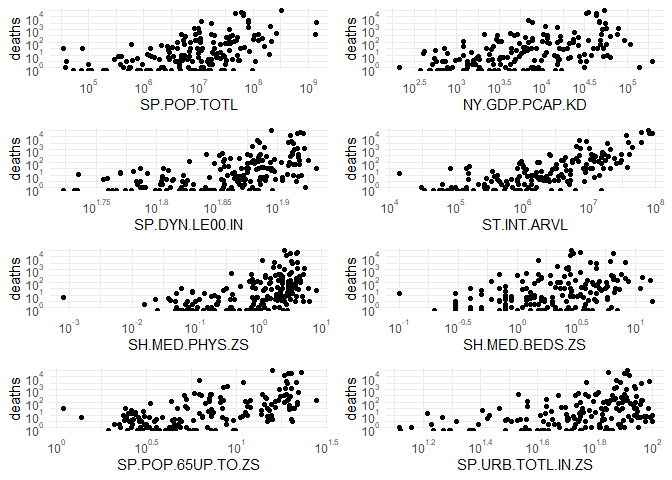
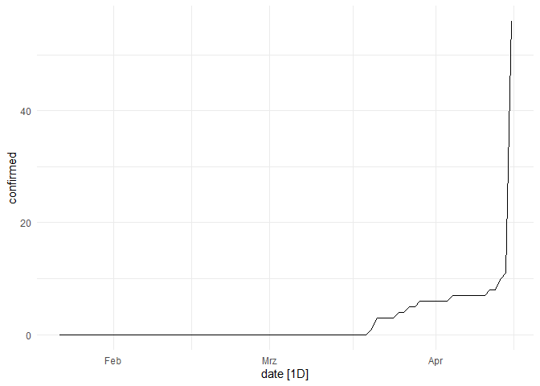
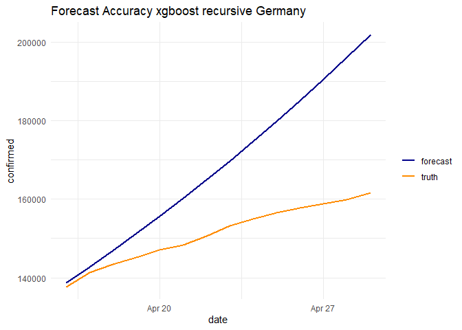
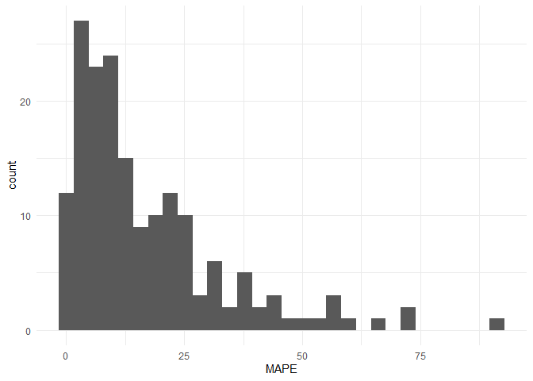

# Libraries and  Raw Data

```r
library(googleVis)
op <- options(gvis.plot.tag='chart')
library(lubridate)
library(fpp3)
library(tidyverse)
library(tsibble)
library(feasts)
library(ggplot2)
library(WDI)
library(DataExplorer)
library(recipes)
library(tidymodels)
library(scales)
library(gridExtra)
library(highcharter)
library(GGally)
library(corrplot)
library(ggthemes)
library(zoo)
library(anomalize)
library(vip)
library(tidycovid19)
library(usethis)
use_git_config(user.name = "Bastien90", user.email = "bastienhaller@web.de")

theme_set(theme_minimal())

#setting parameters
sub_set <- TRUE # only train on subset of the data
retrain_ts <- FALSE # retrain time series models

covid <- read_csv("data/covid19.csv")

#download new data if available
if(max(covid$date) < today() -days(1) ){

  covid_new <- tidycovid19::download_jhu_csse_covid19_data()
  
  #additional check
  if(nrow(covid_new) > nrow(covid)){
  covid <- covid_new
  rm(covid_new)
  write_csv(covid, "data/covid19.csv")
  }
}

paste0("period covered: ", min(covid$date), " - ", max(covid$date)) %>% print()
```

```
## [1] "period covered: 2020-01-22 - 2020-04-26"
```

```r
#Goal to predict last two weeks
period <- 14

train <- covid %>% filter(date <= max(date) - days(14))

test <- covid %>% filter(date > max(date) - days(14))

paste0("train: ", min(train$date), " - ", max(train$date)) %>% print()
```

```
## [1] "train: 2020-01-22 - 2020-04-12"
```

```r
paste0("test: ", min(test$date), " - ", max(test$date)) %>% print()
```

```
## [1] "test: 2020-04-13 - 2020-04-26"
```

```r
set.seed(123)
sampled_id <- unique(train$country )[sample(1 : length(unique(train$country)), 10)]
sampled_id <- c(sampled_id, "Italy", "France", "Germany", "Sweden", "US", "Thailand", "China", "Afghanistan")

if(sub_set){
train <- train %>% filter(country %in% sampled_id)

test <- test %>% filter(country %in% sampled_id)
}
```

# EDA and Additional World Bank Data


```r
#First detected case
day_of_first_case <-  train %>%
  filter(confirmed > 0) %>%
  group_by(iso3c) %>%
  summarise(day_of_first_case = min(date)) %>%
  ungroup()

train <- train %>%
         inner_join(day_of_first_case, by = "iso3c") %>%
          mutate(
          days_since_first_case = as.numeric(difftime(date, day_of_first_case, units ="days")),
          days_since_first_case =ifelse(days_since_first_case < 0, -1, days_since_first_case),
          days_since_global_outbreak  = as.numeric(difftime(date, min(date), units ="days")))


test <- test %>%
         inner_join(day_of_first_case, by = "iso3c") %>%
          mutate(
          days_since_first_case = as.numeric(difftime(date, day_of_first_case, units ="days")),
          days_since_first_case =ifelse(days_since_first_case < 0, -1, days_since_first_case),
          days_since_global_outbreak  = as.numeric(difftime(date, min(date), units ="days")))


train %>% filter(confirmed > 0) %>%
hchart(., "line", hcaes(x = days_since_first_case, y = confirmed, group = country))
```

<!--html_preserve--><div id="htmlwidget-595affc4f25ab85bf888" style="width:100%;height:500px;" class="highchart html-widget"></div>
<script type="application/json" data-for="htmlwidget-595affc4f25ab85bf888">{"x":{"hc_opts":{"title":{"text":null},"yAxis":{"title":{"text":"confirmed"},"type":"linear"},"credits":{"enabled":false},"exporting":{"enabled":false},"plotOptions":{"series":{"label":{"enabled":false},"turboThreshold":0,"showInLegend":true},"treemap":{"layoutAlgorithm":"squarified"},"scatter":{"marker":{"symbol":"circle"}}},"series":[{"name":"Afghanistan","data":[{"country":"Afghanistan","iso3c":"AFG","date":"2020-02-24","confirmed":1,"deaths":0,"recovered":0,"timestamp":"2020-04-27T08:46:03Z","day_of_first_case":"2020-02-24","days_since_first_case":0,"days_since_global_outbreak":33,"x":0,"y":1},{"country":"Afghanistan","iso3c":"AFG","date":"2020-02-25","confirmed":1,"deaths":0,"recovered":0,"timestamp":"2020-04-27T08:46:03Z","day_of_first_case":"2020-02-24","days_since_first_case":1,"days_since_global_outbreak":34,"x":1,"y":1},{"country":"Afghanistan","iso3c":"AFG","date":"2020-02-26","confirmed":1,"deaths":0,"recovered":0,"timestamp":"2020-04-27T08:46:03Z","day_of_first_case":"2020-02-24","days_since_first_case":2,"days_since_global_outbreak":35,"x":2,"y":1},{"country":"Afghanistan","iso3c":"AFG","date":"2020-02-27","confirmed":1,"deaths":0,"recovered":0,"timestamp":"2020-04-27T08:46:03Z","day_of_first_case":"2020-02-24","days_since_first_case":3,"days_since_global_outbreak":36,"x":3,"y":1},{"country":"Afghanistan","iso3c":"AFG","date":"2020-02-28","confirmed":1,"deaths":0,"recovered":0,"timestamp":"2020-04-27T08:46:03Z","day_of_first_case":"2020-02-24","days_since_first_case":4,"days_since_global_outbreak":37,"x":4,"y":1},{"country":"Afghanistan","iso3c":"AFG","date":"2020-02-29","confirmed":1,"deaths":0,"recovered":0,"timestamp":"2020-04-27T08:46:03Z","day_of_first_case":"2020-02-24","days_since_first_case":5,"days_since_global_outbreak":38,"x":5,"y":1},{"country":"Afghanistan","iso3c":"AFG","date":"2020-03-01","confirmed":1,"deaths":0,"recovered":0,"timestamp":"2020-04-27T08:46:03Z","day_of_first_case":"2020-02-24","days_since_first_case":6,"days_since_global_outbreak":39,"x":6,"y":1},{"country":"Afghanistan","iso3c":"AFG","date":"2020-03-02","confirmed":1,"deaths":0,"recovered":0,"timestamp":"2020-04-27T08:46:03Z","day_of_first_case":"2020-02-24","days_since_first_case":7,"days_since_global_outbreak":40,"x":7,"y":1},{"country":"Afghanistan","iso3c":"AFG","date":"2020-03-03","confirmed":1,"deaths":0,"recovered":0,"timestamp":"2020-04-27T08:46:03Z","day_of_first_case":"2020-02-24","days_since_first_case":8,"days_since_global_outbreak":41,"x":8,"y":1},{"country":"Afghanistan","iso3c":"AFG","date":"2020-03-04","confirmed":1,"deaths":0,"recovered":0,"timestamp":"2020-04-27T08:46:03Z","day_of_first_case":"2020-02-24","days_since_first_case":9,"days_since_global_outbreak":42,"x":9,"y":1},{"country":"Afghanistan","iso3c":"AFG","date":"2020-03-05","confirmed":1,"deaths":0,"recovered":0,"timestamp":"2020-04-27T08:46:03Z","day_of_first_case":"2020-02-24","days_since_first_case":10,"days_since_global_outbreak":43,"x":10,"y":1},{"country":"Afghanistan","iso3c":"AFG","date":"2020-03-06","confirmed":1,"deaths":0,"recovered":0,"timestamp":"2020-04-27T08:46:03Z","day_of_first_case":"2020-02-24","days_since_first_case":11,"days_since_global_outbreak":44,"x":11,"y":1},{"country":"Afghanistan","iso3c":"AFG","date":"2020-03-07","confirmed":1,"deaths":0,"recovered":0,"timestamp":"2020-04-27T08:46:03Z","day_of_first_case":"2020-02-24","days_since_first_case":12,"days_since_global_outbreak":45,"x":12,"y":1},{"country":"Afghanistan","iso3c":"AFG","date":"2020-03-08","confirmed":4,"deaths":0,"recovered":0,"timestamp":"2020-04-27T08:46:03Z","day_of_first_case":"2020-02-24","days_since_first_case":13,"days_since_global_outbreak":46,"x":13,"y":4},{"country":"Afghanistan","iso3c":"AFG","date":"2020-03-09","confirmed":4,"deaths":0,"recovered":0,"timestamp":"2020-04-27T08:46:03Z","day_of_first_case":"2020-02-24","days_since_first_case":14,"days_since_global_outbreak":47,"x":14,"y":4},{"country":"Afghanistan","iso3c":"AFG","date":"2020-03-10","confirmed":5,"deaths":0,"recovered":0,"timestamp":"2020-04-27T08:46:03Z","day_of_first_case":"2020-02-24","days_since_first_case":15,"days_since_global_outbreak":48,"x":15,"y":5},{"country":"Afghanistan","iso3c":"AFG","date":"2020-03-11","confirmed":7,"deaths":0,"recovered":0,"timestamp":"2020-04-27T08:46:03Z","day_of_first_case":"2020-02-24","days_since_first_case":16,"days_since_global_outbreak":49,"x":16,"y":7},{"country":"Afghanistan","iso3c":"AFG","date":"2020-03-12","confirmed":7,"deaths":0,"recovered":0,"timestamp":"2020-04-27T08:46:03Z","day_of_first_case":"2020-02-24","days_since_first_case":17,"days_since_global_outbreak":50,"x":17,"y":7},{"country":"Afghanistan","iso3c":"AFG","date":"2020-03-13","confirmed":7,"deaths":0,"recovered":0,"timestamp":"2020-04-27T08:46:03Z","day_of_first_case":"2020-02-24","days_since_first_case":18,"days_since_global_outbreak":51,"x":18,"y":7},{"country":"Afghanistan","iso3c":"AFG","date":"2020-03-14","confirmed":11,"deaths":0,"recovered":0,"timestamp":"2020-04-27T08:46:03Z","day_of_first_case":"2020-02-24","days_since_first_case":19,"days_since_global_outbreak":52,"x":19,"y":11},{"country":"Afghanistan","iso3c":"AFG","date":"2020-03-15","confirmed":16,"deaths":0,"recovered":0,"timestamp":"2020-04-27T08:46:03Z","day_of_first_case":"2020-02-24","days_since_first_case":20,"days_since_global_outbreak":53,"x":20,"y":16},{"country":"Afghanistan","iso3c":"AFG","date":"2020-03-16","confirmed":21,"deaths":0,"recovered":1,"timestamp":"2020-04-27T08:46:03Z","day_of_first_case":"2020-02-24","days_since_first_case":21,"days_since_global_outbreak":54,"x":21,"y":21},{"country":"Afghanistan","iso3c":"AFG","date":"2020-03-17","confirmed":22,"deaths":0,"recovered":1,"timestamp":"2020-04-27T08:46:03Z","day_of_first_case":"2020-02-24","days_since_first_case":22,"days_since_global_outbreak":55,"x":22,"y":22},{"country":"Afghanistan","iso3c":"AFG","date":"2020-03-18","confirmed":22,"deaths":0,"recovered":1,"timestamp":"2020-04-27T08:46:03Z","day_of_first_case":"2020-02-24","days_since_first_case":23,"days_since_global_outbreak":56,"x":23,"y":22},{"country":"Afghanistan","iso3c":"AFG","date":"2020-03-19","confirmed":22,"deaths":0,"recovered":1,"timestamp":"2020-04-27T08:46:03Z","day_of_first_case":"2020-02-24","days_since_first_case":24,"days_since_global_outbreak":57,"x":24,"y":22},{"country":"Afghanistan","iso3c":"AFG","date":"2020-03-20","confirmed":24,"deaths":0,"recovered":1,"timestamp":"2020-04-27T08:46:03Z","day_of_first_case":"2020-02-24","days_since_first_case":25,"days_since_global_outbreak":58,"x":25,"y":24},{"country":"Afghanistan","iso3c":"AFG","date":"2020-03-21","confirmed":24,"deaths":0,"recovered":1,"timestamp":"2020-04-27T08:46:03Z","day_of_first_case":"2020-02-24","days_since_first_case":26,"days_since_global_outbreak":59,"x":26,"y":24},{"country":"Afghanistan","iso3c":"AFG","date":"2020-03-22","confirmed":40,"deaths":1,"recovered":1,"timestamp":"2020-04-27T08:46:03Z","day_of_first_case":"2020-02-24","days_since_first_case":27,"days_since_global_outbreak":60,"x":27,"y":40},{"country":"Afghanistan","iso3c":"AFG","date":"2020-03-23","confirmed":40,"deaths":1,"recovered":1,"timestamp":"2020-04-27T08:46:03Z","day_of_first_case":"2020-02-24","days_since_first_case":28,"days_since_global_outbreak":61,"x":28,"y":40},{"country":"Afghanistan","iso3c":"AFG","date":"2020-03-24","confirmed":74,"deaths":1,"recovered":1,"timestamp":"2020-04-27T08:46:03Z","day_of_first_case":"2020-02-24","days_since_first_case":29,"days_since_global_outbreak":62,"x":29,"y":74},{"country":"Afghanistan","iso3c":"AFG","date":"2020-03-25","confirmed":84,"deaths":2,"recovered":2,"timestamp":"2020-04-27T08:46:03Z","day_of_first_case":"2020-02-24","days_since_first_case":30,"days_since_global_outbreak":63,"x":30,"y":84},{"country":"Afghanistan","iso3c":"AFG","date":"2020-03-26","confirmed":94,"deaths":4,"recovered":2,"timestamp":"2020-04-27T08:46:03Z","day_of_first_case":"2020-02-24","days_since_first_case":31,"days_since_global_outbreak":64,"x":31,"y":94},{"country":"Afghanistan","iso3c":"AFG","date":"2020-03-27","confirmed":110,"deaths":4,"recovered":2,"timestamp":"2020-04-27T08:46:03Z","day_of_first_case":"2020-02-24","days_since_first_case":32,"days_since_global_outbreak":65,"x":32,"y":110},{"country":"Afghanistan","iso3c":"AFG","date":"2020-03-28","confirmed":110,"deaths":4,"recovered":2,"timestamp":"2020-04-27T08:46:03Z","day_of_first_case":"2020-02-24","days_since_first_case":33,"days_since_global_outbreak":66,"x":33,"y":110},{"country":"Afghanistan","iso3c":"AFG","date":"2020-03-29","confirmed":120,"deaths":4,"recovered":2,"timestamp":"2020-04-27T08:46:03Z","day_of_first_case":"2020-02-24","days_since_first_case":34,"days_since_global_outbreak":67,"x":34,"y":120},{"country":"Afghanistan","iso3c":"AFG","date":"2020-03-30","confirmed":170,"deaths":4,"recovered":2,"timestamp":"2020-04-27T08:46:03Z","day_of_first_case":"2020-02-24","days_since_first_case":35,"days_since_global_outbreak":68,"x":35,"y":170},{"country":"Afghanistan","iso3c":"AFG","date":"2020-03-31","confirmed":174,"deaths":4,"recovered":5,"timestamp":"2020-04-27T08:46:03Z","day_of_first_case":"2020-02-24","days_since_first_case":36,"days_since_global_outbreak":69,"x":36,"y":174},{"country":"Afghanistan","iso3c":"AFG","date":"2020-04-01","confirmed":237,"deaths":4,"recovered":5,"timestamp":"2020-04-27T08:46:03Z","day_of_first_case":"2020-02-24","days_since_first_case":37,"days_since_global_outbreak":70,"x":37,"y":237},{"country":"Afghanistan","iso3c":"AFG","date":"2020-04-02","confirmed":273,"deaths":6,"recovered":10,"timestamp":"2020-04-27T08:46:03Z","day_of_first_case":"2020-02-24","days_since_first_case":38,"days_since_global_outbreak":71,"x":38,"y":273},{"country":"Afghanistan","iso3c":"AFG","date":"2020-04-03","confirmed":281,"deaths":6,"recovered":10,"timestamp":"2020-04-27T08:46:03Z","day_of_first_case":"2020-02-24","days_since_first_case":39,"days_since_global_outbreak":72,"x":39,"y":281},{"country":"Afghanistan","iso3c":"AFG","date":"2020-04-04","confirmed":299,"deaths":7,"recovered":10,"timestamp":"2020-04-27T08:46:03Z","day_of_first_case":"2020-02-24","days_since_first_case":40,"days_since_global_outbreak":73,"x":40,"y":299},{"country":"Afghanistan","iso3c":"AFG","date":"2020-04-05","confirmed":349,"deaths":7,"recovered":15,"timestamp":"2020-04-27T08:46:03Z","day_of_first_case":"2020-02-24","days_since_first_case":41,"days_since_global_outbreak":74,"x":41,"y":349},{"country":"Afghanistan","iso3c":"AFG","date":"2020-04-06","confirmed":367,"deaths":11,"recovered":18,"timestamp":"2020-04-27T08:46:03Z","day_of_first_case":"2020-02-24","days_since_first_case":42,"days_since_global_outbreak":75,"x":42,"y":367},{"country":"Afghanistan","iso3c":"AFG","date":"2020-04-07","confirmed":423,"deaths":14,"recovered":18,"timestamp":"2020-04-27T08:46:03Z","day_of_first_case":"2020-02-24","days_since_first_case":43,"days_since_global_outbreak":76,"x":43,"y":423},{"country":"Afghanistan","iso3c":"AFG","date":"2020-04-08","confirmed":444,"deaths":14,"recovered":29,"timestamp":"2020-04-27T08:46:03Z","day_of_first_case":"2020-02-24","days_since_first_case":44,"days_since_global_outbreak":77,"x":44,"y":444},{"country":"Afghanistan","iso3c":"AFG","date":"2020-04-09","confirmed":484,"deaths":15,"recovered":32,"timestamp":"2020-04-27T08:46:03Z","day_of_first_case":"2020-02-24","days_since_first_case":45,"days_since_global_outbreak":78,"x":45,"y":484},{"country":"Afghanistan","iso3c":"AFG","date":"2020-04-10","confirmed":521,"deaths":15,"recovered":32,"timestamp":"2020-04-27T08:46:03Z","day_of_first_case":"2020-02-24","days_since_first_case":46,"days_since_global_outbreak":79,"x":46,"y":521},{"country":"Afghanistan","iso3c":"AFG","date":"2020-04-11","confirmed":555,"deaths":18,"recovered":32,"timestamp":"2020-04-27T08:46:03Z","day_of_first_case":"2020-02-24","days_since_first_case":47,"days_since_global_outbreak":80,"x":47,"y":555},{"country":"Afghanistan","iso3c":"AFG","date":"2020-04-12","confirmed":607,"deaths":18,"recovered":32,"timestamp":"2020-04-27T08:46:03Z","day_of_first_case":"2020-02-24","days_since_first_case":48,"days_since_global_outbreak":81,"x":48,"y":607}],"type":"line"},{"name":"Benin","data":[{"country":"Benin","iso3c":"BEN","date":"2020-03-16","confirmed":1,"deaths":0,"recovered":0,"timestamp":"2020-04-27T08:46:03Z","day_of_first_case":"2020-03-16","days_since_first_case":0,"days_since_global_outbreak":54,"x":0,"y":1},{"country":"Benin","iso3c":"BEN","date":"2020-03-17","confirmed":1,"deaths":0,"recovered":0,"timestamp":"2020-04-27T08:46:03Z","day_of_first_case":"2020-03-16","days_since_first_case":1,"days_since_global_outbreak":55,"x":1,"y":1},{"country":"Benin","iso3c":"BEN","date":"2020-03-18","confirmed":2,"deaths":0,"recovered":0,"timestamp":"2020-04-27T08:46:03Z","day_of_first_case":"2020-03-16","days_since_first_case":2,"days_since_global_outbreak":56,"x":2,"y":2},{"country":"Benin","iso3c":"BEN","date":"2020-03-19","confirmed":2,"deaths":0,"recovered":0,"timestamp":"2020-04-27T08:46:03Z","day_of_first_case":"2020-03-16","days_since_first_case":3,"days_since_global_outbreak":57,"x":3,"y":2},{"country":"Benin","iso3c":"BEN","date":"2020-03-20","confirmed":2,"deaths":0,"recovered":0,"timestamp":"2020-04-27T08:46:03Z","day_of_first_case":"2020-03-16","days_since_first_case":4,"days_since_global_outbreak":58,"x":4,"y":2},{"country":"Benin","iso3c":"BEN","date":"2020-03-21","confirmed":2,"deaths":0,"recovered":0,"timestamp":"2020-04-27T08:46:03Z","day_of_first_case":"2020-03-16","days_since_first_case":5,"days_since_global_outbreak":59,"x":5,"y":2},{"country":"Benin","iso3c":"BEN","date":"2020-03-22","confirmed":2,"deaths":0,"recovered":0,"timestamp":"2020-04-27T08:46:03Z","day_of_first_case":"2020-03-16","days_since_first_case":6,"days_since_global_outbreak":60,"x":6,"y":2},{"country":"Benin","iso3c":"BEN","date":"2020-03-23","confirmed":5,"deaths":0,"recovered":0,"timestamp":"2020-04-27T08:46:03Z","day_of_first_case":"2020-03-16","days_since_first_case":7,"days_since_global_outbreak":61,"x":7,"y":5},{"country":"Benin","iso3c":"BEN","date":"2020-03-24","confirmed":6,"deaths":0,"recovered":0,"timestamp":"2020-04-27T08:46:03Z","day_of_first_case":"2020-03-16","days_since_first_case":8,"days_since_global_outbreak":62,"x":8,"y":6},{"country":"Benin","iso3c":"BEN","date":"2020-03-25","confirmed":6,"deaths":0,"recovered":0,"timestamp":"2020-04-27T08:46:03Z","day_of_first_case":"2020-03-16","days_since_first_case":9,"days_since_global_outbreak":63,"x":9,"y":6},{"country":"Benin","iso3c":"BEN","date":"2020-03-26","confirmed":6,"deaths":0,"recovered":0,"timestamp":"2020-04-27T08:46:03Z","day_of_first_case":"2020-03-16","days_since_first_case":10,"days_since_global_outbreak":64,"x":10,"y":6},{"country":"Benin","iso3c":"BEN","date":"2020-03-27","confirmed":6,"deaths":0,"recovered":0,"timestamp":"2020-04-27T08:46:03Z","day_of_first_case":"2020-03-16","days_since_first_case":11,"days_since_global_outbreak":65,"x":11,"y":6},{"country":"Benin","iso3c":"BEN","date":"2020-03-28","confirmed":6,"deaths":0,"recovered":0,"timestamp":"2020-04-27T08:46:03Z","day_of_first_case":"2020-03-16","days_since_first_case":12,"days_since_global_outbreak":66,"x":12,"y":6},{"country":"Benin","iso3c":"BEN","date":"2020-03-29","confirmed":6,"deaths":0,"recovered":0,"timestamp":"2020-04-27T08:46:03Z","day_of_first_case":"2020-03-16","days_since_first_case":13,"days_since_global_outbreak":67,"x":13,"y":6},{"country":"Benin","iso3c":"BEN","date":"2020-03-30","confirmed":6,"deaths":0,"recovered":0,"timestamp":"2020-04-27T08:46:03Z","day_of_first_case":"2020-03-16","days_since_first_case":14,"days_since_global_outbreak":68,"x":14,"y":6},{"country":"Benin","iso3c":"BEN","date":"2020-03-31","confirmed":9,"deaths":0,"recovered":1,"timestamp":"2020-04-27T08:46:03Z","day_of_first_case":"2020-03-16","days_since_first_case":15,"days_since_global_outbreak":69,"x":15,"y":9},{"country":"Benin","iso3c":"BEN","date":"2020-04-01","confirmed":13,"deaths":0,"recovered":1,"timestamp":"2020-04-27T08:46:03Z","day_of_first_case":"2020-03-16","days_since_first_case":16,"days_since_global_outbreak":70,"x":16,"y":13},{"country":"Benin","iso3c":"BEN","date":"2020-04-02","confirmed":13,"deaths":0,"recovered":1,"timestamp":"2020-04-27T08:46:03Z","day_of_first_case":"2020-03-16","days_since_first_case":17,"days_since_global_outbreak":71,"x":17,"y":13},{"country":"Benin","iso3c":"BEN","date":"2020-04-03","confirmed":16,"deaths":0,"recovered":2,"timestamp":"2020-04-27T08:46:03Z","day_of_first_case":"2020-03-16","days_since_first_case":18,"days_since_global_outbreak":72,"x":18,"y":16},{"country":"Benin","iso3c":"BEN","date":"2020-04-04","confirmed":16,"deaths":0,"recovered":2,"timestamp":"2020-04-27T08:46:03Z","day_of_first_case":"2020-03-16","days_since_first_case":19,"days_since_global_outbreak":73,"x":19,"y":16},{"country":"Benin","iso3c":"BEN","date":"2020-04-05","confirmed":22,"deaths":0,"recovered":5,"timestamp":"2020-04-27T08:46:03Z","day_of_first_case":"2020-03-16","days_since_first_case":20,"days_since_global_outbreak":74,"x":20,"y":22},{"country":"Benin","iso3c":"BEN","date":"2020-04-06","confirmed":26,"deaths":1,"recovered":5,"timestamp":"2020-04-27T08:46:03Z","day_of_first_case":"2020-03-16","days_since_first_case":21,"days_since_global_outbreak":75,"x":21,"y":26},{"country":"Benin","iso3c":"BEN","date":"2020-04-07","confirmed":26,"deaths":1,"recovered":5,"timestamp":"2020-04-27T08:46:03Z","day_of_first_case":"2020-03-16","days_since_first_case":22,"days_since_global_outbreak":76,"x":22,"y":26},{"country":"Benin","iso3c":"BEN","date":"2020-04-08","confirmed":26,"deaths":1,"recovered":5,"timestamp":"2020-04-27T08:46:03Z","day_of_first_case":"2020-03-16","days_since_first_case":23,"days_since_global_outbreak":77,"x":23,"y":26},{"country":"Benin","iso3c":"BEN","date":"2020-04-09","confirmed":26,"deaths":1,"recovered":5,"timestamp":"2020-04-27T08:46:03Z","day_of_first_case":"2020-03-16","days_since_first_case":24,"days_since_global_outbreak":78,"x":24,"y":26},{"country":"Benin","iso3c":"BEN","date":"2020-04-10","confirmed":35,"deaths":1,"recovered":5,"timestamp":"2020-04-27T08:46:03Z","day_of_first_case":"2020-03-16","days_since_first_case":25,"days_since_global_outbreak":79,"x":25,"y":35},{"country":"Benin","iso3c":"BEN","date":"2020-04-11","confirmed":35,"deaths":1,"recovered":5,"timestamp":"2020-04-27T08:46:03Z","day_of_first_case":"2020-03-16","days_since_first_case":26,"days_since_global_outbreak":80,"x":26,"y":35},{"country":"Benin","iso3c":"BEN","date":"2020-04-12","confirmed":35,"deaths":1,"recovered":5,"timestamp":"2020-04-27T08:46:03Z","day_of_first_case":"2020-03-16","days_since_first_case":27,"days_since_global_outbreak":81,"x":27,"y":35}],"type":"line"},{"name":"China","data":[{"country":"China","iso3c":"CHN","date":"2020-01-22","confirmed":548,"deaths":17,"recovered":28,"timestamp":"2020-04-27T08:46:03Z","day_of_first_case":"2020-01-22","days_since_first_case":0,"days_since_global_outbreak":0,"x":0,"y":548},{"country":"China","iso3c":"CHN","date":"2020-01-23","confirmed":643,"deaths":18,"recovered":30,"timestamp":"2020-04-27T08:46:03Z","day_of_first_case":"2020-01-22","days_since_first_case":1,"days_since_global_outbreak":1,"x":1,"y":643},{"country":"China","iso3c":"CHN","date":"2020-01-24","confirmed":920,"deaths":26,"recovered":36,"timestamp":"2020-04-27T08:46:03Z","day_of_first_case":"2020-01-22","days_since_first_case":2,"days_since_global_outbreak":2,"x":2,"y":920},{"country":"China","iso3c":"CHN","date":"2020-01-25","confirmed":1406,"deaths":42,"recovered":39,"timestamp":"2020-04-27T08:46:03Z","day_of_first_case":"2020-01-22","days_since_first_case":3,"days_since_global_outbreak":3,"x":3,"y":1406},{"country":"China","iso3c":"CHN","date":"2020-01-26","confirmed":2075,"deaths":56,"recovered":49,"timestamp":"2020-04-27T08:46:03Z","day_of_first_case":"2020-01-22","days_since_first_case":4,"days_since_global_outbreak":4,"x":4,"y":2075},{"country":"China","iso3c":"CHN","date":"2020-01-27","confirmed":2877,"deaths":82,"recovered":58,"timestamp":"2020-04-27T08:46:03Z","day_of_first_case":"2020-01-22","days_since_first_case":5,"days_since_global_outbreak":5,"x":5,"y":2877},{"country":"China","iso3c":"CHN","date":"2020-01-28","confirmed":5509,"deaths":131,"recovered":101,"timestamp":"2020-04-27T08:46:03Z","day_of_first_case":"2020-01-22","days_since_first_case":6,"days_since_global_outbreak":6,"x":6,"y":5509},{"country":"China","iso3c":"CHN","date":"2020-01-29","confirmed":6087,"deaths":133,"recovered":120,"timestamp":"2020-04-27T08:46:03Z","day_of_first_case":"2020-01-22","days_since_first_case":7,"days_since_global_outbreak":7,"x":7,"y":6087},{"country":"China","iso3c":"CHN","date":"2020-01-30","confirmed":8141,"deaths":171,"recovered":135,"timestamp":"2020-04-27T08:46:03Z","day_of_first_case":"2020-01-22","days_since_first_case":8,"days_since_global_outbreak":8,"x":8,"y":8141},{"country":"China","iso3c":"CHN","date":"2020-01-31","confirmed":9802,"deaths":213,"recovered":214,"timestamp":"2020-04-27T08:46:03Z","day_of_first_case":"2020-01-22","days_since_first_case":9,"days_since_global_outbreak":9,"x":9,"y":9802},{"country":"China","iso3c":"CHN","date":"2020-02-01","confirmed":11891,"deaths":259,"recovered":275,"timestamp":"2020-04-27T08:46:03Z","day_of_first_case":"2020-01-22","days_since_first_case":10,"days_since_global_outbreak":10,"x":10,"y":11891},{"country":"China","iso3c":"CHN","date":"2020-02-02","confirmed":16630,"deaths":361,"recovered":463,"timestamp":"2020-04-27T08:46:03Z","day_of_first_case":"2020-01-22","days_since_first_case":11,"days_since_global_outbreak":11,"x":11,"y":16630},{"country":"China","iso3c":"CHN","date":"2020-02-03","confirmed":19716,"deaths":425,"recovered":614,"timestamp":"2020-04-27T08:46:03Z","day_of_first_case":"2020-01-22","days_since_first_case":12,"days_since_global_outbreak":12,"x":12,"y":19716},{"country":"China","iso3c":"CHN","date":"2020-02-04","confirmed":23707,"deaths":491,"recovered":843,"timestamp":"2020-04-27T08:46:03Z","day_of_first_case":"2020-01-22","days_since_first_case":13,"days_since_global_outbreak":13,"x":13,"y":23707},{"country":"China","iso3c":"CHN","date":"2020-02-05","confirmed":27440,"deaths":563,"recovered":1115,"timestamp":"2020-04-27T08:46:03Z","day_of_first_case":"2020-01-22","days_since_first_case":14,"days_since_global_outbreak":14,"x":14,"y":27440},{"country":"China","iso3c":"CHN","date":"2020-02-06","confirmed":30587,"deaths":633,"recovered":1477,"timestamp":"2020-04-27T08:46:03Z","day_of_first_case":"2020-01-22","days_since_first_case":15,"days_since_global_outbreak":15,"x":15,"y":30587},{"country":"China","iso3c":"CHN","date":"2020-02-07","confirmed":34110,"deaths":718,"recovered":1999,"timestamp":"2020-04-27T08:46:03Z","day_of_first_case":"2020-01-22","days_since_first_case":16,"days_since_global_outbreak":16,"x":16,"y":34110},{"country":"China","iso3c":"CHN","date":"2020-02-08","confirmed":36814,"deaths":805,"recovered":2596,"timestamp":"2020-04-27T08:46:03Z","day_of_first_case":"2020-01-22","days_since_first_case":17,"days_since_global_outbreak":17,"x":17,"y":36814},{"country":"China","iso3c":"CHN","date":"2020-02-09","confirmed":39829,"deaths":905,"recovered":3219,"timestamp":"2020-04-27T08:46:03Z","day_of_first_case":"2020-01-22","days_since_first_case":18,"days_since_global_outbreak":18,"x":18,"y":39829},{"country":"China","iso3c":"CHN","date":"2020-02-10","confirmed":42354,"deaths":1012,"recovered":3918,"timestamp":"2020-04-27T08:46:03Z","day_of_first_case":"2020-01-22","days_since_first_case":19,"days_since_global_outbreak":19,"x":19,"y":42354},{"country":"China","iso3c":"CHN","date":"2020-02-11","confirmed":44386,"deaths":1112,"recovered":4636,"timestamp":"2020-04-27T08:46:03Z","day_of_first_case":"2020-01-22","days_since_first_case":20,"days_since_global_outbreak":20,"x":20,"y":44386},{"country":"China","iso3c":"CHN","date":"2020-02-12","confirmed":44759,"deaths":1117,"recovered":5082,"timestamp":"2020-04-27T08:46:03Z","day_of_first_case":"2020-01-22","days_since_first_case":21,"days_since_global_outbreak":21,"x":21,"y":44759},{"country":"China","iso3c":"CHN","date":"2020-02-13","confirmed":59895,"deaths":1369,"recovered":6217,"timestamp":"2020-04-27T08:46:03Z","day_of_first_case":"2020-01-22","days_since_first_case":22,"days_since_global_outbreak":22,"x":22,"y":59895},{"country":"China","iso3c":"CHN","date":"2020-02-14","confirmed":66358,"deaths":1521,"recovered":7977,"timestamp":"2020-04-27T08:46:03Z","day_of_first_case":"2020-01-22","days_since_first_case":23,"days_since_global_outbreak":23,"x":23,"y":66358},{"country":"China","iso3c":"CHN","date":"2020-02-15","confirmed":68413,"deaths":1663,"recovered":9298,"timestamp":"2020-04-27T08:46:03Z","day_of_first_case":"2020-01-22","days_since_first_case":24,"days_since_global_outbreak":24,"x":24,"y":68413},{"country":"China","iso3c":"CHN","date":"2020-02-16","confirmed":70513,"deaths":1766,"recovered":10755,"timestamp":"2020-04-27T08:46:03Z","day_of_first_case":"2020-01-22","days_since_first_case":25,"days_since_global_outbreak":25,"x":25,"y":70513},{"country":"China","iso3c":"CHN","date":"2020-02-17","confirmed":72434,"deaths":1864,"recovered":12462,"timestamp":"2020-04-27T08:46:03Z","day_of_first_case":"2020-01-22","days_since_first_case":26,"days_since_global_outbreak":26,"x":26,"y":72434},{"country":"China","iso3c":"CHN","date":"2020-02-18","confirmed":74211,"deaths":2003,"recovered":14206,"timestamp":"2020-04-27T08:46:03Z","day_of_first_case":"2020-01-22","days_since_first_case":27,"days_since_global_outbreak":27,"x":27,"y":74211},{"country":"China","iso3c":"CHN","date":"2020-02-19","confirmed":74619,"deaths":2116,"recovered":15962,"timestamp":"2020-04-27T08:46:03Z","day_of_first_case":"2020-01-22","days_since_first_case":28,"days_since_global_outbreak":28,"x":28,"y":74619},{"country":"China","iso3c":"CHN","date":"2020-02-20","confirmed":75077,"deaths":2238,"recovered":18014,"timestamp":"2020-04-27T08:46:03Z","day_of_first_case":"2020-01-22","days_since_first_case":29,"days_since_global_outbreak":29,"x":29,"y":75077},{"country":"China","iso3c":"CHN","date":"2020-02-21","confirmed":75550,"deaths":2238,"recovered":18704,"timestamp":"2020-04-27T08:46:03Z","day_of_first_case":"2020-01-22","days_since_first_case":30,"days_since_global_outbreak":30,"x":30,"y":75550},{"country":"China","iso3c":"CHN","date":"2020-02-22","confirmed":77001,"deaths":2443,"recovered":22699,"timestamp":"2020-04-27T08:46:03Z","day_of_first_case":"2020-01-22","days_since_first_case":31,"days_since_global_outbreak":31,"x":31,"y":77001},{"country":"China","iso3c":"CHN","date":"2020-02-23","confirmed":77022,"deaths":2445,"recovered":23187,"timestamp":"2020-04-27T08:46:03Z","day_of_first_case":"2020-01-22","days_since_first_case":32,"days_since_global_outbreak":32,"x":32,"y":77022},{"country":"China","iso3c":"CHN","date":"2020-02-24","confirmed":77241,"deaths":2595,"recovered":25015,"timestamp":"2020-04-27T08:46:03Z","day_of_first_case":"2020-01-22","days_since_first_case":33,"days_since_global_outbreak":33,"x":33,"y":77241},{"country":"China","iso3c":"CHN","date":"2020-02-25","confirmed":77754,"deaths":2665,"recovered":27676,"timestamp":"2020-04-27T08:46:03Z","day_of_first_case":"2020-01-22","days_since_first_case":34,"days_since_global_outbreak":34,"x":34,"y":77754},{"country":"China","iso3c":"CHN","date":"2020-02-26","confirmed":78166,"deaths":2717,"recovered":30084,"timestamp":"2020-04-27T08:46:03Z","day_of_first_case":"2020-01-22","days_since_first_case":35,"days_since_global_outbreak":35,"x":35,"y":78166},{"country":"China","iso3c":"CHN","date":"2020-02-27","confirmed":78600,"deaths":2746,"recovered":32930,"timestamp":"2020-04-27T08:46:03Z","day_of_first_case":"2020-01-22","days_since_first_case":36,"days_since_global_outbreak":36,"x":36,"y":78600},{"country":"China","iso3c":"CHN","date":"2020-02-28","confirmed":78928,"deaths":2790,"recovered":36329,"timestamp":"2020-04-27T08:46:03Z","day_of_first_case":"2020-01-22","days_since_first_case":37,"days_since_global_outbreak":37,"x":37,"y":78928},{"country":"China","iso3c":"CHN","date":"2020-02-29","confirmed":79356,"deaths":2837,"recovered":39320,"timestamp":"2020-04-27T08:46:03Z","day_of_first_case":"2020-01-22","days_since_first_case":38,"days_since_global_outbreak":38,"x":38,"y":79356},{"country":"China","iso3c":"CHN","date":"2020-03-01","confirmed":79932,"deaths":2872,"recovered":42162,"timestamp":"2020-04-27T08:46:03Z","day_of_first_case":"2020-01-22","days_since_first_case":39,"days_since_global_outbreak":39,"x":39,"y":79932},{"country":"China","iso3c":"CHN","date":"2020-03-02","confirmed":80136,"deaths":2914,"recovered":44854,"timestamp":"2020-04-27T08:46:03Z","day_of_first_case":"2020-01-22","days_since_first_case":40,"days_since_global_outbreak":40,"x":40,"y":80136},{"country":"China","iso3c":"CHN","date":"2020-03-03","confirmed":80261,"deaths":2947,"recovered":47450,"timestamp":"2020-04-27T08:46:03Z","day_of_first_case":"2020-01-22","days_since_first_case":41,"days_since_global_outbreak":41,"x":41,"y":80261},{"country":"China","iso3c":"CHN","date":"2020-03-04","confirmed":80386,"deaths":2983,"recovered":50001,"timestamp":"2020-04-27T08:46:03Z","day_of_first_case":"2020-01-22","days_since_first_case":42,"days_since_global_outbreak":42,"x":42,"y":80386},{"country":"China","iso3c":"CHN","date":"2020-03-05","confirmed":80537,"deaths":3015,"recovered":52292,"timestamp":"2020-04-27T08:46:03Z","day_of_first_case":"2020-01-22","days_since_first_case":43,"days_since_global_outbreak":43,"x":43,"y":80537},{"country":"China","iso3c":"CHN","date":"2020-03-06","confirmed":80690,"deaths":3044,"recovered":53944,"timestamp":"2020-04-27T08:46:03Z","day_of_first_case":"2020-01-22","days_since_first_case":44,"days_since_global_outbreak":44,"x":44,"y":80690},{"country":"China","iso3c":"CHN","date":"2020-03-07","confirmed":80770,"deaths":3072,"recovered":55539,"timestamp":"2020-04-27T08:46:03Z","day_of_first_case":"2020-01-22","days_since_first_case":45,"days_since_global_outbreak":45,"x":45,"y":80770},{"country":"China","iso3c":"CHN","date":"2020-03-08","confirmed":80823,"deaths":3100,"recovered":57388,"timestamp":"2020-04-27T08:46:03Z","day_of_first_case":"2020-01-22","days_since_first_case":46,"days_since_global_outbreak":46,"x":46,"y":80823},{"country":"China","iso3c":"CHN","date":"2020-03-09","confirmed":80860,"deaths":3123,"recovered":58804,"timestamp":"2020-04-27T08:46:03Z","day_of_first_case":"2020-01-22","days_since_first_case":47,"days_since_global_outbreak":47,"x":47,"y":80860},{"country":"China","iso3c":"CHN","date":"2020-03-10","confirmed":80887,"deaths":3139,"recovered":60181,"timestamp":"2020-04-27T08:46:03Z","day_of_first_case":"2020-01-22","days_since_first_case":48,"days_since_global_outbreak":48,"x":48,"y":80887},{"country":"China","iso3c":"CHN","date":"2020-03-11","confirmed":80921,"deaths":3161,"recovered":61644,"timestamp":"2020-04-27T08:46:03Z","day_of_first_case":"2020-01-22","days_since_first_case":49,"days_since_global_outbreak":49,"x":49,"y":80921},{"country":"China","iso3c":"CHN","date":"2020-03-12","confirmed":80932,"deaths":3172,"recovered":62901,"timestamp":"2020-04-27T08:46:03Z","day_of_first_case":"2020-01-22","days_since_first_case":50,"days_since_global_outbreak":50,"x":50,"y":80932},{"country":"China","iso3c":"CHN","date":"2020-03-13","confirmed":80945,"deaths":3180,"recovered":64196,"timestamp":"2020-04-27T08:46:03Z","day_of_first_case":"2020-01-22","days_since_first_case":51,"days_since_global_outbreak":51,"x":51,"y":80945},{"country":"China","iso3c":"CHN","date":"2020-03-14","confirmed":80977,"deaths":3193,"recovered":65660,"timestamp":"2020-04-27T08:46:03Z","day_of_first_case":"2020-01-22","days_since_first_case":52,"days_since_global_outbreak":52,"x":52,"y":80977},{"country":"China","iso3c":"CHN","date":"2020-03-15","confirmed":81003,"deaths":3203,"recovered":67017,"timestamp":"2020-04-27T08:46:03Z","day_of_first_case":"2020-01-22","days_since_first_case":53,"days_since_global_outbreak":53,"x":53,"y":81003},{"country":"China","iso3c":"CHN","date":"2020-03-16","confirmed":81033,"deaths":3217,"recovered":67910,"timestamp":"2020-04-27T08:46:03Z","day_of_first_case":"2020-01-22","days_since_first_case":54,"days_since_global_outbreak":54,"x":54,"y":81033},{"country":"China","iso3c":"CHN","date":"2020-03-17","confirmed":81058,"deaths":3230,"recovered":68798,"timestamp":"2020-04-27T08:46:03Z","day_of_first_case":"2020-01-22","days_since_first_case":55,"days_since_global_outbreak":55,"x":55,"y":81058},{"country":"China","iso3c":"CHN","date":"2020-03-18","confirmed":81102,"deaths":3241,"recovered":69755,"timestamp":"2020-04-27T08:46:03Z","day_of_first_case":"2020-01-22","days_since_first_case":56,"days_since_global_outbreak":56,"x":56,"y":81102},{"country":"China","iso3c":"CHN","date":"2020-03-19","confirmed":81156,"deaths":3249,"recovered":70535,"timestamp":"2020-04-27T08:46:03Z","day_of_first_case":"2020-01-22","days_since_first_case":57,"days_since_global_outbreak":57,"x":57,"y":81156},{"country":"China","iso3c":"CHN","date":"2020-03-20","confirmed":81250,"deaths":3253,"recovered":71266,"timestamp":"2020-04-27T08:46:03Z","day_of_first_case":"2020-01-22","days_since_first_case":58,"days_since_global_outbreak":58,"x":58,"y":81250},{"country":"China","iso3c":"CHN","date":"2020-03-21","confirmed":81305,"deaths":3259,"recovered":71857,"timestamp":"2020-04-27T08:46:03Z","day_of_first_case":"2020-01-22","days_since_first_case":59,"days_since_global_outbreak":59,"x":59,"y":81305},{"country":"China","iso3c":"CHN","date":"2020-03-22","confirmed":81435,"deaths":3274,"recovered":72362,"timestamp":"2020-04-27T08:46:03Z","day_of_first_case":"2020-01-22","days_since_first_case":60,"days_since_global_outbreak":60,"x":60,"y":81435},{"country":"China","iso3c":"CHN","date":"2020-03-23","confirmed":81498,"deaths":3274,"recovered":72814,"timestamp":"2020-04-27T08:46:03Z","day_of_first_case":"2020-01-22","days_since_first_case":61,"days_since_global_outbreak":61,"x":61,"y":81498},{"country":"China","iso3c":"CHN","date":"2020-03-24","confirmed":81591,"deaths":3281,"recovered":73280,"timestamp":"2020-04-27T08:46:03Z","day_of_first_case":"2020-01-22","days_since_first_case":62,"days_since_global_outbreak":62,"x":62,"y":81591},{"country":"China","iso3c":"CHN","date":"2020-03-25","confirmed":81661,"deaths":3285,"recovered":73773,"timestamp":"2020-04-27T08:46:03Z","day_of_first_case":"2020-01-22","days_since_first_case":63,"days_since_global_outbreak":63,"x":63,"y":81661},{"country":"China","iso3c":"CHN","date":"2020-03-26","confirmed":81782,"deaths":3291,"recovered":74181,"timestamp":"2020-04-27T08:46:03Z","day_of_first_case":"2020-01-22","days_since_first_case":64,"days_since_global_outbreak":64,"x":64,"y":81782},{"country":"China","iso3c":"CHN","date":"2020-03-27","confirmed":81897,"deaths":3296,"recovered":74720,"timestamp":"2020-04-27T08:46:03Z","day_of_first_case":"2020-01-22","days_since_first_case":65,"days_since_global_outbreak":65,"x":65,"y":81897},{"country":"China","iso3c":"CHN","date":"2020-03-28","confirmed":81999,"deaths":3299,"recovered":75100,"timestamp":"2020-04-27T08:46:03Z","day_of_first_case":"2020-01-22","days_since_first_case":66,"days_since_global_outbreak":66,"x":66,"y":81999},{"country":"China","iso3c":"CHN","date":"2020-03-29","confirmed":82122,"deaths":3304,"recovered":75582,"timestamp":"2020-04-27T08:46:03Z","day_of_first_case":"2020-01-22","days_since_first_case":67,"days_since_global_outbreak":67,"x":67,"y":82122},{"country":"China","iso3c":"CHN","date":"2020-03-30","confirmed":82198,"deaths":3308,"recovered":75923,"timestamp":"2020-04-27T08:46:03Z","day_of_first_case":"2020-01-22","days_since_first_case":68,"days_since_global_outbreak":68,"x":68,"y":82198},{"country":"China","iso3c":"CHN","date":"2020-03-31","confirmed":82279,"deaths":3309,"recovered":76206,"timestamp":"2020-04-27T08:46:03Z","day_of_first_case":"2020-01-22","days_since_first_case":69,"days_since_global_outbreak":69,"x":69,"y":82279},{"country":"China","iso3c":"CHN","date":"2020-04-01","confirmed":82361,"deaths":3316,"recovered":76405,"timestamp":"2020-04-27T08:46:03Z","day_of_first_case":"2020-01-22","days_since_first_case":70,"days_since_global_outbreak":70,"x":70,"y":82361},{"country":"China","iso3c":"CHN","date":"2020-04-02","confirmed":82432,"deaths":3322,"recovered":76565,"timestamp":"2020-04-27T08:46:03Z","day_of_first_case":"2020-01-22","days_since_first_case":71,"days_since_global_outbreak":71,"x":71,"y":82432},{"country":"China","iso3c":"CHN","date":"2020-04-03","confirmed":82511,"deaths":3326,"recovered":76760,"timestamp":"2020-04-27T08:46:03Z","day_of_first_case":"2020-01-22","days_since_first_case":72,"days_since_global_outbreak":72,"x":72,"y":82511},{"country":"China","iso3c":"CHN","date":"2020-04-04","confirmed":82543,"deaths":3330,"recovered":76946,"timestamp":"2020-04-27T08:46:03Z","day_of_first_case":"2020-01-22","days_since_first_case":73,"days_since_global_outbreak":73,"x":73,"y":82543},{"country":"China","iso3c":"CHN","date":"2020-04-05","confirmed":82602,"deaths":3333,"recovered":77207,"timestamp":"2020-04-27T08:46:03Z","day_of_first_case":"2020-01-22","days_since_first_case":74,"days_since_global_outbreak":74,"x":74,"y":82602},{"country":"China","iso3c":"CHN","date":"2020-04-06","confirmed":82665,"deaths":3335,"recovered":77310,"timestamp":"2020-04-27T08:46:03Z","day_of_first_case":"2020-01-22","days_since_first_case":75,"days_since_global_outbreak":75,"x":75,"y":82665},{"country":"China","iso3c":"CHN","date":"2020-04-07","confirmed":82718,"deaths":3335,"recovered":77410,"timestamp":"2020-04-27T08:46:03Z","day_of_first_case":"2020-01-22","days_since_first_case":76,"days_since_global_outbreak":76,"x":76,"y":82718},{"country":"China","iso3c":"CHN","date":"2020-04-08","confirmed":82809,"deaths":3337,"recovered":77567,"timestamp":"2020-04-27T08:46:03Z","day_of_first_case":"2020-01-22","days_since_first_case":77,"days_since_global_outbreak":77,"x":77,"y":82809},{"country":"China","iso3c":"CHN","date":"2020-04-09","confirmed":82883,"deaths":3339,"recovered":77679,"timestamp":"2020-04-27T08:46:03Z","day_of_first_case":"2020-01-22","days_since_first_case":78,"days_since_global_outbreak":78,"x":78,"y":82883},{"country":"China","iso3c":"CHN","date":"2020-04-10","confirmed":82941,"deaths":3340,"recovered":77791,"timestamp":"2020-04-27T08:46:03Z","day_of_first_case":"2020-01-22","days_since_first_case":79,"days_since_global_outbreak":79,"x":79,"y":82941},{"country":"China","iso3c":"CHN","date":"2020-04-11","confirmed":83014,"deaths":3343,"recovered":77877,"timestamp":"2020-04-27T08:46:03Z","day_of_first_case":"2020-01-22","days_since_first_case":80,"days_since_global_outbreak":80,"x":80,"y":83014},{"country":"China","iso3c":"CHN","date":"2020-04-12","confirmed":83134,"deaths":3343,"recovered":77956,"timestamp":"2020-04-27T08:46:03Z","day_of_first_case":"2020-01-22","days_since_first_case":81,"days_since_global_outbreak":81,"x":81,"y":83134}],"type":"line"},{"name":"Czechia","data":[{"country":"Czechia","iso3c":"CZE","date":"2020-03-01","confirmed":3,"deaths":0,"recovered":0,"timestamp":"2020-04-27T08:46:03Z","day_of_first_case":"2020-03-01","days_since_first_case":0,"days_since_global_outbreak":39,"x":0,"y":3},{"country":"Czechia","iso3c":"CZE","date":"2020-03-02","confirmed":3,"deaths":0,"recovered":0,"timestamp":"2020-04-27T08:46:03Z","day_of_first_case":"2020-03-01","days_since_first_case":1,"days_since_global_outbreak":40,"x":1,"y":3},{"country":"Czechia","iso3c":"CZE","date":"2020-03-03","confirmed":5,"deaths":0,"recovered":0,"timestamp":"2020-04-27T08:46:03Z","day_of_first_case":"2020-03-01","days_since_first_case":2,"days_since_global_outbreak":41,"x":2,"y":5},{"country":"Czechia","iso3c":"CZE","date":"2020-03-04","confirmed":8,"deaths":0,"recovered":0,"timestamp":"2020-04-27T08:46:03Z","day_of_first_case":"2020-03-01","days_since_first_case":3,"days_since_global_outbreak":42,"x":3,"y":8},{"country":"Czechia","iso3c":"CZE","date":"2020-03-05","confirmed":12,"deaths":0,"recovered":0,"timestamp":"2020-04-27T08:46:03Z","day_of_first_case":"2020-03-01","days_since_first_case":4,"days_since_global_outbreak":43,"x":4,"y":12},{"country":"Czechia","iso3c":"CZE","date":"2020-03-06","confirmed":18,"deaths":0,"recovered":0,"timestamp":"2020-04-27T08:46:03Z","day_of_first_case":"2020-03-01","days_since_first_case":5,"days_since_global_outbreak":44,"x":5,"y":18},{"country":"Czechia","iso3c":"CZE","date":"2020-03-07","confirmed":19,"deaths":0,"recovered":0,"timestamp":"2020-04-27T08:46:03Z","day_of_first_case":"2020-03-01","days_since_first_case":6,"days_since_global_outbreak":45,"x":6,"y":19},{"country":"Czechia","iso3c":"CZE","date":"2020-03-08","confirmed":31,"deaths":0,"recovered":0,"timestamp":"2020-04-27T08:46:03Z","day_of_first_case":"2020-03-01","days_since_first_case":7,"days_since_global_outbreak":46,"x":7,"y":31},{"country":"Czechia","iso3c":"CZE","date":"2020-03-09","confirmed":31,"deaths":0,"recovered":0,"timestamp":"2020-04-27T08:46:03Z","day_of_first_case":"2020-03-01","days_since_first_case":8,"days_since_global_outbreak":47,"x":8,"y":31},{"country":"Czechia","iso3c":"CZE","date":"2020-03-10","confirmed":41,"deaths":0,"recovered":0,"timestamp":"2020-04-27T08:46:03Z","day_of_first_case":"2020-03-01","days_since_first_case":9,"days_since_global_outbreak":48,"x":9,"y":41},{"country":"Czechia","iso3c":"CZE","date":"2020-03-11","confirmed":91,"deaths":0,"recovered":0,"timestamp":"2020-04-27T08:46:03Z","day_of_first_case":"2020-03-01","days_since_first_case":10,"days_since_global_outbreak":49,"x":10,"y":91},{"country":"Czechia","iso3c":"CZE","date":"2020-03-12","confirmed":94,"deaths":0,"recovered":0,"timestamp":"2020-04-27T08:46:03Z","day_of_first_case":"2020-03-01","days_since_first_case":11,"days_since_global_outbreak":50,"x":11,"y":94},{"country":"Czechia","iso3c":"CZE","date":"2020-03-13","confirmed":141,"deaths":0,"recovered":0,"timestamp":"2020-04-27T08:46:03Z","day_of_first_case":"2020-03-01","days_since_first_case":12,"days_since_global_outbreak":51,"x":12,"y":141},{"country":"Czechia","iso3c":"CZE","date":"2020-03-14","confirmed":189,"deaths":0,"recovered":0,"timestamp":"2020-04-27T08:46:03Z","day_of_first_case":"2020-03-01","days_since_first_case":13,"days_since_global_outbreak":52,"x":13,"y":189},{"country":"Czechia","iso3c":"CZE","date":"2020-03-15","confirmed":253,"deaths":0,"recovered":0,"timestamp":"2020-04-27T08:46:03Z","day_of_first_case":"2020-03-01","days_since_first_case":14,"days_since_global_outbreak":53,"x":14,"y":253},{"country":"Czechia","iso3c":"CZE","date":"2020-03-16","confirmed":298,"deaths":0,"recovered":3,"timestamp":"2020-04-27T08:46:03Z","day_of_first_case":"2020-03-01","days_since_first_case":15,"days_since_global_outbreak":54,"x":15,"y":298},{"country":"Czechia","iso3c":"CZE","date":"2020-03-17","confirmed":396,"deaths":0,"recovered":3,"timestamp":"2020-04-27T08:46:03Z","day_of_first_case":"2020-03-01","days_since_first_case":16,"days_since_global_outbreak":55,"x":16,"y":396},{"country":"Czechia","iso3c":"CZE","date":"2020-03-18","confirmed":464,"deaths":0,"recovered":3,"timestamp":"2020-04-27T08:46:03Z","day_of_first_case":"2020-03-01","days_since_first_case":17,"days_since_global_outbreak":56,"x":17,"y":464},{"country":"Czechia","iso3c":"CZE","date":"2020-03-19","confirmed":694,"deaths":0,"recovered":3,"timestamp":"2020-04-27T08:46:03Z","day_of_first_case":"2020-03-01","days_since_first_case":18,"days_since_global_outbreak":57,"x":18,"y":694},{"country":"Czechia","iso3c":"CZE","date":"2020-03-20","confirmed":833,"deaths":0,"recovered":4,"timestamp":"2020-04-27T08:46:03Z","day_of_first_case":"2020-03-01","days_since_first_case":19,"days_since_global_outbreak":58,"x":19,"y":833},{"country":"Czechia","iso3c":"CZE","date":"2020-03-21","confirmed":995,"deaths":0,"recovered":6,"timestamp":"2020-04-27T08:46:03Z","day_of_first_case":"2020-03-01","days_since_first_case":20,"days_since_global_outbreak":59,"x":20,"y":995},{"country":"Czechia","iso3c":"CZE","date":"2020-03-22","confirmed":1120,"deaths":1,"recovered":6,"timestamp":"2020-04-27T08:46:03Z","day_of_first_case":"2020-03-01","days_since_first_case":21,"days_since_global_outbreak":60,"x":21,"y":1120},{"country":"Czechia","iso3c":"CZE","date":"2020-03-23","confirmed":1236,"deaths":1,"recovered":6,"timestamp":"2020-04-27T08:46:03Z","day_of_first_case":"2020-03-01","days_since_first_case":22,"days_since_global_outbreak":61,"x":22,"y":1236},{"country":"Czechia","iso3c":"CZE","date":"2020-03-24","confirmed":1394,"deaths":3,"recovered":10,"timestamp":"2020-04-27T08:46:03Z","day_of_first_case":"2020-03-01","days_since_first_case":23,"days_since_global_outbreak":62,"x":23,"y":1394},{"country":"Czechia","iso3c":"CZE","date":"2020-03-25","confirmed":1654,"deaths":6,"recovered":10,"timestamp":"2020-04-27T08:46:03Z","day_of_first_case":"2020-03-01","days_since_first_case":24,"days_since_global_outbreak":63,"x":24,"y":1654},{"country":"Czechia","iso3c":"CZE","date":"2020-03-26","confirmed":1925,"deaths":9,"recovered":10,"timestamp":"2020-04-27T08:46:03Z","day_of_first_case":"2020-03-01","days_since_first_case":25,"days_since_global_outbreak":64,"x":25,"y":1925},{"country":"Czechia","iso3c":"CZE","date":"2020-03-27","confirmed":2279,"deaths":9,"recovered":11,"timestamp":"2020-04-27T08:46:03Z","day_of_first_case":"2020-03-01","days_since_first_case":26,"days_since_global_outbreak":65,"x":26,"y":2279},{"country":"Czechia","iso3c":"CZE","date":"2020-03-28","confirmed":2631,"deaths":11,"recovered":11,"timestamp":"2020-04-27T08:46:03Z","day_of_first_case":"2020-03-01","days_since_first_case":27,"days_since_global_outbreak":66,"x":27,"y":2631},{"country":"Czechia","iso3c":"CZE","date":"2020-03-29","confirmed":2817,"deaths":16,"recovered":11,"timestamp":"2020-04-27T08:46:03Z","day_of_first_case":"2020-03-01","days_since_first_case":28,"days_since_global_outbreak":67,"x":28,"y":2817},{"country":"Czechia","iso3c":"CZE","date":"2020-03-30","confirmed":3001,"deaths":23,"recovered":25,"timestamp":"2020-04-27T08:46:03Z","day_of_first_case":"2020-03-01","days_since_first_case":29,"days_since_global_outbreak":68,"x":29,"y":3001},{"country":"Czechia","iso3c":"CZE","date":"2020-03-31","confirmed":3308,"deaths":31,"recovered":45,"timestamp":"2020-04-27T08:46:03Z","day_of_first_case":"2020-03-01","days_since_first_case":30,"days_since_global_outbreak":69,"x":30,"y":3308},{"country":"Czechia","iso3c":"CZE","date":"2020-04-01","confirmed":3508,"deaths":39,"recovered":61,"timestamp":"2020-04-27T08:46:03Z","day_of_first_case":"2020-03-01","days_since_first_case":31,"days_since_global_outbreak":70,"x":31,"y":3508},{"country":"Czechia","iso3c":"CZE","date":"2020-04-02","confirmed":3858,"deaths":44,"recovered":67,"timestamp":"2020-04-27T08:46:03Z","day_of_first_case":"2020-03-01","days_since_first_case":32,"days_since_global_outbreak":71,"x":32,"y":3858},{"country":"Czechia","iso3c":"CZE","date":"2020-04-03","confirmed":4091,"deaths":53,"recovered":72,"timestamp":"2020-04-27T08:46:03Z","day_of_first_case":"2020-03-01","days_since_first_case":33,"days_since_global_outbreak":72,"x":33,"y":4091},{"country":"Czechia","iso3c":"CZE","date":"2020-04-04","confirmed":4472,"deaths":59,"recovered":78,"timestamp":"2020-04-27T08:46:03Z","day_of_first_case":"2020-03-01","days_since_first_case":34,"days_since_global_outbreak":73,"x":34,"y":4472},{"country":"Czechia","iso3c":"CZE","date":"2020-04-05","confirmed":4587,"deaths":67,"recovered":96,"timestamp":"2020-04-27T08:46:03Z","day_of_first_case":"2020-03-01","days_since_first_case":35,"days_since_global_outbreak":74,"x":35,"y":4587},{"country":"Czechia","iso3c":"CZE","date":"2020-04-06","confirmed":4822,"deaths":78,"recovered":121,"timestamp":"2020-04-27T08:46:03Z","day_of_first_case":"2020-03-01","days_since_first_case":36,"days_since_global_outbreak":75,"x":36,"y":4822},{"country":"Czechia","iso3c":"CZE","date":"2020-04-07","confirmed":5017,"deaths":88,"recovered":172,"timestamp":"2020-04-27T08:46:03Z","day_of_first_case":"2020-03-01","days_since_first_case":37,"days_since_global_outbreak":76,"x":37,"y":5017},{"country":"Czechia","iso3c":"CZE","date":"2020-04-08","confirmed":5312,"deaths":99,"recovered":233,"timestamp":"2020-04-27T08:46:03Z","day_of_first_case":"2020-03-01","days_since_first_case":38,"days_since_global_outbreak":77,"x":38,"y":5312},{"country":"Czechia","iso3c":"CZE","date":"2020-04-09","confirmed":5569,"deaths":112,"recovered":301,"timestamp":"2020-04-27T08:46:03Z","day_of_first_case":"2020-03-01","days_since_first_case":39,"days_since_global_outbreak":78,"x":39,"y":5569},{"country":"Czechia","iso3c":"CZE","date":"2020-04-10","confirmed":5732,"deaths":119,"recovered":346,"timestamp":"2020-04-27T08:46:03Z","day_of_first_case":"2020-03-01","days_since_first_case":40,"days_since_global_outbreak":79,"x":40,"y":5732},{"country":"Czechia","iso3c":"CZE","date":"2020-04-11","confirmed":5831,"deaths":129,"recovered":411,"timestamp":"2020-04-27T08:46:03Z","day_of_first_case":"2020-03-01","days_since_first_case":41,"days_since_global_outbreak":80,"x":41,"y":5831},{"country":"Czechia","iso3c":"CZE","date":"2020-04-12","confirmed":5991,"deaths":138,"recovered":464,"timestamp":"2020-04-27T08:46:03Z","day_of_first_case":"2020-03-01","days_since_first_case":42,"days_since_global_outbreak":81,"x":42,"y":5991}],"type":"line"},{"name":"Ecuador","data":[{"country":"Ecuador","iso3c":"ECU","date":"2020-03-01","confirmed":6,"deaths":0,"recovered":0,"timestamp":"2020-04-27T08:46:03Z","day_of_first_case":"2020-03-01","days_since_first_case":0,"days_since_global_outbreak":39,"x":0,"y":6},{"country":"Ecuador","iso3c":"ECU","date":"2020-03-02","confirmed":6,"deaths":0,"recovered":0,"timestamp":"2020-04-27T08:46:03Z","day_of_first_case":"2020-03-01","days_since_first_case":1,"days_since_global_outbreak":40,"x":1,"y":6},{"country":"Ecuador","iso3c":"ECU","date":"2020-03-03","confirmed":7,"deaths":0,"recovered":0,"timestamp":"2020-04-27T08:46:03Z","day_of_first_case":"2020-03-01","days_since_first_case":2,"days_since_global_outbreak":41,"x":2,"y":7},{"country":"Ecuador","iso3c":"ECU","date":"2020-03-04","confirmed":10,"deaths":0,"recovered":0,"timestamp":"2020-04-27T08:46:03Z","day_of_first_case":"2020-03-01","days_since_first_case":3,"days_since_global_outbreak":42,"x":3,"y":10},{"country":"Ecuador","iso3c":"ECU","date":"2020-03-05","confirmed":13,"deaths":0,"recovered":0,"timestamp":"2020-04-27T08:46:03Z","day_of_first_case":"2020-03-01","days_since_first_case":4,"days_since_global_outbreak":43,"x":4,"y":13},{"country":"Ecuador","iso3c":"ECU","date":"2020-03-06","confirmed":13,"deaths":0,"recovered":0,"timestamp":"2020-04-27T08:46:03Z","day_of_first_case":"2020-03-01","days_since_first_case":5,"days_since_global_outbreak":44,"x":5,"y":13},{"country":"Ecuador","iso3c":"ECU","date":"2020-03-07","confirmed":13,"deaths":0,"recovered":0,"timestamp":"2020-04-27T08:46:03Z","day_of_first_case":"2020-03-01","days_since_first_case":6,"days_since_global_outbreak":45,"x":6,"y":13},{"country":"Ecuador","iso3c":"ECU","date":"2020-03-08","confirmed":14,"deaths":0,"recovered":0,"timestamp":"2020-04-27T08:46:03Z","day_of_first_case":"2020-03-01","days_since_first_case":7,"days_since_global_outbreak":46,"x":7,"y":14},{"country":"Ecuador","iso3c":"ECU","date":"2020-03-09","confirmed":15,"deaths":0,"recovered":0,"timestamp":"2020-04-27T08:46:03Z","day_of_first_case":"2020-03-01","days_since_first_case":8,"days_since_global_outbreak":47,"x":8,"y":15},{"country":"Ecuador","iso3c":"ECU","date":"2020-03-10","confirmed":15,"deaths":0,"recovered":0,"timestamp":"2020-04-27T08:46:03Z","day_of_first_case":"2020-03-01","days_since_first_case":9,"days_since_global_outbreak":48,"x":9,"y":15},{"country":"Ecuador","iso3c":"ECU","date":"2020-03-11","confirmed":17,"deaths":0,"recovered":0,"timestamp":"2020-04-27T08:46:03Z","day_of_first_case":"2020-03-01","days_since_first_case":10,"days_since_global_outbreak":49,"x":10,"y":17},{"country":"Ecuador","iso3c":"ECU","date":"2020-03-12","confirmed":17,"deaths":0,"recovered":0,"timestamp":"2020-04-27T08:46:03Z","day_of_first_case":"2020-03-01","days_since_first_case":11,"days_since_global_outbreak":50,"x":11,"y":17},{"country":"Ecuador","iso3c":"ECU","date":"2020-03-13","confirmed":17,"deaths":0,"recovered":0,"timestamp":"2020-04-27T08:46:03Z","day_of_first_case":"2020-03-01","days_since_first_case":12,"days_since_global_outbreak":51,"x":12,"y":17},{"country":"Ecuador","iso3c":"ECU","date":"2020-03-14","confirmed":28,"deaths":2,"recovered":0,"timestamp":"2020-04-27T08:46:03Z","day_of_first_case":"2020-03-01","days_since_first_case":13,"days_since_global_outbreak":52,"x":13,"y":28},{"country":"Ecuador","iso3c":"ECU","date":"2020-03-15","confirmed":28,"deaths":2,"recovered":0,"timestamp":"2020-04-27T08:46:03Z","day_of_first_case":"2020-03-01","days_since_first_case":14,"days_since_global_outbreak":53,"x":14,"y":28},{"country":"Ecuador","iso3c":"ECU","date":"2020-03-16","confirmed":37,"deaths":2,"recovered":0,"timestamp":"2020-04-27T08:46:03Z","day_of_first_case":"2020-03-01","days_since_first_case":15,"days_since_global_outbreak":54,"x":15,"y":37},{"country":"Ecuador","iso3c":"ECU","date":"2020-03-17","confirmed":58,"deaths":2,"recovered":0,"timestamp":"2020-04-27T08:46:03Z","day_of_first_case":"2020-03-01","days_since_first_case":16,"days_since_global_outbreak":55,"x":16,"y":58},{"country":"Ecuador","iso3c":"ECU","date":"2020-03-18","confirmed":111,"deaths":2,"recovered":0,"timestamp":"2020-04-27T08:46:03Z","day_of_first_case":"2020-03-01","days_since_first_case":17,"days_since_global_outbreak":56,"x":17,"y":111},{"country":"Ecuador","iso3c":"ECU","date":"2020-03-19","confirmed":199,"deaths":3,"recovered":0,"timestamp":"2020-04-27T08:46:03Z","day_of_first_case":"2020-03-01","days_since_first_case":18,"days_since_global_outbreak":57,"x":18,"y":199},{"country":"Ecuador","iso3c":"ECU","date":"2020-03-20","confirmed":367,"deaths":5,"recovered":0,"timestamp":"2020-04-27T08:46:03Z","day_of_first_case":"2020-03-01","days_since_first_case":19,"days_since_global_outbreak":58,"x":19,"y":367},{"country":"Ecuador","iso3c":"ECU","date":"2020-03-21","confirmed":506,"deaths":7,"recovered":3,"timestamp":"2020-04-27T08:46:03Z","day_of_first_case":"2020-03-01","days_since_first_case":20,"days_since_global_outbreak":59,"x":20,"y":506},{"country":"Ecuador","iso3c":"ECU","date":"2020-03-22","confirmed":789,"deaths":14,"recovered":3,"timestamp":"2020-04-27T08:46:03Z","day_of_first_case":"2020-03-01","days_since_first_case":21,"days_since_global_outbreak":60,"x":21,"y":789},{"country":"Ecuador","iso3c":"ECU","date":"2020-03-23","confirmed":981,"deaths":18,"recovered":3,"timestamp":"2020-04-27T08:46:03Z","day_of_first_case":"2020-03-01","days_since_first_case":22,"days_since_global_outbreak":61,"x":22,"y":981},{"country":"Ecuador","iso3c":"ECU","date":"2020-03-24","confirmed":1082,"deaths":27,"recovered":3,"timestamp":"2020-04-27T08:46:03Z","day_of_first_case":"2020-03-01","days_since_first_case":23,"days_since_global_outbreak":62,"x":23,"y":1082},{"country":"Ecuador","iso3c":"ECU","date":"2020-03-25","confirmed":1173,"deaths":28,"recovered":3,"timestamp":"2020-04-27T08:46:03Z","day_of_first_case":"2020-03-01","days_since_first_case":24,"days_since_global_outbreak":63,"x":24,"y":1173},{"country":"Ecuador","iso3c":"ECU","date":"2020-03-26","confirmed":1403,"deaths":34,"recovered":3,"timestamp":"2020-04-27T08:46:03Z","day_of_first_case":"2020-03-01","days_since_first_case":25,"days_since_global_outbreak":64,"x":25,"y":1403},{"country":"Ecuador","iso3c":"ECU","date":"2020-03-27","confirmed":1595,"deaths":36,"recovered":3,"timestamp":"2020-04-27T08:46:03Z","day_of_first_case":"2020-03-01","days_since_first_case":26,"days_since_global_outbreak":65,"x":26,"y":1595},{"country":"Ecuador","iso3c":"ECU","date":"2020-03-28","confirmed":1823,"deaths":48,"recovered":3,"timestamp":"2020-04-27T08:46:03Z","day_of_first_case":"2020-03-01","days_since_first_case":27,"days_since_global_outbreak":66,"x":27,"y":1823},{"country":"Ecuador","iso3c":"ECU","date":"2020-03-29","confirmed":1924,"deaths":58,"recovered":3,"timestamp":"2020-04-27T08:46:03Z","day_of_first_case":"2020-03-01","days_since_first_case":28,"days_since_global_outbreak":67,"x":28,"y":1924},{"country":"Ecuador","iso3c":"ECU","date":"2020-03-30","confirmed":1962,"deaths":60,"recovered":3,"timestamp":"2020-04-27T08:46:03Z","day_of_first_case":"2020-03-01","days_since_first_case":29,"days_since_global_outbreak":68,"x":29,"y":1962},{"country":"Ecuador","iso3c":"ECU","date":"2020-03-31","confirmed":2240,"deaths":75,"recovered":54,"timestamp":"2020-04-27T08:46:03Z","day_of_first_case":"2020-03-01","days_since_first_case":30,"days_since_global_outbreak":69,"x":30,"y":2240},{"country":"Ecuador","iso3c":"ECU","date":"2020-04-01","confirmed":2748,"deaths":93,"recovered":58,"timestamp":"2020-04-27T08:46:03Z","day_of_first_case":"2020-03-01","days_since_first_case":31,"days_since_global_outbreak":70,"x":31,"y":2748},{"country":"Ecuador","iso3c":"ECU","date":"2020-04-02","confirmed":3163,"deaths":120,"recovered":65,"timestamp":"2020-04-27T08:46:03Z","day_of_first_case":"2020-03-01","days_since_first_case":32,"days_since_global_outbreak":71,"x":32,"y":3163},{"country":"Ecuador","iso3c":"ECU","date":"2020-04-03","confirmed":3368,"deaths":145,"recovered":65,"timestamp":"2020-04-27T08:46:03Z","day_of_first_case":"2020-03-01","days_since_first_case":33,"days_since_global_outbreak":72,"x":33,"y":3368},{"country":"Ecuador","iso3c":"ECU","date":"2020-04-04","confirmed":3465,"deaths":172,"recovered":100,"timestamp":"2020-04-27T08:46:03Z","day_of_first_case":"2020-03-01","days_since_first_case":34,"days_since_global_outbreak":73,"x":34,"y":3465},{"country":"Ecuador","iso3c":"ECU","date":"2020-04-05","confirmed":3646,"deaths":180,"recovered":100,"timestamp":"2020-04-27T08:46:03Z","day_of_first_case":"2020-03-01","days_since_first_case":35,"days_since_global_outbreak":74,"x":35,"y":3646},{"country":"Ecuador","iso3c":"ECU","date":"2020-04-06","confirmed":3747,"deaths":191,"recovered":100,"timestamp":"2020-04-27T08:46:03Z","day_of_first_case":"2020-03-01","days_since_first_case":36,"days_since_global_outbreak":75,"x":36,"y":3747},{"country":"Ecuador","iso3c":"ECU","date":"2020-04-07","confirmed":3747,"deaths":191,"recovered":100,"timestamp":"2020-04-27T08:46:03Z","day_of_first_case":"2020-03-01","days_since_first_case":37,"days_since_global_outbreak":76,"x":37,"y":3747},{"country":"Ecuador","iso3c":"ECU","date":"2020-04-08","confirmed":4450,"deaths":242,"recovered":140,"timestamp":"2020-04-27T08:46:03Z","day_of_first_case":"2020-03-01","days_since_first_case":38,"days_since_global_outbreak":77,"x":38,"y":4450},{"country":"Ecuador","iso3c":"ECU","date":"2020-04-09","confirmed":4965,"deaths":272,"recovered":339,"timestamp":"2020-04-27T08:46:03Z","day_of_first_case":"2020-03-01","days_since_first_case":39,"days_since_global_outbreak":78,"x":39,"y":4965},{"country":"Ecuador","iso3c":"ECU","date":"2020-04-10","confirmed":7161,"deaths":297,"recovered":368,"timestamp":"2020-04-27T08:46:03Z","day_of_first_case":"2020-03-01","days_since_first_case":40,"days_since_global_outbreak":79,"x":40,"y":7161},{"country":"Ecuador","iso3c":"ECU","date":"2020-04-11","confirmed":7257,"deaths":315,"recovered":411,"timestamp":"2020-04-27T08:46:03Z","day_of_first_case":"2020-03-01","days_since_first_case":41,"days_since_global_outbreak":80,"x":41,"y":7257},{"country":"Ecuador","iso3c":"ECU","date":"2020-04-12","confirmed":7466,"deaths":333,"recovered":501,"timestamp":"2020-04-27T08:46:03Z","day_of_first_case":"2020-03-01","days_since_first_case":42,"days_since_global_outbreak":81,"x":42,"y":7466}],"type":"line"},{"name":"France","data":[{"country":"France","iso3c":"FRA","date":"2020-01-24","confirmed":2,"deaths":0,"recovered":0,"timestamp":"2020-04-27T08:46:03Z","day_of_first_case":"2020-01-24","days_since_first_case":0,"days_since_global_outbreak":2,"x":0,"y":2},{"country":"France","iso3c":"FRA","date":"2020-01-25","confirmed":3,"deaths":0,"recovered":0,"timestamp":"2020-04-27T08:46:03Z","day_of_first_case":"2020-01-24","days_since_first_case":1,"days_since_global_outbreak":3,"x":1,"y":3},{"country":"France","iso3c":"FRA","date":"2020-01-26","confirmed":3,"deaths":0,"recovered":0,"timestamp":"2020-04-27T08:46:03Z","day_of_first_case":"2020-01-24","days_since_first_case":2,"days_since_global_outbreak":4,"x":2,"y":3},{"country":"France","iso3c":"FRA","date":"2020-01-27","confirmed":3,"deaths":0,"recovered":0,"timestamp":"2020-04-27T08:46:03Z","day_of_first_case":"2020-01-24","days_since_first_case":3,"days_since_global_outbreak":5,"x":3,"y":3},{"country":"France","iso3c":"FRA","date":"2020-01-28","confirmed":4,"deaths":0,"recovered":0,"timestamp":"2020-04-27T08:46:03Z","day_of_first_case":"2020-01-24","days_since_first_case":4,"days_since_global_outbreak":6,"x":4,"y":4},{"country":"France","iso3c":"FRA","date":"2020-01-29","confirmed":5,"deaths":0,"recovered":0,"timestamp":"2020-04-27T08:46:03Z","day_of_first_case":"2020-01-24","days_since_first_case":5,"days_since_global_outbreak":7,"x":5,"y":5},{"country":"France","iso3c":"FRA","date":"2020-01-30","confirmed":5,"deaths":0,"recovered":0,"timestamp":"2020-04-27T08:46:03Z","day_of_first_case":"2020-01-24","days_since_first_case":6,"days_since_global_outbreak":8,"x":6,"y":5},{"country":"France","iso3c":"FRA","date":"2020-01-31","confirmed":5,"deaths":0,"recovered":0,"timestamp":"2020-04-27T08:46:03Z","day_of_first_case":"2020-01-24","days_since_first_case":7,"days_since_global_outbreak":9,"x":7,"y":5},{"country":"France","iso3c":"FRA","date":"2020-02-01","confirmed":6,"deaths":0,"recovered":0,"timestamp":"2020-04-27T08:46:03Z","day_of_first_case":"2020-01-24","days_since_first_case":8,"days_since_global_outbreak":10,"x":8,"y":6},{"country":"France","iso3c":"FRA","date":"2020-02-02","confirmed":6,"deaths":0,"recovered":0,"timestamp":"2020-04-27T08:46:03Z","day_of_first_case":"2020-01-24","days_since_first_case":9,"days_since_global_outbreak":11,"x":9,"y":6},{"country":"France","iso3c":"FRA","date":"2020-02-03","confirmed":6,"deaths":0,"recovered":0,"timestamp":"2020-04-27T08:46:03Z","day_of_first_case":"2020-01-24","days_since_first_case":10,"days_since_global_outbreak":12,"x":10,"y":6},{"country":"France","iso3c":"FRA","date":"2020-02-04","confirmed":6,"deaths":0,"recovered":0,"timestamp":"2020-04-27T08:46:03Z","day_of_first_case":"2020-01-24","days_since_first_case":11,"days_since_global_outbreak":13,"x":11,"y":6},{"country":"France","iso3c":"FRA","date":"2020-02-05","confirmed":6,"deaths":0,"recovered":0,"timestamp":"2020-04-27T08:46:03Z","day_of_first_case":"2020-01-24","days_since_first_case":12,"days_since_global_outbreak":14,"x":12,"y":6},{"country":"France","iso3c":"FRA","date":"2020-02-06","confirmed":6,"deaths":0,"recovered":0,"timestamp":"2020-04-27T08:46:03Z","day_of_first_case":"2020-01-24","days_since_first_case":13,"days_since_global_outbreak":15,"x":13,"y":6},{"country":"France","iso3c":"FRA","date":"2020-02-07","confirmed":6,"deaths":0,"recovered":0,"timestamp":"2020-04-27T08:46:03Z","day_of_first_case":"2020-01-24","days_since_first_case":14,"days_since_global_outbreak":16,"x":14,"y":6},{"country":"France","iso3c":"FRA","date":"2020-02-08","confirmed":11,"deaths":0,"recovered":0,"timestamp":"2020-04-27T08:46:03Z","day_of_first_case":"2020-01-24","days_since_first_case":15,"days_since_global_outbreak":17,"x":15,"y":11},{"country":"France","iso3c":"FRA","date":"2020-02-09","confirmed":11,"deaths":0,"recovered":0,"timestamp":"2020-04-27T08:46:03Z","day_of_first_case":"2020-01-24","days_since_first_case":16,"days_since_global_outbreak":18,"x":16,"y":11},{"country":"France","iso3c":"FRA","date":"2020-02-10","confirmed":11,"deaths":0,"recovered":0,"timestamp":"2020-04-27T08:46:03Z","day_of_first_case":"2020-01-24","days_since_first_case":17,"days_since_global_outbreak":19,"x":17,"y":11},{"country":"France","iso3c":"FRA","date":"2020-02-11","confirmed":11,"deaths":0,"recovered":0,"timestamp":"2020-04-27T08:46:03Z","day_of_first_case":"2020-01-24","days_since_first_case":18,"days_since_global_outbreak":20,"x":18,"y":11},{"country":"France","iso3c":"FRA","date":"2020-02-12","confirmed":11,"deaths":0,"recovered":2,"timestamp":"2020-04-27T08:46:03Z","day_of_first_case":"2020-01-24","days_since_first_case":19,"days_since_global_outbreak":21,"x":19,"y":11},{"country":"France","iso3c":"FRA","date":"2020-02-13","confirmed":11,"deaths":0,"recovered":2,"timestamp":"2020-04-27T08:46:03Z","day_of_first_case":"2020-01-24","days_since_first_case":20,"days_since_global_outbreak":22,"x":20,"y":11},{"country":"France","iso3c":"FRA","date":"2020-02-14","confirmed":11,"deaths":0,"recovered":2,"timestamp":"2020-04-27T08:46:03Z","day_of_first_case":"2020-01-24","days_since_first_case":21,"days_since_global_outbreak":23,"x":21,"y":11},{"country":"France","iso3c":"FRA","date":"2020-02-15","confirmed":12,"deaths":1,"recovered":4,"timestamp":"2020-04-27T08:46:03Z","day_of_first_case":"2020-01-24","days_since_first_case":22,"days_since_global_outbreak":24,"x":22,"y":12},{"country":"France","iso3c":"FRA","date":"2020-02-16","confirmed":12,"deaths":1,"recovered":4,"timestamp":"2020-04-27T08:46:03Z","day_of_first_case":"2020-01-24","days_since_first_case":23,"days_since_global_outbreak":25,"x":23,"y":12},{"country":"France","iso3c":"FRA","date":"2020-02-17","confirmed":12,"deaths":1,"recovered":4,"timestamp":"2020-04-27T08:46:03Z","day_of_first_case":"2020-01-24","days_since_first_case":24,"days_since_global_outbreak":26,"x":24,"y":12},{"country":"France","iso3c":"FRA","date":"2020-02-18","confirmed":12,"deaths":1,"recovered":4,"timestamp":"2020-04-27T08:46:03Z","day_of_first_case":"2020-01-24","days_since_first_case":25,"days_since_global_outbreak":27,"x":25,"y":12},{"country":"France","iso3c":"FRA","date":"2020-02-19","confirmed":12,"deaths":1,"recovered":4,"timestamp":"2020-04-27T08:46:03Z","day_of_first_case":"2020-01-24","days_since_first_case":26,"days_since_global_outbreak":28,"x":26,"y":12},{"country":"France","iso3c":"FRA","date":"2020-02-20","confirmed":12,"deaths":1,"recovered":4,"timestamp":"2020-04-27T08:46:03Z","day_of_first_case":"2020-01-24","days_since_first_case":27,"days_since_global_outbreak":29,"x":27,"y":12},{"country":"France","iso3c":"FRA","date":"2020-02-21","confirmed":12,"deaths":1,"recovered":4,"timestamp":"2020-04-27T08:46:03Z","day_of_first_case":"2020-01-24","days_since_first_case":28,"days_since_global_outbreak":30,"x":28,"y":12},{"country":"France","iso3c":"FRA","date":"2020-02-22","confirmed":12,"deaths":1,"recovered":4,"timestamp":"2020-04-27T08:46:03Z","day_of_first_case":"2020-01-24","days_since_first_case":29,"days_since_global_outbreak":31,"x":29,"y":12},{"country":"France","iso3c":"FRA","date":"2020-02-23","confirmed":12,"deaths":1,"recovered":4,"timestamp":"2020-04-27T08:46:03Z","day_of_first_case":"2020-01-24","days_since_first_case":30,"days_since_global_outbreak":32,"x":30,"y":12},{"country":"France","iso3c":"FRA","date":"2020-02-24","confirmed":12,"deaths":1,"recovered":4,"timestamp":"2020-04-27T08:46:03Z","day_of_first_case":"2020-01-24","days_since_first_case":31,"days_since_global_outbreak":33,"x":31,"y":12},{"country":"France","iso3c":"FRA","date":"2020-02-25","confirmed":14,"deaths":1,"recovered":11,"timestamp":"2020-04-27T08:46:03Z","day_of_first_case":"2020-01-24","days_since_first_case":32,"days_since_global_outbreak":34,"x":32,"y":14},{"country":"France","iso3c":"FRA","date":"2020-02-26","confirmed":18,"deaths":2,"recovered":11,"timestamp":"2020-04-27T08:46:03Z","day_of_first_case":"2020-01-24","days_since_first_case":33,"days_since_global_outbreak":35,"x":33,"y":18},{"country":"France","iso3c":"FRA","date":"2020-02-27","confirmed":38,"deaths":2,"recovered":11,"timestamp":"2020-04-27T08:46:03Z","day_of_first_case":"2020-01-24","days_since_first_case":34,"days_since_global_outbreak":36,"x":34,"y":38},{"country":"France","iso3c":"FRA","date":"2020-02-28","confirmed":57,"deaths":2,"recovered":11,"timestamp":"2020-04-27T08:46:03Z","day_of_first_case":"2020-01-24","days_since_first_case":35,"days_since_global_outbreak":37,"x":35,"y":57},{"country":"France","iso3c":"FRA","date":"2020-02-29","confirmed":100,"deaths":2,"recovered":12,"timestamp":"2020-04-27T08:46:03Z","day_of_first_case":"2020-01-24","days_since_first_case":36,"days_since_global_outbreak":38,"x":36,"y":100},{"country":"France","iso3c":"FRA","date":"2020-03-01","confirmed":130,"deaths":2,"recovered":12,"timestamp":"2020-04-27T08:46:03Z","day_of_first_case":"2020-01-24","days_since_first_case":37,"days_since_global_outbreak":39,"x":37,"y":130},{"country":"France","iso3c":"FRA","date":"2020-03-02","confirmed":191,"deaths":3,"recovered":12,"timestamp":"2020-04-27T08:46:03Z","day_of_first_case":"2020-01-24","days_since_first_case":38,"days_since_global_outbreak":40,"x":38,"y":191},{"country":"France","iso3c":"FRA","date":"2020-03-03","confirmed":204,"deaths":4,"recovered":12,"timestamp":"2020-04-27T08:46:03Z","day_of_first_case":"2020-01-24","days_since_first_case":39,"days_since_global_outbreak":41,"x":39,"y":204},{"country":"France","iso3c":"FRA","date":"2020-03-04","confirmed":288,"deaths":4,"recovered":12,"timestamp":"2020-04-27T08:46:03Z","day_of_first_case":"2020-01-24","days_since_first_case":40,"days_since_global_outbreak":42,"x":40,"y":288},{"country":"France","iso3c":"FRA","date":"2020-03-05","confirmed":380,"deaths":6,"recovered":12,"timestamp":"2020-04-27T08:46:03Z","day_of_first_case":"2020-01-24","days_since_first_case":41,"days_since_global_outbreak":43,"x":41,"y":380},{"country":"France","iso3c":"FRA","date":"2020-03-06","confirmed":656,"deaths":9,"recovered":12,"timestamp":"2020-04-27T08:46:03Z","day_of_first_case":"2020-01-24","days_since_first_case":42,"days_since_global_outbreak":44,"x":42,"y":656},{"country":"France","iso3c":"FRA","date":"2020-03-07","confirmed":959,"deaths":11,"recovered":12,"timestamp":"2020-04-27T08:46:03Z","day_of_first_case":"2020-01-24","days_since_first_case":43,"days_since_global_outbreak":45,"x":43,"y":959},{"country":"France","iso3c":"FRA","date":"2020-03-08","confirmed":1136,"deaths":19,"recovered":12,"timestamp":"2020-04-27T08:46:03Z","day_of_first_case":"2020-01-24","days_since_first_case":44,"days_since_global_outbreak":46,"x":44,"y":1136},{"country":"France","iso3c":"FRA","date":"2020-03-09","confirmed":1219,"deaths":19,"recovered":12,"timestamp":"2020-04-27T08:46:03Z","day_of_first_case":"2020-01-24","days_since_first_case":45,"days_since_global_outbreak":47,"x":45,"y":1219},{"country":"France","iso3c":"FRA","date":"2020-03-10","confirmed":1794,"deaths":33,"recovered":12,"timestamp":"2020-04-27T08:46:03Z","day_of_first_case":"2020-01-24","days_since_first_case":46,"days_since_global_outbreak":48,"x":46,"y":1794},{"country":"France","iso3c":"FRA","date":"2020-03-11","confirmed":2293,"deaths":48,"recovered":12,"timestamp":"2020-04-27T08:46:03Z","day_of_first_case":"2020-01-24","days_since_first_case":47,"days_since_global_outbreak":49,"x":47,"y":2293},{"country":"France","iso3c":"FRA","date":"2020-03-12","confirmed":2293,"deaths":48,"recovered":12,"timestamp":"2020-04-27T08:46:03Z","day_of_first_case":"2020-01-24","days_since_first_case":48,"days_since_global_outbreak":50,"x":48,"y":2293},{"country":"France","iso3c":"FRA","date":"2020-03-13","confirmed":3681,"deaths":79,"recovered":12,"timestamp":"2020-04-27T08:46:03Z","day_of_first_case":"2020-01-24","days_since_first_case":49,"days_since_global_outbreak":51,"x":49,"y":3681},{"country":"France","iso3c":"FRA","date":"2020-03-14","confirmed":4496,"deaths":91,"recovered":12,"timestamp":"2020-04-27T08:46:03Z","day_of_first_case":"2020-01-24","days_since_first_case":50,"days_since_global_outbreak":52,"x":50,"y":4496},{"country":"France","iso3c":"FRA","date":"2020-03-15","confirmed":4532,"deaths":91,"recovered":12,"timestamp":"2020-04-27T08:46:03Z","day_of_first_case":"2020-01-24","days_since_first_case":51,"days_since_global_outbreak":53,"x":51,"y":4532},{"country":"France","iso3c":"FRA","date":"2020-03-16","confirmed":6683,"deaths":149,"recovered":12,"timestamp":"2020-04-27T08:46:03Z","day_of_first_case":"2020-01-24","days_since_first_case":52,"days_since_global_outbreak":54,"x":52,"y":6683},{"country":"France","iso3c":"FRA","date":"2020-03-17","confirmed":7715,"deaths":149,"recovered":12,"timestamp":"2020-04-27T08:46:03Z","day_of_first_case":"2020-01-24","days_since_first_case":53,"days_since_global_outbreak":55,"x":53,"y":7715},{"country":"France","iso3c":"FRA","date":"2020-03-18","confirmed":9124,"deaths":149,"recovered":12,"timestamp":"2020-04-27T08:46:03Z","day_of_first_case":"2020-01-24","days_since_first_case":54,"days_since_global_outbreak":56,"x":54,"y":9124},{"country":"France","iso3c":"FRA","date":"2020-03-19","confirmed":10970,"deaths":244,"recovered":12,"timestamp":"2020-04-27T08:46:03Z","day_of_first_case":"2020-01-24","days_since_first_case":55,"days_since_global_outbreak":57,"x":55,"y":10970},{"country":"France","iso3c":"FRA","date":"2020-03-20","confirmed":12758,"deaths":451,"recovered":12,"timestamp":"2020-04-27T08:46:03Z","day_of_first_case":"2020-01-24","days_since_first_case":56,"days_since_global_outbreak":58,"x":56,"y":12758},{"country":"France","iso3c":"FRA","date":"2020-03-21","confirmed":14463,"deaths":563,"recovered":12,"timestamp":"2020-04-27T08:46:03Z","day_of_first_case":"2020-01-24","days_since_first_case":57,"days_since_global_outbreak":59,"x":57,"y":14463},{"country":"France","iso3c":"FRA","date":"2020-03-22","confirmed":16243,"deaths":676,"recovered":2206,"timestamp":"2020-04-27T08:46:03Z","day_of_first_case":"2020-01-24","days_since_first_case":58,"days_since_global_outbreak":60,"x":58,"y":16243},{"country":"France","iso3c":"FRA","date":"2020-03-23","confirmed":20123,"deaths":862,"recovered":2206,"timestamp":"2020-04-27T08:46:03Z","day_of_first_case":"2020-01-24","days_since_first_case":59,"days_since_global_outbreak":61,"x":59,"y":20123},{"country":"France","iso3c":"FRA","date":"2020-03-24","confirmed":22622,"deaths":1102,"recovered":3250,"timestamp":"2020-04-27T08:46:03Z","day_of_first_case":"2020-01-24","days_since_first_case":60,"days_since_global_outbreak":62,"x":60,"y":22622},{"country":"France","iso3c":"FRA","date":"2020-03-25","confirmed":25600,"deaths":1333,"recovered":3907,"timestamp":"2020-04-27T08:46:03Z","day_of_first_case":"2020-01-24","days_since_first_case":61,"days_since_global_outbreak":63,"x":61,"y":25600},{"country":"France","iso3c":"FRA","date":"2020-03-26","confirmed":29551,"deaths":1698,"recovered":4955,"timestamp":"2020-04-27T08:46:03Z","day_of_first_case":"2020-01-24","days_since_first_case":62,"days_since_global_outbreak":64,"x":62,"y":29551},{"country":"France","iso3c":"FRA","date":"2020-03-27","confirmed":33402,"deaths":1997,"recovered":5707,"timestamp":"2020-04-27T08:46:03Z","day_of_first_case":"2020-01-24","days_since_first_case":63,"days_since_global_outbreak":65,"x":63,"y":33402},{"country":"France","iso3c":"FRA","date":"2020-03-28","confirmed":38105,"deaths":2317,"recovered":5724,"timestamp":"2020-04-27T08:46:03Z","day_of_first_case":"2020-01-24","days_since_first_case":64,"days_since_global_outbreak":66,"x":64,"y":38105},{"country":"France","iso3c":"FRA","date":"2020-03-29","confirmed":40708,"deaths":2611,"recovered":7226,"timestamp":"2020-04-27T08:46:03Z","day_of_first_case":"2020-01-24","days_since_first_case":65,"days_since_global_outbreak":67,"x":65,"y":40708},{"country":"France","iso3c":"FRA","date":"2020-03-30","confirmed":45170,"deaths":3030,"recovered":7964,"timestamp":"2020-04-27T08:46:03Z","day_of_first_case":"2020-01-24","days_since_first_case":66,"days_since_global_outbreak":68,"x":66,"y":45170},{"country":"France","iso3c":"FRA","date":"2020-03-31","confirmed":52827,"deaths":3532,"recovered":9513,"timestamp":"2020-04-27T08:46:03Z","day_of_first_case":"2020-01-24","days_since_first_case":67,"days_since_global_outbreak":69,"x":67,"y":52827},{"country":"France","iso3c":"FRA","date":"2020-04-01","confirmed":57749,"deaths":4414,"recovered":11053,"timestamp":"2020-04-27T08:46:03Z","day_of_first_case":"2020-01-24","days_since_first_case":68,"days_since_global_outbreak":70,"x":68,"y":57749},{"country":"France","iso3c":"FRA","date":"2020-04-02","confirmed":59929,"deaths":5398,"recovered":12548,"timestamp":"2020-04-27T08:46:03Z","day_of_first_case":"2020-01-24","days_since_first_case":69,"days_since_global_outbreak":71,"x":69,"y":59929},{"country":"France","iso3c":"FRA","date":"2020-04-03","confirmed":65202,"deaths":6520,"recovered":14135,"timestamp":"2020-04-27T08:46:03Z","day_of_first_case":"2020-01-24","days_since_first_case":70,"days_since_global_outbreak":72,"x":70,"y":65202},{"country":"France","iso3c":"FRA","date":"2020-04-04","confirmed":69500,"deaths":7574,"recovered":15572,"timestamp":"2020-04-27T08:46:03Z","day_of_first_case":"2020-01-24","days_since_first_case":71,"days_since_global_outbreak":73,"x":71,"y":69500},{"country":"France","iso3c":"FRA","date":"2020-04-05","confirmed":71412,"deaths":8093,"recovered":16349,"timestamp":"2020-04-27T08:46:03Z","day_of_first_case":"2020-01-24","days_since_first_case":72,"days_since_global_outbreak":74,"x":72,"y":71412},{"country":"France","iso3c":"FRA","date":"2020-04-06","confirmed":75343,"deaths":8926,"recovered":17428,"timestamp":"2020-04-27T08:46:03Z","day_of_first_case":"2020-01-24","days_since_first_case":73,"days_since_global_outbreak":75,"x":73,"y":75343},{"country":"France","iso3c":"FRA","date":"2020-04-07","confirmed":79163,"deaths":10343,"recovered":19523,"timestamp":"2020-04-27T08:46:03Z","day_of_first_case":"2020-01-24","days_since_first_case":74,"days_since_global_outbreak":76,"x":74,"y":79163},{"country":"France","iso3c":"FRA","date":"2020-04-08","confirmed":83057,"deaths":10887,"recovered":21452,"timestamp":"2020-04-27T08:46:03Z","day_of_first_case":"2020-01-24","days_since_first_case":75,"days_since_global_outbreak":77,"x":75,"y":83057},{"country":"France","iso3c":"FRA","date":"2020-04-09","confirmed":87366,"deaths":12228,"recovered":23413,"timestamp":"2020-04-27T08:46:03Z","day_of_first_case":"2020-01-24","days_since_first_case":76,"days_since_global_outbreak":78,"x":76,"y":87366},{"country":"France","iso3c":"FRA","date":"2020-04-10","confirmed":91738,"deaths":13215,"recovered":25195,"timestamp":"2020-04-27T08:46:03Z","day_of_first_case":"2020-01-24","days_since_first_case":77,"days_since_global_outbreak":79,"x":77,"y":91738},{"country":"France","iso3c":"FRA","date":"2020-04-11","confirmed":94863,"deaths":13851,"recovered":26663,"timestamp":"2020-04-27T08:46:03Z","day_of_first_case":"2020-01-24","days_since_first_case":78,"days_since_global_outbreak":80,"x":78,"y":94863},{"country":"France","iso3c":"FRA","date":"2020-04-12","confirmed":121712,"deaths":14412,"recovered":27469,"timestamp":"2020-04-27T08:46:03Z","day_of_first_case":"2020-01-24","days_since_first_case":79,"days_since_global_outbreak":81,"x":79,"y":121712}],"type":"line"},{"name":"Germany","data":[{"country":"Germany","iso3c":"DEU","date":"2020-01-27","confirmed":1,"deaths":0,"recovered":0,"timestamp":"2020-04-27T08:46:03Z","day_of_first_case":"2020-01-27","days_since_first_case":0,"days_since_global_outbreak":5,"x":0,"y":1},{"country":"Germany","iso3c":"DEU","date":"2020-01-28","confirmed":4,"deaths":0,"recovered":0,"timestamp":"2020-04-27T08:46:03Z","day_of_first_case":"2020-01-27","days_since_first_case":1,"days_since_global_outbreak":6,"x":1,"y":4},{"country":"Germany","iso3c":"DEU","date":"2020-01-29","confirmed":4,"deaths":0,"recovered":0,"timestamp":"2020-04-27T08:46:03Z","day_of_first_case":"2020-01-27","days_since_first_case":2,"days_since_global_outbreak":7,"x":2,"y":4},{"country":"Germany","iso3c":"DEU","date":"2020-01-30","confirmed":4,"deaths":0,"recovered":0,"timestamp":"2020-04-27T08:46:03Z","day_of_first_case":"2020-01-27","days_since_first_case":3,"days_since_global_outbreak":8,"x":3,"y":4},{"country":"Germany","iso3c":"DEU","date":"2020-01-31","confirmed":5,"deaths":0,"recovered":0,"timestamp":"2020-04-27T08:46:03Z","day_of_first_case":"2020-01-27","days_since_first_case":4,"days_since_global_outbreak":9,"x":4,"y":5},{"country":"Germany","iso3c":"DEU","date":"2020-02-01","confirmed":8,"deaths":0,"recovered":0,"timestamp":"2020-04-27T08:46:03Z","day_of_first_case":"2020-01-27","days_since_first_case":5,"days_since_global_outbreak":10,"x":5,"y":8},{"country":"Germany","iso3c":"DEU","date":"2020-02-02","confirmed":10,"deaths":0,"recovered":0,"timestamp":"2020-04-27T08:46:03Z","day_of_first_case":"2020-01-27","days_since_first_case":6,"days_since_global_outbreak":11,"x":6,"y":10},{"country":"Germany","iso3c":"DEU","date":"2020-02-03","confirmed":12,"deaths":0,"recovered":0,"timestamp":"2020-04-27T08:46:03Z","day_of_first_case":"2020-01-27","days_since_first_case":7,"days_since_global_outbreak":12,"x":7,"y":12},{"country":"Germany","iso3c":"DEU","date":"2020-02-04","confirmed":12,"deaths":0,"recovered":0,"timestamp":"2020-04-27T08:46:03Z","day_of_first_case":"2020-01-27","days_since_first_case":8,"days_since_global_outbreak":13,"x":8,"y":12},{"country":"Germany","iso3c":"DEU","date":"2020-02-05","confirmed":12,"deaths":0,"recovered":0,"timestamp":"2020-04-27T08:46:03Z","day_of_first_case":"2020-01-27","days_since_first_case":9,"days_since_global_outbreak":14,"x":9,"y":12},{"country":"Germany","iso3c":"DEU","date":"2020-02-06","confirmed":12,"deaths":0,"recovered":0,"timestamp":"2020-04-27T08:46:03Z","day_of_first_case":"2020-01-27","days_since_first_case":10,"days_since_global_outbreak":15,"x":10,"y":12},{"country":"Germany","iso3c":"DEU","date":"2020-02-07","confirmed":13,"deaths":0,"recovered":0,"timestamp":"2020-04-27T08:46:03Z","day_of_first_case":"2020-01-27","days_since_first_case":11,"days_since_global_outbreak":16,"x":11,"y":13},{"country":"Germany","iso3c":"DEU","date":"2020-02-08","confirmed":13,"deaths":0,"recovered":0,"timestamp":"2020-04-27T08:46:03Z","day_of_first_case":"2020-01-27","days_since_first_case":12,"days_since_global_outbreak":17,"x":12,"y":13},{"country":"Germany","iso3c":"DEU","date":"2020-02-09","confirmed":14,"deaths":0,"recovered":0,"timestamp":"2020-04-27T08:46:03Z","day_of_first_case":"2020-01-27","days_since_first_case":13,"days_since_global_outbreak":18,"x":13,"y":14},{"country":"Germany","iso3c":"DEU","date":"2020-02-10","confirmed":14,"deaths":0,"recovered":0,"timestamp":"2020-04-27T08:46:03Z","day_of_first_case":"2020-01-27","days_since_first_case":14,"days_since_global_outbreak":19,"x":14,"y":14},{"country":"Germany","iso3c":"DEU","date":"2020-02-11","confirmed":16,"deaths":0,"recovered":0,"timestamp":"2020-04-27T08:46:03Z","day_of_first_case":"2020-01-27","days_since_first_case":15,"days_since_global_outbreak":20,"x":15,"y":16},{"country":"Germany","iso3c":"DEU","date":"2020-02-12","confirmed":16,"deaths":0,"recovered":0,"timestamp":"2020-04-27T08:46:03Z","day_of_first_case":"2020-01-27","days_since_first_case":16,"days_since_global_outbreak":21,"x":16,"y":16},{"country":"Germany","iso3c":"DEU","date":"2020-02-13","confirmed":16,"deaths":0,"recovered":1,"timestamp":"2020-04-27T08:46:03Z","day_of_first_case":"2020-01-27","days_since_first_case":17,"days_since_global_outbreak":22,"x":17,"y":16},{"country":"Germany","iso3c":"DEU","date":"2020-02-14","confirmed":16,"deaths":0,"recovered":1,"timestamp":"2020-04-27T08:46:03Z","day_of_first_case":"2020-01-27","days_since_first_case":18,"days_since_global_outbreak":23,"x":18,"y":16},{"country":"Germany","iso3c":"DEU","date":"2020-02-15","confirmed":16,"deaths":0,"recovered":1,"timestamp":"2020-04-27T08:46:03Z","day_of_first_case":"2020-01-27","days_since_first_case":19,"days_since_global_outbreak":24,"x":19,"y":16},{"country":"Germany","iso3c":"DEU","date":"2020-02-16","confirmed":16,"deaths":0,"recovered":1,"timestamp":"2020-04-27T08:46:03Z","day_of_first_case":"2020-01-27","days_since_first_case":20,"days_since_global_outbreak":25,"x":20,"y":16},{"country":"Germany","iso3c":"DEU","date":"2020-02-17","confirmed":16,"deaths":0,"recovered":1,"timestamp":"2020-04-27T08:46:03Z","day_of_first_case":"2020-01-27","days_since_first_case":21,"days_since_global_outbreak":26,"x":21,"y":16},{"country":"Germany","iso3c":"DEU","date":"2020-02-18","confirmed":16,"deaths":0,"recovered":12,"timestamp":"2020-04-27T08:46:03Z","day_of_first_case":"2020-01-27","days_since_first_case":22,"days_since_global_outbreak":27,"x":22,"y":16},{"country":"Germany","iso3c":"DEU","date":"2020-02-19","confirmed":16,"deaths":0,"recovered":12,"timestamp":"2020-04-27T08:46:03Z","day_of_first_case":"2020-01-27","days_since_first_case":23,"days_since_global_outbreak":28,"x":23,"y":16},{"country":"Germany","iso3c":"DEU","date":"2020-02-20","confirmed":16,"deaths":0,"recovered":12,"timestamp":"2020-04-27T08:46:03Z","day_of_first_case":"2020-01-27","days_since_first_case":24,"days_since_global_outbreak":29,"x":24,"y":16},{"country":"Germany","iso3c":"DEU","date":"2020-02-21","confirmed":16,"deaths":0,"recovered":14,"timestamp":"2020-04-27T08:46:03Z","day_of_first_case":"2020-01-27","days_since_first_case":25,"days_since_global_outbreak":30,"x":25,"y":16},{"country":"Germany","iso3c":"DEU","date":"2020-02-22","confirmed":16,"deaths":0,"recovered":14,"timestamp":"2020-04-27T08:46:03Z","day_of_first_case":"2020-01-27","days_since_first_case":26,"days_since_global_outbreak":31,"x":26,"y":16},{"country":"Germany","iso3c":"DEU","date":"2020-02-23","confirmed":16,"deaths":0,"recovered":14,"timestamp":"2020-04-27T08:46:03Z","day_of_first_case":"2020-01-27","days_since_first_case":27,"days_since_global_outbreak":32,"x":27,"y":16},{"country":"Germany","iso3c":"DEU","date":"2020-02-24","confirmed":16,"deaths":0,"recovered":14,"timestamp":"2020-04-27T08:46:03Z","day_of_first_case":"2020-01-27","days_since_first_case":28,"days_since_global_outbreak":33,"x":28,"y":16},{"country":"Germany","iso3c":"DEU","date":"2020-02-25","confirmed":17,"deaths":0,"recovered":14,"timestamp":"2020-04-27T08:46:03Z","day_of_first_case":"2020-01-27","days_since_first_case":29,"days_since_global_outbreak":34,"x":29,"y":17},{"country":"Germany","iso3c":"DEU","date":"2020-02-26","confirmed":27,"deaths":0,"recovered":15,"timestamp":"2020-04-27T08:46:03Z","day_of_first_case":"2020-01-27","days_since_first_case":30,"days_since_global_outbreak":35,"x":30,"y":27},{"country":"Germany","iso3c":"DEU","date":"2020-02-27","confirmed":46,"deaths":0,"recovered":16,"timestamp":"2020-04-27T08:46:03Z","day_of_first_case":"2020-01-27","days_since_first_case":31,"days_since_global_outbreak":36,"x":31,"y":46},{"country":"Germany","iso3c":"DEU","date":"2020-02-28","confirmed":48,"deaths":0,"recovered":16,"timestamp":"2020-04-27T08:46:03Z","day_of_first_case":"2020-01-27","days_since_first_case":32,"days_since_global_outbreak":37,"x":32,"y":48},{"country":"Germany","iso3c":"DEU","date":"2020-02-29","confirmed":79,"deaths":0,"recovered":16,"timestamp":"2020-04-27T08:46:03Z","day_of_first_case":"2020-01-27","days_since_first_case":33,"days_since_global_outbreak":38,"x":33,"y":79},{"country":"Germany","iso3c":"DEU","date":"2020-03-01","confirmed":130,"deaths":0,"recovered":16,"timestamp":"2020-04-27T08:46:03Z","day_of_first_case":"2020-01-27","days_since_first_case":34,"days_since_global_outbreak":39,"x":34,"y":130},{"country":"Germany","iso3c":"DEU","date":"2020-03-02","confirmed":159,"deaths":0,"recovered":16,"timestamp":"2020-04-27T08:46:03Z","day_of_first_case":"2020-01-27","days_since_first_case":35,"days_since_global_outbreak":40,"x":35,"y":159},{"country":"Germany","iso3c":"DEU","date":"2020-03-03","confirmed":196,"deaths":0,"recovered":16,"timestamp":"2020-04-27T08:46:03Z","day_of_first_case":"2020-01-27","days_since_first_case":36,"days_since_global_outbreak":41,"x":36,"y":196},{"country":"Germany","iso3c":"DEU","date":"2020-03-04","confirmed":262,"deaths":0,"recovered":16,"timestamp":"2020-04-27T08:46:03Z","day_of_first_case":"2020-01-27","days_since_first_case":37,"days_since_global_outbreak":42,"x":37,"y":262},{"country":"Germany","iso3c":"DEU","date":"2020-03-05","confirmed":482,"deaths":0,"recovered":16,"timestamp":"2020-04-27T08:46:03Z","day_of_first_case":"2020-01-27","days_since_first_case":38,"days_since_global_outbreak":43,"x":38,"y":482},{"country":"Germany","iso3c":"DEU","date":"2020-03-06","confirmed":670,"deaths":0,"recovered":17,"timestamp":"2020-04-27T08:46:03Z","day_of_first_case":"2020-01-27","days_since_first_case":39,"days_since_global_outbreak":44,"x":39,"y":670},{"country":"Germany","iso3c":"DEU","date":"2020-03-07","confirmed":799,"deaths":0,"recovered":18,"timestamp":"2020-04-27T08:46:03Z","day_of_first_case":"2020-01-27","days_since_first_case":40,"days_since_global_outbreak":45,"x":40,"y":799},{"country":"Germany","iso3c":"DEU","date":"2020-03-08","confirmed":1040,"deaths":0,"recovered":18,"timestamp":"2020-04-27T08:46:03Z","day_of_first_case":"2020-01-27","days_since_first_case":41,"days_since_global_outbreak":46,"x":41,"y":1040},{"country":"Germany","iso3c":"DEU","date":"2020-03-09","confirmed":1176,"deaths":2,"recovered":18,"timestamp":"2020-04-27T08:46:03Z","day_of_first_case":"2020-01-27","days_since_first_case":42,"days_since_global_outbreak":47,"x":42,"y":1176},{"country":"Germany","iso3c":"DEU","date":"2020-03-10","confirmed":1457,"deaths":2,"recovered":18,"timestamp":"2020-04-27T08:46:03Z","day_of_first_case":"2020-01-27","days_since_first_case":43,"days_since_global_outbreak":48,"x":43,"y":1457},{"country":"Germany","iso3c":"DEU","date":"2020-03-11","confirmed":1908,"deaths":3,"recovered":25,"timestamp":"2020-04-27T08:46:03Z","day_of_first_case":"2020-01-27","days_since_first_case":44,"days_since_global_outbreak":49,"x":44,"y":1908},{"country":"Germany","iso3c":"DEU","date":"2020-03-12","confirmed":2078,"deaths":3,"recovered":25,"timestamp":"2020-04-27T08:46:03Z","day_of_first_case":"2020-01-27","days_since_first_case":45,"days_since_global_outbreak":50,"x":45,"y":2078},{"country":"Germany","iso3c":"DEU","date":"2020-03-13","confirmed":3675,"deaths":7,"recovered":46,"timestamp":"2020-04-27T08:46:03Z","day_of_first_case":"2020-01-27","days_since_first_case":46,"days_since_global_outbreak":51,"x":46,"y":3675},{"country":"Germany","iso3c":"DEU","date":"2020-03-14","confirmed":4585,"deaths":9,"recovered":46,"timestamp":"2020-04-27T08:46:03Z","day_of_first_case":"2020-01-27","days_since_first_case":47,"days_since_global_outbreak":52,"x":47,"y":4585},{"country":"Germany","iso3c":"DEU","date":"2020-03-15","confirmed":5795,"deaths":11,"recovered":46,"timestamp":"2020-04-27T08:46:03Z","day_of_first_case":"2020-01-27","days_since_first_case":48,"days_since_global_outbreak":53,"x":48,"y":5795},{"country":"Germany","iso3c":"DEU","date":"2020-03-16","confirmed":7272,"deaths":17,"recovered":67,"timestamp":"2020-04-27T08:46:03Z","day_of_first_case":"2020-01-27","days_since_first_case":49,"days_since_global_outbreak":54,"x":49,"y":7272},{"country":"Germany","iso3c":"DEU","date":"2020-03-17","confirmed":9257,"deaths":24,"recovered":67,"timestamp":"2020-04-27T08:46:03Z","day_of_first_case":"2020-01-27","days_since_first_case":50,"days_since_global_outbreak":55,"x":50,"y":9257},{"country":"Germany","iso3c":"DEU","date":"2020-03-18","confirmed":12327,"deaths":28,"recovered":105,"timestamp":"2020-04-27T08:46:03Z","day_of_first_case":"2020-01-27","days_since_first_case":51,"days_since_global_outbreak":56,"x":51,"y":12327},{"country":"Germany","iso3c":"DEU","date":"2020-03-19","confirmed":15320,"deaths":44,"recovered":113,"timestamp":"2020-04-27T08:46:03Z","day_of_first_case":"2020-01-27","days_since_first_case":52,"days_since_global_outbreak":57,"x":52,"y":15320},{"country":"Germany","iso3c":"DEU","date":"2020-03-20","confirmed":19848,"deaths":67,"recovered":180,"timestamp":"2020-04-27T08:46:03Z","day_of_first_case":"2020-01-27","days_since_first_case":53,"days_since_global_outbreak":58,"x":53,"y":19848},{"country":"Germany","iso3c":"DEU","date":"2020-03-21","confirmed":22213,"deaths":84,"recovered":233,"timestamp":"2020-04-27T08:46:03Z","day_of_first_case":"2020-01-27","days_since_first_case":54,"days_since_global_outbreak":59,"x":54,"y":22213},{"country":"Germany","iso3c":"DEU","date":"2020-03-22","confirmed":24873,"deaths":94,"recovered":266,"timestamp":"2020-04-27T08:46:03Z","day_of_first_case":"2020-01-27","days_since_first_case":55,"days_since_global_outbreak":60,"x":55,"y":24873},{"country":"Germany","iso3c":"DEU","date":"2020-03-23","confirmed":29056,"deaths":123,"recovered":266,"timestamp":"2020-04-27T08:46:03Z","day_of_first_case":"2020-01-27","days_since_first_case":56,"days_since_global_outbreak":61,"x":56,"y":29056},{"country":"Germany","iso3c":"DEU","date":"2020-03-24","confirmed":32986,"deaths":157,"recovered":3243,"timestamp":"2020-04-27T08:46:03Z","day_of_first_case":"2020-01-27","days_since_first_case":57,"days_since_global_outbreak":62,"x":57,"y":32986},{"country":"Germany","iso3c":"DEU","date":"2020-03-25","confirmed":37323,"deaths":206,"recovered":3547,"timestamp":"2020-04-27T08:46:03Z","day_of_first_case":"2020-01-27","days_since_first_case":58,"days_since_global_outbreak":63,"x":58,"y":37323},{"country":"Germany","iso3c":"DEU","date":"2020-03-26","confirmed":43938,"deaths":267,"recovered":5673,"timestamp":"2020-04-27T08:46:03Z","day_of_first_case":"2020-01-27","days_since_first_case":59,"days_since_global_outbreak":64,"x":59,"y":43938},{"country":"Germany","iso3c":"DEU","date":"2020-03-27","confirmed":50871,"deaths":342,"recovered":6658,"timestamp":"2020-04-27T08:46:03Z","day_of_first_case":"2020-01-27","days_since_first_case":60,"days_since_global_outbreak":65,"x":60,"y":50871},{"country":"Germany","iso3c":"DEU","date":"2020-03-28","confirmed":57695,"deaths":433,"recovered":8481,"timestamp":"2020-04-27T08:46:03Z","day_of_first_case":"2020-01-27","days_since_first_case":61,"days_since_global_outbreak":66,"x":61,"y":57695},{"country":"Germany","iso3c":"DEU","date":"2020-03-29","confirmed":62095,"deaths":533,"recovered":9211,"timestamp":"2020-04-27T08:46:03Z","day_of_first_case":"2020-01-27","days_since_first_case":62,"days_since_global_outbreak":67,"x":62,"y":62095},{"country":"Germany","iso3c":"DEU","date":"2020-03-30","confirmed":66885,"deaths":645,"recovered":13500,"timestamp":"2020-04-27T08:46:03Z","day_of_first_case":"2020-01-27","days_since_first_case":63,"days_since_global_outbreak":68,"x":63,"y":66885},{"country":"Germany","iso3c":"DEU","date":"2020-03-31","confirmed":71808,"deaths":775,"recovered":16100,"timestamp":"2020-04-27T08:46:03Z","day_of_first_case":"2020-01-27","days_since_first_case":64,"days_since_global_outbreak":69,"x":64,"y":71808},{"country":"Germany","iso3c":"DEU","date":"2020-04-01","confirmed":77872,"deaths":920,"recovered":18700,"timestamp":"2020-04-27T08:46:03Z","day_of_first_case":"2020-01-27","days_since_first_case":65,"days_since_global_outbreak":70,"x":65,"y":77872},{"country":"Germany","iso3c":"DEU","date":"2020-04-02","confirmed":84794,"deaths":1107,"recovered":22440,"timestamp":"2020-04-27T08:46:03Z","day_of_first_case":"2020-01-27","days_since_first_case":66,"days_since_global_outbreak":71,"x":66,"y":84794},{"country":"Germany","iso3c":"DEU","date":"2020-04-03","confirmed":91159,"deaths":1275,"recovered":24575,"timestamp":"2020-04-27T08:46:03Z","day_of_first_case":"2020-01-27","days_since_first_case":67,"days_since_global_outbreak":72,"x":67,"y":91159},{"country":"Germany","iso3c":"DEU","date":"2020-04-04","confirmed":96092,"deaths":1444,"recovered":26400,"timestamp":"2020-04-27T08:46:03Z","day_of_first_case":"2020-01-27","days_since_first_case":68,"days_since_global_outbreak":73,"x":68,"y":96092},{"country":"Germany","iso3c":"DEU","date":"2020-04-05","confirmed":100123,"deaths":1584,"recovered":28700,"timestamp":"2020-04-27T08:46:03Z","day_of_first_case":"2020-01-27","days_since_first_case":69,"days_since_global_outbreak":74,"x":69,"y":100123},{"country":"Germany","iso3c":"DEU","date":"2020-04-06","confirmed":103374,"deaths":1810,"recovered":28700,"timestamp":"2020-04-27T08:46:03Z","day_of_first_case":"2020-01-27","days_since_first_case":70,"days_since_global_outbreak":75,"x":70,"y":103374},{"country":"Germany","iso3c":"DEU","date":"2020-04-07","confirmed":107663,"deaths":2016,"recovered":36081,"timestamp":"2020-04-27T08:46:03Z","day_of_first_case":"2020-01-27","days_since_first_case":71,"days_since_global_outbreak":76,"x":71,"y":107663},{"country":"Germany","iso3c":"DEU","date":"2020-04-08","confirmed":113296,"deaths":2349,"recovered":46300,"timestamp":"2020-04-27T08:46:03Z","day_of_first_case":"2020-01-27","days_since_first_case":72,"days_since_global_outbreak":77,"x":72,"y":113296},{"country":"Germany","iso3c":"DEU","date":"2020-04-09","confirmed":118181,"deaths":2607,"recovered":52407,"timestamp":"2020-04-27T08:46:03Z","day_of_first_case":"2020-01-27","days_since_first_case":73,"days_since_global_outbreak":78,"x":73,"y":118181},{"country":"Germany","iso3c":"DEU","date":"2020-04-10","confirmed":122171,"deaths":2767,"recovered":53913,"timestamp":"2020-04-27T08:46:03Z","day_of_first_case":"2020-01-27","days_since_first_case":74,"days_since_global_outbreak":79,"x":74,"y":122171},{"country":"Germany","iso3c":"DEU","date":"2020-04-11","confirmed":124908,"deaths":2736,"recovered":57400,"timestamp":"2020-04-27T08:46:03Z","day_of_first_case":"2020-01-27","days_since_first_case":75,"days_since_global_outbreak":80,"x":75,"y":124908},{"country":"Germany","iso3c":"DEU","date":"2020-04-12","confirmed":127854,"deaths":3022,"recovered":60300,"timestamp":"2020-04-27T08:46:03Z","day_of_first_case":"2020-01-27","days_since_first_case":76,"days_since_global_outbreak":81,"x":76,"y":127854}],"type":"line"},{"name":"Italy","data":[{"country":"Italy","iso3c":"ITA","date":"2020-01-31","confirmed":2,"deaths":0,"recovered":0,"timestamp":"2020-04-27T08:46:03Z","day_of_first_case":"2020-01-31","days_since_first_case":0,"days_since_global_outbreak":9,"x":0,"y":2},{"country":"Italy","iso3c":"ITA","date":"2020-02-01","confirmed":2,"deaths":0,"recovered":0,"timestamp":"2020-04-27T08:46:03Z","day_of_first_case":"2020-01-31","days_since_first_case":1,"days_since_global_outbreak":10,"x":1,"y":2},{"country":"Italy","iso3c":"ITA","date":"2020-02-02","confirmed":2,"deaths":0,"recovered":0,"timestamp":"2020-04-27T08:46:03Z","day_of_first_case":"2020-01-31","days_since_first_case":2,"days_since_global_outbreak":11,"x":2,"y":2},{"country":"Italy","iso3c":"ITA","date":"2020-02-03","confirmed":2,"deaths":0,"recovered":0,"timestamp":"2020-04-27T08:46:03Z","day_of_first_case":"2020-01-31","days_since_first_case":3,"days_since_global_outbreak":12,"x":3,"y":2},{"country":"Italy","iso3c":"ITA","date":"2020-02-04","confirmed":2,"deaths":0,"recovered":0,"timestamp":"2020-04-27T08:46:03Z","day_of_first_case":"2020-01-31","days_since_first_case":4,"days_since_global_outbreak":13,"x":4,"y":2},{"country":"Italy","iso3c":"ITA","date":"2020-02-05","confirmed":2,"deaths":0,"recovered":0,"timestamp":"2020-04-27T08:46:03Z","day_of_first_case":"2020-01-31","days_since_first_case":5,"days_since_global_outbreak":14,"x":5,"y":2},{"country":"Italy","iso3c":"ITA","date":"2020-02-06","confirmed":2,"deaths":0,"recovered":0,"timestamp":"2020-04-27T08:46:03Z","day_of_first_case":"2020-01-31","days_since_first_case":6,"days_since_global_outbreak":15,"x":6,"y":2},{"country":"Italy","iso3c":"ITA","date":"2020-02-07","confirmed":3,"deaths":0,"recovered":0,"timestamp":"2020-04-27T08:46:03Z","day_of_first_case":"2020-01-31","days_since_first_case":7,"days_since_global_outbreak":16,"x":7,"y":3},{"country":"Italy","iso3c":"ITA","date":"2020-02-08","confirmed":3,"deaths":0,"recovered":0,"timestamp":"2020-04-27T08:46:03Z","day_of_first_case":"2020-01-31","days_since_first_case":8,"days_since_global_outbreak":17,"x":8,"y":3},{"country":"Italy","iso3c":"ITA","date":"2020-02-09","confirmed":3,"deaths":0,"recovered":0,"timestamp":"2020-04-27T08:46:03Z","day_of_first_case":"2020-01-31","days_since_first_case":9,"days_since_global_outbreak":18,"x":9,"y":3},{"country":"Italy","iso3c":"ITA","date":"2020-02-10","confirmed":3,"deaths":0,"recovered":0,"timestamp":"2020-04-27T08:46:03Z","day_of_first_case":"2020-01-31","days_since_first_case":10,"days_since_global_outbreak":19,"x":10,"y":3},{"country":"Italy","iso3c":"ITA","date":"2020-02-11","confirmed":3,"deaths":0,"recovered":0,"timestamp":"2020-04-27T08:46:03Z","day_of_first_case":"2020-01-31","days_since_first_case":11,"days_since_global_outbreak":20,"x":11,"y":3},{"country":"Italy","iso3c":"ITA","date":"2020-02-12","confirmed":3,"deaths":0,"recovered":0,"timestamp":"2020-04-27T08:46:03Z","day_of_first_case":"2020-01-31","days_since_first_case":12,"days_since_global_outbreak":21,"x":12,"y":3},{"country":"Italy","iso3c":"ITA","date":"2020-02-13","confirmed":3,"deaths":0,"recovered":0,"timestamp":"2020-04-27T08:46:03Z","day_of_first_case":"2020-01-31","days_since_first_case":13,"days_since_global_outbreak":22,"x":13,"y":3},{"country":"Italy","iso3c":"ITA","date":"2020-02-14","confirmed":3,"deaths":0,"recovered":0,"timestamp":"2020-04-27T08:46:03Z","day_of_first_case":"2020-01-31","days_since_first_case":14,"days_since_global_outbreak":23,"x":14,"y":3},{"country":"Italy","iso3c":"ITA","date":"2020-02-15","confirmed":3,"deaths":0,"recovered":0,"timestamp":"2020-04-27T08:46:03Z","day_of_first_case":"2020-01-31","days_since_first_case":15,"days_since_global_outbreak":24,"x":15,"y":3},{"country":"Italy","iso3c":"ITA","date":"2020-02-16","confirmed":3,"deaths":0,"recovered":0,"timestamp":"2020-04-27T08:46:03Z","day_of_first_case":"2020-01-31","days_since_first_case":16,"days_since_global_outbreak":25,"x":16,"y":3},{"country":"Italy","iso3c":"ITA","date":"2020-02-17","confirmed":3,"deaths":0,"recovered":0,"timestamp":"2020-04-27T08:46:03Z","day_of_first_case":"2020-01-31","days_since_first_case":17,"days_since_global_outbreak":26,"x":17,"y":3},{"country":"Italy","iso3c":"ITA","date":"2020-02-18","confirmed":3,"deaths":0,"recovered":0,"timestamp":"2020-04-27T08:46:03Z","day_of_first_case":"2020-01-31","days_since_first_case":18,"days_since_global_outbreak":27,"x":18,"y":3},{"country":"Italy","iso3c":"ITA","date":"2020-02-19","confirmed":3,"deaths":0,"recovered":0,"timestamp":"2020-04-27T08:46:03Z","day_of_first_case":"2020-01-31","days_since_first_case":19,"days_since_global_outbreak":28,"x":19,"y":3},{"country":"Italy","iso3c":"ITA","date":"2020-02-20","confirmed":3,"deaths":0,"recovered":0,"timestamp":"2020-04-27T08:46:03Z","day_of_first_case":"2020-01-31","days_since_first_case":20,"days_since_global_outbreak":29,"x":20,"y":3},{"country":"Italy","iso3c":"ITA","date":"2020-02-21","confirmed":20,"deaths":1,"recovered":0,"timestamp":"2020-04-27T08:46:03Z","day_of_first_case":"2020-01-31","days_since_first_case":21,"days_since_global_outbreak":30,"x":21,"y":20},{"country":"Italy","iso3c":"ITA","date":"2020-02-22","confirmed":62,"deaths":2,"recovered":1,"timestamp":"2020-04-27T08:46:03Z","day_of_first_case":"2020-01-31","days_since_first_case":22,"days_since_global_outbreak":31,"x":22,"y":62},{"country":"Italy","iso3c":"ITA","date":"2020-02-23","confirmed":155,"deaths":3,"recovered":2,"timestamp":"2020-04-27T08:46:03Z","day_of_first_case":"2020-01-31","days_since_first_case":23,"days_since_global_outbreak":32,"x":23,"y":155},{"country":"Italy","iso3c":"ITA","date":"2020-02-24","confirmed":229,"deaths":7,"recovered":1,"timestamp":"2020-04-27T08:46:03Z","day_of_first_case":"2020-01-31","days_since_first_case":24,"days_since_global_outbreak":33,"x":24,"y":229},{"country":"Italy","iso3c":"ITA","date":"2020-02-25","confirmed":322,"deaths":10,"recovered":1,"timestamp":"2020-04-27T08:46:03Z","day_of_first_case":"2020-01-31","days_since_first_case":25,"days_since_global_outbreak":34,"x":25,"y":322},{"country":"Italy","iso3c":"ITA","date":"2020-02-26","confirmed":453,"deaths":12,"recovered":3,"timestamp":"2020-04-27T08:46:03Z","day_of_first_case":"2020-01-31","days_since_first_case":26,"days_since_global_outbreak":35,"x":26,"y":453},{"country":"Italy","iso3c":"ITA","date":"2020-02-27","confirmed":655,"deaths":17,"recovered":45,"timestamp":"2020-04-27T08:46:03Z","day_of_first_case":"2020-01-31","days_since_first_case":27,"days_since_global_outbreak":36,"x":27,"y":655},{"country":"Italy","iso3c":"ITA","date":"2020-02-28","confirmed":888,"deaths":21,"recovered":46,"timestamp":"2020-04-27T08:46:03Z","day_of_first_case":"2020-01-31","days_since_first_case":28,"days_since_global_outbreak":37,"x":28,"y":888},{"country":"Italy","iso3c":"ITA","date":"2020-02-29","confirmed":1128,"deaths":29,"recovered":46,"timestamp":"2020-04-27T08:46:03Z","day_of_first_case":"2020-01-31","days_since_first_case":29,"days_since_global_outbreak":38,"x":29,"y":1128},{"country":"Italy","iso3c":"ITA","date":"2020-03-01","confirmed":1694,"deaths":34,"recovered":83,"timestamp":"2020-04-27T08:46:03Z","day_of_first_case":"2020-01-31","days_since_first_case":30,"days_since_global_outbreak":39,"x":30,"y":1694},{"country":"Italy","iso3c":"ITA","date":"2020-03-02","confirmed":2036,"deaths":52,"recovered":149,"timestamp":"2020-04-27T08:46:03Z","day_of_first_case":"2020-01-31","days_since_first_case":31,"days_since_global_outbreak":40,"x":31,"y":2036},{"country":"Italy","iso3c":"ITA","date":"2020-03-03","confirmed":2502,"deaths":79,"recovered":160,"timestamp":"2020-04-27T08:46:03Z","day_of_first_case":"2020-01-31","days_since_first_case":32,"days_since_global_outbreak":41,"x":32,"y":2502},{"country":"Italy","iso3c":"ITA","date":"2020-03-04","confirmed":3089,"deaths":107,"recovered":276,"timestamp":"2020-04-27T08:46:03Z","day_of_first_case":"2020-01-31","days_since_first_case":33,"days_since_global_outbreak":42,"x":33,"y":3089},{"country":"Italy","iso3c":"ITA","date":"2020-03-05","confirmed":3858,"deaths":148,"recovered":414,"timestamp":"2020-04-27T08:46:03Z","day_of_first_case":"2020-01-31","days_since_first_case":34,"days_since_global_outbreak":43,"x":34,"y":3858},{"country":"Italy","iso3c":"ITA","date":"2020-03-06","confirmed":4636,"deaths":197,"recovered":523,"timestamp":"2020-04-27T08:46:03Z","day_of_first_case":"2020-01-31","days_since_first_case":35,"days_since_global_outbreak":44,"x":35,"y":4636},{"country":"Italy","iso3c":"ITA","date":"2020-03-07","confirmed":5883,"deaths":233,"recovered":589,"timestamp":"2020-04-27T08:46:03Z","day_of_first_case":"2020-01-31","days_since_first_case":36,"days_since_global_outbreak":45,"x":36,"y":5883},{"country":"Italy","iso3c":"ITA","date":"2020-03-08","confirmed":7375,"deaths":366,"recovered":622,"timestamp":"2020-04-27T08:46:03Z","day_of_first_case":"2020-01-31","days_since_first_case":37,"days_since_global_outbreak":46,"x":37,"y":7375},{"country":"Italy","iso3c":"ITA","date":"2020-03-09","confirmed":9172,"deaths":463,"recovered":724,"timestamp":"2020-04-27T08:46:03Z","day_of_first_case":"2020-01-31","days_since_first_case":38,"days_since_global_outbreak":47,"x":38,"y":9172},{"country":"Italy","iso3c":"ITA","date":"2020-03-10","confirmed":10149,"deaths":631,"recovered":724,"timestamp":"2020-04-27T08:46:03Z","day_of_first_case":"2020-01-31","days_since_first_case":39,"days_since_global_outbreak":48,"x":39,"y":10149},{"country":"Italy","iso3c":"ITA","date":"2020-03-11","confirmed":12462,"deaths":827,"recovered":1045,"timestamp":"2020-04-27T08:46:03Z","day_of_first_case":"2020-01-31","days_since_first_case":40,"days_since_global_outbreak":49,"x":40,"y":12462},{"country":"Italy","iso3c":"ITA","date":"2020-03-12","confirmed":12462,"deaths":827,"recovered":1045,"timestamp":"2020-04-27T08:46:03Z","day_of_first_case":"2020-01-31","days_since_first_case":41,"days_since_global_outbreak":50,"x":41,"y":12462},{"country":"Italy","iso3c":"ITA","date":"2020-03-13","confirmed":17660,"deaths":1266,"recovered":1439,"timestamp":"2020-04-27T08:46:03Z","day_of_first_case":"2020-01-31","days_since_first_case":42,"days_since_global_outbreak":51,"x":42,"y":17660},{"country":"Italy","iso3c":"ITA","date":"2020-03-14","confirmed":21157,"deaths":1441,"recovered":1966,"timestamp":"2020-04-27T08:46:03Z","day_of_first_case":"2020-01-31","days_since_first_case":43,"days_since_global_outbreak":52,"x":43,"y":21157},{"country":"Italy","iso3c":"ITA","date":"2020-03-15","confirmed":24747,"deaths":1809,"recovered":2335,"timestamp":"2020-04-27T08:46:03Z","day_of_first_case":"2020-01-31","days_since_first_case":44,"days_since_global_outbreak":53,"x":44,"y":24747},{"country":"Italy","iso3c":"ITA","date":"2020-03-16","confirmed":27980,"deaths":2158,"recovered":2749,"timestamp":"2020-04-27T08:46:03Z","day_of_first_case":"2020-01-31","days_since_first_case":45,"days_since_global_outbreak":54,"x":45,"y":27980},{"country":"Italy","iso3c":"ITA","date":"2020-03-17","confirmed":31506,"deaths":2503,"recovered":2941,"timestamp":"2020-04-27T08:46:03Z","day_of_first_case":"2020-01-31","days_since_first_case":46,"days_since_global_outbreak":55,"x":46,"y":31506},{"country":"Italy","iso3c":"ITA","date":"2020-03-18","confirmed":35713,"deaths":2978,"recovered":4025,"timestamp":"2020-04-27T08:46:03Z","day_of_first_case":"2020-01-31","days_since_first_case":47,"days_since_global_outbreak":56,"x":47,"y":35713},{"country":"Italy","iso3c":"ITA","date":"2020-03-19","confirmed":41035,"deaths":3405,"recovered":4440,"timestamp":"2020-04-27T08:46:03Z","day_of_first_case":"2020-01-31","days_since_first_case":48,"days_since_global_outbreak":57,"x":48,"y":41035},{"country":"Italy","iso3c":"ITA","date":"2020-03-20","confirmed":47021,"deaths":4032,"recovered":4440,"timestamp":"2020-04-27T08:46:03Z","day_of_first_case":"2020-01-31","days_since_first_case":49,"days_since_global_outbreak":58,"x":49,"y":47021},{"country":"Italy","iso3c":"ITA","date":"2020-03-21","confirmed":53578,"deaths":4825,"recovered":6072,"timestamp":"2020-04-27T08:46:03Z","day_of_first_case":"2020-01-31","days_since_first_case":50,"days_since_global_outbreak":59,"x":50,"y":53578},{"country":"Italy","iso3c":"ITA","date":"2020-03-22","confirmed":59138,"deaths":5476,"recovered":7024,"timestamp":"2020-04-27T08:46:03Z","day_of_first_case":"2020-01-31","days_since_first_case":51,"days_since_global_outbreak":60,"x":51,"y":59138},{"country":"Italy","iso3c":"ITA","date":"2020-03-23","confirmed":63927,"deaths":6077,"recovered":7024,"timestamp":"2020-04-27T08:46:03Z","day_of_first_case":"2020-01-31","days_since_first_case":52,"days_since_global_outbreak":61,"x":52,"y":63927},{"country":"Italy","iso3c":"ITA","date":"2020-03-24","confirmed":69176,"deaths":6820,"recovered":8326,"timestamp":"2020-04-27T08:46:03Z","day_of_first_case":"2020-01-31","days_since_first_case":53,"days_since_global_outbreak":62,"x":53,"y":69176},{"country":"Italy","iso3c":"ITA","date":"2020-03-25","confirmed":74386,"deaths":7503,"recovered":9362,"timestamp":"2020-04-27T08:46:03Z","day_of_first_case":"2020-01-31","days_since_first_case":54,"days_since_global_outbreak":63,"x":54,"y":74386},{"country":"Italy","iso3c":"ITA","date":"2020-03-26","confirmed":80589,"deaths":8215,"recovered":10361,"timestamp":"2020-04-27T08:46:03Z","day_of_first_case":"2020-01-31","days_since_first_case":55,"days_since_global_outbreak":64,"x":55,"y":80589},{"country":"Italy","iso3c":"ITA","date":"2020-03-27","confirmed":86498,"deaths":9134,"recovered":10950,"timestamp":"2020-04-27T08:46:03Z","day_of_first_case":"2020-01-31","days_since_first_case":56,"days_since_global_outbreak":65,"x":56,"y":86498},{"country":"Italy","iso3c":"ITA","date":"2020-03-28","confirmed":92472,"deaths":10023,"recovered":12384,"timestamp":"2020-04-27T08:46:03Z","day_of_first_case":"2020-01-31","days_since_first_case":57,"days_since_global_outbreak":66,"x":57,"y":92472},{"country":"Italy","iso3c":"ITA","date":"2020-03-29","confirmed":97689,"deaths":10779,"recovered":13030,"timestamp":"2020-04-27T08:46:03Z","day_of_first_case":"2020-01-31","days_since_first_case":58,"days_since_global_outbreak":67,"x":58,"y":97689},{"country":"Italy","iso3c":"ITA","date":"2020-03-30","confirmed":101739,"deaths":11591,"recovered":14620,"timestamp":"2020-04-27T08:46:03Z","day_of_first_case":"2020-01-31","days_since_first_case":59,"days_since_global_outbreak":68,"x":59,"y":101739},{"country":"Italy","iso3c":"ITA","date":"2020-03-31","confirmed":105792,"deaths":12428,"recovered":15729,"timestamp":"2020-04-27T08:46:03Z","day_of_first_case":"2020-01-31","days_since_first_case":60,"days_since_global_outbreak":69,"x":60,"y":105792},{"country":"Italy","iso3c":"ITA","date":"2020-04-01","confirmed":110574,"deaths":13155,"recovered":16847,"timestamp":"2020-04-27T08:46:03Z","day_of_first_case":"2020-01-31","days_since_first_case":61,"days_since_global_outbreak":70,"x":61,"y":110574},{"country":"Italy","iso3c":"ITA","date":"2020-04-02","confirmed":115242,"deaths":13915,"recovered":18278,"timestamp":"2020-04-27T08:46:03Z","day_of_first_case":"2020-01-31","days_since_first_case":62,"days_since_global_outbreak":71,"x":62,"y":115242},{"country":"Italy","iso3c":"ITA","date":"2020-04-03","confirmed":119827,"deaths":14681,"recovered":19758,"timestamp":"2020-04-27T08:46:03Z","day_of_first_case":"2020-01-31","days_since_first_case":63,"days_since_global_outbreak":72,"x":63,"y":119827},{"country":"Italy","iso3c":"ITA","date":"2020-04-04","confirmed":124632,"deaths":15362,"recovered":20996,"timestamp":"2020-04-27T08:46:03Z","day_of_first_case":"2020-01-31","days_since_first_case":64,"days_since_global_outbreak":73,"x":64,"y":124632},{"country":"Italy","iso3c":"ITA","date":"2020-04-05","confirmed":128948,"deaths":15887,"recovered":21815,"timestamp":"2020-04-27T08:46:03Z","day_of_first_case":"2020-01-31","days_since_first_case":65,"days_since_global_outbreak":74,"x":65,"y":128948},{"country":"Italy","iso3c":"ITA","date":"2020-04-06","confirmed":132547,"deaths":16523,"recovered":22837,"timestamp":"2020-04-27T08:46:03Z","day_of_first_case":"2020-01-31","days_since_first_case":66,"days_since_global_outbreak":75,"x":66,"y":132547},{"country":"Italy","iso3c":"ITA","date":"2020-04-07","confirmed":135586,"deaths":17127,"recovered":24392,"timestamp":"2020-04-27T08:46:03Z","day_of_first_case":"2020-01-31","days_since_first_case":67,"days_since_global_outbreak":76,"x":67,"y":135586},{"country":"Italy","iso3c":"ITA","date":"2020-04-08","confirmed":139422,"deaths":17669,"recovered":26491,"timestamp":"2020-04-27T08:46:03Z","day_of_first_case":"2020-01-31","days_since_first_case":68,"days_since_global_outbreak":77,"x":68,"y":139422},{"country":"Italy","iso3c":"ITA","date":"2020-04-09","confirmed":143626,"deaths":18279,"recovered":28470,"timestamp":"2020-04-27T08:46:03Z","day_of_first_case":"2020-01-31","days_since_first_case":69,"days_since_global_outbreak":78,"x":69,"y":143626},{"country":"Italy","iso3c":"ITA","date":"2020-04-10","confirmed":147577,"deaths":18849,"recovered":30455,"timestamp":"2020-04-27T08:46:03Z","day_of_first_case":"2020-01-31","days_since_first_case":70,"days_since_global_outbreak":79,"x":70,"y":147577},{"country":"Italy","iso3c":"ITA","date":"2020-04-11","confirmed":152271,"deaths":19468,"recovered":32534,"timestamp":"2020-04-27T08:46:03Z","day_of_first_case":"2020-01-31","days_since_first_case":71,"days_since_global_outbreak":80,"x":71,"y":152271},{"country":"Italy","iso3c":"ITA","date":"2020-04-12","confirmed":156363,"deaths":19899,"recovered":34211,"timestamp":"2020-04-27T08:46:03Z","day_of_first_case":"2020-01-31","days_since_first_case":72,"days_since_global_outbreak":81,"x":72,"y":156363}],"type":"line"},{"name":"Mauritius","data":[{"country":"Mauritius","iso3c":"MUS","date":"2020-03-18","confirmed":3,"deaths":0,"recovered":0,"timestamp":"2020-04-27T08:46:03Z","day_of_first_case":"2020-03-18","days_since_first_case":0,"days_since_global_outbreak":56,"x":0,"y":3},{"country":"Mauritius","iso3c":"MUS","date":"2020-03-19","confirmed":3,"deaths":0,"recovered":0,"timestamp":"2020-04-27T08:46:03Z","day_of_first_case":"2020-03-18","days_since_first_case":1,"days_since_global_outbreak":57,"x":1,"y":3},{"country":"Mauritius","iso3c":"MUS","date":"2020-03-20","confirmed":12,"deaths":0,"recovered":0,"timestamp":"2020-04-27T08:46:03Z","day_of_first_case":"2020-03-18","days_since_first_case":2,"days_since_global_outbreak":58,"x":2,"y":12},{"country":"Mauritius","iso3c":"MUS","date":"2020-03-21","confirmed":14,"deaths":1,"recovered":0,"timestamp":"2020-04-27T08:46:03Z","day_of_first_case":"2020-03-18","days_since_first_case":3,"days_since_global_outbreak":59,"x":3,"y":14},{"country":"Mauritius","iso3c":"MUS","date":"2020-03-22","confirmed":28,"deaths":2,"recovered":0,"timestamp":"2020-04-27T08:46:03Z","day_of_first_case":"2020-03-18","days_since_first_case":4,"days_since_global_outbreak":60,"x":4,"y":28},{"country":"Mauritius","iso3c":"MUS","date":"2020-03-23","confirmed":36,"deaths":2,"recovered":0,"timestamp":"2020-04-27T08:46:03Z","day_of_first_case":"2020-03-18","days_since_first_case":5,"days_since_global_outbreak":61,"x":5,"y":36},{"country":"Mauritius","iso3c":"MUS","date":"2020-03-24","confirmed":42,"deaths":2,"recovered":0,"timestamp":"2020-04-27T08:46:03Z","day_of_first_case":"2020-03-18","days_since_first_case":6,"days_since_global_outbreak":62,"x":6,"y":42},{"country":"Mauritius","iso3c":"MUS","date":"2020-03-25","confirmed":48,"deaths":2,"recovered":0,"timestamp":"2020-04-27T08:46:03Z","day_of_first_case":"2020-03-18","days_since_first_case":7,"days_since_global_outbreak":63,"x":7,"y":48},{"country":"Mauritius","iso3c":"MUS","date":"2020-03-26","confirmed":81,"deaths":2,"recovered":0,"timestamp":"2020-04-27T08:46:03Z","day_of_first_case":"2020-03-18","days_since_first_case":8,"days_since_global_outbreak":64,"x":8,"y":81},{"country":"Mauritius","iso3c":"MUS","date":"2020-03-27","confirmed":94,"deaths":2,"recovered":0,"timestamp":"2020-04-27T08:46:03Z","day_of_first_case":"2020-03-18","days_since_first_case":9,"days_since_global_outbreak":65,"x":9,"y":94},{"country":"Mauritius","iso3c":"MUS","date":"2020-03-28","confirmed":102,"deaths":2,"recovered":0,"timestamp":"2020-04-27T08:46:03Z","day_of_first_case":"2020-03-18","days_since_first_case":10,"days_since_global_outbreak":66,"x":10,"y":102},{"country":"Mauritius","iso3c":"MUS","date":"2020-03-29","confirmed":107,"deaths":3,"recovered":0,"timestamp":"2020-04-27T08:46:03Z","day_of_first_case":"2020-03-18","days_since_first_case":11,"days_since_global_outbreak":67,"x":11,"y":107},{"country":"Mauritius","iso3c":"MUS","date":"2020-03-30","confirmed":128,"deaths":3,"recovered":0,"timestamp":"2020-04-27T08:46:03Z","day_of_first_case":"2020-03-18","days_since_first_case":12,"days_since_global_outbreak":68,"x":12,"y":128},{"country":"Mauritius","iso3c":"MUS","date":"2020-03-31","confirmed":143,"deaths":5,"recovered":0,"timestamp":"2020-04-27T08:46:03Z","day_of_first_case":"2020-03-18","days_since_first_case":13,"days_since_global_outbreak":69,"x":13,"y":143},{"country":"Mauritius","iso3c":"MUS","date":"2020-04-01","confirmed":161,"deaths":6,"recovered":0,"timestamp":"2020-04-27T08:46:03Z","day_of_first_case":"2020-03-18","days_since_first_case":14,"days_since_global_outbreak":70,"x":14,"y":161},{"country":"Mauritius","iso3c":"MUS","date":"2020-04-02","confirmed":169,"deaths":7,"recovered":0,"timestamp":"2020-04-27T08:46:03Z","day_of_first_case":"2020-03-18","days_since_first_case":15,"days_since_global_outbreak":71,"x":15,"y":169},{"country":"Mauritius","iso3c":"MUS","date":"2020-04-03","confirmed":186,"deaths":7,"recovered":0,"timestamp":"2020-04-27T08:46:03Z","day_of_first_case":"2020-03-18","days_since_first_case":16,"days_since_global_outbreak":72,"x":16,"y":186},{"country":"Mauritius","iso3c":"MUS","date":"2020-04-04","confirmed":196,"deaths":7,"recovered":7,"timestamp":"2020-04-27T08:46:03Z","day_of_first_case":"2020-03-18","days_since_first_case":17,"days_since_global_outbreak":73,"x":17,"y":196},{"country":"Mauritius","iso3c":"MUS","date":"2020-04-05","confirmed":227,"deaths":7,"recovered":7,"timestamp":"2020-04-27T08:46:03Z","day_of_first_case":"2020-03-18","days_since_first_case":18,"days_since_global_outbreak":74,"x":18,"y":227},{"country":"Mauritius","iso3c":"MUS","date":"2020-04-06","confirmed":244,"deaths":7,"recovered":7,"timestamp":"2020-04-27T08:46:03Z","day_of_first_case":"2020-03-18","days_since_first_case":19,"days_since_global_outbreak":75,"x":19,"y":244},{"country":"Mauritius","iso3c":"MUS","date":"2020-04-07","confirmed":268,"deaths":7,"recovered":8,"timestamp":"2020-04-27T08:46:03Z","day_of_first_case":"2020-03-18","days_since_first_case":20,"days_since_global_outbreak":76,"x":20,"y":268},{"country":"Mauritius","iso3c":"MUS","date":"2020-04-08","confirmed":273,"deaths":7,"recovered":19,"timestamp":"2020-04-27T08:46:03Z","day_of_first_case":"2020-03-18","days_since_first_case":21,"days_since_global_outbreak":77,"x":21,"y":273},{"country":"Mauritius","iso3c":"MUS","date":"2020-04-09","confirmed":314,"deaths":7,"recovered":23,"timestamp":"2020-04-27T08:46:03Z","day_of_first_case":"2020-03-18","days_since_first_case":22,"days_since_global_outbreak":78,"x":22,"y":314},{"country":"Mauritius","iso3c":"MUS","date":"2020-04-10","confirmed":318,"deaths":9,"recovered":23,"timestamp":"2020-04-27T08:46:03Z","day_of_first_case":"2020-03-18","days_since_first_case":23,"days_since_global_outbreak":79,"x":23,"y":318},{"country":"Mauritius","iso3c":"MUS","date":"2020-04-11","confirmed":319,"deaths":9,"recovered":28,"timestamp":"2020-04-27T08:46:03Z","day_of_first_case":"2020-03-18","days_since_first_case":24,"days_since_global_outbreak":80,"x":24,"y":319},{"country":"Mauritius","iso3c":"MUS","date":"2020-04-12","confirmed":324,"deaths":9,"recovered":42,"timestamp":"2020-04-27T08:46:03Z","day_of_first_case":"2020-03-18","days_since_first_case":25,"days_since_global_outbreak":81,"x":25,"y":324}],"type":"line"},{"name":"Sao Tome and Principe","data":[{"country":"Sao Tome and Principe","iso3c":"STP","date":"2020-04-06","confirmed":4,"deaths":0,"recovered":0,"timestamp":"2020-04-27T08:46:03Z","day_of_first_case":"2020-04-06","days_since_first_case":0,"days_since_global_outbreak":75,"x":0,"y":4},{"country":"Sao Tome and Principe","iso3c":"STP","date":"2020-04-07","confirmed":4,"deaths":0,"recovered":0,"timestamp":"2020-04-27T08:46:03Z","day_of_first_case":"2020-04-06","days_since_first_case":1,"days_since_global_outbreak":76,"x":1,"y":4},{"country":"Sao Tome and Principe","iso3c":"STP","date":"2020-04-08","confirmed":4,"deaths":0,"recovered":0,"timestamp":"2020-04-27T08:46:03Z","day_of_first_case":"2020-04-06","days_since_first_case":2,"days_since_global_outbreak":77,"x":2,"y":4},{"country":"Sao Tome and Principe","iso3c":"STP","date":"2020-04-09","confirmed":4,"deaths":0,"recovered":0,"timestamp":"2020-04-27T08:46:03Z","day_of_first_case":"2020-04-06","days_since_first_case":3,"days_since_global_outbreak":78,"x":3,"y":4},{"country":"Sao Tome and Principe","iso3c":"STP","date":"2020-04-10","confirmed":4,"deaths":0,"recovered":0,"timestamp":"2020-04-27T08:46:03Z","day_of_first_case":"2020-04-06","days_since_first_case":4,"days_since_global_outbreak":79,"x":4,"y":4},{"country":"Sao Tome and Principe","iso3c":"STP","date":"2020-04-11","confirmed":4,"deaths":0,"recovered":0,"timestamp":"2020-04-27T08:46:03Z","day_of_first_case":"2020-04-06","days_since_first_case":5,"days_since_global_outbreak":80,"x":5,"y":4},{"country":"Sao Tome and Principe","iso3c":"STP","date":"2020-04-12","confirmed":4,"deaths":0,"recovered":0,"timestamp":"2020-04-27T08:46:03Z","day_of_first_case":"2020-04-06","days_since_first_case":6,"days_since_global_outbreak":81,"x":6,"y":4}],"type":"line"},{"name":"Seychelles","data":[{"country":"Seychelles","iso3c":"SYC","date":"2020-03-14","confirmed":2,"deaths":0,"recovered":0,"timestamp":"2020-04-27T08:46:03Z","day_of_first_case":"2020-03-14","days_since_first_case":0,"days_since_global_outbreak":52,"x":0,"y":2},{"country":"Seychelles","iso3c":"SYC","date":"2020-03-15","confirmed":2,"deaths":0,"recovered":0,"timestamp":"2020-04-27T08:46:03Z","day_of_first_case":"2020-03-14","days_since_first_case":1,"days_since_global_outbreak":53,"x":1,"y":2},{"country":"Seychelles","iso3c":"SYC","date":"2020-03-16","confirmed":3,"deaths":0,"recovered":0,"timestamp":"2020-04-27T08:46:03Z","day_of_first_case":"2020-03-14","days_since_first_case":2,"days_since_global_outbreak":54,"x":2,"y":3},{"country":"Seychelles","iso3c":"SYC","date":"2020-03-17","confirmed":4,"deaths":0,"recovered":0,"timestamp":"2020-04-27T08:46:03Z","day_of_first_case":"2020-03-14","days_since_first_case":3,"days_since_global_outbreak":55,"x":3,"y":4},{"country":"Seychelles","iso3c":"SYC","date":"2020-03-18","confirmed":4,"deaths":0,"recovered":0,"timestamp":"2020-04-27T08:46:03Z","day_of_first_case":"2020-03-14","days_since_first_case":4,"days_since_global_outbreak":56,"x":4,"y":4},{"country":"Seychelles","iso3c":"SYC","date":"2020-03-19","confirmed":6,"deaths":0,"recovered":0,"timestamp":"2020-04-27T08:46:03Z","day_of_first_case":"2020-03-14","days_since_first_case":5,"days_since_global_outbreak":57,"x":5,"y":6},{"country":"Seychelles","iso3c":"SYC","date":"2020-03-20","confirmed":7,"deaths":0,"recovered":0,"timestamp":"2020-04-27T08:46:03Z","day_of_first_case":"2020-03-14","days_since_first_case":6,"days_since_global_outbreak":58,"x":6,"y":7},{"country":"Seychelles","iso3c":"SYC","date":"2020-03-21","confirmed":7,"deaths":0,"recovered":0,"timestamp":"2020-04-27T08:46:03Z","day_of_first_case":"2020-03-14","days_since_first_case":7,"days_since_global_outbreak":59,"x":7,"y":7},{"country":"Seychelles","iso3c":"SYC","date":"2020-03-22","confirmed":7,"deaths":0,"recovered":0,"timestamp":"2020-04-27T08:46:03Z","day_of_first_case":"2020-03-14","days_since_first_case":8,"days_since_global_outbreak":60,"x":8,"y":7},{"country":"Seychelles","iso3c":"SYC","date":"2020-03-23","confirmed":7,"deaths":0,"recovered":0,"timestamp":"2020-04-27T08:46:03Z","day_of_first_case":"2020-03-14","days_since_first_case":9,"days_since_global_outbreak":61,"x":9,"y":7},{"country":"Seychelles","iso3c":"SYC","date":"2020-03-24","confirmed":7,"deaths":0,"recovered":0,"timestamp":"2020-04-27T08:46:03Z","day_of_first_case":"2020-03-14","days_since_first_case":10,"days_since_global_outbreak":62,"x":10,"y":7},{"country":"Seychelles","iso3c":"SYC","date":"2020-03-25","confirmed":7,"deaths":0,"recovered":0,"timestamp":"2020-04-27T08:46:03Z","day_of_first_case":"2020-03-14","days_since_first_case":11,"days_since_global_outbreak":63,"x":11,"y":7},{"country":"Seychelles","iso3c":"SYC","date":"2020-03-26","confirmed":7,"deaths":0,"recovered":0,"timestamp":"2020-04-27T08:46:03Z","day_of_first_case":"2020-03-14","days_since_first_case":12,"days_since_global_outbreak":64,"x":12,"y":7},{"country":"Seychelles","iso3c":"SYC","date":"2020-03-27","confirmed":7,"deaths":0,"recovered":0,"timestamp":"2020-04-27T08:46:03Z","day_of_first_case":"2020-03-14","days_since_first_case":13,"days_since_global_outbreak":65,"x":13,"y":7},{"country":"Seychelles","iso3c":"SYC","date":"2020-03-28","confirmed":8,"deaths":0,"recovered":0,"timestamp":"2020-04-27T08:46:03Z","day_of_first_case":"2020-03-14","days_since_first_case":14,"days_since_global_outbreak":66,"x":14,"y":8},{"country":"Seychelles","iso3c":"SYC","date":"2020-03-29","confirmed":8,"deaths":0,"recovered":0,"timestamp":"2020-04-27T08:46:03Z","day_of_first_case":"2020-03-14","days_since_first_case":15,"days_since_global_outbreak":67,"x":15,"y":8},{"country":"Seychelles","iso3c":"SYC","date":"2020-03-30","confirmed":8,"deaths":0,"recovered":0,"timestamp":"2020-04-27T08:46:03Z","day_of_first_case":"2020-03-14","days_since_first_case":16,"days_since_global_outbreak":68,"x":16,"y":8},{"country":"Seychelles","iso3c":"SYC","date":"2020-03-31","confirmed":10,"deaths":0,"recovered":0,"timestamp":"2020-04-27T08:46:03Z","day_of_first_case":"2020-03-14","days_since_first_case":17,"days_since_global_outbreak":69,"x":17,"y":10},{"country":"Seychelles","iso3c":"SYC","date":"2020-04-01","confirmed":10,"deaths":0,"recovered":0,"timestamp":"2020-04-27T08:46:03Z","day_of_first_case":"2020-03-14","days_since_first_case":18,"days_since_global_outbreak":70,"x":18,"y":10},{"country":"Seychelles","iso3c":"SYC","date":"2020-04-02","confirmed":10,"deaths":0,"recovered":0,"timestamp":"2020-04-27T08:46:03Z","day_of_first_case":"2020-03-14","days_since_first_case":19,"days_since_global_outbreak":71,"x":19,"y":10},{"country":"Seychelles","iso3c":"SYC","date":"2020-04-03","confirmed":10,"deaths":0,"recovered":0,"timestamp":"2020-04-27T08:46:03Z","day_of_first_case":"2020-03-14","days_since_first_case":20,"days_since_global_outbreak":72,"x":20,"y":10},{"country":"Seychelles","iso3c":"SYC","date":"2020-04-04","confirmed":10,"deaths":0,"recovered":0,"timestamp":"2020-04-27T08:46:03Z","day_of_first_case":"2020-03-14","days_since_first_case":21,"days_since_global_outbreak":73,"x":21,"y":10},{"country":"Seychelles","iso3c":"SYC","date":"2020-04-05","confirmed":10,"deaths":0,"recovered":0,"timestamp":"2020-04-27T08:46:03Z","day_of_first_case":"2020-03-14","days_since_first_case":22,"days_since_global_outbreak":74,"x":22,"y":10},{"country":"Seychelles","iso3c":"SYC","date":"2020-04-06","confirmed":11,"deaths":0,"recovered":0,"timestamp":"2020-04-27T08:46:03Z","day_of_first_case":"2020-03-14","days_since_first_case":23,"days_since_global_outbreak":75,"x":23,"y":11},{"country":"Seychelles","iso3c":"SYC","date":"2020-04-07","confirmed":11,"deaths":0,"recovered":0,"timestamp":"2020-04-27T08:46:03Z","day_of_first_case":"2020-03-14","days_since_first_case":24,"days_since_global_outbreak":76,"x":24,"y":11},{"country":"Seychelles","iso3c":"SYC","date":"2020-04-08","confirmed":11,"deaths":0,"recovered":0,"timestamp":"2020-04-27T08:46:03Z","day_of_first_case":"2020-03-14","days_since_first_case":25,"days_since_global_outbreak":77,"x":25,"y":11},{"country":"Seychelles","iso3c":"SYC","date":"2020-04-09","confirmed":11,"deaths":0,"recovered":0,"timestamp":"2020-04-27T08:46:03Z","day_of_first_case":"2020-03-14","days_since_first_case":26,"days_since_global_outbreak":78,"x":26,"y":11},{"country":"Seychelles","iso3c":"SYC","date":"2020-04-10","confirmed":11,"deaths":0,"recovered":0,"timestamp":"2020-04-27T08:46:03Z","day_of_first_case":"2020-03-14","days_since_first_case":27,"days_since_global_outbreak":79,"x":27,"y":11},{"country":"Seychelles","iso3c":"SYC","date":"2020-04-11","confirmed":11,"deaths":0,"recovered":0,"timestamp":"2020-04-27T08:46:03Z","day_of_first_case":"2020-03-14","days_since_first_case":28,"days_since_global_outbreak":80,"x":28,"y":11},{"country":"Seychelles","iso3c":"SYC","date":"2020-04-12","confirmed":11,"deaths":0,"recovered":0,"timestamp":"2020-04-27T08:46:03Z","day_of_first_case":"2020-03-14","days_since_first_case":29,"days_since_global_outbreak":81,"x":29,"y":11}],"type":"line"},{"name":"South Africa","data":[{"country":"South Africa","iso3c":"ZAF","date":"2020-03-05","confirmed":1,"deaths":0,"recovered":0,"timestamp":"2020-04-27T08:46:03Z","day_of_first_case":"2020-03-05","days_since_first_case":0,"days_since_global_outbreak":43,"x":0,"y":1},{"country":"South Africa","iso3c":"ZAF","date":"2020-03-06","confirmed":1,"deaths":0,"recovered":0,"timestamp":"2020-04-27T08:46:03Z","day_of_first_case":"2020-03-05","days_since_first_case":1,"days_since_global_outbreak":44,"x":1,"y":1},{"country":"South Africa","iso3c":"ZAF","date":"2020-03-07","confirmed":1,"deaths":0,"recovered":0,"timestamp":"2020-04-27T08:46:03Z","day_of_first_case":"2020-03-05","days_since_first_case":2,"days_since_global_outbreak":45,"x":2,"y":1},{"country":"South Africa","iso3c":"ZAF","date":"2020-03-08","confirmed":3,"deaths":0,"recovered":0,"timestamp":"2020-04-27T08:46:03Z","day_of_first_case":"2020-03-05","days_since_first_case":3,"days_since_global_outbreak":46,"x":3,"y":3},{"country":"South Africa","iso3c":"ZAF","date":"2020-03-09","confirmed":3,"deaths":0,"recovered":0,"timestamp":"2020-04-27T08:46:03Z","day_of_first_case":"2020-03-05","days_since_first_case":4,"days_since_global_outbreak":47,"x":4,"y":3},{"country":"South Africa","iso3c":"ZAF","date":"2020-03-10","confirmed":7,"deaths":0,"recovered":0,"timestamp":"2020-04-27T08:46:03Z","day_of_first_case":"2020-03-05","days_since_first_case":5,"days_since_global_outbreak":48,"x":5,"y":7},{"country":"South Africa","iso3c":"ZAF","date":"2020-03-11","confirmed":13,"deaths":0,"recovered":0,"timestamp":"2020-04-27T08:46:03Z","day_of_first_case":"2020-03-05","days_since_first_case":6,"days_since_global_outbreak":49,"x":6,"y":13},{"country":"South Africa","iso3c":"ZAF","date":"2020-03-12","confirmed":17,"deaths":0,"recovered":0,"timestamp":"2020-04-27T08:46:03Z","day_of_first_case":"2020-03-05","days_since_first_case":7,"days_since_global_outbreak":50,"x":7,"y":17},{"country":"South Africa","iso3c":"ZAF","date":"2020-03-13","confirmed":24,"deaths":0,"recovered":0,"timestamp":"2020-04-27T08:46:03Z","day_of_first_case":"2020-03-05","days_since_first_case":8,"days_since_global_outbreak":51,"x":8,"y":24},{"country":"South Africa","iso3c":"ZAF","date":"2020-03-14","confirmed":38,"deaths":0,"recovered":0,"timestamp":"2020-04-27T08:46:03Z","day_of_first_case":"2020-03-05","days_since_first_case":9,"days_since_global_outbreak":52,"x":9,"y":38},{"country":"South Africa","iso3c":"ZAF","date":"2020-03-15","confirmed":51,"deaths":0,"recovered":0,"timestamp":"2020-04-27T08:46:03Z","day_of_first_case":"2020-03-05","days_since_first_case":10,"days_since_global_outbreak":53,"x":10,"y":51},{"country":"South Africa","iso3c":"ZAF","date":"2020-03-16","confirmed":62,"deaths":0,"recovered":0,"timestamp":"2020-04-27T08:46:03Z","day_of_first_case":"2020-03-05","days_since_first_case":11,"days_since_global_outbreak":54,"x":11,"y":62},{"country":"South Africa","iso3c":"ZAF","date":"2020-03-17","confirmed":62,"deaths":0,"recovered":0,"timestamp":"2020-04-27T08:46:03Z","day_of_first_case":"2020-03-05","days_since_first_case":12,"days_since_global_outbreak":55,"x":12,"y":62},{"country":"South Africa","iso3c":"ZAF","date":"2020-03-18","confirmed":116,"deaths":0,"recovered":0,"timestamp":"2020-04-27T08:46:03Z","day_of_first_case":"2020-03-05","days_since_first_case":13,"days_since_global_outbreak":56,"x":13,"y":116},{"country":"South Africa","iso3c":"ZAF","date":"2020-03-19","confirmed":150,"deaths":0,"recovered":0,"timestamp":"2020-04-27T08:46:03Z","day_of_first_case":"2020-03-05","days_since_first_case":14,"days_since_global_outbreak":57,"x":14,"y":150},{"country":"South Africa","iso3c":"ZAF","date":"2020-03-20","confirmed":202,"deaths":0,"recovered":0,"timestamp":"2020-04-27T08:46:03Z","day_of_first_case":"2020-03-05","days_since_first_case":15,"days_since_global_outbreak":58,"x":15,"y":202},{"country":"South Africa","iso3c":"ZAF","date":"2020-03-21","confirmed":240,"deaths":0,"recovered":0,"timestamp":"2020-04-27T08:46:03Z","day_of_first_case":"2020-03-05","days_since_first_case":16,"days_since_global_outbreak":59,"x":16,"y":240},{"country":"South Africa","iso3c":"ZAF","date":"2020-03-22","confirmed":274,"deaths":0,"recovered":0,"timestamp":"2020-04-27T08:46:03Z","day_of_first_case":"2020-03-05","days_since_first_case":17,"days_since_global_outbreak":60,"x":17,"y":274},{"country":"South Africa","iso3c":"ZAF","date":"2020-03-23","confirmed":402,"deaths":0,"recovered":0,"timestamp":"2020-04-27T08:46:03Z","day_of_first_case":"2020-03-05","days_since_first_case":18,"days_since_global_outbreak":61,"x":18,"y":402},{"country":"South Africa","iso3c":"ZAF","date":"2020-03-24","confirmed":554,"deaths":0,"recovered":4,"timestamp":"2020-04-27T08:46:03Z","day_of_first_case":"2020-03-05","days_since_first_case":19,"days_since_global_outbreak":62,"x":19,"y":554},{"country":"South Africa","iso3c":"ZAF","date":"2020-03-25","confirmed":709,"deaths":0,"recovered":12,"timestamp":"2020-04-27T08:46:03Z","day_of_first_case":"2020-03-05","days_since_first_case":20,"days_since_global_outbreak":63,"x":20,"y":709},{"country":"South Africa","iso3c":"ZAF","date":"2020-03-26","confirmed":927,"deaths":0,"recovered":12,"timestamp":"2020-04-27T08:46:03Z","day_of_first_case":"2020-03-05","days_since_first_case":21,"days_since_global_outbreak":64,"x":21,"y":927},{"country":"South Africa","iso3c":"ZAF","date":"2020-03-27","confirmed":1170,"deaths":1,"recovered":31,"timestamp":"2020-04-27T08:46:03Z","day_of_first_case":"2020-03-05","days_since_first_case":22,"days_since_global_outbreak":65,"x":22,"y":1170},{"country":"South Africa","iso3c":"ZAF","date":"2020-03-28","confirmed":1187,"deaths":1,"recovered":31,"timestamp":"2020-04-27T08:46:03Z","day_of_first_case":"2020-03-05","days_since_first_case":23,"days_since_global_outbreak":66,"x":23,"y":1187},{"country":"South Africa","iso3c":"ZAF","date":"2020-03-29","confirmed":1280,"deaths":2,"recovered":31,"timestamp":"2020-04-27T08:46:03Z","day_of_first_case":"2020-03-05","days_since_first_case":24,"days_since_global_outbreak":67,"x":24,"y":1280},{"country":"South Africa","iso3c":"ZAF","date":"2020-03-30","confirmed":1326,"deaths":3,"recovered":31,"timestamp":"2020-04-27T08:46:03Z","day_of_first_case":"2020-03-05","days_since_first_case":25,"days_since_global_outbreak":68,"x":25,"y":1326},{"country":"South Africa","iso3c":"ZAF","date":"2020-03-31","confirmed":1353,"deaths":5,"recovered":31,"timestamp":"2020-04-27T08:46:03Z","day_of_first_case":"2020-03-05","days_since_first_case":26,"days_since_global_outbreak":69,"x":26,"y":1353},{"country":"South Africa","iso3c":"ZAF","date":"2020-04-01","confirmed":1380,"deaths":5,"recovered":50,"timestamp":"2020-04-27T08:46:03Z","day_of_first_case":"2020-03-05","days_since_first_case":27,"days_since_global_outbreak":70,"x":27,"y":1380},{"country":"South Africa","iso3c":"ZAF","date":"2020-04-02","confirmed":1462,"deaths":5,"recovered":50,"timestamp":"2020-04-27T08:46:03Z","day_of_first_case":"2020-03-05","days_since_first_case":28,"days_since_global_outbreak":71,"x":28,"y":1462},{"country":"South Africa","iso3c":"ZAF","date":"2020-04-03","confirmed":1505,"deaths":9,"recovered":95,"timestamp":"2020-04-27T08:46:03Z","day_of_first_case":"2020-03-05","days_since_first_case":29,"days_since_global_outbreak":72,"x":29,"y":1505},{"country":"South Africa","iso3c":"ZAF","date":"2020-04-04","confirmed":1585,"deaths":9,"recovered":95,"timestamp":"2020-04-27T08:46:03Z","day_of_first_case":"2020-03-05","days_since_first_case":30,"days_since_global_outbreak":73,"x":30,"y":1585},{"country":"South Africa","iso3c":"ZAF","date":"2020-04-05","confirmed":1655,"deaths":11,"recovered":95,"timestamp":"2020-04-27T08:46:03Z","day_of_first_case":"2020-03-05","days_since_first_case":31,"days_since_global_outbreak":74,"x":31,"y":1655},{"country":"South Africa","iso3c":"ZAF","date":"2020-04-06","confirmed":1686,"deaths":12,"recovered":95,"timestamp":"2020-04-27T08:46:03Z","day_of_first_case":"2020-03-05","days_since_first_case":32,"days_since_global_outbreak":75,"x":32,"y":1686},{"country":"South Africa","iso3c":"ZAF","date":"2020-04-07","confirmed":1749,"deaths":13,"recovered":95,"timestamp":"2020-04-27T08:46:03Z","day_of_first_case":"2020-03-05","days_since_first_case":33,"days_since_global_outbreak":76,"x":33,"y":1749},{"country":"South Africa","iso3c":"ZAF","date":"2020-04-08","confirmed":1845,"deaths":18,"recovered":95,"timestamp":"2020-04-27T08:46:03Z","day_of_first_case":"2020-03-05","days_since_first_case":34,"days_since_global_outbreak":77,"x":34,"y":1845},{"country":"South Africa","iso3c":"ZAF","date":"2020-04-09","confirmed":1934,"deaths":18,"recovered":95,"timestamp":"2020-04-27T08:46:03Z","day_of_first_case":"2020-03-05","days_since_first_case":35,"days_since_global_outbreak":78,"x":35,"y":1934},{"country":"South Africa","iso3c":"ZAF","date":"2020-04-10","confirmed":2003,"deaths":24,"recovered":410,"timestamp":"2020-04-27T08:46:03Z","day_of_first_case":"2020-03-05","days_since_first_case":36,"days_since_global_outbreak":79,"x":36,"y":2003},{"country":"South Africa","iso3c":"ZAF","date":"2020-04-11","confirmed":2028,"deaths":25,"recovered":410,"timestamp":"2020-04-27T08:46:03Z","day_of_first_case":"2020-03-05","days_since_first_case":37,"days_since_global_outbreak":80,"x":37,"y":2028},{"country":"South Africa","iso3c":"ZAF","date":"2020-04-12","confirmed":2173,"deaths":25,"recovered":410,"timestamp":"2020-04-27T08:46:03Z","day_of_first_case":"2020-03-05","days_since_first_case":38,"days_since_global_outbreak":81,"x":38,"y":2173}],"type":"line"},{"name":"Sweden","data":[{"country":"Sweden","iso3c":"SWE","date":"2020-01-31","confirmed":1,"deaths":0,"recovered":0,"timestamp":"2020-04-27T08:46:03Z","day_of_first_case":"2020-01-31","days_since_first_case":0,"days_since_global_outbreak":9,"x":0,"y":1},{"country":"Sweden","iso3c":"SWE","date":"2020-02-01","confirmed":1,"deaths":0,"recovered":0,"timestamp":"2020-04-27T08:46:03Z","day_of_first_case":"2020-01-31","days_since_first_case":1,"days_since_global_outbreak":10,"x":1,"y":1},{"country":"Sweden","iso3c":"SWE","date":"2020-02-02","confirmed":1,"deaths":0,"recovered":0,"timestamp":"2020-04-27T08:46:03Z","day_of_first_case":"2020-01-31","days_since_first_case":2,"days_since_global_outbreak":11,"x":2,"y":1},{"country":"Sweden","iso3c":"SWE","date":"2020-02-03","confirmed":1,"deaths":0,"recovered":0,"timestamp":"2020-04-27T08:46:03Z","day_of_first_case":"2020-01-31","days_since_first_case":3,"days_since_global_outbreak":12,"x":3,"y":1},{"country":"Sweden","iso3c":"SWE","date":"2020-02-04","confirmed":1,"deaths":0,"recovered":0,"timestamp":"2020-04-27T08:46:03Z","day_of_first_case":"2020-01-31","days_since_first_case":4,"days_since_global_outbreak":13,"x":4,"y":1},{"country":"Sweden","iso3c":"SWE","date":"2020-02-05","confirmed":1,"deaths":0,"recovered":0,"timestamp":"2020-04-27T08:46:03Z","day_of_first_case":"2020-01-31","days_since_first_case":5,"days_since_global_outbreak":14,"x":5,"y":1},{"country":"Sweden","iso3c":"SWE","date":"2020-02-06","confirmed":1,"deaths":0,"recovered":0,"timestamp":"2020-04-27T08:46:03Z","day_of_first_case":"2020-01-31","days_since_first_case":6,"days_since_global_outbreak":15,"x":6,"y":1},{"country":"Sweden","iso3c":"SWE","date":"2020-02-07","confirmed":1,"deaths":0,"recovered":0,"timestamp":"2020-04-27T08:46:03Z","day_of_first_case":"2020-01-31","days_since_first_case":7,"days_since_global_outbreak":16,"x":7,"y":1},{"country":"Sweden","iso3c":"SWE","date":"2020-02-08","confirmed":1,"deaths":0,"recovered":0,"timestamp":"2020-04-27T08:46:03Z","day_of_first_case":"2020-01-31","days_since_first_case":8,"days_since_global_outbreak":17,"x":8,"y":1},{"country":"Sweden","iso3c":"SWE","date":"2020-02-09","confirmed":1,"deaths":0,"recovered":0,"timestamp":"2020-04-27T08:46:03Z","day_of_first_case":"2020-01-31","days_since_first_case":9,"days_since_global_outbreak":18,"x":9,"y":1},{"country":"Sweden","iso3c":"SWE","date":"2020-02-10","confirmed":1,"deaths":0,"recovered":0,"timestamp":"2020-04-27T08:46:03Z","day_of_first_case":"2020-01-31","days_since_first_case":10,"days_since_global_outbreak":19,"x":10,"y":1},{"country":"Sweden","iso3c":"SWE","date":"2020-02-11","confirmed":1,"deaths":0,"recovered":0,"timestamp":"2020-04-27T08:46:03Z","day_of_first_case":"2020-01-31","days_since_first_case":11,"days_since_global_outbreak":20,"x":11,"y":1},{"country":"Sweden","iso3c":"SWE","date":"2020-02-12","confirmed":1,"deaths":0,"recovered":0,"timestamp":"2020-04-27T08:46:03Z","day_of_first_case":"2020-01-31","days_since_first_case":12,"days_since_global_outbreak":21,"x":12,"y":1},{"country":"Sweden","iso3c":"SWE","date":"2020-02-13","confirmed":1,"deaths":0,"recovered":0,"timestamp":"2020-04-27T08:46:03Z","day_of_first_case":"2020-01-31","days_since_first_case":13,"days_since_global_outbreak":22,"x":13,"y":1},{"country":"Sweden","iso3c":"SWE","date":"2020-02-14","confirmed":1,"deaths":0,"recovered":0,"timestamp":"2020-04-27T08:46:03Z","day_of_first_case":"2020-01-31","days_since_first_case":14,"days_since_global_outbreak":23,"x":14,"y":1},{"country":"Sweden","iso3c":"SWE","date":"2020-02-15","confirmed":1,"deaths":0,"recovered":0,"timestamp":"2020-04-27T08:46:03Z","day_of_first_case":"2020-01-31","days_since_first_case":15,"days_since_global_outbreak":24,"x":15,"y":1},{"country":"Sweden","iso3c":"SWE","date":"2020-02-16","confirmed":1,"deaths":0,"recovered":0,"timestamp":"2020-04-27T08:46:03Z","day_of_first_case":"2020-01-31","days_since_first_case":16,"days_since_global_outbreak":25,"x":16,"y":1},{"country":"Sweden","iso3c":"SWE","date":"2020-02-17","confirmed":1,"deaths":0,"recovered":0,"timestamp":"2020-04-27T08:46:03Z","day_of_first_case":"2020-01-31","days_since_first_case":17,"days_since_global_outbreak":26,"x":17,"y":1},{"country":"Sweden","iso3c":"SWE","date":"2020-02-18","confirmed":1,"deaths":0,"recovered":0,"timestamp":"2020-04-27T08:46:03Z","day_of_first_case":"2020-01-31","days_since_first_case":18,"days_since_global_outbreak":27,"x":18,"y":1},{"country":"Sweden","iso3c":"SWE","date":"2020-02-19","confirmed":1,"deaths":0,"recovered":0,"timestamp":"2020-04-27T08:46:03Z","day_of_first_case":"2020-01-31","days_since_first_case":19,"days_since_global_outbreak":28,"x":19,"y":1},{"country":"Sweden","iso3c":"SWE","date":"2020-02-20","confirmed":1,"deaths":0,"recovered":0,"timestamp":"2020-04-27T08:46:03Z","day_of_first_case":"2020-01-31","days_since_first_case":20,"days_since_global_outbreak":29,"x":20,"y":1},{"country":"Sweden","iso3c":"SWE","date":"2020-02-21","confirmed":1,"deaths":0,"recovered":0,"timestamp":"2020-04-27T08:46:03Z","day_of_first_case":"2020-01-31","days_since_first_case":21,"days_since_global_outbreak":30,"x":21,"y":1},{"country":"Sweden","iso3c":"SWE","date":"2020-02-22","confirmed":1,"deaths":0,"recovered":0,"timestamp":"2020-04-27T08:46:03Z","day_of_first_case":"2020-01-31","days_since_first_case":22,"days_since_global_outbreak":31,"x":22,"y":1},{"country":"Sweden","iso3c":"SWE","date":"2020-02-23","confirmed":1,"deaths":0,"recovered":0,"timestamp":"2020-04-27T08:46:03Z","day_of_first_case":"2020-01-31","days_since_first_case":23,"days_since_global_outbreak":32,"x":23,"y":1},{"country":"Sweden","iso3c":"SWE","date":"2020-02-24","confirmed":1,"deaths":0,"recovered":0,"timestamp":"2020-04-27T08:46:03Z","day_of_first_case":"2020-01-31","days_since_first_case":24,"days_since_global_outbreak":33,"x":24,"y":1},{"country":"Sweden","iso3c":"SWE","date":"2020-02-25","confirmed":1,"deaths":0,"recovered":0,"timestamp":"2020-04-27T08:46:03Z","day_of_first_case":"2020-01-31","days_since_first_case":25,"days_since_global_outbreak":34,"x":25,"y":1},{"country":"Sweden","iso3c":"SWE","date":"2020-02-26","confirmed":2,"deaths":0,"recovered":0,"timestamp":"2020-04-27T08:46:03Z","day_of_first_case":"2020-01-31","days_since_first_case":26,"days_since_global_outbreak":35,"x":26,"y":2},{"country":"Sweden","iso3c":"SWE","date":"2020-02-27","confirmed":7,"deaths":0,"recovered":0,"timestamp":"2020-04-27T08:46:03Z","day_of_first_case":"2020-01-31","days_since_first_case":27,"days_since_global_outbreak":36,"x":27,"y":7},{"country":"Sweden","iso3c":"SWE","date":"2020-02-28","confirmed":7,"deaths":0,"recovered":0,"timestamp":"2020-04-27T08:46:03Z","day_of_first_case":"2020-01-31","days_since_first_case":28,"days_since_global_outbreak":37,"x":28,"y":7},{"country":"Sweden","iso3c":"SWE","date":"2020-02-29","confirmed":12,"deaths":0,"recovered":0,"timestamp":"2020-04-27T08:46:03Z","day_of_first_case":"2020-01-31","days_since_first_case":29,"days_since_global_outbreak":38,"x":29,"y":12},{"country":"Sweden","iso3c":"SWE","date":"2020-03-01","confirmed":14,"deaths":0,"recovered":0,"timestamp":"2020-04-27T08:46:03Z","day_of_first_case":"2020-01-31","days_since_first_case":30,"days_since_global_outbreak":39,"x":30,"y":14},{"country":"Sweden","iso3c":"SWE","date":"2020-03-02","confirmed":15,"deaths":0,"recovered":0,"timestamp":"2020-04-27T08:46:03Z","day_of_first_case":"2020-01-31","days_since_first_case":31,"days_since_global_outbreak":40,"x":31,"y":15},{"country":"Sweden","iso3c":"SWE","date":"2020-03-03","confirmed":21,"deaths":0,"recovered":0,"timestamp":"2020-04-27T08:46:03Z","day_of_first_case":"2020-01-31","days_since_first_case":32,"days_since_global_outbreak":41,"x":32,"y":21},{"country":"Sweden","iso3c":"SWE","date":"2020-03-04","confirmed":35,"deaths":0,"recovered":0,"timestamp":"2020-04-27T08:46:03Z","day_of_first_case":"2020-01-31","days_since_first_case":33,"days_since_global_outbreak":42,"x":33,"y":35},{"country":"Sweden","iso3c":"SWE","date":"2020-03-05","confirmed":94,"deaths":0,"recovered":0,"timestamp":"2020-04-27T08:46:03Z","day_of_first_case":"2020-01-31","days_since_first_case":34,"days_since_global_outbreak":43,"x":34,"y":94},{"country":"Sweden","iso3c":"SWE","date":"2020-03-06","confirmed":101,"deaths":0,"recovered":0,"timestamp":"2020-04-27T08:46:03Z","day_of_first_case":"2020-01-31","days_since_first_case":35,"days_since_global_outbreak":44,"x":35,"y":101},{"country":"Sweden","iso3c":"SWE","date":"2020-03-07","confirmed":161,"deaths":0,"recovered":0,"timestamp":"2020-04-27T08:46:03Z","day_of_first_case":"2020-01-31","days_since_first_case":36,"days_since_global_outbreak":45,"x":36,"y":161},{"country":"Sweden","iso3c":"SWE","date":"2020-03-08","confirmed":203,"deaths":0,"recovered":0,"timestamp":"2020-04-27T08:46:03Z","day_of_first_case":"2020-01-31","days_since_first_case":37,"days_since_global_outbreak":46,"x":37,"y":203},{"country":"Sweden","iso3c":"SWE","date":"2020-03-09","confirmed":248,"deaths":0,"recovered":1,"timestamp":"2020-04-27T08:46:03Z","day_of_first_case":"2020-01-31","days_since_first_case":38,"days_since_global_outbreak":47,"x":38,"y":248},{"country":"Sweden","iso3c":"SWE","date":"2020-03-10","confirmed":355,"deaths":0,"recovered":1,"timestamp":"2020-04-27T08:46:03Z","day_of_first_case":"2020-01-31","days_since_first_case":39,"days_since_global_outbreak":48,"x":39,"y":355},{"country":"Sweden","iso3c":"SWE","date":"2020-03-11","confirmed":500,"deaths":1,"recovered":1,"timestamp":"2020-04-27T08:46:03Z","day_of_first_case":"2020-01-31","days_since_first_case":40,"days_since_global_outbreak":49,"x":40,"y":500},{"country":"Sweden","iso3c":"SWE","date":"2020-03-12","confirmed":599,"deaths":1,"recovered":1,"timestamp":"2020-04-27T08:46:03Z","day_of_first_case":"2020-01-31","days_since_first_case":41,"days_since_global_outbreak":50,"x":41,"y":599},{"country":"Sweden","iso3c":"SWE","date":"2020-03-13","confirmed":814,"deaths":1,"recovered":1,"timestamp":"2020-04-27T08:46:03Z","day_of_first_case":"2020-01-31","days_since_first_case":42,"days_since_global_outbreak":51,"x":42,"y":814},{"country":"Sweden","iso3c":"SWE","date":"2020-03-14","confirmed":961,"deaths":2,"recovered":1,"timestamp":"2020-04-27T08:46:03Z","day_of_first_case":"2020-01-31","days_since_first_case":43,"days_since_global_outbreak":52,"x":43,"y":961},{"country":"Sweden","iso3c":"SWE","date":"2020-03-15","confirmed":1022,"deaths":3,"recovered":1,"timestamp":"2020-04-27T08:46:03Z","day_of_first_case":"2020-01-31","days_since_first_case":44,"days_since_global_outbreak":53,"x":44,"y":1022},{"country":"Sweden","iso3c":"SWE","date":"2020-03-16","confirmed":1103,"deaths":6,"recovered":1,"timestamp":"2020-04-27T08:46:03Z","day_of_first_case":"2020-01-31","days_since_first_case":45,"days_since_global_outbreak":54,"x":45,"y":1103},{"country":"Sweden","iso3c":"SWE","date":"2020-03-17","confirmed":1190,"deaths":7,"recovered":1,"timestamp":"2020-04-27T08:46:03Z","day_of_first_case":"2020-01-31","days_since_first_case":46,"days_since_global_outbreak":55,"x":46,"y":1190},{"country":"Sweden","iso3c":"SWE","date":"2020-03-18","confirmed":1279,"deaths":10,"recovered":1,"timestamp":"2020-04-27T08:46:03Z","day_of_first_case":"2020-01-31","days_since_first_case":47,"days_since_global_outbreak":56,"x":47,"y":1279},{"country":"Sweden","iso3c":"SWE","date":"2020-03-19","confirmed":1439,"deaths":11,"recovered":16,"timestamp":"2020-04-27T08:46:03Z","day_of_first_case":"2020-01-31","days_since_first_case":48,"days_since_global_outbreak":57,"x":48,"y":1439},{"country":"Sweden","iso3c":"SWE","date":"2020-03-20","confirmed":1639,"deaths":16,"recovered":16,"timestamp":"2020-04-27T08:46:03Z","day_of_first_case":"2020-01-31","days_since_first_case":49,"days_since_global_outbreak":58,"x":49,"y":1639},{"country":"Sweden","iso3c":"SWE","date":"2020-03-21","confirmed":1763,"deaths":20,"recovered":16,"timestamp":"2020-04-27T08:46:03Z","day_of_first_case":"2020-01-31","days_since_first_case":50,"days_since_global_outbreak":59,"x":50,"y":1763},{"country":"Sweden","iso3c":"SWE","date":"2020-03-22","confirmed":1934,"deaths":21,"recovered":16,"timestamp":"2020-04-27T08:46:03Z","day_of_first_case":"2020-01-31","days_since_first_case":51,"days_since_global_outbreak":60,"x":51,"y":1934},{"country":"Sweden","iso3c":"SWE","date":"2020-03-23","confirmed":2046,"deaths":25,"recovered":16,"timestamp":"2020-04-27T08:46:03Z","day_of_first_case":"2020-01-31","days_since_first_case":52,"days_since_global_outbreak":61,"x":52,"y":2046},{"country":"Sweden","iso3c":"SWE","date":"2020-03-24","confirmed":2286,"deaths":36,"recovered":16,"timestamp":"2020-04-27T08:46:03Z","day_of_first_case":"2020-01-31","days_since_first_case":53,"days_since_global_outbreak":62,"x":53,"y":2286},{"country":"Sweden","iso3c":"SWE","date":"2020-03-25","confirmed":2526,"deaths":62,"recovered":16,"timestamp":"2020-04-27T08:46:03Z","day_of_first_case":"2020-01-31","days_since_first_case":54,"days_since_global_outbreak":63,"x":54,"y":2526},{"country":"Sweden","iso3c":"SWE","date":"2020-03-26","confirmed":2840,"deaths":77,"recovered":16,"timestamp":"2020-04-27T08:46:03Z","day_of_first_case":"2020-01-31","days_since_first_case":55,"days_since_global_outbreak":64,"x":55,"y":2840},{"country":"Sweden","iso3c":"SWE","date":"2020-03-27","confirmed":3069,"deaths":105,"recovered":16,"timestamp":"2020-04-27T08:46:03Z","day_of_first_case":"2020-01-31","days_since_first_case":56,"days_since_global_outbreak":65,"x":56,"y":3069},{"country":"Sweden","iso3c":"SWE","date":"2020-03-28","confirmed":3447,"deaths":105,"recovered":16,"timestamp":"2020-04-27T08:46:03Z","day_of_first_case":"2020-01-31","days_since_first_case":57,"days_since_global_outbreak":66,"x":57,"y":3447},{"country":"Sweden","iso3c":"SWE","date":"2020-03-29","confirmed":3700,"deaths":110,"recovered":16,"timestamp":"2020-04-27T08:46:03Z","day_of_first_case":"2020-01-31","days_since_first_case":58,"days_since_global_outbreak":67,"x":58,"y":3700},{"country":"Sweden","iso3c":"SWE","date":"2020-03-30","confirmed":4028,"deaths":146,"recovered":16,"timestamp":"2020-04-27T08:46:03Z","day_of_first_case":"2020-01-31","days_since_first_case":59,"days_since_global_outbreak":68,"x":59,"y":4028},{"country":"Sweden","iso3c":"SWE","date":"2020-03-31","confirmed":4435,"deaths":180,"recovered":16,"timestamp":"2020-04-27T08:46:03Z","day_of_first_case":"2020-01-31","days_since_first_case":60,"days_since_global_outbreak":69,"x":60,"y":4435},{"country":"Sweden","iso3c":"SWE","date":"2020-04-01","confirmed":4947,"deaths":239,"recovered":103,"timestamp":"2020-04-27T08:46:03Z","day_of_first_case":"2020-01-31","days_since_first_case":61,"days_since_global_outbreak":70,"x":61,"y":4947},{"country":"Sweden","iso3c":"SWE","date":"2020-04-02","confirmed":5568,"deaths":308,"recovered":103,"timestamp":"2020-04-27T08:46:03Z","day_of_first_case":"2020-01-31","days_since_first_case":62,"days_since_global_outbreak":71,"x":62,"y":5568},{"country":"Sweden","iso3c":"SWE","date":"2020-04-03","confirmed":6131,"deaths":358,"recovered":205,"timestamp":"2020-04-27T08:46:03Z","day_of_first_case":"2020-01-31","days_since_first_case":63,"days_since_global_outbreak":72,"x":63,"y":6131},{"country":"Sweden","iso3c":"SWE","date":"2020-04-04","confirmed":6443,"deaths":373,"recovered":205,"timestamp":"2020-04-27T08:46:03Z","day_of_first_case":"2020-01-31","days_since_first_case":64,"days_since_global_outbreak":73,"x":64,"y":6443},{"country":"Sweden","iso3c":"SWE","date":"2020-04-05","confirmed":6830,"deaths":401,"recovered":205,"timestamp":"2020-04-27T08:46:03Z","day_of_first_case":"2020-01-31","days_since_first_case":65,"days_since_global_outbreak":74,"x":65,"y":6830},{"country":"Sweden","iso3c":"SWE","date":"2020-04-06","confirmed":7206,"deaths":477,"recovered":205,"timestamp":"2020-04-27T08:46:03Z","day_of_first_case":"2020-01-31","days_since_first_case":66,"days_since_global_outbreak":75,"x":66,"y":7206},{"country":"Sweden","iso3c":"SWE","date":"2020-04-07","confirmed":7693,"deaths":591,"recovered":205,"timestamp":"2020-04-27T08:46:03Z","day_of_first_case":"2020-01-31","days_since_first_case":67,"days_since_global_outbreak":76,"x":67,"y":7693},{"country":"Sweden","iso3c":"SWE","date":"2020-04-08","confirmed":8419,"deaths":687,"recovered":205,"timestamp":"2020-04-27T08:46:03Z","day_of_first_case":"2020-01-31","days_since_first_case":68,"days_since_global_outbreak":77,"x":68,"y":8419},{"country":"Sweden","iso3c":"SWE","date":"2020-04-09","confirmed":9141,"deaths":793,"recovered":205,"timestamp":"2020-04-27T08:46:03Z","day_of_first_case":"2020-01-31","days_since_first_case":69,"days_since_global_outbreak":78,"x":69,"y":9141},{"country":"Sweden","iso3c":"SWE","date":"2020-04-10","confirmed":9685,"deaths":870,"recovered":381,"timestamp":"2020-04-27T08:46:03Z","day_of_first_case":"2020-01-31","days_since_first_case":70,"days_since_global_outbreak":79,"x":70,"y":9685},{"country":"Sweden","iso3c":"SWE","date":"2020-04-11","confirmed":10151,"deaths":887,"recovered":381,"timestamp":"2020-04-27T08:46:03Z","day_of_first_case":"2020-01-31","days_since_first_case":71,"days_since_global_outbreak":80,"x":71,"y":10151},{"country":"Sweden","iso3c":"SWE","date":"2020-04-12","confirmed":10483,"deaths":899,"recovered":381,"timestamp":"2020-04-27T08:46:03Z","day_of_first_case":"2020-01-31","days_since_first_case":72,"days_since_global_outbreak":81,"x":72,"y":10483}],"type":"line"},{"name":"Thailand","data":[{"country":"Thailand","iso3c":"THA","date":"2020-01-22","confirmed":2,"deaths":0,"recovered":0,"timestamp":"2020-04-27T08:46:03Z","day_of_first_case":"2020-01-22","days_since_first_case":0,"days_since_global_outbreak":0,"x":0,"y":2},{"country":"Thailand","iso3c":"THA","date":"2020-01-23","confirmed":3,"deaths":0,"recovered":0,"timestamp":"2020-04-27T08:46:03Z","day_of_first_case":"2020-01-22","days_since_first_case":1,"days_since_global_outbreak":1,"x":1,"y":3},{"country":"Thailand","iso3c":"THA","date":"2020-01-24","confirmed":5,"deaths":0,"recovered":0,"timestamp":"2020-04-27T08:46:03Z","day_of_first_case":"2020-01-22","days_since_first_case":2,"days_since_global_outbreak":2,"x":2,"y":5},{"country":"Thailand","iso3c":"THA","date":"2020-01-25","confirmed":7,"deaths":0,"recovered":0,"timestamp":"2020-04-27T08:46:03Z","day_of_first_case":"2020-01-22","days_since_first_case":3,"days_since_global_outbreak":3,"x":3,"y":7},{"country":"Thailand","iso3c":"THA","date":"2020-01-26","confirmed":8,"deaths":0,"recovered":2,"timestamp":"2020-04-27T08:46:03Z","day_of_first_case":"2020-01-22","days_since_first_case":4,"days_since_global_outbreak":4,"x":4,"y":8},{"country":"Thailand","iso3c":"THA","date":"2020-01-27","confirmed":8,"deaths":0,"recovered":2,"timestamp":"2020-04-27T08:46:03Z","day_of_first_case":"2020-01-22","days_since_first_case":5,"days_since_global_outbreak":5,"x":5,"y":8},{"country":"Thailand","iso3c":"THA","date":"2020-01-28","confirmed":14,"deaths":0,"recovered":5,"timestamp":"2020-04-27T08:46:03Z","day_of_first_case":"2020-01-22","days_since_first_case":6,"days_since_global_outbreak":6,"x":6,"y":14},{"country":"Thailand","iso3c":"THA","date":"2020-01-29","confirmed":14,"deaths":0,"recovered":5,"timestamp":"2020-04-27T08:46:03Z","day_of_first_case":"2020-01-22","days_since_first_case":7,"days_since_global_outbreak":7,"x":7,"y":14},{"country":"Thailand","iso3c":"THA","date":"2020-01-30","confirmed":14,"deaths":0,"recovered":5,"timestamp":"2020-04-27T08:46:03Z","day_of_first_case":"2020-01-22","days_since_first_case":8,"days_since_global_outbreak":8,"x":8,"y":14},{"country":"Thailand","iso3c":"THA","date":"2020-01-31","confirmed":19,"deaths":0,"recovered":5,"timestamp":"2020-04-27T08:46:03Z","day_of_first_case":"2020-01-22","days_since_first_case":9,"days_since_global_outbreak":9,"x":9,"y":19},{"country":"Thailand","iso3c":"THA","date":"2020-02-01","confirmed":19,"deaths":0,"recovered":5,"timestamp":"2020-04-27T08:46:03Z","day_of_first_case":"2020-01-22","days_since_first_case":10,"days_since_global_outbreak":10,"x":10,"y":19},{"country":"Thailand","iso3c":"THA","date":"2020-02-02","confirmed":19,"deaths":0,"recovered":5,"timestamp":"2020-04-27T08:46:03Z","day_of_first_case":"2020-01-22","days_since_first_case":11,"days_since_global_outbreak":11,"x":11,"y":19},{"country":"Thailand","iso3c":"THA","date":"2020-02-03","confirmed":19,"deaths":0,"recovered":5,"timestamp":"2020-04-27T08:46:03Z","day_of_first_case":"2020-01-22","days_since_first_case":12,"days_since_global_outbreak":12,"x":12,"y":19},{"country":"Thailand","iso3c":"THA","date":"2020-02-04","confirmed":25,"deaths":0,"recovered":5,"timestamp":"2020-04-27T08:46:03Z","day_of_first_case":"2020-01-22","days_since_first_case":13,"days_since_global_outbreak":13,"x":13,"y":25},{"country":"Thailand","iso3c":"THA","date":"2020-02-05","confirmed":25,"deaths":0,"recovered":5,"timestamp":"2020-04-27T08:46:03Z","day_of_first_case":"2020-01-22","days_since_first_case":14,"days_since_global_outbreak":14,"x":14,"y":25},{"country":"Thailand","iso3c":"THA","date":"2020-02-06","confirmed":25,"deaths":0,"recovered":5,"timestamp":"2020-04-27T08:46:03Z","day_of_first_case":"2020-01-22","days_since_first_case":15,"days_since_global_outbreak":15,"x":15,"y":25},{"country":"Thailand","iso3c":"THA","date":"2020-02-07","confirmed":25,"deaths":0,"recovered":5,"timestamp":"2020-04-27T08:46:03Z","day_of_first_case":"2020-01-22","days_since_first_case":16,"days_since_global_outbreak":16,"x":16,"y":25},{"country":"Thailand","iso3c":"THA","date":"2020-02-08","confirmed":32,"deaths":0,"recovered":10,"timestamp":"2020-04-27T08:46:03Z","day_of_first_case":"2020-01-22","days_since_first_case":17,"days_since_global_outbreak":17,"x":17,"y":32},{"country":"Thailand","iso3c":"THA","date":"2020-02-09","confirmed":32,"deaths":0,"recovered":10,"timestamp":"2020-04-27T08:46:03Z","day_of_first_case":"2020-01-22","days_since_first_case":18,"days_since_global_outbreak":18,"x":18,"y":32},{"country":"Thailand","iso3c":"THA","date":"2020-02-10","confirmed":32,"deaths":0,"recovered":10,"timestamp":"2020-04-27T08:46:03Z","day_of_first_case":"2020-01-22","days_since_first_case":19,"days_since_global_outbreak":19,"x":19,"y":32},{"country":"Thailand","iso3c":"THA","date":"2020-02-11","confirmed":33,"deaths":0,"recovered":10,"timestamp":"2020-04-27T08:46:03Z","day_of_first_case":"2020-01-22","days_since_first_case":20,"days_since_global_outbreak":20,"x":20,"y":33},{"country":"Thailand","iso3c":"THA","date":"2020-02-12","confirmed":33,"deaths":0,"recovered":10,"timestamp":"2020-04-27T08:46:03Z","day_of_first_case":"2020-01-22","days_since_first_case":21,"days_since_global_outbreak":21,"x":21,"y":33},{"country":"Thailand","iso3c":"THA","date":"2020-02-13","confirmed":33,"deaths":0,"recovered":12,"timestamp":"2020-04-27T08:46:03Z","day_of_first_case":"2020-01-22","days_since_first_case":22,"days_since_global_outbreak":22,"x":22,"y":33},{"country":"Thailand","iso3c":"THA","date":"2020-02-14","confirmed":33,"deaths":0,"recovered":12,"timestamp":"2020-04-27T08:46:03Z","day_of_first_case":"2020-01-22","days_since_first_case":23,"days_since_global_outbreak":23,"x":23,"y":33},{"country":"Thailand","iso3c":"THA","date":"2020-02-15","confirmed":33,"deaths":0,"recovered":12,"timestamp":"2020-04-27T08:46:03Z","day_of_first_case":"2020-01-22","days_since_first_case":24,"days_since_global_outbreak":24,"x":24,"y":33},{"country":"Thailand","iso3c":"THA","date":"2020-02-16","confirmed":34,"deaths":0,"recovered":14,"timestamp":"2020-04-27T08:46:03Z","day_of_first_case":"2020-01-22","days_since_first_case":25,"days_since_global_outbreak":25,"x":25,"y":34},{"country":"Thailand","iso3c":"THA","date":"2020-02-17","confirmed":35,"deaths":0,"recovered":15,"timestamp":"2020-04-27T08:46:03Z","day_of_first_case":"2020-01-22","days_since_first_case":26,"days_since_global_outbreak":26,"x":26,"y":35},{"country":"Thailand","iso3c":"THA","date":"2020-02-18","confirmed":35,"deaths":0,"recovered":15,"timestamp":"2020-04-27T08:46:03Z","day_of_first_case":"2020-01-22","days_since_first_case":27,"days_since_global_outbreak":27,"x":27,"y":35},{"country":"Thailand","iso3c":"THA","date":"2020-02-19","confirmed":35,"deaths":0,"recovered":15,"timestamp":"2020-04-27T08:46:03Z","day_of_first_case":"2020-01-22","days_since_first_case":28,"days_since_global_outbreak":28,"x":28,"y":35},{"country":"Thailand","iso3c":"THA","date":"2020-02-20","confirmed":35,"deaths":0,"recovered":15,"timestamp":"2020-04-27T08:46:03Z","day_of_first_case":"2020-01-22","days_since_first_case":29,"days_since_global_outbreak":29,"x":29,"y":35},{"country":"Thailand","iso3c":"THA","date":"2020-02-21","confirmed":35,"deaths":0,"recovered":17,"timestamp":"2020-04-27T08:46:03Z","day_of_first_case":"2020-01-22","days_since_first_case":30,"days_since_global_outbreak":30,"x":30,"y":35},{"country":"Thailand","iso3c":"THA","date":"2020-02-22","confirmed":35,"deaths":0,"recovered":17,"timestamp":"2020-04-27T08:46:03Z","day_of_first_case":"2020-01-22","days_since_first_case":31,"days_since_global_outbreak":31,"x":31,"y":35},{"country":"Thailand","iso3c":"THA","date":"2020-02-23","confirmed":35,"deaths":0,"recovered":21,"timestamp":"2020-04-27T08:46:03Z","day_of_first_case":"2020-01-22","days_since_first_case":32,"days_since_global_outbreak":32,"x":32,"y":35},{"country":"Thailand","iso3c":"THA","date":"2020-02-24","confirmed":35,"deaths":0,"recovered":21,"timestamp":"2020-04-27T08:46:03Z","day_of_first_case":"2020-01-22","days_since_first_case":33,"days_since_global_outbreak":33,"x":33,"y":35},{"country":"Thailand","iso3c":"THA","date":"2020-02-25","confirmed":37,"deaths":0,"recovered":22,"timestamp":"2020-04-27T08:46:03Z","day_of_first_case":"2020-01-22","days_since_first_case":34,"days_since_global_outbreak":34,"x":34,"y":37},{"country":"Thailand","iso3c":"THA","date":"2020-02-26","confirmed":40,"deaths":0,"recovered":22,"timestamp":"2020-04-27T08:46:03Z","day_of_first_case":"2020-01-22","days_since_first_case":35,"days_since_global_outbreak":35,"x":35,"y":40},{"country":"Thailand","iso3c":"THA","date":"2020-02-27","confirmed":40,"deaths":0,"recovered":22,"timestamp":"2020-04-27T08:46:03Z","day_of_first_case":"2020-01-22","days_since_first_case":36,"days_since_global_outbreak":36,"x":36,"y":40},{"country":"Thailand","iso3c":"THA","date":"2020-02-28","confirmed":41,"deaths":0,"recovered":28,"timestamp":"2020-04-27T08:46:03Z","day_of_first_case":"2020-01-22","days_since_first_case":37,"days_since_global_outbreak":37,"x":37,"y":41},{"country":"Thailand","iso3c":"THA","date":"2020-02-29","confirmed":42,"deaths":0,"recovered":28,"timestamp":"2020-04-27T08:46:03Z","day_of_first_case":"2020-01-22","days_since_first_case":38,"days_since_global_outbreak":38,"x":38,"y":42},{"country":"Thailand","iso3c":"THA","date":"2020-03-01","confirmed":42,"deaths":1,"recovered":28,"timestamp":"2020-04-27T08:46:03Z","day_of_first_case":"2020-01-22","days_since_first_case":39,"days_since_global_outbreak":39,"x":39,"y":42},{"country":"Thailand","iso3c":"THA","date":"2020-03-02","confirmed":43,"deaths":1,"recovered":31,"timestamp":"2020-04-27T08:46:03Z","day_of_first_case":"2020-01-22","days_since_first_case":40,"days_since_global_outbreak":40,"x":40,"y":43},{"country":"Thailand","iso3c":"THA","date":"2020-03-03","confirmed":43,"deaths":1,"recovered":31,"timestamp":"2020-04-27T08:46:03Z","day_of_first_case":"2020-01-22","days_since_first_case":41,"days_since_global_outbreak":41,"x":41,"y":43},{"country":"Thailand","iso3c":"THA","date":"2020-03-04","confirmed":43,"deaths":1,"recovered":31,"timestamp":"2020-04-27T08:46:03Z","day_of_first_case":"2020-01-22","days_since_first_case":42,"days_since_global_outbreak":42,"x":42,"y":43},{"country":"Thailand","iso3c":"THA","date":"2020-03-05","confirmed":47,"deaths":1,"recovered":31,"timestamp":"2020-04-27T08:46:03Z","day_of_first_case":"2020-01-22","days_since_first_case":43,"days_since_global_outbreak":43,"x":43,"y":47},{"country":"Thailand","iso3c":"THA","date":"2020-03-06","confirmed":48,"deaths":1,"recovered":31,"timestamp":"2020-04-27T08:46:03Z","day_of_first_case":"2020-01-22","days_since_first_case":44,"days_since_global_outbreak":44,"x":44,"y":48},{"country":"Thailand","iso3c":"THA","date":"2020-03-07","confirmed":50,"deaths":1,"recovered":31,"timestamp":"2020-04-27T08:46:03Z","day_of_first_case":"2020-01-22","days_since_first_case":45,"days_since_global_outbreak":45,"x":45,"y":50},{"country":"Thailand","iso3c":"THA","date":"2020-03-08","confirmed":50,"deaths":1,"recovered":31,"timestamp":"2020-04-27T08:46:03Z","day_of_first_case":"2020-01-22","days_since_first_case":46,"days_since_global_outbreak":46,"x":46,"y":50},{"country":"Thailand","iso3c":"THA","date":"2020-03-09","confirmed":50,"deaths":1,"recovered":31,"timestamp":"2020-04-27T08:46:03Z","day_of_first_case":"2020-01-22","days_since_first_case":47,"days_since_global_outbreak":47,"x":47,"y":50},{"country":"Thailand","iso3c":"THA","date":"2020-03-10","confirmed":53,"deaths":1,"recovered":33,"timestamp":"2020-04-27T08:46:03Z","day_of_first_case":"2020-01-22","days_since_first_case":48,"days_since_global_outbreak":48,"x":48,"y":53},{"country":"Thailand","iso3c":"THA","date":"2020-03-11","confirmed":59,"deaths":1,"recovered":34,"timestamp":"2020-04-27T08:46:03Z","day_of_first_case":"2020-01-22","days_since_first_case":49,"days_since_global_outbreak":49,"x":49,"y":59},{"country":"Thailand","iso3c":"THA","date":"2020-03-12","confirmed":70,"deaths":1,"recovered":34,"timestamp":"2020-04-27T08:46:03Z","day_of_first_case":"2020-01-22","days_since_first_case":50,"days_since_global_outbreak":50,"x":50,"y":70},{"country":"Thailand","iso3c":"THA","date":"2020-03-13","confirmed":75,"deaths":1,"recovered":35,"timestamp":"2020-04-27T08:46:03Z","day_of_first_case":"2020-01-22","days_since_first_case":51,"days_since_global_outbreak":51,"x":51,"y":75},{"country":"Thailand","iso3c":"THA","date":"2020-03-14","confirmed":82,"deaths":1,"recovered":35,"timestamp":"2020-04-27T08:46:03Z","day_of_first_case":"2020-01-22","days_since_first_case":52,"days_since_global_outbreak":52,"x":52,"y":82},{"country":"Thailand","iso3c":"THA","date":"2020-03-15","confirmed":114,"deaths":1,"recovered":35,"timestamp":"2020-04-27T08:46:03Z","day_of_first_case":"2020-01-22","days_since_first_case":53,"days_since_global_outbreak":53,"x":53,"y":114},{"country":"Thailand","iso3c":"THA","date":"2020-03-16","confirmed":147,"deaths":1,"recovered":35,"timestamp":"2020-04-27T08:46:03Z","day_of_first_case":"2020-01-22","days_since_first_case":54,"days_since_global_outbreak":54,"x":54,"y":147},{"country":"Thailand","iso3c":"THA","date":"2020-03-17","confirmed":177,"deaths":1,"recovered":41,"timestamp":"2020-04-27T08:46:03Z","day_of_first_case":"2020-01-22","days_since_first_case":55,"days_since_global_outbreak":55,"x":55,"y":177},{"country":"Thailand","iso3c":"THA","date":"2020-03-18","confirmed":212,"deaths":1,"recovered":42,"timestamp":"2020-04-27T08:46:03Z","day_of_first_case":"2020-01-22","days_since_first_case":56,"days_since_global_outbreak":56,"x":56,"y":212},{"country":"Thailand","iso3c":"THA","date":"2020-03-19","confirmed":272,"deaths":1,"recovered":42,"timestamp":"2020-04-27T08:46:03Z","day_of_first_case":"2020-01-22","days_since_first_case":57,"days_since_global_outbreak":57,"x":57,"y":272},{"country":"Thailand","iso3c":"THA","date":"2020-03-20","confirmed":322,"deaths":1,"recovered":42,"timestamp":"2020-04-27T08:46:03Z","day_of_first_case":"2020-01-22","days_since_first_case":58,"days_since_global_outbreak":58,"x":58,"y":322},{"country":"Thailand","iso3c":"THA","date":"2020-03-21","confirmed":411,"deaths":1,"recovered":42,"timestamp":"2020-04-27T08:46:03Z","day_of_first_case":"2020-01-22","days_since_first_case":59,"days_since_global_outbreak":59,"x":59,"y":411},{"country":"Thailand","iso3c":"THA","date":"2020-03-22","confirmed":599,"deaths":1,"recovered":44,"timestamp":"2020-04-27T08:46:03Z","day_of_first_case":"2020-01-22","days_since_first_case":60,"days_since_global_outbreak":60,"x":60,"y":599},{"country":"Thailand","iso3c":"THA","date":"2020-03-23","confirmed":721,"deaths":1,"recovered":44,"timestamp":"2020-04-27T08:46:03Z","day_of_first_case":"2020-01-22","days_since_first_case":61,"days_since_global_outbreak":61,"x":61,"y":721},{"country":"Thailand","iso3c":"THA","date":"2020-03-24","confirmed":827,"deaths":4,"recovered":52,"timestamp":"2020-04-27T08:46:03Z","day_of_first_case":"2020-01-22","days_since_first_case":62,"days_since_global_outbreak":62,"x":62,"y":827},{"country":"Thailand","iso3c":"THA","date":"2020-03-25","confirmed":934,"deaths":4,"recovered":70,"timestamp":"2020-04-27T08:46:03Z","day_of_first_case":"2020-01-22","days_since_first_case":63,"days_since_global_outbreak":63,"x":63,"y":934},{"country":"Thailand","iso3c":"THA","date":"2020-03-26","confirmed":1045,"deaths":4,"recovered":88,"timestamp":"2020-04-27T08:46:03Z","day_of_first_case":"2020-01-22","days_since_first_case":64,"days_since_global_outbreak":64,"x":64,"y":1045},{"country":"Thailand","iso3c":"THA","date":"2020-03-27","confirmed":1136,"deaths":5,"recovered":97,"timestamp":"2020-04-27T08:46:03Z","day_of_first_case":"2020-01-22","days_since_first_case":65,"days_since_global_outbreak":65,"x":65,"y":1136},{"country":"Thailand","iso3c":"THA","date":"2020-03-28","confirmed":1245,"deaths":6,"recovered":97,"timestamp":"2020-04-27T08:46:03Z","day_of_first_case":"2020-01-22","days_since_first_case":66,"days_since_global_outbreak":66,"x":66,"y":1245},{"country":"Thailand","iso3c":"THA","date":"2020-03-29","confirmed":1388,"deaths":7,"recovered":97,"timestamp":"2020-04-27T08:46:03Z","day_of_first_case":"2020-01-22","days_since_first_case":67,"days_since_global_outbreak":67,"x":67,"y":1388},{"country":"Thailand","iso3c":"THA","date":"2020-03-30","confirmed":1524,"deaths":9,"recovered":229,"timestamp":"2020-04-27T08:46:03Z","day_of_first_case":"2020-01-22","days_since_first_case":68,"days_since_global_outbreak":68,"x":68,"y":1524},{"country":"Thailand","iso3c":"THA","date":"2020-03-31","confirmed":1651,"deaths":10,"recovered":342,"timestamp":"2020-04-27T08:46:03Z","day_of_first_case":"2020-01-22","days_since_first_case":69,"days_since_global_outbreak":69,"x":69,"y":1651},{"country":"Thailand","iso3c":"THA","date":"2020-04-01","confirmed":1771,"deaths":12,"recovered":505,"timestamp":"2020-04-27T08:46:03Z","day_of_first_case":"2020-01-22","days_since_first_case":70,"days_since_global_outbreak":70,"x":70,"y":1771},{"country":"Thailand","iso3c":"THA","date":"2020-04-02","confirmed":1875,"deaths":15,"recovered":505,"timestamp":"2020-04-27T08:46:03Z","day_of_first_case":"2020-01-22","days_since_first_case":71,"days_since_global_outbreak":71,"x":71,"y":1875},{"country":"Thailand","iso3c":"THA","date":"2020-04-03","confirmed":1978,"deaths":19,"recovered":612,"timestamp":"2020-04-27T08:46:03Z","day_of_first_case":"2020-01-22","days_since_first_case":72,"days_since_global_outbreak":72,"x":72,"y":1978},{"country":"Thailand","iso3c":"THA","date":"2020-04-04","confirmed":2067,"deaths":20,"recovered":674,"timestamp":"2020-04-27T08:46:03Z","day_of_first_case":"2020-01-22","days_since_first_case":73,"days_since_global_outbreak":73,"x":73,"y":2067},{"country":"Thailand","iso3c":"THA","date":"2020-04-05","confirmed":2169,"deaths":23,"recovered":793,"timestamp":"2020-04-27T08:46:03Z","day_of_first_case":"2020-01-22","days_since_first_case":74,"days_since_global_outbreak":74,"x":74,"y":2169},{"country":"Thailand","iso3c":"THA","date":"2020-04-06","confirmed":2220,"deaths":26,"recovered":793,"timestamp":"2020-04-27T08:46:03Z","day_of_first_case":"2020-01-22","days_since_first_case":75,"days_since_global_outbreak":75,"x":75,"y":2220},{"country":"Thailand","iso3c":"THA","date":"2020-04-07","confirmed":2258,"deaths":27,"recovered":888,"timestamp":"2020-04-27T08:46:03Z","day_of_first_case":"2020-01-22","days_since_first_case":76,"days_since_global_outbreak":76,"x":76,"y":2258},{"country":"Thailand","iso3c":"THA","date":"2020-04-08","confirmed":2369,"deaths":30,"recovered":888,"timestamp":"2020-04-27T08:46:03Z","day_of_first_case":"2020-01-22","days_since_first_case":77,"days_since_global_outbreak":77,"x":77,"y":2369},{"country":"Thailand","iso3c":"THA","date":"2020-04-09","confirmed":2423,"deaths":32,"recovered":940,"timestamp":"2020-04-27T08:46:03Z","day_of_first_case":"2020-01-22","days_since_first_case":78,"days_since_global_outbreak":78,"x":78,"y":2423},{"country":"Thailand","iso3c":"THA","date":"2020-04-10","confirmed":2473,"deaths":33,"recovered":1013,"timestamp":"2020-04-27T08:46:03Z","day_of_first_case":"2020-01-22","days_since_first_case":79,"days_since_global_outbreak":79,"x":79,"y":2473},{"country":"Thailand","iso3c":"THA","date":"2020-04-11","confirmed":2518,"deaths":35,"recovered":1135,"timestamp":"2020-04-27T08:46:03Z","day_of_first_case":"2020-01-22","days_since_first_case":80,"days_since_global_outbreak":80,"x":80,"y":2518},{"country":"Thailand","iso3c":"THA","date":"2020-04-12","confirmed":2551,"deaths":38,"recovered":1218,"timestamp":"2020-04-27T08:46:03Z","day_of_first_case":"2020-01-22","days_since_first_case":81,"days_since_global_outbreak":81,"x":81,"y":2551}],"type":"line"},{"name":"Uganda","data":[{"country":"Uganda","iso3c":"UGA","date":"2020-03-21","confirmed":1,"deaths":0,"recovered":0,"timestamp":"2020-04-27T08:46:03Z","day_of_first_case":"2020-03-21","days_since_first_case":0,"days_since_global_outbreak":59,"x":0,"y":1},{"country":"Uganda","iso3c":"UGA","date":"2020-03-22","confirmed":1,"deaths":0,"recovered":0,"timestamp":"2020-04-27T08:46:03Z","day_of_first_case":"2020-03-21","days_since_first_case":1,"days_since_global_outbreak":60,"x":1,"y":1},{"country":"Uganda","iso3c":"UGA","date":"2020-03-23","confirmed":9,"deaths":0,"recovered":0,"timestamp":"2020-04-27T08:46:03Z","day_of_first_case":"2020-03-21","days_since_first_case":2,"days_since_global_outbreak":61,"x":2,"y":9},{"country":"Uganda","iso3c":"UGA","date":"2020-03-24","confirmed":9,"deaths":0,"recovered":0,"timestamp":"2020-04-27T08:46:03Z","day_of_first_case":"2020-03-21","days_since_first_case":3,"days_since_global_outbreak":62,"x":3,"y":9},{"country":"Uganda","iso3c":"UGA","date":"2020-03-25","confirmed":14,"deaths":0,"recovered":0,"timestamp":"2020-04-27T08:46:03Z","day_of_first_case":"2020-03-21","days_since_first_case":4,"days_since_global_outbreak":63,"x":4,"y":14},{"country":"Uganda","iso3c":"UGA","date":"2020-03-26","confirmed":14,"deaths":0,"recovered":0,"timestamp":"2020-04-27T08:46:03Z","day_of_first_case":"2020-03-21","days_since_first_case":5,"days_since_global_outbreak":64,"x":5,"y":14},{"country":"Uganda","iso3c":"UGA","date":"2020-03-27","confirmed":23,"deaths":0,"recovered":0,"timestamp":"2020-04-27T08:46:03Z","day_of_first_case":"2020-03-21","days_since_first_case":6,"days_since_global_outbreak":65,"x":6,"y":23},{"country":"Uganda","iso3c":"UGA","date":"2020-03-28","confirmed":30,"deaths":0,"recovered":0,"timestamp":"2020-04-27T08:46:03Z","day_of_first_case":"2020-03-21","days_since_first_case":7,"days_since_global_outbreak":66,"x":7,"y":30},{"country":"Uganda","iso3c":"UGA","date":"2020-03-29","confirmed":33,"deaths":0,"recovered":0,"timestamp":"2020-04-27T08:46:03Z","day_of_first_case":"2020-03-21","days_since_first_case":8,"days_since_global_outbreak":67,"x":8,"y":33},{"country":"Uganda","iso3c":"UGA","date":"2020-03-30","confirmed":33,"deaths":0,"recovered":0,"timestamp":"2020-04-27T08:46:03Z","day_of_first_case":"2020-03-21","days_since_first_case":9,"days_since_global_outbreak":68,"x":9,"y":33},{"country":"Uganda","iso3c":"UGA","date":"2020-03-31","confirmed":44,"deaths":0,"recovered":0,"timestamp":"2020-04-27T08:46:03Z","day_of_first_case":"2020-03-21","days_since_first_case":10,"days_since_global_outbreak":69,"x":10,"y":44},{"country":"Uganda","iso3c":"UGA","date":"2020-04-01","confirmed":44,"deaths":0,"recovered":0,"timestamp":"2020-04-27T08:46:03Z","day_of_first_case":"2020-03-21","days_since_first_case":11,"days_since_global_outbreak":70,"x":11,"y":44},{"country":"Uganda","iso3c":"UGA","date":"2020-04-02","confirmed":45,"deaths":0,"recovered":0,"timestamp":"2020-04-27T08:46:03Z","day_of_first_case":"2020-03-21","days_since_first_case":12,"days_since_global_outbreak":71,"x":12,"y":45},{"country":"Uganda","iso3c":"UGA","date":"2020-04-03","confirmed":48,"deaths":0,"recovered":0,"timestamp":"2020-04-27T08:46:03Z","day_of_first_case":"2020-03-21","days_since_first_case":13,"days_since_global_outbreak":72,"x":13,"y":48},{"country":"Uganda","iso3c":"UGA","date":"2020-04-04","confirmed":48,"deaths":0,"recovered":0,"timestamp":"2020-04-27T08:46:03Z","day_of_first_case":"2020-03-21","days_since_first_case":14,"days_since_global_outbreak":73,"x":14,"y":48},{"country":"Uganda","iso3c":"UGA","date":"2020-04-05","confirmed":52,"deaths":0,"recovered":0,"timestamp":"2020-04-27T08:46:03Z","day_of_first_case":"2020-03-21","days_since_first_case":15,"days_since_global_outbreak":74,"x":15,"y":52},{"country":"Uganda","iso3c":"UGA","date":"2020-04-06","confirmed":52,"deaths":0,"recovered":0,"timestamp":"2020-04-27T08:46:03Z","day_of_first_case":"2020-03-21","days_since_first_case":16,"days_since_global_outbreak":75,"x":16,"y":52},{"country":"Uganda","iso3c":"UGA","date":"2020-04-07","confirmed":52,"deaths":0,"recovered":0,"timestamp":"2020-04-27T08:46:03Z","day_of_first_case":"2020-03-21","days_since_first_case":17,"days_since_global_outbreak":76,"x":17,"y":52},{"country":"Uganda","iso3c":"UGA","date":"2020-04-08","confirmed":53,"deaths":0,"recovered":0,"timestamp":"2020-04-27T08:46:03Z","day_of_first_case":"2020-03-21","days_since_first_case":18,"days_since_global_outbreak":77,"x":18,"y":53},{"country":"Uganda","iso3c":"UGA","date":"2020-04-09","confirmed":53,"deaths":0,"recovered":0,"timestamp":"2020-04-27T08:46:03Z","day_of_first_case":"2020-03-21","days_since_first_case":19,"days_since_global_outbreak":78,"x":19,"y":53},{"country":"Uganda","iso3c":"UGA","date":"2020-04-10","confirmed":53,"deaths":0,"recovered":0,"timestamp":"2020-04-27T08:46:03Z","day_of_first_case":"2020-03-21","days_since_first_case":20,"days_since_global_outbreak":79,"x":20,"y":53},{"country":"Uganda","iso3c":"UGA","date":"2020-04-11","confirmed":53,"deaths":0,"recovered":4,"timestamp":"2020-04-27T08:46:03Z","day_of_first_case":"2020-03-21","days_since_first_case":21,"days_since_global_outbreak":80,"x":21,"y":53},{"country":"Uganda","iso3c":"UGA","date":"2020-04-12","confirmed":54,"deaths":0,"recovered":4,"timestamp":"2020-04-27T08:46:03Z","day_of_first_case":"2020-03-21","days_since_first_case":22,"days_since_global_outbreak":81,"x":22,"y":54}],"type":"line"},{"name":"US","data":[{"country":"US","iso3c":"USA","date":"2020-01-22","confirmed":1,"deaths":0,"recovered":0,"timestamp":"2020-04-27T08:46:03Z","day_of_first_case":"2020-01-22","days_since_first_case":0,"days_since_global_outbreak":0,"x":0,"y":1},{"country":"US","iso3c":"USA","date":"2020-01-23","confirmed":1,"deaths":0,"recovered":0,"timestamp":"2020-04-27T08:46:03Z","day_of_first_case":"2020-01-22","days_since_first_case":1,"days_since_global_outbreak":1,"x":1,"y":1},{"country":"US","iso3c":"USA","date":"2020-01-24","confirmed":2,"deaths":0,"recovered":0,"timestamp":"2020-04-27T08:46:03Z","day_of_first_case":"2020-01-22","days_since_first_case":2,"days_since_global_outbreak":2,"x":2,"y":2},{"country":"US","iso3c":"USA","date":"2020-01-25","confirmed":2,"deaths":0,"recovered":0,"timestamp":"2020-04-27T08:46:03Z","day_of_first_case":"2020-01-22","days_since_first_case":3,"days_since_global_outbreak":3,"x":3,"y":2},{"country":"US","iso3c":"USA","date":"2020-01-26","confirmed":5,"deaths":0,"recovered":0,"timestamp":"2020-04-27T08:46:03Z","day_of_first_case":"2020-01-22","days_since_first_case":4,"days_since_global_outbreak":4,"x":4,"y":5},{"country":"US","iso3c":"USA","date":"2020-01-27","confirmed":5,"deaths":0,"recovered":0,"timestamp":"2020-04-27T08:46:03Z","day_of_first_case":"2020-01-22","days_since_first_case":5,"days_since_global_outbreak":5,"x":5,"y":5},{"country":"US","iso3c":"USA","date":"2020-01-28","confirmed":5,"deaths":0,"recovered":0,"timestamp":"2020-04-27T08:46:03Z","day_of_first_case":"2020-01-22","days_since_first_case":6,"days_since_global_outbreak":6,"x":6,"y":5},{"country":"US","iso3c":"USA","date":"2020-01-29","confirmed":5,"deaths":0,"recovered":0,"timestamp":"2020-04-27T08:46:03Z","day_of_first_case":"2020-01-22","days_since_first_case":7,"days_since_global_outbreak":7,"x":7,"y":5},{"country":"US","iso3c":"USA","date":"2020-01-30","confirmed":5,"deaths":0,"recovered":0,"timestamp":"2020-04-27T08:46:03Z","day_of_first_case":"2020-01-22","days_since_first_case":8,"days_since_global_outbreak":8,"x":8,"y":5},{"country":"US","iso3c":"USA","date":"2020-01-31","confirmed":7,"deaths":0,"recovered":0,"timestamp":"2020-04-27T08:46:03Z","day_of_first_case":"2020-01-22","days_since_first_case":9,"days_since_global_outbreak":9,"x":9,"y":7},{"country":"US","iso3c":"USA","date":"2020-02-01","confirmed":8,"deaths":0,"recovered":0,"timestamp":"2020-04-27T08:46:03Z","day_of_first_case":"2020-01-22","days_since_first_case":10,"days_since_global_outbreak":10,"x":10,"y":8},{"country":"US","iso3c":"USA","date":"2020-02-02","confirmed":8,"deaths":0,"recovered":0,"timestamp":"2020-04-27T08:46:03Z","day_of_first_case":"2020-01-22","days_since_first_case":11,"days_since_global_outbreak":11,"x":11,"y":8},{"country":"US","iso3c":"USA","date":"2020-02-03","confirmed":11,"deaths":0,"recovered":0,"timestamp":"2020-04-27T08:46:03Z","day_of_first_case":"2020-01-22","days_since_first_case":12,"days_since_global_outbreak":12,"x":12,"y":11},{"country":"US","iso3c":"USA","date":"2020-02-04","confirmed":11,"deaths":0,"recovered":0,"timestamp":"2020-04-27T08:46:03Z","day_of_first_case":"2020-01-22","days_since_first_case":13,"days_since_global_outbreak":13,"x":13,"y":11},{"country":"US","iso3c":"USA","date":"2020-02-05","confirmed":11,"deaths":0,"recovered":0,"timestamp":"2020-04-27T08:46:03Z","day_of_first_case":"2020-01-22","days_since_first_case":14,"days_since_global_outbreak":14,"x":14,"y":11},{"country":"US","iso3c":"USA","date":"2020-02-06","confirmed":11,"deaths":0,"recovered":0,"timestamp":"2020-04-27T08:46:03Z","day_of_first_case":"2020-01-22","days_since_first_case":15,"days_since_global_outbreak":15,"x":15,"y":11},{"country":"US","iso3c":"USA","date":"2020-02-07","confirmed":11,"deaths":0,"recovered":0,"timestamp":"2020-04-27T08:46:03Z","day_of_first_case":"2020-01-22","days_since_first_case":16,"days_since_global_outbreak":16,"x":16,"y":11},{"country":"US","iso3c":"USA","date":"2020-02-08","confirmed":11,"deaths":0,"recovered":0,"timestamp":"2020-04-27T08:46:03Z","day_of_first_case":"2020-01-22","days_since_first_case":17,"days_since_global_outbreak":17,"x":17,"y":11},{"country":"US","iso3c":"USA","date":"2020-02-09","confirmed":11,"deaths":0,"recovered":3,"timestamp":"2020-04-27T08:46:03Z","day_of_first_case":"2020-01-22","days_since_first_case":18,"days_since_global_outbreak":18,"x":18,"y":11},{"country":"US","iso3c":"USA","date":"2020-02-10","confirmed":11,"deaths":0,"recovered":3,"timestamp":"2020-04-27T08:46:03Z","day_of_first_case":"2020-01-22","days_since_first_case":19,"days_since_global_outbreak":19,"x":19,"y":11},{"country":"US","iso3c":"USA","date":"2020-02-11","confirmed":12,"deaths":0,"recovered":3,"timestamp":"2020-04-27T08:46:03Z","day_of_first_case":"2020-01-22","days_since_first_case":20,"days_since_global_outbreak":20,"x":20,"y":12},{"country":"US","iso3c":"USA","date":"2020-02-12","confirmed":12,"deaths":0,"recovered":3,"timestamp":"2020-04-27T08:46:03Z","day_of_first_case":"2020-01-22","days_since_first_case":21,"days_since_global_outbreak":21,"x":21,"y":12},{"country":"US","iso3c":"USA","date":"2020-02-13","confirmed":13,"deaths":0,"recovered":3,"timestamp":"2020-04-27T08:46:03Z","day_of_first_case":"2020-01-22","days_since_first_case":22,"days_since_global_outbreak":22,"x":22,"y":13},{"country":"US","iso3c":"USA","date":"2020-02-14","confirmed":13,"deaths":0,"recovered":3,"timestamp":"2020-04-27T08:46:03Z","day_of_first_case":"2020-01-22","days_since_first_case":23,"days_since_global_outbreak":23,"x":23,"y":13},{"country":"US","iso3c":"USA","date":"2020-02-15","confirmed":13,"deaths":0,"recovered":3,"timestamp":"2020-04-27T08:46:03Z","day_of_first_case":"2020-01-22","days_since_first_case":24,"days_since_global_outbreak":24,"x":24,"y":13},{"country":"US","iso3c":"USA","date":"2020-02-16","confirmed":13,"deaths":0,"recovered":3,"timestamp":"2020-04-27T08:46:03Z","day_of_first_case":"2020-01-22","days_since_first_case":25,"days_since_global_outbreak":25,"x":25,"y":13},{"country":"US","iso3c":"USA","date":"2020-02-17","confirmed":13,"deaths":0,"recovered":3,"timestamp":"2020-04-27T08:46:03Z","day_of_first_case":"2020-01-22","days_since_first_case":26,"days_since_global_outbreak":26,"x":26,"y":13},{"country":"US","iso3c":"USA","date":"2020-02-18","confirmed":13,"deaths":0,"recovered":3,"timestamp":"2020-04-27T08:46:03Z","day_of_first_case":"2020-01-22","days_since_first_case":27,"days_since_global_outbreak":27,"x":27,"y":13},{"country":"US","iso3c":"USA","date":"2020-02-19","confirmed":13,"deaths":0,"recovered":3,"timestamp":"2020-04-27T08:46:03Z","day_of_first_case":"2020-01-22","days_since_first_case":28,"days_since_global_outbreak":28,"x":28,"y":13},{"country":"US","iso3c":"USA","date":"2020-02-20","confirmed":13,"deaths":0,"recovered":3,"timestamp":"2020-04-27T08:46:03Z","day_of_first_case":"2020-01-22","days_since_first_case":29,"days_since_global_outbreak":29,"x":29,"y":13},{"country":"US","iso3c":"USA","date":"2020-02-21","confirmed":15,"deaths":0,"recovered":5,"timestamp":"2020-04-27T08:46:03Z","day_of_first_case":"2020-01-22","days_since_first_case":30,"days_since_global_outbreak":30,"x":30,"y":15},{"country":"US","iso3c":"USA","date":"2020-02-22","confirmed":15,"deaths":0,"recovered":5,"timestamp":"2020-04-27T08:46:03Z","day_of_first_case":"2020-01-22","days_since_first_case":31,"days_since_global_outbreak":31,"x":31,"y":15},{"country":"US","iso3c":"USA","date":"2020-02-23","confirmed":15,"deaths":0,"recovered":5,"timestamp":"2020-04-27T08:46:03Z","day_of_first_case":"2020-01-22","days_since_first_case":32,"days_since_global_outbreak":32,"x":32,"y":15},{"country":"US","iso3c":"USA","date":"2020-02-24","confirmed":51,"deaths":0,"recovered":5,"timestamp":"2020-04-27T08:46:03Z","day_of_first_case":"2020-01-22","days_since_first_case":33,"days_since_global_outbreak":33,"x":33,"y":51},{"country":"US","iso3c":"USA","date":"2020-02-25","confirmed":51,"deaths":0,"recovered":6,"timestamp":"2020-04-27T08:46:03Z","day_of_first_case":"2020-01-22","days_since_first_case":34,"days_since_global_outbreak":34,"x":34,"y":51},{"country":"US","iso3c":"USA","date":"2020-02-26","confirmed":57,"deaths":0,"recovered":6,"timestamp":"2020-04-27T08:46:03Z","day_of_first_case":"2020-01-22","days_since_first_case":35,"days_since_global_outbreak":35,"x":35,"y":57},{"country":"US","iso3c":"USA","date":"2020-02-27","confirmed":58,"deaths":0,"recovered":6,"timestamp":"2020-04-27T08:46:03Z","day_of_first_case":"2020-01-22","days_since_first_case":36,"days_since_global_outbreak":36,"x":36,"y":58},{"country":"US","iso3c":"USA","date":"2020-02-28","confirmed":60,"deaths":0,"recovered":7,"timestamp":"2020-04-27T08:46:03Z","day_of_first_case":"2020-01-22","days_since_first_case":37,"days_since_global_outbreak":37,"x":37,"y":60},{"country":"US","iso3c":"USA","date":"2020-02-29","confirmed":68,"deaths":1,"recovered":7,"timestamp":"2020-04-27T08:46:03Z","day_of_first_case":"2020-01-22","days_since_first_case":38,"days_since_global_outbreak":38,"x":38,"y":68},{"country":"US","iso3c":"USA","date":"2020-03-01","confirmed":74,"deaths":1,"recovered":7,"timestamp":"2020-04-27T08:46:03Z","day_of_first_case":"2020-01-22","days_since_first_case":39,"days_since_global_outbreak":39,"x":39,"y":74},{"country":"US","iso3c":"USA","date":"2020-03-02","confirmed":98,"deaths":6,"recovered":7,"timestamp":"2020-04-27T08:46:03Z","day_of_first_case":"2020-01-22","days_since_first_case":40,"days_since_global_outbreak":40,"x":40,"y":98},{"country":"US","iso3c":"USA","date":"2020-03-03","confirmed":118,"deaths":7,"recovered":7,"timestamp":"2020-04-27T08:46:03Z","day_of_first_case":"2020-01-22","days_since_first_case":41,"days_since_global_outbreak":41,"x":41,"y":118},{"country":"US","iso3c":"USA","date":"2020-03-04","confirmed":149,"deaths":11,"recovered":7,"timestamp":"2020-04-27T08:46:03Z","day_of_first_case":"2020-01-22","days_since_first_case":42,"days_since_global_outbreak":42,"x":42,"y":149},{"country":"US","iso3c":"USA","date":"2020-03-05","confirmed":217,"deaths":12,"recovered":7,"timestamp":"2020-04-27T08:46:03Z","day_of_first_case":"2020-01-22","days_since_first_case":43,"days_since_global_outbreak":43,"x":43,"y":217},{"country":"US","iso3c":"USA","date":"2020-03-06","confirmed":262,"deaths":14,"recovered":7,"timestamp":"2020-04-27T08:46:03Z","day_of_first_case":"2020-01-22","days_since_first_case":44,"days_since_global_outbreak":44,"x":44,"y":262},{"country":"US","iso3c":"USA","date":"2020-03-07","confirmed":402,"deaths":17,"recovered":7,"timestamp":"2020-04-27T08:46:03Z","day_of_first_case":"2020-01-22","days_since_first_case":45,"days_since_global_outbreak":45,"x":45,"y":402},{"country":"US","iso3c":"USA","date":"2020-03-08","confirmed":518,"deaths":21,"recovered":7,"timestamp":"2020-04-27T08:46:03Z","day_of_first_case":"2020-01-22","days_since_first_case":46,"days_since_global_outbreak":46,"x":46,"y":518},{"country":"US","iso3c":"USA","date":"2020-03-09","confirmed":583,"deaths":22,"recovered":7,"timestamp":"2020-04-27T08:46:03Z","day_of_first_case":"2020-01-22","days_since_first_case":47,"days_since_global_outbreak":47,"x":47,"y":583},{"country":"US","iso3c":"USA","date":"2020-03-10","confirmed":959,"deaths":28,"recovered":8,"timestamp":"2020-04-27T08:46:03Z","day_of_first_case":"2020-01-22","days_since_first_case":48,"days_since_global_outbreak":48,"x":48,"y":959},{"country":"US","iso3c":"USA","date":"2020-03-11","confirmed":1281,"deaths":36,"recovered":8,"timestamp":"2020-04-27T08:46:03Z","day_of_first_case":"2020-01-22","days_since_first_case":49,"days_since_global_outbreak":49,"x":49,"y":1281},{"country":"US","iso3c":"USA","date":"2020-03-12","confirmed":1663,"deaths":40,"recovered":12,"timestamp":"2020-04-27T08:46:03Z","day_of_first_case":"2020-01-22","days_since_first_case":50,"days_since_global_outbreak":50,"x":50,"y":1663},{"country":"US","iso3c":"USA","date":"2020-03-13","confirmed":2179,"deaths":47,"recovered":12,"timestamp":"2020-04-27T08:46:03Z","day_of_first_case":"2020-01-22","days_since_first_case":51,"days_since_global_outbreak":51,"x":51,"y":2179},{"country":"US","iso3c":"USA","date":"2020-03-14","confirmed":2727,"deaths":54,"recovered":12,"timestamp":"2020-04-27T08:46:03Z","day_of_first_case":"2020-01-22","days_since_first_case":52,"days_since_global_outbreak":52,"x":52,"y":2727},{"country":"US","iso3c":"USA","date":"2020-03-15","confirmed":3499,"deaths":63,"recovered":12,"timestamp":"2020-04-27T08:46:03Z","day_of_first_case":"2020-01-22","days_since_first_case":53,"days_since_global_outbreak":53,"x":53,"y":3499},{"country":"US","iso3c":"USA","date":"2020-03-16","confirmed":4632,"deaths":85,"recovered":17,"timestamp":"2020-04-27T08:46:03Z","day_of_first_case":"2020-01-22","days_since_first_case":54,"days_since_global_outbreak":54,"x":54,"y":4632},{"country":"US","iso3c":"USA","date":"2020-03-17","confirmed":6421,"deaths":108,"recovered":17,"timestamp":"2020-04-27T08:46:03Z","day_of_first_case":"2020-01-22","days_since_first_case":55,"days_since_global_outbreak":55,"x":55,"y":6421},{"country":"US","iso3c":"USA","date":"2020-03-18","confirmed":7783,"deaths":118,"recovered":105,"timestamp":"2020-04-27T08:46:03Z","day_of_first_case":"2020-01-22","days_since_first_case":56,"days_since_global_outbreak":56,"x":56,"y":7783},{"country":"US","iso3c":"USA","date":"2020-03-19","confirmed":13747,"deaths":200,"recovered":121,"timestamp":"2020-04-27T08:46:03Z","day_of_first_case":"2020-01-22","days_since_first_case":57,"days_since_global_outbreak":57,"x":57,"y":13747},{"country":"US","iso3c":"USA","date":"2020-03-20","confirmed":19273,"deaths":244,"recovered":147,"timestamp":"2020-04-27T08:46:03Z","day_of_first_case":"2020-01-22","days_since_first_case":58,"days_since_global_outbreak":58,"x":58,"y":19273},{"country":"US","iso3c":"USA","date":"2020-03-21","confirmed":25600,"deaths":307,"recovered":176,"timestamp":"2020-04-27T08:46:03Z","day_of_first_case":"2020-01-22","days_since_first_case":59,"days_since_global_outbreak":59,"x":59,"y":25600},{"country":"US","iso3c":"USA","date":"2020-03-22","confirmed":33276,"deaths":417,"recovered":178,"timestamp":"2020-04-27T08:46:03Z","day_of_first_case":"2020-01-22","days_since_first_case":60,"days_since_global_outbreak":60,"x":60,"y":33276},{"country":"US","iso3c":"USA","date":"2020-03-23","confirmed":43843,"deaths":557,"recovered":178,"timestamp":"2020-04-27T08:46:03Z","day_of_first_case":"2020-01-22","days_since_first_case":61,"days_since_global_outbreak":61,"x":61,"y":43843},{"country":"US","iso3c":"USA","date":"2020-03-24","confirmed":53736,"deaths":706,"recovered":348,"timestamp":"2020-04-27T08:46:03Z","day_of_first_case":"2020-01-22","days_since_first_case":62,"days_since_global_outbreak":62,"x":62,"y":53736},{"country":"US","iso3c":"USA","date":"2020-03-25","confirmed":65778,"deaths":942,"recovered":361,"timestamp":"2020-04-27T08:46:03Z","day_of_first_case":"2020-01-22","days_since_first_case":63,"days_since_global_outbreak":63,"x":63,"y":65778},{"country":"US","iso3c":"USA","date":"2020-03-26","confirmed":83836,"deaths":1209,"recovered":681,"timestamp":"2020-04-27T08:46:03Z","day_of_first_case":"2020-01-22","days_since_first_case":64,"days_since_global_outbreak":64,"x":64,"y":83836},{"country":"US","iso3c":"USA","date":"2020-03-27","confirmed":101657,"deaths":1581,"recovered":869,"timestamp":"2020-04-27T08:46:03Z","day_of_first_case":"2020-01-22","days_since_first_case":65,"days_since_global_outbreak":65,"x":65,"y":101657},{"country":"US","iso3c":"USA","date":"2020-03-28","confirmed":121465,"deaths":2026,"recovered":1072,"timestamp":"2020-04-27T08:46:03Z","day_of_first_case":"2020-01-22","days_since_first_case":66,"days_since_global_outbreak":66,"x":66,"y":121465},{"country":"US","iso3c":"USA","date":"2020-03-29","confirmed":140909,"deaths":2467,"recovered":2665,"timestamp":"2020-04-27T08:46:03Z","day_of_first_case":"2020-01-22","days_since_first_case":67,"days_since_global_outbreak":67,"x":67,"y":140909},{"country":"US","iso3c":"USA","date":"2020-03-30","confirmed":161831,"deaths":2978,"recovered":5644,"timestamp":"2020-04-27T08:46:03Z","day_of_first_case":"2020-01-22","days_since_first_case":68,"days_since_global_outbreak":68,"x":68,"y":161831},{"country":"US","iso3c":"USA","date":"2020-03-31","confirmed":188172,"deaths":3874,"recovered":7024,"timestamp":"2020-04-27T08:46:03Z","day_of_first_case":"2020-01-22","days_since_first_case":69,"days_since_global_outbreak":69,"x":69,"y":188172},{"country":"US","iso3c":"USA","date":"2020-04-01","confirmed":213242,"deaths":4760,"recovered":8474,"timestamp":"2020-04-27T08:46:03Z","day_of_first_case":"2020-01-22","days_since_first_case":70,"days_since_global_outbreak":70,"x":70,"y":213242},{"country":"US","iso3c":"USA","date":"2020-04-02","confirmed":243622,"deaths":5929,"recovered":9001,"timestamp":"2020-04-27T08:46:03Z","day_of_first_case":"2020-01-22","days_since_first_case":71,"days_since_global_outbreak":71,"x":71,"y":243622},{"country":"US","iso3c":"USA","date":"2020-04-03","confirmed":275367,"deaths":7090,"recovered":9707,"timestamp":"2020-04-27T08:46:03Z","day_of_first_case":"2020-01-22","days_since_first_case":72,"days_since_global_outbreak":72,"x":72,"y":275367},{"country":"US","iso3c":"USA","date":"2020-04-04","confirmed":308650,"deaths":8408,"recovered":14652,"timestamp":"2020-04-27T08:46:03Z","day_of_first_case":"2020-01-22","days_since_first_case":73,"days_since_global_outbreak":73,"x":73,"y":308650},{"country":"US","iso3c":"USA","date":"2020-04-05","confirmed":336802,"deaths":9619,"recovered":17448,"timestamp":"2020-04-27T08:46:03Z","day_of_first_case":"2020-01-22","days_since_first_case":74,"days_since_global_outbreak":74,"x":74,"y":336802},{"country":"US","iso3c":"USA","date":"2020-04-06","confirmed":366317,"deaths":10783,"recovered":19581,"timestamp":"2020-04-27T08:46:03Z","day_of_first_case":"2020-01-22","days_since_first_case":75,"days_since_global_outbreak":75,"x":75,"y":366317},{"country":"US","iso3c":"USA","date":"2020-04-07","confirmed":397121,"deaths":12794,"recovered":21763,"timestamp":"2020-04-27T08:46:03Z","day_of_first_case":"2020-01-22","days_since_first_case":76,"days_since_global_outbreak":76,"x":76,"y":397121},{"country":"US","iso3c":"USA","date":"2020-04-08","confirmed":428654,"deaths":14704,"recovered":23559,"timestamp":"2020-04-27T08:46:03Z","day_of_first_case":"2020-01-22","days_since_first_case":77,"days_since_global_outbreak":77,"x":77,"y":428654},{"country":"US","iso3c":"USA","date":"2020-04-09","confirmed":462780,"deaths":16544,"recovered":25410,"timestamp":"2020-04-27T08:46:03Z","day_of_first_case":"2020-01-22","days_since_first_case":78,"days_since_global_outbreak":78,"x":78,"y":462780},{"country":"US","iso3c":"USA","date":"2020-04-10","confirmed":496535,"deaths":18595,"recovered":28790,"timestamp":"2020-04-27T08:46:03Z","day_of_first_case":"2020-01-22","days_since_first_case":79,"days_since_global_outbreak":79,"x":79,"y":496535},{"country":"US","iso3c":"USA","date":"2020-04-11","confirmed":526396,"deaths":20471,"recovered":31270,"timestamp":"2020-04-27T08:46:03Z","day_of_first_case":"2020-01-22","days_since_first_case":80,"days_since_global_outbreak":80,"x":80,"y":526396},{"country":"US","iso3c":"USA","date":"2020-04-12","confirmed":555313,"deaths":22029,"recovered":32988,"timestamp":"2020-04-27T08:46:03Z","day_of_first_case":"2020-01-22","days_since_first_case":81,"days_since_global_outbreak":81,"x":81,"y":555313}],"type":"line"},{"name":"Venezuela","data":[{"country":"Venezuela","iso3c":"VEN","date":"2020-03-14","confirmed":2,"deaths":0,"recovered":0,"timestamp":"2020-04-27T08:46:03Z","day_of_first_case":"2020-03-14","days_since_first_case":0,"days_since_global_outbreak":52,"x":0,"y":2},{"country":"Venezuela","iso3c":"VEN","date":"2020-03-15","confirmed":10,"deaths":0,"recovered":0,"timestamp":"2020-04-27T08:46:03Z","day_of_first_case":"2020-03-14","days_since_first_case":1,"days_since_global_outbreak":53,"x":1,"y":10},{"country":"Venezuela","iso3c":"VEN","date":"2020-03-16","confirmed":17,"deaths":0,"recovered":0,"timestamp":"2020-04-27T08:46:03Z","day_of_first_case":"2020-03-14","days_since_first_case":2,"days_since_global_outbreak":54,"x":2,"y":17},{"country":"Venezuela","iso3c":"VEN","date":"2020-03-17","confirmed":33,"deaths":0,"recovered":0,"timestamp":"2020-04-27T08:46:03Z","day_of_first_case":"2020-03-14","days_since_first_case":3,"days_since_global_outbreak":55,"x":3,"y":33},{"country":"Venezuela","iso3c":"VEN","date":"2020-03-18","confirmed":36,"deaths":0,"recovered":0,"timestamp":"2020-04-27T08:46:03Z","day_of_first_case":"2020-03-14","days_since_first_case":4,"days_since_global_outbreak":56,"x":4,"y":36},{"country":"Venezuela","iso3c":"VEN","date":"2020-03-19","confirmed":42,"deaths":0,"recovered":0,"timestamp":"2020-04-27T08:46:03Z","day_of_first_case":"2020-03-14","days_since_first_case":5,"days_since_global_outbreak":57,"x":5,"y":42},{"country":"Venezuela","iso3c":"VEN","date":"2020-03-20","confirmed":42,"deaths":0,"recovered":0,"timestamp":"2020-04-27T08:46:03Z","day_of_first_case":"2020-03-14","days_since_first_case":6,"days_since_global_outbreak":58,"x":6,"y":42},{"country":"Venezuela","iso3c":"VEN","date":"2020-03-21","confirmed":70,"deaths":0,"recovered":0,"timestamp":"2020-04-27T08:46:03Z","day_of_first_case":"2020-03-14","days_since_first_case":7,"days_since_global_outbreak":59,"x":7,"y":70},{"country":"Venezuela","iso3c":"VEN","date":"2020-03-22","confirmed":70,"deaths":0,"recovered":15,"timestamp":"2020-04-27T08:46:03Z","day_of_first_case":"2020-03-14","days_since_first_case":8,"days_since_global_outbreak":60,"x":8,"y":70},{"country":"Venezuela","iso3c":"VEN","date":"2020-03-23","confirmed":77,"deaths":0,"recovered":15,"timestamp":"2020-04-27T08:46:03Z","day_of_first_case":"2020-03-14","days_since_first_case":9,"days_since_global_outbreak":61,"x":9,"y":77},{"country":"Venezuela","iso3c":"VEN","date":"2020-03-24","confirmed":84,"deaths":0,"recovered":15,"timestamp":"2020-04-27T08:46:03Z","day_of_first_case":"2020-03-14","days_since_first_case":10,"days_since_global_outbreak":62,"x":10,"y":84},{"country":"Venezuela","iso3c":"VEN","date":"2020-03-25","confirmed":91,"deaths":0,"recovered":15,"timestamp":"2020-04-27T08:46:03Z","day_of_first_case":"2020-03-14","days_since_first_case":11,"days_since_global_outbreak":63,"x":11,"y":91},{"country":"Venezuela","iso3c":"VEN","date":"2020-03-26","confirmed":107,"deaths":0,"recovered":15,"timestamp":"2020-04-27T08:46:03Z","day_of_first_case":"2020-03-14","days_since_first_case":12,"days_since_global_outbreak":64,"x":12,"y":107},{"country":"Venezuela","iso3c":"VEN","date":"2020-03-27","confirmed":107,"deaths":1,"recovered":31,"timestamp":"2020-04-27T08:46:03Z","day_of_first_case":"2020-03-14","days_since_first_case":13,"days_since_global_outbreak":65,"x":13,"y":107},{"country":"Venezuela","iso3c":"VEN","date":"2020-03-28","confirmed":119,"deaths":2,"recovered":39,"timestamp":"2020-04-27T08:46:03Z","day_of_first_case":"2020-03-14","days_since_first_case":14,"days_since_global_outbreak":66,"x":14,"y":119},{"country":"Venezuela","iso3c":"VEN","date":"2020-03-29","confirmed":119,"deaths":2,"recovered":39,"timestamp":"2020-04-27T08:46:03Z","day_of_first_case":"2020-03-14","days_since_first_case":15,"days_since_global_outbreak":67,"x":15,"y":119},{"country":"Venezuela","iso3c":"VEN","date":"2020-03-30","confirmed":135,"deaths":3,"recovered":39,"timestamp":"2020-04-27T08:46:03Z","day_of_first_case":"2020-03-14","days_since_first_case":16,"days_since_global_outbreak":68,"x":16,"y":135},{"country":"Venezuela","iso3c":"VEN","date":"2020-03-31","confirmed":135,"deaths":3,"recovered":39,"timestamp":"2020-04-27T08:46:03Z","day_of_first_case":"2020-03-14","days_since_first_case":17,"days_since_global_outbreak":69,"x":17,"y":135},{"country":"Venezuela","iso3c":"VEN","date":"2020-04-01","confirmed":143,"deaths":3,"recovered":41,"timestamp":"2020-04-27T08:46:03Z","day_of_first_case":"2020-03-14","days_since_first_case":18,"days_since_global_outbreak":70,"x":18,"y":143},{"country":"Venezuela","iso3c":"VEN","date":"2020-04-02","confirmed":146,"deaths":5,"recovered":43,"timestamp":"2020-04-27T08:46:03Z","day_of_first_case":"2020-03-14","days_since_first_case":19,"days_since_global_outbreak":71,"x":19,"y":146},{"country":"Venezuela","iso3c":"VEN","date":"2020-04-03","confirmed":153,"deaths":7,"recovered":52,"timestamp":"2020-04-27T08:46:03Z","day_of_first_case":"2020-03-14","days_since_first_case":20,"days_since_global_outbreak":72,"x":20,"y":153},{"country":"Venezuela","iso3c":"VEN","date":"2020-04-04","confirmed":155,"deaths":7,"recovered":52,"timestamp":"2020-04-27T08:46:03Z","day_of_first_case":"2020-03-14","days_since_first_case":21,"days_since_global_outbreak":73,"x":21,"y":155},{"country":"Venezuela","iso3c":"VEN","date":"2020-04-05","confirmed":159,"deaths":7,"recovered":52,"timestamp":"2020-04-27T08:46:03Z","day_of_first_case":"2020-03-14","days_since_first_case":22,"days_since_global_outbreak":74,"x":22,"y":159},{"country":"Venezuela","iso3c":"VEN","date":"2020-04-06","confirmed":165,"deaths":7,"recovered":65,"timestamp":"2020-04-27T08:46:03Z","day_of_first_case":"2020-03-14","days_since_first_case":23,"days_since_global_outbreak":75,"x":23,"y":165},{"country":"Venezuela","iso3c":"VEN","date":"2020-04-07","confirmed":165,"deaths":7,"recovered":65,"timestamp":"2020-04-27T08:46:03Z","day_of_first_case":"2020-03-14","days_since_first_case":24,"days_since_global_outbreak":76,"x":24,"y":165},{"country":"Venezuela","iso3c":"VEN","date":"2020-04-08","confirmed":167,"deaths":9,"recovered":65,"timestamp":"2020-04-27T08:46:03Z","day_of_first_case":"2020-03-14","days_since_first_case":25,"days_since_global_outbreak":77,"x":25,"y":167},{"country":"Venezuela","iso3c":"VEN","date":"2020-04-09","confirmed":171,"deaths":9,"recovered":84,"timestamp":"2020-04-27T08:46:03Z","day_of_first_case":"2020-03-14","days_since_first_case":26,"days_since_global_outbreak":78,"x":26,"y":171},{"country":"Venezuela","iso3c":"VEN","date":"2020-04-10","confirmed":171,"deaths":9,"recovered":84,"timestamp":"2020-04-27T08:46:03Z","day_of_first_case":"2020-03-14","days_since_first_case":27,"days_since_global_outbreak":79,"x":27,"y":171},{"country":"Venezuela","iso3c":"VEN","date":"2020-04-11","confirmed":175,"deaths":9,"recovered":93,"timestamp":"2020-04-27T08:46:03Z","day_of_first_case":"2020-03-14","days_since_first_case":28,"days_since_global_outbreak":80,"x":28,"y":175},{"country":"Venezuela","iso3c":"VEN","date":"2020-04-12","confirmed":181,"deaths":9,"recovered":93,"timestamp":"2020-04-27T08:46:03Z","day_of_first_case":"2020-03-14","days_since_first_case":29,"days_since_global_outbreak":81,"x":29,"y":181}],"type":"line"},{"name":"Yemen","data":[{"country":"Yemen","iso3c":"YEM","date":"2020-04-10","confirmed":1,"deaths":0,"recovered":0,"timestamp":"2020-04-27T08:46:03Z","day_of_first_case":"2020-04-10","days_since_first_case":0,"days_since_global_outbreak":79,"x":0,"y":1},{"country":"Yemen","iso3c":"YEM","date":"2020-04-11","confirmed":1,"deaths":0,"recovered":0,"timestamp":"2020-04-27T08:46:03Z","day_of_first_case":"2020-04-10","days_since_first_case":1,"days_since_global_outbreak":80,"x":1,"y":1},{"country":"Yemen","iso3c":"YEM","date":"2020-04-12","confirmed":1,"deaths":0,"recovered":0,"timestamp":"2020-04-27T08:46:03Z","day_of_first_case":"2020-04-10","days_since_first_case":2,"days_since_global_outbreak":81,"x":2,"y":1}],"type":"line"}],"xAxis":{"type":"linear","title":{"text":"days_since_first_case"},"categories":null}},"theme":{"chart":{"backgroundColor":"transparent"}},"conf_opts":{"global":{"Date":null,"VMLRadialGradientURL":"http =//code.highcharts.com/list(version)/gfx/vml-radial-gradient.png","canvasToolsURL":"http =//code.highcharts.com/list(version)/modules/canvas-tools.js","getTimezoneOffset":null,"timezoneOffset":0,"useUTC":true},"lang":{"contextButtonTitle":"Chart context menu","decimalPoint":".","downloadJPEG":"Download JPEG image","downloadPDF":"Download PDF document","downloadPNG":"Download PNG image","downloadSVG":"Download SVG vector image","drillUpText":"Back to {series.name}","invalidDate":null,"loading":"Loading...","months":["January","February","March","April","May","June","July","August","September","October","November","December"],"noData":"No data to display","numericSymbols":["k","M","G","T","P","E"],"printChart":"Print chart","resetZoom":"Reset zoom","resetZoomTitle":"Reset zoom level 1:1","shortMonths":["Jan","Feb","Mar","Apr","May","Jun","Jul","Aug","Sep","Oct","Nov","Dec"],"thousandsSep":" ","weekdays":["Sunday","Monday","Tuesday","Wednesday","Thursday","Friday","Saturday"]}},"type":"chart","fonts":[],"debug":false},"evals":[],"jsHooks":[]}</script><!--/html_preserve-->

```r
#WDI Data
if(!file.exists("data/wdi_dat.csv")){
  wdi_dat <- WDI(indicator = c(
                               "SP.POP.TOTL",
                               "NY.GDP.PCAP.KD",
                               "SP.DYN.LE00.IN", 
                               "SP.DYN.IMRT.IN", 
                               "ST.INT.DPRT",
                               "ST.INT.ARVL",
                               "SH.MED.PHYS.ZS",
                               "SH.MED.NUMW.P3",
                               "SH.MED.BEDS.ZS",
                               "IQ.CPA.PROT.XQ",
                               "IQ.CPA.PADM.XQ",
                               "SI.POV.GINI",
                               "SH.DTH.COMM.ZS",
                               "SH.MED.CMHW.P3",
                               "SH.XPD.CHEX.PP.CD",
                               "SH.STA.HYGN.ZS",
                               "SP.POP.65UP.TO.ZS",
                               "SP.URB.TOTL.IN.ZS",
                               "EN.POP.SLUM.UR.ZS",
                               "per_si_allsi.cov_pop_tot"
                               
                               ), start = 1960, end = 2018, extra = TRUE)
  write.csv(wdi_dat, "data/wdi_dat.csv", row.names = FALSE)
} else {
  wdi_dat <- read_csv("data/wdi_dat.csv")
}

#lattest value per country
wdi_agg <- wdi_dat %>% 
            filter(region != "Aggregates") %>%
            mutate(longitude = as.numeric(as.character(longitude)),
                   latitude = as.numeric(as.character(latitude))) %>%
            arrange(iso2c, country, year) %>%
            group_by(iso2c, iso3c, region) %>%
            summarise_if(is.numeric, ~dplyr::last(na.omit(.))) %>%
            ungroup()

wdi_agg %>% plot_missing()
```

<!-- -->

```r
#select only vars with <11% missing values
vars <- map_df(wdi_agg, ~sum(is.na(.)) / length(.) * 100)  %>%
          gather() %>%
          filter(value < 11 ) %>%
          pull(key)

wdi_agg <- wdi_agg %>% select(all_of(vars))

#combine timeseries and wdia data
train <- train %>% 
         left_join(wdi_agg, by ="iso3c") %>%
         filter(!is.na(region))

test <- test %>% 
        left_join(wdi_agg, by ="iso3c") %>%
        filter(!is.na(region))


#calculaute per 100K
k <- 10 ^ 5
train <- train %>%
         mutate(Fatalities_per_100K = deaths / SP.POP.TOTL * k,
                ConfirmedCases_per_100K = confirmed / SP.POP.TOTL * k,
                Recovered_per_100K = recovered / SP.POP.TOTL * k,
                )
```


```r
train %>% 
  filter(date == max(date)) %>%
  select(iso2c, confirmed) %>%
  filter(!is.na(iso2c)) %>%
  gvisGeoChart(locationvar = "iso2c", 
                 colorvar = "confirmed",
                 options = list(projection="kavrayskiy-vii",
                              colorAxis="{colors:['#91BFDB', '#FC8D59']}",
                              gvis.editor="Choose Region")) %>%
  plot()
```

<!-- GeoChart generated in R 3.6.3 by googleVis 0.6.4 package -->
<!-- Mon Apr 27 11:23:36 2020 -->


<!-- jsHeader -->
<script type="text/javascript">
 
// jsData 
function gvisDataGeoChartID6578652510ca () {
var data = new google.visualization.DataTable();
var datajson =
[
 [
"AF",
607
],
[
"BJ",
35
],
[
"CN",
83134
],
[
"CZ",
5991
],
[
"DE",
127854
],
[
"EC",
7466
],
[
"FR",
121712
],
[
"IT",
156363
],
[
"MU",
324
],
[
"ST",
4
],
[
"SE",
10483
],
[
"SC",
11
],
[
"TH",
2551
],
[
"UG",
54
],
[
"US",
555313
],
[
"VE",
181
],
[
"YE",
1
],
[
"ZA",
2173
] 
];
data.addColumn('string','iso2c');
data.addColumn('number','confirmed');
data.addRows(datajson);
return(data);
}
 
// jsDrawChart
function drawChartGeoChartID6578652510ca() {
var data = gvisDataGeoChartID6578652510ca();
var options = {};
options["width"] = 556;
options["height"] = 347;
options["projection"] = "kavrayskiy-vii";
options["colorAxis"] = {colors:['#91BFDB', '#FC8D59']};

    chartGeoChartID6578652510ca = new google.visualization.ChartWrapper({
    dataTable: data,       
    chartType: 'GeoChart',
    containerId: 'GeoChartID6578652510ca',
    options: options
    });
    chartGeoChartID6578652510ca.draw();
    

}

  function openEditorGeoChartID6578652510ca() {
  var editor = new google.visualization.ChartEditor();
  google.visualization.events.addListener(editor, 'ok',
  function() { 
  chartGeoChartID6578652510ca = editor.getChartWrapper();  
  chartGeoChartID6578652510ca.draw(document.getElementById('GeoChartID6578652510ca')); 
  }); 
  editor.openDialog(chartGeoChartID6578652510ca);
  }
    
 
// jsDisplayChart
(function() {
var pkgs = window.__gvisPackages = window.__gvisPackages || [];
var callbacks = window.__gvisCallbacks = window.__gvisCallbacks || [];
var chartid = "charteditor";
  
// Manually see if chartid is in pkgs (not all browsers support Array.indexOf)
var i, newPackage = true;
for (i = 0; newPackage && i < pkgs.length; i++) {
if (pkgs[i] === chartid)
newPackage = false;
}
if (newPackage)
  pkgs.push(chartid);
  
// Add the drawChart function to the global list of callbacks
callbacks.push(drawChartGeoChartID6578652510ca);
})();
function displayChartGeoChartID6578652510ca() {
  var pkgs = window.__gvisPackages = window.__gvisPackages || [];
  var callbacks = window.__gvisCallbacks = window.__gvisCallbacks || [];
  window.clearTimeout(window.__gvisLoad);
  // The timeout is set to 100 because otherwise the container div we are
  // targeting might not be part of the document yet
  window.__gvisLoad = setTimeout(function() {
  var pkgCount = pkgs.length;
  google.load("visualization", "1", { packages:pkgs, callback: function() {
  if (pkgCount != pkgs.length) {
  // Race condition where another setTimeout call snuck in after us; if
  // that call added a package, we must not shift its callback
  return;
}
while (callbacks.length > 0)
callbacks.shift()();
} });
}, 100);
}
 
// jsFooter
</script>
 
<!-- jsChart -->  
<script type="text/javascript" src="https://www.google.com/jsapi?callback=displayChartGeoChartID6578652510ca"></script>
 
<!-- divChart -->
<input type='button' onclick='openEditorGeoChartID6578652510ca()' value='Choose Region'/>  
<div id="GeoChartID6578652510ca" 
  style="width: 556; height: 347;">
</div>


```r
train %>% 
  filter(date == max(date)) %>%
  select(iso2c, confirmed, ConfirmedCases_per_100K, deaths, Fatalities_per_100K, recovered,  Recovered_per_100K) %>%
  drop_na()%>%
  as.data.frame() %>%
  gvisIntensityMap(.) %>%
  plot()
```

<!-- IntensityMap generated in R 3.6.3 by googleVis 0.6.4 package -->
<!-- Mon Apr 27 11:23:36 2020 -->


<!-- jsHeader -->
<script type="text/javascript">
 
// jsData 
function gvisDataIntensityMapID657879f36e08 () {
var data = new google.visualization.DataTable();
var datajson =
[
 [
"AF",
607,
1.632932575,
18,
0.04842304177,
32,
0.08608540759
],
[
"BJ",
35,
0.3047440463,
1,
0.008706972753,
5,
0.04353486376
],
[
"CN",
83134,
5.969139747,
3343,
0.240032167,
77956,
5.597351963
],
[
"CZ",
5991,
56.35974204,
138,
1.298221399,
464,
4.365034269
],
[
"DE",
127854,
154.2160232,
3022,
3.645101617,
60300,
72.73316594
],
[
"EC",
7466,
43.700796,
333,
1.949151496,
501,
2.932507205
],
[
"FR",
121712,
181.7217934,
14412,
21.5178001,
27469,
41.01252089
],
[
"IT",
156363,
258.7859076,
19899,
32.93349945,
34211,
56.62033016
],
[
"MU",
324,
25.6065148,
9,
0.7112920779,
42,
3.31936303
],
[
"ST",
4,
1.895483064,
0,
0,
0,
0
],
[
"SE",
10483,
103.0248602,
899,
8.835195014,
381,
3.744392993
],
[
"SC",
11,
11.36809905,
0,
0,
0,
0
],
[
"TH",
2551,
3.674282345,
38,
0.05473254768,
1218,
1.754322186
],
[
"UG",
54,
0.1263952071,
0,
0,
4,
0.00936260793
],
[
"US",
555313,
169.9829342,
22029,
6.743141361,
32988,
10.09772333
],
[
"VE",
181,
0.6269441547,
9,
0.03117401874,
93,
0.322131527
],
[
"YE",
1,
0.003508933587,
0,
0,
0,
0
],
[
"ZA",
2173,
3.760841495,
25,
0.04326784969,
410,
0.709592735
] 
];
data.addColumn('string','iso2c');
data.addColumn('number','confirmed');
data.addColumn('number','ConfirmedCases_per_100K');
data.addColumn('number','deaths');
data.addColumn('number','Fatalities_per_100K');
data.addColumn('number','recovered');
data.addColumn('number','Recovered_per_100K');
data.addRows(datajson);
return(data);
}
 
// jsDrawChart
function drawChartIntensityMapID657879f36e08() {
var data = gvisDataIntensityMapID657879f36e08();
var options = {};
options["width"] = 600;

    var chart = new google.visualization.IntensityMap(
    document.getElementById('IntensityMapID657879f36e08')
    );
    chart.draw(data,options);
    

}
  
 
// jsDisplayChart
(function() {
var pkgs = window.__gvisPackages = window.__gvisPackages || [];
var callbacks = window.__gvisCallbacks = window.__gvisCallbacks || [];
var chartid = "intensitymap";
  
// Manually see if chartid is in pkgs (not all browsers support Array.indexOf)
var i, newPackage = true;
for (i = 0; newPackage && i < pkgs.length; i++) {
if (pkgs[i] === chartid)
newPackage = false;
}
if (newPackage)
  pkgs.push(chartid);
  
// Add the drawChart function to the global list of callbacks
callbacks.push(drawChartIntensityMapID657879f36e08);
})();
function displayChartIntensityMapID657879f36e08() {
  var pkgs = window.__gvisPackages = window.__gvisPackages || [];
  var callbacks = window.__gvisCallbacks = window.__gvisCallbacks || [];
  window.clearTimeout(window.__gvisLoad);
  // The timeout is set to 100 because otherwise the container div we are
  // targeting might not be part of the document yet
  window.__gvisLoad = setTimeout(function() {
  var pkgCount = pkgs.length;
  google.load("visualization", "1", { packages:pkgs, callback: function() {
  if (pkgCount != pkgs.length) {
  // Race condition where another setTimeout call snuck in after us; if
  // that call added a package, we must not shift its callback
  return;
}
while (callbacks.length > 0)
callbacks.shift()();
} });
}, 100);
}
 
// jsFooter
</script>
 
<!-- jsChart -->  
<script type="text/javascript" src="https://www.google.com/jsapi?callback=displayChartIntensityMapID657879f36e08"></script>
 
<!-- divChart -->
  
<div id="IntensityMapID657879f36e08" 
  style="width: 600; height: automatic;">
</div>


```r
# Motion <- gvisMotionChart(train %>%
#                             select(-timestamp, -latitude, -longitude),                       ,
#                         idvar="country",
#                         xvar ="confirmed",
#                         yvar = "deaths",
#                         timevar="date")
# #Motion$html$caption=""
# plot(Motion)

make_scatter <- function(x, y, xlog = TRUE, ylog = TRUE){
  plot <- train %>%
    filter(date == max(date)) %>%
    ggplot(aes_string( y = y,  x = x)) +
    geom_jitter() 
  if(ylog){
   plot <- plot +  scale_y_log10(breaks = trans_breaks("log10", function(x) 10^x),
                labels = trans_format("log10", math_format(10^.x)))
  }
  if(xlog){
    plot <- plot +  scale_x_log10(breaks = trans_breaks("log10", function(x) 10^x),
                labels = trans_format("log10", math_format(10^.x)))
  }
return(plot)
}

wdi <- names(wdi_agg)[5 : (ncol(wdi_agg) - 2)]
scatter_cases <- map(wdi,make_scatter, "confirmed")

n <- length(scatter_cases)
nCol <- floor(sqrt(n))
do.call("grid.arrange", c(scatter_cases, ncol = nCol))
```

<!-- -->

```r
scatter_fatalities <- map(wdi, make_scatter, "deaths", ylog = TRUE)

n <- length(scatter_fatalities)
nCol <- floor(sqrt(n))
do.call("grid.arrange", c(scatter_fatalities, ncol = nCol))
```

<!-- -->

```r
train %>% 
  filter(date == max(date)) %>%
    select(-c(days_since_global_outbreak ,Fatalities_per_100K, ConfirmedCases_per_100K, year )) %>%
    select(deaths, confirmed, everything()) %>%
  drop_na() %>%
  select_if(is.numeric) %>%
  ggpairs()
```

<!-- -->

```r
train %>% 
  filter(date == max(date)) %>%
  select(-c(days_since_global_outbreak ,Fatalities_per_100K, ConfirmedCases_per_100K, year, Recovered_per_100K, longitude, latitude )) %>%
  drop_na() %>%
  select_if(is.numeric) %>%
  cor() %>%
  corrplot(., method = "number")
```

<!-- -->

# Goverment Interventions


```r
#https://github.com/joachim-gassen/tidycovid19


gov <- read_csv("data/gov.csv")

# #download new data if available
# if(max(as.Date(gov$timestamp)) < today() - days(1) ){
# 
#   gov_new <- download_acaps_npi_data()
# 
#   #additional check
#   if(nrow(gov_new) > nrow(gov)){
#   gov <- gov_new
#   rm(gov_new)
#   write_csv(gov, "data/gov.csv")
#   }
# }

gov$date_implemented <- as.Date(gov$date_implemented)


gov %>%
  count(category) %>%
  ggplot(aes(y = n, x = reorder(category, n))) +
  geom_bar(stat = "identity") +
  ggtitle("Government Intervention Categories") +
  xlab("") +
  coord_flip() +
  ggtitle("Overview Categories Government Inverventions")
```

<!-- -->

```r
gov %>%
  count(measure) %>%
  ggplot(aes(y = n, x = reorder(measure, n))) +
  geom_bar(stat = "identity") +
  ggtitle("Government Measures") +
  xlab("") +
  coord_flip() +
  ggtitle("Overview Measures")
```

<!-- -->

```r
gov %>% count(category, date_implemented) %>%
  ggplot(aes(x = date_implemented, y = n, fill = category)) +
  geom_col() +
  xlab("Date") +
  ylab("Number of Interventions") +
  theme(legend.position="bottom") +
  ggtitle("Timeline Government Interventions")
```

<!-- -->

```r
  train %>%
              select(iso3c, iso2c, date, region, days_since_first_case) %>%
              inner_join(gov %>% count(category, date_implemented, iso3c),
                         by = c("iso3c", "date" = "date_implemented")) %>%
  group_by(days_since_first_case, category) %>%
  summarise(n = sum(n)) %>%
  ggplot(aes(x = days_since_first_case, y = n, fill = category)) +
  geom_col() +
  scale_fill_tableau() +
  ylab("Number of Interventions") +
  xlab("Days since first case detected") +
  ggtitle("Government Intervention since first case detected in country")
```

<!-- -->

```r
#wide format government intervention

categories_list <- unique(gov$category)

#Median Growth Rate of different government measures
measures_plot1 <- map(categories_list, ~
train %>%
              select(iso3c, iso2c, date, region, days_since_first_case, confirmed) %>%
              left_join(gov %>% group_by(category,iso3c) %>%
              filter(category == .x) %>%
  summarise(n = n(), date_implemented =  min(date_implemented,na.rm =TRUE)),
                         by = c("iso3c")) %>%
  group_by(iso2c) %>%
  mutate(ConfirmedCases_ma = rollapply(confirmed, width = 7,
                                       FUN = sum, align = "right", fill =NA),
         growthrate = ConfirmedCases_ma / lag(ConfirmedCases_ma)- 1,
         doubling_time = log(2) / log(growthrate + 1)) %>%
  filter(!is.na(growthrate)) %>%
  mutate(measure_implemented = case_when(is.na(date_implemented) ~ "not implemented",
         date < date_implemented ~ "not implemented",
         TRUE ~ "implemented")) %>%
  group_by(measure_implemented, days_since_first_case) %>%
  summarise(mean = mean(growthrate),
            std_err = sd(growthrate)/sqrt(n()),
             n = n()) %>%
  filter(n > 5 & days_since_first_case < 40 ) %>%
    ggplot(aes(x = days_since_first_case, y = mean, color =measure_implemented )) +
    geom_pointrange(
      aes(ymin = mean-1.96*std_err, ymax = mean+1.96*std_err),
      position=position_dodge(0.4)
    ) +
    labs(
      x = "Days since first case detected",
      y = "Growth Rate Confirmed Cases",
      color = .x
    ) +
    theme_minimal() +
    theme(
      legend.position = c(0.75, 0.75),
      plot.title.position = "plot",
      plot.caption.position =  "plot",
      plot.caption = element_text(hjust = 0),
      axis.title.x = element_text(hjust = 1),
      axis.title.y = element_text(hjust = 1),
    ) +
    scale_y_continuous(labels = scales::percent) +
   scale_color_tableau()
)

n <- length(measures_plot1)
nCol <- floor(sqrt(n))
do.call("grid.arrange", c(measures_plot1, ncol = nCol))
```

<!-- -->

```r
###Box plot of growth rate by days implemented
measure_plot3 <- map(categories_list, ~ train %>%
  select(iso3c, iso2c, date, region, days_since_first_case, confirmed) %>%
  left_join(gov %>% group_by(category,iso3c) %>%
              filter(category == .x) %>%
              summarise(n = n(), date_implemented =  min(date_implemented,na.rm =TRUE)),
            by = c("iso3c")) %>%
  group_by(iso2c) %>%
  mutate(ConfirmedCases_ma = rollapply(confirmed, width = 7,
                                       FUN = sum, align = "right", fill =NA),
         growthrate = ConfirmedCases_ma / lag(ConfirmedCases_ma)- 1,
         doubling_time = log(2) / log(growthrate + 1)) %>%
  filter(!is.na(growthrate)) %>%
  ungroup() %>%
  mutate(days_implemented = difftime(date, date_implemented, units = "days")) %>%
  filter(days_implemented >= 0 & days_implemented < 40)  %>%
  ggplot(aes(x = factor(days_implemented), y =  growthrate)) +
  geom_boxplot() +
  xlab( paste0("Days ", .x, " is in place" )) +
  ylab("Growth Rate Confirmed Cases") +
  scale_y_continuous(labels = scales::percent)
)

n <- length(measure_plot3)
nCol <- floor(sqrt(n))
do.call("grid.arrange", c(measure_plot3, ncol = nCol))
```

<!-- -->

```r
measures_list <- unique(gov$measure)

measure_plot4 <- map(measures_list, ~ train %>%
  select(iso3c, iso2c, date, region, days_since_first_case, confirmed) %>%
  left_join(gov %>% group_by(measure, iso3c) %>%
              filter(measure == .x) %>%
              summarise(n = n(), date_implemented =  min(date_implemented,na.rm =TRUE)),
            by = c("iso3c")) %>%
  group_by(iso2c) %>%
  mutate(ConfirmedCases_ma = rollapply(confirmed, width = 7,
                                       FUN = sum, align = "right", fill =NA),
         growthrate = ConfirmedCases_ma / lag(ConfirmedCases_ma)- 1,
         doubling_time = log(2) / log(growthrate + 1)) %>%
  filter(!is.na(growthrate)) %>%
  ungroup() %>%
  mutate(days_implemented = difftime(date, date_implemented, units = "days")) %>%
  filter(days_implemented >= 0 & days_implemented < 40)  %>%
  ggplot(aes(x = factor(days_implemented), y =  growthrate)) +
  geom_boxplot() +
  xlab( paste0("Days ", .x, " is in place" )) +
  ylab("Growth Rate Confirmed Cases") +
  scale_y_continuous(labels = scales::percent)
)

n <- length(measure_plot4)
nCol <- floor(sqrt(n))
do.call("grid.arrange", c(measure_plot4, ncol = nCol))
```

<!-- -->

# SIR Process


```r
#SIR MODEL Global
sir <- covid %>%
             inner_join(wdi_agg, by = "iso3c") %>%
             group_by(country) %>%
             mutate(day = rank(date)) %>%
             filter(!is.na(SP.POP.TOTL)) %>%
            mutate(susceptible  = SP.POP.TOTL - deaths - recovered,
                   infected = confirmed,
                   resistant  = deaths + recovered,
                   new_cases = confirmed - lag(confirmed)) %>%
              ungroup()


sir %>%
filter(country == "Germany") %>%
ggplot(aes(x = day )) +
geom_line(aes(y = susceptible, color = "susceptible"), size = 1) +
geom_line(aes(y = infected, color = "infected"), size = 1) +
geom_line(aes(y = resistant, color = "resistant"), size = 1) +
  scale_color_manual(values = c(
    'susceptible' = 'darkorange',
    'resistant' = 'darkgreen',
    'infected' = 'darkblue')) +
  labs(color = '') +
  ggtitle("SIR Process Germany") +
  scale_y_log10(breaks = trans_breaks("log10", function(x) 10^x),
   labels = trans_format("log10", math_format(10^.x)))
```

<!-- -->

```r
sir %>%
filter(country == "Germany") %>%
  ggplot(aes(x = day )) +
  geom_line(aes(y = confirmed, color = "Total Cases"), size = 1) +
  geom_line(aes(y = new_cases, color = "New Cases"), size = 1) +
  scale_color_manual(values = c(
    'New Cases' = 'darkgreen',
    'Total Cases' = 'darkblue')) +
  labs(color = '') +
  ggtitle("SIR Process Germany")
```

<!-- -->

```r
sir %>%
  group_by(date) %>%
  summarise_if(is.numeric, sum) %>%
  ggplot(aes(x = day )) +
geom_line(aes(y = susceptible, color = "susceptible"), size = 1) +
geom_line(aes(y = infected, color = "infected"), size = 1) +
geom_line(aes(y = resistant, color = "resistant"), size = 1) +
  scale_color_manual(values = c(
    'susceptible' = 'darkorange',
    'resistant' = 'darkgreen',
    'infected' = 'darkblue')) +
  labs(color = '') +
  ggtitle("SIR Process world-wide") +
  scale_y_log10(breaks = trans_breaks("log10", function(x) 10^x),
   labels = trans_format("log10", math_format(10^.x)))
```

<!-- -->

```r
sir %>%
  group_by(date) %>%
  summarise_if(is.numeric, sum) %>%
    ggplot(aes(x = day )) +
  geom_line(aes(y = confirmed, color = "Total Cases"), size = 1) +
  geom_line(aes(y = new_cases, color = "New Cases"), size = 1) +
  scale_color_manual(values = c(
    'New Cases' = 'darkgreen',
    'Total Cases' = 'darkblue')) +
  labs(color = '') +
  ggtitle("SIR Process world-wide")
```

<!-- -->

# Time Series Plots

```r
train_ts <- train %>%
                as_tsibble(
                index = date,
                key = country
              )

confirmed_cases_features <- train_ts %>%
                            features(confirmed, feat_stl)

confirmed_cases_features %>%
  select(2 : 10) %>%
  ggpairs()
```

<!-- -->

```r
pcs <- train_ts %>%
      features(confirmed, feat_stl) %>%
      select(2 : 10) %>%
      prcomp(scale = TRUE) %>%
broom::augment(confirmed_cases_features)


pcs %>% ggplot(aes(x=.fittedPC1, y=.fittedPC2)) +
geom_point() + theme(aspect.ratio=1)
```

<!-- -->

```r
outlier <- pcs %>%
  filter(.fittedPC1 == max(.fittedPC1)) %>%
  pull(country)

train_ts %>%
  filter(country == outlier) %>%
  feasts::autoplot(confirmed)
```

<!-- -->

```r
#Decompose a time series in preparation for anomaly detection
# Seasonal-Trend-Loess (STL) Decomposition in the form of observed, season, trend and remainder
set.seed(123)
sampled_id <- unique(train$country )[sample(1 : length(unique(train$country)), 10)]
sampled_id <- c(sampled_id, "Italy", "France", "Germany", "Sweden", "US", "Thailand", "China", "Afghanistan")

#show subset of countries
train %>%
  filter(country %in% sampled_id) %>%
  group_by(country) %>%
    arrange(date) %>%
    mutate(confirmed = log(confirmed + 1 )) %>%
    time_decompose(confirmed) %>%
    anomalize(remainder) %>%
    time_recompose() %>%
    plot_anomalies(ncol = 3, alpha_dots = 0.3)
```

<!-- -->

```r
# the STL has some problems to detect the exponential trend in some cases
```
# Feature Engineering
## WDI

```r
 train  %>% plot_missing()
```

<!-- -->
## Goverment Interventions

```r
gov_wide <- gov %>%
            filter(is.na(admin_level_name)) %>%
            mutate(category = str_trim(str_replace_all(category, " ", "_")),
                   category = str_replace_all(category, "[[:punct:]]", "")) %>%
            group_by(iso3c, category) %>%
            summarise(date_implemented = min (date_implemented, na.rm = TRUE)) %>%
            ungroup() %>%
            pivot_wider(names_from = category, values_from = date_implemented)

categories_list <-  str_trim(str_replace_all(categories_list, " ", "_")) %>%
                    str_replace_all(., "[[:punct:]]", "")

measures_list <-    str_trim(str_replace_all(measures_list, " ", "_")) %>%
                    str_replace_all(., "[[:punct:]]", "") %>%
                    str_to_lower(.)

gov_measures <-  gov %>%
                 #measure should be at leat 14 days in place
                 mutate(date_implemented = date_implemented + days(14),
                        measure = str_to_lower(str_trim(str_replace_all(measure, " ", "_"))),
                        measure = str_replace_all(measure, "[[:punct:]]", "")) %>%
                 count(measure, date_implemented, iso3c) %>%
                 rename(distance_measures = n) %>%
                 pivot_wider(names_from = measure, values_from = distance_measures)

overall_distancing_measures <- gov %>%
                              #measure should be at leat 14 days in place
                              mutate(date_implemented = date_implemented + days(14)) %>%
                              filter(category %in% c("Social distancing",
                                                     "Movement restrictions", "Lockdown")) %>%
                              count(date_implemented, iso3c) %>%
                              rename(distance_measures = n)


train <- train %>%
         left_join(gov_measures, c("iso3c", "date" = "date_implemented")) %>%
         mutate_at(.vars = measures_list, ~  cumsum(coalesce(., 0L)) ) %>%
         left_join(overall_distancing_measures, by = c("iso3c", "date" = "date_implemented")) %>%
         group_by(country) %>%
         mutate(distance_measures = cumsum(coalesce(distance_measures, 0L)))

test <- test %>%
         left_join(gov_measures, c("iso3c", "date" = "date_implemented")) %>%
         mutate_at(.vars = measures_list, ~  cumsum(coalesce(., 0L)) ) %>%
         left_join(overall_distancing_measures, by = c("iso3c", "date" = "date_implemented")) %>%
         group_by(country) %>%
         mutate(distance_measures = cumsum(coalesce(distance_measures, 0L))) %>%
         ungroup()
```

## Lagged Features
https://gist.github.com/drsimonj/2038ff9f9c67063f384f10fac95de566


```r
lag <- 14
lags <- seq(lag)
lag_names <- paste("diff_cases_lag", formatC(lags, width = nchar(max(lags)), flag = "0"),
                   sep = "_")
lag_functions_cases <- setNames(paste("dplyr::lag(., ", lags, ")"), lag_names)

train <- train %>%
        group_by(country) %>%
        arrange(country, date) %>%
        mutate(log_cases = log(confirmed + 1),
                log_cases = log_cases - lag(log_cases),
               rolling_mean_7 = rollapply(log_cases,
                                mean, align = "right", fill = NA, width = list(-(7:1)))) %>%
        mutate_at(vars(log_cases), funs_(lag_functions_cases)) %>%
        ungroup()

test <- test %>%
        bind_rows(train,.id = "data_set") %>% # combine with train to calculate the lags
        group_by(country) %>%
        arrange(country, date) %>%
        mutate(log_cases = log(confirmed + 1),
                log_cases = log_cases - lag(log_cases),
                rolling_mean_7 = rollapply(log_cases,
                                mean, align = "right", fill = NA, width = list(-(7:1)))) %>%
        mutate_at(vars(log_cases), funs_(lag_functions_cases)) %>%
        ungroup() %>%
        filter(data_set == 1) %>%
        select(-data_set)


#combine lagged features with training data
train_lagged <- train %>%
                filter(date >= min(date) + days(lag + 1)) %>%
                arrange(date, country)
```
# ML Models
## Recursive Strategy
https://www.statworx.com/de/blog/time-series-forecasting-with-random-forest/

```r
#columns to remove
col_rem <- c("country", "iso3c", "date", "deaths", "timestamp", "day_of_first_case",
              "distance_measures", "iso2c", "year", "confirmed", "recovered", "ConfirmedCases_per_100K", "Fatalities_per_100K","Recovered_per_100K")

train_cases <- train_lagged %>%
               select(- all_of(col_rem))

#prepare data for modelling
recipe_confirmedcases <- recipe(log_cases ~ ., train_cases) %>%
  step_medianimpute(all_numeric(), -all_outcomes()) %>%
  step_center(all_numeric(), -all_outcomes()) %>%
  step_scale(all_numeric(), -all_outcomes()) %>%
  step_zv(all_predictors(), -all_outcomes()) %>%
  step_dummy(all_nominal(), -all_outcomes()) %>%
  prep(data = train_cases)


training_set <-  train_lagged  %>%
  #filter(date <= max(date) - days(period)) %>%
  select(- all_of(col_rem)) %>%
  bake(recipe_confirmedcases, new_data = .) %>%
  select(log_cases, everything())

#show Folds for training (Date Column is required)
n_countries <- train_lagged %>% distinct(country) %>% nrow()
init <- 35
rolling_folds <- train_lagged  %>%
                 rolling_origin(.,
                                initial =  init * n_countries,
                                assess =  7 * n_countries,
                                skip = 7 * n_countries,
                                cumulative = TRUE)

#print folds using the date column
for(i in 1: length(rolling_folds$splits)){
  model_from <- rolling_folds$splits[[i]] %>% analysis() %>% pull(date) %>% min()
  model_to <- rolling_folds$splits[[i]] %>% analysis() %>% pull(date) %>% max()
  assesment_from <- rolling_folds$splits[[i]] %>% assessment() %>% pull(date) %>% min()
  assesment_to <- rolling_folds$splits[[i]] %>% assessment() %>% pull(date) %>% max()
  print(paste0("Fold ", i))
  print(paste0("Modelling ", model_from, " - ", model_to ))
  print(paste0("Assesment ", assesment_from, " - ", assesment_to ))
}
```

```
## [1] "Fold 1"
## [1] "Modelling 2020-02-06 - 2020-03-11"
## [1] "Assesment 2020-03-12 - 2020-03-18"
## [1] "Fold 2"
## [1] "Modelling 2020-02-06 - 2020-03-19"
## [1] "Assesment 2020-03-19 - 2020-03-26"
## [1] "Fold 3"
## [1] "Modelling 2020-02-06 - 2020-03-26"
## [1] "Assesment 2020-03-26 - 2020-04-02"
## [1] "Fold 4"
## [1] "Modelling 2020-02-06 - 2020-04-02"
## [1] "Assesment 2020-04-02 - 2020-04-09"
```

```r
#Create Folds for modeling excluding date column
n_countries <- train %>% distinct(country) %>% nrow()
rolling_folds <- training_set %>%
                 rolling_origin(.,
                                initial =  init * n_countries,
                                assess =  7 * n_countries,
                                skip = 7 * n_countries,
                                cumulative = TRUE)

# xgboost  Model Spec
xgboost_model <- boost_tree(
        mode       = "regression",
        trees      = tune(),
        min_n      = tune(),
        tree_depth = tune(),
        learn_rate = tune()
    ) %>%
    set_engine("xgboost", objective = "reg:squarederror")

xgboost_model
```

```
## Boosted Tree Model Specification (regression)
## 
## Main Arguments:
##   trees = tune()
##   min_n = tune()
##   tree_depth = tune()
##   learn_rate = tune()
## 
## Engine-Specific Arguments:
##   objective = reg:squarederror
## 
## Computational engine: xgboost
```

```r
#xgboost  Grid Spec
xgboost_params <- parameters(trees(), min_n(), tree_depth(), learn_rate())
xgboost_params
```

```
## Collection of 4 parameters for tuning
## 
##          id parameter type object class
##       trees          trees    nparam[+]
##       min_n          min_n    nparam[+]
##  tree_depth     tree_depth    nparam[+]
##  learn_rate     learn_rate    nparam[+]
```

```r
set.seed(123)
xgboost_grid <- grid_max_entropy(xgboost_params, size = 30)
xgboost_grid
```

```
## # A tibble: 30 x 4
##    trees min_n tree_depth learn_rate
##    <int> <int>      <int>      <dbl>
##  1  1824     2          9   1.52e- 4
##  2    35    27         12   5.08e-10
##  3  1884    40          1   5.75e- 9
##  4  1957    20         14   1.45e-10
##  5  1214    37          2   6.99e- 4
##  6   778    21          7   1.92e-10
##  7   854     4          9   1.29e- 9
##  8   249     3          2   8.05e- 6
##  9  1531    39          9   3.99e-10
## 10  1731     3          2   3.03e-10
## # ... with 20 more rows
```

```r
#train a challenger model once a week
train_challenger <- wday(today(), week_start = 1) == 1
train_challenger <- FALSE
 if(train_challenger){
  #xgboost  Hyperparameter Tuning
  challenger_tune <- tune_grid(log_cases ~ .,
                        model =  xgboost_model,
                        resamples = rolling_folds,
                        metrics   = metric_set(mae, mape, rmse, rsq),
                        grid = xgboost_grid)
  saveRDS(challenger_tune, "models/challenger_model.rds")

# select best params
params_challenger_best <- challenger_tune %>%
    select_best("mae", maximize = FALSE)

#Finalize the Model for testing
challenger_finalized <- xgboost_model %>%
    finalize_model(params_challenger_best)

challenger_fit <- challenger_finalized %>%
                fit(log_cases ~.,
                    training_set)

 }

#read model
xgb_tune <- readRDS("models/model.rds")

#Compare and Select Best Model
xgb_tune %>% show_best("mae", n = 3, maximize = FALSE)
```

```
## # A tibble: 3 x 9
##   trees min_n tree_depth learn_rate .metric .estimator  mean     n std_err
##   <int> <int>      <int>      <dbl> <chr>   <chr>      <dbl> <int>   <dbl>
## 1   370     7          3    0.0148  mae     standard   0.148     1      NA
## 2  1094    37          2    0.00749 mae     standard   0.148     1      NA
## 3  1985     4          3    0.00641 mae     standard   0.151     1      NA
```

```r
xgb_tune %>% select_best("mae", maximize = FALSE)
```

```
## # A tibble: 1 x 4
##   trees min_n tree_depth learn_rate
##   <int> <int>      <int>      <dbl>
## 1   370     7          3     0.0148
```

```r
params_xgboost_best <- xgb_tune %>%
    select_best("mae", maximize = FALSE)

#Finalize the Model for testing
xgboost_finalized <- xgboost_model %>%
    finalize_model(params_xgboost_best)

xgboost_fit <- xgboost_finalized %>%
                fit(log_cases ~.,
                    training_set)

vip(xgboost_fit) +
    labs(title = "XGBoost Model Importance")
```

<!-- -->

```r
#training set prediction
train_pred_direct_xgb <- xgboost_fit %>% predict(training_set) %>% rename(xgb_direct = .pred)

#check performance on test data
#onstep ahead forecast
recursive_pred <- function(model){
test_dates <- test  %>% distinct(date)
test_data <- train_lagged %>%
  filter( date > max(date) - days(lag)) %>%
  bind_rows(test)
i <- 1

for(i in 1 : nrow(test_dates)){
  new_data <- test_data %>%
              filter(date > test_dates$date[i] - days(period) & date <= test_dates$date[i])
   new_data <- new_data %>%
                group_by(country) %>%
                mutate(rolling_mean_7 = rollapply(log_cases,
                                mean, align = "right", fill = NA, width = list(-(7:1)))) %>%
                mutate_at(vars(log_cases), funs_(lag_functions_cases)) %>%
                ungroup() %>%
                filter(date == test_dates$date[i]) %>%
                bake(recipe_confirmedcases, new_data = .) %>%
                select(log_cases, everything())

  pred <-  model %>% predict(new_data = new_data) %>% pull(.pred)

  test_data$log_cases[test_data$date == test_dates$date[i]] <- pred
}
#Calculating the cumlative values
#lastvalue
last_value <- test_data %>%
              filter(date == test_dates$date[1] - days(1)) %>%
              mutate(last_value = confirmed + 1) %>%
              select(country, last_value)

cases_pred_ml <- test_data %>%
              filter(date >= test_dates$date[1]) %>%
              arrange(country, date) %>%
              group_by(country) %>%
              mutate(log_cases = exp(cumsum(log_cases))) %>%
              ungroup() %>%
              inner_join(last_value, by = "country") %>%
              mutate(pred_confirmed = log_cases * (last_value - 1))

return(cases_pred_ml)
}

cases_pred_ml_test <- recursive_pred(xgboost_fit)


cases_pred_ml_test %>%
filter(country == "Germany") %>%
ggplot(aes(x = date)) +
  geom_line(aes(y = confirmed, color = "truth"), size = 1) +
  geom_line(aes(y = pred_confirmed, color = "forecast"), size = 1) +
  scale_color_manual(values = c(
    'truth' = 'darkorange',
    'forecast' = 'darkblue')) +
  labs(color = '') +
  ggtitle("Forecast Accuracy xgboost recursive Germany")
```

<!-- -->

```r
cases_pred_ml_test %>%
  group_by(date) %>%
  summarise(confirmed = sum(confirmed),
            pred_confirmed = sum(pred_confirmed)) %>%
ggplot(aes(x = date)) +
  geom_line(aes(y = confirmed, color = "truth"), size = 1) +
  geom_line(aes(y = pred_confirmed, color = "forecast"), size = 1) +
  scale_color_manual(values = c(
    'truth' = 'darkorange',
    'forecast' = 'darkblue')) +
  labs(color = '') +
  ggtitle("Forecast Accuracy xgboost recursive world-wide")
```

<!-- -->

```r
reg_metrics <- metric_set(rmse, mae, mape)

perf_ml_cases_recursive <-   cases_pred_ml_test %>%
                              group_by(country) %>%
                              reg_metrics(truth = confirmed, estimate = pred_confirmed) %>%
                              mutate(.metric = toupper(.metric),
                                     .model = "recursive_xgb") %>%
                              pivot_wider(names_from = .metric, values_from = .estimate) %>%
                              select(-.estimator)

perf_ml_cases_recursive %>%
                    ggplot(aes(x = MAPE)) +
                    geom_histogram(bins = 50) +
                    ggtitle("Model Accuracy(MAPE) xgboost recursive ")
```

<!-- -->

```r
#check if challenger model has a better performance

 if(train_challenger){

    cases_pred_challenger <- recursive_pred(challenger_fit)

   mae_orig_model <- cases_pred_ml %>%
   reg_metrics(truth = confirmed, estimate = pred_confirmed) %>%
   mutate(.metric = toupper(.metric),
   .model = "recursive_xgb") %>%
   pivot_wider(names_from = .metric, values_from = .estimate) %>%
   select(-.estimator) %>%
   pull(MAE)

   mae_challenger_model <- cases_pred_challenger %>%
   reg_metrics(truth = confirmed, estimate = pred_confirmed) %>%
   mutate(.metric = toupper(.metric),
   .model = "recursive_xgb") %>%
   pivot_wider(names_from = .metric, values_from = .estimate) %>%
   select(-.estimator) %>%
   pull(MAE)

   #replace old model if challenger performs better
   if(mae_challenger_model < mae_orig_model){

    #save old model with timestamp
     saveRDS(xgb_tune, paste0("models/", today(),"_model.rds"))
    #save new prod model
     saveRDS(challenger_tune, "models/model.rds")

    xgb_tune <- challenger_tune
    xgboost_fit <- challenger_fit

   }

 }

### fit model on whole dataset and make prediction for the future
##Final Model (Full Dataset)
params_xgboost_best <- xgb_tune %>%
    select_best("mae", maximize = FALSE)

#Finalize the Model for testing
xgboost_finalized <- xgboost_model %>%
    finalize_model(params_xgboost_best)


training_set_full <-  train_lagged  %>%
  bind_rows(test) %>%
  bake(recipe_confirmedcases, new_data = .) %>%
  select(log_cases, everything())

xgboost_fit_final <- xgboost_finalized %>%
                     fit(log_cases ~.,
                     training_set_full)

vip(xgboost_fit_final) +
    labs(title = "XGBoost Model Importance")
```

<!-- -->

```r
# forecast 14 days
test_dates <- data.frame(date = seq(max(test$date) + days(1), by = "days", length.out = 14))

#create prediction dataframe
pred_data <- test %>%
             filter(date == max(date)) %>%
             select(-date) %>%
             crossing(test_dates) %>%
             arrange(date, country)


test_data <- test %>%
  filter( date > max(date) - days(lag)) %>%
  bind_rows(pred_data)
i <- 1

for(i in 1 : nrow(test_dates)){
  new_data <- test_data %>%
              filter(date > test_dates$date[i] - days(period) & date <= test_dates$date[i])
   new_data <- new_data %>%
                group_by(country) %>%
                mutate_at(vars(log_cases), funs_(lag_functions_cases)) %>%
                ungroup() %>%
                filter(date == test_dates$date[i]) %>%
                bake(recipe_confirmedcases, new_data = .) %>%
                select(log_cases, everything())

  pred <-  xgboost_fit_final %>% predict(new_data = new_data) %>% pull(.pred)

  test_data$log_cases[test_data$date == test_dates$date[i]] <- pred
}
#Calculating the cumlative values
#lastvalue
last_value <- test_data %>%
              filter(date == test_dates$date[1] - days(1)) %>%
              mutate(last_value = confirmed + 1) %>%
              select(country, last_value)

cases_pred_ml <- test_data %>%
              filter(date >= test_dates$date[1]) %>%
              arrange(country, date) %>%
              group_by(country) %>%
              mutate(log_cases = exp(cumsum(log_cases))) %>%
              ungroup() %>%
              inner_join(last_value, by = "country") %>%
              mutate(pred_confirmed = log_cases * (last_value - 1),
                     confirmed = NA)

covid %>%
  filter(country %in% unique(train$country)) %>%
bind_rows(cases_pred_ml) %>%
filter(country == "Germany") %>%
ggplot(aes(x = date)) +
   geom_line(aes(y = confirmed, color = "truth"), size = 1) +
  geom_line(aes(y = pred_confirmed, color = "forecast"), size = 1) +
  scale_color_manual(values = c(
    'truth' = 'darkorange',
    'forecast' = 'darkblue')) +
  labs(color = '') +
  ggtitle("Forecast Germany 14 Days ahead") +
  ylab("Predicted Confirmed Cases")
```

<!-- -->

```r
covid %>%
filter(country %in% unique(train$country)) %>%
bind_rows(cases_pred_ml) %>%
  group_by(date) %>%
  summarise(confirmed = sum(confirmed),
            pred_confirmed = sum(pred_confirmed)) %>%
ggplot(aes(x = date)) +
     geom_line(aes(y = confirmed, color = "truth"), size = 1) +
  geom_line(aes(y = pred_confirmed, color = "forecast"), size = 1) +
  scale_color_manual(values = c(
    'truth' = 'darkorange',
    'forecast' = 'darkblue')) +
  labs(color = '') +
  ggtitle("Forecast world-wide 14 Days ahead") +
  ylab("Predicted Confirmed Cases")
```

<!-- -->

## Direct Strategy


```r
#order matters,  the data is ordered by date first than by country
X_train <-  train_lagged  %>%
  filter(date <= max(date) - days(period)) %>%
  select(- all_of(col_rem)) %>%
  bake(recipe_confirmedcases, new_data = .) %>%
  select(log_cases, everything())

y_train <- X_train$log_cases

#the test set consisting
# of the  most recent values of the training set. It's the
# same for all models.
X_test <-  train_lagged  %>%
  filter(date == max(date) - days(period)) %>%
  select(- all_of(col_rem)) %>%
  bake(recipe_confirmedcases, new_data = .) %>%
  select(log_cases, everything())


forecasts_direct <- train_lagged %>%
                    filter(date > max(date) - days(period)) %>%
                    select(date, country, log_cases, confirmed) %>%
                    mutate(pred = as.numeric(NA))

i <- 1
from <- 1
to  <- n_countries
for(i in 1 : period){
  print(i)
    # fit the model
  fit_rf <- xgboost_finalized %>%
  fit_xy(x = X_train[, -1],
         y = y_train)

  # predict using the test set
  forecasts_direct[from : to, "pred"] <- fit_rf %>% predict(new_data = X_test[,-1]) %>% pull(.pred)

  # here is where we repeatedly reshape the training data to reflect the time distance
  # corresponding to the current forecast horizon.
  y_train <- y_train[-(1 : n_countries)]

  X_train <- X_train[-(nrow(X_train) :(nrow(X_train) - n_countries + 1)), ]

  from <- from + n_countries
  to  <- to + n_countries

}
```

```
## [1] 1
## [1] 2
## [1] 3
## [1] 4
## [1] 5
## [1] 6
## [1] 7
## [1] 8
## [1] 9
## [1] 10
## [1] 11
## [1] 12
## [1] 13
## [1] 14
```

```r
#Calculating the cumlative values
#lastvalue
last_value <- train_lagged  %>%
              filter(date == max(date)) %>%
              mutate(last_value = confirmed + 1) %>%
              select(country, last_value)

cases_pred_ml_direct_test <- forecasts_direct %>%
                        arrange(country, date) %>%
                        group_by(country) %>%
                        mutate(log_cases = exp(cumsum(pred))) %>%
                        ungroup() %>%
                        inner_join(last_value, by = "country") %>%
                        mutate(pred_confirmed = log_cases * (last_value - 1))

performance_direct <- cases_pred_ml_direct_test %>%
                      group_by(country) %>%
                       reg_metrics(truth = confirmed, estimate = pred_confirmed) %>%
                       mutate(.metric = toupper(.metric),
                       .model = "xgb_direct") %>%
                       pivot_wider(names_from = .metric, values_from = .estimate) %>%
                       select(-.estimator)

cases_pred_ml_direct_test %>%
filter(country == "Germany") %>%
ggplot(aes(x = date)) +
  geom_line(aes(y = confirmed, color = "truth"), size = 1) +
  geom_line(aes(y = pred_confirmed, color = "forecast"), size = 1) +
  scale_color_manual(values = c(
    'truth' = 'darkorange',
    'forecast' = 'darkblue')) +
  labs(color = '') +
  ggtitle("Forecast Accuracy xgboost direct Germany")
```

<!-- -->

```r
cases_pred_ml_direct_test %>%
  group_by(date) %>%
  summarise(confirmed = sum(confirmed),
            pred_confirmed = sum(pred_confirmed)) %>%
ggplot(aes(x = date)) +
  geom_line(aes(y = confirmed, color = "truth"), size = 1) +
  geom_line(aes(y = pred_confirmed, color = "forecast"), size = 1) +
  scale_color_manual(values = c(
    'truth' = 'darkorange',
    'forecast' = 'darkblue')) +
  labs(color = '') +
  ggtitle("Forecast Accuracy xgboost direct world-wide")
```

<!-- -->

```r
# fit model on whole dataset and make prediction for the future
X_train <-  train_lagged  %>%
  bind_rows(test) %>%
  select(- all_of(col_rem)) %>%
  bake(recipe_confirmedcases, new_data = .) %>%
  select(log_cases, everything())
y_train <- X_train$log_cases

#the test set consisting
# of the  most recent values of the training set. It's the
# same for all models.
X_test <-  train_lagged  %>%
  bind_rows(test) %>%
  filter(date == max(date) - days(period)) %>%
  select(- all_of(col_rem)) %>%
  bake(recipe_confirmedcases, new_data = .) %>%
  select(log_cases, everything())

# forecast 14 days
test_dates <- data.frame(date = seq(max(test$date) + days(1), by = "days", length.out = 14))


forecasts_direct <- train_lagged %>%
                    distinct(country) %>%
                    crossing(test_dates) %>%
                    arrange(date, country) %>%
                    select(date, country) %>%
                    mutate(pred = as.numeric(NA))

i <- 1
from <- 1
to  <- n_countries
for(i in 1 : period){
  print(i)
    # fit the model
  fit_rf <- xgboost_finalized %>%
  fit_xy(x = X_train[, -1],
         y = y_train)

  # predict using the test set
  forecasts_direct[from : to, "pred"] <- fit_rf %>% predict(new_data = X_test[,-1]) %>% pull(.pred)

  # here is where we repeatedly reshape the training data to reflect the time distance
  # corresponding to the current forecast horizon.
  y_train <- y_train[-(1 : n_countries)]

  X_train <- X_train[-(nrow(X_train) :(nrow(X_train) - n_countries + 1)), ]

  from <- from + n_countries
  to  <- to + n_countries

}
```

```
## [1] 1
## [1] 2
## [1] 3
## [1] 4
## [1] 5
## [1] 6
## [1] 7
## [1] 8
## [1] 9
## [1] 10
## [1] 11
## [1] 12
## [1] 13
## [1] 14
```

```r
#Calculating the cumlative values
#lastvalue
last_value <- train_lagged  %>%
              bind_rows(test) %>%
              filter(date == test_dates$date[1] - days(1)) %>%
              mutate(last_value = confirmed + 1) %>%
              select(country, last_value)

cases_pred_ml_direct <- forecasts_direct %>%
                        arrange(country, date) %>%
                        group_by(country) %>%
                        mutate(log_cases = exp(cumsum(pred))) %>%
                        ungroup() %>%
                        inner_join(last_value, by = "country") %>%
                        mutate(pred_confirmed = log_cases * (last_value - 1))

  covid %>%
  filter(country %in% unique(train$country)) %>%
bind_rows(cases_pred_ml_direct) %>%
filter(country == "Germany") %>%
ggplot(aes(x = date)) +
   geom_line(aes(y = confirmed, color = "truth"), size = 1) +
  geom_line(aes(y = pred_confirmed, color = "forecast"), size = 1) +
  scale_color_manual(values = c(
    'truth' = 'darkorange',
    'forecast' = 'darkblue')) +
  labs(color = '') +
  ggtitle("Forecast Germany 14 Days ahead") +
  ylab("xgboost direct - Predicted Confirmed Cases")
```

<!-- -->

```r
covid %>%
filter(country %in% unique(train$country)) %>%
bind_rows(cases_pred_ml_direct) %>%
  group_by(date) %>%
  summarise(confirmed = sum(confirmed),
            pred_confirmed = sum(pred_confirmed)) %>%
ggplot(aes(x = date)) +
     geom_line(aes(y = confirmed, color = "truth"), size = 1) +
  geom_line(aes(y = pred_confirmed, color = "forecast"), size = 1) +
  scale_color_manual(values = c(
    'truth' = 'darkorange',
    'forecast' = 'darkblue')) +
  labs(color = '') +
  ggtitle("Forecast world-wide 14 Days ahead") +
  ylab("xgboost direct - Predicted Confirmed Cases")
```

<!-- -->

# Time Series Models 


```r
#model training and forecast
period <- 14

#ts should have more than 7 values
length_series <- train %>%
                  group_by(country) %>%
                  summarise( length_series = max(days_since_first_case),
                              ttl_distance_measures = sum(distance_measures))


#create tsibble
train_ts <- train %>%
            select(country, date, confirmed, distance_measures) %>%
             as_tsibble(
                index = date,
                key = country
              )

test_ts <- test %>%
            select(country, date, confirmed, distance_measures) %>%
             as_tsibble(
                index = date,
                key = country
              )
if(retrain_ts){
#training ts models
train_model_long <- train_ts %>%
                    inner_join(length_series, by = "country") %>%
                    filter(length_series > 7) %>%
                    model(
                      ETS = ETS(confirmed),
                      ARIMA = ARIMA(confirmed),
                      ETS_LOG = ETS(log(confirmed + 1)),
                      ARIMA_LOG = ARIMA(log(confirmed + 1)),
                     # NNETAR = NNETAR(confirmed),
                      NAIVE = NAIVE(confirmed))


#forecast 14 days
train_forecast_long <- train_model_long %>%
                  forecast(h = paste0(period, " days"))

saveRDS(train_forecast_long, "data/train_forecast_long.rds")


#train regarima model
train_model_regarima <- train_ts %>%
                        inner_join(length_series, by = "country") %>%
                        filter(length_series > 7 & ttl_distance_measures > 0) %>%
                        model(regarima = ARIMA(confirmed ~ distance_measures))

new_data <- train_ts %>%
  filter(date == max(date)) %>%
  inner_join(length_series, by = "country") %>%
  filter(length_series > 7 & ttl_distance_measures > 0) %>%
  as_tibble() %>%
  select(country, distance_measures)


new_data <- train_ts %>%
              filter(date == max(date)) %>%
              new_data(., period) %>%
              inner_join(new_data, by = "country")

train_forecast_regarima <- train_model_regarima %>% forecast(new_data)
saveRDS(train_forecast_regarima, "data/train_forecast_regarima.rds")
} else {
  #read saved mode forecast
  train_forecast_long <- readRDS("data/train_forecast_long.rds")
  train_forecast_regarima<- readRDS("data/train_forecast_regarima.rds")
}

#fitted values
# ts_fitted <- train_model_long %>%
#             fitted() %>%
#             pivot_wider(names_from = .model, values_from = .fitted)

#check model performance on test set
best_model_long <- train_forecast_long %>%
  fabletools::accuracy(test_ts) %>%
  arrange(country, RMSE)

best_model_regarima <- train_forecast_regarima %>%
                       fabletools::accuracy(test_ts)

perf_ts_model <- best_model_long %>%
                 bind_rows(best_model_regarima)


best_model_cases <-  perf_ts_model %>%
                    arrange(country, RMSE) %>%
                    group_by(country) %>%
                    slice(1)

#accuracy germany
train_forecast_long %>%
as_tibble() %>%
bind_rows(train_forecast_regarima %>% as_tibble()) %>%
filter(.model ==  best_model_cases %>% filter(country == "Germany") %>% pull(.model)) %>%
bind_rows(test_ts %>% mutate(.model = "truth")) %>%
  filter(country =="Germany") %>%
 ggplot(aes(x = date, y = confirmed, color = .model)) +
 geom_line(size = 1) +
  scale_color_tableau() +
  ggtitle("Forecast Accuracy TS Model Germany")
```

<!-- -->

```r
#accuracy world - wide
train_forecast_long %>%
as_tibble() %>%
bind_rows(train_forecast_regarima %>% as_tibble()) %>%
inner_join(best_model_cases, by = c("country", ".model")) %>%
mutate(.model = "pred") %>%
bind_rows(test_ts %>% mutate(.model = "truth")) %>%
group_by(date, .model) %>%
summarise(confirmed = sum(confirmed)) %>%
ggplot(aes(x = date , y = confirmed, color = .model))+
geom_line(size = 1) +
scale_color_tableau() +
ggtitle("Forecast Accuracy TS Model world-wide")
```

<!-- -->

```r
best_model_cases <-  perf_ts_model %>%
                    arrange(country, RMSE) %>%
                    group_by(country) %>%
                    slice(1)

p1 <- best_model_cases %>% ggplot(aes(x = .model)) +
      geom_bar() +
      ggtitle("Selected TS Models") +
      xlab("Best Model")

p2 <- best_model_cases %>%
      ggplot(aes(x = MAPE)) +
      geom_histogram(bins = 30) +
      ggtitle("Accuracy of selected Models(MAPE)")

grid.arrange(p1, p2, nrow = 1)
```

<!-- -->

```r
#fit all models on whole dataset and forecast 14 days ahead
if(retrain_ts){
period <-  14

full_data <- train %>%
                        bind_rows(test) %>%
                        select(country, date, confirmed, distance_measures) %>%
                        as_tsibble(
                        index = date,
                        key = country
                        )

pred_best_model_ts <- function(x, target = "confirmed"){
model_country <- best_model_cases %>% filter(.model == x) %>% pull(country)
#log models
  if(str_detect("ETS_LOG","LOG")){
    x <- str_replace(x,"_LOG","")
      model <- full_data %>%
        filter(country %in% model_country ) %>%
        model(x = eval(parse(text = x))(log(!! sym(target) + 1))) %>%
        forecast(h = paste0(period, " days")) %>%
        as.data.frame() %>%
        mutate(.model = x) %>%
        select(1 : 4)
  } else {
        model <- full_data %>%
        filter(country %in% model_country ) %>%
        model(x = eval(parse(text = x))(!! sym(target))) %>%
        forecast(h = paste0(period, " days")) %>%
        as.data.frame() %>%
        mutate(.model = x) %>%
        select(1 : 4)

  }
return(model)
}


#pred regarima best_model
regarima_coutries <- best_model_cases %>%
                      filter(.model =="regarima") %>%
                      pull(country)

train_model_regarima <- full_data %>%
                        filter(country %in% regarima_coutries) %>%
                        model(regarima = ARIMA(confirmed ~ distance_measures))


new_data <- full_data %>%
  filter(date == max(date) & country %in% regarima_coutries) %>%
  as_tibble() %>%
  select(country, distance_measures)


new_data <- full_data %>%
              filter(date == max(date)) %>%
              new_data(., period) %>%
              inner_join(new_data, by = "country")

regarima_pred <- train_model_regarima %>%
                           forecast(new_data) %>%
                           as_tibble() %>%
                           select(1 : 4)
#remaing models

  final_pred <- map_df(
    unique(best_model_cases$.model)[unique(best_model_cases$.model) != "regarima"], pred_best_model_ts, "confirmed")

final_pred <-  final_pred %>%
                bind_rows(regarima_pred) %>%
                rename(pred_confirmed = confirmed)
    write.csv(final_pred, "data/prediction_ts_confirmedcases.csv", row.names = FALSE)
} else {
 final_pred <- read_csv("data/prediction_ts_confirmedcases.csv")
}


  covid %>%
  filter(country %in% unique(final_pred$country)) %>%
bind_rows(final_pred) %>%
filter(country == "Germany") %>%
ggplot(aes(x = date)) +
   geom_line(aes(y = confirmed, color = "truth"), size = 1) +
  geom_line(aes(y = pred_confirmed, color = "forecast"), size = 1) +
  scale_color_manual(values = c(
    'truth' = 'darkorange',
    'forecast' = 'darkblue')) +
  labs(color = '') +
  ggtitle("Time Series Forecast - Germany 14 Days ahead") +
  ylab("Predicted Confirmed Cases")
```

<!-- -->

```r
covid %>%
filter(country %in% unique(final_pred$country)) %>%
bind_rows(final_pred) %>%
  group_by(date) %>%
  summarise(confirmed = sum(confirmed),
            pred_confirmed = sum(pred_confirmed)) %>%
ggplot(aes(x = date)) +
     geom_line(aes(y = confirmed, color = "truth"), size = 1) +
  geom_line(aes(y = pred_confirmed, color = "forecast"), size = 1) +
  scale_color_manual(values = c(
    'truth' = 'darkorange',
    'forecast' = 'darkblue')) +
  labs(color = '') +
  ggtitle("Time Series Forecast - world-wide 14 Days ahead") +
  ylab("Predicted Confirmed Cases")
```

<!-- -->
# Ensembles

```r
#Simple Model Averaging, one could try more complex methods to combine the different models
model_average <- train_forecast_long %>%
                  as.tibble() %>%
                  select(country, date, pred_confirmed = confirmed) %>%
                  bind_rows(
                train_forecast_regarima %>%
                  as.tibble() %>%
                  select(country, date, pred_confirmed = confirmed),
                cases_pred_ml_direct_test %>%
                    select(country, date, pred_confirmed),
                cases_pred_ml_test %>%
                    select(country, date, pred_confirmed)) %>%
                group_by(date, country) %>%
                summarise(pred_confirmed = mean(pred_confirmed)) %>%
                ungroup()

model_average_perf <- model_average %>%
                      inner_join( test , by = c("date", "country")) %>%
                      group_by(country) %>%
                      reg_metrics(truth = confirmed, estimate = pred_confirmed) %>%
                      mutate(.metric = toupper(.metric),
                      .model = "model_average") %>%
                      pivot_wider(names_from = .metric, values_from = .estimate) %>%
                     select(-.estimator)
```

# Model Comparison


```r
model_performance <- perf_ts_model %>%
                    bind_rows(perf_ml_cases_recursive) %>%
                    bind_rows(performance_direct) %>%
                    bind_rows(model_average_perf)

model_performance %>%
  ggplot(aes(y = RMSE, x =fct_reorder(.model, RMSE, .desc=TRUE))) +
  geom_boxplot() +
  scale_y_log10()  +
  ggtitle("Performance by Model") +
  xlab("")
```

<!-- -->

```r
best_model_cases <- model_performance %>%
                    arrange(country, RMSE) %>%
                    group_by(country) %>%
                    slice(1)
best_model_cases %>%
  mutate(.model = "best_model") %>%
  bind_rows(model_performance) %>%
  ggplot(aes(y = RMSE, x = fct_reorder(.model, RMSE, .desc=TRUE))) +
  geom_boxplot() +
  scale_y_log10()  +
  ggtitle("Improvement of Using different Models") +
  xlab("")
```

<!-- -->

```r
best_model_cases %>%
  ggplot(aes(x = .model)) +
  geom_bar() +
  ggtitle("Distribution of Selected Model")
```

<!-- -->

# Choose Best Prediction and Plot


```r
pred_all <- bind_rows(
cases_pred_ml_direct %>%
  mutate(.model ="xgb_direct") %>%
  select(date, country, pred_confirmed, .model),
cases_pred_ml %>%
  mutate(.model = "recursive_xgb") %>%
  select(date, country, pred_confirmed, .model),
final_pred %>%
  select(date, country, pred_confirmed, .model))

pred_all <- pred_all %>%
            bind_rows(
            #average of all predictions
            pred_all %>%
              group_by(date, country) %>%
              summarise(pred_confirmed = mean(pred_confirmed)) %>%
              ungroup() %>%
              mutate(.model = "model_average" )
            ) %>%
              inner_join(best_model_cases, by = c("country", ".model"))


covid %>%
filter(country %in% unique(train$country)) %>%
bind_rows(pred_all) %>%
  group_by(date) %>%
  summarise(confirmed = sum(confirmed),
            pred_confirmed = sum(pred_confirmed)) %>%
ggplot(aes(x = date)) +
     geom_line(aes(y = confirmed, color = "truth"), size = 1) +
  geom_line(aes(y = pred_confirmed, color = "forecast"), size = 1) +
  scale_color_manual(values = c(
    'truth' = 'darkorange',
    'forecast' = 'darkblue')) +
  labs(color = '') +
  ggtitle("Final Forecast world-wide 14 Days ahead") +
  ylab("Predicted Confirmed Cases")
```

<!-- -->

```r
#read modelhistory
model_history <- read_csv("data/model_history.csv")

max_id <- max(model_history$model_run_id) + 1

# save model history to check performance
final_pred <- final_pred %>%
  mutate(model_run_id = max_id,
         model_timstamp = today(),
         forecast_from = min(date),
         forecast_to = max(date))

model_history <- model_history %>%
                 bind_rows(final_pred)

write_csv(model_history, "data/model_history.csv")
```

# Historic Model Performance


```r
model_performance_hist <- model_history %>%
                      filter(model_run_id == 1) %>%
                      inner_join(covid, by = c("date", "country"))
#Germany
model_performance_hist %>%
  filter(country == "Germany") %>%
  ggplot(aes(x = date)) +
  geom_point(aes(y = confirmed, color = "truth"), size = 1) +
  geom_point(aes(y = pred_confirmed, color = "forecast"), size = 1) +
  scale_color_manual(values = c(
    'truth' = 'darkorange',
    'forecast' = 'darkblue')) +
  labs(color = '') +
  ggtitle(paste0("Forecast from ", min(model_performance_hist$date) - days(1), " Germany")) +
  ylab("Predicted Confirmed Cases")
```

<!-- -->

```r
#World Wide
model_performance_hist %>%
  group_by(date) %>%
  summarise(confirmed = sum(confirmed),
            pred_confirmed = sum(pred_confirmed)) %>%
  ggplot(aes(x = date)) +
  geom_point(aes(y = confirmed, color = "truth"), size = 1) +
  geom_point(aes(y = pred_confirmed, color = "forecast"), size = 1) +
  scale_color_manual(values = c(
    'truth' = 'darkorange',
    'forecast' = 'darkblue')) +
  labs(color = '') +
  ggtitle(paste0("Forecast from ", min(model_performance_hist$date) - days(1), " world-wide")) +
  ylab("Predicted Confirmed Cases")
```

<!-- -->

```r
#Overall Performance
model_performance_hist %>%
  group_by(country) %>%
  reg_metrics(truth = confirmed, estimate = pred_confirmed) %>%
  mutate(.metric = toupper(.metric)) %>%
  pivot_wider(names_from = .metric, values_from = .estimate) %>%
  select(-.estimator) %>%
  ggplot(aes(MAPE)) +
  geom_histogram()
```

<!-- -->

```r
model_performance_hist %>%
  reg_metrics(truth = confirmed, estimate = pred_confirmed)
```

```
## # A tibble: 3 x 3
##   .metric .estimator .estimate
##   <chr>   <chr>          <dbl>
## 1 rmse    standard     6947.  
## 2 mae     standard     1276.  
## 3 mape    standard        9.15
```

